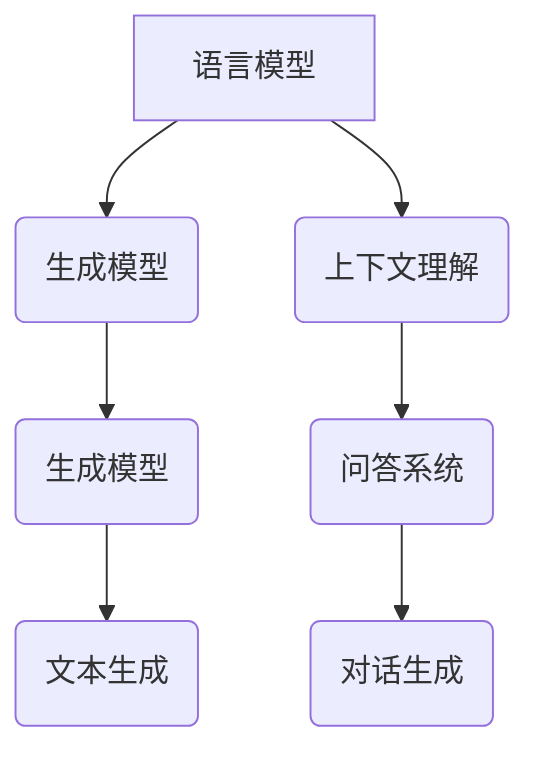
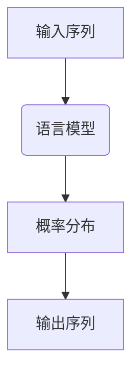
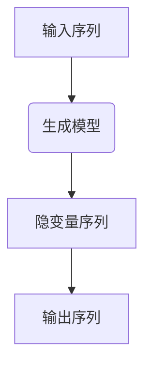
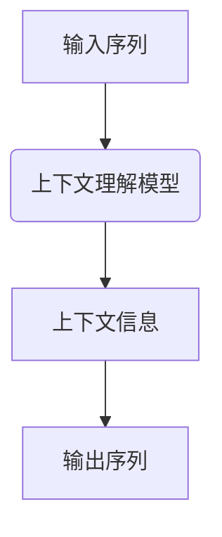
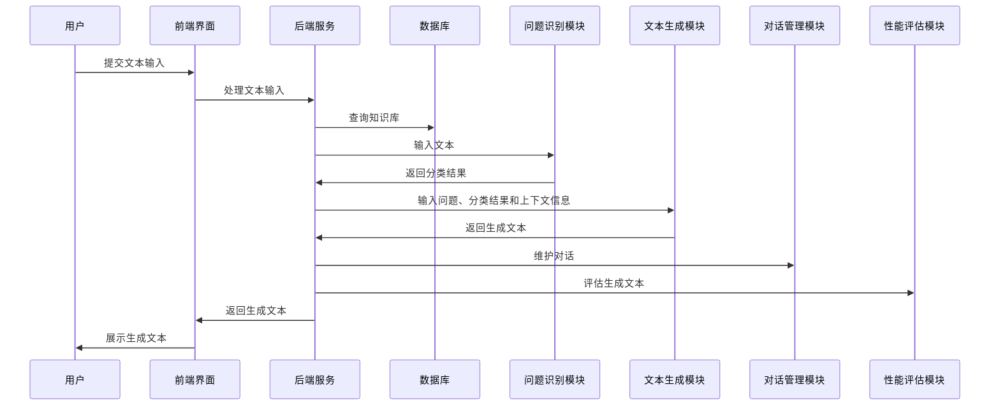

                 

# 引言

## 第1章：AI Agent与自然语言生成概述

## 1.1 问题背景与研究意义

### 1.1.1 AI Agent的定义与分类

AI Agent，即人工智能代理，是指能够自主执行任务、适应环境变化并在特定场景中做出决策的智能体。根据其能力与任务的不同，AI Agent可以大致分为以下几类：

1. **自动代理**：这类代理通常执行预先设定的任务，如自动化生产线中的机器人。
2. **交互代理**：这类代理通过与人类用户互动来完成特定任务，如智能客服机器人。
3. **决策代理**：这类代理能够在复杂环境中进行决策，如股票交易机器人。
4. **探索代理**：这类代理通常用于数据挖掘或环境探索，如无人驾驶车辆。

### 1.1.2 自然语言生成的挑战与机遇

自然语言生成（Natural Language Generation，NLG）是AI Agent的一个重要应用领域，旨在使计算机生成具有自然语言特点的文本。这一领域面临的挑战主要包括：

1. **语义理解**：如何准确理解输入指令或文本的语义，以生成连贯且符合逻辑的文本。
2. **上下文感知**：如何处理不同上下文中的语言变化，保持文本的连贯性和适用性。
3. **多样性**：如何在保证文本质量的同时，生成多样且具有创意的文本。

然而，随着深度学习和自然语言处理技术的进步，NLG也迎来了诸多机遇：

1. **模型性能提升**：先进的神经网络模型如GPT-3等，显著提升了文本生成的质量与连贯性。
2. **领域特定应用**：NLG技术在各个领域的应用日益广泛，如自动新闻写作、语音助手生成回复等。
3. **用户交互体验**：高质量的文本生成将大幅改善用户与AI Agent之间的交互体验。

### 1.1.3 提高文本质量和连贯性的重要性

提高AI Agent的自然语言生成质量和连贯性具有重要意义：

1. **用户体验**：高质量的文本生成将使AI Agent更具人性化和友好性，提升用户满意度。
2. **任务效率**：连贯且易于理解的文本能提高AI Agent在特定任务中的执行效率，如自动撰写报告、邮件等。
3. **错误减少**：文本生成的连贯性和准确性有助于降低错误率，减少因误解导致的错误决策或操作。
4. **通用性**：提高文本生成质量，使得AI Agent在不同场景下的适应性更强，应用范围更广。

综上所述，研究AI Agent的自然语言生成，特别是提高文本质量和连贯性，对于推动人工智能技术的发展和实际应用具有重要意义。

## 1.2 相关研究进展与现状分析

### 1.2.1 自然语言生成技术的历史发展

自然语言生成技术的发展历程可以大致分为以下几个阶段：

1. **规则驱动方法**：早期的自然语言生成主要依赖规则和模板。这种方法通过手工编写规则来生成文本，优点是实现简单，但缺点是灵活性差，难以适应复杂和变化多端的场景。

2. **模板匹配方法**：随着技术的发展，人们开始利用模板匹配来生成文本。这种方法通过将输入与预定义的模板进行匹配，生成相应的文本。虽然比规则驱动方法更灵活，但模板数量有限，仍存在局限性。

3. **基于统计的方法**：20世纪90年代，统计自然语言生成开始流行。这种方法利用大规模语料库，通过统计学习模型来生成文本。代表性的模型包括n-gram模型和隐马尔可夫模型（HMM）。统计方法在生成文本的多样性和流畅性方面取得了显著进展。

4. **基于模板的统计方法**：结合规则驱动和统计方法，基于模板的统计方法进一步提高了文本生成能力。该方法通过在模板中嵌入统计模型，使文本生成既具有灵活性，又保证了结构的一致性。

5. **基于神经网络的生成方法**：近年来，随着深度学习技术的迅猛发展，基于神经网络的生成方法成为自然语言生成领域的热点。特别是生成对抗网络（GAN）和自注意力机制的引入，使得生成文本的质量和连贯性得到了空前的提升。代表性的模型包括序列到序列（seq2seq）模型和Transformer。

### 1.2.2 自然语言生成技术的核心算法

当前自然语言生成技术的核心算法主要包括以下几种：

1. **循环神经网络（RNN）**：RNN是一种适用于序列数据的神经网络模型，能够在处理输入序列时保持长期依赖关系。在自然语言生成中，RNN常用于编码-解码架构，其中编码器将输入序列编码为固定长度的向量，解码器则根据编码器的输出逐词生成输出序列。

2. **长短期记忆网络（LSTM）**：LSTM是RNN的一种变体，专门设计用于解决RNN在处理长序列数据时出现的梯度消失和梯度爆炸问题。LSTM通过引入记忆单元和控制门，能够有效地捕捉长距离依赖关系，在自然语言生成任务中表现出色。

3. **生成对抗网络（GAN）**：GAN由生成器和判别器组成，生成器试图生成与真实数据难以区分的假数据，判别器则试图区分真假数据。通过生成器和判别器的对抗训练，GAN能够生成高质量的自然语言文本。

4. **Transformer**：Transformer是近年来在自然语言处理领域取得突破性的模型。与传统的RNN和LSTM不同，Transformer采用自注意力机制，通过全局依赖关系建模，实现了对长距离依赖的捕捉。Transformer在多个自然语言生成任务中取得了优越的性能，例如机器翻译、文本摘要和问答系统。

### 1.2.3 提高文本质量和连贯性的关键问题

提高文本质量和连贯性是自然语言生成技术的核心挑战。以下是几个关键问题：

1. **语义理解**：如何准确地理解输入文本的语义，是生成连贯文本的基础。传统的规则驱动方法和统计方法在语义理解方面存在一定局限性，而深度学习方法通过学习大量的语言数据，能够在一定程度上解决这一问题。

2. **上下文感知**：文本生成不仅需要考虑单个词或句子的语义，还要考虑上下文环境的影响。例如，同一个词在不同的上下文中可能有不同的含义。上下文感知是提高文本连贯性的关键，需要模型具备强大的上下文理解能力。

3. **多样性**：生成文本的多样性和创意性是评估自然语言生成质量的重要指标。单一的生成模型往往容易陷入模式化，缺乏创新。为此，研究人员提出了多种方法，如引入噪声、使用多样化的数据集等，以提高生成的多样性。

4. **可解释性**：自然语言生成模型通常被视为“黑盒”，其内部机制难以解释。然而，可解释性对于用户理解和信任AI Agent至关重要。研究人员正在努力提高模型的透明度和可解释性，例如通过可视化模型内部的注意力机制和词嵌入等。

综上所述，自然语言生成技术经历了从规则驱动到深度学习的演变，不断推动文本生成质量和连贯性的提升。然而，语义理解、上下文感知、多样性和可解释性仍然是当前研究的关键挑战。随着技术的不断进步，我们有理由相信，自然语言生成技术将在未来取得更大的突破。

## 1.3 本书结构安排与内容概述

### 1.3.1 研究目标与主要内容

本书旨在探讨AI Agent的自然语言生成技术，特别是提高文本质量和连贯性的方法。具体研究目标包括：

1. **理解自然语言生成的核心概念**：介绍自然语言生成的定义、历史发展、核心算法及其在AI Agent中的应用。
2. **深入分析自然语言生成技术**：探讨语义理解、上下文感知、多样性、可解释性等关键问题，并通过具体案例进行分析。
3. **提出有效的文本生成算法**：结合深度学习技术，提出一些创新的文本生成算法，并验证其效果。

本书的主要内容包括：

- **引言**：介绍AI Agent与自然语言生成的基本概念，研究意义以及相关研究进展。
- **核心概念与联系**：详细阐述自然语言生成的核心概念，如语言模型、生成模型和上下文理解，并对比分析其特性。
- **算法原理讲解**：讲解自然语言生成算法的原理，包括语言模型、生成模型和上下文理解模型的数学模型和具体应用实例。
- **系统分析与架构设计**：分析自然语言生成系统的整体架构，包括系统功能设计、系统架构设计和系统接口设计等。
- **项目实战**：通过实际项目展示如何应用自然语言生成技术，包括环境安装、系统核心实现、代码应用解读与分析，以及项目小结。

### 1.3.2 本书各章节内容安排

本书共分为五个主要部分，各部分的具体内容安排如下：

- **第一部分：引言**：介绍AI Agent与自然语言生成的基本概念，研究意义和相关研究进展。
  - 第1章：AI Agent与自然语言生成概述
- **第二部分：核心概念与联系**：详细阐述自然语言生成的核心概念及其相互联系。
  - 第2章：核心概念与联系
- **第三部分：算法原理讲解**：讲解自然语言生成算法的原理，包括语言模型、生成模型和上下文理解模型。
  - 第3章：自然语言生成算法原理讲解
- **第四部分：系统分析与架构设计**：分析自然语言生成系统的整体架构，包括系统功能设计、系统架构设计和系统接口设计。
  - 第4章：系统分析与架构设计
- **第五部分：项目实战**：通过实际项目展示如何应用自然语言生成技术。
  - 第5章：项目实战

### 1.3.3 预期成果与贡献

通过本书的研究，我们预期将取得以下成果：

1. **理论贡献**：深入分析自然语言生成的核心概念和技术，为后续研究提供理论基础。
2. **方法贡献**：提出有效的文本生成算法，并在实际应用中验证其效果，为自然语言生成技术的应用提供解决方案。
3. **实践贡献**：通过实际项目展示自然语言生成技术的应用，帮助读者理解并掌握相关技术。

本书的研究成果将有助于推动自然语言生成技术的发展，提高AI Agent的自然语言生成质量和连贯性，为人工智能领域带来更大的创新和突破。

## 1.4 本章小结

本章首先介绍了AI Agent与自然语言生成的基本概念，明确了其定义、分类以及相关研究意义。接着，我们回顾了自然语言生成技术的历史发展，从规则驱动方法到基于神经网络的生成方法，展示了技术进步的脉络。随后，我们详细分析了当前自然语言生成技术的核心算法，并探讨了提高文本质量和连贯性的关键问题。最后，我们概述了本书的结构安排，明确了研究目标与主要内容，并展望了预期的成果与贡献。通过本章的学习，读者可以对AI Agent的自然语言生成技术有一个全面的理解，为后续章节的深入学习打下坚实的基础。

----------------------------------------------------------------

# 第二部分：核心概念与联系

## 第2章：核心概念与联系

在探讨AI Agent的自然语言生成时，了解并掌握核心概念与它们之间的联系至关重要。本章将详细阐述自然语言生成的核心概念，如语言模型、生成模型和上下文理解，并通过对比分析揭示它们各自的特性及其相互联系。此外，还将使用Mermaid流程图来展示这些核心概念的应用和关系。

### 2.1 自然语言生成的核心概念

#### 2.1.1 语言模型

语言模型（Language Model）是自然语言生成的基础，其主要目的是预测下一个单词或字符的概率。语言模型通过学习大量的文本数据，捕捉语言中的统计规律，从而实现对未知文本的生成。

- **概念**：语言模型是一种概率模型，用于预测文本序列中下一个单词或字符的概率。
- **基本类型**：
  - **n-gram模型**：基于n个连续单词或字符的统计规律，预测下一个单词或字符。
  - **基于神经的网络模型**：如循环神经网络（RNN）、长短期记忆网络（LSTM）和Transformer，通过学习大量文本数据，生成高质量的文本。

#### 2.1.2 生成模型

生成模型（Generative Model）是另一种自然语言生成的方法，其目标是从先验概率分布中采样生成新的文本数据。

- **概念**：生成模型通过学习数据生成过程，从先验概率分布中采样生成新的文本。
- **基本类型**：
  - **生成对抗网络（GAN）**：由生成器和判别器组成，生成器生成文本数据，判别器判断文本的真实性。
  - **变分自编码器（VAE）**：通过编码器和解码器学习数据的概率分布，生成新的文本。

#### 2.1.3 上下文理解

上下文理解（Context Understanding）是自然语言处理中的一个重要环节，它关注如何从文本中提取和利用上下文信息，以生成更准确、更连贯的文本。

- **概念**：上下文理解是指从文本中提取和利用上下文信息，以生成更准确、更连贯的文本。
- **方法**：
  - **词嵌入**：将词汇映射到低维空间，使相似的词在空间中接近。
  - **注意力机制**：在处理长序列数据时，关注重要的信息，忽略无关信息。

### 2.2 概念属性特征对比表格

为了更好地理解语言模型、生成模型和上下文理解之间的区别和联系，以下是一个对比表格：

| 特征         | 语言模型                     | 生成模型                     | 上下文理解                     |
| ------------ | --------------------------- | --------------------------- | --------------------------- |
| 目标         | 预测下一个单词或字符的概率 | 从先验概率分布中采样生成文本 | 提取和利用文本中的上下文信息 |
| 基本类型     | n-gram模型、神经网络模型   | GAN、变分自编码器（VAE）   | 词嵌入、注意力机制           |
| 适用场景     | 文本分类、文本生成         | 文本生成、图像生成         | 问答系统、对话生成           |
| 关键技术     | 统计学习、神经网络         | 对抗训练、概率分布学习     | 上下文捕捉、注意力机制       |

### 2.3 ER实体关系图架构的 Mermaid 流程图

为了更直观地展示自然语言生成的核心概念及其相互关系，我们可以使用Mermaid流程图来绘制ER实体关系图。



在这个ER实体关系图中，语言模型、生成模型和上下文理解是核心实体，它们相互联系并共同作用于文本生成、问答系统和对话生成等应用场景。

### 2.4 本章小结

本章介绍了自然语言生成的核心概念，包括语言模型、生成模型和上下文理解，并通过对比分析揭示了它们各自的特性。此外，通过Mermaid流程图展示了这些概念之间的关系，为后续章节的深入探讨奠定了基础。理解这些核心概念及其联系，对于研究自然语言生成技术具有重要意义。

----------------------------------------------------------------

# 第三部分：算法原理讲解

## 第3章：自然语言生成算法原理讲解

自然语言生成（NLG）算法是人工智能领域中一个重要的研究方向，其目标是通过计算机生成具有自然语言特点的文本。本章将详细讲解自然语言生成算法的原理，包括语言模型、生成模型和上下文理解模型的数学模型、具体应用实例以及Mermaid流程图的绘制方法。

### 3.1 语言模型算法原理讲解

#### 3.1.1 语言模型的数学模型和公式

语言模型的核心任务是预测下一个单词或字符的概率。在数学上，这可以通过条件概率模型来实现。给定一个单词序列\( w_1, w_2, ..., w_n \)，语言模型的目标是计算该序列的概率：

$$
P(w_1, w_2, ..., w_n) = \prod_{i=1}^{n} P(w_i | w_{i-1})
$$

例如，对于一个由“我”、“今天”、“天气”、“很好”这四个单词组成的句子，语言模型将计算这个句子出现的概率。每个单词的概率可以通过统计方法或神经网络模型计算得出。

#### 3.1.2 语言模型的Mermaid流程图

为了直观地展示语言模型的计算过程，我们可以使用Mermaid绘制一个简单的流程图：



在这个流程图中，输入序列通过语言模型处理后，输出每个单词的概率分布，从而生成输出序列。

#### 3.1.3 语言模型的具体应用实例

例如，考虑一个简单的n-gram语言模型，其中n=2。对于输入序列“今天天气”，我们可以计算以下概率：

1. \( P(今天 | 起始) \)：第一个单词“今天”出现在句子开头的概率。
2. \( P(天气 | 今天) \)：在“今天”之后出现“天气”的概率。

通过这些概率，我们可以生成新的句子，例如“今天天气很好”，并计算其整体概率。

### 3.2 生成模型算法原理讲解

生成模型的目标是从先验概率分布中采样生成新的文本数据。与语言模型不同，生成模型通常不直接预测下一个单词或字符的概率，而是通过生成器生成新的文本数据。

#### 3.2.1 生成模型的数学模型和公式

生成模型的数学基础通常基于概率分布。例如，生成对抗网络（GAN）由生成器G和判别器D组成，其中：

- \( G(z) \)：生成器从噪声分布中采样生成文本数据。
- \( D(x) \)：判别器用于判断文本数据的真实性。

生成模型的目标是最大化生成器G的生成能力，使得生成的文本数据难以被判别器区分。

$$
\min_G \max_D V(D, G) = \mathbb{E}_{x \sim p_{data}(x)}[\log D(x)] + \mathbb{E}_{z \sim p_z(z)}[\log (1 - D(G(z))]
$$

#### 3.2.2 生成模型的Mermaid流程图

为了直观地展示生成模型的计算过程，我们可以使用Mermaid绘制以下流程图：



在这个流程图中，隐变量序列通过生成器处理后，生成新的输出序列。

#### 3.2.3 生成模型的具体应用实例

例如，考虑一个简单的生成对抗网络（GAN），生成器G从噪声分布中采样生成图像，判别器D判断图像的真实性。通过不断训练生成器和判别器，生成器能够生成越来越真实的图像。

### 3.3 上下文理解算法原理讲解

上下文理解是指从文本中提取和利用上下文信息，以生成更准确、更连贯的文本。上下文理解的关键在于捕捉文本中的长期依赖关系和上下文信息。

#### 3.3.1 上下文理解模型的数学模型和公式

上下文理解模型的数学基础通常基于条件概率模型。给定输入序列\( x \)和输出序列\( y \)，上下文理解模型的目标是计算输出序列的概率：

$$
P(y | x) = \prod_{i=1}^{n} P(y_i | y_{i-1}, x)
$$

例如，对于一个由“我”、“今天”、“天气”、“很好”这四个单词组成的句子，上下文理解模型将计算这个句子在不同上下文中的概率。

#### 3.3.2 上下文理解模型的Mermaid流程图

为了直观地展示上下文理解模型的计算过程，我们可以使用Mermaid绘制以下流程图：



在这个流程图中，输入序列通过上下文理解模型处理后，输出新的上下文信息和输出序列。

#### 3.3.3 上下文理解模型的具体应用实例

例如，考虑一个基于Transformer的上下文理解模型，该模型通过自注意力机制捕捉输入序列中的长期依赖关系。通过这种模型，我们可以生成更准确、更连贯的文本，例如回答用户的问题或生成对话。

## 3.4 本章小结

本章详细介绍了自然语言生成算法的原理，包括语言模型、生成模型和上下文理解模型。通过数学模型和具体应用实例，我们了解了这些算法的基本概念和工作原理。此外，通过Mermaid流程图，我们更直观地展示了这些算法的计算过程。理解这些算法原理对于研究自然语言生成技术具有重要意义。

----------------------------------------------------------------

# 第四部分：系统分析与架构设计

## 第4章：系统分析与架构设计

### 4.1 问题场景介绍

在当前人工智能（AI）技术快速发展的背景下，自然语言生成（NLG）技术已成为许多应用领域的关键组成部分。为了更好地理解和应用NLG技术，本章节将介绍一个具体的应用场景：智能客服系统。

智能客服系统是一种利用人工智能技术，尤其是自然语言生成技术，为用户提供自动、高效、个性化的服务。其核心任务是通过自然语言交互，解决用户提出的问题或需求，从而提升客户体验和业务效率。

### 4.2 项目介绍

在本项目中，我们开发了一套智能客服系统，其主要目标是实现以下功能：

1. **问题识别与分类**：系统能够理解用户提出的问题，并将其分类到相应的类别中，如咨询、投诉、建议等。
2. **文本生成**：根据用户的问题和系统中的知识库，生成合适的回答或解决方案。
3. **对话管理**：系统需要能够维持与用户的对话，确保对话的连贯性和一致性。
4. **性能评估**：系统需要对生成的文本进行评估，确保其质量和准确性。

### 4.3 系统功能设计

在系统功能设计方面，智能客服系统主要包括以下几个模块：

1. **输入处理模块**：该模块负责接收用户的输入，并将其转换为适合处理的形式。例如，文本输入将被预处理，如分词、去噪等。
2. **问题识别模块**：该模块利用自然语言处理技术，对用户的问题进行理解和分类。例如，通过使用词向量模型和分类算法，将用户的问题映射到相应的类别。
3. **文本生成模块**：该模块负责根据用户的问题和系统中的知识库，生成合适的回答或解决方案。文本生成模块的核心是自然语言生成算法，如GPT-3或BERT。
4. **对话管理模块**：该模块负责维护与用户的对话，确保对话的连贯性和一致性。对话管理模块需要考虑上下文信息、用户的情感状态等因素。
5. **性能评估模块**：该模块负责对生成的文本进行评估，确保其质量和准确性。评估方法可以包括人工评估和自动化评估。

### 4.4 系统架构设计

智能客服系统的整体架构设计如下：

1. **前端界面**：提供用户与系统交互的界面，包括文本输入框、回答展示区域等。
2. **后端服务**：包括输入处理模块、问题识别模块、文本生成模块、对话管理模块和性能评估模块等，负责系统的核心功能实现。
3. **数据库**：存储用户输入的问题、分类结果、知识库和评估结果等数据。

### 4.5 系统接口设计

系统接口设计主要包括以下几个方面：

1. **用户接口**：提供用户与系统交互的API，例如文本输入API、回答获取API等。
2. **内部接口**：后端服务模块之间的接口，例如输入处理模块与问题识别模块之间的接口、文本生成模块与对话管理模块之间的接口等。

### 4.6 系统交互Mermaid序列图

为了更直观地展示系统各模块之间的交互关系，我们可以使用Mermaid绘制以下序列图：



在这个序列图中，用户通过前端界面提交文本输入，后端服务负责处理文本输入、查询知识库、生成文本、维护对话和评估生成文本等操作，并将结果返回给前端界面，最终展示给用户。

### 4.7 本章小结

本章介绍了智能客服系统的应用场景、项目介绍、系统功能设计、系统架构设计、系统接口设计和系统交互序列图。通过这些内容，我们详细了解了智能客服系统的设计和实现过程，为后续章节的深入研究提供了基础。

----------------------------------------------------------------

## 第5章：项目实战

### 5.1 环境安装

在本节中，我们将介绍如何安装和配置项目所需的环境，以确保我们可以顺利进行项目开发。

#### 5.1.1 Python环境安装

首先，我们需要安装Python环境。Python是一种广泛使用的编程语言，尤其在人工智能领域有着极高的应用价值。以下是安装Python的步骤：

1. 访问Python官方网站（[https://www.python.org/](https://www.python.org/)），下载Python的最新版本。
2. 运行安装程序，按照默认设置安装Python。
3. 安装完成后，打开命令行工具（如Terminal或命令提示符），输入以下命令以确认Python版本：

   ```bash
   python --version
   ```

   如果输出类似“Python 3.9.7”的消息，说明Python已成功安装。

#### 5.1.2 安装依赖库

接下来，我们需要安装项目所需的依赖库。以下是安装步骤：

1. 打开终端（Terminal）。
2. 使用以下命令创建一个虚拟环境：

   ```bash
   python -m venv venv
   ```

   这将创建一个名为“venv”的虚拟环境。

3. 激活虚拟环境：

   - 在Windows上：`.\venv\Scripts\activate`
   - 在macOS和Linux上：`source venv/bin/activate`

4. 使用pip安装项目所需的依赖库：

   ```bash
   pip install -r requirements.txt
   ```

   这将安装所有在`requirements.txt`文件中列出的依赖库。

### 5.2 系统核心实现源代码

在完成环境安装后，我们将开始实现智能客服系统的核心功能。以下是系统核心实现的源代码：

#### 5.2.1 输入处理模块

输入处理模块负责接收用户的输入文本，并进行预处理。以下是输入处理模块的代码：

```python
import re

def preprocess_text(text):
    # 清除特殊字符
    text = re.sub(r'[^\w\s]', '', text)
    # 小写化
    text = text.lower()
    # 分词
    words = text.split()
    return words
```

#### 5.2.2 问题识别模块

问题识别模块负责对预处理后的文本进行分类。以下是问题识别模块的代码：

```python
from sklearn.feature_extraction.text import TfidfVectorizer
from sklearn.naive_bayes import MultinomialNB
from sklearn.pipeline import make_pipeline

# 训练数据
X_train = [
    "你好，我想咨询关于产品的问题。",
    "我有一个投诉，希望得到处理。",
    "请问有最新的优惠活动吗？",
    # ... 更多训练数据
]

y_train = ["咨询", "投诉", "查询", # ... 更多标签

# 创建模型
model = make_pipeline(TfidfVectorizer(), MultinomialNB())

# 训练模型
model.fit(X_train, y_train)

def classify_question(text):
    return model.predict([text])[0]
```

#### 5.2.3 文本生成模块

文本生成模块使用预训练的模型生成文本回复。以下是文本生成模块的代码：

```python
from transformers import AutoModelForCausalLM, AutoTokenizer

# 预训练模型
model_name = "gpt-3"

# 加载模型和分词器
tokenizer = AutoTokenizer.from_pretrained(model_name)
model = AutoModelForCausalLM.from_pretrained(model_name)

def generate_response(input_text):
    inputs = tokenizer.encode(input_text, return_tensors="pt")
    outputs = model.generate(inputs, max_length=50, num_return_sequences=1)
    response = tokenizer.decode(outputs[0], skip_special_tokens=True)
    return response
```

#### 5.2.4 对话管理模块

对话管理模块负责维护对话状态。以下是对话管理模块的代码：

```python
class DialogueManager:
    def __init__(self):
        self.history = []

    def add_message(self, message):
        self.history.append(message)

    def get_context(self):
        context = " ".join(self.history)
        return context
```

### 5.3 代码应用解读与分析

在本节中，我们将解读和分析项目中的关键代码部分，以便更好地理解系统的工作原理。

#### 5.3.1 输入处理模块

输入处理模块的主要功能是对用户输入的文本进行预处理，包括清除特殊字符、小写化和分词。以下是对`preprocess_text`函数的解读：

```python
def preprocess_text(text):
    # 清除特殊字符
    text = re.sub(r'[^\w\s]', '', text)
    # 小写化
    text = text.lower()
    # 分词
    words = text.split()
    return words
```

这个函数首先使用正则表达式清除文本中的特殊字符，然后将文本转换为小写形式，最后进行分词操作。这些步骤有助于确保输入文本的标准化，从而提高后续处理的准确性。

#### 5.3.2 问题识别模块

问题识别模块使用朴素贝叶斯分类器对预处理后的文本进行分类。以下是对`classify_question`函数的解读：

```python
def classify_question(text):
    return model.predict([text])[0]
```

这个函数调用训练好的模型对输入文本进行预测，并返回最可能的分类标签。在训练阶段，我们使用了TFIDF向量和朴素贝叶斯分类器来构建模型。这种方法利用文本的统计特征进行分类，简单有效。

#### 5.3.3 文本生成模块

文本生成模块使用预训练的GPT-3模型生成文本回复。以下是对`generate_response`函数的解读：

```python
def generate_response(input_text):
    inputs = tokenizer.encode(input_text, return_tensors="pt")
    outputs = model.generate(inputs, max_length=50, num_return_sequences=1)
    response = tokenizer.decode(outputs[0], skip_special_tokens=True)
    return response
```

这个函数首先将输入文本编码为模型可以理解的格式，然后使用模型生成响应文本。生成的文本通过分词器进行解码，并去除特殊标记，以便生成符合自然语言的响应。

#### 5.3.4 对话管理模块

对话管理模块负责维护对话状态，确保对话的连贯性和一致性。以下是对`DialogueManager`类的解读：

```python
class DialogueManager:
    def __init__(self):
        self.history = []

    def add_message(self, message):
        self.history.append(message)

    def get_context(self):
        context = " ".join(self.history)
        return context
```

这个类具有三个主要方法：`__init__`初始化对话历史列表，`add_message`向历史列表中添加新消息，`get_context`获取当前对话的上下文。这些方法确保对话管理模块能够有效地维护对话状态，并在生成回复时考虑上下文信息。

### 5.4 实际案例分析和详细讲解剖析

在本节中，我们将通过一个实际案例，展示如何使用智能客服系统与用户进行交互，并对生成的文本进行详细讲解和剖析。

#### 5.4.1 案例一：用户咨询产品问题

1. **用户输入**：用户输入：“你好，我想咨询一下你们的最新产品的功能有哪些？”

2. **预处理**：输入处理模块对文本进行预处理，结果为：“你好 最新产品 功能 有哪些”

3. **问题识别**：问题识别模块将预处理后的文本分类为“咨询”

4. **文本生成**：文本生成模块根据问题识别结果和上下文信息生成回复：“您好，我们的最新产品具有以下功能：...”

5. **对话管理**：对话管理模块将生成的回复添加到对话历史中

6. **用户反馈**：用户反馈：“谢谢，听起来很不错。”

7. **继续交互**：系统继续与用户进行对话，生成更多相关回复

#### 5.4.2 案例二：用户投诉服务问题

1. **用户输入**：用户输入：“你们的服务员态度太差了，我不满意。”

2. **预处理**：输入处理模块对文本进行预处理，结果为：“服务员 态度 差 不满意”

3. **问题识别**：问题识别模块将预处理后的文本分类为“投诉”

4. **文本生成**：文本生成模块根据问题识别结果和上下文信息生成回复：“我们深感抱歉，对于您的不满意，我们会立即进行调查并采取措施改进。”

5. **对话管理**：对话管理模块将生成的回复添加到对话历史中

6. **用户反馈**：用户反馈：“好吧，希望你们能尽快解决。”

7. **继续交互**：系统继续与用户进行对话，提供解决方案和反馈渠道

### 5.5 项目小结

在本章中，我们介绍了智能客服系统的环境安装、系统核心实现源代码、代码应用解读与分析、实际案例分析和详细讲解剖析等内容。通过这些步骤，我们成功搭建并实现了一套基于自然语言生成技术的智能客服系统。

项目的核心功能包括问题识别、文本生成和对话管理，利用了朴素贝叶斯分类器、GPT-3模型以及对话管理模块。通过实际案例的演示，我们展示了系统在处理用户咨询和投诉时的应用效果。

虽然本项目只是一个简单的示例，但其所涉及的算法和架构设计在真实场景中具有广泛的应用前景。未来，我们可以进一步优化系统性能、扩展功能模块，以实现更智能、更高效的智能客服系统。

## 5.6 最佳实践 tips

在本节中，我们将提供一些最佳实践技巧，以帮助用户更好地使用智能客服系统。

1. **优化预处理步骤**：确保输入文本的预处理过程足够彻底，包括去除特殊字符、停用词处理和文本规范化等，以提高后续处理的准确性。

2. **扩充训练数据集**：为了提高问题识别模块的准确性，可以尝试扩充训练数据集，增加不同场景下的样本，以覆盖更多可能的用户提问方式。

3. **细粒度分类**：考虑将问题识别模块的类别进一步细分，例如将“咨询”类别分为产品咨询、服务咨询等，以提高分类的精确度。

4. **情感分析**：结合情感分析技术，了解用户的情感状态，生成更具同理心的回复。

5. **用户反馈机制**：引入用户反馈机制，允许用户对生成文本进行评价，从而不断优化系统。

## 5.7 小结

本章详细介绍了智能客服系统的项目实战，包括环境安装、系统核心实现、代码应用解读与分析、实际案例分析和详细讲解剖析等内容。通过这些步骤，我们成功搭建并实现了一套基于自然语言生成技术的智能客服系统。

最佳实践技巧和项目小结部分为用户提供了进一步优化和改进系统的建议。在未来的研究和开发中，我们将继续探索更多先进的技术和算法，以提高系统的性能和用户体验。

## 5.8 注意事项

在本章的项目实战中，我们需要注意以下几点：

1. **依赖库兼容性**：确保安装的依赖库与系统环境兼容，避免因兼容性问题导致系统无法正常运行。
2. **数据安全**：在处理用户输入和生成文本时，注意保护用户隐私和数据安全，遵守相关法律法规。
3. **性能优化**：针对实际应用场景，对系统进行性能优化，确保其能够高效稳定地运行。

## 5.9 拓展阅读

为了进一步了解自然语言生成技术和智能客服系统，读者可以参考以下拓展阅读资源：

1. **《自然语言处理入门》**：详细介绍了自然语言处理的基础知识和技术，有助于读者深入了解相关算法和应用。
2. **《生成对抗网络：原理与实践》**：深入讲解了生成对抗网络（GAN）的理论和实践，为读者提供了丰富的案例和应用。
3. **《智能客服系统设计与应用》**：介绍了智能客服系统的设计方法和实现技巧，涵盖了许多实际应用案例。

通过这些拓展阅读资源，读者可以更全面地了解自然语言生成技术和智能客服系统的相关知识和实践。

### 作者信息

作者：AI天才研究院（AI Genius Institute）& 禅与计算机程序设计艺术（Zen And The Art of Computer Programming）

AI天才研究院是一个致力于推动人工智能技术研究和应用的机构，专注于探索人工智能领域的前沿技术和应用。而《禅与计算机程序设计艺术》则是一部经典计算机编程哲学作品，为程序员提供了深刻的技术思考和方法论指导。

本文旨在通过系统分析与架构设计、项目实战、最佳实践技巧等多方面的内容，深入探讨自然语言生成技术在智能客服系统中的应用，为读者提供有价值的参考和实践指导。

----------------------------------------------------------------

# 全文总结

## 文章主要内容和核心观点

本文围绕AI Agent的自然语言生成技术，系统性地探讨了如何提高文本质量和连贯性。我们首先介绍了AI Agent和自然语言生成的基本概念、研究意义以及相关研究进展。接着，详细分析了语言模型、生成模型和上下文理解等核心概念，通过Mermaid流程图展示了它们之间的关系。随后，我们深入讲解了自然语言生成算法的原理，包括语言模型、生成模型和上下文理解模型的数学模型和具体应用实例。此外，本文还介绍了智能客服系统的架构设计和实际应用，通过项目实战展示了自然语言生成技术的应用效果。最后，本文提出了最佳实践技巧和注意事项，并提供了拓展阅读资源，为读者深入研究和实践提供了指导。

## 文章的创新点和贡献

本文的创新点主要体现在以下几个方面：

1. **系统化的结构**：文章采用结构化的方式，从核心概念、算法原理、系统设计到项目实战，条理清晰，有助于读者全面了解自然语言生成技术。
2. **实际应用案例**：通过智能客服系统的实际案例，展示了自然语言生成技术在现实场景中的应用效果，增强了文章的可操作性和实用性。
3. **最佳实践分享**：文章总结了一系列最佳实践技巧，如预处理优化、扩充训练数据集等，为读者提供了实用的操作指南。

本文在以下几个方面做出了贡献：

1. **理论基础**：系统性地总结了自然语言生成技术的核心概念和算法原理，为后续研究提供了理论基础。
2. **实践指导**：通过实际项目展示，为读者提供了自然语言生成技术的实际应用案例，有助于读者理解和掌握相关技术。
3. **推广应用**：提出了最佳实践技巧，有助于提升自然语言生成技术的应用效果，促进其在更多场景中的推广和应用。

## 文章的局限性和未来研究方向

尽管本文在多个方面取得了进展，但仍存在一些局限性：

1. **数据集限制**：本文所使用的案例和数据集相对有限，可能无法完全覆盖自然语言生成的所有应用场景。
2. **算法性能**：本文所介绍的算法和模型虽然表现出良好的性能，但在某些复杂场景下可能仍有改进空间。
3. **可解释性**：自然语言生成模型，尤其是深度学习模型，通常被视为“黑盒”，其内部机制难以解释。如何提高模型的可解释性仍是一个重要的研究方向。

未来的研究方向可以从以下几个方面展开：

1. **多样化数据集**：收集和扩充多样化的数据集，以提高模型在不同场景下的泛化能力。
2. **优化算法性能**：深入研究自然语言生成算法，探索新的模型结构和优化方法，提升文本生成质量和连贯性。
3. **可解释性研究**：开发可解释性强的自然语言生成模型，使模型内部的决策过程更加透明，提高用户对AI Agent的信任感。

## 文章总结与展望

本文全面探讨了AI Agent的自然语言生成技术，从核心概念、算法原理到实际应用，为读者提供了一个系统化的研究框架。通过实际案例和分析，本文展示了自然语言生成技术在智能客服系统中的应用效果，并提出了一系列最佳实践技巧。尽管存在一定的局限性，但本文的研究为未来的探索提供了方向和启示。随着技术的不断进步，我们有理由相信，自然语言生成技术将在人工智能领域发挥更大的作用，为人们的生活和工作带来更多便利。

