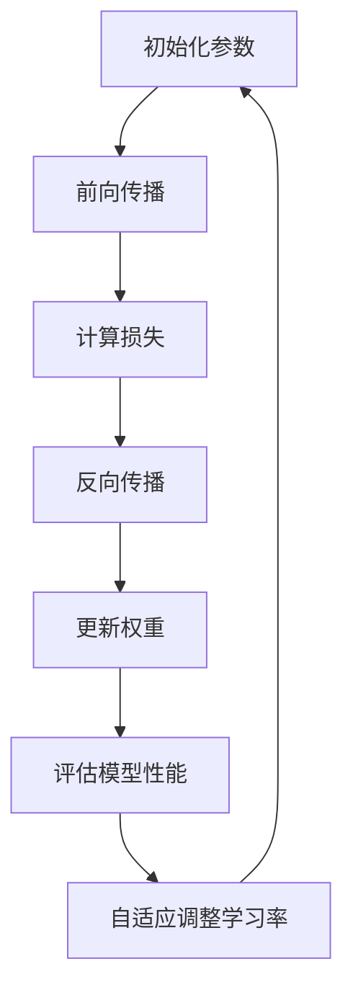

                 

### 设计《AI Agent的自适应学习率：优化训练过程》的目录大纲

**目录大纲**

---

#### 一、背景介绍

##### 1.1 问题背景

- **传统学习率的局限性**  
  传统学习率设置方法在训练复杂模型时往往难以取得理想的效果，尤其是在面对大规模数据集和深度神经网络时。

##### 1.2 问题描述

- **自适应学习率的需求**  
  设计一种自适应学习率的方法，使AI Agent能够自动调整学习率，以适应不同阶段和任务需求。

##### 1.3 问题解决

- **自适应学习率的实现**  
  通过动态调整学习率，实现训练过程中的自我优化，提高模型训练效率和性能。

##### 1.4 边界与外延

- **应用范围**  
  自适应学习率方法适用于深度学习、强化学习等多个机器学习领域。

##### 1.5 概念结构与核心要素组成

- **核心概念**  
  自适应学习率策略、学习率调整机制、模型训练过程。

---

#### 二、核心概念与联系

##### 2.1 核心概念原理

- **学习率**  
  调整模型参数的步长，直接影响训练速度和模型收敛性。

- **自适应学习率**  
  根据模型性能动态调整学习率的方法。

##### 2.2 概念属性特征对比表格

| **传统学习率** | **自适应学习率** |
|----------------|------------------|
| **固定学习率** | **动态调整** |
| **不易适应** | **适应性强** |
| **可能导致过拟合** | **调整学习率，防止过拟合** |

##### 2.3 ER实体关系图架构

- **实体**：AI Agent、学习率、训练过程
- **关系**：AI Agent调整学习率以优化训练过程

---

#### 三、算法原理讲解

##### 3.1 算法原理的Mermaid流程图



##### 3.2 Python源代码

```python
def adaptive_learning_rate(loss_history, threshold=0.01):
    if np.mean(loss_history) < threshold:
        return learning_rate * 0.1
    else:
        return learning_rate

for epoch in range(num_epochs):
    loss = forward_propagation()
    backward_propagation(loss)
    learning_rate = adaptive_learning_rate(loss_history)
    update_weights(learning_rate)
```

##### 3.3 算法原理的数学模型和公式

- **学习率更新公式**：  
  $$ \text{learning\_rate}_{\text{new}} = \text{learning\_rate}_{\text{current}} \times \text{factor} $$

- **自适应调整条件**：  
  $$ \text{if} \quad \frac{\text{mean}(loss\_history)}{\text{threshold}} < 1 \quad \text{then} \quad \text{learning\_rate}_{\text{new}} = \text{learning\_rate}_{\text{current}} \times 0.1 $$
  $$ \text{else} \quad \text{learning\_rate}_{\text{new}} = \text{learning\_rate}_{\text{current}} $$

---

#### 四、系统分析与架构设计方案

##### 4.1 问题场景介绍

- **AI Agent训练场景**  
  在实际应用中，AI Agent的训练过程复杂且耗时，需要高效的自适应学习率策略来优化训练过程。

##### 4.2 项目介绍

- **项目名称**：AI Agent自适应学习率优化系统

##### 4.3 系统功能设计

- **领域模型**：定义AI Agent、学习率、训练过程等核心概念。

##### 4.4 系统架构设计

- **架构图**：展示系统的整体架构，包括数据输入、模型训练、学习率调整等模块。

##### 4.5 系统接口设计

- **接口定义**：定义系统各个模块的输入输出接口，确保系统各部分协同工作。

##### 4.6 系统交互

- **序列图**：展示系统各个模块的交互过程，包括数据流和控制流。

---

#### 五、项目实战

##### 5.1 环境安装

- **安装依赖**：安装Python环境及必要的机器学习库。

##### 5.2 系统核心实现

- **核心代码**：实现自适应学习率策略的具体算法。

##### 5.3 代码应用解读与分析

- **代码解读**：分析核心代码的实现逻辑。

##### 5.4 实际案例分析

- **案例背景**：介绍实际应用场景。

- **案例解析**：详细讲解案例中的应用。

##### 5.5 项目小结

- **经验总结**：总结项目实施过程中的经验和教训。

---

#### 六、最佳实践 Tips

- **调试技巧**：提供调试自适应学习率策略的技巧。

- **性能优化**：介绍如何优化系统性能。

---

#### 七、小结

- **核心观点总结**：回顾文章中的核心观点。

- **实际应用价值**：阐述自适应学习率策略在AI Agent训练中的应用价值。

---

#### 八、注意事项

- **风险因素**：提醒使用自适应学习率策略时需要注意的风险。

- **实施步骤**：介绍如何在实际项目中实施自适应学习率策略。

---

#### 九、拓展阅读

- **相关论文**：推荐相关领域的研究论文。

- **参考资料**：提供相关的书籍、网站等参考资料。

---

**文章标题**：《AI Agent的自适应学习率：优化训练过程》

**关键词**：自适应学习率、AI Agent、模型训练、优化策略、机器学习

**摘要**：本文介绍了AI Agent的自适应学习率方法，详细分析了其原理和实现，并通过项目实战展示了其在实际应用中的效果。通过自适应学习率策略，可以有效优化模型训练过程，提高训练效率和性能。本文旨在为机器学习研究者提供有价值的参考和指导。

