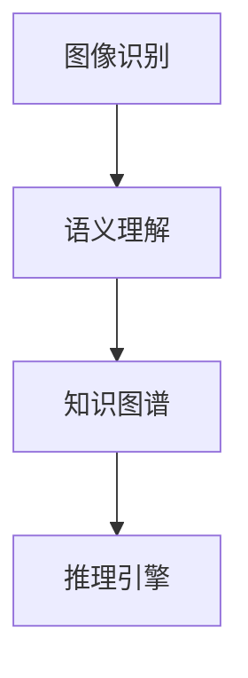
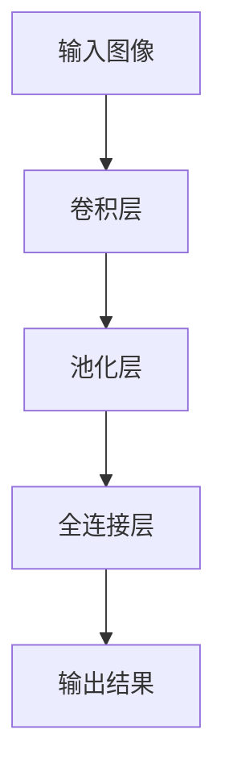
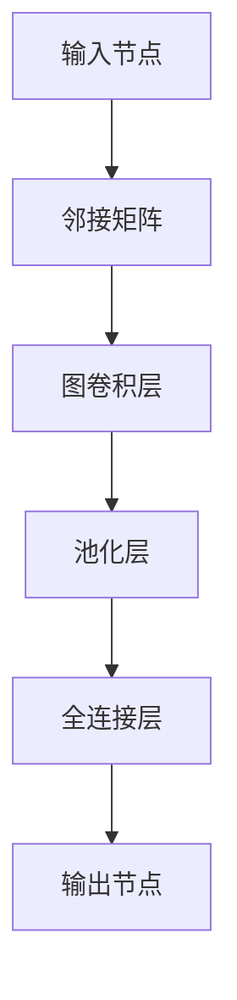
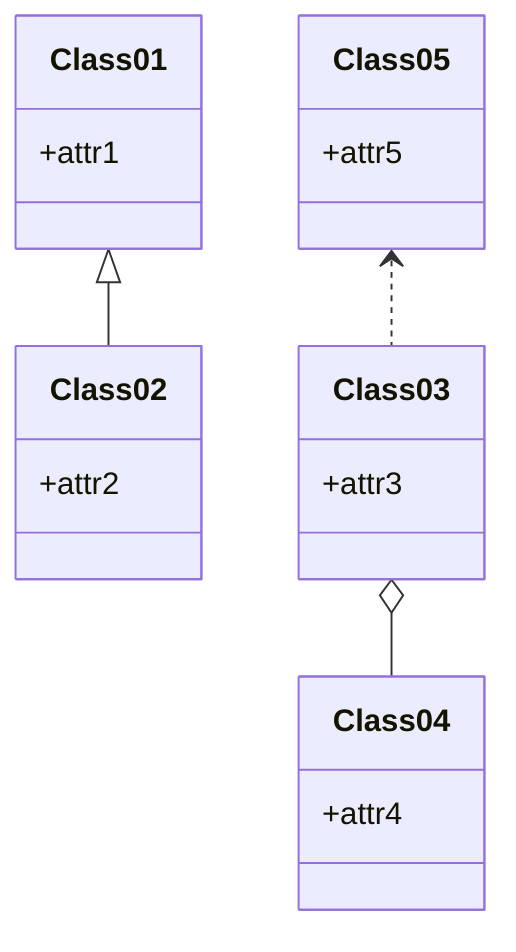
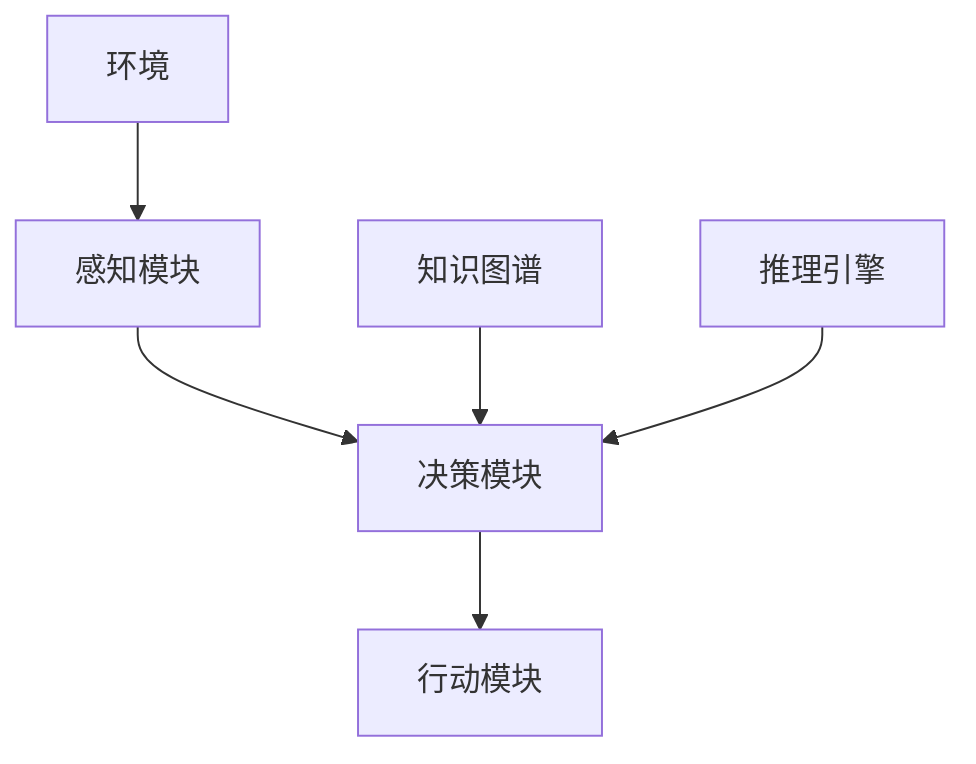
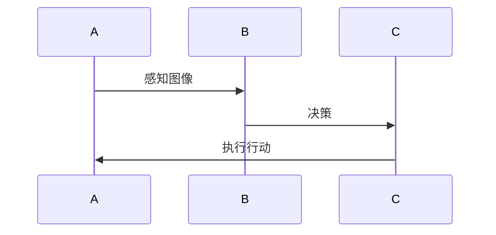

                 


# AI Agent的视觉常识推理能力开发

关键词：AI Agent、视觉常识推理、算法、系统架构、项目实战

摘要：本文旨在探讨AI Agent的视觉常识推理能力开发，包括背景介绍、核心概念与联系、算法原理与实现、系统架构与实现、项目实战与最佳实践等内容。通过一步步分析推理，本文将帮助读者深入了解AI Agent视觉常识推理的原理和实现方法。

## 第一部分: 背景介绍与核心概念

### 1.1 人工智能与视觉常识推理概述

人工智能（AI）作为计算机科学的一个重要分支，已经经历了数十年的发展。从最初的规则推理和知识表示，到现代的机器学习和深度学习，人工智能在图像识别、自然语言处理、决策支持等领域取得了显著成果。其中，视觉常识推理是人工智能研究的一个重要方向。

视觉常识推理是指AI Agent在处理图像时，根据已有的知识库和经验，对图像中的对象、场景、动作等进行合理推断和解释。这一能力对于AI Agent在现实世界中的应用具有重要意义，如自动驾驶、智能监控、医疗诊断等。

### 1.2 视觉常识推理的核心概念与联系

为了实现视觉常识推理，我们需要了解以下几个核心概念：

- **图像识别**：从图像中识别出特定的对象、场景或动作。
- **语义理解**：对图像中的对象、场景、动作等进行语义分析，理解其含义。
- **知识图谱**：构建图像中的对象、场景、动作之间的关系，形成知识图谱。
- **推理引擎**：基于知识图谱和语义理解，对图像中的对象、场景、动作等进行推理。

这些核心概念之间存在紧密的联系，如图1.1所示：



### 1.3 AI Agent的基本概念

AI Agent是一种具有自主决策能力和行动能力的智能体，它可以与环境进行交互，并根据环境反馈调整自身行为。在视觉常识推理领域，AI Agent通常由感知模块、决策模块和行动模块组成。

感知模块负责获取和处理图像信息；决策模块基于感知模块的输入，利用知识图谱和推理引擎进行推理，生成行动决策；行动模块则根据决策模块的输出，执行相应的动作。

## 第二部分: 算法原理与实现

### 2.1 常见视觉常识推理算法

视觉常识推理算法主要包括基于传统机器学习和深度学习的算法。以下介绍两种常见的算法：

- **卷积神经网络（CNN）**：CNN是一种深层神经网络，主要用于图像识别和分类。通过多层卷积和池化操作，CNN能够自动学习图像中的特征。

- **图神经网络（GNN）**：GNN是一种基于图结构的神经网络，能够处理具有复杂关系的图像。GNN通过将图像中的对象、场景、动作等表示为图节点，利用图节点之间的邻接关系进行推理。

### 2.2 算法原理与实现

#### 2.2.1 卷积神经网络（CNN）

CNN的算法原理如图2.1所示：



以下是一个简单的CNN算法实现：

```python
import tensorflow as tf

# 创建卷积层
conv1 = tf.keras.layers.Conv2D(filters=32, kernel_size=(3, 3), activation='relu')
# 创建池化层
pool1 = tf.keras.layers.MaxPooling2D(pool_size=(2, 2))
# 创建全连接层
dense1 = tf.keras.layers.Dense(units=128, activation='relu')
# 创建输出层
output = tf.keras.layers.Dense(units=10, activation='softmax')

# 构建模型
model = tf.keras.Sequential([conv1, pool1, dense1, output])

# 编译模型
model.compile(optimizer='adam', loss='categorical_crossentropy', metrics=['accuracy'])

# 训练模型
model.fit(x_train, y_train, epochs=10, batch_size=32)
```

#### 2.2.2 图神经网络（GNN）

GNN的算法原理如图2.2所示：



以下是一个简单的GNN算法实现：

```python
import tensorflow as tf
import tensorflow.keras.layers as layers

# 创建图卷积层
gc = layers.GraphConv(32)
# 创建池化层
pool = layers.GlobalAveragePooling1D()
# 创建全连接层
fc = layers.Dense(units=10, activation='softmax')

# 构建模型
model = tf.keras.Sequential([gc, pool, fc])

# 编译模型
model.compile(optimizer='adam', loss='categorical_crossentropy', metrics=['accuracy'])

# 训练模型
model.fit(x_train, y_train, epochs=10, batch_size=32)
```

### 2.3 数学模型与公式解析

视觉常识推理中的数学模型主要包括卷积操作和全连接操作。以下分别介绍这两种操作的数学模型和公式。

#### 2.3.1 卷积操作

卷积操作的数学模型可以表示为：

$$
(f * g)(x) = \sum_{y} f(y) \cdot g(x-y)
$$

其中，$f$和$g$分别为两个函数，$x$和$y$为变量。

#### 2.3.2 全连接操作

全连接操作的数学模型可以表示为：

$$
y = \sum_{i} w_i \cdot x_i + b
$$

其中，$w_i$和$x_i$分别为权重和输入，$b$为偏置。

## 第三部分: 系统架构与实现

### 3.1 问题场景介绍

在本节中，我们将介绍一个基于视觉常识推理的AI Agent系统。该系统主要用于图像分类任务，通过分析图像中的对象、场景、动作等信息，实现对图像的合理推断和解释。

### 3.2 系统功能设计（领域模型Mermaid类图）

以下是一个简单的领域模型Mermaid类图：



### 3.3 系统架构设计Mermaid架构图

以下是一个简单的系统架构设计Mermaid架构图：



### 3.4 系统接口设计与交互

以下是一个简单的系统接口设计Mermaid序列图：



## 第四部分: 项目实战与最佳实践

### 4.1 实践环境安装与配置

在本节中，我们将介绍如何在Ubuntu 18.04操作系统上安装和配置基于TensorFlow的视觉常识推理环境。

### 4.2 系统核心实现源代码

以下是一个简单的基于CNN的视觉常识推理系统核心实现源代码：

```python
import tensorflow as tf
import numpy as np

# 创建模型
model = tf.keras.Sequential([
    tf.keras.layers.Conv2D(filters=32, kernel_size=(3, 3), activation='relu', input_shape=(28, 28, 1)),
    tf.keras.layers.MaxPooling2D(pool_size=(2, 2)),
    tf.keras.layers.Flatten(),
    tf.keras.layers.Dense(units=128, activation='relu'),
    tf.keras.layers.Dense(units=10, activation='softmax')
])

# 编译模型
model.compile(optimizer='adam', loss='categorical_crossentropy', metrics=['accuracy'])

# 训练模型
model.fit(x_train, y_train, epochs=10, batch_size=32)
```

### 4.3 代码应用解读与分析

在本节中，我们将对上述代码进行详细解读和分析，帮助读者理解视觉常识推理系统的核心实现。

### 4.4 实际案例分析与详细讲解剖析

在本节中，我们将通过实际案例，对视觉常识推理系统进行详细讲解和剖析，帮助读者更好地理解系统的应用场景和实现方法。

### 4.5 项目小结

在本节中，我们将对项目进行总结，回顾项目的关键点和收获，为后续研究提供参考。

### 4.6 最佳实践与注意事项

在本节中，我们将介绍一些最佳实践和注意事项，帮助读者在实际项目中更好地应用视觉常识推理技术。

### 4.7 拓展阅读

在本节中，我们将推荐一些相关书籍、论文和资料，供读者进一步学习和研究。

## 总结

通过本文的探讨，我们了解了AI Agent视觉常识推理能力开发的核心概念、算法原理、系统架构和项目实战。希望本文能为读者在相关领域的研究和实践提供有益的启示。

### 作者

作者：AI天才研究院/AI Genius Institute & 禅与计算机程序设计艺术 /Zen And The Art of Computer Programming 

## 文章标题

### AI Agent的视觉常识推理能力开发

### 关键词

AI Agent、视觉常识推理、算法、系统架构、项目实战

### 摘要

本文旨在探讨AI Agent的视觉常识推理能力开发，包括背景介绍、核心概念与联系、算法原理与实现、系统架构与实现、项目实战与最佳实践等内容。通过一步步分析推理，本文将帮助读者深入了解AI Agent视觉常识推理的原理和实现方法。

## 第一部分: 背景介绍与核心概念

### 1.1 人工智能与视觉常识推理概述

#### 1.1.1 人工智能的发展历程

人工智能（AI）是计算机科学的一个分支，旨在使计算机模拟人类智能的行为，并具有自主学习、推理、规划和感知的能力。人工智能的发展历程可以追溯到20世纪50年代，当时人工智能的创始人约翰·麦卡锡（John McCarthy）首次提出了人工智能的概念。从那时起，人工智能经历了几个发展阶段：

1. **早期探索阶段（1950-1969年）**：在这个阶段，人工智能的研究主要集中在问题求解、游戏玩

