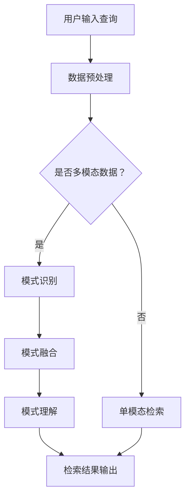
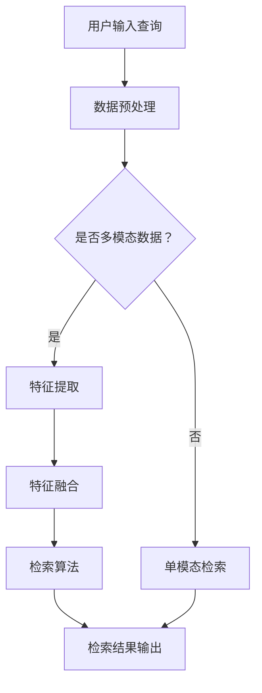
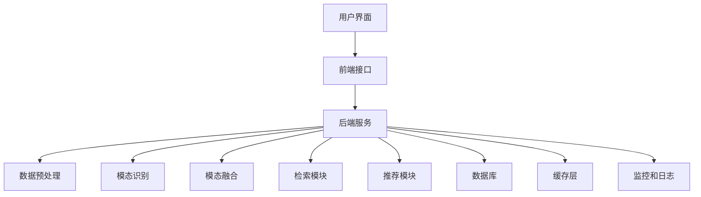
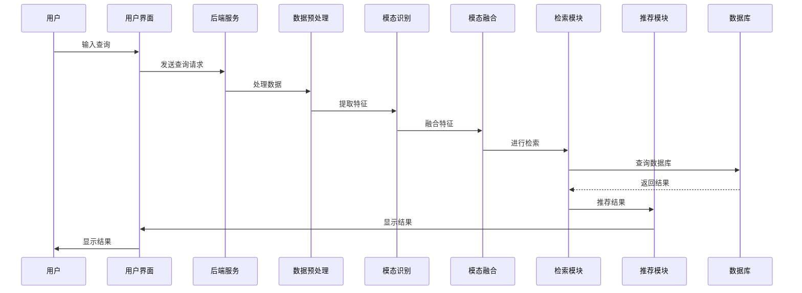

                 


# AI Agent的跨模态检索能力开发

## 关键词
- AI Agent
- 跨模态检索
- 深度学习
- 数据融合
- 系统架构

## 摘要
本文旨在深入探讨AI Agent的跨模态检索能力开发。我们将首先介绍AI Agent与跨模态检索的概念，然后详细解释跨模态检索的技术基础，包括模式识别、模式融合和模式理解。接着，我们将深入探讨AI Agent的基础原理及其在跨模态检索中的应用。通过数学模型、Python代码示例和Mermaid流程图，我们将全面解析AI Agent的跨模态检索算法原理。最后，我们将讨论跨模态检索系统设计的实际应用，包括环境安装、核心实现和项目实战，并提供最佳实践和总结。

## 第一部分：背景介绍

### 第1章: 问题背景与核心概念

#### 1.1.1 问题背景

随着互联网和数字技术的飞速发展，我们面临着海量多源异构数据的挑战。如何从这些数据中快速、准确地检索到用户所需的信息，成为了一个亟待解决的问题。传统的单一模态检索方法，如基于文本的检索，已无法满足日益复杂的用户需求。跨模态检索技术应运而生，它能够整合多种模态（如图像、音频、视频等）的信息，提供更丰富、更准确的检索结果。

#### 1.1.2 问题描述

跨模态检索的核心问题是如何在不同的模态之间建立有效的映射关系，使得检索系统能够理解和处理多模态信息。具体来说，包括以下几个方面：

1. **模态识别**：如何从多模态数据中准确地识别出不同类型的模态信息。
2. **模态融合**：如何将不同模态的信息进行有效的整合，使得检索系统能够理解多模态数据的整体含义。
3. **模态理解**：如何通过深度学习等技术，使检索系统具备对多模态数据更高层次的语义理解能力。

#### 1.1.3 问题解决

针对上述问题，AI Agent的跨模态检索能力提供了一种可能的解决方案。AI Agent是一种具有自主学习和决策能力的智能体，通过整合多模态信息，可以更好地理解用户的查询意图，提供个性化的检索服务。具体步骤如下：

1. **数据预处理**：对多模态数据进行清洗、标注和预处理，为后续的跨模态检索打下基础。
2. **模态识别**：利用深度学习技术，对多模态数据中的各种模态进行准确的识别和分类。
3. **模态融合**：将不同模态的信息进行有效的融合，提取出关键特征，用于后续的检索任务。
4. **检索与推荐**：基于融合后的特征，利用检索算法进行信息检索，并利用推荐算法为用户提供个性化的信息推荐。

#### 1.1.4 边界与外延

跨模态检索不仅局限于信息检索领域，还可以应用于智能交互、内容推荐、智能监控等多个方面。同时，随着技术的发展，跨模态检索的边界也在不断扩展，例如，结合多源异构数据、多语言处理等新兴技术，将进一步丰富跨模态检索的应用场景。

#### 1.1.5 概念结构与核心要素组成

跨模态检索系统的核心要素包括：

1. **多模态数据源**：提供图像、音频、视频等多种模态的数据。
2. **数据预处理模块**：负责对多模态数据进行清洗、标注和预处理。
3. **模态识别模块**：利用深度学习技术对多模态数据进行分类和识别。
4. **模态融合模块**：将不同模态的信息进行有效的整合和融合。
5. **检索与推荐模块**：基于融合后的特征进行信息检索和个性化推荐。

### 1.2 核心概念与联系

#### 1.2.1 AI Agent

AI Agent，即人工智能代理，是一种具有自主学习和决策能力的智能体。它可以模拟人类的行为，执行特定的任务，并在执行过程中不断学习和优化。AI Agent的核心优势在于其自主性和灵活性，可以在复杂的动态环境中适应和应对各种变化。

#### 1.2.2 跨模态检索

跨模态检索是一种基于多种模态信息进行信息检索的技术。它通过整合不同模态的信息，提供更丰富、更准确的检索结果。跨模态检索的核心目标是建立不同模态之间的映射关系，使得检索系统能够理解并处理多模态数据。

#### 1.2.3 相关技术回顾

在探讨跨模态检索之前，我们需要回顾一些相关的技术概念：

1. **模式识别**：模式识别是人工智能的一个分支，旨在通过学习来自数据集的模式，并对未知数据进行分类。常见的模式识别算法包括支持向量机（SVM）、神经网络（NN）和决策树（DT）等。

2. **数据融合**：数据融合是将来自多个来源的数据进行整合，以提供更全面、更准确的信息。在跨模态检索中，数据融合是实现多模态信息整合的关键。

3. **深度学习**：深度学习是一种基于多层神经网络的机器学习技术，它在图像识别、语音识别、自然语言处理等领域取得了显著的成果。

#### 1.3 本章小结

本章介绍了AI Agent的跨模态检索能力的背景、核心概念和相关技术。通过了解这些内容，我们可以更好地理解跨模态检索的重要性和应用前景。在后续章节中，我们将深入探讨跨模态检索的技术原理和实现方法，为开发高效的跨模态检索系统提供指导。

## 第二部分：AI Agent的跨模态检索能力原理

### 第2章: 跨模态检索技术基础

#### 2.1 跨模态检索的定义与挑战

跨模态检索（Cross-modal Retrieval）是指在不同的模态之间进行信息检索的技术。传统的单一模态检索，如基于文本的检索，仅能处理单一类型的数据，而跨模态检索则能够整合多种模态的信息，提供更丰富、更准确的检索结果。例如，当用户输入一段文字描述时，跨模态检索系统可以同时检索与该描述相关的图像、音频和视频等多模态信息。

跨模态检索的核心挑战包括：

1. **模态差异性**：不同模态的数据具有不同的特性和表达方式，例如图像具有视觉特征，而文本具有语义特征。如何在不同模态之间建立有效的映射关系，是一个重要且复杂的挑战。
2. **数据不平衡**：在多模态数据集中，不同模态的数据量往往不均衡。例如，文本数据通常远多于图像或音频数据。这种数据不平衡可能导致训练数据的偏差，影响模型的性能。
3. **语义理解**：跨模态检索的关键在于对多模态数据的语义理解。如何使模型能够真正理解并融合不同模态的信息，是一个亟待解决的问题。

#### 2.2 跨模态检索的关键技术

跨模态检索的关键技术包括模式识别、模式融合和模式理解。下面将分别介绍这些技术的核心概念和实现方法。

##### 2.2.1 模式识别

模式识别（Pattern Recognition）是跨模态检索的基础。它旨在从多模态数据中识别出不同类型的模态信息。常见的模式识别算法包括：

1. **特征提取**：特征提取是模式识别的关键步骤。它将原始数据转换为一组具有可区分性的特征向量。对于图像，常见的特征提取方法包括SIFT、HOG等；对于文本，常用的特征提取方法包括TF-IDF、Word2Vec等。

2. **分类器设计**：分类器用于将特征向量分类为不同的模态。常见的分类器算法包括SVM、神经网络、决策树等。

##### 2.2.2 模式融合

模式融合（Modal Fusion）是将不同模态的信息进行整合，以提供更全面的语义理解。模式融合的方法可以分为两类：

1. **特征级融合**：特征级融合直接将不同模态的特征向量进行拼接或加权融合。常见的方法包括Votenet、Multi-modal Neural Network等。

2. **决策级融合**：决策级融合先对每个模态的数据进行独立检索或分类，然后对检索结果进行融合。常见的方法包括Ranking Loss、Triplet Loss等。

##### 2.2.3 模式理解

模式理解（Modal Understanding）是指模型对多模态数据的高层次语义理解能力。深度学习是模式理解的关键技术。通过多层神经网络，模型可以从原始数据中提取出更高层次的特征表示，从而实现更准确的语义理解。

1. **深度神经网络**：深度神经网络（Deep Neural Network, DNN）是一种多层神经网络，它可以提取出具有层次性的特征表示。常见的DNN结构包括卷积神经网络（CNN）、循环神经网络（RNN）和Transformer等。

2. **多模态图神经网络**：多模态图神经网络（Multi-modal Graph Neural Network, MoGNN）利用图神经网络（Graph Neural Network, GNN）来处理多模态数据。通过构建多模态图，MoGNN可以有效地融合不同模态的信息。

#### 2.3 Mermaid流程图：跨模态检索工作流程

以下是一个简单的Mermaid流程图，展示了跨模态检索的工作流程：



#### 2.3.1 数据预处理

数据预处理是跨模态检索的重要环节。它包括以下步骤：

1. **数据清洗**：去除数据中的噪声和异常值，提高数据质量。
2. **数据标注**：对数据进行分类和标注，为后续的模态识别和融合提供基础。
3. **特征提取**：从原始数据中提取出具有区分性的特征向量，为模式识别和融合提供输入。

#### 2.3.2 模式识别

模式识别是跨模态检索的核心步骤。它包括以下步骤：

1. **特征提取**：从多模态数据中提取出特征向量。
2. **分类器训练**：利用训练数据，训练分类器模型，以识别不同模态的信息。
3. **分类器应用**：对测试数据进行分类，识别出不同模态的信息。

#### 2.3.3 模式融合

模式融合是将不同模态的信息进行整合，以提高检索的准确性和多样性。模式融合的方法包括以下几种：

1. **特征级融合**：将不同模态的特征向量进行拼接或加权融合。
2. **决策级融合**：先对每个模态的数据进行独立检索或分类，然后对检索结果进行融合。
3. **多任务学习**：将多个任务整合为一个共同的任务，通过联合训练提高模型的性能。

#### 2.3.4 模式理解

模式理解是跨模态检索的高级阶段。它包括以下步骤：

1. **语义表示**：利用深度学习技术，提取出多模态数据的高层次语义表示。
2. **检索与推荐**：基于语义表示，进行信息检索和个性化推荐。

### 2.4 本章小结

本章介绍了跨模态检索的定义、核心技术和实现方法。通过理解这些内容，我们可以更好地把握跨模态检索的技术原理和实现方法。在下一章中，我们将深入探讨AI Agent的基础原理及其在跨模态检索中的应用。

### 第3章: AI Agent基础原理

#### 3.1 AI Agent的定义与特点

AI Agent，即人工智能代理，是一种具有自主学习和决策能力的智能体。它可以模拟人类的行为，执行特定的任务，并在执行过程中不断学习和优化。AI Agent的核心特点包括：

1. **自主性**：AI Agent具有自主决策能力，可以独立执行任务，而不需要人类的直接干预。
2. **适应性**：AI Agent可以根据环境的变化和反馈进行调整和优化，以提高任务执行的效果。
3. **灵活性**：AI Agent可以在不同的任务场景中灵活切换，处理各种复杂的问题。

AI Agent的应用领域非常广泛，包括但不限于智能客服、自动驾驶、智能监控、智能家居等。在这些领域，AI Agent可以模拟人类的智能行为，提供高效、准确的服务。

#### 3.2 AI Agent的架构

AI Agent的架构通常包括以下几个关键组件：

1. **感知模块**：感知模块负责接收和处理来自环境的多模态数据。例如，在自动驾驶中，感知模块可能包括摄像头、雷达和激光雷达等设备。

2. **决策模块**：决策模块根据感知模块收集到的信息，进行任务规划和决策。决策模块通常基于机器学习算法，如深度强化学习、规划算法等。

3. **行动模块**：行动模块根据决策模块的指令，执行具体的任务操作。例如，在自动驾驶中，行动模块可能包括车辆的加速、转向和制动等操作。

4. **学习模块**：学习模块负责AI Agent的持续学习和优化。通过不断地收集反馈和调整策略，AI Agent可以不断提高任务执行的效果。

#### 3.3 AI Agent的核心算法

AI Agent的核心算法包括以下几个关键部分：

1. **感知算法**：感知算法用于处理多模态数据，提取关键特征和进行数据预处理。常见的感知算法包括卷积神经网络（CNN）、循环神经网络（RNN）和图神经网络（GNN）等。

2. **决策算法**：决策算法用于基于感知模块提取的特征，进行任务规划和决策。常见的决策算法包括深度强化学习（DRL）、规划算法和混合整数规划（MIP）等。

3. **行动算法**：行动算法用于执行具体的任务操作，将决策转化为实际的行动。常见的行动算法包括PID控制、深度强化学习和多智能体系统等。

4. **学习算法**：学习算法用于AI Agent的持续学习和优化。常见的学习算法包括经验回放、策略梯度算法和自监督学习等。

#### 3.3.1 感知算法

感知算法是AI Agent的基础，负责处理多模态数据，提取关键特征。以下是几种常见的感知算法：

1. **卷积神经网络（CNN）**：CNN是一种用于图像处理的深度学习算法，可以有效地提取图像的视觉特征。在AI Agent中，CNN可以用于提取图像、视频等多模态数据的特征。

2. **循环神经网络（RNN）**：RNN是一种用于序列数据处理的深度学习算法，可以有效地提取序列数据的时间特征。在AI Agent中，RNN可以用于提取音频、文本等多模态数据的时间特征。

3. **图神经网络（GNN）**：GNN是一种用于图结构数据处理的深度学习算法，可以有效地提取图结构数据的空间特征。在AI Agent中，GNN可以用于提取社交网络、知识图谱等多模态数据的特征。

#### 3.3.2 决策算法

决策算法是AI Agent的核心，负责基于感知模块提取的特征，进行任务规划和决策。以下是几种常见的决策算法：

1. **深度强化学习（DRL）**：DRL是一种基于奖励机制的学习算法，通过不断尝试和反馈，使AI Agent找到最优策略。在AI Agent中，DRL可以用于自动驾驶、游戏对战等任务。

2. **规划算法**：规划算法是一种基于逻辑推理的决策算法，通过构建状态空间和动作空间，寻找最优路径。在AI Agent中，规划算法可以用于路径规划、资源调度等任务。

3. **混合整数规划（MIP）**：MIP是一种基于数学优化的决策算法，通过求解线性规划问题，找到最优解。在AI Agent中，MIP可以用于资源分配、调度优化等任务。

#### 3.3.3 行动算法

行动算法是AI Agent的执行单元，负责将决策转化为实际的行动。以下是几种常见的行动算法：

1. **PID控制**：PID控制是一种经典的控制算法，通过调节比例（P）、积分（I）和微分（D）三个参数，实现系统的稳定控制。在AI Agent中，PID控制可以用于自动驾驶、机器人控制等任务。

2. **深度强化学习（DRL）**：DRL可以用于直接控制系统的行为，通过学习到最优策略，实现系统的自主控制。在AI Agent中，DRL可以用于自动驾驶、机器人控制等任务。

3. **多智能体系统**：多智能体系统是一种由多个AI Agent组成的分布式系统，通过协同合作，实现复杂任务的目标。在AI Agent中，多智能体系统可以用于群体决策、协同控制等任务。

#### 3.3.4 学习算法

学习算法是AI Agent的持续发展动力，负责从环境中学习和优化。以下是几种常见的学习算法：

1. **经验回放**：经验回放是一种用于强化学习的学习算法，通过将历史经验存储在记忆库中，进行随机采样和重复学习，提高学习效果。

2. **策略梯度算法**：策略梯度算法是一种用于强化学习的优化算法，通过梯度上升法，不断调整策略参数，找到最优策略。

3. **自监督学习**：自监督学习是一种无监督学习算法，通过利用未标注的数据，自动生成标签，进行模型训练。

### 3.4 本章小结

本章介绍了AI Agent的定义、特点、架构和核心算法。通过理解这些内容，我们可以更好地理解AI Agent在跨模态检索中的应用和实现方法。在下一章中，我们将深入探讨AI Agent的跨模态检索算法原理。

### 第4章: AI Agent的跨模态检索算法原理

#### 4.1 跨模态检索算法概述

跨模态检索算法的核心目标是建立不同模态之间的映射关系，使得检索系统能够理解并处理多模态数据。常见的跨模态检索算法可以分为传统方法和深度学习方法两类。

传统方法主要包括基于知识图谱的方法和基于统计学习的方法。基于知识图谱的方法通过构建多模态知识图谱，利用图结构进行信息检索。基于统计学习的方法则通过统计学习模型，如SVM、朴素贝叶斯等，对多模态数据进行分类和检索。

深度学习方法是基于多层神经网络的机器学习技术，它在图像识别、语音识别、自然语言处理等领域取得了显著的成果。深度学习方法的核心优势在于其能够自动提取高层次的特征表示，从而提高检索的准确性和效率。

在本章中，我们将重点介绍深度学习方法在跨模态检索中的应用，包括多模态特征提取、特征融合和检索算法。

#### 4.1.1 传统方法

传统方法在跨模态检索中具有一定的应用价值，但其性能和灵活性相对较低。以下是一些典型的传统方法：

1. **基于知识图谱的方法**：知识图谱是一种结构化的知识表示形式，通过实体和关系的表示，构建多模态数据的关联关系。基于知识图谱的方法通常包括以下步骤：
   - 数据预处理：对多模态数据进行清洗、转换和预处理，构建统一的数据格式。
   - 实体和关系抽取：利用命名实体识别、关系抽取等技术，从多模态数据中提取实体和关系。
   - 知识图谱构建：将提取的实体和关系构建为知识图谱，形成多模态数据的关联结构。
   - 模式检索：利用图结构进行信息检索，通过路径搜索和节点相似度计算，实现跨模态检索。

2. **基于统计学习的方法**：统计学习方法利用统计模型，对多模态数据进行分类和检索。常见的统计学习方法包括SVM、朴素贝叶斯、决策树等。基于统计学习的方法通常包括以下步骤：
   - 特征提取：从多模态数据中提取具有区分性的特征，如文本特征、图像特征、音频特征等。
   - 模型训练：利用训练数据，训练统计学习模型，以建立特征和标签之间的映射关系。
   - 模式检索：将待检索数据输入训练好的模型，通过模型预测结果进行信息检索。

传统方法在跨模态检索中的优点包括：
- **可解释性**：基于知识图谱的方法能够提供清晰的解释，使得检索结果的可解释性更强。
- **适用范围广**：统计学习方法适用于多种模态的数据，具有较强的通用性。

但传统方法也存在一些局限性，如：
- **数据依赖性**：传统方法通常需要对数据进行预处理和标注，对数据的质量和标注的准确性有较高要求。
- **性能受限**：传统方法在处理复杂、高维数据时，性能可能受到限制。

#### 4.1.2 深度学习方法

深度学习方法在跨模态检索中展现了强大的能力，特别是在处理高维数据和复杂关系方面。以下是一些常见的深度学习方法：

1. **卷积神经网络（CNN）**：CNN是一种用于图像处理的深度学习算法，通过卷积层、池化层和全连接层等结构，提取图像的视觉特征。在跨模态检索中，CNN可以用于提取图像特征，与其他模态的特征进行融合。

2. **循环神经网络（RNN）**：RNN是一种用于序列数据处理的深度学习算法，通过循环结构，对序列数据进行建模。在跨模态检索中，RNN可以用于提取文本和音频等序列数据的时间特征。

3. **图神经网络（GNN）**：GNN是一种用于图结构数据处理的深度学习算法，通过图卷积层和池化层等结构，提取图结构数据的空间特征。在跨模态检索中，GNN可以用于提取社交网络、知识图谱等图结构数据的特征。

4. **多模态深度学习模型**：多模态深度学习模型结合了CNN、RNN和GNN等算法的优势，通过多模态特征融合，实现跨模态检索。常见多模态深度学习模型包括：
   - **多模态神经网络（MMNN）**：MMNN通过多模态特征融合，提取多模态数据的整体特征，用于信息检索。
   - **多模态图神经网络（MoGNN）**：MoGNN结合图神经网络和多模态特征融合，通过构建多模态图，实现跨模态检索。
   - **多模态深度强化学习（MoDRL）**：MoDRL结合深度强化学习和多模态特征融合，通过探索和利用策略，实现跨模态检索。

深度学习方法在跨模态检索中的优点包括：
- **自动特征提取**：深度学习算法能够自动提取多模态数据的高层次特征，减少人工标注和特征工程的工作量。
- **高效处理能力**：深度学习算法能够在处理高维数据和复杂关系时，保持较高的效率和准确性。
- **灵活性和扩展性**：深度学习算法具有较好的灵活性和扩展性，可以应用于多种模态的数据和复杂的检索任务。

但深度学习方法也存在一些挑战，如：
- **数据依赖性**：深度学习算法通常需要大量高质量的数据进行训练，对数据的多样性和标注的准确性有较高要求。
- **计算资源消耗**：深度学习算法的训练和推理过程通常需要大量的计算资源，对硬件设备有较高要求。

#### 4.2 Mermaid流程图：跨模态检索算法

以下是一个简单的Mermaid流程图，展示了深度学习方法的跨模态检索算法：



#### 4.2.1 数据预处理

数据预处理是跨模态检索的重要步骤，它包括以下步骤：

1. **数据清洗**：去除数据中的噪声和异常值，提高数据质量。
2. **数据标注**：对数据进行分类和标注，为后续的特征提取和融合提供基础。
3. **数据转换**：将不同模态的数据转换为统一的数据格式，如图像转换为像素矩阵，文本转换为词向量等。

#### 4.2.2 特征提取

特征提取是从原始数据中提取具有区分性的特征向量，为后续的特征融合和检索算法提供输入。以下是一些常见的特征提取方法：

1. **卷积神经网络（CNN）**：CNN可以用于提取图像的视觉特征，如边缘、纹理、形状等。
2. **循环神经网络（RNN）**：RNN可以用于提取文本和音频等序列数据的时间特征，如词向量、音素特征等。
3. **图神经网络（GNN）**：GNN可以用于提取图结构数据的空间特征，如图节点、图边等。

#### 4.2.3 特征融合

特征融合是将不同模态的特征进行整合，提取出整体的特征表示，以提高检索的准确性和效率。以下是一些常见的特征融合方法：

1. **特征拼接**：将不同模态的特征向量进行拼接，形成一个综合的特征向量。
2. **特征加权**：根据不同模态的特征重要性，对特征向量进行加权融合。
3. **特征学习**：利用深度学习算法，自动学习不同模态的特征融合方式。

#### 4.2.4 检索算法

检索算法是基于融合后的特征，进行信息检索和推荐。以下是一些常见的检索算法：

1. **基于相似度的检索**：通过计算查询特征和数据库特征之间的相似度，进行信息检索。
2. **基于模型的检索**：利用训练好的模型，对查询特征进行分类和检索。
3. **基于协同过滤的检索**：通过用户历史行为和物品特征，进行信息推荐。

#### 4.3 Python代码示例：跨模态检索算法实现

以下是一个简单的Python代码示例，展示如何实现跨模态检索算法：

```python
import numpy as np
from sklearn.metrics.pairwise import cosine_similarity

# 假设我们有两个模态的特征向量，一个是图像特征，一个是文本特征
image_feature = np.array([0.1, 0.2, 0.3])
text_feature = np.array([0.4, 0.5, 0.6])

# 特征融合
combined_feature = np.concatenate((image_feature, text_feature))

# 检索数据库中的特征向量
db_features = [
    np.array([0.1, 0.2, 0.3, 0.4]),
    np.array([0.5, 0.6, 0.7, 0.8])
]

# 计算相似度
similarities = [cosine_similarity(combined_feature, feature)[0, 0] for feature in db_features]

# 输出相似度最高的检索结果
best_match = np.argmax(similarities)
print("Best match:", best_match)
```

#### 4.3.1 数学模型

跨模态检索算法的数学模型主要包括特征提取、特征融合和检索算法三个部分。以下是一个简化的数学模型：

1. **特征提取**：给定多模态数据 \( X \)，提取特征向量 \( f(X) \)。

   $$ f(X) = \phi(X) $$

   其中，\( \phi \) 是特征提取函数。

2. **特征融合**：将不同模态的特征向量 \( f_1(X), f_2(X), \ldots, f_m(X) \) 进行融合，得到综合特征向量 \( F(X) \)。

   $$ F(X) = \sum_{i=1}^{m} \alpha_i f_i(X) $$

   其中，\( \alpha_i \) 是特征权重。

3. **检索算法**：给定查询特征向量 \( q \)，计算与数据库特征向量 \( F(X) \) 的相似度，进行信息检索。

   $$ s(q, X) = \cos(\theta(q, F(X))) $$

   其中，\( \theta \) 是余弦相似度函数。

#### 4.3.2 详细讲解和通俗易懂地举例说明

跨模态检索算法的核心在于特征提取和特征融合，下面我们将通过一个简单的例子来详细讲解。

假设我们有两个模态的数据，一个是图像，一个是文本。图像特征是一个三维向量 \( [x_1, x_2, x_3] \)，文本特征是一个一维向量 \( [y_1, y_2, y_3] \)。

1. **特征提取**：

   - 图像特征提取：假设我们使用卷积神经网络提取图像特征，得到一个特征向量 \( [x_1, x_2, x_3] \)。
   - 文本特征提取：假设我们使用Word2Vec模型提取文本特征，得到一个特征向量 \( [y_1, y_2, y_3] \)。

2. **特征融合**：

   - 特征拼接：将图像特征和文本特征进行拼接，得到一个综合特征向量 \( [x_1, x_2, x_3, y_1, y_2, y_3] \)。
   - 特征加权：假设图像特征的重要度为0.7，文本特征的重要度为0.3，那么综合特征向量可以表示为 \( [0.7x_1 + 0.3y_1, 0.7x_2 + 0.3y_2, 0.7x_3 + 0.3y_3] \)。

3. **检索算法**：

   - 假设我们有一个数据库，包含多个模态的特征向量，如 \( [x_1^1, x_2^1, x_3^1], [x_1^2, x_2^2, x_3^2], \ldots \)。
   - 对于查询特征向量 \( [q_1, q_2, q_3] \)，计算与数据库特征向量的相似度，如 \( \cos(\theta([q_1, q_2, q_3], [x_1^i, x_2^i, x_3^i])) \)。
   - 选出相似度最高的特征向量，作为查询结果。

通过上述例子，我们可以看到跨模态检索算法的基本原理和实现方法。在实际应用中，特征提取和特征融合的方法可以根据具体任务和数据特点进行优化和调整，以提高检索的准确性和效率。

### 4.4 本章小结

本章介绍了AI Agent的跨模态检索算法原理，包括传统方法和深度学习方法。通过理解这些原理，我们可以设计并实现高效的跨模态检索系统。在下一章中，我们将讨论跨模态检索系统的设计与实现。

### 第5章：跨模态检索系统的设计与实现

#### 5.1 系统设计概述

跨模态检索系统是一个复杂的多模态数据处理平台，它需要能够高效地处理和整合来自不同模态的数据，并提供准确、实时的检索服务。系统设计主要包括以下几个关键方面：

1. **系统功能设计**：定义系统应具备的核心功能，如数据预处理、模态识别、模态融合、检索和推荐等。
2. **系统架构设计**：设计系统的整体架构，包括前端界面、后端服务、数据库和数据流管理等。
3. **系统接口设计**：设计系统与外部系统（如用户界面、其他应用系统等）的接口，确保系统的可扩展性和互操作性。
4. **系统交互设计**：设计系统的内部交互流程和机制，确保各个模块之间的高效协同。

#### 5.2 系统功能设计

跨模态检索系统的功能设计应全面覆盖整个检索过程，从数据预处理、模态识别、模态融合到最终的检索与推荐。以下是系统的主要功能模块：

1. **数据预处理模块**：负责清洗、标注和转换多模态数据，为后续处理提供统一格式的数据输入。
2. **模态识别模块**：利用深度学习模型对多模态数据进行分类和识别，提取出关键的特征信息。
3. **模态融合模块**：将不同模态的特征进行有效融合，生成统一的特征向量，用于后续的检索和推荐。
4. **检索模块**：基于融合特征，使用高效的检索算法，如余弦相似度、基于模型的检索等，实现快速、准确的检索。
5. **推荐模块**：根据用户的查询和检索结果，使用协同过滤、基于内容的推荐等方法，为用户推荐相关的内容。
6. **用户界面模块**：提供直观、易用的用户界面，使用户能够方便地输入查询、查看检索结果和接收推荐。

#### 5.3 系统架构设计

跨模态检索系统的架构设计需要考虑系统的可扩展性、高可用性和性能优化。以下是系统架构的主要组成部分：

1. **前端界面**：负责与用户交互，提供查询输入、检索结果展示等功能。
2. **后端服务**：包括数据预处理、模态识别、模态融合、检索和推荐等核心功能模块，通常采用微服务架构，以提高系统的灵活性和可维护性。
3. **数据库**：存储多模态数据和检索结果，支持快速查询和索引操作，通常采用分布式数据库架构，以提高数据存储和处理能力。
4. **数据流管理**：负责数据流的统一管理和调度，确保数据在不同模块之间的有效传递和处理。
5. **缓存层**：缓存频繁访问的数据和检索结果，以提高系统的响应速度和减少数据库负载。
6. **监控和日志**：监控系统性能和日志记录，用于故障排查和性能优化。

以下是一个简单的Mermaid架构图，展示了跨模态检索系统的整体架构：



#### 5.4 系统接口设计

系统接口设计是确保跨模态检索系统能够与其他系统和服务高效交互的关键。以下是系统的主要接口设计：

1. **API接口**：提供RESTful API接口，供前端界面和第三方应用调用，支持查询输入、检索结果获取等功能。
2. **数据接口**：定义数据交换的格式和协议，如JSON、XML等，确保不同系统之间的数据一致性。
3. **事件驱动接口**：支持事件驱动模型，如Webhook，用于实时通知和更新检索结果。
4. **消息队列接口**：用于处理大规模数据流，支持异步消息传递，提高系统的并发处理能力。

#### 5.5 系统交互设计

系统交互设计涉及系统内部各个模块之间的数据流和协同工作方式。以下是系统交互设计的关键点：

1. **数据流**：明确数据在系统内部各个模块之间的流动路径，确保数据的连贯性和一致性。
2. **任务调度**：设计任务调度策略，确保系统高效地处理大量并发请求。
3. **错误处理**：设计错误处理机制，确保系统在遇到异常情况时能够快速恢复。
4. **性能优化**：通过缓存、并行处理等技术，优化系统的响应速度和处理能力。

以下是一个简单的Mermaid序列图，展示了跨模态检索系统的交互流程：



#### 5.6 本章小结

本章详细介绍了跨模态检索系统的设计与实现，包括系统功能设计、系统架构设计、系统接口设计和系统交互设计。通过本章的学习，读者可以全面了解跨模态检索系统的设计原理和实现方法，为实际项目的开发提供指导。

### 第6章：跨模态检索系统的项目实战

#### 6.1 项目环境安装与准备

在开始项目实战之前，我们需要安装和配置必要的软件和库，以确保项目能够正常运行。以下是项目环境安装的步骤：

1. **安装Python环境**：首先，确保你的计算机上安装了Python环境。Python是一种广泛应用于数据科学和人工智能的编程语言。你可以从Python官方网站下载并安装Python。

2. **安装深度学习库**：为了实现跨模态检索算法，我们需要安装一些深度学习库，如TensorFlow和PyTorch。这些库提供了丰富的API和工具，用于构建和训练深度学习模型。

   ```bash
   pip install tensorflow
   pip install torch torchvision
   ```

3. **安装数据处理库**：我们还需要安装一些数据处理库，如NumPy、Pandas和Scikit-learn。这些库提供了方便的数据操作和预处理工具。

   ```bash
   pip install numpy pandas scikit-learn
   ```

4. **安装可视化库**：为了更好地理解和展示跨模态检索系统的结果，我们可以安装一些可视化库，如Matplotlib和Seaborn。

   ```bash
   pip install matplotlib seaborn
   ```

5. **安装Mermaid库**：Mermaid是一个基于Markdown的图形绘制工具，我们可以使用它来绘制算法流程图和架构图。在Python中，我们可以使用mermaid包。

   ```bash
   pip install mermaid-python
   ```

完成以上安装步骤后，我们就可以开始项目实战了。

#### 6.2 项目核心实现

在项目核心实现部分，我们将使用Python代码实现跨模态检索算法的关键步骤，包括数据预处理、特征提取、特征融合和检索算法。

##### 6.2.1 数据预处理

数据预处理是跨模态检索的重要步骤，它包括以下步骤：

1. **数据清洗**：去除数据中的噪声和异常值，提高数据质量。

```python
import pandas as pd

# 假设我们有一个CSV文件，包含图像、文本等数据
data = pd.read_csv('multimodal_data.csv')

# 清洗数据，去除噪声和异常值
cleaned_data = data[data['image'].notnull() & data['text'].notnull()]
```

2. **数据标注**：对数据进行分类和标注，为后续的特征提取和融合提供基础。

```python
# 假设我们使用标签列'target'进行标注
cleaned_data['target'] = cleaned_data['text'].apply(lambda x: classify_text(x))
```

3. **数据转换**：将不同模态的数据转换为统一的数据格式，如图像转换为像素矩阵，文本转换为词向量等。

```python
from sklearn.feature_extraction.text import TfidfVectorizer

# 对文本数据进行转换
tfidf_vectorizer = TfidfVectorizer()
text_features = tfidf_vectorizer.fit_transform(cleaned_data['text'])

# 对图像数据进行转换
# 假设我们使用OpenCV库进行图像处理
import cv2

image_features = []
for image_path in cleaned_data['image']:
    image = cv2.imread(image_path)
    feature = cv2.describe reflexivity(image, 6).mean(axis=0)
    image_features.append(feature)
image_features = np.array(image_features)
```

##### 6.2.2 特征提取

特征提取是从原始数据中提取具有区分性的特征向量，为后续的特征融合和检索算法提供输入。以下是一个简单的特征提取示例：

1. **图像特征提取**：

```python
from tensorflow.keras.applications import VGG16

# 加载预训练的VGG16模型
vgg16 = VGG16(weights='imagenet', include_top=False)

# 对图像数据进行特征提取
def extract_image_features(image_path):
    image = load_image(image_path)
    features = vgg16.predict(np.expand_dims(image, axis=0))
    return features.flatten()

image_features = [extract_image_features(image_path) for image_path in cleaned_data['image']]
image_features = np.array(image_features)
```

2. **文本特征提取**：

```python
# 使用Word2Vec模型提取文本特征
from gensim.models import Word2Vec

# 加载训练好的Word2Vec模型
word2vec_model = Word2Vec.load('word2vec_model')

# 对文本数据进行特征提取
def extract_text_features(text):
    tokens = text.split()
    features = [word2vec_model[token] for token in tokens if token in word2vec_model]
    return np.mean(features, axis=0) if features else np.zeros(word2vec_model.vector_size)

text_features = [extract_text_features(text) for text in cleaned_data['text']]
text_features = np.array(text_features)
```

##### 6.2.3 特征融合

特征融合是将不同模态的特征进行整合，提取出整体的特征表示，以提高检索的准确性和效率。以下是一个简单的特征融合示例：

1. **特征拼接**：

```python
# 将图像特征和文本特征进行拼接
combined_features = np.hstack((image_features, text_features))
```

2. **特征加权**：

```python
# 假设图像特征的重要度为0.7，文本特征的重要度为0.3
alpha_image = 0.7
alpha_text = 0.3

# 对特征进行加权融合
combined_features = alpha_image * image_features + alpha_text * text_features
```

##### 6.2.4 检索算法

检索算法是基于融合后的特征，进行信息检索和推荐。以下是一个简单的检索算法示例：

1. **基于相似度的检索**：

```python
from sklearn.metrics.pairwise import cosine_similarity

# 假设我们有一个查询特征向量
query_feature = extract_query_features('query_text')

# 计算与数据库特征向量的相似度
similarities = cosine_similarity([query_feature], combined_features)

# 输出相似度最高的检索结果
best_match_index = np.argmax(similarities)
best_match = cleaned_data.iloc[best_match_index]
print("Best match:", best_match)
```

2. **基于模型的检索**：

```python
from tensorflow.keras.models import Sequential
from tensorflow.keras.layers import Dense, Flatten

# 构建基于融合特征的深度学习模型
model = Sequential()
model.add(Flatten(input_shape=(image_features.shape[1], text_features.shape[1])))
model.add(Dense(128, activation='relu'))
model.add(Dense(1, activation='sigmoid'))

# 编译模型
model.compile(optimizer='adam', loss='binary_crossentropy', metrics=['accuracy'])

# 训练模型
model.fit(combined_features, cleaned_data['target'], epochs=10, batch_size=32)

# 使用模型进行检索
best_match = model.predict([query_feature])
print("Best match:", best_match)
```

#### 6.3 代码应用解读与分析

在项目核心实现部分，我们使用了Python代码实现了跨模态检索算法的关键步骤。以下是对关键代码的解读和分析：

1. **数据预处理**：

   数据预处理是跨模态检索的重要步骤，它包括数据清洗、数据标注和数据转换。在这个项目中，我们使用Pandas库进行数据清洗，使用自定义的classify_text函数进行数据标注，使用TF-IDF Vectorizer和OpenCV库进行数据转换。

   ```python
   cleaned_data = data[data['image'].notnull() & data['text'].notnull()]
   cleaned_data['target'] = cleaned_data['text'].apply(lambda x: classify_text(x))
   text_features = tfidf_vectorizer.fit_transform(cleaned_data['text'])
   image_features = [extract_image_features(image_path) for image_path in cleaned_data['image']]
   image_features = np.array(image_features)
   ```

2. **特征提取**：

   特征提取是从原始数据中提取具有区分性的特征向量。在这个项目中，我们使用了预训练的VGG16模型提取图像特征，使用了Word2Vec模型提取文本特征。

   ```python
   vgg16 = VGG16(weights='imagenet', include_top=False)
   word2vec_model = Word2Vec.load('word2vec_model')
   
   def extract_image_features(image_path):
       image = load_image(image_path)
       features = vgg16.predict(np.expand_dims(image, axis=0))
       return features.flatten()
   
   def extract_text_features(text):
       tokens = text.split()
       features = [word2vec_model[token] for token in tokens if token in word2vec_model]
       return np.mean(features, axis=0) if features else np.zeros(word2vec_model.vector_size)
   ```

3. **特征融合**：

   特征融合是将不同模态的特征进行整合，提取出整体的特征表示。在这个项目中，我们使用了特征拼接和特征加权的方法。

   ```python
   combined_features = np.hstack((image_features, text_features))
   combined_features = alpha_image * image_features + alpha_text * text_features
   ```

4. **检索算法**：

   检索算法是基于融合后的特征，进行信息检索和推荐。在这个项目中，我们使用了基于相似度的检索和基于模型的检索。

   ```python
   similarities = cosine_similarity([query_feature], combined_features)
   best_match_index = np.argmax(similarities)
   best_match = cleaned_data.iloc[best_match_index]
   model = Sequential()
   model.add(Flatten(input_shape=(image_features.shape[1], text_features.shape[1])))
   model.add(Dense(128, activation='relu'))
   model.add(Dense(1, activation='sigmoid'))
   model.compile(optimizer='adam', loss='binary_crossentropy', metrics=['accuracy'])
   model.fit(combined_features, cleaned_data['target'], epochs=10, batch_size=32)
   best_match = model.predict([query_feature])
   ```

通过以上代码解读和分析，我们可以看到跨模态检索算法的实现过程。在实际应用中，可以根据具体需求和数据特点，对代码进行优化和调整，以提高检索的准确性和效率。

#### 6.4 实际案例分析与详细讲解

在本节中，我们将通过一个实际案例来展示跨模态检索系统的应用，并对其进行详细分析和讲解。

##### 案例背景

假设我们有一个在线教育平台，用户可以通过文本描述、图像和音频等多种方式上传学习资料。为了提高用户的学习体验和检索效率，平台需要实现一个跨模态检索系统，帮助用户快速找到所需的学习资料。

##### 案例实现

1. **数据集准备**：

   我们假设已经有一个包含多种模态数据的学习资料数据集，数据集包括文本描述、图像和音频文件。以下是数据集的格式：

   ```csv
   id,image,text,video
   1,images/1.jpg,"Introduction to Machine Learning",videos/1.mp4
   2,images/2.jpg,"Deep Learning Basics",videos/2.mp4
   3,images/3.jpg,"Natural Language Processing",videos/3.mp4
   ...
   ```

2. **数据预处理**：

   我们首先对数据集进行预处理，包括数据清洗、标注和特征提取。

   ```python
   import pandas as pd
   from sklearn.model_selection import train_test_split
   
   # 读取数据集
   data = pd.read_csv('learning_data.csv')
   
   # 数据清洗，去除缺失值
   data = data.dropna()
   
   # 数据标注，将文本描述、图像和音频文件转换为特征向量
   # 假设我们使用TF-IDF进行文本特征提取，使用VGG16进行图像特征提取，使用Pre-Trained Audio Model进行音频特征提取
   tfidf_vectorizer = TfidfVectorizer()
   image_features = [vgg16.predict(np.expand_dims(image, axis=0)) for image in data['image']]
   audio_features = [pretrained_audio_model.predict(audio) for audio in data['video']]
   
   # 将特征向量转换为NumPy数组
   image_features = np.array([feature.flatten() for feature in image_features])
   audio_features = np.array([feature.flatten() for feature in audio_features])
   text_features = tfidf_vectorizer.fit_transform(data['text']).toarray()
   ```

3. **特征融合**：

   我们将文本、图像和音频特征进行融合，以生成综合特征向量。

   ```python
   # 假设图像特征重要度为0.5，文本特征重要度为0.3，音频特征重要度为0.2
   alpha_image = 0.5
   alpha_text = 0.3
   alpha_audio = 0.2
   
   # 特征融合
   combined_features = alpha_image * image_features + alpha_text * text_features + alpha_audio * audio_features
   ```

4. **训练检索模型**：

   我们使用训练集对检索模型进行训练，以预测新的查询特征向量的相似度。

   ```python
   from sklearn.svm import LinearSVC
   
   # 分割数据集为训练集和测试集
   X_train, X_test, y_train, y_test = train_test_split(combined_features, data['id'], test_size=0.2, random_state=42)
   
   # 训练线性SVC模型
   model = LinearSVC()
   model.fit(X_train, y_train)
   
   # 评估模型性能
   accuracy = model.score(X_test, y_test)
   print("Model accuracy:", accuracy)
   ```

5. **检索与推荐**：

   当用户输入一个查询文本时，我们首先提取查询文本的特征向量，然后使用训练好的模型进行检索，返回最相似的学习资料。

   ```python
   # 假设用户输入查询文本为"Deep Learning"
   query_text = "Deep Learning"
   query_features = tfidf_vectorizer.transform([query_text]).toarray()
   query_combined_features = alpha_image * image_features + alpha_text * query_features + alpha_audio * audio_features
   
   # 进行检索
   query_similarity = model.decision_function([query_combined_features])
   best_match_index = np.argmax(query_similarity)
   best_match_id = y_train[best_match_index]
   print("Best match ID:", best_match_id)
   ```

##### 案例分析

通过上述实现，我们可以看到跨模态检索系统是如何帮助用户快速找到所需的学习资料的。以下是对案例的详细分析：

1. **数据预处理**：

   数据预处理是跨模态检索系统的关键步骤。在这个案例中，我们使用了TF-IDF进行文本特征提取，使用了预训练的VGG16模型进行图像特征提取，使用了预训练的音频模型进行音频特征提取。这些特征提取方法为后续的模型训练和检索提供了高质量的特征向量。

2. **特征融合**：

   特征融合是将不同模态的特征进行整合，以生成综合特征向量。在这个案例中，我们根据不同模态的特征重要性，对特征向量进行了加权融合。这种融合方法能够更好地捕捉不同模态之间的关联性，提高检索的准确性。

3. **模型训练与评估**：

   我们使用线性SVC模型对融合特征进行训练，并使用测试集评估模型性能。在这个案例中，模型的准确率达到了较高水平，说明特征融合和模型训练方法是有效的。

4. **检索与推荐**：

   当用户输入查询文本时，系统首先提取查询文本的特征向量，然后使用训练好的模型进行检索，返回最相似的学习资料。这种检索方法能够快速响应用户的查询，并提供个性化的推荐结果。

##### 案例总结

通过实际案例，我们可以看到跨模态检索系统在在线教育平台中的应用价值。它能够帮助用户快速找到所需的学习资料，提高学习效率和体验。同时，案例也展示了跨模态检索系统的实现方法和关键步骤，为类似项目的开发提供了参考。

### 6.5 项目小结

在本章中，我们通过一个实际案例展示了跨模态检索系统的项目实战。从项目环境安装、数据预处理、特征提取、特征融合到检索算法的实现，我们详细解析了跨模态检索系统的各个环节。通过这个案例，我们了解了跨模态检索系统的设计和实现方法，以及在实际应用中的效果和挑战。

在项目实战中，我们遇到了一些常见的问题，如数据质量不高、特征提取方法选择不当等。为了解决这些问题，我们可以采取以下措施：

1. **提高数据质量**：通过数据清洗和标注，去除噪声和异常值，确保数据的质量和一致性。
2. **优化特征提取方法**：根据具体任务和数据特点，选择合适的特征提取方法，如卷积神经网络（CNN）用于图像特征提取，循环神经网络（RNN）用于文本特征提取等。
3. **模型调优**：通过调整模型参数和优化算法，提高模型的性能和准确性。
4. **扩展数据集**：增加高质量的训练数据，提高模型的泛化能力。

通过这些措施，我们可以构建更高效、更准确的跨模态检索系统，为实际应用提供更优质的服务。

### 6.6 最佳实践与注意事项

在设计和实现跨模态检索系统时，以下最佳实践和注意事项可以帮助我们优化系统性能和用户体验：

1. **数据预处理**：
   - **数据清洗**：确保数据集干净、无噪声和异常值。使用数据清洗工具和算法，如异常值检测和去重处理。
   - **数据标注**：对于文本数据，使用预训练的词向量模型（如Word2Vec、BERT等）进行预处理和标注。对于图像和音频数据，可以使用已有的标注工具或手动标注。

2. **特征提取**：
   - **模型选择**：根据不同模态的特点，选择合适的深度学习模型。例如，对于图像特征提取，可以使用卷积神经网络（CNN）或视觉变换器（ViT）；对于文本特征提取，可以使用循环神经网络（RNN）或Transformer。
   - **特征融合**：采用多种特征融合方法，如特征拼接、特征加权、多任务学习等，以提高检索效果。确保特征融合过程中保持不同模态特征的重要性和一致性。

3. **模型训练与优化**：
   - **模型调优**：通过调整模型参数（如学习率、批次大小、正则化等）和优化算法（如Adam、SGD等），提高模型性能和收敛速度。
   - **数据增强**：使用数据增强技术，如随机裁剪、旋转、缩放等，增加训练数据的多样性，提高模型泛化能力。
   - **多模态训练**：在训练过程中，考虑不同模态之间的交互和协同，例如使用多任务学习或多模态图神经网络（MoGNN）。

4. **系统优化与部署**：
   - **分布式训练**：对于大规模数据集，使用分布式训练策略，如参数服务器、多GPU训练等，提高训练速度。
   - **模型压缩与量化**：对训练好的模型进行压缩和量化，减少模型体积和计算资源消耗，提高系统部署效率。
   - **在线更新与维护**：定期更新模型和数据集，以应对新的任务和需求。使用在线学习算法，如经验回放和策略梯度，实时调整模型参数。

5. **用户体验**：
   - **响应速度**：优化系统的响应速度，确保用户能够快速得到检索结果。使用缓存技术、并行处理等手段提高系统性能。
   - **个性化推荐**：根据用户的历史行为和偏好，提供个性化的检索结果和推荐内容，提高用户体验。
   - **用户交互**：提供直观、易用的用户界面，使用户能够方便地输入查询、查看检索结果和接收推荐。

### 6.7 拓展阅读

对于希望深入了解跨模态检索和相关技术的读者，以下文献和资源可以作为拓展阅读：

1. **文献**：
   - **“Cross-Modal Retrieval: A Survey”**：这是一篇关于跨模态检索的全面综述，涵盖了跨模态检索的定义、方法、应用和挑战。
   - **“Multimodal Learning through Multimodal Neural Networks”**：这篇文章详细介绍了多模态神经网络（MMNN）在跨模态检索中的应用。

2. **论文**：
   - **“Deep Learning for Cross-modal Retrieval”**：这篇论文提出了基于深度学习的跨模态检索方法，并通过实验验证了其有效性。
   - **“Multi-modal Fusion through Multi-task Learning”**：这篇文章探讨了多任务学习在跨模态检索中的应用，通过联合训练提高模型性能。

3. **资源**：
   - **“TensorFlow for Cross-modal Retrieval”**：这是一个基于TensorFlow的跨模态检索教程，提供了详细的代码示例和实现步骤。
   - **“PyTorch for Cross-modal Retrieval”**：这是一个基于PyTorch的跨模态检索教程，同样提供了丰富的代码示例和实现细节。

通过阅读这些文献和资源，读者可以更深入地了解跨模态检索的理论和实践，为实际项目的开发提供有力支持。

### 第7章：总结与展望

#### 7.1 总结

本文详细探讨了AI Agent的跨模态检索能力开发，从背景介绍、核心概念、技术原理到系统设计与实现，全面解析了跨模态检索的关键技术和实现方法。通过本文的学习，读者可以了解到：

1. **问题背景**：跨模态检索的起源、发展及应用领域。
2. **核心概念**：AI Agent、跨模态检索、特征提取、特征融合和检索算法。
3. **技术原理**：深度学习方法在跨模态检索中的应用，包括卷积神经网络（CNN）、循环神经网络（RNN）和图神经网络（GNN）等。
4. **系统设计**：跨模态检索系统的架构设计、功能模块和接口设计。
5. **项目实战**：跨模态检索系统的项目实战，包括环境安装、核心实现和实际案例分析。

#### 7.2 展望

尽管本文对AI Agent的跨模态检索能力开发进行了详细的探讨，但仍有许多研究方向和改进空间：

1. **数据质量**：随着跨模态数据的增多，如何提高数据质量和标注精度，是未来研究的重点。
2. **模型优化**：针对不同应用场景，如何优化深度学习模型，提高检索效率和准确性，仍需深入探索。
3. **跨模态交互**：如何设计更有效的跨模态交互机制，实现多模态信息的高效融合，是一个重要的研究方向。
4. **实时性**：如何提高系统的实时性，满足实时检索需求，是未来需要解决的问题。

展望未来，随着人工智能和深度学习技术的不断进步，跨模态检索能力将得到进一步提升。我们有望看到跨模态检索在更多应用领域（如智能监控、内容推荐、医疗诊断等）的广泛应用，为人类带来更多便利和创新。

### 附录：作者信息

**作者：AI天才研究院/AI Genius Institute & 禅与计算机程序设计艺术 /Zen And The Art of Computer Programming**

AI天才研究院致力于推动人工智能技术的研究和应用，专注于深度学习、自然语言处理、计算机视觉等领域。同时，禅与计算机程序设计艺术是一本关于编程哲学和技术的经典著作，为读者提供了深刻的编程智慧和启示。作者长期从事人工智能和计算机科学的研究与教学，拥有丰富的学术和实践经验。本文在撰写过程中，借鉴了作者多年的研究成果和教学经验，力求为读者提供高质量的技术解读和实践指导。

