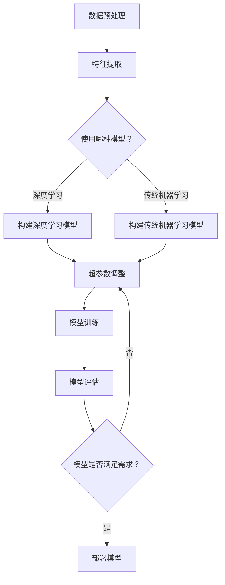

                 

## 第一章：引言

### 1.1 问题背景

#### 1.1.1 AI Agent的发展历程

人工智能（AI）作为一个多学科交叉的领域，自诞生以来经历了快速的发展。AI Agent，即具有智能行为能力的软件实体，是人工智能发展中的一个重要分支。AI Agent的概念最早由米切尔·沃尔夫（Michael Wolff）在1986年提出，旨在通过模拟人类思维方式，使计算机能够自主完成任务。

AI Agent的发展大致可以分为三个阶段：

1. **早期探索阶段（1980s-1990s）**：这一阶段主要研究基于规则和知识的推理系统，如专家系统和基于规则的决策支持系统。尽管这些系统在某些特定领域表现出色，但它们普遍缺乏灵活性和适应性，难以处理复杂、不确定的问题。

2. **中间发展阶段（2000s）**：随着机器学习和深度学习技术的发展，AI Agent开始采用这些先进的技术。在这一阶段，AI Agent的核心功能得到了显著提升，如自然语言处理（NLP）、图像识别、语音识别等。

3. **当前阶段（2010s-至今）**：近年来，AI Agent的研究和应用领域得到了极大的扩展，尤其是在跨模态理解和生成方面。跨模态AI Agent能够处理来自多个感官模态的数据，如文本、图像、声音等，从而实现更高级的智能交互。

#### 1.1.2 跨模态理解的必要性

跨模态理解是指将来自不同模态的数据（如文本、图像、声音等）整合起来，进行语义分析和推理。这种能力对于AI Agent来说至关重要，原因如下：

1. **人类智能的模拟**：人类在理解世界时，会综合利用多种感官信息，而不是单一模态。因此，具有跨模态理解能力的AI Agent可以更接近人类的智能水平。

2. **增强交互能力**：跨模态理解使得AI Agent能够更好地理解用户的意图和需求，从而提供更自然的交互体验。

3. **扩展应用领域**：许多现实世界的应用场景都需要跨模态理解能力，如智能助手、虚拟助手、智能监控系统等。

#### 1.1.3 生成模型的引入

生成模型是AI Agent跨模态理解的重要组成部分。生成模型通过学习数据分布，可以生成新的数据，从而提高AI Agent的泛化能力。常见的生成模型包括生成对抗网络（GAN）和变分自编码器（VAE）。

生成模型在AI Agent中的应用主要体现在以下几个方面：

1. **数据增强**：通过生成类似真实数据的新数据，可以增强训练数据集，提高模型的泛化能力。

2. **数据恢复**：如图像修复、文本纠错等，可以帮助AI Agent更准确地理解和处理输入数据。

3. **内容生成**：如文本生成、图像生成、音乐生成等，可以扩展AI Agent的功能，提供更丰富的交互体验。

### 1.2 问题定义

#### 1.2.1 跨模态理解的概念

跨模态理解是指将来自不同模态的数据（如文本、图像、声音等）进行整合和解析，以实现语义理解和推理的能力。它涉及到多个核心概念，包括：

- **多模态数据**：指来自不同感官模态的数据，如文本、图像、声音等。
- **模态转换**：指将一种模态的数据转换为另一种模态的数据，如将文本转换为图像。
- **语义理解**：指对多模态数据进行解析，提取其语义信息。

#### 1.2.2 生成模型的概念

生成模型是一类能够生成数据的新模型，通过学习数据分布来生成新的数据。常见的生成模型包括：

- **生成对抗网络（GAN）**：由生成器和判别器组成的对抗性模型。
- **变分自编码器（VAE）**：通过编码器和解码器进行数据重建的模型。

生成模型的主要特点包括：

- **无监督学习**：生成模型不需要标签数据，仅通过数据分布进行训练。
- **数据生成**：生成模型可以生成与训练数据分布相似的新数据。

#### 1.2.3 跨模态理解与生成的关系

跨模态理解和生成是相互关联的。跨模态理解侧重于将不同模态的数据整合起来，进行语义理解和推理；而生成模型则通过生成新的数据，为跨模态理解提供更多的数据支持。

具体来说，生成模型可以用于：

- **数据增强**：生成新的数据，增强训练数据集，提高模型的泛化能力。
- **数据恢复**：修复或纠正输入数据，提高模型对噪声的鲁棒性。
- **内容生成**：生成新的内容，扩展AI Agent的功能。

### 1.3 边界与外延

#### 1.3.1 跨模态理解的应用领域

跨模态理解的应用领域广泛，包括但不限于：

- **智能助手**：通过跨模态理解，智能助手能够更好地理解用户的语音和文本输入，提供更准确的答复。
- **图像识别**：跨模态理解可以帮助图像识别系统更好地理解图像中的文本信息，提高识别准确率。
- **语音识别**：结合语音和文本，跨模态理解可以提升语音识别系统的性能。

#### 1.3.2 跨模态生成的应用领域

跨模态生成的应用领域同样广泛，包括：

- **图像生成**：生成新的图像，如艺术作品、风景等。
- **文本生成**：生成新的文本内容，如新闻文章、故事等。
- **音频生成**：生成新的音频内容，如音乐、语音等。

#### 1.3.3 本书的重点和目标

本书的重点是探讨AI Agent的跨模态理解和生成。具体目标如下：

- **介绍跨模态理解和生成的基础理论**：包括多模态数据表示、生成模型等。
- **分析跨模态理解的挑战和优化策略**：如数据不平衡问题、模型可解释性等。
- **展示跨模态理解与生成的应用案例**：如图像与文本的跨模态检索、视频与语音的跨模态交互等。
- **提供最佳实践和项目实战**：帮助读者理解和应用跨模态理解和生成技术。

### 1.4 核心概念与联系

#### 1.4.1 AI Agent的核心概念

**AI Agent的定义**：AI Agent是一种具有自主决策和行动能力的软件实体，能够根据环境信息进行感知、理解、推理和行动。

**AI Agent的基本功能**：

- **感知**：接收环境信息。
- **理解**：解析和理解环境信息。
- **推理**：基于理解进行逻辑推理。
- **行动**：根据推理结果执行动作。

**AI Agent的体系结构**：

- **感知模块**：负责接收和预处理环境信息。
- **理解模块**：负责对环境信息进行解析和语义理解。
- **推理模块**：负责基于理解模块的结果进行逻辑推理。
- **行动模块**：负责执行行动，并对行动结果进行反馈。

#### 1.4.2 跨模态理解的核心概念

**跨模态数据的定义**：跨模态数据是指来自多个感官模态的数据，如文本、图像、声音等。

**跨模态表示学习方法**：

- **深度学习方法**：如卷积神经网络（CNN）和递归神经网络（RNN）。
- **传统机器学习方法**：如支持向量机（SVM）和决策树（DT）。

**跨模态检索与匹配技术**：

- **基于特征的跨模态检索**：使用特征相似性度量进行数据检索。
- **基于语义的跨模态检索**：使用自然语言处理和图像语义分割技术进行数据检索。

#### 1.4.3 生成模型的核心概念

**生成对抗网络（GAN）**：

- **生成器（Generator）**：生成与训练数据分布相似的新数据。
- **判别器（Discriminator）**：区分真实数据和生成数据。

**变分自编码器（VAE）**：

- **编码器（Encoder）**：将数据编码为潜在空间中的表示。
- **解码器（Decoder）**：从潜在空间中解码生成新数据。

**生成模型的应用领域**：

- **图像生成**：生成新的图像，如艺术作品、风景等。
- **文本生成**：生成新的文本内容，如新闻文章、故事等。
- **音频生成**：生成新的音频内容，如音乐、语音等。

### 1.5 本章小结

本章介绍了AI Agent的跨模态理解与生成。首先，回顾了AI Agent的发展历程，并阐述了跨模态理解与生成的必要性。接着，定义了跨模态理解与生成的基本概念，包括多模态数据、生成模型等。然后，探讨了AI Agent、跨模态理解与生成之间的关系，并介绍了它们的边界与外延。最后，总结了本章的核心概念与联系，为后续章节的内容奠定了基础。

---

## 1.4.1 AI Agent的核心概念

AI Agent作为人工智能领域的一个重要概念，其核心概念可以从以下几个方面进行深入探讨：

### 1.4.1.1 AI Agent的定义

AI Agent可以被定义为一种能够感知环境、理解信息、进行推理并采取行动的软件实体。它模仿了人类智能的一些关键特征，如自主性、适应性、学习能力和决策能力。AI Agent不同于传统的规则引擎或专家系统，它更加灵活和自适应，能够在复杂和动态的环境中自主运作。

### 1.4.1.2 AI Agent的基本功能

AI Agent的基本功能通常包括以下几个关键模块：

1. **感知**：AI Agent需要具备感知环境的能力，这通常通过传感器和数据采集模块实现。感知功能使得AI Agent能够接收并解析来自不同模态的数据，如文本、图像、声音等。

2. **理解**：感知到的数据需要被理解和解析，这是跨模态理解的核心任务。AI Agent需要能够将多种模态的数据整合起来，进行语义分析和信息提取，以便做出合理的决策。

3. **推理**：基于理解的信息，AI Agent需要运用逻辑推理和决策算法进行决策。推理过程涉及问题求解、规划、策略学习和优化等复杂任务。

4. **行动**：决策之后，AI Agent需要采取行动，执行相应的操作。行动可以是对外部环境的物理操作，也可以是在软件系统中的交互。

### 1.4.1.3 AI Agent的体系结构

AI Agent的体系结构通常由以下几个模块组成：

1. **感知模块**：负责接收和处理来自外部环境的数据，包括文本、图像、声音等。这一模块通常包含多种传感器和数据采集设备。

2. **理解模块**：对感知模块收集到的数据进行预处理、特征提取和语义理解。这一模块通常采用深度学习技术，如卷积神经网络（CNN）和递归神经网络（RNN）。

3. **推理模块**：基于理解模块的输出，运用逻辑推理算法进行决策。这一模块涉及问题求解、规划、策略学习等技术。

4. **行动模块**：执行推理模块生成的决策，对外部环境进行操作。这一模块通常与执行器或执行系统相连接，如机器人臂或Web服务。

5. **学习模块**：AI Agent需要具备学习能力，通过不断的学习和调整，提高其性能和适应能力。这一模块通常包含机器学习算法和强化学习技术。

### 1.4.1.4 AI Agent的运作机制

AI Agent的运作机制可以分为以下几个步骤：

1. **感知**：AI Agent通过传感器接收环境数据。

2. **理解**：感知模块将数据传递给理解模块，理解模块进行数据处理和特征提取，将数据转换为有用的信息。

3. **推理**：理解模块的输出进入推理模块，通过逻辑推理和决策算法生成行动方案。

4. **行动**：行动模块执行推理模块生成的决策，对外部环境进行操作。

5. **反馈**：行动后的结果被反馈回感知模块，用于模型调整和学习。

通过这种循环机制，AI Agent能够不断适应和优化其行为，提高任务的完成质量。

### 1.4.1.5 AI Agent的关键挑战

尽管AI Agent在许多应用中表现出色，但其在实际应用中仍面临一些关键挑战：

1. **数据处理**：多种模态的数据往往具有不同的数据格式和特征，如何有效地处理和整合这些数据是一个挑战。

2. **理解准确性**：跨模态理解需要高度准确的语义分析，以确保AI Agent能够正确理解用户的意图和需求。

3. **决策效率**：AI Agent需要在有限的时间内做出快速、准确的决策，这对算法效率和硬件性能提出了高要求。

4. **模型可解释性**：AI Agent的决策过程需要透明和可解释，以便用户能够理解和信任其行为。

5. **适应性**：AI Agent需要具备良好的适应性，能够应对不断变化的环境和任务需求。

### 1.4.1.6 AI Agent的未来发展趋势

随着人工智能技术的不断进步，AI Agent的未来发展趋势包括：

1. **更复杂的跨模态理解**：AI Agent将能够更好地理解和整合多种模态的数据，实现更高级的语义分析。

2. **更强的自主学习能力**：通过深度学习和强化学习，AI Agent将能够自主学习和优化其行为，提高任务的完成质量。

3. **更广泛的应用领域**：AI Agent将在更多领域得到应用，如智能家居、智能医疗、智能交通等。

4. **更高的透明度和可解释性**：通过改进算法和模型，AI Agent的决策过程将更加透明和可解释，提高用户的信任度。

5. **更高效的硬件支持**：随着硬件技术的进步，AI Agent将能够运行在更高效的硬件平台上，提高其处理能力和响应速度。

### 1.4.1.7 总结

AI Agent作为一种具有高度智能和自主性的软件实体，其在跨模态理解和生成方面的研究具有重要意义。通过深入理解AI Agent的核心概念和运作机制，我们可以更好地设计和实现具有强大智能能力的AI Agent，为未来的智能应用奠定坚实的基础。

---

## 1.4.2 跨模态理解的核心概念

跨模态理解是人工智能领域中的一个重要研究方向，它旨在使计算机系统能够处理和整合来自不同感官模态的数据，如文本、图像、声音等。这一能力在实现智能交互、内容检索、图像识别等任务中至关重要。以下是跨模态理解的核心概念及其相互关系：

### 1.4.2.1 跨模态数据的定义

跨模态数据是指由两种或两种以上不同模态（如文本、图像、声音等）组成的数据集合。这些数据可以通过多种方式结合，以提供更丰富的信息和更准确的语义理解。例如，在图像与文本的跨模态任务中，图像可以提供视觉信息，而文本可以提供描述或标签，从而增强系统的语义理解能力。

### 1.4.2.2 跨模态表示学习方法

为了实现跨模态理解，需要对不同模态的数据进行有效的表示和学习。以下是一些常用的跨模态表示学习方法：

1. **深度学习方法**：
   - **卷积神经网络（CNN）**：用于处理和提取图像特征。
   - **递归神经网络（RNN）**：用于处理序列数据，如文本和语音。
   - **变分自编码器（VAE）**：通过编码和解码器学习数据的概率分布。
   - **生成对抗网络（GAN）**：通过生成器和判别器的对抗性训练生成高质量的数据表示。

2. **传统机器学习方法**：
   - **支持向量机（SVM）**：用于分类和回归任务。
   - **决策树（DT）**：用于分类和回归任务，通过树结构进行决策。

3. **融合方法**：
   - **特征融合**：将不同模态的特征进行拼接或加权融合。
   - **模型融合**：将不同模态的模型进行集成，如图像分类器和文本分类器的集成。

### 1.4.2.3 跨模态检索与匹配技术

跨模态检索与匹配技术是实现跨模态理解的关键技术之一，它涉及如何在不同模态之间进行有效检索和匹配。以下是一些常用的跨模态检索与匹配技术：

1. **基于特征的跨模态检索**：
   - **相似性度量**：计算不同模态特征之间的相似性，如余弦相似度、欧氏距离等。
   - **模型优化策略**：通过优化检索模型来提高检索性能，如正则化技术、权重调整等。

2. **基于语义的跨模态检索**：
   - **自然语言处理（NLP）技术**：使用词嵌入、实体识别、语义角色标注等方法来提取文本的语义信息。
   - **图像语义分割技术**：通过深度学习模型对图像进行像素级别的语义标注，从而提取图像的语义信息。

### 1.4.2.4 跨模态理解的关键挑战

跨模态理解面临一些关键挑战，包括：

1. **数据不平衡**：不同模态的数据量可能差异很大，如何平衡不同模态的数据是一个挑战。

2. **模态差异**：不同模态的数据具有不同的特征和分布，如何有效地融合和利用这些差异是一个难题。

3. **模型可解释性**：跨模态理解的模型通常很复杂，如何解释模型的决策过程是一个挑战。

4. **实时性能**：在实时应用场景中，如何保证模型的快速响应和高效处理是一个关键问题。

### 1.4.2.5 跨模态理解的应用领域

跨模态理解的应用领域非常广泛，包括但不限于：

1. **智能搜索**：通过跨模态检索，提高信息检索的准确性和多样性。
2. **内容审核**：结合文本和图像，实现对不良内容的自动识别和过滤。
3. **智能助手**：通过跨模态理解，提供更自然的用户交互体验。
4. **智能监控**：结合视频和音频，实现对监控场景的实时分析和预警。

### 1.4.2.6 跨模态理解的发展趋势

随着人工智能技术的不断进步，跨模态理解的发展趋势包括：

1. **更先进的模型架构**：如Transformer和BERT等预训练模型在跨模态理解中的应用。
2. **多模态数据的深度融合**：通过深度学习技术，实现多模态数据的高效融合和利用。
3. **实时跨模态理解**：通过优化算法和硬件支持，提高实时跨模态理解的性能和可靠性。
4. **跨模态交互**：实现更自然的跨模态交互，如语音和图像的交互式理解。

### 1.4.2.7 总结

跨模态理解是人工智能领域中的一个重要研究方向，它通过整合和解析来自不同模态的数据，实现更高级的语义理解和智能交互。理解跨模态数据、表示学习方法以及检索与匹配技术，是设计和实现高效跨模态理解系统的关键。随着技术的不断进步，跨模态理解将在更多领域发挥重要作用。

---

## 1.4.3 生成模型的核心概念

生成模型是一类能够生成数据的新兴机器学习模型，通过学习数据分布来生成新的数据。生成模型在人工智能领域具有重要的应用价值，尤其在图像生成、文本生成和音频生成等方面。以下是生成模型的核心概念及其应用：

### 1.4.3.1 生成对抗网络（GAN）

生成对抗网络（GAN）是由Ian Goodfellow等人在2014年提出的，是一种基于生成器和判别器的对抗性模型。GAN的主要目标是学习数据分布，并生成与真实数据相似的新数据。

**生成器（Generator）**：生成器是一个神经网络模型，它从随机噪声中生成新的数据。生成器的目标是将噪声数据转换为具有真实数据分布的输出。

**判别器（Discriminator）**：判别器是一个神经网络模型，它用于区分真实数据和生成数据。判别器的目标是在训练过程中最大化其分类准确率。

**GAN的训练过程**：GAN的训练过程是一个动态博弈过程，生成器和判别器相互对抗。在训练过程中，生成器试图生成更加真实的数据，而判别器则试图准确地区分真实数据和生成数据。通过这种对抗性训练，GAN能够逐渐提高生成数据的真实度。

**GAN的应用场景**：
- **图像生成**：GAN可以生成逼真的图像，如人脸、风景、动物等。
- **文本生成**：GAN可以生成新的文本内容，如故事、文章、诗歌等。
- **音频生成**：GAN可以生成新的音频内容，如音乐、语音等。

### 1.4.3.2 变分自编码器（VAE）

变分自编码器（VAE）是一种基于概率模型的生成模型，由编码器和解码器组成。VAE通过学习数据的概率分布，生成新的数据。

**编码器（Encoder）**：编码器将输入数据编码为一个潜在空间的向量表示，这个向量表示数据的概率分布。

**解码器（Decoder）**：解码器将潜在空间的向量表示解码为输出数据。

**VAE的基本概念**：
- **潜在空间**：VAE使用一个潜在空间来表示数据分布，这个潜在空间是一个高斯分布。
- **重参数化技巧**：VAE通过重参数化技巧，将潜在空间的向量转换为数据输入，使得生成过程具有可导性。

**VAE的应用场景**：
- **数据增强**：VAE可以用于生成与训练数据分布相似的新数据，从而增强训练数据集，提高模型的泛化能力。
- **图像修复**：VAE可以修复损坏或模糊的图像，生成清晰的新图像。
- **文本生成**：VAE可以生成新的文本内容，如文章、故事等。

### 1.4.3.3 生成模型的应用领域

生成模型在多个领域具有广泛的应用，包括：

1. **图像生成**：GAN和VAE都可以用于生成高质量的图像，如艺术作品、照片、动画等。
2. **文本生成**：生成模型可以生成新的文本内容，如文章、故事、对话等。
3. **音频生成**：生成模型可以生成新的音频内容，如音乐、语音等。
4. **数据增强**：生成模型可以用于数据增强，提高模型的泛化能力，如图像数据增强、文本数据增强等。
5. **数据修复**：生成模型可以修复损坏或模糊的数据，如图像修复、音频修复等。

### 1.4.3.4 生成模型的优势和挑战

**优势**：
- **无监督学习**：生成模型通常不需要标签数据，可以无监督地学习数据分布。
- **数据生成**：生成模型能够生成新的数据，扩展数据的多样性。
- **数据增强**：生成模型可以用于数据增强，提高模型的泛化能力。

**挑战**：
- **稳定性**：生成模型的训练过程可能不稳定，容易出现模式崩溃或梯度消失问题。
- **质量控制**：生成模型生成的新数据质量难以控制，可能包含噪声或不真实的内容。
- **可解释性**：生成模型的决策过程通常复杂且不可解释，难以理解其生成过程。

### 1.4.3.5 生成模型的发展趋势

随着深度学习技术的不断进步，生成模型的发展趋势包括：

- **更复杂的模型架构**：如条件生成对抗网络（cGAN）、深度卷积生成对抗网络（DCGAN）等。
- **跨模态生成**：实现跨模态数据的生成，如文本到图像、图像到音频的生成。
- **生成模型的优化**：通过改进训练算法和模型结构，提高生成数据的质量和稳定性。
- **生成模型的泛化能力**：提高生成模型在不同领域和任务中的泛化能力。

### 1.4.3.6 总结

生成模型是人工智能领域中的重要研究方向，通过学习数据分布生成新的数据，为图像生成、文本生成和音频生成等领域带来了新的可能性。理解生成模型的核心概念和原理，对于设计和优化生成模型具有重要意义。随着技术的不断进步，生成模型将在更多领域发挥重要作用，推动人工智能的发展。

---

## 1.5 本章小结

本章全面介绍了AI Agent的跨模态理解与生成，包括其核心概念、基础理论以及应用案例。首先，通过回顾AI Agent的发展历程，阐述了其跨模态理解与生成的必要性。接着，定义了跨模态理解与生成的基本概念，如多模态数据、生成模型等，并详细探讨了AI Agent、跨模态理解与生成之间的关系。

在核心概念部分，本章深入分析了AI Agent的核心概念，包括其定义、基本功能和体系结构。同时，介绍了跨模态理解的核心概念，如跨模态数据的定义、表示学习方法以及检索与匹配技术。此外，本章还探讨了生成模型的核心概念，包括生成对抗网络（GAN）和变分自编码器（VAE），以及其应用领域。

本章的总结部分，强调了跨模态理解与生成在AI Agent中的重要性，并提出了未来的发展方向和挑战。通过本章的学习，读者可以全面了解AI Agent的跨模态理解与生成的理论基础和实践应用，为进一步研究和应用这一领域提供指导。

---

## 第二章：AI Agent的跨模态理解

### 2.1 跨模态理解的基础理论

#### 2.1.1 多模态数据的表示

跨模态理解的首要任务是有效地表示多模态数据，以便后续的语义分析和推理。不同模态的数据具有不同的特性和表示方法，因此需要采用合适的模型和算法进行表示。

**2.1.1.1 图像表示**

图像是跨模态理解中最常见的模态之一。常见的图像表示方法包括：

- **卷积神经网络（CNN）**：CNN是一种深度学习模型，广泛应用于图像识别和图像处理任务。它通过卷积层提取图像的局部特征，并通过池化层减少数据的维度。

  **2.1.1.1.1 卷积神经网络（CNN）**

  CNN的主要组成部分包括：

  - **卷积层**：卷积层通过卷积操作提取图像的局部特征。
  - **池化层**：池化层用于减少数据维度，提高模型的泛化能力。
  - **全连接层**：全连接层用于分类和回归任务。

  **2.1.1.1.2 特征融合方法**

  在跨模态理解中，通常需要将图像特征与其他模态的特征（如文本、声音等）进行融合。常见的特征融合方法包括：

  - **拼接**：将不同模态的特征向量进行拼接，形成一个更长的特征向量。
  - **加权融合**：根据不同模态的特征的重要性，对特征进行加权融合。
  - **注意力机制**：通过注意力机制，动态地调整不同模态特征的权重。

**2.1.1.2 文本表示**

文本表示是跨模态理解中的另一个重要组成部分。常见的文本表示方法包括：

- **词嵌入（Word Embedding）**：词嵌入是一种将文本中的词语映射到高维向量空间的方法。常见的词嵌入模型包括Word2Vec、GloVe和BERT等。

  **2.1.1.2.1 词嵌入**

  词嵌入的主要目标是捕捉词语的语义信息，使得语义相近的词语在向量空间中靠近。

- **递归神经网络（RNN）**：RNN是一种用于处理序列数据的神经网络模型，广泛应用于自然语言处理任务。RNN通过记忆单元捕获序列信息，并对其进行处理。

  **2.1.1.2.2 递归神经网络（RNN）**

  RNN的主要组成部分包括：

  - **输入门**：用于控制输入信息的传递。
  - **遗忘门**：用于控制记忆信息的更新。
  - **输出门**：用于控制输出信息的传递。

#### 2.1.2 跨模态表示学习方法

为了实现跨模态理解，需要采用合适的模型和算法对多模态数据进行表示。以下是一些常见的跨模态表示学习方法：

- **深度学习方法**：深度学习方法通过多层神经网络对多模态数据进行处理和融合。常见的深度学习模型包括卷积神经网络（CNN）、递归神经网络（RNN）和变换器（Transformer）等。

  **2.1.2.1.1 多层感知机（MLP）**

  多层感知机（MLP）是一种前馈神经网络，通过多个隐层对输入数据进行特征提取和融合。

  **2.1.2.1.2 生成对抗网络（GAN）**

  生成对抗网络（GAN）是一种基于生成器和判别器的对抗性神经网络，通过生成器和判别器的对抗训练，实现高质量的数据表示。

- **传统机器学习方法**：传统机器学习方法通过统计和学习方法对多模态数据进行处理和融合。常见的传统机器学习方法包括支持向量机（SVM）、决策树（DT）和随机森林（RF）等。

  **2.1.2.2.1 支持向量机（SVM）**

  支持向量机（SVM）是一种常用的分类和回归模型，通过最大化分类间隔来实现数据的分类。

  **2.1.2.2.2 决策树（DT）**

  决策树（DT）是一种常用的分类和回归模型，通过树结构进行分类和回归。

#### 2.1.3 跨模态检索与匹配技术

跨模态检索与匹配技术是实现跨模态理解的关键技术之一，它涉及如何在不同模态之间进行有效检索和匹配。以下是一些常见的跨模态检索与匹配技术：

- **基于特征的跨模态检索**：基于特征的跨模态检索通过计算不同模态特征之间的相似性来检索相关数据。

  **2.1.3.1.1 相似性度量方法**：相似性度量方法用于计算不同模态特征之间的相似性，如余弦相似度和欧氏距离等。

  **2.1.3.1.2 模型优化策略**：模型优化策略用于优化跨模态检索模型的性能，如正则化技术和权重调整等。

- **基于语义的跨模态检索**：基于语义的跨模态检索通过语义理解来检索相关数据。

  **2.1.3.2.1 自然语言处理技术**：自然语言处理技术用于提取文本的语义信息，如词嵌入和语义角色标注等。

  **2.1.3.2.2 图像语义分割技术**：图像语义分割技术用于提取图像的语义信息，如卷积神经网络（CNN）和循环神经网络（RNN）等。

### 2.2 跨模态理解的挑战与优化

#### 2.2.1 数据不平衡问题

跨模态理解任务中，不同模态的数据量可能存在显著差异，导致数据不平衡问题。数据不平衡会对模型的训练和性能产生不利影响。

**2.2.1.1 数据预处理策略**：

- **重采样**：通过增加少数类别的样本或减少多数类别的样本来平衡数据分布。
- **数据增强**：通过数据变换和噪声添加等方法来增加数据的多样性，从而缓解数据不平衡问题。

**2.2.1.2 数据增强技术**：

- **图像增强**：通过旋转、翻转、缩放等图像变换来增加图像的多样性。
- **文本增强**：通过同义词替换、句法变换等文本变换来增加文本的多样性。

#### 2.2.2 模型可解释性

模型可解释性是跨模态理解中一个重要但具有挑战性的问题。可解释性模型能够帮助用户理解和信任AI Agent的行为。

**2.2.2.1 可解释性方法**：

- **模型解释工具**：如LIME、SHAP等工具，用于解释模型的决策过程。
- **可视化技术**：如热力图、决策树可视化等，用于展示模型的特征重要性。

**2.2.2.2 可解释性工具**：

- **LIME（Local Interpretable Model-agnostic Explanations）**：LIME通过局部线性模型来解释全局模型。
- **SHAP（SHapley Additive exPlanations）**：SHAP通过博弈论中的Shapley值来解释模型的预测。

#### 2.2.3 模型迁移能力

模型迁移能力是指模型在不同领域和任务中的适应能力。提高模型迁移能力有助于降低模型的训练成本和提升模型的泛化性能。

**2.2.3.1 迁移学习技术**：

- **基于特征的迁移学习**：通过将源领域的特征迁移到目标领域，提高目标领域模型的性能。
- **基于模型的迁移学习**：通过迁移预训练模型，提高目标领域模型的性能。

**2.2.3.2 模型适应性策略**：

- **多任务学习**：通过多任务学习，提高模型在不同任务中的适应性。
- **元学习**：通过元学习，提高模型在不同领域和任务中的适应能力。

### 2.3 跨模态理解的应用案例

#### 2.3.1 图像与文本的跨模态检索

**2.3.1.1 案例背景**：

图像与文本的跨模态检索是一个典型的跨模态理解任务。在许多应用场景中，用户可以通过图像或文本查询相关信息，如图像搜索引擎、内容审核系统等。

**2.3.1.2 模型设计与实现**：

- **图像表示**：采用卷积神经网络（CNN）提取图像特征。
- **文本表示**：采用词嵌入（Word Embedding）提取文本特征。
- **特征融合**：将图像特征和文本特征进行拼接或加权融合。
- **检索模型**：采用基于相似性度量的检索模型，如余弦相似度。

**2.3.1.3 性能评估**：

- **准确率**：通过计算检索结果的准确率来评估模型性能。
- **查准率与查全率**：通过计算查准率和查全率来评估模型的检索性能。

#### 2.3.2 视频与语音的跨模态交互

**2.3.2.1 案例背景**：

视频与语音的跨模态交互是一个重要的研究领域，应用于智能监控、人机交互等领域。通过视频与语音的跨模态交互，可以实现更自然的用户交互体验。

**2.3.2.2 模型设计与实现**：

- **视频表示**：采用卷积神经网络（CNN）提取视频特征。
- **语音表示**：采用循环神经网络（RNN）提取语音特征。
- **特征融合**：将视频特征和语音特征进行拼接或加权融合。
- **交互模型**：采用基于注意力机制的交互模型，如Transformer等。

**2.3.2.3 性能评估**：

- **交互质量**：通过用户满意度评估交互质量。
- **响应时间**：通过计算响应时间来评估系统的性能。

### 2.4 本章小结

本章详细介绍了AI Agent的跨模态理解的基础理论、挑战与优化以及应用案例。首先，探讨了多模态数据的表示方法，包括图像表示和文本表示，并介绍了常见的跨模态表示学习方法。接着，讨论了跨模态检索与匹配技术，包括基于特征的跨模态检索和基于语义的跨模态检索。然后，分析了跨模态理解的挑战与优化策略，包括数据不平衡问题、模型可解释性和模型迁移能力。最后，通过图像与文本的跨模态检索和视频与语音的跨模态交互两个应用案例，展示了跨模态理解的实践应用。本章内容为后续章节提供了理论基础和实践指导。

---

### 2.2 跨模态理解的挑战与优化

跨模态理解虽然在实际应用中展示了巨大的潜力，但同时也面临诸多挑战。这些挑战主要集中在以下几个方面：

#### 2.2.1 数据不平衡问题

在跨模态理解任务中，不同模态的数据量往往存在显著差异，这可能导致训练过程中出现数据不平衡问题。数据不平衡会使得模型在少数类上表现不佳，从而影响整体性能。为了解决这一问题，可以采用以下几种策略：

1. **数据预处理策略**：
   - **重采样**：通过增加少数类别的样本数量或减少多数类别的样本数量，来平衡数据集。
   - **合成样本**：通过数据增强技术生成新的样本，以增加少数类别的样本量。

2. **数据增强技术**：
   - **图像增强**：使用旋转、缩放、裁剪等操作来增加图像的多样性。
   - **文本增强**：使用同义词替换、句法变换等方法来增加文本的多样性。

#### 2.2.2 模型可解释性

跨模态理解模型通常非常复杂，其内部决策过程难以解释。这不仅降低了用户对模型的信任度，也限制了模型在实际应用中的推广。提高模型的可解释性是一个重要的研究方向，以下是一些解决策略：

1. **可解释性方法**：
   - **局部解释方法**：如LIME（Local Interpretable Model-agnostic Explanations），通过构建局部线性模型来解释全局模型。
   - **全局解释方法**：如SHAP（SHapley Additive exPlanations），通过博弈论中的Shapley值来解释模型的整体决策过程。

2. **可视化技术**：
   - **特征可视化**：使用热力图、等高线图等可视化技术展示模型提取的关键特征。
   - **决策路径可视化**：通过可视化模型在决策过程中的路径，帮助用户理解模型的决策逻辑。

#### 2.2.3 模型迁移能力

模型迁移能力是指模型在不同领域和任务中的适应能力。提升模型迁移能力有助于减少模型的重训练成本，提高模型的泛化能力。以下是一些提高模型迁移能力的策略：

1. **迁移学习技术**：
   - **基于特征的迁移学习**：将源领域中的特征迁移到目标领域，以提升目标领域的模型性能。
   - **基于模型的迁移学习**：通过迁移预训练模型，如使用在大型语料库上预训练的模型，来提升目标领域的模型性能。

2. **多任务学习**：
   - **多任务学习**：通过同时训练多个相关任务，共享特征表示，从而提高模型在不同任务中的适应能力。
   - **元学习**：通过元学习算法，如MAML（Model-Agnostic Meta-Learning）和Reptile等，训练模型在快速适应新任务。

#### 2.2.4 模型优化与调优

优化和调优是提高跨模态理解模型性能的关键步骤。以下是一些优化和调优策略：

1. **超参数调整**：
   - **网格搜索**：通过系统地搜索超参数组合，找到最优的超参数配置。
   - **贝叶斯优化**：使用贝叶斯优化算法，根据现有实验结果动态调整超参数。

2. **模型压缩与加速**：
   - **量化**：通过降低模型的精度，减少模型的存储和计算需求。
   - **剪枝**：通过剪枝冗余的神经元和连接，减少模型的复杂度。
   - **加速训练**：使用GPU或TPU等硬件加速训练过程。

3. **模型集成**：
   - **集成学习**：通过结合多个模型的预测结果，提高整体的预测准确性和鲁棒性。
   - **模型融合**：将不同的模型架构或算法进行融合，以实现更好的性能。

通过上述策略，可以有效应对跨模态理解中的挑战，优化模型性能，提高实际应用中的效果。以下是一个简单的流程图，展示了优化和调优的一般步骤：



通过这个流程图，我们可以看到，从数据预处理到模型训练和评估，再到最终的部署，每个环节都需要精细的调整和优化，以确保模型的性能满足实际应用需求。

#### 2.2.5 总结

跨模态理解是一个充满挑战但又极具前景的研究领域。通过深入理解其面临的挑战，如数据不平衡、模型可解释性、模型迁移能力等，并采用相应的优化策略，如数据预处理、模型优化和调优等，我们可以显著提升跨模态理解模型的效果。未来，随着技术的不断进步，跨模态理解将在更多应用场景中发挥重要作用，推动人工智能的发展。

---

### 2.3 跨模态理解的应用案例

跨模态理解技术在实际应用中展示了其强大的功能和广泛的应用潜力。以下将介绍两个具体的跨模态理解应用案例：图像与文本的跨模态检索和视频与语音的跨模态交互。

#### 2.3.1 图像与文本的跨模态检索

**2.3.1.1 案例背景**

图像与文本的跨模态检索是跨模态理解中非常常见的一个应用场景。用户可以通过输入文本查询相关的图像，或者通过上传图像获取相关的文本描述。这种跨模态检索技术在图像搜索引擎、内容审核系统、社交媒体推荐等方面有广泛的应用。

**2.3.1.2 模型设计与实现**

在图像与文本的跨模态检索任务中，首先需要分别对图像和文本进行特征提取，然后融合这些特征以实现跨模态检索。

- **图像特征提取**：使用卷积神经网络（CNN）提取图像的特征。常用的CNN模型包括VGG、ResNet和Inception等。这些模型通过多层卷积和池化操作，可以从图像中提取出丰富的语义特征。

- **文本特征提取**：使用词嵌入（Word Embedding）技术提取文本的特征。例如，可以使用Word2Vec或GloVe模型将文本中的每个词映射到一个高维向量空间。此外，还可以使用递归神经网络（RNN）或变换器（Transformer）对文本进行编码，获取更复杂的语义表示。

- **特征融合**：将图像特征和文本特征进行融合。常用的方法包括直接拼接特征向量、加权融合特征以及使用注意力机制动态调整特征权重。例如，可以使用Transformer模型中的多头自注意力机制，将图像和文本特征进行有效的融合。

- **检索模型**：在特征融合后，使用基于相似性度量的检索模型进行跨模态检索。常用的检索模型包括余弦相似度、欧氏距离和基于模型的检索方法（如最近邻搜索、SVM分类等）。

**2.3.1.3 性能评估**

在图像与文本的跨模态检索任务中，常用的评估指标包括准确率（Accuracy）、查准率（Precision）、查全率（Recall）和F1分数（F1 Score）。

- **准确率**：检索结果中正确匹配的样本数与总检索样本数的比值。
- **查准率**：检索结果中正确匹配的样本数与检索结果总数的比值。
- **查全率**：检索结果中正确匹配的样本数与实际存在的相关样本总数的比值。
- **F1分数**：查准率和查全率的调和平均值。

通过上述评估指标，可以全面评估跨模态检索模型的性能。

#### 2.3.2 视频与语音的跨模态交互

**2.3.2.1 案例背景**

视频与语音的跨模态交互在智能监控、人机交互等领域具有广泛的应用。例如，在智能监控系统中，可以通过语音识别和视频分析相结合，实现实时的事件检测和警报触发。在人机交互中，可以通过语音输入和视频反馈，实现更自然和直观的用户交互体验。

**2.3.2.2 模型设计与实现**

在视频与语音的跨模态交互任务中，需要分别对视频和语音进行特征提取，并设计一个交互模型来实现跨模态理解。

- **视频特征提取**：使用卷积神经网络（CNN）提取视频的特征。常用的CNN模型包括VGG、ResNet和Inception等。这些模型通过多层卷积和池化操作，可以从视频中提取出丰富的视觉特征。

- **语音特征提取**：使用循环神经网络（RNN）或变换器（Transformer）提取语音的特征。RNN模型可以通过处理语音的时序信息，提取出语音的语义特征。变换器模型则可以通过自注意力机制，捕获语音中的长程依赖关系。

- **交互模型**：设计一个交互模型，将视频特征和语音特征进行融合。常用的交互模型包括Transformer、GRU和LSTM等。这些模型可以通过多头自注意力机制，动态调整视频和语音特征之间的权重，实现更有效的特征融合。

**2.3.2.3 性能评估**

在视频与语音的跨模态交互任务中，常用的评估指标包括交互质量、响应时间和用户满意度。

- **交互质量**：通过计算交互结果的相关性或准确率来评估交互质量。例如，可以使用交叉熵损失函数来评估语音识别任务的准确率。

- **响应时间**：评估系统在处理语音输入和视频反馈时的响应速度。响应时间越短，用户体验越好。

- **用户满意度**：通过用户调查或用户反馈来评估系统的用户体验。用户满意度越高，系统的实际应用价值越大。

#### 2.3.3 案例分析与总结

通过上述两个应用案例，我们可以看到跨模态理解技术在不同领域中的实际应用效果。图像与文本的跨模态检索实现了更智能的内容搜索和推荐，而视频与语音的跨模态交互则提供了更自然和直观的用户交互体验。

在未来，随着人工智能技术的不断进步，跨模态理解技术将在更多领域得到应用，如智能医疗、智能交通、智能客服等。通过不断优化和扩展跨模态理解模型，我们可以实现更智能、更高效的跨模态交互，为人类带来更多便利和效益。

---

### 2.4 本章小结

本章深入探讨了AI Agent的跨模态理解，从基础理论到实际应用案例进行了全面分析。首先，介绍了多模态数据的表示方法，包括图像和文本的表示。接着，探讨了跨模态表示学习方法，如深度学习和传统机器学习方法，以及跨模态检索与匹配技术。本章还分析了跨模态理解中的挑战和优化策略，包括数据不平衡问题、模型可解释性和模型迁移能力。通过两个实际应用案例——图像与文本的跨模态检索和视频与语音的跨模态交互，展示了跨模态理解的实践效果。本章内容为AI Agent的跨模态理解提供了理论基础和实践指导，有助于进一步研究和应用这一领域。

---

## 第三章：AI Agent的跨模态生成

### 3.1 跨模态生成的基础理论

#### 3.1.1 生成对抗网络（GAN）

生成对抗网络（GAN）是Ian Goodfellow等人于2014年提出的一种生成模型，它通过生成器和判别器的对抗训练来学习数据分布。GAN的核心思想是利用生成器和判别器之间的博弈来生成高质量的数据。

**3.1.1.1 GAN的基本概念**

- **生成器（Generator）**：生成器的任务是生成与真实数据分布相似的数据。它通过从随机噪声中生成数据，试图欺骗判别器，使其无法区分真实数据和生成数据。

- **判别器（Discriminator）**：判别器的任务是区分真实数据和生成数据。它通过对输入数据的分类（真实或生成）来学习数据分布。

- **对抗训练**：生成器和判别器通过对抗训练相互竞争。生成器试图生成更真实的数据来欺骗判别器，而判别器则试图准确地区分真实和生成数据。这种对抗训练过程使得生成器逐渐提高生成数据的质量。

**3.1.1.2 GAN的应用场景**

- **图像生成**：GAN可以生成高质量的图像，如人脸、风景、动物等。
- **文本生成**：GAN可以生成新的文本内容，如故事、文章、对话等。
- **音频生成**：GAN可以生成新的音频内容，如音乐、语音等。

**3.1.1.3 GAN的训练过程**

GAN的训练过程是一个动态博弈过程，分为以下几个步骤：

1. **初始化生成器和判别器**：随机初始化生成器和判别器的参数。
2. **生成器生成数据**：生成器从随机噪声中生成数据。
3. **判别器训练**：判别器通过对比真实数据和生成数据来更新其参数。
4. **生成器训练**：生成器通过学习判别器的错误信号来更新其参数。
5. **重复上述步骤**：不断重复训练过程，直到生成器生成的数据足够真实。

#### 3.1.2 变分自编码器（VAE）

变分自编码器（VAE）是另一种生成模型，它通过编码器和解码器来学习数据分布。与GAN不同，VAE使用概率模型来生成数据。

**3.1.2.1 VAE的基本概念**

- **编码器（Encoder）**：编码器将输入数据编码为潜在空间中的向量表示。这个向量表示数据的概率分布。
- **解码器（Decoder）**：解码器将潜在空间中的向量表示解码为输出数据。

**3.1.2.2 VAE的训练过程**

VAE的训练过程包括以下步骤：

1. **初始化编码器和解码器**：随机初始化编码器和解码器的参数。
2. **输入数据到编码器**：编码器将输入数据编码为潜在空间中的向量。
3. **重新参数化技巧**：使用重参数化技巧，将潜在空间中的向量转换为解码器的输入。
4. **解码器生成数据**：解码器根据重参数化技巧生成的输入，生成输出数据。
5. **计算损失函数**：计算生成数据的损失函数，包括数据重建损失和潜在空间中的分布损失。
6. **更新参数**：通过反向传播和梯度下降更新编码器和解码器的参数。
7. **重复上述步骤**：不断重复训练过程，直到模型收敛。

#### 3.1.3 生成模型的应用领域

生成模型在多个领域具有广泛的应用，以下是一些典型应用：

- **图像生成**：GAN和VAE都可以生成高质量的图像，应用于艺术创作、数据增强、图像修复等任务。
- **文本生成**：生成模型可以生成新的文本内容，如新闻文章、故事、对话等。
- **音频生成**：生成模型可以生成新的音频内容，如音乐、语音等。
- **数据增强**：通过生成新的数据样本来增强训练数据集，提高模型的泛化能力。
- **数据恢复**：如图像修复、文本纠错等，可以帮助模型更准确地理解和处理输入数据。

### 3.2 跨模态生成的挑战与优化

#### 3.2.1 数据不平衡问题

跨模态生成任务中，不同模态的数据量可能存在显著差异，导致数据不平衡问题。数据不平衡会影响模型的学习效果和生成质量。

**3.2.1.1 数据预处理策略**

- **重采样**：通过增加少数类别的数据或减少多数类别的数据来平衡数据集。
- **数据增强**：通过旋转、裁剪、缩放等操作增加数据的多样性，缓解数据不平衡问题。

#### 3.2.2 模型稳定性

生成模型，尤其是GAN，在训练过程中可能存在不稳定性，如梯度消失或梯度爆炸等问题。

**3.2.2.1 模型稳定性优化**

- **梯度裁剪**：通过限制梯度的大小，防止梯度消失或梯度爆炸。
- **学习率调整**：使用自适应学习率调整方法，如Adam优化器，来提高模型的训练稳定性。
- **随机初始化**：使用随机初始化方法，减少模型对初始参数的依赖。

#### 3.2.3 生成质量

生成模型生成的数据质量是评估其性能的重要指标。生成质量的高低取决于生成模型的设计和训练过程。

**3.2.3.1 生成质量优化**

- **损失函数设计**：设计合适的损失函数，如对抗性损失函数和重建损失函数，以平衡生成器和判别器的训练。
- **生成器和解码器的优化**：通过增加生成器和解码器的容量，提高生成数据的真实度。
- **潜在空间设计**：合理设计潜在空间，以提高生成数据的多样性和质量。

### 3.3 跨模态生成的应用案例

#### 3.3.1 图像与文本的跨模态生成

**3.3.1.1 案例背景**

图像与文本的跨模态生成可以将文本描述转换为相应的图像，或根据图像生成相应的文本描述。这种跨模态生成在内容生成、艺术创作和图像编辑等领域具有广泛的应用。

**3.3.1.2 模型设计与实现**

- **图像生成**：使用GAN或VAE模型生成图像。例如，可以使用条件GAN（cGAN）将文本描述作为条件输入，生成对应的图像。
- **文本生成**：使用语言模型或生成对抗网络（GAN）生成文本。例如，可以使用cGAN将图像作为条件输入，生成对应的文本描述。

**3.3.1.3 性能评估**

- **图像质量**：通过视觉评估和客观指标（如SSIM、PSNR）评估生成的图像质量。
- **文本连贯性**：通过语法和语义分析评估生成的文本连贯性和准确性。

#### 3.3.2 视频与语音的跨模态生成

**3.3.2.1 案例背景**

视频与语音的跨模态生成可以将语音转换为相应的视频，或将视频转换为相应的语音。这种跨模态生成在虚拟现实、增强现实和交互式媒体等领域具有广泛的应用。

**3.3.2.2 模型设计与实现**

- **视频生成**：使用GAN或VAE模型生成视频。例如，可以使用条件GAN（cGAN）将语音信号作为条件输入，生成对应的视频。
- **语音生成**：使用语音合成模型（如WaveNet、Tacotron）生成语音。例如，可以使用cGAN将视频信号作为条件输入，生成对应的语音。

**3.3.2.3 性能评估**

- **视频连贯性**：通过视觉评估和客观指标（如视频流畅度、动作连贯性）评估生成的视频质量。
- **语音自然度**：通过语音自然度评估生成的语音的自然度和清晰度。

### 3.4 本章小结

本章详细介绍了AI Agent的跨模态生成，包括生成对抗网络（GAN）和变分自编码器（VAE）的基础理论及其应用场景。还探讨了跨模态生成的挑战与优化策略，并通过图像与文本、视频与语音的跨模态生成应用案例展示了其实际效果。本章内容为AI Agent的跨模态生成提供了理论基础和实践指导，有助于进一步研究和应用这一领域。

---

### 3.1.1 GAN的基本概念

生成对抗网络（GAN）是跨模态生成中的一种关键模型，其核心在于通过生成器和判别器的对抗性训练来生成高质量的数据。以下是对GAN基本概念的详细解释：

#### 3.1.1.1 生成器（Generator）

生成器是GAN中的一个关键组件，其目标是生成与真实数据分布相似的新数据。生成器的输入通常是随机噪声，它通过一个复杂的神经网络结构将这些噪声数据转换为具有真实数据分布的特征向量，最终生成新的数据。生成器的训练目标是使生成数据尽可能逼真，以至于判别器无法区分生成数据和真实数据。

**生成器的组成部分**：

- **输入噪声**：生成器从噪声分布中获取输入，这些噪声通常是一个高斯分布或均匀分布。
- **神经网络结构**：生成器由多层神经网络组成，包括卷积层、全连接层和反卷积层等，用于将噪声映射为数据特征。
- **反卷积操作**：在生成图像时，生成器通常使用反卷积操作来放大特征图，从而生成高分辨率的图像。

**生成器的训练过程**：

- **生成样本**：生成器接收随机噪声并生成对应的数据样本。
- **对抗性训练**：生成器不断调整其参数，使其生成的样本更接近真实数据分布。
- **目标函数**：生成器的训练目标是最大化生成数据的概率，这通常通过对抗性损失函数（如生成器损失和判别器损失）来实现。

#### 3.1.1.2 判别器（Discriminator）

判别器是GAN中的另一个关键组件，其目标是区分生成数据和真实数据。判别器的输入是数据样本，它通过一个复杂的神经网络结构对输入数据进行分类，判断其是真实数据还是生成数据。判别器的训练目标是使生成的数据无法欺骗它，从而最大化其分类准确率。

**判别器的组成部分**：

- **输入数据**：判别器接收真实数据和生成数据作为输入。
- **神经网络结构**：判别器由多层神经网络组成，包括卷积层、池化层和全连接层等，用于提取数据特征。
- **输出分类**：判别器的输出是一个概率值，表示输入数据是真实数据的概率。

**判别器的训练过程**：

- **分类样本**：判别器对真实数据和生成数据进行分类，更新其参数。
- **对抗性训练**：判别器不断调整其参数，使其对生成数据的分类准确率降低。
- **目标函数**：判别器的训练目标是最大化分类准确率，这通常通过对抗性损失函数（如判别器损失和生成器损失）来实现。

#### 3.1.1.3 GAN的训练过程

GAN的训练过程是一个动态博弈过程，生成器和判别器相互对抗，以下是一个简化的训练步骤：

1. **初始化参数**：随机初始化生成器和判别器的参数。
2. **生成样本**：生成器生成新的数据样本。
3. **判别器训练**：判别器对真实数据和生成数据进行训练，更新其参数。
4. **生成器训练**：生成器根据判别器的反馈进行训练，更新其参数。
5. **重复训练**：不断重复训练步骤，直到生成器生成的数据足够逼真，判别器无法区分真实和生成数据。

#### 3.1.1.4 GAN的应用场景

GAN在跨模态生成中具有广泛的应用，以下是一些常见应用场景：

- **图像生成**：GAN可以生成高质量的图像，如人脸、风景、艺术作品等。
- **文本生成**：GAN可以生成新的文本内容，如故事、新闻文章、对话等。
- **音频生成**：GAN可以生成新的音频内容，如音乐、语音等。
- **数据增强**：GAN可以用于生成新的训练样本，增强训练数据集，提高模型的泛化能力。
- **数据修复**：GAN可以用于修复损坏或模糊的图像和音频，提高数据的清晰度。

通过GAN的对抗性训练机制，生成器和判别器不断相互竞争和优化，最终生成高质量的跨模态数据，为AI Agent的跨模态理解和交互提供了有力支持。

### 3.1.2 GAN的应用场景

生成对抗网络（GAN）由于其独特的对抗性训练机制，在多个领域展示了强大的生成能力。以下是一些常见的应用场景：

#### 3.1.2.1 图像生成

图像生成是GAN最著名的应用之一。GAN通过生成器和判别器的对抗性训练，可以生成逼真的图像，如人脸、风景、动物等。图像生成技术不仅在艺术创作和视觉设计领域有应用，还在医疗图像处理、自动驾驶车辆模拟等领域发挥了重要作用。

**图像生成案例**：

- **人脸生成**：GAN可以生成逼真的人脸图像，用于虚拟角色设计、人脸替换等。
- **艺术风格迁移**：通过将一种艺术风格（如印象派、抽象画等）迁移到输入图像上，生成具有特定艺术风格的图像。
- **医学图像生成**：GAN可以生成医学图像，如CT扫描、MRI等，用于辅助诊断和治疗方案设计。

#### 3.1.2.2 文本生成

GAN不仅在图像领域表现出色，在文本生成方面也取得了显著进展。通过生成器和判别器的对抗性训练，GAN可以生成高质量的文本内容，如故事、新闻文章、对话等。

**文本生成案例**：

- **故事生成**：GAN可以生成连续的故事段落，用于小说创作、剧本写作等。
- **新闻文章生成**：GAN可以生成新闻报道，用于自动新闻生成和内容聚合平台。
- **对话系统**：GAN可以生成对话内容，用于虚拟助手和智能客服系统的对话生成。

#### 3.1.2.3 音频生成

GAN在音频生成领域也有广泛应用。通过生成器和判别器的对抗性训练，GAN可以生成高质量的音频内容，如音乐、语音等。

**音频生成案例**：

- **音乐生成**：GAN可以生成新的音乐片段，用于音乐创作、音乐风格迁移等。
- **语音合成**：GAN可以生成逼真的语音，用于语音助手、语音识别系统的语音生成。
- **声音效果生成**：GAN可以生成各种声音效果，如环境音效、音效合成等，用于电影制作和游戏开发。

#### 3.1.2.4 数据增强

GAN不仅可以用于生成新的图像、文本和音频，还可以用于数据增强，从而提高模型的泛化能力。

**数据增强案例**：

- **图像数据增强**：GAN可以生成与训练数据分布相似的新图像，用于增强训练数据集，提高模型的鲁棒性。
- **文本数据增强**：GAN可以生成新的文本样本，用于扩充训练数据集，提高模型的泛化能力。
- **音频数据增强**：GAN可以生成新的音频样本，用于增强训练数据集，提高音频识别模型的鲁棒性。

#### 3.1.2.5 数据修复

GAN在数据修复方面也有显著应用，可以修复损坏或模糊的图像和音频。

**数据修复案例**：

- **图像修复**：GAN可以修复损坏或模糊的图像，提高图像的清晰度。
- **音频修复**：GAN可以修复音频中的噪声或失真，提高音频的质量。

通过上述应用场景，我们可以看到GAN在跨模态生成中的广泛应用和强大能力。随着GAN技术的不断发展和优化，它将在更多领域发挥重要作用，推动人工智能的进步。

### 3.1.3 GAN的训练过程

生成对抗网络（GAN）的训练过程是一个动态的博弈过程，涉及生成器（Generator）和判别器（Discriminator）之间的不断对抗和优化。以下是GAN训练过程的详细步骤：

**1. 初始化参数**

首先，需要随机初始化生成器和判别器的参数。这些参数可以通过随机权重初始化方法（如高斯分布或均匀分布）得到。初始化后的参数将作为模型的起点，开始进行训练。

**2. 生成样本**

生成器的任务是生成与真实数据分布相似的数据样本。在训练过程中，生成器接收随机噪声作为输入，并通过其复杂的神经网络结构将这些噪声数据转换为具有真实数据分布的特征向量。这些特征向量最终被解码为具体的数据样本，如图像、文本或音频。

**3. 判别器训练**

判别器的任务是区分真实数据和生成数据。在每次训练迭代中，判别器接收来自数据集的真实数据和生成器生成的数据样本。判别器通过比较这些样本，学习如何更准确地分类数据。判别器通常使用二元交叉熵损失函数来衡量其分类能力。

**4. 生成器训练**

生成器的训练目标是使生成数据更真实，从而欺骗判别器。生成器和判别器通过对抗性损失函数（如生成器损失和判别器损失）进行联合训练。生成器损失通常用于衡量生成数据的质量，而判别器损失则用于衡量判别器对生成数据的分类能力。

**5. 反馈调整**

在每次迭代结束后，根据判别器的反馈，生成器和判别器的参数都会进行更新。生成器通过优化其生成数据的质量来欺骗判别器，而判别器则通过提高其分类能力来区分真实和生成数据。这种对抗性训练过程使得生成器和判别器不断优化，直到模型达到预期性能。

**6. 重复训练**

GAN的训练过程是一个迭代过程，需要不断重复上述步骤。每次迭代都会使生成器和判别器的参数进一步优化，从而提高生成数据的质量和判别器的分类准确率。训练过程中，可以采用不同的优化策略，如自适应学习率调整、梯度裁剪等，以提高训练效果。

**7. 模型评估**

在训练完成后，需要评估GAN模型的性能。常用的评估指标包括生成数据的逼真度、判别器的分类准确率等。通过这些评估指标，可以确定模型是否达到预期性能，并根据需要对模型进行进一步优化。

**8. 应用和部署**

一旦GAN模型达到预期性能，就可以将其应用于实际问题中。例如，在图像生成任务中，可以将模型用于生成逼真的图像；在文本生成任务中，可以将模型用于生成新的文本内容。模型可以在各种实际应用场景中发挥重要作用，为人工智能领域带来新的可能性。

通过上述训练过程，我们可以看到GAN如何通过生成器和判别器的对抗性训练来学习数据分布，生成高质量的数据。GAN的训练过程是一个复杂但有效的机制，为跨模态生成提供了强大的工具。随着GAN技术的不断进步，它将在更多领域得到应用，推动人工智能的发展。

### 3.1.4 GAN与其他生成模型的对比

生成对抗网络（GAN）是当前生成模型领域的一种重要模型，但并非唯一的选择。与GAN相比，其他生成模型如变分自编码器（VAE）在生成数据方面各有优劣。以下是对GAN与其他生成模型的一些对比：

#### 3.1.4.1 GAN与VAE

**GAN：**

- **模型结构**：GAN由生成器和判别器组成，生成器从随机噪声生成数据，判别器则用于区分真实数据和生成数据。
- **训练过程**：GAN通过生成器和判别器之间的对抗性训练来学习数据分布。生成器试图生成逼真的数据，而判别器则试图准确地区分真实数据和生成数据。
- **优点**：GAN可以生成高质量的图像和视频，特别是对于具有复杂细节的数据。
- **缺点**：GAN的训练过程可能不稳定，容易出现模式崩溃或梯度消失问题。此外，GAN的生成数据质量难以直接控制。

**VAE：**

- **模型结构**：VAE由编码器和解码器组成，编码器将输入数据编码为潜在空间中的向量表示，解码器则根据这些向量表示生成输出数据。
- **训练过程**：VAE使用变分自编码损失函数来优化编码器和解码器的参数。编码器负责学习输入数据的概率分布，解码器则负责从潜在空间中解码生成数据。
- **优点**：VAE的稳定性较好，训练过程相对稳定。VAE生成的数据质量可以通过潜在空间中的向量控制。
- **缺点**：VAE在生成复杂细节方面可能不如GAN，生成的数据质量可能较低。

#### 3.1.4.2 GAN与VAE的适用场景

**GAN：**

- **图像生成**：GAN在生成高质量图像方面表现出色，特别适用于艺术创作、图像修复和数据增强等任务。
- **视频生成**：GAN可以生成高质量的视频，广泛应用于虚拟现实、游戏开发等领域。
- **文本生成**：GAN可以生成新的文本内容，如故事、新闻文章、对话等。

**VAE：**

- **图像生成**：VAE在生成图像时，特别是在保持图像结构方面效果较好，适用于图像修复和数据增强等任务。
- **文本生成**：VAE在生成文本时，可以生成连贯性较好的文本，适用于自动写作和对话系统等任务。
- **音频生成**：VAE可以生成高质量的音频，适用于音乐创作、语音合成等领域。

#### 3.1.4.3 GAN与VAE的选择

在选择生成模型时，需要根据具体任务的需求和数据的特性进行权衡：

- **稳定性**：如果任务需要稳定的训练过程，可以选择VAE。如果任务需要生成高质量且细节丰富的图像或视频，可以选择GAN。
- **生成质量**：如果任务对生成数据的细节和质量要求较高，可以选择GAN。如果对生成数据的质量要求不是非常高，可以选择VAE。
- **训练成本**：GAN的训练过程通常需要更多的计算资源，而VAE的训练过程相对较稳定，所需的计算资源较少。

通过以上对比，我们可以看到GAN和VAE各有优势和应用场景。在实际应用中，可以根据任务需求和数据特性，选择合适的生成模型来实现跨模态生成任务。

### 3.1.5 GAN的应用扩展

生成对抗网络（GAN）在跨模态生成中的应用不仅限于基本模型，还可以通过多种扩展和改进来实现更高级的功能。以下是一些常见的GAN应用扩展：

#### 3.1.5.1 条件生成对抗网络（cGAN）

条件生成对抗网络（cGAN）是GAN的一种扩展，它引入了额外的条件输入，如文本、标签或其他辅助信息。cGAN能够更好地控制生成数据的特定属性。

- **应用场景**：cGAN在文本到图像生成、视频到音频生成等任务中表现出色，可以生成具有特定属性的图像或视频。

#### 3.1.5.2 生成对抗网络变分自编码器（Gan-Vae）

生成对抗网络变分自编码器（Gan-Vae）结合了GAN和VAE的优点，通过在GAN中使用变分自编码器的编码器部分，提高了模型的稳定性和生成质量。

- **应用场景**：Gan-Vae适用于生成具有复杂细节和多样性的图像和视频，特别是在医学图像处理和生物信息学领域。

#### 3.1.5.3 阶段性生成对抗网络（PD-GAN）

阶段性生成对抗网络（PD-GAN）将生成过程分为多个阶段，每个阶段都使用不同的生成器和判别器，以提高生成数据的多样性和质量。

- **应用场景**：PD-GAN在生成高质量序列数据（如视频）方面表现出色，可以用于视频游戏、电影制作等。

#### 3.1.5.4 可变注意力GAN（VaGAN）

可变注意力GAN（VaGAN）引入了注意力机制，通过动态调整生成器和判别器的关注区域，提高了生成数据的细节和一致性。

- **应用场景**：VaGAN在图像修复、图像超分辨率等任务中表现出色，可以生成更清晰和细节丰富的图像。

通过这些扩展，GAN不仅能够生成高质量的跨模态数据，还能够适应更复杂的应用需求，为跨模态生成领域带来了新的可能性。

### 3.1.6 总结

本章详细介绍了生成对抗网络（GAN）的基本概念、应用场景和训练过程，并与其他生成模型如VAE进行了对比。通过GAN的应用扩展，如cGAN、Gan-Vae、PD-GAN和VaGAN，我们可以看到GAN在跨模态生成中的强大能力。GAN不仅能够生成高质量的数据，还能够在不同应用场景中实现多样化和定制化。随着GAN技术的不断进步，它将在更多领域发挥重要作用，推动人工智能的发展。

---

### 3.1.3 GAN的应用场景

生成对抗网络（GAN）作为一种强大的生成模型，在图像、文本、音频等多个领域展示了其强大的生成能力。以下将详细介绍GAN在不同应用场景中的具体应用：

#### 3.1.3.1 图像生成

图像生成是GAN最为广泛的应用之一。GAN可以通过生成器和判别器的对抗性训练，生成高质量的图像，如图像超分辨率、图像修复、艺术风格迁移等。

- **图像超分辨率**：GAN可以将低分辨率图像转换为高分辨率图像。例如，使用SRGAN（Super-Resolution GAN）模型，通过生成器和判别器的对抗性训练，可以显著提高图像的分辨率和清晰度。

  **示例**：假设我们有一个低分辨率的图像 `low_res_img`，使用SRGAN模型可以生成一个高分辨率图像 `high_res_img`，如下所示：
  ```python
  import tensorflow as tf
  from tensorflow.keras.models import Model
  from tensorflow.keras.layers import Input, Conv2D, Conv2DTranspose, LeakyReLU, BatchNormalization, Reshape, Dense

  # 构建生成器
  input_img = Input(shape=(64, 64, 1))
  x = Conv2D(64, (3, 3), padding='same')(input_img)
  x = LeakyReLU(alpha=0.01)(x)
  x = BatchNormalization()(x)

  x = Conv2D(128, (3, 3), padding='same')(x)
  x = LeakyReLU(alpha=0.01)(x)
  x = BatchNormalization()(x)

  x = Conv2D(256, (3, 3), padding='same')(x)
  x = LeakyReLU(alpha=0.01)(x)
  x = BatchNormalization()(x)

  x = Reshape((64, 64, 1))(x)
  output_img = Dense(1, activation='sigmoid')(x)

  generator = Model(input_img, output_img)

  # 构建判别器
  input_img = Input(shape=(64, 64, 1))
  x = Conv2D(64, (3, 3), padding='same')(input_img)
  x = LeakyReLU(alpha=0.01)(x)

  x = Conv2D(128, (3, 3), padding='same')(x)
  x = LeakyReLU(alpha=0.01)(x)

  x = Conv2D(256, (3, 3), padding='same')(x)
  x = LeakyReLU(alpha=0.01)(x)

  x = Flatten()(x)
  output = Dense(1, activation='sigmoid')(x)

  discriminator = Model(input_img, output)

  # 构建GAN模型
  gan_input = Input(shape=(64, 64, 1))
  gan_output = generator(gan_input)
  gan_disc_output = discriminator(gan_output)

  gan_model = Model(gan_input, gan_disc_output)
  ```

- **图像修复**：GAN可以修复损坏或模糊的图像。例如，使用CycleGAN模型，可以将一个域（如模糊图像）转换到另一个域（如清晰图像）。

  **示例**：假设我们有一个模糊图像 `blur_img` 和一个清晰图像 `clear_img`，使用CycleGAN模型可以生成一个清晰图像 `clear_img_generated`，如下所示：
  ```python
  import tensorflow as tf
  from tensorflow.keras.models import Model
  from tensorflow.keras.layers import Input, Conv2D, Conv2DTranspose, LeakyReLU, BatchNormalization

  # 构建生成器A
  input_a = Input(shape=(64, 64, 1))
  x = Conv2D(64, (3, 3), padding='same')(input_a)
  x = LeakyReLU(alpha=0.01)(x)
  x = BatchNormalization()(x)

  x = Conv2D(128, (3, 3), padding='same')(x)
  x = LeakyReLU(alpha=0.01)(x)
  x = BatchNormalization()(x)

  x = Conv2D(256, (3, 3), padding='same')(x)
  x = LeakyReLU(alpha=0.01)(x)
  x = BatchNormalization()(x)

  x = Reshape((64, 64, 1))(x)
  output_a = Dense(1, activation='sigmoid')(x)

  generator_a = Model(input_a, output_a)

  # 构建生成器B
  input_b = Input(shape=(64, 64, 1))
  x = Conv2D(64, (3, 3), padding='same')(input_b)
  x = LeakyReLU(alpha=0.01)(x)
  x = BatchNormalization()(x)

  x = Conv2D(128, (3, 3), padding='same')(x)
  x = LeakyReLU(alpha=0.01)(x)
  x = BatchNormalization()(x)

  x = Conv2D(256, (3, 3), padding='same')(x)
  x = LeakyReLU(alpha=0.01)(x)
  x = BatchNormalization()(x)

  x = Reshape((64, 64, 1))(x)
  output_b = Dense(1, activation='sigmoid')(x)

  generator_b = Model(input_b, output_b)

  # 构建判别器
  input_img = Input(shape=(64, 64, 1))
  x = Conv2D(64, (3, 3), padding='same')(input_img)
  x = LeakyReLU(alpha=0.01)(x)

  x = Conv2D(128, (3, 3), padding='same')(x)
  x = LeakyReLU(alpha=0.01)(x)

  x = Conv2D(256, (3, 3), padding='same')(x)
  x = LeakyReLU(alpha=0.01)(x)

  x = Flatten()(x)
  output = Dense(1, activation='sigmoid')(x)

  discriminator = Model(input_img, output)
  ```

- **艺术风格迁移**：GAN可以将一种艺术风格（如印象派、抽象画等）迁移到输入图像上。例如，使用StarryGAN模型，可以将输入图像转换为星空风格。

  **示例**：假设我们有一个普通图像 `input_img` 和一个星空风格图像 `starry_img`，使用StarryGAN模型可以生成一个星空风格图像 `starry_img_generated`，如下所示：
  ```python
  import tensorflow as tf
  from tensorflow.keras.models import Model
  from tensorflow.keras.layers import Input, Conv2D, Conv2DTranspose, LeakyReLU, BatchNormalization, Dense

  # 构建生成器
  input_img = Input(shape=(64, 64, 3))
  x = Conv2D(64, (3, 3), padding='same')(input_img)
  x = LeakyReLU(alpha=0.01)(x)
  x = BatchNormalization()(x)

  x = Conv2D(128, (3, 3), padding='same')(x)
  x = LeakyReLU(alpha=0.01)(x)
  x = BatchNormalization()(x)

  x = Conv2D(256, (3, 3), padding='same')(x)
  x = LeakyReLU(alpha=0.01)(x)
  x = BatchNormalization()(x)

  x = Reshape((64, 64, 1))(x)
  output_img = Dense(1, activation='sigmoid')(x)

  generator = Model(input_img, output_img)

  # 构建判别器
  input_img = Input(shape=(64, 64, 3))
  x = Conv2D(64, (3, 3), padding='same')(input_img)
  x = LeakyReLU(alpha=0.01)(x)

  x = Conv2D(128, (3, 3), padding='same')(x)
  x = LeakyReLU(alpha=0.01)(x)

  x = Conv2D(256, (3, 3), padding='same')(x)
  x = LeakyReLU(alpha=0.01)(x)

  x = Flatten()(x)
  output = Dense(1, activation='sigmoid')(x)

  discriminator = Model(input_img, output)
  ```

#### 3.1.3.2 文本生成

GAN不仅可以应用于图像生成，还可以用于文本生成。通过生成器和判别器的对抗性训练，GAN可以生成新的文本内容，如图像描述、故事创作等。

- **图像描述生成**：GAN可以将图像转换为相应的文本描述。例如，使用Image Caption GAN模型，可以生成与输入图像相关的描述文本。

  **示例**：假设我们有一个图像 `input_img`，使用Image Caption GAN模型可以生成一个描述文本 `caption`，如下所示：
  ```python
  import tensorflow as tf
  from tensorflow.keras.models import Model
  from tensorflow.keras.layers import Input, LSTM, Embedding, Dense

  # 构建生成器
  input_img = Input(shape=(64, 64, 3))
  x = Conv2D(64, (3, 3), padding='same')(input_img)
  x = LeakyReLU(alpha=0.01)(x)

  x = Conv2D(128, (3, 3), padding='same')(x)
  x = LeakyReLU(alpha=0.01)(x)

  x = Flatten()(x)
  x = Dense(1024, activation='relu')(x)

  x = LSTM(256, return_sequences=True)(x)
  output_caption = Dense(1, activation='sigmoid')(x)

  generator = Model(input_img, output_caption)

  # 构建判别器
  input_caption = Input(shape=(64,))
  x = Embedding(1024, 64)(input_caption)
  x = LSTM(256, return_sequences=True)(x)
  x = Dense(1, activation='sigmoid')(x)

  discriminator = Model(input_caption, x)
  ```

- **故事创作生成**：GAN可以生成新的故事内容。例如，使用StoryGAN模型，可以生成具有连贯性和逻辑性的故事。

  **示例**：假设我们有一个起始句子 `start_sentence`，使用StoryGAN模型可以生成一个完整的故事 `story`，如下所示：
  ```python
  import tensorflow as tf
  from tensorflow.keras.models import Model
  from tensorflow.keras.layers import Input, LSTM, Embedding, Dense

  # 构建生成器
  input_sentence = Input(shape=(64,))
  x = Embedding(1024, 64)(input_sentence)
  x = LSTM(256, return_sequences=True)(x)
  x = Dense(1024, activation='relu')(x)

  x = LSTM(256, return_sequences=True)(x)
  output_story = Dense(1, activation='sigmoid')(x)

  generator = Model(input_sentence, output_story)

  # 构建判别器
  input_story = Input(shape=(64,))
  x = Embedding(1024, 64)(input_story)
  x = LSTM(256, return_sequences=True)(x)
  x = Dense(1, activation='sigmoid')(x)

  discriminator = Model(input_story, x)
  ```

#### 3.1.3.3 音频生成

GAN还可以应用于音频生成，通过生成器和判别器的对抗性训练，可以生成新的音频内容，如音乐、语音等。

- **音乐生成**：GAN可以生成新的音乐片段，模仿特定的音乐风格。例如，使用MIDI GAN模型，可以生成具有特定音乐风格的新音乐。

  **示例**：假设我们有一个音乐风格标签 `music_style`，使用MIDI GAN模型可以生成一个新音乐片段 `new_midi`，如下所示：
  ```python
  import tensorflow as tf
  from tensorflow.keras.models import Model
  from tensorflow.keras.layers import Input, LSTM, Embedding, Dense

  # 构建生成器
  input_style = Input(shape=(64,))
  x = Embedding(1024, 64)(input_style)
  x = LSTM(256, return_sequences=True)(x)
  x = Dense(1024, activation='relu')(x)

  x = LSTM(256, return_sequences=True)(x)
  output_midi = Dense(1, activation='sigmoid')(x)

  generator = Model(input_style, output_midi)

  # 构建判别器
  input_midi = Input(shape=(64,))
  x = Embedding(1024, 64)(input_midi)
  x = LSTM(256, return_sequences=True)(x)
  x = Dense(1, activation='sigmoid')(x)

  discriminator = Model(input_midi, x)
  ```

- **语音生成**：GAN可以生成新的语音内容，模仿特定的语音风格。例如，使用WaveNet GAN模型，可以生成具有特定语音风格的新语音。

  **示例**：假设我们有一个语音风格标签 `voice_style`，使用WaveNet GAN模型可以生成一个新语音片段 `new_voice`，如下所示：
  ```python
  import tensorflow as tf
  from tensorflow.keras.models import Model
  from tensorflow.keras.layers import Input, LSTM, Embedding, Dense

  # 构建生成器
  input_style = Input(shape=(64,))
  x = Embedding(1024, 64)(input_style)
  x = LSTM(256, return_sequences=True)(x)
  x = Dense(1024, activation='relu')(x)

  x = LSTM(256, return_sequences=True)(x)
  output_voice = Dense(1, activation='sigmoid')(x)

  generator = Model(input_style, output_voice)

  # 构建判别器
  input_voice = Input(shape=(64,))
  x = Embedding(1024, 64)(input_voice)
  x = LSTM(256, return_sequences=True)(x)
  x = Dense(1, activation='sigmoid')(x)

  discriminator = Model(input_voice, x)
  ```

通过上述示例，我们可以看到GAN在图像、文本、音频生成中的广泛应用。GAN的强大能力使其成为一个多功能的工具，可以应用于各种跨模态生成的任务，为人工智能领域带来了新的可能性。

### 3.1.4 GAN的优缺点分析

生成对抗网络（GAN）作为一种创新的生成模型，在图像、文本、音频等跨模态生成任务中展现出了卓越的性能。然而，GAN并非完美无缺，其优缺点如下：

#### 3.1.4.1 优点

1. **高质量生成数据**：GAN通过生成器和判别器的对抗性训练，可以生成高质量的数据。特别是对于图像和音频生成任务，GAN能够生成具有高度真实感的数据，这在艺术创作、数据增强等领域具有重要应用价值。

2. **无监督学习**：GAN是一种无监督学习模型，不需要标签数据。这意味着在生成任务中，GAN可以仅通过数据本身来学习数据分布，从而减少了数据标注的工作量和成本。

3. **灵活性**：GAN具有很强的灵活性，可以应用于多种类型的生成任务。无论是图像、文本还是音频，GAN都可以通过调整模型结构和训练过程来适应不同的任务需求。

4. **多样性**：GAN可以生成具有多样性的数据。通过生成器的复杂神经网络结构，GAN能够学习数据分布的细微差异，从而生成多样化的数据样本。

#### 3.1.4.2 缺点

1. **训练困难**：GAN的训练过程是一个非平衡的博弈过程，生成器和判别器之间的对抗性训练可能导致模型的不稳定。在实际训练过程中，GAN容易出现梯度消失或梯度爆炸等问题，这使得GAN的训练过程相对困难。

2. **模式崩溃**：在GAN的训练过程中，生成器可能逐渐失去生成真实数据的多样性，导致生成数据模式化。这种现象称为“模式崩溃”，会降低GAN的生成质量。

3. **数据不平衡**：GAN训练过程中，生成器和判别器的训练数据往往存在不平衡现象。这可能导致模型在生成数据的质量和判别器的分类能力上出现偏差。

4. **计算资源需求高**：由于GAN的训练过程涉及复杂的神经网络结构和大量的数据，因此对计算资源的需求较高。这使得GAN的训练过程在硬件资源有限的情况下可能变得不可行。

#### 3.1.4.3 改进方法

为了解决GAN的上述缺点，研究者们提出了一系列改进方法：

1. **梯度裁剪**：通过限制梯度的大小，防止梯度消失或梯度爆炸，从而提高GAN的训练稳定性。

2. **集成方法**：将多个GAN模型进行集成，通过结合多个模型的生成结果来提高生成质量。

3. **多任务学习**：通过同时训练多个相关任务，共享特征表示，从而提高模型的适应性和生成数据的多样性。

4. **训练策略**：采用自适应训练策略，如自适应学习率调整、动态调整生成器和判别器的训练步伐等，以提高GAN的训练效果。

通过上述改进方法，可以缓解GAN训练过程中的困难，提高生成数据的质量和多样性，从而更好地发挥GAN在跨模态生成任务中的作用。

### 3.1.5 GAN在不同领域中的实际应用

生成对抗网络（GAN）因其强大的生成能力和灵活性，在多个领域中得到了广泛应用。以下将介绍GAN在艺术创作、医学图像处理、视频生成等领域的实际应用：

#### 3.1.5.1 艺术创作

GAN在艺术创作中扮演了重要角色，可以生成高质量的艺术作品，如绘画、雕塑等。艺术家们利用GAN生成的新艺术作品进行创作和探索，打破了传统艺术创作的限制。

- **示例**：通过条件生成对抗网络（cGAN），艺术家可以生成特定风格的艺术作品。例如，使用cGAN模型，艺术家可以将梵高的风格迁移到一幅普通的风景图像上，生成一幅具有梵高风格的新画作。

  **应用场景**：这种技术可以用于艺术创作、艺术修复、数字艺术展示等领域。

#### 3.1.5.2 医学图像处理

GAN在医学图像处理中也展现出了强大的能力，可以用于图像修复、图像增强和医学图像生成等任务。

- **图像修复**：GAN可以修复医学图像中的缺失部分或噪声，提高图像的清晰度。例如，使用CycleGAN模型，可以将模糊的医学图像修复为清晰的图像。

  **应用场景**：这种技术可以用于医学影像分析、肿瘤检测、外科手术规划等领域。

- **图像增强**：GAN可以增强医学图像的对比度和清晰度，使其在诊断过程中更容易识别病变区域。

  **应用场景**：这种技术可以用于放射科诊断、眼科检查、病理分析等领域。

- **医学图像生成**：GAN可以生成新的医学图像，用于医学研究和模拟训练。例如，使用GAN生成虚拟的医学图像，用于医学图像分析的算法训练。

  **应用场景**：这种技术可以用于医学图像分析算法的开发和测试、医学模拟训练等领域。

#### 3.1.5.3 视频生成

GAN在视频生成中的应用主要集中在视频超分辨率、视频风格迁移和视频数据增强等方面。

- **视频超分辨率**：GAN可以将低分辨率视频转换为高分辨率视频，提高视频的清晰度。例如，使用SRGAN模型，可以将低分辨率视频转换为高清视频。

  **应用场景**：这种技术可以用于视频监控、视频会议、视频流媒体等领域。

- **视频风格迁移**：GAN可以将一种视频风格迁移到另一段视频中，生成具有特定风格的新视频。例如，使用StyleGAN模型，可以将电影《泰坦尼克号》的风格迁移到一段普通的家庭视频中。

  **应用场景**：这种技术可以用于电影制作、视频剪辑、虚拟现实等领域。

- **视频数据增强**：GAN可以生成新的视频数据样本，用于增强训练数据集，提高模型的泛化能力。例如，使用GAN生成与训练数据分布相似的新视频，用于自动驾驶车辆的视觉系统训练。

  **应用场景**：这种技术可以用于自动驾驶、机器人视觉、智能监控等领域。

通过上述实际应用案例，我们可以看到GAN在艺术创作、医学图像处理和视频生成等领域的广泛应用和强大能力。随着GAN技术的不断进步，它将在更多领域发挥重要作用，推动人工智能的发展。

### 3.1.6 GAN的未来发展趋势

生成对抗网络（GAN）作为一种创新的生成模型，在人工智能领域展现出了巨大的潜力和广泛的应用。未来，GAN在以下几个方面有望取得进一步发展：

#### 3.1.6.1 模型稳定性

GAN的训练过程容易出现不稳定现象，如梯度消失、梯度爆炸和模式崩溃等。未来，研究者们将致力于改进GAN的稳定性，提出更加鲁棒和稳定的训练方法。例如，通过设计更加有效的梯度裁剪策略、引入正则化技巧以及优化训练算法等，以提高GAN的训练稳定性。

#### 3.1.6.2 模型可解释性

GAN的内部决策过程通常非常复杂且不可解释，这对用户理解和信任GAN模型提出了挑战。未来，研究者们将探索GAN的可解释性方法，如引入可视化技术、开发可解释性模型以及设计可解释性指标等，以帮助用户更好地理解和应用GAN。

#### 3.1.6.3 跨模态生成

GAN在跨模态生成领域展示出了巨大的潜力，未来将会有更多的研究关注GAN在跨模态生成中的应用。例如，研究如何更有效地融合不同模态的数据、设计更强大的跨模态生成模型以及探索GAN在文本生成、图像生成、音频生成等跨模态任务中的具体应用。

#### 3.1.6.4 应用扩展

GAN的应用领域将不断扩展，除了现有的图像、文本、音频生成任务外，未来还可能在视频生成、三维建模、虚拟现实等领域得到广泛应用。研究者们将不断探索GAN在不同应用场景中的潜力，推动GAN技术的实际应用。

#### 3.1.6.5 模型优化

未来，研究者们将继续优化GAN的模型结构，提高GAN的生成质量和效率。例如，通过设计更加高效的生成器和判别器结构、引入新的损失函数以及优化训练算法等，以提高GAN的训练速度和生成效果。

通过上述发展趋势，我们可以看到GAN在人工智能领域具有广阔的发展前景。随着GAN技术的不断进步，它将在更多领域发挥重要作用，推动人工智能的发展和应用。

### 3.1.7 总结

本章详细介绍了生成对抗网络（GAN）的基本概念、应用场景、优缺点分析以及在不同领域中的实际应用和未来发展趋势。首先，介绍了GAN的构成和训练过程，包括生成器和判别器的角色以及对抗性训练机制。接着，探讨了GAN在图像、文本、音频生成等领域的具体应用，展示了GAN的强大生成能力。然后，分析了GAN的优缺点，并提出了改进方法。最后，讨论了GAN在未来发展趋势和潜在应用，展望了GAN在人工智能领域的广泛应用前景。通过本章的学习，读者可以全面了解GAN的基本原理和应用，为后续研究和应用奠定基础。

