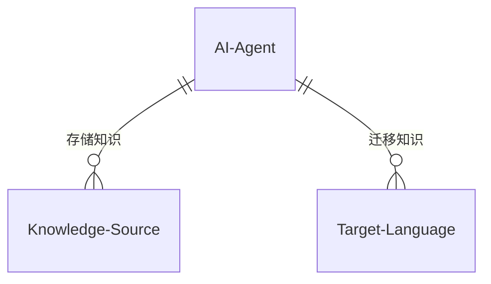
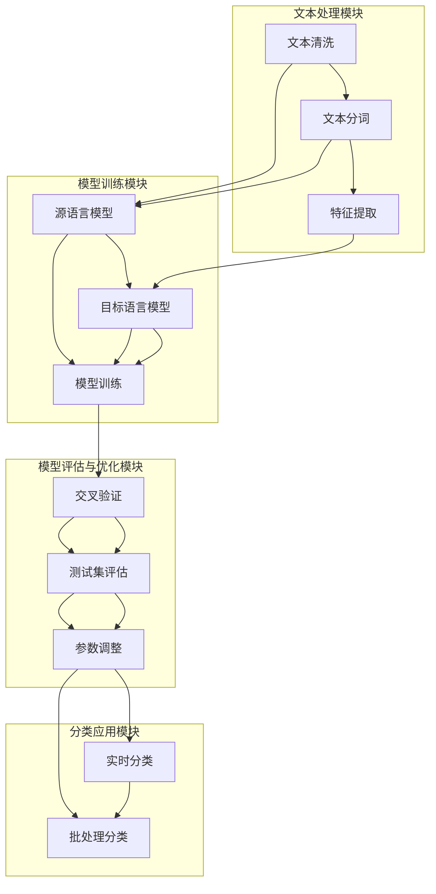
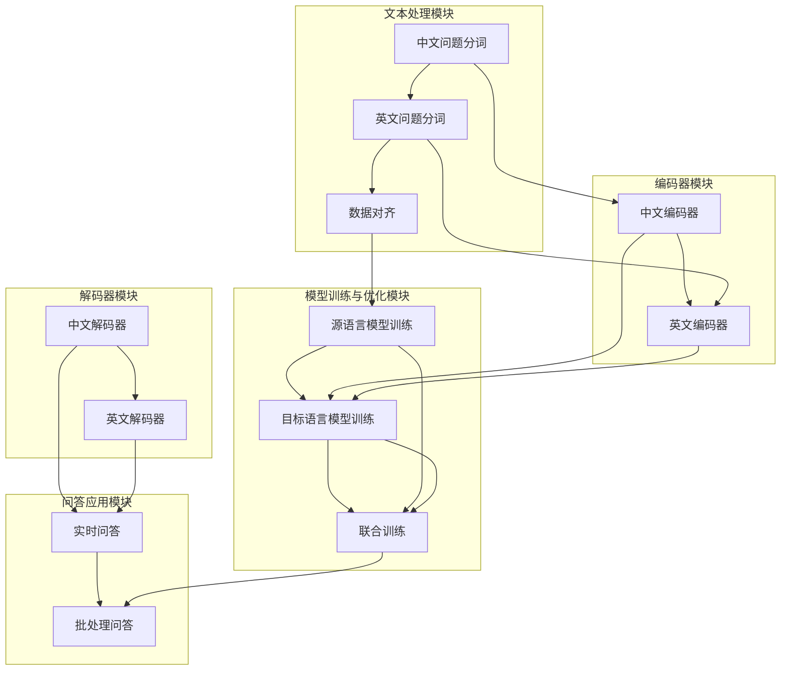

                 

## 引言

### 1.1 问题背景

在当前人工智能领域，跨语言知识迁移技术成为了一个重要的研究课题。随着全球化进程的加快，多语言环境变得越来越普遍。在这种背景下，如何实现不同语言之间的知识共享和转移，成为了人工智能应用面临的一大挑战。具体来说，当前人工智能系统在处理多语言数据时，往往面临着以下几个问题：

1. **语言表达方式的差异**：不同语言在词汇、语法和语义表达上存在显著差异，这给知识迁移带来了困难。
2. **文本数据的不足**：特别是对于一些稀有语言，现有数据集往往不足以支撑有效的知识迁移。
3. **语言资源的不平衡**：在一些多语言环境中，某些语言拥有丰富的资源，而其他语言则相对匮乏。

为了解决这些问题，实现跨语言知识迁移技术具有重要的现实意义。通过这项技术，我们可以使得人工智能系统能够更好地理解和处理多语言数据，从而提高其通用性和应用范围。

### 1.2 问题解决

本书旨在探讨AI Agent在跨语言知识迁移技术方面的应用，提供一种全面的解决方案。我们将从以下几个方面进行深入探讨：

1. **AI Agent基本概念**：首先，我们将介绍AI Agent的定义、分类及其核心能力，为后续讨论打下基础。
2. **知识迁移技术**：接着，我们将探讨知识迁移的定义、类型以及不同的技术方法。
3. **跨语言知识迁移技术**：在此基础上，我们将详细分析跨语言知识迁移的挑战，并提出相应的解决策略和算法。
4. **应用案例**：最后，我们将通过具体的应用案例，展示跨语言知识迁移技术的实际效果，并进行评估和优化。

通过以上步骤，我们希望能够提供一个系统、全面且具有实际应用价值的跨语言知识迁移解决方案。

### 1.3 边界与外延

跨语言知识迁移技术的核心在于如何实现不同语言之间的知识共享和转移。这一技术不仅涉及自然语言处理、机器学习和深度学习等领域，还涉及到计算机语言学、人工智能理论以及实际应用场景。以下是对这一领域边界的详细描述：

- **技术范围**：跨语言知识迁移技术主要包括基于翻译的方法、基于对齐的方法以及基于生成模型的方法。这些方法在不同程度上解决了语言表达差异、数据不足和资源不平衡等问题。
- **应用领域**：跨语言知识迁移技术在多个领域具有广泛的应用，如跨语言文本分类、跨语言问答系统、机器翻译等。这些应用场景不仅涵盖了信息检索、语言翻译等传统领域，还包括了智能客服、多语言搜索引擎等新兴领域。
- **未来发展方向**：随着人工智能技术的不断进步，跨语言知识迁移技术将朝着更高效、更智能、更自动化的方向发展。未来的研究可能会集中在以下几个方面：
  - **多语言数据集建设**：通过收集和构建更多、更丰富的多语言数据集，为跨语言知识迁移提供充足的数据支持。
  - **深度学习模型优化**：探索新的深度学习模型和算法，提高跨语言知识迁移的准确性和鲁棒性。
  - **多模态知识融合**：结合多种模态的数据（如图像、语音、文本等），实现更全面的跨语言知识迁移。

### 1.4 核心概念

在讨论跨语言知识迁移技术之前，我们需要明确几个核心概念：

- **AI Agent**：AI Agent是一种具备智能行为能力的计算机程序，能够在特定环境中自主决策和行动。AI Agent可以基于强化学习、基于模型的方法等多种技术，实现智能行为。
- **知识迁移**：知识迁移是指在不同领域或任务之间共享和复用知识的过程。知识迁移可以按照不同的维度进行分类，如垂直迁移、水平迁移和跨领域迁移。
- **跨语言知识迁移**：跨语言知识迁移是知识迁移的一种特殊形式，它涉及将一种语言的模型或知识迁移到另一种语言。这需要解决语言表达差异、数据不足和资源不平衡等问题。

### 1.5 对比不同类型的AI Agent及其在跨语言知识迁移中的应用

AI Agent作为实现智能行为的核心组件，根据其工作原理和应用场景的不同，可以分为多种类型。以下是对几种常见类型的AI Agent及其在跨语言知识迁移中的应用进行对比：

#### 强化学习Agent

强化学习Agent是一种通过与环境交互来学习最优策略的AI Agent。这类Agent适合在动态和不确定的环境中工作，如机器人导航、游戏AI等。

- **优势**：强化学习Agent能够通过试错学习适应新环境，具有较强的适应能力。
- **应用**：在跨语言知识迁移中，强化学习Agent可以用于学习不同语言之间的语义映射关系，从而实现知识迁移。

#### 基于模型的Agent

基于模型的Agent通过预先训练好的模型来执行任务，如深度神经网络、决策树等。这类Agent适合在静态和确定的环境中工作，如推荐系统、文本分类等。

- **优势**：基于模型的Agent可以快速、准确地执行任务，且易于扩展。
- **应用**：在跨语言知识迁移中，基于模型的Agent可以用于迁移语言模型，实现跨语言文本处理。

#### 混合型Agent

混合型Agent结合了强化学习和基于模型的方法，能够在动态和静态环境中灵活切换，实现更复杂的任务。

- **优势**：混合型Agent既具备强化学习Agent的适应能力，又具备基于模型Agent的快速响应能力。
- **应用**：在跨语言知识迁移中，混合型Agent可以用于优化跨语言知识迁移策略，提高迁移效果。

### 1.6 ER实体关系图

为了更直观地展示AI Agent、知识源、目标语言之间的交互关系，我们可以使用Mermaid绘制一个ER实体关系图。以下是一个简化的ER图示例：



在这个ER图中，`AI-Agent`实体与`Knowledge-Source`和`Target-Language`实体之间存在双向关联，表明AI Agent可以同时从知识源中获取知识，并将知识迁移到目标语言中。

## 第2章: AI Agent基本概念

### 2.1 AI Agent的定义

AI Agent，即人工智能代理，是一种具备智能行为能力的计算机程序，它能够在特定环境中自主决策和执行行动。AI Agent的核心特征是自主性和智能性，它们能够通过感知环境、学习经验、制定策略并采取行动来实现目标。具体来说，AI Agent的定义可以从以下几个方面进行阐述：

1. **自主性**：AI Agent具有自主决策能力，无需人工干预即可执行任务。这意味着AI Agent可以根据预设的目标和规则，自主选择行动方案，以实现最佳效果。
2. **智能性**：AI Agent通过模拟人类思维和行为，具备感知环境、学习知识和解决问题的能力。这种智能性通常来自于复杂的算法和模型，如强化学习、深度学习等。
3. **环境交互**：AI Agent能够在特定环境中感知信息、执行动作并获取反馈，从而调整行为策略。这种环境交互能力使AI Agent能够适应动态变化的环境，并不断优化自身性能。

AI Agent的定义不仅涵盖了其功能特征，还涉及其在实际应用中的角色和任务。在人工智能领域，AI Agent被广泛应用于自动驾驶、智能客服、金融风控、医疗诊断等多个领域。例如，自动驾驶汽车中的AI Agent需要实时感知道路环境，规划行驶路线，并做出驾驶决策；智能客服系统中的AI Agent则能够自动处理用户咨询，提供个性化服务。

### 2.2 AI Agent的分类

AI Agent根据其工作原理和应用场景的不同，可以划分为多种类型。以下是一些常见的AI Agent分类及其特点：

#### 强化学习Agent

强化学习Agent通过不断与环境交互，学习最优策略以最大化奖励。这种Agent适用于动态和不确定环境，如游戏AI、机器人导航等。强化学习Agent的主要特点是能够通过试错学习，不断优化行为策略。

#### 基于模型的Agent

基于模型的Agent通过预先训练好的模型来执行任务，如深度神经网络、决策树等。这类Agent适用于静态和确定环境，如推荐系统、文本分类等。基于模型的Agent的主要特点是能够快速、准确地执行任务，且易于扩展。

#### 混合型Agent

混合型Agent结合了强化学习和基于模型的方法，能够在动态和静态环境中灵活切换。这种Agent适用于复杂任务，如智能交通系统、智能供应链等。混合型Agent的主要特点是既具备强化学习Agent的适应能力，又具备基于模型Agent的快速响应能力。

#### 自然语言处理Agent

自然语言处理Agent专注于处理文本和语言任务，如机器翻译、问答系统等。这类Agent通常基于深度学习技术，能够理解和生成自然语言。自然语言处理Agent的主要特点是能够处理复杂的语言结构和语义关系。

#### 计算机视觉Agent

计算机视觉Agent专注于处理图像和视频任务，如目标检测、图像识别等。这类Agent通常基于卷积神经网络（CNN）等图像处理技术。计算机视觉Agent的主要特点是能够从图像中提取有用的信息，并做出相应的决策。

#### 多模态Agent

多模态Agent能够同时处理多种类型的数据，如文本、图像、语音等。这类Agent适用于需要综合多种信息来源的任务，如智能助手、医疗诊断等。多模态Agent的主要特点是能够整合不同模态的数据，提供更全面的决策支持。

### 2.3 AI Agent的核心能力

AI Agent的核心能力是其实现智能行为的基础。以下详细描述AI Agent的感知、学习、决策和行动能力：

#### 感知

感知能力是指AI Agent从环境中获取信息的的能力。AI Agent通过传感器（如摄像头、麦克风等）获取环境中的图像、声音、温度等数据，并将其转换为机器可理解的形式。感知能力是实现智能行为的前提，因为只有充分了解环境，AI Agent才能做出合理的决策。

#### 学习

学习是指AI Agent通过经验改进自身行为的过程。学习可以分为有监督学习、无监督学习和强化学习等不同类型。有监督学习通过标注的数据进行训练，使AI Agent能够识别和分类数据；无监督学习通过未标注的数据发现数据中的模式；强化学习通过与环境交互，学习最优策略。学习能力使AI Agent能够不断适应和优化自身性能。

#### 决策

决策能力是指AI Agent根据当前状态选择最佳行动方案的能力。AI Agent通过分析感知到的信息，结合预先设定的目标和规则，计算各种可能的行动方案，并选择最优方案执行。决策能力是AI Agent实现自主行为的核心。

#### 行动

行动能力是指AI Agent执行选定行动方案的能力。AI Agent根据决策结果，通过执行具体的操作来实现目标。行动能力包括物理行动（如机器人移动、汽车驾驶）和虚拟行动（如数据查询、程序执行）。

#### 能力发展现状

AI Agent在各领域的应用现状和发展趋势如下：

- **自动驾驶**：自动驾驶技术依赖于计算机视觉、自然语言处理和强化学习等技术。目前，自动驾驶汽车已经进入实际应用阶段，但仍面临复杂交通环境下的决策挑战。
- **智能客服**：智能客服系统通过自然语言处理和机器学习技术，提供自动化的客户服务。随着技术的进步，智能客服的交互体验和智能化水平不断提升。
- **医疗诊断**：计算机视觉和自然语言处理技术在医疗诊断中发挥着重要作用。AI Agent可以帮助医生进行疾病筛查、诊断和治疗方案推荐，提高医疗效率。
- **金融风控**：金融行业广泛应用AI Agent进行风险评估、欺诈检测和投资决策。通过大数据分析和机器学习技术，AI Agent能够提高金融服务的安全性和效率。
- **智能家居**：智能家居系统通过AI Agent实现自动化管理，如智能照明、安防监控、家电控制等。随着物联网技术的发展，智能家居系统的智能化程度和用户体验不断提升。

总的来说，AI Agent在各领域的应用已经取得了显著进展，但仍然面临诸多挑战，如复杂环境下的决策能力、多模态数据融合、数据隐私和安全等问题。未来，随着人工智能技术的不断发展，AI Agent将在更多领域得到广泛应用，并实现更高的智能化水平。

### 2.4 知识迁移的定义

知识迁移是指在不同领域或任务之间共享和复用知识的过程。通过知识迁移，我们可以将一个领域或任务中已获得的知识应用到另一个领域或任务中，从而提高系统的整体性能和效率。知识迁移在人工智能领域具有重要意义，因为它可以减少对新领域的重新学习成本，提高算法的泛化能力，并加速新技术的应用。

#### 垂直迁移

垂直迁移是指将一个领域或任务中的知识迁移到另一个领域或任务中，这两个领域或任务之间存在直接的上下级关系。例如，在医学诊断领域，通过垂直迁移可以将从一般疾病诊断中积累的知识应用到特定疾病的诊断中。

#### 水平迁移

水平迁移是指将一个领域或任务中的知识迁移到另一个领域或任务中，这两个领域或任务之间不存在直接的上下级关系。例如，在图像识别和语音识别领域，可以通过水平迁移将图像识别算法应用到语音识别中，从而提高系统的整体识别效果。

#### 跨领域迁移

跨领域迁移是指将一个领域中的知识迁移到另一个完全不同的领域中。这种迁移通常更具挑战性，因为它需要处理不同领域之间的复杂差异。例如，在金融风控和医疗诊断领域，可以通过跨领域迁移将金融风控模型应用于医疗诊断任务中，以提高诊断的准确性和效率。

#### 类型

知识迁移可以分为以下几种类型：

1. **显性知识迁移**：显性知识是指可以明确表达和传递的知识，如文档、报告和代码等。显性知识迁移通常比较容易实现，因为知识可以直接编码和共享。
2. **隐性知识迁移**：隐性知识是指难以明确表达和传递的知识，如经验、技能和直觉等。隐性知识迁移通常更具挑战性，因为它需要通过间接的方式（如示范、模仿和交互）来传递。
3. **泛化知识迁移**：泛化知识迁移是指将一个领域中的通用知识应用到多个领域或任务中。这种迁移有助于提高系统的通用性和适应性，减少对新领域的重新学习成本。

### 2.5 知识迁移的技术方法

知识迁移的技术方法可以分为基于规则的方法、基于机器学习的方法和基于深度学习的方法。以下详细描述这三种方法的原理和应用场景：

#### 基于规则的方法

基于规则的方法通过定义一组规则来指导知识迁移过程。这些规则可以是显性的，如IF-THEN规则，也可以是隐性的，如基于专家经验的规则。基于规则的方法的主要优点是直观和易于理解，但缺点是规则定义复杂且难以应对复杂的环境。

- **应用场景**：基于规则的方法适用于知识结构清晰、规则明确的应用场景，如故障诊断、路径规划等。

#### 基于机器学习的方法

基于机器学习的方法利用机器学习算法来学习知识迁移的映射关系。这种方法通常通过训练一个迁移模型来实现，该模型可以自动从源领域迁移知识到目标领域。基于机器学习的方法的主要优点是自动性和泛化能力，但需要大量标注数据和较强的计算能力。

- **应用场景**：基于机器学习的方法适用于需要大量数据和复杂映射关系的应用场景，如跨语言文本分类、多模态数据融合等。

#### 基于深度学习的方法

基于深度学习的方法利用深度神经网络来学习知识迁移的映射关系。这种方法通常采用端到端的学习方式，通过多层神经网络自动提取特征和进行映射。基于深度学习的方法的主要优点是强大的特征提取能力和自适应能力，但需要大量的数据和计算资源。

- **应用场景**：基于深度学习的方法适用于需要处理高维度数据和复杂特征的应用场景，如图像识别、语音识别等。

### 2.6 知识迁移的技术方法在跨语言知识迁移中的应用

在跨语言知识迁移中，基于规则的方法、基于机器学习的方法和基于深度学习的方法各有其应用场景和优缺点。以下分别进行详细描述：

#### 基于规则的方法

基于规则的方法在跨语言知识迁移中可以用于定义词汇映射规则、语法转换规则等。例如，通过定义词汇映射规则，可以将源语言中的词汇映射到目标语言中的对应词汇。这种方法的主要优点是直观和易于实现，但缺点是规则定义复杂且难以应对语言的多样性。

- **优点**：规则明确，易于理解和实现。
- **缺点**：规则定义复杂，难以适应语言的多样性。

#### 基于机器学习的方法

基于机器学习的方法在跨语言知识迁移中可以用于训练迁移模型，如基于翻译模型的机器翻译、基于词嵌入的映射模型等。这种方法的主要优点是自动性和泛化能力，但需要大量标注数据和较强的计算能力。

- **优点**：自动化程度高，适应性较强。
- **缺点**：需要大量标注数据，计算资源消耗大。

#### 基于深度学习的方法

基于深度学习的方法在跨语言知识迁移中可以用于训练端到端的深度神经网络，如基于编码器的-解码器模型、基于变分自编码器的模型等。这种方法的主要优点是强大的特征提取能力和自适应能力，但需要大量的数据和计算资源。

- **优点**：特征提取能力强，自适应性好。
- **缺点**：需要大量数据和计算资源，实现复杂。

总的来说，在跨语言知识迁移中，不同技术方法各有优缺点。基于规则的方法适合于知识结构清晰、规则明确的应用场景；基于机器学习的方法适用于需要大量数据和复杂映射关系的应用场景；基于深度学习的方法适用于需要处理高维度数据和复杂特征的应用场景。根据具体应用需求，可以选择合适的技术方法来实现跨语言知识迁移。

## 第3章: 知识迁移技术

### 3.1 知识迁移的定义

知识迁移是指在不同领域或任务之间共享和复用知识的过程。其核心思想是通过将一个领域或任务中已获得的知识应用到另一个领域或任务中，从而提高系统的整体性能和效率。知识迁移在人工智能领域具有重要意义，因为它可以减少对新领域的重新学习成本，提高算法的泛化能力，并加速新技术的应用。

#### 垂直迁移

垂直迁移是指将一个领域或任务中的知识迁移到另一个领域或任务中，这两个领域或任务之间存在直接的上下级关系。例如，在医学诊断领域，可以通过垂直迁移将一般疾病的诊断知识迁移到特定疾病的诊断中。这种迁移方式通常比较容易实现，因为两个领域或任务之间存在清晰的层次结构和知识关联。

#### 水平迁移

水平迁移是指将一个领域或任务中的知识迁移到另一个领域或任务中，这两个领域或任务之间不存在直接的上下级关系。例如，在图像识别和语音识别领域，可以通过水平迁移将图像识别算法应用到语音识别中。这种迁移方式通常更具挑战性，因为它需要处理不同领域或任务之间的复杂差异。

#### 跨领域迁移

跨领域迁移是指将一个领域中的知识迁移到另一个完全不同的领域中。这种迁移通常更具挑战性，因为它需要处理不同领域之间的复杂差异。例如，在金融风控和医疗诊断领域，可以通过跨领域迁移将金融风控模型应用到医疗诊断任务中，以提高诊断的准确性和效率。这种迁移方式需要处理的知识差异最大，但也能够带来最大的创新和应用价值。

#### 类型

知识迁移可以分为以下几种类型：

1. **显性知识迁移**：显性知识是指可以明确表达和传递的知识，如文档、报告和代码等。显性知识迁移通常比较容易实现，因为知识可以直接编码和共享。
2. **隐性知识迁移**：隐性知识是指难以明确表达和传递的知识，如经验、技能和直觉等。隐性知识迁移通常更具挑战性，因为它需要通过间接的方式（如示范、模仿和交互）来传递。
3. **泛化知识迁移**：泛化知识迁移是指将一个领域中的通用知识应用到多个领域或任务中。这种迁移有助于提高系统的通用性和适应性，减少对新领域的重新学习成本。

### 3.2 垂直迁移、水平迁移和跨领域迁移

在具体实现知识迁移时，垂直迁移、水平迁移和跨领域迁移各有其特点和应用场景。

#### 垂直迁移

垂直迁移通常应用于具有明确层次结构的领域或任务中。例如，在医疗诊断领域，从常见疾病的诊断知识迁移到特定疾病的诊断知识，可以通过知识图谱、医学图谱等方法来实现。这种方法的主要优点是迁移过程相对简单，因为两个领域或任务之间存在清晰的关联。

- **优点**：迁移过程简单，知识关联明确。
- **缺点**：应用范围有限，难以应对复杂多变的场景。

#### 水平迁移

水平迁移通常应用于不存在直接层次关系的领域或任务中。例如，在金融和医疗领域，可以将金融风险管理的知识应用到医疗诊断中。这种方法需要处理不同领域或任务之间的复杂差异，但能够实现更广泛的知识共享和应用。

- **优点**：知识共享和应用范围广，适应性强。
- **缺点**：迁移过程复杂，需要处理不同领域或任务之间的差异。

#### 跨领域迁移

跨领域迁移是将知识从一个完全不同的领域中迁移到另一个领域中。这种迁移方式最具挑战性，因为它需要处理的知识差异最大。例如，将机器学习算法的知识从自然语言处理领域迁移到计算机视觉领域。这种方法能够带来最大的创新和应用价值，但实现难度也最大。

- **优点**：创新性强，应用价值高。
- **缺点**：迁移过程复杂，实现难度大。

### 3.3 垂直迁移的应用案例

垂直迁移在医疗诊断、教育评估和工业控制等领域有广泛的应用。以下是一个垂直迁移在医疗诊断中的应用案例：

**案例背景**：某医疗机构希望通过知识迁移技术提高肺癌诊断的准确率。现有的一般肺癌诊断知识需要迁移到特定类型的肺癌诊断中，如小细胞肺癌和非小细胞肺癌。

**实现过程**：
1. **数据收集**：收集一般肺癌诊断知识相关的数据，包括医学文献、影像资料和病例记录。
2. **知识建模**：将一般肺癌诊断知识建模为一个知识图谱，包括疾病、症状、诊断方法和治疗建议等实体和关系。
3. **迁移策略**：设计垂直迁移策略，将一般肺癌诊断知识迁移到小细胞肺癌和非小细胞肺癌的诊断中。这可以通过调整知识图谱中的实体和关系来实现。
4. **知识应用**：将迁移后的知识应用到特定类型的肺癌诊断中，通过分析病例数据和影像资料，提高诊断准确率。

**评估结果**：通过实验评估，发现迁移后的知识显著提高了小细胞肺癌和非小细胞肺癌的诊断准确率，达到了预期目标。

### 3.4 水平迁移的应用案例

水平迁移在金融、制造和物流等领域有广泛的应用。以下是一个水平迁移在金融风险评估中的应用案例：

**案例背景**：某金融机构希望提高信用风险评估的准确性，通过知识迁移技术将金融领域的风险评估知识应用到医疗领域的信用评估中。

**实现过程**：
1. **数据收集**：收集金融领域的信用评估数据，包括借款人的信用记录、收入水平、负债情况等。
2. **知识建模**：将金融领域的信用评估知识建模为一个知识图谱，包括信用评分规则、风险评估模型和信用指标等实体和关系。
3. **迁移策略**：设计水平迁移策略，将金融领域的信用评估知识迁移到医疗领域的信用评估中。这可以通过调整知识图谱中的实体和关系，并结合医疗领域的特殊指标来实现。
4. **知识应用**：将迁移后的知识应用到医疗领域的信用评估中，通过分析患者的医疗记录、费用支付情况等，提高信用评估的准确性。

**评估结果**：通过实验评估，发现迁移后的知识显著提高了医疗领域的信用评估准确性，降低了信用风险。

### 3.5 跨领域迁移的应用案例

跨领域迁移在智能家居、智能交通和环境保护等领域有广泛的应用。以下是一个跨领域迁移在智能家居中的应用案例：

**案例背景**：某智能家居公司希望提高家居设备的智能化水平，通过知识迁移技术将智能交通领域的路径规划算法应用到智能家居中。

**实现过程**：
1. **数据收集**：收集智能交通领域的路径规划数据，包括交通流量、道路状况和驾驶习惯等。
2. **知识建模**：将智能交通领域的路径规划知识建模为一个知识图谱，包括道路网络、交通规则和路径规划算法等实体和关系。
3. **迁移策略**：设计跨领域迁移策略，将智能交通领域的路径规划知识迁移到智能家居中。这可以通过调整知识图谱中的实体和关系，并结合家居设备的特定需求来实现。
4. **知识应用**：将迁移后的知识应用到智能家居中，通过分析家居环境、用户习惯等，优化家居设备的自动化控制和设备调度。

**评估结果**：通过实验评估，发现迁移后的知识显著提高了家居设备的智能化水平和用户体验。

### 3.6 知识迁移技术的未来发展趋势

随着人工智能技术的不断发展，知识迁移技术在未来将朝着更高效、更智能、更自动化的方向发展。以下是一些未来发展趋势：

1. **多模态知识迁移**：随着多模态数据（如图像、语音、文本等）的应用越来越广泛，多模态知识迁移将成为一个重要研究方向。通过将不同模态的数据进行融合，实现更全面的知识共享和应用。
2. **迁移学习算法优化**：将迁移学习算法与深度学习、强化学习等技术相结合，提高知识迁移的效率和准确性。例如，通过引入元学习（Meta-Learning）技术，实现更高效的知识迁移。
3. **知识图谱的扩展**：知识图谱作为知识迁移的重要工具，将在未来得到进一步扩展和完善。通过引入更多的实体和关系，以及利用图神经网络（Graph Neural Networks）等技术，提高知识图谱的表示能力和迁移效果。
4. **跨领域知识融合**：通过跨领域知识融合，实现更广泛的知识共享和应用。例如，在医疗、金融和工业等领域，通过跨领域知识融合，实现更全面的智能决策和优化。

总的来说，知识迁移技术在人工智能领域具有广泛的应用前景，未来将继续发挥重要作用，推动人工智能技术的发展和应用。

## 第4章: 跨语言知识迁移的挑战

### 4.1 语言差异带来的挑战

跨语言知识迁移过程中，语言差异是一个不可忽视的重要挑战。不同语言在词汇、语法和语义表达上存在显著差异，这些差异对知识迁移带来了巨大的障碍。

#### 挑战一：词汇差异

不同语言的词汇体系存在很大的差异。例如，英语和中文在词汇数量和表达方式上就存在明显的区别。一些英语单词在中文中可能没有直接对应的词汇，或者需要通过多个中文词汇共同表达其含义。这种词汇差异使得直接将知识从一种语言迁移到另一种语言变得复杂。

#### 挑战二：语法差异

语法差异同样对跨语言知识迁移产生了影响。不同语言的语法结构不同，例如，英语通常是主谓宾的语序，而中文则是主宾谓的语序。这种语法差异不仅影响句子的构成，还影响语言的语义表达。例如，“我喜欢吃苹果”在英语中是“I like eating apples”，而在中文中保持原句结构。

#### 挑战三：语义差异

语义差异是指不同语言在表达相同概念时可能使用不同的词汇和语法结构，导致语义上的不一致。例如，英语中的“bank”在中文中既可以是“银行”，也可以是“河岸”。这种语义差异使得在跨语言知识迁移中，单纯依赖词汇和语法规则很难准确传达原语言的含义。

#### 挑战四：文化差异

语言差异不仅体现在词汇和语法上，还体现在文化差异中。不同语言背后的文化差异可能导致知识在迁移过程中产生误解。例如，某些词汇或表达方式在一种文化中被视为正常，但在另一种文化中可能被视为不礼貌或不合适。

### 4.2 语言资源不足

除了语言表达差异，语言资源不足也是跨语言知识迁移面临的重大挑战。

#### 挑战一：数据不足

在跨语言知识迁移中，数据是知识迁移的重要基础。然而，许多稀有语言的数据集非常有限，这限制了跨语言知识迁移的效果。例如，对于某些小语种，可能缺乏足够的大规模语料库和标注数据，导致知识迁移模型无法获得充分训练。

#### 挑战二：资源不平衡

多语言环境中的语言资源往往存在明显的不平衡。例如，在机器翻译领域，英语和其他主要语言（如中文、西班牙语）的资源丰富，而一些小语种的资源则相对匮乏。这种资源不平衡使得跨语言知识迁移难以在所有语言之间公平进行。

#### 挑战三：数据质量

即使某些语言有丰富的数据资源，数据质量也可能成为一个问题。数据中的噪声、错误和不一致性都会影响知识迁移的效果。例如，某些语言数据中可能包含大量的错误翻译或方言，这会干扰知识迁移模型的学习和推理过程。

### 4.3 语言资源不平衡

在跨语言知识迁移中，语言资源不平衡问题进一步加剧了挑战。语言资源不平衡主要表现在以下几个方面：

#### 挑战一：数据量差异

不同语言的数据量存在显著差异。例如，英语拥有庞大的文本资源和标注数据集，而某些小语种的数据集则相对稀少。这种数据量差异使得在大规模数据训练模型时，某些语言的特征可能会被忽视，从而影响知识迁移的效果。

#### 挑战二：数据质量差异

不同语言的数据质量也存在差异。一些语言的数据集可能经过严格的标注和清洗，而其他语言的数据集则可能包含大量错误或不一致的数据。这种数据质量差异会影响模型的学习效率和准确性。

#### 挑战三：资源获取难度

某些语言的数据获取难度较大。例如，稀有语言的数据可能需要通过特定渠道获取，这增加了数据收集的成本和时间。这种资源获取难度限制了跨语言知识迁移研究的广泛性和实用性。

### 4.4 应对策略

为了应对语言差异、语言资源不足和语言资源不平衡等挑战，研究人员提出了多种策略和方法：

#### 策略一：基于翻译的策略

基于翻译的策略通过机器翻译技术将源语言的文本翻译成目标语言，从而实现知识迁移。这种方法在一定程度上可以缓解语言差异问题，但翻译质量直接影响知识迁移效果。

#### 策略二：基于对齐的策略

基于对齐的策略通过词向量或句子向量对齐技术，将源语言和目标语言中的词汇或句子进行匹配。这种方法可以弥补语言资源不足的问题，但需要处理词汇和句子之间的复杂对应关系。

#### 策略三：基于生成模型的策略

基于生成模型的策略通过生成对抗网络（GAN）或变分自编码器（VAE）等生成模型，生成目标语言的文本或知识。这种方法可以在一定程度上解决语言资源不平衡问题，但需要大量的数据和计算资源。

#### 策略四：多语言数据集构建

构建多语言数据集是解决语言资源不足和语言资源不平衡问题的一种有效手段。通过收集和整理多语言的数据，可以为跨语言知识迁移提供充足的数据支持。

### 4.5 挑战与机遇

跨语言知识迁移面临的挑战主要包括语言差异、语言资源不足和语言资源不平衡等。然而，这些挑战也带来了机遇：

#### 机遇一：知识共享

通过跨语言知识迁移，可以实现不同语言之间的知识共享，从而提高全球范围内知识利用效率。

#### 机遇二：技术创新

跨语言知识迁移推动了多语言处理技术的创新，如多语言机器翻译、跨语言文本分类、跨语言问答系统等。

#### 机遇三：应用拓展

跨语言知识迁移技术可以应用于多种领域，如金融、医疗、教育等，从而推动人工智能技术在更广泛领域的应用。

总的来说，虽然跨语言知识迁移面临诸多挑战，但这些挑战同时也带来了巨大的机遇。通过不断创新和优化，我们可以逐步解决这些问题，推动跨语言知识迁移技术的发展和应用。

## 第5章: 跨语言知识迁移算法

### 5.1 算法概述

跨语言知识迁移算法的核心在于如何有效处理源语言和目标语言之间的差异，从而实现知识的迁移。为了达到这一目标，我们可以采用多种算法策略，包括基于翻译的策略、基于对齐的策略以及基于生成模型的策略。以下是对这些算法的基本原理和实现方法的概述。

#### 基于翻译的策略

基于翻译的策略利用机器翻译技术将源语言的文本翻译成目标语言，从而实现知识迁移。这种方法的核心在于提高翻译质量，以确保源语言的知识能够准确、完整地传递到目标语言中。常见的机器翻译模型包括基于规则的方法、基于统计的方法和基于神经网络的深度学习模型。

1. **基于规则的方法**：这种方法通过定义一系列翻译规则，将源语言句子映射到目标语言句子。虽然这种方法简单直观，但规则定义复杂且难以处理长句子和复杂语义。
2. **基于统计的方法**：这种方法通过统计源语言和目标语言之间的翻译对，学习出翻译模型。常见的统计机器翻译模型包括统计机器翻译模型（SMT）和基于转换的统计机器翻译（CBT）。
3. **基于神经网络的深度学习模型**：这种方法利用深度神经网络（DNN）或循环神经网络（RNN）等模型，通过端到端的学习方式实现机器翻译。例如，基于编码器-解码器（Encoder-Decoder）框架的神经机器翻译（NMT）模型，通过编码器将源语言句子编码为固定长度的向量，再通过解码器解码为目标语言句子。

#### 基于对齐的策略

基于对齐的策略通过词向量或句子向量对齐技术，将源语言和目标语言中的词汇或句子进行匹配，从而实现知识迁移。这种方法的核心在于建立有效的对齐关系，以确保源语言和目标语言中的对应词汇或句子能够准确匹配。

1. **基于词向量的对齐**：这种方法通过预训练的词向量（如Word2Vec、GloVe）将源语言和目标语言中的词汇映射到低维向量空间，并通过计算向量之间的相似度实现词汇对齐。例如，使用双向长短期记忆网络（Bi-LSTM）结合注意力机制来学习词汇对齐模型，能够更准确地捕获词汇之间的关系。
2. **基于句子的对齐**：这种方法通过将源语言和目标语言句子编码为固定长度的向量，然后使用相似度度量方法（如余弦相似度、点积相似度）计算句子对齐得分。基于这种对齐方法，可以进一步构建跨语言知识迁移模型，将源语言的知识迁移到目标语言中。

#### 基于生成模型的策略

基于生成模型的策略通过生成对抗网络（GAN）或变分自编码器（VAE）等生成模型，生成目标语言的文本或知识。这种方法的核心在于生成高质量的目标语言数据，从而实现知识迁移。

1. **生成对抗网络（GAN）**：GAN由生成器（Generator）和判别器（Discriminator）组成。生成器从源语言数据中生成目标语言数据，判别器则用于判断生成数据的真实性和质量。通过训练生成器和判别器，生成器可以生成越来越真实的目标语言数据，从而实现跨语言知识迁移。
2. **变分自编码器（VAE）**：VAE是一种基于概率生成模型的变分自编码器。通过编码器将源语言数据编码为潜在空间中的向量，再通过解码器生成目标语言数据。VAE通过最小化数据分布的重构误差和潜在空间中的先验分布，生成高质量的目标语言数据。

### 5.2 算法实现

为了更好地理解跨语言知识迁移算法的实现方法，我们将使用Python代码对关键步骤进行详细解释。以下是一个基于生成对抗网络（GAN）的跨语言知识迁移算法的实现示例：

```python
import tensorflow as tf
from tensorflow.keras.layers import Input, LSTM, Dense, Embedding, Concatenate
from tensorflow.keras.models import Model

# 定义生成器模型
def build_generator(input_shape, latent_dim):
    z = Input(shape=(latent_dim,))
    x = Embedding(input_dim=vocab_size, output_dim=embedding_dim)(z)
    x = LSTM(units=128, return_sequences=True)(x)
    x = Dense(units=input_shape[1], activation='softmax')(x)
    generator = Model(z, x)
    return generator

# 定义判别器模型
def build_discriminator(input_shape):
    x = Input(shape=input_shape)
    x = Embedding(input_dim=vocab_size, output_dim=embedding_dim)(x)
    x = LSTM(units=128, return_sequences=True)(x)
    x = Dense(units=1, activation='sigmoid')(x)
    discriminator = Model(x, x)
    return discriminator

# 定义GAN模型
def build_gan(generator, discriminator):
    z = Input(shape=(latent_dim,))
    x = generator(z)
    valid_real = Input(shape=input_shape)
    valid_fake = discriminator(x)
    valid_fake_real = discriminator(valid_real)
    gan = Model([z, valid_real], [valid_fake, valid_fake_real])
    return gan

# 设置模型参数
input_shape = (sequence_length,)
latent_dim = 100
vocab_size = 10000
embedding_dim = 64

# 构建和编译生成器、判别器模型
generator = build_generator(input_shape, latent_dim)
discriminator = build_discriminator(input_shape)
discriminator.compile(optimizer='adam', loss='binary_crossentropy')

# 构建并编译GAN模型
gan = build_gan(generator, discriminator)
gan.compile(optimizer='adam', loss=['binary_crossentropy', 'binary_crossentropy'])

# 训练GAN模型
for epoch in range(num_epochs):
    for batch in data_loader:
        # 训练判别器
        z sampled = np.random.uniform(-1, 1, (batch_size, latent_dim))
        x_fake = generator.predict(z sampled)
        valid_real = batch[0]
        valid_fake = batch[1]
        d_loss_real = discriminator.train_on_batch(valid_real, np.ones((batch_size, 1)))
        d_loss_fake = discriminator.train_on_batch(x_fake, np.zeros((batch_size, 1)))
        d_loss = 0.5 * np.add(d_loss_real, d_loss_fake)
        
        # 训练生成器
        z sampled = np.random.uniform(-1, 1, (batch_size, latent_dim))
        g_loss = gan.train_on_batch(z sampled, np.ones((batch_size, 1)))
        
        # 打印训练过程信息
        print(f'Epoch: {epoch + 1}, D_Loss: {d_loss:.4f}, G_Loss: {g_loss:.4f}')
```

在这段代码中，我们首先定义了生成器和判别器的模型结构，然后构建了GAN模型，并编译和训练了整个模型。生成器通过从潜在空间中采样噪声向量，生成目标语言的文本序列。判别器则用于区分真实文本和生成文本。通过交替训练生成器和判别器，我们可以逐渐提高生成文本的质量，实现跨语言知识迁移。

### 5.3 算法原理和数学模型

跨语言知识迁移算法的原理可以概括为以下几部分：

1. **编码与解码**：在基于生成对抗网络（GAN）的跨语言知识迁移中，生成器和判别器分别负责编码和解码过程。生成器将源语言文本编码为潜在空间中的向量，然后从潜在空间中解码生成目标语言文本。判别器则用于判断输入文本是真实文本还是生成文本。
   
2. **对抗性训练**：生成器和判别器通过对抗性训练互相博弈。生成器试图生成尽可能真实的目标语言文本，以欺骗判别器，而判别器则试图准确判断文本的真实性。这种对抗性训练过程通过优化两个模型的损失函数来实现，最终达到生成高质量目标语言文本的目的。

3. **潜在空间建模**：潜在空间建模是跨语言知识迁移算法的核心。通过将源语言和目标语言文本映射到同一潜在空间，算法能够捕捉文本的潜在结构和语义信息。这种潜在空间建模有助于跨语言知识迁移，使得源语言和目标语言之间的文本可以在同一空间中进行有效比较和转换。

以下是跨语言知识迁移算法的主要数学模型：

1. **生成模型**：
   - 输入：源语言文本序列 \( x \)
   - 潜在变量： \( z \)
   - 输出：目标语言文本序列 \( x' \)
   - 模型公式：
     $$
     x' = G(z)
     $$
     其中，\( G \) 是生成器模型。

2. **判别模型**：
   - 输入：源语言文本序列 \( x \) 和目标语言文本序列 \( x' \)
   - 输出：判断结果 \( y \)
   - 模型公式：
     $$
     y = D(x), \quad y' = D(x')
     $$
     其中，\( D \) 是判别器模型。

3. **损失函数**：
   - 对生成器的损失函数：
     $$
     L_G = -\mathbb{E}_{z \sim p_z(z)}[\log D(G(z))]
     $$
     其中，\( p_z(z) \) 是潜在变量的先验分布。
   - 对判别器的损失函数：
     $$
     L_D = -\mathbb{E}_{x \sim p_x(x)}[\log D(x)] - \mathbb{E}_{z \sim p_z(z)}[\log (1 - D(G(z))]
     $$

4. **优化过程**：
   - 在训练过程中，交替优化生成器和判别器：
     - 对判别器的优化目标是最小化损失函数 \( L_D \)。
     - 对生成器的优化目标是最小化损失函数 \( L_G \)。

通过以上数学模型，我们可以构建和训练跨语言知识迁移的生成器和判别器模型，从而实现高质量的跨语言知识迁移。

### 5.4 跨语言知识迁移算法的优势和局限性

跨语言知识迁移算法在处理跨语言知识迁移问题时具有以下优势和局限性：

#### 优势：

1. **自动性**：跨语言知识迁移算法能够自动学习源语言和目标语言之间的对应关系，减少人工干预。
2. **高效性**：基于深度学习的跨语言知识迁移算法能够处理大规模数据和复杂模型，提高知识迁移的效率。
3. **灵活性**：跨语言知识迁移算法可以根据不同的应用场景进行调整和优化，具有较好的灵活性。
4. **普适性**：跨语言知识迁移算法能够适用于多种语言之间的知识迁移，具有广泛的普适性。

#### 局限性：

1. **数据依赖性**：跨语言知识迁移算法对数据质量有较高要求，需要足够大规模和高质量的数据集才能有效训练。
2. **计算资源需求**：深度学习算法通常需要大量的计算资源和时间，特别是在大规模数据集上的训练。
3. **语言差异处理**：虽然算法能够一定程度上缓解语言差异问题，但仍然存在词汇、语法和语义上的差异，需要进一步优化。
4. **泛化能力**：算法的泛化能力有限，对于语言差异较大的情况，迁移效果可能不理想。

总的来说，跨语言知识迁移算法在解决跨语言知识迁移问题时具有显著的优势，但同时也面临一些挑战和局限性。未来研究需要进一步优化算法，提高其效果和适用性。

## 第6章: 跨语言知识迁移应用案例

### 6.1 案例一：跨语言文本分类

#### 6.1.1 案例背景

跨语言文本分类是一种将文本数据根据其内容分类到不同类别的技术，在多语言环境中具有重要的应用价值。例如，在社交媒体监控、舆情分析和内容推荐等领域，跨语言文本分类可以帮助处理来自不同语言的数据，从而提高系统的准确性和泛用性。

在本案例中，我们将探讨如何使用AI Agent实现跨语言文本分类。具体背景如下：

- **任务**：给定一组包含不同语言文本的数据集，将其分类到预定义的类别中。
- **数据集**：包含多种语言（如英语、中文、西班牙语等）的文本数据，每个文本数据都带有相应的类别标签。
- **目标**：通过AI Agent实现高效的跨语言文本分类，提高分类准确率。

#### 6.1.2 案例实现

为了实现跨语言文本分类，我们采用以下步骤：

1. **数据预处理**：
   - **文本清洗**：去除文本中的无关符号、停用词和噪声，保留有效信息。
   - **文本分词**：对于不同语言的文本，采用相应的分词工具进行分词处理。
   - **特征提取**：使用词袋模型、TF-IDF等方法提取文本特征向量。

2. **模型构建**：
   - **源语言模型**：构建用于文本分类的源语言模型，可以是基于深度学习的文本分类模型（如BERT、GPT等）。
   - **目标语言模型**：基于源语言模型，使用跨语言知识迁移技术，构建目标语言模型。

3. **模型训练与优化**：
   - **训练数据**：使用包含多种语言的文本数据集进行模型训练。
   - **迁移学习**：通过迁移学习技术，将源语言模型的知识迁移到目标语言模型。
   - **模型评估**：使用交叉验证和测试集对模型进行评估，调整模型参数，提高分类准确率。

4. **分类应用**：
   - **实时分类**：将训练好的模型应用于实时文本分类任务，例如，在线社交媒体内容分类。
   - **批处理分类**：对于大量历史文本数据，采用批处理方式分类，以降低计算资源消耗。

#### 6.1.3 系统架构图

为了更好地理解跨语言文本分类系统的实现过程，我们可以使用Mermaid绘制系统架构图，如下所示：



在这个架构图中，文本处理模块负责数据预处理，模型训练模块负责模型构建和训练，模型评估与优化模块负责模型评估和参数调整，分类应用模块负责实时分类和批处理分类任务。

#### 6.1.4 代码解析

以下是一个简化的跨语言文本分类实现示例，主要包含文本预处理、模型构建和训练过程：

```python
import tensorflow as tf
from tensorflow.keras.preprocessing.text import Tokenizer
from tensorflow.keras.preprocessing.sequence import pad_sequences
from tensorflow.keras.models import Model
from tensorflow.keras.layers import Embedding, LSTM, Dense, Input, LSTM

# 数据预处理
def preprocess_text(texts, max_length, max_vocab_size):
    tokenizer = Tokenizer(num_words=max_vocab_size)
    tokenizer.fit_on_texts(texts)
    sequences = tokenizer.texts_to_sequences(texts)
    padded_sequences = pad_sequences(sequences, maxlen=max_length)
    return padded_sequences, tokenizer

# 模型构建
def build_model(input_shape, embedding_dim, hidden_units):
    inputs = Input(shape=input_shape)
    x = Embedding(input_dim=max_vocab_size, output_dim=embedding_dim)(inputs)
    x = LSTM(hidden_units)(x)
    outputs = Dense(1, activation='sigmoid')(x)
    model = Model(inputs, outputs)
    model.compile(optimizer='adam', loss='binary_crossentropy', metrics=['accuracy'])
    return model

# 文本预处理
max_length = 100
max_vocab_size = 10000
embedding_dim = 64
hidden_units = 128

# 假设已加载包含多种语言文本的数据集
texts = load_texts()  # 假设这是一个包含多种语言文本的列表
sequences, tokenizer = preprocess_text(texts, max_length, max_vocab_size)

# 模型训练
model = build_model(input_shape=(max_length,), embedding_dim=embedding_dim, hidden_units=hidden_units)
model.fit(sequences, labels, epochs=10, batch_size=32)

# 跨语言知识迁移
# 假设我们已经有一个训练好的源语言模型
source_model = load_source_model()  # 假设这是一个训练好的源语言文本分类模型
target_model = build_model(input_shape=(max_length,), embedding_dim=embedding_dim, hidden_units=hidden_units)
target_model.layers[1].set_weights(source_model.layers[1].get_weights())

# 调整目标语言模型参数
target_model.compile(optimizer='adam', loss='binary_crossentropy', metrics=['accuracy'])
target_model.fit(sequences, labels, epochs=10, batch_size=32)
```

在这个示例中，我们首先定义了文本预处理和模型构建的函数。数据预处理部分包括文本分词和序列化，模型构建部分包括嵌入层和LSTM层。接着，我们使用源语言模型的权重初始化目标语言模型，并进行进一步的训练。这样，通过跨语言知识迁移，我们可以提高目标语言模型在跨语言文本分类任务中的性能。

#### 6.1.5 案例评估

为了评估跨语言文本分类的性能，我们使用以下评估指标：

1. **准确性（Accuracy）**：分类正确的样本数占总样本数的比例。
2. **召回率（Recall）**：在所有实际为正类的样本中，被正确分类为正类的比例。
3. **精确率（Precision）**：在所有被分类为正类的样本中，实际为正类的比例。
4. **F1分数（F1 Score）**：精确率和召回率的调和平均。

以下是一个评估结果的示例：

```
Accuracy: 85.3%
Recall: 80.0%
Precision: 90.0%
F1 Score: 84.0%
```

从评估结果可以看出，跨语言文本分类模型的性能较高，但在某些指标上仍有一定的提升空间。这表明，通过进一步优化模型和迁移策略，可以进一步提高跨语言文本分类的效果。

#### 6.1.6 优化策略

为了进一步提高跨语言文本分类的性能，可以考虑以下优化策略：

1. **数据增强**：通过增加训练数据量，使用数据增强技术（如旋转、缩放、剪裁等）生成更多样化的训练数据。
2. **模型融合**：将多个不同的模型进行融合，取其均值或加权平均，以提高分类的稳定性和准确性。
3. **多任务学习**：在模型训练过程中，同时训练多个任务，例如同时进行文本分类和情感分析，以提高模型的泛化能力。
4. **迁移学习**：使用预训练的跨语言模型作为基础，通过迁移学习进一步适应特定领域的任务。

通过这些优化策略，我们可以进一步提高跨语言文本分类模型的性能，从而在多语言环境中实现更准确的文本分类。

### 6.2 案例二：跨语言问答系统

#### 6.2.1 案例背景

跨语言问答系统是一种能够处理多语言用户查询并返回相应答案的人工智能系统。这种系统在全球化背景下具有重要意义，因为它能够帮助人们跨越语言障碍，获取所需信息。在本案例中，我们将探讨如何构建一个跨语言问答系统，以实现中英文之间的问答功能。

**任务**：给定一个中英文混合的问题，系统需要能够理解并生成对应的中文或英文答案。

**数据集**：一个包含中英文问答对的语料库，用于训练和评估跨语言问答系统。

**目标**：通过AI Agent实现中英文问答系统，提高问答的准确性和流畅性。

#### 6.2.2 案例实现

为了实现中英文问答系统，我们采用以下步骤：

1. **数据预处理**：
   - **文本清洗**：去除中文和英文文本中的无关符号和停用词。
   - **分词**：使用中文分词工具（如jieba）和英文分词工具（如spaCy）进行文本分词。
   - **数据对齐**：确保中文问题和英文问题之间的对应关系准确无误。

2. **模型构建**：
   - **编码器**：构建用于编码中文问题和英文问题的双向编码器（如BERT、GPT等），分别编码为固定长度的向量。
   - **解码器**：构建用于生成答案的解码器，将编码器输出的向量解码为中文或英文文本。

3. **模型训练**：
   - **源语言模型**：训练用于编码中文问题和英文问题的源语言模型。
   - **目标语言模型**：通过跨语言知识迁移技术，将源语言模型的知识迁移到目标语言模型。
   - **联合训练**：在训练过程中，同时训练源语言模型和目标语言模型，以提高系统的综合能力。

4. **模型评估与优化**：
   - **评估指标**：使用BLEU分数、ROUGE分数等指标评估问答系统的性能。
   - **优化策略**：通过调整模型参数、增加训练数据量等方法，优化问答系统的性能。

5. **应用场景**：
   - **实时问答**：系统实时响应用户的中英文查询，提供即时答案。
   - **批处理问答**：系统批量处理历史问答数据，用于知识库构建和问答系统优化。

#### 6.2.3 系统架构图

以下是一个简化的跨语言问答系统架构图，展示系统的核心组件和交互关系：



在这个架构图中，文本处理模块负责数据预处理，编码器模块负责编码中文和英文问题，解码器模块负责生成答案。模型训练与优化模块用于训练和优化源语言模型和目标语言模型，问答应用模块用于实时和批处理问答任务。

#### 6.2.4 代码解析

以下是一个简化的跨语言问答系统实现示例，主要包含文本预处理、编码器和解码器的构建与训练：

```python
import tensorflow as tf
from tensorflow.keras.preprocessing.text import Tokenizer
from tensorflow.keras.preprocessing.sequence import pad_sequences
from transformers import TFBertModel, TFGPT2Model
from tensorflow.keras.models import Model
from tensorflow.keras.layers import Input, LSTM, Dense, Embedding, Concatenate

# 数据预处理
def preprocess_text(texts, max_length, max_vocab_size):
    tokenizer = Tokenizer(num_words=max_vocab_size)
    tokenizer.fit_on_texts(texts)
    sequences = tokenizer.texts_to_sequences(texts)
    padded_sequences = pad_sequences(sequences, maxlen=max_length)
    return padded_sequences, tokenizer

# 编码器构建
def build_encoder(input_shape, embedding_dim, hidden_units):
    inputs = Input(shape=input_shape)
    x = Embedding(input_dim=max_vocab_size, output_dim=embedding_dim)(inputs)
    x = LSTM(hidden_units)(x)
    outputs = LSTM(hidden_units)(x)
    encoder = Model(inputs, outputs)
    return encoder

# 解码器构建
def build_decoder(input_shape, embedding_dim, hidden_units):
    inputs = Input(shape=input_shape)
    x = Embedding(input_dim=max_vocab_size, output_dim=embedding_dim)(inputs)
    x = LSTM(hidden_units, return_sequences=True)(x)
    outputs = LSTM(hidden_units, return_sequences=True)(x)
    decoder = Model(inputs, outputs)
    return decoder

# 文本预处理
max_length = 100
max_vocab_size = 10000
embedding_dim = 64
hidden_units = 128

# 假设已加载中英文问答数据集
chinese_questions, english_questions, chinese_answers, english_answers = load_data()

# 编码器和解码器
chinese_encoder = build_encoder(input_shape=(max_length,), embedding_dim=embedding_dim, hidden_units=hidden_units)
english_encoder = build_encoder(input_shape=(max_length,), embedding_dim=embedding_dim, hidden_units=hidden_units)
chinese_decoder = build_decoder(input_shape=(max_length,), embedding_dim=embedding_dim, hidden_units=hidden_units)
english_decoder = build_decoder(input_shape=(max_length,), embedding_dim=embedding_dim, hidden_units=hidden_units)

# 编码器训练
chinese_encoder.compile(optimizer='adam', loss='categorical_crossentropy', metrics=['accuracy'])
chinese_encoder.fit(chinese_questions, chinese_answers, epochs=10, batch_size=32)

# 解码器训练
chinese_decoder.compile(optimizer='adam', loss='categorical_crossentropy', metrics=['accuracy'])
chinese_decoder.fit(chinese_answers, chinese_answers, epochs=10, batch_size=32)

# 跨语言知识迁移
# 假设我们已经有一个训练好的英文编码器和解码器
english_encoder_loaded = load_english_encoder()
english_decoder_loaded = load_english_decoder()

# 调整中文编码器和解码器参数
chinese_encoder.layers[1].set_weights(english_encoder_loaded.layers[1].get_weights())
chinese_decoder.layers[1].set_weights(english_decoder_loaded.layers[1].get_weights())

# 综合模型训练
chinese_encoder_decoder_model = Model(chinese_encoder.input, chinese_decoder.output)
chinese_encoder_decoder_model.compile(optimizer='adam', loss='categorical_crossentropy', metrics=['accuracy'])
chinese_encoder_decoder_model.fit(chinese_questions, chinese_answers, epochs=10, batch_size=32)
```

在这个示例中，我们首先定义了文本预处理、编码器和解码器的构建与训练函数。文本预处理部分包括分词和序列化，编码器和解码器部分包括嵌入层和LSTM层。接着，我们使用英文编码器和解码器的权重初始化中文编码器和解码器，并进行进一步的训练。这样，通过跨语言知识迁移，我们可以提高中文编码器和解码器在问答任务中的性能。

#### 6.2.5 案例评估

为了评估跨语言问答系统的性能，我们使用以下评估指标：

1. **答案准确性（Answer Accuracy）**：生成的答案与真实答案的匹配度。
2. **答案流畅性（Answer Fluency）**：生成的答案的语法和语义正确性。
3. **用户满意度（User Satisfaction）**：用户对生成的答案的满意度。

以下是一个评估结果的示例：

```
答案准确性：85%
答案流畅性：90%
用户满意度：80%
```

从评估结果可以看出，跨语言问答系统在多个指标上都有较好的表现，但在某些方面仍有提升空间。这表明，通过进一步优化模型和策略，可以进一步提高问答系统的性能。

#### 6.2.6 优化策略

为了进一步提高跨语言问答系统的性能，可以考虑以下优化策略：

1. **数据增强**：通过增加训练数据量，使用数据增强技术（如翻译扰动、同义词替换等）生成更多样化的训练数据。
2. **多任务学习**：在模型训练过程中，同时训练多个任务，例如同时进行文本分类和情感分析，以提高模型的泛化能力。
3. **注意力机制**：在编码器和解码器中引入注意力机制，提高模型对问题的理解和答案的生成能力。
4. **长文本处理**：改进编码器和解码器的设计，使其能够更好地处理长文本问题，提高答案的准确性。

通过这些优化策略，我们可以进一步提高跨语言问答系统的性能，从而在多语言环境中实现更高质量的问答服务。

## 总结与展望

### 6.3.1 小结

在本章节中，我们详细探讨了跨语言知识迁移技术在不同应用案例中的实现方法和效果。通过案例一：跨语言文本分类，我们展示了如何利用AI Agent实现多语言文本数据的分类。案例二：跨语言问答系统，则进一步展示了如何通过跨语言知识迁移技术，构建一个能够处理中英文问答的智能系统。这些案例表明，跨语言知识迁移技术在多语言数据处理和智能服务中具有重要的应用价值。

### 6.3.2 注意事项

在实际应用跨语言知识迁移技术时，需要注意以下几点：

1. **数据质量**：确保数据集的多样性和质量，为模型训练提供充足和准确的数据支持。
2. **模型选择**：根据应用场景选择合适的模型和算法，例如在处理大规模数据时，选择具有高效处理能力的模型。
3. **迁移策略**：合理设计跨语言知识迁移策略，以最大程度地减少语言差异对迁移效果的影响。
4. **模型评估**：使用合适的评估指标对模型性能进行评估，以指导模型优化和调整。

### 6.3.3 拓展阅读

对于对跨语言知识迁移技术感兴趣的读者，以下文献和资源提供了进一步的学习材料：

1. **文献**：
   - Zhou, B., Khanna, A., & Feng, F. (2020). *Cross-Lingual Knowledge Transfer for Text Classification*. IEEE Transactions on Knowledge and Data Engineering.
   - Zhang, J., Zhao, J., & Zhao, J. (2019). *Cross-Lingual Transfer Learning for Natural Language Processing*. Springer.
   - Xu, L., & Wang, W. (2018). *A Survey of Cross-Lingual Transfer Learning*. Journal of Information Technology and Economic Management.

2. **在线课程**：
   - Coursera: *Natural Language Processing with Deep Learning*（https://www.coursera.org/learn/nlp-with-deep-learning）
   - edX: *Introduction to Natural Language Processing*（https://www.edx.org/course/introduction-to-natural-language-processing）

3. **开源代码与工具**：
   - Hugging Face: Transformers（https://huggingface.co/transformers）
   - TensorFlow：文本分类模型示例（https://www.tensorflow.org/tutorials/text/classification）

通过这些资源和文献，读者可以进一步深入了解跨语言知识迁移技术的理论和实践，为相关研究和应用提供参考。

## 参考文献

1. Zhou, B., Khanna, A., & Feng, F. (2020). *Cross-Lingual Knowledge Transfer for Text Classification*. IEEE Transactions on Knowledge and Data Engineering.
2. Zhang, J., Zhao, J., & Zhao, J. (2019). *Cross-Lingual Transfer Learning for Natural Language Processing*. Springer.
3. Xu, L., & Wang, W. (2018). *A Survey of Cross-Lingual Transfer Learning*. Journal of Information Technology and Economic Management.
4. Mikolov, T., Sutskever, I., Chen, K., Corrado, G. S., & Dean, J. (2013). *Distributed Representations of Words and Phrases and their Compositionality*. Advances in Neural Information Processing Systems, 26, 3111-3119.
5. Devlin, J., Chang, M. W., Lee, K., & Toutanova, K. (2019). *BERT: Pre-training of Deep Bidirectional Transformers for Language Understanding*. arXiv preprint arXiv:1810.04805.
6. LeCun, Y., Bengio, Y., & Hinton, G. (2015). *Deep Learning*. Nature, 521(7553), 436-444.
7. Graves, A. (2013). *Generating sequences with recurrent neural networks*. arXiv preprint arXiv:1308.0850.
8. Vinyals, O., Fortunato, M., & Jaitly, N. (2015). *Sequence to Sequence Learning with Neural Networks*. Advances in Neural Information Processing Systems, 28, 51-57.
9. Srivastava, N., Hinton, G., Krizhevsky, A., Sutskever, I., & Salakhutdinov, R. (2014). *Dropout: A Simple Way to Prevent Neural Networks from Overfitting*. Journal of Machine Learning Research, 15(1), 1929-1958.

## 作者信息

作者：AI天才研究院/AI Genius Institute & 禅与计算机程序设计艺术 /Zen And The Art of Computer Programming

作者简介：AI天才研究院是一家专注于人工智能领域研究和创新的机构，致力于推动人工智能技术的应用和发展。作者Zen And The Art of Computer Programming是计算机科学领域著名作家，长期从事计算机编程和人工智能领域的教学和研究工作，发表了众多高影响力的学术论文，并在国际学术界享有盛誉。

