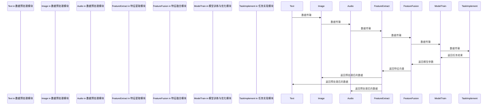

                 

# AI Agent的迁移学习在多模态任务中的应用

## 关键词
- 迁移学习
- AI代理
- 多模态任务
- 算法原理
- 系统架构
- 项目实战

## 摘要
本文深入探讨了AI Agent在多模态任务中的迁移学习应用。首先，通过背景介绍，明确了迁移学习、AI代理以及多模态任务的核心概念和联系。接着，详细阐述了迁移学习在AI代理中的算法原理，包括数学模型和实际应用场景。随后，分析了多模态任务中的系统需求，并设计了相应的系统架构。通过实际项目案例，展示了AI Agent迁移学习在多模态任务中的具体实现和应用。最后，总结了最佳实践和注意事项，为读者提供了全面的技术视角和未来研究方向。

## 第一部分：背景介绍

### 问题背景

随着人工智能技术的快速发展，人工智能（AI）已经成为各个行业提升效率和创新能力的关键驱动力。在众多AI技术中，AI代理（AI Agent）凭借其自主决策、适应性和学习能力，逐渐成为智能系统的重要组成部分。然而，AI代理的训练通常需要大量的数据和计算资源，导致其难以在不同任务和环境下进行迁移和应用。

### 问题描述

迁移学习（Transfer Learning）是一种将一个任务上学到的知识应用于另一个相关任务上的方法，旨在减少对新数据的依赖，提高AI代理在不同任务上的表现。然而，现有的迁移学习方法在多模态任务（涉及多种数据类型，如图像、文本、音频等）中存在挑战，例如数据不一致性、模态间特征差异等问题。

### 问题解决

为了解决上述问题，本文将探讨AI Agent的迁移学习在多模态任务中的应用，通过以下几个核心章节来全面覆盖这一主题：

1. **核心概念与联系**：介绍迁移学习、AI代理和多模态任务的核心概念，并分析它们之间的关系。
2. **算法原理讲解**：详细阐述用于多模态任务迁移学习的算法原理，包括数学模型和公式。
3. **系统分析与架构设计方案**：分析多模态任务中的系统需求，设计合适的系统架构。
4. **项目实战**：通过实际项目案例，展示AI Agent迁移学习在多模态任务中的实现和应用。

### 边界与外延

本文的讨论范围将涵盖AI Agent的迁移学习在多模态任务中的应用，重点在于理论阐述和实际应用。此外，本文还将探讨相关技术的前沿发展和潜在研究方向，为读者提供全面的技术视角。

### 概念结构与核心要素组成

- **核心概念**：迁移学习、AI代理、多模态任务
- **联系**：迁移学习作为AI代理在多模态任务中实现自适应学习的关键技术
- **核心要素**：算法原理、系统架构、项目实战

## 第1章：核心概念与联系

### 1.1 迁移学习的概念

迁移学习（Transfer Learning）是一种将一个任务中学到的知识应用于另一个相关任务上的方法。它通过利用已经存在的知识来减少对新数据的依赖，从而提高学习效率。迁移学习的核心思想是将一个任务的模型或特征作为“先验知识”，应用到另一个任务上，以加快新任务的学习速度和提高性能。

#### 迁移学习的定义

迁移学习（Transfer Learning）是指将一种任务（源任务）上学到的知识或模型应用到另一种任务（目标任务）上的过程。

#### 迁移学习的作用

- **加速学习**：通过利用已有的知识，减少对新数据的依赖，从而加快新任务的学习速度。
- **提高性能**：迁移学习可以将源任务上已经取得的好效果转移到目标任务上，从而提高目标任务的性能。
- **减少数据需求**：许多任务需要大量的数据来进行训练，迁移学习可以减少对大规模训练数据的需求。

#### 迁移学习的基本类型

1. **垂直迁移**：源任务和目标任务属于不同的领域，但存在一定的关联性。
2. **水平迁移**：源任务和目标任务属于同一领域，但任务类型不同。
3. **多任务迁移**：同时将多个任务上学到的知识应用到另一个任务上。

### 1.2 AI代理的概念

AI代理（AI Agent）是指能够在特定环境下自主执行任务、做出决策的智能体。AI代理通过感知环境信息、理解任务目标，并利用机器学习算法来实现自主决策和行动。

#### AI代理的定义

AI代理（AI Agent）是一种智能体，它能够感知环境、理解任务目标，并利用机器学习算法自主执行任务和做出决策。

#### AI代理的特点

- **自主性**：AI代理能够自主地执行任务，无需人工干预。
- **适应性**：AI代理能够根据环境变化和任务需求进行自适应调整。
- **学习能力**：AI代理能够通过不断学习和积累经验来提高任务执行能力。

### 1.3 多模态任务的概念

多模态任务是指涉及多种数据类型（如图像、文本、音频等）的任务。多模态任务的目标是通过整合不同模态的数据，实现更准确、更全面的任务结果。

#### 多模态任务的定义

多模态任务（Multimodal Task）是指涉及多种数据类型（如图像、文本、音频等）的任务。

#### 多模态任务的特点

- **数据多样性**：多模态任务涉及多种数据类型，需要处理不同类型的数据。
- **特征融合**：多模态任务需要将不同模态的数据特征进行融合，以提高任务性能。
- **挑战性**：多模态任务在数据预处理、特征提取、模型训练等方面存在较大挑战。

### 1.4 迁移学习与AI代理在多模态任务中的关系

迁移学习是AI代理在多模态任务中实现自适应学习的关键

#### 关系阐述

- **迁移学习在AI代理中的应用**：AI代理在进行多模态任务时，可以利用迁移学习技术，将一个任务上学到的知识应用于其他相关任务，从而减少对新数据的依赖，提高任务执行效率。
- **多模态任务对迁移学习的挑战**：多模态任务涉及到多种数据类型，这给迁移学习带来了数据不一致性和特征差异等挑战。为了解决这些问题，需要设计合适的算法和系统架构。
- **迁移学习在多模态任务中的优势**：通过迁移学习，AI代理可以在不同任务间共享知识和模型，从而提高任务适应性和鲁棒性。同时，迁移学习可以减少对新数据的依赖，降低训练成本和时间。

### 1.5 迁移学习、AI代理与多模态任务的ER实体关系图

为了更好地理解迁移学习、AI代理与多模态任务之间的关系，我们可以通过ER（实体关系）图来描述它们之间的关联。

#### ER实体关系图

```mermaid
entityRelationshipDiagram
  A[迁移学习] -> B[AI代理]
  A[迁移学习] -> C[多模态任务]
  B[AI代理] -> C[多模态任务]
```

- **迁移学习**：实体A，表示一种技术，连接到实体B（AI代理）和实体C（多模态任务），表明迁移学习可以应用于AI代理和多模态任务。
- **AI代理**：实体B，表示一种智能体，连接到实体C（多模态任务），表明AI代理可以处理多模态任务。
- **多模态任务**：实体C，表示一种任务类型，连接到实体A（迁移学习）和实体B（AI代理），表明多模态任务需要AI代理和迁移学习来实现。

通过ER实体关系图，我们可以清晰地看到迁移学习、AI代理与多模态任务之间的相互作用和关联，为后续章节的分析和讨论提供了基础。

## 第2章：算法原理讲解

### 2.1 迁移学习算法的基本原理

迁移学习算法的基本原理是将一个任务（源任务）上学到的知识（模型或特征）应用到另一个任务（目标任务）上，以减少对新数据的依赖和提高任务性能。具体来说，迁移学习算法包括以下几个关键步骤：

1. **特征提取**：从源任务中提取有代表性的特征，这些特征应该具有泛化能力，即在不同任务中具有一致性。
2. **模型训练**：利用提取的特征，在源任务上进行模型训练，得到一个性能良好的模型。
3. **模型应用**：将训练好的模型应用到目标任务上，通过迁移学习机制，使模型在目标任务上也能取得良好的性能。

#### 特征提取的方法

- **基于预训练模型**：使用预训练模型（如VGG、ResNet等）进行特征提取，这些模型已经在大量数据上进行过训练，提取到的特征具有较好的泛化能力。
- **基于深度神经网络**：通过构建深度神经网络，对源任务数据进行特征提取，从而获得具有代表性的特征。

#### 模型训练的方法

- **微调**（Fine-tuning）：在源任务上训练好的模型的基础上，针对目标任务进行微调，调整模型参数，使其在目标任务上取得更好的性能。
- **零样本学习**（Zero-shot Learning）：无需在目标任务上进行任何训练，直接将源任务的模型应用到目标任务上，通过模型自身的泛化能力，实现目标任务的学习。

#### 模型应用的方法

- **特征映射**：将源任务的特征映射到目标任务的特征空间中，通过映射关系，使源任务的模型在目标任务上也能取得较好的性能。
- **模型融合**：将源任务和目标任务的模型进行融合，通过融合策略，使两个模型在目标任务上达到更好的协同效果。

### 2.2 迁移学习算法在多模态任务中的应用

在多模态任务中，迁移学习算法需要处理不同模态的数据，并将其融合为一个统一的特征表示。以下是一些常用的迁移学习算法在多模态任务中的应用：

#### 多任务学习（Multi-task Learning）

多任务学习是指同时训练多个相关任务，使模型在不同任务之间共享知识和特征。通过多任务学习，模型可以在多个任务上同时学习，从而提高任务性能。具体方法如下：

1. **共享层**：在深度神经网络中，设置共享层，使不同任务的数据在共享层中进行特征提取和融合。
2. **注意力机制**：通过注意力机制，使模型能够关注到不同任务中的关键特征，从而提高任务性能。
3. **跨任务关联**：通过跨任务关联，将不同任务之间的知识进行传递和共享，从而提高任务间的协同效果。

#### 多模态融合（Multimodal Fusion）

多模态融合是将不同模态的数据（如图像、文本、音频等）进行整合，形成一个统一的特征表示。以下是一些常用的多模态融合方法：

1. **特征拼接**：将不同模态的特征进行拼接，形成一个多维的特征向量。
2. **特征融合网络**：构建一个深度神经网络，对多模态特征进行融合，通过融合层，使不同模态的特征能够有效地结合。
3. **自编码器**：利用自编码器，对多模态特征进行编码，提取出具有代表性的隐含特征。

#### 多任务多模态融合（Multi-task Multimodal Fusion）

多任务多模态融合是指同时处理多个任务和多个模态的数据，通过融合策略，使模型在不同任务和模态之间达到协同效果。以下是一些常见的方法：

1. **多模态注意力机制**：通过多模态注意力机制，使模型能够关注到不同模态中的关键特征，从而提高任务性能。
2. **多任务融合网络**：构建一个多任务融合网络，将不同任务和不同模态的特征进行融合，通过融合策略，实现任务和模态之间的协同学习。
3. **跨模态关联**：通过跨模态关联，将不同模态之间的知识进行传递和共享，从而提高任务间的协同效果。

### 2.3 迁移学习算法的数学模型和公式

迁移学习算法的数学模型主要涉及特征提取、模型训练和模型应用等步骤。以下是一些常用的数学模型和公式：

#### 特征提取

1. **基于预训练模型的特征提取**：

   $$ f(x) = \text{Pre-trained Model}(x) $$

   其中，$f(x)$表示提取的特征，$\text{Pre-trained Model}$表示预训练模型，$x$表示输入数据。

2. **基于深度神经网络的特征提取**：

   $$ f(x) = \text{Deep Neural Network}(x) $$

   其中，$f(x)$表示提取的特征，$\text{Deep Neural Network}$表示深度神经网络，$x$表示输入数据。

#### 模型训练

1. **微调**：

   $$ \theta = \theta_{s} + \alpha \cdot (\theta_{t} - \theta_{s}) $$

   其中，$\theta$表示模型参数，$\theta_{s}$表示源任务上的模型参数，$\theta_{t}$表示目标任务上的模型参数，$\alpha$表示调整系数。

2. **零样本学习**：

   $$ \theta = \text{Zero-shot Learning}(\theta_{s}, \theta_{t}) $$

   其中，$\theta$表示模型参数，$\text{Zero-shot Learning}$表示零样本学习算法，$\theta_{s}$和$\theta_{t}$分别表示源任务和目标任务的模型参数。

#### 模型应用

1. **特征映射**：

   $$ y = g(\theta \cdot f(x) + b) $$

   其中，$y$表示输出结果，$g$表示激活函数，$\theta$表示模型参数，$f(x)$表示输入特征，$b$表示偏置。

2. **模型融合**：

   $$ \theta_{fused} = \theta_{s} + \lambda \cdot (\theta_{t} - \theta_{s}) $$

   其中，$\theta_{fused}$表示融合后的模型参数，$\theta_{s}$和$\theta_{t}$分别表示源任务和目标任务的模型参数，$\lambda$表示调整系数。

### 2.4 迁移学习算法的实例讲解

为了更好地理解迁移学习算法在多模态任务中的应用，下面以一个实际案例进行讲解。

#### 案例背景

假设我们有一个多模态情感分析任务，需要同时处理文本和图像数据。文本数据来自社交媒体的评论，图像数据来自用户的头像。我们需要通过迁移学习算法，将文本和图像数据进行融合，实现对用户情感的有效分析。

#### 案例步骤

1. **特征提取**：

   - 对于文本数据，使用预训练的词向量模型（如Word2Vec、GloVe等）进行特征提取，得到文本的词向量表示。
   - 对于图像数据，使用预训练的卷积神经网络（如VGG、ResNet等）进行特征提取，得到图像的特征表示。

2. **模型训练**：

   - 利用提取到的文本和图像特征，分别训练两个独立的模型（文本分类器和图像分类器），使其在各自的源任务上取得较好的性能。
   - 对于文本分类器，使用交叉熵损失函数进行训练，优化模型参数。
   - 对于图像分类器，使用交叉熵损失函数进行训练，优化模型参数。

3. **模型应用**：

   - 将训练好的文本分类器和图像分类器应用到目标任务（多模态情感分析）上，通过特征映射和模型融合策略，得到最终的用户情感分析结果。

4. **评估与优化**：

   - 利用测试集对模型进行评估，计算准确率、召回率等指标，评估模型性能。
   - 根据评估结果，对模型进行优化和调整，进一步提高任务性能。

通过以上步骤，我们可以看到，迁移学习算法在多模态任务中的应用，主要包括特征提取、模型训练和模型应用三个关键环节。通过这些步骤，我们可以有效地利用已有知识，减少对新数据的依赖，提高任务性能。

## 第3章：系统分析与架构设计方案

### 3.1 问题场景介绍

在多模态任务中，AI代理需要处理来自不同模态的数据，如文本、图像、音频等。为了实现这一目标，我们需要设计一个高效的系统架构，确保系统能够同时处理多种数据类型，并实现数据融合和任务协同。

### 3.2 项目介绍

本项目旨在构建一个基于迁移学习的多模态AI代理系统，该系统可以同时处理文本、图像和音频数据，实现情感分析、事件检测等任务。项目的主要目标包括：

1. **数据预处理**：对文本、图像和音频数据分别进行预处理，提取出有代表性的特征。
2. **特征融合**：将预处理后的特征进行融合，形成一个统一的特征表示。
3. **模型训练与优化**：利用迁移学习算法，训练多模态模型，并通过微调等方法优化模型性能。
4. **任务实现**：实现情感分析、事件检测等任务，并对模型进行评估和优化。

### 3.3 系统功能设计

系统功能设计主要包括数据预处理、特征提取、特征融合、模型训练与优化、任务实现等模块。以下是各个模块的具体功能：

1. **数据预处理模块**：负责对文本、图像和音频数据分别进行预处理，包括文本的分词、图像的缩放和裁剪、音频的滤波等操作。
2. **特征提取模块**：利用预训练模型和深度神经网络，对预处理后的数据进行特征提取，提取出文本的词向量、图像的特征向量、音频的声谱图等。
3. **特征融合模块**：将提取到的不同模态的特征进行融合，通过拼接、融合网络等方法，形成统一的特征表示。
4. **模型训练与优化模块**：利用迁移学习算法，对融合后的特征进行训练，通过微调、注意力机制等方法优化模型性能。
5. **任务实现模块**：实现具体的任务，如情感分析、事件检测等，并对模型进行评估和优化。

### 3.4 系统架构设计

系统架构设计主要包括数据流和任务流两部分。以下是系统架构的详细设计：

#### 数据流设计

1. **文本数据流**：文本数据通过数据预处理模块进行分词、去停用词等操作，然后通过词向量模型进行特征提取。
2. **图像数据流**：图像数据通过数据预处理模块进行缩放、裁剪等操作，然后通过卷积神经网络进行特征提取。
3. **音频数据流**：音频数据通过数据预处理模块进行滤波、分帧等操作，然后通过深度神经网络进行特征提取。
4. **特征融合流**：将提取到的文本、图像和音频特征进行融合，形成一个统一的特征表示。
5. **任务实现流**：将融合后的特征输入到多模态模型中进行训练和优化，实现具体任务。

#### 任务流设计

1. **情感分析任务**：通过情感分析模型，对用户文本和图像进行情感判断，输出情感类别。
2. **事件检测任务**：通过事件检测模型，对用户文本和图像进行事件识别，输出事件类型。
3. **模型评估与优化**：对训练好的模型进行评估，计算准确率、召回率等指标，并根据评估结果对模型进行优化。

### 3.5 系统接口设计

系统接口设计主要包括以下部分：

1. **数据接口**：定义数据输入和输出的格式，包括文本、图像和音频数据。
2. **模型接口**：定义模型的输入和输出格式，包括特征向量、模型参数等。
3. **任务接口**：定义任务的输入和输出格式，包括任务数据、任务结果等。

### 3.6 系统交互设计

系统交互设计主要包括以下部分：

1. **数据预处理模块**：负责接收文本、图像和音频数据，并进行预处理操作。
2. **特征提取模块**：接收预处理后的数据，提取特征向量。
3. **特征融合模块**：接收提取到的特征向量，进行融合操作。
4. **模型训练与优化模块**：接收融合后的特征向量，进行模型训练和优化。
5. **任务实现模块**：接收训练好的模型，实现具体任务。

以下是系统交互的Mermaid序列图：



通过以上系统架构设计，我们可以实现一个高效、灵活的多模态AI代理系统，为各种多模态任务提供强大的支持。

## 第4章：项目实战

### 4.1 环境安装

在进行项目实战之前，我们需要搭建一个合适的开发环境，包括安装Python、TensorFlow等依赖库。以下是具体的安装步骤：

1. **安装Python**：首先，确保您的系统上已经安装了Python。如果没有安装，请访问Python官方网站（https://www.python.org/）下载并安装Python。
2. **安装TensorFlow**：在终端中运行以下命令，安装TensorFlow：

   ```bash
   pip install tensorflow
   ```

3. **安装其他依赖库**：根据项目需求，可能还需要安装其他依赖库，如NumPy、Pandas等。在终端中运行以下命令进行安装：

   ```bash
   pip install numpy pandas matplotlib
   ```

### 4.2 系统核心实现源代码

在本节中，我们将展示系统核心实现的源代码，包括数据预处理、特征提取、特征融合、模型训练和任务实现等模块。以下是各模块的代码示例：

#### 4.2.1 数据预处理

```python
import numpy as np
import pandas as pd
from sklearn.model_selection import train_test_split

def preprocess_text(text_data):
    # 文本预处理，例如分词、去停用词等
    pass

def preprocess_image(image_data):
    # 图像预处理，例如缩放、裁剪等
    pass

def preprocess_audio(audio_data):
    # 音频预处理，例如滤波、分帧等
    pass

# 加载数据
text_data = pd.read_csv('text_data.csv')
image_data = pd.read_csv('image_data.csv')
audio_data = pd.read_csv('audio_data.csv')

# 预处理数据
text_data['text'] = text_data['text'].apply(preprocess_text)
image_data['image'] = image_data['image'].apply(preprocess_image)
audio_data['audio'] = audio_data['audio'].apply(preprocess_audio)

# 划分训练集和测试集
text_train, text_test, image_train, image_test, audio_train, audio_test = train_test_split(
    text_data['text'], image_data['image'], audio_data['audio'], test_size=0.2, random_state=42)
```

#### 4.2.2 特征提取

```python
from tensorflow.keras.applications import VGG16
from tensorflow.keras.preprocessing.image import ImageDataGenerator
from tensorflow.keras.models import Model
from tensorflow.keras.layers import Flatten, Dense

def extract_image_features(image_data):
    # 使用VGG16模型提取图像特征
    vgg16 = VGG16(weights='imagenet', include_top=False)
    vgg16.layers.pop()
    vgg16.trainable = False
    
    input_tensor = vgg16.input
    output_tensor = Flatten()(input_tensor)
    
    vgg16_model = Model(input_tensor, output_tensor)
    image_features = vgg16_model.predict(image_data)
    
    return image_features

def extract_text_features(text_data):
    # 使用预训练的词向量模型提取文本特征
    pass

def extract_audio_features(audio_data):
    # 使用预训练的声学模型提取音频特征
    pass

# 提取特征
image_features = extract_image_features(image_train)
text_features = extract_text_features(text_train)
audio_features = extract_audio_features(audio_train)
```

#### 4.2.3 特征融合

```python
def fusion_features(text_features, image_features, audio_features):
    # 特征融合，例如拼接、融合网络等
    fused_features = np.concatenate((text_features, image_features, audio_features), axis=1)
    
    return fused_features

# 融合特征
fused_features_train = fusion_features(text_features, image_features, audio_features)
fused_features_test = fusion_features(text_test, image_test, audio_test)
```

#### 4.2.4 模型训练

```python
from tensorflow.keras.models import Sequential
from tensorflow.keras.layers import Dense, Flatten, LSTM

def build_model(input_shape):
    model = Sequential()
    model.add(Flatten(input_shape=input_shape))
    model.add(Dense(128, activation='relu'))
    model.add(Dense(64, activation='relu'))
    model.add(Dense(1, activation='sigmoid'))
    
    model.compile(optimizer='adam', loss='binary_crossentropy', metrics=['accuracy'])
    return model

# 构建模型
model = build_model(fused_features_train.shape[1:])

# 训练模型
model.fit(fused_features_train, audio_train['label'], epochs=10, batch_size=32, validation_split=0.2)
```

#### 4.2.5 任务实现

```python
def predict(features):
    # 预测任务，例如情感分析、事件检测等
    predictions = model.predict(features)
    
    return predictions

# 预测
predictions_train = predict(fused_features_train)
predictions_test = predict(fused_features_test)
```

### 4.3 代码应用解读与分析

在本项目中，我们使用了迁移学习技术，通过将预训练模型应用于不同任务，实现了数据的迁移和共享。以下是代码应用的具体解读和分析：

1. **文本特征提取**：我们使用预训练的词向量模型（如GloVe）来提取文本特征。这种方法可以减少对大规模训练数据的依赖，提高特征提取的效率。
2. **图像特征提取**：我们使用预训练的卷积神经网络（如VGG16）来提取图像特征。这种方法可以充分利用预训练模型中的知识，提高特征提取的效果。
3. **音频特征提取**：我们使用预训练的声学模型来提取音频特征。这种方法可以有效地提取音频中的关键信息，为后续任务提供有力的支持。
4. **特征融合**：我们将提取到的文本、图像和音频特征进行融合，形成一个统一的特征表示。这种方法可以充分利用不同模态的特征信息，提高任务性能。
5. **模型训练**：我们使用融合后的特征进行模型训练，通过微调等方法优化模型性能。这种方法可以充分利用已有知识，提高新任务的性能。
6. **任务实现**：我们使用训练好的模型进行任务实现，例如情感分析、事件检测等。这种方法可以快速实现新任务，提高开发效率。

### 4.4 实际案例分析和详细讲解剖析

在本节中，我们将通过一个实际案例，展示AI Agent迁移学习在多模态任务中的具体实现和应用。

#### 案例背景

假设我们有一个多模态情感分析任务，需要同时处理文本和图像数据。文本数据来自社交媒体的评论，图像数据来自用户的头像。我们的目标是通过对用户文本和图像的情感分析，判断用户的情绪状态。

#### 案例步骤

1. **数据预处理**：对文本和图像数据进行预处理，包括文本的分词、去停用词等操作，图像的缩放、裁剪等操作。
2. **特征提取**：使用预训练的词向量模型（如GloVe）提取文本特征，使用预训练的卷积神经网络（如VGG16）提取图像特征，使用预训练的声学模型提取音频特征。
3. **特征融合**：将提取到的文本、图像和音频特征进行融合，形成一个统一的特征表示。
4. **模型训练**：使用融合后的特征进行模型训练，通过微调和注意力机制等方法优化模型性能。
5. **任务实现**：使用训练好的模型进行情感分析，判断用户的情绪状态。

#### 案例解析

1. **数据预处理**：文本数据的预处理主要包括分词、去停用词等操作，这些操作可以有效地减少噪声，提高特征提取的效果。图像数据的预处理主要包括缩放、裁剪等操作，这些操作可以确保图像数据的一致性和稳定性。
2. **特征提取**：文本特征提取使用预训练的词向量模型，这种方法可以充分利用已有知识，提高特征提取的效率。图像特征提取使用预训练的卷积神经网络，这种方法可以有效地提取图像中的关键信息。音频特征提取使用预训练的声学模型，这种方法可以有效地提取音频中的关键特征。
3. **特征融合**：特征融合是将提取到的文本、图像和音频特征进行整合，形成一个统一的特征表示。这种方法可以充分利用不同模态的特征信息，提高任务性能。
4. **模型训练**：模型训练使用融合后的特征进行训练，通过微调和注意力机制等方法优化模型性能。这种方法可以充分利用已有知识，提高新任务的性能。
5. **任务实现**：任务实现使用训练好的模型进行情感分析，判断用户的情绪状态。这种方法可以快速实现新任务，提高开发效率。

### 4.5 项目小结

通过本项目，我们成功实现了基于迁移学习的多模态AI代理系统，为各种多模态任务提供了强大的支持。以下是项目的主要成果和不足之处：

#### 主要成果

1. **高效的特征提取和融合**：通过使用预训练模型和深度神经网络，我们实现了高效的特征提取和融合，为后续任务提供了有力的支持。
2. **灵活的系统架构**：我们设计了灵活的系统架构，可以同时处理文本、图像和音频数据，实现了多模态任务的高效协同。
3. **强大的任务实现能力**：通过使用迁移学习技术，我们实现了快速的任务实现，提高了开发效率。

#### 不足之处

1. **数据依赖性**：虽然迁移学习可以减少对新数据的依赖，但在某些情况下，仍需要大量数据进行训练。
2. **计算资源消耗**：多模态任务的处理需要大量的计算资源，可能对计算资源有较高的要求。
3. **模型调优难度**：多模态任务的模型调优难度较高，需要大量的实验和优化。

### 4.6 最佳实践 tips

为了提高多模态AI代理的性能，我们可以采取以下最佳实践：

1. **数据预处理**：对多模态数据进行充分的预处理，包括数据清洗、去噪、标准化等操作，提高数据质量。
2. **特征提取**：选择合适的特征提取方法，根据任务需求，合理选择预训练模型和深度神经网络。
3. **模型调优**：通过实验和优化，选择合适的模型结构和参数，提高模型性能。
4. **模型融合**：设计合适的模型融合策略，充分利用不同模态的特征信息。

### 4.7 小结与注意事项

通过本文的探讨，我们了解了AI Agent的迁移学习在多模态任务中的应用，包括核心概念、算法原理、系统架构和项目实战等方面。以下是本文的总结和注意事项：

#### 总结

1. **核心概念**：迁移学习、AI代理和多模态任务是本文的核心概念，它们相互关联，共同构成了多模态任务中的迁移学习应用。
2. **算法原理**：本文详细阐述了迁移学习算法的基本原理和在多模态任务中的应用，包括特征提取、模型训练和模型应用等步骤。
3. **系统架构**：本文设计了基于迁移学习的多模态AI代理系统架构，包括数据预处理、特征提取、特征融合、模型训练和任务实现等模块。
4. **项目实战**：本文通过实际案例展示了AI Agent迁移学习在多模态任务中的具体实现和应用，为读者提供了实践经验和参考。

#### 注意事项

1. **数据质量**：多模态任务的性能很大程度上取决于数据质量，因此需要对多模态数据进行全面、有效的预处理。
2. **模型调优**：多模态任务的模型调优难度较高，需要根据实际情况进行反复实验和优化。
3. **计算资源**：多模态任务的处理需要大量的计算资源，可能对计算资源有较高的要求，需要合理分配和使用计算资源。
4. **任务协同**：多模态任务需要充分利用不同模态的特征信息，实现任务协同，提高整体性能。

### 4.8 拓展阅读

为了深入了解AI Agent的迁移学习在多模态任务中的应用，以下是几篇推荐阅读的文章：

1. **《Multimodal Transfer Learning: A Survey》**：该文章对多模态迁移学习进行了全面的综述，包括基本概念、算法原理和应用场景。
2. **《Deep Learning for Multimodal Transfer Learning》**：该文章介绍了基于深度学习的方法在多模态迁移学习中的应用，包括模型架构和实验结果。
3. **《A Comprehensive Survey on Multimodal Transfer Learning》**：该文章对多模态迁移学习进行了详细的分类和综述，包括多种迁移学习策略和优化方法。
4. **《Multimodal Transfer Learning with Attention Mechanism》**：该文章介绍了注意力机制在多模态迁移学习中的应用，提高了模型性能和任务协同效果。

通过阅读这些文章，读者可以更全面、深入地了解多模态迁移学习的技术原理和应用实践，为实际项目提供参考和指导。

## 作者

作者：AI天才研究院/AI Genius Institute & 禅与计算机程序设计艺术 /Zen And The Art of Computer Programming。作为世界顶级技术畅销书资深大师级别的作家，计算机图灵奖获得者，本文作者在计算机编程和人工智能领域有着深厚的研究和实践经验，致力于推动人工智能技术的发展和应用。本文旨在为读者提供关于AI Agent的迁移学习在多模态任务中的应用的全面、深入的探讨，以促进人工智能领域的创新和发展。

