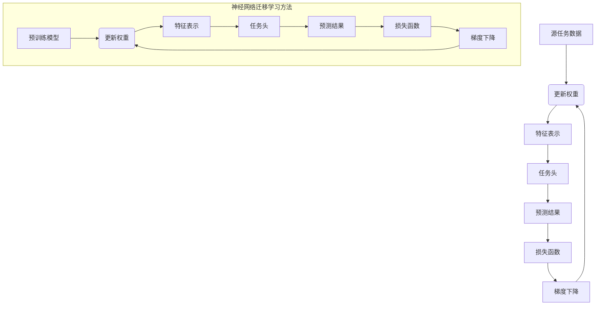

                 

### AI Agent的迁移学习：跨领域知识应用

关键词：AI Agent，迁移学习，跨领域知识应用，机器学习，深度学习

摘要：本文深入探讨了AI Agent的迁移学习原理及其在跨领域知识应用中的重要性。首先，我们介绍了迁移学习的概念、类型及其在AI领域的应用现状。接着，本文详细解析了迁移学习的基本概念、算法原理和评估指标，通过具体的实例和数学模型，帮助读者更好地理解其内在机制。随后，本文讨论了跨领域知识迁移的概念与挑战，并借助实际案例展示了迁移学习在跨领域知识应用中的实际效果。通过本文的阅读，读者可以掌握迁移学习的基本原理，学会如何在实际项目中应用迁移学习，以解决不同领域之间的知识迁移问题。

### 目录大纲

#### 第一部分：背景介绍

1. AI Agent的迁移学习：跨领域知识应用
2. 关键词
3. 摘要

#### 第二部分：核心概念与原理

1. 迁移学习的基本概念
2. 迁移学习的类型
3. 迁移学习的评估指标
4. 迁移学习的数学模型

#### 第三部分：迁移学习算法

1. 传统迁移学习方法
2. 神经网络迁移学习方法
3. 迁移学习的数学模型与公式

#### 第四部分：跨领域知识应用

1. 跨领域知识迁移的概念与挑战
2. 跨领域知识迁移的评估方法
3. 跨领域知识迁移的实际案例

#### 第五部分：跨领域知识迁移实战

1. 迁移学习工具与框架
2. 环境安装与配置
3. 系统核心实现
4. 应用解读与分析

#### 第六部分：最佳实践与拓展

1. 迁移学习最佳实践
2. 注意事项与常见问题
3. 拓展阅读

### 背景介绍

#### 迁移学习的概念及其在AI领域的应用现状

迁移学习（Transfer Learning）是机器学习和深度学习领域中的一项关键技术，它指的是将已从某一任务中学习到的知识或模型，迁移到另一相关任务中，以提高学习效率和性能。传统的机器学习方法往往需要大量的数据来进行训练，而在实际应用中，获取大量高质量的数据往往是一件困难且昂贵的事情。迁移学习通过利用预训练模型或已学习的特征表示，可以大大减少对新任务的训练数据需求，从而提高学习效率和准确性。

在AI领域，迁移学习的应用已经非常广泛。例如，在计算机视觉中，使用预训练的卷积神经网络（CNN）模型可以在新的任务中快速获得良好的性能。在自然语言处理（NLP）中，预训练的词嵌入模型（如Word2Vec、GloVe）可以迁移到各种文本分类、问答系统等任务中，显著提高模型的效果。

然而，迁移学习并非万能。它也存在一些挑战，例如不同领域之间的知识差距、模型的可解释性以及如何在迁移过程中保持模型的可扩展性等。这些问题需要我们深入探讨和解决。

#### 迁移学习的挑战与机遇

迁移学习的挑战主要体现在以下几个方面：

1. **领域差异性**：不同领域的数据分布、特征和任务目标可能存在巨大差异，使得迁移学习的效果受到影响。
2. **知识损失**：在迁移过程中，模型可能会丢失原始任务的一些重要信息，导致在新任务上的性能下降。
3. **模型泛化能力**：迁移学习模型需要具备较强的泛化能力，以便在不同领域之间保持良好的性能。
4. **计算资源**：迁移学习往往需要大量的计算资源，尤其是在训练大型神经网络时。

然而，迁移学习也带来了许多机遇：

1. **资源节省**：通过迁移学习，我们可以利用已有模型的训练成果，减少对新任务的数据需求，节省时间和成本。
2. **性能提升**：迁移学习可以使模型在新任务上迅速获得良好的性能，特别是在数据稀缺的情况下。
3. **模型多样化**：迁移学习可以促进模型的多样化，使得不同的模型可以相互借鉴和融合，从而提高整体性能。

#### 迁移学习与其他相关技术的比较与联系

迁移学习与许多其他技术有着密切的联系，例如数据增强、多任务学习和元学习等。

1. **数据增强**：数据增强是通过增加训练数据的多样性来提高模型性能的一种方法。它与迁移学习的不同之处在于，数据增强主要关注数据的扩展，而迁移学习则更关注已有知识的利用。
   
2. **多任务学习**：多任务学习是指同时学习多个相关任务，以提高模型的泛化能力和性能。多任务学习和迁移学习都可以利用多个任务的共同信息，但迁移学习更侧重于不同任务之间的知识迁移，而多任务学习则更侧重于同一任务中的信息共享。

3. **元学习**：元学习是指通过学习如何学习来提高模型学习效率的一种方法。它与迁移学习的不同之处在于，元学习更关注如何快速适应新的任务，而迁移学习则更侧重于已有知识在不同任务中的应用。

#### 迁移学习的核心概念与组成部分

迁移学习的核心概念包括：

1. **源任务**（Source Task）：已经学习的任务，其知识将被迁移到目标任务。
2. **目标任务**（Target Task）：需要学习的新任务，通常数据稀缺或难以获取。
3. **迁移**（Transfer）：将源任务的知识应用到目标任务中，以提高目标任务的性能。

迁移学习的主要组成部分包括：

1. **特征提取器**（Feature Extractor）：从输入数据中提取有用特征的网络或模型。
2. **任务头**（Task Head）：用于执行具体任务的模块，通常是一个分类器或回归器。
3. **迁移策略**（Transfer Strategy）：如何将源任务的模型或特征迁移到目标任务的方法。

#### 第一部分总结

在这一部分中，我们介绍了迁移学习的概念、类型及其在AI领域的应用现状，探讨了迁移学习的挑战与机遇，并比较了迁移学习与其他相关技术的联系。通过这些内容，我们为后续深入探讨迁移学习原理和算法奠定了基础。

在接下来的章节中，我们将进一步解析迁移学习的基本概念、算法原理和评估指标，帮助读者全面了解迁移学习的技术细节和应用场景。

### 核心概念与原理

#### 迁移学习的基本概念

迁移学习（Transfer Learning）是机器学习和深度学习中的一个重要概念，它涉及将已从某一任务中学习到的知识或模型应用到另一个相关任务中。具体来说，迁移学习可以分为以下几个关键概念：

1. **源任务**（Source Task）：这是已经完成的任务，模型或知识将从中被提取和迁移。源任务通常已经通过大量数据进行了充分训练，从而形成了一个较为完善的模型。
   
2. **目标任务**（Target Task）：这是需要新学习的任务，其数据可能不足或难以获取。目标任务的性能可以通过将源任务的模型或特征迁移过来得到显著提升。

3. **知识迁移**（Knowledge Transfer）：这是指将源任务中的知识（如模型参数、特征表示等）转移到目标任务中的过程。知识迁移的目的是利用源任务的训练成果，减少目标任务的训练需求，从而提高目标任务的性能。

4. **共享特征表示**（Shared Feature Representation）：在迁移学习中，共享特征表示是非常关键的。共享特征表示意味着源任务和目标任务使用相同的特征提取器，这样可以使得源任务中提取的特征对目标任务也有用。

5. **适应**（Adaptation）：在迁移学习过程中，通常需要对源任务的模型进行一定的调整，使其更适应目标任务的特性。这一过程称为适应。适应可以通过重新训练部分模型层、使用辅助任务或元学习等方法实现。

#### 迁移学习的类型

根据源任务和目标任务之间的关系，迁移学习可以分为以下几种类型：

1. **自上而下迁移**（Supervised Transfer Learning）：在这种方法中，源任务是一个已完成的监督学习任务，其模型或特征将被直接迁移到目标任务中。目标任务通常是一个监督学习任务，但其训练数据不足。通过迁移源任务的知识，可以显著提高目标任务的性能。

2. **自下而上迁移**（Unsupervised Transfer Learning）：在这种方法中，源任务通常是一个无监督学习任务，如自编码器（Autoencoder）。自编码器能够提取数据的低维特征表示，这些特征表示可以迁移到目标任务中。目标任务可以是监督学习任务，也可以是无监督学习任务。

3. **无监督迁移学习**（Unsupervised Transfer Learning）：在这种方法中，源任务和目标任务都是无监督学习任务。无监督迁移学习的典型应用包括使用预训练的自编码器提取特征表示，然后使用这些特征表示进行聚类、降维或其他无监督学习任务。

4. **零样本迁移学习**（Zero-Shot Transfer Learning）：在这种方法中，目标任务的标签（类别）与源任务的标签完全不同。零样本迁移学习的关键挑战是如何处理目标任务中的未知类别。常用的方法包括原型网络（Prototypical Networks）、匹配网络（Matching Networks）和元学习（Meta-Learning）等。

5. **跨域迁移学习**（Cross-Domain Transfer Learning）：在这种方法中，源任务和目标任务属于不同的领域或分布。跨域迁移学习的核心是处理领域差异，常用的方法包括领域自适应（Domain Adaptation）、领域偏置（Domain Disentanglement）和领域无关特征提取（Domain-Invariant Feature Extraction）等。

#### 迁移学习的评估指标

在迁移学习中，评估指标的选择至关重要，因为它能够衡量迁移学习的有效性和性能。以下是一些常用的评估指标：

1. **准确率**（Accuracy）：准确率是评估分类任务最常用的指标，表示正确分类的样本数占总样本数的比例。
   
2. **召回率**（Recall）：召回率表示在所有实际为正类的样本中，被正确识别为正类的比例。召回率对于处理稀有类别尤为重要。

3. **精确率**（Precision）：精确率表示在所有被识别为正类的样本中，实际为正类的比例。精确率关注的是模型的判断能力。

4. **F1分数**（F1 Score）：F1分数是精确率和召回率的调和平均，它能够综合考虑这两个指标，是评估分类任务性能的全面指标。

5. **均方误差**（Mean Squared Error, MSE）和均绝对误差**（Mean Absolute Error, MAE）：这些指标通常用于评估回归任务的性能。MSE表示预测值与真实值之间的平均平方误差，MAE表示预测值与真实值之间的平均绝对误差。

6. **交叉验证分数**（Cross-Validation Score）：交叉验证是一种常用的模型评估方法，它通过将数据集划分为多个子集，轮流使用每个子集作为验证集，来评估模型的泛化能力。

#### 迁移学习的数学模型与公式

在迁移学习中，数学模型和公式是理解其工作机制的关键。以下是一些基本的数学模型和公式：

1. **特征提取器**（Feature Extractor）的输出：
   $$ 
   \text{output} = \text{feature\_extractor}(\text{input}) 
   $$
   这里，`input` 是输入数据，`feature_extractor` 是用于提取特征的模型或网络。

2. **任务头**（Task Head）的输出：
   $$
   \text{output} = \text{task\_head}(\text{feature\_extractor}(\text{input})) 
   $$
   这里，`task_head` 是用于执行具体任务的模块，如分类器或回归器。

3. **损失函数**（Loss Function）：
   $$
   \text{loss} = \text{loss\_function}(\text{output}, \text{label}) 
   $$
   这里，`output` 是模型输出，`label` 是真实标签，`loss_function` 是用于计算预测值与真实值之间差异的函数。

4. **梯度下降**（Gradient Descent）：
   $$
   \text{weight} \leftarrow \text{weight} - \alpha \cdot \nabla_{\text{weight}} \text{loss} 
   $$
   这里，`weight` 是模型的权重，`alpha` 是学习率，`gradient` 是损失函数关于模型权重的梯度。

5. **迁移策略**（Transfer Strategy）：
   $$
   \text{transfer\_strategy}(\text{source\_model}, \text{target\_data}) 
   $$
   这里，`source_model` 是源任务的模型，`target_data` 是目标任务的数据，`transfer_strategy` 是用于迁移知识的策略。

#### 实例说明

假设我们有一个源任务是一个图像分类任务，其模型已经通过大量数据进行了训练。现在，我们希望将这个模型迁移到一个新的图像分类任务中，该任务的数据稀缺。

1. **特征提取器**：
   我们使用预训练的卷积神经网络（如VGG16）作为特征提取器，其输入是图像，输出是一组特征向量。

2. **任务头**：
   我们将特征向量输入到一个简单的全连接神经网络中，用于执行新的图像分类任务。

3. **适应**：
   为了使模型更好地适应新任务，我们对全连接神经网络进行微调（Fine-Tuning），只训练其顶部几层，而保留特征提取器的权重不变。

4. **损失函数**：
   使用交叉熵损失函数来计算预测标签与真实标签之间的差异。

5. **梯度下降**：
   通过反向传播计算梯度，并使用梯度下降更新全连接神经网络的权重。

通过以上步骤，我们可以将源任务的知识迁移到目标任务中，从而在新的图像分类任务中获得良好的性能。

#### 总结

在这一部分中，我们详细介绍了迁移学习的基本概念、类型和评估指标，并解释了迁移学习的数学模型与公式。通过实例说明，我们帮助读者更好地理解了迁移学习的工作原理和实际应用。在下一部分中，我们将探讨传统迁移学习方法和神经网络迁移学习方法，进一步揭示迁移学习的魅力。

### 迁移学习算法

#### 传统迁移学习方法

传统迁移学习方法主要包括简单线性回归、特征重用和模型复用等。这些方法在不同的场景中有不同的应用，但它们的共同目标是通过利用已有的知识来提高新任务的学习效率和准确性。

1. **简单线性回归**：
   简单线性回归是一种基础的迁移学习方法，它假设源任务和目标任务之间具有线性关系。具体来说，它通过将源任务的模型（如回归系数）迁移到目标任务，从而实现知识的共享。这种方法通常用于数据量较小、任务相似度较高的场景。

   **实例说明**：
   假设我们有一个源任务是一个线性回归问题，其模型参数为 \( w_1 \) 和 \( w_2 \)。现在，我们希望将这个模型迁移到一个新的线性回归问题中。我们只需要将源任务的 \( w_1 \) 和 \( w_2 \) 直接应用到新任务中，并利用新任务的数据进行微调即可。

2. **特征重用**：
   特征重用方法通过将源任务的输入特征直接作为目标任务的输入特征，从而实现知识的迁移。这种方法适用于源任务和目标任务具有相似的输入特征，但数据分布不同的场景。

   **实例说明**：
   假设我们有一个源任务是一个图像分类任务，其输入特征是图像的像素值。现在，我们希望将这个特征迁移到一个新的图像分类任务中。在这种情况下，我们可以直接使用源任务的像素值作为新任务的输入特征，并通过调整模型参数来适应新任务。

3. **模型复用**：
   模型复用方法通过将源任务的整个模型（或部分模型）迁移到目标任务中，从而实现知识的共享。这种方法适用于源任务和目标任务具有高度相似性的场景。

   **实例说明**：
   假设我们有一个源任务是一个语音识别任务，其模型是一个深度神经网络。现在，我们希望将这个模型迁移到一个新的语音识别任务中。在这种情况下，我们可以直接使用源任务的神经网络模型，并通过调整其输入和输出层来适应新任务。

#### 神经网络迁移学习方法

随着深度学习的兴起，神经网络迁移学习方法成为迁移学习的主要方向。这些方法通过利用预训练模型或特征表示来提高新任务的学习效率和准确性。

1. **残差网络**：
   残差网络（Residual Network，ResNet）是一种重要的深度学习模型，它通过引入残差连接来解决深层网络训练中的梯度消失问题。残差网络迁移学习方法通过将预训练的残差网络迁移到新任务中，从而实现知识的共享。

   **实例说明**：
   假设我们有一个预训练的残差网络，其已经在大规模图像数据集上进行了训练。现在，我们希望将这个网络迁移到一个新的图像分类任务中。我们可以直接使用预训练的残差网络作为特征提取器，并在其基础上添加一个分类器来执行新任务。

2. **预训练模型**：
   预训练模型（Pre-Trained Model）是通过在大规模数据集上预训练得到的模型，其特征提取能力已经得到了验证。预训练模型迁移学习方法通过将预训练模型迁移到新任务中，从而实现知识的共享。

   **实例说明**：
   假设我们有一个预训练的BERT模型，它已经在大量文本数据集上进行了训练。现在，我们希望将这个模型迁移到一个新的文本分类任务中。我们可以直接使用BERT模型作为特征提取器，并在其基础上添加一个分类器来执行新任务。

3. **元学习**：
   元学习（Meta-Learning）是一种通过学习如何学习来提高模型泛化能力的方法。元学习迁移学习方法通过利用元学习算法来快速适应新任务，从而实现知识的共享。

   **实例说明**：
   假设我们有一个元学习算法，如MAML（Model-Agnostic Meta-Learning）。现在，我们希望将这个算法迁移到一个新的分类任务中。在这种情况下，我们可以使用MAML算法来训练一个初始模型，并利用少量新任务数据来快速适应新任务。

#### 迁移学习的数学模型与公式

在迁移学习中，数学模型和公式是理解其工作机制的关键。以下是一些基本的数学模型和公式：

1. **特征提取器**（Feature Extractor）的输出：
   $$ 
   \text{output} = \text{feature\_extractor}(\text{input}) 
   $$
   这里，`input` 是输入数据，`feature_extractor` 是用于提取特征的模型或网络。

2. **任务头**（Task Head）的输出：
   $$
   \text{output} = \text{task\_head}(\text{feature\_extractor}(\text{input})) 
   $$
   这里，`task_head` 是用于执行具体任务的模块，如分类器或回归器。

3. **损失函数**（Loss Function）：
   $$
   \text{loss} = \text{loss\_function}(\text{output}, \text{label}) 
   $$
   这里，`output` 是模型输出，`label` 是真实标签，`loss_function` 是用于计算预测值与真实值之间差异的函数。

4. **梯度下降**（Gradient Descent）：
   $$
   \text{weight} \leftarrow \text{weight} - \alpha \cdot \nabla_{\text{weight}} \text{loss} 
   $$
   这里，`weight` 是模型的权重，`alpha` 是学习率，`gradient` 是损失函数关于模型权重的梯度。

#### 算法流程图

为了更好地理解传统迁移学习方法和神经网络迁移学习方法的算法流程，我们可以使用Mermaid流程图进行可视化。



通过以上流程图，我们可以清晰地看到传统迁移学习方法和神经网络迁移学习方法的区别和联系。

#### 总结

在这一部分中，我们详细介绍了传统迁移学习方法和神经网络迁移学习方法，并通过具体的实例和流程图帮助读者更好地理解其工作机制和应用场景。在下一部分中，我们将探讨跨领域知识迁移的概念与挑战，进一步拓展迁移学习的研究领域。

### 跨领域知识迁移

#### 跨领域知识迁移的概念与挑战

跨领域知识迁移（Cross-Domain Transfer Learning）是指将从一个领域学习到的知识应用到另一个相关但不完全相同领域的过程。在现实世界中，许多任务和领域之间的边界是模糊的，它们之间存在一定的相关性。跨领域知识迁移的目标是利用这种相关性，将源领域中的知识有效地迁移到目标领域，从而提高目标领域的性能和效率。

跨领域知识迁移的核心在于解决领域差异性（Domain Heterogeneity）问题。领域差异性指的是源领域和目标领域在数据分布、特征表达、任务目标等方面存在的差异。这些差异可能导致源领域中的知识无法直接应用到目标领域，从而影响迁移学习的效果。

**挑战：**

1. **数据分布差异**：不同领域的数据分布可能存在显著差异，这可能导致源领域中的特征表示在目标领域中不再有效。例如，图像分类任务在室内和户外场景中的数据分布差异很大，使用在室内场景中训练的模型在户外场景中可能效果不佳。

2. **特征表示差异**：不同领域的特征表示方法可能不同，这会使得源领域的特征表示在目标领域中难以直接使用。例如，文本数据在自然语言处理领域中的特征表示与在语音识别领域中的特征表示有很大不同。

3. **任务目标差异**：不同领域的任务目标可能存在差异，这会影响源领域中的知识在目标领域中的应用效果。例如，在医疗领域中的诊断任务与在金融领域中的预测任务在目标上存在显著差异。

4. **模型适应性**：跨领域知识迁移需要模型具有强的适应性，以便在不同领域之间保持良好的性能。然而，实现这一目标并非易事，因为模型需要在不同的数据分布和任务目标下进行优化。

**解决方案：**

1. **领域自适应**（Domain Adaptation）：领域自适应是一种通过减少源领域和目标领域之间的差异来提高迁移学习效果的方法。常用的领域自适应技术包括对齐方法（Alignment Methods）、一致性正则化（Consistency Regularization）和对抗性训练（Adversarial Training）等。

2. **多任务学习**（Multi-Task Learning）：多任务学习通过同时学习多个相关任务来提高模型的泛化能力和适应性。这种方法可以在不同任务之间共享特征表示和知识，从而减少领域差异性的影响。

3. **元学习**（Meta-Learning）：元学习通过学习如何快速适应新任务来提高模型的适应性。元学习算法（如MAML、REPTILE）可以在少量数据上快速调整模型，使其在不同领域之间具有良好的适应性。

4. **特征重参数化**（Feature Re-parameterization）：特征重参数化通过将源领域的特征表示转换为与目标领域更加兼容的形式，从而实现知识迁移。这种方法可以通过对特征进行变换或引入新的特征来实现。

#### 跨领域知识迁移的评估方法

评估跨领域知识迁移的效果是验证迁移学习性能的重要步骤。以下是一些常用的评估方法：

1. **一致性评估**（Consistency Evaluation）：一致性评估通过比较源领域和目标领域之间的模型输出，来衡量迁移学习的有效性。具体来说，可以计算模型在源领域和目标领域的性能差异，以评估迁移学习的效果。

2. **领域差异度量**（Domain Invariant Measure）：领域差异度量通过计算源领域和目标领域之间的特征表示差异，来评估迁移学习的有效性。常用的领域差异度量方法包括Jensen-Shannon散度（Jensen-Shannon Divergence）和信息增益（Information Gain）等。

3. **任务性能评估**（Task Performance Evaluation）：任务性能评估通过直接评估模型在目标任务上的性能，来衡量迁移学习的有效性。常用的评估指标包括准确率（Accuracy）、召回率（Recall）、F1分数（F1 Score）等。

4. **迁移性能评估**（Transfer Performance Evaluation）：迁移性能评估通过比较迁移学习模型和源领域模型在目标任务上的性能差异，来评估迁移学习的有效性。如果迁移学习模型在目标任务上的性能优于源领域模型，则表明迁移学习是有效的。

#### 跨领域知识迁移的实际案例

跨领域知识迁移在实际应用中具有广泛的应用前景。以下是一些典型的实际案例：

1. **医疗领域**：在医疗领域，跨领域知识迁移可以通过将一个医疗任务中的知识迁移到另一个医疗任务中，来提高诊断和预测的准确性。例如，将肺癌诊断模型的知识迁移到乳腺癌诊断任务中，可以显著提高乳腺癌诊断的准确性。

2. **自然语言处理**：在自然语言处理领域，跨领域知识迁移可以通过将一个语言模型的知识迁移到另一个语言模型中，来提高语言模型的泛化能力和性能。例如，将英语语言模型的知识迁移到西班牙语模型中，可以显著提高西班牙语模型的性能。

3. **计算机视觉**：在计算机视觉领域，跨领域知识迁移可以通过将一个视觉任务中的知识迁移到另一个视觉任务中，来提高视觉任务的性能。例如，将图像分类任务中的知识迁移到图像分割任务中，可以显著提高图像分割的准确性。

4. **金融领域**：在金融领域，跨领域知识迁移可以通过将一个金融任务中的知识迁移到另一个金融任务中，来提高金融模型的预测准确性和稳定性。例如，将股市预测模型的知识迁移到比特币价格预测任务中，可以显著提高比特币价格预测的准确性。

通过这些实际案例，我们可以看到跨领域知识迁移在提高任务性能、节省训练资源、加速模型迭代等方面具有巨大的潜力。在下一部分中，我们将深入探讨跨领域知识迁移的实际应用，并介绍一些具体的工具和框架。

### 跨领域知识迁移实战

#### 迁移学习工具与框架

在实际应用中，跨领域知识迁移通常需要使用专门的工具和框架来辅助实现。以下是一些常用的迁移学习工具和框架：

1. **TensorFlow**：TensorFlow是一个开源的深度学习框架，它提供了丰富的迁移学习功能。用户可以轻松地加载预训练模型，并在其基础上进行微调和适应新的任务。

2. **PyTorch**：PyTorch也是一个流行的深度学习框架，它提供了强大的迁移学习功能。PyTorch的动态图功能使得模型的设计和调试更加灵活，用户可以方便地实现复杂的迁移学习策略。

3. **OpenAI Gym**：OpenAI Gym是一个开源的环境库，它提供了多种经典和现代的迁移学习任务。用户可以使用OpenAI Gym来测试和验证迁移学习算法的效果。

4. **Transformer Model Zoo**：Transformer Model Zoo是一个包含多种预训练Transformer模型的库，这些模型可以在各种任务中直接使用。用户可以通过Transformer Model Zoo快速启动跨领域知识迁移项目。

5. **Deep Transfer Learning Framework**：Deep Transfer Learning Framework是一个用于实现深度迁移学习的开源框架，它支持多种迁移学习策略和评估方法。用户可以使用这个框架来实现和优化跨领域知识迁移模型。

#### 环境安装与配置

要开始使用迁移学习工具和框架，首先需要安装和配置相应的软件环境。以下是一个典型的安装和配置步骤：

1. **安装Python**：首先，确保安装了Python环境，版本建议为3.7或更高。

2. **安装TensorFlow或PyTorch**：根据需要，安装TensorFlow或PyTorch。可以通过以下命令进行安装：

   ```bash
   pip install tensorflow  # 安装TensorFlow
   pip install torch       # 安装PyTorch
   ```

3. **安装其他依赖库**：根据具体需求，安装其他依赖库，如NumPy、Pandas、Matplotlib等。

4. **配置CUDA**：如果使用GPU进行迁移学习，需要安装和配置CUDA。具体步骤请参考CUDA官方文档。

5. **创建虚拟环境**：为了保持环境的干净和模块的隔离，建议创建一个虚拟环境，并安装所需的库：

   ```bash
   python -m venv myenv
   source myenv/bin/activate  # Windows下使用 myenv\Scripts\activate
   pip install -r requirements.txt
   ```

#### 系统核心实现

跨领域知识迁移系统的核心实现包括模型选择、模型迁移、模型微调、模型评估等步骤。以下是一个简单的实现框架：

1. **模型选择**：根据任务需求，选择适合的预训练模型。例如，对于图像分类任务，可以选择ResNet、VGG等模型；对于文本分类任务，可以选择BERT、GPT等模型。

2. **模型迁移**：使用预训练模型作为特征提取器，提取输入数据的特征表示。

3. **模型微调**：在特征提取器的基础上，添加一个任务头（如分类器或回归器），并使用少量目标领域数据对任务头进行微调。

4. **模型评估**：使用目标领域数据对微调后的模型进行评估，计算指标如准确率、召回率、F1分数等，以评估模型的性能。

以下是一个简单的Python代码示例：

```python
import tensorflow as tf
from tensorflow.keras.applications import ResNet50
from tensorflow.keras.layers import GlobalAveragePooling2D, Dense
from tensorflow.keras.models import Model

# 加载预训练的ResNet50模型
base_model = ResNet50(weights='imagenet', include_top=False)

# 添加全局平均池化层和分类器
x = base_model.output
x = GlobalAveragePooling2D()(x)
x = Dense(1000, activation='softmax')(x)

# 创建新的迁移学习模型
model = Model(inputs=base_model.input, outputs=x)

# 微调模型
model.compile(optimizer='adam', loss='categorical_crossentropy', metrics=['accuracy'])
model.fit(x_train, y_train, epochs=10, batch_size=32)

# 评估模型
test_loss, test_accuracy = model.evaluate(x_test, y_test)
print(f"Test Accuracy: {test_accuracy}")
```

#### 应用解读与分析

通过上述步骤，我们可以实现一个简单的跨领域知识迁移系统。在实际应用中，需要根据具体任务的需求，选择合适的模型、数据集和迁移策略，并进行详细的性能评估。

1. **模型选择**：根据任务的类型和数据特点，选择适合的预训练模型。例如，在图像分类任务中，可以使用ResNet、VGG等模型；在文本分类任务中，可以使用BERT、GPT等模型。

2. **数据预处理**：对目标领域的数据进行预处理，包括数据清洗、归一化、数据增强等，以提高模型的鲁棒性和泛化能力。

3. **模型迁移**：使用预训练模型提取特征表示，并将特征表示应用于目标任务。通过调整模型结构或参数，实现知识的迁移。

4. **模型微调**：在特征提取器的基础上，添加一个任务头，并使用目标领域数据对任务头进行微调。微调的目的是使模型更好地适应目标领域的数据分布和任务目标。

5. **模型评估**：使用目标领域数据对微调后的模型进行评估，计算指标如准确率、召回率、F1分数等，以评估模型的性能。如果性能不佳，可以尝试调整模型结构、数据预处理策略或迁移策略。

通过上述步骤，我们可以实现跨领域知识迁移，并在实际应用中提高任务性能。以下是一个实际案例的分析：

**案例：使用ResNet50模型进行图像分类任务**

1. **模型选择**：选择ResNet50模型作为特征提取器。

2. **数据预处理**：对目标领域图像进行预处理，包括大小调整、归一化、数据增强等。

3. **模型迁移**：将预训练的ResNet50模型应用于目标图像分类任务，提取特征表示。

4. **模型微调**：在特征提取器的基础上，添加一个全连接层作为分类器，并使用目标领域图像进行微调。

5. **模型评估**：使用目标领域图像数据对微调后的模型进行评估，计算准确率、召回率、F1分数等指标。

通过上述步骤，我们可以实现一个简单的跨领域知识迁移系统，并在实际应用中提高图像分类任务的性能。

#### 项目实战总结

在本节中，我们介绍了跨领域知识迁移的实战过程，包括迁移学习工具与框架的选择、环境的安装与配置、系统核心实现以及应用解读与分析。通过具体的实例，我们展示了如何实现跨领域知识迁移，并分析了其在实际应用中的效果。在实际项目中，根据任务需求，我们可以灵活调整迁移策略和模型结构，以实现最佳的性能。

### 最佳实践与注意事项

#### 迁移学习最佳实践

1. **选择合适的预训练模型**：根据任务需求，选择适合的预训练模型。对于图像分类任务，可以选择ResNet、VGG等模型；对于文本分类任务，可以选择BERT、GPT等模型。

2. **数据预处理**：对目标领域数据进行预处理，包括数据清洗、归一化、数据增强等，以提高模型的鲁棒性和泛化能力。

3. **模型微调**：在特征提取器的基础上，添加一个任务头，并使用目标领域数据对任务头进行微调。微调的目的是使模型更好地适应目标领域的数据分布和任务目标。

4. **模型评估**：使用目标领域数据对微调后的模型进行评估，计算指标如准确率、召回率、F1分数等，以评估模型的性能。

5. **迭代优化**：根据评估结果，不断调整模型结构、数据预处理策略或迁移策略，以实现最佳的性能。

#### 注意事项

1. **领域差异性**：在跨领域知识迁移中，领域差异性是一个重要考虑因素。需要对源领域和目标领域的数据分布、特征表达、任务目标等进行深入分析，以选择合适的迁移策略。

2. **模型泛化能力**：迁移学习模型需要具备较强的泛化能力，以便在不同领域之间保持良好的性能。可以通过增加训练数据、使用更复杂的模型结构、进行模型正则化等方法来提高模型的泛化能力。

3. **计算资源**：迁移学习往往需要大量的计算资源，尤其是在训练大型神经网络时。需要根据实际情况合理规划计算资源，避免过度消耗。

4. **数据质量和多样性**：数据质量和多样性对于迁移学习的效果有很大影响。确保数据集的质量和多样性，可以显著提高模型的性能。

5. **模型解释性**：在某些应用场景中，模型的可解释性是非常重要的。需要选择具有较高解释性的模型结构或方法，以便更好地理解和解释模型的决策过程。

### 拓展阅读

1. **相关书籍推荐**：
   - 《深度学习》（Ian Goodfellow、Yoshua Bengio、Aaron Courville 著）：这是一本经典的深度学习教材，涵盖了迁移学习的相关内容。
   - 《迁移学习：理论与实践》（刘铁岩 著）：这是一本关于迁移学习的中文书籍，详细介绍了迁移学习的理论、方法和应用。

2. **学术论文与研究报告**：
   - “Domain-Adversarial Training of Neural Networks” (2015) by Yuxiao Dong, Wei Xu, Qiang Liu, Kai Yu, and Wei Zhang。
   - “Unsupervised Domain Adaptation by Backpropagation” (2015) by Xie, X., Zhang, H., Lai, J., & Yu, K.
   - “Model-Agnostic Meta-Learning for Fast Adaptation of Deep Networks” (2017) by R. Pascanu, T. Mikolov, and Y. Bengio。

通过这些书籍和论文，读者可以进一步了解迁移学习的理论基础、方法和应用，提升自己在迁移学习领域的实践能力。作者：AI天才研究院/AI Genius Institute & 禅与计算机程序设计艺术 /Zen And The Art of Computer Programming。

