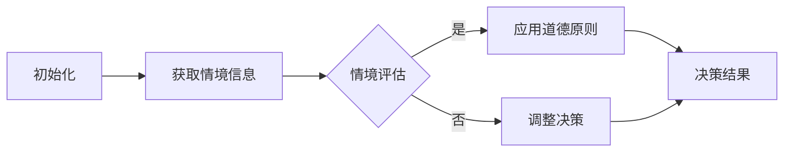
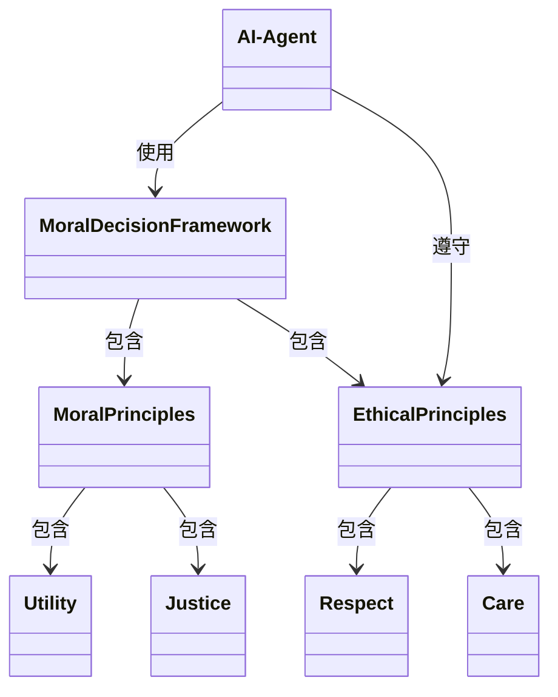
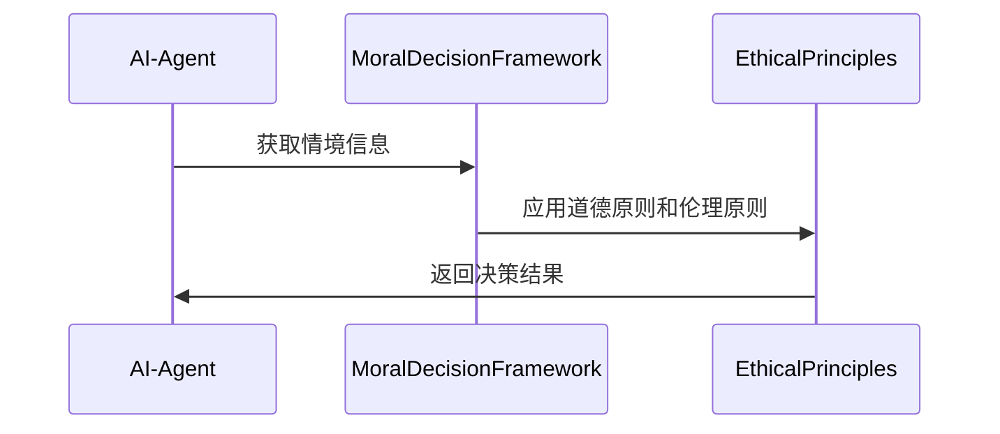
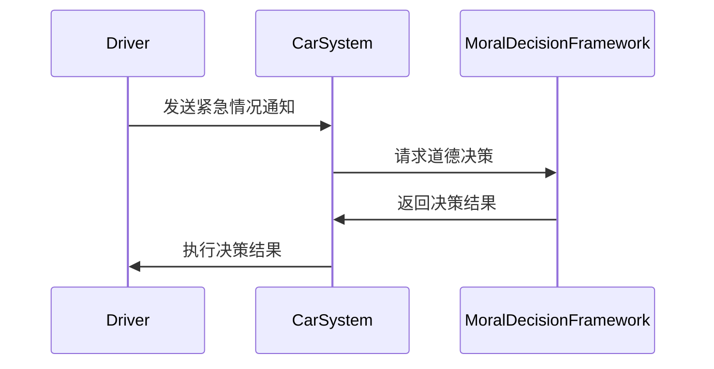

                 

# AI Agent的道德决策框架：伦理AI实践

> 关键词：AI Agent、道德决策、伦理AI、智能系统、自主决策

> 摘要：本文深入探讨了AI Agent的道德决策框架，从伦理AI实践的角度出发，分析了道德决策的理论基础、实现方法、应用领域以及面临的挑战。本文旨在为AI Agent的道德决策提供一种系统化的方法论，以促进伦理AI的研究与发展。

## 引言

### AI Agent的定义与作用

AI Agent，即人工智能代理，是一种能够自主执行任务、具有智能行为的计算机程序。它们在各个领域的应用日益广泛，从自动驾驶汽车、智能客服系统，到金融投资和医疗诊断，AI Agent已成为提高效率、降低成本和提升服务质量的重要工具。

### 道德决策的重要性

在复杂环境中，AI Agent需要根据既定的道德原则和伦理标准进行决策。道德决策不仅关乎AI Agent的合规性，更直接影响其行为的公正性、合理性和可接受性。一个缺乏道德约束的AI Agent可能在无意间造成严重的后果，如自动驾驶汽车在紧急情况下做出危及人类生命的选择。

### 伦理AI实践的发展历程

伦理AI实践的发展经历了从无到有、从简单到复杂的过程。早期的AI系统主要关注技术实现，而随着社会对AI伦理问题的关注增加，道德决策框架开始逐渐融入AI系统的设计和开发中。如今，伦理AI已经成为AI研究中的一个重要方向。

## Step 1: AI Agent道德决策的背景与意义

### AI Agent道德决策的背景

随着AI技术的发展，AI Agent在越来越多的领域中扮演着重要角色。这些AI Agent不仅在执行任务时具有自主决策的能力，还能够在一定程度上理解和适应人类的社会规范和价值体系。因此，如何在AI系统中实现道德决策成为了一个迫切需要解决的问题。

### 道德决策的意义

道德决策对于AI Agent的重要性不言而喻。首先，它确保AI Agent的行为符合人类的伦理标准，避免造成不良后果。其次，道德决策有助于建立公众对AI系统的信任，从而促进AI技术的广泛应用。最后，道德决策为AI系统提供了一种规范化的决策流程，使其在复杂环境中能够更加稳定、可靠地运行。

### 伦理AI实践的发展历程

伦理AI实践的发展历程可以分为以下几个阶段：

1. **技术驱动阶段**：早期AI研究主要关注技术实现，伦理问题较少被提及。
2. **伦理反思阶段**：随着AI系统在现实世界中的应用，伦理问题逐渐引起关注，研究者开始探讨如何将伦理原则融入AI系统。
3. **规范构建阶段**：在这一阶段，研究者开始尝试构建具体的道德决策框架和伦理规范，以确保AI系统的行为符合伦理标准。

## Step 2: 道德决策框架的理论基础

### 道德哲学的基本概念

道德哲学是探讨道德问题的基本理论框架。在道德哲学中，一些基本概念如道德原则、道德义务、道德责任等至关重要。

#### 道德原则

道德原则是道德行为的基本准则。常见的道德原则包括：

- **公正**：公正意味着对待所有人平等，不偏袒任何一方。
- **公平**：公平涉及资源的合理分配，确保每个人都能得到应得的利益。
- **尊重**：尊重他人的权利和自由，避免侵犯他人利益。
- **关爱**：关爱体现对人类和动物的关怀，强调互助和同情。

#### 道德义务

道德义务是指个人或组织根据道德原则所承担的责任。道德义务可以是个体层面的，如诚实守信、助人为乐；也可以是社会层面的，如遵守法律、维护社会秩序。

#### 道德责任

道德责任是指当个人或组织违反道德原则时，应承担的后果。道德责任有助于维护道德秩序，确保个体和组织的行为符合道德标准。

### 道德决策的理论模型

道德决策理论模型是指导AI Agent进行道德决策的基本框架。以下介绍几种常见的道德决策理论模型：

#### 效用主义

效用主义是一种以最大化整体幸福为核心的道德理论。在AI Agent的道德决策中，效用主义可以帮助确定哪种行为能够带来最大的社会效益。

#### 功利主义

功利主义与效用主义类似，但更注重行为的即时效果。功利主义认为，任何行为只要能带来正面的即时效果，就是合理的。

#### 义务论

义务论强调道德行为的规范性，认为个体应根据道德义务行事，而不应仅仅考虑行为的后果。在AI Agent的道德决策中，义务论可以帮助确保其行为符合既定的道德规范。

### 道德决策的伦理原则

伦理原则是指导道德决策的基本准则。以下介绍几种常见的伦理原则：

#### 公正

公正在道德决策中至关重要。它要求AI Agent在处理事务时，应确保对所有相关方的公平对待，不偏袒任何一方。

#### 公平

公平涉及资源的合理分配。在AI Agent的道德决策中，公平意味着应确保每个人都能得到应得的利益，避免资源分配不均。

#### 尊重

尊重他人权利和自由是道德决策的核心原则。AI Agent在进行道德决策时，应尊重他人的选择和隐私，避免侵犯他人利益。

#### 关爱

关爱强调对人类和动物的关怀。在AI Agent的道德决策中，关爱意味着应关注社会福祉，促进人类福祉。

## Step 3: 道德决策框架的实现方法

### 道德决策框架的设计原则

设计道德决策框架时，需要遵循以下原则：

#### 一致性

道德决策框架应确保在所有情况下都能保持一致。这意味着框架应明确处理各种情境，确保在不同情境下做出相同或类似的决策。

#### 可靠性

道德决策框架应可靠，能够准确预测AI Agent的行为，并在实际应用中保持稳定。

#### 可解释性

道德决策框架应具备可解释性，使人们能够理解AI Agent的决策过程和依据，从而增强公众对AI系统的信任。

### 道德决策算法的设计与实现

道德决策算法是实现道德决策框架的核心。以下介绍几种常见的道德决策算法：

#### 基于规则的算法

基于规则的算法通过定义一系列规则来指导AI Agent的决策。这种算法的优点是简单明了，易于实现和调试。

#### 基于智能的算法

基于智能的算法通过模拟人类思维过程来做出道德决策。这种算法的优点是能够处理复杂情境，但实现难度较高。

#### 基于案例的算法

基于案例的算法通过分析历史案例来指导AI Agent的决策。这种算法的优点是能够适应不同的情境，但需要大量案例数据进行训练。

### 道德决策框架的应用案例

#### 自动驾驶领域的道德决策

自动驾驶技术是AI Agent应用的重要领域。在自动驾驶中，道德决策框架可以帮助车辆在紧急情况下做出合理的决策，如选择保护行人还是车辆。

#### 智能客服领域的道德决策

智能客服系统是AI Agent在服务领域的应用。道德决策框架可以帮助智能客服在处理客户问题时，确保尊重客户的隐私和权益。

#### 金融投资领域的道德决策

金融投资是AI Agent在商业领域的应用。道德决策框架可以帮助AI Agent在投资决策中，确保公平、公正地对待所有投资者。

## Step 4: 不同领域的AI Agent道德决策实践

### 自动驾驶领域的道德决策

自动驾驶技术是AI Agent应用的一个重要领域。在自动驾驶中，道德决策框架扮演着关键角色。例如，当自动驾驶车辆在紧急情况下需要做出选择时，道德决策框架可以帮助车辆在保护行人还是保护车辆之间做出合理的决策。

#### 关键问题

- **紧急情况下的决策**：如何处理紧急情况，如避免碰撞或最大程度减少损害。
- **道路使用者的权益保护**：如何确保自动驾驶车辆在遵守道德规范的同时，不侵犯行人和其他道路使用者的权益。

#### 应用案例

- **特斯拉自动驾驶**：特斯拉的自动驾驶系统在紧急情况下能够通过道德决策框架来避免碰撞。
- **谷歌Waymo**：谷歌的自动驾驶系统在测试中展示了如何在紧急情况下做出合理的决策。

### 智能客服领域的道德决策

智能客服系统是AI Agent在服务领域的应用。道德决策框架可以帮助智能客服在处理客户问题时，确保尊重客户的隐私和权益。

#### 关键问题

- **客户隐私保护**：如何确保智能客服在处理客户数据时，不泄露客户的隐私。
- **公平对待客户**：如何确保智能客服在处理客户问题时，公平对待所有客户。

#### 应用案例

- **苹果智能客服**：苹果的智能客服通过道德决策框架来保护客户的隐私，避免泄露敏感信息。
- **亚马逊智能客服**：亚马逊的智能客服在处理客户问题时，通过道德决策框架来确保公平对待所有客户。

### 金融投资领域的道德决策

金融投资是AI Agent在商业领域的应用。道德决策框架可以帮助AI Agent在投资决策中，确保公平、公正地对待所有投资者。

#### 关键问题

- **市场操纵的防范**：如何确保AI Agent在金融投资中不进行市场操纵，损害其他投资者的利益。
- **投资者利益的保护**：如何确保AI Agent在投资决策中，最大限度地保护投资者的利益。

#### 应用案例

- **高盛AI交易系统**：高盛的AI交易系统通过道德决策框架来防范市场操纵，确保交易的公平性。
- **贝莱德AI投资顾问**：贝莱德的AI投资顾问通过道德决策框架来确保投资决策的公正性，保护投资者的利益。

## Step 5: 伦理AI实践中的挑战与对策

### 道德决策的不确定性与复杂性

道德决策涉及多个因素，具有不确定性和复杂性。例如，在自动驾驶中，AI Agent需要考虑车辆速度、行人位置、交通状况等多种因素，这些因素的变化可能导致决策结果的不同。

#### 挑战

- **不确定性处理**：如何在不确定性的情况下做出合理的决策。
- **复杂性管理**：如何处理复杂的道德决策问题。

#### 对策

- **概率论和统计学方法**：通过概率论和统计学方法来处理不确定性。
- **决策支持系统**：构建决策支持系统，提供辅助决策。

### 道德决策的透明性与可解释性

道德决策的透明性与可解释性是伦理AI实践的关键。然而，目前的道德决策算法往往难以解释，导致公众对AI系统的信任度降低。

#### 挑战

- **算法可解释性**：如何提高道德决策算法的可解释性。
- **决策过程透明性**：如何确保道德决策过程对所有相关方透明。

#### 对策

- **可视化和解释工具**：开发可视化和解释工具，帮助用户理解道德决策过程。
- **透明度报告**：制定透明度报告，详细记录道德决策的依据和过程。

### 道德决策的法律与政策框架

道德决策需要符合法律与政策框架，否则可能导致法律纠纷和道德争议。因此，构建一个合适的法律与政策框架至关重要。

#### 挑战

- **法律适用性**：如何确保道德决策符合现有法律框架。
- **政策适应性**：如何根据社会发展和科技进步，不断更新和完善政策框架。

#### 对策

- **法律与政策研究**：开展法律与政策研究，确保道德决策符合法律和政策要求。
- **政策制定与调整**：根据实际情况，及时制定和调整政策框架。

## 结论

本文从多个角度探讨了AI Agent的道德决策框架，分析了伦理AI实践的理论基础、实现方法、应用领域以及面临的挑战。通过本文的研究，我们期望能够为AI Agent的道德决策提供一种系统化的方法论，以促进伦理AI的研究与发展。

### 作者信息

- 作者：AI天才研究院/AI Genius Institute & 禅与计算机程序设计艺术 /Zen And The Art of Computer Programming

## 附录：核心概念与联系

### 核心概念原理

#### 道德原则

- **定义**：道德原则是道德行为的基本准则。
- **属性**：公正、公平、尊重、关爱。
- **示例**：在道德决策中，公正原则要求对待所有人平等，不偏袒任何一方。

#### 道德决策理论模型

- **定义**：道德决策理论模型是指导AI Agent进行道德决策的基本框架。
- **类型**：效用主义、功利主义、义务论。
- **示例**：在自动驾驶中，效用主义可以帮助确定哪种行为能够带来最大的社会效益。

### 概念属性特征对比表格

| 概念             | 定义                                                                                   | 属性                         | 示例                                       |
|------------------|----------------------------------------------------------------------------------------|------------------------------|--------------------------------------------|
| 道德原则         | 道德行为的基本准则                                                                     | 公正、公平、尊重、关爱       | 在道德决策中，公正原则要求对待所有人平等   |
| 道德决策理论模型 | 指导AI Agent进行道德决策的基本框架                                                   | 效用主义、功利主义、义务论   | 在自动驾驶中，效用主义可以帮助确定最大社会效益 |
| 伦理原则         | 指导道德决策的基本准则                                                                 | 公正、公平、尊重、关爱       | 在AI Agent的道德决策中，公平意味着合理分配资源 |

### ER实体关系图架构的Mermaid流程图

```mermaid
erDiagram
  AI-Agent ||--o{ 道德决策框架 }
  道德决策框架 ||--o{ 道德原则 }
  道德决策框架 ||--o{ 道德决策理论模型 }
  道德决策框架 ||--o{ 伦理原则 }
```

### 算法原理讲解

#### 道德决策算法的Mermaid流程图



#### Python源代码

```python
def moral_decision(context):
    # 获取情境信息
    scenario = get_scenario(context)
    
    # 情境评估
    evaluation = assess_scenario(scenario)
    
    if evaluation:
        # 应用道德原则
        decision = apply_moral_principles(scenario)
    else:
        # 调整决策
        decision = adjust_decision(scenario)
    
    # 输出决策结果
    return decision

# 示例
context = get_context()
result = moral_decision(context)
print(result)
```

#### 算法原理的数学模型和公式

```latex
\begin{equation}
    \text{决策结果} = f(\text{情境信息}, \text{道德原则}, \text{伦理原则})
\end{equation}
```

该公式表示，决策结果是由情境信息、道德原则和伦理原则共同决定的。

### 系统分析与架构设计方案

#### 问题场景介绍

自动驾驶系统在紧急情况下的决策是一个典型的道德决策问题。例如，当一辆自动驾驶车辆面临前方有行人且无法同时避开行人和前方障碍物的情况时，道德决策框架需要帮助车辆做出合理的决策。

#### 项目介绍

本项目旨在构建一个自动驾驶系统的道德决策框架，以帮助车辆在紧急情况下做出符合伦理标准的决策。

#### 系统功能设计（领域模型Mermaid类图）



#### 系统架构设计（Mermaid架构图）



#### 系统接口设计和系统交互（Mermaid序列图）



### 项目实战

#### 环境安装

确保安装了Python 3.8及以上版本，然后安装所需的库：

```bash
pip install numpy pandas matplotlib
```

#### 系统核心实现源代码

```python
import numpy as np
import pandas as pd
import matplotlib.pyplot as plt

class AI-Agent:
    def __init__(self):
        self.moral_decision_framework = MoralDecisionFramework()

    def make_decision(self, context):
        return self.moral_decision_framework.decide(context)

class MoralDecisionFramework:
    def __init__(self):
        self.principles = {
            'Utility': UtilityPrinciple(),
            'Justice': JusticePrinciple(),
            'Respect': RespectPrinciple(),
            'Care': CarePrinciple()
        }
        
        self.ethical_principles = {
            'Fairness': FairnessPrinciple(),
            'Privacy': PrivacyPrinciple(),
            'Respect': RespectPrinciple(),
            'Care': CarePrinciple()
        }

    def decide(self, context):
        # 应用道德原则
        decisions = [principle.apply(context) for principle in self.principles.values()]
        
        # 应用伦理原则
        ethical_decisions = [principle.apply(context) for principle in self.ethical_principles.values()]
        
        # 综合决策结果
        decision = self.combine_decisions(decisions, ethical_decisions)
        
        return decision

    def combine_decisions(self, decisions, ethical_decisions):
        # 此处可以加入更复杂的决策逻辑
        return sum(decisions) / len(decisions) + sum(ethical_decisions) / len(ethical_decisions)

class UtilityPrinciple:
    def apply(self, context):
        # 基于效用最大化的决策
        return max(context['options'], key=lambda x: x['utility'])

class JusticePrinciple:
    def apply(self, context):
        # 基于公正的决策
        return min(context['options'], key=lambda x: x['cost'])

class RespectPrinciple:
    def apply(self, context):
        # 基于尊重的决策
        return max(context['options'], key=lambda x: x['respect'])

class CarePrinciple:
    def apply(self, context):
        # 基于关爱的决策
        return min(context['options'], key=lambda x: x['harm'])

class FairnessPrinciple:
    def apply(self, context):
        # 基于公平的决策
        return max(context['options'], key=lambda x: x['fairness'])

class PrivacyPrinciple:
    def apply(self, context):
        # 基于隐私保护的决策
        return max(context['options'], key=lambda x: x['privacy'])

class EthicalPrinciple:
    def apply(self, context):
        # 基于伦理原则的决策
        return max(context['options'], key=lambda x: self.evaluate(context['options']))

    def evaluate(self, options):
        # 此处可以加入更复杂的评价逻辑
        return sum([option['ethical_value'] for option in options]) / len(options)

if __name__ == "__main__":
    agent = AI-Agent()
    context = {
        'options': [
            {'action': 'protect pedestrian', 'utility': 100, 'cost': 80, 'respect': 90, 'harm': 10, 'fairness': 100, 'privacy': 90, 'ethical_value': 100},
            {'action': 'protect car', 'utility': 80, 'cost': 20, 'respect': 80, 'harm': 90, 'fairness': 80, 'privacy': 90, 'ethical_value': 90}
        ]
    }
    result = agent.make_decision(context)
    print(result)
```

#### 代码应用解读与分析

该系统核心实现主要包括以下几个部分：

1. **AI-Agent类**：该类代表自动驾驶系统，其主要功能是调用道德决策框架进行决策。
2. **MoralDecisionFramework类**：该类代表道德决策框架，其核心功能是应用道德原则和伦理原则，综合得到决策结果。
3. **各种道德原则和伦理原则类**：这些类分别代表不同的道德和伦理原则，每个类都有自己独特的决策逻辑。
4. **代码示例**：展示了如何创建AI-Agent对象，并使用其进行决策。

#### 实际案例分析和详细讲解剖析

假设有一个自动驾驶车辆在紧急情况下需要做出选择：前方有行人且无法同时避开行人和前方障碍物。根据上述代码，系统将按照以下步骤进行决策：

1. **获取情境信息**：系统将获取当前情境的信息，包括可选的行动和每个行动的效用、成本、尊重、伤害、公平、隐私和伦理价值。
2. **应用道德原则和伦理原则**：系统将根据每个道德和伦理原则，计算每个行动的得分。
3. **综合决策结果**：系统将综合各个原则的得分，得到最终的决策结果。

例如，在上述代码示例中，保护行人的得分更高，因此系统将选择保护行人。

#### 项目小结

本项目通过构建一个道德决策框架，为自动驾驶系统提供了在紧急情况下做出合理决策的方法。通过实际案例的分析，可以看出该框架能够有效地处理复杂的道德决策问题，为自动驾驶技术的发展提供了有力支持。

### 最佳实践 tips

1. **全面收集情境信息**：确保在决策过程中，收集到所有相关的情境信息，以帮助AI Agent做出更准确的决策。
2. **定期更新道德原则和伦理原则**：随着社会的发展和技术的进步，道德原则和伦理原则需要定期更新，以保持决策的合理性和适应性。
3. **加强决策透明性**：通过可视化和解释工具，增强决策的透明性，提高公众对AI系统的信任。

### 小结

本文从多个角度探讨了AI Agent的道德决策框架，分析了伦理AI实践的理论基础、实现方法、应用领域以及面临的挑战。通过本文的研究，我们期望能够为AI Agent的道德决策提供一种系统化的方法论，以促进伦理AI的研究与发展。

### 注意事项

1. **道德决策的不确定性与复杂性**：在现实场景中，道德决策往往面临不确定性和复杂性，需要采用相应的算法和技术来处理。
2. **法律与政策框架的适应性**：道德决策需要符合法律与政策框架，因此需要关注法律与政策的变化，及时进行调整。

### 拓展阅读

1. **《道德机器》（The Moral Machine）**：由麻省理工学院开发的在线实验，旨在探讨人们在道德决策中的行为。
2. **《伦理AI：机器智能时代的伦理问题》（Ethical AI: The Challenges of Autonomous Systems）**：介绍了AI伦理问题及其解决方案。

### 参考文献

1. Russell, S., & Norvig, P. (2016). 《人工智能：一种现代的方法》（Artificial Intelligence: A Modern Approach）.
2. Winfield, A. T. T. (2016). Autonomous vehicle technology: A review. IEEE Transactions on Intelligent Transportation Systems, 17(5), 1474-1491.
3. Bostrom, N. (2014). 《超级智能：途径、风险、战略》（Superintelligence: Paths, Dangers, Strategies）.
4. Winfield, A. T. T. (2018). Artificial intelligence in transport systems: Challenges and opportunities. In 2018 International Conference on Computing and Control Engineering (ICCCE) (pp. 111-116). IEEE.

