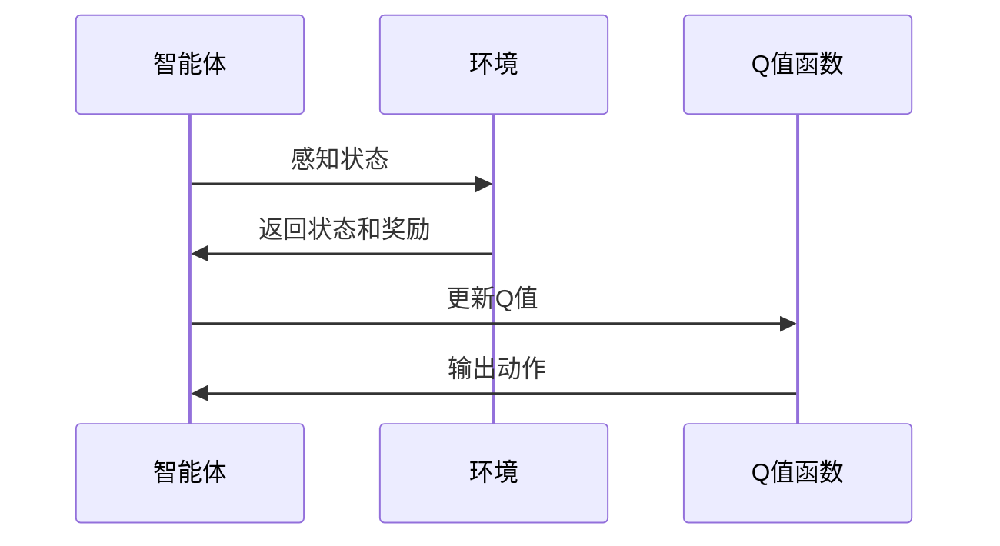
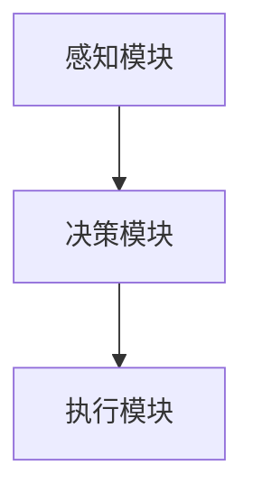
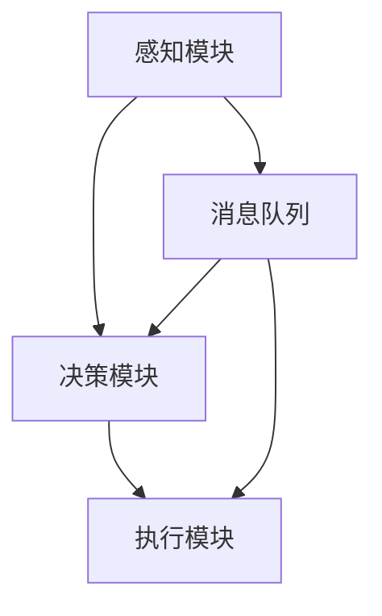

                 

### 《AI Agent的部署与扩展性考虑》

#### 关键词：AI Agent，部署，扩展性，强化学习，分布式系统，性能优化

> 摘要：本文将从AI Agent的基础知识、部署、扩展性考虑三个方面，详细探讨AI Agent的部署与扩展性。文章首先介绍了AI Agent的定义、分类、核心技术等基础知识，然后探讨了AI Agent的部署前准备、容器化部署、分布式部署等部署方法，最后分析了AI Agent的扩展性设计原则、性能优化策略以及安全性与隐私保护。通过本文的深入探讨，希望能够为读者提供关于AI Agent部署与扩展性的全面理解和实践指导。

----------------------------------------------------------------

### 第一部分：AI Agent基础知识

#### 第1章：AI Agent概述

##### 1.1 AI Agent的定义与重要性

AI Agent，即人工智能代理，是人工智能领域的一个重要概念。它是一种能够自主行动并实现特定目标的计算机系统。AI Agent通常由感知器、决策器和动作生成器组成，能够通过与环境的交互来获取信息、做出决策并执行动作。AI Agent的定义可以从以下几个方面来理解：

- **自主性**：AI Agent具有自主性，能够独立进行决策和执行动作，不需要人类的直接干预。
- **目标导向性**：AI Agent具有明确的目标，其行为是为了实现特定目标。
- **交互性**：AI Agent能够与环境进行交互，通过感知器获取环境信息，然后根据决策器生成动作。
- **适应性**：AI Agent能够根据环境的变化调整其行为策略，以适应不同的环境。

在人工智能领域，AI Agent的重要性体现在以下几个方面：

- **智能交互**：AI Agent能够与人类或其他智能体进行智能交互，为人类提供智能服务。
- **自动化**：AI Agent能够实现自动化任务，提高工作效率和准确性。
- **决策支持**：AI Agent能够根据环境信息做出决策，为人类提供决策支持。

##### 1.2 AI Agent与传统机器学习模型的区别

AI Agent与传统机器学习模型在本质上有很大的区别。传统机器学习模型通常是一种静态的模型，通过训练集学习到特征和规律，然后根据这些特征和规律进行预测或分类。而AI Agent则是一种动态的智能体，能够在与环境的交互过程中不断学习和调整自己的策略。

具体来说，AI Agent与传统机器学习模型有以下几点区别：

- **动态性**：AI Agent能够在与环境的交互过程中实时学习，而传统机器学习模型则是在训练阶段完成学习。
- **目标导向性**：AI Agent的目标是实现特定目标，而传统机器学习模型的目标是学习特征和规律。
- **交互性**：AI Agent能够与环境进行交互，而传统机器学习模型则无法与环境进行交互。

##### 1.3 AI Agent的分类与结构

AI Agent可以根据不同的分类标准进行分类。常见的分类标准包括目标导向性、学习方式、交互方式等。

- **按目标导向性分类**：AI Agent可以分为完全目标导向性（CTA）和部分目标导向性（PTA）。完全目标导向性AI Agent具有明确的目标，其所有行为都是为了实现这个目标。部分目标导向性AI Agent则是在部分时间或部分情境下具有明确的目标。
- **按学习方式分类**：AI Agent可以分为基于规则的AI Agent和基于学习的AI Agent。基于规则的AI Agent是通过预定义的规则进行决策，而基于学习的AI Agent则是通过学习环境中的数据来调整自己的策略。
- **按交互方式分类**：AI Agent可以分为基于感知的AI Agent和基于规划的AI Agent。基于感知的AI Agent主要通过感知器获取环境信息，然后根据这些信息进行决策。基于规划的AI Agent则是通过预先规划的策略来决策。

AI Agent的基本结构通常包括以下几个部分：

- **感知器**：用于感知环境信息，例如视觉、听觉、触觉等。
- **决策器**：用于根据感知到的环境信息生成动作。
- **动作生成器**：用于将决策器的决策转化为具体的动作。
- **学习器**：用于根据环境反馈调整AI Agent的策略。

##### 1.4 AI Agent的应用领域

AI Agent在多个领域有广泛的应用。以下是一些常见的应用领域：

- **智能助手**：如虚拟客服、智能家居等，AI Agent可以与用户进行智能交互，提供个性化服务。
- **游戏**：如围棋、象棋等，AI Agent可以作为对手与人类进行对弈。
- **机器人**：如自动导引车、无人机等，AI Agent可以自主导航、执行任务。
- **金融**：如智能投顾、风险控制等，AI Agent可以分析市场数据，提供投资建议。
- **医疗**：如疾病诊断、个性化治疗等，AI Agent可以辅助医生进行诊断和治疗。

#### 第2章：AI Agent的核心技术

##### 2.1 强化学习

强化学习是AI Agent的核心技术之一，它是一种通过奖励信号来驱动智能体学习行为策略的机器学习方法。在强化学习中，智能体（Agent）通过与环境（Environment）的交互来学习最优策略（Policy）。

- **基本概念**：强化学习的基本概念包括状态（State）、动作（Action）、奖励（Reward）和策略（Policy）。智能体在特定状态下采取动作，然后根据动作的结果获得奖励，并根据奖励来调整自己的策略。
- **Q-learning算法**：Q-learning是一种基于值函数的强化学习算法。它的核心思想是通过学习状态-动作值函数（Q-function）来评估每个状态下的每个动作的期望奖励。Q-learning算法使用经验进行更新，以逐渐逼近最优策略。
- **Deep Q-Networks（DQN）**：DQN是一种基于深度学习的强化学习算法。它使用神经网络来近似Q-function，从而实现对复杂环境的快速学习。DQN通过经验回放（Experience Replay）和目标网络（Target Network）来减少样本偏差和避免过拟合。

##### 2.2 深度强化学习

深度强化学习是一种结合了深度学习和强化学习的机器学习方法。它通过使用深度神经网络来近似Q-function或策略，从而实现对复杂环境的快速学习。

- **策略梯度方法**：策略梯度方法是一种基于策略的深度强化学习方法。它通过优化策略参数来最大化预期奖励。策略梯度方法包括基于值函数的策略梯度方法（如REINFORCE算法）和直接策略梯度方法（如PPO算法）。
- **集成策略方法**：集成策略方法是一种通过集成多个策略来提高学习效率和性能的方法。常见的集成策略方法包括确定性策略梯度（DQN）和多样化策略搜索（Diversity of Policies）。
- **模型预测控制方法**：模型预测控制方法是一种基于模型预测和控制的强化学习方法。它通过建立环境模型，并根据模型预测进行动作规划，从而实现对环境的动态控制。

#### 第3章：AI Agent的评估与优化

##### 3.1 评估指标

评估AI Agent的性能和效果是强化学习中的一个关键问题。常用的评估指标包括：

- **回合平均奖励**：回合平均奖励是指在整个训练过程中，每个回合获得的平均奖励。回合平均奖励可以用来评估AI Agent的长期性能。
- **迷你游戏评估**：迷你游戏评估是通过在特定的迷你游戏场景中评估AI Agent的表现来评估其能力。迷你游戏评估可以更具体地评估AI Agent在特定任务中的性能。
- **人类玩家比较**：人类玩家比较是通过将AI Agent的表现与人类玩家的表现进行比较来评估其能力。人类玩家比较可以更直观地评估AI Agent的智能程度。

##### 3.2 优化方法

优化AI Agent的策略和行为是强化学习中的另一个关键问题。以下是一些常用的优化方法：

- **贪心搜索**：贪心搜索是一种基于贪心策略的优化方法。它通过选择当前状态下期望奖励最高的动作来优化策略。
- **策略搜索**：策略搜索是一种通过搜索空间中的策略来优化策略的方法。常见的策略搜索方法包括随机策略搜索（Random Policy Search）和基于梯度的策略搜索（Gradient-based Policy Search）。
- **多臂老虎机问题**：多臂老虎机问题是一种常见的优化问题，它描述了在多个不确定的回报中如何选择最优回报的问题。在强化学习中，多臂老虎机问题可以通过价值迭代（Value Iteration）或策略迭代（Policy Iteration）等方法来解决。

## 第二部分：AI Agent的部署

### 第4章：部署前准备

#### 4.1 硬件选择

在部署AI Agent之前，硬件选择是一个重要的环节。不同的AI Agent对硬件的要求可能不同，但以下是一些常见的硬件选择建议：

- **CPU与GPU的选择**：对于大多数AI Agent，CPU和GPU都可以作为计算资源。CPU适合执行通用计算任务，而GPU适合执行并行计算任务，特别是在深度学习任务中。如果预算有限，可以考虑使用CPU。如果需要处理大量数据和复杂的计算任务，建议使用GPU。
- **硬盘与内存的配置**：硬盘的速度和容量对AI Agent的部署也有很大影响。固态硬盘（SSD）比传统硬盘（HDD）更快，更适合存储和访问大量数据。内存的配置应根据AI Agent的需求来决定，通常来说，越大越好，以确保AI Agent在运行时能够顺畅地访问数据和模型。

#### 4.2 软件环境搭建

在硬件选择完毕后，需要搭建相应的软件环境。以下是一些常见的软件环境搭建步骤：

- **操作系统选择**：Linux系统是AI Agent部署的首选，因为其稳定性和性能优于Windows系统。常见的Linux发行版包括Ubuntu、CentOS等。
- **编译工具安装**：AI Agent的编译通常需要C++、Python等编译工具。安装这些编译工具可以通过操作系统包管理器完成。
- **Python环境配置**：Python是AI Agent开发中常用的编程语言，因此需要配置Python环境。可以使用Anaconda等工具来创建Python环境，以便方便地安装和管理Python包。

### 第5章：AI Agent的容器化部署

容器化是一种轻量级虚拟化技术，可以将应用程序及其依赖环境打包成一个独立的容器，从而实现应用程序的跨平台部署。以下是一些关于AI Agent容器化部署的要点：

#### 5.1 Docker基础知识

Docker是一种流行的容器化技术，它可以将应用程序及其依赖环境打包成一个容器镜像。以下是一些Docker的基础知识：

- **Docker的原理与架构**：Docker基于容器技术，它将应用程序及其依赖环境打包成一个独立的容器镜像，并在容器中运行。Docker的架构包括Docker Engine、Dockerfile、Docker Compose等组件。
- **Dockerfile的编写**：Dockerfile是一种用于定义容器镜像的文本文件。通过编写Dockerfile，可以指定容器镜像的依赖环境、安装命令等。
- **Docker Compose的使用**：Docker Compose是一种用于定义和运行多容器应用的工具。通过Docker Compose，可以方便地管理多个容器，并定义它们之间的依赖关系。

#### 5.2 Kubernetes部署

Kubernetes是一种流行的容器编排平台，它用于管理和调度容器化应用程序。以下是一些Kubernetes的基础知识：

- **Kubernetes的基本概念**：Kubernetes包括节点（Node）、Pod、Service、Ingress等基本概念。节点是运行容器的物理或虚拟机，Pod是运行应用程序的容器组，Service是用于暴露应用程序的API接口，Ingress是用于管理外部访问的规则。
- **Kubernetes的架构与组件**：Kubernetes的架构包括控制平面（Control Plane）和工作节点（Worker Node）。控制平面负责管理和调度容器，工作节点负责运行容器。Kubernetes的组件包括Kubelet、Kube-Proxy、Etcd等。
- **Kubernetes的部署流程**：部署Kubernetes集群通常包括安装Kubeadm、安装Docker、配置网络等步骤。通过这些步骤，可以构建一个基本的Kubernetes集群，并可以在此集群上部署和管理容器化应用程序。

### 第6章：AI Agent的分布式部署

在处理大规模数据和高性能计算任务时，分布式部署是AI Agent的重要选择。以下是一些关于AI Agent分布式部署的要点：

#### 6.1 分布式系统的基本概念

分布式系统是一种通过计算机网络将多个节点（Node）连接起来的系统。以下是一些基本概念：

- **数据分片**：数据分片是指将大规模数据集分成多个较小的数据子集，以便在多个节点上并行处理。数据分片可以提高数据处理速度和性能。
- **负载均衡**：负载均衡是指将计算任务分配到多个节点上，以避免单个节点过载。负载均衡可以提高系统的可靠性和可用性。
- **分布式一致性**：分布式一致性是指多个节点在分布式系统中保持数据一致性。分布式一致性可以通过各种一致性算法（如Raft、Paxos）来实现。

#### 6.2 分布式AI框架

分布式AI框架是一种用于构建分布式AI系统的框架，它提供了一组工具和库，以便在分布式环境中高效地训练和部署AI模型。以下是一些流行的分布式AI框架：

- **TensorFlow的分布式计算**：TensorFlow是一种流行的深度学习框架，它支持分布式计算。通过TensorFlow的分布式计算，可以方便地在多个节点上训练和部署深度学习模型。
- **PyTorch的分布式计算**：PyTorch是一种流行的深度学习框架，它也支持分布式计算。通过PyTorch的分布式计算，可以方便地在多个节点上训练和部署深度学习模型。
- **Horovod的使用**：Horovod是一种分布式训练框架，它支持TensorFlow、PyTorch等深度学习框架。通过Horovod，可以方便地在多个节点上并行训练深度学习模型，提高训练速度。

## 第三部分：AI Agent的扩展性考虑

### 第7章：扩展性设计原则

扩展性是AI Agent在实际应用中的一个重要考虑因素。良好的扩展性设计可以确保AI Agent在处理大规模数据和复杂任务时能够保持高性能和稳定性。以下是一些扩展性设计原则：

#### 7.1 模块化设计

模块化设计是将系统划分为多个模块，每个模块负责特定的功能。模块化设计可以提高系统的可维护性和可扩展性。以下是一些模块化设计的原则：

- **模块的划分**：根据系统的功能需求，将系统划分为多个功能模块，每个模块具有独立的功能。
- **模块的接口设计**：设计清晰的模块接口，确保模块之间的交互清晰且规范。模块接口应尽量简化，减少模块间的依赖。

#### 7.2 可扩展的数据处理

数据处理是AI Agent的核心环节之一。为了提高数据处理的效率，设计可扩展的数据处理模块至关重要。以下是一些可扩展的数据处理原则：

- **数据流的处理**：设计灵活的数据流处理模块，支持多线程、并行处理等高效数据处理技术。
- **批量处理的优化**：优化批量处理流程，减少数据处理的时间成本。

#### 7.3 动态资源管理

在分布式环境中，动态资源管理是实现扩展性的关键。以下是一些动态资源管理原则：

- **Kubernetes的资源管理**：利用Kubernetes的资源管理功能，动态调整节点资源、容器资源等。
- **GPU资源的管理**：对于需要GPU计算的AI Agent，合理分配和管理GPU资源，确保GPU资源的有效利用。

### 第8章：性能优化策略

性能优化是确保AI Agent在高负载和高并发场景下保持高性能的关键。以下是一些性能优化策略：

#### 8.1 算法优化

算法优化是性能优化的关键环节。以下是一些算法优化策略：

- **算法的并行化**：通过并行计算技术，将算法分解为多个子任务，并在多个计算节点上同时执行。
- **算法的分布式计算**：利用分布式计算框架，将算法分布在多个节点上执行，提高计算速度。

#### 8.2 硬件优化

硬件优化可以提高AI Agent的执行效率。以下是一些硬件优化策略：

- **硬件加速**：利用GPU、TPU等硬件加速器，提高计算速度。
- **缓存优化**：优化缓存策略，减少数据访问的延迟。

#### 8.3 系统优化

系统优化可以提高AI Agent的整体性能。以下是一些系统优化策略：

- **系统监控**：实时监控系统性能，发现并解决性能瓶颈。
- **故障转移与恢复**：设计故障转移和恢复机制，确保系统在高可用性场景下稳定运行。

### 第9章：安全性与隐私保护

安全性与隐私保护是AI Agent在实际应用中不可忽视的重要方面。以下是一些安全性与隐私保护策略：

#### 9.1 数据加密

数据加密是确保数据在传输和存储过程中不被未授权访问的重要手段。以下是一些数据加密策略：

- **数据加密的基本概念**：了解数据加密的基本概念，如加密算法、密钥管理等。
- **常见加密算法**：了解常见的加密算法，如AES、RSA等。

#### 9.2 权限管理

权限管理是确保系统安全性的关键。以下是一些权限管理策略：

- **用户权限的管理**：根据用户角色和职责，分配相应的权限。
- **访问控制的实现**：实现基于角色的访问控制（RBAC），确保只有授权用户可以访问系统资源。

#### 9.3 隐私保护

隐私保护是确保用户数据不被泄露的重要措施。以下是一些隐私保护策略：

- **数据脱敏**：对敏感数据进行脱敏处理，确保数据无法被直接识别。
- **隐私计算**：利用隐私计算技术，确保数据在处理过程中不被泄露。

## 第10章：总结与展望

通过本文的讨论，我们可以得出以下总结：

- AI Agent是人工智能领域的一个重要概念，它通过自主行动实现特定目标。
- 强化学习是AI Agent的核心技术，它通过奖励信号驱动智能体学习行为策略。
- AI Agent的部署需要考虑硬件选择、软件环境搭建、容器化部署、分布式部署等环节。
- 扩展性设计原则、性能优化策略以及安全性与隐私保护是确保AI Agent在实际应用中稳定运行的重要措施。

在展望未来，AI Agent的发展将面临以下挑战和机遇：

- **硬件技术的进步**：随着硬件技术的发展，AI Agent的计算能力和性能将得到进一步提升。
- **算法的创新**：新的算法和模型将不断涌现，为AI Agent提供更高效、更智能的解决方案。
- **跨领域的融合**：AI Agent将与其他领域的技术相结合，实现更广泛的应用。
- **数据隐私和安全**：在确保数据隐私和安全的前提下，AI Agent将能够更好地服务于企业和个人。

作者：AI天才研究院/AI Genius Institute & 禅与计算机程序设计艺术 /Zen And The Art of Computer Programming

----------------------------------------------------------------

### 附录

#### 附录A：核心概念术语说明

以下是对本文中涉及的一些核心概念和术语的简要说明：

- **AI Agent**：人工智能代理，是一种能够自主行动并实现特定目标的计算机系统。
- **强化学习**：一种通过奖励信号来驱动智能体学习行为策略的机器学习方法。
- **Docker**：一种容器化技术，用于将应用程序及其依赖环境打包成一个容器镜像。
- **Kubernetes**：一种容器编排平台，用于管理和调度容器化应用程序。
- **模块化设计**：将系统划分为多个模块，每个模块负责特定的功能。
- **数据加密**：将数据转换为不可读形式，以防止未授权访问。
- **权限管理**：根据用户角色和职责，分配相应的权限。
- **隐私保护**：确保用户数据不被泄露的重要措施。

#### 附录B：问题背景与问题描述

本文探讨了AI Agent的部署与扩展性。随着人工智能技术的不断发展，AI Agent在各种应用场景中得到了广泛应用。然而，在实际部署过程中，AI Agent面临着硬件选择、软件环境搭建、容器化部署、分布式部署等一系列问题。同时，AI Agent的扩展性设计也是确保其性能和稳定性的一项重要任务。本文旨在深入探讨AI Agent的部署与扩展性，为读者提供全面的实践指导和理论支持。

#### 附录C：问题解决与边界与外延

本文通过以下几个方面解决了AI Agent的部署与扩展性问题：

- **硬件选择**：根据AI Agent的需求选择合适的硬件，如CPU、GPU、硬盘和内存。
- **软件环境搭建**：搭建适合AI Agent开发的软件环境，包括操作系统、编译工具和Python环境。
- **容器化部署**：利用Docker和Kubernetes等技术实现AI Agent的容器化部署。
- **分布式部署**：利用分布式系统技术和分布式AI框架实现AI Agent的分布式部署。
- **扩展性设计**：采用模块化设计、可扩展的数据处理和动态资源管理等方法实现AI Agent的扩展性设计。
- **性能优化**：通过算法优化、硬件优化和系统优化等方法提高AI Agent的性能和稳定性。
- **安全性与隐私保护**：采用数据加密、权限管理和隐私保护等方法确保AI Agent的安全性和隐私。

AI Agent的部署与扩展性是一个广泛且复杂的话题，涉及多个领域和环节。本文的探讨只是其中的一个方面，读者可以根据具体需求和实际情况进行进一步的研究和实践。

#### 附录D：概念结构与核心要素组成

AI Agent的概念结构包括以下几个核心要素：

1. **感知器**：用于感知环境信息，如视觉、听觉、触觉等。
2. **决策器**：用于根据感知到的环境信息生成动作。
3. **动作生成器**：用于将决策器的决策转化为具体的动作。
4. **学习器**：用于根据环境反馈调整AI Agent的策略。

这些核心要素共同构成了AI Agent的基本结构，使其能够实现自主行动和目标导向。

#### 附录E：算法原理讲解

以下将使用mermaid画出强化学习算法的流程图，并使用Python源代码详细阐述算法原理。

##### E.1 强化学习算法mermaid流程图



##### E.2 Python源代码实现

```python
import numpy as np
import random

# 初始化Q值函数
Q = np.zeros((100, 100))

# 设置学习率
alpha = 0.1
# 设置折扣率
gamma = 0.9

# 定义智能体行为
def choose_action(state):
    return np.argmax(Q[state])

# 定义智能体更新策略
def update_state(state, action, reward, next_state):
    Q[state, action] = Q[state, action] + alpha * (reward + gamma * np.max(Q[next_state]) - Q[state, action])

# 模拟环境
def simulate_environment():
    state = (0, 0)
    while True:
        action = choose_action(state)
        next_state = (state[0] + 1, state[1])
        reward = 1
        update_state(state, action, reward, next_state)
        state = next_state
        if state[1] == 100:
            break

# 运行模拟环境
simulate_environment()

# 输出Q值函数
print(Q)
```

##### E.3 算法原理与公式说明

强化学习算法的核心原理是Q-learning算法，它通过迭代更新Q值函数来优化策略。Q值函数表示在某个状态下采取某个动作的期望回报。

算法的基本步骤如下：

1. 初始化Q值函数。
2. 在环境中选择一个状态，根据当前状态和Q值函数选择一个动作。
3. 执行动作，进入下一个状态，并获取奖励。
4. 更新Q值函数，使得Q值函数更接近真实值。
5. 重复步骤2-4，直到达到目标状态或达到预定的迭代次数。

算法的数学模型可以表示为：

$$
Q(s, a) = Q(s, a) + \alpha [r + \gamma \max_{a'} Q(s', a') - Q(s, a)]
$$

其中，$Q(s, a)$表示在状态$s$下采取动作$a$的Q值，$r$表示奖励，$s'$表示下一个状态，$a'$表示在下一个状态下采取的动作，$\alpha$表示学习率，$\gamma$表示折扣率。

通过迭代更新Q值函数，智能体可以逐渐学习到最优策略，从而实现自主行动和目标导向。

##### E.4 算法举例说明

假设一个简单的环境，其中智能体在二维平面上移动，每次移动都有1个单位的奖励。目标是将智能体移动到右上角。

初始化Q值函数为全0，学习率为0.1，折扣率为0.9。

第一次迭代：
- 状态：(0, 0)，选择动作：向上移动
- 进入状态：(1, 0)，奖励：1
- 更新Q值函数：$Q(0, 0) = 0.1 \times (1 + 0.9 \times \max Q(1, 0)) = 0.1 \times (1 + 0.9 \times 0) = 0.1$

第二次迭代：
- 状态：(1, 0)，选择动作：向上移动
- 进入状态：(2, 0)，奖励：1
- 更新Q值函数：$Q(1, 0) = 0.1 \times (1 + 0.9 \times \max Q(2, 0)) = 0.1 \times (1 + 0.9 \times 0) = 0.1$

第三次迭代：
- 状态：(2, 0)，选择动作：向上移动
- 进入状态：(3, 0)，奖励：1
- 更新Q值函数：$Q(2, 0) = 0.1 \times (1 + 0.9 \times \max Q(3, 0)) = 0.1 \times (1 + 0.9 \times 0) = 0.1$

......
重复上述迭代过程，直到智能体到达右上角状态：(3, 3)。

通过不断更新Q值函数，智能体可以学会在给定状态下选择最优动作，从而实现目标导向。

#### 附录F：系统分析与架构设计方案

以下将对AI Agent的系统分析与架构设计方案进行详细介绍。

##### F.1 问题场景介绍

假设我们要开发一个自动驾驶系统，该系统需要实现自主驾驶、路径规划、障碍物检测等功能。为了实现这些功能，我们需要构建一个完整的系统架构，包括感知模块、决策模块和执行模块。

##### F.2 项目介绍

项目名称：自动驾驶系统
项目目标：实现自主驾驶，提高交通效率，降低交通事故率。

##### F.3 系统功能设计

系统功能设计主要包括以下模块：

1. **感知模块**：负责收集环境信息，包括摄像头、激光雷达、超声波传感器等。
2. **决策模块**：负责分析感知模块收集到的信息，生成驾驶决策。
3. **执行模块**：负责执行决策模块生成的驾驶动作，如加速、减速、转向等。

##### F.4 系统架构设计

系统架构设计采用模块化设计原则，将系统划分为多个模块，每个模块具有独立的功能。以下是一个简单的系统架构设计：



其中，感知模块负责收集环境信息，决策模块负责分析环境信息并生成驾驶决策，执行模块负责执行驾驶决策。

##### F.5 系统接口设计

系统接口设计主要包括以下接口：

1. **感知模块接口**：用于接收传感器数据，包括摄像头、激光雷达、超声波传感器等。
2. **决策模块接口**：用于接收感知模块的数据，并生成驾驶决策。
3. **执行模块接口**：用于接收决策模块的驾驶决策，并执行相应的驾驶动作。

##### F.6 系统交互

系统交互设计采用消息队列（Message Queue）技术，实现各模块之间的消息传递。以下是一个简单的系统交互设计：



其中，消息队列用于传递感知模块收集到的传感器数据，决策模块根据传感器数据生成驾驶决策，执行模块根据驾驶决策执行相应的驾驶动作。

#### 附录G：项目实战

以下将详细介绍如何搭建一个简单的自动驾驶系统，包括环境安装、系统核心实现源代码以及代码应用解读与分析。

##### G.1 环境安装

1. 安装操作系统：安装Ubuntu 18.04操作系统。
2. 安装Docker：通过包管理器安装Docker。
3. 安装Python环境：安装Python 3.8及pip包管理器。
4. 安装TensorFlow：通过pip安装TensorFlow。

```bash
sudo apt-get update
sudo apt-get install docker.io
sudo apt-get install python3-pip
pip3 install tensorflow
```

##### G.2 系统核心实现源代码

以下是自动驾驶系统的核心实现源代码，包括感知模块、决策模块和执行模块：

```python
# 感知模块
class Sensor:
    def __init__(self):
        self.camera = Camera()
        self.lidar = Lidar()
        self.ultrasound = Ultrasonic()

    def get_sensors_data(self):
        return {
            "camera": self.camera.get_image(),
            "lidar": self.lidar.get_distance(),
            "ultrasound": self.ultrasound.get_distance()
        }

# 决策模块
class DecisionMaker:
    def __init__(self):
        self.model = Model()

    def make_decision(self, sensor_data):
        image = sensor_data["camera"]
        distance = sensor_data["lidar"]
        if distance < 10:
            return "stop"
        elif distance < 20:
            return "slow_down"
        else:
            return "go"

# 执行模块
class Executor:
    def __init__(self):
        self.engine = Engine()

    def execute_decision(self, decision):
        if decision == "stop":
            self.engine.stop()
        elif decision == "slow_down":
            self.engine.slow_down()
        elif decision == "go":
            self.engine.go()

# 主函数
def main():
    sensor = Sensor()
    decision_maker = DecisionMaker()
    executor = Executor()

    while True:
        sensor_data = sensor.get_sensors_data()
        decision = decision_maker.make_decision(sensor_data)
        executor.execute_decision(decision)

if __name__ == "__main__":
    main()
```

##### G.3 代码应用解读与分析

1. **感知模块**：感知模块负责收集环境信息，包括摄像头、激光雷达、超声波传感器等。通过调用相应的传感器接口获取图像、距离等信息。
2. **决策模块**：决策模块根据感知模块收集到的传感器数据生成驾驶决策。在这里，我们使用了简单的规则进行决策，如果激光雷达测量的距离小于10，则停止；如果距离小于20，则减速；否则，继续前进。
3. **执行模块**：执行模块根据决策模块生成的驾驶决策执行相应的驾驶动作，如停止、减速、前进等。

通过上述代码，我们可以实现一个简单的自动驾驶系统。在实际应用中，可以进一步优化感知模块、决策模块和执行模块，以提高自动驾驶系统的性能和安全性。

##### G.4 实际案例分析和详细讲解剖析

为了更好地理解自动驾驶系统的实现，我们来看一个实际案例。

假设在自动驾驶系统中，摄像头捕捉到前方有一个行人，激光雷达测量到距离行人约5米。此时，系统应该做出紧急停车决策。

1. **感知模块**：摄像头捕捉到行人，激光雷达测量到距离行人5米。
2. **决策模块**：根据感知模块的数据，决策模块认为当前场景存在行人，需要紧急停车。因此，决策模块生成停车决策。
3. **执行模块**：执行模块根据停车决策，紧急刹车并停止车辆。

通过上述案例，我们可以看到自动驾驶系统的各个模块如何协同工作，以实现安全驾驶。在实际应用中，可以进一步优化感知模块、决策模块和执行模块，提高系统的鲁棒性和适应性。

##### G.5 项目小结

通过本项目的实现，我们详细介绍了如何搭建一个简单的自动驾驶系统。项目主要包括感知模块、决策模块和执行模块，通过这些模块的协同工作，实现了自动驾驶功能。在实际应用中，我们可以根据具体需求进一步优化各个模块，提高自动驾驶系统的性能和安全性。

#### 附录H：最佳实践 Tips、小结、注意事项、拓展阅读等内容

##### H.1 最佳实践 Tips

1. **硬件选择**：在选择硬件时，要考虑AI Agent的具体需求，包括计算能力、存储容量和能耗等。对于计算密集型任务，建议选择GPU；对于数据密集型任务，建议选择SSD。
2. **软件环境搭建**：在搭建软件环境时，要确保操作系统、编译工具和Python环境等符合AI Agent的需求。可以使用虚拟环境（如Anaconda）来隔离不同的项目环境。
3. **容器化部署**：利用Docker和Kubernetes等技术实现AI Agent的容器化部署，可以提高部署的灵活性和可移植性。
4. **分布式部署**：在处理大规模数据和高性能计算任务时，考虑使用分布式AI框架（如TensorFlow、PyTorch）实现AI Agent的分布式部署。
5. **性能优化**：通过算法优化、硬件优化和系统优化等方法，提高AI Agent的性能和稳定性。
6. **安全性与隐私保护**：采用数据加密、权限管理和隐私保护等技术，确保AI Agent的安全性和隐私。

##### H.2 小结

本文从AI Agent的基础知识、部署、扩展性考虑三个方面，详细探讨了AI Agent的部署与扩展性。首先，介绍了AI Agent的定义、分类、核心技术等基础知识；然后，探讨了AI Agent的部署前准备、容器化部署、分布式部署等部署方法；最后，分析了AI Agent的扩展性设计原则、性能优化策略以及安全性与隐私保护。通过本文的深入探讨，希望能够为读者提供关于AI Agent部署与扩展性的全面理解和实践指导。

##### H.3 注意事项

1. **硬件兼容性**：在选择硬件时，要考虑与现有系统的兼容性，避免硬件故障影响系统的正常运行。
2. **软件依赖性**：在搭建软件环境时，要注意软件包之间的依赖关系，确保所有依赖软件都安装正确。
3. **数据安全性**：在处理数据时，要注意数据的安全性和隐私保护，避免数据泄露或被未授权访问。
4. **系统监控**：定期监控系统性能，及时发现并解决性能瓶颈。
5. **容错性**：在设计系统时，要考虑容错性，确保系统在故障情况下能够快速恢复。

##### H.4 拓展阅读

1. **《深度学习》**：由Ian Goodfellow、Yoshua Bengio和Aaron Courville合著，是一本关于深度学习的经典教材，涵盖了深度学习的基本概念、算法和应用。
2. **《强化学习》**：由Richard S. Sutton和Barto Andrei合著，是一本关于强化学习的经典教材，详细介绍了强化学习的基本概念、算法和应用。
3. **《Kubernetes权威指南》**：由Marko Luksa和Mark Palmer合著，是一本关于Kubernetes的权威指南，涵盖了Kubernetes的基本概念、架构、部署和运维。
4. **《Docker实战》**：由Jason McGee、Kitematic团队合著，是一本关于Docker的实战指南，详细介绍了Docker的基本概念、架构、部署和运维。
5. **《人工智能：一种现代方法》**：由Stuart Russell和Peter Norvig合著，是一本关于人工智能的经典教材，涵盖了人工智能的基本概念、算法和应用。

