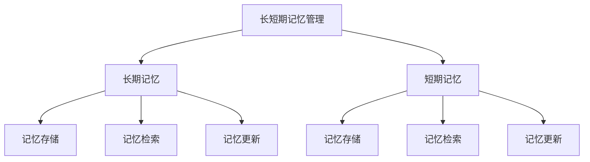
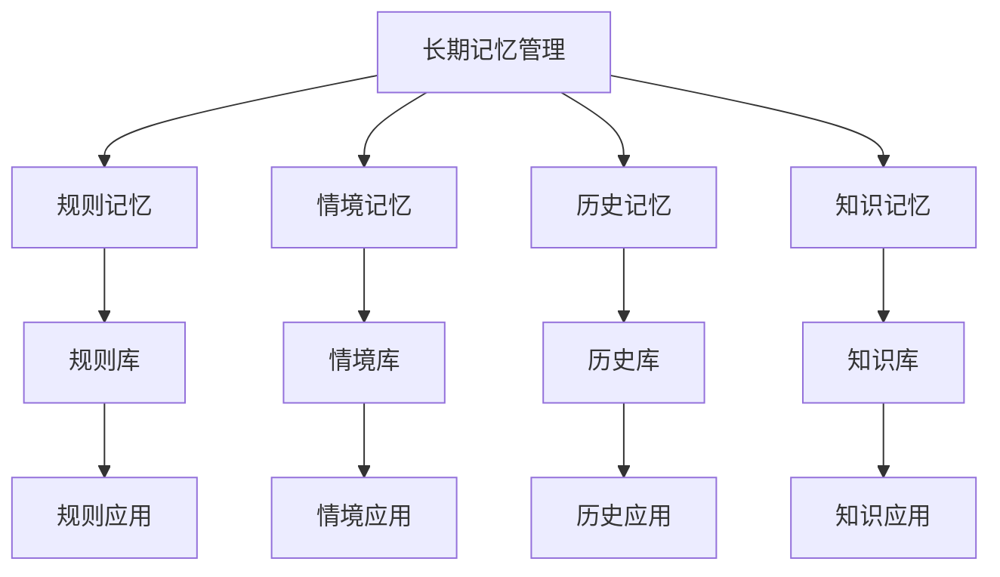
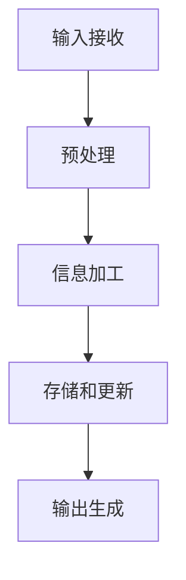
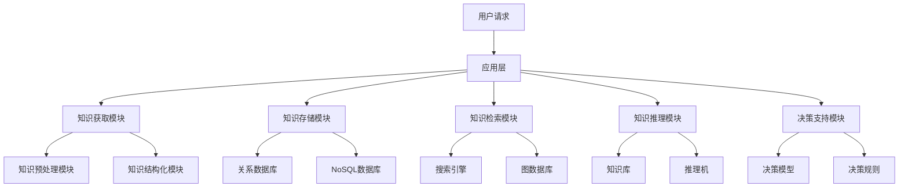
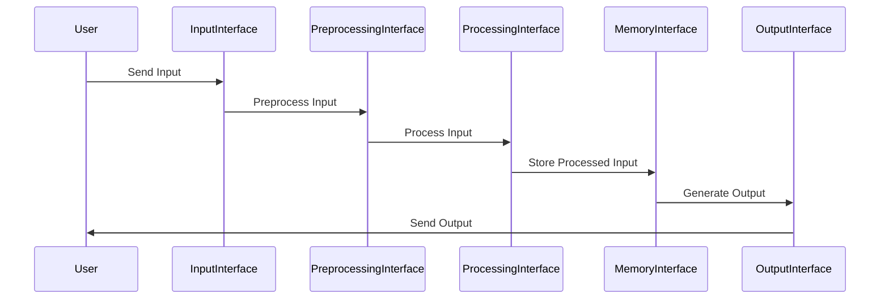

                 

### 第1章: AI Agent的长短期记忆管理概述

#### 核心概念

**长短期记忆管理（Long-Short Term Memory Management）** 是人工智能（AI）领域中一个关键的研究方向。它主要关注于如何有效地管理AI代理（Agent）在执行任务过程中的长期和短期记忆。长期记忆负责存储与任务相关的长期知识，而短期记忆则负责处理和暂存当前的输入和操作。

**AI Agent** 是能够感知环境、制定计划并执行动作以达成目标的人工智能实体。它在智能体系统（Agent-Based System）中起着核心作用，能够自主学习和适应复杂环境。

**重要性**：长短期记忆管理对AI Agent的性能和适应性至关重要。有效的记忆管理能够提高AI代理的学习效率、决策质量和任务完成能力。

#### 边界与外延

**边界**：长短期记忆管理主要研究AI代理在处理大量数据和复杂任务时的记忆存储、检索和使用。它不涉及其他AI领域，如机器学习、自然语言处理等。

**外延**：长短期记忆管理可以应用于多个AI场景，包括但不限于自动驾驶、智能客服、游戏AI等。在这些场景中，AI代理需要记住大量的规则、策略和历史数据，以便做出更好的决策。

#### 概念结构与核心要素

为了更好地理解长短期记忆管理，我们可以通过以下表格和Mermaid流程图展示其概念结构：

| 概念       | 说明                                                         |
| ---------- | ------------------------------------------------------------ |
| 长期记忆   | 负责存储与任务相关的长期知识，如规则、策略和历史数据。         |
| 短期记忆   | 负责处理和暂存当前的输入和操作，如当前的任务状态、感知信息等。 |
| 记忆存储   | 管理长期和短期记忆的存储机制，如神经网络、数据库等。         |
| 记忆检索   | 提供有效的记忆检索方法，以快速获取所需的信息。                 |
| 记忆更新   | 管理记忆的更新过程，包括记忆的创建、修改和删除。               |



通过以上表格和Mermaid流程图，我们可以清晰地看到长短期记忆管理的核心概念和要素。在后续章节中，我们将深入探讨这些概念和要素的具体实现和应用。

### 第2章: 长期记忆管理原理

#### 核心概念原理

长期记忆管理是AI代理中至关重要的组成部分，它负责存储和维持与任务相关的长期知识。长期记忆通常存储在特定的数据结构中，如神经网络、数据库或内存中，以便在需要时快速检索和使用。

**长期记忆的存储**：长期记忆的存储主要涉及将知识与数据存储到持久存储介质中。在神经网络中，长期记忆通常通过权重矩阵和神经元之间的连接来表示。这些权重矩阵存储在神经网络的权重文件中，如权重矩阵和偏置项。在数据库中，长期记忆可以通过关系数据库或NoSQL数据库来存储，例如SQL数据库中的表或MongoDB中的文档。

**长期记忆的检索**：长期记忆的检索是指从存储介质中快速获取所需的信息。在神经网络中，通过激活特定的神经元和计算权重矩阵来检索长期记忆。在数据库中，通过查询语句来检索特定的记录或数据。

**长期记忆的更新**：长期记忆的更新是指对存储的知识进行修改或删除。在神经网络中，通过反向传播算法更新权重矩阵和偏置项。在数据库中，通过插入、更新和删除操作来维护数据的完整性。

长期记忆的特点包括：

1. **持久性**：长期记忆可以持续数小时甚至数天，直到被明确地清除或更新。
2. **容量大**：长期记忆可以存储大量的信息和知识，远远超过短期记忆的容量。
3. **动态性**：长期记忆不是静态的，它可以随着新的经验和学习不断更新和调整。

#### 概念属性特征对比

下面我们通过表格来对比长期记忆的不同类型和特点：

| 类型         | 特点                                                         |
| ------------ | ------------------------------------------------------------ |
| 规则记忆     | 存储与任务相关的规则和策略，如交通规则、导航策略等。           |
| 情境记忆     | 存储与特定情境相关的信息，如过去的决策、经验等。               |
| 历史记忆     | 存储与任务相关的历史数据，如过去的行为记录、日志等。           |
| 知识记忆     | 存储与任务相关的通用知识，如科学事实、常识等。                 |

#### ER实体关系图架构

为了更好地理解长期记忆管理的结构，我们可以通过ER（Entity-Relationship）图来展示其实体和关系。



在ER图中，我们可以看到长期记忆管理包括四个主要实体：规则记忆、情境记忆、历史记忆和知识记忆。这些实体之间通过不同的应用关系相互关联，共同构成了长期记忆管理系统的整体结构。

#### 总结

长期记忆管理是AI代理中不可或缺的一部分，它通过存储、检索和更新长期知识，提高了AI代理的智能和学习能力。理解长期记忆的核心概念原理、特点对比和ER实体关系图架构，有助于我们深入掌握长期记忆管理的本质，为后续章节的学习和应用奠定坚实基础。

### 第3章: 短期记忆管理原理

#### 核心概念原理

短期记忆管理是AI代理处理和暂存当前输入和操作的关键机制。短期记忆的特点是容量有限，但处理速度非常快，能够迅速响应环境变化和任务需求。短期记忆通常存储在快速的随机访问存储（如CPU缓存或RAM）中，以便在需要时快速访问。

**短期记忆的存储**：短期记忆的存储主要涉及将当前输入和操作暂存在特定的数据结构中，如栈、队列或缓冲区。在神经网络中，短期记忆可以通过激活特定的神经元来存储。在计算机系统中，短期记忆可以通过快速存储介质来维护，如CPU缓存或RAM。

**短期记忆的处理**：短期记忆的处理是指对当前输入和操作进行加工和处理，以便产生新的输出或决策。在神经网络中，通过激活传递和计算来处理短期记忆。在计算机系统中，通过执行特定的算法或程序来处理短期记忆。

**短期记忆的遗忘机制**：短期记忆的遗忘机制是指记忆在不需要时自动消失或被替换的过程。遗忘机制有助于释放内存空间，并避免不必要的干扰。短期记忆的遗忘主要受以下因素影响：

1. **时间限制**：记忆在一段时间后自然消失，通常是几秒到几分钟。
2. **注意力分散**：当注意力转移到其他任务时，短期记忆中的信息可能被遗忘。
3. **重复抑制**：重复的信息会抑制记忆的存储，导致记忆容量减少。

#### 短期记忆处理机制

短期记忆的处理机制可以分为以下几个步骤：

1. **输入接收**：接收当前环境中的输入信息，如语音、图像或传感器数据。
2. **预处理**：对输入信息进行预处理，如数据清洗、去噪和归一化。
3. **信息加工**：对预处理后的信息进行加工和处理，以提取关键特征和模式。
4. **存储和更新**：将加工后的信息存储到短期记忆中，并根据需要更新记忆内容。
5. **输出生成**：根据短期记忆中的信息生成输出，如决策、动作或反馈。

短期记忆处理机制的流程可以用以下Mermaid流程图表示：



#### 短期记忆管理算法

短期记忆管理算法是指用于维护和更新短期记忆的一系列方法。以下是一个简单的短期记忆管理算法，用Python源代码进行实现：

```python
class ShortTermMemory:
    def __init__(self, capacity):
        self.capacity = capacity
        self.memory = []

    def receive_input(self, input_data):
        # 接收输入数据
        if len(self.memory) < self.capacity:
            self.memory.append(input_data)
        else:
            # 超过容量时，替换最旧的输入
            self.memory.pop(0)
            self.memory.append(input_data)

    def process_input(self):
        # 处理输入数据
        processed_data = [self.memory[i] for i in range(len(self.memory))]
        return processed_data

    def generate_output(self):
        # 生成输出
        output = self.process_input()
        return output
```

在上面的代码中，`ShortTermMemory` 类用于表示短期记忆管理器。它包含容量（`capacity`）和记忆数组（`memory`）。`receive_input` 方法用于接收输入数据，并根据容量限制进行存储或替换。`process_input` 方法用于处理输入数据，`generate_output` 方法用于生成输出。

#### 算法原理讲解

短期记忆管理算法的原理基于以下关键点：

1. **容量限制**：短期记忆的容量是有限的，通常设置为几到几十个数据项。这有助于避免过载和冗余信息。
2. **更新策略**：当内存容量达到上限时，采用替换策略，即替换最早进入内存的数据项。这有助于维持最新的输入信息。
3. **处理流程**：输入数据经过预处理、加工和存储后，可以生成输出。这个过程需要快速响应，以支持实时决策和行动。

通过以上算法原理讲解和Python源代码示例，我们可以更好地理解短期记忆管理的基本原理和方法。在后续章节中，我们将继续探讨短期记忆在AI代理中的具体应用。

### 第4章: 长短期记忆管理结合方法

#### 数学模型和公式

在AI代理中，长短期记忆管理（Long-Short Term Memory Management）的结合方法至关重要。为了有效地结合长期和短期记忆，我们需要使用数学模型和公式来描述和实现这一过程。以下是一个简化的数学模型和公式，用于描述长短期记忆的结合方法。

**假设**：我们有一个长期记忆（LT）和短期记忆（ST），它们分别存储不同的信息。长期记忆主要存储长期知识，如规则和策略；而短期记忆主要存储当前的输入和操作。

**数学模型**：

1. **长期记忆更新公式**：
   $$ LT_{new} = LT_{old} + \alpha (ST_{old} - LT_{old}) $$
   其中，$LT_{new}$ 表示新的长期记忆，$LT_{old}$ 表示旧的长期记忆，$ST_{old}$ 表示旧的短期记忆，$\alpha$ 是一个调整系数，用于控制长期记忆的更新速度。

2. **短期记忆更新公式**：
   $$ ST_{new} = ST_{old} + \beta (LT_{old} - ST_{old}) $$
   其中，$ST_{new}$ 表示新的短期记忆，$ST_{old}$ 表示旧的短期记忆，$LT_{old}$ 表示旧的长期记忆，$\beta$ 是一个调整系数，用于控制短期记忆的更新速度。

**公式解释**：

- **长期记忆更新公式**：该公式表示新的长期记忆是通过结合旧的长期记忆和短期记忆计算得到的。调整系数 $\alpha$ 控制了长期记忆更新的力度，$\alpha$ 越大，长期记忆更新越快。
- **短期记忆更新公式**：该公式表示新的短期记忆是通过结合旧的短期记忆和长期记忆计算得到的。调整系数 $\beta$ 控制了短期记忆更新的力度，$\beta$ 越大，短期记忆更新越快。

#### 详细讲解与举例

为了更好地理解长短期记忆结合方法，我们可以通过以下步骤进行详细讲解：

1. **初始化**：初始化长期记忆和短期记忆。假设初始的长期记忆 $LT_{old}$ 为 [1, 2, 3]，初始的短期记忆 $ST_{old}$ 为 [4, 5, 6]。
2. **输入数据**：假设新的输入数据为 [7, 8, 9]。
3. **预处理**：对输入数据预处理，提取关键特征。这里我们直接使用输入数据。
4. **更新长期记忆**：根据长期记忆更新公式，计算新的长期记忆。假设 $\alpha = 0.5$，则：
   $$ LT_{new} = [1, 2, 3] + 0.5 ([7, 8, 9] - [1, 2, 3]) = [1, 2, 3] + 0.5 [6, 6, 6] = [1+3, 2+3, 3+3] = [4, 5, 6] $$
5. **更新短期记忆**：根据短期记忆更新公式，计算新的短期记忆。假设 $\beta = 0.7$，则：
   $$ ST_{new} = [4, 5, 6] + 0.7 ([1, 2, 3] - [4, 5, 6]) = [4, 5, 6] + 0.7 [-3, -3, -3] = [4-2.1, 5-2.1, 6-2.1] = [1.9, 2.9, 3.9] $$
6. **输出**：新的长期记忆为 [4, 5, 6]，新的短期记忆为 [1.9, 2.9, 3.9]。

通过以上步骤，我们可以看到长短期记忆结合方法是如何工作的。在实际应用中，这些步骤可以通过编程实现，以支持实时数据处理和记忆管理。

#### 总结

长短期记忆结合方法通过数学模型和公式，实现了长期记忆和短期记忆的有效整合。这种结合方法不仅提高了记忆管理的效率和灵活性，还有助于提升AI代理的智能和学习能力。通过详细讲解和举例，我们可以更好地理解长短期记忆结合方法的原理和应用。

### 第5章: AI Agent中的长期记忆管理应用

#### 系统分析与架构设计方案

长期记忆管理在AI Agent中的应用涵盖了多个关键领域，如知识表示、知识存储和知识检索。为了实现这些功能，我们需要设计一个高效且可扩展的系统架构。

**1. 系统场景介绍**

在AI Agent中，长期记忆管理主要用于以下场景：

- **知识获取**：从外部数据源或先验知识库中获取新知识，如科学事实、历史数据等。
- **知识存储**：将获取的知识存储到长期记忆中，以便后续使用。
- **知识检索**：根据任务需求，从长期记忆中检索所需的知识，支持实时决策和任务执行。

**2. 系统架构设计**

长期记忆管理系统可以采用以下架构设计方案：

1. **知识表示层**：负责将获取的知识转换为结构化的数据格式，如知识图谱或知识库。这一层使用自然语言处理（NLP）和知识图谱技术来实现。

2. **知识存储层**：负责将结构化的知识存储到数据库中。这里可以使用关系数据库（如MySQL）或NoSQL数据库（如MongoDB），根据具体需求选择合适的数据库类型。

3. **知识检索层**：负责从数据库中检索所需的知识，并返回查询结果。这一层可以使用搜索引擎（如Elasticsearch）或图数据库（如Neo4j），以提高检索效率和准确性。

4. **应用层**：负责实现具体的业务逻辑和功能，如知识推理、决策支持等。这一层可以通过构建微服务架构来实现，以提高系统的灵活性和可扩展性。

**3. 系统功能设计**

长期记忆管理系统的主要功能包括：

- **知识获取**：从外部数据源（如Web页面、数据库等）获取知识，并进行预处理和结构化处理。
- **知识存储**：将结构化的知识存储到数据库中，确保知识的持久性和可检索性。
- **知识检索**：根据用户需求或任务需求，从数据库中检索所需的知识，并返回查询结果。
- **知识推理**：使用知识库和推理机，对知识进行推理和分析，生成新的结论或预测。
- **决策支持**：根据长期记忆中的知识和推理结果，为AI Agent提供决策支持。

**4. 系统架构设计**

以下是长期记忆管理系统的架构设计：



在这个架构设计中，用户请求首先到达应用层，然后根据需求调用不同的模块。知识获取模块负责从外部数据源获取知识，并进行预处理和结构化处理。知识存储模块负责将结构化的知识存储到关系数据库或NoSQL数据库中。知识检索模块负责从数据库中检索所需的知识，并返回查询结果。知识推理模块使用知识库和推理机对知识进行推理和分析，生成新的结论或预测。决策支持模块根据长期记忆中的知识和推理结果，为AI Agent提供决策支持。

#### 数学模型和数学公式

在长期记忆管理系统中，数学模型和数学公式用于描述知识的存储、检索和推理过程。以下是一个简化的数学模型和数学公式：

1. **知识存储公式**：
   $$ K_{store} = f(K_{input}, K_{context}) $$
   其中，$K_{store}$ 表示存储的知识，$K_{input}$ 表示输入的知识，$K_{context}$ 表示上下文信息。

2. **知识检索公式**：
   $$ K_{retrieval} = g(K_{query}, K_{context}) $$
   其中，$K_{retrieval}$ 表示检索的知识，$K_{query}$ 表示查询条件，$K_{context}$ 表示上下文信息。

3. **知识推理公式**：
   $$ K_{inference} = h(K_{base}, K_{rule}) $$
   其中，$K_{inference}$ 表示推理的结果，$K_{base}$ 表示知识库，$K_{rule}$ 表示推理规则。

**公式解释**：

- **知识存储公式**：该公式表示知识存储是通过输入知识和上下文信息计算得到的。函数 $f$ 负责将输入的知识和上下文信息转换为存储的知识。
- **知识检索公式**：该公式表示知识检索是通过查询条件和上下文信息计算得到的。函数 $g$ 负责根据查询条件和上下文信息从知识库中检索相关知识。
- **知识推理公式**：该公式表示知识推理是通过知识库和推理规则计算得到的。函数 $h$ 负责根据知识库和推理规则生成推理结果。

#### 项目实战

为了展示长期记忆管理在AI Agent中的应用，我们以一个具体项目为例进行实战分析。

**项目名称**：智能客服系统

**项目简介**：智能客服系统是一个基于AI技术的客服平台，能够自动处理用户的查询和问题，提供实时解决方案。

**系统核心实现源代码**：

1. **知识获取模块**：
   ```python
   import json
   import requests
   
   def get_knowledge():
       response = requests.get("https://api.example.com/knowledge")
       knowledge_data = response.json()
       return knowledge_data
   ```

2. **知识存储模块**：
   ```python
   import sqlite3
   
   def store_knowledge(knowledge):
       conn = sqlite3.connect("knowledge.db")
       cursor = conn.cursor()
       for item in knowledge:
           cursor.execute("INSERT INTO knowledge (id, title, content) VALUES (?, ?, ?)", (item['id'], item['title'], item['content']))
       conn.commit()
       conn.close()
   ```

3. **知识检索模块**：
   ```python
   def retrieve_knowledge(query):
       conn = sqlite3.connect("knowledge.db")
       cursor = conn.cursor()
       cursor.execute("SELECT * FROM knowledge WHERE title LIKE ?", ('%' + query + '%',))
       results = cursor.fetchall()
       conn.close()
       return results
   ```

4. **知识推理模块**：
   ```python
   def infer_solution(knowledge):
       # 使用规则库进行推理
       rules = {"rule1": "if (temperature > 30) then (wear_light_clothing)"},
       for rule in rules:
           if rule_match(rules[rule], knowledge):
               return rule
       return None
   
   def rule_match(rule, knowledge):
       # 实现规则匹配逻辑
       return True
   ```

**代码应用解读与分析**：

1. **知识获取**：通过HTTP请求从外部知识库获取知识。
2. **知识存储**：将获取的知识存储到本地数据库中，确保知识的持久性。
3. **知识检索**：根据用户查询，从数据库中检索相关的知识。
4. **知识推理**：使用规则库和知识库进行推理，生成解决方案。

**实际案例分析和详细讲解剖析**：

在一个实际案例中，用户向智能客服系统询问“如何预防中暑？”系统首先获取知识库中的相关内容，然后通过检索模块找到相关答案。接下来，使用推理模块根据知识库中的规则进行推理，生成具体的预防中暑方案。

**项目小结**：

通过上述项目实战，我们可以看到长期记忆管理在智能客服系统中的应用。长期记忆管理不仅提高了系统的知识存储和检索效率，还有助于实现智能推理和决策支持，从而提升用户体验和系统性能。

### 第6章: AI Agent中的短期记忆管理应用

#### 系统功能设计

在AI Agent中，短期记忆管理系统的功能设计至关重要，它负责处理和暂存当前输入和操作，以支持实时的决策和任务执行。以下是短期记忆管理系统的主要功能设计：

1. **输入接收**：系统需要接收各种类型的输入，如文本、图像、语音和传感器数据。输入数据需要经过预处理，以确保其质量和可用性。

2. **预处理**：对输入数据进行预处理，包括去噪、归一化和特征提取。预处理步骤有助于提高数据的准确性和可靠性。

3. **信息加工**：对预处理后的输入数据进行加工和处理，提取关键特征和模式，以便后续的存储和检索。

4. **存储和更新**：将加工后的信息存储到短期记忆中，并根据需要更新记忆内容。短期记忆的存储和管理需要高效且灵活，以适应快速变化的环境。

5. **输出生成**：根据短期记忆中的信息生成输出，如决策、动作或反馈。输出生成需要快速响应，以确保系统能够及时应对环境变化。

6. **遗忘机制**：短期记忆具有时间限制和遗忘机制，以避免过载和冗余信息。遗忘机制可以根据任务的复杂度和持续时间进行调整。

#### 系统架构设计

短期记忆管理系统的架构设计需要考虑系统的性能、可扩展性和灵活性。以下是短期记忆管理系统的架构设计方案：

1. **输入层**：负责接收各种类型的输入，如文本、图像、语音和传感器数据。输入层可以使用不同的数据接口和协议，如HTTP、WebSocket和MQTT。

2. **预处理层**：对输入数据进行预处理，包括去噪、归一化和特征提取。预处理层可以使用多种算法和技术，如滤波器、归一化器和特征提取器。

3. **加工层**：对预处理后的输入数据进行加工和处理，提取关键特征和模式。加工层可以使用机器学习和深度学习算法，如神经网络和决策树。

4. **存储层**：负责将加工后的信息存储到短期记忆中。存储层可以使用快速随机访问存储（如RAM）和数据库（如Redis），以提高存储和检索速度。

5. **更新层**：负责更新短期记忆中的内容，根据需要删除或修改过时的信息。更新层可以使用时间戳和优先级策略，以确保记忆内容的及时更新。

6. **输出层**：根据短期记忆中的信息生成输出，如决策、动作或反馈。输出层可以使用不同的接口和协议，如HTTP、WebSocket和MQTT。

7. **遗忘层**：负责实现短期记忆的遗忘机制，根据任务的复杂度和持续时间调整遗忘策略。遗忘层可以使用时间窗口和优先级策略，以确保记忆内容的及时更新。

#### 系统接口设计

短期记忆管理系统需要定义多个接口，以便与其他系统组件进行交互。以下是短期记忆管理系统的主要接口设计：

1. **输入接口**：接收各种类型的输入，如文本、图像、语音和传感器数据。输入接口可以使用HTTP、WebSocket和MQTT等协议。

2. **预处理接口**：对输入数据进行预处理，包括去噪、归一化和特征提取。预处理接口可以使用不同的算法和技术，如滤波器、归一化器和特征提取器。

3. **加工接口**：对预处理后的输入数据进行加工和处理，提取关键特征和模式。加工接口可以使用机器学习和深度学习算法，如神经网络和决策树。

4. **存储接口**：将加工后的信息存储到短期记忆中。存储接口可以使用快速随机访问存储（如RAM）和数据库（如Redis），以提高存储和检索速度。

5. **更新接口**：更新短期记忆中的内容，根据需要删除或修改过时的信息。更新接口可以使用时间戳和优先级策略，以确保记忆内容的及时更新。

6. **输出接口**：根据短期记忆中的信息生成输出，如决策、动作或反馈。输出接口可以使用不同的接口和协议，如HTTP、WebSocket和MQTT。

#### 系统交互Mermaid序列图

为了更好地展示短期记忆管理系统的交互流程，我们可以使用Mermaid序列图进行描述。以下是短期记忆管理系统的交互Mermaid序列图：



在这个序列图中，用户首先发送输入数据到输入接口，然后输入接口将数据传递给预处理接口。预处理接口对输入数据进行预处理，将预处理后的数据传递给加工接口。加工接口对数据进行分析和加工，提取关键特征和模式。加工后的数据被存储到短期记忆中，然后根据短期记忆生成输出，最后将输出发送回用户。

通过这个交互Mermaid序列图，我们可以清晰地看到短期记忆管理系统的交互流程和工作机制，有助于更好地理解和设计系统。

### 第7章: 长短期记忆管理的最佳实践与优化策略

#### 最佳实践 tips

在长短期记忆管理中，遵循以下最佳实践可以帮助提高系统的性能和效率：

1. **优化数据结构**：选择合适的数据结构来存储和管理长期和短期记忆。对于长期记忆，可以使用高效的关系数据库或NoSQL数据库，如MySQL或MongoDB。对于短期记忆，可以使用快速访问的内存数据结构，如队列或栈。

2. **合理设置容量**：根据任务需求和系统资源，合理设置长期和短期记忆的容量。长期记忆容量应足够大，以存储大量知识，但不应过度占用系统资源。短期记忆容量应适中，以便快速处理当前输入和操作。

3. **优化存储和检索算法**：使用高效的存储和检索算法，如B树、哈希表和缓存机制。对于长期记忆，可以使用索引和数据压缩技术，以提高检索速度和存储效率。对于短期记忆，可以使用事件驱动或优先级队列，以实现快速响应和高效处理。

4. **定期维护和清理**：定期清理过时或无用的记忆数据，以避免内存占用过多和系统性能下降。对于长期记忆，可以定期执行数据压缩和清理任务。对于短期记忆，可以设置时间窗口和遗忘机制，以自动清理过时的数据。

5. **负载均衡和分布式存储**：对于大规模系统，可以使用负载均衡技术和分布式存储方案，以实现高效的数据存储和检索。分布式存储可以提高系统的可用性和扩展性，降低单点故障的风险。

6. **并行处理和并发控制**：在处理大量数据和并发请求时，使用并行处理和并发控制技术，以提高系统的处理速度和响应时间。例如，使用多线程或异步处理技术，可以实现高效的数据处理和内存管理。

7. **日志记录和监控**：记录系统的运行日志，以便进行故障排查和性能优化。使用监控工具，如Prometheus和Grafana，实时监控系统的运行状态，及时发现和解决问题。

#### 小结

长短期记忆管理在AI代理中扮演着关键角色，通过有效的记忆管理，可以提高系统的智能和学习能力。最佳实践和优化策略是确保系统性能和效率的重要手段。通过遵循上述最佳实践，我们可以实现高效、可靠和可扩展的长短期记忆管理，为AI代理提供强大的支持。

#### 注意事项

在长短期记忆管理过程中，以下注意事项有助于避免潜在问题：

1. **数据一致性**：在分布式系统中，确保数据的一致性至关重要。使用分布式事务管理机制，如两阶段提交（2PC）或分布式锁，以避免数据冲突和一致性问题。

2. **安全性和隐私**：对存储的数据进行加密处理，以确保数据的安全性和隐私。在处理敏感数据时，遵循数据保护法规和最佳实践，以防止数据泄露。

3. **系统容错性**：设计具有容错性的系统，以应对硬件故障、网络中断和系统崩溃等情况。使用备份和冗余技术，如数据复制和备份存储，以实现系统的可靠性和高可用性。

4. **性能监控**：定期监控系统的性能指标，如内存使用率、CPU利用率、网络带宽等，及时发现性能瓶颈和资源争用问题，并采取相应的优化措施。

5. **负载均衡**：合理分配系统负载，避免单点过载和性能瓶颈。使用负载均衡器，如Nginx或HAProxy，实现流量均衡和资源优化。

6. **内存管理**：在内存使用方面，注意避免内存泄漏和过度分配。定期进行内存检查和优化，以保持系统的稳定运行。

#### 拓展阅读

对于希望深入了解长短期记忆管理的读者，以下推荐一些相关阅读材料：

1. **《深度学习》（Deep Learning）**：Goodfellow, I., Bengio, Y., & Courville, A. (2016)。这是一本深度学习的经典教材，详细介绍了神经网络和记忆网络的基础知识。

2. **《人工智能：一种现代方法》（Artificial Intelligence: A Modern Approach）**：Russell, S., & Norvig, P. (2020)。这本书涵盖了人工智能的广泛主题，包括记忆管理和知识表示。

3. **《机器学习：周志华》（Machine Learning）**：周志华 (2016)。这本书介绍了机器学习的基础知识，包括记忆管理和优化策略。

4. **《计算机图灵奖论文集》（Turing Award Lectures）**：多个作者 (2020)。这本书收录了计算机图灵奖获得者的论文，其中包括与记忆管理相关的研究成果。

5. **《强化学习：一种全新的学习方式》（Reinforcement Learning: An Introduction）**： Sutton, R. S., & Barto, A. G. (2018)。这本书介绍了强化学习的基础知识，包括记忆管理和策略优化。

这些书籍和论文集为读者提供了丰富的理论基础和实践经验，有助于深入理解长短期记忆管理的核心概念和应用。

### 第8章: 未来展望与研究方向

#### 未来发展趋势

随着人工智能技术的不断进步，长短期记忆管理在AI代理中的应用前景广阔。以下是一些未来发展趋势：

1. **记忆增强技术**：通过脑机接口和增强现实技术，实现人机协同的记忆增强，提高AI代理的记忆能力和决策质量。

2. **分布式记忆管理**：在大规模分布式系统中，分布式记忆管理将成为关键研究方向。研究如何有效地管理分布式环境中的长期和短期记忆，提高系统的可扩展性和可靠性。

3. **自适应记忆管理**：开发自适应记忆管理算法，根据任务需求和环境变化动态调整记忆容量和策略，提高系统的灵活性和适应性。

4. **记忆压缩与优化**：研究如何通过数据压缩和优化技术，减少长期记忆的存储空间，提高系统的存储效率。

5. **多模态记忆管理**：结合多种感知模态（如视觉、听觉、触觉）的数据，实现多模态记忆管理，提高AI代理的感知能力和决策水平。

#### 研究方向

为了实现上述发展趋势，以下是一些可能的研究方向：

1. **神经架构搜索**：通过神经架构搜索（Neural Architecture Search，NAS），自动设计高效的记忆网络结构，提高记忆管理系统的性能。

2. **记忆增强学习**：研究如何利用记忆增强学习（Memory-Augmented Neural Network，MemNN）技术，提高AI代理在复杂任务中的记忆能力和学习效率。

3. **强化学习与记忆管理**：结合强化学习（Reinforcement Learning，RL）与记忆管理，开发新的记忆策略和算法，实现高效的任务规划和决策。

4. **跨模态记忆融合**：研究如何将不同模态的数据（如视觉、听觉、触觉）融合到同一个记忆空间中，提高AI代理的跨模态感知能力。

5. **记忆数据的隐私保护**：在分布式和共享记忆系统中，研究如何保护记忆数据的隐私，防止数据泄露和滥用。

通过这些研究方向，我们可以期待长短期记忆管理在未来的发展中取得更多的突破，为AI代理提供更强大的记忆支持和智能水平。

