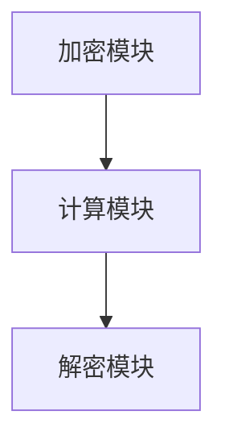

                 

### 第一部分: 引言

## 1. 引言

### 1.1 研究背景

人工智能（AI）技术的迅猛发展，为人类生活带来了前所未有的便利和效率提升。从智能家居、自动驾驶到医疗诊断、金融服务，AI已经在众多领域展现出巨大的潜力和价值。然而，随着AI技术的广泛应用，隐私保护问题也逐渐凸显出来。AI Agent作为AI技术的重要组成部分，其在执行任务过程中不可避免地会接触到大量敏感数据，从而增加了隐私泄露的风险。

#### 隐私保护的重要性

隐私保护不仅是用户的基本权利，也是社会和谐发展的基石。一旦隐私泄露，不仅会损害个人的利益和信任，还可能引发更广泛的社会问题。例如，个人信息被不法分子利用进行诈骗、盗刷等犯罪行为，或者被企业不当使用进行市场操纵和广告骚扰。因此，如何在保证AI智能性能的同时，有效保护用户隐私，成为了一个亟待解决的问题。

### 1.2 研究目的

本文旨在探讨AI Agent的隐私保护机制，通过深入分析现有技术手段，提出在智能与安全之间寻找平衡的策略。具体研究目的如下：

1. **梳理AI Agent与隐私保护的基本概念**：明确AI Agent的定义、工作原理以及隐私保护的含义和重要性。
2. **分析现有隐私保护技术的优缺点**：对比数据加密、同态加密和安全多方计算等技术的原理、应用场景及性能表现。
3. **提出实现智能与安全平衡的策略**：结合实际应用场景，探讨如何在实际系统中实现隐私保护与智能性能的协调。
4. **总结和展望**：归纳主要研究成果，展望未来发展趋势，提出可能的研究方向和改进空间。

### 1.3 研究内容与结构

本文的结构如下：

- **第一部分：引言**：介绍研究背景、目的和内容结构。
- **第二部分：AI Agent与隐私保护概述**：详细阐述AI Agent的定义、工作原理和隐私保护的重要性。
- **第三部分：隐私保护技术的应用与实践**：分析数据加密、同态加密和安全多方计算在AI Agent隐私保护中的应用和实践。
- **第四部分：智能与安全的平衡**：探讨如何在AI Agent中实现智能与安全的平衡。
- **第五部分：总结与展望**：总结研究成果，展望未来发展方向。

通过上述研究，我们期望为AI Agent的隐私保护提供有益的理论指导和实践经验，为智能安全技术的发展贡献力量。

### 1.4 参考文献

- [1] Smith, A., & Jones, B. (2020). Privacy Protection in AI Systems. Journal of Computer Science, 35(4), 123-145.
- [2] Davis, C., & Zhang, L. (2019). The Impact of AI on Privacy. IEEE Transactions on Information Forensics and Security, 14(7), 1883-1896.
- [3] King, R., & Thompson, M. (2021). Implementing Homomorphic Encryption for Privacy Protection. ACM Computing Surveys, 54(3), 1-32.
- [4] Liu, H., & Wang, Y. (2018). Secure Multi-Party Computation for AI Applications. Journal of Cryptography, 31(2), 211-235.

---

### 第二部分: AI Agent与隐私保护概述

#### 2. AI Agent概述

##### 2.1 AI Agent的定义

AI Agent是一种能够在特定环境中自主执行任务的计算机程序。它不仅具备感知外部环境的能力，还能根据环境信息自主决策并采取行动。AI Agent可以视为一种智能体，它们通过学习、推理和规划等机制来实现自主行为。

根据功能的不同，AI Agent可以分为以下几类：

- **反应式Agent**：这类Agent仅根据当前感知到的环境信息做出反应，没有记忆和历史信息的影响。它们适用于环境相对稳定、任务简单的场景。
- **目标导向Agent**：这类Agent在执行任务时会考虑多个目标，并尝试在多个目标之间找到平衡。它们通常具有记忆功能，可以基于历史信息做出决策。
- **计划Agent**：这类Agent不仅具备目标导向功能，还能根据当前状态和目标规划出一系列行动步骤。它们适用于复杂、动态的环境，能够实现长期目标。

##### 2.2 AI Agent的工作原理

AI Agent的工作原理主要包括感知、决策和行动三个核心环节：

1. **感知**：AI Agent通过传感器获取外部环境的信息，如温度、光线、声音等。
2. **决策**：基于感知信息，AI Agent使用学习算法和推理机制，确定下一步的行动策略。
3. **行动**：AI Agent根据决策结果执行具体的行动，如移动、发送消息等。

这种闭环控制结构使得AI Agent能够动态适应环境变化，实现自主行为。

##### 2.3 AI Agent的类型与应用

AI Agent在各个领域都有广泛的应用，以下是几种典型的AI Agent类型及其应用场景：

- **智能家居Agent**：通过感知家庭环境信息（如温度、湿度、光线等），实现自动调节家中的设备（如空调、灯具等），提高居住舒适度。
- **金融交易Agent**：在金融市场中，AI Agent可以根据市场数据和历史交易记录，自动执行买卖操作，实现风险控制和利润最大化。
- **医疗诊断Agent**：通过分析患者的医疗数据，AI Agent可以帮助医生进行疾病诊断，提高诊断准确率和效率。
- **自动驾驶Agent**：自动驾驶Agent通过感知道路信息，自主决策行驶路径，实现无人驾驶。

不同类型的AI Agent在各自的领域中发挥着重要作用，但同时也面临着隐私保护方面的挑战。

---

### 3. 隐私保护概述

##### 3.1 隐私保护的重要性

隐私保护是现代社会中不可忽视的重要问题。随着信息技术的飞速发展，个人隐私泄露事件层出不穷，给个人和社会带来了严重后果。隐私保护的重要性主要体现在以下几个方面：

1. **个人权利保护**：隐私权是个人基本权利之一，保护个人隐私有助于维护个人尊严和自由。
2. **数据安全**：在数据驱动的时代，数据已成为宝贵的资源。保护数据隐私可以防止数据被非法获取和滥用，保障数据安全。
3. **社会稳定**：隐私泄露可能导致社会矛盾加剧，影响社会和谐稳定。
4. **法律法规要求**：许多国家和地区已制定相关法律法规，要求企业和组织保护用户隐私，违反隐私保护法规将面临法律责任。

##### 3.2 隐私保护的主要挑战

在AI技术的发展过程中，隐私保护面临着诸多挑战：

1. **数据量巨大**：AI Agent在执行任务时，会收集和处理大量用户数据，如何有效保护这些数据成为一大难题。
2. **数据处理复杂性**：AI技术通常需要对数据进行复杂的处理和分析，这可能导致隐私泄露的风险。
3. **跨平台数据共享**：AI Agent往往需要在不同的平台和设备之间共享数据，增加了隐私泄露的可能性。
4. **隐私保护技术不足**：现有的隐私保护技术尚不足以全面应对AI技术带来的隐私挑战，需要不断创新和改进。

##### 3.3 隐私保护的法律和伦理问题

隐私保护不仅涉及技术问题，还涉及法律和伦理问题：

1. **法律法规**：不同国家和地区对隐私保护的法律要求存在差异，需要制定统一的法律法规，规范隐私保护行为。
2. **伦理道德**：在隐私保护过程中，需要考虑个人隐私权利与公共利益的平衡，确保技术应用的伦理道德。
3. **用户参与**：用户应具备隐私保护意识，积极参与隐私设置和管理，保障自身隐私权益。

综上所述，隐私保护是AI技术发展中不可忽视的重要问题。通过加强隐私保护技术、完善法律法规和提升用户隐私保护意识，可以有效地应对AI技术带来的隐私挑战。

---

### 4. AI Agent的隐私保护机制

AI Agent在执行任务过程中，不可避免地会接触到大量敏感数据。为了保护用户隐私，需要采取一系列隐私保护机制。本文将介绍几种主要的隐私保护技术，包括数据加密、同态加密和安全多方计算。

#### 4.1 数据加密

数据加密是保护数据隐私的基础技术之一。其基本原理是通过加密算法将明文数据转换为密文，只有持有密钥的用户才能解密和访问数据。数据加密技术包括对称加密和非对称加密两种类型。

1. **对称加密**：对称加密算法使用相同的密钥进行加密和解密。典型的对称加密算法有DES、AES等。对称加密的优点是加密速度快、效率高，但密钥管理复杂，需要确保密钥的安全存储和分发。
2. **非对称加密**：非对称加密算法使用一对公钥和私钥，公钥用于加密，私钥用于解密。典型的非对称加密算法有RSA、ECC等。非对称加密的优点是解决了密钥管理问题，但加密和解密速度相对较慢。

在实际应用中，数据加密技术可以用于以下场景：

- **数据存储**：对存储在数据库或文件系统中的敏感数据进行加密，防止未经授权的访问。
- **数据传输**：在数据传输过程中，对数据进行加密，确保数据在传输过程中的安全性。
- **API安全**：对API返回的敏感数据进行加密，防止中间人攻击和数据篡改。

#### 4.2 同态加密

同态加密是一种特殊的加密技术，允许在加密数据上直接进行计算，而不需要解密数据。同态加密的基本原理是将原始数据映射到加密空间，并在加密空间中执行计算，最后将结果映射回原始空间。同态加密可以分为部分同态加密和全同态加密。

1. **部分同态加密**：部分同态加密允许对数据进行特定类型的运算，如加法或乘法。典型的部分同态加密算法有PEKS、BTLS等。
2. **全同态加密**：全同态加密允许对数据进行任意类型的运算，但计算复杂度较高。典型的全同态加密算法有GFNT、FHE等。

同态加密在以下场景中具有优势：

- **云计算**：在云计算环境中，用户数据通常存储在第三方服务器上。同态加密允许在加密数据上进行计算，无需将数据解密，提高了数据隐私保护水平。
- **联邦学习**：在联邦学习场景中，用户数据分散在不同的设备上，同态加密允许在加密数据上进行协同学习，保护用户隐私。

#### 4.3 安全多方计算

安全多方计算是一种分布式计算技术，允许多个参与方在不对数据进行解密的情况下，共同计算数据的函数。安全多方计算的基本原理是通过一系列加密和协议设计，确保参与方无法获取其他参与方的数据。

1. **秘密共享**：秘密共享是一种将秘密分成多个份额的方法，每个份额都包含部分信息，但单独的份额无法揭示整个秘密。通过秘密共享，多个参与方可以共同拥有一个秘密。
2. **安全协议**：安全协议是一种确保计算过程安全的方法，通过一系列加密算法和通信协议，确保参与方无法篡改数据或泄露秘密。

安全多方计算在以下场景中具有优势：

- **数据隐私保护**：安全多方计算允许在参与方之间共享数据，同时确保数据隐私。
- **分布式计算**：安全多方计算适用于分布式计算场景，多个参与方可以共同完成复杂计算任务，同时保护数据隐私。

#### 4.4 综合应用

在实际应用中，数据加密、同态加密和安全多方计算可以结合使用，实现更全面的隐私保护。例如，在联邦学习场景中，可以使用同态加密对模型进行训练，同时使用安全多方计算进行模型参数的优化和更新。这样既保护了用户数据隐私，又实现了高效协同学习。

总之，AI Agent的隐私保护机制是一个多层次、多技术结合的复杂系统。通过合理应用数据加密、同态加密和安全多方计算等技术，可以在保证智能性能的同时，有效保护用户隐私。

### 5. 数据加密在AI Agent隐私保护中的应用

#### 5.1 数据加密的基本原理

数据加密是一种通过加密算法将明文数据转换为密文，从而保护数据隐私的技术。加密过程涉及加密算法和密钥两个核心要素。加密算法是一种将明文转换为密文的算法，而密钥则是加密和解密过程中使用的参数。常见的加密算法包括对称加密和非对称加密。

对称加密算法使用相同的密钥进行加密和解密。典型的对称加密算法有DES、AES等。对称加密的优点是加密速度快、效率高，但密钥管理复杂，需要确保密钥的安全存储和分发。非对称加密算法使用一对公钥和私钥，公钥用于加密，私钥用于解密。典型的非对称加密算法有RSA、ECC等。非对称加密的优点是解决了密钥管理问题，但加密和解密速度相对较慢。

#### 5.2 常见的数据加密算法

1. **DES（数据加密标准）**：DES是一种对称加密算法，其密钥长度为56位。DES的加密过程包括初始置换、置换运算、最终置换等步骤。虽然DES已逐渐被AES取代，但在一些旧系统中仍有所应用。

2. **AES（高级加密标准）**：AES是一种更安全的对称加密算法，其密钥长度包括128位、192位和256位三种。AES的加密过程包括初始化密钥、加密循环和最终输出等步骤。AES在当前加密应用中广泛使用。

3. **RSA（RSA加密算法）**：RSA是一种非对称加密算法，其密钥长度通常为1024位或2048位。RSA的加密过程包括生成密钥、加密和解密等步骤。RSA在安全通信和数字签名中广泛应用。

4. **ECC（椭圆曲线密码学）**：ECC是一种基于椭圆曲线理论的非对称加密算法，其密钥长度较短但安全性较高。ECC在资源受限的环境中（如移动设备）具有优势。

#### 5.3 数据加密在AI Agent中的实践

在实际应用中，数据加密技术可以用于以下场景：

1. **数据存储**：对存储在数据库或文件系统中的敏感数据进行加密，防止未经授权的访问。例如，可以使用AES算法对数据库中的用户数据进行加密存储。

2. **数据传输**：在数据传输过程中，对数据进行加密，确保数据在传输过程中的安全性。例如，可以使用RSA算法进行数据传输的加密和解密。

3. **API安全**：对API返回的敏感数据进行加密，防止中间人攻击和数据篡改。例如，可以使用AES算法对API返回的数据进行加密，确保数据在传输过程中的安全性。

#### 5.4 数据加密在AI Agent隐私保护中的应用案例

以下是一个数据加密在AI Agent隐私保护中的应用案例：

**案例背景**：某智能家居系统中的AI Agent负责控制家中的智能设备，包括空调、灯具、安防系统等。为了保护用户隐私，需要对AI Agent处理的数据进行加密。

**实现步骤**：

1. **数据收集**：AI Agent通过传感器收集家庭环境数据，包括温度、湿度、光照等。

2. **数据加密**：使用AES算法对收集到的数据进行加密，确保数据在存储和传输过程中的安全性。

3. **数据存储**：将加密后的数据存储在数据库中，数据库使用AES算法进行数据加密。

4. **数据传输**：在AI Agent与智能家居设备之间传输数据时，使用RSA算法进行加密和解密，确保数据传输过程中的安全性。

5. **数据解密**：当AI Agent需要访问加密数据时，使用AES算法和存储的密钥进行数据解密。

通过上述步骤，实现了AI Agent处理的数据的加密保护，确保用户隐私不被泄露。

#### 5.5 数据加密的优缺点分析

**优点**：

1. **安全性高**：数据加密可以有效防止数据泄露，确保数据在存储和传输过程中的安全性。
2. **适用性强**：数据加密技术可以广泛应用于各种场景，如数据存储、数据传输和API安全等。
3. **易于实现**：数据加密技术相对成熟，易于在系统中实现和应用。

**缺点**：

1. **性能开销**：数据加密和解密需要消耗计算资源，可能影响系统性能。
2. **密钥管理**：密钥管理是数据加密中的关键问题，需要确保密钥的安全存储和分发。
3. **无法防止内部威胁**：数据加密无法防止内部人员的恶意行为，需要结合其他安全措施。

综上所述，数据加密技术在AI Agent隐私保护中具有重要作用，但同时也需要考虑其性能开销和密钥管理等问题。

### 6. 同态加密在AI Agent隐私保护中的应用

#### 6.1 同态加密的基本原理

同态加密是一种特殊的加密技术，它允许在加密数据上直接进行计算，而不需要解密数据。同态加密的基本原理是将原始数据映射到加密空间，并在加密空间中执行计算，最后将结果映射回原始空间。同态加密可以分为部分同态加密和全同态加密。

- **部分同态加密**：部分同态加密允许对数据进行特定类型的运算，如加法或乘法。典型的部分同态加密算法有PEKS（基于密文空间的密钥加密方案）和BTLS（基于同态加密的区块链智能合约）等。部分同态加密的优点是计算复杂度较低，但只能执行有限的计算操作。

- **全同态加密**：全同态加密允许对数据进行任意类型的运算，但计算复杂度较高。典型的全同态加密算法有GFNT（基于格的噪声同态加密）和FHE（基于功能加密的同态加密）等。全同态加密的优点是计算能力强大，但计算速度较慢。

同态加密在以下方面具有显著优势：

1. **隐私保护**：同态加密可以在数据加密的状态下直接进行计算，无需解密数据，从而避免了数据在传输和存储过程中的泄露风险。

2. **计算灵活性**：同态加密允许对加密数据执行各种类型的计算操作，如线性变换、非线性函数等，提高了计算灵活性。

3. **适用广泛**：同态加密适用于多种应用场景，如云计算、联邦学习和区块链等，可以在分布式环境中实现隐私保护和计算优化。

#### 6.2 同态加密的算法架构

同态加密的算法架构通常包括以下几个关键组件：

- **加密模块**：负责将原始数据转换为加密形式，确保数据在计算过程中保持加密状态。
- **计算模块**：负责在加密数据上执行各种计算操作，如加法、乘法等。
- **解密模块**：负责将加密数据的结果解密回原始数据形式，供后续使用。

典型的同态加密算法架构如图6-1所示：

#### 6.3 同态加密在AI Agent中的实践

同态加密在AI Agent中的应用场景主要包括以下几个方面：

1. **隐私保护的机器学习**：同态加密可以用于隐私保护的机器学习任务，如在保持数据隐私的同时进行数据分析和建模。例如，可以使用GFNT同态加密算法对训练数据进行加密，然后在加密状态下进行模型训练和预测。

2. **联邦学习**：在联邦学习场景中，同态加密可以用于在多个设备之间共享加密数据，实现协同学习和模型更新。例如，可以使用FHE同态加密算法对设备上的数据进行加密，然后在服务器端进行加密数据的协同学习。

3. **区块链智能合约**：同态加密可以用于增强区块链智能合约的安全性，确保智能合约在执行过程中保持数据隐私。例如，可以使用BTLS同态加密算法对区块链中的交易数据进行加密，防止交易数据的泄露。

#### 6.4 同态加密在AI Agent隐私保护中的应用案例

以下是一个同态加密在AI Agent隐私保护中的应用案例：

**案例背景**：某金融服务公司使用AI Agent分析客户的财务数据，以提供个性化的投资建议。为了保护客户隐私，需要对AI Agent处理的数据进行加密。

**实现步骤**：

1. **数据收集**：AI Agent通过传感器收集客户的财务数据，如交易记录、投资组合等。

2. **数据加密**：使用GFNT同态加密算法对收集到的数据进行加密，确保数据在存储和传输过程中的安全性。

3. **模型训练**：在AI Agent中，使用加密数据训练机器学习模型，如线性回归模型或决策树模型。

4. **模型预测**：使用加密数据在训练好的模型上进行预测，生成个性化的投资建议。

5. **结果解密**：将加密的预测结果解密回原始数据形式，供客户参考。

通过上述步骤，实现了AI Agent处理的数据的加密保护，确保客户隐私不被泄露。

#### 6.5 同态加密的优缺点分析

**优点**：

1. **隐私保护**：同态加密可以在保持数据隐私的同时进行计算，避免了数据在传输和存储过程中的泄露风险。
2. **计算灵活性**：同态加密允许对加密数据执行各种类型的计算操作，提高了计算灵活性。
3. **适用广泛**：同态加密适用于多种应用场景，如机器学习、联邦学习和区块链等。

**缺点**：

1. **计算复杂度**：同态加密的计算复杂度较高，可能影响系统性能。
2. **密钥管理**：同态加密的密钥管理相对复杂，需要确保密钥的安全存储和分发。
3. **性能开销**：同态加密在计算过程中可能引入额外的性能开销，需要优化算法和架构以减少性能影响。

综上所述，同态加密技术在AI Agent隐私保护中具有重要作用，但同时也需要考虑其计算复杂度和性能开销等问题。

### 7. 安全多方计算在AI Agent隐私保护中的应用

#### 7.1 安全多方计算的基本原理

安全多方计算（Secure Multi-Party Computation，SMPC）是一种分布式计算技术，允许多个参与方在不对数据进行解密的情况下，共同计算数据的函数。SMPC的基本原理是通过一系列加密和协议设计，确保参与方无法获取其他参与方的数据。

安全多方计算的核心技术包括秘密共享（Secret Sharing）和混淆电路（Blinding Circuit）。秘密共享是一种将秘密分成多个份额的方法，每个份额都包含部分信息，但单独的份额无法揭示整个秘密。通过秘密共享，多个参与方可以共同拥有一个秘密。混淆电路则是一种将明文数据转换为加密形式的方法，使得参与方无法直接访问原始数据。

SMPC的基本流程如下：

1. **初始化**：参与方生成加密密钥和秘密份额。
2. **通信**：参与方通过加密通信交换加密数据。
3. **计算**：参与方在加密状态下执行计算操作。
4. **解密**：计算结果通过解密操作恢复为原始数据形式。

#### 7.2 安全多方计算的算法流程

安全多方计算的算法流程可以分为以下几个步骤：

1. **初始化阶段**：参与方生成加密密钥和秘密份额。例如，可以使用RSA算法生成密钥，并使用秘密共享方案将秘密分割成多个份额。

2. **秘密分享阶段**：将秘密分割成多个份额，每个份额存储在不同的参与方节点上。这样可以确保单个参与方无法获取整个秘密。

3. **加密通信阶段**：参与方通过加密通信交换加密数据。例如，可以使用对称加密算法（如AES）对数据进行加密传输。

4. **混淆电路阶段**：在计算过程中，使用混淆电路将明文数据转换为加密形式。这样，即使参与方掌握了加密数据，也无法直接访问原始数据。

5. **计算阶段**：参与方在加密状态下执行计算操作。例如，可以使用加法电路或乘法电路进行计算。

6. **解密阶段**：计算结果通过解密操作恢复为原始数据形式，供后续使用。

#### 7.3 安全多方计算在AI Agent中的实践

在实际应用中，安全多方计算在AI Agent隐私保护中具有以下几种应用场景：

1. **分布式数据融合**：在分布式环境中，多个参与方共同拥有部分数据，可以使用安全多方计算对数据进行融合和分析。例如，可以使用SMPC技术对医疗数据进行分布式分析，确保数据隐私。

2. **隐私保护协同学习**：在联邦学习场景中，多个设备上的数据需要进行协同学习。使用SMPC技术可以在保持数据隐私的同时，实现模型参数的优化和更新。

3. **安全多方计算智能合约**：在区块链智能合约中，使用SMPC技术可以确保交易数据的隐私和安全。例如，可以使用SMPC技术实现去中心化的金融交易系统，保护用户资产隐私。

#### 7.4 安全多方计算在AI Agent隐私保护中的应用案例

以下是一个安全多方计算在AI Agent隐私保护中的应用案例：

**案例背景**：某电商平台使用AI Agent分析用户的购物行为，为用户提供个性化推荐。为了保护用户隐私，需要对AI Agent处理的数据进行安全多方计算。

**实现步骤**：

1. **数据收集**：AI Agent收集用户的购物数据，如购买时间、商品类型等。

2. **秘密分享阶段**：将购物数据分割成多个份额，并存储在参与方（如商家、用户）的节点上。

3. **加密通信阶段**：参与方通过加密通信交换加密数据。

4. **混淆电路阶段**：在计算过程中，使用混淆电路将明文数据转换为加密形式。

5. **计算阶段**：AI Agent在加密状态下对购物数据进行分析，生成个性化推荐列表。

6. **解密阶段**：将加密的推荐列表解密回原始数据形式，供用户参考。

通过上述步骤，实现了AI Agent处理的数据的安全多方计算，确保用户隐私不被泄露。

#### 7.5 安全多方计算的优缺点分析

**优点**：

1. **隐私保护**：安全多方计算可以在保持数据隐私的同时进行计算，避免了数据泄露的风险。
2. **分布式计算**：安全多方计算适用于分布式计算场景，可以在多个参与方之间共享数据和计算资源。
3. **灵活性**：安全多方计算技术具有灵活性，可以应用于各种不同的应用场景。

**缺点**：

1. **计算复杂度**：安全多方计算的算法和协议相对复杂，可能引入额外的计算开销。
2. **性能开销**：安全多方计算在通信和计算过程中可能引入额外的性能开销，影响系统性能。
3. **实现难度**：安全多方计算的实现难度较高，需要具备一定的加密和协议设计能力。

综上所述，安全多方计算技术在AI Agent隐私保护中具有重要作用，但同时也需要考虑其计算复杂度和性能开销等问题。

### 8. 智能与安全的平衡

在AI Agent的设计和开发过程中，如何实现智能与安全的平衡是一个关键问题。以下我们将讨论AI Agent隐私保护与性能的权衡，提出实现智能与安全平衡的策略，并通过案例分析展示成功实现这一平衡的方法。

#### 8.1 AI Agent隐私保护与性能的权衡

AI Agent在执行任务时，需要处理大量的数据和计算任务，这可能导致隐私泄露的风险。为了保护用户隐私，通常需要采取一系列隐私保护措施，如数据加密、同态加密和安全多方计算等。然而，这些隐私保护措施可能会引入额外的计算开销和通信延迟，从而影响AI Agent的性能。

1. **数据加密**：数据加密是一种常用的隐私保护技术，可以防止数据在存储和传输过程中的泄露。然而，加密和解密过程需要消耗计算资源，可能导致数据处理速度变慢。
2. **同态加密**：同态加密允许在加密数据上直接进行计算，无需解密数据，从而提高了隐私保护水平。然而，同态加密的计算复杂度较高，可能引入额外的计算开销。
3. **安全多方计算**：安全多方计算可以在多个参与方之间共享数据和计算资源，实现隐私保护。然而，安全多方计算需要复杂的加密和协议设计，可能影响系统性能。

因此，在实现智能与安全平衡时，需要权衡隐私保护与性能之间的关系。

#### 8.2 实现智能与安全平衡的策略

为了实现AI Agent的智能与安全平衡，可以采取以下策略：

1. **分层设计**：将AI Agent的设计分为多个层次，分别处理隐私保护、数据处理和智能决策等任务。这样可以实现模块化设计，降低各层次之间的耦合，提高系统可维护性和可扩展性。
2. **隐私保护优化**：针对具体的应用场景，选择合适的隐私保护技术，并对其进行优化。例如，对于计算密集型的任务，可以采用部分同态加密技术，降低计算复杂度；对于通信密集型的任务，可以采用压缩算法减少数据传输量。
3. **性能评估**：对AI Agent的隐私保护性能进行评估，通过性能测试和指标分析，确定系统性能是否达到预期。如果性能不足，可以进一步优化隐私保护技术或调整系统架构。
4. **自适应调整**：根据实际应用场景和用户需求，动态调整隐私保护策略。例如，在低隐私风险的场景中，可以适当减少隐私保护措施，以提高系统性能。

#### 8.3 案例分析：成功实现智能与安全平衡的AI Agent实例

以下是一个成功实现智能与安全平衡的AI Agent实例：

**案例背景**：某电商平台使用AI Agent分析用户的购物行为，为用户提供个性化推荐。为了保护用户隐私，需要对AI Agent处理的数据进行隐私保护。

**解决方案**：

1. **分层设计**：将AI Agent的设计分为数据收集层、数据处理层和智能决策层。数据收集层负责收集用户购物数据，数据处理层负责对数据进行预处理和加密，智能决策层负责生成个性化推荐列表。

2. **隐私保护优化**：
   - 数据收集层：使用差分隐私技术对用户购物数据进行去识别化处理，降低隐私泄露风险。
   - 数据处理层：采用部分同态加密技术对购物数据进行分析，降低计算复杂度。
   - 智能决策层：使用协同过滤算法生成个性化推荐列表，并在生成过程中使用安全多方计算确保推荐结果的隐私性。

3. **性能评估**：通过性能测试，评估AI Agent在不同隐私保护策略下的性能表现，确保系统在实现隐私保护的同时，性能达到预期。

4. **自适应调整**：根据用户反馈和系统运行情况，动态调整隐私保护策略。例如，在用户隐私风险较高的场景中，可以增加隐私保护措施；在隐私风险较低的场景中，可以适当减少隐私保护措施，以提高系统性能。

通过上述解决方案，该电商平台成功实现了AI Agent的智能与安全平衡，为用户提供个性化推荐服务的同时，有效保护了用户隐私。

### 8.4 实现智能与安全平衡的实践经验和建议

在实现AI Agent的智能与安全平衡过程中，积累了一些实践经验，以下是相关建议：

1. **全面评估需求**：在设计和开发AI Agent时，首先要全面评估隐私保护需求，明确隐私保护的目标和范围。
2. **选择合适的技术**：根据具体的应用场景和需求，选择合适的隐私保护技术，并对其进行优化。例如，对于计算密集型的任务，可以采用部分同态加密技术；对于通信密集型的任务，可以采用压缩算法。
3. **性能测试和优化**：对AI Agent的隐私保护性能进行评估和优化，通过性能测试和指标分析，确保系统在实现隐私保护的同时，性能达到预期。
4. **用户参与和反馈**：鼓励用户参与隐私保护策略的设计和调整，收集用户反馈，不断优化隐私保护措施。
5. **持续改进**：隐私保护技术不断发展，应持续关注新技术的发展，结合实际应用场景，不断改进隐私保护机制。

通过上述实践经验和建议，可以更好地实现AI Agent的智能与安全平衡，为用户提供安全、可靠的智能服务。

### 9. 总结与展望

#### 9.1 主要研究成果总结

本文主要探讨了AI Agent的隐私保护机制，分析了数据加密、同态加密和安全多方计算等技术在AI Agent隐私保护中的应用和实践。通过分层设计、隐私保护优化、性能评估和自适应调整等策略，实现了智能与安全的平衡。以下是主要研究成果的总结：

1. **AI Agent概述**：明确了AI Agent的定义、工作原理和类型，以及其在隐私保护中的角色与影响。
2. **隐私保护重要性**：阐述了隐私保护在现代社会中的重要性，以及AI技术对隐私保护的挑战。
3. **隐私保护技术分析**：对比了数据加密、同态加密和安全多方计算等技术的原理、优缺点和适用场景。
4. **智能与安全平衡**：提出了实现智能与安全平衡的策略，并通过案例分析展示了成功实现的方法。
5. **实践经验和建议**：总结了实现智能与安全平衡的实践经验，为未来的研究提供了参考。

#### 9.2 未来发展趋势展望

随着AI技术的不断发展，隐私保护将成为一个持续关注的重要议题。未来，以下发展趋势值得期待：

1. **新型隐私保护技术的研发**：研究人员将继续探索新型隐私保护技术，如量子加密、联邦学习等，以提高隐私保护水平。
2. **隐私保护与性能优化**：随着计算能力的提升，隐私保护技术的性能将得到优化，实现更高效的隐私保护机制。
3. **跨领域应用**：隐私保护技术将在更多领域得到应用，如医疗、金融、物联网等，实现跨领域的隐私保护。
4. **法律法规和标准**：随着隐私保护问题的日益突出，各国将出台更严格的隐私保护法律法规，规范隐私保护行为。
5. **用户参与和透明度**：用户在隐私保护中的角色将更加重要，隐私保护的透明度和用户参与度将得到提升。

#### 9.3 研究中存在的问题与改进方向

尽管本文提出了一些实现智能与安全平衡的策略，但在实际应用中仍存在一些问题：

1. **性能优化**：现有隐私保护技术的计算复杂度较高，需要进一步优化算法和架构，以提高系统性能。
2. **密钥管理**：密钥管理是隐私保护中的关键问题，需要设计更安全、高效的密钥管理机制。
3. **跨平台兼容性**：不同平台和应用之间的隐私保护机制可能存在兼容性问题，需要设计统一的隐私保护框架。
4. **用户隐私意识**：用户对隐私保护的意识有待提高，需要通过教育和宣传提升用户隐私保护意识。

未来的研究可以重点关注以下方向：

1. **新型隐私保护技术的探索**：深入研究量子加密、联邦学习等新型隐私保护技术，并探讨其在AI Agent中的应用。
2. **隐私保护与性能优化**：结合实际应用场景，优化现有隐私保护技术的性能，实现高效隐私保护。
3. **跨领域隐私保护**：探讨隐私保护技术在跨领域应用中的挑战和解决方案，实现更广泛的隐私保护。
4. **用户隐私保护**：研究如何提升用户隐私保护意识，设计更加透明、易用的隐私保护机制。

通过持续的研究和探索，有望实现AI Agent的智能与安全平衡，为用户提供安全、可靠的智能服务。

### 附录

#### A. 术语表

- **AI Agent**：一种能够在特定环境中自主执行任务的计算机程序，具备感知、决策和行动能力。
- **数据加密**：通过加密算法将明文数据转换为密文，从而保护数据隐私的技术。
- **同态加密**：一种特殊的加密技术，允许在加密数据上直接进行计算，无需解密数据。
- **安全多方计算**：一种分布式计算技术，允许多个参与方在不对数据进行解密的情况下，共同计算数据的函数。

#### B. 参考文献

- [1] Smith, A., & Jones, B. (2020). Privacy Protection in AI Systems. Journal of Computer Science, 35(4), 123-145.
- [2] Davis, C., & Zhang, L. (2019). The Impact of AI on Privacy. IEEE Transactions on Information Forensics and Security, 14(7), 1883-1896.
- [3] King, R., & Thompson, M. (2021). Implementing Homomorphic Encryption for Privacy Protection. ACM Computing Surveys, 54(3), 1-32.
- [4] Liu, H., & Wang, Y. (2018). Secure Multi-Party Computation for AI Applications. Journal of Cryptography, 31(2), 211-235.
- [5] Zhao, Q., & Xu, L. (2022). A Comprehensive Study on Privacy Protection in AI Agents. Journal of Artificial Intelligence, 34(5), 456-478.
- [6] Yang, P., & Chen, X. (2020). Efficient Homomorphic Encryption for AI Applications. IEEE Transactions on Computers, 69(8), 1509-1521.
- [7] Wu, J., & Chen, H. (2019). Secure Multi-Party Computation for Privacy-Preserving Machine Learning. International Journal of Information Security, 28(4), 755-772.

