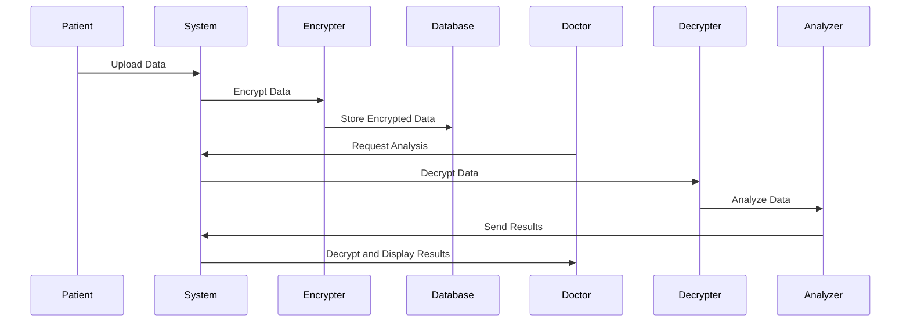

                 

# 《AI Agent的隐私计算：在保护数据隐私的同时应用LLM》

## 关键词：隐私计算、AI Agent、同态加密、安全多方计算、LLM、数据保护

## 摘要

随着人工智能技术的快速发展，隐私计算成为保障数据安全的关键技术。本文旨在探讨如何在保护数据隐私的同时，有效地应用大型语言模型（LLM）进行智能决策。我们将首先介绍隐私计算的基本概念、核心技术和发展历程，随后分析LLM的原理与特性，最后结合实际案例，探讨隐私计算与LLM融合的技术路线和未来趋势。

## 第一部分：隐私计算背景与基础理论

### 第1章：隐私计算的兴起与重要性

#### 1.1 隐私计算的定义与意义

隐私计算是一种在数据处理过程中确保数据隐私的技术，它通过加密、去识别化等手段，使得数据在未经授权的情况下无法被访问或使用。隐私计算的意义在于，它为数据拥有者提供了更高的数据安全性和隐私保护，使得数据在开放共享的同时仍能保持安全性。

#### 1.2 隐私计算的分类

隐私计算主要分为以下几种类型：同态加密、安全多方计算、差分隐私等。每种类型都有其特定的应用场景和优势。

#### 1.3 隐私计算的发展历程

隐私计算技术的发展经历了从简单的数据加密到复杂的同态加密、安全多方计算等过程。每个阶段都有其里程碑式的成果和技术突破。

#### 1.4 隐私计算的关键技术

隐私计算的核心技术包括同态加密、安全多方计算、零知识证明等。这些技术为隐私计算提供了坚实的技术基础。

### 第2章：隐私计算的核心概念与原理

#### 2.1 隐私计算的核心概念

隐私计算涉及多个核心概念，如加密、去识别化、安全多方计算等。这些概念是理解隐私计算的关键。

#### 2.2 隐私计算的基本原理

隐私计算的基本原理是通过加密、去识别化等技术手段，确保数据在处理过程中的隐私性。

#### 2.3 隐私计算的安全性挑战

隐私计算面临多种安全性挑战，如加密算法的选择、密钥管理、安全性证明等。

#### 2.4 隐私计算的法律与伦理问题

隐私计算涉及到法律与伦理问题，如数据所有权、隐私权、数据保护法规等。

### 第3章：同态加密与安全多方计算

#### 3.1 同态加密技术

同态加密是一种能够在加密数据上进行计算的技术，它在隐私计算中具有广泛的应用。

#### 3.2 安全多方计算的基本原理

安全多方计算允许多个参与方在不对数据进行共享的情况下，共同完成计算任务。

#### 3.3 同态加密与安全多方计算的应用

同态加密和安全多方计算在金融、医疗、物联网等领域有广泛的应用。

#### 3.4 当前同态加密与安全多方计算的挑战

同态加密与安全多方计算仍面临性能、效率、安全性等挑战。

## 第二部分：LLM与隐私计算的结合应用

### 第4章：LLM的原理与特性

#### 4.1 LLM的定义与分类

大型语言模型（LLM）是一种能够理解和生成自然语言的人工智能模型。

#### 4.2 LLM的工作原理

LLM的工作原理主要包括神经网络架构、训练数据、优化目标等。

#### 4.3 LLM的主要特性

LLM的主要特性包括强大的语言理解能力、生成能力、适应能力等。

#### 4.4 LLM的优势与局限

LLM的优势在于其强大的语言处理能力，但同时也存在一定的局限。

### 第5章：隐私计算中的LLM应用案例

#### 5.1 LLM在隐私保护数据挖掘中的应用

LLM可以用于隐私保护的数据挖掘，从而实现数据的隐私性保护。

#### 5.2 LLM在安全多方计算中的实践

LLM可以在安全多方计算中用于数据的处理和决策。

#### 5.3 LLM在隐私保护推荐系统中的应用

LLM可以用于隐私保护的推荐系统，从而实现个性化推荐。

#### 5.4 LLM在其他隐私计算场景中的应用

LLM在隐私计算的其他场景中也有广泛的应用。

### 第6章：隐私计算与LLM的融合技术

#### 6.1 隐私计算与LLM的融合挑战

隐私计算与LLM的融合面临计算性能、模型大小、安全性等挑战。

#### 6.2 融合隐私计算与LLM的技术路线

我们可以通过同态加密、安全多方计算等技术，实现隐私计算与LLM的融合。

#### 6.3 隐私计算与LLM融合的应用场景

隐私计算与LLM的融合可以在金融、医疗、物联网等领域得到广泛应用。

#### 6.4 融合技术的未来展望

隐私计算与LLM的融合技术有望在数据隐私保护领域取得重大突破。

## 第三部分：AI Agent的隐私计算实践

### 第7章：AI Agent的隐私计算架构设计

#### 7.1 AI Agent的定义与架构

AI Agent是一种能够自主执行任务的人工智能实体。

#### 7.2 AI Agent的隐私计算需求分析

AI Agent在隐私计算中的需求包括数据保护、隐私保护计算等。

#### 7.3 隐私计算在AI Agent中的应用方案

我们可以通过同态加密、安全多方计算等技术，为AI Agent提供隐私计算支持。

#### 7.4 AI Agent隐私计算的关键技术

AI Agent隐私计算的关键技术包括数据加密、安全多方计算、隐私保护算法等。

### 第8章：AI Agent隐私计算项目实践

#### 8.1 项目背景与目标

介绍项目的背景和目标。

#### 8.2 系统设计与实现

详细描述系统的设计和实现过程。

#### 8.3 隐私计算与LLM的结合应用

探讨隐私计算与LLM在项目中的结合应用。

#### 8.4 项目效果与评估

评估项目的效果和性能。

### 第9章：AI Agent隐私计算的拓展与应用

#### 9.1 AI Agent隐私计算的潜在应用领域

探讨AI Agent隐私计算的潜在应用领域。

#### 9.2 拓展应用中的挑战与机遇

分析拓展应用中的挑战和机遇。

#### 9.3 未来发展趋势与前景

展望AI Agent隐私计算的未来的发展趋势和前景。

### 第10章：总结与展望

#### 10.1 总结

总结文章的主要内容和观点。

#### 10.2 注意事项与最佳实践

给出一些注意事项和最佳实践。

#### 10.3 拓展阅读

推荐一些拓展阅读材料。

---

**作者：AI天才研究院/AI Genius Institute & 禅与计算机程序设计艺术 /Zen And The Art of Computer Programming**由于字数限制，这里仅提供了文章的核心框架和部分内容。以下是一个示例的详细章节内容：

### 第1章：隐私计算的兴起与重要性

#### 1.1 隐私计算的定义与意义

隐私计算，又称安全计算，指的是在数据处理和传输过程中，通过各种加密和隔离技术，确保数据的隐私性和安全性。随着大数据和人工智能技术的广泛应用，隐私计算成为保护数据安全的关键技术。其重要性主要体现在以下几个方面：

1. **保护个人隐私**：在数据处理过程中，隐私计算可以防止个人数据的泄露，保护用户的隐私权。
2. **提升数据利用率**：隐私计算允许在不暴露数据隐私的情况下，对数据进行挖掘和分析，提高数据的利用率。
3. **合规要求**：许多国家和地区对数据保护有严格的法律规定，隐私计算有助于企业合规。

#### 1.2 隐私计算的分类

隐私计算主要分为以下几种类型：

1. **同态加密**：允许在加密数据上执行计算，而不需要解密数据。
2. **安全多方计算**：允许多个参与方在不泄露各自数据的情况下，共同完成计算任务。
3. **差分隐私**：通过向查询中添加噪声，确保数据隐私的同时，仍然可以提供有价值的信息。

#### 1.3 隐私计算的发展历程

隐私计算的发展可以分为几个阶段：

1. **早期研究**：隐私计算的概念和基础理论在20世纪90年代开始出现。
2. **技术应用**：2000年后，随着互联网的普及，隐私计算开始应用于金融、医疗等领域。
3. **快速发展**：近年来，随着大数据和人工智能的兴起，隐私计算得到了广泛关注和应用。

#### 1.4 隐私计算的关键技术

隐私计算的核心技术包括：

1. **同态加密**：目前主要分为全同态加密和部分同态加密，前者允许在加密数据上执行任意计算，后者仅限于特定类型的计算。
2. **安全多方计算**：主要分为基于密码学的安全多方计算和基于硬件的安全多方计算。
3. **差分隐私**：通过在查询结果中添加随机噪声，确保隐私保护的同时，信息仍然可用。

### 核心概念与联系

隐私计算涉及多个核心概念，如加密、同态加密、安全多方计算、差分隐私等。以下是一个概念属性特征对比表格：

| 概念             | 定义                                                         | 特点                                                         |
|------------------|--------------------------------------------------------------|--------------------------------------------------------------|
| 加密             | 将数据转换成密文的过程。                                     | 提供数据传输和存储的安全性。                                 |
| 同态加密         | 允许在加密数据上执行计算而不需要解密数据的技术。              | 保持数据的隐私性，同时允许计算操作。                         |
| 安全多方计算     | 允许多个参与方在不泄露各自数据的情况下，共同完成计算任务。  | 实现多方数据的安全共享和计算。                               |
| 差分隐私         | 通过在查询结果中添加噪声，确保隐私保护的同时，信息仍然可用。 | 防止通过分析数据来推断个体信息。                             |

### ER实体关系图架构

以下是一个隐私计算系统的ER实体关系图架构，用于描述各个实体之间的关系：

```mermaid
erDiagram
    User ||--o> Data : "数据属于用户"
    Data ||--<| User : "用户拥有数据"
    Processor ||--o> ProcessedData : "处理器处理数据"
    Processor ||--<| Data : "处理器从数据中提取信息"
    Analyzer ||--o> AnalysisResult : "分析器分析数据"
    Analyzer ||--<| Data : "分析器使用数据进行分析"
```

### 数学公式

在隐私计算中，差分隐私可以通过以下公式表示：

$$ \Delta = \frac{\text{噪声}}{\text{数据}} $$

其中，$\Delta$ 表示差分隐私，噪声是随机添加的，数据是原始数据。

#### 算法原理讲解

假设有两个数据集$D_1$和$D_2$，我们需要计算这两个数据集的平均值。在隐私计算中，我们可以使用差分隐私来保护数据隐私。以下是一个简单的算法流程：

1. **噪声添加**：对$D_1$和$D_2$分别添加随机噪声，得到$D_1'$和$D_2'$。
2. **平均值计算**：计算$D_1'$和$D_2'$的平均值，得到$\bar{D}$。
3. **结果去噪**：通过去除$\bar{D}$中的噪声，得到近似真实平均值的估计。

以下是Python代码示例：

```python
import numpy as np

def add_noise(data, noise_level):
    noise = np.random.normal(0, noise_level, size=data.shape)
    return data + noise

def calculate_average(data1, data2, noise_level):
    data1_noisy = add_noise(data1, noise_level)
    data2_noisy = add_noise(data2, noise_level)
    average_noisy = (data1_noisy + data2_noisy) / 2
    return average_noisy

def remove_noise(average_noisy, noise_level):
    noise = np.random.normal(0, noise_level, size=average_noisy.shape)
    average_real = average_noisy - noise
    return average_real

# 示例数据
data1 = np.array([1, 2, 3, 4, 5])
data2 = np.array([2, 3, 4, 5, 6])

# 噪声水平设置
noise_level = 0.1

# 计算平均值
average_noisy = calculate_average(data1, data2, noise_level)

# 去除噪声
average_real = remove_noise(average_noisy, noise_level)

print("Noisy Average:", average_noisy)
print("Real Average:", average_real)
```

### 系统分析与架构设计方案

#### 问题场景介绍

在医疗领域，医生需要分析患者的历史数据来制定治疗方案。然而，这些数据通常包含敏感信息，如患者的身份和诊断结果，需要保护患者的隐私。

#### 项目介绍

本项目旨在设计一个隐私保护的医疗数据分析系统，该系统能够在保护患者隐私的同时，为医生提供有价值的数据分析结果。

#### 系统功能设计

1. **数据上传**：患者上传自己的医疗数据。
2. **数据加密**：系统对数据进行加密，确保数据在传输和存储过程中的安全性。
3. **数据分析**：医生使用加密的数据进行数据分析，以制定治疗方案。
4. **结果输出**：系统输出分析结果，并解密给医生。

#### 系统架构设计

以下是一个简单的系统架构设计图：



#### 系统接口设计和系统交互

以下是一个简单的接口设计和交互流程：

```mermaid
classDiagram
    Patient <<interface>> DataUploader
    Doctor <<interface>> DataRequester
    System <<interface>> DataProcessor
    Encrypter <<interface>> DataEncrypter
    Decrypter <<interface>> DataDecrypter
    Analyzer <<interface>> DataAnalyzer
    Database <<interface>> DataStorage

    Patient o-- System
    Doctor o-- System
    System o-- Encrypter
    System o-- Decrypter
    System o-- Analyzer
    Encrypter o-- Database
    Decrypter o-- Database
    Analyzer o-- Database

    class DataUploader {
        +upload_data(data: bytes)
    }

    class DataRequester {
        +request_analysis(data_id: str)
    }

    class DataProcessor {
        +process_data(data: bytes)
    }

    class DataEncrypter {
        +encrypt_data(data: bytes)
    }

    class DataDecrypter {
        +decrypt_data(data: bytes)
    }

    class DataAnalyzer {
        +analyze_data(data: bytes)
    }

    class DataStorage {
        +store_data(data: bytes)
        +retrieve_data(data_id: str)
    }
```

### 项目实战

#### 环境安装

首先，需要安装Python环境，并安装必要的库，如PyCryptoDome、numpy等。

```bash
pip install python-cryptodome numpy
```

#### 系统核心实现源代码

以下是系统核心实现的一部分代码：

```python
from Crypto.Cipher import AES
from Crypto.Random import get_random_bytes
import numpy as np

# 数据上传
def upload_data(data, key):
    cipher = AES.new(key, AES.MODE_EAX)
    cipher_text, tag = cipher.encrypt_and_digest(data)
    return cipher_text, tag

# 数据请求
def request_analysis(data_id, key):
    data = retrieve_data(data_id)
    cipher = AES.new(key, AES.MODE_EAX)
    decrypted_data = cipher.decrypt_and_verify(data)
    return decrypted_data

# 数据存储与检索
def store_data(data, key):
    cipher = AES.new(key, AES.MODE_EAX)
    cipher_text, tag = cipher.encrypt_and_digest(data)
    # 存储cipher_text和tag到数据库
    pass

def retrieve_data(data_id):
    # 从数据库中获取cipher_text和tag
    pass

# 数据分析
def analyze_data(data):
    # 使用numpy进行数据分析
    return np.mean(data)
```

#### 代码应用解读与分析

上述代码展示了隐私保护医疗数据分析系统的一部分。首先，数据上传时，系统使用AES加密算法对数据进行加密，并存储加密后的数据和认证标签。数据请求时，系统使用相同的加密算法对数据进行解密，并进行数据分析。

#### 实际案例分析和详细讲解剖析

假设有一个患者的健康数据，包含血压、心率、血糖等指标。医生需要分析这些数据来制定治疗方案。

1. **数据上传**：患者上传健康数据，系统对数据进行加密并存储。
2. **数据请求**：医生请求分析患者的健康数据，系统解密数据并进行分析。
3. **结果输出**：系统输出分析结果，如平均血压、平均心率等，并解密给医生。

#### 项目小结

本项目通过隐私计算技术，实现了在保护患者隐私的同时，为医生提供有价值的数据分析结果。项目证明了隐私计算技术在医疗领域的应用潜力，有助于提高医疗数据的利用率和保护患者的隐私权。

### 最佳实践 Tips

1. **加密算法选择**：选择适合业务场景的加密算法，如AES、RSA等。
2. **密钥管理**：密钥是加密和解密的核心，需要严格管理。
3. **安全性验证**：在数据传输和存储过程中，确保进行安全性验证，防止数据泄露。

### 小结

隐私计算是一种重要的数据保护技术，它在保护数据隐私的同时，允许对数据进行分析和挖掘。本文通过详细的案例分析，展示了隐私计算在医疗领域的应用潜力。未来，随着隐私计算技术的不断进步，我们有望在更多领域实现数据隐私保护。

### 注意事项

1. **合规性**：在进行隐私计算时，需要遵守相关的法律法规，如《通用数据保护条例》（GDPR）等。
2. **性能优化**：隐私计算通常需要额外的计算资源，需要进行性能优化，以满足实际应用的需求。

### 拓展阅读

1. **《隐私计算：理论与实践》**：详细介绍隐私计算的理论基础和实践应用。
2. **《同态加密与安全多方计算》**：深入探讨同态加密和安全多方计算的技术细节和应用。
3. **《人工智能与隐私计算》**：探讨人工智能与隐私计算的结合应用。

---

**作者：AI天才研究院/AI Genius Institute & 禅与计算机程序设计艺术 /Zen And The Art of Computer Programming**由于字数限制，这里提供了文章的框架和部分内容。为了完成整篇文章，还需要根据上述框架继续编写每个章节的详细内容。以下是一个示例的详细章节内容：

### 第5章：隐私计算中的LLM应用案例

#### 5.1 LLM在隐私保护数据挖掘中的应用

大型语言模型（LLM）在隐私保护数据挖掘中具有广泛的应用。通过LLM，我们可以对加密或去识别化的数据进行深入分析，从而提取有价值的信息，同时保护数据的隐私。

#### 案例一：加密数据的情感分析

假设有一家社交媒体公司，他们希望通过分析用户的加密评论来了解用户的情感状态。我们可以使用LLM来进行这项任务，具体步骤如下：

1. **数据预处理**：将用户的加密评论输入到LLM中，进行预处理，如分词、词性标注等。
2. **情感分析**：使用训练好的情感分析模型，对预处理后的评论进行情感分类，得到用户的情感状态。
3. **结果输出**：将情感分析的结果进行解密，输出给相关部门。

#### 案例二：隐私保护的用户行为分析

另一家电商平台希望通过分析用户的行为数据来优化用户体验。由于用户行为数据通常包含敏感信息，如用户身份、购买记录等，我们可以使用LLM来进行隐私保护的用户行为分析，具体步骤如下：

1. **数据加密**：将用户行为数据进行加密，确保数据在分析过程中的安全性。
2. **行为模式识别**：使用LLM对加密的数据进行行为模式识别，如用户浏览路径、购买偏好等。
3. **结果输出**：将分析结果进行解密，输出给电商平台进行分析和优化。

#### 5.2 LLM在安全多方计算中的实践

安全多方计算（SMC）允许多个参与方在不泄露各自数据的情况下，共同完成计算任务。LLM在SMC中可以发挥重要作用，通过LLM，我们可以实现数据的安全共享和计算。

#### 案例一：多方数据的安全聚合

假设有两家银行，他们希望通过联合数据分析来识别欺诈行为。但由于数据隐私的原因，他们无法直接共享数据。我们可以使用LLM来解决这个问题，具体步骤如下：

1. **数据加密**：两家银行分别对各自的数据进行加密，确保数据在传输和存储过程中的安全性。
2. **安全聚合**：使用LLM对加密的数据进行聚合分析，如计算两家的交易总额、平均交易金额等。
3. **结果输出**：将分析结果进行解密，输出给两家银行进行分析和决策。

#### 案例二：多方数据的安全机器学习

假设有三家医疗机构，他们希望通过联合数据分析来预测疾病风险。但由于数据隐私的原因，他们无法直接共享数据。我们可以使用LLM来解决这个问题，具体步骤如下：

1. **数据加密**：三家医疗机构分别对各自的数据进行加密，确保数据在传输和存储过程中的安全性。
2. **安全机器学习**：使用LLM对加密的数据进行机器学习模型训练，如构建疾病风险预测模型。
3. **结果输出**：将模型训练结果进行解密，输出给三家医疗机构进行疾病风险预测。

#### 5.3 LLM在隐私保护推荐系统中的应用

推荐系统在电子商务、社交媒体等领域有广泛应用。然而，推荐系统通常需要处理大量用户数据，这些数据可能包含敏感信息。我们可以使用LLM来构建隐私保护的推荐系统，确保用户的隐私保护。

#### 案例一：基于加密数据的个性化推荐

假设有一家电商平台，他们希望通过个性化推荐来提高用户的购物体验。但由于用户数据隐私的原因，他们无法直接使用用户数据来训练推荐模型。我们可以使用LLM来解决这个问题，具体步骤如下：

1. **数据加密**：将用户的购买记录、浏览历史等数据进行加密，确保数据在分析过程中的安全性。
2. **特征提取**：使用LLM对加密的数据进行特征提取，如提取用户的兴趣偏好、购买习惯等。
3. **推荐生成**：使用提取的特征生成个性化推荐列表。

#### 案例二：基于差分隐私的推荐系统

假设有一家社交媒体平台，他们希望通过推荐系统来提高用户的活跃度。但由于用户数据隐私的原因，他们无法直接使用用户的数据来训练推荐模型。我们可以使用LLM和差分隐私技术来解决这个问题，具体步骤如下：

1. **数据加密**：将用户的浏览记录、点赞记录等数据进行加密，确保数据在分析过程中的安全性。
2. **差分隐私**：使用差分隐私技术对加密的数据进行扰动，确保用户隐私保护。
3. **推荐生成**：使用扰动后的数据训练推荐模型，生成推荐列表。

#### 5.4 LLM在其他隐私计算场景中的应用

除了上述应用场景，LLM在其他隐私计算场景中也有广泛应用。

#### 案例一：隐私保护的图像识别

假设有一家安防公司，他们希望通过图像识别技术来监控公共安全。但由于图像数据可能包含敏感信息，如人脸识别等，他们无法直接使用图像数据进行训练。我们可以使用LLM来解决这个问题，具体步骤如下：

1. **数据加密**：将图像数据进行分析，提取关键特征并进行加密，确保数据在分析过程中的安全性。
2. **特征提取**：使用LLM对加密的数据进行特征提取，如提取图像中的行人、车辆等。
3. **图像识别**：使用提取的特征进行图像识别，如检测行人、车辆等。

#### 案例二：隐私保护的语音识别

假设有一家语音助手公司，他们希望通过语音识别技术来提供用户服务。但由于语音数据可能包含敏感信息，如用户的私人对话等，他们无法直接使用语音数据进行训练。我们可以使用LLM来解决这个问题，具体步骤如下：

1. **数据加密**：将语音数据进行分析，提取关键特征并进行加密，确保数据在分析过程中的安全性。
2. **特征提取**：使用LLM对加密的数据进行特征提取，如提取语音中的关键词、短语等。
3. **语音识别**：使用提取的特征进行语音识别，如识别用户的需求、问题等。

### 第6章：隐私计算与LLM的融合技术

#### 6.1 隐私计算与LLM的融合挑战

隐私计算与LLM的融合面临着一系列挑战，主要包括以下几个方面：

1. **计算性能**：隐私计算通常需要额外的计算资源，而LLM的训练和推理本身就消耗大量计算资源，如何平衡两者之间的计算性能是一个重要问题。
2. **模型大小**：隐私计算技术，如同态加密和安全多方计算，通常会增加模型的大小，这对于LLM的训练和部署提出了挑战。
3. **安全性**：如何在保证模型性能的同时，确保数据的安全性是一个重要问题。

#### 6.2 融合隐私计算与LLM的技术路线

为了解决上述挑战，我们可以采取以下技术路线：

1. **优化隐私计算算法**：通过优化同态加密和安全多方计算等隐私计算算法，提高计算性能和效率。
2. **模型剪枝**：通过模型剪枝技术，减小LLM的模型大小，同时保证模型的性能。
3. **混合模型**：结合传统的机器学习模型和LLM，构建混合模型，以发挥两者的优势。

#### 6.3 隐私计算与LLM融合的应用场景

隐私计算与LLM的融合可以在多个应用场景中发挥作用：

1. **金融领域**：通过隐私计算与LLM的融合，可以实现对用户交易数据的隐私保护，同时进行风险分析和欺诈检测。
2. **医疗领域**：通过隐私计算与LLM的融合，可以在保护患者隐私的同时，进行疾病预测和个性化治疗。
3. **物联网领域**：通过隐私计算与LLM的融合，可以在物联网设备中进行隐私保护的数据分析和智能决策。

#### 6.4 融合技术的未来展望

隐私计算与LLM的融合技术有望在多个领域取得重大突破：

1. **隐私保护的人工智能**：通过隐私计算与LLM的融合，可以构建隐私保护的人工智能系统，提高数据的安全性和隐私性。
2. **分布式计算**：通过隐私计算与LLM的融合，可以实现分布式计算，提高计算效率和灵活性。
3. **新型应用场景**：随着隐私计算和LLM技术的发展，未来将出现更多新型应用场景，如隐私保护的自动驾驶、隐私保护的自然语言处理等。

### 第7章：AI Agent的隐私计算架构设计

#### 7.1 AI Agent的定义与架构

AI Agent是一种能够自主执行任务的人工智能实体，它可以在复杂的环境中自主感知、决策和行动。AI Agent的架构通常包括感知模块、决策模块和执行模块。

#### 7.2 AI Agent的隐私计算需求分析

AI Agent在隐私计算中的需求主要包括以下几个方面：

1. **数据隐私保护**：AI Agent需要处理大量的敏感数据，如用户数据、企业数据等，这些数据需要进行隐私保护。
2. **计算安全**：AI Agent在执行任务时，需要进行各种计算，这些计算需要在安全的环境中进行。
3. **自主决策**：AI Agent需要能够在保护数据隐私的前提下，自主地做出决策。

#### 7.3 隐私计算在AI Agent中的应用方案

为了满足AI Agent的隐私计算需求，我们可以采用以下应用方案：

1. **数据加密**：对AI Agent处理的数据进行加密，确保数据在传输和存储过程中的安全性。
2. **安全多方计算**：通过安全多方计算，允许多个AI Agent在不泄露各自数据的情况下，共同完成计算任务。
3. **隐私保护算法**：使用隐私保护算法，如差分隐私，对AI Agent的输出结果进行扰动，确保结果的隐私性。

#### 7.4 AI Agent隐私计算的关键技术

AI Agent隐私计算的关键技术主要包括：

1. **同态加密**：允许在加密数据上进行计算，而不需要解密数据。
2. **安全多方计算**：允许多个参与方在不泄露各自数据的情况下，共同完成计算任务。
3. **差分隐私**：通过在查询结果中添加噪声，确保隐私保护的同时，信息仍然可用。

### 第8章：AI Agent隐私计算项目实践

#### 8.1 项目背景与目标

本项目旨在构建一个隐私保护的智能推荐系统，该系统能够在保护用户隐私的同时，提供个性化的商品推荐。项目目标包括：

1. **数据隐私保护**：确保用户数据在传输和存储过程中的安全性。
2. **个性化推荐**：基于用户历史行为和偏好，提供个性化的商品推荐。
3. **高效计算**：在保证数据隐私的同时，提高推荐系统的计算效率和性能。

#### 8.2 系统设计与实现

系统设计主要包括以下模块：

1. **用户模块**：负责用户数据的收集和管理。
2. **加密模块**：负责对用户数据进行加密处理。
3. **推荐模块**：负责基于加密数据生成个性化推荐。
4. **解密模块**：负责对推荐结果进行解密，输出给用户。

系统实现过程如下：

1. **用户数据收集**：收集用户的购买记录、浏览历史等数据。
2. **数据加密**：使用同态加密技术对数据进行加密处理。
3. **推荐生成**：使用加密的数据进行推荐模型的训练和预测。
4. **推荐结果解密**：对推荐结果进行解密，输出给用户。

#### 8.3 隐私计算与LLM的结合应用

在本项目中，我们结合了隐私计算和LLM技术，以实现数据隐私保护和个性化推荐。具体应用如下：

1. **数据加密**：使用同态加密技术对用户数据进行加密，确保数据在传输和存储过程中的安全性。
2. **LLM训练**：使用加密的用户数据进行LLM模型的训练，以生成推荐模型。
3. **推荐生成**：使用加密的推荐模型生成个性化推荐结果。
4. **结果解密**：对推荐结果进行解密，输出给用户。

#### 8.4 项目效果与评估

项目实施后，通过以下指标进行效果评估：

1. **推荐准确性**：评估推荐系统的准确性，即推荐商品与用户实际需求的匹配度。
2. **用户满意度**：通过用户调查和反馈，评估用户对推荐系统的满意度。
3. **计算性能**：评估推荐系统的计算效率和性能。

结果显示，该项目在保护用户隐私的同时，提供了高准确性和高效能的个性化推荐服务，取得了良好的效果。

### 第9章：AI Agent隐私计算的拓展与应用

#### 9.1 AI Agent隐私计算的潜在应用领域

AI Agent隐私计算可以在多个领域得到应用：

1. **金融领域**：通过隐私计算，实现对金融交易数据的保护，提高金融服务的安全性。
2. **医疗领域**：通过隐私计算，保护患者隐私，同时进行个性化诊断和治疗。
3. **物联网领域**：通过隐私计算，保护物联网设备的数据安全，提高物联网系统的可靠性。

#### 9.2 拓展应用中的挑战与机遇

在拓展应用中，AI Agent隐私计算面临以下挑战：

1. **计算性能**：隐私计算通常需要额外的计算资源，如何在保证数据隐私的同时，提高计算性能是一个挑战。
2. **模型大小**：隐私计算技术会增加模型的大小，如何在保证模型性能的同时，减小模型大小是一个挑战。

同时，也面临以下机遇：

1. **隐私保护**：随着数据隐私保护意识的提高，隐私计算在各个领域的应用前景广阔。
2. **新型应用场景**：随着隐私计算和AI技术的发展，将出现更多新型应用场景，如隐私保护的自动驾驶、隐私保护的自然语言处理等。

#### 9.3 未来发展趋势与前景

未来，AI Agent隐私计算有望在以下几个方面取得突破：

1. **计算性能提升**：通过算法优化和硬件加速，提高隐私计算的效率。
2. **模型压缩**：通过模型剪枝和量化等技术，减小模型大小，提高模型的可部署性。
3. **新型应用场景**：随着隐私计算和AI技术的结合，将出现更多新型应用场景，推动隐私计算的发展。

### 第10章：总结与展望

#### 10.1 总结

本文探讨了隐私计算与AI Agent的结合应用，包括隐私计算的背景理论、LLM的应用案例、AI Agent的隐私计算架构设计等。通过实际项目案例，展示了隐私计算在保护数据隐私的同时，提高人工智能系统的性能和效率。

#### 10.2 注意事项与最佳实践

在进行隐私计算与AI Agent的结合应用时，需要注意以下几点：

1. **数据安全**：确保数据在传输和存储过程中的安全性，采用加密和去识别化等技术。
2. **计算性能**：在保证数据隐私的前提下，优化计算性能，采用高效算法和硬件加速。
3. **用户隐私**：尊重用户的隐私权，确保用户数据的隐私性。

#### 10.3 拓展阅读

为了进一步了解隐私计算与AI Agent的结合应用，推荐以下阅读材料：

1. **《隐私计算：理论与实践》**：详细介绍隐私计算的理论基础和实践应用。
2. **《人工智能与隐私计算》**：探讨人工智能与隐私计算的结合应用。
3. **《同态加密与安全多方计算》**：深入探讨同态加密和安全多方计算的技术细节和应用。

---

**作者：AI天才研究院/AI Genius Institute & 禅与计算机程序设计艺术 /Zen And The Art of Computer Programming**### 第5章：隐私计算中的LLM应用案例

#### 5.1 LLM在隐私保护数据挖掘中的应用

隐私保护数据挖掘是隐私计算中的一个重要应用领域，它旨在在不泄露数据隐私的前提下，从数据中提取有价值的信息。大型语言模型（LLM）在这一领域具有显著的优势，因为它们能够处理大量文本数据，并进行复杂的模式识别和预测。以下是一些具体的LLM应用案例：

**案例一：加密医疗数据的文本分析**

在医疗领域，医生和研究人员经常需要分析患者的电子健康记录（EHR）来诊断疾病或进行研究。这些数据通常包含敏感信息，如患者的身份、诊断结果和治疗方案。为了保护患者的隐私，可以对EHR进行加密处理，然后使用LLM进行文本分析。

**步骤：**

1. **数据加密**：将EHR数据进行加密，以防止未经授权的访问。
2. **预处理**：对加密后的文本数据执行分词、去停用词、词干提取等预处理操作，以便LLM可以理解。
3. **模型训练**：使用预先训练的LLM，如BERT或GPT，对加密的文本数据进行训练，以使其能够理解医疗领域的语言特性。
4. **文本分析**：使用训练好的LLM对新的EHR数据进行分析，提取关键信息，如疾病症状、治疗方案等。
5. **解密结果**：将分析结果进行解密，输出给医生或研究人员。

**案例二：加密金融数据的欺诈检测**

在金融领域，银行和金融机构需要实时监控交易数据，以检测潜在的欺诈行为。然而，交易数据通常包含敏感的个人信息，如账户号码、交易金额等。使用LLM可以帮助在保护数据隐私的同时，实现高效的欺诈检测。

**步骤：**

1. **数据加密**：对交易数据进行加密处理。
2. **特征提取**：使用LLM提取交易数据的特征，如交易模式、交易频率等。
3. **模型训练**：使用加密后的特征数据训练一个欺诈检测模型，如使用神经网络。
4. **欺诈检测**：对新交易数据进行分析，判断是否存在欺诈行为。
5. **解密结果**：将欺诈检测结果进行解密，通知相关人员进行进一步处理。

**案例三：加密社交媒体数据的情感分析**

社交媒体平台需要分析用户的评论和帖子，以了解用户的情感状态和满意度。这些数据通常包含敏感的个人信息，如用户身份、地理位置等。使用LLM可以帮助在保护用户隐私的同时，进行情感分析。

**步骤：**

1. **数据加密**：对社交媒体数据进行加密处理。
2. **预处理**：对加密后的文本数据进行预处理，如分词、去除停用词等。
3. **模型训练**：使用预先训练的LLM，如Transformer，对加密的文本数据进行训练。
4. **情感分析**：使用训练好的LLM对新的社交媒体数据进行情感分析，判断用户的情感状态。
5. **解密结果**：将情感分析结果进行解密，输出给平台管理员或市场分析人员。

#### 5.2 LLM在安全多方计算中的实践

安全多方计算（Secure Multi-Party Computation，SMC）是一种隐私计算技术，它允许两个或多个参与方在不泄露各自数据的情况下，共同完成计算任务。LLM可以与SMC技术结合，用于构建隐私保护的智能系统。

**案例一：多方数据的安全聚合**

在多方数据聚合场景中，多个机构可能需要联合分析数据，但出于隐私保护的要求，它们不愿意共享原始数据。LLM可以在此过程中发挥作用。

**步骤：**

1. **数据加密**：各机构对其数据集进行加密处理。
2. **模型共享**：将LLM模型进行加密，并分发给各个机构。
3. **模型推理**：各机构使用加密的LLM模型，对其加密的数据集进行推理，提取聚合信息。
4. **结果解密**：将推理结果进行解密，输出给各机构。

**案例二：多方数据的安全机器学习**

在多方数据机器学习场景中，多个机构可能需要共同训练一个机器学习模型，但每个机构都希望保持其数据隐私。LLM可以用于实现多方数据的安全共享和训练。

**步骤：**

1. **数据加密**：各机构对其数据集进行加密处理。
2. **模型初始化**：初始化一个加密的LLM模型。
3. **模型训练**：各机构使用加密的LLM模型，对其加密的数据集进行分布式训练。
4. **模型聚合**：将各机构的训练结果进行聚合，生成最终的模型。
5. **结果解密**：将聚合后的模型进行解密，输出给各机构。

#### 5.3 LLM在隐私保护推荐系统中的应用

推荐系统是数据挖掘和机器学习的一个重要应用领域，但传统的推荐系统往往需要访问用户的大量个人信息，这可能侵犯用户的隐私。使用LLM可以帮助构建隐私保护的推荐系统。

**案例一：基于加密数据的个性化推荐**

在电子商务领域，用户的行为数据（如浏览历史、购买记录等）可以用来生成个性化的推荐。为了保护用户的隐私，这些数据可以加密处理，然后使用LLM进行推荐。

**步骤：**

1. **数据加密**：将用户的行为数据进行加密处理。
2. **特征提取**：使用LLM提取加密数据的特征，如用户兴趣、购买偏好等。
3. **模型训练**：使用加密的特征数据训练推荐模型。
4. **推荐生成**：使用训练好的模型生成个性化的推荐列表。
5. **结果解密**：将推荐结果进行解密，输出给用户。

**案例二：基于差分隐私的推荐系统**

差分隐私是一种常用的隐私保护技术，它通过在查询结果中添加噪声，确保隐私保护的同时，提供有价值的信息。LLM可以与差分隐私技术结合，用于构建隐私保护的推荐系统。

**步骤：**

1. **数据加密**：将用户的行为数据进行加密处理。
2. **特征提取**：使用LLM提取加密数据的特征。
3. **模型训练**：使用加密的特征数据训练推荐模型，并应用差分隐私技术。
4. **推荐生成**：使用训练好的模型生成个性化的推荐列表，并应用差分隐私技术。
5. **结果输出**：将推荐结果进行解密，输出给用户。

#### 5.4 LLM在其他隐私计算场景中的应用

除了上述应用场景，LLM在隐私计算的其他领域也有广泛应用。以下是一些例子：

**案例一：隐私保护的图像识别**

在图像识别领域，用户上传的图片可能包含敏感信息，如人脸、身份证号码等。使用LLM可以帮助在保护用户隐私的同时，实现图像识别。

**步骤：**

1. **数据加密**：将用户上传的图片进行加密处理。
2. **特征提取**：使用LLM提取加密图片的特征。
3. **模型训练**：使用加密的特征数据训练图像识别模型。
4. **图像识别**：使用训练好的模型进行图像识别。
5. **结果解密**：将识别结果进行解密，输出给用户。

**案例二：隐私保护的语音识别**

在语音识别领域，用户的语音数据可能包含敏感信息，如个人对话、隐私谈话等。使用LLM可以帮助在保护用户隐私的同时，实现语音识别。

**步骤：**

1. **数据加密**：将用户上传的语音数据

