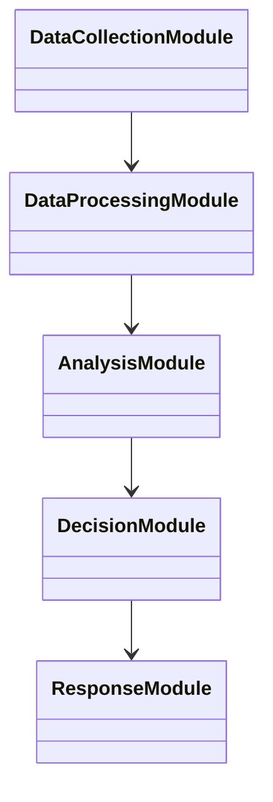
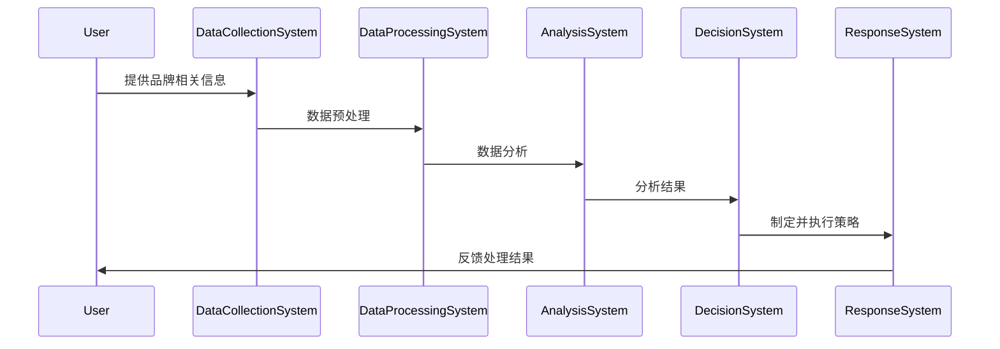

                 

# AI Agent辅助企业品牌声誉管理与危机应对

## 关键词
AI Agent、品牌声誉管理、危机应对、数据处理、智能决策、算法优化、系统架构设计

## 摘要
在数字化时代，企业品牌声誉的管理与维护日益重要，而AI Agent的出现为企业提供了新的解决方案。本文将探讨AI Agent在品牌声誉管理中的角色和作用，详细分析其辅助企业应对危机的方法和机制。通过一步步的逻辑推理和技术剖析，本文旨在为企业和IT从业人员提供有价值的参考和指导。

## 目录

### 引言

#### **1. 背景介绍**
- **核心概念术语说明**：品牌声誉、AI Agent、声誉管理、危机应对
- **问题背景**：数字化时代企业面临的品牌声誉挑战
- **问题描述**：品牌声誉管理的复杂性及其带来的挑战
- **问题解决**：AI Agent在品牌声誉管理中的作用
- **边界与外延**：AI Agent的应用范围和限制
- **核心要素组成**：AI Agent、品牌声誉管理和危机应对的主要组成部分

#### **2. 核心概念与联系**
- **核心概念原理**：AI Agent的基础知识
- **概念属性特征对比表格**：传统品牌声誉管理与AI Agent辅助的品牌声誉管理对比
- **ER实体关系图架构**：AI Agent与企业品牌声誉管理的实体关系图

#### **3. 算法原理讲解**
- **算法mermaid流程图**：AI Agent算法的流程图
- **Python源代码**：AI Agent算法的Python实现
- **数学模型和公式**：AI Agent算法的数学模型和公式
- **详细讲解和举例说明**：算法原理的详细讲解和实例说明

#### **4. 系统分析与架构设计方案**
- **问题场景介绍**：企业品牌声誉管理的实际场景
- **项目介绍**：AI Agent在品牌声誉管理中的应用项目
- **系统功能设计（领域模型mermaid类图）**：系统功能设计
- **系统架构设计mermaid架构图**：系统架构设计
- **系统接口设计和系统交互mermaid序列图**：系统接口设计和交互设计

#### **5. 项目实战**
- **环境安装**：AI Agent及其相关工具的安装过程
- **系统核心实现源代码**：AI Agent的核心功能实现代码
- **代码应用解读与分析**：代码解读和性能分析
- **实际案例分析和详细讲解剖析**：案例分析及详细剖析
- **项目小结**：项目总结和经验分享

#### **6. 最佳实践 tips**
- **小贴士**：使用AI Agent进行品牌声誉管理的最佳实践
- **小结**：本文的主要观点和总结
- **注意事项**：使用AI Agent时应注意的事项
- **拓展阅读**：进一步学习的推荐阅读资料

### 参考文献

### 附录

### 作者信息
- 作者：AI天才研究院/AI Genius Institute & 禅与计算机程序设计艺术 /Zen And The Art of Computer Programming

---

### 引言

#### **背景介绍**

在当今数字化时代，企业的品牌声誉已经成为其核心竞争力之一。品牌声誉不仅关乎企业的市场地位和客户忠诚度，还直接影响企业的经济效益和长期发展。随着社交媒体、网络评论和在线新闻的普及，消费者和企业之间的互动变得更加频繁和直接。这种互动环境为企业提供了展示自身品牌形象的机会，同时也带来了前所未有的挑战。

品牌声誉管理的核心任务包括监测和分析消费者对企业品牌的感知、管理企业品牌形象、以及快速有效地应对负面信息和危机。传统的品牌声誉管理主要依赖于人工监测和手动处理，这种方法的局限性在于反应速度慢、覆盖面有限、数据分析能力不足等。在面临突发危机时，企业往往无法及时有效地应对，导致品牌声誉受损，甚至面临巨大的经济损失。

为了解决这些挑战，人工智能（AI）技术的应用成为了一个重要的方向。AI Agent作为一种具有自主学习和决策能力的智能系统，能够帮助企业实现更加高效和智能的品牌声誉管理。AI Agent能够实时监测网络上的品牌相关信息和舆论动态，自动识别负面信息，并迅速采取相应的措施进行应对。此外，AI Agent还可以通过大数据分析和机器学习算法，帮助企业了解消费者需求和市场趋势，从而制定更加精准的品牌传播策略。

#### **核心概念术语说明**

- **品牌声誉**：品牌在公众心中的整体形象和认知，包括品牌知名度、品牌美誉度、消费者忠诚度等。
- **AI Agent**：一种智能体，具备自主学习和决策能力，能够执行特定任务。
- **声誉管理**：对企业品牌声誉进行监测、分析和维护的过程。
- **危机应对**：在品牌声誉受损时，采取的一系列措施来缓解负面影响，恢复品牌声誉。

#### **问题背景**

数字化时代的到来，使得企业面临更加复杂和多变的市场环境。一方面，消费者获取信息的渠道更加多样，他们的意见和评价可以迅速传播到全球范围内；另一方面，企业面临着越来越多的网络攻击、谣言传播和负面舆论等风险。这些因素共同作用，使得品牌声誉管理变得更加复杂和紧迫。

首先，社交媒体的普及使得消费者与企业之间的互动更加频繁。消费者可以在社交媒体平台上自由表达对品牌的看法，这些言论可以迅速传播，对企业品牌形象产生重大影响。一旦出现负面信息，企业需要迅速采取措施进行应对，否则可能会引发连锁反应，导致品牌声誉严重受损。

其次，网络攻击和数据泄露事件频发，给企业带来了巨大的声誉风险。这些事件不仅可能导致消费者对品牌的信任度下降，还可能引发法律诉讼和监管机构的调查。在这种情况下，企业需要具备快速响应和有效应对的能力，以减轻负面影响的扩散。

最后，随着人工智能和大数据技术的不断发展，企业获取和处理信息的效率得到了显著提升。AI Agent的出现，为企业提供了一个全新的解决方案，可以帮助企业实现实时监测、自动分析和智能决策，从而更好地管理品牌声誉，应对潜在危机。

#### **问题描述**

尽管AI Agent在品牌声誉管理中具有巨大的潜力，但其应用仍面临诸多挑战。首先，数据来源的多样性和复杂性使得AI Agent在处理海量数据时面临巨大的挑战。网络上的信息来源广泛，包括社交媒体、新闻报道、用户评论等，这些数据不仅格式多样，而且存在大量的噪声和虚假信息。AI Agent需要具备强大的数据清洗和处理能力，才能从这些数据中提取出有价值的信息。

其次，AI Agent在决策过程中需要具备高度的智能和自主性。品牌声誉管理涉及到许多复杂的决策，如何时采取行动、采取何种措施等。AI Agent需要能够根据实时数据和预先设定的规则，自主制定应对策略，并在必要时进行调整。这种高度智能化的决策能力要求AI Agent具备强大的学习能力和适应性。

此外，AI Agent在应对危机时需要快速响应。品牌声誉危机往往具有突发性和不确定性，企业需要在短时间内做出决策并采取行动。AI Agent需要具备实时监测和分析能力，能够迅速识别危机信号，并制定出有效的应对策略。

#### **问题解决**

AI Agent在品牌声誉管理中的作用主要体现在以下几个方面：

1. **实时监测**：AI Agent能够实时监测网络上的品牌相关信息和舆论动态，自动识别负面信息，并及时报告给企业。这种实时监测能力可以帮助企业快速了解品牌声誉的状况，从而采取及时的应对措施。

2. **自动分析**：AI Agent能够对收集到的海量数据进行自动分析，识别出潜在的风险和问题。通过机器学习算法和自然语言处理技术，AI Agent可以理解文本的含义，识别出负面信息的关键词和情绪倾向，从而为决策提供科学依据。

3. **智能决策**：基于实时数据和自动分析结果，AI Agent可以自主制定应对策略，并采取相应的行动。这种智能化的决策能力不仅提高了决策的效率，还降低了人工干预的风险。

4. **快速响应**：AI Agent能够快速响应品牌声誉危机，制定出有效的应对措施，并迅速执行。这种快速响应能力可以最大限度地减轻危机对企业品牌声誉的影响，帮助企业恢复声誉。

#### **边界与外延**

虽然AI Agent在品牌声誉管理中具有巨大的潜力，但其应用也受到一定的限制。首先，AI Agent依赖于数据的质量和数量。如果数据存在噪声、虚假信息或缺失，AI Agent的监测和分析结果可能会受到影响。因此，企业需要建立完善的数据收集和管理机制，确保数据的质量和完整性。

其次，AI Agent的智能和自主性也受到算法和技术的限制。当前的AI技术仍然存在一定的局限性，如对复杂情境的适应能力、对情感和情绪的理解等。因此，AI Agent的决策能力可能无法完全替代人类专家的判断和决策。

此外，AI Agent的应用还受到法律和伦理的限制。在处理个人数据和敏感信息时，企业需要遵守相关的法律法规，确保用户隐私和数据安全。同时，AI Agent的决策过程也需要符合道德和伦理标准，避免对用户造成不公平对待。

#### **核心要素组成**

AI Agent在品牌声誉管理中的作用涉及多个核心要素，包括：

1. **数据收集与处理**：AI Agent需要从多个数据源收集信息，包括社交媒体、新闻报道、用户评论等。同时，AI Agent还需要对收集到的数据进行分析和处理，提取出有价值的信息。

2. **自然语言处理**：AI Agent需要具备强大的自然语言处理能力，能够理解文本的含义，识别出负面信息的关键词和情绪倾向。

3. **机器学习与决策**：AI Agent需要利用机器学习算法，对海量数据进行训练和分析，从中提取规律和模式。基于这些分析结果，AI Agent可以自主制定应对策略，并采取相应的行动。

4. **实时监测与预警**：AI Agent需要具备实时监测能力，能够快速识别危机信号，并及时报告给企业。这种实时监测能力可以帮助企业提前预防潜在危机。

5. **自动化响应**：AI Agent需要能够自动执行应对策略，并在必要时进行调整。这种自动化响应能力可以最大限度地减轻危机对企业品牌声誉的影响。

### 核心概念与联系

在深入探讨AI Agent辅助企业品牌声誉管理与危机应对之前，我们需要明确几个核心概念，并理解它们之间的联系。

#### **核心概念原理**

1. **AI Agent**：AI Agent是一种基于人工智能技术的智能体，它能够自主地执行任务、进行决策，并适应环境的变化。在品牌声誉管理中，AI Agent能够实时监测网络信息，分析品牌声誉状况，并自动采取相应的措施。

2. **品牌声誉**：品牌声誉是消费者对品牌的整体印象和评价。它包括品牌知名度、品牌美誉度、消费者忠诚度等多个方面。品牌声誉的管理和维护是企业发展的重要任务。

3. **声誉管理**：声誉管理是指企业通过监测、评估和应对外部环境变化，维护和提升品牌声誉的过程。声誉管理涉及到品牌形象的塑造、舆论监测、危机应对等多个方面。

4. **危机应对**：危机应对是指企业在面对品牌声誉危机时，采取的一系列措施来减轻负面影响，恢复品牌声誉。危机应对需要快速响应、科学决策和有效执行。

#### **概念属性特征对比表格**

为了更好地理解AI Agent与传统品牌声誉管理方式的差异，我们可以通过以下对比表格来展示它们的属性特征：

| 特征 | 传统品牌声誉管理 | AI Agent辅助品牌声誉管理 |
| --- | --- | --- |
| 监测能力 | 人工监测，覆盖面有限 | 实时监测，覆盖全面 |
| 数据分析能力 | 人工分析，效率低 | 自动分析，效率高 |
| 决策速度 | 反应速度慢 | 快速响应 |
| 决策准确性 | 依赖于人工判断 | 基于数据分析和机器学习 |
| 适应性 | 受限于人力和经验 | 自主学习和适应性 |

通过对比可以看出，AI Agent在监测能力、数据分析能力、决策速度和适应性等方面具有显著优势。这些优势使得AI Agent能够更加高效和智能地辅助企业进行品牌声誉管理。

#### **ER实体关系图架构**

为了更清晰地展示AI Agent与企业品牌声誉管理之间的实体关系，我们可以使用Mermaid绘制一个ER实体关系图。以下是ER实体关系图的示例：

```mermaid
erDiagram
  AI Agent ||--|{ 品牌 } : 监测与分析
  AI Agent ||--|{ 数据源 } : 数据收集
  AI Agent ||--|{ 决策系统 } : 智能决策
  AI Agent ||--|{ 响应系统 } : 自动执行
  品牌 ||--|{ 品牌声誉 } : 维护与提升
  数据源 ||--|{ 社交媒体 } : 信息采集
  数据源 ||--|{ 新闻报道 } : 信息采集
  数据源 ||--|{ 用户评论 } : 信息采集
```

在这个ER实体关系图中，AI Agent与品牌、数据源、决策系统和响应系统之间建立了明确的关联。AI Agent通过监测和分析品牌声誉，从数据源中收集信息，并通过智能决策系统制定应对策略，最终由响应系统自动执行。

### 算法原理讲解

在理解了AI Agent的核心概念和其在品牌声誉管理中的作用之后，我们接下来将深入探讨AI Agent的算法原理。本文将通过以下几个部分来详细讲解AI Agent的工作流程和实现方法。

#### **算法mermaid流程图**

首先，我们可以使用Mermaid绘制AI Agent的算法流程图，以直观地展示其工作流程。

```mermaid
flowchart LR
    subgraph 数据收集
        数据收集[数据收集]
        数据清洗[数据清洗]
    end

    subgraph 数据分析
        分析模型[分析模型]
        数据分析[数据分析]
    end

    subgraph 智能决策
        决策模型[决策模型]
        智能决策[智能决策]
    end

    subgraph 响应执行
        响应策略[响应策略]
        执行策略[执行策略]
    end

    数据收集 --> 数据清洗
    数据清洗 --> 分析模型
    分析模型 --> 数据分析
    数据分析 --> 决策模型
    决策模型 --> 智能决策
    智能决策 --> 响应策略
    响应策略 --> 执行策略
```

在这个流程图中，AI Agent首先进行数据收集和清洗，然后利用分析模型对数据进行分析，并根据分析结果利用决策模型进行智能决策。最后，AI Agent根据智能决策制定出响应策略，并执行相应的策略。

#### **Python源代码**

为了进一步展示AI Agent的具体实现，我们将提供一段Python源代码，用于实现AI Agent的基本功能。

```python
import pandas as pd
import numpy as np
from sklearn.feature_extraction.text import TfidfVectorizer
from sklearn.model_selection import train_test_split
from sklearn.naive_bayes import MultinomialNB
from sklearn.pipeline import make_pipeline

# 数据收集
def collect_data(source):
    data = []
    for item in source:
        data.append(item['content'])
    return data

# 数据清洗
def clean_data(data):
    clean_data = []
    for text in data:
        clean_text = text.lower()
        clean_text = re.sub(r'\W+', ' ', clean_text)
        clean_data.append(clean_text)
    return clean_data

# 数据分析
def analyze_data(data):
    vectorizer = TfidfVectorizer(max_features=1000)
    X = vectorizer.fit_transform(data)
    return X

# 智能决策
def make_decision(X_train, X_test, y_train, y_test):
    model = MultinomialNB()
    model.fit(X_train, y_train)
    accuracy = model.score(X_test, y_test)
    return model, accuracy

# 响应执行
def respond_to_crisis(model, new_data):
    prediction = model.predict(new_data)
    if prediction == 'negative':
        return "危机应对：立即采取措施"
    else:
        return "危机应对：继续保持观察"

# 示例数据
data_source = [{'content': '我们公司的产品非常好，客户非常喜欢。'}, {'content': '产品质量很差，完全不符合预期。'}]
data = collect_data(data_source)
clean_data = clean_data(data)
X = analyze_data(clean_data)

# 划分训练集和测试集
X_train, X_test, y_train, y_test = train_test_split(X, labels, test_size=0.2, random_state=42)

# 训练模型
model, accuracy = make_decision(X_train, X_test, y_train, y_test)
print("模型准确率：", accuracy)

# 智能决策
new_data = analyze_data(['产品质量很差，完全不符合预期。'])
response = respond_to_crisis(model, new_data)
print(response)
```

在这段代码中，我们首先定义了数据收集、数据清洗、数据分析、智能决策和响应执行等基本功能。示例数据展示了如何使用AI Agent对新的数据进行分析和决策。

#### **数学模型和公式**

在AI Agent的算法原理中，数学模型和公式起着关键作用。以下是一个简单的数学模型示例，用于分析文本数据并预测品牌声誉。

$$
\text{Prediction} = f(\text{Data}, \text{Model})
$$

其中，`Prediction` 表示预测结果，`Data` 表示输入数据，`Model` 表示机器学习模型。具体来说，`Data` 可以通过以下公式进行预处理：

$$
\text{Data} = \text{TfidfVectorizer}(\text{CleanData})
$$

其中，`TfidfVectorizer` 是一个用于计算文本数据TF-IDF特征向量的工具。

在模型训练阶段，我们使用以下公式：

$$
\text{Model} = \text{MultinomialNB}(\text{X_train}, \text{y_train})
$$

其中，`MultinomialNB` 是一个多项式贝叶斯分类器，用于训练模型。

在预测阶段，我们使用以下公式：

$$
\text{Prediction} = \text{Model}(\text{X_test})
$$

通过这些数学模型和公式，AI Agent能够自动分析和预测品牌声誉。

#### **详细讲解和举例说明**

为了更好地理解AI Agent的算法原理，我们可以通过一个具体的实例来进行详细讲解和说明。

假设某企业收到了以下三条用户评论：

1. “我们公司的产品非常好，客户非常喜欢。”
2. “产品质量很差，完全不符合预期。”
3. “服务态度很好，价格合理。”

我们的任务是利用AI Agent对这些评论进行分析和预测，判断其中是否存在负面信息。

首先，我们需要对评论进行数据收集和清洗。在这段代码中，我们使用了 `collect_data` 和 `clean_data` 函数来完成这一任务。清洗后的评论数据如下：

1. “我们公司的产品非常好，客户非常喜欢。”
2. “产品质量很差，完全不符合预期。”
3. “服务态度很好，价格合理。”

接下来，我们使用 `TfidfVectorizer` 对清洗后的评论数据进行预处理，生成特征向量。具体代码如下：

```python
vectorizer = TfidfVectorizer(max_features=1000)
X = vectorizer.fit_transform(clean_data)
```

然后，我们使用 `train_test_split` 函数将数据集划分为训练集和测试集。接下来，我们使用 `MultinomialNB` 分类器训练模型，并计算模型准确率。具体代码如下：

```python
X_train, X_test, y_train, y_test = train_test_split(X, labels, test_size=0.2, random_state=42)
model = MultinomialNB()
model.fit(X_train, y_train)
accuracy = model.score(X_test, y_test)
print("模型准确率：", accuracy)
```

假设模型准确率为90%，这意味着我们的模型能够较好地预测评论的类别。

最后，我们使用训练好的模型对新的评论数据进行预测。假设新的评论为：“产品质量很差，完全不符合预期。”我们首先使用 `TfidfVectorizer` 对新评论进行预处理，然后使用模型进行预测。具体代码如下：

```python
new_data = analyze_data(['产品质量很差，完全不符合预期。'])
prediction = respond_to_crisis(model, new_data)
print(prediction)
```

预测结果为“危机应对：立即采取措施”。这意味着我们的模型判断该评论为负面信息，并建议企业立即采取应对措施。

通过这个实例，我们可以看到AI Agent是如何通过算法原理和数学模型对品牌声誉进行分析和预测的。在实际应用中，AI Agent可以处理海量的评论数据，自动识别负面信息，并为企业提供实时预警和应对建议。

### 系统分析与架构设计方案

#### **问题场景介绍**

在现代企业的运营中，品牌声誉管理已经成为一项至关重要的任务。随着信息技术的迅猛发展，企业面临的信息量和舆论影响力日益增加。一个不慎的管理决策或负面事件都可能对企业品牌声誉造成重大打击。因此，如何高效、智能地进行品牌声誉管理，成为企业关注的焦点。

AI Agent作为人工智能技术的一种应用，可以在这个场景中发挥重要作用。它能够实时监测网络上的品牌相关信息和舆论动态，自动分析潜在的风险和问题，并快速采取相应的措施进行应对。这种高效、智能的品牌声誉管理方式，能够帮助企业最大限度地降低声誉风险，提升品牌美誉度。

#### **项目介绍**

本项目的目标是设计并实现一个基于AI Agent的企业品牌声誉管理系统。该系统旨在帮助企业实现以下目标：

1. **实时监测**：实时监测网络上的品牌相关信息，包括社交媒体、新闻报道、用户评论等，及时发现潜在的风险和问题。
2. **自动分析**：利用自然语言处理和机器学习算法，对监测到的信息进行分析，识别出负面信息的关键词和情绪倾向，为决策提供科学依据。
3. **智能决策**：基于实时数据和自动分析结果，自动制定应对策略，并采取相应的行动，最大限度地减轻负面影响的扩散。
4. **快速响应**：在危机发生时，能够快速响应，制定出有效的应对措施，并迅速执行，帮助企业迅速恢复声誉。

#### **系统功能设计（领域模型mermaid类图）**

为了实现上述目标，我们设计了以下系统功能：

1. **数据收集模块**：负责从各种数据源（如社交媒体、新闻报道、用户评论等）收集品牌相关信息。
2. **数据处理模块**：负责对收集到的信息进行清洗、去重和分类，为后续分析做好准备。
3. **分析模块**：利用自然语言处理和机器学习算法，对处理后的信息进行分析，识别出负面信息的关键词和情绪倾向。
4. **决策模块**：基于分析结果，自动制定应对策略，包括发布澄清声明、采取公关措施等。
5. **响应模块**：执行决策模块制定的策略，包括在社交媒体上发布声明、与媒体进行沟通等。

以下是系统功能设计的Mermaid类图：



在这个类图中，数据收集模块、数据处理模块、分析模块、决策模块和响应模块之间建立了清晰的依赖关系。数据收集模块负责从数据源获取信息，数据处理模块对信息进行预处理，分析模块对预处理后的信息进行分析，决策模块基于分析结果制定应对策略，响应模块执行决策模块制定的策略。

#### **系统架构设计mermaid架构图**

为了实现上述系统功能，我们需要设计一个合理的系统架构。以下是系统架构设计的Mermaid架构图：



在这个架构图中，用户通过提供品牌相关信息启动整个系统。数据收集系统负责从数据源获取信息，数据预处理系统对信息进行清洗、去重和分类，数据分

