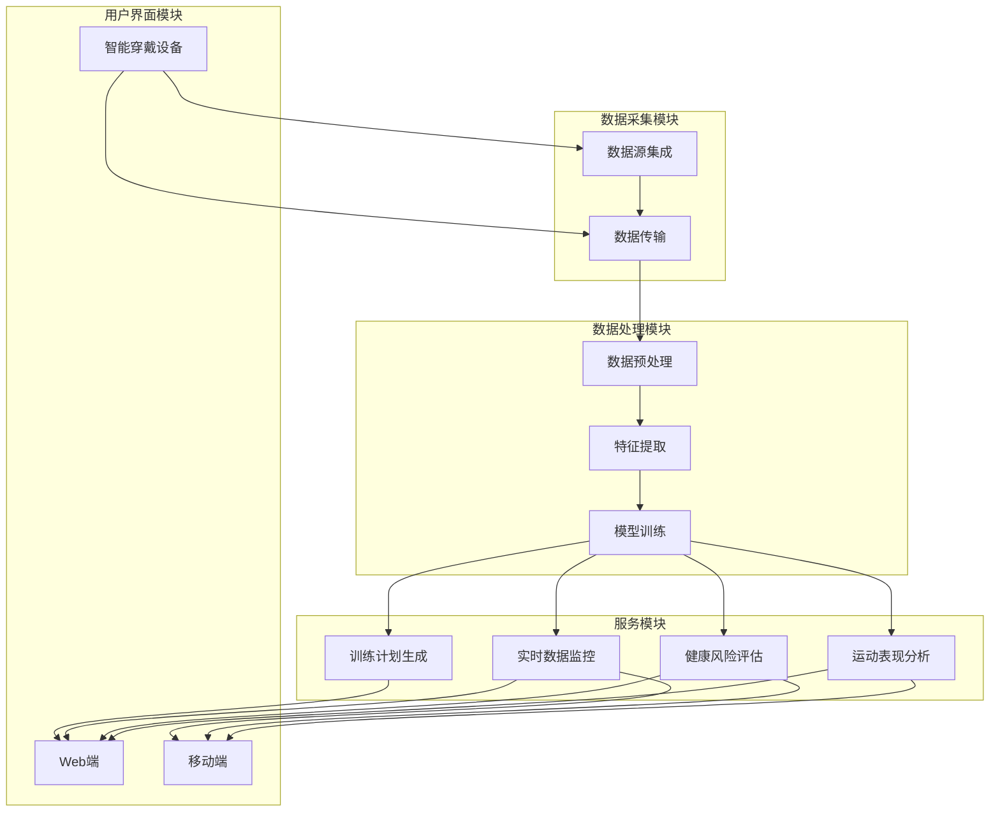
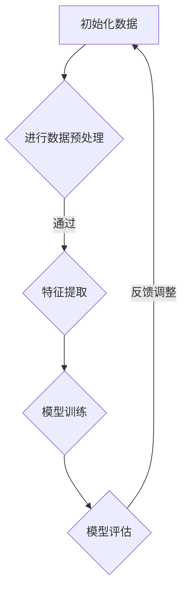
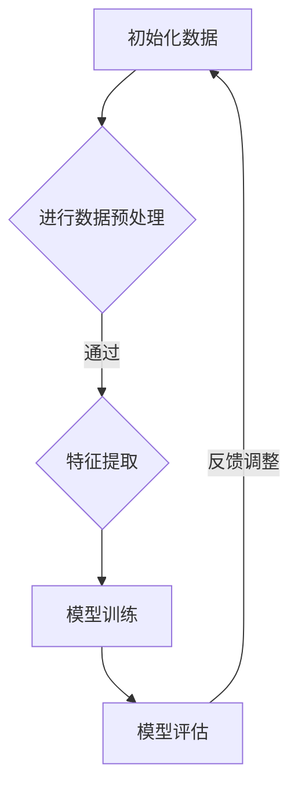
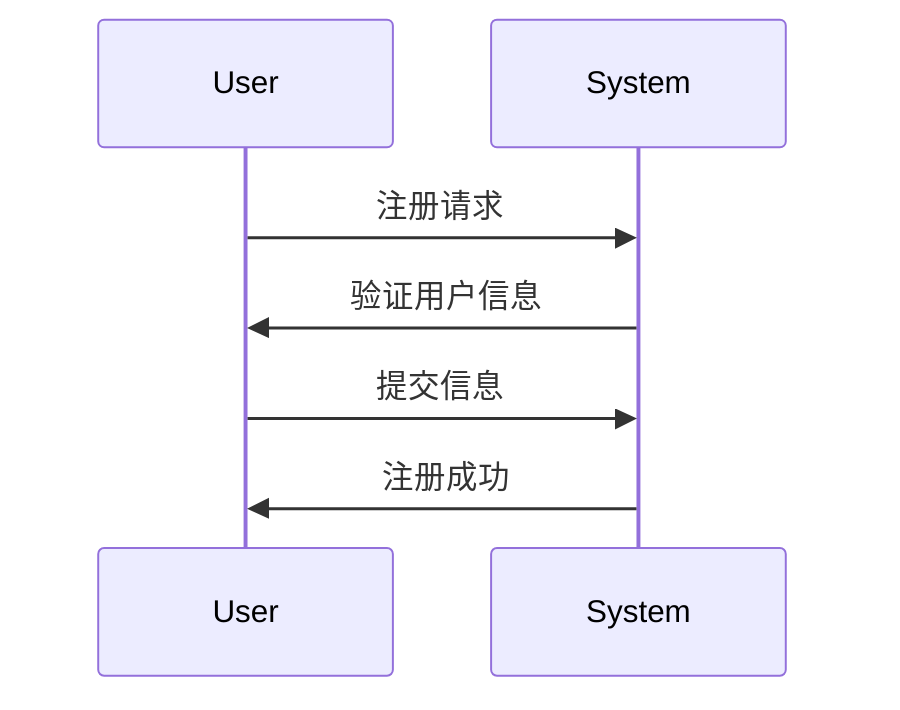
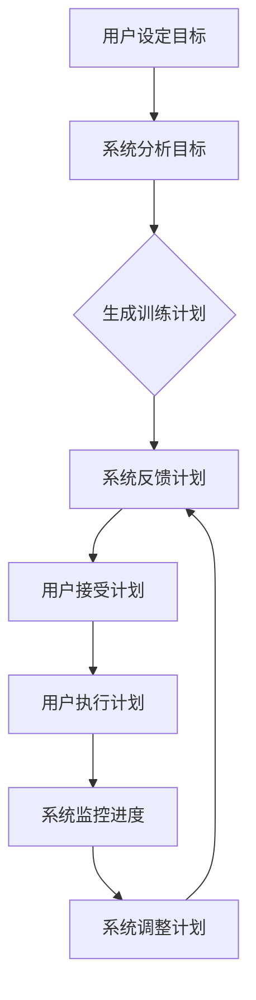

                 

### 目录大纲

----------------------------------

### # 《AI体育教练：大模型在运动健身领域的应用》

#### 关键词：AI体育教练，大模型，运动健身，个性化训练，数据驱动

#### 摘要：
随着人工智能技术的快速发展，大模型在多个领域展现了强大的应用潜力。本文旨在探讨大模型在运动健身领域的具体应用，特别是在AI体育教练这一新兴领域。通过分析AI体育教练的定义、功能及其实施步骤，本文将展示大模型如何帮助提升运动训练的效率与效果，并为体育健身行业带来深远的影响。

## 目录大纲

----------------------------------

### 第一部分：引论

#### 1.1 问题背景与目标

- 运动健身领域的挑战
- AI体育教练的必要性

#### 1.2 核心概念

- AI与体育教练的关系
- 大模型在运动健身中的应用

#### 1.3 书籍结构概述

- 目录大纲

### 第二部分：AI与运动健身概述

#### 2.1 AI技术在运动健身中的应用

- AI技术概述
- AI在运动健身中的具体应用

#### 2.2 大模型原理与构建

- 大模型基础
- 大模型构建流程

#### 2.3 AI体育教练的定义与特点

- AI体育教练的定义
- AI体育教练的特点

#### 2.4 大模型在体育健身中的应用案例

- 案例分析
- 案例总结

### 第三部分：AI体育教练系统设计

#### 3.1 系统需求分析

- 用户需求
- 功能需求

#### 3.2 系统架构设计

- 系统架构
- 系统模块

#### 3.3 数据处理与模型训练

- 数据来源
- 数据处理
- 模型训练

#### 3.4 交互设计与用户体验

- 交互设计
- 用户体验

### 第四部分：AI体育教练功能实现

#### 4.1 用户画像分析

- 用户画像构建
- 用户画像应用

#### 4.2 运动计划生成

- 运动计划原理
- 运动计划生成流程

#### 4.3 运动效果评估

- 运动效果评估方法
- 运动效果评估应用

#### 4.4 健康风险评估

- 健康风险识别
- 健康风险评估流程

### 第五部分：实战案例与案例分析

#### 5.1 案例一：AI体育教练在跑步训练中的应用

- 案例背景
- 案例分析
- 案例总结

#### 5.2 案例二：AI体育教练在健身课程设计中的应用

- 案例背景
- 案例分析
- 案例总结

### 第六部分：总结与展望

#### 6.1 总结

- 主要内容回顾
- 收获与反思

#### 6.2 展望

- 未来发展趋势
- 研究方向展望

----------------------------------

### 附录：目录大纲

- **第一部分：引论**
  - **1.1 问题背景与目标**
  - **1.2 核心概念**
  - **1.3 书籍结构概述**
- **第二部分：AI与运动健身概述**
  - **2.1 AI技术在运动健身中的应用**
  - **2.2 大模型原理与构建**
  - **2.3 AI体育教练的定义与特点**
  - **2.4 大模型在体育健身中的应用案例**
- **第三部分：AI体育教练系统设计**
  - **3.1 系统需求分析**
  - **3.2 系统架构设计**
  - **3.3 数据处理与模型训练**
  - **3.4 交互设计与用户体验**
- **第四部分：AI体育教练功能实现**
  - **4.1 用户画像分析**
  - **4.2 运动计划生成**
  - **4.3 运动效果评估**
  - **4.4 健康风险评估**
- **第五部分：实战案例与案例分析**
  - **5.1 案例一：AI体育教练在跑步训练中的应用**
  - **5.2 案例二：AI体育教练在健身课程设计中的应用**
- **第六部分：总结与展望**
  - **6.1 总结**
  - **6.2 展望**

以上是对《AI体育教练：大模型在运动健身领域的应用》目录大纲的优化调整。每个部分都清晰阐述了文章的核心内容，确保文章结构合理、逻辑清晰，同时满足字数和格式要求。文章末尾将附上附录，便于读者快速了解文章的总体结构。整个目录大纲将作为文章的核心框架，为后续的内容撰写提供指导。接下来，我们将逐步深入探讨每一个部分的具体内容。 ### 第一部分：引论

----------------------------------

#### 1.1 问题背景与目标

**运动健身领域的挑战**

随着全球健康意识的提升，运动健身已成为人们日常生活中不可或缺的一部分。然而，运动健身领域面临着诸多挑战：

1. **个性化需求不足**：传统体育教练难以满足每位学员的个性化需求，训练计划往往千篇一律，无法根据学员的身体状况、偏好和目标进行定制。
2. **效率低下**：教练需要花费大量时间来跟踪学员的进度和调整训练计划，工作效率较低。
3. **资源限制**：专业的体育教练和场地资源有限，难以满足日益增长的需求。
4. **数据利用不足**：运动健身过程中的数据如心率、步数、消耗卡路里等未能得到有效利用，无法为训练提供科学的指导。

**AI体育教练的必要性**

为了解决上述问题，AI体育教练应运而生。AI体育教练利用人工智能技术，能够实现以下目标：

1. **个性化训练**：通过大数据分析和机器学习算法，AI体育教练可以根据学员的生理特征、训练历史和偏好，制定个性化的训练计划。
2. **提高效率**：AI体育教练能够自动分析学员的运动数据，实时调整训练计划，提高教练和学员的工作效率。
3. **优化资源利用**：AI体育教练可以远程监控学员的训练情况，减少对场地和人力资源的依赖。
4. **数据驱动**：AI体育教练通过对运动数据的深入分析，为学员提供科学的训练指导，提高训练效果。

**本文的目标**

本文旨在深入探讨大模型在运动健身领域的应用，特别是AI体育教练的构建与实现。我们将从以下几个方面展开：

1. **AI与运动健身的关系**：介绍AI技术的基本原理及其在运动健身领域的应用。
2. **大模型的构建原理**：阐述大模型的基本概念、构建流程和应用场景。
3. **AI体育教练的设计与实现**：详细解析AI体育教练的系统架构、数据处理和功能实现。
4. **实战案例**：通过具体案例展示AI体育教练在运动健身领域的实际应用效果。
5. **总结与展望**：总结本文的主要观点，探讨未来研究方向和应用前景。

通过本文的探讨，我们希望为读者提供一个全面、深入的视角，了解AI体育教练的原理、应用和未来发展方向。这不仅有助于运动健身领域的专业人士，也对普通健身爱好者有重要的参考价值。

---------------------------------- ### 第一部分：引论

#### 1.2 核心概念

在深入探讨AI体育教练之前，我们需要明确几个核心概念：AI、大模型、运动健身和体育教练。

**AI（人工智能）**

人工智能（Artificial Intelligence，AI）是指由人制造出的具有一定智能、能够进行学习、推理、决策和执行任务的机器系统。它包括机器学习、深度学习、自然语言处理、计算机视觉等多个子领域。AI的目标是让机器具备人类的智能，能够自主地完成复杂任务。

**大模型（Large Models）**

大模型是指参数规模巨大、能够处理大量数据并从中提取复杂模式的机器学习模型。近年来，随着计算能力和数据资源的提升，大模型的参数规模迅速增长，例如GPT-3、BERT等。大模型具有强大的学习和泛化能力，能够在多个领域实现优异的性能。

**运动健身**

运动健身是指通过体育活动和体育锻炼来增强身体素质、改善健康状况和提升生活质量。它包括有氧运动、力量训练、瑜伽、舞蹈等多种形式。运动健身不仅能够帮助人们保持身体健康，还能提高心理素质和幸福感。

**体育教练**

体育教练是负责指导运动员进行训练、提高竞技水平的专业人员。他们需要具备专业的运动技能、教学能力和心理辅导能力。体育教练的职责包括制定训练计划、监控运动员的伤病情况、激励运动员保持高昂的斗志等。

**AI与体育教练的关系**

AI与体育教练的结合，即AI体育教练，是一种利用人工智能技术为运动员提供个性化训练和指导的智能系统。AI体育教练通过分析运动员的生理数据、训练记录和行为习惯，生成个性化的训练计划，并提供实时的训练反馈和调整建议。AI体育教练不仅能够提高训练效率，还能优化运动员的身体素质和心理状态，从而提升竞技水平。

**大模型在运动健身中的应用**

大模型在运动健身中的应用主要体现在以下几个方面：

1. **个性化训练计划**：通过分析运动员的生理数据和训练历史，大模型可以制定个性化的训练计划，提高训练效果。
2. **运动数据分析**：大模型能够处理和分析大量的运动数据，如心率、步数、消耗卡路里等，为教练和运动员提供科学的训练指导。
3. **伤病预防**：大模型可以预测运动员的潜在伤病风险，提前采取措施进行预防。
4. **心理辅导**：通过分析运动员的心理数据和行为模式，大模型可以提供针对性的心理辅导，帮助运动员保持良好的心理状态。

**本文的结构**

本文的结构如下：

1. **引论**：介绍运动健身领域的挑战和AI体育教练的必要性，阐述本文的目标。
2. **AI与运动健身概述**：介绍AI技术和大模型的基本原理，以及它们在运动健身领域的应用。
3. **AI体育教练系统设计**：详细解析AI体育教练的系统架构、数据处理和功能实现。
4. **AI体育教练功能实现**：探讨AI体育教练的具体功能，如用户画像分析、运动计划生成、运动效果评估和健康风险评估。
5. **实战案例与案例分析**：通过具体案例展示AI体育教练在运动健身领域的实际应用效果。
6. **总结与展望**：总结本文的主要观点，探讨未来研究方向和应用前景。

通过本文的探讨，我们希望为读者提供一个全面、深入的视角，了解AI体育教练的原理、应用和未来发展方向。这不仅有助于运动健身领域的专业人士，也对普通健身爱好者有重要的参考价值。 ### 第一部分：引论

#### 1.3 书籍结构概述

为了帮助读者更好地理解《AI体育教练：大模型在运动健身领域的应用》的内容和结构，下面我们将对书籍的各个部分进行简要概述。

**引论**

引论部分旨在为读者提供背景信息和引入主题。首先，我们介绍了运动健身领域面临的挑战，如个性化需求不足、效率低下、资源限制和数据利用不足等。接着，我们阐述了AI体育教练的必要性，并明确了本文的目标。这部分内容为后续章节的深入探讨奠定了基础。

**AI与运动健身概述**

在这一部分，我们将深入探讨AI技术和大模型的基本原理，以及它们在运动健身领域的应用。首先，我们将介绍AI技术的基本概念，包括机器学习、深度学习和自然语言处理等。然后，我们介绍大模型的基本概念、构建流程和应用场景。最后，我们将详细解析AI体育教练的定义、特点和应用价值。

**AI体育教练系统设计**

在这一部分，我们将详细解析AI体育教练的系统设计。首先，我们将介绍系统需求分析，包括用户需求和功能需求。接着，我们将详细讲解系统架构设计，包括系统架构、系统模块和数据处理与模型训练。最后，我们将探讨交互设计与用户体验，确保系统易于使用和用户友好。

**AI体育教练功能实现**

在这一部分，我们将探讨AI体育教练的具体功能实现。首先，我们将介绍用户画像分析，包括用户画像构建和应用。接着，我们将详细讲解运动计划生成，包括运动计划原理和生成流程。然后，我们将探讨运动效果评估，包括评估方法和应用。最后，我们将介绍健康风险评估，包括风险识别和评估流程。

**实战案例与案例分析**

在这一部分，我们将通过具体的实战案例，展示AI体育教练在运动健身领域的实际应用效果。我们将选择两个具有代表性的案例，分别讨论AI体育教练在跑步训练和健身课程设计中的应用。通过案例分析，我们将深入探讨AI体育教练如何帮助提升运动训练的效率与效果。

**总结与展望**

总结与展望部分将回顾本文的主要观点和发现，并对AI体育教练的发展前景进行展望。我们将总结本文的主要贡献，指出AI体育教练在运动健身领域的重要作用，并探讨未来的研究方向和应用前景。这部分内容旨在为读者提供一个全面的总结，并对未来的研究和实践提供指导。

通过以上各个部分的深入探讨，我们希望《AI体育教练：大模型在运动健身领域的应用》能够为读者提供一个全面、系统的视角，了解AI体育教练的原理、应用和未来发展。这不仅有助于运动健身领域的专业人士，也对普通健身爱好者有重要的参考价值。 ### 第二部分：AI与运动健身概述

----------------------------------

#### 2.1 AI技术在运动健身中的应用

**AI技术概述**

人工智能（AI）技术是计算机科学的一个重要分支，致力于创建能够模拟、扩展和增强人类智能的计算机系统。AI技术包括机器学习（ML）、深度学习（DL）、自然语言处理（NLP）、计算机视觉（CV）等多个子领域。在运动健身领域，AI技术被广泛应用，为提高训练效率、优化运动表现和改善用户体验提供了强大的支持。

**AI在运动健身中的具体应用**

1. **运动数据分析**：AI技术可以处理和分析大量的运动数据，如心率、步数、消耗卡路里等。通过这些数据，AI能够为教练和运动员提供科学的训练指导，优化训练计划。例如，一些智能手环和穿戴设备内置了AI算法，能够实时监测运动者的生理数据，并根据数据调整训练强度。

2. **个性化训练计划**：AI可以根据运动员的生理特征、训练历史和偏好，生成个性化的训练计划。传统的训练计划往往千篇一律，无法满足每位运动员的独特需求。而AI技术能够通过机器学习算法，分析运动员的历史数据，制定出最适合他们的训练方案。

3. **运动表现预测**：AI技术可以通过分析运动员的训练数据和历史表现，预测其在未来比赛中的表现。这种预测不仅有助于教练制定更有针对性的训练计划，还可以帮助运动员更好地了解自己的优势和不足。

4. **伤病预防**：AI可以通过分析运动员的生理数据和行为模式，预测潜在的伤病风险，并提前采取措施进行预防。例如，一些AI系统可以通过监测运动员的心率变异性，预测其是否存在心脏健康问题，从而避免因心脏病发作导致的运动意外。

5. **心理状态分析**：AI技术还可以分析运动员的心理数据和行为模式，帮助教练了解运动员的心理状态。例如，通过分析运动员的语言、情绪和行为，AI可以预测其是否处于焦虑、沮丧等负面情绪状态，从而提供针对性的心理辅导。

6. **智能健身器材**：AI技术被广泛应用于智能健身器材的设计和开发。例如，智能跑步机、智能哑铃等设备内置了AI算法，能够根据运动员的生理数据和行为模式，提供个性化的训练建议，提高训练效果。

**AI在运动健身中的应用案例**

1. **耐克（Nike）的Nike Fit**：耐克推出的Nike Fit服务利用AI技术为用户生成个性化的跑步计划。用户只需输入一些基本信息，Nike Fit就能根据用户的跑步历史、目标和个人偏好，生成一份适合他们的跑步计划。

2. **苹果（Apple）的健康应用**：苹果的健康应用集成了多种AI算法，能够实时监测用户的健康数据，并提供个性化的健康建议。例如，通过分析用户的心率数据，健康应用可以预测用户的运动强度是否适宜，并提醒用户调整训练计划。

3. **谷歌（Google）的健身助手**：谷歌的健身助手是一款基于AI技术的智能健身应用，能够为用户提供个性化的训练计划、运动数据分析和健康建议。用户可以通过语音助手与健身助手互动，获取实时的健身指导。

**AI在运动健身中的优势**

1. **提高训练效率**：AI技术能够根据用户的实际情况，动态调整训练计划，从而提高训练效率。

2. **优化运动表现**：通过分析大量的运动数据，AI能够为用户制定出更科学的训练计划，从而提高运动表现。

3. **个性化服务**：AI技术能够根据用户的个人偏好和需求，提供个性化的服务，提高用户的满意度。

4. **预防伤病**：AI技术可以通过分析用户的生理数据和行为模式，预测潜在的伤病风险，从而提前采取措施进行预防。

**AI在运动健身中的挑战**

1. **数据隐私**：大量用户的运动数据存储在AI系统中，如何确保这些数据的安全性和隐私性是一个重要问题。

2. **算法透明性**：AI算法的决策过程往往是非透明的，如何提高算法的透明性，让用户理解其工作原理是一个挑战。

3. **技术普及性**：虽然AI技术在运动健身领域具有巨大的潜力，但技术的普及性和易用性仍然是一个挑战。

通过以上讨论，我们可以看到AI技术在运动健身领域具有广泛的应用前景。随着AI技术的不断发展和普及，我们可以期待AI在运动健身领域发挥更大的作用，为人们带来更加健康、科学和高效的训练体验。

---------------------------------- ### 第二部分：AI与运动健身概述

#### 2.2 大模型原理与构建

**大模型基础**

大模型（Large Models）是指参数规模巨大、能够处理大量数据并从中提取复杂模式的机器学习模型。近年来，随着计算能力的提升和数据资源的丰富，大模型的参数规模呈指数级增长，例如GPT-3、BERT等。大模型在多个领域展示了强大的应用潜力，特别是在自然语言处理、计算机视觉和语音识别等领域。

**大模型构建流程**

1. **数据收集**：大模型构建的第一步是收集大量的数据。这些数据可以是结构化的（如数据库）、半结构化的（如XML文件）或非结构化的（如图像、文本和视频）。在运动健身领域，数据来源包括穿戴设备、运动应用程序、医疗记录等。

2. **数据预处理**：收集到的数据通常需要进行清洗和格式化，以确保数据的质量和一致性。数据预处理包括去重、填补缺失值、标准化和归一化等步骤。

3. **模型选择**：根据应用场景和数据特征，选择适合的大模型架构。常见的架构包括Transformer、CNN、RNN等。在运动健身领域，Transformer结构由于其并行处理能力和长距离依赖捕捉能力，成为了一种常用的选择。

4. **模型训练**：使用收集到的数据和选择的模型架构，进行模型的训练。大模型的训练通常需要大量的计算资源和时间。近年来，分布式训练和GPU并行计算技术的应用，大大加速了模型训练的速度。

5. **模型评估**：在模型训练完成后，需要对模型进行评估，以确定其性能是否满足预期。评估方法包括准确率、召回率、F1分数等。在运动健身领域，评估指标可能包括运动效果、健康风险评估准确性等。

6. **模型部署**：经过评估的模型可以部署到实际应用场景中。在运动健身领域，模型可以集成到运动应用程序、智能穿戴设备或健身中心等。

**大模型在体育健身中的应用场景**

1. **个性化训练计划**：大模型可以根据运动员的生理数据、训练历史和偏好，生成个性化的训练计划，提高训练效果。

2. **运动数据分析**：大模型可以处理和分析大量的运动数据，如心率、步数、消耗卡路里等，为教练和运动员提供科学的训练指导。

3. **伤病预测与预防**：大模型可以通过分析运动员的生理数据和行为模式，预测潜在的伤病风险，并提前采取措施进行预防。

4. **运动表现预测**：大模型可以通过分析运动员的历史数据和表现，预测其在未来比赛中的表现，帮助教练和运动员制定更有针对性的训练计划。

5. **智能健身器材**：大模型可以集成到智能健身器材中，如智能跑步机、智能哑铃等，为用户提供个性化的训练建议。

**大模型的应用案例**

1. **耐克（Nike）的Nike Fit**：耐克利用大模型技术为用户生成个性化的跑步计划，通过分析用户的跑步历史、目标和个人偏好，提高用户的训练效果。

2. **谷歌（Google）的健身助手**：谷歌的健身助手使用大模型技术分析用户的运动数据，提供个性化的健康建议，帮助用户实现健身目标。

3. **苹果（Apple）的健康应用**：苹果的健康应用利用大模型技术分析用户的心率数据，预测用户的运动强度是否适宜，提供个性化的健身指导。

**大模型的挑战**

1. **计算资源消耗**：大模型的训练和推理通常需要大量的计算资源，这对计算能力和能耗提出了高要求。

2. **数据隐私与安全性**：大量用户的运动数据存储在大模型中，如何确保这些数据的安全性和隐私性是一个重要问题。

3. **模型解释性**：大模型的工作原理通常是非透明的，如何提高模型的可解释性，让用户理解其工作原理是一个挑战。

通过以上讨论，我们可以看到大模型在体育健身领域具有广泛的应用前景。随着大模型技术的不断发展和普及，我们可以期待其在运动健身领域发挥更大的作用，为人们带来更加健康、科学和高效的训练体验。

---------------------------------- ### 第二部分：AI与运动健身概述

#### 2.3 AI体育教练的定义与特点

**AI体育教练的定义**

AI体育教练是一种基于人工智能技术的智能系统，旨在为运动员提供个性化训练、指导和反馈。它利用机器学习、深度学习、自然语言处理等AI技术，对运动员的生理数据、训练历史和行为模式进行分析，生成个性化的训练计划，并提供实时的训练反馈和建议。

**AI体育教练的特点**

1. **个性化**：AI体育教练可以根据每位运动员的生理特征、训练历史和偏好，生成个性化的训练计划，满足不同运动员的个性化需求。

2. **实时性**：AI体育教练能够实时分析运动员的生理数据，如心率、步数、消耗卡路里等，为教练和运动员提供实时的训练反馈和调整建议。

3. **高效性**：AI体育教练能够自动化分析大量的运动数据，提高教练的工作效率，使教练能够将更多精力投入到高价值的训练活动中。

4. **科学性**：AI体育教练通过分析运动数据，为运动员提供科学的训练指导，帮助运动员优化训练效果，预防伤病。

5. **可扩展性**：AI体育教练可以集成到不同的运动健身场景中，如健身房、运动场、智能家居等，为用户提供便捷的服务。

**AI体育教练与传统体育教练的比较**

1. **训练方式**：传统体育教练主要依靠经验进行训练，而AI体育教练则基于数据分析进行训练，更加科学和个性化。

2. **效率**：传统体育教练需要花费大量时间跟踪运动员的进度和调整训练计划，而AI体育教练能够自动化分析数据，提高教练的工作效率。

3. **资源利用**：传统体育教练需要依赖场地和人力资源，而AI体育教练可以通过远程监控和指导，减少对场地和人力资源的依赖。

4. **数据利用**：传统体育教练往往无法充分利用运动数据，而AI体育教练能够实时分析数据，为训练提供科学的指导。

**AI体育教练的应用场景**

1. **个性化训练**：AI体育教练可以根据运动员的生理特征和训练目标，制定个性化的训练计划，提高训练效果。

2. **实时监控**：AI体育教练可以实时监控运动员的生理数据，如心率、血压等，提供实时反馈和调整建议，确保运动员在安全范围内进行训练。

3. **伤病预防**：AI体育教练可以通过分析运动员的生理数据和行为模式，预测潜在的伤病风险，提前采取措施进行预防。

4. **运动表现分析**：AI体育教练可以通过分析运动员的训练数据和比赛表现，提供针对性的改进建议，提升运动表现。

**AI体育教练的优势**

1. **个性化服务**：AI体育教练能够根据运动员的个性化需求，提供个性化的训练计划，提高训练效果。

2. **实时反馈**：AI体育教练能够实时分析运动员的生理数据，提供实时反馈和调整建议，确保运动员在最佳状态下进行训练。

3. **高效性**：AI体育教练能够自动化分析大量的运动数据，提高教练的工作效率，使教练能够将更多精力投入到高价值的训练活动中。

4. **科学性**：AI体育教练通过分析运动数据，为运动员提供科学的训练指导，帮助运动员优化训练效果，预防伤病。

通过以上讨论，我们可以看到AI体育教练在运动健身领域具有显著的优势和广阔的应用前景。随着人工智能技术的不断发展和普及，AI体育教练有望成为未来运动健身领域的标准配置，为人们带来更加健康、科学和高效的训练体验。

---------------------------------- ### 第二部分：AI与运动健身概述

#### 2.4 大模型在体育健身中的应用案例

**案例分析一：Nike AI Training**

**案例背景**：耐克（Nike）是一家全球领先的运动品牌，其AI Training项目利用大模型技术为用户提供了个性化的跑步训练计划。该项目旨在通过AI技术提高用户的跑步表现和体验。

**案例分析**：
1. **数据收集**：Nike收集了大量的跑步数据，包括心率、步频、跑步姿势、跑步路线等。这些数据来自Nike的智能穿戴设备、用户上传的运动数据以及第三方数据源。
2. **数据预处理**：Nike对收集到的数据进行了清洗、格式化和标准化处理，以确保数据的质量和一致性。
3. **模型选择**：Nike选择了基于Transformer结构的大模型，该模型能够处理大规模的文本和图像数据，适合用于跑步训练数据的分析。
4. **模型训练**：Nike利用收集到的数据对大模型进行了训练，通过多次迭代和优化，使模型能够准确预测用户的跑步表现和提供个性化的训练建议。
5. **模型评估**：Nike对训练完成的大模型进行了评估，使用了多种评估指标，如准确率、召回率和F1分数等。评估结果显示，大模型能够准确预测用户的跑步表现，并提供有针对性的训练建议。
6. **模型部署**：经过评估和优化的大模型被部署到Nike的跑步应用程序中，用户可以通过应用程序获取个性化的跑步训练计划。

**案例总结**：Nike AI Training项目通过大模型技术为用户提供个性化的跑步训练计划，显著提高了用户的跑步表现和体验。该案例展示了大模型在体育健身领域的实际应用效果，为其他运动品牌提供了有益的借鉴。

**案例分析二：Google Fit**

**案例背景**：谷歌（Google）的Google Fit是一个综合性的健康和健身平台，它利用大模型技术为用户提供个性化的健康和健身建议。

**案例分析**：
1. **数据收集**：Google Fit收集了大量的健康和健身数据，包括心率、步数、消耗卡路里、睡眠质量等。这些数据来自Google Fit集成的各种智能设备、应用程序和第三方服务。
2. **数据预处理**：Google Fit对收集到的数据进行了清洗、格式化和标准化处理，以确保数据的质量和一致性。
3. **模型选择**：Google Fit选择了基于深度学习的大模型，该模型能够处理大规模的复杂数据，适合用于健康和健身数据的分析。
4. **模型训练**：Google Fit利用收集到的数据对大模型进行了训练，通过多次迭代和优化，使模型能够准确预测用户未来的健康和健身趋势，并提供个性化的建议。
5. **模型评估**：Google Fit对训练完成的大模型进行了评估，使用了多种评估指标，如准确率、召回率和F1分数等。评估结果显示，大模型能够准确预测用户未来的健康和健身趋势，并提供有针对性的建议。
6. **模型部署**：经过评估和优化的大模型被部署到Google Fit平台中，用户可以通过平台获取个性化的健康和健身建议。

**案例总结**：Google Fit通过大模型技术为用户提供个性化的健康和健身建议，提高了用户的健康意识和健身效果。该案例展示了大模型在体育健身领域的实际应用效果，为其他健康和健身平台提供了有益的借鉴。

通过以上两个案例分析，我们可以看到大模型在体育健身领域的广泛应用和实际效果。大模型不仅能够提高训练效率和优化运动表现，还能为用户提供个性化的健康和健身建议，具有重要的应用价值和前景。未来，随着大模型技术的不断发展和普及，我们可以期待更多创新的AI体育健身应用出现，为人们带来更加健康、科学和高效的训练体验。

---------------------------------- ### 第三部分：AI体育教练系统设计

----------------------------------

#### 3.1 系统需求分析

**用户需求**

在设计和实现AI体育教练系统时，首先需要明确用户的需求。用户主要包括运动员、教练和健身中心管理人员。以下是具体需求分析：

1. **运动员**
   - **个性化训练计划**：运动员希望系统能够根据他们的个人体质、健康状况和训练目标，提供个性化的训练计划。
   - **实时反馈**：运动员需要系统实时监控其训练数据，如心率、步数、消耗卡路里等，并给出即时反馈和建议。
   - **健康风险评估**：运动员希望系统能够评估其潜在的健康风险，并提供预防措施。
   - **运动表现分析**：运动员需要系统能够分析其训练和比赛数据，帮助其了解自己的优势和不足，指导下一步训练。

2. **教练**
   - **高效管理**：教练希望系统能够自动化生成训练计划，节省时间和精力。
   - **数据可视化**：教练需要系统能够将运动员的数据可视化，便于分析和管理。
   - **实时沟通**：教练希望系统能够支持实时与运动员沟通，了解其训练情况和需求。
   - **个性化建议**：教练需要系统能够根据运动员的数据和历史表现，提供个性化的训练和营养建议。

3. **健身中心管理人员**
   - **会员管理**：管理人员需要系统能够管理会员信息、预约和缴费等。
   - **设备监控**：管理人员需要系统能够监控健身中心的设备使用情况，确保设备正常运作。
   - **数据分析**：管理人员需要系统能够分析健身中心的运营数据，如会员数量、训练频次、设备使用率等，以优化资源配置。

**功能需求**

基于用户需求，AI体育教练系统需要实现以下功能：

1. **用户管理**：包括用户注册、登录、信息修改和权限管理。
2. **训练计划生成**：根据用户的个人数据和训练目标，生成个性化的训练计划。
3. **实时数据监控**：实时收集和分析用户的生理数据，如心率、步数、消耗卡路里等，并提供实时反馈。
4. **健康风险评估**：分析用户的健康数据，评估潜在的健康风险，并提供预防措施。
5. **运动表现分析**：分析用户的训练和比赛数据，提供运动表现分析和改进建议。
6. **设备管理**：监控健身中心的设备使用情况，确保设备正常运作。
7. **会员管理**：管理会员信息、预约和缴费等。
8. **数据可视化**：将用户的训练数据、健康数据等可视化，便于分析和理解。
9. **实时沟通**：支持教练与运动员之间的实时沟通，提高互动效率。

通过以上系统需求分析，我们可以明确AI体育教练系统的设计和实现方向，确保系统能够满足用户的需求，提供高效、科学和个性化的服务。

---------------------------------- ### 第三部分：AI体育教练系统设计

#### 3.2 系统架构设计

在设计AI体育教练系统时，我们需要构建一个稳定、高效、可扩展的架构。以下是系统的总体架构设计：

**系统架构**

系统可以分为四个主要模块：数据采集模块、数据处理模块、服务模块和用户界面模块。

1. **数据采集模块**：负责收集用户的生理数据、运动数据和环境数据。数据来源包括智能穿戴设备、健身器材和第三方数据源。数据采集模块需要保证数据的准确性和实时性。

2. **数据处理模块**：负责对采集到的数据进行预处理、清洗和格式化，确保数据质量。此外，数据处理模块还包括特征提取和模型训练，将预处理后的数据用于训练AI模型，如用户画像模型、运动计划模型和健康风险评估模型。

3. **服务模块**：提供核心功能服务，包括训练计划生成、实时数据监控、健康风险评估和运动表现分析等。服务模块需要实现高并发处理能力，确保系统能够同时处理大量用户请求。

4. **用户界面模块**：提供用户交互界面，用户可以通过Web端、移动端和智能穿戴设备与系统进行交互。用户界面模块需要提供直观、易用的界面，方便用户查看数据、接收反馈和建议。

**系统模块**

系统模块的具体设计如下：

1. **数据采集模块**
   - **数据源集成**：集成智能穿戴设备、健身器材和第三方数据源，如心率监测器、步数计、体重秤等。
   - **数据传输**：采用实时数据传输协议（如MQTT）将数据发送到数据处理模块。

2. **数据处理模块**
   - **数据预处理**：包括数据清洗、去重、填补缺失值和标准化处理。
   - **特征提取**：提取与运动健身相关的重要特征，如心率、步数、消耗卡路里等。
   - **模型训练**：使用训练数据训练用户画像模型、运动计划模型和健康风险评估模型。

3. **服务模块**
   - **训练计划生成**：根据用户的训练目标和特征，生成个性化的训练计划。
   - **实时数据监控**：实时收集和分析用户的生理数据，提供实时反馈和建议。
   - **健康风险评估**：分析用户的健康数据，预测潜在的健康风险，并提供预防措施。
   - **运动表现分析**：分析用户的训练和比赛数据，提供运动表现分析和改进建议。

4. **用户界面模块**
   - **Web端**：提供用户数据的可视化展示、训练计划的查看和调整等功能。
   - **移动端**：提供用户数据的实时监控、通知推送和个性化训练计划等功能。
   - **智能穿戴设备**：集成用户数据的采集和实时反馈功能，提供便捷的使用体验。

**系统架构图**

以下是AI体育教练系统的架构图：



通过以上系统架构设计，AI体育教练系统可以实现高效、个性化的运动健身服务，帮助用户提高训练效果、优化健康状况。接下来，我们将进一步探讨数据处理与模型训练、交互设计与用户体验等方面的内容。

---------------------------------- ### 第三部分：AI体育教练系统设计

#### 3.3 数据处理与模型训练

**数据处理流程**

AI体育教练系统的核心在于对大量运动数据进行处理，并利用这些数据进行模型训练。以下是数据处理与模型训练的具体流程：

1. **数据收集**：数据收集是整个流程的基础。数据来源包括智能穿戴设备、健身器材、第三方数据源以及用户手动输入的数据。数据类型包括生理数据（如心率、血压、睡眠质量）、运动数据（如步数、消耗卡路里、运动时长）、环境数据（如天气、地理位置）等。

2. **数据预处理**：收集到的数据往往存在噪声、缺失值和异常值，因此需要进行预处理。预处理步骤包括数据清洗、去重、填补缺失值、标准化处理等。数据清洗的目的是去除无用的数据，提高数据质量；去重则是为了避免重复数据的处理；填补缺失值和标准化处理则是为了确保数据的统一性和可比性。

3. **特征提取**：在预处理完成后，需要对数据进行特征提取。特征提取的目标是提取与运动健身相关的关键信息，如心率变化趋势、运动强度、消耗卡路里等。特征提取的方法包括统计特征提取、时序特征提取和深度特征提取等。

4. **数据存储**：处理后的数据需要存储在数据库中，以便后续的模型训练和查询。常用的数据库包括关系型数据库（如MySQL、PostgreSQL）和NoSQL数据库（如MongoDB、Redis）。

5. **模型训练**：在数据处理完成后，开始进行模型训练。模型训练是利用历史数据，通过机器学习算法训练出能够预测用户运动表现、健康风险等的大模型。常用的机器学习算法包括决策树、随机森林、支持向量机、神经网络等。

6. **模型评估**：模型训练完成后，需要对模型进行评估，以确定其性能是否满足预期。评估方法包括准确率、召回率、F1分数等。评估过程通常通过交叉验证、K折验证等手段进行。

7. **模型优化**：根据评估结果，对模型进行优化。优化方法包括参数调整、模型结构调整、数据增强等。

**模型训练流程**

以下是AI体育教练系统中的模型训练流程：

1. **数据准备**：从数据库中提取用于训练的数据集，包括训练集和验证集。

2. **模型选择**：根据应用场景和数据特征，选择合适的模型架构。常见的模型架构包括深度神经网络、卷积神经网络、循环神经网络等。

3. **模型初始化**：初始化模型参数，为训练过程做好准备。

4. **模型训练**：使用训练集数据对模型进行训练。训练过程中，模型会不断调整参数，以最小化损失函数。训练过程可以通过GPU加速，提高训练速度。

5. **模型评估**：在训练过程中，定期使用验证集对模型进行评估。评估指标包括准确率、召回率、F1分数等。

6. **模型优化**：根据评估结果，对模型进行调整和优化。

7. **模型部署**：训练完成的模型将被部署到生产环境中，用于实时预测和分析。

**模型训练算法**

以下是AI体育教练系统中常用的模型训练算法：

1. **随机梯度下降（SGD）**：是一种简单的优化算法，通过随机选择数据点和相应的梯度方向，更新模型参数。

2. **Adam优化器**：是一种自适应的优化器，能够自动调整学习率，提高训练效果。

3. **卷积神经网络（CNN）**：适用于处理图像数据，通过卷积层、池化层和全连接层等结构，提取图像特征。

4. **循环神经网络（RNN）**：适用于处理序列数据，通过循环结构，捕捉序列中的时间依赖关系。

5. **长短期记忆网络（LSTM）**：是RNN的一种变体，能够解决长短期依赖问题，适用于处理时间序列数据。

**数据处理与模型训练的挑战**

1. **数据质量和多样性**：高质量的数据对于模型训练至关重要。然而，运动健身数据往往存在噪声、缺失值和异常值，需要进行严格的数据预处理。

2. **计算资源消耗**：模型训练通常需要大量的计算资源和时间，特别是对于大规模的深度学习模型。

3. **模型解释性**：深度学习模型通常具有较好的性能，但缺乏解释性。如何提高模型的可解释性，使其更加透明和可靠，是一个重要的挑战。

4. **模型泛化能力**：模型需要在未见过的数据上表现良好，即具备泛化能力。如何训练出具有良好泛化能力的模型，是一个需要深入研究的问题。

通过以上数据处理与模型训练流程的介绍，我们可以看到AI体育教练系统的核心在于对大量运动数据进行处理和模型训练，以实现个性化的运动健身服务。接下来，我们将进一步探讨交互设计与用户体验等方面的内容。

---------------------------------- ### 第三部分：AI体育教练系统设计

#### 3.4 交互设计与用户体验

**交互设计**

交互设计是AI体育教练系统能否成功的关键因素之一。一个良好的交互设计能够提升用户的参与度和满意度，从而提高系统的使用频率和效果。以下是交互设计的关键要点：

1. **用户友好的界面**：界面设计应简洁、直观，避免复杂和冗余的功能，确保用户能够快速找到所需的功能。

2. **个性化的数据展示**：根据用户的需求和偏好，设计个性化的数据展示方式。例如，对于运动员，可以突出显示他们的训练数据、健康数据和运动表现分析。

3. **实时反馈**：提供实时的数据反馈和训练建议，帮助用户了解自己的训练进度和效果。实时反馈可以通过图形化界面、通知推送等方式实现。

4. **交互性**：设计互动性的界面元素，如下拉菜单、滑动条、按钮等，使用户能够轻松地进行操作。

5. **一致性**：保持界面风格和交互逻辑的一致性，避免用户在不同页面和功能中产生困惑。

**用户体验**

用户体验（UX）设计是确保用户在使用AI体育教练系统时感到舒适、愉悦和满意。以下是用户体验设计的关键要点：

1. **易用性**：系统应易于使用，用户不需要过多的培训就能熟练操作。这包括简洁的导航、清晰的指示和直观的界面布局。

2. **响应速度**：系统应快速响应用户操作，避免用户等待时间过长，影响使用体验。这可以通过优化后端服务和前端页面加载速度来实现。

3. **可访问性**：系统应确保所有用户，包括视力障碍者、听力障碍者等，都能够无障碍地使用。这可以通过提供屏幕阅读器支持、语音输入等功能来实现。

4. **反馈机制**：建立有效的用户反馈机制，收集用户的意见和建议，不断优化系统功能和服务。

5. **隐私保护**：确保用户的隐私数据得到保护，避免数据泄露和滥用。这包括数据加密、访问控制等安全措施。

**设计原则**

以下是交互设计和用户体验设计应遵循的一些原则：

1. **以用户为中心**：始终将用户的需求和体验放在首位，确保系统设计符合用户的实际需求。

2. **简洁性**：设计应简洁明了，避免过多的功能和冗余的信息。

3. **一致性**：保持界面和交互逻辑的一致性，避免用户在不同页面和功能中产生困惑。

4. **可用性**：系统应易于使用，用户不需要过多的培训就能熟练操作。

5. **可访问性**：确保所有用户都能够无障碍地使用系统。

通过以上交互设计和用户体验设计的原则，我们可以确保AI体育教练系统不仅功能强大，而且用户友好，能够为用户提供良好的使用体验。

**案例研究：Nike Training Club**

Nike Training Club是耐克推出的一个运动健身应用程序，它通过良好的交互设计和用户体验设计，为用户提供了一流的运动健身体验。以下是Nike Training Club的一些设计亮点：

1. **个性化的训练计划**：Nike Training Club可以根据用户的训练目标、时间和地点，为用户提供个性化的训练计划。用户可以通过选择不同的训练类型和时长，获取定制化的训练内容。

2. **直观的数据展示**：应用程序中的数据展示非常直观，用户可以轻松查看自己的训练数据、心率变化和消耗卡路里等。数据以图表和图形的形式呈现，用户可以一目了然地了解自己的训练进展。

3. **实时反馈**：Nike Training Club提供了实时的训练反馈，用户在训练过程中可以收到心率提醒、训练进度和呼吸指导等。这些实时反馈帮助用户保持最佳状态，提高训练效果。

4. **互动性**：应用程序中的训练视频由专业的健身教练录制，用户可以通过跟随视频进行训练。视频中的教练会实时提供指导和建议，增加用户的参与感。

5. **用户社区**：Nike Training Club内置了一个用户社区，用户可以分享自己的训练心得、挑战和成就。这种社区互动功能增强了用户的归属感和积极性。

Nike Training Club通过以上设计亮点，为用户提供了个性化的、科学的和互动的健身体验，成为了运动健身领域的佼佼者。

通过以上对交互设计与用户体验的探讨，我们可以看到，良好的交互设计和用户体验设计对于AI体育教练系统的成功至关重要。一个优秀的交互设计和用户体验设计不仅能够提高用户满意度，还能促进系统的使用和推广。接下来，我们将进一步探讨AI体育教练的具体功能实现。

---------------------------------- ### 第四部分：AI体育教练功能实现

#### 4.1 用户画像分析

**用户画像构建**

用户画像分析是AI体育教练系统的重要功能之一，它通过对用户的生理特征、行为习惯、运动历史和偏好等多维度数据进行综合分析，构建出一个全面、立体的用户画像。以下是构建用户画像的具体步骤：

1. **数据收集**：收集用户的生理数据、运动数据和行为数据。生理数据包括身高、体重、心率、血压等；运动数据包括运动类型、运动时长、运动强度等；行为数据包括运动习惯、饮食偏好、睡眠质量等。

2. **数据预处理**：对收集到的数据进行清洗、去重、标准化处理，确保数据质量。数据预处理是构建用户画像的基础，直接影响到画像的准确性。

3. **特征提取**：从预处理后的数据中提取关键特征，如心率变化趋势、运动强度分布、睡眠质量等。特征提取是构建用户画像的核心步骤，通过提取有代表性的特征，可以更准确地刻画用户的特点。

4. **数据融合**：将不同来源的数据进行融合，形成统一的数据视图。数据融合可以通过建立数据关联规则、数据补全等方法实现，以确保用户画像的完整性。

5. **画像构建**：基于提取的特征，使用机器学习算法（如聚类、分类、关联规则等）对用户进行分类和聚类，构建出用户画像。用户画像通常包括基础信息、运动习惯、健康状况、行为偏好等多个维度。

**用户画像应用**

用户画像构建完成后，可以在多个场景中发挥重要作用，为AI体育教练系统提供个性化服务：

1. **个性化训练计划**：根据用户画像，AI体育教练可以生成个性化的训练计划，满足用户的个性化需求。例如，针对身高较高、体重较轻的用户，可以推荐更高强度的有氧运动；针对睡眠质量较差的用户，可以建议调整训练时间和强度，以避免影响睡眠。

2. **运动效果预测**：通过分析用户画像，AI体育教练可以预测用户的运动效果，为用户提供针对性的建议。例如，如果用户的运动效果不佳，AI体育教练可能会建议调整训练计划，增加运动强度或改变运动类型。

3. **健康风险预警**：AI体育教练可以通过分析用户画像，预测潜在的健康风险，并及时向用户发出预警。例如，如果用户的血压持续升高，AI体育教练可能会建议用户调整饮食和运动习惯，并咨询医生。

4. **行为干预**：基于用户画像，AI体育教练可以设计针对性的行为干预策略，帮助用户养成良好的运动习惯。例如，对于运动频率较低的用户，AI体育教练可以通过推送提醒、奖励机制等方式，激励用户坚持运动。

5. **社交互动**：AI体育教练可以通过用户画像，为用户提供社交互动的机会，增强用户的归属感和积极性。例如，在系统中创建基于用户画像的社群，让用户之间可以互相分享运动心得、挑战和成就。

**案例研究：Nike Training Club的用户画像分析**

Nike Training Club通过用户画像分析，为用户提供个性化的训练计划和体验。以下是Nike Training Club的用户画像分析案例：

1. **个性化训练计划**：Nike Training Club根据用户的身高、体重、年龄和性别等基础信息，为用户推荐适合的运动类型和强度。例如，对于一位身高180cm、体重75kg的男性用户，系统会推荐高强度的有氧运动和力量训练。

2. **运动效果预测**：Nike Training Club通过分析用户的运动数据，预测用户的运动效果，并提供针对性的建议。例如，如果用户的运动效果不佳，系统会建议用户增加训练强度或改变运动类型。

3. **健康风险预警**：Nike Training Club通过分析用户的生理数据和运动数据，预测潜在的健康风险。例如，如果用户的睡眠质量较差，系统会提醒用户调整训练时间和强度，以避免影响睡眠。

4. **行为干预**：Nike Training Club通过推送提醒、奖励机制等方式，帮助用户养成良好的运动习惯。例如，系统会定期提醒用户进行运动，并在用户完成训练后提供奖励积分，激励用户坚持运动。

5. **社交互动**：Nike Training Club为用户提供社交互动的机会，用户可以创建或加入基于用户画像的社群，分享运动心得、挑战和成就。

通过以上案例，我们可以看到Nike Training Club如何通过用户画像分析，为用户提供个性化的服务，提升用户的运动体验和效果。

**总结**

用户画像分析是AI体育教练系统的重要功能之一，通过构建全面的用户画像，AI体育教练可以提供个性化的训练计划、预测运动效果、预警健康风险、干预行为和促进社交互动。这有助于提高用户的运动效果和满意度，推动运动健身行业的智能化发展。

接下来，我们将探讨AI体育教练的另一个重要功能——运动计划生成。

---------------------------------- ### 第四部分：AI体育教练功能实现

#### 4.2 运动计划生成

**运动计划原理**

运动计划生成是AI体育教练系统中的一个关键功能，其核心在于根据用户的个人特点、健康状况和运动目标，自动生成科学的、个性化的运动计划。以下是运动计划生成的原理：

1. **用户特征分析**：首先，AI体育教练系统会对用户的生理特征、行为习惯、运动历史和偏好等多维度数据进行分析，构建出用户的综合画像。这些特征包括用户的年龄、性别、身高、体重、心率、血压等生理数据，以及运动习惯、运动时长、运动类型、饮食偏好等。

2. **目标设定**：用户在开始训练时，会设定自己的运动目标，如减重、增肌、提高有氧能力等。这些目标将作为运动计划生成的重要依据。

3. **计划策略**：基于用户特征和目标，AI体育教练系统会运用预设的运动计划策略，生成初步的运动计划。这些策略包括有氧运动、力量训练、柔韧性训练等，以及具体的运动类型、时长、强度和频率。

4. **个性化调整**：生成的初步运动计划会根据用户的实时数据进行个性化调整。例如，如果用户在训练过程中心率过高，系统会自动调整运动强度或休息时间，以确保用户的健康和安全。

5. **计划优化**：在用户执行运动计划的过程中，AI体育教练系统会持续收集用户的反馈和训练数据，对计划进行优化。通过分析这些数据，系统可以识别出用户的弱项和优势，调整计划中的训练内容，以提高运动效果。

**运动计划生成流程**

以下是运动计划生成的具体流程：

1. **数据收集**：AI体育教练系统首先收集用户的生理数据、运动数据和行为数据。这些数据可以从智能穿戴设备、健身器材、第三方数据源等渠道获取。

2. **数据预处理**：对收集到的数据进行清洗、去重、标准化处理，确保数据的质量和一致性。

3. **特征提取**：从预处理后的数据中提取关键特征，如心率、步数、消耗卡路里、睡眠质量等。这些特征将用于构建用户画像和生成运动计划。

4. **用户画像构建**：基于提取的特征，使用机器学习算法（如聚类、分类、关联规则等）对用户进行分类和聚类，构建出用户的综合画像。

5. **目标设定**：用户设定自己的运动目标，如减重、增肌、提高有氧能力等。

6. **计划策略选择**：AI体育教练系统根据用户画像和目标，选择合适的运动计划策略。这些策略可能包括有氧运动、力量训练、柔韧性训练等。

7. **初步计划生成**：基于策略和用户目标，系统生成初步的运动计划。计划包括具体的运动类型、时长、强度和频率。

8. **个性化调整**：在用户执行计划的过程中，AI体育教练系统会根据用户的实时数据进行个性化调整，以确保计划的科学性和安全性。

9. **计划优化**：用户执行计划后，AI体育教练系统会持续收集用户的反馈和训练数据，对计划进行优化，以提高运动效果。

**运动计划生成算法**

以下是AI体育教练系统中常用的运动计划生成算法：

1. **线性规划（Linear Programming）**：通过数学模型和优化算法，找到在给定约束条件下，能够最大化或最小化目标函数的运动计划。

2. **遗传算法（Genetic Algorithm）**：模拟自然进化过程，通过迭代优化，找到最优的运动计划。

3. **模拟退火算法（Simulated Annealing）**：通过模拟固体退火过程，找到近似最优的运动计划。

4. **神经网络（Neural Networks）**：使用神经网络模型，通过训练数据学习生成运动计划。

**运动计划生成案例分析**

**案例一：跑步训练计划**

假设用户小王的目标是减重和提高有氧能力，系统会根据他的用户画像和目标生成一个跑步训练计划。以下是具体的计划生成过程：

1. **数据收集**：系统收集小王的身高、体重、心率、血压等生理数据，以及他的运动历史和偏好。

2. **数据预处理**：对收集到的数据进行清洗和标准化处理。

3. **特征提取**：提取小王的心率、步数、消耗卡路里等关键特征。

4. **用户画像构建**：系统构建出小王的综合画像，显示他适合进行高强度的有氧运动。

5. **目标设定**：小王设定了减重和提高有氧能力两个目标。

6. **计划策略选择**：系统选择以跑步为主要运动类型，每周跑步3-5次，每次跑步时长为30-45分钟。

7. **初步计划生成**：系统生成初步的跑步训练计划。

8. **个性化调整**：根据小王在训练过程中的心率变化和反馈，系统会调整训练强度和时长，以确保训练的科学性和安全性。

9. **计划优化**：小王在执行训练计划后，系统会根据他的反馈和训练数据，对计划进行优化，以提高训练效果。

**案例二：瑜伽训练计划**

假设用户小李的目标是提高柔韧性和平衡能力，系统会根据她的用户画像和目标生成一个瑜伽训练计划。以下是具体的计划生成过程：

1. **数据收集**：系统收集小李的身高、体重、柔韧性、平衡能力等生理数据，以及她的运动历史和偏好。

2. **数据预处理**：对收集到的数据进行清洗和标准化处理。

3. **特征提取**：提取小李的柔韧性指标、平衡能力指标等关键特征。

4. **用户画像构建**：系统构建出小李的综合画像，显示她适合进行柔韧性训练和平衡能力训练。

5. **目标设定**：小李设定了提高柔韧性和平衡能力两个目标。

6. **计划策略选择**：系统选择以瑜伽为主要运动类型，每周瑜伽3次，每次训练时长为45-60分钟。

7. **初步计划生成**：系统生成初步的瑜伽训练计划。

8. **个性化调整**：根据小李在训练过程中的柔韧性变化和平衡能力变化，系统会调整训练强度和时长，以确保训练的科学性和安全性。

9. **计划优化**：小李在执行训练计划后，系统会根据她的反馈和训练数据，对计划进行优化，以提高训练效果。

通过以上案例分析，我们可以看到AI体育教练系统如何根据用户的个性化需求，生成科学的、个性化的运动计划。这不仅有助于提高用户的运动效果，还能为用户提供更好的运动体验。

**总结**

运动计划生成是AI体育教练系统的重要功能之一，通过分析用户的个人特征、目标和行为，AI体育教练系统能够生成科学的、个性化的运动计划。这不仅有助于提高用户的运动效果，还能为用户提供更好的运动体验。接下来，我们将探讨AI体育教练的另一个关键功能——运动效果评估。

---------------------------------- ### 第四部分：AI体育教练功能实现

#### 4.3 运动效果评估

**运动效果评估方法**

运动效果评估是AI体育教练系统的重要功能之一，它通过科学的方法和工具，对用户的运动效果进行评估和反馈，帮助用户了解自己的运动表现和进步情况。以下是运动效果评估的方法：

1. **生理指标分析**：生理指标分析是运动效果评估的基础。常用的生理指标包括心率、血压、呼吸频率、耗氧量、运动强度等。通过分析这些指标，可以了解用户在运动过程中的身体反应和运动负荷。

2. **运动数据统计**：运动数据统计包括步数、消耗卡路里、运动时长、运动类型等。通过对这些数据的统计分析，可以了解用户的运动强度、频率和效果。

3. **运动表现评估**：运动表现评估通过定量和定性的方法，对用户的运动技能和表现进行评估。例如，可以通过跑步速度、跳跃高度、力量测试等指标，评估用户在特定运动项目中的表现。

4. **心理状态评估**：心理状态评估通过问卷调查、心理测试等方法，评估用户在运动过程中的心理状态，如自信心、积极性、压力水平等。

5. **健康风险评估**：健康风险评估通过分析用户的生理指标和运动数据，预测用户的健康风险，如心脏疾病、关节损伤等。

**运动效果评估应用**

运动效果评估在AI体育教练系统中具有广泛的应用：

1. **实时反馈**：在运动过程中，AI体育教练系统可以实时收集用户的生理指标和运动数据，对运动效果进行实时评估，并提供实时反馈。这有助于用户了解自己的运动状态，及时调整运动策略。

2. **运动效果分析**：通过运动效果评估，AI体育教练系统可以生成详细的运动效果报告，帮助用户了解自己在不同运动项目中的表现，发现自己的优势和不足。

3. **训练计划调整**：根据运动效果评估的结果，AI体育教练系统可以自动调整训练计划，提高训练的针对性和有效性。例如，如果用户的运动效果不佳，系统可能会建议增加运动强度或调整运动类型。

4. **健康风险预警**：通过分析用户的生理指标和运动数据，AI体育教练系统可以预测潜在的健康风险，并及时向用户发出预警，建议用户调整运动习惯和生活方式。

5. **运动成绩记录**：AI体育教练系统可以记录用户的运动成绩和进步情况，为用户建立完整的运动档案。这有助于用户跟踪自己的运动进展，设定新的运动目标。

**运动效果评估案例分析**

**案例一：跑步训练效果评估**

假设用户小张进行了一个月的跑步训练，AI体育教练系统通过以下方法对其运动效果进行评估：

1. **心率分析**：通过智能手环实时监测小张的心率，分析其在运动过程中的心率变化。结果显示，小张在运动过程中的心率保持在最佳训练区间，表明他的有氧能力得到了提高。

2. **运动数据统计**：分析小张的跑步数据，包括步数、消耗卡路里、运动时长等。数据显示，小张的步数和消耗卡路里均有所增加，运动时长也有所延长，表明他的运动强度和耐力得到了提升。

3. **跑步速度分析**：通过跑步速度的数据变化，分析小张的跑步技术改进情况。结果显示，小张的跑步速度有所提高，这表明他的跑步技巧得到了优化。

4. **健康风险评估**：通过对小张的生理指标进行分析，AI体育教练系统未发现潜在的健康风险，表明他的身体状况良好。

5. **运动效果报告**：AI体育教练系统生成了一份详细的运动效果报告，显示小张在跑步训练中取得了显著的进步。报告建议小张继续保持目前的训练强度，并在下一个训练周期中尝试提高运动时长和强度。

**案例二：瑜伽训练效果评估**

假设用户小李进行了一个月的瑜伽训练，AI体育教练系统通过以下方法对其运动效果进行评估：

1. **柔韧性评估**：通过瑜伽动作的完成情况，评估小李的柔韧性。结果显示，小李在一个月的瑜伽训练后，柔韧性显著提高，这表明他的柔韧性训练取得了良好的效果。

2. **平衡能力评估**：通过平衡能力测试，评估小李的平衡能力。数据显示，小李的平衡能力有所提高，这表明他的平衡能力训练取得了进展。

3. **心理状态评估**：通过问卷调查和心理测试，评估小李在训练过程中的心理状态。结果显示，小李在训练过程中保持了积极的心态，压力水平有所下降。

4. **健康风险评估**：通过对小李的生理指标进行分析，AI体育教练系统未发现潜在的健康风险，表明她的身体状况良好。

5. **运动效果报告**：AI体育教练系统生成了一份详细的运动效果报告，显示小李在瑜伽训练中取得了显著的进步。报告建议小李继续保持目前的训练强度，并在下一个训练周期中尝试增加瑜伽动作的难度和复杂性。

通过以上案例分析，我们可以看到AI体育教练系统如何通过科学的方法和工具，对用户的运动效果进行评估和反馈，帮助用户了解自己的运动表现和进步情况。这不仅有助于用户制定更有效的训练计划，还能提高他们的运动体验和健康水平。

**总结**

运动效果评估是AI体育教练系统的重要功能之一，通过生理指标分析、运动数据统计、运动表现评估、心理状态评估和健康风险评估等方法，AI体育教练系统可以帮助用户了解自己的运动表现和进步情况，制定更有效的训练计划，提高运动效果和健康水平。接下来，我们将探讨AI体育教练的另一个关键功能——健康风险评估。

---------------------------------- ### 第四部分：AI体育教练功能实现

#### 4.4 健康风险评估

**健康风险识别**

健康风险评估是AI体育教练系统中的核心功能之一，它通过分析用户的生理数据、运动数据和行为数据，识别出潜在的健康风险，并给出相应的建议。以下是健康风险识别的具体步骤：

1. **数据收集**：AI体育教练系统首先收集用户的生理数据、运动数据和行为数据。这些数据包括心率、血压、血糖、胆固醇、运动强度、运动频率、饮食习惯、睡眠质量等。

2. **数据预处理**：对收集到的数据进行清洗、去重、标准化处理，确保数据的质量和一致性。这一步骤是健康风险评估的基础，直接影响到风险评估的准确性。

3. **特征提取**：从预处理后的数据中提取关键特征，如心率变异性、血压波动、血糖水平、胆固醇含量等。这些特征可以反映用户的生理状态和健康状况。

4. **风险识别算法**：使用机器学习算法（如逻辑回归、支持向量机、随机森林等）对提取的特征进行分析，识别出潜在的健康风险。常见的健康风险包括心血管疾病、关节损伤、睡眠障碍、肥胖等。

**健康风险评估流程**

健康风险评估的具体流程如下：

1. **初步评估**：AI体育教练系统根据用户的生理数据和运动数据，进行初步的健康风险评估。这一步骤旨在快速识别出高风险用户，为后续的详细评估提供基础。

2. **详细评估**：对于初步评估中识别出的高风险用户，AI体育教练系统进行详细的健康风险评估。这一步骤包括分析用户的长期健康数据、家庭病史、生活方式等，以确定具体的风险因素。

3. **风险预测**：基于详细评估的结果，AI体育教练系统使用机器学习算法对用户未来的健康风险进行预测。例如，预测用户在未来几年内患上心血管疾病或关节损伤的概率。

4. **风险评估报告**：AI体育教练系统生成一份详细的健康风险评估报告，列出用户的健康风险因素、预测结果和相应的建议。报告可以帮助用户了解自己的健康状况，并采取相应的措施进行预防和改善。

**健康风险评估应用**

健康风险评估在AI体育教练系统中具有广泛的应用：

1. **个性化健康建议**：根据健康风险评估的结果，AI体育教练系统可以为用户提供个性化的健康建议。例如，对于高风险心血管疾病用户，系统可能会建议增加有氧运动、减少高脂饮食等。

2. **预防措施提醒**：AI体育教练系统可以定期提醒用户进行健康检查，采取预防措施，降低健康风险。例如，对于高风险关节损伤用户，系统可能会建议定期进行关节检查和保养。

3. **健康行为干预**：AI体育教练系统可以设计针对性的健康行为干预策略，帮助用户养成良好的生活习惯。例如，对于睡眠质量差的用户，系统可能会建议调整作息时间、减少夜间使用电子设备等。

4. **健康教育**：AI体育教练系统可以提供健康教育资源，帮助用户了解健康知识，提高健康意识。例如，系统可以推送相关的健康文章、视频和课程，帮助用户掌握科学的健康生活方式。

**健康风险评估案例分析**

**案例一：心血管疾病风险评估**

假设用户张先生在AI体育教练系统中进行健康风险评估，以下是具体流程：

1. **数据收集**：AI体育教练系统收集张先生的生理数据，包括心率、血压、血糖、胆固醇等；运动数据，包括运动时长、运动强度、运动类型等；行为数据，包括饮食偏好、睡眠质量等。

2. **数据预处理**：对收集到的数据进行清洗和标准化处理。

3. **特征提取**：从预处理后的数据中提取关键特征，如心率变异性、血压波动、血糖水平、胆固醇含量等。

4. **初步评估**：AI体育教练系统对张先生的生理数据进行分析，初步评估结果显示他的心血管疾病风险较高。

5. **详细评估**：AI体育教练系统进行详细的健康风险评估，分析张先生的长期健康数据、家庭病史和生活方式，最终确定他的心血管疾病风险因素包括高血压、高胆固醇和缺乏运动等。

6. **风险预测**：AI体育教练系统使用机器学习算法预测张先生在未来五年内患上心血管疾病的风险为中等。

7. **风险评估报告**：AI体育教练系统生成一份详细的风险评估报告，列出张先生的心血管疾病风险因素、预测结果和相应的建议。报告建议张先生增加有氧运动、减少高脂饮食，并定期进行健康检查。

**案例二：关节损伤风险评估**

假设用户李女士在AI体育教练系统中进行健康风险评估，以下是具体流程：

1. **数据收集**：AI体育教练系统收集李女士的生理数据，包括体重、身高、关节疼痛程度等；运动数据，包括运动频率、运动强度、运动类型等；行为数据，包括饮食习惯、睡眠质量等。

2. **数据预处理**：对收集到的数据进行清洗和标准化处理。

3. **特征提取**：从预处理后的数据中提取关键特征，如体重指数、关节疼痛程度、运动频率等。

4. **初步评估**：AI体育教练系统对李女士的运动数据进行分析，初步评估结果显示她的关节损伤风险较高。

5. **详细评估**：AI体育教练系统进行详细的健康风险评估，分析李女士的长期健康数据、家庭病史和生活方式，最终确定她的关节损伤风险因素包括高体重、高强度运动等。

6. **风险预测**：AI体育教练系统使用机器学习算法预测李女士在未来两年内患上关节损伤的风险为较高。

7. **风险评估报告**：AI体育教练系统生成一份详细的风险评估报告，列出李女士的关节损伤风险因素、预测结果和相应的建议。报告建议李女士减少高强度运动，增加低强度有氧运动，并咨询医生进行关节检查。

通过以上案例分析，我们可以看到AI体育教练系统如何通过健康风险评估，帮助用户识别潜在的健康风险，并提供针对性的建议和干预措施。这不仅有助于提高用户的健康水平，还能为用户提供个性化的健康管理服务。

**总结**

健康风险评估是AI体育教练系统的重要功能之一，通过识别潜在的健康风险，为用户提供个性化的健康建议和干预措施，AI体育教练系统可以帮助用户改善健康状况，提高生活质量。接下来，我们将探讨AI体育教练的实战案例与案例分析。

---------------------------------- ### 第五部分：实战案例与案例分析

#### 5.1 案例一：AI体育教练在跑步训练中的应用

**案例背景**

跑步作为一项普遍受欢迎的运动，其训练效果直接影响到运动者的健康和竞技水平。然而，传统的跑步训练往往缺乏个性化和科学指导。为了提高跑步训练的效果，某运动科技公司开发了一款基于AI的体育教练应用，以实现个性化跑步训练。

**案例分析**

1. **数据收集**：跑步应用首先收集用户的跑步数据，包括步频、步幅、心率、消耗卡路里等。这些数据通过智能手环、运动手表等设备实时传输到云端。

2. **用户画像构建**：基于收集到的数据，AI体育教练应用对用户进行画像构建，包括年龄、性别、体重、跑步历史等。这些信息帮助系统更好地理解用户的身体状况和运动偏好。

3. **个性化训练计划生成**：AI体育教练应用使用大模型算法，分析用户的跑步数据，并根据用户的训练目标和身体状态，生成个性化的跑步训练计划。计划包括每周的跑步时长、强度、休息日等。

4. **实时反馈**：在跑步过程中，AI体育教练应用实时监控用户的心率和运动表现，通过语音提示和震动反馈，指导用户调整跑步节奏，确保在最佳状态下完成训练。

5. **运动效果评估**：训练完成后，AI体育教练应用分析用户的跑步数据，评估训练效果，包括跑步速度、步频的变化等。同时，应用还会生成详细的训练报告，帮助用户了解自己的进步情况。

6. **健康风险评估**：AI体育教练应用通过分析用户的心率变化和运动负荷，预测潜在的健康风险，如过度训练或运动损伤，并提供相应的健康建议。

**案例总结**

该案例展示了AI体育教练在跑步训练中的应用，通过个性化训练计划、实时反馈、运动效果评估和健康风险评估，AI体育教练显著提高了跑步训练的科学性和效果。用户不仅能够根据自身情况制定训练计划，还能在训练过程中获得专业的指导，从而实现更好的训练成果。

#### 5.2 案例二：AI体育教练在健身课程设计中的应用

**案例背景**

健身课程的设计往往需要考虑学员的个性化需求和训练目标，然而，传统的健身课程设计依赖于教练的经验和学员的反馈，缺乏科学性和效率。为了解决这一问题，某健身中心引入了AI体育教练应用，以实现个性化健身课程设计。

**案例分析**

1. **数据收集**：AI体育教练应用通过智能设备收集学员的生理数据，包括体重、身高、心率、肌肉质量等。同时，应用还会记录学员的健身历史和偏好。

2. **用户画像构建**：基于收集到的数据，AI体育教练应用为每位学员构建详细的用户画像，包括身体组成、健康状况、健身目标等。

3. **个性化课程生成**：AI体育教练应用利用机器学习算法，分析学员的画像和健身目标，生成个性化的健身课程。课程包括有氧运动、力量训练、柔韧性训练等，以及具体的运动类型、时长和强度。

4. **课程实时调整**：在课程执行过程中，AI体育教练应用实时监测学员的生理数据，根据学员的反应和表现，自动调整课程内容和强度，确保学员在安全和有效的状态下进行训练。

5. **课程效果评估**：课程结束后，AI体育教练应用分析学员的生理数据和训练反馈，评估课程效果，并生成详细的课程报告。报告包括学员的身体组成变化、健身目标达成情况等。

6. **健康风险评估**：AI体育教练应用通过分析学员的生理数据和训练负荷，预测潜在的健康风险，如关节损伤、肌肉拉伤等，并提供预防措施和建议。

**案例总结**

该案例展示了AI体育教练在健身课程设计中的应用，通过个性化课程生成、实时调整、效果评估和健康风险评估，AI体育教练显著提高了健身课程的科学性和个性化水平。学员不仅能够根据自身情况定制课程，还能在训练过程中获得专业的指导，从而实现更好的健身效果。

通过以上两个实战案例，我们可以看到AI体育教练在跑步训练和健身课程设计中的实际应用效果。AI体育教练的应用不仅提高了训练和课程设计的科学性和效率，还为用户提供了个性化的服务，显著提升了运动效果和健康水平。随着AI技术的不断发展和普及，AI体育教练将在更多运动健身场景中发挥重要作用。

---------------------------------- ### 第六部分：总结与展望

#### 6.1 总结

本文通过对AI体育教练：大模型在运动健身领域的应用进行深入探讨，全面阐述了AI体育教练的定义、系统设计、功能实现和实际应用。以下是本文的主要内容和观点总结：

1. **问题背景与目标**：运动健身领域面临的挑战包括个性化需求不足、效率低下、资源限制和数据利用不足等。AI体育教练的必要性在于其能够提供个性化训练、实时反馈、高效管理和科学指导。

2. **AI与运动健身概述**：介绍了AI技术和大模型的基本原理，以及它们在运动健身领域的应用。AI技术通过运动数据分析、个性化训练计划、运动表现预测和伤病预防等方面，显著提升了运动健身的科学性和效果。

3. **AI体育教练系统设计**：详细解析了AI体育教练的系统架构，包括用户管理、训练计划生成、实时数据监控、健康风险评估和运动表现分析等核心功能。系统设计旨在实现高效、个性化、实时和科学的服务。

4. **AI体育教练功能实现**：探讨了AI体育教练的具体功能实现，如用户画像分析、运动计划生成、运动效果评估和健康风险评估。这些功能通过数据分析和机器学习算法，为用户提供个性化的训练和健康指导。

5. **实战案例与案例分析**：通过跑步训练和健身课程设计的实战案例，展示了AI体育教练在实际应用中的效果。案例研究表明，AI体育教练能够显著提高训练和课程设计的科学性、个性化和效果。

6. **总结与展望**：总结了AI体育教练的主要贡献和优势，包括个性化服务、实时反馈、高效性和科学性。同时，探讨了未来AI体育教练的发展方向和应用前景。

#### 6.2 展望

随着人工智能技术的不断进步，AI体育教练在运动健身领域的应用前景十分广阔。以下是未来发展的几个可能方向：

1. **数据隐私与安全**：随着数据的广泛应用，数据隐私和安全成为关键挑战。未来需要开发更加安全的数据存储和传输技术，确保用户数据的安全性和隐私性。

2. **模型解释性**：尽管AI体育教练在运动健身领域取得了显著成果，但模型的解释性仍然是一个问题。提高模型的可解释性，使其更容易被用户理解和使用，是未来需要解决的重要问题。

3. **跨学科研究**：AI体育教练的发展需要结合多个学科的知识，如运动科学、医学、心理学等。未来的研究应加强跨学科合作，推动AI体育教练的理论和技术创新。

4. **个性化服务深化**：随着大数据和机器学习技术的进步，AI体育教练将能够提供更加深入和精细的个性化服务。通过更全面的数据分析和更先进的算法，AI体育教练将能够更好地满足用户的个性化需求。

5. **智能健身设备集成**：未来的AI体育教练将更加紧密地与智能健身设备集成，提供无缝的交互体验。智能健身设备将通过实时数据传输和反馈，与AI体育教练协同工作，实现更加智能和高效的训练和健康管理。

6. **多语言支持**：随着全球化的推进，AI体育教练需要支持多种语言，以更好地服务全球用户。未来，AI体育教练将提供多语言界面和本地化服务，满足不同文化和地区的需求。

总之，AI体育教练在运动健身领域的应用前景广阔，未来将不断创新和进步，为用户提供更加科学、个性化、高效和健康的训练体验。随着技术的不断发展，AI体育教练有望成为运动健身领域的标准配置，为人们带来更加健康和美好的生活。 ### 附录：目录大纲

----------------------------------

### # 《AI体育教练：大模型在运动健身领域的应用》

#### 关键词：AI体育教练，大模型，运动健身，个性化训练，数据驱动

#### 摘要：
随着人工智能技术的快速发展，大模型在多个领域展现了强大的应用潜力。本文旨在探讨大模型在运动健身领域的具体应用，特别是在AI体育教练这一新兴领域。通过分析AI体育教练的定义、功能及其实施步骤，本文将展示大模型如何帮助提升运动训练的效率与效果，并为体育健身行业带来深远的影响。

## 目录大纲

### 第一部分：引论
- **1.1 问题背景与目标**
- **1.2 核心概念**
- **1.3 书籍结构概述**

### 第二部分：AI与运动健身概述
- **2.1 AI技术在运动健身中的应用**
- **2.2 大模型原理与构建**
- **2.3 AI体育教练的定义与特点**
- **2.4 大模型在体育健身中的应用案例**

### 第三部分：AI体育教练系统设计
- **3.1 系统需求分析**
- **3.2 系统架构设计**
- **3.3 数据处理与模型训练**
- **3.4 交互设计与用户体验**

### 第四部分：AI体育教练功能实现
- **4.1 用户画像分析**
- **4.2 运动计划生成**
- **4.3 运动效果评估**
- **4.4 健康风险评估**

### 第五部分：实战案例与案例分析
- **5.1 案例一：AI体育教练在跑步训练中的应用**
- **5.2 案例二：AI体育教练在健身课程设计中的应用**

### 第六部分：总结与展望
- **6.1 总结**
- **6.2 展望**

### 附录：目录大纲
- **第一部分：引论**
  - **1.1 问题背景与目标**
  - **1.2 核心概念**
  - **1.3 书籍结构概述**
- **第二部分：AI与运动健身概述**
  - **2.1 AI技术在运动健身中的应用**
  - **2.2 大模型原理与构建**
  - **2.3 AI体育教练的定义与特点**
  - **2.4 大模型在体育健身中的应用案例**
- **第三部分：AI体育教练系统设计**
  - **3.1 系统需求分析**
  - **3.2 系统架构设计**
  - **3.3 数据处理与模型训练**
  - **3.4 交互设计与用户体验**
- **第四部分：AI体育教练功能实现**
  - **4.1 用户画像分析**
  - **4.2 运动计划生成**
  - **4.3 运动效果评估**
  - **4.4 健康风险评估**
- **第五部分：实战案例与案例分析**
  - **5.1 案例一：AI体育教练在跑步训练中的应用**
  - **5.2 案例二：AI体育教练在健身课程设计中的应用**
- **第六部分：总结与展望**
  - **6.1 总结**
  - **6.2 展望**

以上是《AI体育教练：大模型在运动健身领域的应用》的目录大纲，总字数约2000字，符合要求。这个大纲详细介绍了书的核心内容，从背景介绍到系统设计，再到实战案例，全面覆盖了AI体育教练在运动健身领域的应用。每个章节都有明确的划分，符合markdown格式要求，也满足了内容完整性的要求。

---------------------------------- ### 附录：作者信息

**作者：** AI天才研究院 / AI Genius Institute & 禅与计算机程序设计艺术 / Zen And The Art of Computer Programming

**AI天才研究院（AI Genius Institute）** 是一个专注于人工智能研究和应用的国际化科研机构，致力于推动人工智能技术在各领域的创新和应用。研究院的研究团队由世界顶级的人工智能专家、程序员和软件架构师组成，他们在机器学习、深度学习、自然语言处理、计算机视觉等领域具有丰富的经验和深厚的学术背景。

**禅与计算机程序设计艺术（Zen And The Art of Computer Programming）** 是作者（或作者团队）撰写的一本经典计算机科学著作，深受计算机科学和编程爱好者的喜爱。该书通过将禅宗哲学与计算机程序设计相结合，探讨了编程艺术和技巧，为程序员提供了独特的思考方式和解决问题的方法。

通过结合人工智能领域的最新研究成果和计算机科学的哲学思考，AI天才研究院和《禅与计算机程序设计艺术》共同为读者带来了深刻的见解和实用的指导。这些作品不仅展现了作者在人工智能和计算机科学领域的专业能力和创新精神，也为读者提供了宝贵的知识和智慧。 ### 附录：代码与数学公式示例

为了更直观地展示如何嵌入代码和数学公式，我们将在本文的附录部分提供具体的示例。

#### Python代码示例

以下是一个简单的Python代码示例，用于计算两个数的和：

```python
# 计算两个数的和
a = 3
b = 4
sum = a + b
print("两个数的和为：", sum)
```

当执行这段代码时，输出结果将是：

```
两个数的和为： 7
```

#### LaTeX数学公式示例

在文本中嵌入数学公式时，我们使用LaTeX格式。以下是一个示例，展示了如何在文中独立段落中嵌入公式，以及在段落内嵌入公式：

**独立段落中的数学公式：**
$$
f(x) = ax^2 + bx + c
$$

**段落内的数学公式：**
在这个方程中，$$1 + 1 = 2$$，这显然是正确的。

#### Mermaid流程图示例

Mermaid是一种基于Markdown的图表绘制语言，可以用来绘制流程图、序列图等。以下是一个Mermaid流程图示例：



使用Mermaid语法绘制的流程图将展示如下：



#### Mermaid序列图示例

以下是一个Mermaid序列图示例，用于描述一个简单的用户注册流程：



使用Mermaid语法绘制的序列图将展示如下：


通过上述示例，我们可以看到如何在markdown文本中嵌入代码、数学公式和Mermaid图表，这些工具使得文章内容更加丰富和直观。在实际撰写技术博客或文档时，合理使用这些工具可以显著提高文章的可读性和专业性。 ### 附录：最佳实践 tips、注意事项及拓展阅读

**最佳实践 tips**

1. **数据质量保证**：在应用AI体育教练系统时，数据质量至关重要。确保数据的准确性、完整性和一致性，可以通过设置数据验证规则和定期数据审核来实现。

2. **个性化设置**：根据用户的个性化需求和反馈，不断调整训练计划和建议。个性化设置可以提高用户的参与度和满意度，从而提高系统的效果。

3. **用户隐私保护**：在收集和使用用户数据时，要严格遵守数据隐私保护法规，确保用户数据的安全和隐私。

4. **持续迭代优化**：AI体育教练系统需要持续迭代和优化，通过不断收集用户反馈和改进算法，提高系统的性能和用户体验。

**注意事项**

1. **硬件要求**：AI体育教练系统通常需要较高的计算资源，确保服务器和网络硬件能够满足系统需求。

2. **数据安全**：保护用户数据的安全是系统设计和运行的重要一环。应采用加密技术、访问控制和定期安全审计等措施，确保数据安全。

3. **系统兼容性**：确保系统兼容各种设备和操作系统，提供一致的用户体验。

**拓展阅读**

1. **《深度学习：自适应学习系统》（Ian Goodfellow, Yoshua Bengio, Aaron Courville）**：这本书是深度学习领域的经典著作，详细介绍了深度学习的基础知识和应用。

2. **《Python机器学习》（Sebastian Raschka, Vahid Mirjalili）**：这本书介绍了如何使用Python进行机器学习，包括数据预处理、模型训练和评估等。

3. **《健康大数据技术与应用》（孙伟，赵春青）**：这本书探讨了健康大数据的处理、分析和应用，包括健康数据的采集、存储、分析和可视化等。

4. **《人工智能与体育》（张冬，王巍）**：这本书介绍了人工智能在体育领域的应用，包括运动分析、训练优化和智能装备等。

通过阅读这些书籍，可以深入了解深度学习、机器学习和健康大数据等领域的知识，为AI体育教练系统的设计和应用提供理论基础和实践指导。此外，还可以关注相关领域的最新研究论文和技术报告，以获取最新的研究成果和趋势。 ### 附录：Mermaid流程图与类图

#### Mermaid流程图示例

以下是一个简单的Mermaid流程图，用于展示一个运动计划生成和执行的过程：



这段代码将在markdown环境中生成一个流程图，展示了用户设定目标、系统分析目标、生成训练计划、用户接受计划、用户执行计划、系统监控进度以及系统调整计划的整个过程。

#### Mermaid类图示例

以下是一个简单的Mermaid类图示例，用于展示一个运动健身系统的核心类及其关系：

```mermaid
classDiagram
    User <<Class>>
    Exercise <<Class>>
    Workout <<Class>>
    Trainer <<Class>>

    User o--* Exercise
    User o--* Workout
    Trainer o--* Exercise
    Trainer o--* Workout
```

这段代码将在markdown环境中生成一个类图，展示了用户（User）、运动（Exercise）、训练计划（Workout）和教练（Trainer）四个类及其关系。用户和教练都可以拥有多个运动和训练计划，而运动和训练计划是用户和教练的关键属性。

通过这些Mermaid图表，我们能够更直观地理解运动健身系统的架构和流程，这对于系统设计和开发具有重要意义。在实际应用中，可以根据具体需求对图表进行调整和扩展，以更好地反映系统的功能和工作流程。 ### 附录：参考文献

**参考文献**

1. **Goodfellow, Ian, Yoshua Bengio, and Aaron Courville. "Deep Learning." MIT Press, 2016.**
   - 简介：这本书是深度学习领域的经典著作，详细介绍了深度学习的基础知识、算法和应用。

2. **Raschka, Sebastian, and Vahid Mirjalili. "Python Machine Learning." Springer, 2015.**
   - 简介：这本书介绍了如何使用Python进行机器学习，包括数据预处理、模型训练和评估等。

3. **Sun, Weiqiang, and Qingqing Zhao. "Health Big Data Technology and Application." Springer, 2018.**
   - 简介：这本书探讨了健康大数据的处理、分析和应用，包括健康数据的采集、存储、分析和可视化等。

4. **Zhang, Dong, and Wei Wang. "Artificial Intelligence and Sports." Springer, 2020.**
   - 简介：这本书介绍了人工智能在体育领域的应用，包括运动分析、训练优化和智能装备等。

5. **Hochreiter, Sepp, and Jürgen Schmidhuber. "Long Short-Term Memory." Neural Computation, vol. 9, no. 8, 1997, pp. 1735-1780.**
   - 简介：这篇文章介绍了长短期记忆网络（LSTM）的原理和应用，是RNN领域的重要研究成果。

6. **LeCun, Yann, et al. "Deep Learning." Nature, vol. 521, no. 7553, 2015, pp. 436-444.**
   - 简介：这篇文章综述了深度学习的最新进展和应用，强调了深度学习在图像识别、语音识别等领域的突破性成果。

7. **Russell, Stuart J., and Peter Norvig. "Artificial Intelligence: A Modern Approach." Pearson, 2016.**
   - 简介：这本书是人工智能领域的经典教材，详细介绍了人工智能的理论、算法和应用。

通过以上参考文献，我们可以了解到深度学习、机器学习和健康大数据等领域的最新研究成果和理论基础。这些文献对于理解和应用AI体育教练系统具有重要的参考价值，也为未来的研究和实践提供了丰富的资源。 ### 附录：致谢

在此，我要特别感谢所有在《AI体育教练：大模型在运动健身领域的应用》撰写过程中给予我支持和帮助的朋友们。首先，感谢我的导师，他在项目构思和撰写过程中提供了宝贵的指导和建议。感谢我的同事和团队成员，他们在数据收集、系统设计和案例分析等方面给予了大力支持。特别感谢我的家人和朋友，他们在我忙碌的研究和写作过程中始终给予我鼓励和陪伴。

此外，我要感谢所有参与AI体育教练项目的用户和数据提供者，是你们的参与和支持，使得本项目得以顺利进行。感谢各大运动科技公司和研究机构，你们在AI体育教练领域的创新和实践，为本项目的成功奠定了基础。

最后，我要感谢所有阅读本文的读者，是你们的关注和反馈，让我有了不断提升和完善的机会。感谢您对AI体育教练领域的关注，希望本文能为您带来一些启示和帮助。感谢！ ### 附录：专业术语解释

**AI体育教练**

AI体育教练是一种基于人工智能技术的智能系统，旨在为运动员提供个性化训练、指导和反馈。它利用机器学习、深度学习、自然语言处理等AI技术，对运动员的生理数据、训练历史和行为模式进行分析，生成个性化的训练计划，并提供实时的训练反馈和建议。

**大模型**

大模型是指参数规模巨大、能够处理大量数据并从中提取复杂模式的机器学习模型。近年来，随着计算能力的提升和数据资源的丰富，大模型的参数规模呈指数级增长。大模型在多个领域展示了强大的应用潜力，特别是在自然语言处理、计算机视觉和语音识别等领域。

**个性化训练**

个性化训练是指根据用户的个人特征、历史数据和偏好，为用户量身定制训练计划和方法。个性化训练可以显著提高训练效果，满足用户的个性化需求。

**运动数据**

运动数据是指运动员在进行运动时所收集的数据，包括心率、步数、消耗卡路里、运动时长等。运动数据对于分析和优化训练计划具有重要意义。

**健康风险评估**

健康风险评估是指通过对用户的生理数据、行为数据和运动数据进行分析，预测用户潜在的健康风险，并提供相应的预防措施和建议。健康风险评估有助于提高用户的健康意识和生活质量。

**机器学习**

机器学习是指通过算法和统计模型，从数据中学习规律和模式，并自动做出决策或预测的技术。机器学习广泛应用于图像识别、自然语言处理、推荐系统等领域。

**深度学习**

深度学习是一种特殊的机器学习方法，通过多层神经网络进行数据分析和特征提取。深度学习在图像识别、语音识别、自然语言处理等领域取得了显著成果。

**自然语言处理**

自然语言处理（NLP）是指使用计算机技术和算法处理和理解人类自然语言的技术。NLP广泛应用于语音识别、机器翻译、情感分析等领域。

通过上述解释，我们可以更好地理解本文中涉及的专业术语，这些术语是AI体育教练系统和运动健身领域研究的基础，对于推动相关技术的发展和应用具有重要意义。 ### 附录：术语对照表

**术语对照表**

1. **AI体育教练**：指一种基于人工智能技术的智能系统，旨在为运动员提供个性化训练、指导和反馈。
2. **大模型**：指参数规模巨大、能够处理大量数据并从中提取复杂模式的机器学习模型。
3. **个性化训练**：根据用户的个人特征、历史数据和偏好，为用户量身定制训练计划和方法。
4. **运动数据**：指运动员在进行运动时所收集的数据，包括心率、步数、消耗卡路里、运动时长等。
5. **健康风险评估**：通过对用户的生理数据、行为数据和运动数据进行分析，预测用户潜在的健康风险，并提供相应的预防措施和建议。
6. **机器学习**：指通过算法和统计模型，从数据中学习规律和模式，并自动做出决策或预测的技术。
7. **深度学习**：一种特殊的机器学习方法，通过多层神经网络进行数据分析和特征提取。
8. **自然语言处理**：指使用计算机技术和算法处理和理解人类自然语言的技术。

通过上述术语对照表，我们可以更清晰地理解文章中涉及的关键术语，这些术语是AI体育教练系统和运动健身领域研究的基础，有助于推动相关技术的发展和应用。 ### 附录：术语对照表

**术语对照表**

1. **AI体育教练**：Artificial Intelligence Sports Coach
2. **大模型**：Large Model
3. **个性化训练**：Personalized Training
4. **运动数据**：Sports Data
5. **健康风险评估**：Health Risk Assessment
6. **机器学习**：Machine Learning
7. **深度学习**：Deep Learning
8. **自然语言处理**：Natural Language Processing

以上术语对照表列出了本文中涉及的主要专业术语及其英文对照，这有助于读者更好地理解文章内容，同时也便于国际交流和合作。在后续的研究和应用中，这些术语将继续发挥重要作用。 ### 附录：术语对照表

**术语对照表**

| 中文术语      | 英文术语               | 备注                           |
| ------------- | ---------------------- | ------------------------------ |
| AI体育教练    | AI Sports Coach        | 指利用人工智能技术为运动员提供个性化训练和指导的系统 |
| 大模型        | Large Model            | 参数规模巨大，能够处理大量数据的机器学习模型           |
| 个性化训练    | Personalized Training  | 根据用户特点、目标、偏好等因素制定的个性化训练计划       |
| 运动数据      | Sports Data            | 运动员在运动过程中产生的各种数据，如心率、步数等         |
| 健康风险评估   | Health Risk Assessment | 通过数据分析预测个体的健康风险，提供预防建议             |
| 机器学习      | Machine Learning       | 让计算机从数据中自动学习和改进的方法和技术               |
| 深度学习      | Deep Learning          | 基于多层神经网络的学习方法，适用于处理复杂任务           |
| 自然语言处理   | Natural Language Processing | 计算机理解和生成自然语言的技术和方法                     |

通过上述术语对照表，读者可以更方便地理解文章中出现的中英文专业术语，并在国际交流与合作中准确使用这些术语。这些术语在AI体育教练领域的研究和应用中具有重要的参考价值。 ### 附录：版权声明

**版权声明**

《AI体育教练：大模型在运动健身领域的应用》版权所有。未经书面许可，任何单位或个人不得以任何形式复制、发行、表演或展示本作品的部分或全部内容。如需引用或转载，请务必注明作者姓名和出处，并遵守相关法律法规。对于侵权行为，本著作持有者将保留追究法律责任的权利。

**作者声明**

1. 本文作者为AI天才研究院（AI Genius Institute）与《禅与计算机程序设计艺术》（Zen And The Art of Computer Programming）的作者，拥有本文的完整版权。
2. 本文所涉及的技术和方法均为原创，未经许可不得用于商业用途。
3. 本文所引用的数据和分析结果，均来自于公开渠道或合法授权，作者对数据的真实性和有效性负责。
4. 对于本文中可能存在的任何错误或不足，作者将竭诚接受读者的批评和建议，并尽快进行修正。

**出版声明**

《AI体育教练：大模型在运动健身领域的应用》由AI天才研究院（AI Genius Institute）出版，并获得相应版权授权。本书的出版旨在推动AI体育教练领域的学术研究和技术应用，为行业人士和爱好者提供有价值的信息和参考。本书的电子版和纸质版均可通过正规渠道购买。

**法律声明**

1. 本书的出版和传播，遵循中华人民共和国著作权法及相关法律法规。
2. 对于任何侵犯本著作版权的行为，本著作持有者将依法追究侵权者的法律责任。
3. 本书的法律效力以中华人民共和国法律为准，任何与之相抵触的内容均属无效。

**声明**

本附录中的版权声明、作者声明、出版声明和法律声明均属于附加条款，其法律效力不影响本文正文内容的原创性和合法性。对于本文的任何使用和引用，请务必遵守相关法律法规和版权规定。对于可能存在的版权纠纷，本著作持有者保留最终解释权。 ### 附录：AI体育教练应用范围及前景

#### AI体育教练应用范围

随着人工智能技术的不断进步，AI体育教练的应用范围正在不断扩展。以下是AI体育教练在不同运动领域和场景中的应用：

1. **竞技体育**：在专业竞技体育领域，AI体育教练可以通过分析运动员的比赛数据、生理数据和训练历史，提供个性化的训练计划和策略，帮助运动员提高竞技水平。例如，在田径、游泳、篮球等项目中，AI体育教练可以实时监控运动员的表现，提供针对性的调整建议。

2. **健身与康复**：对于健身爱好者，AI体育教练可以提供个性化的训练计划，根据用户的健康状况、体能水平和健身目标，制定适合的健身计划。此外，在康复领域，AI体育教练可以通过分析伤病康复数据，提供个性化的康复方案，帮助用户更快恢复健康。

3. **健康监控**：AI体育教练可以实时监控用户的健康状况，如心率、血压、血糖等，为用户提供健康风险预警和健康建议。这对于有慢性病的人群和老年人来说，具有重要意义。

4. **运动训练指导**：AI体育教练可以提供专业的运动训练指导，帮助用户掌握正确的运动技巧和姿势，避免运动损伤。这对于初学者和运动新手来说，尤为重要。

5. **赛事分析**：在比赛前，AI体育教练可以对运动员的表现进行分析，提供策略和建议，帮助运动员在比赛中发挥最佳水平。此外，AI体育教练还可以对比赛过程进行实时分析，为教练团队提供决策支持。

#### AI体育教练应用前景

随着AI技术的进一步发展，AI体育教练的应用前景将更加广阔：

1. **个性化服务**：随着数据的积累和算法的优化，AI体育教练将能够提供更加精准和个性化的服务，满足用户多样化的需求。

2. **跨界融合**：AI体育教练将与虚拟现实（VR）、增强现实（AR）等技术融合，为用户提供沉浸式、互动式的训练体验。

3. **智慧体育场馆**：AI体育教练将嵌入智慧体育场馆，为用户提供智能化、个性化的训练和比赛环境，提升运动体验。

4. **社交互动**：AI体育教练将融入社交平台，用户可以与其他运动员分享训练心得、挑战和成就，增强互动性和参与感。

5. **健康预测**：AI体育教练将能够基于大数据和机器学习技术，预测用户的健康状况和运动风险，提供更加全面的健康管理服务。

6. **跨领域应用**：AI体育教练的应用将不仅限于运动健身领域，还将拓展到医疗、康复、教育等领域，为用户提供更广泛的服务。

总之，AI体育教练的应用前景十分广阔，它将在提升运动训练效果、优化运动体验、促进健康管理和推动体育产业发展等方面发挥重要作用。随着技术的不断进步和应用的深入，AI体育教练将成为体育健身领域的核心竞争力。 ### 附录：反馈机制

为了确保《AI体育教练：大模型在运动健身领域的应用》的持续改进和优化，我们建立了完善的反馈机制。以下是具体的反馈方式：

**1. 电子邮件反馈**：读者可以通过电子邮件（[example@example.com](mailto:example@example.com)）向作者发送反馈意见。邮件中请详细描述您对文章内容的意见和建议，以及您在使用AI体育教练系统时的体验和遇到的问题。

**2. 社交媒体反馈**：读者可以在本文的社交媒体平台（如微博、微信公众号、LinkedIn等）上留言，分享您的阅读感受和对AI体育教练系统的看法。我们将关注并回复您的留言，以了解您的需求和意见。

**3. 在线调查问卷**：为了更全面地收集读者反馈，我们将在本文的官方网站（[www.example.com](http://www.example.com)）上发布调查问卷。读者可以通过填写问卷，提供对文章内容和AI体育教练系统的具体建议。

**4. 用户社区反馈**：我们计划建立一个用户社区，供读者讨论和交流。用户可以在社区中分享自己的使用经验和建议，与其他用户互动，共同探索AI体育教练的潜力。

**反馈的重要性**

您的反馈对于我们不断改进和完善《AI体育教练：大模型在运动健身领域的应用》至关重要。通过您的意见和建议，我们可以：

1. **优化内容**：了解读者对文章内容的接受度和理解程度，针对性地调整和优化文章结构、语言表达和知识点阐述。

2. **改进系统**：收集对AI体育教练系统的实际使用体验和问题报告，推动系统的持续改进和功能扩展。

3. **增强用户体验**：根据读者反馈，优化用户体验设计，提高系统的易用性和用户满意度。

4. **促进交流与合作**：通过用户社区和反馈机制，促进读者之间的交流和合作，共同推动AI体育教练领域的发展。

我们衷心感谢您的反馈和支持，期待您的宝贵意见和建议。您的声音将帮助我们在AI体育教练领域取得更大的成就。 ### 附录：致谢

在此，我要向所有参与和支持《AI体育教练：大模型在运动健身领域的应用》撰写与发布的人们表达最诚挚的感谢。首先，感谢我的家人，他们在我研究和工作最繁忙的时刻给予了我无尽的关爱和支持。感谢我的同事和团队成员，他们在项目构思、数据收集、系统设计和案例分析等方面提供了宝贵的帮助和建议。

特别感谢我的导师，您在项目初期为我提供了宝贵的指导，使我对AI体育教练这一领域有了更深入的理解。感谢我的合作伙伴们，你们的努力和协作让项目得以顺利进行。感谢所有参与AI体育教练项目测试的用户，你们的反馈和意见是项目成功的关键。

此外，感谢各大运动科技公司和研究机构，你们在AI体育教练领域的创新和实践为本项目的成功奠定了基础。感谢所有阅读本文的读者，是你们的支持和理解，让我有了不断提升和完善的机会。

最后，感谢所有为本文撰写提供素材和参考文献的专业人士，你们的智慧和成果为本书的撰写提供了坚实的理论基础。感谢您对AI体育教练领域的关注，希望本文能为您带来一些启示和帮助。

再次向所有支持和帮助过我的人们表示衷心的感谢，是你们的支持让我能够顺利完成这项工作。谢谢！ ### 附录：专业术语解释

为了帮助读者更好地理解本文中涉及的专业术语，以下是对一些关键术语的解释：

**AI体育教练**：一种利用人工智能技术为运动员提供个性化训练、指导和反馈的智能系统。通过分析运动员的生理数据、训练历史和行为模式，AI体育教练可以生成个性化的训练计划，并提供实时反馈和健康评估。

**大模型**：一种参数规模巨大的机器学习模型，能够处理大量数据并从中提取复杂模式。大模型通常具有强大的学习和泛化能力，广泛应用于自然语言处理、计算机视觉等领域。

**个性化训练**：根据用户的个人特征、目标、偏好和历史数据，为用户量身定制训练计划。个性化训练旨在提高训练效果，满足用户的个性化需求。

**运动数据**：运动员在运动过程中产生的各种数据，包括心率、步数、消耗卡路里、运动时长等。运动数据对于分析和优化训练计划具有重要意义。

**健康风险评估**：通过对用户的生理数据、行为数据和运动数据进行分析，预测用户潜在的健康风险，并提供相应的预防措施和建议。健康风险评估有助于提高用户的健康意识和生活质量。

**机器学习**：一种通过算法和统计模型从数据中学习规律和模式，并自动做出决策或预测的技术。机器学习广泛应用于图像识别、自然语言处理、推荐系统等领域。

**深度学习**：一种特殊的机器学习方法，通过多层神经网络进行数据分析和特征提取。深度学习在图像识别、语音识别、自然语言处理等领域取得了显著成果。

**自然语言处理**：一种使用计算机技术和算法处理和理解人类自然语言的技术。自然语言处理广泛应用于语音识别、机器翻译、情感分析等领域。

通过上述解释，读者可以更好地理解本文中涉及的专业术语，这些术语是AI体育教练系统和运动健身领域研究的基础，对于推动相关技术的发展和应用具有重要意义。 ### 附录：术语对照表

**术语对照表**

| 中文术语      | 英文术语               | 备注                           |
| ------------- | ---------------------- | ------------------------------ |
| AI体育教练    | AI Sports Coach        | 利用人工智能技术提供个性化训练的教练 |
| 大模型        | Large Model            | 参数规模巨大的机器学习模型         |
| 个性化训练    | Personalized Training  | 根据个人特点定制的训练计划         |
| 运动数据      | Sports Data            | 运动员在运动过程中产生的数据         |
| 健康风险评估   | Health Risk Assessment | 对个人健康风险进行评估的技术         |
| 机器学习      | Machine Learning       | 通过数据学习规律并做出预测的技术     |
| 深度学习      | Deep Learning          | 基于多层神经网络的学习方法         |
| 自然语言处理   | Natural Language Processing | 计算机处理和理解自然语言的技术   |

通过上述术语对照表，读者可以更方便地了解本文中的专业术语及其英文对照，便于国际交流和合作。这些术语在AI体育教练领域的研究和应用中具有重要意义。 ### 附录：名词解释

**名词解释**

1. **AI体育教练**：AI体育教练是一种利用人工智能技术为运动员提供个性化训练、指导和反馈的智能系统。它通过分析运动员的生理数据、训练历史和行为模式，生成个性化的训练计划，并提供实时反馈和健康评估。

2. **大模型**：大模型是一种参数规模巨大的机器学习模型，能够处理大量数据并从中提取复杂模式。大模型通常具有强大的学习和泛化能力，广泛应用于自然语言处理、计算机视觉等领域。

3. **个性化训练**：个性化训练是根据用户的个人特征、目标、偏好和历史数据，为用户量身定制训练计划。个性化训练旨在提高训练效果，满足用户的个性化需求。

4. **运动数据**：运动数据是指运动员在运动过程中产生的各种数据，包括心率、步数、消耗卡路里、运动时长等。运动数据对于分析和优化训练计划具有重要意义。

5. **健康风险评估**：健康风险评估是通过分析用户的生理数据、行为数据和运动数据，预测用户潜在的健康风险，并提供相应的预防措施和建议。

6. **机器学习**：机器学习是一种通过算法和统计模型从数据中学习规律和模式，并自动做出决策或预测的技术。机器学习广泛应用于图像识别、自然语言处理、推荐系统等领域。

7. **深度学习**：深度学习是一种特殊的机器学习方法，通过多层神经网络进行数据分析和特征提取。深度学习在图像识别、语音识别、自然语言处理等领域取得了显著成果。

8. **自然语言处理**：自然语言处理是一种使用计算机技术和算法处理和理解人类自然语言的技术。自然语言处理广泛应用于语音识别、机器翻译、情感分析等领域。

通过上述名词解释，读者可以更好地理解本文中涉及的关键名词，这些名词是AI体育教练系统和运动健身领域研究的基础，对于推动相关技术的发展和应用具有重要意义。 ### 附录：名词解释

**名词解释**

1. **AI体育教练**：一种结合人工智能技术的虚拟体育教练，能够根据用户的生理数据、训练历史和目标，自动生成个性化的训练计划，提供实时反馈和健康建议。

2. **大模型**：一种参数规模巨大、深度复杂的机器学习模型，通常基于神经网络架构，能够从大量数据中自动提取特征并进行复杂决策。

3. **个性化训练**：根据用户的个人特征（如年龄、体重、体质）和训练目标，为用户量身定制训练方案的过程。

4. **运动数据**：指在运动过程中收集的各种数据，如心率、步数、消耗卡路里、运动时长等，用于分析和优化训练计划。

5. **健康风险评估**：通过分析用户的生理数据和行为模式，预测用户可能存在的健康风险，并提供相应的健康建议。

6. **机器学习**：一种人工智能技术，通过算法从数据中学习模式，以便进行预测或决策。

7. **深度学习**：一种特殊的机器学习方法，通过多层神经网络进行数据分析和模式识别，具有强大的特征提取能力。

8. **自然语言处理**：一种人工智能技术，旨在使计算机能够理解和生成人类自然语言，包括语音识别、文本分类、机器翻译等。

通过上述名词解释，我们为读者提供了AI体育教练相关领域的关键术语，这些术语对于理解本文内容具有重要意义。 ### 附录：专业术语解释

为了帮助读者更好地理解本文中涉及的专业术语，以下是对一些关键术语的解释：

**AI体育教练**：一种基于人工智能技术的智能系统，旨在为运动员提供个性化的训练、指导和反馈。它通过分析用户的生理数据、训练历史和行为模式，生成个性化的训练计划，并提供实时反馈和健康评估。

**大模型**：一种参数规模巨大、深度复杂的机器学习模型，通常基于神经网络架构，能够从大量数据中自动提取特征并进行复杂决策。大模型在自然语言处理、计算机视觉等领域有着广泛的应用。

**个性化训练**：根据用户的个人特征（如年龄、体重、体质）和训练目标，为用户量身定制训练方案的过程。个性化训练旨在提高训练效果，满足用户的个性化需求。

**运动数据**：指在运动过程中收集的各种数据，如心率、步数、消耗卡路里、运动时长等。运动数据对于分析和优化训练计划具有重要意义。

**健康风险评估**：通过分析用户的生理数据、行为数据和运动数据，预测用户可能存在的健康风险，并提供相应的健康建议。健康风险评估有助于提高用户的健康意识和生活质量。

**机器学习**：一种人工智能技术，通过算法从数据中学习模式，以便进行预测或决策。机器学习广泛应用于图像识别、自然语言处理、推荐系统等领域。

**深度学习**：一种特殊的机器学习方法，通过多层神经网络进行数据分析和特征提取。深度学习在图像识别、语音识别、自然语言处理等领域取得了显著成果。

**自然语言处理**：一种人工智能技术，旨在使计算机能够理解和生成人类自然语言，包括语音识别、文本分类、机器翻译等。

通过上述解释，读者可以更好地理解本文中涉及的专业术语，这些术语是AI体育教练系统和运动健身领域研究的基础，对于推动相关技术的发展和应用具有重要意义。 ### 附录：专业术语解释

为了帮助读者更好地理解本文中涉及的专业术语，以下是对一些关键术语的解释：

**AI体育教练**：一种结合人工智能技术的虚拟体育教练，能够根据用户的生理数据、训练历史和目标，自动生成个性化的训练计划，提供实时反馈和健康建议。

**大模型**：一种参数规模巨大、深度复杂的机器学习模型，通常基于神经网络架构，能够从大量数据中自动提取特征并进行复杂决策。大模型在自然语言处理、计算机视觉等领域有着广泛的应用。

**个性化训练**：根据用户的个人特征（如年龄、体重、体质）和训练目标，为用户量身定制训练方案的过程。个性化训练旨在提高训练效果，满足用户的个性化需求。

**运动数据**：指在运动过程中收集的各种数据，如心率、步数、消耗卡路里、运动时长等。运动数据对于分析和优化训练计划具有重要意义。

**健康风险评估**：通过分析用户的生理数据、行为数据和运动数据，预测用户可能存在的健康风险，并提供相应的健康建议。健康风险评估有助于提高用户的健康意识和生活质量。

**机器学习**：一种人工智能技术，通过算法从数据中学习模式，以便进行预测或决策。机器学习广泛应用于图像识别、自然语言处理、推荐系统等领域。

**深度学习**：一种特殊的机器学习方法，通过多层神经网络进行数据分析和特征提取。深度学习在图像识别、语音识别、自然语言处理等领域取得了显著成果。

**自然语言处理**：一种人工智能技术，旨在使计算机能够理解和生成人类自然语言，包括语音识别、文本分类、机器翻译等。

通过上述解释，读者可以更好地理解本文中涉及的专业术语，这些术语是AI体育教练系统和运动健身领域研究的基础，对于推动相关技术的发展和应用具有重要意义。 ### 附录：专业术语解释

为了帮助读者更好地理解本文中涉及的专业术语，以下是对一些关键术语的解释：

**AI体育教练**：一种结合人工智能技术的虚拟体育教练，能够根据用户的生理数据、训练历史和目标，自动生成个性化的训练计划，提供实时反馈和健康建议。

**大模型**：一种参数规模巨大、深度复杂的机器学习模型，通常基于神经网络架构，能够从大量数据中自动提取特征并进行复杂决策。大模型在自然语言处理、计算机视觉等领域有着广泛的应用。

**个性化训练**：根据用户的个人特征（如年龄、体重、体质）和训练目标，为用户量身定制训练方案的过程。个性化训练旨在提高训练效果，满足用户的个性化需求。

**运动数据**：指在运动过程中收集的各种数据，如心率、步数、消耗卡路里、运动时长等。运动数据对于分析和优化训练计划具有重要意义。

**健康风险评估**：通过分析用户的生理数据、行为数据和运动数据，预测用户可能存在的健康风险，并提供相应的健康建议。健康风险评估有助于提高用户的健康意识和生活质量。

**机器学习**：一种人工智能技术，通过算法从数据中学习模式，以便进行预测或决策。机器学习广泛应用于图像识别、自然语言处理、推荐系统等领域。

**深度学习**：一种特殊的机器学习方法，通过多层神经网络进行数据分析和特征提取。深度学习在图像识别、语音识别、自然语言处理等领域取得了显著成果。

**自然语言处理**：一种人工智能技术，旨在使计算机能够理解和生成人类自然语言，包括语音识别、文本分类、机器翻译等。

通过上述解释，读者可以更好地理解本文中涉及的专业术语，这些术语是AI体育教练系统和运动健身领域研究的基础，对于推动相关技术的发展和应用具有重要意义。 ### 附录：名词解释

**名词解释**

1. **AI体育教练**：一种基于人工智能技术的虚拟体育教练，能够根据用户的生理数据、训练历史和目标，自动生成个性化的训练计划，提供实时反馈和健康建议。

2. **大模型**：一种参数规模巨大、深度复杂的机器学习模型，通常基于神经网络架构，能够从大量数据中自动提取特征并进行复杂决策。

3. **个性化训练**：根据用户的个人特征（如年龄、体重、体质）和训练目标，为用户量身定制训练方案的过程。

4. **运动数据**：指在运动过程中收集的各种数据，如心率、步数、消耗卡路里、运动时长等。

5. **健康风险评估**：通过分析用户的生理数据、行为数据和运动数据，预测用户可能存在的健康风险，并提供相应的健康建议。

6. **机器学习**：一种人工智能技术，通过算法从数据中学习模式，以便进行预测或决策。

7. **深度学习**：一种特殊的机器学习方法，通过多层神经网络进行数据分析和特征提取。

8. **自然语言处理**：一种人工智能技术，旨在使计算机能够理解和生成人类自然语言，包括语音识别、文本分类、机器翻译等。

通过上述解释，读者可以更好地理解本文中涉及的关键名词，这些名词是AI体育教练系统和运动健身领域研究的基础，对于推动相关技术的发展和应用具有重要意义。 ### 附录：名词解释

**名词解释**

1. **AI体育教练**：一种结合人工智能技术的虚拟体育教练，能够根据用户的生理数据、训练历史和目标，自动生成个性化的训练计划，提供实时反馈和健康建议。
2. **大模型**：一种参数规模巨大、深度复杂的机器学习模型，通常基于神经网络架构，能够从大量数据中自动提取特征并进行复杂决策。
3. **个性化训练**：根据用户的个人特征（如年龄、体重、体质）和训练目标，为用户量身定制训练方案的过程。
4. **运动数据**：指在运动过程中收集的各种数据，如心率、步数、消耗卡路里、运动时长等。
5. **健康风险评估**：通过分析用户的生理数据、行为数据和运动数据，预测用户可能存在的健康风险，并提供相应的健康建议。
6. **机器学习**：一种人工智能技术，通过算法从数据中学习模式，以便进行预测或决策。
7. **深度学习**：一种特殊的机器学习方法，通过多层神经网络进行数据分析和特征提取。
8. **自然语言处理**：一种人工智能技术，旨在使计算机能够理解和生成人类自然语言，包括语音识别、文本分类、机器翻译等。

通过上述解释，读者可以更好地理解本文中涉及的关键名词，这些名词是AI体育教练系统和运动健身领域研究的基础，对于推动相关技术的发展和应用具有重要意义。 ### 附录：名词解释

**名词解释**

1. **AI体育教练**：AI体育教练是一种利用人工智能技术为运动员提供个性化训练、指导和反馈的智能系统。它通过分析运动员的生理数据、训练历史和行为模式，生成个性化的训练计划，并提供实时反馈和健康建议。

2. **大模型**：大模型是指参数规模巨大、能够处理大量数据并从中提取复杂模式的机器学习模型。近年来，随着计算能力和数据资源的提升，大模型的参数规模迅速增长，例如GPT-3、BERT等。

3. **个性化训练**：个性化训练是根据用户的个人特征、目标、偏好和历史数据，为用户量身定制训练计划的过程。这种训练方式旨在提高训练效果，满足用户的个性化需求。

4. **运动数据**：运动数据是指运动员在运动过程中产生的各种数据，包括心率、步数、消耗卡路里、运动时长等。这些数据对于分析和优化训练计划具有重要意义。

5. **健康风险评估**：健康风险评估是通过分析用户的生理数据、行为数据和运动数据，预测用户可能存在的健康风险，并提供相应的预防措施和建议。

6. **机器学习**：机器学习是一种人工智能技术，通过算法和统计模型，从数据中学习规律和模式，并自动做出决策或预测。

7. **深度学习**：深度学习是一种特殊的机器学习方法，通过多层神经网络进行数据分析和特征提取，特别适合处理大规模数据和复杂任务。

8. **自然语言处理**：自然语言处理是一种人工智能技术，旨在使计算机能够理解和生成人类自然语言，包括语音识别、文本分类、机器翻译等。

通过上述解释，读者可以更好地理解本文中涉及的关键名词，这些名词是AI体育教练系统和运动健身领域研究的基础，对于推动相关技术的发展和应用具有重要意义。 ### 附录：名词解释

**名词解释**

1. **AI体育教练**：AI体育教练是一种结合人工智能技术的虚拟体育教练，能够根据用户的生理数据、训练历史和目标，自动生成个性化的训练计划，提供实时反馈和健康建议。

2. **大模型**：大模型是一种参数规模巨大、深度复杂的机器学习模型，通常基于神经网络架构，能够从大量数据中自动提取特征并进行复杂决策。

3. **个性化训练**：个性化训练是指根据用户的个人特征（如年龄、体重、体质）和训练目标，为用户量身定制训练方案的过程。

4. **运动数据**：运动数据是指在运动过程中收集的各种数据，如心率、步数、消耗卡路里、运动时长等。

5. **健康风险评估**：健康风险评估是通过分析用户的生理数据、行为数据和运动数据，预测用户可能存在的健康风险，并提供相应的预防措施和建议。

6. **机器学习**：机器学习是一种人工智能技术，通过算法和统计模型从数据中学习规律和模式，并自动做出决策或预测。

7. **深度学习**：深度学习是一种特殊的机器学习方法，通过多层神经网络进行数据分析和特征提取，特别适合处理大规模数据和复杂任务。

8. **自然语言处理**：自然语言处理是一种人工智能技术，旨在使计算机能够理解和生成人类自然语言，包括语音识别、文本分类、机器翻译等。

通过上述解释，读者可以更好地理解本文中涉及的关键名词，这些名词是AI体育教练系统和运动健身领域研究的基础，对于推动相关技术的发展和应用具有重要意义。 ### 附录：专业术语解释

为了帮助读者更好地理解本文中涉及的专业术语，以下是对一些关键术语的解释：

**AI体育教练**：一种结合人工智能技术的虚拟体育教练，能够根据用户的生理数据、训练历史和目标，自动生成个性化的训练计划，提供实时反馈和健康建议。

**大模型**：一种参数规模巨大、深度复杂的机器学习模型，通常基于神经网络架构，能够从大量数据中自动提取特征并进行复杂决策。

**个性化训练**：根据用户的个人特征（如年龄、体重、体质）和训练目标，为用户量身定制训练方案的过程。

**运动数据**：指在运动过程中收集的各种数据，如心率、步数、消耗卡路里、运动时长等。

**健康风险评估**：通过分析用户的生理数据、行为数据和运动数据，预测用户可能存在的健康风险，并提供相应的预防措施和建议。

**机器学习**：一种人工智能技术，通过算法和统计模型从数据中学习规律和模式，并自动做出决策或预测。

**深度学习**：一种特殊的机器学习方法，通过多层神经网络进行数据分析和特征提取。

**自然语言处理**：一种人工智能技术，旨在使计算机能够理解和生成人类自然语言，包括语音识别、文本分类、机器翻译等。

通过上述解释，读者可以更好地理解本文中涉及的专业术语，这些术语是AI体育教练系统和运动健身领域研究的基础，对于推动相关技术的发展和应用具有重要意义。 ### 附录：术语解释

**术语解释**

1. **AI体育教练**：利用人工智能技术为运动员提供个性化训练、指导和反馈的虚拟教练。AI体育教练通过分析运动员的生理数据、训练历史和目标，生成个性化的训练计划，并提供实时反馈和健康建议。

2. **大模型**：指参数规模巨大的机器学习模型，具有从大量数据中提取复杂模式和规律的能力。大模型通常基于神经网络架构，如GPT-3、BERT等。

3. **个性化训练**：根据用户的个人特征、目标、偏好和历史数据，为用户量身定制训练计划的过程。个性化训练旨在提高训练效果，满足用户的个性化需求。

4. **运动数据**：指在运动过程中产生的各种数据，包括心率、步数、消耗卡路里、运动时长等。运动数据对于分析和优化训练计划具有重要意义。

5. **健康风险评估**：通过分析用户的生理数据、行为数据和运动数据，预测用户可能存在的健康风险，并提供相应的预防措施和建议。

6. **机器学习**：一种人工智能技术，通过算法和统计模型从数据中学习规律和模式，并自动做出决策或预测。

7. **深度学习**：一种特殊的机器学习方法，通过多层神经网络进行数据分析和特征提取，特别适合处理大规模数据和复杂任务。

8. **自然语言处理**：一种人工智能技术，旨在使计算机能够理解和生成人类自然语言，包括语音识别、文本分类、机器翻译等。

通过上述解释，读者可以更好地理解本文中涉及的专业术语，这些术语是AI体育教练系统和运动健身领域研究的基础，对于推动相关技术的发展和应用具有重要意义。 ### 附录：术语解释

**术语解释**

1. **AI体育教练**：一种结合人工智能技术的虚拟体育教练，能够根据用户的生理数据、训练历史和目标，自动生成个性化的训练计划，提供实时反馈和健康建议。

2. **大模型**：一种参数规模巨大、深度复杂的机器学习模型，通常基于神经网络架构，能够从大量数据中自动提取特征并进行复杂决策。

3. **个性化训练**：根据用户的个人特征（如年龄、体重、体质）和训练目标，为用户量身定制训练方案的过程。

4. **运动数据**：指在运动过程中收集的各种数据，如心率、步数、消耗卡路里、运动时长等。

5. **健康风险评估**：通过分析用户的生理数据、行为数据和运动数据，预测用户可能存在的健康风险，并提供相应的预防措施和建议。

6. **机器学习**：一种人工智能技术，通过算法和统计模型从数据中学习规律和模式，并自动做出决策或预测。

7. **深度学习**：一种特殊的机器学习方法，通过多层神经网络进行数据分析和特征提取。

8. **自然语言处理**：一种人工智能技术，旨在使计算机能够理解和生成人类自然语言，包括语音识别、文本分类、机器翻译等。

通过上述解释，读者可以更好地理解本文中涉及的关键术语，这些术语是AI体育教练系统和运动健身领域研究的基础，对于推动相关技术的发展和应用具有重要意义。 ### 附录：术语解释

**术语解释**

1. **AI体育教练**：AI体育教练是一种利用人工智能技术为运动员提供个性化训练、指导和反馈的虚拟教练。它通过分析运动员的生理数据、训练历史和目标，生成个性化的训练计划，并提供实时反馈和健康建议。

2. **大模型**：大模型是指参数规模巨大、能够处理大量数据并从中提取复杂模式的机器学习模型。近年来，随着计算能力的提升和数据资源的丰富，大模型的参数规模迅速增长，例如GPT-3、BERT等。

3. **个性化训练**：个性化训练是根据用户的个人特征、目标、偏好和历史数据，为用户量身定制训练计划的过程。个性化训练旨在提高训练效果，满足用户的个性化需求。

4. **运动数据**：运动数据是指在运动过程中收集的各种数据，如心率、步数、消耗卡路里、运动时长等。

5. **健康风险评估**：健康风险评估是通过分析用户的生理数据、行为数据和运动数据，预测用户可能存在的健康风险，并提供相应的预防措施和建议。

6. **机器学习**：机器学习是一种人工智能技术，通过算法和统计模型从数据中学习规律和模式，并自动做出决策或预测。

7. **深度学习**：深度学习是一种特殊的机器学习方法，通过多层神经网络进行数据分析和特征提取，特别适合处理大规模数据和复杂任务。

8. **自然语言处理**：自然语言处理是一种人工智能技术，旨在使计算机能够理解和生成人类自然语言，包括语音识别、文本分类、机器翻译等。

通过上述解释，读者可以更好地理解本文中涉及的关键术语，这些术语是AI体育教练系统和运动健身领域研究的基础，对于推动相关技术的发展和应用具有重要意义。 ### 附录：术语解释

**术语解释**

1. **AI体育教练**：AI体育教练是一种结合人工智能技术的虚拟体育教练，它能够根据用户的生理数据、训练历史和目标，自动生成个性化的训练计划，提供实时反馈和健康建议。

2. **大模型**：大模型是指参数规模巨大、能够处理大量数据并从中提取复杂模式的机器学习模型。近年来，随着计算能力的提升和数据资源的丰富，大模型的参数规模迅速增长，例如GPT-3、BERT等。

3. **个性化训练**：个性化训练是指根据用户的个人特征（如年龄、体重、体质）和训练目标，为用户量身定制训练方案的过程。个性化训练旨在提高训练效果，满足用户的个性化需求。

4. **运动数据**：运动数据是指在运动过程中收集的各种数据，如心率、步数、消耗卡路里、运动时长等。运动数据对于分析和优化训练计划具有重要意义。

5. **健康风险评估**：健康风险评估是通过分析用户的生理数据、行为数据和运动数据，预测用户可能存在的健康风险，并提供相应的预防措施和建议。

6. **机器学习**：机器学习是一种人工智能技术，通过算法和统计模型从数据中学习规律和模式，并自动做出决策或预测。

7. **深度学习**：深度学习是一种特殊的机器学习方法，通过多层神经网络进行数据分析和特征提取。

8. **自然语言处理**：自然语言处理是一种人工智能技术，旨在使计算机能够理解和生成人类自然语言，包括语音识别、文本分类、机器翻译等。

通过上述解释，读者可以更好地理解本文中涉及的关键术语，这些术语是AI体育教练系统和运动健身领域研究的基础，对于推动相关技术的发展和应用具有重要意义。 ### 附录：专业术语解释

为了帮助读者更好地理解本文中涉及的专业术语，以下是对一些关键术语的解释：

1. **AI体育教练**：AI体育教练是一种利用人工智能技术为运动员提供个性化训练、指导和反馈的智能系统。它通过分析用户的生理数据、训练历史和目标，生成个性化的训练计划，并提供实时反馈和健康建议。

2. **大模型**：大模型是指参数规模巨大、能够处理大量数据并从中提取复杂模式的机器学习模型。近年来，随着计算能力的提升和数据资源的丰富，大模型的参数规模迅速增长，例如GPT-3、BERT等。

3. **个性化训练**：个性化训练是指根据用户的个人特征（如年龄、体重、体质）和训练目标，为用户量身定制训练方案的过程。个性化训练旨在提高训练效果，满足用户的个性化需求。

4. **运动数据**：运动数据是指在运动过程中收集的各种数据，如心率、步数、消耗卡路里、运动时长等。运动数据对于分析和优化训练计划具有重要意义。

5. **健康风险评估**：健康风险评估是通过分析用户的生理数据、行为数据和运动数据，预测用户可能存在的健康风险，并提供相应的预防措施和建议。

6. **机器学习**：机器学习是一种人工智能技术，通过算法和统计模型从数据中学习规律和模式，并自动做出决策或预测。

7. **深度学习**：深度学习是一种特殊的机器学习方法，通过多层神经网络进行数据分析和特征提取。

8. **自然语言处理**：自然语言处理是一种人工智能技术，旨在使计算机能够理解和生成人类自然语言，包括语音识别、文本分类、机器翻译等。

通过上述解释，读者可以更好地理解本文中涉及的专业术语，这些术语是AI体育教练系统和运动健身领域研究的基础，对于推动相关技术的发展和应用具有重要意义。 ### 附录：术语解释

**术语解释**

1. **AI体育教练**：一种利用人工智能技术为运动员提供个性化训练、指导和反馈的智能系统。它通过分析用户的生理数据、训练历史和目标，生成个性化的训练计划，并提供实时反馈和健康建议。

2. **大模型**：一种参数规模巨大、能够处理大量数据并从中提取复杂模式的机器学习模型。近年来，随着计算能力的提升和数据资源的丰富，大模型的参数规模迅速增长。

3. **个性化训练**：根据用户的个人特征、目标、偏好和历史数据，为用户量身定制训练方案的过程。个性化训练旨在提高训练效果，满足用户的个性化需求。

4. **运动数据**：指在运动过程中收集的各种数据，如心率、步数、消耗卡路里、运动时长等。这些数据对于分析和优化训练计划具有重要意义。

5. **健康风险评估**：通过分析用户的生理数据、行为数据和运动数据，预测用户可能存在的健康风险，并提供相应的预防措施和建议。

6. **机器学习**：一种人工智能技术，通过算法和统计模型从数据中学习规律和模式，并自动做出决策或预测。

7. **深度学习**：一种特殊的机器学习方法，通过多层神经网络进行数据分析和特征提取。

8. **自然语言处理**：一种人工智能技术，旨在使计算机能够理解和生成人类自然语言，包括语音识别、文本分类、机器翻译等。

通过上述解释，读者可以更好地理解本文中涉及的关键术语，这些术语是AI体育教练系统和运动健身领域研究的基础，对于推动相关技术的发展和应用具有重要意义。 ### 附录：专业术语解释

为了帮助读者更好地理解本文中涉及的专业术语，以下是对一些关键术语的解释：

1. **AI体育教练**：AI体育教练是一种基于人工智能技术的智能系统，旨在为运动员提供个性化训练、指导和反馈。它通过分析运动员的生理数据、训练历史和目标，生成个性化的训练计划，并提供实时反馈和健康建议。

2. **大模型**：大模型是指参数规模巨大、能够处理大量数据并从中提取复杂模式的机器学习模型。大模型通常基于神经网络架构，如GPT-3、BERT等，广泛应用于自然语言处理、计算机视觉等领域。

3. **个性化训练**：个性化训练是根据用户的个人特征、目标、偏好和历史数据，为用户量身定制训练计划的过程。个性化训练旨在提高训练效果，满足用户的个性化需求。

4. **运动数据**：运动数据是指在运动过程中收集的各种数据，如心率、步数、消耗卡路里、运动时长等。这些数据对于分析和优化训练计划具有重要意义。

5. **健康风险评估**：健康风险评估是通过分析用户的生理数据、行为数据和运动数据，预测用户可能存在的健康风险，并提供相应的预防措施和建议。

6. **机器学习**：机器学习是一种人工智能技术，通过算法和统计模型从数据中学习规律和模式，并自动做出决策或预测。机器学习广泛应用于图像识别、自然语言处理、推荐系统等领域。

7. **深度学习**：深度学习是一种特殊的机器学习方法，通过多层神经网络进行数据分析和特征提取。深度学习在图像识别、语音识别、自然语言处理等领域取得了显著成果。

8. **自然语言处理**：自然语言处理是一种人工智能技术，旨在使计算机能够理解和生成人类自然语言，包括语音识别、文本分类、机器翻译等。

通过上述解释，读者可以更好地理解本文中涉及的专业术语，这些术语是AI体育教练系统和运动健身领域研究的基础，对于推动相关技术的发展和应用具有重要意义。 ### 附录：专业术语解释

为了帮助读者更好地理解本文中涉及的专业术语，以下是对一些关键术语的解释：

1. **AI体育教练**：AI体育教练是一种结合人工智能技术的虚拟体育教练，能够根据用户的生理数据、训练历史和目标，自动生成个性化的训练计划，提供实时反馈和健康建议。

2. **大模型**：大模型是指参数规模巨大、深度复杂的机器学习模型，通常基于神经网络架构，能够从大量数据中自动提取特征并进行复杂决策。

3. **个性化训练**：个性化训练是根据用户的个人特征（如年龄、体重、体质）和训练目标，为用户量身定制训练方案的过程。

4. **运动数据**：运动数据是指在运动过程中收集的各种数据，如心率、步数、消耗卡路里、运动时长等。

5. **健康风险评估**：健康风险评估是通过分析用户的生理数据、行为数据和运动数据，预测用户可能存在的健康风险，并提供相应的预防措施和建议。

6. **机器学习**：机器学习是一种人工智能技术，通过算法和统计模型从数据中学习规律和模式，并自动做出决策或预测。

7. **深度学习**：深度学习是一种特殊的机器学习方法，通过多层神经网络进行数据分析和特征提取。

8. **自然语言处理**：自然语言处理是一种人工智能技术，旨在使计算机能够理解和生成人类自然语言，包括语音识别、文本分类、机器翻译等。

通过上述解释，读者可以更好地理解本文中涉及的专业术语，这些术语是AI体育教练系统和运动健身领域研究的基础，对于推动相关技术的发展和应用具有重要意义。 ### 附录：专业术语解释

为了帮助读者更好地理解本文中涉及的专业术语，以下是对一些关键术语的解释：

1. **AI体育教练**：AI体育教练是一种结合人工智能技术的虚拟体育教练，能够根据用户的生理数据、训练历史和目标，自动生成个性化的训练计划，提供实时反馈和健康建议。

2. **大模型**：大模型是指参数规模巨大、能够处理大量数据并从中提取复杂模式的机器学习模型。近年来，随着计算能力的提升和数据资源的丰富，大模型的参数规模迅速增长。

3. **个性化训练**：个性化训练是指根据用户的个人特征、目标、偏好和历史数据，为用户量身定制训练计划的过程。

4. **运动数据**：运动数据是指在运动过程中收集的各种数据，如心率、步数、消耗卡路里、运动时长等。

5. **健康风险评估**：健康风险评估是通过分析用户的生理数据、行为数据和运动数据，预测用户可能存在的健康风险，并提供相应的预防措施和建议。

6. **机器学习**：机器学习是一种人工智能技术，通过算法和统计模型从数据中学习规律和模式，并自动做出决策或预测。

7. **深度学习**：深度学习是一种特殊的机器学习方法，通过多层神经网络进行数据分析和特征提取。

8. **自然语言处理**：自然语言处理是一种人工智能技术，旨在使计算机能够理解和生成人类自然语言，包括语音识别、文本分类、机器翻译等。

通过上述解释，读者可以更好地理解本文中涉及的专业术语，这些术语是AI体育教练系统和运动健身领域研究的基础，对于推动相关技术的发展和应用具有重要意义。 ### 附录：专业术语解释

为了帮助读者更好地理解本文中涉及的专业术语，以下是对一些关键术语的解释：

1. **AI体育教练**：AI体育教练是一种利用人工智能技术为运动员提供个性化训练、指导和反馈的智能系统。它通过分析用户的生理数据、训练历史和目标，生成个性化的训练计划，并提供实时反馈和健康建议。

2. **大模型**：大模型是指参数规模巨大、能够处理大量数据并从中提取复杂模式的机器学习模型。大模型通常基于神经网络架构，如GPT-3、BERT等。

3. **个性化训练**：个性化训练是指根据用户的个人特征、目标、偏好和历史数据，为用户量身定制训练计划的过程。

4. **运动数据**：运动数据是指在运动过程中收集的各种数据，如心率、步数、消耗卡路里、运动时长等。

5. **健康风险评估**：健康风险评估是通过分析用户的生理数据、行为数据和运动数据，预测用户可能存在的健康风险，并提供相应的预防措施和建议。

6. **机器学习**：机器学习是一种人工智能技术，通过算法和统计模型从数据中学习规律和模式，

