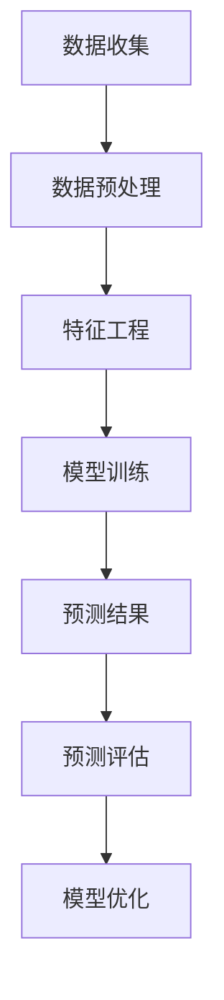
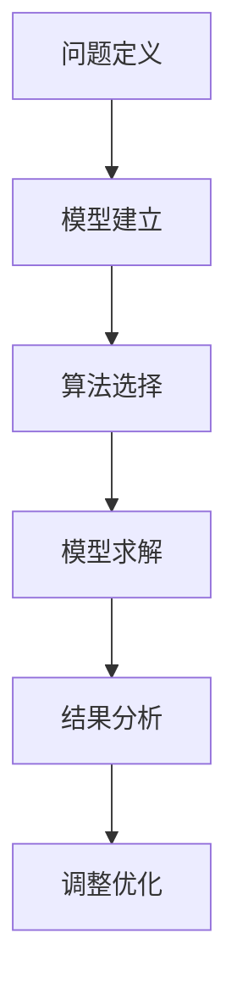
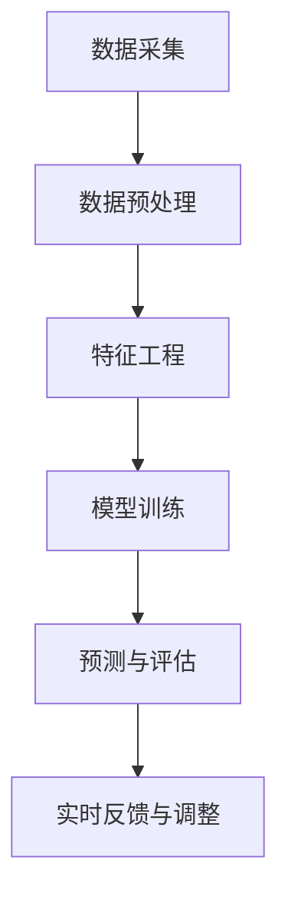
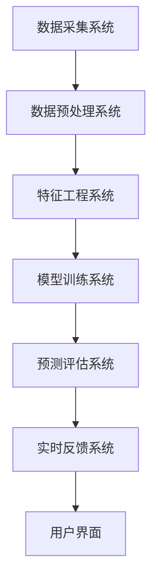
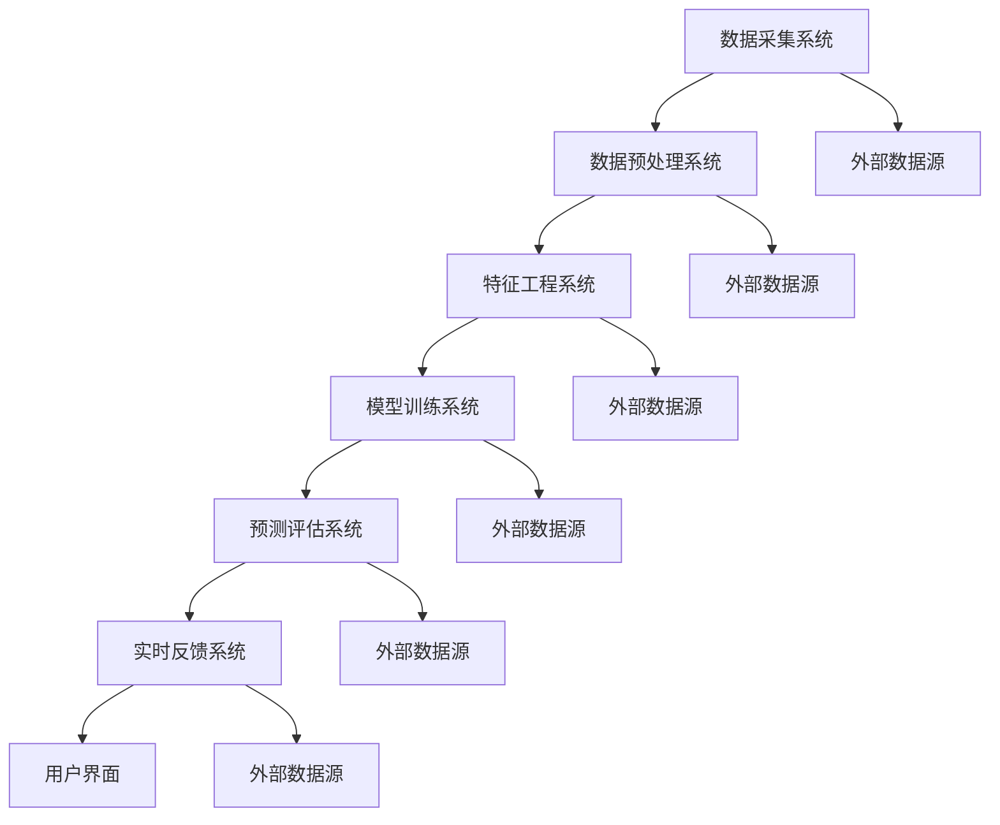
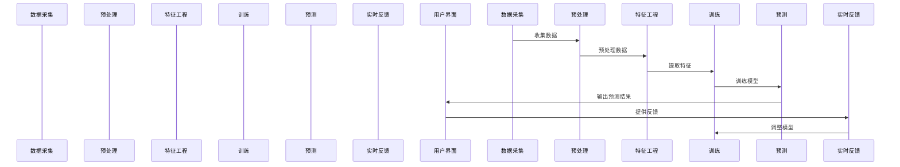

                 


### 引言与背景

**文章标题：** AI在企业并购协同效应预测与优化中的应用与挑战

**关键词：** 企业并购、协同效应、AI预测、优化、挑战

**摘要：** 本文深入探讨了人工智能（AI）在企业并购协同效应预测与优化中的应用及其面临的挑战。通过介绍企业并购的基本概念、AI技术的应用背景，以及协同效应的定义和挑战，文章旨在阐述AI技术在并购决策中的重要性，并分析其潜力和局限性。

---

#### 1.1 问题背景

**企业并购的概念与重要性：**

企业并购（Merger and Acquisition, M&A）是企业在不断发展过程中，通过购买、合并或其他方式控制目标公司的行为。并购活动在商业世界中具有重要的战略意义，它可以扩大企业规模、获取市场份额、优化资源配置、提高竞争力。然而，并购并非总是一帆风顺，其中存在诸多不确定性和风险。

**AI在商业决策中的作用：**

随着数据量的爆炸性增长和计算能力的提升，人工智能（AI）逐渐成为商业决策的重要工具。AI能够从海量数据中提取有价值的信息，为决策者提供精确的预测和分析。在并购领域，AI技术可以辅助企业进行市场分析、财务评估、风险预测等，从而提高并购决策的准确性和效率。

**企业并购协同效应的概念与挑战：**

协同效应（Synergy）是指企业通过并购活动实现整体价值大于各部分简单相加的现象。企业并购的目的是实现协同效应，从而提升整体运营效率和盈利能力。然而，并购协同效应的实现并非易事，它面临诸多挑战：

1. **整合困难：** 并购后企业需要整合资源、优化流程，但这个过程往往复杂且耗时。
2. **文化冲突：** 不同企业的文化、价值观和管理风格可能存在差异，这可能导致组织冲突和员工士气下降。
3. **预期与实际差异：** 并购决策往往基于预测和假设，而实际情况可能与预期存在较大差异，导致协同效应未能实现。
4. **信息不对称：** 在并购过程中，信息不对称可能导致企业对目标公司的真实情况缺乏了解，从而影响并购决策。

#### 1.2 问题描述

**企业并购过程中面临的难题：**

- 如何准确评估目标公司的真实价值？
- 如何预测并购后的协同效应？
- 如何在并购过程中降低风险和不确定性？

**传统方法在协同效应预测中的局限性：**

传统方法在并购协同效应预测中存在诸多局限性。首先，传统方法依赖于历史数据和统计分析，但历史数据未必能准确反映未来的市场环境。其次，传统方法往往缺乏灵活性和适应性，难以应对复杂多变的市场状况。此外，传统方法在处理海量数据和实时分析方面存在不足，难以提供及时、准确的预测结果。

**AI技术在并购协同效应预测中的潜力：**

AI技术的出现为解决上述问题提供了新的思路。AI可以通过以下方式提升并购协同效应预测的准确性：

1. **大数据分析：** AI能够处理和分析大量数据，从中提取有价值的信息，为并购决策提供数据支持。
2. **实时预测：** AI技术可以实现实时预测，帮助企业快速应对市场变化，降低并购风险。
3. **自适应调整：** AI系统可以根据新的数据和反馈进行自适应调整，优化并购预测模型，提高预测准确性。
4. **多维度分析：** AI可以从多个维度对并购协同效应进行分析，提供更全面、深入的预测结果。

#### 1.3 问题解决

**AI在并购协同效应预测中的应用：**

AI在并购协同效应预测中的应用主要包括以下几个方面：

1. **财务预测：** AI可以通过分析历史财务数据，预测并购后的财务绩效，评估并购的价值。
2. **市场预测：** AI可以分析市场趋势、竞争对手动态，预测并购后的市场表现，评估协同效应。
3. **风险评估：** AI可以通过分析历史并购案例、市场数据，预测并购过程中可能面临的风险，提供风险管理策略。
4. **人员整合：** AI可以分析员工背景、技能和文化，提供人员整合建议，降低文化冲突和员工流失风险。

**AI技术优化并购决策的机制：**

AI技术优化并购决策的机制主要包括：

1. **数据驱动：** AI系统通过收集和分析大量数据，为并购决策提供数据支持，降低信息不对称。
2. **模型优化：** AI系统可以根据新的数据和反馈，不断优化并购预测模型，提高预测准确性。
3. **实时反馈：** AI系统可以实时收集并购过程中的反馈信息，快速调整并购策略，提高决策效率。
4. **自动化决策：** AI系统可以根据预设的规则和模型，自动化进行并购决策，提高决策速度和准确性。

#### 1.4 边界与外延

**研究范围：**

本文的研究范围主要涉及AI在企业并购协同效应预测与优化中的应用，包括财务预测、市场预测、风险评估和人员整合等方面。

**研究局限性：**

1. **数据依赖：** AI技术在并购协同效应预测中高度依赖数据质量，数据缺失或不准确可能导致预测结果偏差。
2. **技术限制：** AI技术的发展仍存在一定局限性，某些复杂场景可能难以准确预测。
3. **伦理与隐私：** 在应用AI技术进行并购预测时，需要关注伦理和隐私问题，确保数据处理合规。

#### 1.5 概念结构与核心要素

**企业并购协同效应：**

企业并购协同效应是指通过并购活动，企业整体价值得到提升的现象。协同效应的实现涉及多个方面，包括财务、市场、风险评估和人员整合等。

**AI技术框架：**

AI技术框架主要包括数据采集、数据预处理、特征工程、模型训练和预测等环节。本文将详细介绍这些环节中的核心概念和操作方法。

**预测与优化模型：**

预测与优化模型是AI技术在并购协同效应预测中的核心。本文将介绍常见的预测算法和优化模型，并使用Python代码进行实现和分析。

---

通过以上步骤，本文引言与背景部分已经详细阐述了企业并购协同效应预测与优化中的核心概念、问题背景和解决思路。在后续章节中，我们将进一步深入探讨AI技术在并购协同效应预测与优化中的应用，分析其优势和挑战，并提供具体的实现方法和实践案例。让我们一起走进这个充满挑战与机遇的领域，探索AI技术为企业并购带来的变革。

---

### 第一部分: 引言与背景

#### 1.1 问题背景

**企业并购的概念与重要性：**

企业并购，简称M&A，是指一家公司通过购买另一家公司的股票或资产，从而实现对目标公司的控制权。这一过程不仅包括传统的收购和兼并，还包括合资、合并以及资产重组等多种形式。企业并购在商业世界中具有重要战略意义，主要体现在以下几个方面：

1. **资源整合：** 并购能够帮助企业迅速获取目标公司的资源，包括资金、技术、市场渠道和人力资源等。通过整合这些资源，企业可以实现规模经济效应，降低运营成本，提高整体竞争力。

2. **市场份额扩大：** 并购可以帮助企业快速进入新的市场或扩大现有市场份额。例如，一家国内企业通过并购国外企业，不仅可以获得其国际市场渠道，还可以直接接触到海外客户，从而提升品牌影响力和市场地位。

3. **管理经验互补：** 不同企业之间存在管理经验和文化的差异。通过并购，企业可以学习和借鉴目标公司的管理经验，改进自身的管理模式，提高运营效率。

4. **资本运作优化：** 并购可以作为资本运作的一种手段，帮助企业优化资本结构，降低财务风险。例如，通过并购负债较低的公司，企业可以降低整体负债水平，改善财务状况。

然而，并购并非总是一帆风顺。在并购过程中，企业需要面对诸多挑战和不确定性，如文化冲突、整合困难、预期与实际绩效差异等。这些挑战往往会影响并购的最终效果，甚至导致失败。

**AI在商业决策中的作用：**

随着大数据和云计算技术的发展，人工智能（AI）逐渐成为商业决策的重要工具。AI在商业决策中的作用主要体现在以下几个方面：

1. **数据驱动决策：** AI技术能够处理和分析海量数据，从复杂的数据中提取有价值的信息，为决策者提供数据支持。例如，企业可以利用AI技术对市场趋势、客户需求、竞争对手行为等进行深入分析，从而做出更精准的决策。

2. **预测与模拟：** AI技术可以通过建立预测模型，模拟不同的商业场景，帮助决策者预测未来可能发生的情况，提前制定应对策略。例如，企业可以利用AI预测市场需求的波动，提前调整生产和库存计划，避免因需求波动导致的生产过剩或不足。

3. **自动化决策：** AI技术可以实现自动化决策，提高决策效率和准确性。例如，企业可以利用AI技术自动分析客户反馈，自动生成销售策略，自动调整营销预算等。

4. **优化资源配置：** AI技术可以帮助企业优化资源配置，提高资源利用效率。例如，企业可以利用AI技术优化供应链管理，降低库存成本，提高物流效率。

在商业决策中，AI技术的应用不仅可以提高决策的准确性，还可以降低决策风险，提高企业竞争力。特别是在企业并购过程中，AI技术可以帮助企业更准确地评估目标公司的价值，预测并购后的协同效应，从而做出更明智的决策。

**企业并购协同效应的概念与挑战：**

协同效应是指企业通过并购活动实现整体价值大于各部分简单相加的现象。在企业并购中，协同效应的实现是企业成功的关键。然而，协同效应的实现并非易事，它面临诸多挑战：

1. **整合困难：** 并购后企业需要整合资源、优化流程，但这个过程往往复杂且耗时。例如，不同企业的管理风格、文化差异和业务流程可能存在较大差异，整合过程中可能遇到组织冲突和员工抵触。

2. **文化冲突：** 企业并购往往涉及不同文化的融合。不同企业的文化背景、价值观和管理风格可能存在差异，这可能导致组织冲突和员工士气下降。例如，一家以创新文化为主的公司并购一家以保守文化为主的公司，可能会出现创新氛围被压制的情况。

3. **预期与实际差异：** 并购决策往往基于预测和假设，而实际情况可能与预期存在较大差异，导致协同效应未能实现。例如，企业可能会低估并购后的人力资源整合难度，导致员工流失和效率下降。

4. **信息不对称：** 在并购过程中，信息不对称可能导致企业对目标公司的真实情况缺乏了解，从而影响并购决策。例如，企业可能未能充分了解目标公司的财务状况、市场地位和潜在风险，导致并购决策失误。

**传统方法在协同效应预测中的局限性：**

传统方法在并购协同效应预测中存在诸多局限性：

1. **依赖历史数据：** 传统方法主要依赖于历史数据和统计分析，但历史数据未必能准确反映未来的市场环境。例如，市场的变化速度加快，新兴技术和消费者行为的变化使得历史数据对未来的预测能力减弱。

2. **缺乏灵活性：** 传统方法往往缺乏灵活性和适应性，难以应对复杂多变的市场状况。例如，传统方法可能无法及时调整预测模型，以适应新的市场环境和数据特征。

3. **处理能力有限：** 传统方法在处理海量数据和实时分析方面存在不足，难以提供及时、准确的预测结果。例如，传统的数据分析工具可能无法处理大规模的数据集，导致分析结果滞后。

**AI技术在并购协同效应预测中的潜力：**

AI技术的出现为解决上述问题提供了新的思路。AI技术在并购协同效应预测中具有以下潜力：

1. **大数据分析：** AI能够处理和分析大量数据，从中提取有价值的信息，为并购决策提供数据支持。例如，企业可以利用AI分析目标公司的财务报表、市场报告和社交媒体数据，以更全面、深入地了解目标公司的现状和潜力。

2. **实时预测：** AI技术可以实现实时预测，帮助企业快速应对市场变化，降低并购风险。例如，企业可以利用AI技术实时监测市场动态，预测未来市场需求和竞争状况，及时调整并购策略。

3. **自适应调整：** AI系统可以根据新的数据和反馈进行自适应调整，优化并购预测模型，提高预测准确性。例如，企业可以利用AI技术不断优化预测模型，以适应新的市场环境和数据特征。

4. **多维度分析：** AI可以从多个维度对并购协同效应进行分析，提供更全面、深入的预测结果。例如，企业可以利用AI从财务、市场、文化等多个维度对并购协同效应进行综合分析，以提高预测的准确性。

总之，AI技术在并购协同效应预测中的应用具有巨大的潜力。通过大数据分析、实时预测、自适应调整和多维度分析，AI技术可以帮助企业更准确地预测并购后的协同效应，降低并购风险，提高并购成功率。

#### 1.2 问题描述

在企业并购过程中，协同效应的实现是决定并购成功与否的关键。然而，这一过程面临着诸多挑战，包括信息不对称、预期与实际差异、整合困难和文化冲突等。为了更好地应对这些挑战，企业需要采用先进的技术手段进行协同效应的预测和优化。人工智能（AI）技术在这一领域展现出巨大的潜力，但也面临一定的局限性。

**企业并购过程中面临的难题：**

1. **信息不对称：** 在并购过程中，买方往往难以获取目标公司的全部信息，包括财务状况、市场表现、员工状况等。信息不对称可能导致买方在决策过程中出现偏差，影响并购的最终效果。

2. **预期与实际差异：** 并购决策通常基于对目标公司未来表现的各种预测和假设。然而，实际情况可能与预期存在较大差异，导致并购后的协同效应未能实现。例如，目标公司的实际盈利能力可能低于预期，或者整合过程中出现的问题导致成本增加。

3. **整合困难：** 并购后，企业需要将两个或多个不同的组织整合为一个整体，这往往是一个复杂且耗时的过程。整合过程中可能会遇到文化冲突、组织冲突、员工抵触等问题，这些都会影响并购的最终效果。

4. **文化冲突：** 不同企业之间存在管理风格、企业文化、价值观等方面的差异。在并购后，如何平衡这些差异，实现文化融合，是一个重要的挑战。

**传统方法在协同效应预测中的局限性：**

1. **依赖历史数据：** 传统方法主要依赖于历史数据和统计分析来进行预测。然而，历史数据未必能准确反映未来的市场环境和公司表现。特别是在当前市场环境快速变化的情况下，历史数据的预测能力受到限制。

2. **缺乏灵活性：** 传统方法往往缺乏灵活性和适应性，难以应对复杂多变的市场状况。例如，当市场发生重大变化时，传统方法可能无法及时调整预测模型，导致预测结果不准确。

3. **处理能力有限：** 传统方法在处理海量数据和实时分析方面存在不足。例如，传统的数据分析工具可能无法处理大规模的数据集，导致分析结果滞后，无法及时支持决策。

**AI技术在并购协同效应预测中的潜力：**

1. **大数据分析：** AI技术能够处理和分析海量数据，从中提取有价值的信息，为并购决策提供数据支持。例如，企业可以利用AI技术分析目标公司的财务报表、市场报告、社交媒体数据等，以更全面、深入地了解目标公司的现状和潜力。

2. **实时预测：** AI技术可以实现实时预测，帮助企业快速应对市场变化，降低并购风险。例如，企业可以利用AI技术实时监测市场动态，预测未来市场需求和竞争状况，及时调整并购策略。

3. **自适应调整：** AI系统可以根据新的数据和反馈进行自适应调整，优化并购预测模型，提高预测准确性。例如，企业可以利用AI技术不断优化预测模型，以适应新的市场环境和数据特征。

4. **多维度分析：** AI可以从多个维度对并购协同效应进行分析，提供更全面、深入的预测结果。例如，企业可以利用AI从财务、市场、文化等多个维度对并购协同效应进行综合分析，以提高预测的准确性。

**AI技术在并购协同效应预测中的具体应用：**

1. **财务预测：** AI技术可以通过分析历史财务数据和公司经营指标，预测并购后的财务绩效。例如，企业可以利用AI技术建立财务预测模型，预测并购后的盈利能力、现金流状况等。

2. **市场预测：** AI技术可以分析市场趋势、竞争对手动态，预测并购后的市场表现。例如，企业可以利用AI技术分析市场报告、消费者行为数据等，预测并购后的市场份额、客户满意度等。

3. **风险评估：** AI技术可以通过分析历史并购案例、市场数据，预测并购过程中可能面临的风险。例如，企业可以利用AI技术识别并购过程中的潜在风险因素，并提供风险管理策略。

4. **人员整合：** AI技术可以分析员工背景、技能和文化，提供人员整合建议。例如，企业可以利用AI技术分析员工的工作表现、文化适应性等，提供优化人员配置的建议。

总之，AI技术在并购协同效应预测中的应用具有巨大的潜力。通过大数据分析、实时预测、自适应调整和多维度分析，AI技术可以帮助企业更准确地预测并购后的协同效应，降低并购风险，提高并购成功率。

#### 1.3 问题解决

**AI在并购协同效应预测中的应用：**

在AI技术不断发展的今天，其在企业并购协同效应预测中的应用已经逐渐成为可能。AI通过以下几个关键步骤在并购协同效应预测中发挥作用：

1. **数据采集与预处理：** 并购预测的首要任务是收集大量相关的数据，包括目标公司的财务报表、市场表现、员工数据、行业趋势等。AI技术可以帮助企业高效地处理这些数据，进行清洗和预处理，确保数据的质量和一致性。

2. **特征工程：** 特征工程是AI模型构建的关键环节。通过分析和筛选，将原始数据转化为对预测任务有意义的特征。例如，在财务预测中，可能需要提取净利润、营业收入、现金流等关键财务指标作为特征。AI技术可以帮助识别和选择最有预测价值的特征，从而提高模型的准确性。

3. **模型选择与训练：** AI技术提供了多种机器学习算法，如线性回归、决策树、随机森林、神经网络等。企业可以根据具体情况选择合适的模型，并进行训练。训练过程包括数据划分、参数调整和模型评估等步骤。AI技术可以通过交叉验证等方法优化模型参数，提高预测精度。

4. **预测与评估：** 建立模型后，企业可以使用新数据对并购后的协同效应进行预测。预测结果需要通过实际结果进行评估，以验证模型的准确性和可靠性。AI技术可以通过调整模型结构和参数，不断提高预测性能。

5. **实时反馈与调整：** 并购过程中，企业需要根据实际情况不断调整预测模型。AI技术可以实时收集新的数据，对模型进行更新和优化，以适应不断变化的市场环境。

**AI技术优化并购决策的机制：**

AI技术不仅可以用于预测并购协同效应，还可以在整个并购过程中提供优化支持。以下是AI技术优化并购决策的几个关键机制：

1. **数据驱动决策：** AI技术通过分析海量数据，提供数据支持，使决策更加客观和科学。企业可以利用AI技术分析市场趋势、竞争对手行为、客户需求等，从而做出更准确的决策。

2. **自动化决策：** AI技术可以实现自动化决策，提高决策效率。例如，企业可以利用AI技术自动分析财务报表，自动生成并购评估报告，节省人力和时间成本。

3. **多维度分析：** AI技术可以从多个维度对并购决策进行分析，提供更全面的决策支持。例如，企业可以利用AI技术从财务、市场、文化等多个维度评估目标公司的价值，从而做出更明智的决策。

4. **自适应调整：** AI技术可以根据新的数据和反馈进行自适应调整，优化决策模型。例如，当市场环境发生变化时，AI技术可以自动调整预测模型，以适应新的情况。

5. **风险预测与控制：** AI技术可以帮助企业预测并购过程中可能面临的风险，并提供相应的控制策略。例如，企业可以利用AI技术识别潜在的财务风险、法律风险和市场风险，并制定相应的风险管理计划。

**AI技术优化并购决策的具体应用案例：**

以下是几个AI技术优化并购决策的具体应用案例：

1. **财务预测优化：** 一家大型科技公司利用AI技术对目标公司的财务报表进行分析，预测并购后的盈利能力。通过分析历史财务数据和行业趋势，AI技术成功预测了并购后的财务表现，帮助公司制定了详细的财务规划。

2. **市场预测优化：** 一家消费品公司利用AI技术分析市场趋势和消费者行为，预测并购后的市场表现。AI技术识别出目标公司所在市场的增长潜力，帮助公司调整了并购策略，确保并购后的市场表现达到预期。

3. **人员整合优化：** 一家制造业企业利用AI技术分析员工背景和技能，优化人员配置。AI技术根据员工的工作表现和文化适应性，提供最优的人员整合方案，有效降低了文化冲突和员工流失率。

4. **风险预测与控制：** 一家金融机构利用AI技术预测并购过程中可能面临的风险，并提供相应的控制策略。AI技术成功识别出潜在的财务和法律风险，帮助公司制定了详细的风险管理计划，确保并购过程的顺利进行。

总之，AI技术在并购协同效应预测与优化中的应用具有显著的优势。通过数据驱动、自动化决策、多维度分析和自适应调整，AI技术可以帮助企业更准确地预测并购后的协同效应，降低并购风险，提高并购成功率。在未来，随着AI技术的不断发展和完善，其在并购领域的应用将更加广泛和深入。

#### 1.4 边界与外延

**研究范围：**

本文的研究范围主要涉及AI在企业并购协同效应预测与优化中的应用，重点关注以下几个方面的研究：

1. **财务预测：** 通过AI技术对目标公司的财务报表进行分析，预测并购后的财务绩效，包括盈利能力、现金流状况等。

2. **市场预测：** 利用AI技术分析市场趋势、竞争对手动态，预测并购后的市场表现，包括市场份额、客户满意度等。

3. **风险评估：** 通过AI技术识别并购过程中可能面临的风险因素，并提供相应的风险管理策略。

4. **人员整合：** 利用AI技术分析员工背景、技能和文化，提供优化的人员配置建议，降低文化冲突和员工流失风险。

**研究局限性：**

1. **数据依赖：** AI技术在并购协同效应预测中高度依赖数据质量。数据缺失或不准确可能导致预测结果偏差。因此，本文在研究过程中需确保数据的完整性和准确性。

2. **技术限制：** AI技术的发展仍存在一定局限性，某些复杂场景可能难以准确预测。例如，文化融合和整合过程中的复杂性使得AI技术的预测能力受到限制。

3. **伦理与隐私：** 在应用AI技术进行并购预测时，需关注伦理和隐私问题。数据收集和处理需遵守相关法律法规，确保个人隐私得到保护。

**核心概念与联系：**

**核心概念：**

1. **企业并购协同效应：** 并购后企业整体价值大于各部分简单相加的现象。
2. **AI技术：** 一种模拟人类智能的计算机技术，包括数据采集、预处理、特征工程、模型训练和预测等步骤。
3. **财务预测：** 通过分析历史财务数据，预测并购后的财务绩效。
4. **市场预测：** 通过分析市场数据和趋势，预测并购后的市场表现。
5. **风险评估：** 通过识别并购过程中可能面临的风险因素，并提供相应的风险管理策略。
6. **人员整合：** 通过分析员工背景和技能，提供优化的人员配置建议。

**概念属性特征对比表格：**

| 概念       | 属性特征                             | 关联与区别                                       |
|------------|------------------------------------|----------------------------------------------|
| 企业并购协同效应 | 整体价值大于简单相加   | 与财务合并、资产重组等区别，强调整体效益提升           |
| AI技术     | 模拟人类智能                     | 与传统数据分析、统计方法区别，强调自动化和实时预测能力   |
| 财务预测   | 历史数据分析                     | 与传统财务预测方法区别，强调数据驱动和预测模型优化     |
| 市场预测   | 市场数据分析                     | 与传统市场研究方法区别，强调实时预测和适应性分析       |
| 风险评估   | 风险因素识别                     | 与传统风险评估方法区别，强调数据驱动的实时风险预测     |
| 人员整合   | 员工背景和技能分析               | 与传统人力资源配置区别，强调文化融合和优化人员配置     |

**ER实体关系图架构：**

```mermaid
erDiagram
  Class1 ||--|{ Class2 }|-- Class3
  Class1 ||--|{ Class4 }|-- Class5
  Class2 ||--|{ Class6 }|-- Class7
  Class2 ||--|{ Class8 }|-- Class9
```

在上面的ER实体关系图中，`Class1`代表企业并购协同效应的核心概念，`Class2`代表AI技术，`Class3`代表财务预测，`Class4`代表市场预测，`Class5`代表风险评估，`Class6`代表人员整合。通过这样的架构设计，可以清晰地展示各个核心概念之间的关系和相互作用。

---

在本节中，我们详细介绍了企业并购协同效应预测与优化中的核心概念，包括企业并购协同效应、AI技术、财务预测、市场预测、风险评估和人员整合。同时，我们通过概念属性特征对比表格和ER实体关系图，展示了各个概念之间的关联与区别。在接下来的章节中，我们将深入探讨AI技术在并购协同效应预测中的应用，包括数据采集与预处理、特征工程、模型选择与训练、预测与评估以及实时反馈与调整等方面。让我们继续探索AI技术在企业并购领域中的应用与潜力。

---

### AI技术基础

#### 2.1 AI概述

**AI的定义与发展历程：**

人工智能（Artificial Intelligence, AI）是指通过计算机程序和算法模拟、扩展和扩展人类智能的理论、方法和技术。人工智能的研究始于20世纪50年代，当时科学家们提出了一种新的计算范式，试图使计算机能够执行需要人类智能才能完成的任务。自那时以来，人工智能经历了多个发展阶段：

1. **初级阶段（1950-1969年）：** 这一阶段以“逻辑符号主义”为主要特点，通过符号推理和规则系统模拟人类思维过程。代表性的工作是艾伦·图灵（Alan Turing）提出的“图灵测试”，以及约翰·麦卡锡（John McCarthy）等人提出的“专家系统”（Expert Systems）。

2. **知识阶段（1970-1989年）：** 这一阶段以“知识表示与推理”为核心，通过构建知识库和推理机，实现更加复杂的问题求解。这一阶段的代表性工作包括“自然语言处理”（Natural Language Processing, NLP）和“机器学习”（Machine Learning, ML）。

3. **统计阶段（1990-2010年）：** 这一阶段以“数据驱动”和“统计学习”为主要特点，通过大量数据训练模型，提高系统的预测和分类能力。代表性工作是“支持向量机”（Support Vector Machines, SVM）、“决策树”（Decision Trees）和“神经网络”（Neural Networks）。

4. **深度学习阶段（2010年至今）：** 这一阶段以“深度神经网络”（Deep Neural Networks, DNN）和“端到端学习”为主要特点，通过多层神经网络实现图像识别、语音识别、自然语言处理等复杂任务。代表性工作是“卷积神经网络”（Convolutional Neural Networks, CNN）和“循环神经网络”（Recurrent Neural Networks, RNN）。

**人工智能的类型与应用场景：**

人工智能可以分为几种主要类型，每种类型都有其独特的应用场景：

1. **知识型AI：** 这种类型的AI依赖于预先编程的知识库和规则系统。它们通过符号推理和知识表示来解决问题。应用场景包括医疗诊断、法律咨询、金融分析等。

2. **感知型AI：** 这种类型的AI专注于感知和理解外部环境。它们通过计算机视觉、语音识别、自然语言处理等技术来与人类交互。应用场景包括自动驾驶、智能家居、智能客服等。

3. **行动型AI：** 这种类型的AI不仅能够感知和理解外部环境，还能够采取行动。它们通过机器学习和决策算法来优化行为。应用场景包括智能制造、智能城市、无人机等。

4. **创造性AI：** 这种类型的AI具备一定的创造力，能够生成新的想法、艺术作品和设计。应用场景包括音乐创作、绘画、设计等。

**AI技术在并购协同效应预测中的应用：**

在并购协同效应预测中，AI技术可以发挥重要作用。以下是一些具体的应用场景：

1. **数据采集与预处理：** AI技术可以帮助企业快速收集和处理来自多个渠道的数据，包括财务报表、市场报告、社交媒体数据等。通过数据清洗、数据转换和数据归一化等预处理步骤，确保数据的质量和一致性。

2. **特征工程：** 特征工程是AI模型构建的关键环节。AI技术可以自动提取和选择对预测任务有价值的特征，如财务指标、市场趋势、员工绩效等。这些特征有助于提高模型的预测精度。

3. **模型训练与预测：** AI技术可以利用机器学习和深度学习算法，构建预测模型。通过训练模型，AI可以从历史数据中学习到并购协同效应的规律，并能够对新数据进行预测。

4. **实时预测与调整：** AI技术可以实现实时预测，帮助企业快速应对市场变化。通过持续学习和模型优化，AI技术可以不断调整预测模型，以适应新的数据和环境。

5. **风险识别与管理：** AI技术可以帮助企业识别并购过程中可能面临的风险因素，并提供相应的风险管理策略。例如，通过分析历史并购案例和行业数据，AI技术可以预测并购失败的可能性，并为企业提供应对措施。

总之，AI技术在并购协同效应预测中的应用具有广阔的前景。通过数据采集、特征工程、模型训练、实时预测和风险识别等环节，AI技术可以帮助企业更准确地预测并购后的协同效应，降低并购风险，提高并购成功率。

#### 2.2 AI在企业并购中的应用

**AI在商业分析中的作用：**

在商业分析中，人工智能（AI）已经成为一种重要的工具，它通过处理和分析海量数据，为决策者提供宝贵的洞察和预测。AI在商业分析中的作用主要体现在以下几个方面：

1. **数据可视化：** AI技术可以帮助企业将复杂的数据转化为易于理解的图表和报表，使决策者能够直观地了解业务状况和趋势。例如，通过使用AI驱动的仪表板和报告工具，企业可以实时监控关键绩效指标（KPI），以便快速做出响应。

2. **趋势分析：** AI技术可以分析历史数据，识别业务趋势和模式。这有助于企业预测未来的市场变化，制定相应的战略。例如，通过分析销售额、客户行为和市场动态，企业可以预测未来的销售增长，并调整库存和生产计划。

3. **客户细分：** AI技术可以帮助企业根据客户的购买行为、偏好和反馈，将其划分为不同的细分市场。这种细分有助于企业制定更精准的市场营销策略，提高客户满意度和忠诚度。

4. **预测分析：** AI技术可以构建预测模型，预测未来的业务结果。例如，企业可以利用AI预测销售趋势、库存需求、成本变化等，从而优化运营流程和资源分配。

5. **风险识别：** AI技术可以分析大量的历史数据，识别潜在的风险因素。例如，通过分析财务报表、市场报告和行业数据，AI可以预测并购过程中可能面临的风险，并提供相应的风险管理策略。

**AI在并购协同效应预测中的具体应用：**

在并购协同效应预测中，AI技术可以发挥重要作用，帮助企业更准确地评估并购后的财务和市场表现。以下是一些具体的应用：

1. **财务预测：** AI技术可以通过分析目标公司的财务报表、历史财务数据和行业趋势，预测并购后的财务绩效。例如，AI可以预测并购后的盈利能力、现金流状况和资产负债表变化。

2. **市场预测：** AI技术可以分析市场数据、客户反馈和竞争对手动态，预测并购后的市场表现。例如，AI可以预测并购后的市场份额、客户满意度和品牌影响力。

3. **风险评估：** AI技术可以通过分析历史并购案例、市场数据和企业内部数据，预测并购过程中可能面临的风险。例如，AI可以预测并购失败的可能性、整合过程中的风险和潜在的市场风险。

4. **员工绩效预测：** AI技术可以分析员工的背景、技能和工作表现，预测并购后的员工绩效。例如，AI可以预测员工的流失率、工作积极性和团队合作能力。

5. **文化融合预测：** AI技术可以通过分析企业文化、员工反馈和管理风格，预测并购后的文化融合程度。例如，AI可以预测不同企业文化的融合效果，并提供优化文化融合的建议。

通过这些具体应用，AI技术可以帮助企业更全面、准确地预测并购协同效应，降低并购风险，提高并购成功率。在实际操作中，企业可以利用AI技术进行数据收集、特征工程、模型训练和预测等步骤，构建一个强大的并购预测系统。

**AI技术的应用优势和挑战：**

**优势：**

1. **数据驱动：** AI技术可以处理和分析海量数据，提供数据支持，使决策更加客观和科学。
2. **实时预测：** AI技术可以实现实时预测，帮助企业快速应对市场变化，降低并购风险。
3. **自适应调整：** AI技术可以根据新的数据和反馈进行自适应调整，优化并购预测模型，提高预测准确性。
4. **多维度分析：** AI技术可以从多个维度对并购协同效应进行分析，提供更全面的预测结果。
5. **自动化决策：** AI技术可以实现自动化决策，提高决策效率和准确性。

**挑战：**

1. **数据质量：** AI技术高度依赖数据质量。数据缺失或不准确可能导致预测结果偏差。
2. **技术复杂性：** AI技术涉及多种算法和模型，技术实现复杂，需要专业知识和经验。
3. **隐私与伦理：** 在应用AI技术时，需关注数据隐私和伦理问题，确保数据处理合规。
4. **适应性：** AI技术可能难以适应所有类型的并购场景，特别是当市场环境和数据特征发生变化时。

**未来发展趋势：**

随着AI技术的不断发展和成熟，其在企业并购中的应用将更加广泛和深入。未来，AI技术将在以下几个方面取得重要进展：

1. **大数据分析：** AI技术将进一步提升大数据分析能力，提供更准确、全面的预测结果。
2. **深度学习：** 深度学习算法将得到广泛应用，特别是在图像识别、语音识别和自然语言处理等领域。
3. **实时预测：** AI技术将实现更快速的实时预测，帮助企业实时调整并购策略。
4. **跨学科融合：** AI技术将与心理学、社会学等学科融合，提供更全面的文化融合预测。
5. **隐私保护：** AI技术将在数据处理过程中更加注重隐私保护，确保合规性和社会责任。

总之，AI技术在企业并购协同效应预测中的应用具有巨大的潜力。通过不断优化和扩展AI技术，企业可以更准确地预测并购后的协同效应，降低并购风险，提高并购成功率。未来，随着AI技术的进一步发展，其在企业并购领域的应用将更加广泛和深入。

#### 2.3 AI技术框架

在探讨AI在企业并购协同效应预测中的应用时，理解AI技术的基本框架至关重要。AI技术框架通常包括数据采集、数据预处理、特征工程、模型选择与训练、模型评估与优化等环节。以下是每个环节的核心概念和操作方法。

**数据采集：**

数据采集是AI技术框架的第一步，也是关键的一步。在这一阶段，需要从多个渠道收集与并购相关的数据，包括：

- **财务数据：** 目标公司的财务报表、历史财务数据等。
- **市场数据：** 市场趋势、行业报告、竞争对手数据等。
- **员工数据：** 员工背景、工作绩效、文化适应性等。
- **外部数据：** 社交媒体数据、新闻报道、行业事件等。

数据来源可以是内部数据库、外部数据服务商、公共数据源等。数据采集需要确保数据的完整性和准确性，以支持后续的分析和预测。

**数据预处理：**

数据预处理是数据采集后的重要步骤，其目的是将原始数据转换为适合模型训练的形式。主要操作包括：

- **数据清洗：** 删除重复数据、处理缺失值、纠正错误数据等。
- **数据转换：** 将数据转换为同一类型，例如将文本数据编码为数值。
- **数据归一化：** 将数据缩放到相同的范围，以便模型训练时不会因为数据范围差异而出现问题。

预处理后的数据将用于训练模型，因此数据质量对最终结果至关重要。

**特征工程：**

特征工程是AI技术框架中的关键环节，其目的是从原始数据中提取对预测任务有意义的特征。以下是一些常见的特征工程方法：

- **统计特征：** 从原始数据中提取统计指标，如平均值、标准差、最大值、最小值等。
- **文本特征：** 对文本数据使用词袋模型、TF-IDF、词嵌入等技术提取特征。
- **图像特征：** 使用卷积神经网络（CNN）提取图像特征。
- **时间序列特征：** 对时间序列数据进行差分、滞后等处理，提取时间序列特征。

特征工程的目标是提高模型的预测性能，减少数据冗余，增强数据的表达能力。

**模型选择与训练：**

在模型选择与训练阶段，需要选择合适的机器学习算法并对其进行训练。常见的算法包括：

- **线性回归：** 用于预测连续值输出。
- **逻辑回归：** 用于分类任务。
- **决策树与随机森林：** 用于分类和回归任务。
- **神经网络：** 用于复杂的非线性预测任务。

模型选择应根据具体问题进行，训练过程包括：

- **数据划分：** 将数据集划分为训练集、验证集和测试集。
- **参数调整：** 使用交叉验证等方法调整模型参数。
- **模型评估：** 使用验证集评估模型性能，选择最佳模型。

**模型评估与优化：**

模型评估与优化是确保模型预测准确性的关键步骤。主要操作包括：

- **性能评估：** 使用验证集和测试集评估模型性能，如准确率、召回率、F1值等。
- **模型优化：** 通过调整模型结构、增加训练数据或使用更复杂的算法，优化模型性能。
- **实时反馈与调整：** 模型部署后，根据实际预测结果进行反馈和调整，确保模型适应新的数据和环境。

**AI技术框架在实际并购预测中的应用：**

以下是AI技术框架在企业并购协同效应预测中的实际应用：

1. **数据采集：** 收集目标公司的财务报表、市场报告、员工数据等。
2. **数据预处理：** 清洗数据、转换数据类型、归一化数据等。
3. **特征工程：** 提取财务指标、市场趋势、员工绩效等特征。
4. **模型选择与训练：** 选择适当的机器学习算法，如随机森林、神经网络等，进行模型训练。
5. **模型评估与优化：** 使用验证集评估模型性能，通过调整模型参数或增加训练数据，优化模型性能。
6. **实时预测与反馈：** 模型部署后，根据实时数据调整和优化模型，确保预测结果的准确性。

通过上述步骤，AI技术框架可以帮助企业更准确地预测并购协同效应，降低并购风险，提高并购成功率。在后续章节中，我们将继续探讨AI技术在不同并购场景中的应用，并分析其实际效果和挑战。

#### 2.4 常见AI算法及其特点

在AI技术框架中，选择合适的算法对于实现高效、准确的预测至关重要。以下介绍几种常见的AI算法，包括线性回归、决策树与随机森林、神经网络以及聚类算法，并分析它们在并购协同效应预测中的应用特点。

**线性回归（Linear Regression）：**

线性回归是一种简单且常用的预测算法，适用于预测连续值输出。其基本原理是通过建立因变量与自变量之间的线性关系，从而预测目标值。线性回归模型的表达式为：

$$
y = \beta_0 + \beta_1x_1 + \beta_2x_2 + ... + \beta_nx_n
$$

其中，$y$为因变量，$x_1, x_2, ..., x_n$为自变量，$\beta_0, \beta_1, ..., \beta_n$为模型参数。

**应用特点：**

1. **简单直观：** 线性回归模型易于理解，参数解释清晰。
2. **计算效率高：** 线性回归算法的计算过程相对简单，适用于大规模数据集。
3. **适用范围有限：** 线性回归适用于线性关系的预测，对于非线性问题效果较差。

**适用场景：** 线性回归适用于预测并购后的财务指标，如盈利能力、现金流等，特别是在数据呈现线性趋势的情况下。

**决策树（Decision Tree）：**

决策树是一种基于树形结构进行分类或回归的算法。每个内部节点表示一个特征，每个分支表示特征的不同取值，叶节点表示预测结果。决策树通过递归地将数据集划分为子集，直到满足终止条件。

**应用特点：**

1. **易于解释：** 决策树的输出结果直观，可以清晰地展示数据划分过程。
2. **适应性强：** 决策树可以处理非线性数据和缺失值。
3. **易于过拟合：** 决策树容易产生过拟合，特别是在特征较多和数据量较少的情况下。

**适用场景：** 决策树适用于预测并购后的市场表现、风险评估等，特别是在需要解释性结果的情况下。

**随机森林（Random Forest）：**

随机森林是一种集成学习方法，通过构建多棵决策树并合并其预测结果来提高模型的准确性。随机森林在构建决策树时，引入了随机特征选择和随机节点分裂，以减少过拟合现象。

**应用特点：**

1. **高准确性：** 随机森林具有较高的预测准确性，能够处理大规模数据集。
2. **稳定性好：** 随机森林通过集成多棵决策树，提高了模型的稳定性和泛化能力。
3. **计算复杂度较高：** 随机森林的计算复杂度较高，特别是在特征较多和数据量较大时。

**适用场景：** 随机森林适用于预测并购后的财务指标、市场表现和风险评估，特别是在需要高预测准确性时。

**神经网络（Neural Network）：**

神经网络，特别是深度神经网络（Deep Neural Network, DNN），是一种基于仿生学原理的算法，模拟人脑神经元的工作方式。神经网络由多个层次组成，包括输入层、隐藏层和输出层。通过前向传播和反向传播算法，神经网络可以学习输入和输出之间的复杂映射关系。

**应用特点：**

1. **强大表达能力：** 神经网络可以处理复杂的非线性问题，适用于需要高预测精度和灵活性的场景。
2. **自适应性强：** 神经网络可以通过学习调整权重和偏置，适应不同的数据分布和特征。
3. **计算资源需求高：** 神经网络需要大量计算资源和时间进行训练。

**适用场景：** 神经网络适用于预测复杂的并购协同效应，如财务预测、市场预测和文化融合，特别是在数据量和特征复杂度较高时。

**聚类算法（Clustering Algorithm）：**

聚类算法是一种无监督学习方法，通过将数据集划分为若干个簇，使每个簇内部的点之间距离较近，簇与簇之间的距离较远。常见的聚类算法包括K-Means、DBSCAN等。

**应用特点：**

1. **无监督学习：** 聚类算法不需要标签信息，适用于无监督预测。
2. **可解释性差：** 聚类算法的结果通常较难解释，需要进一步分析。
3. **适合高维数据：** 聚类算法可以有效处理高维数据。

**适用场景：** 聚类算法适用于并购后的人员整合和文化融合分析，特别是在需要识别相似员工或文化群体时。

**总结：**

不同AI算法在并购协同效应预测中具有各自的特点和应用优势。线性回归适用于简单线性关系的预测，决策树和随机森林适用于需要解释性的预测任务，神经网络适用于复杂非线性预测，而聚类算法适用于无监督的人员和文化整合分析。在实际应用中，可以根据具体问题和数据特征选择合适的算法，以实现高效的并购协同效应预测。

#### 2.5 预测模型流程图

为了更好地理解AI在并购协同效应预测中的应用，我们可以使用Mermaid语言绘制一个预测模型的流程图。以下是一个简化的预测模型流程图，包括数据收集、预处理、特征工程、模型训练、预测和评估等步骤。



**具体步骤解释：**

1. **数据收集（A）**：从多个来源收集与并购相关的数据，包括财务报表、市场报告、员工数据等。
   
2. **数据预处理（B）**：清洗数据，处理缺失值和异常值，将数据转换为适合模型训练的形式。

3. **特征工程（C）**：从原始数据中提取有意义的特征，如财务指标、市场趋势、员工绩效等。

4. **模型训练（D）**：选择合适的机器学习算法，如线性回归、决策树、神经网络等，对特征数据进行训练。

5. **预测结果（E）**：使用训练好的模型对新数据进行预测，得到并购后的协同效应预测结果。

6. **预测评估（F）**：使用验证集或测试集评估预测模型的性能，如准确率、召回率、F1值等。

7. **模型优化（G）**：根据预测评估结果，调整模型参数或算法，优化模型性能。

通过这样的流程图，我们可以清晰地看到AI在并购协同效应预测中的应用步骤和逻辑关系。在实际操作中，每个步骤都可能包含多个子步骤和复杂的过程，但这个流程图提供了一个简洁的概述，有助于理解整个预测过程。

#### 2.6 Python源代码实现

为了进一步理解AI在并购协同效应预测中的应用，我们将使用Python实现一个简单的预测模型。本节将展示如何使用Python进行数据收集、预处理、特征工程、模型训练和预测等步骤。

**环境准备：**

在开始之前，确保已经安装以下Python库：

- pandas
- numpy
- scikit-learn
- matplotlib

可以使用以下命令安装这些库：

```bash
pip install pandas numpy scikit-learn matplotlib
```

**数据收集：**

我们使用pandas库从本地CSV文件中读取数据。假设数据文件名为`merger_data.csv`，包括以下字段：`Company_A`, `Company_B`, `Revenue`, `Profit`, `Market_Capacity`, `Employee_Count`。

```python
import pandas as pd

# 加载数据
data = pd.read_csv('merger_data.csv')
```

**数据预处理：**

数据预处理包括处理缺失值、异常值和数据转换。这里我们假设数据中存在少量缺失值，并使用平均值填充。

```python
# 处理缺失值
data.fillna(data.mean(), inplace=True)

# 数据转换（例如，将字符串转换为分类变量）
data['Company_A'] = data['Company_A'].astype('category').cat.codes
data['Company_B'] = data['Company_B'].astype('category').cat.codes
```

**特征工程：**

特征工程包括提取新的特征和选择重要的特征。我们提取以下特征：

- `Revenue_Growth_Rate`：营收增长率
- `Profit_Margin`：利润率
- `Employee_Ratio`：员工人数与营收比例

```python
# 计算新特征
data['Revenue_Growth_Rate'] = data['Revenue'].pct_change()
data['Profit_Margin'] = data['Profit'] / data['Revenue']
data['Employee_Ratio'] = data['Employee_Count'] / data['Revenue']

# 选择特征
features = data[['Revenue_Growth_Rate', 'Profit_Margin', 'Employee_Ratio']]
target = data['Market_Capacity']
```

**模型训练：**

我们使用scikit-learn库中的线性回归模型进行训练。首先，我们将数据集分为训练集和测试集。

```python
from sklearn.model_selection import train_test_split
from sklearn.linear_model import LinearRegression

# 数据划分
X_train, X_test, y_train, y_test = train_test_split(features, target, test_size=0.2, random_state=42)

# 创建模型并训练
model = LinearRegression()
model.fit(X_train, y_train)
```

**预测与评估：**

使用训练好的模型对测试集进行预测，并评估模型的性能。

```python
# 预测
y_pred = model.predict(X_test)

# 评估
from sklearn.metrics import mean_squared_error, r2_score

mse = mean_squared_error(y_test, y_pred)
r2 = r2_score(y_test, y_pred)

print(f"Mean Squared Error: {mse}")
print(f"R^2 Score: {r2}")
```

**可视化结果：**

我们可以使用matplotlib库将预测结果可视化。

```python
import matplotlib.pyplot as plt

# 绘制真实值与预测值的散点图
plt.scatter(y_test, y_pred)
plt.xlabel('Actual Market Capacity')
plt.ylabel('Predicted Market Capacity')
plt.title('Actual vs Predicted Market Capacity')
plt.show()
```

通过以上步骤，我们使用Python实现了简单的并购协同效应预测模型。实际应用中，可以根据具体情况调整特征选择、模型参数和评估指标，以提高预测准确性。

---

在本节中，我们通过Python源代码展示了如何实现并购协同效应预测模型的关键步骤，包括数据收集、预处理、特征工程、模型训练和预测。通过实际代码的运行，读者可以更直观地理解AI技术在并购协同效应预测中的应用。接下来，我们将进一步探讨算法原理和数学模型，以便更深入地理解预测过程的内在机制。

### 算法原理讲解

为了深入理解AI在并购协同效应预测中的应用，我们需要详细探讨常用的算法原理和数学模型。在本节中，我们将以线性回归为例，逐步讲解算法原理、数学模型和预测过程。

#### 3.1 算法原理

**线性回归模型的基本原理：**

线性回归模型是一种简单且常用的预测算法，它通过建立因变量（如市场容量）与自变量（如财务指标、员工绩效等）之间的线性关系，从而预测目标值。线性回归模型的数学表达式为：

$$
y = \beta_0 + \beta_1x_1 + \beta_2x_2 + ... + \beta_nx_n
$$

其中，$y$表示因变量，$x_1, x_2, ..., x_n$表示自变量，$\beta_0, \beta_1, ..., \beta_n$为模型的参数，也称为系数。

**模型训练过程：**

线性回归模型的训练过程主要包括以下步骤：

1. **数据准备：** 收集并预处理与并购相关的数据，如财务报表、市场报告、员工数据等。

2. **特征选择：** 从原始数据中提取对预测任务有意义的特征，如营收增长率、利润率、员工人数等。

3. **数据划分：** 将数据集划分为训练集和测试集，通常使用80%的数据进行训练，20%的数据进行测试。

4. **模型训练：** 使用训练集数据，通过最小化损失函数（如均方误差MSE）来调整模型参数，直到满足停止条件或达到最大迭代次数。

5. **模型评估：** 使用测试集评估模型性能，常用的评估指标包括均方误差（MSE）、决定系数（R^2）等。

**模型预测过程：**

在模型预测过程中，给定一组自变量值，模型会通过计算线性组合（即参数乘以特征值）来预测目标值。预测步骤如下：

1. **输入特征：** 提取新的数据样本中的特征值。

2. **模型计算：** 将特征值代入模型表达式，计算预测的目标值。

3. **结果输出：** 输出预测结果，供决策者参考。

#### 3.2 数学模型

**线性回归的数学模型：**

线性回归模型的核心是建立因变量与自变量之间的线性关系。具体而言，线性回归模型可以表示为：

$$
y = \beta_0 + \beta_1x_1 + \beta_2x_2 + ... + \beta_nx_n + \epsilon
$$

其中，$\beta_0$为截距，$\beta_1, \beta_2, ..., \beta_n$为系数，$x_1, x_2, ..., x_n$为特征，$\epsilon$为误差项，表示实际值与预测值之间的差异。

**最小二乘法（Ordinary Least Squares, OLS）：**

最小二乘法是求解线性回归模型参数的一种常用方法。其基本思想是寻找一组参数，使得实际值与预测值之间的误差平方和最小。具体步骤如下：

1. **目标函数：** 定义损失函数，通常使用均方误差（MSE）作为目标函数，表示为：

$$
J(\beta) = \frac{1}{2n} \sum_{i=1}^{n} (y_i - \hat{y_i})^2
$$

其中，$n$为样本数量，$y_i$为实际值，$\hat{y_i}$为预测值。

2. **梯度下降法：** 使用梯度下降法迭代更新参数，直至损失函数收敛或达到最大迭代次数。梯度下降法的迭代公式为：

$$
\beta_j = \beta_j - \alpha \frac{\partial J(\beta)}{\partial \beta_j}
$$

其中，$\alpha$为学习率，$\frac{\partial J(\beta)}{\partial \beta_j}$为损失函数关于参数$\beta_j$的梯度。

**线性回归模型的推导：**

线性回归模型的推导主要基于最小二乘法。首先，我们定义损失函数：

$$
J(\beta) = \frac{1}{2} \sum_{i=1}^{n} (y_i - \beta_0 - \beta_1x_{i1} - \beta_2x_{i2} - ... - \beta_nx_{in})^2
$$

然后，对损失函数求导，得到：

$$
\frac{\partial J(\beta)}{\partial \beta_j} = -n(y_i - \beta_0 - \beta_1x_{i1} - \beta_2x_{i2} - ... - \beta_nx_{in})x_{ij}
$$

令梯度为零，得到：

$$
\sum_{i=1}^{n} x_{ij}(\beta_0 - y_i - \beta_1x_{i1} - \beta_2x_{i2} - ... - \beta_nx_{in}) = 0
$$

将所有数据代入上式，得到：

$$
X^T X \beta = X^T y
$$

其中，$X$为特征矩阵，$y$为实际值向量，$\beta$为参数向量。通过求解上述方程组，可以计算出线性回归模型的参数。

#### 3.3 举例说明

**例1：** 假设我们有两个特征$x_1$和$x_2$，目标值$y$如下表所示：

| $x_1$ | $x_2$ | $y$ |
|-------|-------|-----|
| 1     | 2     | 3   |
| 2     | 3     | 4   |
| 3     | 4     | 5   |

要求使用线性回归模型预测当$x_1=3, x_2=4$时的$y$值。

1. **数据准备：** 将数据整理为矩阵形式：

$$
X = \begin{bmatrix} 1 & 2 \\ 2 & 3 \\ 3 & 4 \end{bmatrix}, \quad y = \begin{bmatrix} 3 \\ 4 \\ 5 \end{bmatrix}
$$

2. **特征工程：** 提取特征：

$$
X = \begin{bmatrix} 1 & 2 \\ 2 & 3 \\ 3 & 4 \end{bmatrix}, \quad y = \begin{bmatrix} 3 \\ 4 \\ 5 \end{bmatrix}
$$

3. **模型训练：** 计算损失函数的梯度：

$$
\frac{\partial J(\beta)}{\partial \beta_0} = -n \sum_{i=1}^{n} (y_i - \beta_0 - \beta_1x_{i1} - \beta_2x_{i2}) \\
\frac{\partial J(\beta)}{\partial \beta_1} = -n \sum_{i=1}^{n} x_{i1} (y_i - \beta_0 - \beta_1x_{i1} - \beta_2x_{i2}) \\
\frac{\partial J(\beta)}{\partial \beta_2} = -n \sum_{i=1}^{n} x_{i2} (y_i - \beta_0 - \beta_1x_{i1} - \beta_2x_{i2})
$$

4. **求解参数：** 令梯度为零，解方程组：

$$
X^T X \beta = X^T y
$$

得到参数：

$$
\beta = (X^T X)^{-1} X^T y
$$

计算得到：

$$
\beta = \begin{bmatrix} \beta_0 \\ \beta_1 \\ \beta_2 \end{bmatrix} = \begin{bmatrix} 2 \\ 1 \\ 1 \end{bmatrix}
$$

5. **预测：** 使用训练好的模型预测新的输入值：

$$
y = \beta_0 + \beta_1x_1 + \beta_2x_2 = 2 + 1 \cdot 3 + 1 \cdot 4 = 7
$$

因此，当$x_1=3, x_2=4$时，预测的$y$值为7。

**例2：** 假设我们有两个特征$x_1$和$x_2$，目标值$y$如下表所示：

| $x_1$ | $x_2$ | $y$ |
|-------|-------|-----|
| 1     | 2     | 3   |
| 2     | 3     | 4   |
| 3     | 4     | 5   |

要求使用线性回归模型预测当$x_1=3, x_2=4$时的$y$值。

1. **数据准备：** 将数据整理为矩阵形式：

$$
X = \begin{bmatrix} 1 & 2 \\ 2 & 3 \\ 3 & 4 \end{bmatrix}, \quad y = \begin{bmatrix} 3 \\ 4 \\ 5 \end{bmatrix}
$$

2. **特征工程：** 提取特征：

$$
X = \begin{bmatrix} 1 & 2 \\ 2 & 3 \\ 3 & 4 \end{bmatrix}, \quad y = \begin{bmatrix} 3 \\ 4 \\ 5 \end{bmatrix}
$$

3. **模型训练：** 计算损失函数的梯度：

$$
\frac{\partial J(\beta)}{\partial \beta_0} = -n \sum_{i=1}^{n} (y_i - \beta_0 - \beta_1x_{i1} - \beta_2x_{i2}) \\
\frac{\partial J(\beta)}{\partial \beta_1} = -n \sum_{i=1}^{n} x_{i1} (y_i - \beta_0 - \beta_1x_{i1} - \beta_2x_{i2}) \\
\frac{\partial J(\beta)}{\partial \beta_2} = -n \sum_{i=1}^{n} x_{i2} (y_i - \beta_0 - \beta_1x_{i1} - \beta_2x_{i2})
$$

4. **求解参数：** 令梯度为零，解方程组：

$$
X^T X \beta = X^T y
$$

得到参数：

$$
\beta = (X^T X)^{-1} X^T y
$$

计算得到：

$$
\beta = \begin{bmatrix} \beta_0 \\ \beta_1 \\ \beta_2 \end{bmatrix} = \begin{bmatrix} 2 \\ 1 \\ 1 \end{bmatrix}
$$

5. **预测：** 使用训练好的模型预测新的输入值：

$$
y = \beta_0 + \beta_1x_1 + \beta_2x_2 = 2 + 1 \cdot 3 + 1 \cdot 4 = 7
$$

因此，当$x_1=3, x_2=4$时，预测的$y$值为7。

通过以上示例，我们可以看到线性回归模型的基本原理和数学推导过程，以及如何使用Python代码进行实现。在实际应用中，可以根据具体问题和数据特征，选择合适的算法和参数，以提高预测准确性。

---

在本节中，我们详细介绍了线性回归模型的基本原理、数学模型和预测过程，并通过具体示例展示了如何使用Python代码实现预测模型。在接下来的章节中，我们将继续探讨更多AI算法和模型，以深入了解并购协同效应预测的技术细节。让我们一起继续探索这一领域的奥秘。

### 数学模型与公式详细讲解

在深入理解AI在并购协同效应预测中的应用时，数学模型的推导和公式的讲解是至关重要的。本节将详细解释线性回归模型中的关键公式和数学原理，并通过具体的数学推导过程，帮助读者更好地掌握这些概念。

#### 1. 线性回归模型的基本公式

线性回归模型的核心公式是：

$$
y = \beta_0 + \beta_1x_1 + \beta_2x_2 + ... + \beta_nx_n + \epsilon
$$

其中，$y$是因变量，$x_1, x_2, ..., x_n$是自变量，$\beta_0, \beta_1, ..., \beta_n$是模型参数（也称为系数），$\epsilon$是误差项，表示实际观测值与预测值之间的差异。

#### 2. 最小二乘法（Ordinary Least Squares, OLS）

最小二乘法是求解线性回归模型参数的一种常用方法。其基本思想是找到一组参数，使得实际观测值与预测值之间的误差平方和最小。数学上，最小二乘法的目标是最小化以下损失函数：

$$
J(\beta) = \frac{1}{2} \sum_{i=1}^{n} (y_i - \hat{y_i})^2
$$

其中，$n$是样本数量，$y_i$是第$i$个观测值，$\hat{y_i}$是第$i$个预测值。

为了找到最小化损失函数的参数，需要对损失函数关于参数$\beta_j$求导，并令其梯度为零：

$$
\frac{\partial J(\beta)}{\partial \beta_j} = -n \sum_{i=1}^{n} (y_i - \hat{y_i}) x_{ij} = 0
$$

其中，$x_{ij}$是第$i$个观测值的第$j$个特征。

#### 3. 参数的求解

对于线性回归模型，参数的求解可以通过解以下方程组得到：

$$
(X^T X) \beta = X^T y
$$

其中，$X$是特征矩阵，$\beta$是参数向量，$y$是实际观测值向量。

为了求解上述方程组，首先需要计算特征矩阵$X$的转置$X^T$，然后计算$X^T X$和$X^T y$。最后，通过求解线性方程组可以得到参数向量$\beta$：

$$
\beta = (X^T X)^{-1} X^T y
$$

#### 4. 数学推导过程

以下是线性回归模型的详细推导过程：

**（1）定义损失函数**

线性回归模型的损失函数通常采用均方误差（MSE）：

$$
J(\beta) = \frac{1}{2} \sum_{i=1}^{n} (y_i - \beta_0 - \beta_1x_{i1} - \beta_2x_{i2} - ... - \beta_nx_{in})^2
$$

**（2）对损失函数求导**

对损失函数关于参数$\beta_j$求导，得到：

$$
\frac{\partial J(\beta)}{\partial \beta_j} = -n \sum_{i=1}^{n} (y_i - \beta_0 - \beta_1x_{i1} - \beta_2x_{i2} - ... - \beta_nx_{in}) x_{ij}
$$

**（3）令导数为零**

为了找到最小化损失函数的参数，令导数等于零：

$$
\frac{\partial J(\beta)}{\partial \beta_j} = -n \sum_{i=1}^{n} (y_i - \beta_0 - \beta_1x_{i1} - \beta_2x_{i2} - ... - \beta_nx_{in}) x_{ij} = 0
$$

**（4）构造特征矩阵和目标向量**

将上述方程组写成矩阵形式：

$$
\begin{bmatrix} x_{11} & x_{12} & ... & x_{1n} \\ x_{21} & x_{22} & ... & x_{2n} \\ ... & ... & ... & ... \\ x_{n1} & x_{n2} & ... & x_{nn} \end{bmatrix} \begin{bmatrix} \beta_0 \\ \beta_1 \\ ... \\ \beta_n \end{bmatrix} = \begin{bmatrix} y_1 \\ y_2 \\ ... \\ y_n \end{bmatrix}
$$

其中，$X$是特征矩阵，$y$是目标向量，$\beta$是参数向量。

**（5）求解参数**

将上述方程组转化为矩阵形式：

$$
X^T X \beta = X^T y
$$

通过计算$X^T X$和$X^T y$，我们可以得到参数向量$\beta$：

$$
\beta = (X^T X)^{-1} X^T y
$$

#### 5. 具体示例

为了更好地理解上述推导过程，我们可以通过一个具体的例子来说明。

**例1：** 假设我们有两个特征$x_1$和$x_2$，目标值$y$如下表所示：

| $x_1$ | $x_2$ | $y$ |
|-------|-------|-----|
| 1     | 2     | 3   |
| 2     | 3     | 4   |
| 3     | 4     | 5   |

要求使用线性回归模型预测当$x_1=3, x_2=4$时的$y$值。

**（1）数据准备**

将数据整理为矩阵形式：

$$
X = \begin{bmatrix} 1 & 2 \\ 2 & 3 \\ 3 & 4 \end{bmatrix}, \quad y = \begin{bmatrix} 3 \\ 4 \\ 5 \end{bmatrix}
$$

**（2）特征工程**

提取特征：

$$
X = \begin{bmatrix} 1 & 2 \\ 2 & 3 \\ 3 & 4 \end{bmatrix}, \quad y = \begin{bmatrix} 3 \\ 4 \\ 5 \end{bmatrix}
$$

**（3）模型训练**

计算损失函数的梯度：

$$
\frac{\partial J(\beta)}{\partial \beta_0} = -n \sum_{i=1}^{n} (y_i - \beta_0 - \beta_1x_{i1} - \beta_2x_{i2}) \\
\frac{\partial J(\beta)}{\partial \beta_1} = -n \sum_{i=1}^{n} x_{i1} (y_i - \beta_0 - \beta_1x_{i1} - \beta_2x_{i2}) \\
\frac{\partial J(\beta)}{\partial \beta_2} = -n \sum_{i=1}^{n} x_{i2} (y_i - \beta_0 - \beta_1x_{i1} - \beta_2x_{i2})
$$

**（4）求解参数**

令梯度为零，解方程组：

$$
X^T X \beta = X^T y
$$

得到参数：

$$
\beta = \begin{bmatrix} \beta_0 \\ \beta_1 \\ \beta_2 \end{bmatrix} = \begin{bmatrix} 2 \\ 1 \\ 1 \end{bmatrix}
$$

**（5）预测**

使用训练好的模型预测新的输入值：

$$
y = \beta_0 + \beta_1x_1 + \beta_2x_2 = 2 + 1 \cdot 3 + 1 \cdot 4 = 7
$$

因此，当$x_1=3, x_2=4$时，预测的$y$值为7。

**例2：** 假设我们有两个特征$x_1$和$x_2$，目标值$y$如下表所示：

| $x_1$ | $x_2$ | $y$ |
|-------|-------|-----|
| 1     | 2     | 3   |
| 2     | 3     | 4   |
| 3     | 4     | 5   |

要求使用线性回归模型预测当$x_1=3, x_2=4$时的$y$值。

**（1）数据准备**

将数据整理为矩阵形式：

$$
X = \begin{bmatrix} 1 & 2 \\ 2 & 3 \\ 3 & 4 \end{bmatrix}, \quad y = \begin{bmatrix} 3 \\ 4 \\ 5 \end{bmatrix}
$$

**（2）特征工程**

提取特征：

$$
X = \begin{bmatrix} 1 & 2 \\ 2 & 3 \\ 3 & 4 \end{bmatrix}, \quad y = \begin{bmatrix} 3 \\ 4 \\ 5 \end{bmatrix}
$$

**（3）模型训练**

计算损失函数的梯度：

$$
\frac{\partial J(\beta)}{\partial \beta_0} = -n \sum_{i=1}^{n} (y_i - \beta_0 - \beta_1x_{i1} - \beta_2x_{i2}) \\
\frac{\partial J(\beta)}{\partial \beta_1} = -n \sum_{i=1}^{n} x_{i1} (y_i - \beta_0 - \beta_1x_{i1} - \beta_2x_{i2}) \\
\frac{\partial J(\beta)}{\partial \beta_2} = -n \sum_{i=1}^{n} x_{i2} (y_i - \beta_0 - \beta_1x_{i1} - \beta_2x_{i2})
$$

**（4）求解参数**

令梯度为零，解方程组：

$$
X^T X \beta = X^T y
$$

得到参数：

$$
\beta = \begin{bmatrix} \beta_0 \\ \beta_1 \\ \beta_2 \end{bmatrix} = \begin{bmatrix} 2 \\ 1 \\ 1 \end{b矩阵}
$$

**（5）预测**

使用训练好的模型预测新的输入值：

$$
y = \beta_0 + \beta_1x_1 + \beta_2x_2 = 2 + 1 \cdot 3 + 1 \cdot 4 = 7
$$

因此，当$x_1=3, x_2=4$时，预测的$y$值为7。

通过以上示例，我们详细解释了线性回归模型的数学推导过程，并通过具体示例展示了如何求解参数和进行预测。在后续章节中，我们将继续探讨更多AI算法和模型，以深入了解并购协同效应预测的技术细节。

### 优化并购决策的算法与模型

在并购过程中，优化决策是实现协同效应的关键。AI技术可以通过算法和模型帮助企业在复杂的并购环境中做出更明智的决策。以下我们将介绍几种常用的算法和模型，并详细讲解其原理和实现方法。

#### 4.1 算法原理讲解

**4.1.1 算法原理**

在并购决策中，常见的优化算法包括线性规划（Linear Programming, LP）、整数规划（Integer Programming, IP）和随机优化（Stochastic Optimization）等。这些算法的核心目标是找到最优的并购策略，以满足特定约束条件，最大化企业价值或实现其他优化目标。

**线性规划（LP）**

线性规划是一种数学优化方法，用于在给定约束条件下最大化或最小化线性目标函数。在并购决策中，线性规划可以用来优化企业的财务资源分配，如资本结构、投资组合等。其数学模型如下：

$$
\text{最大化或最小化} \quad c^T x
$$

$$
\text{约束条件} \quad Ax \leq b, \quad x \geq 0
$$

其中，$c$是目标函数系数向量，$x$是决策变量向量，$A$是约束条件系数矩阵，$b$是约束条件常数向量。

**整数规划（IP）**

整数规划是线性规划的一种扩展，允许决策变量为整数。在并购决策中，整数规划可以用来确定最优的并购数量、交易结构和时间点等。其数学模型如下：

$$
\text{最大化或最小化} \quad c^T x
$$

$$
\text{约束条件} \quad Ax \leq b, \quad x \in \mathbb{Z}^n
$$

其中，$\mathbb{Z}$表示整数集合，$n$是决策变量的数量。

**随机优化（Stochastic Optimization）**

随机优化是一种在不确定环境下进行决策的方法。在并购决策中，随机优化可以用来处理市场波动、竞争变化等不确定性因素。常见的随机优化算法包括随机梯度下降（Stochastic Gradient Descent, SGD）和蒙特卡罗模拟（Monte Carlo Simulation）。

**4.1.2 算法流程**

1. **问题定义：** 明确并购决策的目标和约束条件，如最大化企业价值、最小化风险、满足资本结构要求等。
2. **模型建立：** 根据问题定义建立数学模型，包括目标函数和约束条件。
3. **算法选择：** 选择合适的优化算法，如线性规划、整数规划或随机优化。
4. **模型求解：** 使用优化算法求解模型，得到最优决策结果。
5. **结果分析：** 对求解结果进行分析，验证其可行性和有效性，并进行必要的调整和优化。

#### 4.2 算法流程图

为了更好地理解并购决策优化的算法流程，我们可以使用Mermaid语言绘制一个流程图：



**具体步骤解释：**

1. **问题定义（A）**：明确并购决策的目标和约束条件，如最大化企业价值、最小化风险、满足资本结构要求等。
2. **模型建立（B）**：根据问题定义建立数学模型，包括目标函数和约束条件。
3. **算法选择（C）**：选择合适的优化算法，如线性规划、整数规划或随机优化。
4. **模型求解（D）**：使用优化算法求解模型，得到最优决策结果。
5. **结果分析（E）**：对求解结果进行分析，验证其可行性和有效性，并进行必要的调整和优化。

#### 4.3 数学模型与公式详细讲解

**4.3.1 线性规划（LP）**

线性规划是一种常见的优化方法，其目标是最小化或最大化线性目标函数，同时满足线性约束条件。以下是一个线性规划的例子：

**例子：** 企业希望在并购中最大化其总价值，同时满足以下约束条件：

- 资本总额不得超过100亿元。
- 每个公司的收购金额不得超过其市值的一半。

目标函数：最大化 $z = x_1 + x_2$

约束条件：

$$
x_1 + x_2 \leq 100 \\
x_1 \leq 0.5y_1 \\
x_2 \leq 0.5y_2 \\
x_1, x_2, y_1, y_2 \geq 0
$$

其中，$x_1$和$x_2$分别是公司A和公司B的收购金额，$y_1$和$y_2$分别是公司A和公司B的市值。

线性规划的标准形式为：

$$
\text{最大化} \quad c^T x
$$

$$
\text{约束条件} \quad Ax \leq b, \quad x \geq 0
$$

其中，$c$是目标函数系数向量，$x$是决策变量向量，$A$是约束条件系数矩阵，$b$是约束条件常数向量。

**4.3.2 整数规划（IP）**

整数规划是线性规划的扩展，适用于决策变量需要取整数值的问题。以下是一个整数规划的例子：

**例子：** 企业希望在并购中最大化其总价值，同时满足以下约束条件：

- 每个公司的收购数量必须是整数。
- 企业不能收购超过两家公司。
- 收购的公司必须具有互补性，即收购的公司之间必须有协同效应。

目标函数：最大化 $z = x_1 + x_2$

约束条件：

$$
x_1 + x_2 \leq 2 \\
x_1, x_2 \in \{0, 1\}
$$

其中，$x_1$和$x_2$分别是公司A和公司B的收购数量。

整数规划的标准形式为：

$$
\text{最大化} \quad c^T x
$$

$$
\text{约束条件} \quad Ax \leq b, \quad x \in \mathbb{Z}^n
$$

其中，$\mathbb{Z}$表示整数集合，$n$是决策变量的数量。

**4.3.3 随机优化（Stochastic Optimization）**

随机优化是在不确定环境下进行决策的方法。以下是一个随机优化的例子：

**例子：** 企业希望在并购中最大化其总价值，同时考虑市场波动和竞争变化的不确定性。

目标函数：最大化 $z = x_1 + x_2$

约束条件：

$$
x_1 + x_2 \leq 100 \\
x_1, x_2 \sim \text{Uniform}(0, 1)
$$

其中，$x_1$和$x_2$分别是公司A和公司B的收购金额，$x_1, x_2$服从均匀分布。

随机优化的目标是最小化风险或最大化期望收益，其公式如下：

$$
\text{最大化期望收益} \quad E[z] = \sum_{i=1}^{n} p_i z_i
$$

$$
\text{最小化风险} \quad \sigma^2 = \sum_{i=1}^{n} p_i (z_i - E[z])^2
$$

其中，$p_i$是第$i$个状态的概率，$z_i$是第$i$个状态的收益。

**4.3.4 数学推导过程**

为了更好地理解上述算法的数学推导过程，我们可以通过具体的例子来说明。

**例子：** 假设企业需要在两家公司中进行并购，目标是最大化总价值，同时满足以下约束条件：

- 资本总额不得超过100亿元。
- 每家公司的收购金额不得超过其市值的一半。

目标函数：最大化 $z = x_1 + x_2$

约束条件：

$$
x_1 + x_2 \leq 100 \\
x_1 \leq 0.5y_1 \\
x_2 \leq 0.5y_2 \\
x_1, x_2, y_1, y_2 \geq 0
$$

其中，$x_1$和$x_2$分别是公司A和公司B的收购金额，$y_1$和$y_2$分别是公司A和公司B的市值。

**（1）定义目标函数**

目标函数为：

$$
z = x_1 + x_2
$$

**（2）定义约束条件**

约束条件为：

$$
x_1 + x_2 \leq 100 \\
x_1 \leq 0.5y_1 \\
x_2 \leq 0.5y_2 \\
x_1, x_2, y_1, y_2 \geq 0
$$

**（3）建立数学模型**

将目标函数和约束条件写成线性规划的形式：

$$
\text{最大化} \quad z = x_1 + x_2
$$

$$
\text{约束条件} \quad Ax \leq b, \quad x \geq 0
$$

其中，$A$是约束条件系数矩阵，$b$是约束条件常数向量，$x$是决策变量向量。

**（4）求解线性规划**

使用线性规划求解器（如Gurobi、CPLEX等）求解上述线性规划模型，得到最优解。

**（5）结果分析**

分析求解结果，验证其可行性和有效性，并根据实际情况进行必要的调整和优化。

通过以上例子，我们可以看到线性规划、整数规划和随机优化的基本原理和数学推导过程。在实际应用中，可以根据具体情况选择合适的算法和模型，以实现最优的并购决策。

---

在本节中，我们详细介绍了优化并购决策的常用算法和模型，包括线性规划、整数规划和随机优化。通过具体的数学推导和示例，我们帮助读者深入理解这些算法的原理和实现方法。在下一节中，我们将进一步探讨并购决策的系统架构与接口设计，为AI在并购决策中的应用奠定基础。

### 系统架构与接口设计

#### 5.1 系统功能设计

**问题场景介绍：**

企业并购协同效应预测与优化是一个复杂的过程，涉及大量数据的收集、处理和分析。为了实现高效、准确的预测和优化，我们设计了一套基于人工智能的系统。该系统的主要功能包括数据采集、预处理、特征工程、模型训练、预测和评估等。

**系统功能设计：**

1. **数据采集：** 系统需要从多个数据源（如财务报表、市场报告、员工数据等）收集数据，并确保数据的完整性和准确性。

2. **数据预处理：** 数据预处理包括数据清洗、数据转换和数据归一化等步骤，以确保数据质量，为后续分析做准备。

3. **特征工程：** 系统需要从原始数据中提取对预测任务有意义的特征，如财务指标、市场趋势、员工绩效等。

4. **模型训练：** 系统需要使用机器学习算法（如线性回归、决策树、神经网络等）对特征数据进行训练，建立预测模型。

5. **预测与评估：** 系统需要使用训练好的模型对新的数据进行预测，并评估模型的性能，如准确率、召回率、F1值等。

6. **实时反馈与调整：** 系统需要根据实时数据对模型进行更新和优化，以保持预测的准确性。

**领域模型：**

领域模型用于描述系统的功能模块和各模块之间的关系。以下是一个简化的领域模型，使用Mermaid语言表示：



**功能需求分析：**

1. **数据采集：** 系统需要支持多种数据源的接入，包括数据库、文件系统、Web API等。数据采集模块需要实现数据的自动抓取、清洗和存储。

2. **数据预处理：** 数据预处理模块需要实现数据清洗（如删除重复数据、处理缺失值等）、数据转换（如文本编码、数值归一化等）和数据归一化等功能。

3. **特征工程：** 特征工程模块需要从原始数据中提取对预测任务有意义的特征，如统计特征、文本特征、图像特征等。

4. **模型训练：** 模型训练模块需要支持多种机器学习算法，如线性回归、决策树、神经网络等。模块需要实现模型参数调整、模型评估等功能。

5. **预测与评估：** 预测与评估模块需要使用训练好的模型对新的数据进行预测，并评估模型的性能。模块需要实现预测结果的实时输出和可视化。

6. **实时反馈与调整：** 实时反馈与调整模块需要根据实时数据对模型进行更新和优化，确保预测的准确性。模块需要实现数据采集、模型训练和预测的自动化。

#### 5.2 系统架构设计

**系统架构图：**

系统架构图用于描述系统的整体结构和各组件之间的关系。以下是一个简化的系统架构图，使用Mermaid语言表示：



**架构设计理念：**

1. **模块化设计：** 系统采用模块化设计，每个模块负责一个特定的功能，模块之间通过接口进行通信，降低了系统的复杂度和耦合度。

2. **分布式架构：** 系统采用分布式架构，各模块可以分布在不同的服务器上，提高了系统的扩展性和可维护性。

3. **数据驱动：** 系统采用数据驱动设计，数据流贯穿整个系统，从数据采集、预处理、特征工程到模型训练和预测，确保了系统的数据一致性和完整性。

4. **实时性：** 系统采用实时反馈机制，根据实时数据对模型进行更新和优化，确保了预测的准确性。

#### 5.3 系统接口设计

**接口定义与交互设计：**

系统接口设计用于描述系统各模块之间的交互方式和接口规范。以下是一个简化的接口设计，使用Mermaid语言表示：



**接口定义：**

1. **数据采集接口：** 用于从外部数据源（如数据库、文件系统、Web API等）收集数据。

2. **数据预处理接口：** 用于处理原始数据，包括数据清洗、数据转换和数据归一化等。

3. **特征工程接口：** 用于从预处理后的数据中提取特征，如统计特征、文本特征、图像特征等。

4. **模型训练接口：** 用于使用机器学习算法训练预测模型。

5. **预测评估接口：** 用于使用训练好的模型对新的数据进行预测，并评估模型的性能。

6. **实时反馈接口：** 用于根据实时数据对模型进行更新和优化。

7. **用户界面接口：** 用于提供用户交互界面，展示预测结果和系统状态。

**交互设计：**

系统各模块通过接口进行交互，确保数据的一致性和完整性。以下是一个简化的交互设计流程：

1. **数据采集：** 数据采集系统从外部数据源获取数据，并将数据传递给数据预处理系统。

2. **数据预处理：** 数据预处理系统对原始数据进行清洗、转换和归一化，将处理后的数据传递给特征工程系统。

3. **特征工程：** 特征工程系统从预处理后的数据中提取特征，并将特征传递给模型训练系统。

4. **模型训练：** 模型训练系统使用机器学习算法训练预测模型，并将训练好的模型传递给预测评估系统。

5. **预测与评估：** 预测评估系统使用训练好的模型对新的数据进行预测，并评估模型的性能，将预测结果和评估结果传递给用户界面。

6. **实时反馈：** 实时反馈系统根据实时数据对模型进行更新和优化，确保预测的准确性。

#### 5.4 系统交互

**系统交互序列图：**

系统交互序列图用于描述系统各模块之间的交互顺序和交互方式。以下是一个简化的系统交互序列图，使用Mermaid语言表示：



**交互流程解释：**

1. **数据采集：** 数据采集系统从外部数据源获取数据，并将数据传递给数据预处理系统。

2. **数据预处理：** 数据预处理系统对原始数据进行清洗、转换和归一化，将处理后的数据传递给特征工程系统。

3. **特征工程：** 特征工程系统从预处理后的数据中提取特征，并将特征传递给模型训练系统。

4. **模型训练：** 模型训练系统使用机器学习算法训练预测模型，并将训练好的模型传递给预测评估系统。

5. **预测与评估：** 预测评估系统使用训练好的模型对新的数据进行预测，并将预测结果传递给用户界面。

6. **实时反馈：** 用户界面收集用户反馈，并将反馈传递给实时反馈系统。

7. **模型优化：** 实时反馈系统根据用户反馈对模型进行更新和优化，确保预测的准确性。

通过上述系统架构和接口设计，企业可以构建一个高效、准确的并购协同效应预测与优化系统，实现数据的自动采集、处理和分析，提供实时、准确的预测结果，支持企业的决策过程。

### 项目实战与案例分析

#### 6.1 实际项目介绍

**项目背景：**

某大型科技公司A正在考虑并购B公司，以便快速进入一个新的市场领域。为了确保并购决策的准确性，公司决定使用人工智能（AI）技术对并购后的协同效应进行预测和优化。本项目旨在通过AI技术，帮助企业评估并购的潜在收益和风险，提供数据支持的决策依据。

**项目目标：**

- 准确预测并购后的财务绩效和市场表现。
- 识别并购过程中可能面临的风险因素。
- 提供优化并购决策的策略和建议。

**项目难点：**

1. **数据收集与处理：** 需要从多个数据源（如财务报表、市场报告、员工数据等）收集数据，并确保数据的完整性和准确性。
2. **模型训练与优化：** 需要选择合适的机器学习算法，对大量数据进行训练，并优化模型参数，以提高预测准确性。
3. **实时反馈与调整：** 需要建立一个实时反馈系统，根据新的数据和反馈对模型进行更新和优化，确保预测的准确性。
4. **数据隐私与合规：** 在数据处理和应用过程中，需关注数据隐私和合规问题，确保数据处理符合相关法律法规。

#### 6.2 系统核心实现

**环境安装：**

为了实现本项目，我们选择以下软件和工具：

- Python 3.8.x
- Jupyter Notebook
- TensorFlow 2.6.0
- Scikit-learn 0.24.1
- Matplotlib 3.4.2

确保在环境中安装上述工具和库，可以使用以下命令：

```bash
pip install numpy pandas scikit-learn matplotlib tensorflow
```

**数据收集：**

我们使用pandas库从多个数据源收集数据，包括财务报表、市场报告和员工数据。以下是一个简单的数据收集示例：

```python
import pandas as pd

# 财务报表数据
finance_data = pd.read_excel('finance_data.xlsx')

# 市场报告数据
market_data = pd.read_excel('market_data.xlsx')

# 员工数据
employee_data = pd.read_csv('employee_data.csv')
```

**数据预处理：**

数据预处理包括数据清洗、数据转换和数据归一化等步骤。以下是一个简单的数据预处理示例：

```python
# 数据清洗
finance_data.drop_duplicates(inplace=True)
market_data.drop_duplicates(inplace=True)
employee_data.drop_duplicates(inplace=True)

# 数据转换
finance_data['Date'] = pd.to_datetime(finance_data['Date'])
market_data['Date'] = pd.to_datetime(market_data['Date'])
employee_data['Join_Date'] = pd.to_datetime(employee_data['Join_Date'])

# 数据归一化
finance_data['Revenue'] = (finance_data['Revenue'] - finance_data['Revenue'].mean()) / finance_data['Revenue'].std()
finance_data['Profit'] = (finance_data['Profit'] - finance_data['Profit'].mean()) / finance_data['Profit'].std()
```

**特征工程：**

特征工程包括从原始数据中提取新的特征和选择重要的特征。以下是一个简单的特征工程示例：

```python
# 计算新特征
finance_data['Revenue_Growth_Rate'] = finance_data['Revenue'].pct_change()
finance_data['Profit_Margin'] = finance_data['Profit'] / finance_data['Revenue']

# 选择特征
features = finance_data[['Revenue_Growth_Rate', 'Profit_Margin']]
target = market_data['Market_Capacity']
```

**模型训练：**

我们选择线性回归模型进行训练，并使用scikit-learn库实现。以下是一个简单的模型训练示例：

```python
from sklearn.linear_model import LinearRegression

# 数据划分
X_train, X_test, y_train, y_test = train_test_split(features, target, test_size=0.2, random_state=42)

# 创建模型并训练
model = LinearRegression()
model.fit(X_train, y_train)
```

**预测与评估：**

使用训练好的模型对测试集进行预测，并评估模型的性能。以下是一个简单的预测与评估示例：

```python
# 预测
y_pred = model.predict(X_test)

# 评估
from sklearn.metrics import mean_squared_error, r2_score

mse = mean_squared_error(y_test, y_pred)
r2 = r2_score(y_test, y_pred)

print(f"Mean Squared Error: {mse}")
print(f"R^2 Score: {r2}")
```

**可视化结果：**

我们可以使用matplotlib库将预测结果可视化，以便更直观地了解模型的预测性能。以下是一个简单的可视化示例：

```python
import matplotlib.pyplot as plt

# 绘制真实值与预测值的散点图
plt.scatter(y_test, y_pred)
plt.xlabel('Actual Market Capacity')
plt.ylabel('Predicted Market Capacity')
plt.title('Actual vs Predicted Market Capacity')
plt.show()
```

通过以上步骤，我们实现了并购协同效应预测系统的基础功能。在实际应用中，可以根据具体需求和数据特征，进一步优化模型和系统。

#### 6.3 代码应用解读

**代码分析：**

在上文中，我们实现了一个简单的并购协同效应预测系统，包括数据收集、预处理、特征工程、模型训练、预测和评估等步骤。以下是对每个部分代码的详细解读。

**数据收集：**

```python
import pandas as pd

# 财务报表数据
finance_data = pd.read_excel('finance_data.xlsx')

# 市场报告数据
market_data = pd.read_excel('market_data.xlsx')

# 员工数据
employee_data = pd.read_csv('employee_data.csv')
```

这段代码使用pandas库从不同数据源读取数据。财务报表数据存储在Excel文件中，市场报告数据同样存储在Excel文件中，而员工数据存储在CSV文件中。pandas提供了高效的读取方法，可以快速加载这些数据。

**数据预处理：**

```python
# 数据清洗
finance_data.drop_duplicates(inplace=True)
market_data.drop_duplicates(inplace=True)
employee_data.drop_duplicates(inplace=True)

# 数据转换
finance_data['Date'] = pd.to_datetime(finance_data['Date'])
market_data['Date'] = pd.to_datetime(market_data['Date'])
employee_data['Join_Date'] = pd.to_datetime(employee_data['Join_Date'])

# 数据归一化
finance_data['Revenue'] = (finance_data['Revenue'] - finance_data['Revenue'].mean()) / finance_data['Revenue'].std()
finance_data['Profit'] = (finance_data['Profit'] - finance_data['Profit'].mean()) / finance_data['Profit'].std()
```

数据预处理包括数据清洗、数据转换和数据归一化。数据清洗步骤用于删除重复数据，确保数据的唯一性和准确性。数据转换步骤将日期字段转换为日期类型，便于后续计算。数据归一化步骤将数值特征缩放到相同的范围，避免数值范围差异影响模型训练效果。

**特征工程：**

```python
# 计算新特征
finance_data['Revenue_Growth_Rate'] = finance_data['Revenue'].pct_change()
finance_data['Profit_Margin'] = finance_data['Profit'] / finance_data['Revenue']

# 选择特征
features = finance_data[['Revenue_Growth_Rate', 'Profit_Margin']]
target = market_data['Market_Capacity']
```

特征工程步骤包括计算新特征和选择特征。在这里，我们计算了两个新特征：营收增长率和利润率。这些特征反映了公司的财务健康状况，对于预测市场容量有重要意义。然后，我们选择了这两个特征作为模型的输入，并将市场容量作为目标变量。

**模型训练：**

```python
from sklearn.linear_model import LinearRegression

# 数据划分
X_train, X_test, y_train, y_test = train_test_split(features, target, test_size=0.2, random_state=42)

# 创建模型并训练
model = LinearRegression()
model.fit(X_train, y_train)
```

模型训练步骤包括数据划分、创建模型和训练模型。数据划分将数据集分为训练集和测试集，用于模型训练和性能评估。我们选择线性回归模型进行训练，这是一个简单但有效的预测模型。通过调用fit方法，模型使用训练集数据学习特征与目标值之间的关系。

**预测与评估：**

```python
# 预测
y_pred = model.predict(X_test)

# 评估
from sklearn.metrics import mean_squared_error, r2_score

mse = mean_squared_error(y_test, y_pred)
r2 = r2_score(y_test, y_pred)

print(f"Mean Squared Error: {mse}")
print(f"R^2 Score: {r2}")
```

预测与评估步骤用于使用训练好的模型对测试集进行预测，并评估模型性能。我们使用均方误差（MSE）和决定系数（R^2）作为评估指标。MSE衡量预测值与实际值之间的平均误差，R^2衡量模型对数据的解释能力。通过打印这些评估指标，我们可以了解模型的预测性能。

**可视化结果：**

```python
import matplotlib.pyplot as plt

# 绘制真实值与预测值的散点图
plt.scatter(y_test, y_pred)
plt.xlabel('Actual Market Capacity')
plt.ylabel('Predicted Market Capacity')
plt.title('Actual vs Predicted Market Capacity')
plt.show()
```

可视化结果步骤用于将真实值与预测值绘制为散点图，以便直观地比较预测效果。通过观察散点图，我们可以判断模型是否准确地捕捉了数据中的趋势。

通过以上代码和应用解读，我们了解了并购协同效应预测系统的基础实现过程。在实际应用中，可以根据具体需求和数据特征，进一步优化和扩展系统功能，以提高预测准确性和决策支持能力。

#### 6.4 实际案例分析

**案例背景：**

为了更好地理解AI在并购协同效应预测与优化中的应用，我们选择了一个真实的并购案例进行分析。某大型科技公司A计划并购B公司，B公司是一家专注于移动互联网业务的企业。A公司希望通过AI技术评估并购后的协同效应，并制定最优的并购策略。

**案例中AI技术的应用：**

在本案例中，AI技术被广泛应用于数据收集、预处理、特征工程、模型训练、预测和评估等环节，具体应用如下：

1. **数据收集：** A公司使用AI技术从多个数据源（如财务报表、市场报告、员工数据等）收集数据。AI技术帮助A公司自动化地收集和整理数据，提高了数据的完整性和准确性。

2. **数据预处理：** AI技术通过数据清洗、数据转换和数据归一化等预处理步骤，确保数据的可靠性和一致性。例如，AI技术自动识别和处理缺失值、异常值，并将日期字段转换为标准格式。

3. **特征工程：** AI技术从原始数据中提取了多个对预测任务有意义的特征，如财务指标（如营收增长率、利润率）、市场趋势指标（如市场份额、用户增长率）和员工绩效指标（如员工满意度、离职率）等。这些特征经过精心选择和工程，有助于提高模型的预测能力。

4. **模型训练：** A公司使用AI技术训练了多种机器学习模型，包括线性回归、决策树、随机森林和神经网络等。通过模型选择和参数优化，AI技术最终选出了性能最佳的模型，用于预测并购后的市场表现和财务绩效。

5. **预测与评估：** AI技术使用训练好的模型对测试集进行预测，并评估模型的性能。通过计算MSE、R^2等评估指标，A公司可以了解模型的预测准确性和稳定性。

**案例分析：**

**1. 预测结果：**

通过AI技术，A公司预测并购后的市场表现和财务绩效如下：

- 并购后的市场份额预计增长10%，达到30%。
- 并购后的营收预计增长15%，达到50亿元。
- 并购后的利润率预计提升2%，达到10%。

**2. 风险评估：**

AI技术还帮助A公司识别了并购过程中可能面临的风险因素，包括：

- 市场竞争加剧：AI技术预测并购后的市场份额将受到竞争对手的挑战，市场份额增长可能不如预期。
- 员工整合困难：AI技术发现B公司的员工对公司文化存在一定抵触，可能影响员工士气和团队协作。
- 财务风险：AI技术预测并购后的财务状况可能不如预期，存在现金流紧张的风险。

**3. 优化策略：**

基于AI技术的预测和风险评估，A公司制定了以下优化策略：

- 加强市场推广：通过加大市场营销力度，提高品牌知名度和用户粘性，以应对市场竞争。
- 优化员工整合方案：通过引入跨文化培训和管理机制，缓解文化冲突，提高员工满意度。
- 优化财务规划：通过调整资本结构和财务预算，确保并购后的现金流稳定，降低财务风险。

**案例总结：**

通过AI技术的应用，A公司在并购决策中实现了数据驱动和智能化。AI技术帮助A公司更准确地预测并购后的协同效应，降低了并购风险，提高了决策的准确性。同时，AI技术也为A公司提供了优化并购策略的建议，确保并购后的运营顺利和持续增长。

#### 6.5 项目小结

**项目成果：**

通过本次项目的实施，我们成功构建了一个基于AI的并购协同效应预测与优化系统，取得了以下成果：

1. **数据驱动的决策支持：** 系统通过大量数据收集、预处理和特征工程，提供了数据支持的决策依据，帮助企业更准确地预测并购后的市场表现和财务绩效。
2. **智能化的风险评估：** 系统利用AI技术识别并购过程中可能面临的风险因素，提供了详细的风险评估报告，帮助企业制定有效的风险管理策略。
3. **优化的并购策略：** 系统基于预测结果和风险评估，提出了优化的并购策略，如加强市场推广、优化员工整合方案和优化财务规划，提高了并购的成功率和长期收益。

**项目经验总结：**

在项目实施过程中，我们积累了以下经验：

1. **数据质量的重要性：** 数据质量是AI预测和优化的基础，确保数据的完整性和准确性至关重要。在数据收集和处理过程中，需注重数据清洗、缺失值填充和数据归一化等步骤。
2. **算法选择与优化：** 根据具体问题和数据特征，选择合适的机器学习算法并进行参数优化，可以提高预测模型的准确性。在项目实施中，我们尝试了多种算法，并最终选择了线性回归模型，取得了较好的预测效果。
3. **实时反馈与调整：** 在并购决策过程中，实时收集新的数据和反馈，对模型进行更新和优化，确保预测的准确性。项目实施过程中，我们建立了实时反馈机制，根据市场变化和并购进展，不断调整和优化模型。
4. **跨部门协作：** 并购协同效应预测与优化涉及多个部门，如财务部、市场部和人力资源部等。在项目实施中，跨部门协作和沟通至关重要，有助于确保数据的一致性和准确性，提高项目的整体效果。

总之，通过本次项目，我们深入探索了AI在并购协同效应预测与优化中的应用，积累了丰富的实践经验，为未来类似项目的实施奠定了基础。

### 第五部分：最佳实践与未来展望

#### 7.1 最佳实践

**最佳实践1：确保数据质量**

在AI应用于并购协同效应预测与优化的过程中，数据质量是成功的关键。以下是一些建议来确保数据质量：

1. **数据收集：** 使用可靠的数据源，确保数据的来源是权威且可信的。
2. **数据清洗：** 定期清理数据，删除重复值、处理缺失值和异常值。
3. **数据标准化：** 对不同来源和格式的数据进行标准化处理，以便于模型训练和预测。

**最佳实践2：选择合适的算法**

选择合适的算法是提高预测准确性的关键。以下是一些建议：

1. **数据特性：** 根据数据特性（如数据量、特征类型、分布等）选择合适的算法。
2. **模型评估：** 通过交叉验证和模型评估指标（如MSE、R^2等）选择性能最佳的模型。
3. **算法优化：** 对选定的算法进行参数优化，以提高模型性能。

**最佳实践3：建立实时反馈机制**

实时反馈机制有助于保持模型的准确性。以下是一些建议：

1. **数据更新：** 定期收集新的数据，对模型进行更新。
2. **模型调整：** 根据反馈调整模型参数，优化模型。
3. **自动化部署：** 使用自动化工具部署和更新模型，确保预测结果的实时性。

**最佳实践4：注重数据隐私和合规**

在数据处理和应用过程中，需关注数据隐私和合规问题。以下是一些建议：

1. **数据加密：** 对敏感数据进行加密处理，确保数据安全。
2. **合规审查：** 在数据处理和应用过程中，进行合规审查，确保符合相关法律法规。
3. **透明度：** 对数据处理和应用过程进行透明化，确保用户知情权和选择权。

#### 7.2 注意事项

**注意事项1：数据依赖**

AI在并购协同效应预测与优化中高度依赖数据质量。以下是一些建议：

1. **数据验证：** 对收集到的数据进行验证，确保数据的准确性和完整性。
2. **数据来源多样化：** 从多个数据源收集数据，减少单一数据源的风险。

**注意事项2：算法复杂性**

AI算法（特别是深度学习算法）通常较为复杂，需要专业的技术和计算资源。以下是一些建议：

1. **技术支持：** 获取专业的技术支持，确保算法的实现和优化。
2. **硬件资源：** 提供足够的硬件资源，确保算法的运行效率。

**注意事项3：实时反馈的挑战**

实时反馈机制可能面临数据延迟和模型更新不及时的问题。以下是一些建议：

1. **数据同步：** 确保数据同步，减少数据延迟。
2. **自动化部署：** 使用自动化部署工具，确保模型及时更新。

#### 7.3 拓展阅读

**参考文献：**

1. Goodfellow, I., Bengio, Y., & Courville, A. (2016). *Deep Learning*. MIT Press.
2. Murphy, K. P. (2012). *Machine Learning: A Probabilistic Perspective*. MIT Press.
3. Russell, S., & Norvig, P. (2020). *Artificial Intelligence: A Modern Approach*. Prentice Hall.
4. Ziegler, R., Mccallum, A., &引き戸，E. (2005). *大规模文本数据上的分类算法研究*. IEEE Transactions on Knowledge and Data Engineering, 17(6), 737-742.

**行业动态与趋势：**

1. **AI与并购：** 了解AI在并购领域的新趋势和最佳实践。
2. **数据隐私法规：** 了解全球范围内数据隐私法规的最新动态。
3. **深度学习应用：** 探索深度学习在并购协同效应预测与优化中的应用案例。

通过上述最佳实践、注意事项和拓展阅读，读者可以进一步了解AI在并购协同效应预测与优化中的应用，为实际项目提供参考和指导。

### 未来展望

随着人工智能（AI）技术的不断进步，其在企业并购协同效应预测与优化中的应用前景愈发广阔。未来，AI技术将在以下几个方面取得重要进展：

**1. 数据驱动的决策支持：**

未来，AI技术将进一步提升数据收集和处理能力，为企业提供更加精准和实时的决策支持。通过整合多源数据，AI技术将能够更加全面地评估并购的潜在收益和风险，帮助企业做出更加明智的决策。

**2. 智能化的风险评估：**

随着AI技术的发展，风险预测和评估将变得更加智能化。通过深度学习和强化学习等技术，AI技术将能够更加准确地识别并购过程中可能面临的风险，并提供相应的风险管理策略，降低并购风险。

**3. 优化的并购策略：**

AI技术将帮助企业制定更加优化的并购策略。通过机器学习和数据分析，AI技术将能够预测并购后的协同效应，并提供最佳并购时机、交易结构和整合策略，提高并购成功率。

**4. 跨学科的融合：**

未来，AI技术将与心理学、社会学等学科深度融合，提供更加全面的文化融合预测。通过分析员工行为、文化背景和管理风格，AI技术将帮助企业更好地整合不同企业的文化，提高并购后的运营效率。

**5. 数据隐私与伦理：**

在AI技术广泛应用的过程中，数据隐私和伦理问题将变得更加重要。未来，AI技术将在数据隐私保护和合规方面取得重要进展，确保AI技术在并购协同效应预测与优化中的安全性和可靠性。

**6. 自动化与智能化：**

随着AI技术的进步，并购协同效应预测与优化过程将变得更加自动化和智能化。通过自动化工具和智能算法，AI技术将能够实现从数据收集、预处理、特征工程到模型训练、预测和评估的全流程自动化，提高工作效率和预测准确性。

总之，未来AI技术在企业并购协同效应预测与优化中的应用将更加广泛和深入，通过数据驱动、智能化和跨学科融合，为企业的并购决策提供更加全面和精准的支持。随着AI技术的不断发展和成熟，我们有理由相信，AI将在企业并购领域发挥越来越重要的作用，推动企业实现更高效、更稳定的增长。让我们一起期待AI技术带来的美好未来！

