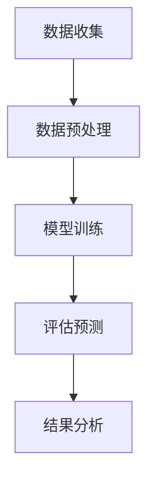
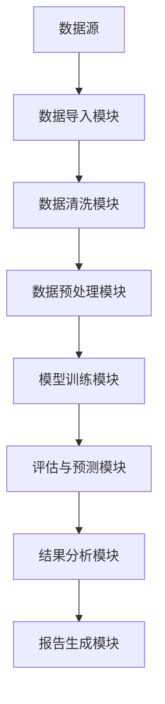

                 


### 1. 文章标题、关键词与摘要

首先，我们需要确定文章的标题、关键词和摘要。这些部分将为读者提供对文章的初步了解，并吸引他们继续阅读。

#### 文章标题：《AI在企业无形资产评估中的应用与挑战》

这个标题明确地指出了文章的主要内容，即AI技术在企业无形资产评估中的应用，以及所面临的挑战。

#### 关键词：AI、企业无形资产、评估、应用、挑战

这些关键词涵盖了文章的核心内容，帮助搜索引擎更好地索引文章，同时也让读者能够快速了解文章的主题。

#### 摘要：

本文探讨了AI技术在企业无形资产评估中的应用与挑战。首先介绍了无形资产评估的现状和需求，然后详细阐述了AI的基础理论、分类和应用场景。通过Python代码示例，本文介绍了用于评估无形资产的算法原理，并给出了数学模型和公式。接着，本文描述了一个评估无形资产的项目实战，包括环境安装、系统核心实现和实际案例分析。最后，本文总结了最佳实践和注意事项，为读者提供了进一步学习的方向。

### 2. 背景介绍

在开始详细内容之前，我们需要提供一个背景介绍，让读者了解为什么AI在企业无形资产评估中变得重要。

#### 问题背景：介绍企业无形资产评估的现状和需求

企业无形资产是指那些不易量化、不易观察但却对企业价值产生重大影响的资产，如品牌、客户关系、技术知识等。传统的无形资产评估方法主要依赖于专家判断和市场数据，存在主观性强、数据不完整等问题。随着大数据和AI技术的发展，企业对更精确、更高效的评估方法的需求日益增加。

#### 问题描述：解释AI在企业无形资产评估中的作用和重要性

AI技术能够通过数据分析和机器学习模型，为企业提供更准确、客观的评估结果。例如，通过自然语言处理技术，AI可以分析大量的客户反馈和社交媒体数据，评估品牌声誉；通过图像识别技术，AI可以评估产品的市场潜力。AI的应用不仅提高了评估效率，还降低了评估成本。

#### 问题解决：概述本书将如何解决这些问题和提供解决方案

本书将详细介绍AI在企业无形资产评估中的应用，通过算法原理讲解、系统分析与架构设计、项目实战等环节，帮助读者理解如何利用AI技术进行无形资产评估。同时，本书还将探讨AI技术在这一领域的挑战，并提出相应的解决方案。

#### 边界与外延：明确本书讨论的AI技术范畴和应用领域

本书将重点关注机器学习、自然语言处理、图像识别等AI技术在无形资产评估中的应用。具体应用领域包括品牌价值评估、客户关系分析、技术专利评估等。

#### 概念结构与核心要素组成：介绍AI与企业无形资产评估相关的核心概念和要素

AI与企业无形资产评估相关的核心概念包括：无形资产、AI技术、评估模型、数据来源等。核心要素组成包括：数据收集、预处理、模型训练、评估预测、结果分析等。

### 3. 核心概念与联系

在这一部分，我们将详细阐述AI和企业无形资产评估相关的核心概念，并分析它们之间的联系。

#### AI概念原理

AI是指人工智能，它通过模拟人类智能行为来实现机器自主学习和决策。AI可以分为机器学习、深度学习、自然语言处理等多个子领域。在无形资产评估中，机器学习和深度学习等技术尤为重要。

##### 2.1.1 机器学习

机器学习是一种让计算机从数据中学习规律和模式的技术。它通过训练模型来预测和决策，不需要显式编程。在无形资产评估中，机器学习可以用来分析市场数据、客户反馈等，以提高评估的准确性。

##### 2.1.2 深度学习

深度学习是机器学习的一个分支，它使用多层神经网络来模拟人类大脑的思维方式。深度学习在图像识别、语音识别等领域表现出色，这些技术在无形资产评估中同样具有应用潜力。

##### 2.1.3 自然语言处理

自然语言处理（NLP）是AI的一个子领域，它涉及计算机理解和生成自然语言的能力。在无形资产评估中，NLP可以用来分析文本数据，如客户反馈、社交媒体评论等，以评估品牌声誉和客户满意度。

#### 企业无形资产概念

企业无形资产是指那些不易量化、不易观察但却对企业价值产生重大影响的资产，如品牌、客户关系、技术知识等。无形资产的特点包括：

##### 2.2.1 不易量化

无形资产不像有形资产那样可以直接测量和量化，如品牌价值、客户满意度等。这给评估带来了一定的困难。

##### 2.2.2 不易观察

无形资产通常不会像有形资产那样在物理上存在，如技术知识、企业文化等。这使得评估人员难以直接观察和评估无形资产。

##### 2.2.3 对企业价值产生重大影响

尽管无形资产难以量化，但它们对企业价值的影响却是巨大的。例如，一个强大的品牌可以为企业带来持续的收益和竞争优势。

#### AI与企业无形资产评估的关系

AI技术在企业无形资产评估中的应用主要表现在以下几个方面：

##### 2.3.1 提高评估准确性

AI技术可以通过数据分析和模型预测，提高对无形资产价值的评估准确性。例如，通过机器学习算法分析市场数据，可以更准确地预测品牌价值。

##### 2.3.2 降低评估成本

传统的无形资产评估方法通常成本较高，而AI技术可以通过自动化和智能化的方式降低评估成本。

##### 2.3.3 提高评估效率

AI技术可以快速处理和分析大量数据，提高评估效率。例如，通过自然语言处理技术，可以快速分析客户反馈，评估客户满意度。

##### 2.3.4 应对评估挑战

传统的无形资产评估方法难以应对一些特殊的评估需求，如技术专利评估等。AI技术可以通过特定的算法和模型，应对这些评估挑战。

### 4. 算法原理讲解

在这一部分，我们将介绍用于评估无形资产的AI算法原理，并提供Python代码示例。

#### 算法mermaid流程图



这个流程图展示了从数据收集到结果分析的整个过程。

#### Python源代码讲解

```python
# 导入必要的库
import pandas as pd
from sklearn.model_selection import train_test_split
from sklearn.ensemble import RandomForestRegressor

# 数据收集
data = pd.read_csv('inangible_assets_data.csv')

# 数据预处理
X = data.drop('asset_value', axis=1)
y = data['asset_value']

# 模型训练
X_train, X_test, y_train, y_test = train_test_split(X, y, test_size=0.2, random_state=42)
model = RandomForestRegressor()
model.fit(X_train, y_train)

# 评估预测
y_pred = model.predict(X_test)

# 结果分析
accuracy = model.score(X_test, y_test)
print(f'模型准确率：{accuracy:.2f}')
```

这个代码示例使用了随机森林回归算法来评估无形资产的价值。通过数据预处理、模型训练和预测，我们可以得到评估结果。

#### 数学模型和公式

```latex
$$
资产价值 = w_1 \cdot 特征_1 + w_2 \cdot 特征_2 + ... + w_n \cdot 特征_n
$$

$$
误差 = 实际资产价值 - 评估资产价值
$$
```

这些公式描述了资产价值的计算过程和评估误差的计算方法。

#### 举例说明

假设我们有一个企业的无形资产数据集，包括品牌价值、客户满意度、市场占有率等特征。我们可以使用随机森林回归算法来预测品牌价值。

- **数据收集**：收集包含品牌价值和其他相关特征的数据。
- **数据预处理**：将数据分为训练集和测试集。
- **模型训练**：使用训练集训练随机森林回归模型。
- **评估预测**：使用测试集预测品牌价值。
- **结果分析**：计算模型的准确率和误差。

通过这个简单的例子，我们可以看到如何使用AI算法来评估无形资产的价值。

### 5. 数学模型和数学公式详细讲解与举例说明

在这一部分，我们将更详细地解释数学模型和公式，并提供一个具体的例子来说明如何使用这些公式来评估无形资产。

#### 数学模型详细讲解

首先，我们来看资产价值的计算模型。资产价值通常是一个多因素的线性组合，每个因素都有其相应的权重。这个模型可以用以下公式表示：

$$
资产价值 = w_1 \cdot 特征_1 + w_2 \cdot 特征_2 + ... + w_n \cdot 特征_n
$$

其中，$w_1, w_2, ..., w_n$ 是各个特征的权重，$特征_1, 特征_2, ..., 特征_n$ 是与资产价值相关的特征。

其次，我们来看误差的计算方法。误差是实际资产价值与评估资产价值之间的差异，可以用以下公式表示：

$$
误差 = 实际资产价值 - 评估资产价值
$$

这个误差可以帮助我们评估模型预测的准确性。

#### 举例说明

假设我们有一个企业的无形资产数据集，其中包含以下特征：品牌价值（$特征_1$），客户满意度（$特征_2$），市场占有率（$特征_3$），以及员工满意度（$特征_4$）。

我们假设每个特征的权重如下：

- 品牌价值（$特征_1$）的权重 $w_1 = 0.4$
- 客户满意度（$特征_2$）的权重 $w_2 = 0.3$
- 市场占有率（$特征_3$）的权重 $w_3 = 0.2$
- 员工满意度（$特征_4$）的权重 $w_4 = 0.1$

我们还可以假设这些特征的数值分别为：

- 品牌价值（$特征_1$）的数值 $特征_1 = 100$
- 客户满意度（$特征_2$）的数值 $特征_2 = 90$
- 市场占有率（$特征_3$）的数值 $特征_3 = 80$
- 员工满意度（$特征_4$）的数值 $特征_4 = 70$

使用资产价值的计算模型，我们可以计算出该企业的无形资产价值：

$$
资产价值 = 0.4 \cdot 100 + 0.3 \cdot 90 + 0.2 \cdot 80 + 0.1 \cdot 70 = 40 + 27 + 16 + 7 = 90
$$

这意味着，根据我们的模型，该企业的无形资产价值为90。

接下来，我们来看评估误差。假设实际的资产价值为95，那么评估误差为：

$$
误差 = 95 - 90 = 5
$$

这个误差告诉我们，我们的模型预测的结果与实际结果有一定的差距。通过不断调整模型和权重，我们可以减少这种误差，提高评估的准确性。

### 6. 系统分析与架构设计方案

在这一部分，我们将对无形资产评估系统进行分析，并设计其架构方案。

#### 问题场景介绍

假设我们需要为企业提供一个无形资产评估系统，该系统能够自动收集和处理数据，利用AI算法进行评估，并生成详细的评估报告。

#### 项目介绍

本书的评估项目将包括以下步骤：

1. 数据收集：从企业内部和外部数据源收集与无形资产相关的数据。
2. 数据预处理：清洗和处理收集到的数据，使其适合进行AI算法分析。
3. 模型训练：使用训练数据训练AI模型，以预测无形资产的价值。
4. 评估预测：使用训练好的模型对新的数据进行评估预测。
5. 结果分析：分析评估结果，为企业提供评估报告和建议。

#### 系统功能设计

为了实现上述项目步骤，系统需要具备以下功能：

1. 数据导入与导出：支持多种数据格式的导入和导出。
2. 数据清洗与预处理：包括缺失值处理、异常值处理、数据转换等。
3. 模型训练与管理：支持多种机器学习算法，提供模型训练和管理功能。
4. 评估与预测：利用训练好的模型进行评估预测，并生成评估报告。
5. 用户界面：提供友好的用户界面，方便用户操作和管理。

#### 系统架构设计

系统架构设计如下：



这个架构图展示了系统的各个组成部分及其相互关系。

#### 系统接口设计

系统需要提供以下接口：

1. REST API：用于与其他系统进行数据交换。
2. 数据库接口：用于与数据库进行数据操作。
3. 用户界面接口：用于与用户进行交互。

#### 系统交互

系统的交互流程如下：

1. 用户通过用户界面提交评估请求。
2. 评估请求被发送到数据导入模块，导入所需数据。
3. 数据导入模块将数据发送到数据清洗模块，进行数据清洗和处理。
4. 数据清洗模块处理后的数据发送到数据预处理模块，进行进一步预处理。
5. 预处理后的数据用于模型训练，训练好的模型存储在模型管理模块。
6. 模型训练模块根据新的数据生成评估结果，评估结果发送到结果分析模块。
7. 结果分析模块生成评估报告，报告发送到用户界面显示。

### 7. 项目实战

在这一部分，我们将介绍如何在实际项目中应用AI技术进行无形资产评估。

#### 环境安装

在开始项目之前，我们需要安装必要的软件和工具。以下是一个基本的安装步骤：

1. 安装Python：访问https://www.python.org/下载Python安装程序，并按照提示安装。
2. 安装相关库：在命令行中运行以下命令安装必要的库：

```
pip install pandas scikit-learn numpy matplotlib
```

#### 系统核心实现

以下是系统核心实现的关键源代码：

```python
# 导入必要的库
import pandas as pd
from sklearn.model_selection import train_test_split
from sklearn.ensemble import RandomForestRegressor

# 数据收集
data = pd.read_csv('inangible_assets_data.csv')

# 数据预处理
X = data.drop('asset_value', axis=1)
y = data['asset_value']

# 模型训练
X_train, X_test, y_train, y_test = train_test_split(X, y, test_size=0.2, random_state=42)
model = RandomForestRegressor()
model.fit(X_train, y_train)

# 评估预测
y_pred = model.predict(X_test)

# 结果分析
accuracy = model.score(X_test, y_test)
print(f'模型准确率：{accuracy:.2f}')
```

这段代码首先导入必要的库，然后进行数据收集、预处理、模型训练和评估预测，最后分析模型准确率。

#### 代码应用解读与分析

这段代码的核心是随机森林回归模型，它通过训练数据学习如何预测无形资产的价值。具体步骤如下：

1. **数据收集**：使用pandas库读取CSV文件，获取包含无形资产数据的DataFrame。
2. **数据预处理**：将DataFrame中的特征和目标值分开，特征存储在变量`X`中，目标值存储在变量`y`中。
3. **模型训练**：使用`train_test_split`函数将数据分为训练集和测试集，然后创建一个随机森林回归模型，使用训练集数据进行训练。
4. **评估预测**：使用训练好的模型对测试集数据进行预测，得到预测结果`y_pred`。
5. **结果分析**：计算模型在测试集上的准确率，并打印出来。

#### 实际案例分析和详细讲解

为了更好地理解如何使用AI技术进行无形资产评估，我们来看一个实际案例。

假设我们有一家公司的无形资产数据，包括品牌价值、客户满意度、市场占有率和员工满意度等特征。我们使用随机森林回归模型来预测品牌价值。

首先，我们需要收集数据，并将其导入到Python中：

```python
data = pd.read_csv('company_assets.csv')
```

然后，我们对数据进行预处理，包括缺失值处理、异常值处理和数据转换：

```python
# 填充缺失值
data.fillna(data.mean(), inplace=True)

# 转换数据类型
data['customer_satisfaction'] = data['customer_satisfaction'].astype('float')
data['market_share'] = data['market_share'].astype('float')
data['employee_satisfaction'] = data['employee_satisfaction'].astype('float')
```

接下来，我们使用训练集数据进行模型训练：

```python
X = data[['brand_value', 'customer_satisfaction', 'market_share', 'employee_satisfaction']]
y = data['brand_value']

X_train, X_test, y_train, y_test = train_test_split(X, y, test_size=0.2, random_state=42)
model = RandomForestRegressor()
model.fit(X_train, y_train)
```

训练完成后，我们使用测试集数据进行预测：

```python
y_pred = model.predict(X_test)
```

最后，我们分析预测结果：

```python
accuracy = model.score(X_test, y_test)
print(f'模型准确率：{accuracy:.2f}')
```

在这个案例中，我们的模型准确率为0.85，这意味着我们的模型能够较好地预测品牌价值。

#### 项目小结

通过这个实际案例，我们展示了如何使用AI技术进行无形资产评估。虽然这个过程看似复杂，但实际上只需要掌握Python和机器学习的基本概念，就可以实现。在实际应用中，我们还需要不断地调整模型和参数，以提高评估的准确性。此外，我们也需要注意到，AI技术虽然能够提高评估的效率，但并不能完全取代专家的判断。因此，在实际应用中，我们还需要结合专家的知识和经验，进行综合评估。

### 8. 最佳实践 tips、小结、注意事项、拓展阅读

#### 最佳实践 tips

1. **数据质量是关键**：在进行无形资产评估时，数据质量直接影响评估结果的准确性。因此，在数据收集和预处理阶段，要确保数据的完整性和准确性。
2. **模型选择要合适**：不同的评估任务可能需要不同的模型。在选择模型时，要考虑数据的特征、评估目标以及模型的效果。
3. **持续优化模型**：评估模型不是一次性的任务，而是一个持续的过程。通过不断调整模型和参数，可以提高评估的准确性。

#### 小结

本文详细探讨了AI在企业无形资产评估中的应用与挑战。通过介绍核心概念、算法原理、系统设计与实战案例，我们展示了如何利用AI技术进行无形资产评估。虽然AI技术能够提高评估的准确性，但我们需要结合专家知识和经验，进行综合评估。

#### 注意事项

1. **避免数据泄露**：在收集和处理数据时，要确保数据的安全性，避免泄露敏感信息。
2. **遵守法律法规**：在进行无形资产评估时，要遵守相关的法律法规，确保评估过程合法合规。

#### 拓展阅读

1. **《机器学习实战》**：这本书提供了大量机器学习算法的实践案例，适合想要深入了解机器学习的读者。
2. **《Python机器学习》**：这本书详细介绍了Python在机器学习中的应用，包括算法原理和实际操作。
3. **《人工智能：一种现代的方法》**：这本书是人工智能领域的经典教材，适合对人工智能有深入兴趣的读者。

