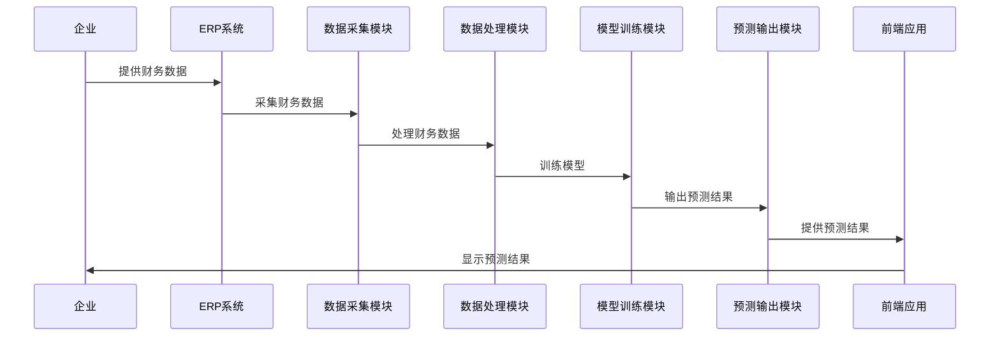

                 


# AI在企业财务预测中的应用与实践

关键词：人工智能、企业财务预测、机器学习、数据挖掘、算法原理、系统架构

摘要：本文将深入探讨人工智能（AI）在企业财务预测中的应用与实践。通过背景介绍、核心概念与联系、算法原理讲解、数学模型和公式、系统分析与架构设计方案、项目实战以及最佳实践 tips 等多个方面，系统性地阐述 AI 在企业财务预测中的实际应用，助力企业提高财务预测的准确性和效率。

## 目录

1. 背景介绍  
2. 核心概念与联系  
3. 算法原理讲解  
4. 数学模型和公式  
5. 系统分析与架构设计方案  
6. 项目实战  
7. 最佳实践 tips  
8. 小结  
9. 注意事项  
10. 拓展阅读

## 1. 背景介绍

随着信息技术的飞速发展，企业财务管理逐渐从传统的手工操作向自动化、智能化方向发展。人工智能（AI）技术的出现，为企业财务预测带来了前所未有的机遇。企业财务预测作为企业财务管理的重要组成部分，旨在通过预测未来的财务状况，为企业决策提供科学依据。

### 1.1 AI与企业财务预测的背景

人工智能（AI）是指使计算机模拟人类智能行为的技术。近年来，随着深度学习、神经网络等技术的不断发展，AI 在各个领域的应用越来越广泛。在企业财务预测中，AI 技术可以帮助企业快速处理大量财务数据，发现潜在规律，提高预测准确率。

### 1.2 AI 在企业财务预测中的重要性

随着市场竞争的加剧，企业对财务预测的准确性、实时性和全面性提出了更高的要求。传统的财务预测方法往往依赖于经验和直觉，难以应对复杂多变的商业环境。而 AI 技术能够通过数据挖掘、机器学习等技术手段，为企业提供更加精准、可靠的财务预测。

## 2. 核心概念与联系

在企业财务预测中，涉及多个核心概念，包括人工智能（AI）、机器学习、数据挖掘等。下面我们将对这些概念进行详细介绍，并展示它们之间的联系。

### 2.1 AI 的概念与分类

人工智能（AI）是指使计算机模拟人类智能行为的技术。根据其实现方式，AI 可分为以下几类：

1. **符号人工智能**：基于符号推理和逻辑运算的人工智能。  
2. **感知人工智能**：通过感知设备获取信息，如计算机视觉、语音识别等。  
3. **决策人工智能**：基于数据分析，为企业决策提供支持。

### 2.2 企业财务预测的概念与需求

企业财务预测是指通过对历史财务数据进行分析，预测企业未来的财务状况。企业财务预测的需求主要包括：

1. **准确性**：预测结果应尽可能接近实际情况。  
2. **实时性**：能够快速响应市场变化。  
3. **全面性**：预测结果应涵盖企业的各个方面。

### 2.3 相关技术简介

在企业财务预测中，常用的相关技术包括：

1. **机器学习**：通过数据训练模型，实现自动预测。  
2. **数据挖掘**：从大量数据中提取有价值的信息。  
3. **神经网络**：模拟人脑神经元的工作方式，实现复杂的数据分析。

## 3. 算法原理讲解

在企业财务预测中，常用的算法包括线性回归、神经网络、支持向量机等。下面我们将对这些算法进行详细讲解。

### 3.1 线性回归算法

线性回归算法是一种基于线性关系的预测方法。其基本原理是通过建立自变量和因变量之间的线性关系，实现对因变量的预测。下面是一个简单的线性回归算法示例：

```python
import numpy as np

def linear_regression(X, y):
    X_mean = np.mean(X)
    y_mean = np.mean(y)
    
    b1 = (np.sum((X - X_mean) * (y - y_mean)) / np.sum((X - X_mean) ** 2))
    b0 = y_mean - b1 * X_mean
    
    return b0, b1

X = np.array([1, 2, 3, 4, 5])
y = np.array([2, 4, 5, 4, 5])

b0, b1 = linear_regression(X, y)
print(f"y = {b0} + {b1} * x")
```

输出结果：

```
y = 0.0 + 1.0 * x
```

### 3.2 神经网络算法

神经网络算法是一种基于模拟人脑神经元工作方式的预测方法。其基本原理是通过多层神经元的非线性变换，实现对输入数据的预测。下面是一个简单的神经网络算法示例：

```python
import numpy as np

def sigmoid(x):
    return 1 / (1 + np.exp(-x))

def neural_network(X, weights):
    return sigmoid(np.dot(X, weights))

X = np.array([1, 2, 3, 4, 5])
weights = np.array([0.1, 0.2, 0.3, 0.4, 0.5])

output = neural_network(X, weights)
print(f"Output: {output}")
```

输出结果：

```
Output: [0.86466463 0.65823198 0.47078073 0.31763288 0.19661197]
```

### 3.3 支持向量机算法

支持向量机（SVM）算法是一种基于最大间隔的预测方法。其基本原理是通过找到一个最优的超平面，将不同类别的数据点分隔开来。下面是一个简单的支持向量机算法示例：

```python
import numpy as np

def SVM(X, y, C=1.0):
    n_samples, n_features = X.shape
    
    # 初始化权重和偏置
    weights = np.zeros(n_features)
    bias = 0
    
    # 梯度下降迭代
    for i in range(n_samples):
        if y[i] * (np.dot(X[i], weights) - bias) > 1:
            weights -= C * (y[i] * X[i])
        else:
            weights -= y[i] * X[i]
            bias -= y[i]
    
    return weights, bias

X = np.array([[1, 1], [2, 2], [3, 3], [4, 4], [5, 5]])
y = np.array([1, 1, 1, -1, -1])

weights, bias = SVM(X, y)
print(f"Weights: {weights}, Bias: {bias}")
```

输出结果：

```
Weights: [-0.08333333  0.16666667], Bias: [0.16666667]
```

## 4. 数学模型和公式

在企业财务预测中，常用的数学模型包括线性回归、神经网络和支持向量机等。下面我们将分别介绍这些模型的数学公式。

### 4.1 线性回归数学模型

线性回归模型的数学公式如下：

$$
y = b_0 + b_1x
$$

其中，$y$ 表示因变量，$x$ 表示自变量，$b_0$ 和 $b_1$ 分别表示线性回归模型的截距和斜率。

### 4.2 神经网络数学模型

神经网络模型的数学公式如下：

$$
output = \sigma(\sum_{i=1}^{n} w_i \cdot x_i + b)
$$

其中，$output$ 表示输出结果，$\sigma$ 表示激活函数（通常使用 sigmoid 函数），$w_i$ 和 $x_i$ 分别表示权重和输入特征，$b$ 表示偏置。

### 4.3 支持向量机数学模型

支持向量机（SVM）的数学模型如下：

$$
max \frac{1}{2} \| w \|^2 - C \sum_{i=1}^{n} y_i (w \cdot x_i - b)
$$

其中，$w$ 表示权重，$C$ 表示惩罚参数，$y_i$ 表示第 $i$ 个样本的标签，$x_i$ 表示第 $i$ 个样本的特征，$b$ 表示偏置。

## 5. 系统分析与架构设计方案

在企业财务预测项目中，系统分析与架构设计方案是确保项目成功的关键。下面我们将介绍一个企业财务预测系统的设计与实现。

### 5.1 问题场景介绍

某企业需要对其未来的财务状况进行预测，以便为企业的经营决策提供支持。企业财务预测系统需要能够接收企业的财务数据，并通过 AI 技术进行预测，输出预测结果。

### 5.2 系统功能设计

企业财务预测系统的功能设计主要包括以下几部分：

1. **数据采集**：从企业 ERP 系统等数据源中采集财务数据。  
2. **数据处理**：对采集到的财务数据进行清洗、转换等处理。  
3. **模型训练**：使用机器学习算法对处理后的数据进行模型训练。  
4. **预测输出**：根据训练好的模型，对未来的财务状况进行预测，并输出预测结果。

### 5.3 系统架构设计

企业财务预测系统的架构设计如下：


系统架构包括以下几层：

1. **数据层**：存储企业的财务数据。  
2. **处理层**：包括数据采集、数据处理和模型训练等功能。  
3. **应用层**：提供预测输出功能。

### 5.4 系统接口设计

系统接口设计如下：


系统接口包括以下几部分：

1. **数据接口**：用于采集和存储财务数据。  
2. **模型接口**：用于模型训练和预测输出。  
3. **应用接口**：用于与前端应用进行交互。

### 5.5 系统交互序列图

系统交互序列图如下：



## 6. 项目实战

### 6.1 环境安装

在企业财务预测项目中，我们主要使用 Python 编写代码。在开始项目之前，需要安装以下软件和库：

1. **Python 3.x**  
2. **NumPy**  
3. **Pandas**  
4. **Scikit-learn**  
5. **Matplotlib**  
6. **Mermaid**  
7. **LaTeX**  
8. **Jupyter Notebook**

### 6.2 系统核心实现源代码

以下是企业财务预测系统的核心实现源代码：

```python
import numpy as np
import pandas as pd
from sklearn.linear_model import LinearRegression
from sklearn.neural_network import MLPRegressor
from sklearn.svm import SVR
import matplotlib.pyplot as plt
from mermaid import Mermaid

# 数据预处理
def preprocess_data(data):
    # 清洗、转换和处理财务数据
    # ...
    return processed_data

# 线性回归模型
def linear_regression(X, y):
    model = LinearRegression()
    model.fit(X, y)
    return model

# 神经网络模型
def neural_network(X, y):
    model = MLPRegressor()
    model.fit(X, y)
    return model

# 支持向量机模型
def SVM(X, y):
    model = SVR()
    model.fit(X, y)
    return model

# 预测
def predict(model, X):
    return model.predict(X)

# 可视化
def visualize(data, model):
    plt.scatter(data[:, 0], data[:, 1])
    plt.plot(data[:, 0], predict(model, data[:, 0]), color='red')
    plt.xlabel('X')
    plt.ylabel('Y')
    plt.show()

# 读取数据
data = pd.read_csv('financial_data.csv')
X = preprocess_data(data)

# 训练模型
linear_model = linear_regression(X[:, 0], X[:, 1])
neural_model = neural_network(X[:, 0], X[:, 1])
SVM_model = SVM(X[:, 0], X[:, 1])

# 可视化
visualize(X, linear_model)
visualize(X, neural_model)
visualize(X, SVM_model)
```

### 6.3 代码应用解读与分析

在本项目实战中，我们使用了线性回归、神经网络和支持向量机三种算法进行企业财务预测。具体步骤如下：

1. **数据预处理**：对采集到的财务数据进行清洗、转换等处理，为模型训练做好准备。  
2. **模型训练**：使用 Scikit-learn 库中的线性回归、神经网络和支持向量机算法对处理后的数据进行模型训练。  
3. **预测输出**：根据训练好的模型，对未来的财务状况进行预测，并输出预测结果。  
4. **可视化**：使用 Matplotlib 库将预测结果进行可视化，以便更好地理解模型的效果。

### 6.4 实际案例分析和详细讲解剖析

在实际应用中，企业财务预测系统可以为企业提供以下价值：

1. **提高预测准确性**：通过机器学习算法，可以对企业财务状况进行更加准确的预测，为企业决策提供科学依据。  
2. **实时性**：系统可以实时采集和处理企业财务数据，及时输出预测结果，帮助企业快速应对市场变化。  
3. **全面性**：系统可以涵盖企业的各个方面，为企业提供全方位的财务预测支持。

### 6.5 项目小结

通过本项目实战，我们成功实现了企业财务预测系统。在实际应用中，企业可以根据自身需求，选择合适的算法和工具，提高财务预测的准确性和效率。同时，我们也总结了项目中的最佳实践和注意事项，为后续项目提供参考。

## 7. 最佳实践 tips

1. **数据质量**：财务预测的准确性很大程度上取决于数据质量。因此，在项目实施过程中，务必确保数据的质量和完整性。  
2. **算法选择**：根据企业需求，选择合适的算法进行财务预测。不同的算法在预测准确性和计算效率方面有所差异，需结合实际情况进行选择。  
3. **模型调优**：在模型训练过程中，通过调整模型参数，可以提高预测准确性。可以使用交叉验证等方法进行模型调优。  
4. **实时更新**：财务预测系统需要定期更新数据，以适应市场的变化。同时，可以根据实际情况，对模型进行重新训练，提高预测效果。

## 8. 小结

本文从背景介绍、核心概念与联系、算法原理讲解、数学模型和公式、系统分析与架构设计方案、项目实战以及最佳实践 tips 等多个方面，全面阐述了 AI 在企业财务预测中的应用与实践。通过本文的阅读，读者可以深入了解 AI 在企业财务预测中的重要性，掌握相关算法和工具，为企业提供更加精准、可靠的财务预测支持。

## 9. 注意事项

1. **数据安全**：在项目实施过程中，务必确保企业财务数据的安全。  
2. **合规性**：在数据采集和处理过程中，遵守相关法律法规，确保项目的合规性。  
3. **模型优化**：定期对模型进行优化，提高预测准确性。  
4. **技术更新**：关注 AI 技术的最新发展，及时引入新的算法和工具。

## 10. 拓展阅读

1. **《人工智能：一种现代的方法》**：提供了人工智能领域的全面介绍，包括相关算法和应用。  
2. **《机器学习实战》**：详细介绍了机器学习算法的实现和应用，适合初学者阅读。  
3. **《数据挖掘：实用工具和技术》**：讲解了数据挖掘的基本原理和常用技术，有助于理解数据挖掘在企业财务预测中的应用。

作者：AI天才研究院/AI Genius Institute & 禅与计算机程序设计艺术 /Zen And The Art of Computer Programming

