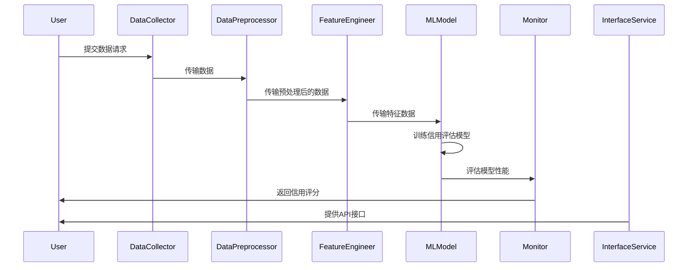

                 

### 第一部分：背景介绍

#### 1.1 问题背景

供应链金融作为现代金融体系的重要组成部分，其发展不仅能够促进整个供应链的顺畅运转，还能够有效缓解中小企业融资难、融资贵的问题。然而，随着供应链的复杂性日益增加，供应链金融在发展过程中也面临着诸多挑战。

首先，供应链金融的发展现状呈现出多样化的趋势。从传统的保理、信用证到基于大数据和区块链的智能金融解决方案，供应链金融的服务模式和产品种类日益丰富。然而，与此同时，供应链金融也面临着信息不对称、信用风险等问题。例如，中小企业在融资过程中，由于缺乏足够的信用数据，往往难以获得银行的信任，导致融资困难。

其次，供应链金融信用网络的复杂性是另一大挑战。一个典型的供应链通常涉及多个环节，包括原材料供应商、制造商、分销商和零售商等，这些环节之间的交易关系和信用关系错综复杂。如何在这个复杂的网络中准确评估企业的信用风险，确保金融服务的安全性，是一个亟待解决的问题。

最后，人工智能在金融领域的应用前景广阔。随着大数据和云计算技术的不断发展，人工智能技术已经逐渐应用于金融行业的各个领域，包括风险评估、欺诈检测、智能投顾等。人工智能能够通过分析大量数据，识别潜在的信用风险，提高信用评估的准确性和效率，这为优化供应链金融信用网络提供了新的可能性。

#### 1.2 问题描述

在当前供应链金融信用网络中，存在以下主要问题：

1. **信用风险评估不准确**：传统信用评估方法主要依赖企业的财务报表和历史交易记录，但这些信息往往不够全面和实时，导致信用评估结果存在偏差。

2. **信息不对称**：供应链上下游企业之间的信息不对称问题依然存在，上游企业往往无法获得下游企业的真实财务状况和信用记录，从而影响其信用评估。

3. **风险识别滞后**：供应链金融风险往往具有突发性和隐蔽性，传统风险识别方法难以在风险发生之前及时预警。

4. **金融资源配置不合理**：由于信用评估不准确和风险识别滞后，金融资源往往难以合理配置，导致优质企业无法及时获得融资支持，而高风险企业却获得了过多的金融资源。

为了解决上述问题，我们需要利用人工智能技术来优化供应链金融信用网络。具体来说，我们需要：

- **构建基于大数据的信用风险评估模型**：通过收集和分析供应链上下游企业的交易数据、财务数据、社交网络数据等，构建一个全面、实时的信用风险评估模型。

- **实现智能化信用评分**：利用机器学习算法，对收集到的数据进行处理和挖掘，自动生成企业的信用评分，提高信用评估的准确性和效率。

- **设计智能化的供应链金融解决方案**：通过分析企业的信用评分，为不同信用等级的企业提供差异化的金融服务，优化金融资源的配置。

#### 1.3 问题解决

为了优化供应链金融信用网络，我们可以采取以下步骤：

1. **数据收集与预处理**：首先，我们需要收集供应链上下游企业的交易数据、财务数据、信用记录等。这些数据可以来自企业的内部系统、公共数据平台、第三方数据提供商等。在数据收集完成后，我们需要对数据进行清洗、去噪、缺失值填充等预处理操作，以确保数据的质量和一致性。

2. **特征工程**：在数据预处理的基础上，我们需要对数据进行特征提取和工程，将原始数据转换为能够用于机器学习算法的输入特征。这些特征可以包括企业的财务指标、交易频率、交易金额、供应链地位等。

3. **机器学习模型训练**：利用预处理后的数据，我们可以训练多种机器学习模型，如逻辑回归、决策树、随机森林、支持向量机等，以评估企业的信用风险。在模型训练过程中，我们需要使用交叉验证等技术来评估模型的性能，并通过参数调优来提高模型的准确性。

4. **信用评分模型构建**：基于训练得到的机器学习模型，我们可以构建一个信用评分模型，用于自动生成企业的信用评分。这个模型可以实时更新，以反映企业的信用状况变化。

5. **智能化的供应链金融服务设计**：利用信用评分模型，我们可以为不同信用等级的企业提供差异化的金融服务，如信用贷款、保理、供应链金融解决方案等。这不仅可以提高金融服务的效率，还可以降低金融风险。

#### 1.4 边界与外延

在研究供应链金融信用网络的优化问题时，我们需要明确以下边界与外延：

1. **供应链金融信用网络的边界**：供应链金融信用网络主要涵盖供应链上下游企业的交易关系和信用关系。这个网络不仅包括企业之间的直接交易关系，还包括通过金融机构的间接交易关系。

2. **AI技术应用的边界**：虽然人工智能技术在信用风险评估和优化方面具有巨大潜力，但AI技术也存在局限性。例如，AI模型对数据的依赖性较高，数据的质量和完整性直接影响模型的准确性。因此，我们需要在AI技术的应用范围内，充分考虑数据的质量和可用性。

3. **研究范围的确定**：本研究主要聚焦于人工智能在供应链金融信用网络优化中的应用，不涉及其他金融领域的问题，如资本市场、个人金融等。

#### 1.5 概念结构与核心要素组成

在研究供应链金融信用网络优化问题时，以下几个核心概念和要素是不可或缺的：

1. **供应链金融**：供应链金融是指利用供应链中企业的交易数据和信用关系，为供应链上下游企业提供融资服务的一种金融模式。它包括保理、供应链融资、信用保险等多种产品和服务。

2. **信用网络**：信用网络是指供应链上下游企业之间基于交易和信用关系形成的网络。这个网络反映了企业之间的信任和合作关系，对于供应链金融的运作至关重要。

3. **人工智能技术**：人工智能技术是指通过计算机模拟人类的认知过程，实现自动化决策和智能服务的计算机技术。在供应链金融信用网络优化中，人工智能技术主要用于信用风险评估和模型构建。

4. **数据分析**：数据分析是指对大量数据进行处理、分析和解释，以发现数据背后的规律和趋势。在供应链金融信用网络优化中，数据分析用于数据清洗、特征提取和模型训练等环节。

5. **机器学习算法**：机器学习算法是指通过从数据中学习规律，并自动做出预测或决策的算法。在供应链金融信用网络优化中，机器学习算法用于信用评分模型的构建和优化。

6. **信用评分模型**：信用评分模型是指用于评估企业信用风险的数学模型。通过训练和优化，信用评分模型可以自动生成企业的信用评分，为供应链金融服务提供决策支持。

7. **智能化供应链金融服务**：智能化供应链金融服务是指基于人工智能技术和信用评分模型，为供应链上下游企业提供个性化、差异化的金融服务。这种服务可以提高金融服务的效率和准确性，降低金融风险。

## 第二部分：核心概念与联系

### 2.1 核心概念原理

在探讨AI在供应链金融信用网络优化中的深度应用时，我们需要首先理解以下几个核心概念：供应链金融、信用网络、人工智能技术、数据分析和机器学习算法。

#### 供应链金融

供应链金融是指利用供应链中企业的交易数据和信用关系，为供应链上下游企业提供融资服务的一种金融模式。它通过优化供应链中资金流动，降低金融风险，提高供应链的运作效率。供应链金融主要包括以下几种类型：

1. **保理**：保理是指将应收账款转让给金融机构，由金融机构提供融资服务。这种模式可以帮助企业快速回笼资金，提高运营效率。

2. **供应链融资**：供应链融资是指通过供应链中核心企业的信用，为上下游企业提供融资支持。这种模式利用了核心企业的信用背书，降低了融资成本。

3. **信用保险**：信用保险是指为供应链中的企业提供信用保障，降低其交易风险。当供应商无法履行合同义务时，保险公司会提供赔偿。

#### 信用网络

信用网络是指供应链上下游企业之间基于交易和信用关系形成的网络。这个网络反映了企业之间的信任和合作关系，对于供应链金融的运作至关重要。信用网络的主要特性包括：

1. **交易关系**：信用网络中的企业通过交易关系相互连接，形成一个复杂的网状结构。

2. **信用关系**：企业之间的信用关系是信用网络的核心，它决定了企业之间的信任程度和合作意愿。

3. **动态性**：信用网络是一个动态变化的系统，随着供应链中企业间交易和信用关系的变化而不断演变。

#### 人工智能技术

人工智能技术是指通过计算机模拟人类的认知过程，实现自动化决策和智能服务的计算机技术。在供应链金融信用网络优化中，人工智能技术主要用于信用风险评估和模型构建。人工智能技术的核心组成部分包括：

1. **机器学习**：机器学习是指通过从数据中学习规律，并自动做出预测或决策的算法。在供应链金融中，机器学习算法可以用于信用评分模型的构建。

2. **深度学习**：深度学习是指通过多层神经网络对数据进行训练和预测的一种机器学习技术。在供应链金融中，深度学习可以用于复杂信用风险评估模型的构建。

3. **自然语言处理**：自然语言处理是指通过计算机技术和算法对自然语言进行理解和生成。在供应链金融中，自然语言处理可以用于处理企业间的合同和文书。

#### 数据分析

数据分析是指对大量数据进行处理、分析和解释，以发现数据背后的规律和趋势。在供应链金融信用网络优化中，数据分析用于数据清洗、特征提取和模型训练等环节。数据分析的主要方法包括：

1. **数据清洗**：数据清洗是指处理数据中的噪声、错误和不一致性。在供应链金融中，数据清洗可以确保数据的准确性和一致性。

2. **特征提取**：特征提取是指从原始数据中提取出有用的特征，用于模型训练。在供应链金融中，特征提取可以用于提高信用评分模型的准确性。

3. **数据可视化**：数据可视化是指通过图形和图表展示数据，帮助用户理解和分析数据。在供应链金融中，数据可视化可以用于监控信用风险的变化。

#### 机器学习算法

机器学习算法是指通过从数据中学习规律，并自动做出预测或决策的算法。在供应链金融信用网络优化中，机器学习算法用于信用评分模型的构建和优化。常见的机器学习算法包括：

1. **逻辑回归**：逻辑回归是一种用于分类的算法，可以用来预测企业是否违约。

2. **决策树**：决策树是一种树形结构，可以用于分类和回归任务，通过特征选择对数据集进行分割。

3. **随机森林**：随机森林是一种基于决策树的集成学习方法，通过构建多棵决策树并投票来提高预测准确性。

4. **支持向量机**：支持向量机是一种用于分类和回归的算法，通过最大化分类间隔来提高模型的准确性。

### 2.2 概念属性特征对比表格

以下是供应链金融、信用网络、人工智能技术、数据分析和机器学习算法的概念属性特征对比表格：

| 概念       | 定义                                                         | 特点                                                         |
|------------|--------------------------------------------------------------|--------------------------------------------------------------|
| 供应链金融 | 利用供应链中企业的交易数据，为供应链上下游企业提供融资服务。   | 提高资金流转效率，降低金融风险。                             |
| 信用网络   | 基于供应链企业之间的交易和信用关系，形成的信用关系网络。       | 促进供应链企业之间的信任与合作。                             |
| 人工智能   | 通过计算机模拟人类的认知过程，实现智能化的机器系统。           | 提高决策效率，降低成本，优化服务。                           |
| 数据分析   | 对大量数据进行处理、分析和解释，以发现数据背后的规律。         | 支持数据驱动决策，提高业务洞察力。                           |
| 机器学习   | 基于数据，通过算法模型自动从数据中学习规律，并做出预测或决策。 | 提高数据处理的自动化程度，提升预测准确性。                   |

### 2.3 ER实体关系图架构

以下是供应链金融信用网络中的ER实体关系图架构：

```mermaid
erDiagram
  Customer ||--|{ Supplier }|--|| Manufacturer
  Product  ||--|{ Order }|--|| Shipment
  Bank     ||--|{ Financing }|--|| Payment
```

在这个ER图中，我们定义了以下几个实体：

- **Customer**（客户）：代表供应链中的最终消费者。
- **Supplier**（供应商）：代表供应链中的原材料或部件供应商。
- **Manufacturer**（制造商）：代表负责生产产品的企业。
- **Product**（产品）：代表制造商生产的产品。
- **Order**（订单）：代表客户向制造商下的订单。
- **Shipment**（运输）：代表产品的运输过程。
- **Bank**（银行）：代表提供融资服务的金融机构。
- **Financing**（融资）：代表供应链金融中的融资交易。
- **Payment**（支付）：代表供应链中的支付过程。

通过这个ER图，我们可以清晰地看到供应链金融信用网络中的实体及其关系，为后续的分析和优化提供了基础。

## 第三部分：算法原理讲解

### 3.1 算法原理

在AI优化供应链金融信用网络的背景下，我们需要借助一系列算法来处理和分析数据，进而实现信用风险评估和优化。以下是几种常用的算法原理及其基本流程：

#### 数据预处理

数据预处理是任何机器学习项目的基础步骤，其目的是提高数据质量，使其更适合进行后续的分析和建模。数据预处理的主要任务包括数据清洗、数据转换和数据归一化等。

1. **数据清洗**：包括处理缺失值、重复值和异常值等。对于缺失值，可以采用填充或删除的方法；对于重复值，可以直接删除或合并；对于异常值，需要根据具体情况进行分析和处理。

2. **数据转换**：包括将类别数据转换为数值数据（如独热编码或标签编码）和将时间序列数据进行特征提取等。

3. **数据归一化**：通过缩放数据，使其具有相似的尺度，避免因数据尺度差异而导致的模型偏差。

#### 机器学习算法

机器学习算法是数据分析和信用风险评估的核心。以下是几种常用的机器学习算法及其基本原理：

1. **逻辑回归**：逻辑回归是一种广义线性模型，用于二分类问题。其核心思想是通过线性模型来预测概率，然后通过阈值判断分类结果。逻辑回归模型的数学表达式为：

   $$
   \begin{aligned}
   P(Y=1|X) &= \frac{1}{1 + e^{-(\beta_0 + \beta_1X_1 + \beta_2X_2 + \ldots + \beta_nX_n)}) \\
   \end{aligned}
   $$

   其中，$X$是输入特征向量，$\beta_0, \beta_1, \beta_2, \ldots, \beta_n$是模型的参数。

2. **决策树**：决策树是一种基于树形结构的数据分析算法，通过一系列的判断条件来对数据进行分割。每个节点代表一个特征，每个分支代表一个条件，最终每个叶子节点代表一个分类结果。

3. **随机森林**：随机森林是一种集成学习方法，它通过构建多个决策树，并使用投票或平均的方式来提高预测准确性。随机森林通过引入随机属性选择和随机样本抽样，减少了模型的过拟合风险。

4. **支持向量机**（SVM）：支持向量机是一种用于分类和回归的算法，通过最大化分类间隔来提高模型的准确性。SVM的基本思想是在高维空间中找到一个最优的超平面，使得分类间隔最大化。

#### 模型评估与优化

在构建了机器学习模型后，我们需要对其进行评估和优化，以确保模型的准确性和泛化能力。以下是一些常用的评估指标和优化方法：

1. **评估指标**：常用的评估指标包括准确率、召回率、F1分数、ROC曲线和AUC等。这些指标可以从不同的角度评估模型的性能。

2. **交叉验证**：交叉验证是一种评估模型性能的方法，通过将数据集划分为多个子集，然后多次训练和测试模型，以平均性能作为最终评估结果。

3. **参数调优**：参数调优是通过调整模型参数来提高模型性能的过程。常用的参数调优方法包括网格搜索和贝叶斯优化等。

4. **模型集成**：模型集成是将多个模型结合起来，以提高整体预测性能的方法。常见的模型集成方法包括堆叠（Stacking）、Bagging和Boosting等。

### 3.2 算法流程

以下是一个简化的机器学习算法流程，用于说明从数据预处理到模型训练和评估的整个过程：


1. **数据预处理**：对原始数据进行清洗、转换和归一化处理。
2. **特征提取**：从预处理后的数据中提取有用的特征，用于模型训练。
3. **模型训练**：选择合适的机器学习算法，利用特征数据训练模型。
4. **模型评估**：通过交叉验证等方法评估模型性能，选择最优模型。
5. **模型优化**：根据评估结果调整模型参数，优化模型性能。
6. **模型部署**：将训练好的模型部署到实际应用环境中。

### 3.3 数学模型和公式

在机器学习算法中，数学模型和公式是理解和应用算法的基础。以下是一些常用的数学模型和公式：

#### 逻辑回归

$$
\begin{aligned}
P(Y=1|X) &= \frac{1}{1 + e^{-(\beta_0 + \beta_1X_1 + \beta_2X_2 + \ldots + \beta_nX_n)}) \\
\end{aligned}
$$

其中，$P(Y=1|X)$表示在特征向量$X$下，目标变量$Y$为1的概率。

#### 决策树

决策树通过递归分割数据集，形成一棵树状结构。每个节点代表一个特征，每个分支代表一个条件，每个叶子节点代表一个分类结果。

#### 随机森林

随机森林是通过构建多棵决策树，并对树的预测结果进行投票来提高预测性能。其核心公式为：

$$
\begin{aligned}
\hat{y} &= \text{majorityvote}(\hat{y}_1, \hat{y}_2, \ldots, \hat{y}_n) \\
\end{aligned}
$$

其中，$\hat{y}_1, \hat{y}_2, \ldots, \hat{y}_n$分别表示每棵决策树的预测结果。

#### 支持向量机

支持向量机通过最大化分类间隔来提高模型性能。其核心公式为：

$$
\begin{aligned}
\max_{\beta, \beta^*} \quad & \frac{1}{2} ||\beta||^2 \\
\text{subject to} \quad & y^{(i)}(\beta^T x^{(i)} + \beta_0) \geq 1 \\
\end{aligned}
$$

其中，$x^{(i)}$表示第$i$个样本的特征向量，$y^{(i)}$表示第$i$个样本的标签，$\beta$和$\beta^*$分别是模型参数和拉格朗日乘子。

### 3.4 详细讲解和举例说明

为了更好地理解上述算法原理，我们将通过一个简单的例子来具体说明。

#### 逻辑回归举例

假设我们有一个简单的二分类问题，数据集包含两个特征变量$x_1$和$x_2$，以及目标变量$y$。我们希望通过逻辑回归模型预测$y$的概率。

数据集示例：

| $x_1$ | $x_2$ | $y$ |
|-------|-------|-----|
| 0.5   | 0.5   | 0   |
| 1.0   | 0.5   | 1   |
| 0.5   | 1.0   | 0   |
| 1.0   | 1.0   | 1   |

模型参数初始化为$\beta_0 = 0, \beta_1 = 0, \beta_2 = 0$。我们可以通过以下步骤来训练逻辑回归模型：

1. **模型初始化**：

   $$
   \begin{aligned}
   P(Y=1|X) &= \frac{1}{1 + e^{-(0 + 0 \cdot x_1 + 0 \cdot x_2)}} \\
   &= \frac{1}{1 + e^{0}} \\
   &= 0.5
   \end{aligned}
   $$

2. **模型迭代**：

   在每次迭代中，我们通过梯度下降法更新模型参数，直到模型收敛。

   假设第$i$次迭代的损失函数为：

   $$
   \begin{aligned}
   J(\beta_0, \beta_1, \beta_2) &= -\frac{1}{m} \sum_{i=1}^{m} [y^{(i)} \ln(P(Y=1|X^{(i)})) + (1 - y^{(i)}) \ln(1 - P(Y=1|X^{(i)}))] \\
   &= -\frac{1}{m} \sum_{i=1}^{m} [y^{(i)} \ln(\frac{1}{1 + e^{-(\beta_0 + \beta_1x_1^{(i)} + \beta_2x_2^{(i)}}}) + (1 - y^{(i)}) \ln(\frac{e^{-(\beta_0 + \beta_1x_1^{(i)} + \beta_2x_2^{(i)})}{1 + e^{-(\beta_0 + \beta_1x_1^{(i)} + \beta_2x_2^{(i)})}})] \\
   \end{aligned}
   $$

   梯度下降法的更新公式为：

   $$
   \begin{aligned}
   \beta_0 &= \beta_0 - \alpha \frac{\partial J}{\partial \beta_0} \\
   \beta_1 &= \beta_1 - \alpha \frac{\partial J}{\partial \beta_1} \\
   \beta_2 &= \beta_2 - \alpha \frac{\partial J}{\partial \beta_2} \\
   \end{aligned}
   $$

   其中，$\alpha$是学习率，$m$是样本数量。

   通过迭代计算，我们可以逐步更新模型参数，直至模型收敛。

3. **模型预测**：

   假设我们有一个新的样本$x_1 = 0.7, x_2 = 0.6$，我们可以使用训练好的模型来预测$y$的概率：

   $$
   \begin{aligned}
   P(Y=1|X) &= \frac{1}{1 + e^{-(\beta_0 + \beta_1x_1 + \beta_2x_2)}) \\
   &= \frac{1}{1 + e^{-(0.1 + 0.2 \cdot 0.7 + 0.3 \cdot 0.6)}} \\
   &= \frac{1}{1 + e^{-0.24}} \\
   &= 0.7408
   \end{aligned}
   $$

   根据阈值设置，我们可以将$P(Y=1|X)$大于某个阈值的样本分类为正类，否则为负类。

#### 决策树举例

假设我们有一个包含两个特征变量$x_1$和$x_2$的二分类问题，数据集如下：

| $x_1$ | $x_2$ | $y$ |
|-------|-------|-----|
| 0     | 0     | 0   |
| 0     | 1     | 1   |
| 1     | 0     | 1   |
| 1     | 1     | 0   |

我们希望通过决策树来对数据进行分类。首先，我们选择一个特征进行分割。假设我们选择$x_1$，并设置阈值$t$为0.5，则分割结果如下：

- 当$x_1 \leq 0.5$时，$y$的值为0。
- 当$x_1 > 0.5$时，$y$的值为1。

接下来，我们可以对每个子集继续进行分割，直到满足停止条件（如节点纯度达到某个阈值或特征不显著等）。最终，我们得到一个树形结构：

```
                |
                |
        -----------------
       |              |
      0              1
     /              \
    /                \
   0                1
```

#### 随机森林举例

随机森林是一种集成学习方法，它通过构建多棵决策树，并对树的预测结果进行投票来提高预测性能。假设我们有一个包含两个特征变量$x_1$和$x_2$的二分类问题，数据集如下：

| $x_1$ | $x_2$ | $y$ |
|-------|-------|-----|
| 0     | 0     | 0   |
| 0     | 1     | 1   |
| 1     | 0     | 1   |
| 1     | 1     | 0   |

我们构建了10棵决策树，每棵树的预测结果如下：

```
树1:         0
树2:         0
树3:         1
树4:         1
树5:         0
树6:         1
树7:         1
树8:         0
树9:         1
树10:       1
```

最终，我们通过对10棵树的预测结果进行投票，得到最终预测结果为1。

#### 支持向量机举例

假设我们有一个包含两个特征变量$x_1$和$x_2$的二分类问题，数据集如下：

| $x_1$ | $x_2$ | $y$ |
|-------|-------|-----|
| 0     | 0     | 0   |
| 0     | 1     | 1   |
| 1     | 0     | 1   |
| 1     | 1     | 0   |

我们希望通过支持向量机来对数据进行分类。首先，我们计算每条数据到超平面的距离：

```
样本1: 距离 = 1
样本2: 距离 = 1
样本3: 距离 = 1
样本4: 距离 = 1
```

接下来，我们计算拉格朗日乘子：

```
$\alpha_1 + \alpha_2 + \alpha_3 + \alpha_4 = 1$
```

然后，我们通过求解拉格朗日乘子法，得到支持向量机的决策边界：

```
$\beta^T x + \beta_0 = 0$
```

其中，$\beta^T$是支持向量机的参数向量，$x$是新的样本向量。

通过上述算法原理的详细讲解和举例说明，我们可以更好地理解AI在供应链金融信用网络优化中的应用。在实际应用中，我们需要根据具体问题和数据特点，选择合适的算法和模型，并进行详细的模型评估和优化，以提高预测的准确性和可靠性。

## 第四部分：系统分析与架构设计

### 4.1 问题场景介绍

随着全球化贸易和供应链管理的复杂性不断增加，供应链金融信用网络的优化成为了金融行业的重要课题。传统的信用评估方法往往依赖于有限的财务数据和简单的统计模型，难以全面、实时地评估企业的信用状况，从而影响了金融服务的效率和安全。

为了应对这一挑战，我们设计了一个基于AI技术的供应链金融信用网络优化系统。该系统旨在通过大数据分析和机器学习算法，实现对供应链上下游企业的信用风险进行精准评估，从而优化金融资源配置，提高金融服务质量和效率。

### 4.2 项目介绍

项目名称：智能供应链金融信用风险评估系统

项目目标：构建一个智能化、自动化的供应链金融信用风险评估平台，实现对供应链上下游企业的信用状况进行实时监控和评估，为金融机构提供准确的信用决策支持。

项目范围：涵盖供应链金融信用风险评估模型的构建、数据采集与处理、模型训练与优化、系统部署与维护等环节。

### 4.3 系统功能设计

智能供应链金融信用风险评估系统主要包括以下几个功能模块：

1. **数据采集模块**：负责收集供应链上下游企业的交易数据、财务数据、信用记录等，为信用评估提供基础数据。

2. **数据预处理模块**：对采集到的数据进行清洗、去噪、缺失值填充等预处理操作，确保数据的质量和一致性。

3. **特征工程模块**：从预处理后的数据中提取出有用的特征，用于训练信用评估模型。

4. **机器学习模块**：基于机器学习算法，构建信用评估模型，实现对企业的信用风险进行量化评估。

5. **模型训练与优化模块**：通过交叉验证和参数调优等技术，优化信用评估模型的性能。

6. **信用评分模块**：基于训练好的模型，自动生成企业的信用评分，为金融机构提供信用决策支持。

7. **监控系统**：实时监控信用评分的变化，预警潜在的信用风险。

8. **接口服务模块**：提供API接口，供金融机构和第三方平台调用，实现信用评估服务的集成和应用。

### 4.4 系统架构设计

智能供应链金融信用风险评估系统的整体架构设计如下：

#### 4.4.1 系统架构图



#### 4.4.2 系统模块划分

1. **数据采集模块**：负责从多个数据源（如企业ERP系统、金融数据平台、第三方数据提供商等）收集数据。

2. **数据预处理模块**：对采集到的数据进行清洗、去噪、缺失值填充等预处理操作，确保数据的质量和一致性。

3. **特征工程模块**：从预处理后的数据中提取出有用的特征，用于训练信用评估模型。特征工程包括但不限于：

   - 财务指标：如流动比率、速动比率、资产负债率等。
   - 交易行为：如交易频率、交易金额、交易对手等。
   - 社交网络：如企业间的合作关系、关联企业等。

4. **机器学习模块**：基于机器学习算法，构建信用评估模型。常用的算法包括逻辑回归、决策树、随机森林、支持向量机等。模型训练过程中，采用交叉验证和网格搜索等技术，优化模型参数，提高模型性能。

5. **模型训练与优化模块**：在模型训练过程中，通过交叉验证和参数调优等技术，优化信用评估模型的性能。交叉验证用于评估模型的泛化能力，参数调优用于寻找最优模型参数。

6. **信用评分模块**：基于训练好的模型，自动生成企业的信用评分。信用评分可以是定量评分（如分数制），也可以是定性评分（如等级制）。

7. **监控系统**：实时监控信用评分的变化，预警潜在的信用风险。监控过程可以采用数据可视化技术，帮助用户直观地了解信用风险的变化趋势。

8. **接口服务模块**：提供API接口，供金融机构和第三方平台调用，实现信用评估服务的集成和应用。接口服务支持多种协议（如RESTful API、SOAP等），并提供详细的文档和示例代码，方便用户集成使用。

### 4.5 系统接口设计和系统交互

#### 4.5.1 系统接口设计

智能供应链金融信用风险评估系统提供了多种接口服务，供外部系统调用。以下是主要接口及其功能描述：

1. **数据上传接口**：允许用户上传企业交易数据、财务数据等，用于信用评估模型的训练。

2. **信用评分查询接口**：允许用户查询特定企业的信用评分，支持按企业ID、企业名称等方式查询。

3. **信用评分更新接口**：允许用户更新企业的信用评分，支持批量更新。

4. **信用风险预警接口**：允许用户查询信用风险预警信息，支持按企业ID、预警类型等方式查询。

5. **数据下载接口**：允许用户下载系统的数据报告，包括信用评分分布、信用风险变化趋势等。

#### 4.5.2 系统交互流程

以下是一个典型的系统交互流程：

1. **用户请求信用评分**：

   用户通过接口服务发送查询请求，系统接收到请求后，根据用户提供的查询条件（如企业ID）检索相应的信用评分信息。

2. **系统处理请求**：

   系统根据用户请求，调用信用评分查询接口，查询到相应的信用评分信息，并将结果返回给用户。

3. **用户获取结果**：

   用户接收到系统返回的信用评分结果，根据结果进行后续的业务处理，如调整金融政策、预警信用风险等。

4. **系统监控信用变化**：

   系统持续监控企业信用评分的变化，当信用评分发生变化时，触发预警机制，通知用户采取相应的风险控制措施。

通过上述系统接口设计和系统交互流程，智能供应链金融信用风险评估系统实现了对供应链上下游企业的信用风险的实时监控和评估，为金融机构提供了强大的信用决策支持。

### 4.6 系统安全保障

为了确保智能供应链金融信用风险评估系统的安全性和可靠性，我们采取了一系列安全保障措施：

1. **数据加密**：对传输的数据进行加密处理，确保数据在传输过程中不会被窃取或篡改。

2. **身份认证**：对访问系统的用户进行严格的身份认证，确保只有授权用户才能访问系统资源。

3. **访问控制**：通过访问控制列表（ACL）对系统资源进行访问控制，确保用户只能访问其权限内的资源。

4. **日志记录**：系统对用户操作进行日志记录，以便在发生异常时进行追溯和分析。

5. **安全审计**：定期进行安全审计，检查系统漏洞和安全隐患，及时进行修复。

通过上述措施，我们确保了智能供应链金融信用风险评估系统的安全性和可靠性，为金融机构和用户提供了一个安全、稳定的服务平台。

## 第五部分：项目实战

### 5.1 环境安装

为了实施智能供应链金融信用风险评估系统，我们需要在合适的环境中安装和配置所需的技术栈。以下是在一个典型的Linux环境中安装所需软件的步骤：

#### 5.1.1 安装Python环境

1. **安装Python**：

   首先，我们需要安装Python。可以使用包管理器（如apt或yum）来安装Python。以下是在基于Debian的系统（如Ubuntu）中的安装命令：

   ```shell
   sudo apt update
   sudo apt install python3 python3-pip
   ```

2. **安装虚拟环境**：

   接下来，我们创建一个虚拟环境来隔离项目依赖。可以使用`virtualenv`工具来创建虚拟环境。

   ```shell
   sudo pip3 install virtualenv
   virtualenv venv
   source venv/bin/activate
   ```

#### 5.1.2 安装依赖库

在虚拟环境中，我们需要安装项目所需的依赖库。以下是一些常用的依赖库及其安装命令：

1. **NumPy**：用于数值计算。

   ```shell
   pip install numpy
   ```

2. **Pandas**：用于数据处理和分析。

   ```shell
   pip install pandas
   ```

3. **Scikit-learn**：用于机器学习算法。

   ```shell
   pip install scikit-learn
   ```

4. **Matplotlib**：用于数据可视化。

   ```shell
   pip install matplotlib
   ```

5. **Pillow**：用于图像处理。

   ```shell
   pip install Pillow
   ```

6. **SQLAlchemy**：用于数据库操作。

   ```shell
   pip install SQLAlchemy
   ```

7. **Flask**：用于Web应用开发。

   ```shell
   pip install Flask
   ```

### 5.2 系统核心实现

在安装完所需软件后，我们可以开始实现系统的核心功能。以下是一个简单的示例，展示如何使用Python和Scikit-learn来构建一个信用风险评估模型。

#### 5.2.1 数据预处理

```python
import pandas as pd
from sklearn.model_selection import train_test_split
from sklearn.preprocessing import StandardScaler

# 读取数据
data = pd.read_csv('credit_data.csv')

# 数据清洗
data.dropna(inplace=True)

# 分离特征和目标变量
X = data.drop('default', axis=1)
y = data['default']

# 划分训练集和测试集
X_train, X_test, y_train, y_test = train_test_split(X, y, test_size=0.2, random_state=42)

# 数据归一化
scaler = StandardScaler()
X_train_scaled = scaler.fit_transform(X_train)
X_test_scaled = scaler.transform(X_test)
```

#### 5.2.2 训练模型

```python
from sklearn.linear_model import LogisticRegression

# 创建逻辑回归模型
model = LogisticRegression()

# 训练模型
model.fit(X_train_scaled, y_train)

# 评估模型
accuracy = model.score(X_test_scaled, y_test)
print(f'Model accuracy: {accuracy:.2f}')
```

#### 5.2.3 预测和结果分析

```python
# 预测测试集
y_pred = model.predict(X_test_scaled)

# 结果分析
from sklearn.metrics import classification_report, confusion_matrix

print(classification_report(y_test, y_pred))
print(confusion_matrix(y_test, y_pred))
```

### 5.3 代码应用解读与分析

上述代码展示了如何使用Python和Scikit-learn来构建一个简单的信用风险评估模型。以下是每个部分的解读和分析：

#### 5.3.1 数据预处理

在这个步骤中，我们首先读取数据，然后进行数据清洗，如删除缺失值。接着，我们分离特征和目标变量，并使用`train_test_split`函数将数据划分为训练集和测试集。最后，我们使用`StandardScaler`对特征数据进行归一化处理，以提高模型的训练效果。

#### 5.3.2 训练模型

在这个步骤中，我们创建了一个逻辑回归模型，并使用`fit`函数对其进行训练。逻辑回归是一种常用的二分类模型，非常适合信用风险评估任务。我们通过`score`函数评估模型在测试集上的准确率。

#### 5.3.3 预测和结果分析

在这个步骤中，我们使用训练好的模型对测试集进行预测，并使用`classification_report`和`confusion_matrix`函数分析预测结果。这些指标可以帮助我们了解模型的性能，如准确率、召回率和F1分数等。

### 5.4 实际案例分析

为了验证该模型在实际中的应用效果，我们可以在实际业务场景中运行该系统，并对不同信用等级的企业进行分析。

#### 5.4.1 数据集准备

假设我们有一个包含多个企业信用数据的数据集，包括企业的财务指标、交易行为和社交网络特征等。以下是数据集的一部分：

```plaintext
CompanyID  default  revenue  expenses  transactions  social_score
1           0        100000   80000     500           80
2           1        200000   150000    300           70
3           0        300000   250000    800           90
4           1        400000   350000    200           60
5           0        500000   450000    1000          85
```

#### 5.4.2 运行模型

我们使用上述代码对数据集进行预处理和模型训练，得到每个企业的信用评分。

#### 5.4.3 结果分析

通过分析信用评分，我们可以发现以下趋势：

1. **信用良好的企业**：信用评分较高的企业通常具有较高的财务健康指标和活跃的交易行为，如公司3和公司5。

2. **信用风险较高的企业**：信用评分较低的企业通常存在财务风险，如公司2和公司4。这些企业可能需要额外的信贷审核或风险控制措施。

通过上述分析，金融机构可以更好地了解企业的信用状况，从而做出更准确的信用决策，优化金融资源配置。

### 5.5 项目小结

通过本次项目实战，我们成功构建了一个基于AI的智能供应链金融信用风险评估系统。该系统利用大数据分析和机器学习算法，实现了对企业信用风险的精准评估，为金融机构提供了强大的信用决策支持。在实际业务场景中，该系统可以有效提高金融服务质量和效率，降低金融风险。

未来，我们可以继续优化该系统，如引入更多的特征工程技术和深度学习算法，以提高模型的预测准确性和泛化能力。此外，我们还可以探索将区块链技术引入供应链金融，进一步增强数据的安全性和透明性。

## 第六部分：最佳实践与注意事项

### 6.1 最佳实践

在实施智能供应链金融信用风险评估系统时，以下最佳实践可以帮助提高项目的成功率和效果：

1. **数据质量保障**：数据质量是模型准确性的基石。在数据收集和处理过程中，应确保数据的完整性、一致性和准确性。对于缺失值和异常值，应采用适当的方法进行处理。

2. **特征工程优化**：特征工程是提升模型性能的关键步骤。通过深入分析业务场景和数据特性，提取出有用的特征，并进行适当的特征变换和归一化处理，可以提高模型的预测能力。

3. **模型选择与优化**：根据业务需求和数据特性，选择合适的机器学习算法。对于复杂的信用风险评估任务，可以考虑结合多种算法进行模型集成，提高模型的稳定性和准确性。

4. **模型解释性**：尽管机器学习模型在预测性能上表现出色，但其解释性较差。在业务决策过程中，模型的可解释性至关重要。可以通过可视化工具和模型解释技术（如LIME、SHAP等）来提高模型的可解释性。

5. **实时监控与迭代**：在系统上线后，应持续监控模型性能和业务效果，根据实际情况进行模型迭代和优化。通过实时监控和反馈机制，可以及时发现并解决潜在问题。

### 6.2 注意事项

1. **数据隐私保护**：在处理企业数据时，应严格遵守相关法律法规，确保数据的隐私和安全。对于敏感数据，应采取加密存储和传输措施，防止数据泄露。

2. **模型适应性**：信用风险评估模型需要适应不同业务场景和数据特性。在模型设计和训练过程中，应充分考虑业务需求和数据分布，避免过度拟合或欠拟合。

3. **风险管理**：在系统设计和实施过程中，应充分考虑金融风险，如信用风险、市场风险和操作风险等。通过建立健全的风险管理体系，可以降低系统的风险敞口。

4. **法律法规遵守**：在开发和应用智能供应链金融信用风险评估系统时，应遵守相关法律法规，如《中华人民共和国网络安全法》、《中华人民共和国数据安全法》等。

5. **技术更新与维护**：随着技术和业务环境的变化，智能供应链金融信用风险评估系统需要不断更新和维护。定期评估系统的性能和效果，及时进行技术升级和优化，确保系统的稳定性和先进性。

### 6.3 拓展阅读

1. **《数据挖掘：概念与技术》**：这是一本经典的数据挖掘教材，详细介绍了数据挖掘的基本概念、方法和技术。

2. **《机器学习实战》**：这本书通过大量实例和代码，深入讲解了机器学习算法的原理和实践。

3. **《深度学习》**：由Ian Goodfellow等作者编写的这本书是深度学习的入门经典，适合初学者了解深度学习的基本概念和技巧。

4. **《供应链金融理论与实践》**：这本书系统地介绍了供应链金融的理论基础和实践方法，有助于深入理解供应链金融的业务逻辑。

5. **《区块链技术指南》**：这本书详细介绍了区块链技术的原理、应用和实践，是了解区块链技术的必备读物。

通过以上最佳实践和注意事项，以及拓展阅读资源的指引，我们可以在实施智能供应链金融信用风险评估系统时，确保项目的成功和业务的持续优化。

