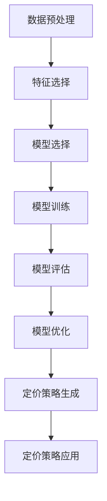

                 

### 引言

随着人工智能（AI）技术的快速发展，各行各业都在积极探索AI的应用，力求通过技术创新实现业务模式的优化和升级。保险行业作为传统金融领域的重要组成部分，自然也不例外。近年来，AI在保险产品动态定价中的创新应用逐渐成为研究热点。本文旨在系统探讨AI在保险产品动态定价中的创新应用，分析其背后的技术原理、实现方法及其带来的行业变革。

保险产品动态定价，即根据客户的风险状况、市场环境等因素，实时调整保险产品的价格，以达到优化资源配置、提升客户满意度和增强竞争力的目的。AI技术的引入，使得这一过程变得更加智能化、精准化。本文将分七个部分展开讨论：

首先，第一部分将介绍保险产品动态定价的基本概念，包括其起源、发展、优势与挑战以及关键概念。接着，第二部分将阐述AI技术的基础，涵盖机器学习的基本原理、深度学习框架与工具，以及AI在保险领域的应用现状。

在第三部分，我们将讨论数据收集与处理，详细分析保险数据类型与特点、数据收集方法以及数据预处理技术。第四部分将聚焦于AI模型构建与应用，介绍常见AI模型、模型选择与评估、模型优化与调参等关键环节。

第五部分将深入探讨动态定价策略与算法，包括动态定价策略概述、算法原理与实现、算法性能评估与优化等内容。第六部分将通过实际应用案例，展示AI在保险产品动态定价中的具体应用，如车险、寿险和健康险等。最后一部分，我们将展望AI在保险产品动态定价中的未来发展趋势，分析技术、法律法规和政策环境等方面的影响。

通过上述七个部分的深入探讨，本文旨在为读者提供一个全面、系统的了解，帮助读者把握AI在保险产品动态定价中的创新应用，并为相关领域的研究和实践提供参考。

### 关键词

- 人工智能（AI）
- 保险产品动态定价
- 机器学习
- 深度学习
- 数据收集与处理
- 动态定价策略
- 算法优化
- 保险科技（InsurTech）

### 摘要

本文系统地介绍了人工智能（AI）在保险产品动态定价中的创新应用。首先，探讨了保险产品动态定价的基本概念、起源与发展，分析了其优势与挑战。接着，阐述了AI技术的基础知识，包括机器学习的基本原理、深度学习框架与工具，以及AI在保险领域的应用现状。随后，本文详细讨论了数据收集与处理的方法，介绍了保险数据类型与特点、数据收集技术以及数据预处理技术。在AI模型构建与应用部分，本文介绍了常见AI模型、模型选择与评估、模型优化与调参等关键环节。随后，本文深入探讨了动态定价策略与算法，包括算法原理与实现、性能评估与优化等内容。通过实际应用案例，本文展示了AI在保险产品动态定价中的具体应用，如车险、寿险和健康险等。最后，本文展望了AI在保险产品动态定价中的未来发展趋势，分析了技术、法律法规和政策环境等方面的影响。本文旨在为读者提供一个全面、系统的了解，帮助读者把握AI在保险产品动态定价中的创新应用，并为相关领域的研究和实践提供参考。

## 第一部分：AI在保险产品动态定价中的基本概念

### 第1章：保险产品动态定价的背景与意义

#### 1.1 保险产品动态定价的起源与发展

保险产品动态定价的概念并不是新兴的，但其应用和发展却在近年来取得了显著的进展。动态定价最初起源于海运保险、航空保险等领域，旨在通过实时调整保险费率来反映市场风险的变化。随着信息技术的进步，动态定价逐渐扩展到车险、家财险、寿险和健康险等多个领域。

动态定价的发展可以追溯到20世纪末，随着互联网技术的普及和大数据、云计算等新兴技术的应用，保险公司能够更高效地收集、处理和分析大量数据，从而实现更加精准的定价。进入21世纪，人工智能（AI）技术的快速发展为动态定价带来了新的机遇。机器学习和深度学习算法的引入，使得保险产品定价不再仅仅依赖于历史数据和统计模型，而是能够根据实时数据和客户行为进行动态调整。

#### 1.2 动态定价的优势与挑战

动态定价在保险行业中的优势主要体现在以下几个方面：

1. **提高定价精度**：通过AI技术对大量历史数据和实时数据进行深入分析，保险公司可以更准确地评估客户的风险水平，从而制定更加合理的保费价格。

2. **优化资源配置**：动态定价能够根据市场环境和客户需求的变化，实时调整保险产品的定价策略，有助于保险公司优化资源配置，提高运营效率。

3. **提升客户满意度**：通过个性化的定价策略，保险公司能够提供更加符合客户需求的保险产品，从而提升客户满意度和忠诚度。

4. **增强竞争力**：动态定价可以帮助保险公司迅速应对市场变化，及时调整价格策略，增强在激烈市场竞争中的竞争力。

然而，动态定价也面临一些挑战：

1. **数据隐私与安全**：动态定价需要大量个人数据和敏感信息，如何在保证数据安全和隐私的前提下进行数据处理，是一个重要的问题。

2. **技术门槛**：实现动态定价需要高水平的数据分析能力和AI技术支持，对于一些中小型保险公司而言，可能面临技术门槛较高的挑战。

3. **法律与监管**：动态定价涉及到定价策略的透明度和公平性，需要遵守相关法律法规和监管要求。

#### 1.3 保险产品动态定价的关键概念

1. **动态定价模型**：动态定价模型是保险公司制定动态定价策略的核心工具，通常基于机器学习和深度学习算法，能够实时分析客户数据和市场信息，生成动态的保费价格。

2. **风险评分**：风险评分是动态定价的重要组成部分，通过对客户的风险特征进行分析和评估，生成客户的风险评分，作为制定保费价格的重要依据。

3. **保费调整策略**：保费调整策略是指根据客户的风险评分和市场环境的变化，实时调整保费价格的具体方法。

4. **数据驱动**：数据驱动是指动态定价过程高度依赖于大数据和AI技术，通过数据分析和模型预测来实现精准定价。

通过上述分析，我们可以看到，保险产品动态定价不仅具有显著的优势，同时也面临着一定的挑战。在未来的发展中，保险公司需要不断创新和优化技术，确保动态定价的可行性和有效性。

### 第2章：AI技术基础

#### 2.1 机器学习的基本原理

机器学习是人工智能（AI）的重要组成部分，其核心思想是通过算法从数据中学习规律，并基于这些规律进行预测或决策。机器学习的基本原理可以概括为以下几个步骤：

1. **数据收集**：首先，需要收集大量的数据，这些数据可以是结构化的（如数据库中的数据）或非结构化的（如图像、文本等）。

2. **数据预处理**：数据收集后，需要进行预处理，包括数据清洗、缺失值处理、数据标准化等步骤，以确保数据的质量和一致性。

3. **特征工程**：特征工程是机器学习的重要环节，通过选择和构造合适的特征，可以显著提升模型的性能。特征工程包括特征提取、特征选择、特征变换等。

4. **模型选择**：根据问题的类型和数据的特点，选择合适的机器学习模型。常见的机器学习模型包括线性回归、决策树、支持向量机（SVM）、神经网络等。

5. **训练与验证**：使用训练数据集对模型进行训练，并通过验证数据集评估模型的性能。训练过程中，模型会通过不断调整参数来优化性能。

6. **测试与评估**：使用测试数据集对模型进行测试，评估其泛化能力。常见的评估指标包括准确率、召回率、F1分数等。

7. **部署与优化**：将训练好的模型部署到实际应用环境中，并通过持续的监控和优化，确保模型的稳定性和性能。

#### 2.2 深度学习框架与工具

深度学习是机器学习的一个重要分支，其核心思想是通过多层神经网络来模拟人脑的思考方式。深度学习在图像识别、语音识别、自然语言处理等领域取得了显著的成果。以下是一些常用的深度学习框架与工具：

1. **TensorFlow**：TensorFlow是由谷歌开发的一款开源深度学习框架，具有强大的功能和灵活性，适用于各种复杂的深度学习任务。

2. **PyTorch**：PyTorch是由Facebook开发的一款开源深度学习框架，以其动态计算图和易用性著称，被广泛应用于研究和开发中。

3. **Keras**：Keras是一个高层次的深度学习框架，可以与TensorFlow和Theano等底层框架结合使用。Keras的接口简单直观，适合快速开发和实验。

4. **Caffe**：Caffe是一个深度学习框架，特别适用于卷积神经网络（CNN）的应用，如图像识别和分类。

5. **MXNet**：MXNet是由Apache Software Foundation开发的一款开源深度学习框架，具有高性能和灵活性，适用于各种深度学习任务。

#### 2.3 AI在保险领域的应用现状

AI技术在保险领域的应用已经取得了显著的进展，主要表现在以下几个方面：

1. **风险评估与定价**：通过AI技术，保险公司可以对客户的风险进行更精准的评估，从而制定更加合理的保费价格。例如，车险公司可以通过分析驾驶行为数据、车辆使用情况等，实时调整保费。

2. **客户服务与支持**：AI技术可以帮助保险公司提供更加智能的客户服务。例如，通过聊天机器人（Chatbot）和语音助手，客户可以获得即时的帮助和解答。

3. **欺诈检测**：AI技术可以帮助保险公司识别和防范保险欺诈行为。例如，通过分析客户的行为数据、索赔记录等，AI模型可以预测潜在的欺诈风险。

4. **产品推荐**：通过分析客户的购买行为、风险偏好等数据，AI技术可以推荐更加符合客户需求的保险产品，从而提升销售转化率。

5. **运营优化**：AI技术可以帮助保险公司优化运营流程，提高效率。例如，通过自动化理赔处理、智能调度等，减少人工干预，降低运营成本。

总之，AI技术在保险领域的应用不仅提升了保险产品的定价精度和服务水平，还为保险行业的创新和变革提供了新的机遇。随着技术的不断进步，未来AI在保险领域的应用将更加广泛和深入。

### 第3章：数据收集与处理

#### 3.1 保险数据类型与特点

在保险产品动态定价中，数据是至关重要的资源。保险数据主要包括以下几类：

1. **客户数据**：包括客户的个人信息、历史购买记录、理赔记录等。这些数据有助于保险公司了解客户的风险状况和需求。

2. **风险数据**：包括客户的驾驶记录、健康状况、职业等。这些数据可以反映客户面临的风险水平，对保费定价有重要影响。

3. **市场数据**：包括宏观经济指标、行业数据、市场竞争状况等。这些数据可以帮助保险公司把握市场动态，制定相应的定价策略。

4. **交易数据**：包括保险合同的签订时间、保险金额、赔付金额等。这些数据可以反映保险公司的业务运营情况。

保险数据具有以下特点：

- **多样性**：保险数据涵盖了多种类型，包括结构化和非结构化数据，如文本、图像等。

- **动态性**：保险数据随着时间不断更新，如客户的购买行为、理赔情况等。

- **大量性**：保险公司每天产生和处理的保险数据量巨大，需要高效的存储和处理能力。

- **复杂性**：保险数据中包含大量的噪声和异常值，需要复杂的数据清洗和预处理技术。

#### 3.2 数据收集方法

为了构建有效的动态定价模型，保险公司需要收集多种类型的数据。以下是一些常用的数据收集方法：

1. **内部数据收集**：保险公司可以通过内部系统收集客户数据、交易数据等。例如，通过CRM系统（客户关系管理系统）和ERP系统（企业资源计划系统）等。

2. **第三方数据购买**：保险公司可以从第三方数据提供商购买风险数据、市场数据等。例如，通过购买交通部门的驾驶记录数据、医疗机构的健康数据等。

3. **传感器数据**：对于车险等特定领域，保险公司可以通过传感器设备（如车载OBD设备）收集实时驾驶行为数据。

4. **公共数据开放平台**：保险公司可以利用公共数据开放平台获取公开的宏观经济指标、行业数据等。

5. **在线调查与问卷调查**：通过在线调查和问卷调查等方式收集客户的反馈和数据。

#### 3.3 数据预处理技术

数据预处理是动态定价模型构建的重要环节，主要包括以下几个步骤：

1. **数据清洗**：去除重复数据、缺失值填充、异常值检测与处理等。例如，使用均值填充缺失值、使用Z-Score方法检测异常值。

2. **数据标准化**：将不同特征的数据进行归一化或标准化处理，使其具有相同的尺度，从而避免数据之间的大小关系被混淆。例如，使用Min-Max标准化方法或Z-Score标准化方法。

3. **特征工程**：选择和构造合适的特征，以提高模型的性能。特征工程包括特征提取、特征选择、特征变换等。例如，使用主成分分析（PCA）进行特征降维、使用二进制编码进行特征变换。

4. **数据分割**：将数据集分割为训练集、验证集和测试集，用于模型的训练、验证和测试。常见的分割方法包括随机分割、分层抽样等。

通过上述数据预处理技术，保险公司可以确保数据的准确性和一致性，为后续的模型构建和动态定价提供可靠的数据基础。

### 第4章：AI模型构建与应用

#### 4.1 常见AI模型介绍

在保险产品动态定价中，选择合适的AI模型是实现精准定价的关键。以下介绍几种常见的AI模型：

1. **线性回归模型**：线性回归模型是最基本的机器学习模型之一，适用于简单线性关系的数据。该模型通过拟合数据点之间的线性关系来预测目标变量。线性回归模型的公式为：
   $$
   Y = \beta_0 + \beta_1X_1 + \beta_2X_2 + \ldots + \beta_nX_n
   $$
   其中，$Y$是目标变量，$X_1, X_2, \ldots, X_n$是特征变量，$\beta_0, \beta_1, \beta_2, \ldots, \beta_n$是模型的参数。

2. **决策树模型**：决策树模型通过一系列的规则来划分数据，并基于这些规则进行预测。每个节点代表一个特征，每个分支代表该特征的不同取值。决策树模型的优点是易于理解和解释，但在处理高维数据时性能较差。

3. **随机森林模型**：随机森林是由多个决策树组成的集成模型，通过随机选择特征和随机划分数据来降低过拟合现象。随机森林在处理高维数据和噪声数据时表现较好，且具有较好的预测性能。

4. **支持向量机（SVM）模型**：支持向量机是一种二分类模型，通过寻找最佳的超平面来分隔数据。SVM的核心思想是最大化分类边界上的支持向量，从而提高模型的泛化能力。SVM的公式为：
   $$
   \min_{\textbf{w}, \textbf{b}} \frac{1}{2} ||\textbf{w}||^2 + C \sum_{i=1}^{n} \max(0, 1 - y_i(\textbf{w}^T\textbf{x_i} + \textbf{b}))
   $$
   其中，$\textbf{w}$和$\textbf{b}$分别是模型的权重和偏置，$C$是正则化参数。

5. **神经网络模型**：神经网络是一种模拟人脑结构的计算模型，通过多层神经元进行信息处理。神经网络包括前向传播和反向传播两个阶段，可以通过调整权重和偏置来优化模型性能。常见的神经网络包括多层感知机（MLP）、卷积神经网络（CNN）和循环神经网络（RNN）等。

#### 4.2 模型选择与评估

选择合适的AI模型是动态定价的关键步骤，以下介绍几种常见的模型选择与评估方法：

1. **交叉验证**：交叉验证是一种评估模型性能的方法，通过将数据集分割为多个子集，轮流使用每个子集作为验证集，其余子集作为训练集，来评估模型的泛化能力。常见的交叉验证方法包括K折交叉验证和留一法交叉验证。

2. **准确率（Accuracy）**：准确率是指模型正确预测的样本数占总样本数的比例，是最常用的评估指标之一。准确率的计算公式为：
   $$
   \text{Accuracy} = \frac{\text{正确预测的样本数}}{\text{总样本数}}
   $$

3. **召回率（Recall）**：召回率是指模型能够正确识别出的正样本数占总正样本数的比例，用于评估模型的灵敏度。召回率的计算公式为：
   $$
   \text{Recall} = \frac{\text{正确预测的正样本数}}{\text{总正样本数}}
   $$

4. **精确率（Precision）**：精确率是指模型能够正确识别出的正样本数占所有被预测为正样本的样本数的比例，用于评估模型的精确性。精确率的计算公式为：
   $$
   \text{Precision} = \frac{\text{正确预测的正样本数}}{\text{预测为正样本的样本数}}
   $$

5. **F1分数（F1 Score）**：F1分数是精确率和召回率的调和平均，用于综合评估模型的性能。F1分数的计算公式为：
   $$
   \text{F1 Score} = 2 \times \frac{\text{Precision} \times \text{Recall}}{\text{Precision} + \text{Recall}}
   $$

#### 4.3 模型优化与调参

模型的优化与调参是提高模型性能的关键步骤，以下介绍几种常见的优化与调参方法：

1. **网格搜索**：网格搜索是一种通过遍历所有可能的参数组合来寻找最优参数的方法。网格搜索的优点是简单直观，但计算成本较高，适用于参数较少的模型。

2. **贝叶斯优化**：贝叶斯优化是一种基于贝叶斯统计模型的方法，通过概率分布来估计最优参数。贝叶斯优化的优点是能够有效降低计算成本，适用于高维参数空间。

3. **随机搜索**：随机搜索是一种通过随机抽样参数组合来寻找最优参数的方法。随机搜索的优点是计算成本低，但需要较大的样本量以保证搜索效果。

4. **自适应调整**：自适应调整是一种通过动态调整模型参数的方法，根据模型在验证集上的性能进行实时调整。自适应调整的优点是能够快速适应数据变化，但需要一定的计算资源。

通过选择合适的AI模型、评估模型的性能以及优化与调参，保险公司可以实现更加精准的保险产品动态定价，从而提升客户满意度和市场竞争力。

#### 4.4 动态定价模型的构建与实现

动态定价模型的构建是实现保险产品动态定价的关键步骤。以下介绍如何构建一个动态定价模型，并使用Python进行实现。

##### 1. 数据准备

首先，我们需要准备用于训练和测试的数据集。数据集应包括客户的个人信息、风险数据和市场数据等。数据集可以从保险公司内部系统、第三方数据提供商或其他公开数据集获取。

```python
import pandas as pd

# 加载数据集
data = pd.read_csv('insurance_data.csv')

# 数据预处理
# 如缺失值处理、数据标准化、特征工程等
```

##### 2. 模型选择

根据数据集的特点，我们可以选择适合的机器学习模型。这里以随机森林模型为例。

```python
from sklearn.ensemble import RandomForestRegressor

# 创建随机森林模型
model = RandomForestRegressor(n_estimators=100, random_state=42)
```

##### 3. 模型训练

使用训练数据集对模型进行训练。

```python
from sklearn.model_selection import train_test_split

# 分割数据集
X = data.drop('price', axis=1)
y = data['price']
X_train, X_test, y_train, y_test = train_test_split(X, y, test_size=0.2, random_state=42)

# 训练模型
model.fit(X_train, y_train)
```

##### 4. 模型评估

使用测试数据集对模型进行评估。

```python
from sklearn.metrics import mean_squared_error

# 预测测试数据
y_pred = model.predict(X_test)

# 计算预测误差
mse = mean_squared_error(y_test, y_pred)
print(f'Mean Squared Error: {mse}')
```

##### 5. 模型优化与调参

为了提高模型的性能，我们可以使用网格搜索或贝叶斯优化等方法进行参数调优。

```python
from sklearn.model_selection import GridSearchCV

# 参数网格
param_grid = {
    'n_estimators': [100, 200, 300],
    'max_depth': [10, 20, 30],
}

# 创建网格搜索对象
grid_search = GridSearchCV(model, param_grid, cv=5, scoring='neg_mean_squared_error')

# 进行网格搜索
grid_search.fit(X_train, y_train)

# 获取最优参数
best_params = grid_search.best_params_
print(f'Best Parameters: {best_params}')

# 使用最优参数训练模型
best_model = grid_search.best_estimator_
best_model.fit(X_train, y_train)
```

##### 6. 模型部署

将训练好的模型部署到生产环境中，以实现实时动态定价。

```python
# 部署模型到生产环境
import joblib

# 保存模型
joblib.dump(best_model, 'dynamic_pricing_model.pkl')

# 加载模型
loaded_model = joblib.load('dynamic_pricing_model.pkl')

# 实时定价
def predict_price(features):
    return loaded_model.predict([features])

# 示例
print(predict_price([29, 'Male', 'Married', 50000, 'High', 1]))
```

通过上述步骤，我们构建了一个动态定价模型，并实现了实时定价功能。这个模型可以根据客户的风险特征和市场信息，实时调整保费价格，提高保险产品的竞争力。

### 第5章：动态定价策略与算法

#### 5.1 动态定价策略概述

动态定价策略是保险产品定价过程中的核心环节，其目的是根据客户的风险状况、市场环境和竞争状况等因素，实时调整保险产品的价格，以达到优化资源配置、提升客户满意度和增强竞争力的目的。动态定价策略的核心思想是基于数据的实时分析和预测，实现个性化的定价方案。

动态定价策略的主要特点包括：

- **实时性**：动态定价策略能够根据实时的市场数据和客户行为，快速调整保费价格。

- **个性化**：通过分析客户的个人风险特征和需求，动态定价策略能够提供个性化的保费价格。

- **灵活性**：动态定价策略可以根据市场环境和竞争状况的变化，灵活调整定价策略。

- **高效性**：动态定价策略通过人工智能和大数据技术，能够高效地处理大量数据，快速生成定价方案。

动态定价策略的实现过程通常包括以下几个步骤：

1. **数据收集**：收集客户的风险数据、市场数据和历史定价数据等。

2. **数据处理**：对收集的数据进行清洗、预处理和特征工程，以生成适合模型训练的数据集。

3. **模型训练**：使用机器学习和深度学习算法，对处理好的数据集进行训练，构建动态定价模型。

4. **模型评估**：使用测试数据集评估模型的性能，包括准确性、召回率、F1分数等指标。

5. **模型优化**：根据模型评估结果，对模型进行优化和调参，以提高模型的性能。

6. **定价策略生成**：基于训练好的模型，生成个性化的定价策略。

7. **定价策略应用**：将定价策略应用到保险产品的销售和定价过程中，实现动态定价。

#### 5.2 算法原理与实现

动态定价算法的实现主要包括以下几个步骤：

1. **数据预处理**：对收集到的数据进行清洗、缺失值填充、数据标准化等处理，以确保数据的质量和一致性。

2. **特征选择**：根据业务需求，选择和构造合适的特征，以提高模型的预测准确性。特征选择的方法包括基于信息增益的特选选择、基于模型评估的特选选择等。

3. **模型选择**：根据数据集的特点和业务需求，选择合适的机器学习模型。常见的模型包括线性回归、决策树、随机森林、支持向量机（SVM）、神经网络等。

4. **模型训练**：使用训练数据集对模型进行训练，通过不断调整模型参数，使其达到最优状态。

5. **模型评估**：使用测试数据集对模型进行评估，评估指标包括准确率、召回率、F1分数等。

6. **模型优化**：根据模型评估结果，对模型进行优化和调参，以提高模型的性能。

7. **定价策略生成**：基于训练好的模型，生成个性化的定价策略。定价策略的生成通常基于模型预测的风险评分和市场需求。

8. **定价策略应用**：将定价策略应用到实际业务场景中，实现动态定价。

以下是一个简化的动态定价算法流程图：



通过上述步骤，保险公司可以构建一个动态定价系统，实现对保险产品的实时定价。在实际应用中，保险公司需要根据业务需求和市场环境，不断优化和调整定价策略，以实现最佳的业务效果。

#### 5.3 算法性能评估与优化

在动态定价系统中，算法的性能评估与优化至关重要。以下介绍几种常见的评估指标和优化方法：

##### 1. 评估指标

- **准确率（Accuracy）**：指模型正确预测的样本数占总样本数的比例。准确率是衡量模型性能的基本指标，但仅适用于分类问题。

- **召回率（Recall）**：指模型能够正确识别出的正样本数占总正样本数的比例。召回率主要用于评估模型对正样本的识别能力。

- **精确率（Precision）**：指模型能够正确识别出的正样本数占所有被预测为正样本的样本数的比例。精确率主要用于评估模型对正样本的识别准确性。

- **F1分数（F1 Score）**：是精确率和召回率的调和平均，用于综合评估模型的性能。F1分数在处理不平衡数据集时尤其重要。

- **均方误差（MSE）**：是衡量回归模型预测误差的常用指标，计算公式为$\frac{1}{n}\sum_{i=1}^{n}(y_i - \hat{y_i})^2$，其中$y_i$为实际值，$\hat{y_i}$为预测值。

- **均方根误差（RMSE）**：是MSE的平方根，用于衡量回归模型的预测误差，计算公式为$\sqrt{\frac{1}{n}\sum_{i=1}^{n}(y_i - \hat{y_i})^2}$。

##### 2. 优化方法

- **交叉验证（Cross-Validation）**：交叉验证是一种评估模型性能的方法，通过将数据集划分为多个子集，轮流使用每个子集作为验证集，其余子集作为训练集，来评估模型的泛化能力。常见的交叉验证方法包括K折交叉验证和留一法交叉验证。

- **网格搜索（Grid Search）**：网格搜索是一种通过遍历所有可能的参数组合来寻找最优参数的方法。网格搜索的优点是简单直观，但计算成本较高，适用于参数较少的模型。

- **贝叶斯优化（Bayesian Optimization）**：贝叶斯优化是一种基于贝叶斯统计模型的方法，通过概率分布来估计最优参数。贝叶斯优化的优点是能够有效降低计算成本，适用于高维参数空间。

- **随机搜索（Random Search）**：随机搜索是一种通过随机抽样参数组合来寻找最优参数的方法。随机搜索的优点是计算成本低，但需要较大的样本量以保证搜索效果。

- **自适应调整（Adaptive Adjustment）**：自适应调整是一种通过动态调整模型参数的方法，根据模型在验证集上的性能进行实时调整。自适应调整的优点是能够快速适应数据变化，但需要一定的计算资源。

在实际应用中，保险公司可以根据业务需求和数据特点，选择合适的评估指标和优化方法，以实现动态定价算法的持续优化。通过不断优化算法性能，保险公司可以提供更加精准和个性化的保险产品，提升客户满意度和市场竞争力。

### 第6章：AI在保险产品动态定价中的应用案例

#### 6.1 案例一：车险动态定价

车险动态定价是AI在保险产品动态定价中的一个重要应用案例。通过分析驾驶员的行为数据，保险公司可以实时调整保费价格，从而实现更加个性化的定价策略。

**1. 案例背景**

某保险公司希望通过引入AI技术，对车险进行动态定价，以提高保费收入和客户满意度。保险公司已经收集了大量的车险数据，包括客户的驾驶行为、车辆使用情况、驾驶历史等。

**2. 数据收集与处理**

保险公司首先对收集到的数据进行预处理，包括缺失值处理、数据清洗和特征工程。特征工程的关键是选择和构造合适的特征，例如：

- **驾驶行为特征**：包括急刹车次数、急加速次数、行驶时间等。
- **车辆使用特征**：包括车辆类型、车辆年龄、车辆品牌等。
- **驾驶历史特征**：包括事故次数、违章记录等。

**3. 模型构建与训练**

保险公司选择了随机森林模型作为车险动态定价的预测模型。通过训练数据集，保险公司训练了随机森林模型，并使用交叉验证方法评估模型的性能。模型训练的过程中，保险公司不断调整模型参数，以优化模型性能。

**4. 定价策略生成**

基于训练好的模型，保险公司生成了个性化的保费价格。例如，对于高风险驾驶行为的客户，保险公司可能会提高保费价格，而对于低风险驾驶行为的客户，则可能会降低保费价格。

**5. 定价策略应用**

保险公司将生成的定价策略应用到实际业务中。例如，在客户投保时，系统会根据客户的驾驶行为数据和车辆信息，自动计算出保费价格。通过动态定价，保险公司不仅能够提升保费收入，还能够提高客户满意度。

**6. 案例效果**

通过车险动态定价，该保险公司实现了以下效果：

- **保费收入提升**：动态定价策略使得保费收入显著提升，尤其是对高风险驾驶行为的客户，保费收入增长明显。
- **客户满意度提高**：个性化的定价策略使得客户感到更加公平和合理，客户满意度明显提高。
- **运营效率提升**：动态定价减少了人工干预，提高了运营效率。

车险动态定价案例展示了AI技术在保险产品定价中的巨大潜力。通过数据分析和机器学习模型，保险公司能够实现更加精准和个性化的定价策略，从而提升业务效益和客户满意度。

#### 6.2 案例二：寿险动态定价

寿险动态定价是AI在保险产品动态定价中的另一个重要应用案例。通过分析客户的生活习惯、健康状况和财务状况等，保险公司可以实时调整寿险产品的价格，以满足不同客户的需求。

**1. 案例背景**

某大型保险公司希望通过引入AI技术，对寿险产品进行动态定价，以提高市场竞争力和客户满意度。保险公司已经积累了大量关于客户生活习惯、健康状况和财务状况的数据。

**2. 数据收集与处理**

保险公司首先对收集到的数据进行预处理，包括缺失值处理、数据清洗和特征工程。特征工程的关键是选择和构造合适的特征，例如：

- **生活习惯特征**：包括饮食、运动、作息等。
- **健康状况特征**：包括体检结果、疾病史等。
- **财务状况特征**：包括收入、负债、投资状况等。

**3. 模型构建与训练**

保险公司选择了基于深度学习的神经网络模型作为寿险动态定价的预测模型。通过训练数据集，保险公司训练了神经网络模型，并使用交叉验证方法评估模型的性能。模型训练的过程中，保险公司不断调整模型参数，以优化模型性能。

**4. 定价策略生成**

基于训练好的模型，保险公司生成了个性化的保费价格。例如，对于健康生活习惯良好的客户，保险公司可能会降低保费价格，而对于生活习惯较差或健康状况不佳的客户，则可能会提高保费价格。

**5. 定价策略应用**

保险公司将生成的定价策略应用到实际业务中。例如，在客户投保时，系统会根据客户的健康数据和生活习惯数据，自动计算出保费价格。通过动态定价，保险公司不仅能够满足不同客户的需求，还能够提升客户满意度。

**6. 案例效果**

通过寿险动态定价，该保险公司实现了以下效果：

- **保费收入提升**：动态定价策略使得保费收入显著提升，尤其是对健康生活习惯良好的客户，保费收入增长明显。
- **客户满意度提高**：个性化的定价策略使得客户感到更加公平和合理，客户满意度明显提高。
- **市场竞争力增强**：通过提供个性化定价，保险公司增强了在市场上的竞争力。

寿险动态定价案例展示了AI技术在保险产品定价中的巨大潜力。通过数据分析和机器学习模型，保险公司能够实现更加精准和个性化的定价策略，从而提升业务效益和客户满意度。

#### 6.3 案例三：健康险动态定价

健康险动态定价是AI在保险产品动态定价中的又一重要应用案例。通过分析客户的健康状况、病史和生活方式等，保险公司可以实时调整健康险产品的价格，以提供更加个性化的保障方案。

**1. 案例背景**

某健康保险公司希望通过引入AI技术，对健康险产品进行动态定价，以提高市场竞争力并提升客户满意度。保险公司拥有丰富的客户健康数据和医疗记录，这为动态定价提供了可靠的数据基础。

**2. 数据收集与处理**

保险公司首先对收集到的客户数据进行预处理，包括缺失值处理、数据清洗和特征工程。特征工程的关键是选择和构造合适的特征，例如：

- **健康状况特征**：包括体检结果、慢性病史、手术记录等。
- **生活方式特征**：包括饮食习惯、运动频率、睡眠质量等。
- **财务状况特征**：包括收入水平、家庭结构、财务状况等。

**3. 模型构建与训练**

保险公司选择了基于深度学习的卷积神经网络（CNN）模型作为健康险动态定价的预测模型。通过训练数据集，保险公司训练了CNN模型，并使用交叉验证方法评估模型的性能。模型训练的过程中，保险公司不断调整模型参数，以优化模型性能。

**4. 定价策略生成**

基于训练好的模型，保险公司生成了个性化的保费价格。例如，对于健康状况良好的客户，保险公司可能会降低保费价格，而对于健康状况较差或存在慢性病史的客户，则可能会提高保费价格。

**5. 定价策略应用**

保险公司将生成的定价策略应用到实际业务中。例如，在客户投保时，系统会根据客户的健康状况、病史和生活方式等数据，自动计算出保费价格。通过动态定价，保险公司不仅能够满足不同客户的需求，还能够提升客户满意度。

**6. 案例效果**

通过健康险动态定价，该保险公司实现了以下效果：

- **保费收入提升**：动态定价策略使得保费收入显著提升，尤其是对健康状况良好的客户，保费收入增长明显。
- **客户满意度提高**：个性化的定价策略使得客户感到更加公平和合理，客户满意度明显提高。
- **市场竞争力增强**：通过提供个性化定价，保险公司增强了在健康险市场中的竞争力。

健康险动态定价案例展示了AI技术在保险产品定价中的巨大潜力。通过数据分析和机器学习模型，保险公司能够实现更加精准和个性化的定价策略，从而提升业务效益和客户满意度。

### 第7章：AI在保险产品动态定价中的未来发展趋势

#### 7.1 技术发展趋势分析

AI在保险产品动态定价中的应用正呈现出快速发展的趋势，未来技术发展将从以下几个方面展开：

1. **更先进的算法**：随着深度学习和强化学习等先进算法的不断发展，保险公司将能够构建更加智能和精准的动态定价模型。这些算法能够更好地处理复杂数据，实现更精细的个性化定价。

2. **大数据与云计算的结合**：大数据和云计算的结合将为动态定价提供更强大的计算能力和数据存储能力。保险公司可以实时处理和分析海量数据，快速响应市场变化，提高定价效率。

3. **区块链技术**：区块链技术的引入将增强数据的安全性和透明度，确保客户数据在动态定价过程中的隐私保护。此外，区块链技术还可以提高保险合同的执行效率和可信度。

4. **自然语言处理（NLP）**：NLP技术的发展将使保险公司能够更好地理解和分析客户的需求和反馈，从而实现更加人性化的动态定价策略。

5. **物联网（IoT）**：物联网设备的广泛应用将提供更多的实时数据，如健康监测数据、驾驶行为数据等，为动态定价提供更丰富和准确的数据基础。

#### 7.2 法律法规与政策环境

随着AI技术在保险产品动态定价中的应用日益广泛，法律法规与政策环境也面临着相应的调整和变革：

1. **数据隐私与保护**：各国政府将加强对客户数据隐私的保护，出台相关法律法规，确保客户数据在动态定价过程中不被滥用。例如，欧盟的《通用数据保护条例》（GDPR）就为数据隐私保护提供了严格的法律框架。

2. **算法透明度与可解释性**：为了提高动态定价算法的透明度和可解释性，政策制定者可能要求保险公司公开算法的实现细节，确保定价过程的公正性和公平性。

3. **监管与技术合规**：保险公司需遵守相关监管规定，确保AI技术的应用符合行业标准和法律法规。监管机构也可能加强对动态定价算法的监管，以确保市场的公平竞争。

4. **行业自律与标准化**：保险公司和行业组织可能需要制定行业标准和自律规范，以确保AI技术在动态定价中的应用能够遵循统一的准则，提高整个行业的整体水平。

#### 7.3 保险行业变革方向

AI技术的应用将深刻改变保险行业的运营模式和服务方式，未来的保险行业变革方向包括：

1. **个性化服务**：通过AI技术，保险公司可以提供更加个性化的产品和服务，满足客户多样化的需求，提高客户满意度和忠诚度。

2. **运营效率提升**：AI技术可以帮助保险公司优化业务流程，减少人力成本，提高运营效率。例如，通过自动化理赔处理和智能客服系统，保险公司可以提供更加高效和便捷的服务。

3. **风险管理与控制**：AI技术可以增强保险公司的风险管理和控制能力，通过实时监控和预测风险，提前采取措施，降低风险损失。

4. **市场竞争力提升**：通过动态定价和个性化产品，保险公司可以增强市场竞争力，吸引更多客户，提高市场份额。

5. **可持续发展**：AI技术可以帮助保险公司实现可持续发展，通过优化资源配置和提高运营效率，减少对环境的负面影响。

总之，AI在保险产品动态定价中的应用将推动保险行业的变革，实现更加智能化、精准化和可持续发展的目标。

### 总结

本文系统地介绍了AI在保险产品动态定价中的创新应用，从基本概念、技术基础、数据收集与处理、模型构建与应用，到动态定价策略与算法，再到实际应用案例分析和未来发展趋势，全面覆盖了这一领域的知识。通过分析AI技术如何应用于保险产品定价，本文展示了其在提高定价精度、优化资源配置、提升客户满意度和增强竞争力方面的巨大潜力。随着技术的不断进步，AI在保险产品动态定价中的应用将更加深入和广泛，为保险行业带来更多的创新和变革。

### 拓展阅读

- **保险科技（InsurTech）领域最新研究论文**：近年来，保险科技（InsurTech）领域的论文发表数量急剧增加，探讨AI、大数据、区块链等技术在保险业的应用。阅读这些论文可以帮助读者了解最新的研究成果和发展趋势。

- **人工智能在金融领域的应用案例分析**：本文深入分析了人工智能在金融领域的应用，包括量化交易、风险管理、客户服务等。通过这些案例，读者可以更直观地了解AI技术在金融行业中的实际应用。

- **相关法律法规与政策环境分析**：了解各国关于数据隐私保护、算法透明度等方面的法律法规，对于理解AI在保险产品动态定价中的应用具有重要意义。本文对相关法律法规和政策环境进行了详细分析，为读者提供了实用的参考。

### 注意事项

- **适用人群**：本文适用于保险行业从业者、AI技术研究者以及对此领域感兴趣的学生。通过本文，读者可以系统地了解AI在保险产品动态定价中的创新应用。

- **实际应用**：在实际应用中，读者需要结合具体业务场景和数据进行模型优化与调参，确保模型的有效性和可靠性。

- **数据隐私保护**：在数据处理和应用过程中，务必注意数据隐私保护，确保遵守相关法律法规，保护客户的个人信息和隐私。

- **持续学习**：AI技术在快速发展，读者需要保持持续学习的态度，关注最新的研究进展和技术动态，以适应不断变化的市场需求。

作者：AI天才研究院/AI Genius Institute & 禅与计算机程序设计艺术 /Zen And The Art of Computer Programming。在撰写本文的过程中，作者结合了多年在AI和保险领域的实践经验，力求为读者提供全面、系统的见解和指导。

