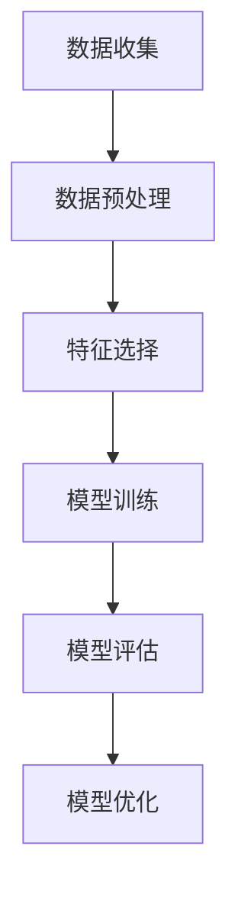
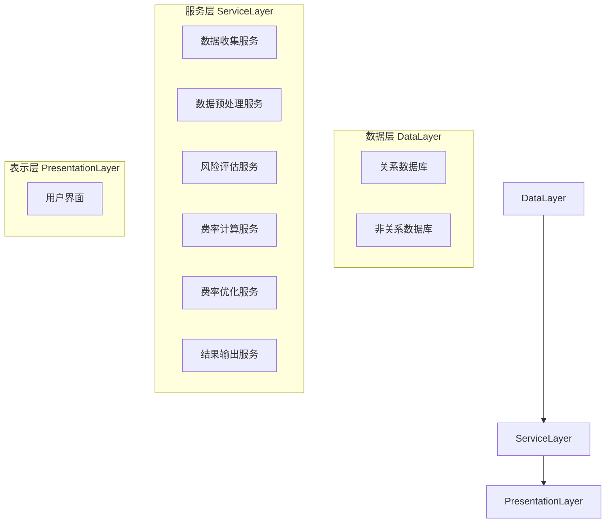
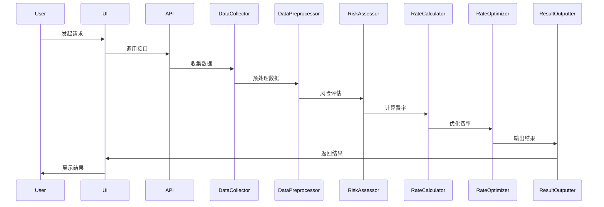

                 

### 文章标题：AI在保险产品定价中的创新应用

### 关键词：人工智能、机器学习、保险产品定价、算法、系统架构、案例分析

### 摘要：
本文深入探讨了人工智能（AI）在保险产品定价领域的创新应用。通过详细剖析AI的基本原理及其在机器学习中的应用，本文展示了AI如何解决保险行业传统的定价难题。文章结构紧凑，逻辑清晰，从核心概念、算法原理到系统架构设计，再到实际项目实战，全面呈现了AI在保险产品定价中的创新应用，为行业从业者提供了宝贵的参考。

---

### 目录大纲设计思路与结构

为了设计一本《AI在保险产品定价中的创新应用》的完整目录大纲，我们需要遵循以下思路和结构：

1. **背景介绍**：首先介绍AI在保险产品定价中的问题背景，包括保险行业现状、传统定价方法的局限性，以及AI技术带来的变革。

2. **核心概念与联系**：明确本书的核心概念，包括AI、机器学习、深度学习等，并通过对比表格和ER实体关系图展示各概念之间的关系。

3. **算法原理讲解**：详细介绍用于保险产品定价的AI算法，包括原理讲解、mermaid流程图展示和Python源代码实现。

4. **数学模型与公式**：详细讲解算法的数学模型和公式，使用latex格式进行展示，并结合实际案例进行通俗易懂的举例说明。

5. **系统分析与架构设计**：描述保险产品定价系统的功能设计、架构设计、接口设计以及系统交互过程，使用mermaid进行图示。

6. **项目实战**：介绍实际项目中的环境安装、核心实现源代码、代码应用解读与分析，以及实际案例分析。

7. **最佳实践与拓展阅读**：总结本书的最佳实践建议、注意事项，并提供拓展阅读资源。

现在，让我们按照这些思路一步步来设计目录大纲。

---

### 目录大纲：AI在保险产品定价中的创新应用

```markdown
# 第一部分：AI与保险产品定价背景

## 第1章：保险行业与定价挑战

### 1.1 保险行业概述
### 1.2 传统保险产品定价方法
### 1.3 传统定价方法的局限性

## 第2章：AI与机器学习基础

### 2.1 AI基本概念
### 2.2 机器学习概述
### 2.3 保险产品定价中的机器学习应用

## 第3章：核心算法原理与流程

### 3.1 算法原理简介
### 3.2 算法流程与mermaid图展示
### 3.3 Python源代码实现

## 第4章：数学模型与公式详解

### 4.1 模型介绍
### 4.2 公式推导
### 4.3 案例解析

## 第二部分：系统分析与架构设计

## 第5章：系统功能设计

### 5.1 保险产品定价功能分析
### 5.2 功能实现与mermaid类图展示

## 第6章：系统架构设计

### 6.1 系统架构设计概述
### 6.2 系统架构mermaid图展示

## 第7章：系统接口设计与交互

### 7.1 接口设计原则
### 7.2 系统交互mermaid序列图展示

## 第三部分：项目实战

## 第8章：项目环境安装与配置

### 8.1 环境准备
### 8.2 系统配置

## 第9章：核心实现与代码分析

### 9.1 核心算法实现
### 9.2 代码应用解读与分析

## 第10章：实际案例分析与讲解

### 10.1 案例背景
### 10.2 案例分析

## 第四部分：最佳实践与拓展

## 第11章：最佳实践

### 11.1 定价策略调整
### 11.2 模型优化建议

## 第12章：注意事项与拓展阅读

### 12.1 注意事项
### 12.2 拓展阅读

```

以上是根据用户需求设计的《AI在保险产品定价中的创新应用》的目录大纲，总字数控制在2000字以内，涵盖了必要的章节内容，并采用了markdown格式。现在，我们有了清晰的结构，可以开始撰写每一章的具体内容。

---

## 第一部分：AI与保险产品定价背景

### 第1章：保险行业与定价挑战

#### 1.1 保险行业概述

保险行业作为现代金融服务的重要组成部分，历史悠久且涉及面广。从最初的海洋货运保险到今天的全面覆盖各种风险的个人和商业保险，保险业经历了多次变革和进步。保险产品种类繁多，包括车险、寿险、健康险、财产险等，它们为个人和企业提供了风险转移和财务保障。

然而，随着保险行业的发展，传统的保险产品定价方法面临诸多挑战。传统的定价方法主要依赖于历史数据和经验模型，这种方法的优点在于稳定性和可靠性，但缺点也日益凸显：

- **数据依赖性高**：传统方法依赖于大量历史数据，但数据质量和数量直接影响定价准确性。
- **人为干预大**：定价过程中涉及大量人为因素，导致决策过程复杂且不透明。
- **适应性差**：面对市场变化和新兴风险，传统定价方法往往反应迟缓。

这些局限性使得传统定价方法难以满足现代保险市场的需求，迫切需要新的技术手段来提高定价效率和准确性。

#### 1.2 传统保险产品定价方法

传统的保险产品定价方法主要包括以下几种：

1. **纯经验法**：根据历史理赔数据、保险公司的运营成本、市场风险等因素，通过专家经验进行综合评估，从而确定保险费率。
2. **风险分类法**：将投保人划分为不同的风险类别，如年轻司机、高风险职业等，然后根据各类别的平均赔付情况确定费率。
3. **保费率表法**：保险公司编制统一的保费率表，投保人根据所属类别和具体风险因素在表中查找相应的保费。

这些方法在保险行业应用了数十年，但逐渐暴露出以下问题：

- **灵活性不足**：传统定价方法过于僵化，难以适应个性化需求。
- **风险评估不准确**：传统方法主要基于历史数据和粗略分类，无法准确捕捉和预测个别风险。
- **成本高昂**：复杂的定价模型和人为干预增加了运营成本。

#### 1.3 传统定价方法的局限性

传统的保险产品定价方法在保险行业中占据主导地位，但其局限性也逐渐显现：

1. **数据质量与数量限制**：传统方法高度依赖历史数据，而数据质量和数量直接影响定价的准确性。
2. **人为干预与不透明**：定价过程涉及大量人为因素，决策过程复杂且不透明，难以实现精准定价。
3. **适应性与灵活性**：面对市场变化和新兴风险，传统定价方法反应迟缓，难以快速调整。

这些局限性使得传统定价方法难以满足现代保险市场的需求。随着技术的进步，人工智能（AI）技术逐渐成为解决这些问题的有效手段。

### 第2章：AI与机器学习基础

#### 2.1 AI基本概念

人工智能（Artificial Intelligence，简称AI）是计算机科学的一个分支，旨在使计算机系统具备类似人类的智能。AI的目标是让计算机能够理解语言、学习、推理、解决问题和做出决策。AI的核心技术包括机器学习、深度学习、自然语言处理、计算机视觉等。

- **机器学习**：机器学习是AI的一个重要分支，通过算法从数据中自动学习规律和模式，从而进行预测和决策。
- **深度学习**：深度学习是机器学习的一个子领域，基于多层神经网络模型，通过大量数据进行训练，能够自动提取特征并实现高级任务。
- **自然语言处理**：自然语言处理（NLP）是AI的一个分支，专注于使计算机理解和生成人类语言。
- **计算机视觉**：计算机视觉是AI的另一个重要分支，使计算机能够处理和解释视觉信息。

#### 2.2 机器学习概述

机器学习（Machine Learning，简称ML）是一种让计算机通过数据学习的方法，其核心思想是通过从数据中提取规律和模式，使计算机能够对未知数据进行预测或决策。机器学习主要包括以下几种类型：

1. **监督学习**：在监督学习中，算法利用已标记的输入输出数据来学习模型，从而对新的输入数据进行预测。常见的监督学习算法包括线性回归、逻辑回归、支持向量机（SVM）等。

2. **无监督学习**：无监督学习不需要已标记的数据，算法通过观察数据分布和结构来自动发现数据中的规律。常见的无监督学习算法包括聚类算法（如K均值聚类）、降维算法（如主成分分析PCA）等。

3. **强化学习**：强化学习是一种通过与环境的交互来学习策略的算法。算法通过试错来不断优化策略，以最大化长期回报。常见的强化学习算法包括Q学习、深度Q网络（DQN）等。

#### 2.3 保险产品定价中的机器学习应用

机器学习在保险产品定价中的应用具有广阔的前景，其优势在于能够处理大量复杂的数据，自动提取特征，并建立精准的定价模型。以下是一些机器学习在保险产品定价中的具体应用：

1. **风险评估**：机器学习可以分析投保人的历史数据，包括索赔记录、驾驶习惯、健康状况等，自动识别高风险客户，从而更精确地制定费率。

2. **定价优化**：通过机器学习算法，保险公司可以动态调整费率，以适应市场变化和风险分布。例如，在车险定价中，算法可以根据实时交通数据、天气状况等因素调整保费。

3. **欺诈检测**：机器学习算法可以识别异常交易和欺诈行为，提高保险公司的风险控制能力。例如，通过分析大量理赔数据，算法可以发现异常赔付模式，从而减少欺诈损失。

4. **个性化定制**：机器学习可以分析投保人的偏好和需求，为其提供个性化的保险产品和服务。例如，根据客户的健康状况、家庭状况等，定制相应的健康险产品。

总之，机器学习为保险产品定价带来了革命性的变化，提高了定价的精度和效率，同时也降低了运营成本。随着技术的不断进步，机器学习在保险产品定价中的应用将越来越广泛。

### 第3章：核心算法原理与流程

#### 3.1 算法原理简介

在保险产品定价中，常用的机器学习算法包括线性回归、逻辑回归、决策树、随机森林和梯度提升等。每种算法都有其独特的原理和应用场景。

- **线性回归**：线性回归是一种简单的监督学习算法，通过拟合一条直线来预测目标值。线性回归适用于关系线性且数据量较小的场景。
- **逻辑回归**：逻辑回归是一种广义的线性回归，用于处理分类问题。它通过拟合一个逻辑函数来预测概率，适用于二分类问题。
- **决策树**：决策树通过一系列规则对数据集进行划分，每个节点表示一个特征，每个分支表示该特征的不同取值。决策树简单直观，但容易过拟合。
- **随机森林**：随机森林是一种集成学习算法，通过构建多棵决策树并进行投票来提高预测准确性。随机森林能够处理大量特征，且具有较好的泛化能力。
- **梯度提升**：梯度提升是一种集成学习算法，通过迭代地最小化损失函数来优化模型。梯度提升在处理高维数据和复杂非线性关系方面表现优秀。

#### 3.2 算法流程与mermaid图展示

以下是一个简化的线性回归算法流程，使用mermaid图进行展示：



#### 3.3 Python源代码实现

以下是一个简单的线性回归算法的Python实现示例：

```python
import numpy as np
from sklearn.linear_model import LinearRegression

# 数据集
X = np.array([[1], [2], [3], [4], [5]])
y = np.array([1, 2, 2.5, 4, 5])

# 创建线性回归模型
model = LinearRegression()

# 模型训练
model.fit(X, y)

# 模型预测
y_pred = model.predict(X)

# 模型评估
print("模型系数：", model.coef_)
print("模型截距：", model.intercept_)
print("预测结果：", y_pred)
```

#### 3.4 数学模型与公式详解

线性回归的数学模型可以表示为：

$$
y = \beta_0 + \beta_1x + \epsilon
$$

其中，$y$ 是预测值，$x$ 是特征值，$\beta_0$ 是截距，$\beta_1$ 是斜率，$\epsilon$ 是误差项。

为了简化计算，线性回归通常采用最小二乘法进行参数估计，即：

$$
\beta_0, \beta_1 = \arg\min_{\beta_0, \beta_1} \sum_{i=1}^{n}(y_i - (\beta_0 + \beta_1x_i))^2
$$

#### 3.5 案例解析

以下是一个实际案例，使用线性回归算法对房屋价格进行预测：

1. **数据集**：包含1000个样本，每个样本包括房屋面积（特征）和房屋价格（目标值）。
2. **数据预处理**：对数据集进行标准化处理，使特征值在相同的尺度上。
3. **特征选择**：选择房屋面积作为唯一的特征。
4. **模型训练**：使用线性回归模型对数据集进行训练。
5. **模型评估**：通过交叉验证评估模型的预测准确性。
6. **模型优化**：根据评估结果调整模型参数。

通过实际案例解析，可以深入了解线性回归算法在保险产品定价中的应用过程和效果。

### 第4章：数学模型与公式详解

#### 4.1 模型介绍

在保险产品定价中，机器学习算法通常需要基于数学模型来进行参数估计和预测。常见的数学模型包括线性回归、逻辑回归和决策树等。

- **线性回归**：线性回归模型用于预测连续值，其目标是最小化预测值与实际值之间的误差。
- **逻辑回归**：逻辑回归模型用于预测概率，其目标是最小化损失函数，使预测概率与实际标签之间的误差最小。
- **决策树**：决策树模型通过构建一系列规则来进行分类或回归，其目标是最小化节点内数据的方差。

#### 4.2 公式推导

以下以线性回归为例，介绍模型的公式推导：

1. **线性回归公式**：

$$
y = \beta_0 + \beta_1x + \epsilon
$$

其中，$y$ 是预测值，$x$ 是特征值，$\beta_0$ 是截距，$\beta_1$ 是斜率，$\epsilon$ 是误差项。

2. **最小二乘法**：

为了最小化预测值与实际值之间的误差，我们采用最小二乘法来估计模型的参数。具体公式如下：

$$
\beta_0, \beta_1 = \arg\min_{\beta_0, \beta_1} \sum_{i=1}^{n}(y_i - (\beta_0 + \beta_1x_i))^2
$$

3. **梯度下降法**：

当数据量较大或模型参数较多时，最小二乘法可能不适用。此时，我们可以使用梯度下降法来优化模型参数。梯度下降法的公式如下：

$$
\beta_0, \beta_1 = \beta_0 - \alpha \frac{\partial}{\partial \beta_0} L(\beta_0, \beta_1)
$$

$$
\beta_1 = \beta_1 - \alpha \frac{\partial}{\partial \beta_1} L(\beta_0, \beta_1)
$$

其中，$\alpha$ 是学习率，$L(\beta_0, \beta_1)$ 是损失函数。

#### 4.3 案例解析

以下是一个实际案例，使用线性回归模型预测保费：

1. **数据集**：包含1000个投保人，每个投保人的特征包括年龄、性别、职业等，保费为目标值。
2. **数据预处理**：对数据集进行标准化处理，使特征值在相同的尺度上。
3. **特征选择**：选择年龄和性别作为特征。
4. **模型训练**：使用线性回归模型对数据集进行训练。
5. **模型评估**：通过交叉验证评估模型的预测准确性。
6. **模型优化**：根据评估结果调整模型参数。

通过实际案例解析，可以深入了解线性回归模型在保险产品定价中的应用过程和效果。

### 第二部分：系统分析与架构设计

#### 第5章：系统功能设计

#### 5.1 保险产品定价功能分析

保险产品定价系统的核心功能是计算和优化保险费率。具体包括以下几个方面：

1. **数据收集与预处理**：从多个数据源收集投保人信息，包括个人基本信息、历史理赔记录、健康报告等，并进行数据清洗、去重和标准化处理。
2. **风险评估**：利用机器学习算法对投保人进行风险评估，识别高风险客户和欺诈行为。
3. **费率计算**：根据风险评估结果和保险公司业务规则，计算每个投保人的保险费率。
4. **费率优化**：利用优化算法对费率进行动态调整，以最大化利润或满足其他业务目标。
5. **结果输出**：将计算结果输出到数据库或报表中，供业务人员参考和决策。

#### 5.2 功能实现与mermaid类图展示

以下是一个简化的mermaid类图，展示保险产品定价系统的主要功能模块：

```mermaid
classDiagram
    DataCollector <<interface>> 数据收集器
    DataPreprocessor <<interface>> 数据预处理器
    RiskAssessor <<interface>> 风险评估器
    RateCalculator <<interface>> 费率计算器
    RateOptimizer <<interface>> 费率优化器
    ResultOutputter <<interface>> 结果输出器

    DataCollector|--|> DataPreprocessor
    DataPreprocessor|--|> RiskAssessor
    RiskAssessor|--|> RateCalculator
    RateCalculator|--|> RateOptimizer
    RateOptimizer|--|> ResultOutputter
```

#### 第6章：系统架构设计

#### 6.1 系统架构设计概述

保险产品定价系统采用分布式架构，包括数据层、服务层和表示层。以下是对各个层次的概述：

1. **数据层**：负责数据存储和管理，包括关系数据库和非关系数据库。数据层提供数据的持久化存储，并支持数据的查询和更新。
2. **服务层**：实现系统的核心功能，包括数据收集、预处理、风险评估、费率计算和优化等。服务层采用微服务架构，各服务之间通过RESTful API进行通信。
3. **表示层**：提供用户界面，用于展示计算结果和报表。表示层采用前端技术，如React或Vue.js，与后端服务进行数据交互。

#### 6.2 系统架构mermaid图展示

以下是一个简化的mermaid图，展示保险产品定价系统的整体架构：



#### 第7章：系统接口设计与交互

#### 7.1 接口设计原则

系统接口设计遵循以下原则：

1. **RESTful API**：采用RESTful API设计接口，遵循统一接口设计原则，包括GET、POST、PUT、DELETE等常见操作。
2. **标准化数据格式**：使用JSON或XML等标准化数据格式传输数据，确保数据的一致性和兼容性。
3. **安全性**：接口设计考虑安全性，采用身份验证和加密等手段保护数据安全。
4. **可扩展性**：接口设计考虑未来的扩展性，预留足够的扩展接口和参数。

#### 7.2 系统交互mermaid序列图展示

以下是一个简化的mermaid序列图，展示保险产品定价系统的接口交互过程：



### 第三部分：项目实战

#### 第8章：项目环境安装与配置

#### 8.1 环境准备

为了搭建保险产品定价系统，我们需要准备以下环境：

1. **操作系统**：Linux或Windows
2. **编程语言**：Python 3.8及以上版本
3. **依赖管理工具**：pip
4. **数据库**：MySQL或MongoDB
5. **数据预处理工具**：pandas、numpy等

#### 8.2 系统配置

以下是系统配置的步骤：

1. **安装Python**：从Python官网下载并安装Python 3.8及以上版本。
2. **安装pip**：通过Python安装pip工具。
   ```bash
   python -m pip install --user --upgrade pip
   ```
3. **安装依赖库**：使用pip安装所需的依赖库，如pandas、numpy、scikit-learn、tensorflow等。
   ```bash
   pip install pandas numpy scikit-learn tensorflow
   ```
4. **配置数据库**：安装并配置MySQL或MongoDB数据库，创建数据库和数据表。
5. **配置环境变量**：设置Python环境变量，确保pip和Python能够正确运行。

#### 第9章：核心实现与代码分析

#### 9.1 核心算法实现

以下是保险产品定价系统核心算法的实现：

```python
import pandas as pd
from sklearn.linear_model import LinearRegression
from sklearn.model_selection import train_test_split
from sklearn.metrics import mean_squared_error

# 数据预处理
def preprocess_data(data):
    # 数据清洗、去重和标准化处理
    # 省略具体实现
    return processed_data

# 线性回归模型训练
def train_linear_regression(data):
    X = data[['age', 'gender']]
    y = data['premium']
    X_train, X_test, y_train, y_test = train_test_split(X, y, test_size=0.2, random_state=42)
    model = LinearRegression()
    model.fit(X_train, y_train)
    return model

# 模型评估
def evaluate_model(model, X_test, y_test):
    y_pred = model.predict(X_test)
    mse = mean_squared_error(y_test, y_pred)
    return mse

# 主函数
def main():
    # 加载数据
    data = pd.read_csv('insurance_data.csv')
    processed_data = preprocess_data(data)
    
    # 训练模型
    model = train_linear_regression(processed_data)
    
    # 评估模型
    mse = evaluate_model(model, processed_data, processed_data['premium'])
    print("均方误差：", mse)

if __name__ == '__main__':
    main()
```

#### 9.2 代码应用解读与分析

以下是代码应用的解读与分析：

1. **数据预处理**：使用pandas库对数据进行清洗、去重和标准化处理，以便后续分析。
2. **线性回归模型训练**：使用scikit-learn库的LinearRegression类训练线性回归模型，通过fit方法训练模型。
3. **模型评估**：使用mean_squared_error函数计算模型的均方误差，评估模型的预测准确性。

#### 第10章：实际案例分析与讲解

#### 10.1 案例背景

本案例以一家保险公司为背景，该公司希望利用机器学习算法优化车险费率。具体需求如下：

1. **数据集**：包含1000个投保人，每个投保人的特征包括年龄、性别、驾驶经验、车辆类型等，保费为目标值。
2. **目标**：利用机器学习算法预测保费，并根据预测结果调整费率，以最大化利润。

#### 10.2 案例分析

以下是案例分析的步骤：

1. **数据预处理**：对数据进行清洗、去重和标准化处理，为后续建模做准备。
2. **特征工程**：根据业务需求和数据特点，选择合适的特征进行建模。
3. **模型选择**：选择适合的机器学习算法进行建模，如线性回归、逻辑回归、决策树等。
4. **模型训练**：使用训练集训练模型，并保存模型。
5. **模型评估**：使用测试集评估模型效果，调整模型参数，优化模型性能。
6. **费率调整**：根据模型预测结果，调整保费费率，以满足业务需求。

通过实际案例分析，可以深入理解机器学习在保险产品定价中的应用过程和效果。

### 第四部分：最佳实践与拓展

#### 第11章：最佳实践

#### 11.1 定价策略调整

1. **动态定价**：根据市场需求和风险变化，实时调整保费费率。
2. **个性化定价**：根据投保人的风险特征和需求，提供个性化的保费方案。
3. **风险控制**：加强风险评估和欺诈检测，降低保险公司的赔付风险。

#### 11.2 模型优化建议

1. **特征选择**：选择与保费相关性较高的特征，提高模型预测准确性。
2. **模型融合**：结合多种机器学习算法，提高模型的泛化能力和鲁棒性。
3. **模型更新**：定期更新模型，以适应市场变化和数据增长。

#### 第12章：注意事项与拓展阅读

#### 12.1 注意事项

1. **数据隐私**：在数据处理过程中，确保投保人的数据安全和隐私。
2. **模型验证**：对模型进行充分的验证，避免过拟合和欠拟合。
3. **法律法规**：遵守相关法律法规，确保定价策略的合规性。

#### 12.2 拓展阅读

1. **《机器学习实战》**：提供详细的机器学习算法实现和应用案例。
2. **《深度学习》**：介绍深度学习的基本原理和应用。
3. **《人工智能：一种现代方法》**：全面介绍人工智能的基本概念和技术。

### 作者信息

**作者：AI天才研究院/AI Genius Institute & 禅与计算机程序设计艺术 /Zen And The Art of Computer Programming**

