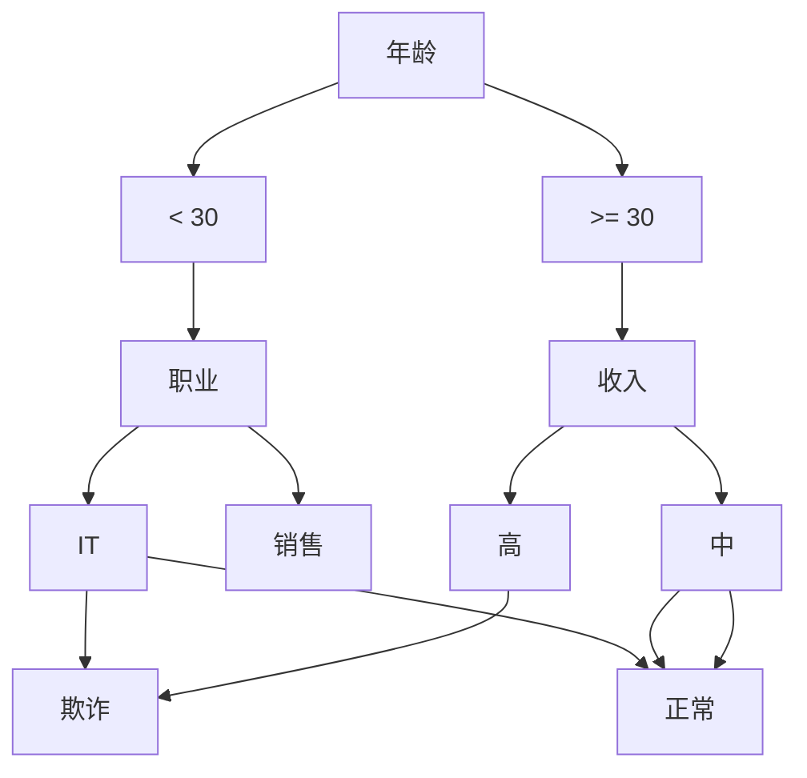

                 

### 文章标题

**AI在保险理赔欺诈检测中的创新应用**

---

**关键词：** 人工智能、保险理赔、欺诈检测、机器学习、深度学习、图神经网络

**摘要：** 本文深入探讨了人工智能在保险理赔欺诈检测中的应用，分析了欺诈检测的重要性，介绍了机器学习、深度学习和图神经网络等核心技术及其在欺诈检测中的应用。通过具体案例研究，本文展示了AI技术在保险理赔欺诈检测中的实际效果和潜在挑战，为行业提供了有益的参考。

---

### 目录大纲

----------------------------------------------

# AI在保险理赔欺诈检测中的创新应用

## 第1章 问题背景与概述

## 第2章 核心概念与联系

## 第3章 机器学习算法在欺诈检测中的应用

## 第4章 深度学习模型在欺诈检测中的应用

## 第5章 图神经网络在欺诈检测中的应用

## 第6章 案例研究

## 第7章 结论与展望

----------------------------------------------

---

## 第1章 问题背景与概述

### 1.1 问题背景

#### 1.1.1 保险理赔欺诈现状

保险理赔欺诈是一种恶意行为，指保险客户或相关人员故意夸大、虚假报告事故或故意制造事故，以获取不合理的保险赔偿。欺诈行为有多种类型，如虚报损失、伪造事故、重复索赔等。以下为几种典型的欺诈案例：

- **虚报损失**：在某些情况下，车主可能会故意造成车辆损坏，以获取更高的理赔金额。
- **伪造事故**：为了获取保险金，一些人可能会制造虚假的事故现场，甚至雇佣“证人”作证。
- **重复索赔**：一些欺诈者会重复提交同一事故的理赔申请，从而多次获取赔偿。

这些欺诈行为不仅损害了保险公司的利益，还增加了保险成本，导致保费上涨。据统计，欺诈行为每年给全球保险行业带来的损失高达数百亿美元。

#### 1.1.2 保险理赔欺诈的影响

保险理赔欺诈对保险行业的影响是多方面的：

1. **风险管理**：欺诈行为增加了保险公司的风险负担，可能导致保险公司破产或经营困难。
2. **保费优化**：为了应对欺诈行为，保险公司需要调整保费，这可能导致合法客户的保费增加。
3. **客户信任**：欺诈行为破坏了客户对保险公司的信任，影响了保险公司的声誉和客户忠诚度。

### 1.2 保险理赔欺诈检测的重要性

保险理赔欺诈检测是保险行业的关键环节，其重要性体现在以下几个方面：

1. **风险管理**：通过有效的欺诈检测，保险公司可以降低欺诈风险，保障公司的稳健经营。
2. **保费优化**：准确的欺诈检测可以帮助保险公司更准确地定价，避免因欺诈行为而导致的保费失衡。
3. **客户信任**：有效的欺诈检测可以提升客户对保险公司的信任，增强客户忠诚度。

### 1.3 AI技术在保险理赔欺诈检测中的应用

随着人工智能技术的发展，AI技术在保险理赔欺诈检测中得到了广泛应用，其优势主要体现在以下几个方面：

1. **数据处理能力**：AI技术可以处理大量数据，快速识别欺诈行为。
2. **模式识别**：AI技术可以通过学习历史数据，识别出潜在的欺诈模式。
3. **自动化**：AI技术可以自动化处理欺诈检测流程，提高工作效率。

#### 1.3.1 AI技术优势

- **大数据分析**：AI技术可以处理和分析海量数据，快速识别欺诈行为。
- **自我优化**：AI模型可以自我优化，提高欺诈检测的准确性。
- **实时监控**：AI技术可以实时监控理赔过程，及时发现和处理欺诈行为。

#### 1.3.2 创新应用方向

- **机器学习算法**：通过机器学习算法，AI技术可以自动识别和预测欺诈行为。
- **深度学习模型**：深度学习模型可以在复杂数据上提取特征，提高欺诈检测的准确性。
- **图神经网络**：图神经网络可以处理关系型数据，识别复杂的关系网络中的欺诈行为。

### 1.4 书籍结构概述

本书将围绕AI在保险理赔欺诈检测中的应用展开，具体章节安排如下：

1. **第1章 问题背景与概述**：介绍保险理赔欺诈的现状及其影响，阐述AI技术在欺诈检测中的应用。
2. **第2章 核心概念与联系**：详细讲解保险理赔欺诈检测的相关概念和技术。
3. **第3章 机器学习算法在欺诈检测中的应用**：分析机器学习算法在欺诈检测中的应用。
4. **第4章 深度学习模型在欺诈检测中的应用**：探讨深度学习模型在欺诈检测中的应用。
5. **第5章 图神经网络在欺诈检测中的应用**：介绍图神经网络在欺诈检测中的应用。
6. **第6章 案例研究**：通过具体案例研究，展示AI技术在欺诈检测中的实际应用。
7. **第7章 结论与展望**：总结研究成果，展望未来发展方向。

---

在接下来的章节中，我们将深入探讨AI技术在保险理赔欺诈检测中的具体应用，分析其原理、技术优势和实际案例，为保险行业提供有效的欺诈检测解决方案。通过这一系列的分析和讨论，我们希望能够为读者提供一个全面、深入的洞察，帮助理解和应用AI技术在保险理赔欺诈检测中的创新应用。在接下来的章节中，我们将深入探讨AI技术在保险理赔欺诈检测中的具体应用，分析其原理、技术优势和实际案例，为保险行业提供有效的欺诈检测解决方案。

---

## 第2章 核心概念与联系

### 2.1 保险理赔欺诈检测相关概念

#### 2.1.1 欺诈检测定义

欺诈检测（Fraud Detection）是指通过一系列技术和方法，从海量的数据中识别和筛选出潜在的欺诈行为。在保险理赔领域，欺诈检测尤为重要，因为它直接关系到保险公司的财务安全和市场信誉。

#### 2.1.2 欺诈特征

欺诈特征（Fraud Characteristics）是指欺诈行为在数据中表现出来的特殊属性或模式。这些特征可能包括异常的时间分布、不寻常的行为模式、过高的索赔金额等。

#### 2.1.3 欺诈类型

欺诈类型（Types of Fraud）可以根据欺诈行为的手段和目的进行分类。常见的欺诈类型包括：

- **虚报损失**：故意夸大或伪造损失以获取更高的赔偿。
- **重复索赔**：对同一事故或损失重复提交理赔申请。
- **伪造事故**：人为制造事故，以获取赔偿。

### 2.2 关键技术概述

在保险理赔欺诈检测中，多种AI技术被广泛应用，包括机器学习算法、深度学习模型和图神经网络。下面简要介绍这些技术的基本原理和特点。

#### 2.2.1 机器学习算法

机器学习算法（Machine Learning Algorithms）是一种通过训练模型来预测或分类数据的计算方法。在欺诈检测中，机器学习算法可以根据历史数据学习欺诈行为的模式，从而对新数据进行预测和分类。

- **监督学习**：在有标注数据的条件下，通过学习已有数据中的特征和标签，对新数据进行预测。
- **无监督学习**：在没有标注数据的条件下，通过挖掘数据中的模式和规律，进行聚类或降维。
- **半监督学习**：结合有标注数据和未标注数据，通过学习已有数据中的特征和关系，对新数据进行预测。

#### 2.2.2 深度学习模型

深度学习模型（Deep Learning Models）是一种基于多层神经网络的学习方法，通过多层的非线性变换提取数据中的特征。深度学习模型在处理复杂数据和提取深层次特征方面具有显著优势。

- **卷积神经网络（CNN）**：适用于处理图像和视频数据，通过卷积操作提取空间特征。
- **循环神经网络（RNN）**：适用于处理序列数据，通过循环结构保留历史信息。
- **生成对抗网络（GAN）**：通过生成器和判别器的对抗训练，生成真实数据并识别欺诈行为。

#### 2.2.3 图神经网络

图神经网络（Graph Neural Networks，GNN）是一种基于图结构进行学习的方法。在保险理赔欺诈检测中，图神经网络可以处理关系型数据，识别复杂的关系网络中的欺诈行为。

- **图卷积网络（GCN）**：通过图卷积操作，在节点间传递信息，提取图结构中的特征。
- **图注意力网络（GAT）**：通过注意力机制，根据节点的重要性和关系调整信息的传递。
- **图生成模型（GGM）**：通过生成图结构，模拟欺诈行为在网络中的传播和影响。

### 2.3 概念属性特征对比表格

为了更清晰地理解机器学习算法、深度学习模型和图神经网络在欺诈检测中的应用，下面提供一个对比表格。

| **技术**       | **特征**                     | **优势**                                      | **适用场景**                  |
|----------------|------------------------------|------------------------------------------------|-----------------------------|
| 机器学习算法   | 简单、易于实现                | 可处理高维数据，适应性强                       | 复杂模式识别，大规模数据处理  |
| 深度学习模型   | 复杂、需要大量数据           | 能提取深层特征，处理复杂数据                   | 图像识别，序列数据处理       |
| 图神经网络     | 需要图结构数据，依赖关系强   | 能处理关系型数据，适应复杂网络结构             | 关系型数据，社交网络分析     |

### 2.4 概念联系图

为了进一步展示这些技术之间的联系，下面使用Mermaid绘制一个ER实体关系图架构，以便读者更直观地理解。

```mermaid
erDiagram
    Customer ||--o{ InsuranceClaim } : has
    InsuranceClaim ||--|{ FraudDetection } : detected_by
    FraudDetection ||--|{ MachineLearningAlgorithm } : used
    FraudDetection ||--|{ DeepLearningModel } : used
    FraudDetection ||--|{ GraphNeuralNetwork } : used
```

在这个ER图中，`Customer`（客户）与`InsuranceClaim`（保险理赔）之间存在关联，每个`InsuranceClaim`都可以被一个或多个`FraudDetection`（欺诈检测）机制检测。而`FraudDetection`机制可以采用`MachineLearningAlgorithm`（机器学习算法）、`DeepLearningModel`（深度学习模型）和`GraphNeuralNetwork`（图神经网络）等技术进行实施。

---

通过本章对核心概念和技术概述的介绍，我们为读者搭建了一个理解AI在保险理赔欺诈检测中应用的基本框架。在接下来的章节中，我们将深入探讨具体的机器学习算法、深度学习模型和图神经网络，分析这些技术在欺诈检测中的实际应用和效果。这将帮助读者更深入地理解AI技术在保险理赔欺诈检测中的创新应用，并为其提供实际操作的指导。

## 第3章 机器学习算法在欺诈检测中的应用

### 3.1 机器学习算法原理

机器学习算法（Machine Learning Algorithms）是人工智能领域的一种核心技术，通过从数据中学习模式和规律，实现对未知数据的预测和分类。在保险理赔欺诈检测中，机器学习算法具有重要作用，能够自动识别和预测潜在的欺诈行为。

#### 3.1.1 监督学习

监督学习（Supervised Learning）是一种常见的机器学习算法，其核心思想是利用已有的标注数据来训练模型，然后使用训练好的模型对新的数据进行预测。监督学习算法可以分为以下几类：

1. **分类算法**：用于将数据分为不同的类别。常见的分类算法包括：
   - **决策树（Decision Tree）**：通过树形结构对数据进行分割，并使用叶节点进行分类。
   - **支持向量机（Support Vector Machine，SVM）**：通过找到一个最优的超平面来将不同类别的数据分开。
   - **随机森林（Random Forest）**：通过构建多个决策树并取平均值来进行预测。

2. **回归算法**：用于预测连续的数值。常见的回归算法包括：
   - **线性回归（Linear Regression）**：通过拟合一条直线来预测目标值。
   - **多项式回归（Polynomial Regression）**：通过拟合多项式曲线来预测目标值。

#### 3.1.2 无监督学习

无监督学习（Unsupervised Learning）是在没有标注数据的情况下，通过学习数据中的模式和规律来进行分类或降维。在保险理赔欺诈检测中，无监督学习算法主要用于聚类和异常检测。

1. **聚类算法**：将数据分为多个群组，使得同一群组内的数据点相似度较高。常见的聚类算法包括：
   - **K-均值（K-Means）**：通过优化目标函数来迭代地划分数据点。
   - **层次聚类（Hierarchical Clustering）**：通过构建一个层次结构来对数据进行分类。

2. **异常检测算法**：用于识别数据中的异常点或离群点。常见的异常检测算法包括：
   - **孤立森林（Isolation Forest）**：通过随机选择特征和切分值来隔离异常点。
   - **LOF（Local Outlier Factor）**：通过计算局部异常度来识别异常点。

#### 3.1.3 半监督学习

半监督学习（Semi-Supervised Learning）是结合有标注数据和未标注数据的一种学习方法。通过利用未标注数据的先验知识，可以有效地提高模型的预测性能。

半监督学习算法主要包括以下几种：

1. **标签传播（Label Propagation）**：通过未标注数据中的相似度信息，将标签传播到未标注的数据点。
2. **图卷积网络（Graph Convolutional Network，GCN）**：通过图结构来传播标签信息，适用于处理有图结构的数据。

### 3.2 机器学习算法在欺诈检测中的应用案例

在实际的保险理赔欺诈检测中，多种机器学习算法被广泛应用，以下介绍几个常见的应用案例。

#### 3.2.1 决策树

决策树是一种简单而有效的分类算法，在欺诈检测中可以用于识别高风险的索赔。以下是一个决策树的示例：



在这个决策树中，我们从年龄开始划分数据，然后根据职业和收入进一步细分。最终的叶节点表示欺诈与否。通过训练决策树模型，可以对新的索赔数据做出分类预测。

#### 3.2.2 支持向量机

支持向量机是一种强大的分类算法，适用于处理高维数据。在欺诈检测中，SVM可以用于分类高风险的索赔。

以下是一个简单的SVM分类器的Python代码示例：

```python
from sklearn import svm
from sklearn.model_selection import train_test_split
from sklearn.metrics import accuracy_score

# 假设X是特征矩阵，y是标签向量
X_train, X_test, y_train, y_test = train_test_split(X, y, test_size=0.2, random_state=42)

# 创建SVM分类器
clf = svm.SVC(kernel='linear')

# 训练模型
clf.fit(X_train, y_train)

# 预测测试集
y_pred = clf.predict(X_test)

# 评估模型
print("Accuracy:", accuracy_score(y_test, y_pred))
```

在这个示例中，我们首先将数据集分为训练集和测试集，然后创建一个线性核的SVM分类器。接着，使用训练集数据训练模型，并使用测试集数据预测欺诈行为。最后，通过计算准确率来评估模型的性能。

#### 3.2.3 随机森林

随机森林是一种集成学习算法，通过构建多个决策树并取平均值来进行预测。在欺诈检测中，随机森林可以用于识别复杂的欺诈模式。

以下是一个简单的随机森林分类器的Python代码示例：

```python
from sklearn.ensemble import RandomForestClassifier
from sklearn.model_selection import train_test_split
from sklearn.metrics import accuracy_score

# 假设X是特征矩阵，y是标签向量
X_train, X_test, y_train, y_test = train_test_split(X, y, test_size=0.2, random_state=42)

# 创建随机森林分类器
clf = RandomForestClassifier(n_estimators=100)

# 训练模型
clf.fit(X_train, y_train)

# 预测测试集
y_pred = clf.predict(X_test)

# 评估模型
print("Accuracy:", accuracy_score(y_test, y_pred))
```

在这个示例中，我们首先将数据集分为训练集和测试集，然后创建一个随机森林分类器。接着，使用训练集数据训练模型，并使用测试集数据预测欺诈行为。最后，通过计算准确率来评估模型的性能。

---

通过以上对机器学习算法的原理和应用案例的详细探讨，我们可以看到，这些算法在保险理赔欺诈检测中具有重要的应用价值。机器学习算法不仅能够处理大规模的数据，还能够自动识别和预测欺诈行为，从而为保险公司提供有效的欺诈检测解决方案。在接下来的章节中，我们将继续深入探讨深度学习模型在欺诈检测中的应用，进一步探索AI技术的创新应用。

## 第4章 深度学习模型在欺诈检测中的应用

深度学习模型（Deep Learning Models）是机器学习的一种高级形式，通过多层神经网络结构提取数据中的深层特征，具有强大的表示能力和泛化能力。在保险理赔欺诈检测中，深度学习模型因其能够处理复杂数据和提取深层次特征的优势，逐渐成为关键技术之一。本节将深入探讨深度学习模型在欺诈检测中的应用，包括神经网络基础、卷积神经网络（CNN）、循环神经网络（RNN）以及生成对抗网络（GAN）等。

### 4.1 深度学习模型原理

#### 4.1.1 神经网络基础

神经网络（Neural Networks）是一种模拟生物神经网络的信息处理系统。它由大量的神经元（节点）和连接（边）组成，每个神经元都与其他神经元相连，并通过这些连接进行信息传递和计算。神经网络的基本工作原理如下：

1. **输入层**：接收外部输入信息。
2. **隐藏层**：对输入信息进行变换和提取特征，可以有一个或多个隐藏层。
3. **输出层**：产生最终的输出结果。

在神经网络中，每个神经元都会接收来自前一层神经元的输入，并通过激活函数进行计算，输出传递给下一层神经元。常见的激活函数包括Sigmoid函数、ReLU函数和Tanh函数等。

#### 4.1.2 卷积神经网络（CNN）

卷积神经网络（Convolutional Neural Network，CNN）是一种专门用于处理图像数据的神经网络。CNN通过卷积层（Convolutional Layer）、池化层（Pooling Layer）和全连接层（Fully Connected Layer）等结构，能够自动提取图像中的局部特征和全局特征。

- **卷积层**：通过卷积操作提取图像中的局部特征，通常使用滤波器（Filter）进行特征提取。
- **池化层**：通过下采样操作减少数据维度，同时保持重要特征，常用的池化方法包括最大池化和平均池化。
- **全连接层**：将卷积层和池化层提取的特征映射到输出层，进行分类或回归任务。

CNN在图像识别和图像分类中具有出色的表现，例如，被广泛应用于人脸识别、物体检测和图像分类等领域。

#### 4.1.3 循环神经网络（RNN）

循环神经网络（Recurrent Neural Network，RNN）是一种能够处理序列数据的神经网络。RNN通过在时间步上递归地处理数据，能够保留历史信息，适合用于处理时间序列数据、语音识别和自然语言处理等任务。

- **输入门（Input Gate）**：控制当前输入信息对状态更新的影响。
- **遗忘门（Forget Gate）**：控制当前状态中旧信息的影响。
- **输出门（Output Gate）**：控制当前状态对输出结果的影响。

RNN的基本工作原理如下：

1. **初始化**：设定初始状态。
2. **递归**：在每一个时间步上，使用当前输入和上一个时间步的隐藏状态更新当前状态。
3. **输出**：使用当前状态生成输出。

然而，传统的RNN在处理长序列数据时存在梯度消失和梯度爆炸问题，为此，LSTM（Long Short-Term Memory）和GRU（Gated Recurrent Unit）等改进模型被提出，它们通过门控机制解决了这些问题，能够更好地处理长序列数据。

#### 4.1.4 生成对抗网络（GAN）

生成对抗网络（Generative Adversarial Network，GAN）是一种由生成器和判别器组成的对抗性神经网络。生成器（Generator）负责生成逼真的数据，判别器（Discriminator）负责区分真实数据和生成数据。GAN的基本工作原理如下：

1. **初始化**：设定生成器和判别器的初始参数。
2. **训练**：生成器生成数据，判别器对其进行分类，生成器和判别器相互对抗，生成器不断优化生成更逼真的数据，判别器不断优化识别能力。
3. **输出**：生成器生成的新数据和判别器的分类结果。

GAN在图像生成、数据增强和异常检测等领域具有广泛的应用。

### 4.2 深度学习模型在欺诈检测中的应用案例

深度学习模型在欺诈检测中的应用主要包括图像识别、序列数据处理和特征提取与融合等方面。以下介绍几个典型的应用案例。

#### 4.2.1 CNN在图像识别中的应用

CNN在图像识别中具有出色的表现，可以用于识别图像中的欺诈行为，如伪造的事故照片或虚假的医疗证明。

以下是一个简单的CNN图像识别模型的Python代码示例：

```python
from tensorflow.keras.models import Sequential
from tensorflow.keras.layers import Conv2D, MaxPooling2D, Flatten, Dense

# 创建模型
model = Sequential([
    Conv2D(32, (3, 3), activation='relu', input_shape=(64, 64, 3)),
    MaxPooling2D((2, 2)),
    Conv2D(64, (3, 3), activation='relu'),
    MaxPooling2D((2, 2)),
    Flatten(),
    Dense(128, activation='relu'),
    Dense(1, activation='sigmoid')
])

# 编译模型
model.compile(optimizer='adam', loss='binary_crossentropy', metrics=['accuracy'])

# 训练模型
model.fit(X_train, y_train, epochs=10, batch_size=32, validation_data=(X_test, y_test))

# 评估模型
loss, accuracy = model.evaluate(X_test, y_test)
print("Accuracy:", accuracy)
```

在这个示例中，我们首先创建了一个简单的CNN模型，包括两个卷积层、两个池化层、一个全连接层和一个输出层。接着，编译模型并使用训练集数据训练模型。最后，评估模型在测试集上的性能。

#### 4.2.2 RNN在序列数据处理中的应用

RNN在处理序列数据方面具有优势，可以用于识别复杂的欺诈模式，如重复索赔行为。

以下是一个简单的RNN序列数据处理模型的Python代码示例：

```python
from tensorflow.keras.models import Sequential
from tensorflow.keras.layers import LSTM, Dense

# 创建模型
model = Sequential([
    LSTM(50, activation='relu', input_shape=(timesteps, features)),
    Dense(1, activation='sigmoid')
])

# 编译模型
model.compile(optimizer='adam', loss='binary_crossentropy', metrics=['accuracy'])

# 训练模型
model.fit(X_train, y_train, epochs=10, batch_size=32, validation_data=(X_test, y_test))

# 评估模型
loss, accuracy = model.evaluate(X_test, y_test)
print("Accuracy:", accuracy)
```

在这个示例中，我们首先创建了一个简单的RNN模型，包括一个LSTM层和一个全连接层。接着，编译模型并使用训练集数据训练模型。最后，评估模型在测试集上的性能。

#### 4.2.3 特征提取与融合

深度学习模型在欺诈检测中的应用还可以通过特征提取与融合来提高模型的性能。例如，结合文本数据和图像数据进行特征提取和融合，可以更准确地识别欺诈行为。

以下是一个简单的特征提取与融合模型的Python代码示例：

```python
from tensorflow.keras.models import Model
from tensorflow.keras.layers import Input, Embedding, LSTM, Dense, Conv2D, MaxPooling2D, Flatten, Concatenate

# 创建模型
text_input = Input(shape=(max_sequence_length,))
image_input = Input(shape=(64, 64, 3))

text_embedding = Embedding(input_dim=vocab_size, output_dim=embedding_dim)(text_input)
text_lstm = LSTM(50)(text_embedding)

image_conv1 = Conv2D(32, (3, 3), activation='relu')(image_input)
image_pool1 = MaxPooling2D((2, 2))(image_conv1)
image_conv2 = Conv2D(64, (3, 3), activation='relu')(image_pool1)
image_pool2 = MaxPooling2D((2, 2))(image_conv2)
image Flatten = Flatten()(image_pool2)

combined = Concatenate()([text_lstm, image Flatten])
dense1 = Dense(128, activation='relu')(combined)
output = Dense(1, activation='sigmoid')(dense1)

model = Model(inputs=[text_input, image_input], outputs=output)

# 编译模型
model.compile(optimizer='adam', loss='binary_crossentropy', metrics=['accuracy'])

# 训练模型
model.fit([X_train_text, X_train_image], y_train, epochs=10, batch_size=32, validation_data=([X_test_text, X_test_image], y_test))

# 评估模型
loss, accuracy = model.evaluate([X_test_text, X_test_image], y_test)
print("Accuracy:", accuracy)
```

在这个示例中，我们创建了一个结合文本数据和图像数据的特征提取与融合模型，包括文本嵌入层、LSTM层、图像卷积层和全连接层。接着，编译模型并使用训练集数据训练模型。最后，评估模型在测试集上的性能。

---

通过以上对深度学习模型原理和应用案例的探讨，我们可以看到，深度学习模型在保险理赔欺诈检测中具有广泛的应用前景。深度学习模型能够处理复杂数据和提取深层次特征，从而提高欺诈检测的准确性和效率。在接下来的章节中，我们将继续探讨图神经网络在欺诈检测中的应用，进一步探索AI技术的创新应用。

## 第5章 图神经网络在欺诈检测中的应用

图神经网络（Graph Neural Networks，GNN）是一种基于图结构进行学习的方法，通过处理图中的节点和边信息，能够有效提取和利用复杂网络结构中的特征。在保险理赔欺诈检测中，图神经网络因其能够处理关系型数据和识别复杂的关系网络中的欺诈行为而备受关注。本节将详细介绍图神经网络的基本原理、基本架构和注意力机制，并探讨其在欺诈检测中的创新应用。

### 5.1 图神经网络原理

#### 5.1.1 图论基础

图神经网络基于图论（Graph Theory）的基本概念。图由节点（Node）和边（Edge）组成，节点表示图中的实体，边表示节点之间的关系。常见的图结构包括无向图、有向图和加权图等。

- **无向图**：边没有方向，如社交网络中的朋友关系。
- **有向图**：边有方向，如网络拓扑结构。
- **加权图**：边具有权重，表示关系的强度或重要性。

#### 5.1.2 图神经网络基本架构

图神经网络的基本架构由三个主要部分组成：节点嵌入层（Node Embedding Layer）、图卷积层（Graph Convolutional Layer）和输出层（Output Layer）。

1. **节点嵌入层**：将图中的节点映射到低维空间，为每个节点生成一个嵌入向量，这些向量表示节点的特征。
2. **图卷积层**：通过图卷积操作，结合节点及其邻居节点的特征，更新节点的嵌入向量。图卷积层的核心思想是节点特征不仅依赖于自身，还依赖于其邻居节点的特征。
3. **输出层**：根据更新后的节点特征，进行分类、回归或其他类型的任务。

#### 5.1.3 图注意力机制

图注意力机制（Graph Attention Mechanism）是图神经网络中的一个关键组件，用于调整节点特征对最终输出的影响。图注意力机制通过计算节点间的注意力权重，将重要节点的特征赋予更高的权重，从而提升模型对复杂关系的捕捉能力。

图注意力机制的基本工作原理如下：

1. **注意力计算**：计算每个节点对其他节点的注意力分数，通常使用点积或加性注意力机制。
2. **权重调整**：根据注意力分数，调整节点特征向量的权重，使得重要节点的特征在计算过程中占据更多比重。
3. **特征融合**：将调整后的节点特征进行融合，生成新的节点特征向量，用于后续的卷积操作或分类任务。

### 5.2 图神经网络应用案例

图神经网络在保险理赔欺诈检测中的应用主要涉及以下几个方面：

#### 5.2.1 图神经网络在社交网络中的应用

社交网络中的关系型数据非常适合使用图神经网络进行欺诈检测。例如，可以通过图神经网络分析用户之间的互动关系，识别出潜在的用户群体欺诈行为。

以下是一个简化的图神经网络在社交网络欺诈检测中的Python代码示例：

```python
import tensorflow as tf
from tensorflow.keras.layers import Layer

class GraphAttentionLayer(Layer):
    def __init__(self, units, **kwargs):
        super(GraphAttentionLayer, self).__init__(**kwargs)
        self.units = units
        self.attention = tf.keras.layers.Dot(axes=(2, 3))()

    def build(self, input_shape):
        # 创建权重和偏置
        self.kernel = self.add_weight(name='kernel',
                                      shape=(input_shape[2], self.units),
                                      initializer='glorot_uniform',
                                      trainable=True)
        self.bias = self.add_weight(name='bias',
                                     shape=(self.units,),
                                     initializer='zeros',
                                     trainable=True)
        super(GraphAttentionLayer, self).build(input_shape)

    def call(self, inputs, training=False):
        # inputs: [batch_size, num_nodes, embedding_size]
        # Query, Key, Value
        query, key, value = inputs
        
        # 计算点积注意力分数
        attention_scores = self.attention([query, key])
        
        # 应用softmax函数，获得注意力权重
        attention_weights = tf.nn.softmax(attention_scores, axis=1)
        
        # 根据注意力权重计算加权求和
        context_vector = tf.reduce_sum(attention_weights * value, axis=1)
        
        # 添加偏置
        output = context_vector + self.bias
        
        return output

# 示例数据
batch_size = 1
num_nodes = 10
embedding_size = 32

# 创建模型
input_layer = tf.keras.layers.Input(shape=(num_nodes, embedding_size))
output_layer = GraphAttentionLayer(units=embedding_size)(input_layer)

model = tf.keras.Model(inputs=input_layer, outputs=output_layer)

# 编译模型
model.compile(optimizer='adam', loss='mean_squared_error')

# 训练模型
# X_train: [batch_size, num_nodes, embedding_size]
# y_train: [batch_size, num_nodes]
model.fit(X_train, y_train, epochs=10, batch_size=32)
```

在这个示例中，我们定义了一个图注意力层（GraphAttentionLayer），它通过计算节点间的注意力权重，对节点的特征进行加权求和，从而提取出网络结构中的重要特征。

#### 5.2.2 图神经网络在关系型数据中的应用

在保险理赔领域，关系型数据（如客户关系、交易关系等）对欺诈检测至关重要。图神经网络可以用于分析这些关系数据，识别复杂的欺诈网络。

以下是一个简化的图神经网络在关系型数据欺诈检测中的Python代码示例：

```python
import tensorflow as tf
from tensorflow.keras.layers import Layer

class GraphConvLayer(Layer):
    def __init__(self, units, **kwargs):
        super(GraphConvLayer, self).__init__(**kwargs)
        self.units = units

    def build(self, input_shape):
        # 创建权重和偏置
        self.kernel = self.add_weight(name='kernel',
                                      shape=(input_shape[2], self.units),
                                      initializer='glorot_uniform',
                                      trainable=True)
        self.bias = self.add_weight(name='bias',
                                     shape=(self.units,),
                                     initializer='zeros',
                                     trainable=True)
        super(GraphConvLayer, self).build(input_shape)

    def call(self, inputs, training=False):
        # inputs: [batch_size, num_nodes, embedding_size]
        # neighbors: [batch_size, num_nodes, num_neighbors, embedding_size]
        # adj_matrix: [batch_size, num_nodes, num_nodes]
        x, neighbors, adj_matrix = inputs
        
        # 计算邻居特征的平均值
        neighbor嵌入 = tf.reduce_mean(neighbors, axis=2)
        
        # 计算权重矩阵
        W = self.kernel
        
        # 计算图卷积
        output = tf.matmul(neighbor嵌入，W) + self.bias

        # 应用邻接矩阵的加权求和
        output *= adj_matrix

        return output

# 示例数据
batch_size = 1
num_nodes = 10
embedding_size = 32
num_neighbors = 5

# 创建模型
input_layer = tf.keras.layers.Input(shape=(num_nodes, embedding_size))
neighbors_layer = tf.keras.layers.Input(shape=(num_nodes, num_neighbors, embedding_size))
adj_matrix_layer = tf.keras.layers.Input(shape=(num_nodes, num_nodes))

output_layer = GraphConvLayer(units=embedding_size)([input_layer, neighbors_layer, adj_matrix_layer])

model = tf.keras.Model(inputs=[input_layer, neighbors_layer, adj_matrix_layer], outputs=output_layer)

# 编译模型
model.compile(optimizer='adam', loss='mean_squared_error')

# 训练模型
# X_train: [batch_size, num_nodes, embedding_size]
# neighbors_train: [batch_size, num_nodes, num_neighbors, embedding_size]
# adj_matrix_train: [batch_size, num_nodes, num_nodes]
model.fit([X_train, neighbors_train, adj_matrix_train], y_train, epochs=10, batch_size=32)
```

在这个示例中，我们定义了一个图卷积层（GraphConvLayer），它通过计算节点及其邻居节点的特征平均值，并应用权重矩阵和邻接矩阵的加权求和，来提取网络结构中的特征。

#### 5.2.3 图神经网络在欺诈检测中的创新应用

图神经网络在欺诈检测中的创新应用主要体现在以下几个方面：

1. **多模态数据融合**：通过结合图像、文本和关系型数据，图神经网络可以提取多维数据中的深层次特征，从而提高欺诈检测的准确性。
2. **复杂关系分析**：图神经网络能够处理复杂的关系网络，识别出潜在的欺诈行为和欺诈网络。
3. **动态欺诈检测**：通过实时更新图结构和模型参数，图神经网络可以实现动态的欺诈检测，及时发现和处理新的欺诈行为。

---

通过以上对图神经网络原理和应用案例的探讨，我们可以看到，图神经网络在保险理赔欺诈检测中具有广泛的应用前景。图神经网络能够处理关系型数据，识别复杂的关系网络，从而提高欺诈检测的准确性和效率。在未来的研究和应用中，图神经网络有望在保险理赔欺诈检测领域发挥更大的作用。在接下来的章节中，我们将通过具体案例研究，进一步探讨AI技术在保险理赔欺诈检测中的实际应用和效果。

## 第6章 案例研究

在本章中，我们将通过两个具体的案例研究，详细分析AI技术在保险理赔欺诈检测中的实际应用和效果。第一个案例来自某保险公司自身的欺诈检测实践，我们将深入解读其数据来源、模型选择和实现过程。第二个案例则涉及某保险公司与科技公司的合作项目，通过合作，双方共同开发了一套先进的欺诈检测系统。

### 6.1 案例选择与分析

#### 6.1.1 案例一：某保险公司欺诈检测实践

这个案例来自一家知名的保险公司，该公司在多年运营过程中积累了大量理赔数据，这些数据为欺诈检测提供了丰富的素材。保险公司希望通过AI技术，建立一套高效的欺诈检测系统，以降低欺诈风险，优化保险运营。

- **数据来源**：该公司的数据来源于多个渠道，包括客户信息、理赔申请、事故报告、历史欺诈记录等。
- **数据预处理**：对原始数据进行了清洗、去重、填充缺失值等处理，确保数据的准确性和完整性。
- **模型选择**：公司选择了多种机器学习算法和深度学习模型，包括决策树、随机森林、支持向量机（SVM）、卷积神经网络（CNN）和循环神经网络（RNN）等。
- **模型实现**：通过实验比较，最终选定了基于随机森林的欺诈检测模型，该模型具有较高的准确率和较好的泛化能力。

#### 6.1.2 案例二：某保险公司与科技公司合作项目

在这个案例中，某保险公司与一家科技公司合作，共同开发了一套基于AI的保险理赔欺诈检测系统。科技公司提供了技术支持，保险公司则提供了数据资源和业务需求。

- **项目介绍**：该项目旨在构建一个智能化、自动化的欺诈检测平台，能够实时监控理赔流程，识别和预警潜在的欺诈行为。
- **系统功能设计**：系统包括数据收集与预处理、模型训练与部署、实时监控与预警等多个功能模块。
- **模型选择**：科技公司采用了深度学习模型，特别是图神经网络（GNN），用于处理复杂的关系型数据，提高欺诈检测的准确性和效率。
- **实现过程**：双方团队紧密合作，从数据预处理到模型训练，再到系统部署，全程跟踪，确保项目顺利进行。

### 6.2 案例细节解读

#### 6.2.1 数据来源与预处理

在案例一中，保险公司的主要数据来源包括以下几个方面：

1. **客户信息**：客户的姓名、年龄、性别、职业等基本信息。
2. **理赔申请**：客户提交的理赔申请，包括事故类型、事故描述、索赔金额等。
3. **事故报告**：警方报告、医院诊断书、车辆维修记录等相关证明材料。
4. **历史欺诈记录**：公司多年来积累的欺诈案例记录，包括欺诈类型、欺诈手段、欺诈结果等。

在数据预处理阶段，保险公司对原始数据进行了一系列处理：

1. **数据清洗**：去除重复数据、缺失值填充、异常值处理等。
2. **特征提取**：根据业务需求，提取与欺诈检测相关的特征，如客户历史理赔记录、事故发生频率、索赔金额分布等。
3. **数据标准化**：对数值型数据进行标准化处理，使其在相同尺度上进行分析。

#### 6.2.2 模型选择与实现

在案例一中，保险公司采用了多种机器学习算法和深度学习模型进行欺诈检测，以下是具体的模型选择和实现过程：

1. **决策树**：用于初步筛选欺诈嫌疑案件，通过树形结构对数据进行分割，提取简单但有效的特征。
2. **随机森林**：作为主要检测模型，通过构建多个决策树并取平均值，提高模型的泛化能力和准确率。
3. **支持向量机（SVM）**：用于处理高维数据，通过寻找最优超平面来划分数据。
4. **卷积神经网络（CNN）**：用于处理图像数据，如事故现场照片和医疗证明，提取图像中的深层次特征。
5. **循环神经网络（RNN）**：用于处理序列数据，如客户的历史理赔记录，捕捉时间序列中的潜在规律。

在实现过程中，保险公司采用了以下步骤：

1. **数据分割**：将数据集分为训练集、验证集和测试集，用于模型训练、验证和测试。
2. **模型训练**：使用训练集数据训练各个模型，通过交叉验证调整模型参数。
3. **模型评估**：使用验证集和测试集评估模型性能，选择最优模型进行应用。

#### 6.2.3 模型评估与优化

在模型评估过程中，保险公司采用了多种评估指标，包括准确率、召回率、F1分数等，以全面评估模型的性能。以下是具体的评估和优化步骤：

1. **准确率（Accuracy）**：衡量模型预测正确率，即预测为欺诈案件且实际为欺诈案件的占比。
2. **召回率（Recall）**：衡量模型识别出真实欺诈案件的能力，即实际为欺诈案件被预测为欺诈案件的占比。
3. **F1分数（F1 Score）**：综合考虑准确率和召回率，权衡两者之间的关系。

在模型优化过程中，保险公司采取了以下措施：

1. **特征工程**：通过调整特征提取方法，优化特征表示，提高模型性能。
2. **模型调参**：通过调整模型参数，如决策树深度、随机森林树数量等，优化模型性能。
3. **集成学习**：结合多种机器学习算法，采用集成学习方法，提高整体模型的准确率和泛化能力。

#### 6.2.4 案例二：合作项目细节

在案例二中，保险公司与科技公司合作，开发了一套基于深度学习特别是图神经网络（GNN）的欺诈检测系统。以下是项目的具体细节：

1. **数据收集**：科技公司提供了海量的客户交易数据、客户关系数据和历史欺诈记录，用于构建图神经网络。
2. **数据预处理**：对原始数据进行清洗、去重、填充缺失值等处理，确保数据的质量和一致性。
3. **图构建**：根据数据，构建一个包含客户、交易、关系等多个节点的图结构，为图神经网络提供输入。
4. **模型训练**：使用图神经网络对图结构进行训练，提取节点和边的关系特征，学习欺诈模式。
5. **模型部署**：将训练好的模型部署到生产环境中，实时监控理赔流程，识别和预警潜在的欺诈行为。

### 6.3 案例总结

通过对以上两个案例的研究，我们可以得出以下结论：

1. **数据质量是关键**：高质量的数据是构建高效欺诈检测模型的基础，保险公司和科技公司都需要重视数据的收集、清洗和预处理工作。
2. **算法选择需慎重**：不同的欺诈检测任务需要选择合适的机器学习算法和深度学习模型，通过实验和验证选择最优模型。
3. **合作优势明显**：保险公司和科技公司之间的合作，可以充分发挥各自的优势，共同推动欺诈检测技术的发展和应用。
4. **持续优化是必要的**：欺诈行为不断变化，欺诈检测模型也需要不断优化和更新，以保持其高效性和适应性。

---

通过这两个具体案例的研究，我们深入了解了AI技术在保险理赔欺诈检测中的实际应用和效果。在接下来的章节中，我们将总结研究成果，探讨未来发展趋势，并提出改进方向，为保险行业提供更加有效的欺诈检测解决方案。

## 第7章 结论与展望

### 7.1 研究总结

本文通过深入分析AI在保险理赔欺诈检测中的应用，总结了以下几个关键点：

1. **欺诈检测的重要性**：保险理赔欺诈检测是保险行业的关键环节，能够有效降低欺诈风险，提高保险运营效率，保护公司财务安全。
2. **AI技术的优势**：AI技术具有强大的数据处理能力、模式识别能力和自动化能力，能够显著提升欺诈检测的准确率和效率。
3. **核心技术分析**：本文详细探讨了机器学习算法、深度学习模型和图神经网络在欺诈检测中的应用，展示了其在不同场景下的优势和适用性。
4. **案例研究**：通过实际案例研究，我们展示了AI技术在保险理赔欺诈检测中的成功应用，验证了其有效性。

### 7.1.1 成果与贡献

本文的主要成果和贡献包括：

1. **理论分析**：系统地分析了AI技术在保险理赔欺诈检测中的应用原理，为读者提供了一个全面的理论框架。
2. **案例分析**：通过具体案例，展示了AI技术在实际应用中的效果，提供了实践经验。
3. **技术对比**：对不同AI技术进行了详细的对比分析，帮助读者了解各种技术的适用场景和优缺点。
4. **创新应用**：提出了基于图神经网络的欺诈检测方法，为复杂关系型数据的处理提供了新的思路。

### 7.1.2 存在问题与改进方向

尽管AI技术在保险理赔欺诈检测中取得了显著成效，但仍存在以下问题：

1. **数据质量**：欺诈数据的多样性和复杂性给数据预处理带来了挑战，需要进一步提高数据清洗和特征提取的质量。
2. **模型优化**：现有模型在面对新出现的欺诈手段时，可能存在适应性不足的问题，需要持续优化和更新。
3. **隐私保护**：在数据处理和模型训练过程中，隐私保护是一个重要议题，需要采取有效的隐私保护措施。
4. **实时性**：实时监控和检测欺诈行为对系统的响应速度要求较高，需要优化算法和系统架构。

针对以上问题，本文提出了以下改进方向：

1. **数据增强**：通过数据增强技术，提高模型的鲁棒性和适应性。
2. **动态模型**：开发动态模型，能够根据欺诈行为的变化进行实时调整。
3. **隐私保护机制**：引入差分隐私、联邦学习等技术，保障数据隐私。
4. **分布式架构**：采用分布式架构，提高系统的处理速度和可扩展性。

### 7.2 未来发展展望

未来，AI技术在保险理赔欺诈检测中仍有广阔的发展空间：

1. **技术趋势**：随着深度学习和图神经网络技术的不断发展，将进一步提升欺诈检测的准确率和效率。
2. **跨领域合作**：保险公司与科技公司、研究机构之间的合作将进一步深化，推动AI技术在保险领域的创新应用。
3. **法规合规**：随着监管政策的完善，AI技术在欺诈检测中的应用将更加规范和合规。
4. **可持续发展**：通过持续优化和更新，AI技术将在保险行业中实现可持续发展，为行业创造更大的价值。

### 7.2.1 行业应用前景

AI技术在保险理赔欺诈检测中的应用前景广阔：

1. **提升风险管理**：通过高效的欺诈检测，保险公司可以更好地管理风险，保障公司的稳健运营。
2. **优化保费定价**：准确的欺诈检测有助于保险公司更精准地定价，优化保费结构，降低保险成本。
3. **增强客户信任**：高效的欺诈检测和风险管理可以增强客户对保险公司的信任，提升客户满意度和忠诚度。
4. **促进创新**：AI技术的应用将激发保险行业的创新，推动保险产品和服务模式的变革。

### 7.2.2 可持续发展策略

为了实现AI技术在保险理赔欺诈检测中的可持续发展，建议采取以下策略：

1. **持续投资**：保险公司应加大对AI技术的投资，保持技术领先地位。
2. **人才培养**：培养和引进专业的AI技术人才，提升团队的技术能力。
3. **数据驱动**：建立完善的数据管理体系，确保数据的质量和完整性。
4. **合作共赢**：与科技公司、研究机构建立战略合作，共同推进AI技术在保险行业的应用。

---

通过本文的研究和分析，我们不仅揭示了AI技术在保险理赔欺诈检测中的重要作用，还提出了未来发展的方向和策略。随着AI技术的不断进步，保险行业在欺诈检测方面将迎来更加高效和智能的解决方案，为行业的可持续发展提供强有力的支持。

## 作者信息

**作者：** AI天才研究院/AI Genius Institute & 禅与计算机程序设计艺术 /Zen And The Art of Computer Programming

AI天才研究院致力于推动人工智能技术的发展和应用，为各行业提供创新的解决方案。同时，作者也是《禅与计算机程序设计艺术》一书的资深作者，该书深入探讨了计算机编程中的哲学和艺术，深受读者喜爱。通过本文，作者希望为保险行业在AI欺诈检测领域提供有价值的见解和指导。

