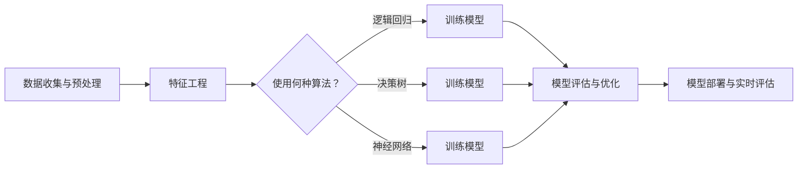
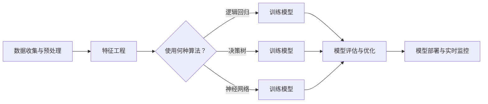
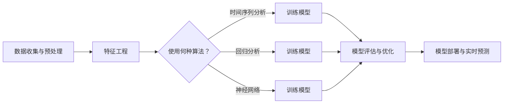
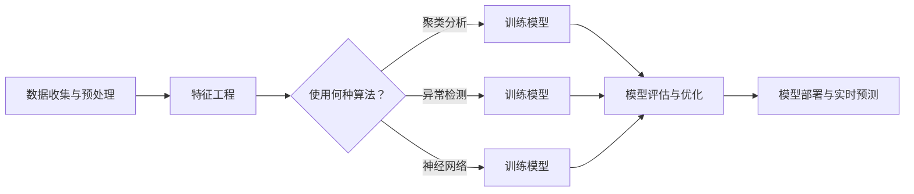

                 

### 文章标题：AI在商业银行风险管理中的应用

关键词：商业银行、风险管理、人工智能、信用评估、贷款风险、反欺诈、市场风险、操作风险

摘要：本文将深入探讨人工智能在商业银行风险管理中的应用。通过分析AI技术的基础，我们将展示其在信用评估、贷款风险预测、反欺诈、市场风险管理和操作风险管理中的具体应用。本文旨在提供一种清晰、结构化的思路，帮助读者理解AI技术在商业银行风险管理中的重要作用及其未来发展趋势。

---

### 目录大纲

**《AI在商业银行风险管理中的应用》**

----------------------------------------------------------------

1. **第一部分：引言与背景**
   1.1. 引言
   1.2. 商业银行风险管理的现状与挑战
   1.3. AI技术在风险管理中的应用潜力
   1.4. 本书的目的与结构

2. **第二部分：AI技术基础**
   2.1. 机器学习基础
   2.2. 深度学习基础

3. **第三部分：商业银行风险管理中的AI应用**
   3.1. 客户信用评估
   3.2. 贷款风险预测
   3.3. 反欺诈
   3.4. 市场风险管理
   3.5. 操作风险管理

4. **第四部分：AI应用总结与展望**
   4.1. AI在商业银行风险管理中的应用总结
   4.2. AI应用的最佳实践
   4.3. 未来展望

----------------------------------------------------------------

---

## 第一部分：引言与背景

### 1.1 引言

随着全球金融市场的不断发展和复杂性增加，商业银行面临着越来越多的风险管理挑战。传统风险管理方法在应对这些挑战时显得力不从心，无法满足现代金融环境的需求。然而，人工智能（AI）技术的发展为商业银行提供了全新的解决方案。

### 1.2 商业银行风险管理的现状与挑战

商业银行的风险管理涉及多个方面，包括信用风险、市场风险、操作风险和流动性风险等。以下是一些商业银行风险管理中面临的主要挑战：

- **信用风险**：客户违约风险难以预测和管理，导致贷款损失。
- **市场风险**：金融市场波动大，难以准确预测市场变化，可能导致投资损失。
- **操作风险**：由于信息系统复杂、操作失误等原因，可能导致重大损失。
- **流动性风险**：资金流动性不足，可能导致支付困难。

### 1.3 AI技术在风险管理中的应用潜力

AI技术，尤其是机器学习和深度学习，为商业银行风险管理提供了强大的工具。通过分析大量的历史数据，AI可以识别出潜在的信用风险、市场风险和操作风险，并提供准确的预测和决策支持。以下是AI技术在商业银行风险管理中的具体应用潜力：

- **信用评估**：通过分析客户的信用历史、行为特征等数据，AI可以更准确地评估客户信用风险。
- **贷款风险预测**：基于客户的历史贷款数据和市场环境，AI可以预测贷款违约风险。
- **反欺诈**：通过分析交易数据和行为模式，AI可以及时发现并阻止欺诈行为。
- **市场风险管理**：AI可以分析市场趋势和风险因素，帮助银行进行有效的投资决策。
- **操作风险管理**：AI可以监控操作流程，识别潜在的操作风险，并提供预警和解决方案。

### 1.4 本书的目的与结构

本书的目的是深入探讨AI在商业银行风险管理中的应用，帮助读者了解AI技术的理论基础、应用方法和实际案例。本书的结构如下：

- **第一部分：引言与背景**：介绍商业银行风险管理现状和AI技术的应用潜力。
- **第二部分：AI技术基础**：讲解机器学习和深度学习的基础知识。
- **第三部分：商业银行风险管理中的AI应用**：详细讨论AI在信用评估、贷款风险预测、反欺诈、市场风险管理和操作风险管理中的应用。
- **第四部分：AI应用总结与展望**：总结AI在商业银行风险管理中的应用，并提出未来展望。

通过本书的阅读，读者将能够全面了解AI技术在商业银行风险管理中的重要作用，并为实际应用提供指导。

## 第二部分：AI技术基础

在深入探讨AI在商业银行风险管理中的应用之前，首先需要了解AI技术的基础，特别是机器学习和深度学习。这两大技术为AI在金融领域的应用提供了强大的支持。

### 2.1 机器学习基础

#### 2.1.1 机器学习的基本概念

机器学习（Machine Learning）是指通过数据或以往的经验，让计算机系统实现自我学习和改进的过程。简单来说，机器学习就是让计算机从数据中学习规律，并能够根据这些规律进行预测或决策。

**机器学习的关键要素包括：**

- **数据**：机器学习的基础是数据。数据的质量和数量直接影响模型的效果。
- **算法**：机器学习算法是实现数据分析和预测的核心。常见的算法有线性回归、决策树、支持向量机等。
- **模型**：模型是将算法应用于数据的结果。模型的好坏直接决定了预测的准确性。

**机器学习的应用场景包括：**

- **分类**：将数据分为不同的类别。如垃圾邮件分类、客户群体分类等。
- **回归**：预测数值型变量的值。如房价预测、股票价格预测等。
- **聚类**：将数据分为不同的簇。如市场细分、用户行为分析等。

#### 2.1.2 常见的机器学习算法

- **线性回归**：用于预测连续数值型变量。
- **逻辑回归**：用于预测二元变量。
- **决策树**：通过树的模型来预测数据。
- **随机森林**：通过构建多个决策树，提高预测的准确性。
- **支持向量机**：用于分类和回归问题。
- **神经网络**：一种模拟人脑神经网络的结构，用于复杂的非线性预测。

### 2.2 深度学习基础

#### 2.2.1 深度学习的基本概念

深度学习（Deep Learning）是机器学习的一种形式，它通过多层神经网络进行数据的建模和分析。深度学习的核心思想是通过不断加深的网络结构，来提高模型的复杂度和预测能力。

**深度学习的关键要素包括：**

- **神经网络**：深度学习的基础是神经网络，特别是多层神经网络。
- **激活函数**：激活函数用于引入非线性，使模型能够处理复杂的数据。
- **优化算法**：优化算法用于调整网络参数，使模型达到更好的预测效果。

**深度学习的应用场景包括：**

- **图像识别**：通过深度学习模型，可以识别图像中的物体、场景等。
- **自然语言处理**：通过深度学习模型，可以处理和理解自然语言。
- **语音识别**：通过深度学习模型，可以实现语音的识别和转换。

#### 2.2.2 常见的深度学习模型

- **卷积神经网络（CNN）**：用于图像识别和处理。
- **循环神经网络（RNN）**：用于序列数据的建模和分析。
- **长短时记忆网络（LSTM）**：RNN的一种变体，用于处理长序列数据。
- **生成对抗网络（GAN）**：用于生成新的数据，如图像、文本等。

通过了解机器学习和深度学习的基础知识，我们能够更好地理解AI技术在商业银行风险管理中的应用。接下来，我们将进一步探讨AI在商业银行风险管理中的具体应用。

## 第三部分：商业银行风险管理中的AI应用

### 3.1 客户信用评估

#### 3.1.1 信用评估的挑战与机遇

客户信用评估是商业银行风险管理的重要环节。传统的信用评估方法主要依赖于客户的信用记录、财务状况和还款历史等信息。然而，这些方法在应对复杂多变的市场环境和多样化的客户需求时存在一定的局限性。

**面临的挑战：**

- **数据有限**：传统信用评估主要依赖于有限的财务数据和信用记录，难以全面了解客户的风险状况。
- **信息滞后**：客户的风险状况可能随着市场环境的变化而实时变化，传统方法难以及时反映这些变化。
- **评估标准单一**：传统信用评估标准相对单一，难以适应不同客户和不同市场的需求。

**机遇：**

随着人工智能技术的发展，商业银行可以通过AI技术，如机器学习和深度学习，来实现更准确、更全面的客户信用评估。

**应用AI技术的优势：**

- **数据分析能力**：AI可以分析大量的历史数据，包括客户的交易行为、社交信息等，以更全面地了解客户的风险状况。
- **实时评估**：AI可以实时处理和分析客户的数据，及时更新信用评估结果。
- **个性化评估**：AI可以根据不同客户和市场的特点，制定个性化的信用评估标准。

#### 3.1.2 基于AI的客户信用评估模型

基于AI的客户信用评估模型通常包括以下几个步骤：

1. **数据收集与预处理**：收集客户的各类数据，包括财务数据、交易数据、社交数据等，并进行数据清洗和预处理，以去除噪声和异常值。
2. **特征工程**：对预处理后的数据进行特征提取和选择，以构建有效的特征向量。例如，可以使用统计方法、文本分析等方法提取特征。
3. **模型训练**：使用机器学习算法，如逻辑回归、决策树、神经网络等，对数据集进行训练，以建立信用评估模型。
4. **模型评估与优化**：通过交叉验证、A/B测试等方法评估模型的效果，并根据评估结果对模型进行优化。
5. **模型部署与实时评估**：将训练好的模型部署到生产环境中，实现对客户信用风险的实时评估和预测。

以下是一个简单的客户信用评估模型的流程图（使用Mermaid绘制）：

通过上述步骤，商业银行可以构建一个基于AI的客户信用评估模型，实现对客户信用风险的准确预测和管理。

### 3.2 贷款风险预测

#### 3.2.1 贷款风险的评估方法

贷款风险预测是商业银行风险管理中的另一个重要环节。贷款风险预测的主要目的是通过分析客户的历史贷款数据、市场环境等因素，预测客户是否会发生违约，从而采取相应的风险管理措施。

**传统贷款风险评估方法：**

- **财务分析法**：通过分析客户的财务报表，如资产负债表、利润表等，评估客户的偿债能力。
- **信用评分法**：通过客户的信用记录、还款历史等数据，使用信用评分模型评估客户的风险。
- **统计模型法**：使用统计模型，如逻辑回归、决策树等，分析客户的历史数据，预测违约风险。

**传统贷款风险评估方法的局限性：**

- **数据依赖性**：传统方法主要依赖于客户的财务数据和信用记录，难以全面评估客户的风险。
- **评估标准单一**：传统方法的标准相对单一，难以适应不同客户和市场的需求。
- **信息滞后**：传统方法的信息更新速度较慢，难以及时反映客户的风险状况。

**AI技术在贷款风险预测中的应用：**

随着AI技术的发展，商业银行可以通过AI技术，如机器学习和深度学习，来实现更准确、更全面的贷款风险预测。

**应用AI技术的优势：**

- **数据分析能力**：AI可以分析大量的历史数据，包括客户的贷款记录、市场环境等，以更全面地了解客户的风险状况。
- **实时评估**：AI可以实时处理和分析客户的数据，及时更新贷款风险评估结果。
- **个性化评估**：AI可以根据不同客户和市场的特点，制定个性化的风险评估标准。

#### 3.2.2 基于AI的贷款风险预测模型

基于AI的贷款风险预测模型通常包括以下几个步骤：

1. **数据收集与预处理**：收集客户的贷款数据、市场环境数据等，并进行数据清洗和预处理，以去除噪声和异常值。
2. **特征工程**：对预处理后的数据进行特征提取和选择，以构建有效的特征向量。例如，可以使用统计方法、文本分析等方法提取特征。
3. **模型训练**：使用机器学习算法，如逻辑回归、决策树、神经网络等，对数据集进行训练，以建立贷款风险预测模型。
4. **模型评估与优化**：通过交叉验证、A/B测试等方法评估模型的效果，并根据评估结果对模型进行优化。
5. **模型部署与实时评估**：将训练好的模型部署到生产环境中，实现对贷款风险的实时评估和预测。

以下是一个简单的贷款风险预测模型的流程图（使用Mermaid绘制）：

通过上述步骤，商业银行可以构建一个基于AI的贷款风险预测模型，实现对贷款风险的准确预测和管理。

### 3.3 反欺诈

#### 3.3.1 反欺诈的挑战与机遇

在商业银行的日常运营中，欺诈行为是一个长期存在的问题。传统的反欺诈方法主要依赖于规则和人工审查，但面对复杂多变的欺诈手段和海量交易数据，这些方法往往难以有效识别和阻止欺诈行为。

**面临的挑战：**

- **规则依赖性**：传统反欺诈方法主要依赖于预定义的规则，难以适应新型欺诈手段。
- **人工审查成本高**：人工审查需要大量时间和人力资源，效率较低。
- **数据复杂性**：交易数据量庞大，包含多种类型的数据，难以全面分析和处理。

**机遇：**

随着人工智能技术的发展，商业银行可以通过AI技术，如机器学习和深度学习，来实现更高效、更准确的反欺诈系统。

**应用AI技术的优势：**

- **数据挖掘能力**：AI可以分析大量的交易数据，识别潜在的欺诈模式。
- **实时监控**：AI可以实时监控交易行为，及时发现和阻止欺诈行为。
- **自适应能力**：AI可以根据新的数据和欺诈模式，不断优化和更新反欺诈策略。

#### 3.3.2 基于AI的反欺诈技术

基于AI的反欺诈技术通常包括以下几个步骤：

1. **数据收集与预处理**：收集交易数据、用户行为数据等，并进行数据清洗和预处理，以去除噪声和异常值。
2. **特征工程**：对预处理后的数据进行特征提取和选择，以构建有效的特征向量。例如，可以使用统计方法、文本分析等方法提取特征。
3. **模型训练**：使用机器学习算法，如逻辑回归、决策树、神经网络等，对数据集进行训练，以建立反欺诈模型。
4. **模型评估与优化**：通过交叉验证、A/B测试等方法评估模型的效果，并根据评估结果对模型进行优化。
5. **模型部署与实时监控**：将训练好的模型部署到生产环境中，实现对交易行为的实时监控和欺诈检测。

以下是一个简单的反欺诈模型流程图（使用Mermaid绘制）：

通过上述步骤，商业银行可以构建一个基于AI的反欺诈系统，实现对交易行为的实时监控和欺诈检测，从而有效降低欺诈风险。

### 3.4 市场风险管理

#### 3.4.1 市场风险的概念与分类

市场风险是指由于市场因素（如利率、汇率、股价等）的波动，导致商业银行的投资组合价值发生变化的风险。市场风险管理是商业银行风险管理中的重要一环。

**市场风险的分类：**

1. **利率风险**：由于利率波动导致银行资产和负债的价值变化。
2. **汇率风险**：由于汇率波动导致跨国银行资产和负债的价值变化。
3. **股价风险**：由于股价波动导致银行投资组合的价值变化。

**市场风险管理的挑战：**

- **数据复杂性**：市场风险涉及多种金融工具和复杂的市场环境，数据量庞大且类型多样。
- **实时性**：市场风险变化迅速，需要实时监控和及时响应。
- **预测难度**：市场风险因素多变，预测难度大。

**市场风险管理的方法：**

- **VaR（价值在风险）模型**：用于评估市场风险敞口。
- **敏感性分析**：用于分析市场因素变化对银行资产和负债的影响。
- **压力测试**：用于模拟极端市场条件下的风险情况。

#### 3.4.2 人工智能在市场风险预测中的应用

人工智能在市场风险预测中的应用主要包括以下几个方面：

1. **数据挖掘**：通过分析大量的历史数据，识别市场风险因素和风险传导机制。
2. **机器学习模型**：使用机器学习算法，如时间序列分析、回归分析等，预测市场风险。
3. **深度学习模型**：通过构建深度学习模型，如神经网络、循环神经网络等，对市场风险进行更准确的预测。

以下是一个简单的市场风险预测模型流程图（使用Mermaid绘制）：

通过上述步骤，商业银行可以构建一个基于AI的市场风险预测模型，实现对市场风险的准确预测和管理。

### 3.5 操作风险管理

#### 3.5.1 操作风险的概念与类型

操作风险是指由于内部程序、人员和系统故障等内部因素，导致商业银行损失的风险。操作风险管理是商业银行风险管理中的重要一环。

**操作风险的分类：**

1. **人员风险**：由于人员操作失误、道德风险等导致的风险。
2. **系统风险**：由于信息系统故障、网络攻击等导致的风险。
3. **流程风险**：由于内部流程不合理、操作流程失控等导致的风险。
4. **外部事件风险**：由于自然灾害、社会事件等外部因素导致的风险。

**操作风险管理的挑战：**

- **数据复杂性**：操作风险涉及多种类型的数据，如交易数据、日志数据、用户行为数据等，数据量庞大且类型多样。
- **实时性**：操作风险事件发生迅速，需要实时监控和及时响应。
- **自动化程度**：传统操作风险管理主要依赖人工处理，自动化程度较低。

**操作风险管理的方法：**

- **事件监控与报警**：通过实时监控操作流程和系统日志，及时发现异常事件并报警。
- **自动化处理**：通过自动化工具和算法，对操作风险事件进行自动化处理和响应。
- **持续改进**：通过不断优化内部流程和系统，提高操作风险管理的效果。

#### 3.5.2 人工智能在操作风险预测与管理中的应用

人工智能在操作风险预测与管理中的应用主要包括以下几个方面：

1. **数据挖掘**：通过分析大量的操作风险数据，识别操作风险因素和风险传导机制。
2. **机器学习模型**：使用机器学习算法，如聚类分析、异常检测等，预测操作风险。
3. **深度学习模型**：通过构建深度学习模型，如卷积神经网络、循环神经网络等，对操作风险进行更准确的预测。

以下是一个简单的操作风险预测模型流程图（使用Mermaid绘制）：

通过上述步骤，商业银行可以构建一个基于AI的操作风险预测模型，实现对操作风险的准确预测和管理。

## 第四部分：AI应用总结与展望

### 4.1 AI在商业银行风险管理中的应用总结

通过前面的讨论，我们可以看到AI在商业银行风险管理中的应用具有显著的优势和潜力。以下是AI在商业银行风险管理中的应用总结：

1. **客户信用评估**：AI可以通过分析大量历史数据，更准确地评估客户信用风险，降低贷款损失。
2. **贷款风险预测**：AI可以实时监控和分析贷款风险，提高贷款风险预测的准确性。
3. **反欺诈**：AI可以通过实时监控交易行为，及时发现和阻止欺诈行为，降低欺诈损失。
4. **市场风险管理**：AI可以通过分析市场风险因素，提供更准确的市场风险预测和投资决策。
5. **操作风险管理**：AI可以通过实时监控操作流程，提高操作风险管理的效果，降低操作风险。

### 4.2 AI应用的最佳实践

为了实现AI在商业银行风险管理中的最佳效果，以下是一些最佳实践建议：

1. **数据驱动**：重视数据的质量和数量，确保AI模型的输入数据准确、完整。
2. **模型优化**：不断优化AI模型，提高预测的准确性和效率。
3. **实时监控**：确保AI系统能够实时监控和响应风险变化，及时采取风险管理措施。
4. **自动化**：提高操作流程的自动化程度，降低人工干预，提高风险管理的效率。
5. **持续学习**：通过不断学习和更新数据，使AI系统能够适应新的风险环境和风险特征。

### 4.3 未来展望

随着AI技术的不断发展和应用，商业银行风险管理将迎来新的机遇和挑战。以下是未来展望：

1. **智能风险管理**：AI技术将进一步推动商业银行风险管理的智能化，实现全方位、多层次的智能风险管理。
2. **跨界融合**：AI技术将与大数据、云计算等新兴技术融合，为商业银行风险管理提供更强大的工具和支持。
3. **自动化决策**：AI技术将实现更加自动化和智能化的决策支持，降低人工干预，提高风险管理的效率。
4. **风险预测精度提升**：随着数据积累和算法优化，AI在风险预测方面的精度将进一步提高，为商业银行提供更可靠的风险管理依据。
5. **合规与伦理**：在AI应用过程中，商业银行需要关注合规性和伦理问题，确保AI技术的应用符合法律法规和伦理标准。

通过不断探索和应用AI技术，商业银行将能够更好地应对风险挑战，实现可持续发展和长期稳健经营。

### 作者信息

**作者：AI天才研究院/AI Genius Institute & 禅与计算机程序设计艺术 /Zen And The Art of Computer Programming**

本文作者结合AI技术在商业银行风险管理中的应用，深入探讨了AI技术的理论基础、应用方法和实际案例，旨在为读者提供全面、系统的理解。希望通过本文的分享，能够激发更多读者对AI在金融领域应用的兴趣和研究。作者将持续关注AI技术的发展，为金融行业带来更多创新和进步。

---

**注意事项：**

1. **数据隐私**：在应用AI技术进行风险管理时，需确保数据隐私和安全，遵循相关法律法规。
2. **模型解释性**：尽管AI技术能够提供高效的预测，但模型的解释性可能不足，商业银行需结合专家知识进行风险评估。
3. **模型泛化能力**：AI模型的泛化能力是一个重要考量因素，需确保模型在不同市场和环境下均能稳定运行。

**拓展阅读：**

1. **《机器学习实战》**：Peter Harrington，提供丰富的机器学习案例和实践经验。
2. **《深度学习》**：Ian Goodfellow、Yoshua Bengio、Aaron Courville，深入讲解深度学习的基础理论和应用。
3. **《金融科技：银行业变革的力量》**：Lucia Louro、Maria Savona，探讨金融科技在银行业中的应用和影响。

通过本文的深入探讨，希望能够为读者在商业银行风险管理中的应用AI技术提供有益的参考和启示。在未来的研究中，我们将继续关注AI技术在金融领域的最新进展和应用，为银行业的发展贡献力量。

