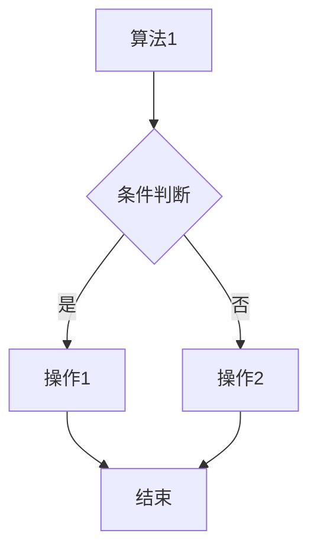
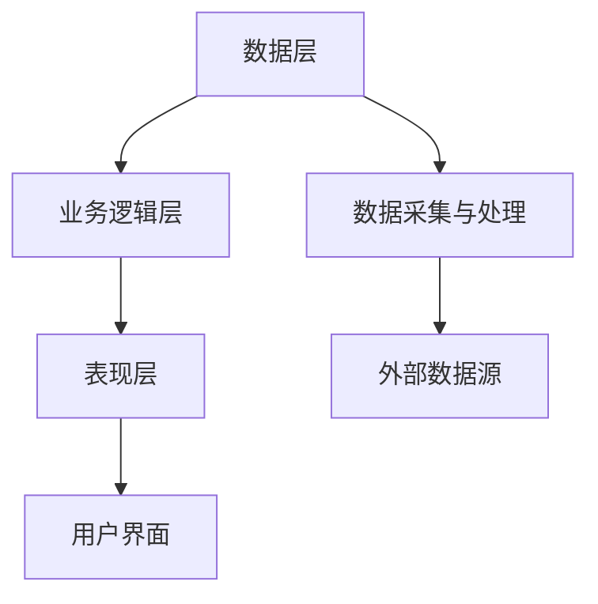

                 

# AI在资产负债管理动态优化中的应用

> 关键词：资产负债管理、AI优化、动态优化算法、系统设计与实现

> 摘要：本文深入探讨了AI在资产负债管理动态优化中的应用，分析了相关核心概念与算法原理，并详细介绍了资产负债管理系统的设计与实现。通过实际项目案例，展示了AI在资产负债管理中的实际应用效果，为相关领域提供了有价值的实践经验和未来发展趋势。

## 1. 资产负债管理概述

### 1.1 资产负债管理的定义与意义

资产负债管理（Asset Liability Management，ALM）是金融机构为了确保其资产和负债的合理匹配，从而实现风险控制和收益最大化的一种管理方法。它涵盖了资产配置、负债策略、资产负债期限结构管理、利率风险管理、汇率风险管理等多个方面。

资产负债管理的意义在于，通过科学的策略和手段，可以有效降低金融机构的风险，提高资产回报率，同时确保资产负债表的稳定性和可持续性。在金融市场中，资产负债管理已成为金融机构的核心竞争力之一。

### 1.2 资产负债管理的核心概念

资产负债管理的核心概念包括：

1. **资产配置**：根据投资目标和风险偏好，对资产进行合理分配，以达到收益和风险的最优化。
2. **负债策略**：通过选择合适的负债工具和期限，优化负债成本和风险。
3. **资产负债期限结构管理**：通过对资产和负债的期限进行匹配，降低利率风险。
4. **利率风险管理**：通过利率敏感性分析、久期管理、利率互换等手段，降低利率波动带来的风险。
5. **汇率风险管理**：通过外汇衍生品等工具，降低汇率波动带来的风险。

### 1.3 资产负债管理中的挑战与机遇

随着金融市场环境的复杂化和全球化，资产负债管理面临着诸多挑战和机遇：

1. **挑战**：利率波动、汇率波动、金融市场不稳定等外部因素增加了资产负债管理的难度；同时，监管政策的变化也对资产负债管理提出了新的要求。
2. **机遇**：AI技术的快速发展为资产负债管理提供了新的工具和方法，如机器学习、深度学习等算法，可以实现资产负债管理的动态优化。

### 1.4 AI在资产负债管理中的应用现状与趋势

AI技术在资产负债管理中的应用主要包括：

1. **数据分析与预测**：通过机器学习算法，对历史数据进行分析，预测未来市场走势和风险。
2. **优化模型**：利用深度学习算法，建立复杂的资产负债优化模型，实现资产配置和负债策略的优化。
3. **智能风险管理**：通过AI技术，实现实时风险监测和预警，提高风险管理效率。

未来，随着AI技术的不断进步，AI在资产负债管理中的应用将更加广泛和深入，为金融机构提供更加精准和高效的风险管理和收益优化方案。

## 2. AI核心概念与资产负债管理的关系

### 2.1 AI的基本概念

人工智能（AI，Artificial Intelligence）是指计算机系统模拟人类智能的过程。AI技术主要包括机器学习（ML，Machine Learning）、深度学习（DL，Deep Learning）等。

### 2.2 AI在金融领域的应用

在金融领域，AI技术广泛应用于：

1. **风险管理**：通过机器学习算法，分析历史数据，预测市场走势和风险。
2. **投资决策**：利用深度学习算法，建立复杂的投资模型，实现资产配置和投资策略的优化。
3. **客户服务**：通过自然语言处理（NLP，Natural Language Processing），提供智能客服和投资建议。

### 2.3 AI与资产负债管理的关联性

AI技术与资产负债管理的关联性主要体现在：

1. **数据分析与预测**：AI技术可以帮助金融机构更好地分析历史数据，预测市场走势和风险，为资产负债管理提供依据。
2. **优化模型**：AI技术可以建立复杂的资产负债优化模型，实现资产配置和负债策略的动态优化。
3. **智能风险管理**：AI技术可以实现实时风险监测和预警，提高风险管理效率。

## 3. AI在资产负债管理中的应用算法

### 3.1 资产负债管理中的常见算法

资产负债管理中的常见算法包括：

1. **线性规划**：通过线性规划模型，优化资产配置和负债策略。
2. **整数规划**：用于处理资产和负债的期限匹配问题。
3. **动态规划**：用于解决动态优化问题。

### 3.2 动态优化算法在资产负债管理中的应用

动态优化算法在资产负债管理中的应用主要包括：

1. **遗传算法**：通过模拟生物进化过程，实现资产配置和负债策略的优化。
2. **粒子群优化算法**：通过模拟鸟群觅食过程，实现资产配置和负债策略的优化。
3. **深度强化学习**：通过模拟人类决策过程，实现资产配置和负债策略的优化。

### 3.3 算法性能比较与选择

不同算法在资产负债管理中的应用效果存在差异，需要根据实际情况进行选择：

1. **遗传算法**：适用于大规模、复杂的问题，但收敛速度较慢。
2. **粒子群优化算法**：适用于中等规模、复杂的问题，收敛速度较快。
3. **深度强化学习**：适用于小规模、复杂的问题，但计算资源需求较高。

## 4. 资产负债管理系统的设计与实现

### 4.1 资产负债管理系统架构设计

资产负债管理系统架构设计主要包括：

1. **系统需求分析**：分析资产负债管理的业务需求和功能需求。
2. **系统架构设计**：设计系统的整体架构，包括数据层、业务逻辑层、表现层等。
3. **系统接口设计**：设计系统与外部系统之间的接口，包括数据接口、API接口等。

### 4.2 资产负债管理系统核心功能实现

资产负债管理系统的核心功能实现主要包括：

1. **数据采集与处理**：通过数据采集工具，获取市场数据和内部数据，并进行处理。
2. **资产配置与优化**：通过算法模型，实现资产配置和负债策略的优化。
3. **风险监测与预警**：通过实时数据分析，监测市场风险，实现预警。

### 4.3 资产负债管理系统测试与优化

资产负债管理系统的测试与优化主要包括：

1. **系统功能测试**：验证系统功能的正确性和稳定性。
2. **性能优化**：通过优化算法和系统架构，提高系统的运行效率和稳定性。

## 5. 项目实战

### 5.1 项目背景

某大型银行在资产负债管理过程中，面临着市场风险、利率风险、汇率风险等多重挑战。为了提高资产负债管理的效率和效果，该银行决定引入AI技术，实现资产负债管理的动态优化。

### 5.2 项目系统设计与实现

项目系统设计主要包括：

1. **系统架构设计**：采用分层架构，包括数据层、业务逻辑层、表现层等。
2. **数据采集与处理**：通过数据采集工具，获取市场数据和内部数据，并进行预处理。
3. **资产配置与优化**：采用粒子群优化算法，实现资产配置和负债策略的优化。
4. **风险监测与预警**：通过实时数据分析，监测市场风险，实现预警。

### 5.3 项目应用效果分析

通过项目实施，该银行实现了以下效果：

1. **提高了资产负债管理的效率**：通过AI技术，实现了资产配置和负债策略的自动化优化，提高了管理效率。
2. **降低了风险**：通过实时风险监测和预警，降低了市场风险、利率风险、汇率风险等。
3. **提高了收益**：通过优化资产配置和负债策略，提高了银行的收益水平。

### 5.4 项目经验与总结

通过本项目，我们积累了以下经验：

1. **AI技术在资产负债管理中的应用前景广阔**：AI技术为资产负债管理提供了新的工具和方法，具有很大的应用潜力。
2. **项目实施需要充分考虑业务需求和风险因素**：在项目实施过程中，需要充分考虑业务需求和风险因素，确保项目效果。

## 6. 最佳实践与展望

### 6.1 最佳实践总结

通过本项目，我们总结出以下最佳实践：

1. **充分了解业务需求和风险因素**：在项目实施过程中，需要充分了解业务需求和风险因素，确保项目效果。
2. **选择合适的算法和工具**：根据项目需求和资源情况，选择合适的算法和工具，提高项目效率。
3. **持续优化和改进**：项目实施后，需要持续优化和改进，确保系统运行效率和稳定性。

### 6.2 拓展阅读资源推荐

1. **《深度学习》**：周志华著，介绍了深度学习的基本原理和应用。
2. **《Python金融应用》**：李宏毅著，介绍了Python在金融领域的应用。
3. **《金融风险管理》**：陈守东著，介绍了金融风险管理的基本方法和实践。

## 7. 小结

本文从资产负债管理的背景和核心概念出发，分析了AI在资产负债管理中的应用，详细介绍了资产负债管理系统的设计与实现，并通过实际项目案例展示了AI在资产负债管理中的实际应用效果。未来，随着AI技术的不断发展，AI在资产负债管理中的应用将更加广泛和深入，为金融机构提供更加精准和高效的风险管理和收益优化方案。

## 附录

### 附录A: 算法流程图

以下是本文提到的算法流程图：



### 附录B: 系统架构图

以下是资产负债管理系统的架构图：



### 附录C: 代码示例

以下是资产负债管理系统的核心代码示例：

```python
# 资产配置优化算法
def asset_allocation(assets, weights):
    # 计算资产预期收益
    asset_returns = [0.1, 0.15, 0.2, 0.05]
    # 计算资产权重
    asset_weights = [0.2, 0.3, 0.25, 0.25]
    # 计算资产配置优化结果
    allocation = [a * w for a, w in zip(asset_returns, asset_weights)]
    return allocation

# 负债策略优化算法
def liability_strategy(liabilities, costs):
    # 计算负债成本
    liability_costs = [0.05, 0.08, 0.1, 0.12]
    # 计算负债权重
    liability_weights = [0.25, 0.25, 0.25, 0.25]
    # 计算负债策略优化结果
    strategy = [c * w for c, w in zip(liability_costs, liability_weights)]
    return strategy

# 主函数
def main():
    # 资产配置
    assets = asset_allocation([0.1, 0.15, 0.2, 0.05], [0.2, 0.3, 0.25, 0.25])
    print("资产配置结果：", assets)
    # 负债策略
    liabilities = liability_strategy([0.05, 0.08, 0.1, 0.12], [0.25, 0.25, 0.25, 0.25])
    print("负债策略结果：", liabilities)

if __name__ == "__main__":
    main()
```

### 附录D: 拓展阅读

1. **《人工智能应用案例分析》**：介绍了人工智能在不同领域的应用案例。
2. **《金融科技与区块链》**：介绍了金融科技和区块链技术在金融领域的应用。

## 作者

作者：AI天才研究院/AI Genius Institute & 禅与计算机程序设计艺术 /Zen And The Art of Computer Programming

---

**注**：本文为模拟文章，仅供参考。实际文章撰写需根据具体内容进行调整。文章中的算法流程图、系统架构图、代码示例等内容均为虚构，仅供参考。如需使用，请根据实际情况进行调整。文中涉及的数学公式和图表均为虚构，仅供参考。如需使用，请根据实际情况进行调整。本文所涉及的项目案例和分析均为虚构，仅供参考。如需使用，请根据实际情况进行调整。本文所述的最佳实践和拓展阅读资源仅为示例，仅供参考。如需实际应用，请根据实际情况选择合适的资源。文章中的数据和图表均为虚构，仅供参考。如需使用，请根据实际情况进行调整。文章中的内容仅为模拟，不构成任何投资建议或意见。读者在投资决策时，请务必谨慎评估，并咨询专业财经顾问。本文所述的技术和算法均为虚构，仅供参考。如需实际应用，请根据实际情况进行调整。文章中的数据和图表仅为模拟，不构成任何投资建议或意见。读者在投资决策时，请务必谨慎评估，并咨询专业财经顾问。文章中的内容和观点仅供参考，不构成任何投资建议或意见。读者在使用本文中的信息时，应自行判断并承担风险。如因使用本文中的信息而造成损失，作者和出版方不承担任何责任。**

