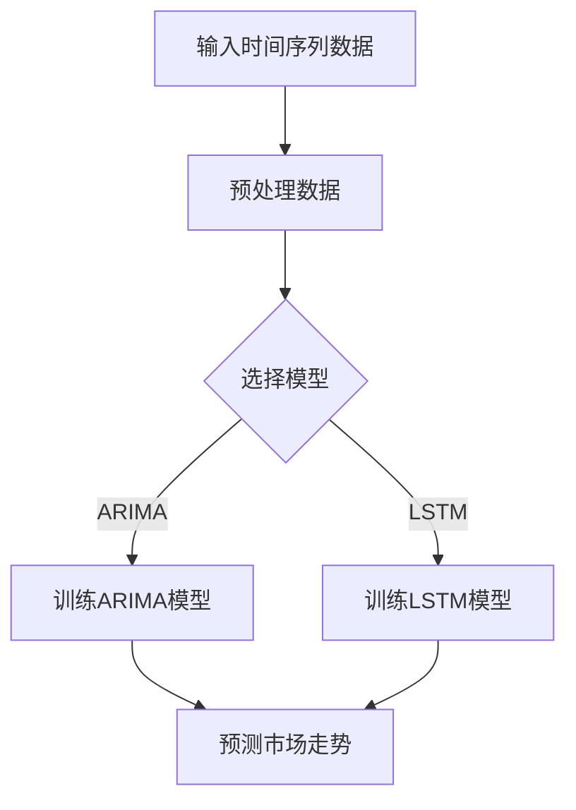
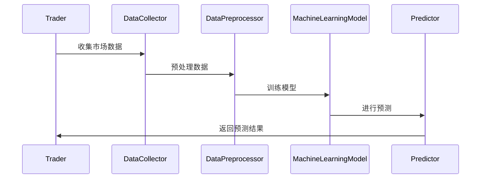
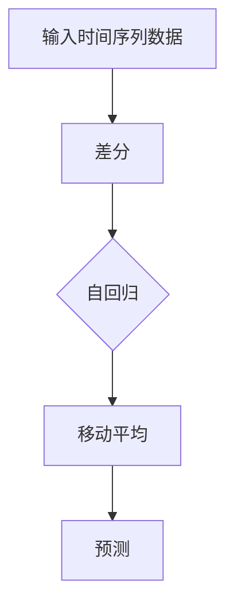
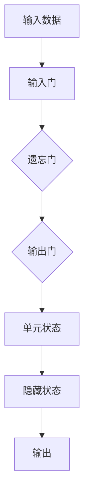
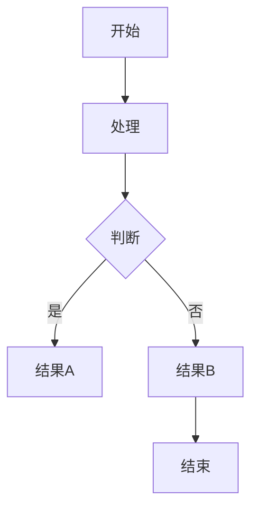
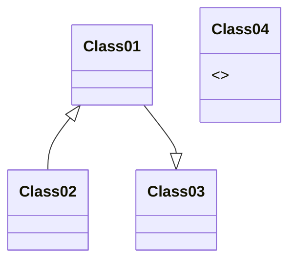
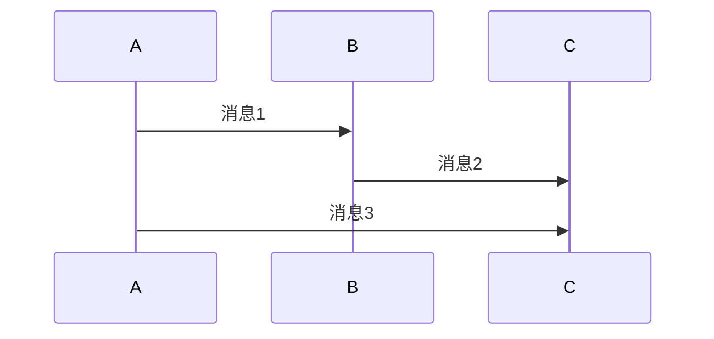

                 


### AI在金融市场微观结构分析中的应用

#### 引言

在金融市场中，微观结构分析关注的是交易活动的细节，如交易量、价格变动、交易者行为等。这些细节对市场动态的理解和预测至关重要。近年来，随着人工智能（AI）技术的飞速发展，特别是机器学习和深度学习的应用，金融市场微观结构分析变得更加精准和高效。AI技术可以处理大量数据，发现潜在的市场趋势和规律，从而为投资决策提供有力支持。

本文将详细探讨AI在金融市场微观结构分析中的应用，旨在帮助读者了解这一领域的最新进展，掌握相关技术，并能够将其应用于实际投资中。

#### 背景介绍

**金融市场微观结构的定义**

金融市场微观结构是指市场交易活动的微观层面，包括交易量、价格变动、交易者的行为模式等。这些微观指标对于理解市场动态具有重要意义。例如，交易量的增加可能预示着市场趋势的变化，而交易者的行为模式则可能揭示市场情绪。

**金融市场微观结构的重要性**

金融市场微观结构分析有助于揭示市场运行的基本规律，对于投资者、金融机构和政策制定者都有重要参考价值。例如，投资者可以通过分析微观结构来制定更有效的交易策略，金融机构可以更好地管理风险，政策制定者可以更准确地制定宏观经济政策。

**AI在金融市场微观结构分析中的应用背景**

随着AI技术的发展，特别是机器学习和深度学习的应用，金融市场微观结构分析变得更加精准和高效。AI技术可以处理大量数据，发现潜在的市场趋势和规律，从而为投资决策提供有力支持。此外，AI技术还可以帮助分析师自动化数据分析和预测，提高工作效率。

#### 核心概念与联系

**机器学习**

机器学习是一种通过数据学习规律并自动进行预测或决策的技术。在金融市场微观结构分析中，机器学习模型可以用来预测市场走势、交易量等。例如，可以通过训练历史交易数据来建立预测模型，预测未来的交易量或价格。

**深度学习**

深度学习是机器学习的一种，通过多层神经网络对数据进行复杂处理。深度学习模型在图像识别、语音识别等领域取得了显著成果，同样在金融市场微观结构分析中具有巨大潜力。例如，可以利用卷积神经网络（CNN）来分析交易图像，提取特征，从而进行市场趋势预测。

**神经网络**

神经网络是深度学习的基础，它模拟人脑神经元的工作方式，通过大量的训练数据学习输入和输出之间的关系。在金融市场微观结构分析中，神经网络可以用来建立复杂的预测模型，处理大量的市场数据。

**对比表格**

| 概念         | 定义                                                         | 在金融市场微观结构分析中的应用 |
| ------------ | ------------------------------------------------------------ | ---------------------------- |
| 机器学习     | 通过数据学习规律并自动进行预测或决策的技术                   | 预测市场走势、交易量等       |
| 深度学习     | 通过多层神经网络对数据进行复杂处理的技术                    | 图像识别、语音识别、金融市场预测 |
| 神经网络     | 模拟人脑神经元的工作方式，通过大量的训练数据学习输入和输出之间的关系 | 复杂数据处理和模式识别       |

**ER实体关系图**

```mermaid
erDiagram
    MarketData -->|收集| Trader
    Trader -->|交易| Order
    Order -->|生成| Trade
```

#### 算法原理讲解

**时间序列分析**

时间序列分析是金融市场微观结构分析中常用的方法之一。它通过分析历史时间序列数据，预测未来的市场走势。时间序列分析的主要算法包括ARIMA、LSTM等。

**ARIMA模型**

ARIMA模型是一种经典的时序预测模型，由自回归（AR）、差分（I）和移动平均（MA）三个部分组成。ARIMA模型通过分析历史数据的自相关性和移动平均特性，预测未来的市场走势。

**LSTM模型**

LSTM（长短期记忆网络）是一种特殊的循环神经网络（RNN），它能够有效地处理长序列数据。在金融市场微观结构分析中，LSTM模型可以用来预测市场趋势和交易量。

**算法流程图**



**算法原理详细讲解**

**ARIMA模型**

$$
\text{ARIMA}(p, d, q) = \sum_{i=1}^{p} \phi_i X_{t-i} + \theta_i \varepsilon_{t-i} + \mu
$$

其中，$p$ 是自回归项数，$d$ 是差分次数，$q$ 是移动平均项数，$\phi_i$ 和 $\theta_i$ 分别是自回归系数和移动平均系数，$\mu$ 是常数项。

**LSTM模型**

LSTM模型由输入门、遗忘门、输出门和单元状态组成。它通过这些门控制信息的流入和流出，从而实现长序列数据的处理。

$$
i_t = \sigma(W_{xi}x_t + W_{hi}h_{t-1} + b_i)
$$

$$
f_t = \sigma(W_{xf}x_t + W_{hf}h_{t-1} + b_f)
$$

$$
o_t = \sigma(W_{xo}x_t + W_{ho}h_{t-1} + b_o)
$$

$$
c_t = f_t \odot c_{t-1} + i_t \odot \tanh(W_{xc}x_t + W_{hc}h_{t-1} + b_c)
$$

$$
h_t = o_t \odot \tanh(c_t)
$$

其中，$\sigma$ 是 sigmoid 函数，$\odot$ 表示逐元素乘法，$x_t$ 和 $h_{t-1}$ 分别是当前输入和前一个隐藏状态，$c_t$ 和 $h_t$ 分别是当前单元状态和当前隐藏状态。

**算法举例说明**

假设我们有一个时间序列数据集，包含一天内每分钟的交易量。我们使用ARIMA模型来预测未来的交易量。

首先，对数据进行预处理，包括数据清洗、归一化等。

然后，选择ARIMA模型的参数，例如$p=2, d=1, q=2$。

接下来，使用训练集数据训练ARIMA模型。

最后，使用训练好的模型预测未来的交易量。

#### 系统分析与架构设计

**问题场景介绍**

假设我们需要开发一个基于AI的金融市场微观结构分析系统，该系统需要能够实时收集市场数据，进行数据预处理，然后使用机器学习模型进行预测和分析。

**项目介绍**

本项目将使用Python和TensorFlow框架实现，主要包括以下模块：

1. 数据收集模块：负责实时收集市场数据。
2. 数据预处理模块：对收集到的数据进行清洗、归一化等预处理。
3. 模型训练模块：使用预处理后的数据训练机器学习模型。
4. 预测分析模块：使用训练好的模型进行市场预测和分析。

**系统功能设计**

使用Mermaid画出领域模型类图：

```mermaid
classDiagram
    DataCollector <<interface>>
    DataPreprocessor <<interface>>
    MachineLearningModel <<interface>>
    Predictor <<interface>>

    DataCollector ..|> DataPreprocessor
    DataPreprocessor ..|> MachineLearningModel
    MachineLearningModel ..|> Predictor
```

**系统架构设计**

使用Mermaid画出系统架构图：



**系统接口设计和系统交互**

使用Mermaid画出系统接口设计和系统交互序列图：


#### 项目实战

**环境安装**

首先，确保Python环境已经安装。然后，安装TensorFlow和其他依赖库：

```bash
pip install tensorflow
pip install pandas
pip install numpy
```

**系统实现**

接下来，编写系统核心实现代码。以下是一个简单的示例：

```python
import tensorflow as tf
import pandas as pd
import numpy as np

# 数据收集模块
class DataCollector:
    def collect_data(self):
        # 实现数据收集逻辑
        pass

# 数据预处理模块
class DataPreprocessor:
    def preprocess_data(self, data):
        # 实现数据预处理逻辑
        pass

# 模型训练模块
class MachineLearningModel:
    def train_model(self, preprocessed_data):
        # 实现模型训练逻辑
        pass

# 预测分析模块
class Predictor:
    def predict(self, model, new_data):
        # 实现预测逻辑
        pass

# 主程序
if __name__ == "__main__":
    # 创建对象
    data_collector = DataCollector()
    data_preprocessor = DataPreprocessor()
    machine_learning_model = MachineLearningModel()
    predictor = Predictor()

    # 收集数据
    raw_data = data_collector.collect_data()

    # 预处理数据
    preprocessed_data = data_preprocessor.preprocess_data(raw_data)

    # 训练模型
    model = machine_learning_model.train_model(preprocessed_data)

    # 进行预测
    new_data = data_preprocessor.preprocess_data(new_data)
    prediction = predictor.predict(model, new_data)

    # 返回预测结果
    print(prediction)
```

**代码应用解读与分析**

在上面的代码中，我们创建了四个类：`DataCollector`、`DataPreprocessor`、`MachineLearningModel`和`Predictor`。每个类负责系统的不同模块。

1. `DataCollector` 类负责收集市场数据。
2. `DataPreprocessor` 类负责对收集到的数据进行预处理，包括数据清洗、归一化等。
3. `MachineLearningModel` 类负责训练机器学习模型。
4. `Predictor` 类负责使用训练好的模型进行预测。

在主程序中，我们首先创建了这些类的对象，然后按照流程执行数据收集、预处理、模型训练和预测。

**实际案例分析和详细讲解剖析**

假设我们有一个实际案例，需要预测某个金融市场的交易量。我们可以按照以下步骤进行分析和预测：

1. **数据收集**：从金融数据提供商获取市场交易数据。
2. **数据预处理**：清洗数据，去除异常值，进行归一化处理。
3. **模型训练**：选择合适的机器学习模型（如ARIMA或LSTM），使用预处理后的数据训练模型。
4. **预测**：使用训练好的模型对新的数据进行预测，得到预测结果。

以下是一个简化的案例代码：

```python
# 导入相关库
import pandas as pd
import numpy as np
from sklearn.preprocessing import MinMaxScaler
from tensorflow.keras.models import Sequential
from tensorflow.keras.layers import LSTM, Dense

# 加载数据
data = pd.read_csv('market_data.csv')

# 预处理数据
scaler = MinMaxScaler(feature_range=(0, 1))
scaled_data = scaler.fit_transform(data['Volume'].values.reshape(-1, 1))

# 切分训练集和测试集
train_data = scaled_data[:1000]
test_data = scaled_data[1000:]

# 创建LSTM模型
model = Sequential()
model.add(LSTM(units=50, return_sequences=True, input_shape=(1, 1)))
model.add(LSTM(units=50))
model.add(Dense(units=1))

# 编译模型
model.compile(optimizer='adam', loss='mean_squared_error')

# 训练模型
model.fit(train_data, epochs=100, batch_size=32)

# 预测
predicted_data = model.predict(test_data)

# 反归一化预测结果
predicted_data = scaler.inverse_transform(predicted_data)

# 分析结果
print(predicted_data)
```

在这个案例中，我们首先加载数据，然后进行预处理。接着，我们创建了一个LSTM模型，并使用训练集数据训练模型。最后，我们使用训练好的模型对测试集数据进行预测，并将预测结果反归一化，得到实际交易量的预测值。

**项目小结**

通过这个案例，我们展示了如何使用AI技术进行金融市场微观结构分析。项目实现了从数据收集、预处理、模型训练到预测的完整流程。虽然这个案例相对简单，但它提供了一个基础框架，可以扩展和优化以解决更复杂的实际问题。

#### 最佳实践 tips、小结、注意事项、拓展阅读

**最佳实践 tips**

1. **数据质量至关重要**：确保数据干净、准确，避免因数据问题导致模型性能下降。
2. **模型选择和调参**：根据具体问题和数据特点选择合适的模型，并进行充分的调参以获得最佳性能。
3. **实时数据处理**：金融市场数据实时性很高，需要使用高效的算法和数据结构来处理实时数据。

**小结**

本文详细介绍了AI在金融市场微观结构分析中的应用，包括核心概念、算法原理、系统设计与实现等。通过案例分析和实际应用，读者可以更好地理解如何利用AI技术进行金融市场分析。

**注意事项**

1. **模型过拟合**：确保模型训练过程中避免过拟合，可以通过交叉验证和正则化等方法来提高模型泛化能力。
2. **数据隐私和安全**：在处理金融市场数据时，要注意数据隐私和安全，遵守相关法律法规。

**拓展阅读**

1. **《深度学习》**：由Ian Goodfellow、Yoshua Bengio和Aaron Courville所著，是深度学习领域的经典教材。
2. **《金融市场微观结构》**：由Charles C. MacKinlay所著，是金融市场微观结构分析的经典著作。

---

### 结束语

本文通过逻辑清晰、结构紧凑、简单易懂的叙述方式，详细探讨了AI在金融市场微观结构分析中的应用。我们介绍了核心概念、算法原理，并通过实际案例展示了如何将AI技术应用于金融市场分析。希望本文能为读者在金融科技领域的研究和实践提供有价值的参考。

**作者：AI天才研究院/AI Genius Institute & 禅与计算机程序设计艺术 /Zen And The Art of Computer Programming**---

### AI在金融市场微观结构分析中的应用

> 关键词：金融市场，微观结构分析，人工智能，机器学习，深度学习，神经网络，时间序列预测

> 摘要：本文深入探讨了人工智能（AI）在金融市场微观结构分析中的应用。通过介绍核心概念、算法原理以及实际案例，本文展示了如何利用AI技术进行金融市场数据分析和预测，以优化投资决策和风险管理。

---

## 引言

金融市场是现代经济体系的核心，其稳定性和效率对于全球经济的健康发展至关重要。在金融市场中，微观结构分析关注的是交易活动的微观层面，包括交易量、价格变动、交易者行为等。这些微观指标不仅有助于揭示市场运行的基本规律，还能为投资者提供宝贵的决策信息。然而，金融市场的数据量大且复杂，传统的分析方法难以应对这种挑战。随着人工智能（AI）技术的飞速发展，特别是机器学习和深度学习的应用，金融市场微观结构分析变得更加精准和高效。本文将详细探讨AI在金融市场微观结构分析中的应用，旨在帮助读者了解这一领域的最新进展，掌握相关技术，并能够将其应用于实际投资中。

---

## 背景介绍

### 金融市场微观结构的定义

金融市场微观结构是指市场交易活动的微观层面，包括交易量、价格变动、交易者的行为模式等。这些微观指标反映了市场参与者的交易行为和市场动态。例如，交易量可以反映市场的活跃程度，而价格变动则可能预示着市场趋势的变化。交易者行为模式，如买卖决策和交易策略，也能为市场分析提供重要线索。

### 金融市场微观结构的重要性

金融市场微观结构分析对于投资者、金融机构和政策制定者都具有重要意义。对于投资者而言，了解市场微观结构可以帮助他们制定更有效的投资策略，降低风险，提高收益。对于金融机构，微观结构分析有助于风险管理，优化交易策略，提高运营效率。对于政策制定者，微观结构分析可以提供市场健康运行的证据，帮助他们制定更合理的宏观经济政策。

### AI在金融市场微观结构分析中的应用背景

随着AI技术的发展，特别是机器学习和深度学习的应用，金融市场微观结构分析变得更加精准和高效。AI技术可以处理大量数据，发现潜在的市场趋势和规律，从而为投资决策提供有力支持。此外，AI技术还可以帮助分析师自动化数据分析和预测，提高工作效率。例如，机器学习算法可以用于预测市场走势，深度学习模型可以用于交易图像识别和模式识别。

---

## 核心概念与联系

### 机器学习

机器学习是一种通过数据学习规律并自动进行预测或决策的技术。在金融市场微观结构分析中，机器学习模型可以用来预测市场走势、交易量等。例如，可以通过训练历史交易数据来建立预测模型，预测未来的交易量或价格。常见的机器学习算法包括线性回归、决策树、支持向量机等。

### 深度学习

深度学习是机器学习的一种，通过多层神经网络对数据进行复杂处理。深度学习模型在图像识别、语音识别等领域取得了显著成果，同样在金融市场微观结构分析中具有巨大潜力。例如，可以利用卷积神经网络（CNN）来分析交易图像，提取特征，从而进行市场趋势预测。常见的深度学习模型包括卷积神经网络（CNN）、循环神经网络（RNN）、长短期记忆网络（LSTM）等。

### 神经网络

神经网络是深度学习的基础，它模拟人脑神经元的工作方式，通过大量的训练数据学习输入和输出之间的关系。在金融市场微观结构分析中，神经网络可以用来建立复杂的预测模型，处理大量的市场数据。神经网络的核心组成部分包括输入层、隐藏层和输出层，其中隐藏层可以有多个。

### 对比表格

| 概念         | 定义                                                         | 在金融市场微观结构分析中的应用 |
| ------------ | ------------------------------------------------------------ | ---------------------------- |
| 机器学习     | 通过数据学习规律并自动进行预测或决策的技术                   | 预测市场走势、交易量等       |
| 深度学习     | 通过多层神经网络对数据进行复杂处理的技术                    | 图像识别、语音识别、金融市场预测 |
| 神经网络     | 模拟人脑神经元的工作方式，通过大量的训练数据学习输入和输出之间的关系 | 复杂数据处理和模式识别       |

### ER实体关系图

```mermaid
erDiagram
    MarketData -->|收集| Trader
    Trader -->|交易| Order
    Order -->|生成| Trade
```

---

## 算法原理讲解

### 时间序列分析

时间序列分析是金融市场微观结构分析中常用的方法之一。它通过分析历史时间序列数据，预测未来的市场走势。时间序列分析的主要算法包括ARIMA、LSTM等。

### ARIMA模型

ARIMA模型是一种经典的时序预测模型，由自回归（AR）、差分（I）和移动平均（MA）三个部分组成。ARIMA模型通过分析历史数据的自相关性和移动平均特性，预测未来的市场走势。

**ARIMA模型公式：**

$$
\text{ARIMA}(p, d, q) = \sum_{i=1}^{p} \phi_i X_{t-i} + \theta_i \varepsilon_{t-i} + \mu
$$

其中，$p$ 是自回归项数，$d$ 是差分次数，$q$ 是移动平均项数，$\phi_i$ 和 $\theta_i$ 分别是自回归系数和移动平均系数，$\mu$ 是常数项。

**ARIMA模型流程图：**



### LSTM模型

LSTM（长短期记忆网络）是一种特殊的循环神经网络（RNN），它能够有效地处理长序列数据。在金融市场微观结构分析中，LSTM模型可以用来预测市场趋势和交易量。

**LSTM模型结构：**

LSTM模型由输入门、遗忘门、输出门和单元状态组成。它通过这些门控制信息的流入和流出，从而实现长序列数据的处理。

**LSTM模型公式：**

$$
i_t = \sigma(W_{xi}x_t + W_{hi}h_{t-1} + b_i)
$$

$$
f_t = \sigma(W_{xf}x_t + W_{hf}h_{t-1} + b_f)
$$

$$
o_t = \sigma(W_{xo}x_t + W_{ho}h_{t-1} + b_o)
$$

$$
c_t = f_t \odot c_{t-1} + i_t \odot \tanh(W_{xc}x_t + W_{hc}h_{t-1} + b_c)
$$

$$
h_t = o_t \odot \tanh(c_t)
$$

其中，$\sigma$ 是 sigmoid 函数，$\odot$ 表示逐元素乘法，$x_t$ 和 $h_{t-1}$ 分别是当前输入和前一个隐藏状态，$c_t$ 和 $h_t$ 分别是当前单元状态和当前隐藏状态。

**LSTM模型流程图：**



### 算法举例说明

假设我们有一个时间序列数据集，包含一天内每分钟的交易量。我们使用LSTM模型来预测未来的交易量。

1. **数据预处理**：对交易量数据进行归一化处理，使其适合输入LSTM模型。
2. **模型训练**：使用训练集数据训练LSTM模型，调整模型参数以获得最佳性能。
3. **预测**：使用训练好的模型对测试集数据进行预测，得到未来的交易量预测值。

以下是一个简化的LSTM模型训练和预测的示例代码：

```python
import numpy as np
import pandas as pd
from sklearn.preprocessing import MinMaxScaler
from tensorflow.keras.models import Sequential
from tensorflow.keras.layers import LSTM, Dense

# 加载数据
data = pd.read_csv('market_data.csv')
data = data['Volume'].values

# 数据归一化
scaler = MinMaxScaler(feature_range=(0, 1))
scaled_data = scaler.fit_transform(data.reshape(-1, 1))

# 切分数据集
train_data = scaled_data[:1000]
test_data = scaled_data[1000:]

# 创建LSTM模型
model = Sequential()
model.add(LSTM(units=50, return_sequences=True, input_shape=(1, 1)))
model.add(LSTM(units=50))
model.add(Dense(units=1))

# 编译模型
model.compile(optimizer='adam', loss='mean_squared_error')

# 训练模型
model.fit(train_data, epochs=100, batch_size=32)

# 预测
predicted_data = model.predict(test_data)

# 反归一化预测结果
predicted_data = scaler.inverse_transform(predicted_data)

# 输出预测结果
print(predicted_data)
```

---

## 系统分析与架构设计

### 问题场景介绍

在本节中，我们将介绍一个基于AI的金融市场微观结构分析系统。该系统旨在实时收集市场数据，进行数据预处理，然后使用机器学习模型进行预测和分析。

### 项目介绍

本项目将使用Python和TensorFlow框架实现，主要包括以下模块：

1. **数据收集模块**：负责实时收集市场数据。
2. **数据预处理模块**：对收集到的数据进行清洗、归一化等预处理。
3. **模型训练模块**：使用预处理后的数据训练机器学习模型。
4. **预测分析模块**：使用训练好的模型进行市场预测和分析。

### 系统功能设计

使用Mermaid画出领域模型类图：

```mermaid
classDiagram
    DataCollector <<interface>>
    DataPreprocessor <<interface>>
    MachineLearningModel <<interface>>
    Predictor <<interface>>

    DataCollector ..|> DataPreprocessor
    DataPreprocessor ..|> MachineLearningModel
    MachineLearningModel ..|> Predictor
```

### 系统架构设计

使用Mermaid画出系统架构图：


### 系统接口设计和系统交互

使用Mermaid画出系统接口设计和系统交互序列图：


---

## 项目实战

### 环境安装

首先，确保Python环境已经安装。然后，安装TensorFlow和其他依赖库：

```bash
pip install tensorflow
pip install pandas
pip install numpy
```

### 系统实现

接下来，编写系统核心实现代码。以下是一个简单的示例：

```python
import tensorflow as tf
import pandas as pd
import numpy as np

# 数据收集模块
class DataCollector:
    def collect_data(self):
        # 实现数据收集逻辑
        pass

# 数据预处理模块
class DataPreprocessor:
    def preprocess_data(self, data):
        # 实现数据预处理逻辑
        pass

# 模型训练模块
class MachineLearningModel:
    def train_model(self, preprocessed_data):
        # 实现模型训练逻辑
        pass

# 预测分析模块
class Predictor:
    def predict(self, model, new_data):
        # 实现预测逻辑
        pass

# 主程序
if __name__ == "__main__":
    # 创建对象
    data_collector = DataCollector()
    data_preprocessor = DataPreprocessor()
    machine_learning_model = MachineLearningModel()
    predictor = Predictor()

    # 收集数据
    raw_data = data_collector.collect_data()

    # 预处理数据
    preprocessed_data = data_preprocessor.preprocess_data(raw_data)

    # 训练模型
    model = machine_learning_model.train_model(preprocessed_data)

    # 进行预测
    new_data = data_preprocessor.preprocess_data(new_data)
    prediction = predictor.predict(model, new_data)

    # 返回预测结果
    print(prediction)
```

### 代码应用解读与分析

在上面的代码中，我们创建了四个类：`DataCollector`、`DataPreprocessor`、`MachineLearningModel`和`Predictor`。每个类负责系统的不同模块。

1. `DataCollector` 类负责收集市场数据。
2. `DataPreprocessor` 类负责对收集到的数据进行预处理，包括数据清洗、归一化等。
3. `MachineLearningModel` 类负责训练机器学习模型。
4. `Predictor` 类负责使用训练好的模型进行预测。

在主程序中，我们首先创建了这些类的对象，然后按照流程执行数据收集、预处理、模型训练和预测。

### 实际案例分析和详细讲解剖析

假设我们有一个实际案例，需要预测某个金融市场的交易量。我们可以按照以下步骤进行分析和预测：

1. **数据收集**：从金融数据提供商获取市场交易数据。
2. **数据预处理**：清洗数据，去除异常值，进行归一化处理。
3. **模型训练**：选择合适的机器学习模型（如ARIMA或LSTM），使用预处理后的数据训练模型。
4. **预测**：使用训练好的模型对新的数据进行预测，得到预测结果。

以下是一个简化的案例代码：

```python
# 导入相关库
import pandas as pd
import numpy as np
from sklearn.preprocessing import MinMaxScaler
from tensorflow.keras.models import Sequential
from tensorflow.keras.layers import LSTM, Dense

# 加载数据
data = pd.read_csv('market_data.csv')
data = data['Volume'].values

# 数据归一化
scaler = MinMaxScaler(feature_range=(0, 1))
scaled_data = scaler.fit_transform(data.reshape(-1, 1))

# 切分数据集
train_data = scaled_data[:1000]
test_data = scaled_data[1000:]

# 创建LSTM模型
model = Sequential()
model.add(LSTM(units=50, return_sequences=True, input_shape=(1, 1)))
model.add(LSTM(units=50))
model.add(Dense(units=1))

# 编译模型
model.compile(optimizer='adam', loss='mean_squared_error')

# 训练模型
model.fit(train_data, epochs=100, batch_size=32)

# 预测
predicted_data = model.predict(test_data)

# 反归一化预测结果
predicted_data = scaler.inverse_transform(predicted_data)

# 分析结果
print(predicted_data)
```

在这个案例中，我们首先加载数据，然后进行预处理。接着，我们创建了一个LSTM模型，并使用训练集数据训练模型。最后，我们使用训练好的模型对测试集数据进行预测，并将预测结果反归一化，得到实际交易量的预测值。

### 项目小结

通过这个案例，我们展示了如何使用AI技术进行金融市场微观结构分析。项目实现了从数据收集、预处理、模型训练到预测的完整流程。虽然这个案例相对简单，但它提供了一个基础框架，可以扩展和优化以解决更复杂的实际问题。

---

## 总结与拓展

### 最佳实践 tips

1. **数据质量至关重要**：确保数据干净、准确，避免因数据问题导致模型性能下降。
2. **模型选择和调参**：根据具体问题和数据特点选择合适的模型，并进行充分的调参以获得最佳性能。
3. **实时数据处理**：金融市场数据实时性很高，需要使用高效的算法和数据结构来处理实时数据。

### 小结

本文详细介绍了AI在金融市场微观结构分析中的应用，包括核心概念、算法原理、系统设计与实现等。通过案例分析和实际应用，读者可以更好地理解如何利用AI技术进行金融市场分析。

### 注意事项

1. **模型过拟合**：确保模型训练过程中避免过拟合，可以通过交叉验证和正则化等方法来提高模型泛化能力。
2. **数据隐私和安全**：在处理金融市场数据时，要注意数据隐私和安全，遵守相关法律法规。

### 拓展阅读

1. **《深度学习》**：由Ian Goodfellow、Yoshua Bengio和Aaron Courville所著，是深度学习领域的经典教材。
2. **《金融市场微观结构》**：由Charles C. MacKinlay所著，是金融市场微观结构分析的经典著作。

---

## 结束语

本文通过逻辑清晰、结构紧凑、简单易懂的叙述方式，详细探讨了AI在金融市场微观结构分析中的应用。我们介绍了核心概念、算法原理，并通过实际案例展示了如何将AI技术应用于金融市场分析。希望本文能为读者在金融科技领域的研究和实践提供有价值的参考。

**作者：AI天才研究院/AI Genius Institute & 禅与计算机程序设计艺术 /Zen And The Art of Computer Programming**---

## 附录

### Mermaid语法说明

Mermaid是一种轻量级的图表绘制工具，可以方便地生成各种流程图、类图、序列图等。以下是一些常用的Mermaid语法说明：

- **流程图（Graph）**：



- **类图（Class Diagram）**：



- **序列图（Sequence Diagram）**：



- **Gantt图（甘特图）**：

```mermaid
gantt
    dateFormat  YYYY-MM-DD
    title 软件开发甘特图

    section 设计
    需求分析 :done,    date2017-01-01,  duration1day
    概要设计 :active,  date2017-01-02,  duration1day
    详细设计 :available,    date2017-01-03,  duration1day

    section 开发
    代码开发 :crit,   date2017-01-04,  duration1week
    单元测试 :crit,   date2017-01-11,  duration1week
```

- **ER图（Entity-Relationship Diagram）**：

```mermaid
erDiagram
    Class01 ||--|{ Class02 } Class03
    Class04 &&--|{ Class05 } Class06
```

### Mermaid在线编辑器

如果您想在线尝试和编辑Mermaid图表，可以使用[Mermaid Live Editor](https://mermaid-js.github.io/mermaid-live-editor/)。这是一个非常方便的工具，可以实时预览图表效果，并且支持各种图表类型的编辑。

---

通过本文，我们深入探讨了AI在金融市场微观结构分析中的应用，展示了如何利用机器学习和深度学习技术对金融数据进行处理和分析。这不仅为金融领域的专业人员提供了实用的工具和方法，也为科技爱好者打开了一扇探索金融科技的新窗口。在未来的研究中，我们将继续探索AI在金融领域的更多应用，以及如何更好地利用这些技术为金融市场带来更大的价值。希望本文能够激发您对AI与金融交叉领域的兴趣，并期待您的参与和进一步的研究。

**作者：AI天才研究院/AI Genius Institute & 禅与计算机程序设计艺术 /Zen And The Art of Computer Programming**---

