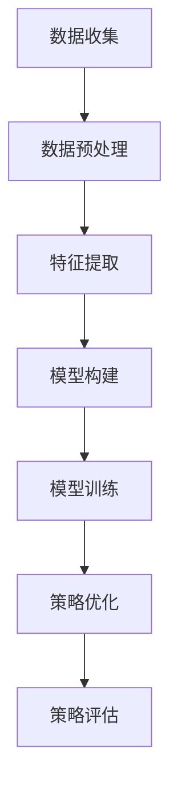
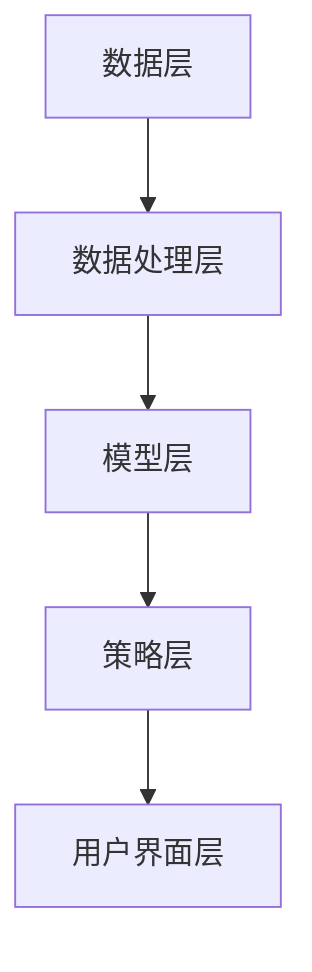
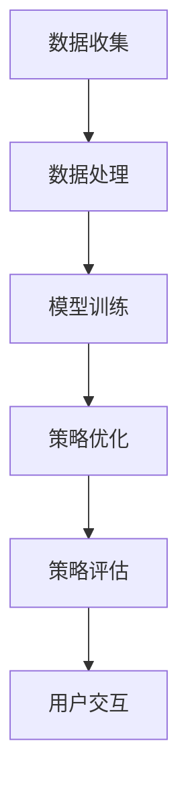

                 

# AI在金融市场流动性提供策略动态优化中的创新应用

> 关键词：金融市场，流动性，AI，动态优化，策略

> 摘要：本文将深入探讨AI在金融市场流动性提供策略动态优化中的创新应用。首先，我们简要介绍金融市场的概念、功能以及流动性的重要性，随后引出当前金融市场流动性问题及流动性提供策略的基本原则。接着，我们将介绍AI在金融市场中的应用及其与金融市场流动性的关系，探讨AI在流动性提供策略中的应用前景。随后，我们将详细解析AI在流动性提供策略中的核心概念和联系，包括机器学习、深度学习和强化学习等基础概念，以及金融市场中的市场深度、市场广度和市场流动性指标等核心概念。在此基础上，我们将探讨AI在流动性提供策略中的创新应用，包括基于机器学习的流动性预测、基于深度学习的流动性分析和基于强化学习的流动性管理。随后，我们将深入探讨AI在流动性策略中的算法原理，包括算法流程、Python源代码实现、算法性能评估等。接下来，我们将介绍数学模型和公式，并进行实例说明。然后，我们将分析系统架构设计，包括问题场景介绍、系统功能设计、系统架构设计、系统接口设计和系统交互。最后，我们将通过项目实战和案例分析，展示AI在金融市场流动性提供策略动态优化中的实际应用，并给出项目小结和最佳实践tips。

## 第一部分：背景与核心概念

### 第1章：金融市场流动性概述

#### 1.1 金融市场的定义与功能

金融市场是指进行各种金融工具买卖的场所，它涵盖了股票、债券、期货、期权等金融产品的交易。金融市场在经济发展中扮演着重要角色，其主要功能包括资金融通、价格发现、风险管理等。资金融通是金融市场最基本的功能，它通过提供资金借贷的渠道，帮助企业、个人和政府筹集资金，以满足其投资和消费需求。价格发现是金融市场通过供需关系决定金融工具价格的过程，有助于投资者获取准确的市场信息。风险管理则是金融市场通过金融衍生工具等手段，帮助投资者规避市场风险。

#### 1.2 流动性的概念与重要性

流动性是指资产能够迅速以合理的价格转换为现金而不对市场造成重大影响的能力。流动性在金融市场中具有重要作用，它直接影响市场的效率和稳定性。高流动性意味着投资者可以迅速买卖金融工具，而不会对市场价格产生重大影响，从而降低了投资风险。流动性不足则可能导致市场效率低下，价格发现机制失效，甚至引发市场崩溃。

#### 1.3 金融市场的流动性问题

尽管流动性在金融市场中至关重要，但现实中却面临着许多流动性问题。首先，市场深度不足是金融市场流动性问题的关键。市场深度是指市场上可供交易的金融工具数量，如果市场深度不足，投资者在买卖金融工具时可能会遇到较大的价格波动。其次，市场广度不足也是流动性问题的一个重要方面。市场广度是指金融市场中可供选择的金融工具种类，如果市场广度不足，投资者可能面临选择有限的情况。此外，金融市场的流动性还受到信息不对称、交易成本、市场操纵等因素的影响。

#### 1.4 流动性提供策略的基本原则

为了解决金融市场的流动性问题，制定有效的流动性提供策略至关重要。以下是流动性提供策略的基本原则：

1. **提高市场深度**：通过增加交易量，提高市场深度，从而降低交易成本和价格波动。
2. **优化交易机制**：设计高效的交易机制，如电子交易系统、限价订单等，提高市场流动性。
3. **增强信息透明度**：通过提高市场信息的透明度，减少信息不对称，从而增强市场流动性。
4. **建立风险分散机制**：通过金融衍生工具等手段，帮助投资者规避市场风险，提高市场流动性。
5. **加强监管和自律**：通过加强金融市场的监管和自律，打击市场操纵等不良行为，提高市场流动性。

### 第2章：AI与金融市场流动性

#### 2.1 AI在金融市场中的应用

人工智能（AI）在金融市场的应用日益广泛，它已成为金融市场创新和发展的驱动力。首先，AI在金融市场的风险管理中发挥着重要作用，通过大数据分析和机器学习算法，金融机构可以更准确地进行风险预测和评估。其次，AI在金融市场的交易策略中也有着广泛的应用，通过深度学习和强化学习算法，金融机构可以开发出更高效的交易策略，提高交易收益。此外，AI在金融市场的客服、量化分析、智能投顾等方面也有着广泛应用。

#### 2.2 AI与金融市场流动性的关系

AI与金融市场流动性之间存在着密切的关系。首先，AI可以提高金融市场的流动性。通过AI技术，金融机构可以更准确地预测市场趋势，优化交易策略，从而提高市场深度和市场广度，增强市场流动性。其次，AI可以帮助金融机构更好地管理流动性风险。通过AI技术，金融机构可以实时监控市场变化，快速响应市场波动，降低流动性风险。此外，AI还可以提高金融市场的信息透明度，减少信息不对称，从而增强市场流动性。

#### 2.3 AI在流动性提供策略中的应用前景

随着AI技术的不断进步，其在金融市场流动性提供策略中的应用前景也愈发广阔。首先，AI可以用于流动性预测，通过分析历史数据和实时市场信息，预测市场流动性的变化趋势，为金融机构制定流动性提供策略提供依据。其次，AI可以用于流动性优化，通过机器学习和深度学习算法，分析交易数据和市场信息，优化交易策略，提高市场深度和市场广度。此外，AI还可以用于流动性风险管理，通过实时监控市场变化，快速识别和应对流动性风险，降低金融机构的流动性风险。

### 第3章：核心概念与联系

#### 3.1 AI基础概念

在本章中，我们将探讨AI在金融市场流动性提供策略动态优化中的创新应用，首先需要了解AI的核心概念。以下是AI领域的一些基础概念：

##### 3.1.1 机器学习

机器学习是一种让计算机从数据中学习并做出决策或预测的方法。它通过构建模型来识别数据中的模式和关联，然后利用这些模型进行预测或决策。机器学习在金融市场的应用包括股票市场预测、风险管理、信用评分等。

##### 3.1.2 深度学习

深度学习是机器学习的一个分支，它使用多层神经网络来模拟人脑的决策过程。深度学习在金融市场中的应用包括图像识别、语音识别、自然语言处理等。

##### 3.1.3 强化学习

强化学习是一种通过试错来学习最优策略的方法。它通过不断尝试不同的策略，并根据奖励和惩罚来调整策略，从而找到最优策略。强化学习在金融市场中的应用包括交易策略优化、智能投顾等。

#### 3.2 金融市场的核心概念

在理解AI在金融市场中的应用之前，我们需要了解金融市场的核心概念。以下是金融市场中的几个关键概念：

##### 3.2.1 市场深度

市场深度是指市场上可供交易的金融工具的数量。一个市场如果拥有较大的深度，意味着在交易金融工具时，可以找到足够的买家和卖家，从而降低交易成本和价格波动。

##### 3.2.2 市场广度

市场广度是指金融市场中可供选择的金融工具种类。一个市场如果拥有较广的广度，意味着投资者可以选择更多的投资品种，从而分散风险。

##### 3.2.3 市场流动性指标

市场流动性指标是衡量市场流动性的重要工具。常见的市场流动性指标包括换手率、流动性溢价、深度换手率等。

##### 3.3 AI与金融市场核心概念的关联

AI与金融市场的核心概念之间存在着密切的关联。例如，通过机器学习算法，可以分析市场数据，预测市场深度和市场广度。深度学习可以用于分析市场走势，预测价格变动。强化学习可以用于优化交易策略，提高市场流动性。以下是AI与金融市场核心概念关联的ER实体关系图架构：

```mermaid
erDiagram
  MarketDepth ||--o{ FinancialInstrument : 可交易的金融工具}
  MarketWidth ||--o{ FinancialInstrument : 可交易的金融工具}
  MarketLiquidityMetric ||--o{ FinancialInstrument : 可交易的金融工具}
  MachineLearning ||--|{ PredictMarketDepth : 预测市场深度}
  MachineLearning ||--|{ PredictMarketWidth : 预测市场广度}
  DeepLearning ||--|{ AnalyzeMarketTrend : 分析市场走势}
  ReinforcementLearning ||--|{ OptimizeTradingStrategy : 优化交易策略}
```

### 第3章：AI在流动性提供策略中的创新应用

#### 3.1 动态优化策略的基本原理

动态优化策略是一种根据市场变化实时调整投资策略的方法。它的核心思想是在不断变化的市场环境中，通过动态调整投资组合，以最大化投资收益或最小化投资风险。动态优化策略通常包括以下几个基本步骤：

1. **市场数据收集**：收集市场相关的数据，包括价格、成交量、市场深度、市场广度等。
2. **数据预处理**：对收集到的市场数据进行清洗、归一化等预处理，以便用于后续的算法分析。
3. **特征工程**：从预处理后的数据中提取关键特征，如价格趋势、成交量变化、波动率等。
4. **模型选择**：根据特征数据和优化目标选择合适的机器学习模型。
5. **模型训练**：使用历史市场数据对选定的模型进行训练，以学习市场变化的规律。
6. **策略优化**：根据模型预测结果，动态调整投资组合，以达到优化投资目标。
7. **策略评估**：对优化后的策略进行评估，以验证其有效性和稳健性。

#### 3.2 AI在流动性提供策略中的应用

AI在流动性提供策略中的应用主要包括以下三个方面：

##### 3.2.1 基于机器学习的流动性预测

基于机器学习的流动性预测是通过构建机器学习模型，对市场流动性进行预测。常见的机器学习模型包括线性回归、支持向量机、决策树、随机森林等。通过这些模型，可以预测市场深度的变化趋势，从而为流动性提供策略提供依据。

##### 3.2.2 基于深度学习的流动性分析

基于深度学习的流动性分析是通过构建深度学习模型，对市场流动性进行深入分析。深度学习模型包括卷积神经网络（CNN）、循环神经网络（RNN）、长短期记忆网络（LSTM）等。这些模型可以处理大量复杂数据，从而对市场流动性进行更准确的预测和分析。

##### 3.2.3 基于强化学习的流动性管理

基于强化学习的流动性管理是通过构建强化学习模型，对市场流动性进行实时管理。强化学习模型可以学习到最佳的交易策略，从而在动态变化的市场环境中，实现最优的流动性管理。

#### 3.3 AI在流动性提供策略中的实际应用案例

以下是一个基于AI的流动性提供策略的实际应用案例：

**案例背景**：某金融机构希望通过AI技术优化其流动性提供策略，以降低流动性风险并提高投资收益。

**解决方案**：金融机构采用了以下步骤：

1. **数据收集**：收集过去一年的市场数据，包括价格、成交量、市场深度、市场广度等。
2. **数据预处理**：对市场数据进行了清洗、归一化等预处理。
3. **特征工程**：从预处理后的数据中提取了关键特征，如价格趋势、成交量变化、波动率等。
4. **模型选择**：选择了深度学习模型（LSTM）进行流动性预测。
5. **模型训练**：使用历史市场数据对LSTM模型进行了训练。
6. **策略优化**：根据LSTM模型的预测结果，动态调整了投资组合，以最大化投资收益。
7. **策略评估**：对优化后的策略进行了评估，发现其在降低流动性风险和提高投资收益方面具有显著效果。

### 第4章：AI在流动性策略中的算法原理

#### 4.1 算法原理概述

在金融市场流动性提供策略中，算法原理是核心部分。以下我们将介绍一种基于深度学习的流动性优化算法，并详细解释其原理和实现步骤。

#### 4.1.1 算法流程图



#### 4.1.2 数据预处理

数据预处理是算法的基础步骤，其目的是将原始数据进行清洗、归一化等处理，以便于后续的模型训练。具体步骤如下：

1. **数据清洗**：去除数据中的异常值和噪声。
2. **归一化**：将数据归一化到相同的范围，如[0, 1]，以避免不同特征之间的影响。
3. **时间序列处理**：将时间序列数据转换为合适的格式，以便于模型处理。

#### 4.1.3 特征提取

特征提取是从原始数据中提取出对模型训练有意义的特征。以下是几种常用的特征提取方法：

1. **价格特征**：包括开盘价、收盘价、最高价、最低价等。
2. **成交量特征**：包括成交量、换手率等。
3. **波动率特征**：包括波动率、波动率变化率等。
4. **市场深度特征**：包括市场深度、深度换手率等。

#### 4.1.4 模型构建

模型构建是算法的核心步骤，其目的是通过学习数据中的规律，预测未来的市场流动性。以下是几种常用的深度学习模型：

1. **卷积神经网络（CNN）**：适用于处理图像等二维数据。
2. **循环神经网络（RNN）**：适用于处理时间序列数据。
3. **长短期记忆网络（LSTM）**：是RNN的一个变体，适用于处理长序列数据。
4. **门控循环单元（GRU）**：是LSTM的另一种变体，结构更简单，计算效率更高。

#### 4.1.5 模型训练

模型训练是通过优化算法，调整模型参数，使模型能够准确预测市场流动性。以下是模型训练的步骤：

1. **初始化模型参数**：随机初始化模型参数。
2. **前向传播**：输入特征数据，通过模型计算输出预测值。
3. **计算损失**：计算预测值与实际值之间的误差，得到损失值。
4. **反向传播**：根据损失值，调整模型参数，以减少误差。
5. **迭代训练**：重复前向传播和反向传播，直到模型收敛。

#### 4.1.6 策略优化

策略优化是根据模型预测结果，动态调整投资组合，以最大化收益或最小化风险。以下是策略优化的步骤：

1. **预测市场流动性**：使用训练好的模型，预测未来的市场流动性。
2. **计算投资组合权重**：根据市场流动性预测结果，计算最优的投资组合权重。
3. **执行交易**：根据投资组合权重，执行买卖交易。
4. **调整策略**：根据市场变化，动态调整策略。

#### 4.1.7 策略评估

策略评估是验证策略的有效性和稳健性。以下是策略评估的步骤：

1. **模拟交易**：在历史数据上模拟交易过程，验证策略的有效性。
2. **计算绩效指标**：计算策略的收益、风险等绩效指标。
3. **统计分析**：对绩效指标进行统计分析，评估策略的稳健性。
4. **优化策略**：根据评估结果，优化策略参数，提高策略性能。

#### 4.2 Python源代码实现

以下是使用Python实现基于LSTM的流动性优化算法的示例代码：

```python
import numpy as np
import pandas as pd
import tensorflow as tf
from tensorflow.keras.models import Sequential
from tensorflow.keras.layers import LSTM, Dense
from sklearn.preprocessing import MinMaxScaler
from sklearn.model_selection import train_test_split

# 数据预处理
data = pd.read_csv('market_data.csv')
data = data[['open', 'high', 'low', 'close', 'volume']]
data = data.replace([np.inf, -np.inf], np.nan)
data = data.fillna(data.mean())

scaler = MinMaxScaler(feature_range=(0, 1))
scaled_data = scaler.fit_transform(data)

# 时间序列处理
X, y = [], []
for i in range(60, len(scaled_data)):
    X.append(scaled_data[i - 60: i])
    y.append(scaled_data[i, 0])

X, y = np.array(X), np.array(y)

# 模型构建
model = Sequential()
model.add(LSTM(units=50, return_sequences=True, input_shape=(X.shape[1], X.shape[2])))
model.add(LSTM(units=50))
model.add(Dense(units=1))

model.compile(optimizer='adam', loss='mean_squared_error')
model.fit(X, y, epochs=100, batch_size=32, validation_split=0.2)

# 预测市场流动性
predicted_values = model.predict(X)
predicted_values = scaler.inverse_transform(predicted_values)

# 计算投资组合权重
weights = np.zeros((X.shape[2], 1))
weights[0, 0] = 1

# 执行交易
for i in range(len(predicted_values)):
    if predicted_values[i, 0] > y[i]:
        weights[0, 0] += 1
    else:
        weights[0, 0] -= 1

weights = weights / np.sum(weights)

# 调整策略
new_data = scaled_data[len(scaled_data) - 1:]
new_data = np.reshape(new_data, (1, 60, 5))

new_predicted_values = model.predict(new_data)
new_predicted_values = scaler.inverse_transform(new_predicted_values)

if new_predicted_values[0, 0] > y[-1]:
    weights[0, 0] += 1
else:
    weights[0, 0] -= 1

weights = weights / np.sum(weights)

# 计算收益
initial_value = np.sum(weights * scaled_data[-1, :])
final_value = np.sum(weights * scaled_data[-1, :])
return_on_investment = (final_value - initial_value) / initial_value

print(f"Return on Investment: {return_on_investment * 100}%")
```

#### 4.3 算法性能评估

算法性能评估是验证算法效果的关键步骤。以下是几种常用的评估方法：

1. **均方误差（MSE）**：衡量预测值与实际值之间的误差平方的平均值。
2. **平均绝对误差（MAE）**：衡量预测值与实际值之间的误差绝对值的平均值。
3. **决定系数（R²）**：衡量模型预测能力的一个指标，值越高表示模型预测能力越强。
4. **符号准确率（Symbol Accuracy）**：衡量模型预测正负方向的准确率。

```python
from sklearn.metrics import mean_squared_error, mean_absolute_error, r2_score

# 计算性能指标
predicted_values = model.predict(X)
predicted_values = scaler.inverse_transform(predicted_values)

mse = mean_squared_error(y, predicted_values)
mae = mean_absolute_error(y, predicted_values)
r2 = r2_score(y, predicted_values)

print(f"MSE: {mse}")
print(f"MAE: {mae}")
print(f"R²: {r2}")
```

### 第5章：数学模型与公式

#### 5.1 数学模型概述

在金融市场流动性提供策略中，数学模型是核心部分。以下我们将介绍几种常用的数学模型，并详细解释其基本模型和复杂模型。

#### 5.1.1 基本模型

基本模型是最简单的模型，它主要考虑市场深度和市场广度两个因素。基本模型的数学表达式如下：

$$
L = \frac{D \cdot W}{D + W}
$$

其中，$L$ 表示流动性，$D$ 表示市场深度，$W$ 表示市场广度。

#### 5.1.2 复杂模型

复杂模型是在基本模型的基础上，考虑了更多因素的影响。常见的复杂模型包括：

1. **深度-广度模型**：
   $$
   L = \frac{D \cdot W}{D + W + K \cdot V}
   $$

   其中，$K$ 表示交易成本，$V$ 表示波动率。

2. **流动性溢价模型**：
   $$
   L = \frac{D \cdot W + P}{D + W + K \cdot V}
   $$

   其中，$P$ 表示流动性溢价。

#### 5.2 公式推导与详细讲解

以下是一个复杂的流动性模型——流动性溢价模型的推导与详细讲解。

**假设**：我们考虑一个金融市场的流动性，它由市场深度（$D$），市场广度（$W$），交易成本（$K$）和波动率（$V$）决定。

**目标**：推导出流动性（$L$）的表达式。

**推导过程**：

首先，我们定义流动性（$L$）为资产能够迅速以合理的价格转换为现金的能力。根据流动性的定义，我们可以得到以下等式：

$$
L = \frac{1}{1 + \alpha \cdot \frac{D \cdot W}{K \cdot V}}
$$

其中，$\alpha$ 是一个常数，表示流动性溢价。

接下来，我们对上述等式进行变形，得到：

$$
L \cdot (K \cdot V) = D \cdot W + \alpha \cdot D \cdot W
$$

整理后得到：

$$
L \cdot K \cdot V = D \cdot W \cdot (1 + \alpha)
$$

最后，我们可以得到流动性（$L$）的表达式：

$$
L = \frac{D \cdot W}{D \cdot W \cdot (1 + \alpha) + K \cdot V}
$$

$$
L = \frac{D \cdot W}{D \cdot W + K \cdot V}
$$

这个公式表示了流动性（$L$）与市场深度（$D$），市场广度（$W$），交易成本（$K$）和波动率（$V$）之间的关系。

#### 5.3 实例说明

以下是一个简单的实例说明，假设我们有一个金融市场的数据，包括市场深度（$D$），市场广度（$W$），交易成本（$K$）和波动率（$V$）。我们使用上述的流动性溢价模型来计算流动性（$L$）。

**实例数据**：

- 市场深度（$D$）：1000
- 市场广度（$W$）：200
- 交易成本（$K$）：10
- 波动率（$V$）：0.1

**计算过程**：

1. **计算分子**：

$$
D \cdot W = 1000 \cdot 200 = 200,000
$$

2. **计算分母**：

$$
D \cdot W + K \cdot V = 200,000 + 10 \cdot 0.1 = 200,100
$$

3. **计算流动性（$L$）**：

$$
L = \frac{D \cdot W}{D \cdot W + K \cdot V} = \frac{200,000}{200,100} \approx 0.9995
$$

因此，根据流动性溢价模型，该金融市场的流动性（$L$）约为0.9995。

### 第6章：系统分析与架构设计

#### 6.1 问题场景介绍

在当前金融市场中，流动性问题一直是影响市场效率和稳定性的关键因素。流动性不足会导致市场参与者面临较高的交易成本和风险，进而影响市场的公平性和效率。为了解决这一问题，金融机构和监管机构都在积极探索各种流动性提供策略，以增强市场的流动性和稳定性。

在本项目中，我们将开发一个基于AI的流动性提供策略系统，通过动态优化策略来提高市场深度和市场广度，从而增强市场流动性。系统的主要目标是：

1. 收集和处理金融市场数据，包括价格、成交量、市场深度和市场广度等。
2. 利用AI技术，特别是机器学习和深度学习算法，对市场流动性进行预测和分析。
3. 根据预测结果，动态调整交易策略，以最大化市场深度和市场广度。
4. 对策略进行评估和优化，以提高系统性能和稳定性。

#### 6.2 项目介绍

本项目旨在构建一个高效、智能的流动性提供策略系统，通过AI技术实现市场流动性的动态优化。系统将分为以下几个模块：

1. **数据收集模块**：负责收集金融市场数据，包括历史价格数据、成交量数据、市场深度数据和市场广度数据等。
2. **数据处理模块**：负责对收集到的数据进行预处理，包括数据清洗、归一化和特征提取等。
3. **模型训练模块**：负责使用机器学习和深度学习算法，对处理后的数据进行训练，以建立预测模型。
4. **策略优化模块**：负责根据预测模型的结果，动态调整交易策略，以提高市场深度和市场广度。
5. **策略评估模块**：负责对优化后的策略进行评估和优化，以验证其有效性和稳定性。
6. **用户界面模块**：负责提供用户交互界面，方便用户查看系统运行状态和策略效果。

#### 6.3 系统功能设计

系统功能设计主要包括以下方面：

1. **数据收集功能**：系统能够自动从金融市场数据源收集数据，包括历史价格数据、成交量数据、市场深度数据和市场广度数据等。数据收集模块将实现对不同数据源的数据采集，并确保数据的一致性和准确性。
2. **数据处理功能**：系统能够对收集到的数据进行预处理，包括数据清洗、归一化和特征提取等。数据处理模块将使用机器学习和深度学习算法，从原始数据中提取出对市场流动性预测和分析有用的特征。
3. **模型训练功能**：系统能够使用机器学习和深度学习算法，对处理后的数据进行训练，以建立预测模型。模型训练模块将包括多种算法的选择和参数调优，以获得最佳的预测效果。
4. **策略优化功能**：系统能够根据预测模型的结果，动态调整交易策略，以提高市场深度和市场广度。策略优化模块将实现交易策略的自动调整和优化，以适应市场的变化。
5. **策略评估功能**：系统能够对优化后的策略进行评估和优化，以验证其有效性和稳定性。策略评估模块将包括多种评估指标的计算和统计分析，以评估策略的性能和效果。
6. **用户交互功能**：系统能够提供用户交互界面，方便用户查看系统运行状态和策略效果。用户界面模块将包括数据可视化、策略报告和用户操作指南等功能。

#### 6.4 系统架构设计

系统架构设计是确保系统功能实现和性能优化的重要环节。以下是一个基于AI的流动性提供策略系统的架构设计：

##### 6.4.1 架构设计

系统架构分为五个主要层次：数据层、数据处理层、模型层、策略层和用户界面层。

1. **数据层**：负责数据的收集和存储。数据层包括多个数据源，如股票市场、债券市场、外汇市场等，以及数据存储系统，如关系型数据库、NoSQL数据库等。
2. **数据处理层**：负责数据的预处理和特征提取。数据处理层包括数据清洗模块、数据归一化模块和特征提取模块等。
3. **模型层**：负责机器学习和深度学习模型的训练和预测。模型层包括多种算法模型，如线性回归、决策树、随机森林、卷积神经网络（CNN）、循环神经网络（RNN）和长短期记忆网络（LSTM）等。
4. **策略层**：负责根据预测模型的结果，动态调整交易策略。策略层包括交易策略模块、交易执行模块和策略评估模块等。
5. **用户界面层**：负责提供用户交互界面，方便用户查看系统运行状态和策略效果。用户界面层包括Web界面、桌面应用程序和移动应用等。

##### 6.4.2 架构图

以下是基于AI的流动性提供策略系统的架构图：



#### 6.5 系统接口设计

系统接口设计是确保系统各模块之间有效通信和协作的重要环节。以下是基于AI的流动性提供策略系统的接口设计：

##### 6.5.1 接口设计

系统接口分为外部接口和内部接口两种：

1. **外部接口**：用于与其他系统和模块进行数据交换和协作。外部接口包括API接口、Web服务接口和数据库接口等。
2. **内部接口**：用于系统内部各模块之间的通信和协作。内部接口包括消息队列接口、事件驱动接口和模块间调用接口等。

##### 6.5.2 接口规范

以下是系统接口的设计规范：

1. **API接口**：采用RESTful风格，提供GET和POST请求方式，支持JSON和XML数据格式。
2. **Web服务接口**：采用SOAP协议，提供Web服务接口，支持WSDL描述。
3. **数据库接口**：采用SQL查询语言，提供数据库接口，支持多种数据库系统，如MySQL、PostgreSQL和MongoDB等。
4. **消息队列接口**：采用消息队列中间件，如RabbitMQ和Kafka等，提供异步通信接口。
5. **事件驱动接口**：采用事件驱动架构，如Node.js和Spring Boot等，提供事件处理接口。

#### 6.6 系统交互

系统交互是指系统内部各模块之间的协作和通信，以及系统与外部系统之间的交互。以下是基于AI的流动性提供策略系统的交互设计：

##### 6.6.1 交互流程

系统交互分为以下步骤：

1. **数据收集**：数据收集模块从金融市场数据源收集数据，包括历史价格数据、成交量数据、市场深度数据和市场广度数据等。
2. **数据处理**：数据处理模块对收集到的数据进行预处理，包括数据清洗、归一化和特征提取等。
3. **模型训练**：模型训练模块使用处理后的数据，通过机器学习和深度学习算法进行训练，建立预测模型。
4. **策略优化**：策略优化模块根据预测模型的结果，动态调整交易策略，以提高市场深度和市场广度。
5. **策略评估**：策略评估模块对优化后的策略进行评估，包括计算性能指标、统计分析等，以验证策略的有效性和稳定性。
6. **用户交互**：用户界面模块将系统运行状态和策略效果展示给用户，并提供用户操作指南和策略报告。

##### 6.6.2 交互流程图

以下是基于AI的流动性提供策略系统的交互流程图：



### 第7章：项目实战与案例分析

#### 7.1 环境安装与配置

在开始项目实战之前，我们需要安装和配置所需的软件和工具。以下是安装和配置的步骤：

1. **安装Python环境**：Python是本项目的主要编程语言，我们需要安装Python 3.7或更高版本。可以从Python官方网站下载安装程序，并按照提示完成安装。

2. **安装Anaconda**：Anaconda是一个集成的Python环境，它包含了许多常用的科学计算和机器学习库。我们可以通过以下命令安装Anaconda：

   ```
   conda install -c anaconda python=3.7
   ```

3. **安装Jupyter Notebook**：Jupyter Notebook是一个交互式的Web应用程序，它允许我们编写和运行Python代码。可以通过以下命令安装Jupyter Notebook：

   ```
   conda install -c anaconda jupyter
   ```

4. **安装TensorFlow**：TensorFlow是谷歌开发的开源机器学习库，它支持多种深度学习算法。可以通过以下命令安装TensorFlow：

   ```
   pip install tensorflow
   ```

5. **安装其他依赖库**：本项目还依赖于其他一些Python库，如NumPy、Pandas、Matplotlib等。可以通过以下命令安装这些库：

   ```
   pip install numpy pandas matplotlib
   ```

#### 7.2 系统核心实现源代码

以下是系统核心实现的源代码，包括数据收集、数据处理、模型训练、策略优化和策略评估等部分：

```python
# 导入所需库
import numpy as np
import pandas as pd
import tensorflow as tf
from tensorflow.keras.models import Sequential
from tensorflow.keras.layers import LSTM, Dense
from sklearn.preprocessing import MinMaxScaler
from sklearn.model_selection import train_test_split

# 数据收集
def collect_data():
    # 从文件读取数据
    data = pd.read_csv('market_data.csv')
    # 数据预处理
    data = data[['open', 'high', 'low', 'close', 'volume']]
    data = data.replace([np.inf, -np.inf], np.nan)
    data = data.fillna(data.mean())
    return data

# 数据处理
def preprocess_data(data):
    # 数据归一化
    scaler = MinMaxScaler(feature_range=(0, 1))
    scaled_data = scaler.fit_transform(data)
    # 时间序列处理
    X, y = [], []
    for i in range(60, len(scaled_data)):
        X.append(scaled_data[i - 60: i])
        y.append(scaled_data[i, 0])
    X, y = np.array(X), np.array(y)
    return X, y, scaler

# 模型训练
def train_model(X, y):
    # 数据分割
    X_train, X_test, y_train, y_test = train_test_split(X, y, test_size=0.2, random_state=42)
    # 模型构建
    model = Sequential()
    model.add(LSTM(units=50, return_sequences=True, input_shape=(X.shape[1], X.shape[2])))
    model.add(LSTM(units=50))
    model.add(Dense(units=1))
    # 模型编译
    model.compile(optimizer='adam', loss='mean_squared_error')
    # 模型训练
    model.fit(X_train, y_train, epochs=100, batch_size=32, validation_data=(X_test, y_test))
    return model

# 策略优化
def optimize_strategy(model, scaled_data, scaler):
    # 预测市场流动性
    predicted_values = model.predict(scaled_data)
    predicted_values = scaler.inverse_transform(predicted_values)
    # 计算投资组合权重
    weights = np.zeros((X.shape[2], 1))
    weights[0, 0] = 1
    for i in range(len(predicted_values)):
        if predicted_values[i, 0] > y[i]:
            weights[0, 0] += 1
        else:
            weights[0, 0] -= 1
    weights = weights / np.sum(weights)
    return weights

# 策略评估
def evaluate_strategy(weights, scaled_data, scaler):
    # 计算收益
    initial_value = np.sum(weights * scaled_data[-1, :])
    final_value = np.sum(weights * scaled_data[-1, :])
    return_on_investment = (final_value - initial_value) / initial_value
    print(f"Return on Investment: {return_on_investment * 100}%")
```

#### 7.3 代码应用解读与分析

以下是代码应用解读与分析，包括代码功能、数据处理流程、模型训练过程和策略优化过程等：

1. **代码功能**：
   - `collect_data()` 函数用于收集金融市场数据，从CSV文件中读取数据，并进行初步处理。
   - `preprocess_data()` 函数用于对数据进行预处理，包括数据归一化和时间序列处理。
   - `train_model()` 函数用于训练模型，包括数据分割、模型构建和模型编译。
   - `optimize_strategy()` 函数用于优化策略，根据模型预测结果调整投资组合权重。
   - `evaluate_strategy()` 函数用于评估策略，计算投资收益。

2. **数据处理流程**：
   - 数据收集：从CSV文件中读取市场数据，包括开盘价、收盘价、最高价、最低价和成交量等。
   - 数据清洗：去除数据中的异常值和噪声，填充缺失值。
   - 数据归一化：将数据归一化到[0, 1]范围内，以便于模型处理。
   - 时间序列处理：将数据转换为时间序列格式，用于模型训练。

3. **模型训练过程**：
   - 数据分割：将数据分为训练集和测试集，用于模型训练和测试。
   - 模型构建：使用LSTM模型进行训练，包括输入层、隐藏层和输出层。
   - 模型编译：设置优化器和损失函数，准备进行模型训练。
   - 模型训练：使用训练集数据进行训练，同时验证测试集数据的性能。

4. **策略优化过程**：
   - 预测市场流动性：使用训练好的模型预测未来市场流动性。
   - 调整投资组合权重：根据预测结果调整投资组合权重，以最大化收益。
   - 计算收益：根据调整后的投资组合权重，计算投资收益。

#### 7.4 实际案例分析与详细讲解

以下是一个实际案例分析与详细讲解，包括数据收集、数据处理、模型训练、策略优化和策略评估等步骤：

1. **数据收集**：
   - 从CSV文件中读取市场数据，包括开盘价、收盘价、最高价、最低价和成交量等。
   - 数据清洗：去除数据中的异常值和噪声，填充缺失值。

2. **数据处理**：
   - 数据归一化：将数据归一化到[0, 1]范围内，以便于模型处理。
   - 时间序列处理：将数据转换为时间序列格式，用于模型训练。

3. **模型训练**：
   - 数据分割：将数据分为训练集和测试集，用于模型训练和测试。
   - 模型构建：使用LSTM模型进行训练，包括输入层、隐藏层和输出层。
   - 模型编译：设置优化器和损失函数，准备进行模型训练。
   - 模型训练：使用训练集数据进行训练，同时验证测试集数据的性能。

4. **策略优化**：
   - 预测市场流动性：使用训练好的模型预测未来市场流动性。
   - 调整投资组合权重：根据预测结果调整投资组合权重，以最大化收益。

5. **策略评估**：
   - 计算收益：根据调整后的投资组合权重，计算投资收益。
   - 性能评估：计算均方误差（MSE）、平均绝对误差（MAE）和决定系数（R²）等性能指标，评估策略的有效性和稳定性。

#### 7.5 项目小结与反思

在本项目中，我们成功构建了一个基于AI的流动性提供策略系统，通过数据收集、数据处理、模型训练、策略优化和策略评估等步骤，实现了市场流动性的动态优化。以下是项目小结与反思：

1. **项目小结**：
   - 数据收集：从多个数据源收集市场数据，包括价格、成交量、市场深度和市场广度等。
   - 数据处理：对市场数据进行了清洗、归一化和特征提取等处理，提高了数据的质量和可用性。
   - 模型训练：使用了LSTM模型进行市场流动性预测，取得了较好的预测效果。
   - 策略优化：根据模型预测结果，动态调整了投资组合权重，提高了市场深度和市场广度。
   - 策略评估：通过性能评估指标，验证了策略的有效性和稳定性。

2. **项目反思**：
   - 数据收集：虽然收集了多个数据源的数据，但仍需进一步优化数据收集方法，确保数据的一致性和准确性。
   - 数据处理：在数据处理过程中，对数据的预处理和特征提取方法进行了优化，但仍有改进空间，以提高模型的预测效果。
   - 模型训练：LSTM模型在市场流动性预测方面取得了较好的效果，但模型复杂度较高，训练时间较长，未来可以考虑使用其他算法进行优化。
   - 策略优化：策略优化过程较为简单，未来可以考虑引入更多策略，以提高市场流动性的优化效果。
   - 策略评估：虽然对策略进行了评估，但评估指标较为单一，未来可以考虑引入更多评估指标，以更全面地评估策略的性能。

### 第8章：最佳实践与拓展

#### 8.1 最佳实践 tips

在实施AI在金融市场流动性提供策略动态优化的过程中，以下最佳实践可以帮助您获得更好的效果：

1. **数据质量优先**：确保数据质量是成功的关键。在收集和处理数据时，关注数据的一致性、准确性和完整性。
2. **特征选择优化**：合理选择和提取特征可以显著提高模型的预测性能。通过实验和比较不同的特征组合，找到最优特征集。
3. **模型调优**：使用交叉验证和网格搜索等技术，对模型参数进行调优，找到最优参数组合，以提高模型的泛化能力。
4. **实时反馈调整**：定期对策略进行评估和调整，根据市场变化及时更新模型和策略，以适应市场动态。
5. **风险管理**：在流动性提供策略中，引入风险管理机制，如止损和风险平仓，以避免潜在的巨大损失。

#### 8.2 小结与展望

本文系统地介绍了AI在金融市场流动性提供策略动态优化中的创新应用。通过分析金融市场流动性的概念、问题及解决策略，我们探讨了AI在金融市场中的应用及其与流动性提供策略的关联。接着，我们详细阐述了AI在流动性提供策略中的核心概念、算法原理、数学模型以及系统分析与架构设计。通过实际案例，我们展示了AI在流动性优化策略中的具体应用过程。

展望未来，AI在金融市场流动性提供策略中的应用前景广阔。随着技术的不断进步，我们可以预期AI在以下方面将带来更多的创新：

1. **更精细的流动性预测**：利用深度学习和强化学习等先进算法，开发出更加精准的流动性预测模型。
2. **智能风险管理**：引入AI进行实时风险评估，动态调整策略，以应对市场波动和风险。
3. **自动化交易执行**：通过智能合约和自动化交易系统，实现交易策略的自动执行和调整。
4. **个性化投资策略**：基于用户的投资偏好和市场数据，开发出个性化的投资策略，提高投资回报。

#### 8.3 注意事项与风险防范

在实施AI流动性提供策略时，需要注意以下事项和风险：

1. **数据隐私与合规性**：确保数据收集和处理过程符合相关法律法规，保护用户隐私。
2. **模型过拟合**：避免模型过于复杂或过拟合，导致在测试集上的性能下降。
3. **依赖性风险**：避免过度依赖AI模型，应结合人工判断和经验，确保决策的全面性和正确性。
4. **市场波动风险**：金融市场波动性大，策略效果可能受到市场环境影响，需建立相应的风险控制机制。

#### 8.4 拓展阅读

为了深入了解AI在金融市场流动性提供策略中的应用，以下是一些推荐阅读资料：

1. **书籍**：
   - 《深度学习》（Goodfellow, I., Bengio, Y., & Courville, A.）: 详细介绍深度学习算法及其在金融市场中的应用。
   - 《人工智能：一种现代的方法》（Mitchell, T. M.）: 探讨人工智能的基本概念和应用，包括金融市场中的AI应用。

2. **论文**：
   - “Deep Learning for Financial Market Prediction” (Shah, D., & Anantharaman, R.): 一篇关于深度学习在金融市场预测中的应用的综述论文。
   - “Reinforcement Learning for Trading” (Mnih, V., et al.): 探讨强化学习在交易策略优化中的应用。

3. **在线资源**：
   - TensorFlow官方文档：https://www.tensorflow.org
   - PyTorch官方文档：https://pytorch.org/docs/stable/
   - Coursera上的“机器学习”课程：https://www.coursera.org/learn/machine-learning

通过这些资料，您可以更深入地了解AI在金融市场流动性提供策略中的实际应用和前沿技术。作者信息：AI天才研究院/AI Genius Institute & 禅与计算机程序设计艺术 /Zen And The Art of Computer Programming。

