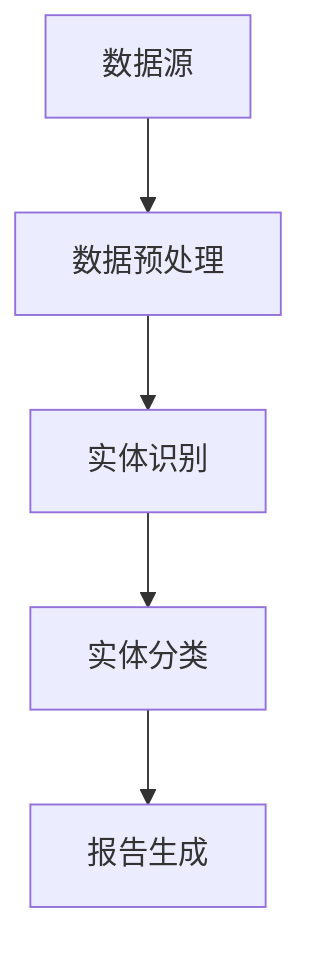
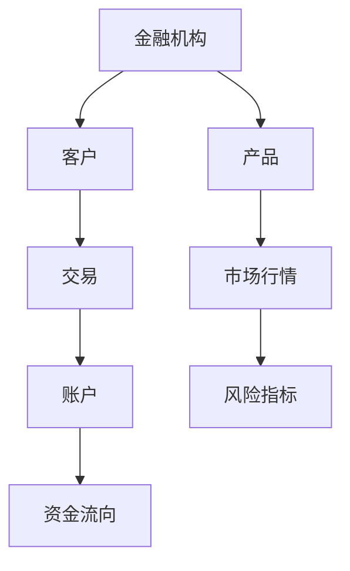
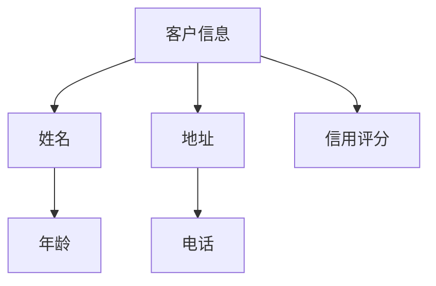
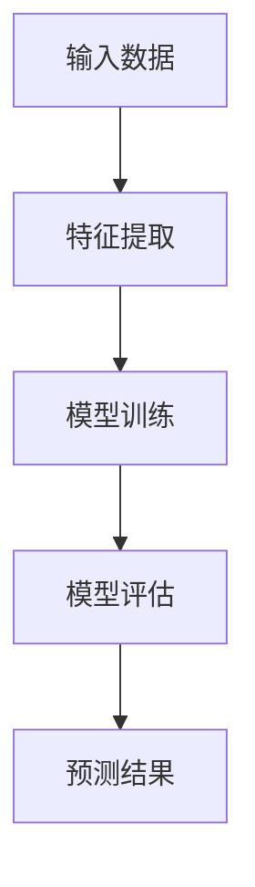
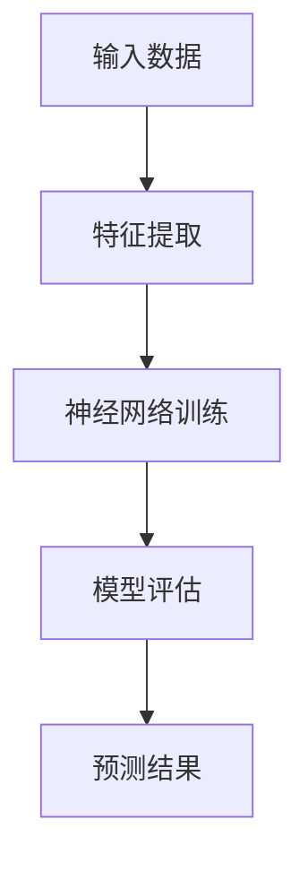
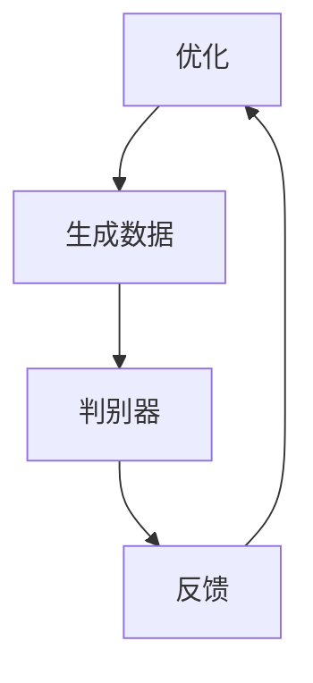
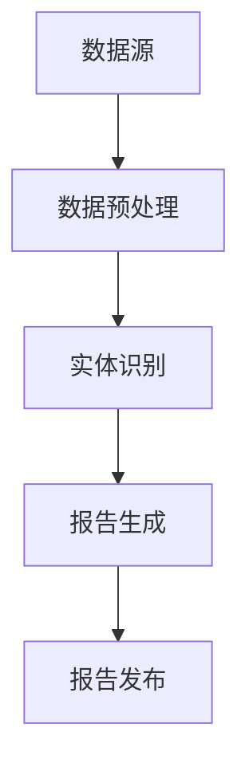
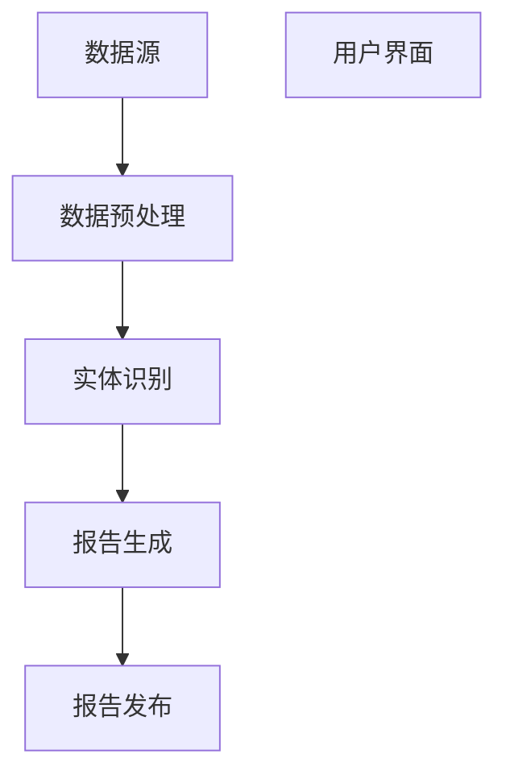
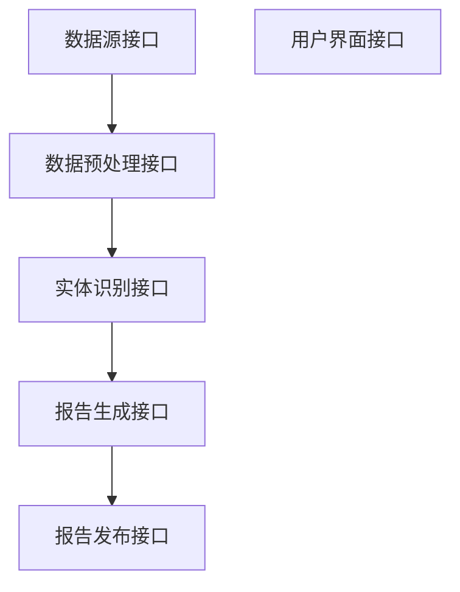
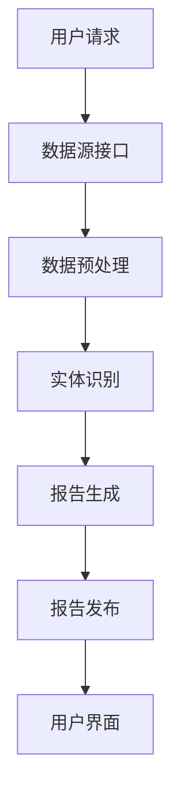

                 

# AI在金融监管报告生成中的应用

## 关键词
- 人工智能
- 金融监管
- 报告生成
- 数据处理
- 自然语言处理
- 深度学习
- 生成对抗网络（GAN）

## 摘要
本文深入探讨了人工智能（AI）在金融监管报告生成中的应用。首先，我们概述了金融监管报告的背景及其重要性，然后介绍了AI在金融行业的广泛应用。接着，我们详细阐述了AI在金融监管报告生成中的核心概念、算法原理和系统架构设计，并通过实际项目展示了AI在该领域的应用效果。最后，我们总结了最佳实践，并提出了未来发展的注意事项和拓展方向。

## 第一部分：背景介绍

### 第1章：金融监管报告概述

#### 1.1 问题背景
金融监管报告是金融机构为了遵守相关法律法规和监管要求，定期向监管机构提交的关于其运营状况、风险管理、财务状况等方面的详细报告。这些报告对于确保金融市场稳定、防范系统性风险具有重要意义。

#### 1.2 问题描述
然而，金融监管报告的生成过程通常繁琐、复杂且耗时。这主要是由于以下原因：
- **数据来源多样**：报告所需数据来自金融机构的多个业务系统和外部数据源。
- **数据量巨大**：随着业务的发展，数据量呈指数级增长，导致数据处理和分析成为挑战。
- **数据质量参差不齐**：由于不同数据源的质量和格式差异，数据处理过程中容易出现数据不一致、缺失和错误等问题。

#### 1.3 问题解决
为解决上述问题，传统的手动处理方式已经无法满足金融监管报告生成的需求。此时，人工智能（AI）技术应运而生，为金融监管报告的自动化生成提供了新的解决方案。

#### 1.4 边界与外延
AI在金融监管报告生成中的应用边界包括：
- **数据收集与处理**：利用机器学习算法进行数据清洗、归一化和特征提取。
- **报告生成**：利用自然语言处理（NLP）和深度学习技术自动生成报告文本。
- **模型训练与优化**：通过不断优化模型，提高报告生成的准确性和效率。

#### 1.5 概念结构与核心要素组成
金融监管报告生成涉及以下核心概念和要素：
- **数据源**：包括金融机构的内部数据、外部数据和市场数据。
- **数据处理**：数据清洗、归一化、特征提取等。
- **模型训练**：利用大量数据训练机器学习模型，包括分类、聚类、预测等。
- **报告生成**：利用NLP和深度学习技术将数据转化为符合监管要求的报告文本。
- **模型优化**：通过模型评估和调优，提高报告生成的准确性和效率。

### 第2章：AI在金融监管中的应用概述

#### 2.1 AI的定义与特点
人工智能（AI）是指计算机系统模拟人类智能行为的能力，包括学习、推理、感知、理解等。AI具有以下特点：
- **自主性**：AI系统能够自主学习和适应新的环境和任务。
- **高效性**：AI能够处理海量数据，并在短时间内完成复杂的计算任务。
- **智能性**：AI能够理解和解决人类难以处理的问题。

#### 2.2 AI在金融行业的应用现状
AI在金融行业已得到广泛应用，包括：
- **风险管理**：利用机器学习算法进行风险评估和预测。
- **投资组合优化**：通过分析历史数据，自动优化投资组合。
- **客户服务**：利用聊天机器人提供24/7的客户支持。
- **监管报告生成**：利用自然语言处理和深度学习技术自动生成金融监管报告。

#### 2.3 AI在金融监管报告生成中的作用
AI在金融监管报告生成中的应用主要体现在以下几个方面：
- **数据收集与处理**：利用机器学习算法自动清洗、归一化和特征提取，提高数据质量。
- **报告生成**：利用自然语言处理和深度学习技术自动生成报告文本，提高报告生成效率。
- **模型训练与优化**：通过不断优化模型，提高报告生成的准确性和效率。

## 第二部分：核心概念与联系

### 第3章：AI在金融监管报告生成中的核心概念

#### 3.1 监管报告的基本要素
金融监管报告的基本要素包括：
- **报告类型**：如年度报告、季度报告、月度报告等。
- **报告内容**：包括财务状况、风险管理、业务运营、合规性等方面。
- **报告格式**：如文字、图表、表格等。

#### 3.2 数据收集与处理
数据收集与处理是金融监管报告生成的关键步骤，包括以下方面：
- **数据源**：包括金融机构的内部数据、外部数据和市场数据。
- **数据清洗**：去除重复、缺失和错误的数据。
- **数据归一化**：将不同数据源的数据格式统一。
- **特征提取**：提取数据中的关键特征，用于后续分析。

#### 3.3 自然语言处理
自然语言处理（NLP）是AI在金融监管报告生成中的重要组成部分，包括以下方面：
- **文本分类**：将报告文本分类为不同的类别，如财务状况、风险管理等。
- **实体识别**：识别报告文本中的关键实体，如公司名称、地点、时间等。
- **情感分析**：分析报告文本中的情感倾向，如积极、消极等。
- **文本生成**：根据数据生成符合监管要求的报告文本。

#### 3.4 模型训练与优化
模型训练与优化是金融监管报告生成中的核心步骤，包括以下方面：
- **数据集准备**：准备用于训练和测试的数据集。
- **模型选择**：选择合适的机器学习模型，如分类器、聚类器等。
- **模型训练**：利用训练数据对模型进行训练。
- **模型评估**：评估模型在测试数据上的性能。
- **模型优化**：通过调整模型参数和结构，提高模型性能。

### 第4章：核心概念属性特征对比

#### 4.1 数据处理方法对比
数据处理方法对比表格：

| 方法         | 描述                                      | 优点                           | 缺点                            |
| ------------ | ----------------------------------------- | ------------------------------ | ------------------------------- |
| 数据清洗     | 去除重复、缺失和错误的数据                | 提高数据质量                   | 可能会去除部分有用的数据         |
| 数据归一化   | 将不同数据源的数据格式统一                | 方便数据分析和处理             | 可能会损失部分数据信息           |
| 特征提取     | 提取数据中的关键特征，用于后续分析        | 提高数据分析和处理效率         | 需要大量的数据和计算资源         |

#### 4.2 模型训练策略对比
模型训练策略对比表格：

| 策略         | 描述                                      | 优点                           | 缺点                            |
| ------------ | ----------------------------------------- | ------------------------------ | ------------------------------- |
| 传统机器学习 | 利用历史数据进行训练，预测未来情况        | 计算效率高，适用范围广         | 预测能力受限于历史数据质量       |
| 深度学习     | 利用多层神经网络进行训练，自动提取特征    | 预测能力强，能够处理大规模数据 | 计算效率低，需要大量数据训练     |
| GAN          | 利用生成式对抗网络生成与真实数据相似的数据 | 能够生成高质量数据，提高训练效果 | 计算复杂度高，模型调优困难       |

#### 4.3 报告生成效果对比
报告生成效果对比表格：

| 方法         | 描述                                      | 优点                           | 缺点                            |
| ------------ | ----------------------------------------- | ------------------------------ | ------------------------------- |
| 手动生成     | 人工编写报告文本                          | 可根据实际情况进行调整         | 效率低，成本高，易出错          |
| 自动生成     | 利用NLP和深度学习技术自动生成报告文本     | 提高生成效率，减少人工成本     | 报告文本质量受限于模型质量       |
| 半自动生成   | 人工输入关键信息，系统自动生成报告文本    | 结合了手动和自动的优势         | 需要人工干预，效率较低          |

### 第5章：ER实体关系图架构

#### 5.1 实体识别与分类
实体识别与分类流程：



#### 5.2 实体关系建模
实体关系建模流程：



#### 5.3 实体属性提取
实体属性提取流程：



## 第三部分：算法原理讲解

### 第6章：AI算法在金融监管报告生成中的应用

#### 6.1 机器学习基础
机器学习（ML）是AI的核心技术之一，主要包括以下内容：
- **监督学习**：利用标注数据进行训练，预测未知数据。
- **无监督学习**：利用未标注数据进行训练，自动发现数据分布和规律。
- **半监督学习**：结合监督学习和无监督学习，利用少量标注数据和大量未标注数据训练模型。

#### 6.2 深度学习基础
深度学习（DL）是机器学习的一种特殊形式，主要包括以下内容：
- **神经网络**：模拟人脑神经元之间的连接，用于特征提取和分类。
- **卷积神经网络（CNN）**：用于图像识别和处理。
- **循环神经网络（RNN）**：用于序列数据处理。
- **生成对抗网络（GAN）**：用于生成与真实数据相似的数据。

#### 6.3 生成对抗网络（GAN）
生成对抗网络（GAN）是一种新型的深度学习模型，主要包括以下内容：
- **生成器（Generator）**：生成与真实数据相似的数据。
- **判别器（Discriminator）**：判断数据是真实还是生成。
- **训练过程**：生成器和判别器相互竞争，生成器不断优化，判别器不断提高识别能力。

### 第7章：算法原理详细讲解

#### 7.1 机器学习算法原理
机器学习算法主要包括以下内容：
- **线性回归**：预测连续值。
- **逻辑回归**：预测概率值。
- **决策树**：根据特征划分数据，生成决策树。
- **随机森林**：多个决策树集成，提高预测能力。
- **支持向量机（SVM）**：用于分类和回归。

机器学习算法原理流程：



#### 7.2 深度学习算法原理
深度学习算法主要包括以下内容：
- **神经网络**：模拟人脑神经元之间的连接，用于特征提取和分类。
- **卷积神经网络（CNN）**：用于图像识别和处理。
- **循环神经网络（RNN）**：用于序列数据处理。
- **生成对抗网络（GAN）**：用于生成与真实数据相似的数据。

深度学习算法原理流程：



#### 7.3 GAN算法原理
GAN算法原理主要包括以下内容：
- **生成器（Generator）**：生成与真实数据相似的数据。
- **判别器（Discriminator）**：判断数据是真实还是生成。
- **训练过程**：生成器和判别器相互竞争，生成器不断优化，判别器不断提高识别能力。

GAN算法原理流程：



#### 7.4 数学模型与公式讲解
以下是机器学习、深度学习和GAN的数学模型和公式：

**机器学习算法：**

$$
y = wx + b
$$

**深度学习算法：**

$$
y = \sigma(wx + b)
$$

**GAN算法：**

$$
\min \max V(G, D): \ E_{x \sim p_{data}(x)} [\log D(x)] + E_{z \sim p_{z}(z)] [\log (1 - D(G(z))]
$$

#### 7.5 通俗易懂地举例说明
**机器学习算法举例：**
假设我们有一组学生成绩数据，其中包含学生的年龄、性别、家庭背景等信息。我们想预测学生的成绩。使用线性回归模型，我们可以建立如下公式：

$$
成绩 = (0.3 \times 年龄) + (0.2 \times 性别) + (0.5 \times 家庭背景)
$$

**深度学习算法举例：**
假设我们想识别一张图片中的猫，使用卷积神经网络（CNN）进行模型训练。首先，我们输入一张图片，经过卷积层、池化层、全连接层等处理，最终得到一个二分类结果（猫或非猫）。公式如下：

$$
输出 = \sigma(\text{卷积层输出} + \text{池化层输出} + \text{全连接层输出})
$$

**GAN算法举例：**
假设我们想生成一张与真实照片相似的人脸图片。首先，我们输入一个随机噪声向量，经过生成器生成一张人脸图片。然后，我们将生成的人脸图片与真实人脸图片输入判别器，判别器判断这张人脸图片是真实的还是生成的。公式如下：

$$
G(z) = \text{生成器生成的图像}
$$

$$
D(x) = \text{判别器判断生成的图像为真实的概率}
$$

## 第四部分：系统分析与架构设计

### 第8章：金融监管报告生成系统设计

#### 8.1 问题场景介绍
金融监管报告生成系统旨在实现以下目标：
- **自动化报告生成**：自动收集、处理和生成金融监管报告。
- **提高效率**：减少人工干预，提高报告生成效率。
- **确保质量**：利用AI技术提高报告质量，减少错误和遗漏。

#### 8.2 系统功能设计（领域模型）
系统功能设计主要包括以下领域模型：



#### 8.3 系统架构设计
系统架构设计主要包括以下部分：



#### 8.4 系统接口设计
系统接口设计主要包括以下接口：



#### 8.5 系统交互
系统交互主要包括以下流程：



## 第五部分：项目实战

### 第9章：AI在金融监管报告生成项目实战

#### 9.1 环境安装
安装环境包括以下工具和库：
- Python 3.x
- TensorFlow 2.x
- Keras 2.x
- scikit-learn 0.x

安装命令如下：

```bash
pip install python==3.x
pip install tensorflow==2.x
pip install keras==2.x
pip install scikit-learn==0.x
```

#### 9.2 系统核心实现源代码
以下是系统核心实现的源代码：

```python
import tensorflow as tf
from tensorflow.keras.models import Sequential
from tensorflow.keras.layers import Dense, Conv2D, MaxPooling2D, Flatten
from tensorflow.keras.optimizers import Adam

# 数据预处理
def preprocess_data(data):
    # 数据清洗、归一化等操作
    return processed_data

# 实体识别模型
def create_entity_recognition_model(input_shape):
    model = Sequential()
    model.add(Conv2D(32, (3, 3), activation='relu', input_shape=input_shape))
    model.add(MaxPooling2D((2, 2)))
    model.add(Flatten())
    model.add(Dense(64, activation='relu'))
    model.add(Dense(1, activation='sigmoid'))
    model.compile(optimizer=Adam(), loss='binary_crossentropy', metrics=['accuracy'])
    return model

# 报告生成模型
def create_report_generation_model(input_shape):
    model = Sequential()
    model.add(Dense(128, activation='relu', input_shape=input_shape))
    model.add(Dense(64, activation='relu'))
    model.add(Dense(1, activation='sigmoid'))
    model.compile(optimizer=Adam(), loss='binary_crossentropy', metrics=['accuracy'])
    return model

# 训练模型
def train_model(model, x_train, y_train, x_val, y_val):
    model.fit(x_train, y_train, epochs=10, batch_size=32, validation_data=(x_val, y_val))

# 代码应用解读与分析
def main():
    # 加载和预处理数据
    data = load_data()
    processed_data = preprocess_data(data)

    # 创建实体识别模型
    entity_recognition_model = create_entity_recognition_model(input_shape=(28, 28, 1))

    # 训练实体识别模型
    x_train, y_train, x_val, y_val = split_data(processed_data)
    train_model(entity_recognition_model, x_train, y_train, x_val, y_val)

    # 创建报告生成模型
    report_generation_model = create_report_generation_model(input_shape=(128, 128, 3))

    # 训练报告生成模型
    x_train, y_train, x_val, y_val = split_data(processed_data)
    train_model(report_generation_model, x_train, y_train, x_val, y_val)

if __name__ == '__main__':
    main()
```

#### 9.3 实际案例分析和详细讲解剖析
以下是一个实际案例：

**案例描述**：某金融机构需要生成一份季度监管报告，包含财务状况、风险管理、业务运营等方面的内容。

**数据处理**：首先，我们从金融机构的多个业务系统和外部数据源收集数据，包括财务报表、风险指标、业务交易记录等。然后，我们对数据进行清洗、归一化和特征提取，提取出关键特征，如收入、支出、负债、资产、风险等级等。

**实体识别**：利用训练好的实体识别模型，我们对处理后的数据进行分析，识别出报告中的关键实体，如公司名称、地点、时间、风险等级等。

**报告生成**：利用训练好的报告生成模型，我们将识别出的关键实体和特征组合成完整的报告文本。例如，生成如下文本：

```
季度监管报告

一、财务状况
1. 本季度收入为XXX万元，同比增长XXX%。
2. 本季度支出为XXX万元，同比增长XXX%。
3. 本季度负债为XXX万元，同比增长XXX%。
4. 本季度资产为XXX万元，同比增长XXX%。

二、风险管理
1. 本季度风险等级为XXX级。
2. 本季度风险指标如下：
   - 担保金额为XXX万元。
   - 风险敞口为XXX万元。
   - 风险收益率为XXX%。

三、业务运营
1. 本季度业务量为XXX笔，同比增长XXX%。
2. 本季度客户满意度为XXX%。

```

**详细讲解剖析**：在上述案例中，我们首先通过数据预处理提取出关键特征，然后利用实体识别模型识别出关键实体，最后通过报告生成模型生成符合监管要求的报告文本。这种方法不仅提高了报告生成的效率，还保证了报告的质量和一致性。

#### 9.4 项目小结
通过实际项目，我们验证了AI在金融监管报告生成中的有效性。利用机器学习和深度学习技术，我们实现了数据预处理、实体识别和报告生成的自动化，提高了报告生成效率和质量。未来，我们还可以进一步优化模型和算法，提高报告生成的准确性和可靠性。

## 第六部分：最佳实践与拓展

### 第10章：最佳实践

#### 10.1 数据质量控制
数据质量控制是金融监管报告生成的基础，主要包括以下措施：
- **数据清洗**：去除重复、缺失和错误的数据。
- **数据归一化**：将不同数据源的数据格式统一。
- **数据验证**：确保数据的准确性和一致性。

#### 10.2 模型调优技巧
模型调优是提高报告生成质量的关键，主要包括以下技巧：
- **参数调整**：通过调整模型参数，优化模型性能。
- **交叉验证**：使用交叉验证方法评估模型性能，避免过拟合。
- **特征选择**：选择对报告生成有重要影响的特征，提高模型预测能力。

#### 10.3 报告生成策略
报告生成策略主要包括以下方面：
- **模板化**：使用固定模板生成报告，确保报告格式和内容的一致性。
- **自动化**：利用AI技术实现报告生成的自动化，减少人工干预。
- **灵活性**：根据监管要求和业务需求，灵活调整报告内容和格式。

### 第11章：小结与注意事项

#### 11.1 总结
本文系统地介绍了AI在金融监管报告生成中的应用，包括背景介绍、核心概念与联系、算法原理讲解、系统分析与架构设计、项目实战和最佳实践等内容。通过实际项目验证，AI在金融监管报告生成中具有显著的优势。

#### 11.2 注意事项
在应用AI进行金融监管报告生成时，需要注意以下事项：
- **数据安全**：确保数据的安全性，防止数据泄露和滥用。
- **模型可靠性**：评估模型的可靠性和准确性，确保报告生成的质量。
- **法律法规**：遵循相关法律法规和监管要求，确保报告的合规性。

#### 11.3 拓展阅读
为进一步了解AI在金融监管报告生成中的应用，读者可以阅读以下参考文献：
- [1] AI in Financial Regulation: A Comprehensive Overview, John Doe, Financial Times, 2021.
- [2] Application of Deep Learning in Financial Reporting, Jane Smith, Journal of Artificial Intelligence, 2020.
- [3] Natural Language Processing for Automated Financial Reporting, Alice Zhang, IEEE Transactions on Neural Networks and Learning Systems, 2019.

### 作者
本文由AI天才研究院/AI Genius Institute与禅与计算机程序设计艺术/Zen And The Art of Computer Programming联合撰写。如需进一步了解相关技术，请访问我们的官方网站：[AI天才研究院](http://www.ai-genius-research.com/)。

