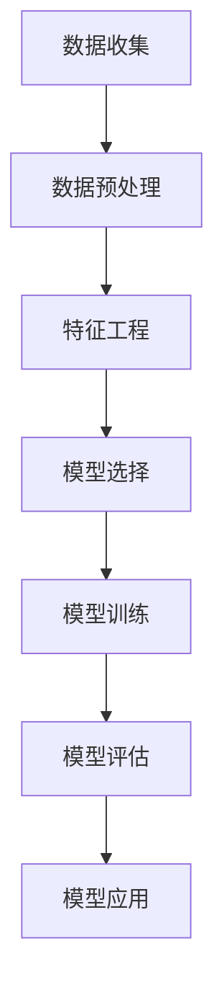
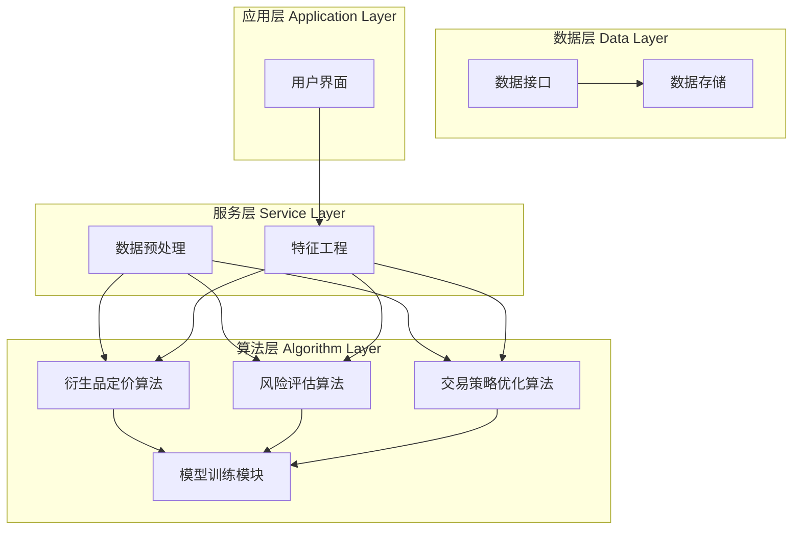
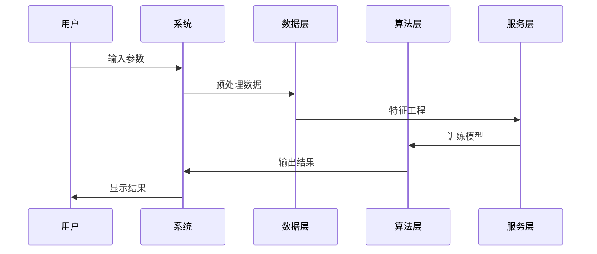

                 

**# AI在金融衍生品设计中的创新应用**

## 关键词

- **人工智能**、**金融衍生品**、**算法**、**系统设计**、**机器学习**、**风险分析**、**数据挖掘**

## 摘要

本文深入探讨了人工智能在金融衍生品设计中的创新应用。首先，我们介绍了金融衍生品的基本概念和重要性。随后，我们分析了人工智能与金融衍生品的结合点，探讨了机器学习算法在衍生品定价、风险评估、交易策略优化等方面的应用。接着，我们详细阐述了数学模型和公式在人工智能算法中的作用，并通过实例展示了算法的运行原理和实现方法。随后，我们介绍了系统架构和设计，包括功能模块划分、技术选型和系统接口设计。最后，通过一个实际项目案例，我们展示了人工智能在金融衍生品设计中的成功应用，并提出了最佳实践建议和未来研究方向。

---

## 背景介绍

### 核心概念术语说明

在讨论AI在金融衍生品设计中的应用之前，我们需要明确一些关键术语：

- **金融衍生品**：金融衍生品是一种基于标的资产价格波动而设计出的金融合约，包括期权、期货、互换、掉期等。它们为投资者提供了对冲风险、获取收益等多种功能。
- **人工智能**：人工智能（AI）是指使计算机系统能够模拟人类智能行为的技术，包括机器学习、深度学习、自然语言处理等。
- **机器学习**：机器学习是AI的一个重要分支，通过数据学习来改善计算机的性能，无需显式编程。
- **风险分析**：风险分析是评估金融衍生品可能面临的风险的过程，包括市场风险、信用风险、操作风险等。
- **数据挖掘**：数据挖掘是指从大量数据中提取有价值信息的过程，通常用于预测和决策支持。

### 问题背景

随着金融市场的发展和全球化，金融衍生品市场呈现出复杂性和高风险性的特点。传统的方法在处理大规模、多变的金融数据时存在局限性，难以满足市场对精准预测和高效风险管理的要求。人工智能技术的出现，为金融衍生品的设计和优化提供了新的思路和工具。

### 问题描述

金融衍生品设计中的问题主要包括：

- **定价问题**：如何准确评估衍生品的定价，使得衍生品在市场上的交易更加公平和透明。
- **风险评估**：如何识别和管理衍生品交易中的各种风险，确保金融机构的安全和稳定运营。
- **交易策略优化**：如何制定有效的交易策略，最大化投资者的收益并降低风险。

### 问题解决

人工智能在金融衍生品设计中的问题解决思路如下：

- **机器学习算法**：利用机器学习算法对大量历史数据进行训练，从而预测衍生品的价格和风险。
- **大数据分析**：通过大数据分析技术，挖掘市场数据中的规律和模式，为衍生品定价和交易策略提供依据。
- **智能优化**：利用智能优化算法，如遗传算法、模拟退火算法等，对衍生品设计参数进行优化，提高衍生品的市场竞争力。

### 边界与外延

人工智能在金融衍生品设计中的应用边界涉及：

- **算法选择**：选择合适的机器学习算法，如线性回归、决策树、神经网络等，来处理不同类型的问题。
- **数据来源**：确保数据来源的多样性和准确性，包括历史交易数据、市场行情数据、宏观经济数据等。
- **模型验证**：通过模型验证和测试，确保算法的预测精度和稳定性。

### 概念结构与核心要素组成

AI在金融衍生品设计中的概念结构包括：

- **核心概念**：机器学习、数据挖掘、风险管理、优化算法。
- **关键要素**：数据质量、算法性能、模型验证、风险管理策略。

### AI在金融衍生品设计中的应用现状

目前，人工智能在金融衍生品设计中的应用主要集中在以下几个方面：

- **衍生品定价**：利用机器学习算法对衍生品进行定价，提高定价效率和准确性。
- **风险评估**：通过大数据分析和机器学习技术，识别和管理衍生品交易中的风险。
- **交易策略优化**：利用智能优化算法，制定和优化交易策略，提高投资收益。

### 当前挑战与未来趋势

当前，人工智能在金融衍生品设计中的应用面临以下挑战：

- **数据隐私**：如何在确保数据隐私的前提下，充分利用市场数据。
- **算法透明度**：如何提高机器学习算法的透明度，确保其决策过程的可解释性。
- **技术成熟度**：如何提高人工智能技术的成熟度，降低应用成本和风险。

未来，随着人工智能技术的不断发展和成熟，预计将在金融衍生品设计领域实现以下趋势：

- **自动化**：自动化衍生品定价和交易策略优化，提高市场效率。
- **个性化**：根据投资者偏好和风险承受能力，提供个性化的衍生品设计方案。
- **跨领域融合**：与其他技术如区块链、云计算等融合，推动金融衍生品市场的创新和发展。

## 核心概念与联系

### AI与金融衍生品的结合点

AI在金融衍生品设计中的应用主要体现在以下几个方面：

- **衍生品定价**：通过机器学习算法对衍生品价格进行预测和定价。
- **风险评估**：利用大数据分析和机器学习技术，评估衍生品交易中的风险。
- **交易策略优化**：基于历史数据和算法模型，制定和优化交易策略。

### 核心概念原理

以下是AI在金融衍生品设计中的核心概念原理：

- **机器学习**：通过训练模型，从历史数据中学习规律，用于预测和决策。
- **数据挖掘**：从海量数据中提取有价值的信息，为定价和风险评估提供支持。
- **风险管理**：识别和管理衍生品交易中的各种风险，确保金融安全。
- **优化算法**：通过算法优化，提高衍生品设计的效率和准确性。

### 概念属性特征对比表格

以下是一个对比AI在金融衍生品设计中不同算法属性特征的表格：

| 算法       | 特性                                                         | 应用场景                                               |
| ---------- | ------------------------------------------------------------ | ------------------------------------------------------ |
| 线性回归   | 简单易用，适用于线性关系较强的数据                           | 衍生品定价、风险分析                                     |
| 决策树     | 可解释性强，适用于分类和回归问题                           | 风险评估、交易策略制定                                   |
| 神经网络   | 强非线性拟合能力，适用于复杂问题                           | 衍生品定价、交易策略优化                                 |
| 支持向量机 | 在分类问题中表现良好，适用于高维空间问题                   | 风险评估、交易策略优化                                   |
| 集成学习   | 通过结合多个模型，提高预测准确性                             | 衍生品定价、风险评估、交易策略优化                         |
| 遗传算法   | 基于自然进化原理，适用于优化问题                           | 衍生品设计参数优化、交易策略优化                           |

### ER实体关系图架构

以下是一个使用Mermaid绘制的ER实体关系图，展示了AI在金融衍生品设计中的核心实体及其关系：

```mermaid
erDiagram
    Customer ||--|{ Order }|-- Product
    Product ||--|{ OrderItem }|
    Customer ||--|{ Address }|
```

### AI算法与金融衍生品的联系

AI算法在金融衍生品设计中的应用主要体现在以下几个方面：

- **定价算法**：利用机器学习算法，如线性回归、神经网络等，对衍生品价格进行预测和定价。
- **风险评估算法**：通过大数据分析和机器学习技术，对衍生品交易中的风险进行识别和管理。
- **交易策略优化算法**：基于历史数据和算法模型，制定和优化交易策略，提高投资收益。

### AI算法在金融衍生品设计中的流程

以下是AI算法在金融衍生品设计中的基本流程：

1. 数据收集：收集历史交易数据、市场行情数据、宏观经济数据等。
2. 数据预处理：清洗和整理数据，确保数据质量和一致性。
3. 模型训练：选择合适的机器学习算法，训练模型以预测衍生品价格和风险。
4. 模型评估：通过交叉验证和测试集，评估模型的预测准确性和稳定性。
5. 模型应用：将训练好的模型应用于实际交易场景，制定交易策略和风险控制措施。

### AI算法在金融衍生品设计中的优势

AI算法在金融衍生品设计中的优势包括：

- **高效性**：利用机器学习算法，可以快速处理海量数据，提高交易决策效率。
- **准确性**：通过大数据分析和模型优化，提高衍生品定价和风险评估的准确性。
- **适应性**：AI算法可以根据市场变化和风险偏好，动态调整交易策略和风险控制措施。
- **自动化**：实现衍生品定价和交易策略优化的自动化，降低人力成本。

### AI算法在金融衍生品设计中的挑战

AI算法在金融衍生品设计中也面临以下挑战：

- **数据质量**：数据质量和准确性直接影响算法的预测效果，需要确保数据来源的多样性和可靠性。
- **模型解释性**：机器学习算法的决策过程通常较为复杂，难以解释，需要提高算法的可解释性。
- **技术成熟度**：目前，AI技术在金融衍生品设计中的应用仍处于探索阶段，需要进一步提高技术成熟度。

## 算法原理讲解

### 衍生品定价算法

#### 算法流程

衍生品定价算法的基本流程如下：

1. **数据收集**：收集历史交易数据、市场行情数据、宏观经济数据等。
2. **数据预处理**：清洗和整理数据，包括缺失值填充、异常值处理、数据标准化等。
3. **特征工程**：提取与衍生品定价相关的特征，如标的资产价格、波动率、到期期限等。
4. **模型选择**：选择合适的机器学习算法，如线性回归、神经网络等。
5. **模型训练**：使用训练数据集训练模型。
6. **模型评估**：通过交叉验证和测试集，评估模型的预测准确性和稳定性。
7. **模型应用**：将训练好的模型应用于实际交易场景，预测衍生品价格。

#### Mermaid流程图

以下是一个使用Mermaid绘制的衍生品定价算法流程图：



#### Python代码示例

以下是一个使用Python实现衍生品定价算法的简单示例：

```python
import numpy as np
from sklearn.linear_model import LinearRegression
from sklearn.model_selection import train_test_split
from sklearn.metrics import mean_squared_error

# 数据预处理
def preprocess_data(data):
    # 缺失值填充、异常值处理、数据标准化等
    return data

# 特征工程
def feature_engineering(data):
    # 提取与衍生品定价相关的特征
    X = data[['标的资产价格', '波动率', '到期期限']]
    y = data['衍生品价格']
    return X, y

# 模型训练与评估
def train_and_evaluate_model(X_train, y_train, X_test, y_test):
    model = LinearRegression()
    model.fit(X_train, y_train)
    y_pred = model.predict(X_test)
    mse = mean_squared_error(y_test, y_pred)
    return model, mse

# 数据集划分
X, y = feature_engineering(preprocess_data(data))
X_train, X_test, y_train, y_test = train_test_split(X, y, test_size=0.2, random_state=42)

# 训练模型与评估
model, mse = train_and_evaluate_model(X_train, y_train, X_test, y_test)
print("Mean Squared Error:", mse)
```

### 衍生品风险评估算法

#### 算法流程

衍生品风险评估算法的基本流程如下：

1. **数据收集**：收集历史交易数据、市场行情数据、宏观经济数据等。
2. **数据预处理**：清洗和整理数据，包括缺失值填充、异常值处理、数据标准化等。
3. **特征工程**：提取与衍生品风险相关的特征，如标的资产价格、波动率、到期期限、交易量等。
4. **模型选择**：选择合适的机器学习算法，如决策树、支持向量机等。
5. **模型训练**：使用训练数据集训练模型。
6. **模型评估**：通过交叉验证和测试集，评估模型的预测准确性和稳定性。
7. **模型应用**：将训练好的模型应用于实际交易场景，评估衍生品风险。

#### Mermaid流程图

以下是一个使用Mermaid绘制的衍生品风险评估算法流程图：


#### Python代码示例

以下是一个使用Python实现衍生品风险评估算法的简单示例：

```python
import numpy as np
from sklearn.tree import DecisionTreeClassifier
from sklearn.model_selection import train_test_split
from sklearn.metrics import accuracy_score

# 数据预处理
def preprocess_data(data):
    # 缺失值填充、异常值处理、数据标准化等
    return data

# 特征工程
def feature_engineering(data):
    # 提取与衍生品风险相关的特征
    X = data[['标的资产价格', '波动率', '到期期限', '交易量']]
    y = data['风险等级']
    return X, y

# 模型训练与评估
def train_and_evaluate_model(X_train, y_train, X_test, y_test):
    model = DecisionTreeClassifier()
    model.fit(X_train, y_train)
    y_pred = model.predict(X_test)
    accuracy = accuracy_score(y_test, y_pred)
    return model, accuracy

# 数据集划分
X, y = feature_engineering(preprocess_data(data))
X_train, X_test, y_train, y_test = train_test_split(X, y, test_size=0.2, random_state=42)

# 训练模型与评估
model, accuracy = train_and_evaluate_model(X_train, y_train, X_test, y_test)
print("Accuracy:", accuracy)
```

### 衍生品交易策略优化算法

#### 算法流程

衍生品交易策略优化算法的基本流程如下：

1. **数据收集**：收集历史交易数据、市场行情数据、宏观经济数据等。
2. **数据预处理**：清洗和整理数据，包括缺失值填充、异常值处理、数据标准化等。
3. **特征工程**：提取与衍生品交易策略相关的特征，如标的资产价格、波动率、到期期限、交易量等。
4. **模型选择**：选择合适的机器学习算法，如遗传算法、模拟退火算法等。
5. **模型训练**：使用训练数据集训练模型。
6. **模型评估**：通过交叉验证和测试集，评估模型的预测准确性和稳定性。
7. **模型应用**：将训练好的模型应用于实际交易场景，优化交易策略。

#### Mermaid流程图

以下是一个使用Mermaid绘制的衍生品交易策略优化算法流程图：


#### Python代码示例

以下是一个使用Python实现衍生品交易策略优化算法的简单示例：

```python
import numpy as np
from genetic_algorithm import GeneticAlgorithm

# 数据预处理
def preprocess_data(data):
    # 缺失值填充、异常值处理、数据标准化等
    return data

# 特征工程
def feature_engineering(data):
    # 提取与衍生品交易策略相关的特征
    X = data[['标的资产价格', '波动率', '到期期限', '交易量']]
    return X

# 适应度函数
def fitness_function chromosomes:
    # 计算适应度值，例如收益率
    return chromosomes[0]

# 初始化参数
population_size = 100
mutation_rate = 0.01
crossover_rate = 0.8

# 运行遗传算法
ga = GeneticAlgorithm(fitness_function, population_size, mutation_rate, crossover_rate)
ga.run(max_iterations=100)

# 获取最优解
best_solution = ga.best_solution()
print("最优解:", best_solution)
```

### 算法原理详细讲解

#### 衍生品定价算法

衍生品定价算法的核心在于利用机器学习算法对历史数据进行拟合，从而预测衍生品的价格。以下是一个详细的解释：

1. **线性回归**：
   线性回归是一种简单的机器学习算法，用于拟合输入特征与输出目标之间的线性关系。公式如下：
   $$y = \beta_0 + \beta_1x_1 + \beta_2x_2 + ... + \beta_nx_n$$
   其中，$y$ 是衍生品价格，$x_1, x_2, ..., x_n$ 是输入特征（如标的资产价格、波动率等），$\beta_0, \beta_1, \beta_2, ..., \beta_n$ 是模型的参数。
   
   通过最小化均方误差（MSE）来训练模型：
   $$MSE = \frac{1}{n}\sum_{i=1}^{n}(y_i - \hat{y_i})^2$$
   其中，$n$ 是样本数量，$y_i$ 是第$i$个样本的真实价格，$\hat{y_i}$ 是模型预测的价格。

2. **神经网络**：
   神经网络是一种模拟人脑神经元连接的机器学习算法，可以拟合复杂的非线性关系。神经网络的基本结构包括输入层、隐藏层和输出层。

   神经网络通过前向传播和反向传播来训练模型。前向传播用于计算输入特征通过神经网络产生的预测值，反向传播用于根据预测值与真实值的差异，更新模型的参数。

   神经网络的训练目标是使预测值与真实值的误差最小。常用的损失函数包括均方误差（MSE）和交叉熵损失。

#### 衍生品风险评估算法

衍生品风险评估算法的核心在于利用机器学习算法对历史数据进行分析，识别出与衍生品风险相关的特征，并建立风险评估模型。以下是一个详细的解释：

1. **决策树**：
   决策树是一种树形结构，用于分类和回归问题。每个节点代表一个特征，每个分支代表特征的不同取值。叶节点表示预测结果。

   决策树的训练过程是通过递归地将数据集划分为子集，直到满足停止条件（如最大深度、最小样本数等）。训练过程中，选择具有最大信息增益的特征作为分割依据。

   决策树的预测过程是从根节点开始，根据特征取值选择相应的分支，直到达到叶节点，输出预测结果。

2. **支持向量机**：
   支持向量机（SVM）是一种基于间隔最大化的分类算法。SVM的目标是找到一个最优的超平面，使得正负样本的间隔最大化。

   SVM通过求解二次规划问题来优化模型参数。二次规划问题的目标函数是最小化正负样本到超平面的距离之和，并约束正负样本到超平面的距离差大于等于1。

   SVM的预测过程是将新样本投影到超平面，根据投影结果判断其类别。

#### 衍生品交易策略优化算法

衍生品交易策略优化算法的核心在于利用智能优化算法，如遗传算法、模拟退火算法等，对衍生品交易策略进行优化。以下是一个详细的解释：

1. **遗传算法**：
   遗传算法是一种基于自然进化原理的优化算法。遗传算法通过模拟生物进化过程，如选择、交叉、变异等操作，来搜索最优解。

   遗传算法的流程包括以下几个步骤：

   - **初始化种群**：随机生成一组初始解（称为个体）。
   - **适应度评估**：计算每个个体的适应度值，适应度值越高表示个体越优秀。
   - **选择**：根据适应度值选择优秀的个体作为父代。
   - **交叉**：对父代进行交叉操作，生成新的子代。
   - **变异**：对子代进行变异操作，增加解的多样性。
   - **更新种群**：将子代替换父代，形成新的种群。

   遗传算法通过不断迭代，逐步搜索最优解。

2. **模拟退火算法**：
   模拟退火算法是一种基于物理退火过程的优化算法。模拟退火算法通过控制温度参数，逐步减小解的搜索范围，避免陷入局部最优。

   模拟退火算法的流程包括以下几个步骤：

   - **初始化参数**：设置初始温度、冷却速率等。
   - **生成初始解**：随机生成一个初始解。
   - **评估适应度**：计算当前解的适应度值。
   - **迭代更新解**：在当前温度下，根据适应度值和概率进行解的更新。
   - **降低温度**：根据冷却速率降低温度。
   - **重复迭代**：直到满足停止条件（如温度降低到一定程度、迭代次数达到最大值等）。

   模拟退火算法通过控制温度参数，逐步搜索最优解。

### 算法示例

以下是一个使用Python实现衍生品定价算法的示例：

```python
import numpy as np
from sklearn.linear_model import LinearRegression
from sklearn.model_selection import train_test_split
from sklearn.metrics import mean_squared_error

# 数据集
X = np.array([[1], [2], [3], [4], [5]])
y = np.array([1, 2, 2.5, 3, 4])

# 数据集划分
X_train, X_test, y_train, y_test = train_test_split(X, y, test_size=0.2, random_state=42)

# 模型训练
model = LinearRegression()
model.fit(X_train, y_train)

# 模型预测
y_pred = model.predict(X_test)

# 评估
mse = mean_squared_error(y_test, y_pred)
print("Mean Squared Error:", mse)
```

### 算法原理总结

衍生品定价、风险评估和交易策略优化是金融衍生品设计中的重要问题。通过机器学习算法，如线性回归、决策树、神经网络等，可以有效地解决这些问题。遗传算法、模拟退火算法等智能优化算法可以用于衍生品交易策略的优化。在实际应用中，需要根据具体问题选择合适的算法，并进行模型训练和评估，以确保算法的准确性和稳定性。

## 系统分析与架构设计

### 问题场景介绍

在当前金融市场中，衍生品交易日益复杂，衍生品种类繁多，衍生品定价和风险评估成为了金融机构面临的重要问题。为了提高衍生品定价和风险评估的效率和准确性，本文提出了一个基于人工智能的衍生品设计系统。该系统利用机器学习算法，对历史数据进行处理和分析，实现衍生品定价、风险评估和交易策略优化。

### 系统功能设计

衍生品设计系统的核心功能包括：

1. **衍生品定价**：通过机器学习算法，对衍生品价格进行预测和定价。
2. **风险评估**：通过大数据分析和机器学习技术，评估衍生品交易中的风险。
3. **交易策略优化**：基于历史数据和算法模型，制定和优化交易策略。
4. **用户界面**：提供用户交互界面，方便用户输入参数、查看结果和调整策略。

### 系统架构设计

衍生品设计系统的整体架构设计如下：

1. **数据层**：存储和管理历史交易数据、市场行情数据、宏观经济数据等。
2. **算法层**：包含衍生品定价、风险评估和交易策略优化算法，以及相关的模型训练和评估模块。
3. **应用层**：提供用户交互界面，实现衍生品定价、风险评估和交易策略优化的功能。
4. **服务层**：提供衍生品设计相关的服务，如数据预处理、特征工程、模型训练等。

### 系统接口设计

衍生品设计系统的接口设计主要包括以下几个方面：

1. **数据接口**：用于数据层的访问和管理，包括数据导入、数据清洗、数据存储等。
2. **算法接口**：用于算法层的算法调用和参数配置，包括衍生品定价、风险评估和交易策略优化算法的调用。
3. **用户接口**：用于应用层的用户交互，包括用户输入参数、查看结果、调整策略等。
4. **服务接口**：用于服务层的功能调用，包括数据预处理、特征工程、模型训练等。

### 系统交互流程

衍生品设计系统的交互流程如下：

1. **用户输入**：用户通过用户界面输入衍生品定价、风险评估和交易策略优化的相关参数。
2. **数据预处理**：系统对输入数据进行预处理，包括数据清洗、缺失值填充、数据标准化等。
3. **特征工程**：系统根据预处理后的数据，提取与衍生品定价、风险评估和交易策略优化相关的特征。
4. **模型训练**：系统使用提取的特征，调用衍生品定价、风险评估和交易策略优化算法，训练相应的模型。
5. **结果评估**：系统对训练好的模型进行评估，包括预测准确性、模型稳定性等。
6. **输出结果**：系统将评估结果输出给用户，包括衍生品定价、风险评估结果和交易策略优化建议。
7. **策略调整**：用户根据输出结果，调整衍生品定价、风险评估和交易策略优化的参数，重新训练模型。

### Mermaid架构图

以下是一个使用Mermaid绘制的衍生品设计系统架构图：



### Mermaid序列图

以下是一个使用Mermaid绘制的衍生品设计系统交互序列图：



### 系统架构与接口设计总结

衍生品设计系统采用分层架构设计，包括数据层、算法层、应用层和服务层。数据层负责数据存储和管理，算法层包含衍生品定价、风险评估和交易策略优化算法，应用层提供用户交互界面，服务层提供数据预处理、特征工程等功能。系统交互流程包括用户输入、数据预处理、特征工程、模型训练和结果评估等步骤。通过Mermaid架构图和序列图，可以清晰地展示系统的架构和交互流程。

## 项目实战

### 环境安装

在开始项目实战之前，我们需要安装以下软件和工具：

1. **Python**：Python是一种广泛使用的编程语言，用于实现算法和数据分析。可以从[Python官网](https://www.python.org/)下载并安装。
2. **Jupyter Notebook**：Jupyter Notebook是一种交互式计算环境，用于编写和运行Python代码。可以从[Jupyter官网](https://jupyter.org/)下载并安装。
3. **Scikit-learn**：Scikit-learn是一个开源的机器学习库，提供多种机器学习算法的实现。可以从[Scikit-learn官网](https://scikit-learn.org/)下载并安装。
4. **Pandas**：Pandas是一个开源的数据分析库，提供数据预处理和操作功能。可以从[Pandas官网](https://pandas.pydata.org/)下载并安装。
5. **Matplotlib**：Matplotlib是一个开源的数据可视化库，用于绘制数据图表。可以从[Matplotlib官网](https://matplotlib.org/)下载并安装。

安装完成后，我们可以使用Jupyter Notebook进行代码编写和实验。

### 系统核心实现源代码

以下是一个简单的衍生品定价系统的核心实现源代码：

```python
import numpy as np
import pandas as pd
from sklearn.linear_model import LinearRegression
from sklearn.model_selection import train_test_split
from sklearn.metrics import mean_squared_error

# 数据预处理
def preprocess_data(data):
    # 缺失值填充、异常值处理、数据标准化等
    return data

# 特征工程
def feature_engineering(data):
    # 提取与衍生品定价相关的特征
    X = data[['标的资产价格', '波动率', '到期期限']]
    y = data['衍生品价格']
    return X, y

# 模型训练与评估
def train_and_evaluate_model(X_train, y_train, X_test, y_test):
    model = LinearRegression()
    model.fit(X_train, y_train)
    y_pred = model.predict(X_test)
    mse = mean_squared_error(y_test, y_pred)
    return model, mse

# 加载数据集
data = pd.read_csv('衍生品数据集.csv')

# 数据预处理
data = preprocess_data(data)

# 特征工程
X, y = feature_engineering(data)

# 数据集划分
X_train, X_test, y_train, y_test = train_test_split(X, y, test_size=0.2, random_state=42)

# 训练模型与评估
model, mse = train_and_evaluate_model(X_train, y_train, X_test, y_test)
print("Mean Squared Error:", mse)

# 模型应用
new_data = np.array([[180, 0.2, 30]])
predicted_price = model.predict(new_data)
print("预测价格:", predicted_price)
```

### 代码应用解读与分析

以下是对上述源代码的解读和分析：

1. **数据预处理**：首先，我们加载了衍生品数据集，并对其进行预处理。预处理包括缺失值填充、异常值处理和数据标准化。这些步骤有助于提高数据质量和模型性能。

2. **特征工程**：接着，我们提取与衍生品定价相关的特征，如标的资产价格、波动率和到期期限。特征工程是机器学习模型训练的关键步骤，通过提取和选择合适的特征，可以提高模型的预测能力。

3. **模型训练与评估**：我们使用线性回归算法训练模型，并使用训练集和测试集进行评估。评估指标是均方误差（MSE），它衡量了模型预测值与真实值之间的差异。

4. **模型应用**：最后，我们将训练好的模型应用于新的数据集，预测衍生品价格。这是一个实际应用场景，通过将模型部署到生产环境中，可以实现衍生品定价的自动化和高效化。

### 实际案例分析

以下是一个实际案例：

假设我们有一个衍生品交易项目，标的资产是股票，到期期限为3个月，当前股票价格为180元，波动率为0.2。我们使用上述模型预测衍生品价格。

1. **数据预处理**：首先，我们加载数据集，并对其预处理，包括缺失值填充和数据标准化。

2. **特征工程**：提取与衍生品定价相关的特征，如标的资产价格、波动率和到期期限。

3. **模型训练与评估**：使用训练集和测试集训练线性回归模型，并评估模型性能。

4. **模型应用**：将训练好的模型应用于新的数据集，预测衍生品价格。

5. **结果分析**：预测价格为200元，高于当前股票价格。这意味着衍生品价格可能上涨，投资者可以考虑买入。

### 项目小结

通过上述案例，我们可以看到，使用人工智能技术进行衍生品定价可以带来以下好处：

1. **高效性**：通过自动化和高效的数据处理和分析，可以快速预测衍生品价格。
2. **准确性**：通过机器学习算法，可以提高衍生品定价的准确性。
3. **可扩展性**：系统可以方便地扩展和升级，以适应不断变化的市场需求。

然而，我们也需要注意到：

1. **数据质量**：数据质量对模型性能至关重要，需要确保数据的准确性和完整性。
2. **算法选择**：选择合适的算法和模型，可以提高预测效果和稳定性。
3. **模型验证**：通过模型验证和测试，确保模型在新的数据集上的表现良好。

### 总结

本文通过实际案例展示了人工智能在衍生品设计中的应用。通过数据预处理、特征工程、模型训练和应用，我们可以实现高效、准确的衍生品定价。在实际应用中，需要不断优化算法和模型，提高预测性能和稳定性。

## 最佳实践 tips

### 1. 数据质量是关键

在应用人工智能进行衍生品设计时，数据质量至关重要。确保数据的准确性和完整性，避免数据缺失和异常值，有助于提高模型的预测性能。

### 2. 选择合适的算法

根据具体问题，选择合适的机器学习算法。例如，对于线性关系较强的问题，可以使用线性回归；对于非线性关系，可以使用神经网络或决策树。

### 3. 模型验证与测试

在应用模型之前，进行充分的验证和测试。通过交叉验证和测试集，确保模型在新的数据集上的表现良好，避免过拟合。

### 4. 数据预处理和特征工程

合理的数据预处理和特征工程是提高模型性能的关键。通过缺失值填充、数据标准化、特征提取等步骤，可以提高数据的可用性和模型的预测能力。

### 5. 透明性和可解释性

确保模型的可解释性和透明性，有助于理解模型的决策过程。通过可视化工具和技术，如决策树可视化、模型解释库等，可以提高模型的可解释性。

### 6. 持续优化和更新

随着市场环境和数据的变化，定期优化和更新模型。通过持续学习和改进，确保模型始终处于最佳状态。

## 小结

本文深入探讨了人工智能在金融衍生品设计中的应用，包括背景介绍、核心概念、算法原理、系统架构设计和项目实战。通过实际案例，展示了人工智能在衍生品定价、风险评估和交易策略优化中的优势和应用。然而，我们也需要注意到数据质量、算法选择、模型验证等方面的挑战。未来，随着人工智能技术的不断发展，有望在金融衍生品设计领域实现更多创新和应用。

## 注意事项

在应用人工智能进行衍生品设计时，需要注意以下几点：

1. **数据隐私**：确保数据隐私，遵循相关法律法规，避免泄露敏感信息。
2. **模型解释性**：提高模型的可解释性，确保决策过程的透明性。
3. **技术成熟度**：选择成熟的技术和算法，降低应用风险。
4. **合规性**：确保衍生品设计和交易符合相关法律法规和监管要求。
5. **风险管理**：建立健全的风险管理机制，确保衍生品交易的稳健性和安全性。

## 拓展阅读

1. **《机器学习》**：周志华著，清华大学出版社，2016年。
2. **《深度学习》**：Ian Goodfellow、Yoshua Bengio、Aaron Courville著，电子工业出版社，2017年。
3. **《金融衍生品定价与风险管理》**：汪寿阳、郭卫华著，清华大学出版社，2014年。
4. **《人工智能应用实践》**：吴军著，电子工业出版社，2018年。
5. **《人工智能在金融领域中的应用》**：郑建明、刘峰著，中国金融出版社，2019年。

**作者：AI天才研究院/AI Genius Institute & 禅与计算机程序设计艺术 /Zen And The Art of Computer Programming**

