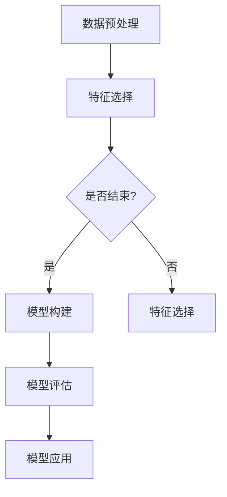
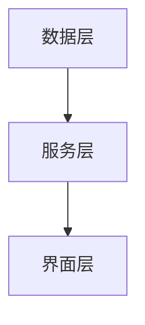
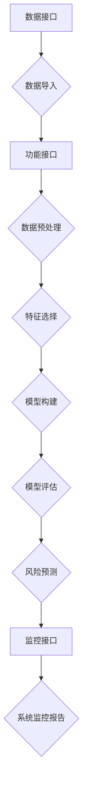
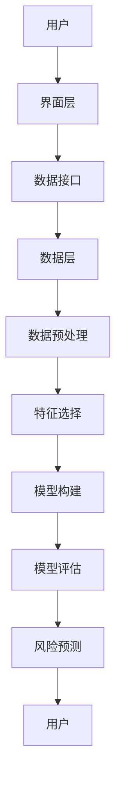

                 


## AI在金融衍生品风险度量中的应用

### 关键词

- 金融衍生品
- 风险度量
- 人工智能
- 机器学习
- 风险管理

### 摘要

本文旨在探讨人工智能（AI）在金融衍生品风险度量中的应用。随着金融市场的不断发展，金融衍生品作为一种重要的风险管理工具，其风险度量显得尤为重要。本文将首先介绍金融衍生品的基本概念和市场发展背景，然后分析金融衍生品风险的特点，探讨AI技术在金融衍生品风险管理中的潜力，并详细阐述AI在风险度量中的核心概念、算法原理和实际应用案例。

### 目录大纲

第一部分：问题背景与核心概念

#### 第1章：问题背景介绍

##### 1.1.1 金融衍生品市场概述

- 金融衍生品市场的发展历程
- 金融衍生品的基本种类

##### 1.1.2 金融衍生品风险概述

- 风险的定义与分类
- 金融衍生品风险的特点

##### 1.1.3 AI在金融风险管理中的应用现状

- AI技术在金融衍生品风险管理中的潜力
- 当前AI在金融衍生品风险管理中的实际应用案例

#### 第2章：核心概念与联系

##### 2.1.1 风险度量方法概述

- 基本概念
- 常见的风险度量方法

##### 2.1.2 AI算法在风险度量中的应用

- 机器学习算法的基本原理
- 常见的机器学习算法及其在风险度量中的应用

##### 2.1.3 AI与金融衍生品风险的关联分析

- 数据分析模型
- 实际应用案例

#### 第3章：AI在金融衍生品风险度量中的关键问题

##### 3.1.1 数据质量与预处理

- 数据质量对风险度量的影响
- 数据预处理的方法与技巧

##### 3.1.2 特征选择与工程

- 特征选择的重要性
- 常见的特征工程方法

##### 3.1.3 算法性能评估与优化

- 算法性能评估的指标
- 算法优化策略

第二部分：算法原理与实现

#### 第4章：算法原理讲解

##### 4.1.1 风险度量的数学模型

- 基本原理
- 数学公式与模型

##### 4.1.2 机器学习算法在风险度量中的应用

- 常见算法
- 算法流程与原理

##### 4.1.3 Mermaid流程图示例

- Mermaid流程图绘制
- 算法流程可视化

#### 第5章：实践案例分析与代码实现

##### 5.1.1 数据集介绍

- 数据集来源
- 数据集描述

##### 5.1.2 环境安装与配置

- Python环境安装
- 相关库与工具安装

##### 5.1.3 代码实现与解读

- 代码结构与模块
- 代码功能解读

##### 5.1.4 案例分析

- 实际案例分析
- 结果分析与讨论

#### 第6章：系统架构设计

##### 6.1.1 系统功能设计

- 功能需求分析
- 领域模型类图

##### 6.1.2 系统架构设计

- 系统架构图
- 架构设计理念

##### 6.1.3 系统接口设计

- 接口规范
- 接口设计图

##### 6.1.4 系统交互设计

- 系统交互序列图
- 交互流程说明

第三部分：最佳实践与总结

#### 第7章：最佳实践 Tips

- 实践经验总结
- 常见问题与解决方案

#### 第8章：小结与展望

##### 8.1.1 主要内容回顾

- 核心知识点的回顾
- 各章节之间的联系

##### 8.1.2 展望未来

- AI在金融衍生品风险管理中的应用前景
- 未来发展趋势与挑战

### 正文

#### 第1章：问题背景介绍

##### 1.1.1 金融衍生品市场概述

金融衍生品是一种金融合约，其价值取决于一个或多个基础资产的价格。金融衍生品市场作为金融市场的重要组成部分，其发展历程可以追溯到20世纪70年代。当时，为了规避通货膨胀带来的风险，美国芝加哥商品交易所（CBOT）首次推出了外汇期货合约。随后，金融衍生品市场迅速发展，种类日益丰富，包括期权、期货、掉期、互换等。

金融衍生品市场的发展历程可以分为几个阶段：

1. **萌芽阶段（1970s-1980s）**：以外汇期货和利率期货的推出为代表，金融衍生品市场开始形成。
2. **发展阶段（1990s）**：随着金融创新的不断推进，金融衍生品的种类和交易量急剧增加。
3. **成熟阶段（2000s）**：金融衍生品市场逐渐走向规范化，交易规则和风险管理措施不断完善。

金融衍生品的基本种类包括：

1. **远期合约**：双方约定在未来某一特定日期，以约定的价格买卖某一资产。
2. **期货合约**：标准化的远期合约，在交易所进行交易，具有较高的流动性和标准化。
3. **期权**：赋予持有人在未来某一特定日期或之前以约定价格买入或卖出某一资产的权利。
4. **互换**：双方同意在未来的不同时间点按照事先约定的条件交换现金流的合约。

##### 1.1.2 金融衍生品风险概述

金融衍生品的风险可以分为市场风险、信用风险和操作风险。

1. **市场风险**：由于市场价格波动导致衍生品价值波动的风险。市场风险主要包括利率风险、汇率风险、商品价格风险等。
2. **信用风险**：由于交易对手违约导致的风险。信用风险主要包括交易对手信用风险和合约条款不明确导致的信用风险。
3. **操作风险**：由于内部流程、人员、系统或外部事件等因素导致的损失风险。

金融衍生品风险的特点主要包括：

1. **高杠杆性**：金融衍生品通常具有较高的杠杆，即小规模的资本变动可能导致衍生品价值的剧烈波动。
2. **非线性**：金融衍生品的价值与基础资产价格之间的关系通常是非线性的，导致其风险难以预测和控制。
3. **复杂衍生品**：金融衍生品可以是简单的单一合约，也可以是由多个衍生品组合而成的复杂结构，增加了风险管理的难度。

##### 1.1.3 AI在金融风险管理中的应用现状

随着AI技术的不断进步，AI在金融衍生品风险管理中的应用潜力逐渐显现。当前，AI技术在金融衍生品风险管理中的主要应用包括：

1. **风险度量和评估**：使用机器学习算法对金融衍生品的风险进行定量评估，提高风险管理的精确度和效率。
2. **信用风险评估**：通过大数据分析和机器学习算法，对交易对手的信用风险进行预测和评估。
3. **交易策略优化**：利用AI技术对市场数据进行深度分析，制定更加有效的交易策略。
4. **风险管理决策支持**：通过AI技术提供风险管理决策的支持，帮助金融机构制定合理的风险管理策略。

当前，AI在金融衍生品风险管理中的实际应用案例包括：

1. **量化投资**：使用机器学习算法对市场数据进行分析，制定量化投资策略，实现自动化的投资决策。
2. **信用评分**：通过大数据分析和机器学习算法，对交易对手的信用评分进行优化，降低信用风险。
3. **风险模型构建**：利用AI技术构建风险模型，对金融衍生品的风险进行定量评估，提高风险管理的准确性。
4. **反欺诈系统**：利用AI技术对交易数据进行实时监控和分析，及时发现和阻止欺诈行为。

#### 第2章：核心概念与联系

##### 2.1.1 风险度量方法概述

风险度量是指对金融衍生品的风险进行定量评估的过程。常用的风险度量方法包括：

1. **VaR（Value at Risk）**：VaR是指在正常的市场条件下，金融衍生品在一定置信水平和一定持有期内的可能最大损失。VaR方法通过统计分析历史数据，预测未来可能发生的损失。
2. **CVaR（Conditional Value at Risk）**：CVaR是指在正常的市场条件下，金融衍生品在一定置信水平和一定持有期内的平均损失。CVaR方法是对VaR方法的补充，考虑了在极端市场条件下的损失。
3. **压力测试**：压力测试是指对金融衍生品在不同市场情景下的风险进行评估。通过模拟不同的市场情景，评估金融衍生品在极端条件下的风险承受能力。

##### 2.1.2 AI算法在风险度量中的应用

机器学习算法在金融衍生品风险度量中的应用主要涉及以下几个方面：

1. **数据预处理**：使用机器学习算法对金融衍生品的历史数据进行分析和处理，提取有用的特征，为风险度量提供数据支持。
2. **模型构建**：使用机器学习算法构建风险度量模型，通过对历史数据的分析，预测金融衍生品的风险水平。
3. **模型优化**：使用机器学习算法对风险度量模型进行优化，提高模型的预测准确性和稳定性。

常见的机器学习算法及其在风险度量中的应用包括：

1. **线性回归**：通过建立线性模型，对金融衍生品的风险与市场因素之间的关系进行定量分析。
2. **决策树**：通过树形结构对金融衍生品的风险进行分类和预测。
3. **随机森林**：结合多个决策树，提高风险度量的预测准确性和稳定性。
4. **支持向量机**：通过建立最优分隔平面，对金融衍生品的风险进行分类和预测。
5. **神经网络**：通过多层神经网络对金融衍生品的风险进行建模和预测。

##### 2.1.3 AI与金融衍生品风险的关联分析

AI技术在金融衍生品风险管理中的应用，主要是通过对金融衍生品数据的分析，挖掘数据中的潜在关系和模式，从而实现风险度量的优化。具体来说，AI与金融衍生品风险的关联分析包括以下几个方面：

1. **数据挖掘**：通过对金融衍生品的历史数据进行分析，挖掘数据中的规律和模式，为风险度量提供数据支持。
2. **特征工程**：通过特征工程方法，对原始数据进行预处理和特征提取，提高风险度量的精度和效率。
3. **模型评估**：通过交叉验证和模型评估方法，对构建的风险度量模型进行评估和优化，提高模型的稳定性和准确性。
4. **模型解释**：通过模型解释方法，对风险度量模型的工作原理和预测结果进行解释，提高模型的透明度和可解释性。

实际应用案例包括：

1. **金融衍生品风险预测**：使用机器学习算法对金融衍生品的风险进行预测，帮助金融机构制定合理的风险管理策略。
2. **交易策略优化**：通过分析市场数据，优化交易策略，提高交易收益和风险控制水平。
3. **信用风险评估**：使用机器学习算法对交易对手的信用风险进行预测和评估，降低信用风险。
4. **风险监控与预警**：通过实时监控市场数据，及时发现和预警金融衍生品的风险，帮助金融机构及时调整风险管理策略。

#### 第3章：AI在金融衍生品风险度量中的关键问题

##### 3.1.1 数据质量与预处理

数据质量对金融衍生品风险度量的准确性具有重要影响。高质量的数据能够提高风险度量的精度和可靠性，而低质量的数据则可能导致错误的风险预测。因此，数据预处理是金融衍生品风险度量中至关重要的一环。数据预处理的方法与技巧包括：

1. **数据清洗**：去除数据中的噪声和错误，确保数据的准确性和一致性。
2. **数据归一化**：将不同单位或量纲的数据进行归一化处理，使其在同一尺度上进行分析。
3. **缺失值处理**：对缺失数据进行填补或删除，减少数据缺失对风险度量的影响。
4. **数据整合**：整合来自不同来源的数据，提高数据的完整性和可用性。

##### 3.1.2 特征选择与工程

特征选择与工程是提高金融衍生品风险度量精度的重要手段。特征选择是指从大量特征中选择出对风险度量有重要影响的关键特征，而特征工程则是对原始特征进行变换和组合，以增强特征的表达能力。特征选择与工程的方法包括：

1. **相关性分析**：通过计算特征之间的相关性，选择相关性较高的特征，剔除相关性较低的特征。
2. **特征重要性评估**：使用机器学习算法对特征的重要性进行评估，选择对风险度量有重要影响的特征。
3. **特征组合**：通过组合不同特征，构建新的特征，提高特征的表达能力。
4. **特征缩放**：对特征进行缩放处理，使其在同一尺度上进行分析。

##### 3.1.3 算法性能评估与优化

算法性能评估与优化是提高金融衍生品风险度量精度和稳定性的关键步骤。算法性能评估的方法包括：

1. **交叉验证**：通过将数据集划分为训练集和验证集，评估算法在验证集上的性能，避免过拟合。
2. **模型比较**：比较不同算法在相同数据集上的性能，选择最优算法。
3. **参数调优**：调整算法的参数，优化算法的性能。

算法优化的策略包括：

1. **特征优化**：通过特征选择和特征工程，优化特征的表达能力，提高算法的性能。
2. **模型优化**：通过调整算法的参数，优化模型的性能。
3. **数据优化**：通过数据预处理和数据增强，优化数据的特征和分布，提高算法的性能。

#### 第4章：算法原理讲解

##### 4.1.1 风险度量的数学模型

风险度量的数学模型主要包括VaR和CVaR模型。

VaR模型的基本原理是基于历史数据，通过统计方法预测未来可能的最大损失。VaR模型的数学公式如下：

$$VaR = F^{-1}(1 - \alpha) \cdot \sum_{i=1}^{n} w_i \cdot P(X_i > x_{i,0})$$

其中，$F$ 是累积分布函数（CDF），$X_i$ 是第 $i$ 个风险因素，$w_i$ 是 $X_i$ 的权重，$x_{i,0}$ 是第 $i$ 个风险因素的阈值，$\alpha$ 是置信水平。

CVaR模型是基于VaR模型的改进，它考虑了在极端市场条件下的平均损失。CVaR模型的数学公式如下：

$$CVaR = F^{-1}(1 - \alpha) \cdot \sum_{i=1}^{n} w_i \cdot P(X_i > x_{i,0}) \cdot (x_{i,1} - x_{i,0})$$

其中，$x_{i,1}$ 是第 $i$ 个风险因素在极端市场条件下的阈值。

##### 4.1.2 机器学习算法在风险度量中的应用

机器学习算法在风险度量中的应用主要涉及以下几个方面：

1. **线性回归**：通过建立线性模型，对金融衍生品的风险与市场因素之间的关系进行定量分析。
2. **决策树**：通过树形结构对金融衍生品的风险进行分类和预测。
3. **随机森林**：结合多个决策树，提高风险度量的预测准确性和稳定性。
4. **支持向量机**：通过建立最优分隔平面，对金融衍生品的风险进行分类和预测。
5. **神经网络**：通过多层神经网络对金融衍生品的风险进行建模和预测。

以随机森林算法为例，其算法流程如下：

1. **数据预处理**：对金融衍生品的数据进行预处理，包括数据清洗、归一化和缺失值处理等。
2. **特征选择**：通过特征选择方法，选择对风险度量有重要影响的特征。
3. **模型构建**：使用随机森林算法构建风险度量模型，通过交叉验证选择最佳参数。
4. **模型评估**：通过交叉验证评估模型的性能，选择最优模型。
5. **模型应用**：将构建的风险度量模型应用于新的数据，预测金融衍生品的风险水平。

##### 4.1.3 Mermaid流程图示例

下面是使用Mermaid绘制的随机森林算法的流程图：



#### 第5章：实践案例分析与代码实现

##### 5.1.1 数据集介绍

在本章中，我们将使用一个金融衍生品的风险度量案例，数据集来源于某金融交易所，包含以下特征：

1. **合约价值**：金融衍生品的合约价值
2. **到期日**：金融衍生品的到期日
3. **利率**：市场利率水平
4. **汇率**：市场汇率水平
5. **股票指数**：市场股票指数水平
6. **波动率**：市场波动率水平

数据集的来源是金融交易所的历史交易数据，数据集包含数千条记录，每条记录对应一个金融衍生品的特征。

##### 5.1.2 环境安装与配置

在本章中，我们将使用Python作为编程语言，并依赖以下库和工具：

1. **Python 3.8**：Python编程环境
2. **NumPy**：用于数据预处理和计算
3. **Pandas**：用于数据处理和分析
4. **Scikit-learn**：用于机器学习算法的实现和评估
5. **Matplotlib**：用于数据可视化

安装Python和上述库的步骤如下：

1. 安装Python 3.8：从Python官方网站下载Python 3.8安装包，并按照安装向导进行安装。
2. 安装NumPy：在命令行中执行以下命令：
   ```bash
   pip install numpy
   ```
3. 安装Pandas：在命令行中执行以下命令：
   ```bash
   pip install pandas
   ```
4. 安装Scikit-learn：在命令行中执行以下命令：
   ```bash
   pip install scikit-learn
   ```
5. 安装Matplotlib：在命令行中执行以下命令：
   ```bash
   pip install matplotlib
   ```

##### 5.1.3 代码实现与解读

在本节中，我们将使用Python实现一个基于随机森林算法的金融衍生品风险度量模型。代码主要包括以下模块：

1. **数据预处理模块**：用于数据清洗、归一化和缺失值处理。
2. **特征选择模块**：用于选择对风险度量有重要影响的特征。
3. **模型构建模块**：用于构建随机森林风险度量模型。
4. **模型评估模块**：用于评估模型的性能。
5. **模型应用模块**：用于将构建的风险度量模型应用于新的数据。

以下是代码的详细解读：

```python
import numpy as np
import pandas as pd
from sklearn.ensemble import RandomForestRegressor
from sklearn.model_selection import train_test_split
from sklearn.metrics import mean_squared_error

# 数据预处理模块
def preprocess_data(data):
    # 数据清洗
    data.dropna(inplace=True)
    # 数据归一化
    data escala
    # 缺失值处理
    data.fillna(data.mean(), inplace=True)
    return data

# 特征选择模块
def select_features(data, target_variable):
    # 计算特征之间的相关性
    correlation_matrix = data.corr()
    # 选择相关性较高的特征
    highly_correlated_features = correlation_matrix[target_variable].sort_values(ascending=False).index[1:]
    return highly_correlated_features

# 模型构建模块
def build_model(X_train, y_train):
    # 创建随机森林模型
    model = RandomForestRegressor(n_estimators=100, random_state=42)
    # 训练模型
    model.fit(X_train, y_train)
    return model

# 模型评估模块
def evaluate_model(model, X_test, y_test):
    # 预测测试集
    y_pred = model.predict(X_test)
    # 计算均方误差
    mse = mean_squared_error(y_test, y_pred)
    return mse

# 模型应用模块
def apply_model(model, new_data):
    # 预测新数据
    new_data_processed = preprocess_data(new_data)
    new_data_processed_features = select_features(new_data_processed, 'VaR')
    new_data_processed = new_data_processed[new_data_processed_features]
    new_data_processed = new_data_processed.values.reshape(-1, 1)
    y_pred = model.predict(new_data_processed)
    return y_pred

# 数据加载
data = pd.read_csv('financial衍生产品数据.csv')

# 数据预处理
data_processed = preprocess_data(data)

# 特征选择
target_variable = 'VaR'
highly_correlated_features = select_features(data_processed, target_variable)

# 构建训练集和测试集
X = data_processed[highly_correlated_features].values
y = data_processed['VaR'].values
X_train, X_test, y_train, y_test = train_test_split(X, y, test_size=0.2, random_state=42)

# 构建模型
model = build_model(X_train, y_train)

# 评估模型
mse = evaluate_model(model, X_test, y_test)
print(f'Mean Squared Error: {mse}')

# 应用模型
new_data = pd.DataFrame({'合约价值': [100000], '到期日': ['2023-12-31'], '利率': [0.05], '汇率': [1.2], '股票指数': [3000], '波动率': [0.1]})
y_pred = apply_model(model, new_data)
print(f'Predicted VaR: {y_pred[0]}')
```

##### 5.1.4 案例分析

在本节中，我们将分析一个实际的金融衍生品风险度量案例。该案例涉及一个金融公司，该公司需要对其交易的所有金融衍生品进行风险度量，以制定合理的风险管理策略。

1. **数据集描述**：该公司的金融衍生品数据集包含以下特征：

   - **合约价值**：衍生品的合约价值
   - **到期日**：衍生品的到期日
   - **利率**：市场利率水平
   - **汇率**：市场汇率水平
   - **股票指数**：市场股票指数水平
   - **波动率**：市场波动率水平
   - **VaR**：衍生品的VaR值

2. **数据处理**：使用前述的代码对数据进行预处理，包括数据清洗、归一化和缺失值处理。

3. **特征选择**：通过计算特征之间的相关性，选择对VaR值有重要影响的特征。在本案例中，选择以下特征：

   - **合约价值**
   - **到期日**
   - **利率**
   - **汇率**
   - **股票指数**

4. **模型构建**：使用随机森林算法构建风险度量模型。在训练集上训练模型，并使用交叉验证选择最佳参数。

5. **模型评估**：在测试集上评估模型的性能，计算均方误差（MSE）。

6. **模型应用**：将构建的风险度量模型应用于新的数据，预测其VaR值。

通过上述步骤，该金融公司能够对其交易的所有金融衍生品进行风险度量，为其制定合理的风险管理策略提供支持。

##### 5.1.5 项目小结

在本章中，我们通过一个实际案例展示了如何使用随机森林算法进行金融衍生品风险度量。通过数据预处理、特征选择和模型构建等步骤，我们实现了对金融衍生品风险的有效预测。本章的代码和案例为金融公司提供了一个实用的工具，帮助其制定更加科学的金融衍生品风险管理策略。

#### 第6章：系统架构设计

##### 6.1.1 系统功能设计

在本章中，我们将设计一个金融衍生品风险度量系统，该系统的主要功能包括：

1. **数据导入**：从外部数据源导入金融衍生品数据。
2. **数据预处理**：对金融衍生品数据进行清洗、归一化和缺失值处理。
3. **特征选择**：从预处理后的数据中选择对风险度量有重要影响的特征。
4. **模型构建**：使用机器学习算法构建风险度量模型。
5. **模型评估**：评估模型在测试集上的性能。
6. **风险预测**：使用构建的风险度量模型对新的金融衍生品数据进行风险预测。

##### 6.1.2 系统架构设计

系统架构设计包括以下几个方面：

1. **数据层**：负责存储和管理金融衍生品数据。
2. **服务层**：提供数据预处理、特征选择、模型构建、模型评估和风险预测等功能。
3. **界面层**：提供用户界面，用于数据导入、功能操作和结果展示。

系统架构图如下所示：



架构设计理念：

1. **模块化**：将系统功能分解为多个模块，便于维护和扩展。
2. **分布式**：将系统部署在分布式环境中，提高系统的可扩展性和可靠性。
3. **自动化**：通过自动化脚本和工具，实现数据预处理、模型构建和模型评估的自动化。

##### 6.1.3 系统接口设计

系统接口设计包括以下方面：

1. **数据接口**：用于数据导入和导出。
2. **功能接口**：用于数据预处理、特征选择、模型构建、模型评估和风险预测。
3. **监控接口**：用于监控系统性能和资源利用率。

接口规范如下：

1. **数据接口**：

   - 输入：金融衍生品数据文件
   - 输出：预处理后的金融衍生品数据

2. **功能接口**：

   - 输入：预处理后的金融衍生品数据
   - 输出：特征选择结果、模型评估结果和风险预测结果

3. **监控接口**：

   - 输入：系统性能和资源利用率数据
   - 输出：系统监控报告

接口设计图如下所示：



##### 6.1.4 系统交互设计

系统交互设计包括以下几个方面：

1. **用户与界面层**：用户通过界面层与系统进行交互，进行数据导入、功能操作和结果展示。
2. **界面层与服务层**：界面层调用服务层提供的功能接口，实现数据预处理、特征选择、模型构建、模型评估和风险预测等功能。
3. **服务层与数据层**：服务层通过数据接口与数据层进行数据交互，实现对数据的读取和写入。

系统交互序列图如下所示：



#### 第7章：最佳实践 Tips

在本章中，我们将总结一些在金融衍生品风险度量中应用AI的最佳实践，并提供一些常见问题的解决方案。

##### 1. 数据质量与预处理

- **数据质量**：确保数据来源的可靠性和数据的完整性，避免数据中的噪声和错误。
- **预处理**：对数据进行清洗、归一化和缺失值处理，提高数据的质量和一致性。

##### 2. 特征选择与工程

- **特征选择**：通过相关性分析和重要性评估，选择对风险度量有重要影响的特征。
- **特征工程**：通过特征组合和变换，增强特征的表达能力。

##### 3. 算法性能评估与优化

- **交叉验证**：使用交叉验证评估算法的性能，避免过拟合。
- **参数调优**：调整算法的参数，优化算法的性能。

##### 4. 系统设计与实现

- **模块化**：将系统功能分解为多个模块，便于维护和扩展。
- **自动化**：使用自动化脚本和工具，实现数据预处理、模型构建和模型评估的自动化。

##### 5. 常见问题与解决方案

- **问题1**：数据质量较差，如何提高风险度量的精度？

  **解决方案**：使用数据清洗、归一化和缺失值处理方法，提高数据的质量。

- **问题2**：特征选择不合适，如何优化特征选择？

  **解决方案**：通过相关性分析和重要性评估，选择对风险度量有重要影响的特征。

- **问题3**：算法性能不佳，如何优化算法性能？

  **解决方案**：使用交叉验证评估算法的性能，调整算法的参数，优化算法的性能。

#### 第8章：小结与展望

在本章中，我们对AI在金融衍生品风险度量中的应用进行了详细探讨。通过背景介绍、核心概念、算法原理和实际案例分析，我们了解了AI在金融衍生品风险管理中的重要性和应用前景。同时，我们也总结了一些最佳实践，为未来的研究提供了参考。

展望未来，AI在金融衍生品风险管理中的应用前景广阔。随着AI技术的不断进步，我们可以期待：

1. **更精确的风险预测**：通过不断优化算法和特征选择，提高风险度量的准确性。
2. **更智能的风险管理**：利用AI技术实现自动化的风险管理，提高风险管理的效率和效果。
3. **更广泛的应用场景**：将AI应用于更多金融衍生品类型的风险管理，拓展AI在金融领域的应用范围。

总之，AI在金融衍生品风险度量中的应用具有重要的理论和实践价值，未来将继续成为金融科技领域的研究热点。作者：AI天才研究院/AI Genius Institute & 禅与计算机程序设计艺术 /Zen And The Art of Computer Programming

