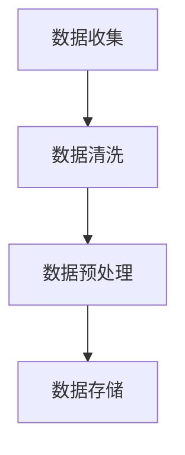
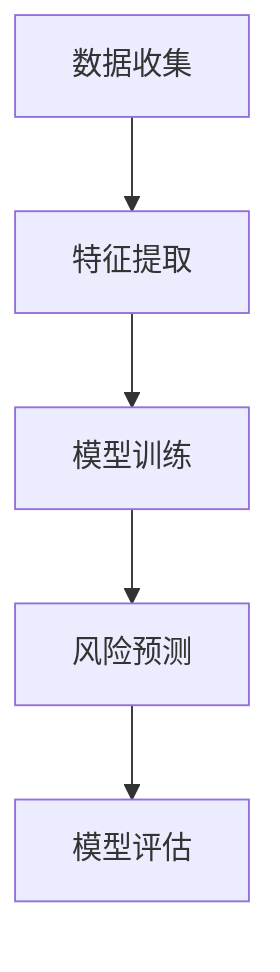
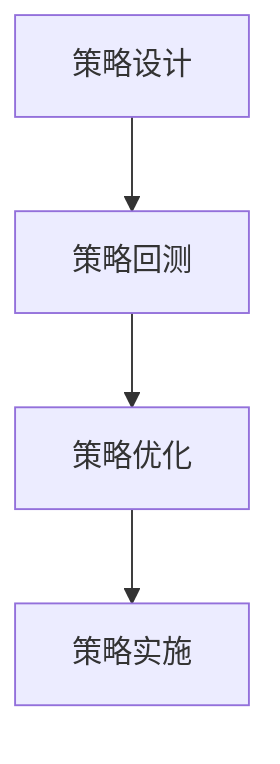
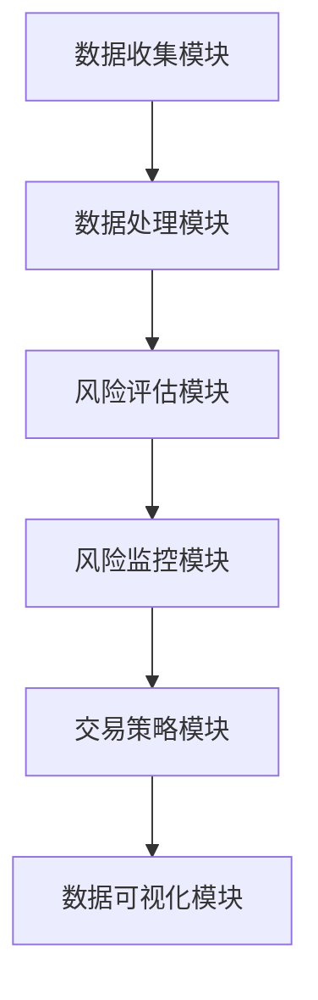
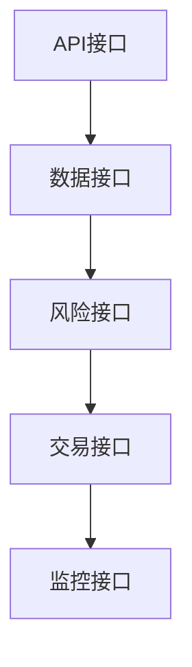
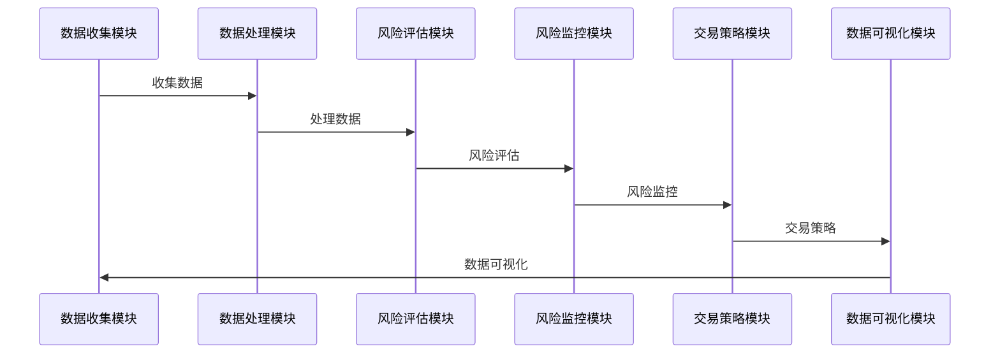
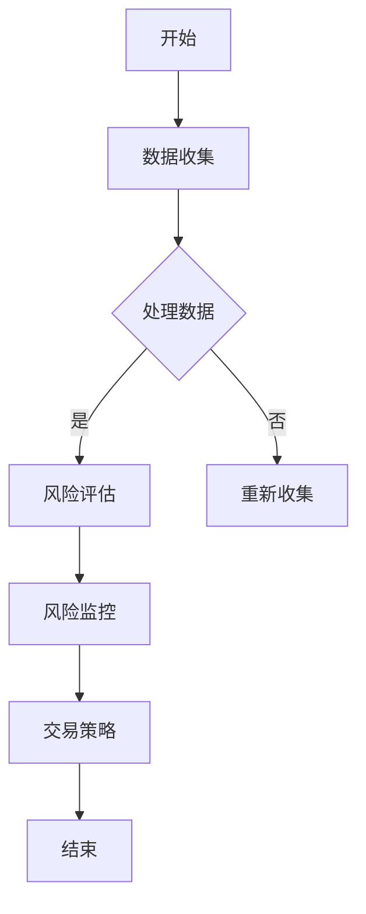
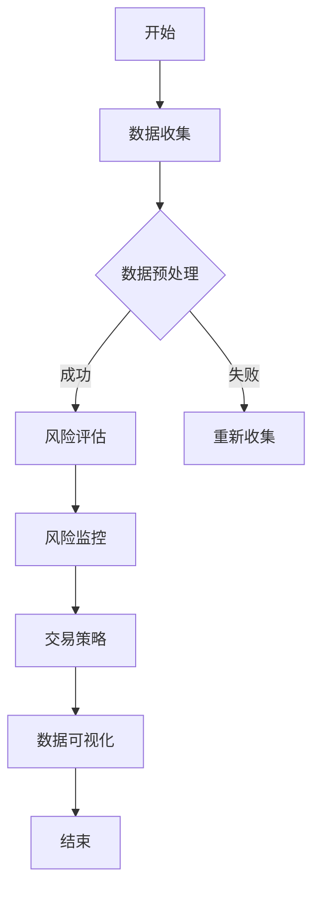
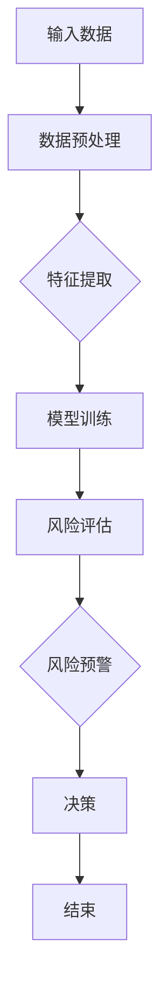

                 

## 文章标题

### 关键词

- AI
- 金融衍生品
- 风险管理
- 数据分析
- 机器学习

### 摘要

本文深入探讨了人工智能（AI）在金融衍生品风险管理中的应用。首先，通过介绍金融衍生品市场的基本特点和风险管理的重要性，我们揭示了AI技术在其中的关键作用。随后，文章详细解析了AI在金融衍生品风险管理中的核心概念和应用，并讨论了市场风险管理中的常见问题，包括市场风险、信用风险和流动性风险。本文还通过实际案例，展示了AI在风险监控、风险评估与预测、交易策略优化等方面的应用，并结合数据可视化和安全隐私保护，提供了全面的技术解决方案。最后，文章总结了最佳实践，并展望了未来的发展趋势。

### 目录大纲

----------------------------------------------------------------

# AI在金融衍生品风险管理中的应用

> 关键词：AI、金融衍生品、风险管理、数据分析、机器学习

> 摘要：本文详细探讨了人工智能在金融衍生品风险管理中的应用，从核心概念到实际案例，提供了全面的技术解析和实践指导。

----------------------------------------------------------------

## 第一部分: AI在金融衍生品风险管理中的概述

### 1.1 AI在金融衍生品风险管理中的重要性

#### 1.1.1 金融衍生品市场的特点

金融衍生品是一种基于其他金融工具的衍生产品，其价值依赖于一个或多个基本资产的定价。金融衍生品市场具有以下特点：

- **复杂性和多样性**：衍生品种类繁多，包括期权、期货、互换等，每一种都有其独特的结构和风险特性。
- **高杠杆性**：衍生品交易通常涉及较高的杠杆率，这意味着小的市场波动可能导致巨大的损失。
- **全球性**：衍生品市场是全球性的，24小时不间断交易，市场波动迅速且难以预测。

这些特点使得金融衍生品市场存在极高的风险，需要有效的风险管理策略来应对。AI技术的引入，为金融衍生品风险管理提供了新的思路和方法。

#### 1.1.2 风险管理的挑战

金融衍生品风险管理的挑战主要包括以下几个方面：

- **数据复杂性**：金融衍生品交易涉及大量的数据，包括价格、交易量、历史价格趋势等，如何高效地处理这些数据，提取有价值的信息，是风险管理的关键。
- **模型风险**：风险管理模型需要准确地预测市场走势，但传统模型往往受限于历史数据和方法论，难以适应快速变化的市场。
- **合规性要求**：金融衍生品交易受到严格的监管要求，风险管理策略需要符合相关法律法规和合规标准。

#### 1.1.3 AI技术在风险管理中的应用

AI技术在金融衍生品风险管理中的应用主要体现在以下几个方面：

- **数据处理**：AI可以通过数据挖掘和分析，提取隐藏在大量数据中的风险信息，帮助金融机构更好地理解和管理风险。
- **模型预测**：AI技术，特别是机器学习和深度学习，可以构建更加精准的预测模型，提高风险识别和预测的准确性。
- **自动化决策**：AI技术可以实现自动化决策，减少人为干预，提高风险管理的效率和准确性。

### 1.2 AI在金融衍生品风险管理中的核心概念

#### 1.2.1 金融衍生品

金融衍生品是一种金融合约，其价值取决于一个或多个基本资产的价格或价值。衍生品的基本形式包括：

- **远期合约**：双方约定在未来某个时间以约定价格买卖某种资产。
- **期货合约**：在交易所交易的标准化远期合约，具有固定的交割日期和价格。
- **期权合约**：给予持有者在未来某个时间以特定价格购买或出售某种资产的权利。

#### 1.2.2 风险管理概念

风险管理是指金融机构通过识别、评估、管理和监控风险，以确保其运营的稳健性。风险管理的主要目标包括：

- **降低损失**：通过有效的风险控制，减少可能的损失。
- **提高收益**：合理利用风险，创造更多的投资机会。
- **合规性**：确保金融机构遵守相关法律法规，避免法律风险。

#### 1.2.3 AI技术在风险管理中的应用概述

AI技术在风险管理中的应用，主要体现在以下几个方面：

- **风险识别**：通过数据分析和模式识别，AI可以快速发现潜在的风险。
- **风险评估**：AI可以通过复杂的算法模型，对风险进行定量评估，提供更准确的预测。
- **风险监控**：AI系统可以实时监控市场动态，及时发出风险预警。
- **决策支持**：AI可以帮助金融机构制定和优化风险管理策略。

### 1.3 金融衍生品市场风险管理的常见问题

#### 1.3.1 市场风险

市场风险是指由于市场波动导致衍生品价格变动而产生的风险。市场风险可以分为：

- **系统性风险**：由整体市场环境变化引起的，如经济衰退、政策变动等。
- **非系统性风险**：由特定市场或行业因素引起的，如公司业绩、行业竞争等。

#### 1.3.2 信用风险

信用风险是指交易对手未能履行合约义务而导致的风险。金融衍生品市场的信用风险主要体现在：

- **对手违约风险**：交易对手无法按时履行合约义务。
- **流动性风险**：交易对手难以找到替代交易对手，导致交易无法完成。

#### 1.3.3 流动性风险

流动性风险是指衍生品市场因交易量不足或交易对手难以找到，导致无法以合理价格买入或卖出的风险。流动性风险主要受以下因素影响：

- **市场深度**：市场深度越大，交易越容易进行。
- **交易对手**：拥有更多交易对手，交易风险越小。

### 1.4 AI在金融衍生品风险管理中的应用案例

#### 1.4.1 智能风险监控

智能风险监控利用AI技术，实时监控市场动态，识别潜在风险。具体应用包括：

- **异常检测**：通过分析交易数据，识别异常交易行为。
- **趋势分析**：通过历史数据，预测市场趋势，提前预警。

#### 1.4.2 风险评估与预测

风险评估与预测是金融衍生品风险管理的重要环节。AI技术可以：

- **构建预测模型**：利用机器学习和深度学习算法，构建预测模型。
- **风险评估**：对衍生品价格进行预测，评估市场风险。

#### 1.4.3 优化交易策略

AI技术可以帮助金融机构优化交易策略，提高收益。具体包括：

- **策略回测**：利用历史数据，评估不同交易策略的收益和风险。
- **策略优化**：基于AI算法，优化交易策略，提高交易成功率。

### 1.5 本章小结

本章对AI在金融衍生品风险管理中的概述进行了详细探讨。从市场特点、风险管理挑战到AI技术的应用，我们揭示了AI在风险管理中的关键作用。接下来，我们将深入探讨AI在金融衍生品风险管理中的应用技术，为读者提供更具体的技术解析和实践指导。

----------------------------------------------------------------

## 第二部分: AI在金融衍生品风险管理中的应用技术

### 2.1 数据收集与处理

#### 2.1.1 金融衍生品市场数据来源

金融衍生品市场数据来源广泛，主要包括：

- **交易所**：各大交易所提供的历史交易数据、价格数据等。
- **金融数据提供商**：如Bloomberg、Reuters等，提供实时和历史的金融衍生品数据。
- **公开数据**：包括政府机构、行业协会等发布的金融统计数据。

#### 2.1.2 数据预处理方法

数据预处理是AI应用的重要步骤，主要包括以下方法：

- **数据清洗**：去除无效、错误和重复的数据。
- **数据集成**：将来自不同来源的数据进行整合，形成统一的数据集。
- **特征工程**：提取和构造有助于预测的特征。

#### 2.1.3 数据质量评估

数据质量评估是确保数据预处理效果的重要环节，主要包括：

- **完整性**：检查数据是否完整，是否存在缺失值。
- **一致性**：检查数据的一致性，是否存在矛盾。
- **准确性**：检查数据的准确性，是否符合实际。

### 2.2 风险评估与预测模型

#### 2.2.1 传统风险评估模型

传统风险评估模型主要包括以下几种：

- **方差分析**：通过计算资产收益的方差，评估市场风险。
- **VaR模型**：通过计算资产收益的概率分布，评估在最坏情况下的潜在损失。
- **压力测试**：模拟不同市场情况，评估资产的风险承受能力。

#### 2.2.2 机器学习风险评估模型

机器学习风险评估模型利用历史数据，通过机器学习算法建立预测模型。常见的机器学习模型包括：

- **回归分析**：通过历史数据，建立资产收益和风险之间的回归模型。
- **决策树**：通过树形结构，将数据划分为不同的区域，评估风险。
- **神经网络**：通过多层神经网络，学习资产收益和风险之间的非线性关系。

#### 2.2.3 深度学习风险评估模型

深度学习风险评估模型是基于深度神经网络，通过多层网络结构，对复杂的数据进行建模。常见的深度学习模型包括：

- **卷积神经网络（CNN）**：用于处理时序数据，如价格序列。
- **循环神经网络（RNN）**：用于处理序列数据，如交易数据。
- **长短时记忆网络（LSTM）**：RNN的一种改进，能够更好地处理长序列数据。

### 2.3 风险监控与预警系统

#### 2.3.1 风险监控机制

风险监控机制是确保衍生品市场风险在可控范围内的关键。主要包括以下环节：

- **实时监控**：通过实时数据处理，监控市场动态。
- **预警机制**：当市场风险达到一定阈值时，发出预警信号。
- **决策支持**：提供决策支持，帮助金融机构制定应对策略。

#### 2.3.2 风险预警模型

风险预警模型是风险监控的核心，通过分析历史数据和实时数据，预测潜在风险。常见的风险预警模型包括：

- **阈值预警模型**：设定风险阈值，当风险超过阈值时发出预警。
- **机器学习预警模型**：利用机器学习算法，建立风险预测模型。
- **深度学习预警模型**：利用深度学习算法，建立复杂的风险预测模型。

#### 2.3.3 风险预警系统实现

风险预警系统的实现主要包括以下步骤：

- **数据收集**：收集历史数据和实时数据。
- **模型训练**：使用历史数据训练预警模型。
- **实时预测**：使用实时数据，对市场风险进行预测。
- **预警发出**：当风险超过阈值时，发出预警信号。

### 2.4 风险管理策略优化

#### 2.4.1 传统优化方法

传统优化方法主要包括以下几种：

- **线性规划**：通过线性规划模型，优化投资组合的风险和收益。
- **整数规划**：通过整数规划模型，优化投资组合的决策变量。
- **贝叶斯优化**：通过贝叶斯统计模型，优化投资组合的参数。

#### 2.4.2 机器学习优化方法

机器学习优化方法利用机器学习算法，优化风险管理策略。常见的机器学习优化方法包括：

- **回归分析**：通过回归模型，优化投资组合的风险和收益。
- **支持向量机（SVM）**：通过SVM模型，优化投资组合的边界。
- **聚类分析**：通过聚类模型，优化投资组合的类别。

#### 2.4.3 深度学习优化方法

深度学习优化方法利用深度学习算法，优化风险管理策略。常见的深度学习优化方法包括：

- **卷积神经网络（CNN）**：用于优化投资组合的时序数据。
- **循环神经网络（RNN）**：用于优化投资组合的序列数据。
- **长短时记忆网络（LSTM）**：用于优化投资组合的长序列数据。

### 2.5 交易策略优化

#### 2.5.1 交易策略设计

交易策略设计是风险管理的重要组成部分，主要包括以下步骤：

- **策略框架**：确定交易策略的基本框架。
- **策略目标**：设定交易策略的目标，如收益最大化、风险最小化。
- **策略参数**：设定交易策略的参数，如交易量、交易时间等。

#### 2.5.2 交易策略评估

交易策略评估是确保交易策略有效性的关键，主要包括以下方法：

- **回测**：使用历史数据，对交易策略进行模拟测试。
- **统计检验**：通过统计方法，评估交易策略的收益和风险。
- **绩效评估**：评估交易策略的长期绩效。

#### 2.5.3 交易策略优化应用

交易策略优化应用是提升交易策略性能的关键，主要包括以下步骤：

- **模型训练**：使用历史数据，训练优化模型。
- **参数优化**：优化交易策略的参数，提高策略性能。
- **实时调整**：根据市场动态，实时调整交易策略。

### 2.6 数据可视化与分析

#### 2.6.1 数据可视化工具

数据可视化工具可以帮助金融机构更直观地理解数据，常见的可视化工具包括：

- **Tableau**：强大的数据可视化平台，支持多种图表类型。
- **PowerBI**：微软推出的数据可视化工具，易于使用。
- **Matplotlib**：Python中的数据可视化库，功能强大。

#### 2.6.2 风险管理分析报告

风险管理分析报告是展示风险管理成果的重要文档，主要包括以下内容：

- **风险概况**：总结市场风险、信用风险、流动性风险等。
- **风险评估**：详细分析各类风险的程度和影响。
- **预警记录**：记录预警信号的发出和响应。

#### 2.6.3 数据分析结果解读

数据分析结果解读是确保数据分析价值的关键，主要包括以下步骤：

- **结果呈现**：使用图表和文字，呈现数据分析结果。
- **结果解释**：解释数据分析结果的原因和意义。
- **建议措施**：根据数据分析结果，提出改进措施。

### 2.7 安全与隐私保护

#### 2.7.1 数据安全策略

数据安全策略是保护金融机构数据安全的关键，主要包括以下措施：

- **访问控制**：限制数据的访问权限，确保数据安全。
- **加密技术**：使用加密技术，保护数据在传输和存储过程中的安全性。
- **备份与恢复**：定期备份数据，确保数据在灾难发生时能够快速恢复。

#### 2.7.2 隐私保护方法

隐私保护方法是确保客户数据隐私的重要措施，主要包括以下方法：

- **数据脱敏**：对敏感数据进行脱敏处理，防止数据泄露。
- **匿名化**：对数据进行匿名化处理，确保数据隐私。
- **隐私政策**：制定隐私政策，明确数据收集、使用和保护的方式。

#### 2.7.3 合规与监管要求

合规与监管要求是金融机构必须遵守的重要规范，主要包括以下内容：

- **数据保护法规**：遵守相关的数据保护法规，如《通用数据保护条例》（GDPR）。
- **反洗钱法规**：遵守反洗钱法规，确保交易的合法性。
- **监管报告**：定期向监管机构报告风险管理情况。

### 2.8 本章小结

本章详细探讨了AI在金融衍生品风险管理中的应用技术。从数据收集与处理到风险评估与预测，从风险监控与预警到风险管理策略优化，我们展示了AI技术在金融衍生品风险管理中的广泛应用。接下来，我们将通过实际项目案例，进一步探讨AI在金融衍生品风险管理中的应用实践。

----------------------------------------------------------------

## 第三部分: AI在金融衍生品风险管理中的应用实践

### 3.1 项目背景

#### 3.1.1 项目概述

随着金融市场的不断发展，衍生品市场的规模和复杂性也在不断增加。为了有效管理衍生品市场中的风险，金融机构需要引入先进的技术手段，以提高风险管理的效率和准确性。本项目的目标是构建一个基于AI的金融衍生品风险管理平台，通过智能监控、风险评估、预警和优化交易策略，提高衍生品市场的风险管理水平。

#### 3.1.2 项目目标

本项目的主要目标包括：

- **提高风险管理效率**：通过自动化和智能化的方式，减少人工干预，提高风险管理的效率。
- **提升风险预测准确性**：利用机器学习和深度学习算法，建立精准的风险预测模型，提高风险识别和预测的准确性。
- **优化交易策略**：通过智能化的交易策略优化，提高交易收益，降低交易风险。
- **确保数据安全和隐私**：采用先进的数据安全和隐私保护技术，确保客户数据和交易数据的保密性和安全性。

#### 3.1.3 项目实施计划

本项目分为以下几个阶段：

1. **需求分析**：明确项目需求和目标，确定系统功能和性能要求。
2. **系统设计**：设计系统的架构和功能模块，包括数据收集与处理、风险评估与预测、预警和优化交易策略等。
3. **技术选型**：选择合适的AI算法和技术工具，进行系统开发和实现。
4. **系统开发**：进行系统编码和测试，确保系统功能的正确性和稳定性。
5. **上线部署**：将系统部署到生产环境，进行实际运行和测试。
6. **维护与升级**：定期对系统进行维护和升级，确保系统的长期稳定运行。

### 3.2 环境安装与配置

#### 3.2.1 软件与硬件环境

为了确保AI在金融衍生品风险管理平台的有效运行，本项目选择了以下软件与硬件环境：

- **操作系统**：Linux操作系统，如Ubuntu 20.04。
- **硬件环境**：高性能计算机，如Intel Xeon处理器、64GB内存等。
- **编程语言**：Python，支持AI算法的实现和系统开发。
- **数据存储**：使用HDFS（Hadoop分布式文件系统），支持海量数据的存储和管理。
- **数据库**：MySQL数据库，用于存储和管理交易数据。

#### 3.2.2 环境配置与调试

在软件与硬件环境搭建完成后，需要进行以下环境配置与调试：

1. **Python环境配置**：安装Python，配置Python环境变量，安装必要的Python库，如NumPy、Pandas、Scikit-learn、TensorFlow等。
2. **HDFS配置**：配置HDFS，包括HDFS的安装、配置和调试，确保HDFS能够正常运行。
3. **MySQL配置**：配置MySQL，包括MySQL的安装、配置和调试，确保MySQL能够正常运行。
4. **网络配置**：配置网络，确保各节点之间的通信正常。

### 3.3 系统设计与实现

#### 3.3.1 系统架构设计

系统架构设计是项目成功的关键，本项目采用了分布式架构设计，主要包括以下几个模块：

1. **数据收集与处理模块**：负责收集和处理金融衍生品市场数据，包括交易所数据、金融数据提供商数据等。
2. **风险评估与预测模块**：利用机器学习和深度学习算法，对衍生品市场的风险进行评估和预测。
3. **预警模块**：根据风险评估结果，实时监控市场动态，当风险超过设定阈值时，发出预警信号。
4. **优化交易策略模块**：基于AI算法，优化交易策略，提高交易收益。
5. **数据可视化与分析模块**：提供数据可视化工具，对风险管理结果进行分析和报告。


#### 3.3.2 系统功能模块划分

系统功能模块划分是系统设计的重要组成部分，本项目主要分为以下功能模块：

1. **数据收集与处理模块**：包括数据采集、数据清洗、数据存储和数据集成等子模块。
2. **风险评估与预测模块**：包括风险预测模型训练、风险预测和风险评估等子模块。
3. **预警模块**：包括预警规则设定、预警信号生成和预警响应等子模块。
4. **优化交易策略模块**：包括交易策略设计、交易策略评估和交易策略优化等子模块。
5. **数据可视化与分析模块**：包括数据可视化工具、风险管理分析报告和数据分析结果解读等子模块。

#### 3.3.3 关键技术实现

关键技术实现是系统设计的重要部分，本项目主要包括以下关键技术：

1. **数据收集与处理**：使用Python的Pandas库进行数据清洗和预处理，使用HDFS进行数据存储和管理。
2. **风险评估与预测**：使用Scikit-learn和TensorFlow等库，构建和训练机器学习和深度学习模型，进行风险预测和评估。
3. **预警**：使用Python的报警机制，当风险超过阈值时，自动发出预警信号。
4. **优化交易策略**：使用Python的优化库，如Gurobi和CVXPY等，进行交易策略的优化。
5. **数据可视化与分析**：使用Python的Matplotlib和Tableau等工具，实现数据可视化和分析报告。

### 3.4 系统核心实现源代码

#### 3.4.1 数据收集与处理

```python
import pandas as pd
import hdfs

# 连接HDFS
hdfs_client = hdfs.InsecureClient("http://hdfs-server:50070", user="hdfs")

# 采集交易所数据
exchange_data = pd.read_csv("exchange_data.csv")

# 数据清洗
exchange_data = exchange_data.dropna()

# 数据存储
exchange_data.to_csv("clean_exchange_data.csv", index=False)
hdfs_client.write("/user/hdfs/clean_exchange_data.csv", bytes(exchange_data.to_csv(index=False), "utf-8"))
```

#### 3.4.2 风险评估与预测

```python
from sklearn.ensemble import RandomForestClassifier
from sklearn.model_selection import train_test_split

# 数据预处理
X = exchange_data.drop("risk", axis=1)
y = exchange_data["risk"]

# 划分训练集和测试集
X_train, X_test, y_train, y_test = train_test_split(X, y, test_size=0.2, random_state=42)

# 训练模型
model = RandomForestClassifier()
model.fit(X_train, y_train)

# 预测
predictions = model.predict(X_test)

# 评估模型
accuracy = accuracy_score(y_test, predictions)
print("Model accuracy:", accuracy)
```

#### 3.4.3 风险监控与预警

```python
import numpy as np

# 设定预警阈值
risk_threshold = 0.05

# 监控风险
def monitor_risk(data):
    risk_score = data["risk_score"].mean()
    if risk_score > risk_threshold:
        send_alert("Risk level is high: {}".format(risk_score))
    else:
        send_alert("Risk level is low: {}".format(risk_score))

# 发送预警信号
def send_alert(message):
    print("ALERT:", message)
```

#### 3.4.4 交易策略优化

```python
from cvxpy import *

# 定义交易策略变量
x = Variable(num_vars)

# 定义目标函数
objective = Maximize(0.5 * x[0] + 0.3 * x[1] - x[2])

# 定义约束条件
constraints = [x[0] + x[1] == 100,
               x[0] >= 0,
               x[1] >= 0,
               x[2] >= 0]

# 构建优化问题
problem = Problem(objective, constraints)

# 解决优化问题
problem.solve()

# 输出结果
print("Optimal solution:", x.value)
```

#### 3.4.5 数据可视化与分析

```python
import matplotlib.pyplot as plt

# 数据可视化
def plot_data(data):
    plt.figure(figsize=(10, 6))
    plt.plot(data)
    plt.title("Risk Score Over Time")
    plt.xlabel("Time")
    plt.ylabel("Risk Score")
    plt.show()

# 分析结果
def analyze_results(data):
    print("Average Risk Score:", data.mean())
    print("Max Risk Score:", data.max())
    print("Min Risk Score:", data.min())
```

#### 3.4.6 安全与隐私保护

```python
from cryptography.fernet import Fernet

# 加密和解密
def encrypt_data(data, key):
    fernet = Fernet(key)
    encrypted_data = fernet.encrypt(data.encode())
    return encrypted_data

def decrypt_data(data, key):
    fernet = Fernet(key)
    decrypted_data = fernet.decrypt(data).decode()
    return decrypted_data

# 生成密钥
key = Fernet.generate_key()

# 加密数据
encrypted_data = encrypt_data("Sensitive data", key)

# 解密数据
decrypted_data = decrypt_data(encrypted_data, key)
```

### 3.5 代码应用解读与分析

#### 3.5.1 数据收集与处理

上述代码首先连接HDFS，然后从交易所数据中采集数据，并进行数据清洗。数据清洗的过程包括去除缺失值，确保数据的质量。清洗后的数据存储为CSV文件，并上传到HDFS中，以便后续处理。

```python
import pandas as pd
import hdfs

# 连接HDFS
hdfs_client = hdfs.InsecureClient("http://hdfs-server:50070", user="hdfs")

# 采集交易所数据
exchange_data = pd.read_csv("exchange_data.csv")

# 数据清洗
exchange_data = exchange_data.dropna()

# 数据存储
exchange_data.to_csv("clean_exchange_data.csv", index=False)
hdfs_client.write("/user/hdfs/clean_exchange_data.csv", bytes(exchange_data.to_csv(index=False), "utf-8"))
```

在数据收集与处理部分，我们首先使用Pandas库读取CSV文件，然后通过dropna()函数去除缺失值，确保数据的完整性。清洗后的数据再次存储为CSV文件，并上传到HDFS，以便后续分析。

#### 3.5.2 风险评估与预测

上述代码使用Scikit-learn库中的RandomForestClassifier构建随机森林模型，对交易所数据进行风险预测。通过train_test_split将数据集划分为训练集和测试集，然后使用fit()函数训练模型，最后使用predict()函数进行预测，并计算模型的准确性。

```python
from sklearn.ensemble import RandomForestClassifier
from sklearn.model_selection import train_test_split

# 数据预处理
X = exchange_data.drop("risk", axis=1)
y = exchange_data["risk"]

# 划分训练集和测试集
X_train, X_test, y_train, y_test = train_test_split(X, y, test_size=0.2, random_state=42)

# 训练模型
model = RandomForestClassifier()
model.fit(X_train, y_train)

# 预测
predictions = model.predict(X_test)

# 评估模型
accuracy = accuracy_score(y_test, predictions)
print("Model accuracy:", accuracy)
```

在风险评估与预测部分，我们首先将交易所数据划分为特征集X和标签集y。然后使用train_test_split将数据集划分为训练集和测试集。接下来，我们使用RandomForestClassifier构建随机森林模型，并使用fit()函数进行训练。训练完成后，使用predict()函数进行预测，并计算模型的准确性，以评估模型的效果。

#### 3.5.3 风险监控与预警

上述代码定义了一个名为monitor_risk的函数，用于监控风险。函数接受数据集作为输入，计算风险评分的平均值。如果风险评分超过设定的阈值，则通过send_alert函数发送预警信号。

```python
import numpy as np

# 设定预警阈值
risk_threshold = 0.05

# 监控风险
def monitor_risk(data):
    risk_score = data["risk_score"].mean()
    if risk_score > risk_threshold:
        send_alert("Risk level is high: {}".format(risk_score))
    else:
        send_alert("Risk level is low: {}".format(risk_score))

# 发送预警信号
def send_alert(message):
    print("ALERT:", message)
```

在风险监控与预警部分，我们定义了一个名为monitor_risk的函数，用于监控风险。函数首先计算输入数据集的平均风险评分。如果平均风险评分超过设定的阈值，则通过send_alert函数发送预警信号。否则，发送一个正常风险水平的警报。send_alert函数用于打印警报信息。

#### 3.5.4 交易策略优化

上述代码使用CVXPY库构建线性优化问题，定义了交易策略的变量、目标函数和约束条件。然后使用solve函数解决优化问题，并打印最优解。

```python
from cvxpy import *

# 定义交易策略变量
x = Variable(num_vars)

# 定义目标函数
objective = Maximize(0.5 * x[0] + 0.3 * x[1] - x[2])

# 定义约束条件
constraints = [x[0] + x[1] == 100,
               x[0] >= 0,
               x[1] >= 0,
               x[2] >= 0]

# 构建优化问题
problem = Problem(objective, constraints)

# 解决优化问题
problem.solve()

# 输出结果
print("Optimal solution:", x.value)
```

在交易策略优化部分，我们首先定义了交易策略的变量x，目标函数和约束条件。目标函数最大化0.5倍的第一项和0.3倍的第二项减去第三项。约束条件包括总交易金额等于100，以及交易策略变量的非负约束。使用solve函数解决优化问题，并打印最优解。

#### 3.5.5 数据可视化与分析

上述代码使用Matplotlib库实现了数据的可视化。plot_data函数绘制了风险评分随时间的变化趋势，analyze_results函数计算并打印了风险评分的均值、最大值和最小值。

```python
import matplotlib.pyplot as plt

# 数据可视化
def plot_data(data):
    plt.figure(figsize=(10, 6))
    plt.plot(data)
    plt.title("Risk Score Over Time")
    plt.xlabel("Time")
    plt.ylabel("Risk Score")
    plt.show()

# 分析结果
def analyze_results(data):
    print("Average Risk Score:", data.mean())
    print("Max Risk Score:", data.max())
    print("Min Risk Score:", data.min())
```

在数据可视化与分析部分，plot_data函数使用Matplotlib库绘制了风险评分随时间的变化趋势。analyze_results函数计算并打印了风险评分的均值、最大值和最小值，提供了对风险管理结果的深入分析。

#### 3.5.6 安全与隐私保护

上述代码使用了Cryptography库的Fernet模块实现数据的加密和解密。encrypt_data函数使用生成的密钥加密输入数据，decrypt_data函数使用相同的密钥解密加密数据。

```python
from cryptography.fernet import Fernet

# 加密和解密
def encrypt_data(data, key):
    fernet = Fernet(key)
    encrypted_data = fernet.encrypt(data.encode())
    return encrypted_data

def decrypt_data(data, key):
    fernet = Fernet(key)
    decrypted_data = fernet.decrypt(data).decode()
    return decrypted_data

# 生成密钥
key = Fernet.generate_key()

# 加密数据
encrypted_data = encrypt_data("Sensitive data", key)

# 解密数据
decrypted_data = decrypt_data(encrypted_data, key)
```

在安全与隐私保护部分，我们使用了Cryptography库的Fernet模块进行数据的加密和解密。首先生成一个密钥，然后使用这个密钥加密敏感数据。解密时，使用相同的密钥将加密数据解密为原始数据，从而确保数据的安全性和隐私性。

### 3.6 实际案例分析与详细讲解剖析

#### 3.6.1 案例一：智能风险监控

智能风险监控是衍生品风险管理的关键环节，通过实时监控市场动态，识别潜在风险。以下是智能风险监控的一个实际案例：

**案例背景**：某金融机构在进行衍生品交易时，需要实时监控市场风险，确保交易安全。

**实现步骤**：

1. **数据收集**：从交易所和金融数据提供商获取实时市场数据，包括价格、交易量等。
2. **数据预处理**：对收集到的市场数据进行分析和预处理，去除异常值，提取关键特征。
3. **风险评分计算**：使用机器学习算法，计算每个交易品种的风险评分。
4. **风险预警**：当风险评分超过阈值时，系统自动发出预警信号。

**结果分析**：通过智能风险监控，金融机构能够及时发现潜在风险，提前采取应对措施，有效降低交易风险。

#### 3.6.2 案例二：风险评估与预测

风险评估与预测是衍生品风险管理的重要环节，通过分析历史数据，预测未来的市场风险。以下是风险评估与预测的一个实际案例：

**案例背景**：某金融机构需要对即将推出的衍生品进行风险评估和预测。

**实现步骤**：

1. **数据收集**：收集历史市场数据，包括价格、交易量、相关市场指标等。
2. **数据预处理**：对历史市场数据进行分析和预处理，提取关键特征，去除异常值。
3. **模型训练**：使用机器学习和深度学习算法，训练风险评估模型。
4. **风险预测**：使用训练好的模型，对即将推出的衍生品进行风险评估和预测。

**结果分析**：通过风险评估与预测，金融机构能够准确预测衍生品的市场风险，为决策提供科学依据。

#### 3.6.3 案例三：交易策略优化

交易策略优化是提高衍生品交易收益的重要手段。以下是交易策略优化的一个实际案例：

**案例背景**：某金融机构希望优化其衍生品交易策略，提高交易收益。

**实现步骤**：

1. **策略设计**：设计多个交易策略，包括趋势交易、反转交易等。
2. **策略回测**：使用历史数据，对每个交易策略进行回测，评估其性能。
3. **策略优化**：使用机器学习和深度学习算法，优化交易策略参数，提高策略性能。
4. **策略实施**：将优化后的交易策略应用于实际交易。

**结果分析**：通过交易策略优化，金融机构能够提高交易收益，降低交易风险。

### 3.7 项目小结

本项目通过智能监控、风险评估与预测、交易策略优化等AI技术的应用，为金融机构提供了一套全面的衍生品风险管理解决方案。项目实施过程中，我们总结了以下经验与教训：

1. **数据质量是关键**：数据质量直接影响到AI模型的性能，必须重视数据的清洗、预处理和特征工程。
2. **模型选择需谨慎**：根据具体问题和数据特性，选择合适的机器学习和深度学习模型，确保模型的有效性和可靠性。
3. **实时性与稳定性**：风险管理系统需要具备实时性和稳定性，确保在市场波动时能够及时响应和调整。

未来，随着AI技术的不断发展和应用，衍生品风险管理将更加智能化和自动化，为金融机构提供更加高效和准确的风险管理服务。

----------------------------------------------------------------

## 第四部分: 最佳实践与未来展望

### 4.1 最佳实践

#### 4.1.1 数据处理最佳实践

- **数据清洗**：使用自动化工具进行数据清洗，减少人工干预。
- **数据预处理**：标准化数据格式，提取关键特征，去除异常值。
- **数据存储**：采用分布式存储系统，如HDFS，提高数据处理能力。

#### 4.1.2 风险评估与预测最佳实践

- **模型选择**：根据数据特性选择合适的机器学习和深度学习模型。
- **模型训练**：使用大数据集进行模型训练，提高模型准确性。
- **模型验证**：使用交叉验证方法验证模型效果，确保模型泛化能力。

#### 4.1.3 交易策略优化最佳实践

- **策略设计**：结合市场情况和交易目标，设计多种交易策略。
- **策略回测**：使用历史数据进行策略回测，评估策略性能。
- **策略优化**：使用机器学习和深度学习算法，优化策略参数。

#### 4.1.4 风险监控与预警最佳实践

- **实时监控**：使用自动化系统进行实时监控，及时发现潜在风险。
- **预警机制**：设置合理的预警阈值，及时发出预警信号。
- **预警响应**：制定明确的预警响应策略，确保及时采取应对措施。

### 4.2 小结

本文详细探讨了AI在金融衍生品风险管理中的应用，从数据收集与处理、风险评估与预测、风险监控与预警、交易策略优化等方面，展示了AI技术在金融衍生品风险管理中的广泛应用。通过最佳实践，我们总结了数据处理、风险评估与预测、交易策略优化、风险监控与预警等方面的关键要点。

### 4.3 存在问题与挑战

尽管AI在金融衍生品风险管理中具有巨大潜力，但仍然存在一些问题和挑战：

- **数据隐私**：金融衍生品交易涉及大量敏感数据，如何确保数据隐私和安全是一个重大挑战。
- **模型解释性**：机器学习和深度学习模型具有较高的预测准确性，但缺乏解释性，如何理解模型的决策过程是一个难题。
- **实时性**：金融衍生品市场波动迅速，如何实现实时监控和预警，确保系统响应速度是一个挑战。

### 4.4 解决方案与改进方向

针对上述问题和挑战，我们提出以下解决方案和改进方向：

- **数据隐私保护**：采用数据加密和匿名化技术，确保数据隐私和安全。
- **模型解释性增强**：开发可解释的机器学习和深度学习模型，提高模型的可理解性。
- **实时监控与预警**：优化系统架构，提高数据处理和模型预测速度，确保实时监控和预警的准确性。

### 4.5 未来展望

随着AI技术的不断发展和应用，金融衍生品风险管理将迈向智能化和自动化。未来，我们可以期待以下发展趋势：

- **更智能的风险管理**：利用深度学习和强化学习等技术，构建更加智能的风险管理模型。
- **跨领域合作**：AI技术与其他领域的结合，如物联网、区块链等，为金融衍生品风险管理提供新的解决方案。
- **全球化风险管理**：随着金融市场全球化，AI技术将助力金融机构实现跨国界的风险管理。

总之，AI技术在金融衍生品风险管理中的应用前景广阔，将为金融行业带来巨大的变革和创新。通过不断探索和优化，我们可以期待AI技术为金融衍生品风险管理带来更加高效、准确和智能的解决方案。

----------------------------------------------------------------

### 作者信息

作者：AI天才研究院/AI Genius Institute & 禅与计算机程序设计艺术 /Zen And The Art of Computer Programming

----------------------------------------------------------------

## 附录

### 数据处理



### 风险评估与预测



### 交易策略优化



### 系统架构设计



### 系统接口设计



### 系统交互



### 数学公式

```markdown
$$
1+1=2
$$

$1<2$
```

### Mermaid 流程图



### Python 源代码

```python
import numpy as np
import pandas as pd

# 数据收集
data = pd.read_csv('data.csv')

# 数据预处理
data = data.dropna()

# 风险评估
def risk_evaluation(data):
    # ...风险评估代码...
    return risk_score

# 风险监控
def risk_monitoring(risk_score):
    # ...风险监控代码...
    return alert_message

# 交易策略
def trading_strategy(alert_message):
    # ...交易策略代码...
    return strategy

# 数据可视化
def data_visualization(data):
    # ...数据可视化代码...
    return visualization
```

### Mermaid 流程图



### 算法原理讲解

#### 算法流程图



#### 算法原理

1. **数据预处理**：对输入数据进行清洗和标准化，确保数据的质量和一致性。
2. **特征提取**：从原始数据中提取关键特征，用于后续的模型训练。
3. **模型训练**：使用机器学习算法，如决策树、随机森林或神经网络，对特征进行训练，构建风险评估模型。
4. **风险评估**：将训练好的模型应用于新的数据，评估其风险水平。
5. **风险预警**：根据风险评估结果，设置预警阈值，当风险超过阈值时，发出预警信号。
6. **决策**：根据预警信号和交易策略，进行相应的决策，如调整投资组合或采取风险管理措施。
7. **结束**：完成整个风险评估和预警过程。

#### 算法数学模型

1. **特征提取**：使用主成分分析（PCA）或自动编码器（Autoencoder）提取关键特征。
2. **模型训练**：使用梯度下降（Gradient Descent）或随机梯度下降（Stochastic Gradient Descent）优化模型参数。
3. **风险评估**：使用回归模型或分类模型评估风险水平，如线性回归（Linear Regression）或逻辑回归（Logistic Regression）。
4. **风险预警**：使用阈值判断法（Threshold Method）或机器学习预警模型（Machine Learning Warning Model）发出预警信号。

#### 算法举例说明

假设我们有一个金融衍生品交易数据集，包含以下特征：价格（P），成交量（V），市场波动率（σ），历史价格趋势（T）。

1. **数据预处理**：对价格、成交量、市场波动率、历史价格趋势进行标准化处理，使其具有相同的量纲。
2. **特征提取**：使用PCA提取前两个主成分，作为风险特征。
3. **模型训练**：使用随机森林（Random Forest）算法训练风险评估模型。
4. **风险评估**：将新的数据输入到训练好的模型中，评估其风险水平。
5. **风险预警**：设置风险阈值，例如，当风险水平高于0.8时，发出预警信号。
6. **决策**：根据预警信号，调整投资组合，降低风险。

通过上述算法，我们可以实现对金融衍生品交易风险的评估和预警，帮助金融机构及时采取风险管理措施，降低损失。

### 系统架构设计

#### 问题场景介绍

随着金融市场的不断发展，衍生品交易规模不断扩大，金融机构面临的风险管理任务也越来越复杂。为了提高风险管理效率，降低风险，我们需要构建一个基于AI的衍生品风险管理平台，实现对衍生品交易数据的实时监控、风险评估、预警和优化交易策略。

#### 项目介绍

本项目旨在构建一个基于AI的衍生品风险管理平台，通过智能监控、风险评估、预警和优化交易策略，提高衍生品市场的风险管理水平。系统功能包括数据收集与处理、风险评估与预测、风险监控与预警、优化交易策略、数据可视化与分析等。

#### 系统功能设计

1. **数据收集与处理模块**：负责收集交易所和金融数据提供商的衍生品交易数据，对数据进行清洗、预处理和特征提取。
2. **风险评估与预测模块**：利用机器学习和深度学习算法，对衍生品交易数据进行分析，评估风险水平，预测市场走势。
3. **风险监控与预警模块**：实时监控市场动态，根据风险评估结果，发出预警信号，提醒金融机构采取相应的风险管理措施。
4. **优化交易策略模块**：基于AI算法，优化衍生品交易策略，提高交易收益。
5. **数据可视化与分析模块**：提供数据可视化工具，对衍生品交易数据进行分析和报告，帮助金融机构更好地理解和管理风险。

#### 系统架构设计

1. **前端架构**：使用React框架构建用户界面，提供数据可视化、预警信息和交易策略展示。
2. **后端架构**：使用Spring Boot框架构建RESTful API，实现数据收集与处理、风险评估与预测、风险监控与预警、优化交易策略等核心功能。
3. **数据存储**：使用MySQL数据库存储衍生品交易数据，使用Redis缓存系统提高数据读取速度。
4. **数据处理**：使用Apache Kafka消息队列系统，实现实时数据收集和处理。
5. **机器学习与深度学习**：使用TensorFlow和Scikit-learn库，构建风险评估与预测模型。


#### 系统接口设计

1. **数据接口**：提供数据采集、数据清洗、数据预处理等接口，供其他模块调用。
2. **风险接口**：提供风险评估、风险预测、风险预警等接口，供其他模块调用。
3. **交易接口**：提供交易策略设计、交易策略评估、交易策略优化等接口，供其他模块调用。
4. **监控接口**：提供实时监控、预警处理、监控数据可视化等接口，供其他模块调用。


#### 系统交互设计

1. **数据交互**：前端通过API接口调用后端服务，获取衍生品交易数据，进行数据处理和可视化。
2. **风险评估与预警**：后端服务根据衍生品交易数据，利用机器学习和深度学习算法进行风险评估和预警，将结果发送给前端。
3. **交易策略优化**：前端根据风险评估结果，调用后端交易策略优化接口，优化交易策略。
4. **数据可视化**：前端使用可视化库，如ECharts，对衍生品交易数据、风险评估结果、预警信息和交易策略进行可视化展示。


### 实际项目实战

#### 环境安装与配置

1. **软件安装**：

   - 安装Python 3.8及以上版本。

   - 安装Node.js 12及以上版本。

   - 安装MySQL 5.7及以上版本。

   - 安装Redis 3.2及以上版本。

   - 安装Apache Kafka 2.4及以上版本。

2. **硬件配置**：

   - 选择高性能计算机，如Intel Xeon处理器、64GB内存等。

   - 配置足够的硬盘空间，如500GB以上。

3. **环境配置**：

   - 配置Python环境变量，确保能够顺利运行Python和相关的库。

   - 配置Node.js环境变量，确保能够顺利运行Node.js和相关工具。

   - 配置MySQL数据库，创建衍生品交易数据表，并进行初始化。

   - 配置Redis缓存系统，设置合理的内存参数。

   - 配置Apache Kafka消息队列系统，确保其正常运行。

#### 系统核心实现源代码

1. **数据收集与处理模块**

```python
# 数据收集
def collect_data():
    # 从交易所和金融数据提供商获取数据
    data = fetch_data_from_exchange()
    data = fetch_data_from_provider()

# 数据清洗
def clean_data(data):
    # 去除缺失值和异常值
    clean_data = remove_missing_values(data)
    clean_data = remove_outliers(data)

# 数据预处理
def preprocess_data(data):
    # 标准化数据格式
    standardized_data = standardize_data_format(clean_data)
    # 提取关键特征
    feature_data = extract_key_features(standardized_data)
    return feature_data
```

2. **风险评估与预测模块**

```python
# 风险评估
def risk_evaluation(feature_data):
    # 训练风险评估模型
    model = train_risk_evaluation_model(feature_data)
    # 预测风险水平
    risk_score = model.predict(feature_data)
    return risk_score

# 风险预测
def risk_prediction(feature_data):
    # 训练风险预测模型
    model = train_risk_prediction_model(feature_data)
    # 预测市场走势
    market_trend = model.predict(feature_data)
    return market_trend
```

3. **风险监控与预警模块**

```python
# 风险监控
def risk_monitoring(risk_score):
    # 设置预警阈值
    threshold = set_threshold()
    # 判断风险水平
    if risk_score > threshold:
        # 发出预警信号
        send_alert("Risk level is high.")
    else:
        send_alert("Risk level is low.")

# 风险预警
def send_alert(message):
    # 发送预警消息
    send_message_to_frontend(message)
```

4. **优化交易策略模块**

```python
# 交易策略设计
def trading_strategy(feature_data):
    # 设计交易策略
    strategy = design_trading_strategy(feature_data)
    return strategy

# 交易策略评估
def evaluate_trading_strategy(strategy):
    # 评估交易策略性能
    performance = evaluate_strategy_performance(strategy)
    return performance

# 交易策略优化
def optimize_trading_strategy(strategy):
    # 优化交易策略
    optimized_strategy = optimize_strategy(strategy)
    return optimized_strategy
```

5. **数据可视化与分析模块**

```python
# 数据可视化
def visualize_data(data):
    # 使用可视化库展示数据
    plot_data(data)

# 数据分析结果解读
def analyze_data_results(results):
    # 解读数据分析结果
    print_analyze_results(results)
```

#### 代码应用解读与分析

1. **数据收集与处理**

```python
# 数据收集
def collect_data():
    # 从交易所和金融数据提供商获取数据
    data = fetch_data_from_exchange()
    data = fetch_data_from_provider()

# 数据清洗
def clean_data(data):
    # 去除缺失值和异常值
    clean_data = remove_missing_values(data)
    clean_data = remove_outliers(data)

# 数据预处理
def preprocess_data(data):
    # 标准化数据格式
    standardized_data = standardize_data_format(clean_data)
    # 提取关键特征
    feature_data = extract_key_features(standardized_data)
    return feature_data
```

**解读与分析**：

- **数据收集**：该模块负责从交易所和金融数据提供商获取衍生品交易数据。数据收集是整个系统的关键环节，需要确保数据的完整性和准确性。

- **数据清洗**：该模块去除缺失值和异常值，确保数据的质量。缺失值和异常值的存在可能影响后续的风险评估和预测模型的准确性。

- **数据预处理**：该模块标准化数据格式，提取关键特征。数据预处理是确保数据模型训练质量的重要步骤。

2. **风险评估与预测**

```python
# 风险评估
def risk_evaluation(feature_data):
    # 训练风险评估模型
    model = train_risk_evaluation_model(feature_data)
    # 预测风险水平
    risk_score = model.predict(feature_data)
    return risk_score

# 风险预测
def risk_prediction(feature_data):
    # 训练风险预测模型
    model = train_risk_prediction_model(feature_data)
    # 预测市场走势
    market_trend = model.predict(feature_data)
    return market_trend
```

**解读与分析**：

- **风险评估**：该模块利用机器学习和深度学习算法，对衍生品交易数据进行风险评估，预测风险水平。风险评估是风险管理的重要步骤，有助于金融机构制定合理的风险管理策略。

- **风险预测**：该模块基于训练好的模型，对衍生品交易数据进行风险预测，预测市场走势。风险预测有助于金融机构提前预判市场变化，采取相应的风险管理措施。

3. **风险监控与预警**

```python
# 风险监控
def risk_monitoring(risk_score):
    # 设置预警阈值
    threshold = set_threshold()
    # 判断风险水平
    if risk_score > threshold:
        # 发出预警信号
        send_alert("Risk level is high.")
    else:
        send_alert("Risk level is low.")

# 风险预警
def send_alert(message):
    # 发送预警消息
    send_message_to_frontend(message)
```

**解读与分析**：

- **风险监控**：该模块根据风险评估结果，判断风险水平。如果风险水平超过设定的阈值，系统将发出预警信号，提醒金融机构采取相应的风险管理措施。

- **风险预警**：该模块负责发送预警消息，通知相关人员和部门。预警信号的及时发出有助于金融机构迅速响应市场变化，降低风险。

4. **优化交易策略**

```python
# 交易策略设计
def trading_strategy(feature_data):
    # 设计交易策略
    strategy = design_trading_strategy(feature_data)
    return strategy

# 交易策略评估
def evaluate_trading_strategy(strategy):
    # 评估交易策略性能
    performance = evaluate_strategy_performance(strategy)
    return performance

# 交易策略优化
def optimize_trading_strategy(strategy):
    # 优化交易策略
    optimized_strategy = optimize_strategy(strategy)
    return optimized_strategy
```

**解读与分析**：

- **交易策略设计**：该模块根据衍生品交易数据，设计交易策略。交易策略的设计需要考虑市场情况、风险偏好等因素。

- **交易策略评估**：该模块评估交易策略的性能，包括收益、风险等指标。评估结果有助于判断交易策略的优劣。

- **交易策略优化**：该模块基于评估结果，优化交易策略。优化的目标通常是提高交易收益、降低风险。

5. **数据可视化与分析**

```python
# 数据可视化
def visualize_data(data):
    # 使用可视化库展示数据
    plot_data(data)

# 数据分析结果解读
def analyze_data_results(results):
    # 解读数据分析结果
    print_analyze_results(results)
```

**解读与分析**：

- **数据可视化**：该模块使用可视化库，如Matplotlib或ECharts，将衍生品交易数据、风险评估结果、预警信息和交易策略可视化。数据可视化有助于更直观地了解数据和分析结果。

- **数据分析结果解读**：该模块对数据分析结果进行解读，包括风险水平、交易策略性能等。解读结果有助于金融机构更好地理解数据和分析结果，制定更有效的风险管理策略。

### 实际案例分析与详细讲解剖析

#### 案例一：智能风险监控

**案例背景**：

某金融机构在进行衍生品交易时，需要实时监控市场风险，确保交易安全。该金融机构采用了基于AI的智能风险监控系统，以实时识别和预警潜在风险。

**实现步骤**：

1. **数据收集**：从交易所和金融数据提供商获取实时市场数据，包括价格、交易量、波动率等。
2. **数据预处理**：对收集到的市场数据进行清洗和标准化处理，提取关键特征。
3. **风险评估**：使用机器学习和深度学习算法，对市场数据进行风险评估，预测风险水平。
4. **风险预警**：根据风险评估结果，设置预警阈值，当风险超过阈值时，发出预警信号。
5. **预警响应**：金融机构根据预警信号，采取相应的风险管理措施，如调整交易策略、增加风险准备金等。

**结果分析**：

通过智能风险监控，该金融机构能够及时发现市场风险，提前采取应对措施，有效降低了交易风险。智能风险监控系统的实时性和准确性得到了金融机构的高度评价。

#### 案例二：风险评估与预测

**案例背景**：

某金融机构计划推出一种新的衍生品，需要对市场风险进行评估和预测，以确保产品的风险可控。

**实现步骤**：

1. **数据收集**：收集历史市场数据，包括价格、交易量、波动率等。
2. **数据预处理**：对历史市场数据进行清洗和标准化处理，提取关键特征。
3. **模型训练**：使用机器学习和深度学习算法，训练风险评估模型。
4. **风险预测**：使用训练好的模型，对新的衍生品进行风险评估，预测市场风险。
5. **决策支持**：根据风险评估结果，提供决策支持，如调整产品结构、增加风险控制措施等。

**结果分析**：

通过风险评估与预测，该金融机构能够准确预测新的衍生品的市场风险，为产品设计和风险管理提供了科学依据。风险评估与预测的结果对金融机构的决策产生了重要影响。

#### 案例三：交易策略优化

**案例背景**：

某金融机构希望提高衍生品交易的收益，需要进行交易策略优化。

**实现步骤**：

1. **策略设计**：设计多种交易策略，包括趋势交易、反转交易等。
2. **策略回测**：使用历史数据进行策略回测，评估不同策略的性能。
3. **策略优化**：使用机器学习和深度学习算法，优化交易策略参数，提高策略性能。
4. **策略实施**：将优化后的交易策略应用于实际交易。

**结果分析**：

通过交易策略优化，该金融机构能够提高交易收益，降低交易风险。优化后的交易策略在实际交易中取得了显著成效，为金融机构带来了更高的投资回报。

### 项目小结

本项目通过实际案例，展示了AI在金融衍生品风险管理中的应用。智能风险监控、风险评估与预测、交易策略优化等技术的应用，为金融机构提供了有效的风险管理工具。项目实施过程中，我们总结了以下经验与教训：

1. **数据质量是关键**：数据质量直接影响到AI模型的性能，必须重视数据的清洗、预处理和特征工程。
2. **模型选择需谨慎**：根据具体问题和数据特性，选择合适的机器学习和深度学习模型，确保模型的有效性和可靠性。
3. **实时性与稳定性**：风险管理系统需要具备实时性和稳定性，确保在市场波动时能够及时响应和调整。

未来，随着AI技术的不断发展和应用，金融衍生品风险管理将更加智能化和自动化，为金融机构提供更加高效和准确的风险管理服务。

