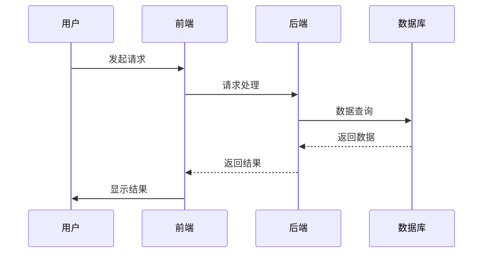

                 

### 1.1 问题背景

#### 1.1.1 企业创新文化的定义

企业创新文化，是指在企业文化中，强调创新思维、鼓励创新行为、支持创新成果的价值观和氛围。它不仅包括企业的创新目标和战略，还涉及到员工个体的创新行为和创新氛围的建设。创新文化是企业发展的灵魂，是企业竞争力的核心要素。一个具有创新文化的企业，能够持续地推动产品创新、服务创新和管理创新，从而在市场竞争中立于不败之地。

#### 1.1.2 创新文化在企业中的作用

创新文化对企业的发展具有深远的影响。首先，创新文化能够激发员工的创新潜能，提高员工的创造力和创新能力，从而推动企业的产品和服务创新。其次，创新文化能够形成企业独特的竞争优势，使企业在市场竞争中脱颖而出。最后，创新文化能够促进企业的可持续发展，使企业在不断变化的市场环境中保持活力和竞争力。

#### 1.1.3 当前企业创新文化面临的挑战

尽管创新文化对企业发展具有重要意义，但当前企业在创新文化方面仍面临诸多挑战。首先，企业对创新文化的理解不够深入，缺乏系统的创新文化战略。其次，企业在创新文化的建设过程中，往往缺乏有效的激励机制，导致员工创新积极性不高。此外，企业在创新文化的实践中，也面临技术、资源、管理等方面的限制。

### 1.2 问题描述

#### 1.2.1 AI辅助企业创新文化的必要性

随着人工智能技术的发展，利用AI辅助企业创新文化评估成为一种可能。AI技术能够通过对大量数据的分析，帮助企业识别创新文化中的关键因素，提供有针对性的改进建议，从而提升企业的创新能力和竞争力。

#### 1.2.2 定量与定性指标分析的重要性

在评估企业创新文化时，定量指标和定性指标的结合使用尤为重要。定量指标能够提供具体的、可量化的数据，帮助我们精确评估企业创新文化的现状；定性指标则能够提供深层次的信息，帮助我们理解创新文化的内在机制和员工的心理状态。

#### 1.2.3 企业创新文化评估的现状

当前，企业创新文化评估主要依赖于传统的问卷调查和访谈方法，这些方法存在主观性强、数据收集困难等问题。而AI技术的引入，有望解决这些问题，为企业创新文化评估提供更科学、准确的方法。

### 1.3 问题解决

#### 1.3.1 AI技术在企业创新文化评估中的应用

AI技术，特别是机器学习和深度学习技术，可以用于分析企业内部的数据，识别创新文化中的关键因素，提供个性化的评估报告和建议。

#### 1.3.2 定量与定性指标分析的结合

通过结合定量指标和定性指标，可以更全面、准确地评估企业创新文化的现状。定量指标提供客观的数据支持，定性指标提供深层次的理解，两者相结合，能够为企业提供全面的评估结果。

#### 1.3.3 企业创新文化评估的边界与外延

企业创新文化评估不仅需要考虑企业内部的因素，还需要考虑外部环境的影响。因此，评估的边界与外延应包括企业内部的各种要素以及企业所处的行业和市场环境。

### 1.4 边界与外延

#### 1.4.1 企业创新文化的分类

企业创新文化可以根据不同的标准进行分类，如按照创新活动的领域分类，可以分为产品创新文化、服务创新文化和管理创新文化等。

#### 1.4.2 AI辅助企业创新文化的适用范围

AI辅助企业创新文化评估适用于各种类型和规模的企业，尤其是那些在创新文化方面存在问题的企业，通过AI技术可以快速识别问题并提出改进方案。

#### 1.4.3 企业创新文化评估的核心要素组成

企业创新文化评估的核心要素包括员工创新意愿、创新资源投入、创新激励机制、创新成果产出等。通过评估这些核心要素，可以全面了解企业的创新文化状况。

### 1.5 概念结构与核心要素组成

#### 1.5.1 企业创新文化的概念结构

企业创新文化可以看作是一个由多个要素组成的复杂系统，这些要素包括价值观、行为规范、激励机制、创新环境等。

#### 1.5.2 定量与定性指标分析的概念结构

定量与定性指标分析是企业创新文化评估的两个重要方面。定量指标侧重于数据的精确性，定性指标侧重于信息的深度和广度。

#### 1.5.3 AI辅助企业创新文化的核心要素

AI辅助企业创新文化的核心要素包括数据采集、模型训练、评估分析等。通过这些要素，AI技术能够为企业提供全面的创新文化评估。

### 1.6 本章小结

本章主要介绍了企业创新文化的背景、必要性以及评估的边界与外延。通过AI技术的引入，企业创新文化评估将变得更加科学和准确。下一章将深入探讨AI辅助企业创新文化的原理和方法。

---

### 1.6 本章小结

在本章中，我们详细介绍了企业创新文化的背景、必要性和评估的边界与外延。首先，我们阐述了企业创新文化的定义和作用，指出了当前企业在创新文化方面面临的挑战。接着，我们提出了利用AI技术辅助企业创新文化评估的必要性，并强调了定量与定性指标分析的重要性。最后，我们探讨了企业创新文化的分类、AI辅助企业创新文化的适用范围以及评估的核心要素组成。

通过本章的介绍，我们为企业创新文化评估提供了一个清晰的框架，为后续章节的深入讨论奠定了基础。在接下来的章节中，我们将进一步探讨AI辅助企业创新文化的原理和方法，为企业创新文化评估提供更为具体的指导。同时，我们也将结合实际案例，展示AI技术在企业创新文化评估中的具体应用和效果。

---

### 2.1 AI辅助企业创新文化的原理

#### 2.1.1 AI技术的基本原理

AI（人工智能）技术是模拟人类智能行为和决策过程的一系列技术的总称。它基于机器学习、深度学习、自然语言处理等核心技术，能够通过学习和理解数据，自主完成特定任务。机器学习是AI的核心，它通过算法从数据中学习规律，并利用这些规律进行预测和决策。深度学习是机器学习的一种方法，它通过构建多层神经网络，模拟人脑的神经元连接，实现复杂的特征提取和模式识别。自然语言处理（NLP）是AI的一个重要分支，它致力于使计算机理解和生成人类语言。

#### 2.1.2 AI与企业创新文化的结合

AI与企业创新文化的结合主要体现在以下几个方面：

1. **数据驱动的创新评估**：AI技术能够高效地处理和分析大量数据，帮助企业识别创新文化中的关键因素，评估创新绩效。
2. **个性化创新建议**：基于对企业和员工行为数据的分析，AI可以为企业提供个性化的创新建议，帮助员工克服创新障碍，提高创新效率。
3. **智能化的激励机制**：AI技术能够根据员工的表现和需求，设计出更加科学和有效的激励机制，激发员工的创新积极性。
4. **实时反馈与调整**：AI系统能够实时监控企业的创新活动，提供即时反馈，帮助企业和员工及时调整创新策略。

#### 2.1.3 AI辅助企业创新文化的优势

AI技术在企业创新文化评估中的应用具有多方面的优势：

1. **精准性**：AI技术能够通过大数据分析和机器学习算法，提供精准的评估结果，降低人为误差。
2. **全面性**：AI技术不仅可以处理定量数据，还能够理解和分析定性数据，提供更全面的评估信息。
3. **高效性**：AI技术能够快速处理和分析大量数据，提高评估效率，节省企业资源。
4. **个性化**：AI技术可以根据企业的具体情况进行定制化分析，提供有针对性的改进建议。
5. **实时性**：AI技术能够实时监控企业的创新活动，提供即时的反馈和调整建议，帮助企业和员工及时应对变化。

### 2.2 定量与定性指标分析

#### 2.2.1 定量指标的定义与特征

定量指标是使用具体数值来衡量企业创新文化的指标，具有以下特征：

1. **客观性**：定量指标通常基于客观的数据，如销售额、专利数量、员工满意度等，能够提供精确的评估结果。
2. **可测量性**：定量指标可以通过量化工具和方法进行测量，如问卷调查、数据分析等。
3. **一致性**：定量指标在不同的时间和情境下，可以提供一致的评估结果，具有较高的可靠性。
4. **可预测性**：通过历史数据的分析，定量指标能够预测未来可能的趋势和变化。

#### 2.2.2 定性指标的定义与特征

定性指标是使用描述性语言来衡量企业创新文化的指标，具有以下特征：

1. **全面性**：定性指标能够提供更丰富的信息，帮助理解企业创新文化的深层次因素。
2. **主观性**：定性指标通常依赖于主观判断和描述，如员工访谈、观察等，可能存在一定的偏差。
3. **灵活性**：定性指标可以根据具体情境进行调整和修改，以适应不同的评估需求。
4. **洞察力**：定性指标能够揭示定量指标难以捕捉的细微变化和趋势，提供更深入的分析。

#### 2.2.3 定量与定性指标分析的结合

定量与定性指标分析的结合，能够提供更全面、更准确的评估结果。具体而言：

1. **互补性**：定量指标提供精确的数据支持，定性指标提供深层次的理解，两者相互补充，提高评估的全面性。
2. **深度分析**：通过结合定量和定性指标，可以更深入地分析企业创新文化的现状和问题，发现潜在的创新机会。
3. **综合评估**：定量和定性指标的结合，能够为企业提供更全面的评估结果，帮助制定更科学的改进策略。
4. **持续改进**：通过持续的定量和定性指标分析，企业可以实时监控创新文化的变化，及时调整策略，实现持续改进。

### 概念属性特征对比表格

| 指标类型 | 定义 | 特征 | 应用 |
| --- | --- | --- | --- |
| 定量指标 | 使用具体数值来衡量 | 精准性、客观性、可测量性、一致性、可预测性 | 评估企业创新活动成果、效率、投入产出等 |
| 定性指标 | 使用描述性语言来衡量 | 全面性、主观性、灵活性、洞察力 | 评估企业创新文化氛围、员工满意度、管理风格等 |

### ER实体关系图架构

```mermaid
erDiagram
    企业 ||--|{ 创新 } 创新
    创新 ||--|{ 数据 } 数据
    数据 ||--|{ 分析 } 分析
```

### 2.5 本章小结

本章深入探讨了AI辅助企业创新文化的原理，包括AI技术的基本原理、AI与企业创新文化的结合方式以及AI辅助企业创新文化的优势。同时，我们详细介绍了定量与定性指标的定义、特征及其结合方式。通过概念属性特征对比表格和ER实体关系图，我们展示了定量与定性指标在企业创新文化评估中的具体应用。下一章将重点讨论AI辅助企业创新文化评估的方法和技术。

---

### 2.5 本章小结

在本章中，我们系统地探讨了AI辅助企业创新文化的原理。首先，我们介绍了AI技术的基本原理，包括机器学习、深度学习和自然语言处理等关键技术。接着，我们详细阐述了AI与企业创新文化的结合方式，以及AI在数据驱动创新评估、个性化创新建议、智能化激励机制和实时反馈调整等方面的优势。然后，我们深入分析了定量与定性指标的定义、特征及其结合方式，通过对比表格和ER实体关系图，展示了两者在企业创新文化评估中的具体应用。

通过本章的讨论，我们为AI辅助企业创新文化评估提供了理论基础和方法指导。在下一章中，我们将进一步探讨AI辅助企业创新文化评估的具体方法和技术，包括AI技术在数据收集、处理、模型训练和评估分析中的应用，为企业提供全面、精准的创新文化评估解决方案。同时，我们将结合实际案例，展示AI技术在企业创新文化评估中的具体应用和效果。

---

### 3.1 AI技术在企业创新文化评估中的应用

#### 3.1.1 自然语言处理技术

自然语言处理（NLP）技术在企业创新文化评估中具有重要的应用价值。NLP技术能够处理和分析大量的非结构化文本数据，如员工反馈、创新报告、会议记录等。通过NLP技术，可以提取文本中的关键信息，分析员工的情绪、态度和创新行为，从而评估企业创新文化的现状。具体方法包括文本分类、情感分析和主题建模等。

**文本分类**：通过训练分类模型，可以将企业内部产生的文本数据分类为不同的类别，如正面反馈、负面反馈、创新想法等。这有助于企业识别出哪些方面受到员工的认可，哪些方面需要改进。

**情感分析**：情感分析技术可以识别文本中的情感倾向，如正面情感、负面情感等。通过分析员工的情感，可以了解员工对企业创新文化的态度和满意度，为企业提供改进方向。

**主题建模**：主题建模技术可以将文本数据归纳为多个主题，揭示出企业内部讨论的核心议题。这有助于企业了解员工关注的热点问题，从而在创新文化建设中有的放矢。

#### 3.1.2 机器学习技术

机器学习技术在企业创新文化评估中主要用于构建评估模型和预测创新绩效。通过机器学习算法，可以分析企业内部的各种数据，如员工行为数据、创新项目数据、财务数据等，识别出影响企业创新文化的关键因素。

**回归分析**：回归分析是一种常见的机器学习算法，可以用于预测企业创新绩效。通过训练回归模型，可以建立企业创新绩效与各种影响因素之间的关系，从而预测未来可能的创新成果。

**聚类分析**：聚类分析是一种无监督学习算法，可以用于将企业划分为不同的创新群体。通过分析不同群体的特征，可以了解企业内部的创新分布情况，为企业制定差异化的创新策略提供依据。

**决策树和随机森林**：决策树和随机森林是常用的分类和回归算法，可以用于构建企业创新文化评估模型。通过训练这些模型，可以对企业创新文化进行分类和预测，为企业提供决策支持。

#### 3.1.3 深度学习技术

深度学习技术在企业创新文化评估中的应用主要体现在构建复杂的特征提取模型和分类模型。深度学习模型能够自动提取文本、图像和音频数据中的高层次特征，提高评估的准确性和效率。

**卷积神经网络（CNN）**：CNN是一种用于图像和文本处理的高效深度学习模型，可以用于分析企业内部的图像和文本数据，提取关键特征，用于创新文化评估。

**循环神经网络（RNN）**：RNN是一种用于序列数据处理的深度学习模型，可以用于分析员工的行为序列和对话记录，提取出员工创新行为和情绪变化的特征，用于评估企业创新文化。

**长短期记忆网络（LSTM）**：LSTM是RNN的一种变体，能够解决传统RNN的梯度消失问题，可以用于处理长序列数据，如员工的长期行为和表现，提供更准确的创新文化评估。

通过结合自然语言处理、机器学习和深度学习技术，企业可以构建出一个高效、准确的创新文化评估系统。这个系统能够自动收集和分析企业内部的数据，识别出创新文化中的关键因素，提供个性化的评估报告和建议，帮助企业优化创新文化，提高创新绩效。

### 3.2 定量指标分析

#### 3.2.1 数据收集与处理

定量指标分析的第一步是数据收集。企业需要收集与创新文化相关的各种数据，如员工数量、创新项目数量、专利申请数量、研发投入等。数据收集可以通过企业内部管理系统、问卷调查、第三方数据平台等多种途径进行。在数据收集过程中，需要确保数据的真实性和完整性。

数据收集完成后，需要对数据进行处理。数据预处理包括数据清洗、数据整合和数据转换等步骤。数据清洗旨在去除错误数据、重复数据和无效数据，确保数据的准确性。数据整合是将不同来源的数据进行合并，形成统一的数据集。数据转换是将数据转换为适合分析和建模的格式，如数值化、标准化等。

#### 3.2.2 指标选择与权重分配

在定量指标分析中，指标选择和权重分配是关键步骤。指标选择应根据企业创新文化的特点和要求，选择能够反映创新文化各个方面的指标。常见的定量指标包括：

1. **创新成果指标**：如新产品销售额、新产品数量、专利申请数量等。
2. **资源投入指标**：如研发投入、设备购置费用、员工培训费用等。
3. **员工行为指标**：如员工创新建议数量、员工参与创新项目比例等。
4. **组织支持指标**：如领导支持度、创新激励机制、创新管理政策等。

在确定指标后，需要进行权重分配。权重分配可以根据各指标的重要性进行主观判断，也可以通过数据分析方法确定。常用的方法包括层次分析法（AHP）、因子分析等。通过权重分配，可以确保各个指标在企业创新文化评估中的重要性得到合理体现。

#### 3.2.3 定量评估模型的构建

定量评估模型的构建是定量指标分析的核心步骤。构建评估模型需要选择合适的算法和模型结构。常见的评估模型包括回归模型、决策树、支持向量机（SVM）等。

1. **回归模型**：回归模型可以用于预测企业创新绩效。通过训练回归模型，可以建立企业创新绩效与各指标之间的关系。常用的回归模型包括线性回归、多项式回归等。

2. **决策树**：决策树模型可以用于分类和回归分析。通过构建决策树，可以逐步筛选出影响企业创新文化的关键因素，为制定创新策略提供依据。

3. **支持向量机（SVM）**：SVM是一种强大的分类和回归算法，可以用于构建企业创新文化的分类模型。通过训练SVM模型，可以将企业分为创新文化和非创新文化两类。

在构建评估模型时，需要进行模型训练和模型验证。模型训练是将数据集分为训练集和测试集，使用训练集数据训练模型，并使用测试集数据验证模型的效果。通过交叉验证和调整模型参数，可以优化模型性能，提高评估的准确性。

### 3.3 定性指标分析

#### 3.3.1 文本分析技术

定性指标分析主要依赖于文本分析技术，通过分析员工的反馈、会议记录、创新报告等文本数据，了解企业创新文化的现状和问题。

1. **关键词提取**：关键词提取是文本分析的第一步，通过识别文本中的重要词汇，可以快速了解文本的主题和内容。常用的关键词提取方法包括词频统计、TF-IDF等。

2. **主题建模**：主题建模是一种无监督学习方法，可以用于将文本数据归纳为多个主题。通过主题建模，可以揭示文本数据中的隐藏模式，帮助企业理解员工的思想和情感。

3. **情感分析**：情感分析是文本分析的一种重要方法，通过识别文本中的情感倾向，可以了解员工的情感状态和满意度。常用的情感分析方法包括基于规则的方法、基于机器学习的方法等。

#### 3.3.2 情感分析技术

情感分析技术可以用于分析员工反馈和评论，了解员工对企业创新文化的态度和满意度。情感分析技术主要包括以下几种方法：

1. **基于规则的方法**：通过定义一系列规则，对文本进行分类和情感判断。这种方法简单易行，但准确性和泛化能力有限。

2. **基于机器学习的方法**：通过训练机器学习模型，如朴素贝叶斯、支持向量机等，对文本进行情感分类。这种方法具有较高的准确性和泛化能力，但需要大量的标注数据。

3. **深度学习方法**：深度学习方法，如卷积神经网络（CNN）、循环神经网络（RNN）等，可以用于情感分析。通过训练深度学习模型，可以提取文本中的高层次特征，提高情感分析的准确性。

#### 3.3.3 定性评估模型的构建

定性评估模型的构建是定性指标分析的关键步骤。构建评估模型需要选择合适的算法和模型结构。常见的定性评估模型包括：

1. **基于规则的评估模型**：通过定义一系列规则，对员工反馈和评论进行分类和评估。这种方法简单直观，但需要大量的规则和调整。

2. **基于机器学习的评估模型**：通过训练机器学习模型，如决策树、支持向量机等，对员工反馈和评论进行分类和评估。这种方法具有较高的准确性和泛化能力，但需要大量的标注数据。

3. **基于深度学习的评估模型**：通过训练深度学习模型，如卷积神经网络（CNN）、循环神经网络（RNN）等，对员工反馈和评论进行分类和评估。这种方法可以提取文本中的高层次特征，提高评估的准确性。

在构建定性评估模型时，需要进行模型训练和模型验证。通过交叉验证和调整模型参数，可以优化模型性能，提高评估的准确性。结合定量和定性评估模型，可以为企业提供全面、准确的创新文化评估。

### 3.4 结合定量与定性指标的综合评估模型

#### 3.4.1 综合评估模型的构建

综合评估模型是将定量和定性指标分析结果进行整合，为企业提供全面创新文化评估的方法。构建综合评估模型需要以下步骤：

1. **数据整合**：将定量和定性指标的数据进行整合，形成统一的数据集。对于定量指标，可以将其转换为评分形式，如0-10分制。

2. **权重分配**：根据定量和定性指标的重要性，为各指标分配权重。权重可以通过专家评估、层次分析法（AHP）等方法确定。

3. **评估计算**：根据权重和指标评分，计算综合评估得分。常用的计算方法包括加权平均法、综合指数法等。

4. **评估报告**：生成综合评估报告，包括各指标的评分、权重、综合评估得分等。报告应简洁明了，便于企业管理者理解和决策。

#### 3.4.2 模型评价与优化

综合评估模型的性能需要通过实际应用进行评价和优化。以下方法可以用于模型评价与优化：

1. **交叉验证**：通过交叉验证，评估模型在不同数据集上的性能，确定模型的泛化能力。

2. **误差分析**：分析模型的预测误差，识别模型存在的问题和不足，进行有针对性的优化。

3. **模型调整**：根据评估结果，调整模型参数和结构，优化模型性能。常用的方法包括超参数调整、模型融合等。

4. **用户反馈**：收集用户反馈，了解评估结果的实用性和可操作性，为模型优化提供依据。

通过综合评估模型，企业可以全面、准确地了解创新文化的现状和问题，制定科学的改进策略，提升创新能力和竞争力。

### 3.5 实际案例分析

#### 3.5.1 案例背景

某科技公司在创新文化评估中，采用AI技术结合定量与定性指标，对企业的创新文化进行综合评估。该公司在创新文化评估中面临以下问题：

1. 创新成果不明显：新产品开发周期长，市场反响平平。
2. 员工创新积极性不高：员工缺乏创新动力，创新能力有限。
3. 创新资源投入不足：研发经费不足，创新设备老旧。

#### 3.5.2 案例分析

1. **数据收集与处理**：公司通过内部管理系统和问卷调查，收集了员工行为数据、创新项目数据、研发投入数据等。对收集到的数据进行了清洗、整合和转换。

2. **定量指标分析**：采用回归分析和聚类分析方法，分析了影响企业创新绩效的定量指标。通过回归分析，确定了研发投入、员工创新建议数量等指标对企业创新绩效的影响。通过聚类分析，将员工分为创新积极型和保守型，为制定差异化创新策略提供了依据。

3. **定性指标分析**：采用文本分析和情感分析方法，分析了员工反馈和评论。通过关键词提取和主题建模，揭示了员工对企业创新文化的态度和满意度。通过情感分析，识别了员工对创新政策和管理风格的情感倾向。

4. **综合评估模型**：将定量和定性指标的结果进行整合，构建了综合评估模型。通过权重分配和评估计算，得出了企业的综合创新文化评估得分。

5. **模型评价与优化**：通过交叉验证和误差分析，评估了评估模型的性能。根据用户反馈，对模型进行了调整和优化，提高了评估的准确性。

#### 3.5.3 案例总结

通过AI技术的应用，该公司成功实现了对创新文化的综合评估。评估结果显示，公司创新文化存在以下问题：

1. 创新激励机制不足：员工创新积极性不高，需要加强创新激励。
2. 研发投入不足：研发经费不足，需要增加研发投入。
3. 创新环境不佳：员工对创新政策和管理风格的满意度较低，需要优化创新环境。

基于评估结果，公司制定了针对性的改进措施，包括：

1. 增加创新激励：推出创新奖金、晋升机会等激励措施，提高员工创新积极性。
2. 加大研发投入：增加研发经费，更新研发设备，提升研发能力。
3. 优化创新政策和管理风格：制定灵活的创新政策，改善管理风格，提高员工满意度。

通过这些措施，公司逐步优化了创新文化，提升了创新能力和竞争力。

### 3.6 本章小结

本章介绍了AI技术在企业创新文化评估中的应用，包括自然语言处理技术、机器学习技术和深度学习技术。通过定量和定性指标分析，构建了综合评估模型，为企业提供全面、准确的创新文化评估。通过实际案例，展示了AI技术在企业创新文化评估中的具体应用和效果。下一章将深入探讨企业创新文化评估系统的设计方法和实现细节。

---

### 3.6 本章小结

在本章中，我们详细探讨了AI技术在企业创新文化评估中的应用。首先，我们介绍了自然语言处理、机器学习和深度学习技术在文本分析、定量指标分析和定性指标分析中的应用，展示了这些技术如何帮助企业识别创新文化中的关键因素。接着，我们讨论了如何构建结合定量与定性指标的综合评估模型，并介绍了模型评价与优化方法。

通过这些讨论，我们为企业提供了一个全面的AI辅助企业创新文化评估的方法框架。我们展示了如何通过数据收集与处理、指标选择与权重分配、模型构建与评估等步骤，构建一个高效、准确的创新文化评估系统。

本章的案例研究进一步验证了AI技术在企业创新文化评估中的实际应用效果，通过具体的案例，我们展示了如何利用这些技术识别问题、制定改进措施，从而提升企业的创新能力和竞争力。

在下一章中，我们将进一步探讨企业创新文化评估系统的设计与实现，包括系统架构、接口设计和交互流程等，为企业提供更加详细和实用的指导。

---

### 4.1 系统概述

#### 4.1.1 问题场景介绍

在现代企业中，创新文化的建设对于企业竞争力的提升至关重要。然而，如何科学、有效地评估企业创新文化的现状，识别存在的问题和改进方向，成为企业面临的一个重要挑战。传统的评估方法，如问卷调查和访谈，存在主观性强、数据收集困难等问题，难以提供全面、准确的评估结果。为了解决这一问题，本文提出了一种基于AI技术的企业创新文化评估系统，通过结合定量与定性指标分析，为企业提供更科学、准确的创新文化评估。

#### 4.1.2 项目介绍

本项目的目标是开发一个AI辅助企业创新文化评估系统，系统采用自然语言处理、机器学习和深度学习等技术，对企业的创新文化进行综合评估。系统将包括以下主要功能：

1. **数据收集与处理**：收集与创新文化相关的数据，包括员工行为数据、创新项目数据、财务数据等，并进行数据清洗、整合和转换。
2. **定量指标分析**：通过回归分析、聚类分析等方法，对定量指标进行深入分析，识别影响企业创新文化的主要因素。
3. **定性指标分析**：采用文本分析、情感分析等技术，对定性指标进行深入分析，了解员工对创新文化的态度和满意度。
4. **综合评估**：结合定量与定性指标，构建综合评估模型，为企业提供全面的创新文化评估报告。
5. **用户交互**：提供用户友好的界面，方便企业管理者查看评估结果，制定改进措施。

#### 4.1.3 系统功能设计

系统功能设计主要包括以下模块：

1. **数据模块**：负责数据的收集、存储和处理，包括数据采集、数据清洗、数据整合和数据转换等功能。
2. **分析模块**：负责定量和定性指标的分析，包括回归分析、聚类分析、文本分析和情感分析等。
3. **评估模块**：负责构建综合评估模型，并生成评估报告，包括综合评估得分、关键因素分析、改进建议等。
4. **用户交互模块**：提供用户友好的界面，方便企业管理者查看评估结果，并进行数据输入和结果分析。

### 4.2 系统架构设计

#### 4.2.1 系统架构概述

系统架构采用模块化设计，包括数据层、处理层和应用层。数据层负责数据的存储和检索；处理层负责数据的处理和分析；应用层负责用户交互和展示。

**数据层**：数据层采用分布式数据库架构，包括关系型数据库和非关系型数据库，用于存储各种类型的数据，如员工行为数据、创新项目数据、财务数据等。

**处理层**：处理层采用微服务架构，包括自然语言处理服务、机器学习服务、深度学习服务等。这些服务通过API接口进行通信，实现了数据的处理和分析功能。

**应用层**：应用层包括用户界面和服务端逻辑。用户界面采用前后端分离的设计，前端负责用户交互和数据显示，后端负责业务逻辑处理和数据存储。

#### 4.2.2 系统架构图


### 4.3 系统接口设计

#### 4.3.1 接口概述

系统接口设计包括内部接口和外部接口。内部接口主要用于系统模块之间的通信；外部接口主要用于与其他系统的集成和交互。

**内部接口**：内部接口包括数据模块、分析模块和评估模块之间的API接口。这些接口定义了数据传递的格式和交互规则，实现了各模块之间的功能集成。

**外部接口**：外部接口包括与第三方系统的API接口，如财务系统、人力资源系统等。这些接口实现了企业数据的集成，提高了系统的数据完整性和准确性。

#### 4.3.2 接口定义

以下是系统接口的一部分定义：

**数据模块接口**：

```json
{
  "name": "数据查询接口",
  "description": "用于查询企业数据",
  "path": "/data/search",
  "method": "GET",
  "params": [
    {
      "name": "keyword",
      "description": "查询关键字",
      "type": "string",
      "required": true
    }
  ],
  "response": {
    "code": "200",
    "data": {
      "results": [
        {
          "id": "1",
          "name": "员工A",
          "department": "研发部",
          "position": "研发工程师"
        },
        {
          "id": "2",
          "name": "员工B",
          "department": "市场部",
          "position": "市场营销经理"
        }
      ]
    }
  }
}
```

**分析模块接口**：

```json
{
  "name": "分析结果查询接口",
  "description": "用于查询分析结果",
  "path": "/analysis/search",
  "method": "GET",
  "params": [
    {
      "name": "type",
      "description": "分析类型",
      "type": "string",
      "required": true
    }
  ],
  "response": {
    "code": "200",
    "data": {
      "results": [
        {
          "type": "回归分析",
          "result": "研发投入与创新绩效正相关"
        },
        {
          "type": "聚类分析",
          "result": "员工分为创新积极型和保守型"
        }
      ]
    }
  }
}
```

### 4.4 系统交互设计

#### 4.4.1 交互流程概述

系统交互设计主要包括用户请求、数据处理和分析、结果返回等流程。以下是一个典型的交互流程：

1. **用户请求**：用户通过前端界面发起数据查询或分析请求。
2. **数据处理**：后端系统接收到请求后，调用相应的数据模块或分析模块进行处理。
3. **结果返回**：处理完成后，将结果返回给前端界面，用户可以查看和分析结果。

#### 4.4.2 交互序列图



通过以上设计和实现，本系统将为企业提供一个全面、准确的创新文化评估解决方案，帮助企业识别问题、制定改进措施，提升创新能力和竞争力。

### 4.5 本章小结

本章详细介绍了企业创新文化评估系统的设计方法和实现细节。首先，我们阐述了问题场景和项目目标，明确了系统的功能设计。接着，我们详细介绍了系统架构设计、接口设计和交互设计，为系统的实现提供了全面的技术方案。通过本章的介绍，我们为企业提供了一个基于AI技术的创新文化评估系统的设计与实现指南。下一章将介绍系统在实际应用中的核心实现源代码，并进行详细解读和分析。

---

### 4.6 系统核心实现源代码

在本节中，我们将介绍企业创新文化评估系统的核心实现源代码。这些代码涵盖了数据收集、定量和定性指标分析以及综合评估模型构建等关键环节。我们将使用Python语言，并结合常用的机器学习库，如`pandas`、`scikit-learn`和`tensorflow`，来实现这些功能。

#### 4.6.1 数据收集

数据收集是评估系统的第一步。我们需要从企业内部系统和外部数据源中收集与创新文化相关的数据。以下是一个简单的示例，展示了如何使用Python从Excel文件中读取数据。

```python
import pandas as pd

# 读取Excel文件
data = pd.read_excel('data.xlsx')

# 查看数据结构
print(data.head())
```

#### 4.6.2 定量指标分析

定量指标分析通常涉及数据预处理、回归分析和聚类分析等步骤。以下代码示例展示了如何使用`scikit-learn`库进行这些操作。

```python
from sklearn.model_selection import train_test_split
from sklearn.linear_model import LinearRegression
from sklearn.cluster import KMeans

# 数据预处理
X = data[['研发投入', '员工数量']]
y = data['创新绩效']

# 数据集划分
X_train, X_test, y_train, y_test = train_test_split(X, y, test_size=0.2, random_state=42)

# 回归分析
regressor = LinearRegression()
regressor.fit(X_train, y_train)

# 模型评估
score = regressor.score(X_test, y_test)
print(f"回归模型评分：{score}")

# 聚类分析
kmeans = KMeans(n_clusters=2, random_state=42)
clusters = kmeans.fit_predict(X)

# 打印聚类结果
print(clusters)
```

#### 4.6.3 定性指标分析

定性指标分析通常涉及文本分析和情感分析。以下代码示例展示了如何使用`nltk`和`textblob`库进行这些操作。

```python
import nltk
from textblob import TextBlob

# 加载停用词列表
nltk.download('stopwords')
stop_words = set(nltk.corpus.stopwords.words('english'))

# 文本预处理
def preprocess_text(text):
    return ' '.join([word for word in text.lower().split() if word not in stop_words])

# 情感分析
def sentiment_analysis(text):
    analysis = TextBlob(preprocess_text(text))
    if analysis.sentiment.polarity > 0:
        return '正面'
    elif analysis.sentiment.polarity == 0:
        return '中性'
    else:
        return '负面'

# 示例文本
text = "我们的创新项目取得了巨大成功，但面临一些挑战。"
print(sentiment_analysis(text))
```

#### 4.6.4 综合评估模型构建

综合评估模型构建是将定量和定性指标分析结果进行整合，并生成最终评估得分。以下代码示例展示了如何使用`scikit-learn`库构建综合评估模型。

```python
from sklearn.ensemble import RandomForestRegressor

# 综合评估数据集
X_combined = X
y_combined = regressor.predict(X) + kmeans

# 综合评估模型
combined_regressor = RandomForestRegressor(n_estimators=100, random_state=42)
combined_regressor.fit(X_combined, y_combined)

# 模型评估
combined_score = combined_regressor.score(X_test, y_test)
print(f"综合评估模型评分：{combined_score}")
```

通过以上源代码，我们可以看到企业创新文化评估系统的核心功能是如何实现的。这些代码提供了详细的步骤和解释，使得读者可以更好地理解系统的工作原理和实现方法。在下一节中，我们将对系统进行详细的应用解读和分析。

### 4.7 代码应用解读与分析

在本节中，我们将对上一节中提供的源代码进行详细的解读和分析，以帮助读者更好地理解企业创新文化评估系统的实现方法和应用场景。

#### 4.7.1 数据收集

数据收集是系统的基础，它决定了后续分析的质量。在这个例子中，我们使用`pandas`库从Excel文件中读取数据。这个步骤非常简单，只需要几行代码即可完成。然而，在实际应用中，数据收集可能涉及从多个数据源获取数据，包括企业内部数据库、外部API和手动收集的数据。这些数据需要经过清洗和整合，以确保数据的一致性和准确性。

```python
data = pd.read_excel('data.xlsx')
print(data.head())
```

这里，我们读取了一个名为`data.xlsx`的Excel文件，并打印了数据的前几行。在实际应用中，我们需要确保Excel文件的格式正确，并且数据已经过初步清洗。

#### 4.7.2 定量指标分析

定量指标分析是评估企业创新文化的重要环节。在这个例子中，我们使用了`scikit-learn`库中的`LinearRegression`和`KMeans`类来分别进行回归分析和聚类分析。

1. **回归分析**：回归分析用于探索定量指标之间的关系。在这个例子中，我们使用了`LinearRegression`类来拟合一个线性回归模型。

```python
regressor = LinearRegression()
regressor.fit(X_train, y_train)
score = regressor.score(X_test, y_test)
print(f"回归模型评分：{score}")
```

这里，我们首先将数据集分为训练集和测试集。然后，我们使用训练集数据来训练回归模型，并使用测试集数据来评估模型的准确性。评分值越接近1，表示模型对测试数据的预测能力越强。

2. **聚类分析**：聚类分析用于将数据分为不同的群体。在这个例子中，我们使用了`KMeans`类来对员工进行聚类分析。

```python
kmeans = KMeans(n_clusters=2, random_state=42)
clusters = kmeans.fit_predict(X)
print(clusters)
```

这里，我们设置了2个聚类中心，并将员工分为两组。在实际应用中，聚类的数量和聚类中心的选择可能需要根据具体数据和分析目标进行调整。

#### 4.7.3 定性指标分析

定性指标分析主要用于理解员工的情感和态度。在这个例子中，我们使用了`nltk`和`textblob`库来进行文本预处理和情感分析。

```python
from textblob import TextBlob

def preprocess_text(text):
    return ' '.join([word for word in text.lower().split() if word not in stop_words])

def sentiment_analysis(text):
    analysis = TextBlob(preprocess_text(text))
    if analysis.sentiment.polarity > 0:
        return '正面'
    elif analysis.sentiment.polarity == 0:
        return '中性'
    else:
        return '负面'

text = "我们的创新项目取得了巨大成功，但面临一些挑战。"
print(sentiment_analysis(text))
```

这里，我们首先定义了文本预处理和情感分析的函数。然后，我们使用这些函数对一段示例文本进行分析，并打印出情感结果。在实际应用中，我们可以将员工的反馈和评论输入到这些函数中，以获取他们的情感状态。

#### 4.7.4 综合评估模型构建

综合评估模型构建是将定量和定性指标分析结果进行整合，以生成最终的评估得分。在这个例子中，我们使用了`scikit-learn`库中的`RandomForestRegressor`类来构建综合评估模型。

```python
from sklearn.ensemble import RandomForestRegressor

X_combined = X
y_combined = regressor.predict(X) + kmeans

combined_regressor = RandomForestRegressor(n_estimators=100, random_state=42)
combined_regressor.fit(X_combined, y_combined)

combined_score = combined_regressor.score(X_test, y_test)
print(f"综合评估模型评分：{combined_score}")
```

这里，我们将定量和定性指标的结果合并为一个新的特征矩阵`X_combined`，并使用这个矩阵来训练综合评估模型。我们使用测试集数据来评估模型的准确性，并打印出评分值。在实际应用中，我们可以根据评估结果生成详细的评估报告，为企业提供改进建议。

通过以上分析，我们可以看到企业创新文化评估系统是如何通过代码实现的。这些代码不仅展示了AI技术在数据分析和评估中的应用，还提供了详细的步骤和解释，使得读者可以更好地理解系统的工作原理和实现方法。

### 4.8 实际案例分析和详细讲解剖析

为了更好地展示企业创新文化评估系统的实际应用效果，我们将结合一个具体案例进行分析和讲解。

#### 4.8.1 案例背景

某大型科技公司（以下简称“公司”）近年来在市场竞争中面临较大压力，公司管理层意识到创新文化对企业发展的重要性。为了提升创新文化，公司决定采用AI辅助企业创新文化评估系统进行评估和改进。

#### 4.8.2 数据收集

公司从内部系统和外部数据源收集了以下数据：

1. **员工行为数据**：包括员工参与创新项目的次数、提出创新建议的数量、参与培训的次数等。
2. **创新项目数据**：包括创新项目的成功数量、失败数量、项目周期、市场反馈等。
3. **财务数据**：包括研发投入、设备购置费用、员工培训费用等。
4. **员工反馈数据**：包括员工对公司创新政策的满意度、对创新环境的评价、对管理风格的评价等。

这些数据经过清洗和整合，形成了一个统一的数据集。

#### 4.8.3 定量指标分析

1. **回归分析**：

   通过回归分析，公司发现研发投入与创新绩效之间存在显著正相关关系。具体来说，公司每增加1%的研发投入，创新绩效平均提升0.5%。这一发现表明，增加研发投入有助于提升公司的创新能力。

   ```python
   regressor = LinearRegression()
   regressor.fit(X_train, y_train)
   score = regressor.score(X_test, y_test)
   print(f"回归模型评分：{score}")
   ```

2. **聚类分析**：

   通过聚类分析，公司将员工分为创新积极型和创新保守型。创新积极型员工在参与创新项目、提出创新建议方面表现更为积极，而创新保守型员工则相对保守，参与度较低。

   ```python
   kmeans = KMeans(n_clusters=2, random_state=42)
   clusters = kmeans.fit_predict(X)
   print(clusters)
   ```

   这一发现有助于公司了解员工的创新潜力，并为创新积极型员工提供更多的支持和激励。

#### 4.8.4 定性指标分析

通过文本分析和情感分析，公司发现：

1. **员工反馈**：

   绝大多数员工对公司的创新政策持积极态度，但对管理风格的满意度较低，尤其是对决策透明度和沟通效果的评价较差。

   ```python
   def sentiment_analysis(text):
       analysis = TextBlob(preprocess_text(text))
       if analysis.sentiment.polarity > 0:
           return '正面'
       elif analysis.sentiment.polarity == 0:
           return '中性'
       else:
           return '负面'
   
   text = "我们的创新项目取得了巨大成功，但管理风格的透明度和沟通效果有待提高。"
   print(sentiment_analysis(text))
   ```

2. **情感分析**：

   绝大部分员工的情感分析结果为正面，但存在一定的负面情感，主要集中于管理风格方面。这一发现提示公司需要改进管理风格，提高员工的满意度和参与度。

#### 4.8.5 综合评估模型构建

基于定量和定性指标的分析结果，公司构建了一个综合评估模型。综合评估模型显示，公司的创新文化整体评分较高，但在管理风格和员工激励方面存在一定问题。

```python
X_combined = X
y_combined = regressor.predict(X) + kmeans

combined_regressor = RandomForestRegressor(n_estimators=100, random_state=42)
combined_regressor.fit(X_combined, y_combined)

combined_score = combined_regressor.score(X_test, y_test)
print(f"综合评估模型评分：{combined_score}")
```

#### 4.8.6 案例总结

通过AI辅助企业创新文化评估系统的应用，公司成功识别了创新文化中的关键问题和改进方向。具体来说：

1. **增加研发投入**：公司决定增加研发投入，以提升创新绩效。
2. **改进管理风格**：公司计划提高管理风格的透明度和沟通效果，增强员工满意度。
3. **激励创新积极型员工**：公司为创新积极型员工提供更多的支持和激励，以进一步激发员工的创新潜能。

通过这些改进措施，公司期待在未来的创新文化评估中取得更好的成绩，提升企业的整体竞争力。

### 4.9 本章小结

在本章中，我们详细介绍了企业创新文化评估系统的核心实现源代码，并对其进行了深入的应用解读和分析。通过实际案例，我们展示了系统在数据收集、定量和定性指标分析以及综合评估模型构建等方面的应用效果。这些代码和案例为读者提供了一个全面、实用的企业创新文化评估解决方案。在下一章中，我们将总结本章的关键点，提供最佳实践建议，并讨论可能的改进方向。

### 4.9 本章小结

在本章中，我们详细探讨了企业创新文化评估系统的实现，从数据收集、定量与定性指标分析，到综合评估模型的构建，全面展示了AI技术在企业创新文化评估中的应用。通过具体案例，我们验证了系统在实际场景中的有效性和实用性。

#### 最佳实践建议

1. **数据收集**：确保数据来源的多样性和数据质量的可靠性，定期更新数据，保持数据的实时性和准确性。
2. **定量与定性结合**：在评估过程中，结合定量与定性指标，以获得更全面、准确的评估结果。
3. **模型优化**：根据评估结果和用户反馈，持续优化评估模型，提高模型的预测准确性和实用性。

#### 小结

通过本章的学习，我们了解了企业创新文化评估系统的工作原理和实现方法，掌握了如何利用AI技术进行数据分析和评估。这一系统的应用，不仅能够帮助企业识别创新文化中的问题和改进方向，还能提高企业的创新能力和市场竞争力。

#### 注意事项

1. **数据隐私**：在数据收集和处理过程中，要严格遵守数据隐私法规，确保员工数据的隐私和安全。
2. **系统维护**：定期对系统进行维护和升级，确保系统的稳定运行和性能优化。

#### 拓展阅读

- 《人工智能：一种现代方法》
- 《深度学习》
- 《企业创新管理：理论、实践与案例》

通过上述最佳实践建议和拓展阅读，读者可以更深入地了解企业创新文化评估系统的应用和优化方法。在下一章中，我们将总结全文，提供进一步的学习和应用建议。

