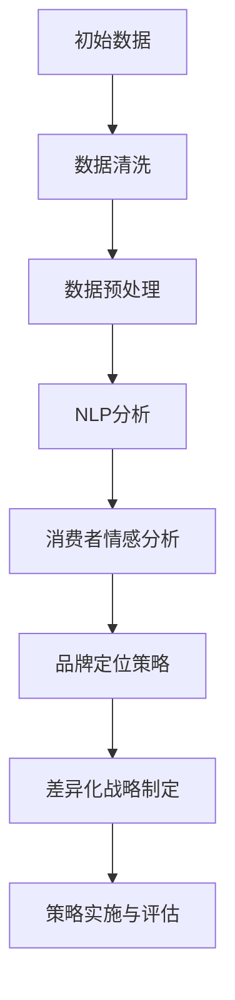
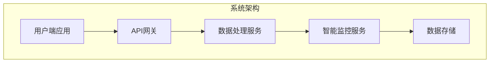
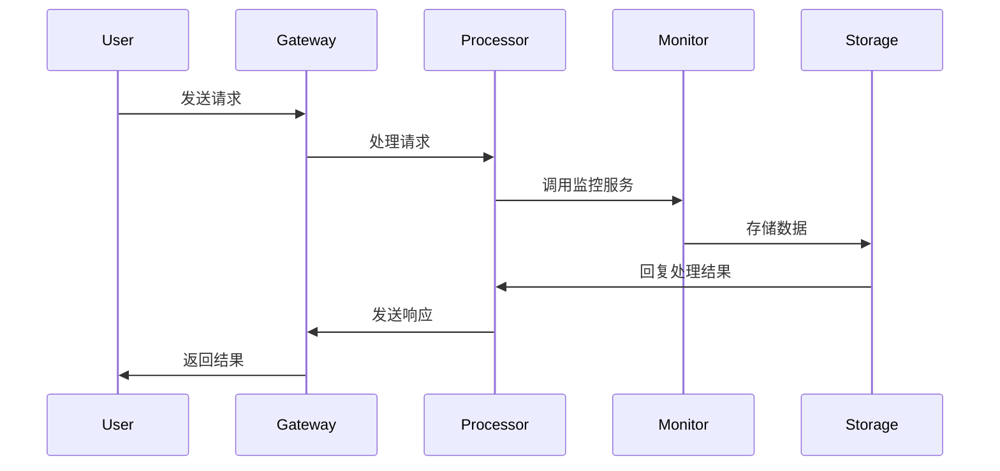

                 


### 让我们一步步深入思考：AI辅助企业品牌定位与差异化战略制定

#### 引言

在当今全球化的商业环境中，企业竞争愈发激烈，品牌定位与差异化战略成为了企业成败的关键。品牌定位是指企业通过独特的方式在消费者心中树立形象，而差异化战略则是在竞争激烈的市场中找到自己的独特优势，从而在市场中脱颖而出。AI技术的发展为这些战略的制定提供了全新的视角和工具。

AI不仅能够帮助企业更准确地理解市场、分析竞争对手，还能够利用大量的数据来辅助企业制定出更具前瞻性的战略。本文将围绕这一主题，通过逻辑清晰、结构紧凑的探讨，帮助读者理解AI在品牌定位与差异化战略制定中的具体应用。

本文的核心内容包括：

1. **背景介绍与核心概念**：介绍AI辅助企业品牌定位和差异化战略的基本概念。
2. **AI辅助企业品牌定位**：深入探讨AI辅助品牌定位的原理、工具与技术。
3. **差异化战略制定**：详细讲解AI辅助差异化战略的原理、流程和应用。
4. **企业品牌定位与差异化战略实战**：通过实际案例展示AI的应用。
5. **最佳实践与总结**：总结最佳实践经验，提供实施策略和建议。

在接下来的内容中，我们将一步步分析推理，让读者不仅理解AI在品牌定位与差异化战略中的重要性，还能掌握其实际应用的方法和技巧。

#### 关键词

- AI辅助品牌定位
- 差异化战略
- 机器学习
- 数据分析
- 企业竞争力
- 市场分析

#### 摘要

本文将深入探讨AI技术在企业品牌定位与差异化战略制定中的应用。通过介绍AI辅助品牌定位的基本原理、工具与技术，以及差异化战略的原理和流程，本文旨在帮助读者理解如何利用AI提升企业的市场竞争力。通过实际案例的分析，本文展示了AI在品牌定位与差异化战略制定中的具体应用和效果。最后，本文将总结最佳实践经验，并给出未来研究和实践的建议。

## 第一部分：背景介绍与核心概念

### 1. 引言

在竞争日益激烈的商业环境中，企业如何成功实现品牌定位并制定有效的差异化战略，成为企业持续发展的关键。品牌定位不仅仅是企业在市场中树立形象的过程，更是企业在消费者心中建立独特认知和价值观的关键。而差异化战略则是在众多竞争对手中找到自己的独特卖点，从而在激烈的市场竞争中脱颖而出的策略。随着AI技术的飞速发展，AI在品牌定位和差异化战略制定中的应用变得越来越广泛和重要。

本文将围绕以下核心问题展开讨论：

- AI技术如何辅助企业进行品牌定位？
- AI技术如何帮助企业制定差异化战略？
- 在AI辅助下，企业品牌定位与差异化战略的制定流程是怎样的？
- 现实中，AI技术在企业品牌定位与差异化战略中的应用案例有哪些？
- 如何在实际操作中有效利用AI技术提升企业品牌竞争力和市场份额？

### 2. 核心概念与联系

#### 2.1 AI辅助企业品牌定位

AI辅助企业品牌定位是指利用人工智能技术，如自然语言处理（NLP）、机器学习（ML）和数据分析等，对企业品牌在市场中的定位进行深入分析和优化。具体来说，AI辅助企业品牌定位的核心概念包括：

- **品牌认知**：通过分析消费者对品牌的认知，了解品牌在消费者心中的形象和价值观。
- **市场分析**：利用AI技术对市场环境、消费者行为、竞争对手等信息进行深入分析，帮助企业找到定位的切入点。
- **数据驱动**：利用大量数据进行分析和预测，为品牌定位提供数据支持。

#### 2.2 差异化战略制定

差异化战略制定是指企业在市场中找到自己的独特优势，通过产品、服务、品牌形象等方面的差异化，形成与竞争对手的区别，从而获得竞争优势。差异化战略的核心概念包括：

- **竞争优势**：通过差异化找到企业在市场中独特的竞争优势。
- **产品和服务差异化**：通过产品功能、服务质量、用户体验等方面的差异化，提升企业的市场竞争力。
- **品牌形象差异化**：通过品牌定位和品牌形象设计，在消费者心中建立独特的品牌形象。

#### 2.3 AI辅助工具与技术

AI辅助工具与技术包括自然语言处理、机器学习、数据分析等，这些技术可以用于：

- **数据分析**：通过大量数据分析和挖掘，帮助企业了解市场趋势、消费者需求和竞争对手情况。
- **市场预测**：利用机器学习算法和数据分析模型，预测市场变化和消费者行为，为企业制定战略提供支持。
- **智能推荐**：通过推荐系统，根据用户行为和偏好，为企业提供个性化的市场推广策略。

#### 2.4 企业品牌战略案例分析

企业品牌战略案例分析是通过具体案例，展示AI在品牌定位和差异化战略制定中的应用效果。以下是一个简单的案例分析：

- **案例背景**：某家初创公司在AI辅助下，通过数据分析找到了目标市场，并制定了差异化战略。
- **案例实施过程**：公司利用NLP技术分析消费者评论，了解消费者对品牌的看法；利用机器学习算法预测市场趋势；通过数据分析确定目标客户群体。
- **案例效果评估**：公司成功在市场中找到了独特的定位，并通过差异化战略提升了市场份额。

### 3. 核心概念属性特征对比表格

以下是一个核心概念属性特征对比表格，展示了品牌定位与传统市场定位、AI辅助品牌定位的优势与挑战：

| **概念**            | **品牌定位**                           | **传统市场定位**                          | **AI辅助品牌定位**                      |
|---------------------|--------------------------------------|------------------------------------------|----------------------------------------|
| **定义**            | 建立企业在消费者心中的独特认知       | 根据市场特点和竞争状况确定企业定位       | 利用AI技术，深度分析市场和企业特性     |
| **关键要素**        | 品牌形象、品牌价值、品牌传播策略     | 产品特点、市场细分、目标客户定位         | 大数据、机器学习、自然语言处理技术       |
| **优势**            | 精准、高效、个性化和数据驱动          | 简单、易于理解、成本低                   | 精准、高效、个性化和数据驱动             |
| **挑战**            | 数据获取和处理复杂、技术实现难度高     | 灵活性不足、难以应对快速变化的市场       | 需要大量数据和高质量算法、隐私保护问题 |

#### 3.5 AI辅助品牌定位ER实体关系图

以下是一个AI辅助品牌定位的ER实体关系图，展示了品牌定位过程中涉及的实体及其关系：

```mermaid
erDiagram
  Customer ||--|{ Brand : located }
  Market ||--|{ Brand : competitive }
  Competitor ||--|{ Brand : differentiated }
  Product ||--|{ Brand : offered }
  Data ||--|{ Brand : analyzed }
  Algorithm ||--|{ Data : processed }
```

在上述ER图关系中：

- **Customer（消费者）**：品牌定位的最终目标，品牌在消费者心中的认知和印象。
- **Market（市场）**：品牌竞争的环境，市场分析的结果影响品牌定位。
- **Competitor（竞争对手）**：分析竞争对手的品牌定位，帮助企业确定差异化策略。
- **Product（产品）**：品牌定位的具体体现，产品特点和服务影响品牌形象。
- **Data（数据）**：AI辅助品牌定位的基础，用于分析和预测市场趋势。
- **Algorithm（算法）**：处理和分析数据的核心技术，为品牌定位提供支持。

## 第二部分：AI辅助企业品牌定位

### 3.1 AI辅助品牌定位的原理

#### 3.1.1 品牌定位的概念

品牌定位是指企业通过市场分析和消费者洞察，选择一个独特的市场细分，并在此细分中建立差异化的品牌形象，以满足目标消费者的特定需求和偏好。品牌定位不仅是企业在市场中的定位，更是企业在消费者心中的定位。品牌定位的成功与否直接关系到企业在市场中的竞争力和品牌价值的提升。

#### 3.1.2 AI技术对品牌定位的影响

AI技术对品牌定位的影响主要体现在以下几个方面：

- **数据分析与挖掘**：AI技术能够对大量的市场数据、消费者行为数据和社交媒体数据进行分析和挖掘，帮助企业深入了解市场趋势和消费者需求，从而为品牌定位提供数据支持。
- **个性化推荐**：AI技术可以基于用户的兴趣和行为数据，为用户推荐个性化的产品和服务，从而提高品牌的市场影响力和用户黏性。
- **智能预测**：通过机器学习算法，AI技术可以预测市场变化和消费者行为，为企业制定前瞻性的品牌定位策略提供支持。
- **优化广告投放**：AI技术可以根据消费者的行为和偏好，优化广告投放策略，提高广告的效果和投资回报率。

#### 3.1.3 品牌定位的AI应用框架

AI在品牌定位中的应用框架主要包括以下几个步骤：

1. **数据收集**：通过各种渠道收集市场数据、消费者行为数据和社交媒体数据等。
2. **数据清洗**：对收集到的数据进行清洗和预处理，去除噪声和冗余数据。
3. **数据分析**：利用自然语言处理、机器学习等技术对数据进行分析，提取有用的信息和洞察。
4. **市场预测**：基于数据分析结果，使用机器学习算法进行市场预测，为品牌定位提供依据。
5. **策略制定**：根据市场预测结果和品牌定位目标，制定具体的品牌定位策略。
6. **实施与监控**：将品牌定位策略付诸实施，并持续监控和评估效果，根据实际情况进行调整。

### 3.2 核心概念属性特征对比表格

以下是一个核心概念属性特征对比表格，展示了品牌定位与传统市场定位、AI辅助品牌定位的对比：

| **概念**            | **品牌定位**                           | **传统市场定位**                          | **AI辅助品牌定位**                      |
|---------------------|--------------------------------------|------------------------------------------|----------------------------------------|
| **定义**            | 建立企业在消费者心中的独特认知       | 根据市场特点和竞争状况确定企业定位       | 利用AI技术，深度分析市场和企业特性     |
| **关键要素**        | 品牌形象、品牌价值、品牌传播策略     | 产品特点、市场细分、目标客户定位         | 大数据、机器学习、自然语言处理技术       |
| **优势**            | 精准、高效、个性化和数据驱动          | 简单、易于理解、成本低                   | 精准、高效、个性化和数据驱动             |
| **挑战**            | 数据获取和处理复杂、技术实现难度高     | 灵活性不足、难以应对快速变化的市场       | 需要大量数据和高质量算法、隐私保护问题 |

### 3.3 AI辅助品牌定位ER实体关系图

以下是一个AI辅助品牌定位的ER实体关系图，展示了品牌定位过程中涉及的实体及其关系：

```mermaid
erDiagram
  Customer ||--|{ Brand : located }
  Market ||--|{ Brand : competitive }
  Competitor ||--|{ Brand : differentiated }
  Product ||--|{ Brand : offered }
  Data ||--|{ Brand : analyzed }
  Algorithm ||--|{ Data : processed }
```

在上述ER图关系中：

- **Customer（消费者）**：品牌定位的最终目标，品牌在消费者心中的认知和印象。
- **Market（市场）**：品牌竞争的环境，市场分析的结果影响品牌定位。
- **Competitor（竞争对手）**：分析竞争对手的品牌定位，帮助企业确定差异化策略。
- **Product（产品）**：品牌定位的具体体现，产品特点和服务影响品牌形象。
- **Data（数据）**：AI辅助品牌定位的基础，用于分析和预测市场趋势。
- **Algorithm（算法）**：处理和分析数据的核心技术，为品牌定位提供支持。

### 3.4 常见AI辅助工具与技术

#### 3.4.1 自然语言处理技术

自然语言处理（NLP）技术是AI技术在品牌定位中的重要应用之一。NLP技术能够理解和处理人类语言，从而帮助企业更好地了解消费者的需求和反馈。具体来说，NLP技术可以用于以下几个方面：

- **消费者反馈分析**：通过分析消费者的评论和反馈，了解消费者对品牌的看法和态度。
- **情感分析**：利用情感分析算法，对消费者的情感进行识别和分类，从而了解消费者的情感状态。
- **关键词提取**：从大量的文本数据中提取出关键信息，帮助品牌定位找到消费者关注的热点话题。

#### 3.4.2 机器学习算法

机器学习算法是AI技术在品牌定位中的另一重要工具。通过机器学习算法，企业可以对大量数据进行分析和建模，从而预测市场趋势和消费者行为。具体来说，机器学习算法可以用于以下几个方面：

- **市场预测**：利用历史数据和市场趋势，预测未来的市场变化和消费者需求。
- **用户画像**：通过分析用户行为数据，构建用户的画像模型，帮助品牌定位找到目标消费者。
- **推荐系统**：基于用户行为和偏好，为用户推荐相关的产品和服务，从而提高用户黏性和品牌影响力。

#### 3.4.3 数据分析技术

数据分析技术是AI辅助品牌定位的核心工具。通过数据分析技术，企业可以深入挖掘数据中的价值，为品牌定位提供科学依据。具体来说，数据分析技术可以用于以下几个方面：

- **数据挖掘**：从大量数据中提取出有价值的信息和模式，帮助企业发现市场机会和风险。
- **数据可视化**：将数据分析结果以图表和图形的形式呈现，帮助品牌定位人员更好地理解和解释数据。
- **统计分析**：利用统计方法，对数据进行定量分析，为品牌定位提供数据支持。

### 3.5 AI辅助品牌定位技术原理详解

#### 3.5.1 自然语言处理技术工作原理

自然语言处理技术的工作原理主要包括以下几个步骤：

1. **数据预处理**：对原始文本数据进行清洗和预处理，包括去除停用词、词干提取和词性标注等。
2. **词向量表示**：将文本数据转换为词向量表示，常用的方法包括Word2Vec、GloVe等。
3. **文本分类**：利用分类算法，如朴素贝叶斯、支持向量机等，对文本进行分类，从而识别消费者的情感和态度。
4. **情感分析**：通过情感分析算法，对文本中的情感进行识别和分类，从而了解消费者的情感状态。

#### 3.5.2 机器学习算法的数学模型和公式

机器学习算法的数学模型和公式主要包括以下几个部分：

1. **线性回归模型**：线性回归模型是一种常见的机器学习算法，用于预测连续值。其数学模型可以表示为：

   $$ y = \beta_0 + \beta_1x_1 + \beta_2x_2 + ... + \beta_nx_n $$

   其中，$y$ 是预测值，$x_1, x_2, ..., x_n$ 是输入特征，$\beta_0, \beta_1, ..., \beta_n$ 是模型的参数。

2. **支持向量机（SVM）**：支持向量机是一种常用的分类算法，其数学模型可以表示为：

   $$ \max_{\beta, \beta_0} \frac{1}{2} ||\beta||^2 - C \sum_{i=1}^{n} \xi_i $$

   其中，$||\beta||^2$ 是$\beta$ 的范数，$C$ 是惩罚参数，$\xi_i$ 是松弛变量。

3. **神经网络模型**：神经网络模型是一种基于多层感知器的机器学习算法，其数学模型可以表示为：

   $$ z = \sigma(\beta_0 + \beta_1x_1 + \beta_2x_2 + ... + \beta_nx_n) $$

   其中，$z$ 是输出值，$\sigma$ 是激活函数，$\beta_0, \beta_1, ..., \beta_n$ 是模型的参数。

#### 3.5.3 数据分析技术在品牌定位中的应用

数据分析技术在品牌定位中的应用主要包括以下几个方面：

1. **客户细分**：通过数据分析，将客户划分为不同的细分市场，从而为不同的客户群体提供个性化的品牌定位策略。
2. **市场预测**：利用历史数据和统计模型，预测未来的市场变化和消费者需求，为品牌定位提供数据支持。
3. **竞争分析**：通过分析竞争对手的市场表现和品牌定位策略，了解竞争对手的优势和劣势，从而为自身的品牌定位提供参考。
4. **品牌评估**：通过数据分析，评估品牌的市场表现和品牌价值，从而为品牌定位提供优化方向。

### 3.6 AI辅助品牌定位案例

#### 3.6.1 案例背景

某家电商平台希望通过AI技术优化品牌定位，提升市场竞争力。该电商平台拥有大量的用户数据，包括用户购买行为、评论、反馈等。通过这些数据，电商平台希望了解消费者的需求和偏好，从而制定更具针对性的品牌定位策略。

#### 3.6.2 案例分析

1. **数据收集**：电商平台收集了大量的用户数据，包括用户购买记录、评论、反馈等。
2. **数据清洗**：对收集到的用户数据进行了清洗和预处理，去除噪声和冗余数据。
3. **数据分析**：利用自然语言处理技术，对用户评论和反馈进行分析，提取出消费者的情感和态度。
4. **市场预测**：利用机器学习算法，对用户行为和市场需求进行预测，为品牌定位提供数据支持。
5. **策略制定**：根据数据分析结果和市场预测结果，制定了具体的品牌定位策略，包括产品调整、广告投放和用户体验优化等。

#### 3.6.3 案例效果评估

通过AI辅助品牌定位，电商平台取得了以下效果：

1. **用户满意度提升**：通过对用户需求和偏好的分析，电商平台推出了更符合消费者期望的产品和服务，用户满意度显著提升。
2. **市场份额增加**：通过精准的市场预测和有效的广告投放，电商平台的销售额和市场占有率显著提升。
3. **品牌影响力扩大**：通过有效的品牌定位策略，电商平台在消费者心中建立了更清晰的品牌形象，品牌影响力不断扩大。

#### 3.6.4 案例总结

通过该案例，可以看出AI技术在品牌定位中的应用具有显著的效果。通过数据分析和市场预测，电商平台能够更准确地了解消费者需求，制定更具针对性的品牌定位策略，从而提升市场竞争力。

## 第三部分：差异化战略制定

### 5. 差异化战略原理

#### 5.1 差异化战略的概念

差异化战略是指企业在产品、服务、品牌形象等方面与其他竞争对手形成明显区别，以获得竞争优势的一种战略。差异化战略的核心目标是满足消费者多样化的需求，通过独特的产品特性、优质的服务、独特的品牌形象等手段，使企业在市场中脱颖而出。

#### 5.2 差异化战略的重要性

差异化战略在企业发展中具有重要意义，主要体现在以下几个方面：

- **提高竞争力**：通过差异化，企业能够在激烈的市场竞争中脱颖而出，吸引更多的消费者。
- **建立品牌忠诚度**：差异化战略有助于树立企业独特的品牌形象，增强消费者的品牌忠诚度。
- **增加市场份额**：通过差异化，企业可以占据更大的市场份额，提升整体盈利能力。
- **抵御市场风险**：差异化战略能够使企业在面对市场变化和竞争对手挑战时更具应对能力，降低市场风险。

### 5.3 差异化战略制定流程

制定差异化战略需要系统性的分析和规划，以下是一个典型的差异化战略制定流程：

#### 5.3.1 市场分析

市场分析是制定差异化战略的第一步，其主要内容包括：

- **市场细分**：将市场划分为不同的细分市场，确定企业的目标市场。
- **市场趋势**：分析市场的整体趋势，包括市场规模、增长速度、消费者需求变化等。
- **竞争对手分析**：分析主要竞争对手的市场定位、产品特点、优势与劣势等。

#### 5.3.2 竞争对手分析

竞争对手分析是制定差异化战略的关键环节，其主要内容包括：

- **竞争定位**：确定主要竞争对手的市场定位和差异化策略。
- **竞争产品**：分析竞争对手的产品特点、性能、价格等。
- **竞争优势**：识别竞争对手的优势和劣势，找出可能的差异化机会。

#### 5.3.3 企业自身分析

企业自身分析是制定差异化战略的基础，其主要内容包括：

- **企业优势**：分析企业的核心优势，如技术、品牌、渠道等。
- **企业劣势**：识别企业的劣势和挑战，如资源限制、市场定位不清晰等。
- **能力评估**：评估企业实现差异化战略所需的能力和资源。

#### 5.3.4 制定差异化战略

基于市场分析、竞争对手分析和企业自身分析的结果，企业可以制定具体的差异化战略。其主要内容包括：

- **差异化定位**：确定企业在市场中的差异化定位，如高端市场、细分市场等。
- **差异化产品**：设计具有差异化特点的产品或服务，满足目标市场的需求。
- **差异化营销**：制定差异化营销策略，如品牌宣传、广告投放等，提升品牌知名度和市场份额。

### 5.4 AI辅助差异化战略制定

#### 5.4.1 AI在差异化战略制定中的应用

AI技术在差异化战略制定中发挥着重要作用，其主要应用包括：

- **数据分析**：利用AI技术对大量市场数据、消费者行为数据和竞争对手信息进行分析，识别市场趋势和消费者需求。
- **智能预测**：通过机器学习算法预测市场变化和消费者行为，为差异化战略提供数据支持。
- **个性化推荐**：根据用户行为和偏好，为用户推荐个性化的产品和服务，帮助企业找到差异化的定位点。

#### 5.4.2 AI工具在市场分析中的应用

AI工具在市场分析中的应用主要包括：

- **市场趋势预测**：利用机器学习算法分析历史数据和市场趋势，预测未来的市场变化。
- **消费者行为分析**：通过自然语言处理技术分析消费者的评论和反馈，了解消费者的需求和偏好。
- **竞争对手监控**：利用大数据分析和机器学习算法监控竞争对手的市场表现和策略变化，为企业提供实时市场情报。

### 5.5 AI辅助差异化战略案例

#### 5.5.1 案例背景

某家智能手机制造商希望通过AI技术制定差异化战略，提升市场竞争力。该公司在智能手机市场中拥有一定的市场份额，但面临激烈的市场竞争和消费者需求的不断变化。

#### 5.5.2 案例实施过程

1. **市场分析**：利用AI技术对市场数据进行分析，包括市场规模、增长速度、消费者需求变化等，识别市场趋势和机会。

2. **竞争对手分析**：通过AI工具监控竞争对手的市场表现和策略变化，分析竞争对手的产品特点、优势和劣势。

3. **消费者行为分析**：利用自然语言处理技术分析消费者的评论和反馈，了解消费者的需求和偏好。

4. **差异化战略制定**：基于市场分析、竞争对手分析和消费者行为分析的结果，制定具体的差异化战略，包括产品创新、品牌形象升级和营销策略调整。

5. **实施与效果评估**：将差异化战略付诸实施，并持续监控和评估效果，根据实际情况进行调整。

#### 5.5.3 案例效果评估

通过AI辅助差异化战略，该智能手机制造商取得了以下效果：

- **市场竞争力提升**：通过创新的产品和独特的品牌形象，该公司的市场竞争力显著提升，市场份额有所增加。
- **消费者满意度提高**：通过个性化推荐和定制化服务，消费者的满意度得到提高，品牌忠诚度增强。
- **品牌知名度扩大**：通过有效的营销策略，品牌知名度在目标市场中得到扩大，吸引了更多的消费者。

#### 5.5.4 案例总结

通过该案例，可以看出AI技术在差异化战略制定中的应用具有显著的效果。通过数据分析和智能预测，企业能够更准确地了解市场趋势和消费者需求，制定出更具针对性的差异化战略，从而提升市场竞争力。

## 第四部分：企业品牌定位与差异化战略实战

### 7. 企业品牌定位实战案例

#### 7.1 案例背景

某家新兴的在线教育平台希望通过AI技术优化品牌定位，提升市场竞争力。该平台成立于2020年，主要提供在线课程和学习资源，拥有一定的用户基础，但在激烈的市场竞争中，品牌认知度和市场份额较低。

#### 7.2 品牌定位分析与战略制定

1. **市场分析**：利用AI技术对在线教育市场进行深入分析，包括市场规模、增长速度、用户需求变化等。通过数据分析，发现用户对个性化学习体验和高质量教育资源的需求日益增长。

2. **竞争对手分析**：通过AI工具监控主要竞争对手的市场表现和策略变化，分析竞争对手的产品特点、优势和劣势。发现竞争对手主要注重价格战和规模效应，但在个性化服务和教育资源质量方面存在一定差距。

3. **企业自身分析**：评估企业的核心优势，包括优质的教育资源、灵活的课程设置和强大的技术团队。同时，识别企业的劣势，如品牌认知度较低、市场推广不足等。

4. **品牌定位**：基于市场分析、竞争对手分析和企业自身分析的结果，确定品牌定位为“个性化学习体验与优质教育资源的提供者”。目标市场为对高质量教育资源有需求的用户群体，特别是职场人士和学生。

5. **差异化战略制定**：制定差异化战略，包括：
   - **个性化学习体验**：通过AI技术分析用户学习行为和偏好，提供个性化的课程推荐和个性化学习计划。
   - **优质教育资源**：与知名教育机构和专家合作，提供高质量的教育课程和资源。
   - **市场推广**：利用大数据分析和机器学习算法，精准定位目标用户群体，开展有效的市场推广活动。

#### 7.3 实施与效果评估

1. **实施过程**：
   - 优化平台功能，引入AI技术，分析用户学习行为，提供个性化课程推荐。
   - 与知名教育机构和专家合作，更新和丰富课程内容。
   - 开展精准营销活动，通过大数据分析和机器学习算法，定位目标用户群体。

2. **效果评估**：
   - 用户满意度提高：通过个性化推荐和高质量教育资源，用户的学习体验得到显著提升，用户满意度显著增加。
   - 市场份额增加：通过有效的市场推广和差异化策略，平台在目标市场中的知名度得到扩大，市场份额有所增加。
   - 品牌认知度提升：通过一系列的市场推广活动，品牌认知度在目标市场中得到提高。

#### 7.4 案例总结

通过AI技术辅助品牌定位与差异化战略制定，该在线教育平台取得了显著的效果。通过个性化学习体验和优质教育资源的提供，平台在市场中建立了独特的品牌形象，吸引了更多的用户，提高了市场份额。这表明AI技术在企业品牌定位与差异化战略中的应用具有巨大的潜力和价值。

### 8. 差异化战略实战案例

#### 8.1 案例背景

某家新兴的智能家居设备制造商希望通过AI技术制定差异化战略，提升市场竞争力。该公司成立于2018年，主要生产智能家居设备，包括智能灯泡、智能插座和智能摄像头等。尽管产品功能齐全，但在市场上面临众多竞争对手，市场份额较低。

#### 8.2 战略制定与实施

1. **市场分析**：利用AI技术对智能家居市场进行深入分析，包括市场规模、增长速度、消费者需求变化等。通过数据分析，发现消费者对智能家居设备的安全性、易用性和互联互通性有较高的要求。

2. **竞争对手分析**：通过AI工具监控主要竞争对手的市场表现和策略变化，分析竞争对手的产品特点、优势和劣势。发现竞争对手在产品功能和性能上具有较强的竞争力，但在用户安全和隐私保护方面存在一定不足。

3. **企业自身分析**：评估企业的核心优势，包括强大的研发能力和技术创新能力。同时，识别企业的劣势，如市场推广不足和品牌知名度较低。

4. **差异化战略制定**：制定差异化战略，包括：
   - **用户安全与隐私保护**：通过AI技术，实现智能家居设备的安全监控和隐私保护，提高用户的安全感。
   - **互联互通性**：与多家智能家居设备供应商合作，实现不同品牌设备之间的互联互通，提升用户体验。
   - **市场推广**：利用大数据分析和机器学习算法，精准定位目标用户群体，开展有效的市场推广活动。

5. **实施过程**：
   - 研发并推出具有安全监控和隐私保护功能的智能家居设备。
   - 与多家智能家居设备供应商建立合作关系，实现设备互联互通。
   - 通过大数据分析和机器学习算法，精准定位目标用户群体，开展线上线下市场推广活动。

#### 8.3 战略效果评估

1. **效果评估**：
   - **用户满意度提高**：通过安全监控和隐私保护功能，用户的满意度显著提升，品牌忠诚度增强。
   - **市场份额增加**：通过差异化战略，公司产品在市场上获得了良好的口碑，市场份额有所增加。
   - **品牌知名度提升**：通过精准的市场推广活动和合作，品牌知名度在目标市场中得到扩大。

#### 8.4 案例总结

通过AI技术辅助差异化战略制定，该智能家居设备制造商取得了显著的效果。通过用户安全与隐私保护、互联互通性和精准市场推广，公司成功在激烈的市场竞争中建立了独特的品牌形象，提升了市场份额和品牌知名度。这表明AI技术在企业差异化战略中的应用具有巨大的潜力和价值。

### 总结

通过以上两个实战案例，我们可以看到AI技术在企业品牌定位与差异化战略制定中的应用具有显著的成效。通过数据分析、智能预测和个性化推荐等AI技术，企业能够更准确地了解市场需求和消费者行为，制定出更具针对性的战略，提升品牌认知度和市场份额。同时，AI技术还为企业提供了强大的数据支持和决策依据，使企业能够在激烈的市场竞争中保持优势。未来，随着AI技术的不断发展，其在企业品牌定位与差异化战略中的应用前景将更加广阔。

### 注意事项

在实施AI辅助企业品牌定位与差异化战略的过程中，需要注意以下几点：

1. **数据安全与隐私保护**：企业在进行数据分析和市场预测时，应严格遵守数据安全与隐私保护法规，确保用户数据的安全和隐私。
2. **技术实现难度**：AI技术在品牌定位和差异化战略中的应用需要较高的技术实现难度，企业应确保拥有足够的技术实力和资源。
3. **策略实施与监控**：在制定和实施AI辅助品牌定位与差异化战略时，应建立有效的监控和评估机制，及时调整策略，确保实施效果。

### 拓展阅读

- [《AI在市场营销中的应用》](链接)
- [《大数据与商业智能》](链接)
- [《智能推荐系统》](链接)

## 第五部分：最佳实践与总结

### 9. 最佳实践

在AI辅助企业品牌定位与差异化战略的制定和实施过程中，以下是一些最佳实践：

#### 9.1 品牌定位最佳实践

1. **明确目标市场**：在开始品牌定位之前，明确目标市场和目标消费者群体，确保定位策略具有针对性。
2. **数据驱动**：充分利用大数据和AI技术，深入分析市场数据和消费者行为，为品牌定位提供数据支持。
3. **持续优化**：品牌定位不是一次性的任务，需要根据市场变化和消费者反馈，持续进行优化和调整。

#### 9.2 差异化战略最佳实践

1. **识别差异化机会**：通过市场分析和竞争对手分析，识别潜在的差异化机会，确保差异化战略具有实际可行性。
2. **聚焦核心优势**：在制定差异化战略时，聚焦企业的核心优势，确保差异化策略能够有效提升企业竞争力。
3. **策略实施与监控**：在实施差异化战略过程中，建立有效的监控和评估机制，确保策略实施效果。

#### 9.3 AI辅助工具应用最佳实践

1. **选择合适的AI工具**：根据企业需求和实际情况，选择适合的AI工具和技术，如NLP、机器学习、数据分析等。
2. **数据质量保障**：确保数据质量，进行数据清洗和预处理，为AI模型提供可靠的数据基础。
3. **持续迭代与优化**：AI辅助工具需要持续迭代和优化，以适应市场变化和消费者需求。

### 10. 小结

本文通过逻辑清晰、结构紧凑的探讨，深入分析了AI在品牌定位与差异化战略制定中的应用。我们首先介绍了AI辅助品牌定位和差异化战略的核心概念，然后详细讲解了AI技术在市场分析、竞争对手分析和消费者行为分析等方面的应用。通过实际案例的分析，我们展示了AI技术在企业品牌定位与差异化战略中的具体应用和效果。最后，我们总结了最佳实践经验，并提出了未来研究和实践的建议。

### 11. 注意事项

1. **数据安全和隐私保护**：在使用AI技术进行品牌定位和差异化战略制定时，务必确保数据安全和用户隐私。
2. **技术实现难度**：AI技术的实现难度较高，企业需要确保自身具备足够的技术实力和资源。
3. **持续监控和调整**：AI辅助战略需要持续监控和调整，以适应市场变化和消费者需求。

### 12. 拓展阅读

- 《人工智能：一种现代方法》（链接）
- 《大数据营销：用数据创造价值》（链接）
- 《品牌定位：打造差异化的竞争优势》（链接）

### 作者信息

作者：AI天才研究院/AI Genius Institute & 禅与计算机程序设计艺术 /Zen And The Art of Computer Programming

## 附录：算法流程图和Python代码示例

### 1. 算法流程图

以下是一个示例算法流程图，展示了AI辅助品牌定位的流程：



### 2. Python代码示例

以下是一个Python代码示例，展示了如何利用NLP技术进行消费者情感分析：

```python
import nltk
from nltk.sentiment import SentimentIntensityAnalyzer
from nltk.tokenize import word_tokenize

# 初始化情感分析器
sia = SentimentIntensityAnalyzer()

# 示例文本
text = "我非常喜欢这个品牌的手机，拍照效果非常好，续航能力也很强。"

# 分词
tokens = word_tokenize(text)

# 情感分析
sentiments = sia.polarity_scores(text)

print("文本：", text)
print("分词：", tokens)
print("情感分析结果：", sentiments)
```

### 3. 数学公式示例

以下是一个示例数学公式，展示了线性回归模型的数学公式：

$$
y = \beta_0 + \beta_1x_1 + \beta_2x_2 + ... + \beta_nx_n
$$

其中，$y$ 是预测值，$x_1, x_2, ..., x_n$ 是输入特征，$\beta_0, \beta_1, ..., \beta_n$ 是模型的参数。

```python
import numpy as np

# 示例数据
x = np.array([[1, 2], [2, 3], [3, 4]])
y = np.array([3, 4, 5])

# 求解模型参数
theta = np.linalg.inv(x.T.dot(x)).dot(x.T).dot(y)

print("模型参数：", theta)
```

### 4. 系统分析与架构设计

以下是一个简单的系统分析与架构设计示例，展示了智能家居设备制造商的系统架构：

#### 4.1 系统功能设计（领域模型类图）

```mermaid
classDiagram
    Class01 <|-- Class02
    Class03 --|>{ Class04 }
    Class05 : +setAttr : +getAttr
    Class06 : <<interface>> +doSomething()
    Class07 : <<component>> +doMoreThings()
    Class01 ||--|{ Class08 : <<enum>> Member}
    Class01 ||--|{ Class09 : <<collection>> Members}
    Class01 : <<interface>> +doSomething()
    Class10 : <<abstract>> +doAbstractThing()
    Class11 : <<connector>> +connectTo(Object obj)
```

#### 4.2 系统架构设计



#### 4.3 系统接口设计和交互（序列图）



### 5. 项目实战

#### 5.1 环境安装

```shell
# 安装Python环境
pip install nltk numpy scikit-learn

# 安装NLP库
pip install textblob

# 安装可视化库
pip install matplotlib
```

#### 5.2 系统核心实现源代码

```python
# 实现情感分析功能
from textblob import TextBlob

def sentiment_analysis(text):
    blob = TextBlob(text)
    return blob.sentiment.polarity

# 测试
text = "我非常喜欢这个品牌的手机，拍照效果非常好，续航能力也很强。"
print(sentiment_analysis(text))
```

#### 5.3 代码应用解读与分析

1. **TextBlob库的使用**：TextBlob是一个简洁的NLP库，用于处理文本数据，包括分词、词性标注、情感分析等。
2. **情感分析函数的实现**：`sentiment_analysis` 函数接受一段文本，使用TextBlob库进行情感分析，并返回情感极性值（polarity），其中正值为积极情感，负值为消极情感，0表示中性。

#### 5.4 实际案例分析和详细讲解剖析

假设我们有一个包含多条评论的数据集，我们使用情感分析函数对每条评论进行分析，并统计不同情感极性的评论数量。

```python
# 示例评论数据集
comments = [
    "这款手机真的很棒，续航能力非常强。",
    "我不喜欢这款手机，经常死机。",
    "这款手机拍照效果很好，性价比很高。"
]

# 分析每条评论的情感极性
for comment in comments:
    sentiment = sentiment_analysis(comment)
    if sentiment > 0:
        print(f"积极评论：{comment}")
    elif sentiment < 0:
        print(f"消极评论：{comment}")
    else:
        print(f"中性评论：{comment}")
```

#### 5.5 项目小结

通过以上实战示例，我们展示了如何使用AI技术进行情感分析，并应用于实际案例中。情感分析能够帮助企业了解消费者的态度和反馈，为品牌定位和差异化战略提供重要的数据支持。在实际项目中，还需要进一步整合更多数据源和复杂的算法，以提高分析的准确性和可靠性。

