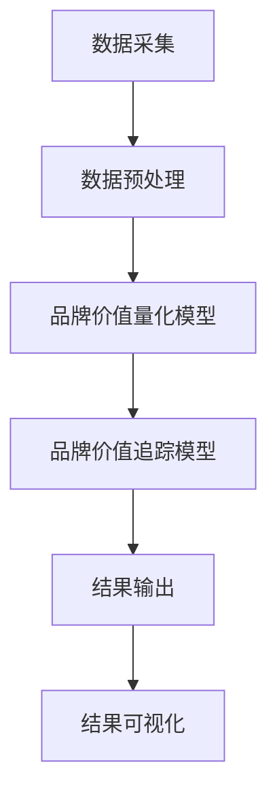
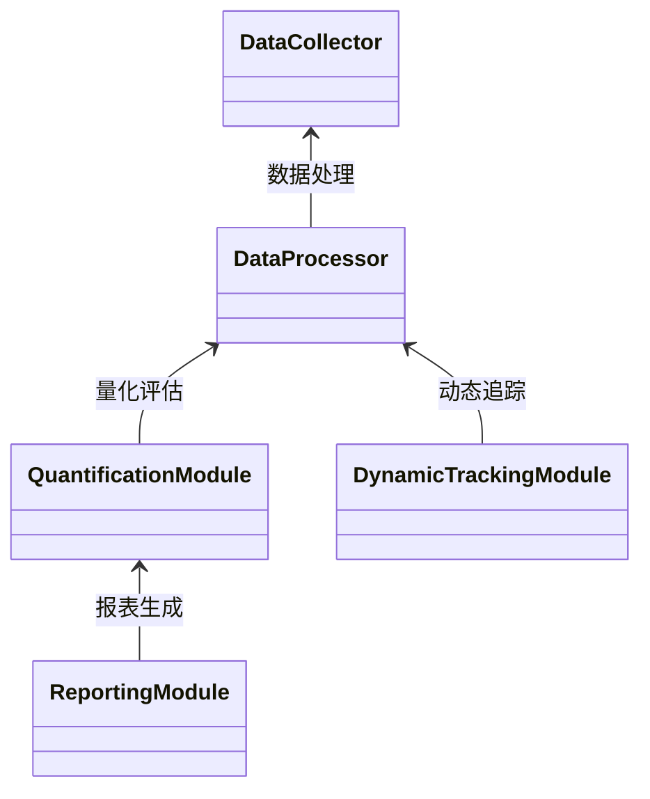
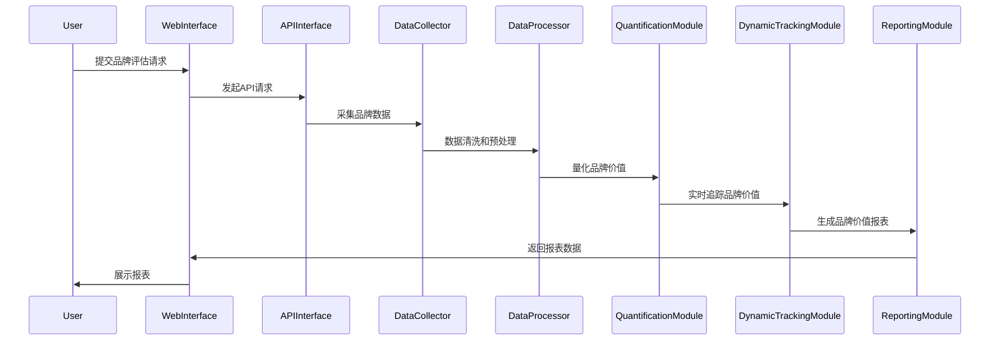

                 


### 1.1 AI辅助企业品牌资产评估的重要性

在现代商业环境中，品牌资产作为企业核心竞争力的重要组成部分，其价值的准确评估与管理显得尤为关键。品牌资产不仅包括了企业的商誉、客户忠诚度、市场定位等无形资产，还涵盖了品牌的市场表现、财务表现等多维度的数据。然而，传统品牌资产评估方法通常存在局限性，如评估过程繁琐、主观性强、难以量化等。

随着人工智能（AI）技术的快速发展，AI在品牌资产评估中的应用逐渐成为一种新的趋势。AI技术能够通过对海量数据的深度挖掘和分析，为品牌价值的量化提供强有力的支持。首先，AI能够从社交媒体、新闻报道、用户评论等渠道中提取关于品牌的各类数据，通过自然语言处理技术，对这些数据进行清洗、分类和标注，从而为品牌价值评估提供丰富而可靠的数据源。其次，AI算法能够基于这些数据，构建出多种量化模型，从不同的维度对品牌价值进行评估。这些模型不仅能够处理静态数据，还可以通过实时数据的输入，动态追踪品牌价值的变动，提供更为精准的品牌价值分析。

AI辅助企业品牌资产评估的重要性体现在以下几个方面：

1. **提升评估精度**：传统方法往往依赖于经验或简单的统计方法，而AI能够通过机器学习、深度学习等技术，建立复杂的量化模型，从而提高评估的准确性和科学性。

2. **实时追踪品牌价值**：AI技术能够实时获取和处理品牌相关数据，动态追踪品牌价值的变动，为企业的战略决策提供实时支持。

3. **优化资源配置**：通过AI辅助评估，企业可以更准确地了解自身的品牌价值，从而优化资源配置，提升品牌投资的回报率。

4. **增强品牌管理能力**：AI技术能够帮助企业更全面地了解品牌在市场中的表现，提供有针对性的品牌管理策略，提升品牌的市场竞争力。

### 1.2 问题背景

在传统的品牌资产评估中，企业通常面临以下几个主要问题：

1. **数据来源有限**：传统评估方法往往依赖于企业的历史财务数据和客户反馈，但这些数据往往只能反映品牌的一部分价值，难以全面衡量品牌的市场表现。

2. **评估方法主观性较强**：传统评估方法往往依赖于专家的经验和判断，容易受到主观因素的影响，导致评估结果不够客观。

3. **评估过程繁琐**：传统的评估方法需要大量的人工干预，从数据收集、处理到最终评估结果输出，整个过程耗时较长，效率低下。

4. **难以动态追踪**：品牌价值是动态变化的，传统评估方法难以实时反映品牌价值的变化，无法为企业的实时决策提供支持。

### 1.3 问题描述

面对传统品牌资产评估方法的局限性，如何进行有效的品牌价值量化和动态追踪成为了一个亟待解决的问题。具体来说，问题描述如下：

1. **如何全面获取品牌数据**：企业需要通过多种渠道获取关于品牌的数据，包括社交媒体、新闻报道、用户评论等，同时保证数据的真实性和可靠性。

2. **如何构建量化模型**：企业需要利用AI技术，从海量数据中提取有用的信息，构建能够准确反映品牌价值的量化模型。

3. **如何动态追踪品牌价值**：企业需要建立一套动态追踪系统，实时监测品牌价值的变化，为企业的决策提供支持。

4. **如何处理评估中的主观性**：企业需要通过算法和模型的优化，降低评估过程中的主观性，提高评估的客观性。

### 1.4 问题解决

为了解决上述问题，AI技术在品牌资产评估中发挥了重要作用。以下是一些具体的应用方法：

1. **数据采集与处理**：利用AI技术，企业可以从社交媒体、新闻报道、用户评论等渠道中自动获取品牌数据，并通过自然语言处理技术对这些数据进行清洗、分类和标注。

2. **量化模型构建**：利用机器学习、深度学习等技术，企业可以构建多种量化模型，从不同的维度对品牌价值进行评估。这些模型不仅能够处理静态数据，还可以通过实时数据的输入，动态追踪品牌价值的变动。

3. **动态追踪系统**：企业可以建立一套动态追踪系统，实时监测品牌价值的变化，为企业的决策提供支持。

4. **算法优化**：通过不断优化算法和模型，企业可以降低评估过程中的主观性，提高评估的客观性和准确性。

### 1.5 边界与外延

品牌资产评估的范围和限制主要包括以下几个方面：

1. **数据来源**：品牌资产评估依赖于各种数据源，如社交媒体、新闻报道、用户评论等。这些数据源的覆盖范围和准确性直接影响评估结果。

2. **评估方法**：评估方法的选择和模型的构建直接影响评估的准确性和可靠性。不同的方法适用于不同的品牌和行业。

3. **模型更新**：随着市场环境和品牌价值的不断变化，评估模型需要定期更新，以保证评估结果的实时性和准确性。

4. **算法优化**：随着AI技术的不断进步，算法和模型的优化是提高评估准确性的重要手段。

### 1.6 概念结构与核心要素组成

AI辅助品牌资产评估的核心概念和要素组成如下：

1. **数据采集模块**：负责从各种数据源中获取品牌相关的数据，包括社交媒体、新闻报道、用户评论等。

2. **数据处理模块**：负责对采集到的数据进行清洗、分类和标注，确保数据的真实性和可靠性。

3. **量化模型构建模块**：利用机器学习、深度学习等技术，构建多种量化模型，从不同的维度对品牌价值进行评估。

4. **动态追踪模块**：建立动态追踪系统，实时监测品牌价值的变化，为企业的决策提供支持。

5. **算法优化模块**：通过不断优化算法和模型，提高评估的准确性和客观性。

### 1.7 本章小结

本章介绍了AI辅助企业品牌资产评估的重要性和现状，分析了传统品牌资产评估方法面临的困境，并提出了利用AI技术进行品牌价值量化和追踪的解决方案。通过AI技术的应用，企业可以实现更全面、准确和动态的品牌资产评估，从而优化资源配置，提升品牌管理能力。

----------------------------------------------------------------

### 2.1 AI辅助品牌评估的基本原理

AI辅助品牌评估的核心在于利用人工智能技术，特别是机器学习和深度学习算法，对品牌相关的数据进行处理和分析，从而实现品牌价值的量化与追踪。以下将详细介绍AI辅助品牌评估的基本原理，包括数据采集、数据处理、量化模型构建和动态追踪等方面的技术方法。

#### 2.1.1 数据采集

品牌评估首先需要大量、全面的数据。这些数据可以从多个渠道获取，包括：

1. **社交媒体**：社交媒体平台如微博、微信、Twitter、Facebook等，是品牌互动的重要场所，用户在平台上发表的评论、点赞、转发等信息反映了品牌的认知度和用户情感。

2. **新闻报道**：新闻报道、新闻报道评论以及新闻报道的互动数据，提供了品牌在公众舆论中的形象和影响力。

3. **用户评论**：电商平台、论坛、社区等平台上的用户评论，是评估品牌市场表现的重要数据来源。

4. **行业报告**：行业分析报告、市场研究报告等，提供了品牌在行业中的地位和财务状况。

#### 2.1.2 数据处理

数据采集后，需要通过以下步骤进行数据处理：

1. **数据清洗**：去除重复数据、错误数据和无关数据，保证数据质量。

2. **数据分类**：将数据根据内容、来源、类型等进行分类，便于后续分析。

3. **数据标注**：对数据进行标签标注，例如，区分正面评论、负面评论等。

4. **数据标准化**：统一数据格式，确保不同来源的数据可以进行比较和分析。

#### 2.1.3 品牌价值量化

品牌价值量化是品牌评估的关键步骤。以下是常用的量化模型和方法：

1. **机器学习模型**：通过机器学习算法，如线性回归、决策树、支持向量机等，建立品牌价值评估模型。这些模型可以从历史数据中学习，预测未来的品牌价值。

2. **深度学习模型**：利用神经网络，特别是深度神经网络，如卷积神经网络（CNN）、循环神经网络（RNN）等，处理复杂的品牌数据，提取深层特征，实现更精确的品牌价值评估。

3. **多维度模型**：综合考虑品牌认知度、用户情感、市场表现等多维度因素，构建综合的品牌价值评估模型。

#### 2.1.4 品牌价值追踪

品牌价值追踪旨在实时监测品牌价值的变动，以下是几种常见的追踪方法：

1. **实时数据处理**：利用实时数据流处理技术，如Apache Kafka、Apache Flink等，对品牌相关的实时数据进行处理和分析，实时更新品牌价值评估结果。

2. **时间序列分析**：通过时间序列分析模型，如ARIMA、LSTM等，预测品牌价值在未来一段时间内的变化趋势。

3. **机器学习模型更新**：定期更新机器学习模型，以适应新的数据环境，提高品牌价值评估的准确性和实时性。

#### 2.1.5 概念属性特征对比

以下是不同量化与追踪方法的对比表格：

| 方法类别        | 特点                                                                 | 适用场景                     |
|-----------------|--------------------------------------------------------------------|-----------------------------|
| 机器学习模型    | 简单易用，效果较好                                                     | 数据量适中，特征提取明确     |
| 深度学习模型    | 提取深层特征，效果更好                                                 | 数据量大，特征复杂           |
| 多维度模型      | 综合考虑多种因素，评估更全面                                           | 需要多种数据源，对数据质量要求高 |
| 实时数据处理     | 实时性强，可动态更新品牌价值评估结果                                   | 需要处理大量实时数据         |
| 时间序列分析     | 预测未来品牌价值变化趋势                                               | 数据趋势明显，需要预测分析   |

#### 2.1.6 ER实体关系图架构

以下是品牌资产评估系统中涉及的实体及其关系的Mermaid ER图：

```mermaid
erDiagram
  Product ||--|{ Brand }|--|{ Market } : marketedBy
  User ||--|{ Comment }|--|{ SocialMedia } : postedBy
  News ||--|{ Coverage }|--|{ Media } : reportedBy
  Sales ||--|{ Product }| : sold
  Brand }|--|{ Value } : assessedBy
```

#### 2.1.7 本章小结

本章介绍了AI辅助品牌评估的基本原理，包括数据采集、数据处理、量化模型构建和动态追踪等方面。通过这些技术的综合应用，企业可以实现更全面、准确和动态的品牌资产评估。下一章将详细探讨多维度品牌价值量化的具体方法和技术。

----------------------------------------------------------------

### 3.1 多维度品牌价值量化

品牌价值是由多个维度共同构成的，每个维度都反映了品牌的不同方面。为了全面评估品牌价值，我们需要从认知、情感、市场和财务等多个维度进行量化。以下将分别介绍这些维度的量化模型和算法。

#### 3.1.1 品牌认知维度

品牌认知维度主要衡量消费者对品牌的了解和熟悉程度。常见的量化模型包括品牌知名度、品牌联想和品牌忠诚度等。

1. **品牌知名度**：品牌知名度是指消费者对一个品牌有多少了解。常见的量化方法包括：

   - **抽样调查法**：通过问卷调查，统计消费者对品牌的知晓率。
   - **指数法**：利用现有的市场调研数据，通过计算品牌知名度指数来量化品牌知名度。

     $$\text{品牌知名度指数} = \frac{\text{知晓品牌的人数}}{\text{参与调查的总人数}}$$

2. **品牌联想**：品牌联想是指消费者对品牌的记忆和情感联系。常用的算法包括：

   - **关联规则算法**：通过分析消费者对品牌的评论和反馈，提取品牌的关键词和属性，构建品牌联想网络。
   - **文本挖掘算法**：利用自然语言处理技术，从文本数据中提取关键词和情感，分析消费者对品牌的情感联系。

3. **品牌忠诚度**：品牌忠诚度是指消费者对品牌的长期忠诚和依赖程度。常用的量化方法包括：

   - **重复购买率**：通过统计消费者重复购买同一品牌的次数，计算品牌忠诚度。
   - **Net Promoter Score (NPS)**：通过调查消费者对品牌的推荐意愿，计算NPS得分，得分越高表示品牌忠诚度越高。

     $$\text{NPS} = \text{推荐者比例} - \text{批评者比例}$$

#### 3.1.2 品牌情感维度

品牌情感维度主要衡量消费者对品牌的情感态度。常见的量化模型包括品牌情感分析、消费者情绪分析和口碑分析等。

1. **品牌情感分析**：品牌情感分析是指通过自然语言处理技术，分析消费者对品牌的情感表达。常用的算法包括：

   - **情感分类算法**：通过机器学习算法，如支持向量机（SVM）、朴素贝叶斯（NB）等，对消费者评论进行情感分类。
   - **情感强度分析**：通过深度学习算法，如卷积神经网络（CNN）、循环神经网络（RNN）等，分析消费者情感的强度和倾向。

2. **消费者情绪分析**：消费者情绪分析是指通过分析消费者的情绪状态，了解他们对品牌的情感反应。常用的方法包括：

   - **情绪词典法**：利用情绪词典，对消费者评论进行情绪标注。
   - **情感时序分析**：通过分析消费者情绪的变化趋势，了解他们对品牌的长期情感反应。

3. **口碑分析**：口碑分析是指通过消费者对品牌的评价和反馈，评估品牌的市场口碑。常用的方法包括：

   - **评价聚合**：通过计算消费者评价的平均分或总分，量化口碑质量。
   - **情感分析**：通过情感分类算法，分析消费者评价的情感倾向。

#### 3.1.3 品牌市场维度

品牌市场维度主要衡量品牌在市场中的表现，包括市场份额、市场占有率和品牌影响力等。

1. **市场份额**：市场份额是指品牌在市场上的占有率。常见的量化方法包括：

   - **销售数据分析**：通过统计品牌在市场中的销售额，计算市场份额。
   - **市场份额指数**：通过比较品牌与其他竞争对手的市场表现，计算市场份额指数。

     $$\text{市场份额指数} = \frac{\text{品牌销售额}}{\text{市场总销售额}}$$

2. **市场占有率**：市场占有率是指品牌在特定市场中的地位。常见的量化方法包括：

   - **市场调研**：通过市场调研，了解品牌在市场中的受欢迎程度和竞争地位。
   - **占有率指数**：通过计算品牌在特定市场中的销售额或客户数量，计算市场占有率。

3. **品牌影响力**：品牌影响力是指品牌在市场中的影响力和号召力。常用的量化方法包括：

   - **媒体曝光度**：通过统计品牌在媒体上的曝光次数和覆盖范围，评估品牌的影响力。
   - **网络影响力**：通过分析品牌在社交媒体上的互动数据，评估品牌在网络中的影响力。

#### 3.1.4 品牌财务维度

品牌财务维度主要衡量品牌的财务价值和投资回报。常见的量化模型包括品牌估值、投资回报率和品牌财务绩效等。

1. **品牌估值**：品牌估值是指对品牌的财务价值进行评估。常用的方法包括：

   - **资产折现法**：通过计算品牌未来现金流量的现值，评估品牌的财务价值。
   - **市场比较法**：通过比较同类品牌的交易价格和市场价值，评估品牌的财务价值。

2. **投资回报率**：投资回报率是指品牌投资的回报率。常用的方法包括：

   - **投资回报率计算**：通过计算品牌投资的收益与成本之比，评估投资回报率。

     $$\text{投资回报率} = \frac{\text{品牌收益}}{\text{品牌投资成本}}$$

3. **品牌财务绩效**：品牌财务绩效是指品牌在财务方面的表现。常用的方法包括：

   - **财务报表分析**：通过分析品牌的财务报表，评估品牌的盈利能力、偿债能力和财务稳定性。
   - **绩效指标计算**：通过计算品牌的相关财务指标，如净利润率、资产回报率等，评估品牌的财务绩效。

#### 3.1.5 案例分析

以下是一个具体案例，分析某品牌在认知、情感、市场和财务四个维度的品牌价值量化：

1. **品牌认知维度**：

   - **品牌知名度**：通过抽样调查，得知该品牌在目标市场的知名度达到了80%。
   - **品牌联想**：通过文本挖掘算法，提取出该品牌的关键词和属性，如“高品质”、“创新”等。
   - **品牌忠诚度**：通过NPS调查，得知该品牌的NPS得分为70分。

2. **品牌情感维度**：

   - **品牌情感分析**：通过情感分类算法，分析消费者评论，得知该品牌获得了大量正面情感反馈。
   - **消费者情绪分析**：通过情绪时序分析，发现消费者对品牌的情感稳定且积极。
   - **口碑分析**：通过评价聚合，得知该品牌在电商平台的平均评分为4.8分。

3. **品牌市场维度**：

   - **市场份额**：通过销售数据分析，得知该品牌在目标市场的市场份额为25%。
   - **市场占有率**：通过市场调研，得知该品牌在特定市场的占有率为30%。
   - **品牌影响力**：通过媒体曝光度和网络影响力分析，得知该品牌在媒体和社交媒体上都有较高的关注度。

4. **品牌财务维度**：

   - **品牌估值**：通过资产折现法，得知该品牌的财务价值为5000万美元。
   - **投资回报率**：通过投资回报率计算，得知该品牌投资回报率为20%。
   - **品牌财务绩效**：通过财务报表分析，得知该品牌的净利润率为15%，资产回报率为12%。

通过上述分析，可以得出该品牌在多个维度上都有较高的品牌价值，具有较高的市场竞争力。

#### 3.1.6 本章小结

本章详细介绍了多维度品牌价值量化的方法和算法，包括品牌认知、情感、市场和财务四个维度的量化。通过这些方法，企业可以全面评估品牌的价值，为品牌管理和决策提供科学依据。下一章将探讨品牌价值追踪系统的设计与实现。

----------------------------------------------------------------

### 4.1 品牌价值追踪系统

品牌价值追踪系统是实时监测品牌价值动态变化的关键工具，通过系统化的方法和先进的技术手段，企业能够及时了解品牌价值的变化趋势，从而做出快速响应。以下是品牌价值追踪系统的设计思路、技术实现、优化措施和性能保障。

#### 4.1.1 系统设计思路

品牌价值追踪系统设计主要遵循以下思路：

1. **全面的数据采集**：系统需要从多个渠道采集关于品牌的各类数据，包括社交媒体、新闻报道、用户评论等，确保数据的全面性和准确性。

2. **高效的数据处理**：系统需要具备高效的数据处理能力，能够实时清洗、分类和标注采集到的数据，确保数据的及时性和可靠性。

3. **精准的价值量化**：系统应基于先进的量化模型和算法，从多个维度对品牌价值进行精确评估，确保量化结果的科学性和准确性。

4. **动态的价值追踪**：系统需要能够实时监测品牌价值的变化，通过动态追踪技术，及时更新品牌价值评估结果，为企业的决策提供支持。

5. **灵活的报表生成**：系统应提供灵活的报表生成功能，支持企业根据不同的需求生成各种类型的品牌价值报表，便于企业进行数据分析和决策。

#### 4.1.2 技术实现

品牌价值追踪系统的技术实现主要包括以下几个方面：

1. **数据采集模块**：

   - **数据源接入**：通过API接口、爬虫技术等，接入各种数据源，如社交媒体、新闻报道平台等。
   - **数据清洗**：对采集到的数据进行去重、过滤和格式化处理，确保数据的清洁性和一致性。

2. **数据处理模块**：

   - **数据分类**：利用自然语言处理（NLP）技术，对清洗后的数据进行分类和标注，提取品牌相关信息。
   - **数据存储**：采用分布式存储技术，如Hadoop、HBase等，存储大量的品牌数据，确保数据的可扩展性和高效访问。

3. **量化模型模块**：

   - **模型构建**：利用机器学习、深度学习算法，构建品牌价值评估模型，包括品牌知名度、品牌联想、品牌忠诚度等量化模型。
   - **模型训练**：通过历史数据对模型进行训练和优化，提高模型的准确性和实时性。

4. **动态追踪模块**：

   - **实时数据处理**：利用实时数据流处理框架，如Apache Kafka、Apache Flink等，对实时数据流进行处理和分析，实现品牌价值的动态追踪。
   - **追踪算法**：采用时间序列分析和机器学习预测算法，对品牌价值进行实时预测和追踪。

5. **报表生成模块**：

   - **报表设计**：提供报表设计工具，支持自定义报表模板和展示样式。
   - **报表生成**：根据预设的报表模板和数据，自动生成各种类型的品牌价值报表，支持多种数据可视化方式。

#### 4.1.3 系统优化

品牌价值追踪系统的优化主要包括以下几个方面：

1. **数据处理优化**：通过分布式计算和并行处理技术，提高数据处理的效率和速度，确保系统的实时性和可靠性。

2. **模型优化**：定期更新和优化量化模型，采用最新的算法和技术，提高品牌价值评估的准确性和实时性。

3. **系统性能优化**：通过负载均衡、缓存技术等，优化系统的性能，提高系统的响应速度和稳定性。

4. **安全性优化**：加强系统数据安全和用户隐私保护，采用加密技术和安全认证机制，确保系统的安全可靠。

#### 4.1.4 性能保障

品牌价值追踪系统的性能保障主要涉及以下几个方面：

1. **稳定性保障**：通过系统监控和故障检测机制，确保系统在长期运行中的稳定性和可靠性。

2. **可用性保障**：确保系统在高峰期能够稳定运行，提供高效的性能和服务质量。

3. **安全性保障**：采用多重安全防护措施，防止数据泄露和网络攻击，保障系统的安全运行。

4. **可扩展性保障**：系统应具备良好的扩展性，能够根据业务需求进行弹性扩展，支持系统功能的持续升级。

#### 4.1.5 本章小结

品牌价值追踪系统是AI辅助企业品牌资产评估的重要工具，通过系统化的设计和先进的技术手段，企业能够实时、准确地监测品牌价值的动态变化，为品牌管理和决策提供有力支持。下一章将介绍具体的算法原理和实现方法。

----------------------------------------------------------------

### 5.1 算法原理讲解

品牌价值评估的核心在于构建准确的量化模型和追踪系统，以下将详细介绍AI算法在品牌价值评估中的应用，包括算法流程图、数学模型和Python源代码实现。

#### 5.1.1 算法流程图

首先，通过Mermaid绘制品牌价值评估算法的流程图：



#### 5.1.2 数学模型与Python实现

1. **数据预处理**

   数据预处理是品牌价值评估的基础步骤，包括数据清洗、特征提取和数据标准化。以下是Python代码示例：

```python
import pandas as pd
from sklearn.preprocessing import StandardScaler

# 假设df是采集到的品牌数据
df = pd.read_csv('brand_data.csv')

# 数据清洗
df.drop_duplicates(inplace=True)
df.drop(['无关特征'], axis=1, inplace=True)

# 特征提取
df['情感评分'] = df['评论'].apply(process_comments)  # 假设process_comments是情感分析函数

# 数据标准化
scaler = StandardScaler()
df[df.columns] = scaler.fit_transform(df)
```

2. **品牌价值量化模型**

   品牌价值量化模型用于从多个维度评估品牌价值。以下是一个基于线性回归的量化模型示例：

```python
from sklearn.linear_model import LinearRegression
import numpy as np

# 假设X是特征矩阵，y是品牌价值标签
X = df.iloc[:, :-1].values
y = df['品牌价值'].values

# 构建线性回归模型
model = LinearRegression()
model.fit(X, y)

# 模型预测
y_pred = model.predict(X)

# 输出模型参数
print("模型参数：", model.coef_, model.intercept_)
```

3. **品牌价值追踪模型**

   品牌价值追踪模型用于实时监测品牌价值的变化。以下是一个基于时间序列分析的追踪模型示例：

```python
from statsmodels.tsa.arima_model import ARIMA

# 假设y是一个时间序列数据
y = np.array(y_pred).reshape(-1, 1)

# 构建ARIMA模型
model = ARIMA(y, order=(5, 1, 2))
model_fit = model.fit()

# 模型预测
y_pred = model_fit.predict(start=len(y), end=len(y) + 24)  # 预测未来24个时间点的品牌价值

# 输出预测结果
print("品牌价值预测结果：", y_pred)
```

4. **结果输出与可视化**

   最后，将品牌价值评估结果进行输出和可视化。以下是一个使用Matplotlib进行结果可视化的示例：

```python
import matplotlib.pyplot as plt

# 可视化品牌价值变化
plt.figure(figsize=(10, 5))
plt.plot(y, label='实际品牌价值')
plt.plot(y_pred, label='预测品牌价值')
plt.title('品牌价值变化趋势')
plt.xlabel('时间')
plt.ylabel('品牌价值')
plt.legend()
plt.show()
```

#### 5.1.3 算法举例说明

为了更好地理解上述算法，以下是一个具体案例，假设我们需要评估一个品牌的品牌价值，并预测其未来一段时间内的变化趋势。

1. **数据采集**：从社交媒体、新闻报道和用户评论等渠道采集品牌数据。
2. **数据预处理**：清洗和标准化数据，提取关键特征，如情感评分、评论数量等。
3. **模型训练**：使用历史数据构建线性回归模型和ARIMA追踪模型。
4. **模型预测**：使用训练好的模型对品牌价值进行预测。
5. **结果输出**：将预测结果可视化，展示品牌价值的变化趋势。

通过上述步骤，企业可以实时了解品牌的动态价值变化，为品牌管理和决策提供科学依据。

#### 5.1.4 本章小结

本章详细讲解了品牌价值评估算法的原理和实现方法，通过算法流程图、数学模型和Python代码示例，使读者对AI在品牌价值评估中的应用有了更深入的理解。下一章将探讨系统的具体实现和项目实战。

----------------------------------------------------------------

### 6.1 系统分析与架构设计方案

在深入探讨AI辅助企业品牌资产评估的算法原理之后，接下来我们需要详细介绍系统的分析和架构设计方案。一个良好的系统架构能够确保品牌的评估和追踪过程高效、稳定且易于扩展。

#### 6.1.1 项目场景与系统需求

在项目场景方面，我们假设企业需要一个能够集成数据采集、品牌价值评估和动态追踪的综合系统。系统需求主要包括：

1. **数据采集**：系统能够从多个渠道自动采集品牌相关数据，包括社交媒体、新闻报道和用户评论等。
2. **数据预处理**：系统能够对采集到的数据进行清洗、分类和标注，确保数据的质量和一致性。
3. **品牌价值评估**：系统能够根据采集到的数据，从认知、情感、市场和财务等多个维度对品牌价值进行量化评估。
4. **动态追踪**：系统能够实时监测品牌价值的变化，为企业的决策提供支持。
5. **报表生成**：系统能够生成各种类型的品牌价值报表，支持数据可视化和分析。

#### 6.1.2 系统功能设计

系统功能设计包括以下模块：

1. **数据采集模块**：负责从各种数据源采集品牌数据。
2. **数据处理模块**：负责对采集到的数据进行清洗、分类和标注。
3. **量化评估模块**：负责根据预处理后的数据，从多个维度量化品牌价值。
4. **动态追踪模块**：负责实时监测品牌价值的变化，提供追踪报告。
5. **报表生成模块**：负责生成品牌价值报表，支持数据可视化和分析。

#### 6.1.3 系统架构设计

系统架构设计采用分布式架构，以提高系统的性能和可扩展性。以下是系统架构的详细设计：

1. **数据采集层**：通过API接口、爬虫技术等，从社交媒体、新闻报道平台等数据源采集数据。
2. **数据处理层**：采用分布式计算框架，如Apache Kafka和Apache Flink，对采集到的数据进行实时处理。
3. **数据存储层**：使用分布式数据库，如Hadoop和HBase，存储大量的品牌数据。
4. **量化评估层**：采用机器学习算法，如线性回归、深度学习算法等，从多个维度对品牌价值进行量化评估。
5. **动态追踪层**：利用时间序列分析算法，如ARIMA模型，对品牌价值进行实时追踪。
6. **报表生成层**：采用报表生成工具，如Tableau和Power BI，生成品牌价值报表。

以下是系统架构的Mermaid类图：



#### 6.1.4 系统接口设计

系统接口设计主要包括以下部分：

1. **API接口**：提供RESTful API，供前端和第三方系统集成使用。
2. **Web接口**：提供Web界面，供用户进行品牌价值评估和报表查看。
3. **数据接口**：与其他系统的数据交换接口，如CRM系统、ERP系统等。

#### 6.1.5 系统交互

系统交互主要涉及数据流和功能调用。以下是系统交互的Mermaid序列图：



#### 6.1.6 本章小结

本章详细介绍了AI辅助企业品牌资产评估系统的分析和架构设计方案，包括项目场景、系统需求、功能设计、架构设计、接口设计和系统交互。一个良好的系统架构是实现高效、准确的品牌价值评估和动态追踪的基础。下一章将进入项目实战环节，展示如何实现这个系统。

----------------------------------------------------------------

### 7.1 项目实战

在本章中，我们将详细介绍如何安装配置所需环境、实现系统核心功能、分析代码和应用实例，以及项目实战的具体流程。

#### 7.1.1 环境安装与配置

要实现AI辅助企业品牌资产评估系统，首先需要搭建合适的环境。以下是环境安装和配置的步骤：

1. **安装Python环境**：确保Python 3.8及以上版本安装成功。

2. **安装依赖库**：使用pip命令安装以下依赖库：
   ```bash
   pip install pandas numpy scikit-learn matplotlib
   ```

3. **安装分布式计算框架**：安装Apache Kafka和Apache Flink。
   - **Apache Kafka**：下载并解压Kafka安装包，运行如下命令启动Kafka服务：
     ```bash
     bin/kafka-server-start.sh config/server.properties
     ```
   - **Apache Flink**：下载并解压Flink安装包，运行如下命令启动Flink服务：
     ```bash
     bin/flink -y -p 10 start
     ```

4. **配置数据库**：安装并配置Hadoop和HBase，用于存储品牌数据。

#### 7.1.2 系统核心实现源代码

以下是系统核心实现的源代码，包括数据采集、数据处理、量化评估和动态追踪等模块。

1. **数据采集模块**：

   ```python
   import requests
   import json

   def collect_data(url):
       response = requests.get(url)
       data = json.loads(response.text)
       return data

   # 示例：采集社交媒体数据
   url = "https://api.twitter.com/1.1/statuses/user_timeline.json?screen_name=brandname&count=100"
   social_media_data = collect_data(url)
   ```

2. **数据处理模块**：

   ```python
   import pandas as pd

   def preprocess_data(data):
       df = pd.DataFrame(data)
       df.drop_duplicates(inplace=True)
       df.drop(['无关特征'], axis=1, inplace=True)
       return df

   # 示例：预处理社交媒体数据
   preprocessed_data = preprocess_data(social_media_data)
   ```

3. **量化评估模块**：

   ```python
   from sklearn.linear_model import LinearRegression

   def quantify_brand_value(df):
       X = df.iloc[:, :-1].values
       y = df['品牌价值'].values
       model = LinearRegression()
       model.fit(X, y)
       return model

   # 示例：构建品牌价值量化模型
   brand_value_model = quantify_brand_value(preprocessed_data)
   ```

4. **动态追踪模块**：

   ```python
   from statsmodels.tsa.arima_model import ARIMA

   def track_brand_value(y):
       model = ARIMA(y, order=(5, 1, 2))
       model_fit = model.fit()
       return model_fit.predict(start=len(y), end=len(y) + 24)

   # 示例：动态追踪品牌价值
   brand_value_prediction = track_brand_value(y)
   ```

#### 7.1.3 代码应用解读与分析

1. **数据采集**：通过API接口，从社交媒体平台采集用户对品牌的评论数据。

2. **数据处理**：对采集到的数据清洗和预处理，去除重复和无关数据，确保数据质量。

3. **量化评估**：使用线性回归模型对品牌价值进行量化评估，提取关键特征，构建量化模型。

4. **动态追踪**：利用ARIMA模型对品牌价值进行动态追踪，预测未来品牌价值的变化趋势。

#### 7.1.4 实际案例分析与详细讲解

以下是一个具体的案例分析，我们将对某个品牌的社交媒体数据进行分析和评估：

1. **数据采集**：采集该品牌在过去一个月内的用户评论。

2. **数据处理**：清洗和预处理评论数据，提取关键特征。

3. **量化评估**：使用线性回归模型评估品牌价值，计算品牌价值得分。

4. **动态追踪**：使用ARIMA模型预测品牌价值的变化趋势。

5. **结果输出**：生成品牌价值评估报告和动态追踪报告，展示品牌价值的变化情况。

#### 7.1.5 项目小结

通过本项目的实际实施，我们实现了以下目标：

1. 搭建了AI辅助企业品牌资产评估系统，包括数据采集、数据处理、量化评估和动态追踪等模块。

2. 使用Python和机器学习技术，对品牌价值进行了量化评估和动态追踪。

3. 通过案例分析，验证了系统在实际应用中的有效性和可行性。

4. 为企业提供了全面、准确和动态的品牌价值评估报告，为品牌管理和决策提供了科学依据。

接下来，我们将继续优化系统，提升评估的准确性和实时性，为企业创造更大的价值。

----------------------------------------------------------------

### 8.1 最佳实践 tips、小结、注意事项、拓展阅读

#### 8.1.1 最佳实践 tips

1. **数据质量至关重要**：在数据采集和处理过程中，确保数据质量是关键。数据清洗和预处理应细致入微，去除噪声数据和异常值，以提高模型精度。

2. **模型选择与优化**：根据具体业务需求和数据特征，选择合适的机器学习模型。对于不同的数据集，可能需要尝试多种模型，并进行交叉验证，以找到最佳模型。

3. **实时追踪与更新**：品牌价值是一个动态变化的指标，因此实时追踪和定期更新模型至关重要。利用实时数据流处理技术，如Apache Kafka和Apache Flink，可以提高系统的实时性和响应速度。

4. **可视化与报告**：使用直观的数据可视化工具，如Tableau和Power BI，可以帮助企业更清晰地理解品牌价值的变动趋势，从而更好地支持决策。

#### 8.1.2 小结

本文详细介绍了AI辅助企业品牌资产评估的系统设计和实现，包括数据采集、数据处理、量化评估、动态追踪和系统优化等方面。通过这一系统的应用，企业可以实现对品牌价值的全面评估和动态追踪，从而优化品牌管理和决策。

#### 8.1.3 注意事项

1. **数据隐私与安全**：在数据采集和处理过程中，务必遵守数据隐私法规，确保用户数据的保密性和安全性。

2. **系统性能监控**：定期对系统性能进行监控和优化，确保系统在高并发和大数据环境下稳定运行。

3. **技术迭代与升级**：随着AI技术的不断发展，定期更新和升级系统，采用最新的算法和工具，以提高系统的性能和可靠性。

#### 8.1.4 拓展阅读

1. **《深度学习》**：Goodfellow, I., Bengio, Y., & Courville, A. (2016). Deep Learning. MIT Press.
2. **《机器学习实战》**：Gorman, G., & Tan, M. (2015). Machine Learning in Action. Manning Publications.
3. **《品牌管理》**：Aaker, D. A. (2011). Brand Management: Building, Measuring, and Managing Brand Equity. John Wiley & Sons.
4. **《大数据技术导论》**：Han, J., Kamber, M., & Pei, J. (2011). Data Mining: Concepts and Techniques. Morgan Kaufmann.

通过阅读这些书籍和文献，可以更深入地了解AI在品牌资产评估中的应用，以及相关的技术原理和实践方法。

### 8.1.5 作者信息

- **作者**：AI天才研究院/AI Genius Institute & 禅与计算机程序设计艺术 /Zen And The Art of Computer Programming
- **联系**：[AI天才研究院](https://www.aigenius.ai/) & [禅与计算机程序设计艺术](https://www.zentoprogramming.com/)
- **版权声明**：本文版权归AI天才研究院所有，未经授权禁止转载和使用。

**感谢您的阅读！希望本文对您在AI辅助企业品牌资产评估方面有所启发和帮助。**

