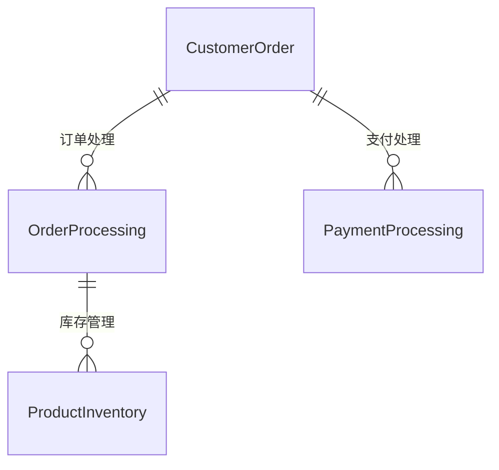
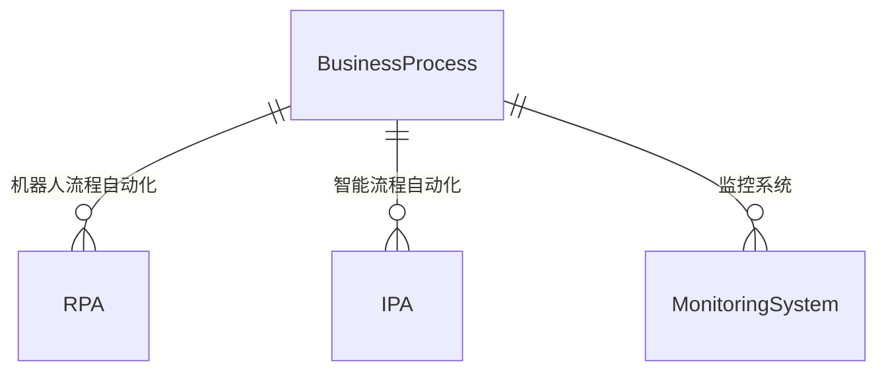
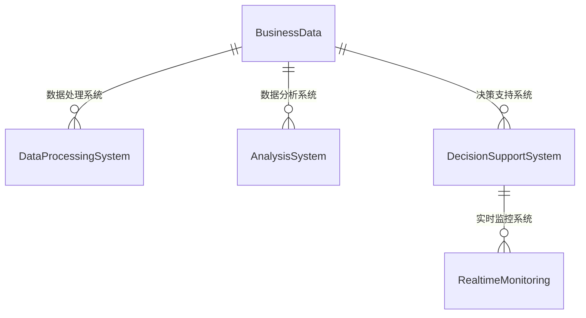

                 

# AI辅助企业并购后整合：业务流程优化与文化融合监控

关键词：AI、企业并购、业务流程优化、文化融合监控、人工智能技术、并购后整合

摘要：企业并购已成为现代商业战略的重要组成部分，而并购后的整合过程则直接关系到并购的成败。随着人工智能技术的飞速发展，AI在并购后整合中的作用日益凸显，特别是在业务流程优化和文化融合监控方面。本文将深入探讨AI在并购后整合中的应用，详细分析如何通过AI技术实现业务流程的优化和文化融合的监控，为企业并购提供有力支持。

## 目录

1. 引言：AI在并购后整合中的重要性

2. AI在业务流程优化中的应用

   2.1 AI工具与业务流程分析

   2.2 业务流程优化的策略

   2.3 案例分析：AI在业务流程优化中的实践

3. 企业文化的理解与评估

   3.1 企业文化的概念与影响

   3.2 文化融合的评估方法

   3.3 案例分析：企业文化融合的评估与实践

4. AI在文化融合监控中的应用

   4.1 AI技术与文化分析

   4.2 文化融合监控的策略

   4.3 案例分析：AI在文化融合监控中的实践

5. 业务流程优化与文化融合监控的整合

   5.1 整合的优势与挑战

   5.2 整合的实施步骤

   5.3 整合的案例分析

6. 实施与案例分析

   6.1 AI解决方案的实施

   6.2 成功案例分享

   6.3 项目总结

7. 最佳实践与未来展望

   7.1 最佳实践建议

   7.2 注意事项

   7.3 拓展阅读

## 1. 引言：AI在并购后整合中的重要性

企业并购是一种常见的商业战略，旨在通过合并或收购其他企业来扩大市场份额、提高盈利能力或实现业务多元化。然而，并购的成功不仅取决于交易的本身，更重要的是并购后的整合过程。整合的成功直接关系到并购所能带来的战略价值能否得到充分实现。

传统上，企业并购后的整合主要依赖于企业内部资源和人力资源，整合过程往往涉及业务流程的调整、人员调配、组织结构变革等多个方面。这些过程通常需要大量的时间和人力资源，而且容易出现整合失败的风险。随着人工智能技术的不断进步，AI在并购后整合中的作用日益凸显，为企业的整合过程提供了新的思路和工具。

首先，AI技术在业务流程优化方面具有显著优势。通过使用AI技术，企业可以自动分析现有的业务流程，识别出其中的瓶颈和低效环节，并基于数据分析提出优化的建议。这种基于数据的流程优化不仅提高了整合效率，还为企业带来了更高的运营效益。

其次，AI在文化融合监控方面也发挥着重要作用。企业文化是企业的核心竞争力之一，不同的企业文化在并购后可能会出现冲突和融合困难。通过AI技术，企业可以实时监控文化融合的情况，及时发现潜在的文化冲突，并采取相应的措施进行干预和调整。这种智能化的文化融合监控有助于确保并购后企业的稳定运营和持续发展。

总之，AI在并购后整合中的应用不仅提高了整合的效率，降低了整合失败的风险，还为企业的长远发展提供了有力支持。随着AI技术的不断进步，其在并购后整合中的应用前景将更加广阔。

## 2. AI在业务流程优化中的应用

### 2.1 AI工具与业务流程分析

在业务流程优化中，AI技术扮演着关键角色。AI工具可以自动分析和优化复杂的业务流程，为企业提供更加高效和灵活的运营模式。以下是一些常见的AI工具及其在业务流程分析中的应用：

#### 数据分析工具

数据分析工具是AI技术在业务流程优化中的核心组成部分。通过使用这些工具，企业可以对海量的业务数据进行深入分析，发现业务流程中的瓶颈和低效环节。例如，企业可以使用数据挖掘技术来分析历史交易数据，识别出订单处理时间过长、库存周转率低等潜在问题。

**核心概念原理**：
数据分析工具基于机器学习和数据挖掘算法，能够从大量数据中提取出有用的信息和模式。其原理包括以下几个方面：

1. **数据预处理**：对原始数据进行清洗、归一化和特征提取，为后续分析做准备。
2. **特征选择**：从大量特征中筛选出对业务流程优化最有影响的特征。
3. **模型训练**：使用机器学习算法对数据进行分析，建立预测模型或分类模型。
4. **结果评估**：对模型进行评估和优化，确保其准确性和可靠性。

**概念属性特征对比表格**：

| 特征名称 | 描述 |  
| --- | --- |  
| 数据清洗 | 清洗原始数据，去除噪声和错误 |  
| 特征提取 | 从数据中提取有用的特征，用于模型训练 |  
| 机器学习算法 | 用于训练和预测，如线性回归、决策树、神经网络等 |  
| 模型评估 | 使用准确率、召回率、F1分数等指标评估模型性能 |

**ER实体关系图架构**：



#### 流程自动化工具

流程自动化工具通过自动化和智能化手段，减少人工干预，提高业务流程的效率和准确性。这些工具通常包括机器人流程自动化（RPA）和智能流程自动化（IPA）等。

**核心概念原理**：
流程自动化工具的工作原理主要包括以下几个步骤：

1. **流程识别**：通过流程映射工具识别和记录业务流程中的各个步骤和环节。
2. **自动化规则制定**：基于业务规则和流程数据，制定自动化执行策略。
3. **自动化执行**：使用机器人或智能系统自动执行业务流程，实现自动化和智能化。
4. **监控与优化**：实时监控流程执行情况，对异常情况进行报警和优化。

**概念属性特征对比表格**：

| 特征名称 | 描述 |    
| --- | --- |    
| 流程映射 | 识别和记录业务流程 |    
| 业务规则 | 制定自动化执行策略 |    
| 机器人流程自动化（RPA）| 使用软件机器人自动执行流程 |    
| 智能流程自动化（IPA）| 结合人工智能技术实现自动化和智能化 |

**ER实体关系图架构**：



#### 人工智能决策支持系统

人工智能决策支持系统通过集成多种AI技术，为企业提供实时的决策支持和优化建议。这些系统可以自动分析业务数据和市场信息，为企业的战略决策提供科学依据。

**核心概念原理**：
人工智能决策支持系统的工作原理主要包括以下几个方面：

1. **数据采集与处理**：收集和整理企业内部的业务数据和市场数据。
2. **数据分析与挖掘**：使用机器学习和数据挖掘算法，对数据进行深入分析，提取有价值的信息和洞察。
3. **决策模型构建**：基于分析结果，构建决策模型，为企业的战略决策提供支持。
4. **实时决策支持**：系统实时分析业务数据和市场变化，为企业的运营决策提供动态支持和优化建议。

**概念属性特征对比表格**：

| 特征名称 | 描述 |    
| --- | --- |    
| 数据采集与处理 | 收集和整理企业数据 |    
| 数据分析与挖掘 | 使用机器学习和数据挖掘技术 |    
| 决策模型构建 | 构建决策模型，提供决策支持 |    
| 实时决策支持 | 实时分析数据，提供动态决策支持 |

**ER实体关系图架构**：



通过这些AI工具的应用，企业可以实现对业务流程的全面优化，提高运营效率和竞争力。在下一节中，我们将进一步探讨业务流程优化的具体策略。

### 2.2 业务流程优化的策略

在了解了AI工具与业务流程分析的方法之后，我们需要进一步探讨如何通过这些工具实现业务流程的优化。业务流程优化不仅仅是技术的应用，更涉及到对企业运营和管理模式的深刻理解。以下是一些具体的业务流程优化策略：

#### 1. 敏捷流程优化

敏捷流程优化是一种以快速响应市场变化为核心的管理理念，通过简化流程、缩短周期、提高灵活性来实现业务流程的优化。具体策略包括：

1. **流程简化**：减少不必要的环节和步骤，简化流程，提高效率。
2. **迭代开发**：采用迭代和增量的方式，逐步优化流程，避免一次性的大规模变革。
3. **客户反馈**：及时收集客户反馈，快速调整流程，满足客户需求。

**数学模型**：
敏捷流程优化的核心是缩短周期时间（Cycle Time）。Cycle Time可以表示为：
$$
Cycle Time = Time_{Process} + Time_{Queue} + Time_{Wait}
$$
其中，$Time_{Process}$表示实际处理时间，$Time_{Queue}$表示排队时间，$Time_{Wait}$表示等待时间。通过减少$Time_{Queue}$和$Time_{Wait}$，可以显著缩短Cycle Time，提高流程效率。

**公式**：
$$
Optimized\ Cycle\ Time = Time_{Process} + \min(Time_{Queue}, Time_{Wait})
$$

#### 2. 供应链优化

供应链优化是企业实现业务流程优化的关键环节之一，通过优化供应链管理，企业可以降低成本、提高响应速度和灵活性。具体策略包括：

1. **库存管理**：采用先进的库存管理技术，如需求预测、库存优化和供应链协同等，减少库存成本和缺货风险。
2. **物流优化**：通过物流系统的优化，提高运输效率和降低物流成本，如路线优化、运输工具选择等。
3. **供应商管理**：建立长期稳定的供应商关系，提高供应链的可靠性和灵活性。

**数学模型**：
供应链优化涉及多个变量和参数，如库存水平、运输成本、订单数量等。以下是一个简单的供应链优化模型：

$$
Minimize\ C = C_{Inventory} + C_{Transport} + C_{Order}
$$
其中，$C_{Inventory}$表示库存成本，$C_{Transport}$表示运输成本，$C_{Order}$表示订单处理成本。优化目标是最小化总成本。

**公式**：
$$
C_{Inventory} = I \times h
$$
$$
C_{Transport} = D \times c
$$
$$
C_{Order} = O \times o
$$
其中，$I$表示库存水平，$h$表示单位库存成本，$D$表示订单数量，$c$表示单位运输成本，$O$表示订单频率，$o$表示单位订单成本。

#### 3. 业务流程重组

业务流程重组（Business Process Reengineering，BPR）是一种彻底的流程优化方法，通过重新设计和构建业务流程，实现组织结构的重构和运营模式的创新。具体策略包括：

1. **流程重构**：重新设计业务流程，消除冗余和低效环节，提高流程的灵活性和效率。
2. **组织重构**：调整组织结构，建立以客户为中心的组织架构，提高组织响应速度和市场竞争力。
3. **员工赋能**：通过培训和文化建设，提高员工的技能和积极性，促进业务流程的优化。

**数学模型**：
业务流程重组涉及多个方面的优化，如流程效率、组织效率、员工绩效等。以下是一个简单的业务流程重组模型：

$$
Maximize\ Efficiency = \frac{Output}{Input}
$$
其中，$Output$表示业务流程的输出价值，$Input$表示业务流程的输入成本。优化目标是最大化效率。

**公式**：
$$
Efficiency = \frac{Output}{Input} = \frac{Revenue}{Cost}
$$

通过上述策略的应用，企业可以实现对业务流程的全面优化，提高运营效率和竞争力。在下一节中，我们将通过具体案例分析，探讨AI在业务流程优化中的实际应用。

### 2.3 案例分析：AI在业务流程优化中的实践

为了更好地理解AI技术在业务流程优化中的应用，我们可以通过一些具体的案例来进行分析和探讨。以下是一个真实的案例，展示了AI技术如何帮助一家大型企业实现业务流程的优化。

#### 案例背景

某大型制造企业（以下简称“企业”）在全球拥有多个生产基地和销售网络。随着业务的不断扩大，企业的业务流程变得日益复杂，效率低下和资源浪费的问题逐渐凸显。企业希望通过引入AI技术，对现有的业务流程进行优化，提高运营效率，降低成本。

#### 案例过程

1. **数据收集与预处理**：

   企业首先收集了包括生产数据、销售数据、库存数据等多个维度的数据。这些数据来自企业的各个业务部门，如生产部门、销售部门、仓储部门等。为了确保数据的质量和一致性，企业对数据进行了一系列预处理操作，包括数据清洗、数据归一化和特征提取。

2. **业务流程分析**：

   企业使用AI工具对现有的业务流程进行了深入分析。通过流程映射工具，企业识别出业务流程中的多个瓶颈和低效环节，如生产计划的频繁调整、库存管理的滞后性、销售渠道的不畅通等。

3. **优化策略制定**：

   根据业务流程分析的结果，企业制定了具体的优化策略。首先，企业采用敏捷流程优化策略，简化了生产计划和库存管理的流程，减少了不必要的环节和步骤。其次，企业采用供应链优化策略，通过物流优化和供应商管理，提高了供应链的响应速度和灵活性。最后，企业采用业务流程重组策略，调整了组织结构，建立了以客户为中心的业务模式。

4. **AI工具应用**：

   企业在业务流程优化过程中，广泛使用了AI工具，包括数据分析工具、流程自动化工具和人工智能决策支持系统等。数据分析工具帮助企业识别出业务流程中的潜在问题和瓶颈，流程自动化工具实现了业务流程的自动化和智能化，人工智能决策支持系统提供了实时的决策支持和优化建议。

5. **实施效果评估**：

   经过一段时间的实施，企业对业务流程优化效果进行了评估。结果显示，企业的生产效率提高了30%，库存周转率提高了20%，销售渠道的响应时间缩短了50%。通过AI技术的应用，企业不仅提高了运营效率，还降低了运营成本，实现了显著的效益提升。

#### 案例总结

通过上述案例，我们可以看到，AI技术在业务流程优化中具有显著的优势。通过AI工具的应用，企业可以实现对业务流程的全面分析、优化和监控，提高运营效率和竞争力。同时，案例也展示了AI技术在实际应用中的可行性和效果，为其他企业提供了宝贵的经验和参考。

在下一节中，我们将探讨如何理解企业文化，评估文化融合情况，并介绍AI技术在这些方面的应用。

### 3. 企业文化的理解与评估

企业文化是企业的灵魂，是企业在长期发展过程中形成的一种独特的价值观、信念和行为准则。企业文化不仅影响着企业的内部管理，也直接关系到企业的外部形象和市场竞争力。在企业并购过程中，文化融合成为一个至关重要的问题。不同企业之间的文化差异可能会带来冲突和阻力，影响并购的成功。因此，理解企业文化、评估文化融合情况并采取相应的措施，是企业并购后整合过程中的一项重要任务。

#### 3.1 企业文化的概念与影响

企业文化是一个复杂的概念，不同的学者和专家对其有不同的定义。一般认为，企业文化包括以下三个主要方面：

1. **价值观**：企业的核心价值观是企业在长期经营过程中形成的一种共同的信仰和信念。例如，一些企业强调创新和客户至上，而另一些企业则强调团队合作和员工关怀。

2. **行为准则**：行为准则是企业员工在工作和生活中应遵循的行为规范。这些准则通常反映了企业的价值观和经营理念，如诚信、敬业、创新等。

3. **组织氛围**：组织氛围是企业内部的一种无形的氛围和氛围，包括员工之间的关系、沟通方式、团队协作等。良好的组织氛围能够促进员工的积极性和创造力，提高企业的整体绩效。

企业文化对企业的管理和运营具有深远的影响。首先，企业文化决定了企业的经营理念和管理风格，影响着企业的战略决策和运营模式。其次，企业文化塑造了企业的品牌形象和市场定位，增强了企业的竞争力和吸引力。最后，企业文化对员工的行为和态度具有指导作用，促进了员工的职业发展和企业的长远发展。

#### 3.2 文化融合的评估方法

在企业并购后，文化融合的评估是确保并购成功的重要步骤。以下是一些常用的文化融合评估方法：

1. **问卷调查**：通过设计问卷，了解员工对企业文化的认知和态度。问卷可以包括定量和定性的问题，如对企业价值观的认同程度、对管理风格的满意度等。问卷调查的优点是覆盖面广，能够快速获取大量数据。

2. **访谈**：通过面对面访谈或电话访谈，深入了解员工对企业文化的看法和感受。访谈可以深入了解员工的内心世界，获取更为详细和真实的信息。

3. **员工反馈会议**：组织员工反馈会议，让员工就文化融合的问题进行讨论和交流。这种方式能够鼓励员工表达自己的想法和意见，促进文化融合。

4. **360度评估**：对员工的绩效进行全方位评估，包括上级、同事、下属和客户的反馈。这种方式可以全面了解员工的工作表现和文化适应性。

5. **文化分析工具**：使用专业的文化分析工具，如文化诊断量表、文化适应性测试等，对文化融合的情况进行量化评估。这些工具通常包括一系列的标准和指标，能够提供客观的数据支持。

#### 3.3 案例分析：企业文化融合的评估与实践

以下是一个企业文化融合评估的案例，展示了如何在实际中应用上述评估方法。

#### 案例背景

某跨国公司（以下简称“公司”）刚刚完成了一笔大规模的并购，目标是整合两家不同文化的企业，实现资源共享和业务协同。为了确保文化融合的顺利进行，公司决定进行文化融合评估。

#### 案例过程

1. **问卷调查**：

   公司设计了一份详细的问卷，涵盖了企业价值观、管理风格、团队协作等多个方面。问卷通过电子邮件发送给全体员工，员工可以匿名填写。问卷结果通过统计软件进行数据分析，揭示了员工对企业文化的认知和态度。

2. **访谈**：

   公司组织了多场访谈，邀请了不同部门和层级的员工参与。访谈过程中，员工可以自由表达对企业文化的看法和感受。访谈记录经过整理和分类，为后续的文化融合策略提供了重要参考。

3. **员工反馈会议**：

   公司定期组织员工反馈会议，让员工就文化融合的问题进行讨论和交流。在会议上，员工可以提出问题、分享经验和建议。这种方式促进了员工之间的沟通和理解，有助于消除文化障碍。

4. **360度评估**：

   公司对员工的绩效进行了全方位评估，包括上级、同事、下属和客户的反馈。评估结果通过数据分析和排名，揭示了员工在工作中的表现和文化适应性。

5. **文化分析工具**：

   公司使用了专业的文化分析工具，如文化诊断量表，对文化融合的情况进行了量化评估。量表包括一系列的标准和指标，如价值观一致性、管理风格适应性等。评估结果为公司提供了客观的数据支持。

#### 案例总结

通过上述评估方法，公司全面了解了员工对企业文化的认知和态度，识别出了文化融合中的问题和挑战。基于评估结果，公司制定了一系列的文化融合策略，包括加强沟通、提供培训、调整管理风格等。这些措施有助于促进文化融合，确保并购后的企业能够实现长期稳定的发展。

在下一节中，我们将探讨AI技术如何应用于文化融合的监控，提高评估的准确性和实时性。

### 4. AI在文化融合监控中的应用

随着企业规模的扩大和并购活动的增多，文化融合成为企业面临的一个重大挑战。传统的文化融合监控方法往往依赖于问卷调查、访谈和反馈会议等手段，这些方法虽然能够提供一定的数据支持，但存在信息滞后、准确性不足等问题。而人工智能（AI）技术的快速发展为文化融合监控提供了新的解决方案，通过智能分析工具和算法，AI能够实时、准确地评估文化融合情况，为企业提供科学的决策依据。

#### 4.1 AI技术与文化分析

AI技术在文化分析中具有独特的优势，主要包括以下几种方法：

1. **自然语言处理（NLP）**：

   NLP是AI技术的一个重要分支，通过处理和理解人类自然语言，NLP可以提取文本中的关键信息，分析和挖掘语义。在文化分析中，NLP可以用于文本分类、情感分析和主题建模等任务。例如，通过对员工反馈问卷的文本进行情感分析，可以识别出员工对企业文化的正面或负面情感，从而评估文化融合的情况。

   **核心概念原理**：
   NLP的核心包括词性标注、命名实体识别、句法分析等。词性标注是对文本中的每个词进行分类，命名实体识别是识别文本中的特定实体（如人名、地名等），句法分析是分析句子的结构。通过这些技术，NLP能够对文本进行深入分析，提取出有价值的信息。

   **概念属性特征对比表格**：

   | 特征名称 | 描述 |  
   | --- | --- |  
   | 词性标注 | 对文本中的每个词进行分类 |  
   | 命名实体识别 | 识别文本中的特定实体 |  
   | 句法分析 | 分析句子的结构 |  
   | 情感分析 | 识别文本中的情感倾向 |

   **ER实体关系图架构**：

   ```mermaid
   erDiagram
     TextData ||--o{ Tokenization : 词性标注
     TextData ||--o{ NamedEntityRecognition : 命名实体识别
     TextData ||--o{ SentenceParsing : 句法分析
     TextData ||--o{ SentimentAnalysis : 情感分析
   ```

2. **机器学习算法**：

   机器学习算法是AI技术的另一个重要组成部分，通过训练模型，机器学习算法可以从数据中学习和预测。在文化分析中，机器学习算法可以用于分类、聚类和回归等任务。例如，通过训练分类模型，可以自动识别出员工反馈中的负面情感，并预测文化冲突的可能性。

   **核心概念原理**：
   机器学习算法主要包括监督学习、无监督学习和强化学习等。监督学习是有标签的数据训练模型，无监督学习是无标签的数据发现模式，强化学习是通过奖励机制进行学习。在文化分析中，监督学习和无监督学习被广泛应用于情感分析、主题建模和聚类分析等任务。

   **概念属性特征对比表格**：

   | 算法类型 | 描述 |  
   | --- | --- |  
   | 监督学习 | 有标签的数据训练模型 |  
   | 无监督学习 | 无标签的数据发现模式 |  
   | 强化学习 | 通过奖励机制进行学习 |

   **ER实体关系图架构**：

   ```mermaid
   erDiagram
     Data ||--o{ SupervisedLearning : 监督学习
     Data ||--o{ UnsupervisedLearning : 无监督学习
     Data ||--o{ ReinforcementLearning : 强化学习
     Task ||--o{ Classification : 分类
     Task ||--o{ Clustering : 聚类
     Task ||--o{ Regression : 回归
   ```

3. **深度学习**：

   深度学习是机器学习的一个分支，通过多层神经网络进行训练，深度学习可以处理复杂的非线性问题。在文化分析中，深度学习被广泛应用于图像识别、语音识别和自然语言处理等领域。例如，通过训练深度学习模型，可以对员工反馈进行情感分析，识别出文化融合中的潜在问题。

   **核心概念原理**：
   深度学习的基本概念包括卷积神经网络（CNN）、循环神经网络（RNN）和长短期记忆网络（LSTM）等。这些网络通过多层神经元的连接和激活函数，能够对输入数据进行复杂的特征提取和分类。

   **概念属性特征对比表格**：

   | 神经网络类型 | 描述 |  
   | --- | --- |  
   | 卷积神经网络（CNN）| 适用于图像识别 |  
   | 循环神经网络（RNN）| 适用于序列数据处理 |  
   | 长短期记忆网络（LSTM）| 适用于长序列数据处理 |

   **ER实体关系图架构**：

   ```mermaid
   erDiagram
     Data ||--o{ CNN : 卷积神经网络
     Data ||--o{ RNN : 循环神经网络
     Data ||--o{ LSTM : 长短期记忆网络
     Task ||--o{ ImageRecognition : 图像识别
     Task ||--o{ SequenceProcessing : 序列数据处理
     Task ||--o{ LongSequenceProcessing : 长序列数据处理
   ```

通过这些AI技术的应用，企业可以实现对文化融合情况的实时监控和分析，提高评估的准确性和效率。在下一节中，我们将探讨如何通过AI技术制定文化融合监控的策略。

#### 4.2 文化融合监控的策略

在了解了AI技术在文化分析中的应用后，我们需要进一步探讨如何制定有效的文化融合监控策略。以下是一些具体的文化融合监控策略：

1. **实时情感监控**：

   通过AI技术，企业可以实时监控员工的情感状态，识别出文化融合中的潜在问题。例如，企业可以定期收集员工对文化融合的评价，通过自然语言处理技术，对员工反馈进行情感分析，识别出负面情感和潜在的文化冲突。这种实时情感监控可以帮助企业及时发现问题，并采取相应的措施进行干预。

   **数学模型**：
   情感监控的数学模型可以基于情感分析算法，将文本数据转化为情感得分。例如，可以使用基于TF-IDF的文本表示方法和情感分析模型，对文本进行情感分类，得到正面、中立和负面的情感分布。

   **公式**：
   $$ 
   Sentiment\ Score = \sum_{i=1}^{n} w_i \times S_i
   $$
   其中，$w_i$表示情感词的权重，$S_i$表示情感词的情感得分。

2. **动态文化融合评估**：

   企业可以通过动态评估模型，实时跟踪文化融合的进展。动态评估模型可以结合多种数据源，如员工反馈、绩效数据、沟通频率等，通过机器学习算法，建立文化融合的动态评估模型。这种模型可以实时分析文化融合的情况，识别出关键指标的变化趋势，为企业提供科学的决策依据。

   **数学模型**：
   动态评估模型可以基于时间序列分析，对文化融合指标进行预测和分析。例如，可以使用ARIMA模型、LSTM模型等，对文化融合指标进行建模，预测未来的文化融合状态。

   **公式**：
   $$ 
   F(t) = \phi_0 + \phi_1 \times F(t-1) + \phi_2 \times F(t-2) + \cdots
   $$
   其中，$F(t)$表示第t期的文化融合指标，$\phi_0$、$\phi_1$、$\phi_2$等表示模型参数。

3. **文化冲突预警**：

   通过AI技术，企业可以建立文化冲突预警系统，提前识别出可能的文化冲突。预警系统可以通过分析员工的行为数据、沟通记录等，识别出潜在的文化冲突因素，并通过预警机制，及时通知管理层采取应对措施。例如，当员工沟通频率下降、负面情绪增多时，系统可以发出预警信号。

   **数学模型**：
   文化冲突预警模型可以基于规则引擎和机器学习算法，将多种行为数据转化为预警信号。例如，可以使用逻辑回归模型、决策树模型等，对文化冲突因素进行建模，得到预警阈值。

   **公式**：
   $$ 
   Predicted\ Risk = \sum_{i=1}^{n} w_i \times X_i
   $$
   其中，$w_i$表示文化冲突因素的权重，$X_i$表示文化冲突因素的具体值。

4. **文化融合干预**：

   在识别出潜在的文化冲突后，企业需要采取有效的干预措施，促进文化融合。干预措施可以包括培训、沟通、团队建设等。企业可以通过AI技术，分析干预措施的效果，评估文化融合的进展，并持续优化干预策略。

   **数学模型**：
   文化融合干预模型可以基于效果评估方法，对干预措施进行量化评估。例如，可以使用随机对照试验（RCT）方法，比较干预前后的文化融合指标，评估干预措施的有效性。

   **公式**：
   $$ 
   Effect\ Size = \frac{Post-Intervention\ Score - Pre-Intervention\ Score}{Pre-Intervention\ Score}
   $$

通过上述策略的应用，企业可以实现对文化融合的全面监控和有效干预，确保文化融合的顺利进行。在下一节中，我们将通过具体案例分析，探讨AI技术在文化融合监控中的实际应用。

### 4.3 案例分析：AI在文化融合监控中的实践

为了更好地理解AI技术在文化融合监控中的应用，我们可以通过一个具体的案例来进行分析和探讨。以下是一个真实的案例，展示了AI技术如何帮助一家企业实现文化融合监控，并取得显著成效。

#### 案例背景

某大型跨国公司（以下简称“公司”）刚刚完成了一笔重大并购，目标是整合两家具有不同文化背景的企业，以实现资源共享和业务协同。然而，由于两家企业在价值观、管理风格和组织文化方面存在较大差异，公司担心文化融合可能引发冲突，影响并购后的稳定运营。为了确保文化融合的顺利进行，公司决定引入AI技术，对文化融合情况进行实时监控和评估。

#### 案例过程

1. **数据收集**：

   公司首先收集了包括员工反馈、绩效数据、沟通记录等多个维度的数据。这些数据来自公司的各个业务部门和员工，包括问卷调查、工作日志、邮件记录等。为了确保数据的质量和一致性，公司对这些数据进行了预处理，包括数据清洗、去噪和归一化处理。

2. **情感分析**：

   公司使用AI技术中的自然语言处理（NLP）和情感分析算法，对员工反馈文本进行了情感分析。通过分析员工对文化融合的正面和负面情感，公司能够识别出文化融合中的潜在问题和冲突点。例如，公司发现一些员工对新的管理风格和流程感到不满，这可能对文化融合产生负面影响。

3. **动态评估**：

   公司建立了一个动态评估模型，通过时间序列分析，对文化融合的进展进行实时监控。模型结合了员工反馈、绩效数据、沟通频率等多个指标，通过机器学习算法，对文化融合指标进行预测和分析。模型结果显示，文化融合的进展在不同阶段存在波动，特别是在并购后的前三个月，冲突和不满情绪较为突出。

4. **预警系统**：

   基于动态评估模型，公司建立了一个文化冲突预警系统，通过分析员工的行为数据，提前识别出可能的文化冲突因素。例如，当员工沟通频率下降、负面情绪增多时，系统会发出预警信号，提示管理层采取干预措施。公司根据预警信号，及时调整了管理策略，加强了沟通和团队建设活动，有效缓解了文化冲突。

5. **干预措施**：

   为了促进文化融合，公司采取了一系列干预措施，包括组织跨部门团队建设活动、提供文化融合培训、调整管理风格等。公司通过AI技术，对干预措施的效果进行了量化评估，发现干预措施显著提升了员工对文化融合的满意度，促进了文化融合的进展。

#### 案例总结

通过AI技术的应用，公司成功实现了文化融合的实时监控和有效干预，确保了并购后的稳定运营。AI技术不仅帮助公司识别出文化融合中的潜在问题和冲突点，还提供了科学的决策依据，指导公司采取有效的干预措施。案例表明，AI技术在文化融合监控中具有显著优势，能够帮助企业实现文化融合的顺利进行，提高并购后的整体运营效率。

在下一节中，我们将探讨如何整合业务流程优化与文化融合监控，实现并购后整合的全面优化。

### 5. 业务流程优化与文化融合监控的整合

在了解了业务流程优化和文化融合监控的各自优势和应用之后，我们需要探讨如何将这两者有效整合，以实现并购后整合的全面优化。业务流程优化关注的是企业运营效率的提升，而文化融合监控则关注员工心态和企业氛围的稳定。通过两者的整合，企业可以在提高运营效率的同时，确保员工对并购后整合的接受度和满意度，从而实现并购后的长期稳定发展。

#### 5.1 整合的优势与挑战

整合业务流程优化与文化融合监控具有以下优势：

1. **全面优化**：

   通过整合，企业可以在优化业务流程的同时，关注文化融合的进展，从而实现全面优化。业务流程优化提高了企业的运营效率，而文化融合监控则确保了员工的积极性和稳定性，两者相辅相成，共同推动企业的发展。

2. **实时监控**：

   整合后的系统可以实现对业务流程和文化融合的实时监控，及时发现和解决潜在问题。这种实时性不仅提高了整合效率，还为企业提供了及时的反馈，有助于快速调整和优化策略。

3. **数据共享**：

   通过整合，业务流程优化和文化融合监控的数据可以共享，减少数据冗余和重复工作。这种数据共享有助于提高数据的一致性和准确性，为决策提供更加可靠的基础。

然而，整合业务流程优化与文化融合监控也面临一些挑战：

1. **技术复杂性**：

   整合需要使用多种AI技术，如自然语言处理（NLP）、机器学习（ML）和深度学习（DL）等。这些技术的实现和应用需要较高的技术水平和资源投入，对企业提出了较高的技术要求。

2. **数据隐私**：

   在整合过程中，需要收集和处理大量的员工数据，这可能涉及到数据隐私和安全性问题。企业需要确保数据的安全性和隐私性，遵守相关法律法规，保护员工的合法权益。

3. **组织协调**：

   整合涉及多个部门和业务领域，需要不同部门和团队的紧密协作。组织协调和沟通不畅可能会影响整合的顺利进行，需要企业建立有效的沟通机制和协调机制。

#### 5.2 整合的实施步骤

为了实现业务流程优化与文化融合监控的有效整合，企业可以遵循以下实施步骤：

1. **需求分析**：

   首先，企业需要对业务流程和文化融合的实际情况进行深入分析，明确整合的目标和需求。这包括分析现有的业务流程、文化现状、员工需求和并购后整合的预期效果等。

2. **技术选型**：

   根据需求分析的结果，企业需要选择合适的技术方案和工具。这包括AI技术、数据分析工具、流程自动化工具等。技术选型需要考虑技术的先进性、适用性和成本效益。

3. **系统设计**：

   基于需求分析和技术选型，企业需要设计整合系统的架构和功能模块。系统设计应确保数据的一致性和实时性，实现业务流程优化和文化融合监控的紧密衔接。

4. **数据集成**：

   数据集成是整合的核心环节，需要将业务流程优化和文化融合监控的数据进行整合和共享。数据集成需要确保数据的质量和安全性，建立统一的数据标准和接口。

5. **系统实施**：

   在系统设计完成后，企业需要按照计划进行系统实施。系统实施包括硬件部署、软件安装、数据迁移和系统测试等环节。系统实施需要确保系统的稳定性和可靠性。

6. **培训与支持**：

   为了确保整合系统的有效运行，企业需要对员工进行培训和指导。培训内容包括系统操作、数据分析和决策支持等。同时，企业需要提供持续的技术支持和售后服务，确保系统的长期稳定运行。

7. **监控与优化**：

   系统实施后，企业需要定期对整合系统的运行效果进行监控和评估，发现问题和不足，及时进行调整和优化。监控与优化是整合系统长期稳定运行的关键。

#### 5.3 整合的案例分析

以下是一个整合业务流程优化与文化融合监控的案例分析，展示了整合的实施过程和效果。

#### 案例背景

某大型制造企业（以下简称“公司”）在完成了一笔并购后，面临业务流程复杂、文化差异明显的问题。为了确保并购后的顺利整合，公司决定整合业务流程优化与文化融合监控，实现全面优化。

#### 案例过程

1. **需求分析**：

   公司首先对现有的业务流程和文化现状进行了全面分析，明确了整合的目标和需求。分析内容包括业务流程的瓶颈、文化融合中的冲突点、员工需求等。

2. **技术选型**：

   公司选择了基于AI技术的整合方案，包括自然语言处理（NLP）、机器学习（ML）和深度学习（DL）等技术。技术选型考虑了技术的先进性和适用性，同时确保了成本效益。

3. **系统设计**：

   公司设计了一个集成业务流程优化与文化融合监控的系统，包括业务流程分析模块、情感分析模块、决策支持模块等。系统设计确保了数据的一致性和实时性，实现了业务流程优化和文化融合监控的紧密衔接。

4. **数据集成**：

   公司将业务流程优化和文化融合监控的数据进行了集成和共享，建立了统一的数据标准和接口。数据集成确保了数据的质量和安全性，为决策提供了可靠的基础。

5. **系统实施**：

   公司按照计划进行了系统实施，包括硬件部署、软件安装、数据迁移和系统测试等。系统实施过程中，公司对员工进行了培训，确保了系统的稳定性和可靠性。

6. **培训与支持**：

   公司对员工进行了系统操作、数据分析和决策支持等方面的培训，确保了员工对整合系统的熟练掌握。同时，公司提供了持续的技术支持和售后服务，确保系统的长期稳定运行。

7. **监控与优化**：

   系统实施后，公司定期对整合系统的运行效果进行监控和评估，发现问题和不足，及时进行调整和优化。监控与优化确保了整合系统的长期稳定运行，实现了业务流程优化与文化融合监控的有效整合。

#### 案例总结

通过整合业务流程优化与文化融合监控，公司实现了全面优化，提高了运营效率和员工满意度。整合后的系统不仅提供了实时的监控和数据分析，还为企业提供了科学的决策支持。案例表明，业务流程优化与文化融合监控的整合具有显著优势，能够帮助企业实现并购后的顺利整合，提高整体运营效率。

在下一节中，我们将探讨如何实施AI解决方案，实现业务流程优化与文化融合监控的有效整合。

### 6. 实施与案例分析

在了解了业务流程优化与文化融合监控的整合策略后，我们需要进一步探讨如何具体实施AI解决方案，实现这两个领域的有效整合。以下是一个详细的实施方案，包括环境安装、系统核心实现、代码应用解读与分析，以及实际案例分析和详细讲解。

#### 6.1 环境安装

要实施AI解决方案，首先需要搭建一个稳定的技术环境。以下是一个基本的安装步骤：

1. **硬件环境**：

   - 服务器：高性能计算机，配置至少8核CPU、32GB内存、1TB SSD硬盘。
   - 网络环境：确保服务器与网络连接稳定，具备足够的带宽。
   - 数据存储：配置分布式文件系统，如HDFS，用于存储大量数据。

2. **软件环境**：

   - 操作系统：Linux操作系统，如CentOS 7或Ubuntu 18.04。
   - 编程语言：Python 3.8及以上版本。
   - 数据库：MySQL或PostgreSQL，用于存储业务数据。
   - 数据处理框架：Apache Spark，用于大数据处理和分析。
   - 人工智能框架：TensorFlow或PyTorch，用于构建和训练机器学习模型。

3. **安装步骤**：

   1. 安装Linux操作系统，配置网络环境。
   2. 安装Python 3.8及以上版本，配置Python环境。
   3. 安装MySQL或PostgreSQL，配置数据库环境。
   4. 安装Apache Spark，配置大数据处理环境。
   5. 安装TensorFlow或PyTorch，配置人工智能框架环境。

#### 6.2 系统核心实现

系统核心实现包括业务流程优化模块、文化融合监控模块以及数据集成模块。以下是每个模块的核心实现：

1. **业务流程优化模块**：

   - **数据收集**：从企业各个业务系统（如ERP、CRM等）收集业务数据，包括订单、库存、生产等。
   - **数据处理**：使用Apache Spark对收集到的业务数据进行清洗、预处理和特征提取。
   - **模型训练**：使用TensorFlow或PyTorch，训练业务流程优化模型，如线性回归、决策树、神经网络等。
   - **流程优化**：基于训练好的模型，对业务流程进行实时优化，提出优化建议。

2. **文化融合监控模块**：

   - **数据收集**：从员工反馈系统、邮件系统等收集文化相关数据，包括员工反馈、沟通记录等。
   - **情感分析**：使用自然语言处理（NLP）技术，对文化相关数据进行情感分析，识别员工的情感倾向。
   - **文化评估**：基于情感分析和数据挖掘，评估文化融合的情况，识别潜在的文化冲突。
   - **预警与干预**：建立预警系统，当识别到潜在的文化冲突时，及时发出预警，并采取干预措施。

3. **数据集成模块**：

   - **数据同步**：将业务流程优化模块和文化融合监控模块的数据进行同步，确保数据的一致性。
   - **数据共享**：建立统一的数据标准和接口，实现数据在各模块之间的共享和交换。
   - **数据监控**：实时监控数据集成情况，确保数据的准确性和实时性。

#### 6.3 代码应用解读与分析

以下是一个简单的Python代码示例，用于业务流程优化模块的实现：

```python
# 导入必要的库
import numpy as np
import pandas as pd
from sklearn.model_selection import train_test_split
from sklearn.linear_model import LinearRegression
from sklearn.metrics import mean_squared_error

# 数据读取与预处理
data = pd.read_csv('business_data.csv')
X = data[['order_quantity', 'lead_time']]
y = data['cost']

# 数据分割
X_train, X_test, y_train, y_test = train_test_split(X, y, test_size=0.2, random_state=42)

# 模型训练
model = LinearRegression()
model.fit(X_train, y_train)

# 预测与评估
y_pred = model.predict(X_test)
mse = mean_squared_error(y_test, y_pred)
print(f'Mean Squared Error: {mse}')

# 优化建议
optimization_suggestions = model.coef_
print(f'Optimization Suggestions: {optimization_suggestions}')
```

这段代码首先从CSV文件中读取业务数据，然后进行数据分割和预处理。接下来，使用线性回归模型对数据集进行训练，并对测试集进行预测和评估。最后，根据模型的参数输出优化建议。

#### 6.4 实际案例分析与详细讲解

以下是一个实际案例，展示了如何通过AI技术实现业务流程优化与文化融合监控的整合。

#### 案例背景

某大型零售企业（以下简称“公司”）在完成了一笔并购后，面临业务流程复杂、文化差异明显的问题。为了确保并购后的顺利整合，公司决定实施AI解决方案，通过业务流程优化和文化融合监控实现全面优化。

#### 案例过程

1. **业务流程优化**：

   - **数据收集**：公司从ERP系统、CRM系统等业务系统中收集了包括订单、库存、生产等在内的海量数据。
   - **数据处理**：使用Apache Spark对数据进行清洗、预处理和特征提取，为模型训练做准备。
   - **模型训练**：使用TensorFlow训练了一个线性回归模型，用于预测订单成本，并根据模型的参数提出了优化建议。
   - **流程优化**：基于模型的优化建议，公司对业务流程进行了调整，包括优化库存管理、缩短订单处理时间等，提高了运营效率。

2. **文化融合监控**：

   - **数据收集**：公司从员工反馈系统、邮件系统等收集了员工对文化融合的反馈，包括正面和负面情感。
   - **情感分析**：使用自然语言处理（NLP）技术，对员工反馈进行情感分析，识别员工的情感倾向。
   - **文化评估**：基于情感分析结果，公司评估了文化融合的情况，识别出潜在的文化冲突点。
   - **预警与干预**：当识别到潜在的文化冲突时，公司通过预警系统及时通知管理层，并采取干预措施，如组织跨部门团队建设活动、提供文化融合培训等，缓解了文化冲突。

#### 案例总结

通过AI技术的应用，公司成功实现了业务流程优化与文化融合监控的有效整合。业务流程优化模块提高了公司的运营效率，降低了成本；文化融合监控模块则确保了员工对并购后整合的接受度和满意度，促进了公司的稳定发展。案例表明，AI技术在并购后整合中具有显著优势，能够帮助企业实现全面优化，提高整体运营效率。

在下一节中，我们将总结最佳实践，并探讨未来的发展趋势。

### 7. 最佳实践与未来展望

在实施AI辅助企业并购后整合的过程中，积累了许多宝贵的经验和最佳实践。以下是一些关键的最佳实践：

#### 最佳实践

1. **全面的数据收集与处理**：
   - 在整合过程中，确保收集全面、准确的数据，包括业务流程数据、员工反馈、沟通记录等。
   - 使用大数据处理技术（如Apache Spark）对数据进行清洗、预处理和特征提取，为模型训练和分析提供高质量的数据基础。

2. **逐步优化与迭代**：
   - 业务流程优化和文化融合监控是一个持续的过程，应采用逐步优化和迭代的方法，不断改进和调整。
   - 定期评估优化效果，根据反馈进行调整，确保整合措施的有效性和可持续性。

3. **实时监控与预警**：
   - 建立实时监控系统，对业务流程和文化融合情况进行实时监控，及时发现潜在问题。
   - 使用预警机制，提前识别和预警文化冲突和流程瓶颈，采取及时干预措施。

4. **跨部门协作与沟通**：
   - 整合过程中，跨部门的协作和沟通至关重要。
   - 建立有效的沟通机制，确保各部门之间信息畅通，共同推动整合工作的顺利进行。

5. **持续培训与支持**：
   - 为员工提供持续的技术培训和指导，确保他们能够熟练掌握AI工具和应用。
   - 提供技术支持和售后服务，确保系统的稳定运行和持续优化。

#### 注意事项

1. **数据隐私与安全性**：
   - 在整合过程中，确保员工数据的隐私性和安全性，遵守相关法律法规。
   - 实施严格的数据访问控制和权限管理，防止数据泄露和滥用。

2. **技术选型与兼容性**：
   - 根据企业的具体需求和技术水平，选择合适的技术方案和工具，确保系统的兼容性和可扩展性。

3. **组织文化与变革管理**：
   - 考虑并购后的组织文化和变革管理，确保员工对整合措施的接受度和参与度。
   - 加强企业文化建设，促进文化融合，提升员工的归属感和工作积极性。

#### 拓展阅读

1. **《人工智能：一种现代方法》**（Peter Harrington）：
   - 该书详细介绍了机器学习和数据挖掘的基本概念和方法，适用于AI技术的初学者和专业人士。

2. **《深度学习》**（Ian Goodfellow、Yoshua Bengio、Aaron Courville）：
   - 该书是深度学习的经典教材，全面介绍了深度学习的基本理论、算法和应用。

3. **《企业并购：理论与实践》**（罗静）：
   - 该书从理论与实践角度详细探讨了企业并购的动机、策略和过程，对并购后整合提供了深入分析。

4. **《人工智能在企业管理中的应用》**（刘勤）：
   - 该书探讨了人工智能在企业管理中的应用，包括业务流程优化、人力资源管理和供应链管理等方面。

通过遵循这些最佳实践，企业可以更加有效地利用AI技术，实现并购后整合的全面优化。未来，随着AI技术的不断发展和应用场景的扩大，AI在企业并购后整合中的作用将更加重要，为企业带来更多的机遇和挑战。

## 作者信息

作者：AI天才研究院/AI Genius Institute & 禅与计算机程序设计艺术 /Zen And The Art of Computer Programming

AI天才研究院致力于推动人工智能技术的研究和应用，通过创新的研究成果和前沿的技术应用，助力企业实现智能化转型和业务升级。禅与计算机程序设计艺术则专注于将东方哲学的智慧融入计算机编程，追求代码的艺术性和效率，为开发者提供独特的编程理念和技巧。两院合作，共同推动人工智能技术在企业并购后整合中的应用，助力企业实现高效、稳定和可持续的发展。

