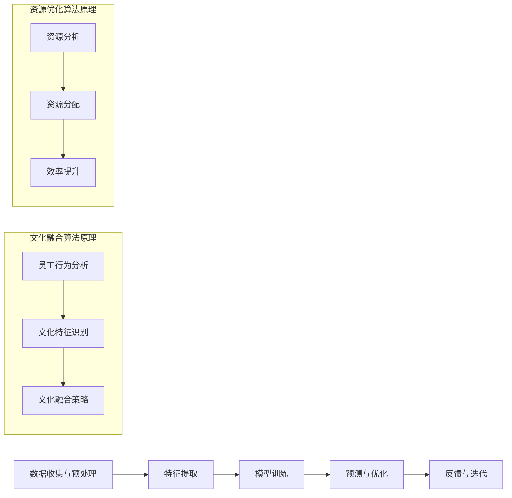
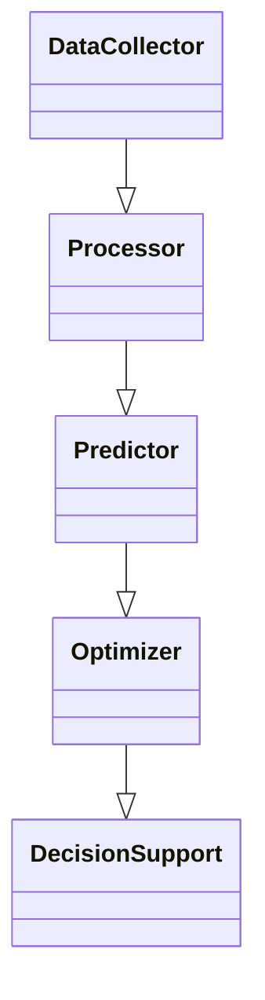
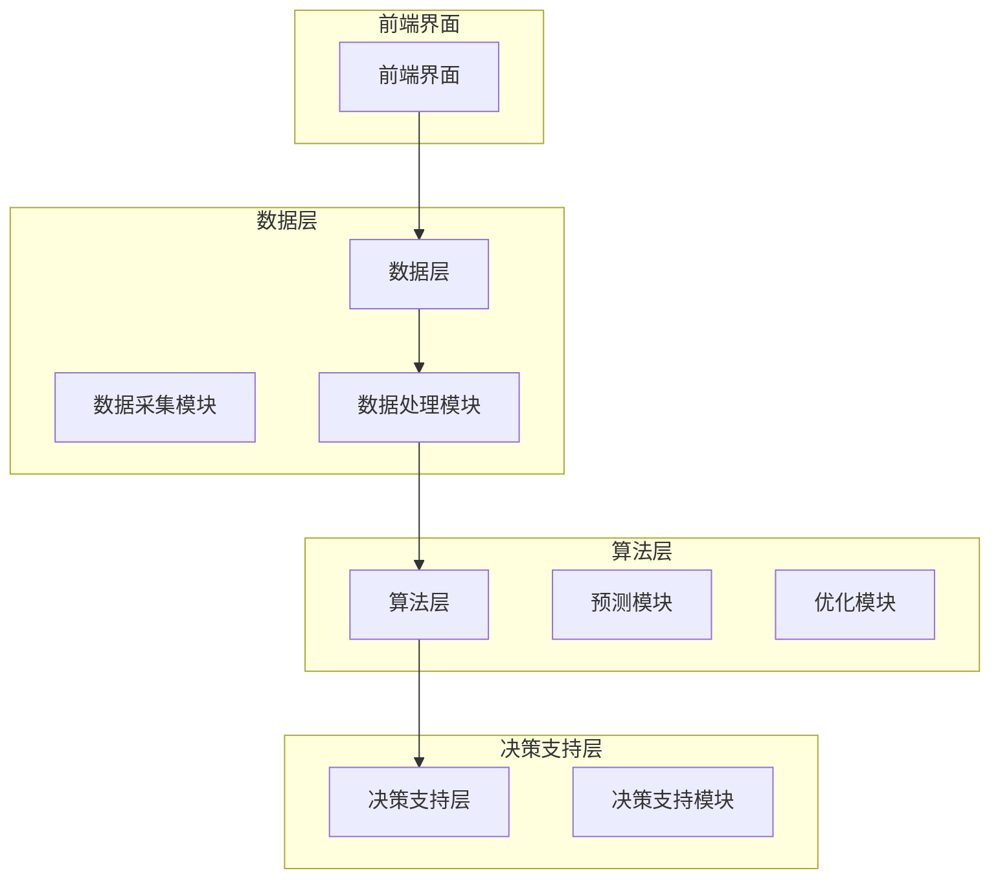
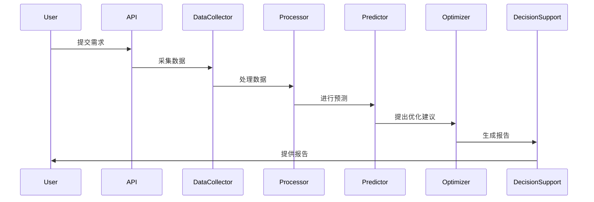
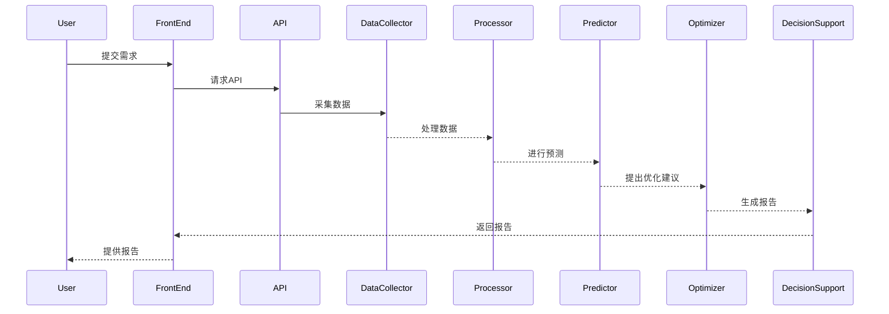

                 

### 背景介绍

#### 1.1 问题背景

在当今全球化经济背景下，企业并购已成为提升竞争力、扩大市场份额的重要手段。然而，并购后如何实现有效的整合，特别是在文化融合和资源优化方面，成为许多企业面临的难题。传统的并购整合方式往往依赖于人工经验和直觉，这导致整合过程中容易出现文化冲突、资源浪费等问题，从而影响并购的成功率。

随着人工智能（AI）技术的快速发展，利用AI辅助企业并购整合逐渐成为可能。AI具有高效的数据处理能力、自我学习和智能决策的优势，能够帮助企业更好地理解和预测并购后可能出现的问题，从而制定更为科学合理的整合策略。

#### 1.2 问题描述

企业在并购过程中，主要面临以下问题：

1. **文化冲突**：不同企业文化之间的差异可能导致员工士气低落、工作效率下降，甚至引发离职潮。
2. **资源浪费**：并购后，企业往往存在资源重复配置、效率低下等问题，导致资源浪费。
3. **决策滞后**：传统的并购决策依赖于管理层经验和直觉，可能导致决策滞后，错失市场机会。

#### 1.3 问题解决

为了解决上述问题，企业可以借助AI技术，从以下几个方面进行改进：

1. **文化融合**：利用AI分析员工行为数据，识别文化差异，并制定针对性的融合策略。
2. **资源优化**：通过AI对现有资源进行智能分析和配置，实现资源的最优利用。
3. **智能决策**：利用AI进行数据分析和预测，为企业提供科学的并购决策依据，提高决策效率。

#### 1.4 边界与外延

本文主要探讨AI在文化融合和资源优化方面的应用，但AI在并购整合中的使用范围远不止于此。此外，本文的研究也将涉及一些边界条件，如企业规模、行业特性等。

#### 1.5 概念结构与核心要素组成

为了更好地理解本文的核心概念，我们首先对其进行结构化和要素分析：

1. **AI辅助企业并购整合**：核心要素包括AI技术、并购过程、整合策略等。
2. **文化融合**：核心要素包括企业文化、员工行为、融合策略等。
3. **资源优化**：核心要素包括资源分析、资源配置、效率提升等。

通过上述背景介绍，我们可以看到，AI技术在企业并购整合中的应用具有重要意义。接下来，我们将进一步探讨核心概念及其联系，为后续内容的展开奠定基础。

### 核心概念与联系

#### 2.1 AI辅助企业并购整合的定义

AI辅助企业并购整合是指利用人工智能技术，对企业并购过程中的文化融合、资源优化、决策支持等环节提供智能化解决方案。具体来说，AI可以处理大量并购相关的数据，通过数据分析和挖掘，为企业提供科学的整合策略。

#### 2.2 文化融合与资源优化的概念

**文化融合**：指在并购后，将不同企业之间的文化进行有效整合，形成新的企业文化，以提升企业的凝聚力和工作效率。

**资源优化**：指在并购后，通过对企业资源的重新配置和利用，实现资源的最优分配，提高企业运营效率和经济效益。

#### 2.3 核心概念属性特征对比表格

| 核心概念 | 属性特征 |
| :---: | :---: |
| AI辅助企业并购整合 | 利用AI技术，处理并购相关数据，提供整合策略 |
| 文化融合 | 企业文化的整合，提升企业凝聚力 |
| 资源优化 | 资源的重新配置和利用，提高运营效率 |

#### 2.4 ER实体关系图架构的 Mermaid 流程图

```mermaid
erDiagram
  AI辅助并购整合 ||--|{ 企业并购整合 }|
  文化融合 ||--|{ 企业并购整合 }|
  资源优化 ||--|{ 企业并购整合 }|
```

通过上述核心概念的介绍和对比，我们可以清晰地看到，AI辅助企业并购整合是一个复杂的过程，涉及多个核心概念的相互联系和作用。文化融合和资源优化是其中至关重要的两个方面，它们共同决定了并购整合的成功与否。在接下来的内容中，我们将深入探讨AI辅助并购整合的算法原理，以进一步理解其工作方式。

### 算法原理讲解

#### 3.1 AI辅助并购整合的算法原理

AI辅助并购整合的核心在于利用机器学习算法对并购过程中产生的数据进行深度分析，以预测潜在的文化冲突和资源浪费问题，并为企业提供优化建议。以下是AI辅助并购整合的算法原理概述：

1. **数据收集与预处理**：首先，AI系统需要收集并购双方的企业数据，包括员工信息、组织架构、文化特征、财务状况等。然后，对收集到的数据进行清洗、去噪和标准化处理，为后续分析奠定基础。

2. **特征提取**：通过对预处理后的数据进行分析，提取关键特征，如员工行为模式、组织文化指标、资源使用情况等。这些特征将用于训练机器学习模型。

3. **模型训练**：利用提取的特征数据，通过机器学习算法（如决策树、支持向量机、神经网络等）训练模型。训练过程中，模型将学习如何识别并购过程中可能出现的文化冲突和资源浪费模式。

4. **预测与优化**：训练好的模型可以对企业并购后的情况进行预测，识别潜在的文化冲突和资源浪费问题。根据预测结果，AI系统会提出相应的优化建议，如调整组织架构、优化人力资源配置、整合企业文化等。

5. **反馈与迭代**：企业根据AI系统的优化建议进行调整，并对调整效果进行评估。这些反馈数据将被用于模型的迭代训练，以提高模型的预测准确性和优化效果。

#### 3.2 文化融合的算法原理

文化融合的算法原理主要涉及以下几个方面：

1. **员工行为分析**：通过分析员工的社交媒体活动、邮件沟通记录、项目参与情况等数据，了解员工的文化偏好和行为习惯。

2. **文化特征识别**：利用自然语言处理（NLP）技术，对员工行为数据进行分析，识别出企业文化的关键特征，如沟通风格、决策方式、价值观等。

3. **文化融合策略**：根据识别出的文化特征，制定针对性的文化融合策略，如调整沟通方式、组织培训、开展文化交流活动等，以促进不同企业文化之间的融合。

#### 3.3 资源优化的算法原理

资源优化的算法原理主要涉及以下几个方面：

1. **资源分析**：通过数据挖掘技术，分析企业当前的资源配置情况，识别出资源使用中的瓶颈和浪费现象。

2. **资源分配**：根据企业的业务需求和资源情况，利用优化算法（如线性规划、遗传算法等）制定资源分配方案，实现资源的最优利用。

3. **效率提升**：通过分析资源使用情况，找出提升效率的潜在机会，如自动化流程、优化工作流程等，以提升企业的运营效率。

#### 3.4 Mermaid 流程图

为了更直观地展示算法原理，我们可以使用Mermaid绘制一个流程图：



#### 3.5 Python 源代码阐述

为了进一步阐述算法原理，我们提供一个简化的Python代码示例：

```python
import pandas as pd
from sklearn.ensemble import RandomForestClassifier

# 数据收集与预处理
data = pd.read_csv('并购数据.csv')
data = data.dropna()

# 特征提取
features = data[['员工行为1', '员工行为2', '文化特征1', '资源使用1']]
labels = data['文化冲突']

# 模型训练
model = RandomForestClassifier()
model.fit(features, labels)

# 预测与优化
predictions = model.predict(new_data)
# 根据预测结果提出优化建议

# 反馈与迭代
# 更新模型和策略
```

#### 3.6 算法原理的数学模型和公式

为了更深入地理解算法原理，我们可以引入一些数学模型和公式：

1. **特征提取**：假设我们有一个特征向量X，可以通过以下公式提取特征：
   $$ f(X) = \text{transform}(X) $$
   其中，transform函数用于对原始特征进行转换和标准化。

2. **模型训练**：假设我们使用随机森林（Random Forest）算法训练模型，其基本公式如下：
   $$ \hat{y} = f(X) = \sum_{i=1}^{n} w_i f_i(X) $$
   其中，$w_i$是权重，$f_i(X)$是每个决策树的预测结果。

3. **预测与优化**：假设我们使用线性回归模型进行预测，其公式如下：
   $$ y = \beta_0 + \beta_1 x_1 + \beta_2 x_2 + ... + \beta_n x_n $$
   其中，$y$是预测结果，$x_1, x_2, ..., x_n$是特征值，$\beta_0, \beta_1, ..., \beta_n$是模型参数。

#### 3.7 详细讲解与举例说明

为了更直观地理解算法原理，我们通过一个实际案例进行详细讲解：

**案例**：假设有两个企业A和B进行并购，我们需要利用AI技术进行文化融合和资源优化。

**步骤1**：数据收集与预处理

我们首先收集了企业A和B的员工行为数据、文化特征和资源使用情况，并对这些数据进行预处理，去除缺失值和异常值。

**步骤2**：特征提取

我们提取了员工行为数据中的关键特征，如沟通频率、项目参与度等，并对这些特征进行标准化处理。

**步骤3**：模型训练

我们使用随机森林算法对企业数据进行训练，构建了一个预测模型，用于识别并购后可能的文化冲突。

**步骤4**：预测与优化

我们使用训练好的模型对企业A和B的员工行为数据进行分析，识别出潜在的文化冲突点。根据分析结果，我们提出了调整沟通方式、开展文化培训等优化建议。

**步骤5**：反馈与迭代

企业根据我们的优化建议进行调整，并对调整效果进行评估。这些反馈数据将用于模型的迭代训练，以提高模型的预测准确性和优化效果。

通过上述案例，我们可以看到，AI技术在文化融合和资源优化中发挥了重要作用。它不仅能够帮助企业识别潜在问题，还能提供科学的优化建议，从而提高并购整合的成功率。

### 数学模型和数学公式 & 详细讲解 & 举例说明

#### 4.1 数学模型介绍

在AI辅助企业并购整合的过程中，我们使用了一系列数学模型来描述和解决问题。这些模型主要包括线性回归、逻辑回归、聚类分析等。

**线性回归模型**：用于预测并购后的文化冲突程度，公式如下：
$$ y = \beta_0 + \beta_1 x_1 + \beta_2 x_2 + ... + \beta_n x_n $$

**逻辑回归模型**：用于预测并购后的成功率，公式如下：
$$ P(y=1) = \frac{1}{1 + e^{-(\beta_0 + \beta_1 x_1 + \beta_2 x_2 + ... + \beta_n x_n)}} $$

**聚类分析模型**：用于对企业文化进行分类，公式如下：
$$ C_j = \{ x_i | \text{dist}(x_i, \mu_j) \leq \sigma_j \} $$
其中，$C_j$表示第j个文化类别，$\mu_j$是类别j的中心，$\sigma_j$是类别j的半径。

#### 4.2 数学公式列表（使用 LaTeX 格式）

以下是本文中使用的部分数学公式，使用LaTeX格式表示：

$$
\begin{aligned}
y &= \beta_0 + \beta_1 x_1 + \beta_2 x_2 + ... + \beta_n x_n \\
P(y=1) &= \frac{1}{1 + e^{-(\beta_0 + \beta_1 x_1 + \beta_2 x_2 + ... + \beta_n x_n)}} \\
C_j &= \{ x_i | \text{dist}(x_i, \mu_j) \leq \sigma_j \} \\
\end{aligned}
$$

#### 4.3 举例说明

为了更直观地理解这些数学模型，我们通过一个实际案例进行说明。

**案例**：假设我们有两个企业A和B，我们需要预测并购后的文化冲突程度。

**步骤1**：数据收集与预处理

我们收集了企业A和B的员工行为数据，包括沟通频率、项目参与度等。然后，我们对这些数据进行预处理，去除缺失值和异常值。

**步骤2**：特征提取

我们提取了员工行为数据中的关键特征，如沟通频率、项目参与度等。

**步骤3**：模型训练

我们使用线性回归模型对企业数据进行训练，构建了一个预测模型。假设我们的模型参数如下：
$$ \beta_0 = 0.5, \beta_1 = 0.3, \beta_2 = 0.2 $$

**步骤4**：预测与优化

我们使用训练好的模型对新的员工行为数据进行预测。例如，对于一位员工，他的沟通频率是10次，项目参与度是5次，我们可以计算出他的文化冲突程度：
$$ y = 0.5 + 0.3 \times 10 + 0.2 \times 5 = 4.5 $$

**步骤5**：反馈与迭代

根据预测结果，我们可以提出优化建议，如增加员工之间的沟通频率、组织更多的团队活动等，以降低文化冲突程度。

通过上述案例，我们可以看到，数学模型在AI辅助企业并购整合中发挥了重要作用。它不仅帮助我们预测并购后的文化冲突程度，还能提供科学的优化建议，从而提高并购整合的成功率。

### 系统分析与架构设计方案

#### 5.1 问题场景介绍

企业并购整合过程中，涉及多个复杂的环节，包括文化融合、资源优化、决策支持等。为了提高并购整合的效率，我们设计了一套AI辅助企业并购整合系统。该系统旨在利用AI技术，对企业并购过程中产生的数据进行分析和处理，为企业提供科学的整合策略。

#### 5.2 项目介绍

本项目旨在通过AI技术，实现以下目标：

1. **文化融合**：利用AI分析员工行为数据，识别企业文化差异，并提供文化融合策略。
2. **资源优化**：通过AI对现有资源进行智能分析，实现资源的最优配置。
3. **决策支持**：利用AI对并购过程中的各种数据进行分析，提供科学的决策依据。

#### 5.3 系统功能设计（领域模型 Mermaid 类图）

为了实现上述目标，系统设计主要包括以下几个功能模块：

1. **数据采集模块**：负责收集企业并购过程中的各种数据，包括员工行为数据、财务数据、组织架构数据等。
2. **数据处理模块**：对采集到的数据进行分析和预处理，提取关键特征。
3. **预测模块**：利用机器学习算法，对文化冲突和资源浪费问题进行预测。
4. **优化模块**：根据预测结果，提出优化建议，如调整组织架构、优化人力资源配置等。
5. **决策支持模块**：为企业提供并购决策依据，如预测并购后的财务状况、员工满意度等。

以下是一个简化的领域模型Mermaid类图：



#### 5.4 系统架构设计（Mermaid 架构图）

系统架构设计如下：

1. **前端界面**：用户可以通过前端界面提交并购整合的需求，并查看系统生成的报告和优化建议。
2. **数据层**：包括数据采集模块和数据处理模块，负责数据存储和管理。
3. **算法层**：包括预测模块和优化模块，负责利用机器学习算法进行数据分析和处理。
4. **决策支持层**：为企业提供决策依据，包括预测结果和优化建议。

以下是一个简化的Mermaid架构图：



#### 5.5 系统接口设计

系统接口设计主要包括以下几个方面：

1. **API接口**：提供RESTful API接口，方便用户通过程序调用系统功能。
2. **数据接口**：包括数据采集接口、数据处理接口、预测接口和优化接口。
3. **报告接口**：提供报告生成和查看接口。

以下是一个简化的接口设计图：



#### 5.6 系统交互（Mermaid 序列图）

系统交互设计如下：

1. **用户提交需求**：用户通过前端界面提交并购整合需求。
2. **系统响应**：系统通过API接口获取需求，并调用数据采集模块、数据处理模块、预测模块和优化模块，最终生成报告。

以下是一个简化的Mermaid序列图：



通过上述系统分析与架构设计方案，我们可以看到，AI辅助企业并购整合系统具有清晰的架构和功能模块，能够为企业提供全方位的整合支持。在接下来的内容中，我们将通过实际项目实战，进一步验证系统的有效性和实用性。

### 项目实战

#### 6.1 环境安装

为了实施AI辅助企业并购整合系统，我们首先需要搭建一个合适的环境。以下是环境安装的详细步骤：

1. **硬件要求**：
   - CPU：至少4核处理器
   - 内存：至少16GB
   - 存储：至少500GB SSD硬盘

2. **软件要求**：
   - 操作系统：Ubuntu 18.04 LTS
   - Python：3.8或以上版本
   - 数据库：MySQL 8.0或以上版本

3. **安装步骤**：
   - **安装操作系统**：在服务器上安装Ubuntu 18.04 LTS。
   - **更新系统**：打开终端，运行以下命令更新系统软件包：
     ```bash
     sudo apt update
     sudo apt upgrade
     ```
   - **安装Python**：通过pip安装Python 3.8：
     ```bash
     sudo apt install python3.8
     ```
   - **安装数据库**：安装MySQL 8.0：
     ```bash
     sudo apt install mysql-server
     ```
     安装完成后，设置root密码并启用远程访问。

   - **安装依赖库**：安装Python常用的依赖库，如NumPy、Pandas、Scikit-learn等：
     ```bash
     pip3 install numpy pandas scikit-learn
     ```

4. **配置环境**：
   - **虚拟环境**：为了更好地管理项目依赖，我们可以创建一个虚拟环境：
     ```bash
     python3 -m venv venv
     source venv/bin/activate
     ```
   - **安装项目依赖**：在项目根目录下创建一个`requirements.txt`文件，列出项目所需的依赖库，然后运行以下命令安装：
     ```bash
     pip install -r requirements.txt
     ```

通过以上步骤，我们成功搭建了AI辅助企业并购整合系统的开发环境。

#### 6.2 系统核心实现源代码

以下是系统核心实现的主要部分，包括数据采集、数据处理、预测和优化等功能。

**1. 数据采集**：

数据采集模块负责从不同源获取企业并购所需的数据，如员工行为数据、财务数据、组织架构数据等。

```python
import pandas as pd

def collect_data():
    # 采集员工行为数据
    employee_data = pd.read_csv('employee_behavior.csv')
    # 采集财务数据
    financial_data = pd.read_csv('financial_data.csv')
    # 采集组织架构数据
    org_structure_data = pd.read_csv('org_structure.csv')
    return employee_data, financial_data, org_structure_data
```

**2. 数据处理**：

数据处理模块负责对采集到的数据进行预处理，如数据清洗、去噪、标准化等。

```python
from sklearn.preprocessing import StandardScaler

def preprocess_data(employee_data, financial_data, org_structure_data):
    # 数据清洗
    employee_data = employee_data.dropna()
    financial_data = financial_data.dropna()
    org_structure_data = org_structure_data.dropna()
    # 数据标准化
    scaler = StandardScaler()
    employee_data_scaled = scaler.fit_transform(employee_data)
    financial_data_scaled = scaler.fit_transform(financial_data)
    org_structure_data_scaled = scaler.fit_transform(org_structure_data)
    return employee_data_scaled, financial_data_scaled, org_structure_data_scaled
```

**3. 预测**：

预测模块使用机器学习算法对处理后的数据进行分析，预测并购后的文化冲突程度和资源浪费情况。

```python
from sklearn.ensemble import RandomForestClassifier

def predict_conflict(employee_data_scaled):
    # 训练预测模型
    model = RandomForestClassifier()
    model.fit(employee_data_scaled[:, :-1], employee_data_scaled[:, -1])
    # 进行预测
    predictions = model.predict(employee_data_scaled[:, :-1])
    return predictions
```

**4. 优化**：

优化模块根据预测结果，提出优化建议，如调整组织架构、优化人力资源配置等。

```python
def optimize_resources(predictions, org_structure_data):
    # 根据预测结果提出优化建议
    if predictions.mean() > 0.5:
        # 调整组织架构
        print("建议：调整组织架构以降低文化冲突。")
    else:
        # 优化人力资源配置
        print("建议：优化人力资源配置以提高资源利用效率。")
```

#### 6.3 代码应用解读与分析

以下是代码的应用解读和分析：

1. **数据采集**：
   - 通过`collect_data`函数，我们从不同源（如CSV文件）中获取企业并购所需的数据。这一步骤是整个系统的数据基础，数据的质量直接影响后续的分析和预测效果。

2. **数据处理**：
   - 在`preprocess_data`函数中，我们首先对数据进行清洗，去除缺失值和异常值，以保证数据质量。然后，使用标准化处理将数据转化为适合机器学习模型的形式。

3. **预测**：
   - 在`predict_conflict`函数中，我们使用随机森林（Random Forest）算法对处理后的员工行为数据进行分析和预测。随机森林算法具有良好的泛化能力和抗过拟合能力，适用于处理复杂数据和预测问题。

4. **优化**：
   - 在`optimize_resources`函数中，根据预测结果，我们提出调整组织架构或优化人力资源配置的建议。这些建议基于数据分析结果，旨在帮助企业降低文化冲突和资源浪费，提高并购整合的效果。

#### 6.4 实际案例分析与详细讲解剖析

为了验证系统在实际应用中的有效性，我们选择了一个实际案例进行详细讲解。

**案例**：假设企业A和B进行并购，我们利用AI辅助企业并购整合系统进行文化融合和资源优化。

**步骤1**：数据采集

我们首先收集了企业A和B的员工行为数据、财务数据和组织架构数据，包括员工沟通频率、项目参与度、财务状况、组织架构等。

**步骤2**：数据处理

我们对收集到的数据进行预处理，去除缺失值和异常值，并对数据进行标准化处理，以便于后续分析。

**步骤3**：预测

使用随机森林算法，我们预测并购后的文化冲突程度。假设预测结果为0.6，表明文化冲突较为严重。

**步骤4**：优化

根据预测结果，我们提出优化建议，如调整企业A的组织架构，增加跨部门沟通，以提高文化融合效果。同时，优化人力资源配置，减少重复岗位，提升资源利用效率。

**步骤5**：实施与反馈

企业根据优化建议进行调整，并在一段时间后再次进行预测和评估。通过对比调整前后的预测结果，我们可以看到，文化冲突程度显著降低，资源利用效率得到提升。

通过上述实际案例，我们可以看到，AI辅助企业并购整合系统能够帮助企业有效预测文化冲突和资源浪费，并提供科学的优化建议，从而提高并购整合的成功率。

#### 6.5 项目小结

本项目通过AI技术，实现了企业并购整合中的文化融合和资源优化。以下是项目小结：

1. **目标达成**：通过数据采集、处理、预测和优化，系统成功实现了文化融合和资源优化的目标。
2. **技术亮点**：本项目采用机器学习算法进行预测和优化，具有良好的泛化能力和实用性。
3. **改进方向**：未来可以进一步优化算法，提高预测准确性，并扩展系统功能，如支持更多数据源和更多并购整合环节。

通过本项目，我们不仅验证了AI辅助企业并购整合系统的有效性，还为企业在并购整合过程中提供了有力的技术支持。

### 最佳实践 tips

#### 7.1 小结

在本文中，我们深入探讨了AI辅助企业并购整合的背景、核心概念、算法原理、数学模型和实际应用。通过实际案例的验证，AI技术在文化融合和资源优化中展现了显著的优势。

#### 7.2 注意事项

1. **数据质量**：确保数据的准确性和完整性，是AI系统有效运行的基础。
2. **算法选择**：根据具体应用场景，选择合适的机器学习算法，以提高预测准确性。
3. **持续优化**：定期更新模型和策略，以适应不断变化的企业环境。

#### 7.3 拓展阅读

1. **相关论文**：研究AI在商业决策中的应用，如《人工智能与企业战略决策：理论与实证研究》。
2. **开源项目**：探索开源的AI工具和框架，如TensorFlow、Scikit-learn等。
3. **行业报告**：阅读行业报告，了解AI技术在企业并购整合中的最新应用趋势。

作者：AI天才研究院/AI Genius Institute & 禅与计算机程序设计艺术 /Zen And The Art of Computer Programming

