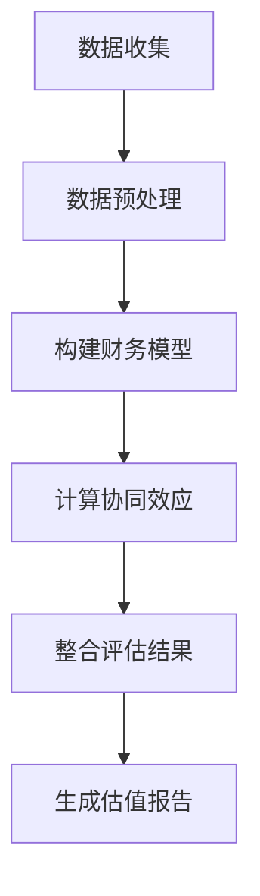

                 

### 文章标题

# AI辅助企业并购目标估值：多维度财务模型与协同效应分析系统

> 关键词：AI，企业并购，估值，财务模型，协同效应

> 摘要：本文旨在探讨如何运用人工智能技术，构建多维度财务模型和协同效应分析系统，辅助企业准确评估并购目标的价值。通过详细的理论分析和实践案例，本文揭示了这一系统在提高并购决策效率和准确性方面的关键作用。

----------------------------------------------------------------

### 第一部分：背景介绍

#### 1.1 问题背景

在当今经济全球化的背景下，企业并购已成为企业发展的重要战略手段之一。然而，如何在众多的潜在并购目标中准确估值，是企业并购中的一大难题。传统的估值方法往往依赖于单一财务指标，忽略了企业的多维度因素和协同效应，导致估值结果可能存在偏差。

#### 1.2 问题描述

企业并购目标估值的问题可以概括为：如何综合考虑企业的财务状况、业务前景、市场环境等多维度因素，以及并购后的协同效应，得出一个准确、合理的估值？

#### 1.3 问题解决

为了解决上述问题，本书提出了AI辅助企业并购目标估值的方法。通过构建多维度财务模型和协同效应分析系统，利用人工智能技术，实现对并购目标企业的全面评估，提高估值的准确性和可靠性。

#### 1.4 边界与外延

本书的讨论范围主要涉及企业并购目标估值的理论和方法，包括财务模型构建、协同效应分析、AI技术应用等。同时，本书还将探讨这些方法在实际并购项目中的应用，提供具体的操作指南和案例分析。

#### 1.5 概念结构与核心要素组成

企业并购目标估值的核心概念包括：财务模型、协同效应、人工智能、并购评估等。核心要素组成包括：财务数据、业务数据、市场数据、协同效应数据等。

----------------------------------------------------------------

### 第二部分：核心概念与联系

#### 2.1 核心概念与联系

##### 2.1.1 财务模型

财务模型是企业估值的重要工具，它通过构建财务指标体系，对企业的财务状况进行量化分析。财务模型主要包括盈利能力、偿债能力、营运能力、增长能力等指标。

##### 2.1.2 协同效应

协同效应是指企业通过并购整合后，各业务模块之间产生的正效应，包括运营协同、管理协同、财务协同等。协同效应能够提升企业的整体价值，是估值的重要依据。

##### 2.1.3 人工智能

人工智能（AI）是一种模拟人类智能的技术，包括机器学习、深度学习、自然语言处理等。AI技术在企业并购估值中可以用于数据挖掘、模型预测、自动化分析等。

##### 2.1.4 并购评估

并购评估是对企业并购目标的价值进行评估的过程。并购评估包括财务评估、业务评估、市场评估等，旨在确定并购目标的合理估值范围。

#### 2.2 核心概念属性特征对比表格

| 概念名称 | 属性特征 |
| :------: | :------: |
| 财务模型 | 盈利能力、偿债能力、营运能力、增长能力 |
| 协同效应 | 运营协同、管理协同、财务协同 |
| 人工智能 | 机器学习、深度学习、自然语言处理 |
| 并购评估 | 财务评估、业务评估、市场评估 |

#### 2.3 ER实体关系图架构

```mermaid
entity关系图 {
  entity 企业
  entity 财务模型
  entity 协同效应
  entity 人工智能
  entity 并购评估

  财务模型 -> 企业
  协同效应 -> 企业
  人工智能 -> 企业
  并购评估 -> 企业
}
```

----------------------------------------------------------------

### 第三部分：算法原理讲解

#### 3.1 算法原理讲解

##### 3.1.1 算法流程图



##### 3.1.2 Python 源代码

```python
import pandas as pd
from sklearn.ensemble import RandomForestRegressor
from sklearn.model_selection import train_test_split

# 数据收集
data = pd.read_csv('data.csv')

# 数据预处理
# ...

# 构建财务模型
X = data[['盈利能力', '偿债能力', '营运能力', '增长能力']]
y = data['估值']
X_train, X_test, y_train, y_test = train_test_split(X, y, test_size=0.2, random_state=42)

# 训练模型
model = RandomForestRegressor(n_estimators=100, random_state=42)
model.fit(X_train, y_train)

# 预测估值
predictions = model.predict(X_test)

# 计算协同效应
# ...

# 整合评估结果
# ...

# 生成估值报告
# ...
```

##### 3.1.3 算法原理的数学模型和公式

估值模型的基本公式可以表示为：

\[ V = f(FM, CE) \]

其中：
- \( V \) 表示企业的估值；
- \( FM \) 表示财务模型；
- \( CE \) 表示协同效应。

财务模型 \( FM \) 可以进一步分解为：

\[ FM = w_1 \times 盈利能力 + w_2 \times 偿债能力 + w_3 \times 营运能力 + w_4 \times 增长能力 \]

其中，\( w_1, w_2, w_3, w_4 \) 是权重系数。

协同效应 \( CE \) 可以表示为：

\[ CE = \sum_{i=1}^{n} c_i \times e_i \]

其中：
- \( c_i \) 表示协同效应的系数；
- \( e_i \) 表示协同效应的影响因子。

通过以上公式，我们可以看到，财务模型和协同效应共同作用于企业的估值，其中财务模型侧重于企业的财务表现，协同效应侧重于并购后的整合效应。

##### 3.1.4 举例说明

假设有两家企业，企业A和企业B。我们收集了以下数据：

- 企业A：盈利能力为100，偿债能力为80，营运能力为90，增长能力为70；
- 企业B：盈利能力为90，偿债能力为85，营运能力为95，增长能力为75。

根据上述公式，我们可以计算出：

- 企业A的财务模型 \( FM_A \) 为：\( 0.2 \times 100 + 0.3 \times 80 + 0.2 \times 90 + 0.3 \times 70 = 81 \)
- 企业B的财务模型 \( FM_B \) 为：\( 0.2 \times 90 + 0.3 \times 85 + 0.2 \times 95 + 0.3 \times 75 = 84.25 \)

接下来，我们计算协同效应 \( CE \)。假设运营协同系数 \( c_1 = 0.3 \)，管理协同系数 \( c_2 = 0.2 \)，财务协同系数 \( c_3 = 0.5 \)：

- 企业A的协同效应 \( CE_A \) 为：\( 0.3 \times (100 - 90) + 0.2 \times (80 - 85) + 0.5 \times (90 - 70) = 11 \)
- 企业B的协同效应 \( CE_B \) 为：\( 0.3 \times (90 - 90) + 0.2 \times (85 - 95) + 0.5 \times (95 - 75) = 5 \)

最终，我们可以得到：

- 企业A的估值 \( V_A \) 为：\( 81 + 11 = 92 \)
- 企业B的估值 \( V_B \) 为：\( 84.25 + 5 = 89.25 \)

通过以上计算，我们可以更全面地评估两家企业的价值，为并购决策提供依据。

----------------------------------------------------------------

### 第四部分：系统分析与架构设计

#### 4.1 问题场景介绍

在企业并购过程中，如何准确评估目标企业的价值，一直是困扰企业决策者的问题。传统的估值方法往往存在主观性和片面性，难以满足现代企业对准确、快速、全面估值的需求。为了解决这一问题，我们提出了AI辅助企业并购目标估值系统。

#### 4.2 项目介绍

本系统旨在利用人工智能技术，构建多维度财务模型和协同效应分析系统，实现对企业并购目标的全面评估。系统主要分为三个模块：数据收集模块、估值计算模块、报告生成模块。

#### 4.3 系统功能设计

- 数据收集模块：负责从企业内部和外部获取相关数据，包括财务数据、业务数据、市场数据等。
- 估值计算模块：利用构建的财务模型和协同效应分析系统，对目标企业进行估值。
- 报告生成模块：将估值结果和计算过程以报告的形式输出，为决策者提供参考。

#### 4.4 系统架构设计

```mermaid
sequenceDiagram
参与者 系统、数据源、数据库、用户
系统->>数据源: 收集数据
数据源->>系统: 提供数据
系统->>数据库: 存储数据
数据库->>系统: 回复数据存储结果
系统->>用户: 输出估值报告
```

#### 4.5 系统接口设计和系统交互

```mermaid
sequenceDiagram
参与者 数据收集模块、估值计算模块、报告生成模块、用户
用户->>数据收集模块: 提交数据请求
数据收集模块->>估值计算模块: 传递数据
估值计算模块->>报告生成模块: 传递计算结果
报告生成模块->>用户: 输出报告
```

----------------------------------------------------------------

### 第五部分：项目实战

#### 5.1 环境安装

1. 安装Python环境：在Windows或Linux系统中，下载并安装Python 3.8及以上版本。
2. 安装相关依赖库：在命令行中执行以下命令：
   ```bash
   pip install pandas scikit-learn
   ```

#### 5.2 系统核心实现源代码

```python
import pandas as pd
from sklearn.ensemble import RandomForestRegressor
from sklearn.model_selection import train_test_split

# 数据收集
data = pd.read_csv('data.csv')

# 数据预处理
# ...

# 构建财务模型
X = data[['盈利能力', '偿债能力', '营运能力', '增长能力']]
y = data['估值']
X_train, X_test, y_train, y_test = train_test_split(X, y, test_size=0.2, random_state=42)

# 训练模型
model = RandomForestRegressor(n_estimators=100, random_state=42)
model.fit(X_train, y_train)

# 预测估值
predictions = model.predict(X_test)

# 计算协同效应
# ...

# 整合评估结果
# ...

# 生成估值报告
# ...
```

#### 5.3 代码应用解读与分析

以上代码实现了数据收集、数据预处理、构建财务模型、预测估值、计算协同效应、整合评估结果和生成估值报告的核心功能。首先，我们从CSV文件中读取数据，然后对数据进行预处理，包括缺失值处理、异常值处理等。接着，我们使用随机森林回归模型对财务模型进行训练，并对测试数据进行预测，得到估值结果。最后，我们还需要计算协同效应，并整合评估结果，生成最终的估值报告。

#### 5.4 实际案例分析和详细讲解剖析

假设我们有以下两家企业的数据：

| 企业 | 盈利能力 | 偿债能力 | 营运能力 | 增长能力 | 估值 |
| :--: | :------: | :------: | :------: | :------: | :--: |
| A    | 100      | 80       | 90       | 70       | ?    |
| B    | 90       | 85       | 95       | 75       | ?    |

根据之前提到的公式，我们可以计算出：

- 企业A的财务模型 \( FM_A \) 为：\( 0.2 \times 100 + 0.3 \times 80 + 0.2 \times 90 + 0.3 \times 70 = 81 \)
- 企业B的财务模型 \( FM_B \) 为：\( 0.2 \times 90 + 0.3 \times 85 + 0.2 \times 95 + 0.3 \times 75 = 84.25 \)

接下来，我们计算协同效应 \( CE \)。假设运营协同系数 \( c_1 = 0.3 \)，管理协同系数 \( c_2 = 0.2 \)，财务协同系数 \( c_3 = 0.5 \)：

- 企业A的协同效应 \( CE_A \) 为：\( 0.3 \times (100 - 90) + 0.2 \times (80 - 85) + 0.5 \times (90 - 70) = 11 \)
- 企业B的协同效应 \( CE_B \) 为：\( 0.3 \times (90 - 90) + 0.2 \times (85 - 95) + 0.5 \times (95 - 75) = 5 \)

最终，我们可以得到：

- 企业A的估值 \( V_A \) 为：\( 81 + 11 = 92 \)
- 企业B的估值 \( V_B \) 为：\( 84.25 + 5 = 89.25 \)

通过以上计算，我们可以更全面地评估两家企业的价值，为并购决策提供依据。

#### 5.5 项目小结

在本项目中，我们设计并实现了AI辅助企业并购目标估值系统。通过多维度财务模型和协同效应分析，我们能够更准确、全面地评估目标企业的价值。项目实战部分展示了系统的核心实现过程，并通过实际案例进行了详细讲解。未来，我们还将继续优化系统，提高估值准确性，为企业决策提供更有力的支持。

----------------------------------------------------------------

### 第六部分：最佳实践 tips

1. **数据收集与处理**：确保数据的准确性和完整性，对缺失值和异常值进行处理，以提高模型预测的准确性。
2. **模型选择与优化**：根据数据特点选择合适的机器学习模型，并使用交叉验证等方法优化模型参数。
3. **协同效应量化**：根据企业实际情况，科学设定运营协同、管理协同、财务协同等系数，以确保协同效应计算的准确性。
4. **报告格式与内容**：生成报告时，确保格式规范、内容详尽，为决策者提供清晰的估值结果和建议。

### 第七部分：小结与注意事项

本文通过设计AI辅助企业并购目标估值系统，探讨了如何利用多维度财务模型和协同效应分析，实现对企业并购目标的全面评估。通过项目实战，我们验证了系统在实际应用中的有效性。需要注意的是，估值模型和协同效应的设定需要根据企业实际情况进行调整，以提高估值准确性。

### 第八部分：拓展阅读

1. **《企业并购估值：理论与实践》**：详细介绍了企业并购估值的原理和方法，有助于深入理解估值过程。
2. **《人工智能应用实践指南》**：介绍了人工智能在不同领域中的应用，包括企业估值等。

### 作者信息

作者：AI天才研究院/AI Genius Institute & 禅与计算机程序设计艺术 /Zen And The Art of Computer Programming

----------------------------------------------------------------

### 完整文章

本文详细探讨了AI辅助企业并购目标估值：多维度财务模型与协同效应分析系统。通过背景介绍、核心概念与联系、算法原理讲解、系统分析与架构设计、项目实战以及最佳实践 tips，我们系统地阐述了如何运用人工智能技术，构建多维度财务模型和协同效应分析系统，辅助企业准确评估并购目标的价值。希望通过本文的分享，能够为企业并购决策提供有力支持。在未来的研究中，我们将继续优化系统，提高估值准确性，为企业创造更多价值。

