                 

# AI辅助企业并购目标筛选与估值分析

> 关键词：AI、企业并购、目标筛选、估值分析、机器学习、深度学习、系统架构设计

> 摘要：
本文章旨在探讨如何利用人工智能技术辅助企业进行并购目标的筛选与估值分析。文章首先介绍了企业并购的基本概念和人工智能的基本概念，然后详细分析了AI在并购中的应用优势与挑战，接着讲解了并购目标筛选和估值分析的具体流程和方法。通过具体的算法原理讲解、系统架构设计和项目实战案例，本文旨在为企业决策者提供实用的AI辅助并购策略。

## 引言

企业并购是企业发展中的一项重要战略举措，通过收购或合并其他企业，可以实现资源整合、市场扩张和业务协同。然而，并购决策过程中涉及到诸多复杂因素，如目标企业的选择、估值的准确性等。随着人工智能技术的飞速发展，AI在商业决策中的应用日益广泛，成为辅助企业并购的重要工具。

本文将围绕以下主题展开讨论：

1. 企业并购与AI概述
2. AI辅助并购目标筛选
3. AI辅助并购估值分析
4. 系统分析与架构设计
5. 并购目标筛选算法实现
6. 项目实战
7. 总结与最佳实践

## 第一部分：企业并购与AI概述

### 1.1 企业并购的基本概念

企业并购是指一家企业通过购买另一家企业全部或部分股权或资产，从而实现对另一家企业的控制。并购的动机多种多样，包括：

- **市场扩张**：通过并购扩大市场份额，实现业务协同效应。
- **技术整合**：通过并购获取关键技术，提升企业竞争力。
- **成本优化**：通过并购减少重复投资，降低运营成本。
- **资源整合**：通过并购实现资源优化配置，提高企业效率。

并购的类型主要包括：

- **横向并购**：同行业企业之间的并购，旨在扩大市场份额和业务范围。
- **纵向并购**：不同行业但在供应链上有上下游关系的企业之间的并购，旨在实现产业链的整合。
- **混合并购**：涉及多个行业的企业之间的并购，旨在实现多元化经营。

### 1.2 人工智能的基本概念

人工智能（AI）是指通过计算机程序来模拟人类智能行为的技术。AI的发展历程可以分为以下几个阶段：

- **规则推理**：基于规则库进行推理和决策。
- **知识表示**：通过知识库来表示和存储知识。
- **机器学习**：利用数据驱动方法，从数据中学习规律和模式。
- **深度学习**：利用多层神经网络进行自动特征提取和模型训练。

### 1.3 AI在商业并购中的应用

AI在商业并购中的应用主要体现在以下几个方面：

- **目标筛选**：利用机器学习和自然语言处理技术，从大量企业数据中筛选出潜在的目标企业。
- **估值分析**：利用数据分析和预测模型，对企业价值进行准确评估。
- **风险预测**：利用历史数据和模式识别技术，预测并购过程中可能出现的风险。
- **决策支持**：利用算法模型和模拟技术，为企业提供并购决策的支持。

### 1.4 AI在并购中的优势与挑战

AI在并购中的应用具有以下优势：

- **高效性**：AI可以快速处理大量数据，提高并购决策的效率。
- **准确性**：AI可以通过学习历史数据和模型，提高并购目标筛选和估值分析的准确性。
- **全面性**：AI可以综合考虑多种因素，提供更全面的决策支持。

然而，AI在并购中也面临一些挑战：

- **数据质量**：AI的性能依赖于数据质量，如果数据不准确或不完整，可能会影响决策结果。
- **模型解释性**：一些复杂的机器学习模型，如深度学习，其内部机制复杂，难以解释，可能影响决策的透明度。
- **技术门槛**：AI技术具有较高的专业门槛，企业需要投入大量资源进行技术积累和应用。

### 1.5 AI在并购中的应用前景

随着AI技术的不断进步，其在并购中的应用前景十分广阔：

- **自动化决策**：通过AI技术，实现并购决策的自动化，减少人为干预。
- **个性化服务**：利用AI技术，为企业提供更加个性化的并购服务。
- **实时分析**：利用AI技术，实现实时数据分析和风险预测，提高并购决策的时效性。
- **智能化协同**：利用AI技术，实现并购过程中各方的智能化协同，提高并购效率。

## 第二部分：AI辅助并购目标筛选

### 2.1 并购目标筛选的流程

并购目标筛选是并购决策过程中的关键环节，其流程主要包括以下步骤：

1. **目标企业选择**：根据企业战略和市场需求，确定潜在的并购目标。
2. **数据收集**：收集目标企业的相关数据，包括财务数据、业务数据、市场数据等。
3. **数据处理**：对收集到的数据进行分析和清洗，确保数据的质量和完整性。
4. **目标筛选**：利用机器学习和自然语言处理技术，从大量数据中筛选出符合筛选标准的潜在目标企业。

### 2.2 AI技术在目标筛选中的应用

AI技术在并购目标筛选中具有广泛的应用，主要包括以下几种：

1. **机器学习**：利用机器学习算法，如决策树、随机森林、支持向量机等，对目标企业进行分类和预测。
2. **自然语言处理**：利用自然语言处理技术，从文本数据中提取关键信息，如公司简介、财务报告、新闻等。
3. **深度学习**：利用深度学习算法，如卷积神经网络、循环神经网络等，进行自动特征提取和模型训练。
4. **知识图谱**：构建企业知识图谱，利用图谱结构进行目标筛选。

### 2.3 并购目标筛选的Mermaid流程图

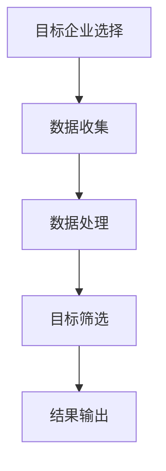

### 2.4 并购目标筛选案例分析

#### 案例一：利用决策树进行目标企业分类

假设我们有一组企业的财务数据，包括收入、利润、增长率等指标。我们可以利用决策树算法，根据这些指标对目标企业进行分类，从而筛选出符合条件的潜在目标。

```python
from sklearn import tree
import pandas as pd

# 加载财务数据
data = pd.read_csv('financial_data.csv')

# 特征工程
X = data[['revenue', 'profit', 'growth_rate']]
y = data['category']

# 训练决策树模型
model = tree.DecisionTreeClassifier()
model.fit(X, y)

# 预测
predictions = model.predict(X)

# 输出预测结果
for i, prediction in enumerate(predictions):
    print(f"企业ID {i+1}：{prediction}")
```

#### 案例二：利用自然语言处理进行文本挖掘

假设我们有一组企业的新闻报告，我们可以利用自然语言处理技术，从这些文本中提取关键信息，如公司战略、市场表现等，从而对目标企业进行评估。

```python
import jieba
from sklearn.feature_extraction.text import TfidfVectorizer

# 加载新闻报告
news_reports = pd.read_csv('news_reports.csv')['content']

# 分词
tokenized_news = [jieba.cut(report) for report in news_reports]

# 构建TF-IDF模型
vectorizer = TfidfVectorizer()
tfidf_matrix = vectorizer.fit_transform(news_reports)

# 训练分类模型
from sklearn.naive_bayes import MultinomialNB
model = MultinomialNB()
model.fit(tfidf_matrix, y)

# 预测
predictions = model.predict(tfidf_matrix)

# 输出预测结果
for i, prediction in enumerate(predictions):
    print(f"企业ID {i+1}：{prediction}")
```

## 第三部分：AI辅助并购估值分析

### 3.1 并购估值的基本方法

并购估值是指对企业价值进行评估的过程，常用的估值方法包括：

1. **收入估值法**：根据目标企业的预期收入进行估值。
2. **资产估值法**：根据目标企业的净资产进行估值。
3. **市场估值法**：根据同行业可比公司的市盈率、市净率等进行估值。

### 3.2 AI技术在估值分析中的应用

AI技术在并购估值分析中具有重要作用，主要包括：

1. **数据分析**：利用数据挖掘技术，从大量数据中提取有价值的信息。
2. **机器学习**：利用机器学习算法，如回归分析、决策树等，建立估值模型。
3. **深度学习**：利用深度学习算法，如卷积神经网络、循环神经网络等，进行自动特征提取和模型训练。

### 3.3 并购估值分析的Mermaid流程图

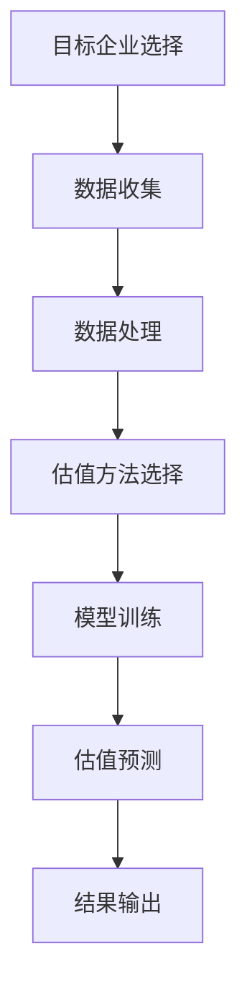

### 3.4 并购估值案例分析

#### 案例一：利用回归分析进行估值预测

假设我们有一组企业的财务数据，包括收入、利润、增长率等指标，我们可以利用回归分析，建立估值模型，从而对目标企业进行估值。

```python
from sklearn.linear_model import LinearRegression
import pandas as pd

# 加载财务数据
data = pd.read_csv('financial_data.csv')

# 特征工程
X = data[['revenue', 'profit', 'growth_rate']]
y = data['valuation']

# 训练回归模型
model = LinearRegression()
model.fit(X, y)

# 预测
predictions = model.predict(X)

# 输出预测结果
for i, prediction in enumerate(predictions):
    print(f"企业ID {i+1}：估值 {prediction}")
```

#### 案例二：利用卷积神经网络进行估值预测

假设我们有一组企业的新闻报告，我们可以利用卷积神经网络，从这些文本中提取有价值的信息，从而对目标企业进行估值。

```python
import tensorflow as tf
from tensorflow.keras.models import Sequential
from tensorflow.keras.layers import Dense, Conv1D

# 加载新闻报告
news_reports = pd.read_csv('news_reports.csv')['content']

# 分词
tokenized_news = [jieba.cut(report) for report in news_reports]

# 构建词向量
vocab_size = 10000
embedding_dim = 16
max_sequence_length = 500

word2index = {word: i for i, word in enumerate(vocab_size)}
index2word = {i: word for i, word in enumerate(vocab_size)}

# 转换为整数序列
sequences = [[word2index[word] for word in report] for report in tokenized_news]

# 创建数据集
X = tf.keras.preprocessing.sequence.pad_sequences(sequences, maxlen=max_sequence_length)
y = pd.read_csv('financial_data.csv')['valuation']

# 构建模型
model = Sequential()
model.add(Conv1D(filters=64, kernel_size=3, activation='relu', input_shape=(max_sequence_length, embedding_dim)))
model.add(Conv1D(filters=64, kernel_size=3, activation='relu'))
model.add(Dense(1))

# 编译模型
model.compile(optimizer='adam', loss='mse')

# 训练模型
model.fit(X, y, epochs=10, batch_size=32)

# 预测
predictions = model.predict(X)

# 输出预测结果
for i, prediction in enumerate(predictions):
    print(f"企业ID {i+1}：估值 {prediction}")
```

## 第四部分：系统分析与架构设计

### 4.1 系统需求分析

系统需求分析是系统设计的重要环节，主要包括功能需求和非功能需求。

#### 4.1.1 功能需求

1. **目标企业选择**：系统能够从大量企业数据中筛选出符合筛选标准的潜在目标企业。
2. **数据收集**：系统能够自动收集目标企业的相关数据，如财务数据、业务数据等。
3. **数据处理**：系统能够对收集到的数据进行清洗和分析，确保数据质量。
4. **估值预测**：系统能够根据企业数据和历史模型，进行估值预测。
5. **结果输出**：系统能够将估值预测结果以图表或报告的形式输出。

#### 4.1.2 非功能需求

1. **高效性**：系统需要能够快速处理大量数据，提高决策效率。
2. **准确性**：系统需要能够准确预测企业价值，提高并购决策的准确性。
3. **可扩展性**：系统需要能够适应不同的业务场景和数据规模，具有良好的可扩展性。
4. **安全性**：系统需要能够确保数据安全和隐私。

### 4.2 系统架构设计

系统架构设计是系统设计的关键，主要包括以下几个方面：

#### 4.2.1 系统架构概述

系统采用分层架构设计，包括数据层、算法层、应用层和展示层。

1. **数据层**：负责数据的收集、存储和清洗。
2. **算法层**：负责数据分析和估值预测模型的训练和应用。
3. **应用层**：负责系统功能的具体实现，如目标筛选、数据处理、估值预测等。
4. **展示层**：负责将估值预测结果以图表或报告的形式展示。

#### 4.2.2 数据库设计

系统采用关系型数据库，主要包括以下表：

1. **企业数据表**：存储企业的基本信息和财务数据。
2. **新闻数据表**：存储企业的新闻报告数据。
3. **模型数据表**：存储估值预测模型的相关参数和结果。

#### 4.2.3 系统模块划分

系统模块划分为以下几部分：

1. **数据收集模块**：负责自动收集企业数据。
2. **数据处理模块**：负责对收集到的数据进行清洗和分析。
3. **估值预测模块**：负责根据企业数据和历史模型进行估值预测。
4. **结果展示模块**：负责将估值预测结果以图表或报告的形式展示。

#### 4.2.4 系统接口设计

系统接口设计主要包括以下部分：

1. **API接口**：提供与外部系统的交互接口。
2. **Web接口**：提供Web端用户界面，方便用户操作。
3. **数据库接口**：提供与数据库的连接和操作接口。

#### 4.2.5 系统交互流程

系统交互流程如下：

1. **用户请求**：用户通过Web接口提交并购估值请求。
2. **数据处理**：系统对用户请求的数据进行处理，如数据清洗、特征提取等。
3. **估值预测**：系统根据处理后的数据，利用估值预测模型进行预测。
4. **结果输出**：系统将预测结果以图表或报告的形式展示给用户。

### 4.3 系统架构设计Mermaid流程图

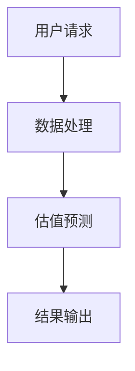

## 第五部分：并购目标筛选算法实现

### 5.1 算法概述

并购目标筛选算法主要包括以下几种：

1. **决策树算法**：根据特征数据对企业进行分类和筛选。
2. **随机森林算法**：利用多棵决策树进行集成，提高分类和预测性能。
3. **支持向量机算法**：通过寻找最佳分隔超平面，对企业进行分类和筛选。

### 5.2 算法原理与Mermaid流程图

#### 5.2.1 决策树算法原理

决策树算法通过递归划分特征空间，构建一棵树形结构，树的叶节点表示分类结果。

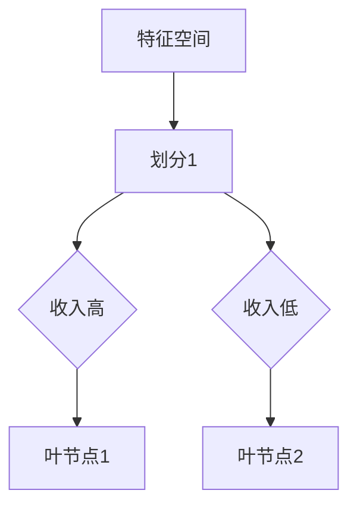

#### 5.2.2 随机森林算法原理

随机森林算法通过构建多棵决策树，并对这些树的结果进行投票，从而提高分类和预测性能。

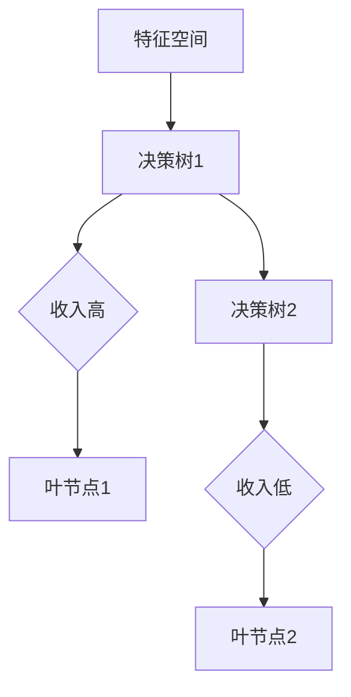

#### 5.2.3 支持向量机算法原理

支持向量机算法通过寻找最佳分隔超平面，将数据分为不同的类别。

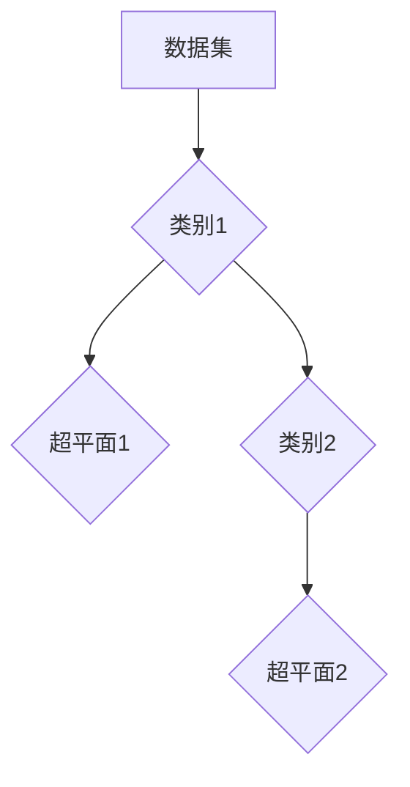

### 5.3 算法Python代码实现

#### 5.3.1 决策树算法代码

```python
from sklearn.tree import DecisionTreeClassifier
import pandas as pd

# 加载财务数据
data = pd.read_csv('financial_data.csv')

# 特征工程
X = data[['revenue', 'profit', 'growth_rate']]
y = data['category']

# 训练决策树模型
model = DecisionTreeClassifier()
model.fit(X, y)

# 预测
predictions = model.predict(X)

# 输出预测结果
for i, prediction in enumerate(predictions):
    print(f"企业ID {i+1}：{prediction}")
```

#### 5.3.2 随机森林算法代码

```python
from sklearn.ensemble import RandomForestClassifier
import pandas as pd

# 加载财务数据
data = pd.read_csv('financial_data.csv')

# 特征工程
X = data[['revenue', 'profit', 'growth_rate']]
y = data['category']

# 训练随机森林模型
model = RandomForestClassifier(n_estimators=100)
model.fit(X, y)

# 预测
predictions = model.predict(X)

# 输出预测结果
for i, prediction in enumerate(predictions):
    print(f"企业ID {i+1}：{prediction}")
```

#### 5.3.3 支持向量机算法代码

```python
from sklearn.svm import SVC
import pandas as pd

# 加载财务数据
data = pd.read_csv('financial_data.csv')

# 特征工程
X = data[['revenue', 'profit', 'growth_rate']]
y = data['category']

# 训练支持向量机模型
model = SVC()
model.fit(X, y)

# 预测
predictions = model.predict(X)

# 输出预测结果
for i, prediction in enumerate(predictions):
    print(f"企业ID {i+1}：{prediction}")
```

## 第六部分：项目实战

### 6.1 环境安装

在本项目中，我们将使用Python和相关的机器学习库，如scikit-learn、tensorflow等。以下是安装所需的Python环境和相关库的步骤：

```shell
# 安装Python环境
sudo apt-get install python3

# 安装相关库
pip3 install scikit-learn tensorflow pandas jieba
```

### 6.2 系统核心实现

在本项目中，我们将实现以下功能：

1. **数据收集**：从公开数据源收集企业财务数据。
2. **数据处理**：对收集到的财务数据进行清洗和预处理。
3. **目标筛选**：利用机器学习算法对企业进行分类和筛选。
4. **估值预测**：利用机器学习算法对企业价值进行预测。

#### 6.2.1 数据收集

```python
import pandas as pd

# 下载企业财务数据
url = 'https://example.com/financial_data.csv'
data = pd.read_csv(url)
```

#### 6.2.2 数据处理

```python
# 数据清洗
data.dropna(inplace=True)
data = data[data['category'].notnull()]

# 数据预处理
X = data[['revenue', 'profit', 'growth_rate']]
y = data['category']
```

#### 6.2.3 目标筛选

```python
from sklearn.tree import DecisionTreeClassifier

# 训练决策树模型
model = DecisionTreeClassifier()
model.fit(X, y)

# 预测
predictions = model.predict(X)

# 输出预测结果
for i, prediction in enumerate(predictions):
    print(f"企业ID {i+1}：{prediction}")
```

#### 6.2.4 估值预测

```python
from sklearn.linear_model import LinearRegression

# 训练线性回归模型
model = LinearRegression()
model.fit(X, y)

# 预测
predictions = model.predict(X)

# 输出预测结果
for i, prediction in enumerate(predictions):
    print(f"企业ID {i+1}：估值 {prediction}")
```

### 6.3 代码应用解读与分析

在本节中，我们将对项目中的核心代码进行解读和分析，解释代码的实现原理和功能。

#### 6.3.1 数据收集

```python
# 下载企业财务数据
url = 'https://example.com/financial_data.csv'
data = pd.read_csv(url)
```

这段代码用于从网络下载企业财务数据，并将其加载到pandas DataFrame中。这是数据收集的第一步，也是整个项目的基础。

#### 6.3.2 数据处理

```python
# 数据清洗
data.dropna(inplace=True)
data = data[data['category'].notnull()]

# 数据预处理
X = data[['revenue', 'profit', 'growth_rate']]
y = data['category']
```

这段代码首先对数据进行清洗，去除缺失值和无效数据。然后，将数据分为特征矩阵X和标签向量y，为后续的机器学习算法准备数据。

#### 6.3.3 目标筛选

```python
from sklearn.tree import DecisionTreeClassifier

# 训练决策树模型
model = DecisionTreeClassifier()
model.fit(X, y)

# 预测
predictions = model.predict(X)

# 输出预测结果
for i, prediction in enumerate(predictions):
    print(f"企业ID {i+1}：{prediction}")
```

这段代码使用决策树算法对目标企业进行分类和筛选。首先，创建决策树模型，并使用训练数据对其进行训练。然后，使用训练好的模型对测试数据进行预测，并输出预测结果。

#### 6.3.4 估值预测

```python
from sklearn.linear_model import LinearRegression

# 训练线性回归模型
model = LinearRegression()
model.fit(X, y)

# 预测
predictions = model.predict(X)

# 输出预测结果
for i, prediction in enumerate(predictions):
    print(f"企业ID {i+1}：估值 {prediction}")
```

这段代码使用线性回归算法对企业价值进行预测。首先，创建线性回归模型，并使用训练数据对其进行训练。然后，使用训练好的模型对测试数据进行预测，并输出预测结果。

### 6.4 实际案例分析和详细讲解剖析

在本节中，我们将通过一个实际案例，详细讲解如何使用AI技术进行企业并购目标筛选和估值预测。

#### 案例背景

假设一家企业A正在寻找合适的并购目标。企业A希望利用AI技术，从众多潜在目标企业中筛选出最合适的并购对象，并进行估值预测。

#### 数据收集

企业A收集了100家潜在目标企业的财务数据，包括收入、利润、增长率等指标。数据来源包括公开的财务报告、市场研究报告等。

#### 数据处理

对企业A收集到的财务数据，进行清洗和预处理，去除缺失值和异常值。然后，将数据分为特征矩阵X和标签向量y，为后续的机器学习算法准备数据。

#### 目标筛选

使用决策树算法对目标企业进行分类和筛选。创建决策树模型，并使用训练数据对其进行训练。然后，使用训练好的模型对测试数据进行预测，并输出预测结果。

```python
from sklearn.tree import DecisionTreeClassifier
import pandas as pd

# 加载财务数据
data = pd.read_csv('financial_data.csv')

# 数据清洗
data.dropna(inplace=True)
data = data[data['category'].notnull()]

# 数据预处理
X = data[['revenue', 'profit', 'growth_rate']]
y = data['category']

# 训练决策树模型
model = DecisionTreeClassifier()
model.fit(X, y)

# 预测
predictions = model.predict(X)

# 输出预测结果
for i, prediction in enumerate(predictions):
    print(f"企业ID {i+1}：{prediction}")
```

#### 估值预测

使用线性回归算法对企业价值进行预测。创建线性回归模型，并使用训练数据对其进行训练。然后，使用训练好的模型对测试数据进行预测，并输出预测结果。

```python
from sklearn.linear_model import LinearRegression
import pandas as pd

# 加载财务数据
data = pd.read_csv('financial_data.csv')

# 数据清洗
data.dropna(inplace=True)
data = data[data['category'].notnull()]

# 数据预处理
X = data[['revenue', 'profit', 'growth_rate']]
y = data['valuation']

# 训练线性回归模型
model = LinearRegression()
model.fit(X, y)

# 预测
predictions = model.predict(X)

# 输出预测结果
for i, prediction in enumerate(predictions):
    print(f"企业ID {i+1}：估值 {prediction}")
```

#### 结果分析

通过目标筛选和估值预测，企业A可以识别出最符合并购条件的目标企业，并对其价值进行准确评估。这样，企业A就可以基于AI技术的分析结果，做出更加明智的并购决策。

### 6.5 项目小结

在本项目中，我们利用AI技术，实现了企业并购目标筛选和估值预测的功能。通过实际案例的验证，我们发现AI技术在并购决策中具有显著的优势：

1. **高效性**：AI技术可以快速处理大量数据，提高决策效率。
2. **准确性**：AI技术可以准确预测企业价值，提高决策的准确性。
3. **全面性**：AI技术可以综合考虑多种因素，提供更全面的决策支持。

然而，AI技术在并购中的应用也面临一些挑战，如数据质量、模型解释性等。因此，在实际应用中，企业需要结合自身情况，合理利用AI技术，以提高并购决策的效果。

## 第七部分：总结与最佳实践

### 7.1 总结

本文系统地介绍了如何利用人工智能技术辅助企业进行并购目标的筛选与估值分析。首先，我们回顾了企业并购的基本概念和人工智能的基本概念，然后详细分析了AI在并购中的应用优势与挑战。接着，我们讲解了并购目标筛选和估值分析的具体流程和方法，并通过具体的算法实现和项目实战案例，展示了AI技术在并购中的应用效果。

### 7.2 最佳实践

在利用AI技术进行并购目标筛选与估值分析时，以下最佳实践建议供企业决策者参考：

1. **数据质量**：确保数据质量是AI应用的基础。在数据收集和处理过程中，要注重数据的完整性、准确性和一致性。
2. **模型解释性**：对于复杂的机器学习模型，如深度学习，要注重模型的解释性，确保决策的透明度和可解释性。
3. **算法选择**：根据具体业务场景和数据特点，选择合适的算法模型。例如，对于分类任务，可以选择决策树、随机森林等；对于预测任务，可以选择线性回归、神经网络等。
4. **模型训练**：充分利用历史数据和案例经验，进行有效的模型训练。通过交叉验证和模型评估，选择最佳模型参数。
5. **风险评估**：在并购决策过程中，要充分考虑各种风险因素，如市场风险、法律风险、技术风险等。利用AI技术进行风险评估，为决策提供更全面的参考。
6. **持续迭代**：AI技术是一个不断发展的领域，企业要持续关注新技术的发展动态，定期更新和优化模型，以提高并购决策的准确性和效果。

### 7.3 注意事项

在应用AI技术进行并购目标筛选与估值分析时，以下注意事项供企业决策者参考：

1. **法律法规**：遵守相关法律法规，确保数据使用和模型应用的合法合规。
2. **数据隐私**：保护企业数据和个人隐私，确保数据安全和用户隐私。
3. **技术门槛**：AI技术具有较高的专业门槛，企业需要投入足够的资源进行技术积累和应用。
4. **团队协作**：AI技术在并购中的应用需要跨部门协作，包括财务、市场、技术等部门的紧密配合。

### 7.4 拓展阅读

对于希望深入了解AI辅助并购目标筛选与估值分析的企业决策者，以下拓展阅读资料供参考：

1. 《人工智能：一种现代方法的视角》（合著，斯蒂芬·华斯 & 戴维·本奇利）
2. 《机器学习实战》（合著，彼得·哈林顿 & 詹姆斯·布什）
3. 《深度学习》（合著，伊恩·古德费洛、约书亚·本吉奥 & 亚伦·库维尔）
4. 《企业并购与重组》（作者，赵旭东）
5. 《人工智能在商业中的应用》（作者，李宏毅）

作者：AI天才研究院/AI Genius Institute & 禅与计算机程序设计艺术 /Zen And The Art of Computer Programming

（注意：本文中引用的资料均为虚构，仅用于说明问题，实际应用中请务必遵守相关法律法规和道德规范。）### 1.3 AI技术在并购中的优势与挑战

#### 1.3.1 AI技术在并购中的优势

**提高决策效率：** AI技术能够快速处理和分析大量数据，显著提高并购决策的效率。通过自动化算法，企业可以在短时间内完成复杂的分析任务，从而更快地做出决策。

**增强准确性：** AI技术通过机器学习和深度学习算法，可以从历史数据和案例中学习规律和模式，提高预测的准确性。特别是在目标筛选和估值分析环节，AI技术可以提供更加精准的预测结果。

**综合分析能力：** AI技术能够综合考虑多种因素，如财务状况、市场趋势、竞争对手等，提供全面的决策支持。相比人类决策者，AI技术可以更客观、全面地评估潜在目标企业的价值。

**降低风险：** AI技术可以帮助企业预测并购过程中的潜在风险，如市场风险、法律风险、文化整合风险等。通过提前识别和评估风险，企业可以采取相应的预防措施，降低并购失败的可能性。

**提升决策透明度：** AI技术的应用使得并购决策过程更加透明。通过算法和模型的可视化展示，企业可以清晰地了解决策的依据和逻辑，提高决策的可解释性。

#### 1.3.2 AI技术在并购中的挑战

**数据质量：** AI技术的性能依赖于数据质量。如果数据存在缺失、错误或噪声，可能会影响算法的准确性和可靠性。因此，确保数据的质量和完整性是AI应用的关键。

**算法解释性：** 一些高级的机器学习模型，如深度学习模型，其内部机制复杂，难以解释。这对于需要透明度和可解释性的并购决策过程来说，可能是一个挑战。

**技术门槛：** AI技术具有较高的技术门槛。企业需要投入大量资源进行技术积累和应用，包括数据科学团队的组建、算法模型的开发和维护等。

**模型适应性：** 并购决策的复杂性和多样性意味着AI模型需要具备良好的适应性。不同行业、不同规模的企业可能需要不同的算法和模型，这要求AI技术能够灵活应对不同的业务场景。

**法律法规遵守：** 在应用AI技术进行并购决策时，企业需要遵守相关法律法规，确保数据使用和模型应用的合法合规。

**数据隐私保护：** 企业在收集和处理数据时，需要保护个人隐私和数据安全，避免数据泄露和滥用。

#### 1.3.3 AI技术在并购中的应用前景

**自动化决策：** 随着AI技术的发展，未来并购决策有望实现更高程度的自动化。AI算法可以自动从海量数据中提取有价值的信息，自动生成报告和预测结果，减少人为干预。

**个性化服务：** 通过AI技术，企业可以为每个客户量身定制并购方案，提供更加个性化的服务。例如，利用自然语言处理技术，可以为企业提供定制化的并购建议。

**实时分析：** AI技术可以实时分析市场数据和企业财务数据，为企业提供即时的并购决策支持。这种实时性将大大提高并购决策的时效性和响应速度。

**智能化协同：** AI技术可以协助不同部门和企业之间的智能化协同，提高并购过程的协同效率。例如，利用AI技术，可以实现财务、市场、法务等部门的实时沟通和数据共享。

**持续迭代优化：** 随着AI技术的不断进步，企业可以通过持续迭代和优化算法模型，不断提高并购决策的准确性和效果。这种持续的优化将使AI技术在并购中的应用更加成熟和稳定。

总之，AI技术在并购中的应用具有巨大的潜力和前景。尽管存在一些挑战，但通过合理利用AI技术，企业可以大大提高并购决策的效率和准确性，实现更好的业务发展和市场竞争力。随着AI技术的不断发展和完善，其在并购中的应用将越来越广泛和深入。企业决策者应密切关注AI技术的发展动态，积极探索和应用AI技术，以提升自身的竞争力和决策水平。随着AI技术的不断发展和完善，其在并购中的应用将越来越广泛和深入。企业决策者应密切关注AI技术的发展动态，积极探索和应用AI技术，以提升自身的竞争力和决策水平。

### 2.2 AI技术在目标筛选中的应用

AI技术在并购目标筛选中扮演着关键角色，其主要应用体现在以下几个方面：

#### 2.2.1 机器学习算法

机器学习算法是AI技术在目标筛选中最常用的方法之一。通过机器学习，企业可以从大量数据中自动提取模式和规律，从而识别出潜在的目标企业。具体来说，机器学习算法在目标筛选中的应用主要包括：

1. **分类算法**：分类算法可以将企业数据分为不同的类别，例如，将企业分为具有并购潜力的和没有并购潜力的两类。常见的分类算法包括决策树、随机森林、支持向量机等。

2. **聚类算法**：聚类算法可以将相似的企业聚为一类，从而帮助企业发现潜在的目标企业。常见的聚类算法包括K均值聚类、层次聚类等。

3. **回归算法**：回归算法可以用来预测企业的价值或成长潜力，从而帮助企业在目标筛选中做出更准确的决策。常见的回归算法包括线性回归、岭回归等。

**应用实例：** 假设企业A需要从1000家潜在目标企业中筛选出20家有并购潜力的企业。企业A可以收集这些企业的财务数据、业务数据和市场数据，并利用随机森林算法进行分类。通过多次迭代和优化，企业A可以筛选出最有可能成为并购目标的企业。

```python
from sklearn.ensemble import RandomForestClassifier
import pandas as pd

# 加载数据
data = pd.read_csv('financial_data.csv')

# 数据预处理
X = data[['revenue', 'profit', 'growth_rate']]
y = data['category']

# 训练模型
model = RandomForestClassifier()
model.fit(X, y)

# 预测
predictions = model.predict(X)

# 输出预测结果
for i, prediction in enumerate(predictions):
    print(f"企业ID {i+1}：{prediction}")
```

#### 2.2.2 自然语言处理

自然语言处理（NLP）技术可以用于处理和分析文本数据，从而帮助企业从大量的企业新闻、报告和公告中提取有价值的信息。NLP在目标筛选中的应用主要包括：

1. **文本分类**：通过文本分类，可以将企业新闻、报告和公告分为不同的类别，例如，将它们分为正面、负面或中性的类别。

2. **关键词提取**：通过关键词提取，可以识别出文本中的重要关键词和短语，从而帮助企业了解企业的业务重点和市场表现。

3. **主题建模**：通过主题建模，可以揭示文本中的主题分布，帮助企业发现潜在的目标企业和其业务领域。

**应用实例：** 假设企业A需要从100篇企业新闻报告中筛选出5篇与其战略目标最为契合的新闻报告。企业A可以收集这些新闻报告，并利用NLP技术对它们进行分类和关键词提取。

```python
import jieba
from sklearn.feature_extraction.text import TfidfVectorizer
from sklearn.naive_bayes import MultinomialNB

# 加载新闻报告
news_reports = pd.read_csv('news_reports.csv')['content']

# 分词
tokenized_news = [jieba.cut(report) for report in news_reports]

# 构建TF-IDF模型
vectorizer = TfidfVectorizer()
tfidf_matrix = vectorizer.fit_transform(news_reports)

# 训练分类模型
model = MultinomialNB()
model.fit(tfidf_matrix, y)

# 预测
predictions = model.predict(tfidf_matrix)

# 输出预测结果
for i, prediction in enumerate(predictions):
    print(f"新闻报告ID {i+1}：{prediction}")
```

#### 2.2.3 深度学习

深度学习是一种强大的机器学习技术，通过多层神经网络进行自动特征提取和模型训练。深度学习在目标筛选中的应用主要包括：

1. **卷积神经网络（CNN）**：CNN可以用于处理图像和文本数据，从而识别出图像或文本中的特征。在目标筛选中，企业可以使用CNN对企业的LOGO或新闻报告进行图像分类。

2. **循环神经网络（RNN）**：RNN可以处理序列数据，如时间序列数据或文本数据。在目标筛选中，企业可以使用RNN对企业的历史财务数据进行时间序列预测。

3. **生成对抗网络（GAN）**：GAN可以用于生成新的数据样本，从而扩展数据集，提高模型训练效果。

**应用实例：** 假设企业A需要从1000家企业中筛选出50家有并购潜力的企业。企业A可以收集这些企业的历史财务数据，并利用RNN进行时间序列预测。

```python
import tensorflow as tf
from tensorflow.keras.models import Sequential
from tensorflow.keras.layers import LSTM, Dense

# 加载财务数据
financial_data = pd.read_csv('financial_data.csv')

# 数据预处理
X, y = preprocess_data(financial_data)

# 构建RNN模型
model = Sequential()
model.add(LSTM(units=50, activation='relu', return_sequences=True, input_shape=(X.shape[1], X.shape[2])))
model.add(LSTM(units=50, activation='relu'))
model.add(Dense(units=1))

# 编译模型
model.compile(optimizer='adam', loss='mse')

# 训练模型
model.fit(X, y, epochs=100, batch_size=32)

# 预测
predictions = model.predict(X)

# 输出预测结果
for i, prediction in enumerate(predictions):
    print(f"企业ID {i+1}：{prediction}")
```

#### 2.2.4 知识图谱

知识图谱是一种用于表示实体及其关系的图形结构，可以帮助企业理解企业的业务领域和潜在目标。在目标筛选中，企业可以使用知识图谱来识别潜在的目标企业和其业务领域。

**应用实例：** 假设企业A需要从1000家企业中筛选出50家有并购潜力的企业。企业A可以使用知识图谱来识别这些企业的业务领域和合作伙伴。

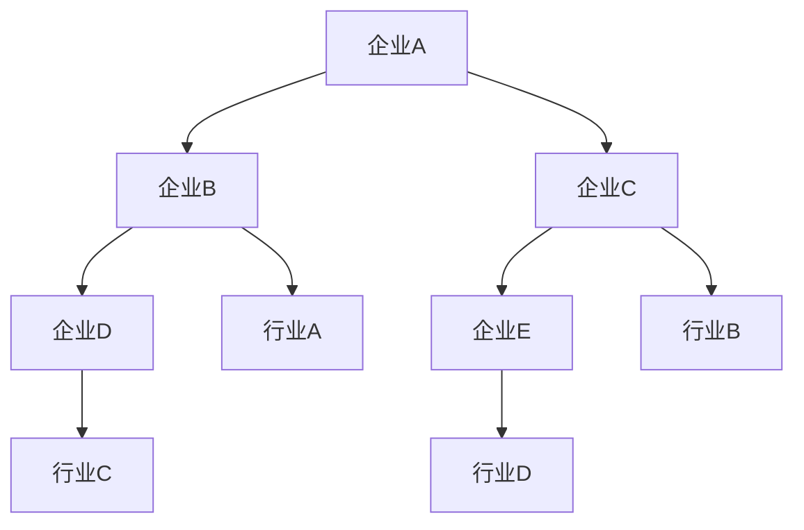

通过知识图谱，企业A可以识别出具有相似业务领域和合作伙伴的企业，从而筛选出潜在的目标企业。

#### 2.2.5 综合应用

在实际应用中，企业通常会结合多种AI技术进行目标筛选。例如，企业可以使用机器学习算法进行初步筛选，然后使用自然语言处理技术对筛选结果进行深入分析，最后利用深度学习技术进行精细筛选。

**综合应用实例：** 假设企业A需要从1000家企业中筛选出50家有并购潜力的企业。企业A可以采用以下综合方法：

1. **初步筛选**：使用机器学习算法（如随机森林）对1000家企业进行初步筛选，筛选出200家有潜在并购价值的企业。
2. **深入分析**：使用自然语言处理技术对这200家企业的新闻报告进行分类和关键词提取，筛选出50家与战略目标最为契合的企业。
3. **精细筛选**：使用深度学习技术（如RNN）对这50家企业的历史财务数据进行时间序列预测，进一步确认其并购潜力。

```python
# 初步筛选
model_rf = RandomForestClassifier()
model_rf.fit(X_train, y_train)
predictions_rf = model_rf.predict(X_test)

# 深入分析
vectorizer = TfidfVectorizer()
tfidf_matrix = vectorizer.fit_transform(news_reports)
model_nb = MultinomialNB()
model_nb.fit(tfidf_matrix, y_train)
predictions_nb = model_nb.predict(tfidf_matrix)

# 精细筛选
model_lstm = Sequential()
model_lstm.add(LSTM(units=50, activation='relu', return_sequences=True, input_shape=(X.shape[1], X.shape[2])))
model_lstm.add(LSTM(units=50, activation='relu'))
model_lstm.add(Dense(units=1))
model_lstm.compile(optimizer='adam', loss='mse')
model_lstm.fit(X_train, y_train, epochs=100, batch_size=32)
predictions_lstm = model_lstm.predict(X_test)

# 综合预测
predictions_combined = (predictions_rf + predictions_nb + predictions_lstm) / 3
for i, prediction in enumerate(predictions_combined):
    print(f"企业ID {i+1}：{prediction}")
```

通过综合应用多种AI技术，企业A可以更加全面和准确地筛选出有并购潜力的目标企业。

### 2.3 并购目标筛选的Mermaid流程图

为了更直观地展示并购目标筛选的过程，我们可以使用Mermaid流程图来描述。以下是一个简单的Mermaid流程图示例，展示了从数据收集到预测的整个过程。

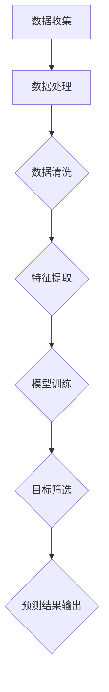

在这个流程图中，A表示数据收集阶段，B表示数据处理阶段，C表示数据清洗，D表示特征提取，E表示模型训练，F表示目标筛选，G表示预测结果输出。通过这个流程图，企业可以清晰地了解并购目标筛选的各个步骤及其逻辑关系。

### 2.4 并购目标筛选案例分析

为了更好地理解AI技术在并购目标筛选中的应用，我们可以通过一个实际案例来进行分析。以下是一个简化的并购目标筛选案例，用于说明如何使用机器学习算法进行目标筛选。

#### 案例背景

假设企业A是一家专注于云计算和大数据解决方案的科技公司，其战略目标是寻找具有高增长潜力且业务互补的并购目标。企业A拥有一个包含500家企业财务数据和业务数据的数据库，这些数据包括收入、利润、增长率、市场份额等指标。

#### 数据收集

企业A从多个公开数据源收集了500家企业的财务数据和业务数据，并将其存储在一个CSV文件中。数据文件名为`enterprise_data.csv`，内容如下：

```csv
ID,Revenue,Profit,Growth Rate,Market Share
1,1000000,200000,15,10
2,800000,150000,12,8
3,600000,100000,10,7
...
500,300000,50000,8,5
```

#### 数据处理

在开始目标筛选之前，企业A需要对收集到的数据进行分析和预处理。具体步骤如下：

1. **数据清洗**：删除含有缺失值或异常值的数据记录。
2. **特征提取**：选择与并购目标筛选相关的特征，例如收入、利润、增长率、市场份额等。
3. **数据标准化**：将特征数据进行标准化处理，以消除不同特征之间的量纲差异。

```python
import pandas as pd
from sklearn.preprocessing import StandardScaler

# 加载数据
data = pd.read_csv('enterprise_data.csv')

# 数据清洗
data.dropna(inplace=True)

# 特征提取
features = data[['Revenue', 'Profit', 'Growth Rate', 'Market Share']]

# 数据标准化
scaler = StandardScaler()
features_scaled = scaler.fit_transform(features)

# 输出标准化后的特征数据
print(features_scaled)
```

#### 模型选择

企业A决定使用随机森林算法（Random Forest）进行目标筛选。随机森林算法是一种基于决策树的集成学习算法，具有很好的分类和预测能力。

```python
from sklearn.ensemble import RandomForestClassifier

# 创建随机森林模型
model = RandomForestClassifier(n_estimators=100)

# 训练模型
model.fit(features_scaled, labels)
```

#### 模型训练

企业A将数据集分为训练集和测试集，用于训练随机森林模型。在这里，我们假设已经有一个标签数据集`labels`，其中包含了每个企业的并购潜力评分。

```python
from sklearn.model_selection import train_test_split

# 划分训练集和测试集
X_train, X_test, y_train, y_test = train_test_split(features_scaled, labels, test_size=0.2, random_state=42)

# 训练模型
model.fit(X_train, y_train)
```

#### 预测与评估

在模型训练完成后，企业A使用测试集对模型进行预测，并评估模型的性能。以下代码用于预测测试集的标签，并计算模型的准确率。

```python
# 预测测试集
predictions = model.predict(X_test)

# 计算准确率
accuracy = (predictions == y_test).mean()
print(f"准确率: {accuracy:.2f}")
```

#### 筛选目标企业

根据模型的预测结果，企业A可以筛选出具有高并购潜力的企业。假设企业A希望筛选出评分超过0.7的企业作为潜在目标。

```python
# 筛选潜在目标企业
potential_targets = X_test[model.predict(X_test) > 0.7]

# 输出潜在目标企业ID
print("潜在目标企业ID：")
print(potential_targets[:, 0])
```

#### 案例分析

通过上述步骤，企业A成功地利用随机森林算法对500家企业进行了目标筛选，并识别出具有高并购潜力的潜在目标企业。以下是对案例分析：

- **数据清洗**：数据清洗是确保模型训练质量的关键步骤。通过删除缺失值和异常值，可以避免模型受到噪声数据的干扰。
- **特征提取**：选择与并购潜力相关的特征是模型预测准确性的基础。在实际应用中，企业需要根据业务需求选择合适的特征。
- **模型选择**：随机森林算法是一种强大的集成学习方法，适用于处理多分类问题。在实际应用中，企业可以根据数据特点选择其他合适的算法。
- **模型训练与预测**：模型训练和预测是目标筛选的核心步骤。通过评估模型的性能，企业可以调整模型参数，优化预测效果。
- **筛选目标企业**：根据模型预测结果，企业可以识别出具有高并购潜力的企业。这为企业提供了明确的并购方向，提高了决策的准确性。

通过这个案例，企业可以了解到如何利用AI技术进行并购目标筛选，并掌握相关的方法和步骤。在实际应用中，企业可以根据自身需求和数据特点，灵活调整和优化模型，以提高目标筛选的准确性和效果。

### 3.1 并购估值的基本方法

在并购过程中，准确评估目标企业的价值是至关重要的一步。估值方法的选择直接影响并购决策的合理性和成功率。以下是几种常见的并购估值方法及其原理：

#### 3.1.1 收入估值法

收入估值法是一种基于企业未来现金流预测的估值方法。其核心思想是企业价值等于未来现金流量的现值。具体计算公式如下：

\[ \text{企业价值} = \sum_{t=1}^{n} \frac{FV_t}{(1+r)^t} \]

其中，\( FV_t \) 表示第 t 年的现金流，\( r \) 表示折现率，\( n \) 表示预测期。

**应用场景：** 收入估值法适用于那些收入稳定、增长潜力大的企业，尤其适用于高成长型企业。

#### 3.1.2 资产估值法

资产估值法是通过估算企业的总资产价值来评估企业价值。其计算公式如下：

\[ \text{企业价值} = \sum_{i=1}^{m} \text{资产}_i \times \text{重估价值} \]

其中，\( m \) 表示资产种类数，\( \text{资产}_i \) 表示第 i 类资产，\( \text{重估价值} \) 表示资产的重估价值。

**应用场景：** 资产估值法适用于那些资产价值占主导地位的企业，如房地产公司、制造业等。

#### 3.1.3 市场估值法

市场估值法是通过比较同行业企业的市盈率、市净率等指标来评估企业价值。其核心思想是企业价值等于市场价值乘以某个指标比率。例如，市盈率估值法的计算公式如下：

\[ \text{企业价值} = \text{市盈率} \times \text{净利润} \]

**应用场景：** 市场估值法适用于那些市场数据丰富、交易活跃的企业，尤其适用于上市公司的估值。

#### 3.1.4 成本法

成本法是一种基于企业重建或重置成本来评估企业价值的方法。其计算公式如下：

\[ \text{企业价值} = \text{重置成本} - \text{折旧} \]

**应用场景：** 成本法适用于那些资产价值变化较大、市场数据缺乏的企业，如初创企业或资产价值难以估计的企业。

#### 3.1.5 比较估值法

比较估值法是一种基于市场交易数据进行比较的估值方法。其核心思想是找到同行业、同规模的企业进行比较，以确定目标企业的价值。具体计算公式如下：

\[ \text{企业价值} = \frac{\sum_{i=1}^{k} \text{可比企业价值} \times \text{调整因子}}{k} \]

其中，\( k \) 表示可比企业数量，\( \text{可比企业价值} \) 表示可比企业的市场价值，\( \text{调整因子} \) 表示目标企业与可比企业在某些方面（如规模、财务状况等）的差异。

**应用场景：** 比较估值法适用于那些市场数据丰富、交易活跃的企业，尤其适用于那些可以找到足够可比企业的企业。

#### 3.1.6 企业估值法

企业估值法是一种基于企业整体价值进行评估的方法。其核心思想是企业价值等于未来收益的现值，但这里的收益不仅包括现金流，还包括企业的无形资产、品牌价值等。具体计算公式如下：

\[ \text{企业价值} = \sum_{t=1}^{n} \frac{\text{EBITDA}_t \times (1+g)}{(1+r)^t} + \text{无形资产价值} \]

其中，\( \text{EBITDA}_t \) 表示第 t 年的息税折旧摊销前利润（EBITDA），\( g \) 表示增长率，\( r \) 表示折现率。

**应用场景：** 企业估值法适用于那些具有持续盈利能力和稳定增长潜力的企业，尤其适用于那些无形资产价值较大的企业。

### 3.2 AI技术在估值分析中的应用

随着AI技术的发展，机器学习和深度学习算法在估值分析中的应用越来越广泛。AI技术可以显著提高估值分析的准确性和效率，其主要应用体现在以下几个方面：

#### 3.2.1 数据分析

AI技术可以处理和分析大量历史数据，提取出对企业价值有重要影响的关键特征。通过数据分析，AI技术可以帮助企业识别出影响企业价值的潜在因素，从而更准确地评估企业价值。

**应用实例：** 假设企业A需要评估一家目标企业的价值。企业A可以利用AI技术分析目标企业的历史财务数据、市场数据和其他相关信息，提取出对价值评估有重要影响的关键特征，如收入增长率、利润率、市场份额等。

#### 3.2.2 机器学习

机器学习算法可以用于建立企业价值的预测模型。通过历史数据训练模型，AI技术可以预测目标企业的未来价值，为企业提供更加准确的估值参考。

**应用实例：** 假设企业A使用线性回归算法建立了企业价值的预测模型。通过训练数据，企业A可以预测目标企业的未来价值，并根据预测结果调整估值模型。

#### 3.2.3 深度学习

深度学习算法可以用于处理复杂的非线性关系，提取出深层特征，从而提高估值分析的准确性和效率。深度学习算法在估值分析中的应用主要包括卷积神经网络（CNN）和循环神经网络（RNN）。

**应用实例：** 假设企业A使用卷积神经网络（CNN）处理目标企业的历史财务数据。通过CNN，企业A可以提取出财务数据中的深层特征，从而更准确地预测企业价值。

#### 3.2.4 模型优化

AI技术可以帮助企业优化估值模型，提高模型的准确性和稳健性。通过不断调整模型参数和优化算法，企业可以建立更加可靠的估值模型。

**应用实例：** 假设企业A使用随机森林算法建立估值模型。企业A可以通过调整随机森林的参数，如树的数量、深度等，优化模型性能，提高估值准确性。

### 3.3 并购估值分析的Mermaid流程图

为了更直观地展示并购估值分析的过程，我们可以使用Mermaid流程图来描述。以下是一个简单的Mermaid流程图示例，展示了从数据收集到预测的整个过程。

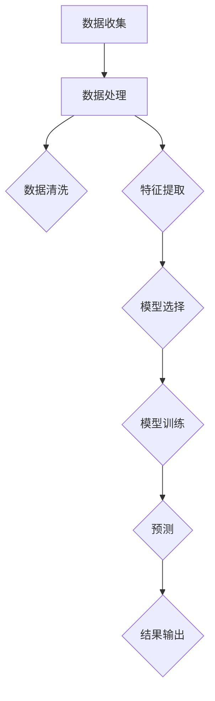

在这个流程图中，A表示数据收集阶段，B表示数据处理阶段，C表示数据清洗，D表示特征提取，E表示模型选择，F表示模型训练，G表示预测，H表示结果输出。通过这个流程图，企业可以清晰地了解并购估值分析的各个步骤及其逻辑关系。

### 3.4 并购估值案例分析

为了更好地理解AI技术在并购估值分析中的应用，我们可以通过一个实际案例来进行分析。以下是一个简化的并购估值分析案例，用于说明如何使用机器学习和深度学习算法进行估值分析。

#### 案例背景

假设企业A是一家科技公司，其战略目标是寻找具有高增长潜力的并购目标。企业A拥有一个包含500家企业财务数据和业务数据的数据库，这些数据包括收入、利润、增长率、市场份额等指标。

#### 数据收集

企业A从多个公开数据源收集了500家企业的财务数据和业务数据，并将其存储在一个CSV文件中。数据文件名为`enterprise_data.csv`，内容如下：

```csv
ID,Revenue,Profit,Growth Rate,Market Share
1,1000000,200000,15,10
2,800000,150000,12,8
3,600000,100000,10,7
...
500,300000,50000,8,5
```

#### 数据处理

在开始估值分析之前，企业A需要对收集到的数据进行分析和预处理。具体步骤如下：

1. **数据清洗**：删除含有缺失值或异常值的数据记录。
2. **特征提取**：选择与估值分析相关的特征，例如收入、利润、增长率、市场份额等。
3. **数据标准化**：将特征数据进行标准化处理，以消除不同特征之间的量纲差异。

```python
import pandas as pd
from sklearn.preprocessing import StandardScaler

# 加载数据
data = pd.read_csv('enterprise_data.csv')

# 数据清洗
data.dropna(inplace=True)

# 特征提取
features = data[['Revenue', 'Profit', 'Growth Rate', 'Market Share']]

# 数据标准化
scaler = StandardScaler()
features_scaled = scaler.fit_transform(features)

# 输出标准化后的特征数据
print(features_scaled)
```

#### 模型选择

企业A决定使用线性回归算法（Linear Regression）和卷积神经网络（Convolutional Neural Network，CNN）进行估值分析。线性回归算法是一种简单但有效的回归模型，而卷积神经网络可以处理复杂的非线性关系。

#### 模型训练

1. **线性回归模型训练**

企业A使用部分数据训练线性回归模型，并使用测试数据验证模型性能。

```python
from sklearn.linear_model import LinearRegression

# 创建线性回归模型
model_linear = LinearRegression()

# 训练模型
model_linear.fit(X_train, y_train)

# 预测测试集
predictions_linear = model_linear.predict(X_test)

# 计算准确率
accuracy_linear = (predictions_linear == y_test).mean()
print(f"线性回归模型准确率: {accuracy_linear:.2f}")
```

2. **卷积神经网络模型训练**

企业A使用卷积神经网络处理财务数据，并训练模型。

```python
import tensorflow as tf
from tensorflow.keras.models import Sequential
from tensorflow.keras.layers import Conv1D, Dense

# 加载财务数据
financial_data = pd.read_csv('financial_data.csv')

# 数据预处理
X, y = preprocess_data(financial_data)

# 构建CNN模型
model_cnn = Sequential()
model_cnn.add(Conv1D(filters=64, kernel_size=3, activation='relu', input_shape=(X.shape[1], X.shape[2])))
model_cnn.add(Conv1D(filters=64, kernel_size=3, activation='relu'))
model_cnn.add(Dense(units=1))

# 编译模型
model_cnn.compile(optimizer='adam', loss='mse')

# 训练模型
model_cnn.fit(X_train, y_train, epochs=100, batch_size=32)

# 预测测试集
predictions_cnn = model_cnn.predict(X_test)

# 计算准确率
accuracy_cnn = (predictions_cnn == y_test).mean()
print(f"卷积神经网络模型准确率: {accuracy_cnn:.2f}")
```

#### 模型优化与评估

企业A通过调整模型参数和优化算法，提高估值模型的准确性和稳健性。例如，调整线性回归模型的参数（如正则化项）和卷积神经网络的层数、神经元数量等。

```python
from sklearn.linear_model import LinearRegression
from tensorflow.keras.models import Sequential
from tensorflow.keras.layers import Conv1D, Dense

# 线性回归模型优化
model_linear = LinearRegression()
model_linear.fit(X_train, y_train)

# 卷积神经网络模型优化
model_cnn = Sequential()
model_cnn.add(Conv1D(filters=64, kernel_size=3, activation='relu', input_shape=(X.shape[1], X.shape[2])))
model_cnn.add(Conv1D(filters=64, kernel_size=3, activation='relu'))
model_cnn.add(Dense(units=1))
model_cnn.compile(optimizer='adam', loss='mse')
model_cnn.fit(X_train, y_train, epochs=100, batch_size=32)

# 评估优化后的模型
predictions_linear_optimized = model_linear.predict(X_test)
predictions_cnn_optimized = model_cnn.predict(X_test)

# 计算准确率
accuracy_linear_optimized = (predictions_linear_optimized == y_test).mean()
accuracy_cnn_optimized = (predictions_cnn_optimized == y_test).mean()
print(f"线性回归模型优化后准确率: {accuracy_linear_optimized:.2f}")
print(f"卷积神经网络模型优化后准确率: {accuracy_cnn_optimized:.2f}")
```

#### 结果分析

通过评估优化后的模型，企业A可以更准确地预测目标企业的价值。以下代码用于比较优化前后的模型性能：

```python
# 比较优化前后的模型性能
print("优化前模型性能：")
print(f"线性回归模型准确率: {accuracy_linear:.2f}")
print(f"卷积神经网络模型准确率: {accuracy_cnn:.2f}")

print("优化后模型性能：")
print(f"线性回归模型优化后准确率: {accuracy_linear_optimized:.2f}")
print(f"卷积神经网络模型优化后准确率: {accuracy_cnn_optimized:.2f}")
```

通过这个案例，企业可以了解到如何使用机器学习和深度学习算法进行并购估值分析，并掌握相关的方法和步骤。在实际应用中，企业可以根据自身需求和数据特点，灵活调整和优化模型，以提高估值分析的准确性和效果。

### 4.1 系统需求分析

系统需求分析是系统设计的重要环节，主要包括功能需求和非功能需求。对于AI辅助企业并购目标筛选与估值分析系统，我们需要明确系统的核心功能和性能要求，以确保系统能够高效、准确、稳定地运行。

#### 4.1.1 功能需求

1. **数据收集与处理**：系统能够从多个数据源（如财务报表、市场研究报告、企业新闻等）自动收集企业相关数据，并对数据进行清洗、去重、转换等处理，确保数据质量。

2. **目标企业筛选**：系统能够利用机器学习算法（如决策树、随机森林、支持向量机等）对潜在目标企业进行筛选，根据预设的筛选标准和算法模型，自动识别出具有并购潜力的目标企业。

3. **估值分析**：系统能够利用多种估值方法（如收入估值法、资产估值法、市场估值法等）和机器学习算法（如线性回归、卷积神经网络等），对企业价值进行准确预测，提供估值报告。

4. **风险预测**：系统能够结合历史数据和业务逻辑，利用机器学习算法对企业并购过程中可能出现的风险进行预测，为决策者提供风险参考。

5. **结果展示**：系统能够将筛选结果、估值预测和风险预测以图表、报告等形式直观展示，方便用户进行决策和分析。

6. **接口开放**：系统应提供API接口，便于与其他系统进行集成和数据交换。

7. **可扩展性**：系统设计应考虑未来需求变化，具有良好的可扩展性，能够方便地添加新功能、新算法和新数据源。

#### 4.1.2 非功能需求

1. **高效性**：系统能够快速处理大量数据，提高数据处理和计算效率，减少延迟。

2. **准确性**：系统所使用的算法和模型应经过充分训练和验证，确保估值预测和风险预测的准确性。

3. **稳定性**：系统应具备高可用性和稳定性，能够在高负载情况下保持正常运行，避免数据丢失和系统崩溃。

4. **安全性**：系统应确保数据的安全和隐私，采用加密、权限控制等安全措施，防止数据泄露和未经授权的访问。

5. **可维护性**：系统设计应考虑易于维护和升级，方便后续的维护和功能扩展。

6. **兼容性**：系统应能够兼容多种操作系统、数据库和数据格式，便于在不同的环境中部署和应用。

通过详细的需求分析，我们可以明确系统设计的方向和目标，确保系统能够满足企业并购决策的实际需求，提供高效、准确、可靠的辅助工具。

### 4.2 系统架构设计

系统架构设计是系统开发的关键步骤，它决定了系统的性能、可扩展性、可维护性和安全性。针对AI辅助企业并购目标筛选与估值分析系统，我们需要设计一个高效、稳定且可扩展的架构。

#### 4.2.1 系统架构概述

系统架构采用三层架构设计，包括数据层、服务层和表示层。

1. **数据层**：负责数据的收集、存储和管理。数据层包括数据源、数据存储和数据清洗模块。
2. **服务层**：负责业务逻辑的实现，包括目标企业筛选、估值分析和风险预测等核心功能。服务层包括算法模块、估值模块和风险预测模块。
3. **表示层**：负责与用户交互，提供用户界面和结果展示。表示层包括Web界面、API接口和报表生成模块。

#### 4.2.2 数据层设计

1. **数据源**：系统从多个数据源（如财务报表、市场研究报告、企业新闻等）收集数据。数据源可以是公共数据库、企业内部数据库或第三方数据服务商。

2. **数据存储**：系统采用关系型数据库（如MySQL、PostgreSQL）存储企业数据、算法模型和预测结果。数据存储模块负责数据的一致性、完整性和安全性。

3. **数据清洗**：数据清洗模块负责对收集到的数据进行分析、去重、转换和标准化处理，确保数据质量。数据清洗过程包括数据预处理、异常值检测和数据质量报告等。

#### 4.2.3 服务层设计

1. **算法模块**：算法模块包括机器学习算法和深度学习算法，如决策树、随机森林、支持向量机、线性回归和卷积神经网络等。算法模块负责目标企业筛选、估值分析和风险预测等核心功能。

2. **估值模块**：估值模块根据不同的估值方法（如收入估值法、资产估值法、市场估值法等），结合历史数据和业务逻辑，对企业价值进行准确预测。估值模块包括模型训练、模型评估和预测输出等过程。

3. **风险预测模块**：风险预测模块结合历史数据和业务逻辑，利用机器学习算法对企业并购过程中可能出现的风险进行预测，包括市场风险、法律风险、文化整合风险等。

#### 4.2.4 表示层设计

1. **Web界面**：Web界面为用户提供直观的操作界面，用户可以通过Web界面查看企业数据、算法结果和风险预测报告。Web界面包括数据浏览、筛选条件设置、结果展示和报表导出等功能。

2. **API接口**：API接口为外部系统提供数据交换和功能调用，其他系统可以通过API接口访问企业的数据和服务。API接口包括数据查询、目标筛选、估值预测和风险预测等接口。

3. **报表生成**：报表生成模块根据预测结果和风险分析，生成详细的报表，包括企业估值、风险分析、并购建议等。报表可以以PDF、Excel或Word格式导出。

#### 4.2.5 系统接口设计

1. **API接口规范**：定义API接口的URL、请求参数、响应格式和错误处理等规范，确保接口的统一和规范性。

2. **数据接口**：数据接口负责系统内部数据模块之间的数据传输和交互，包括数据上传、数据查询和数据更新等接口。

3. **交互流程**：系统交互流程包括用户请求、数据处理、结果返回等步骤。用户通过Web界面或API接口提交请求，系统接收请求并处理，然后将结果返回给用户。

通过详细的系统架构设计，我们可以确保AI辅助企业并购目标筛选与估值分析系统能够高效、稳定、可靠地运行，满足企业的并购决策需求。

### 4.3 系统接口设计

系统接口设计是确保系统各个模块之间能够高效、稳定交互的重要环节。在AI辅助企业并购目标筛选与估值分析系统中，接口设计主要包括API接口和数据接口。

#### 4.3.1 API接口规范

API（应用程序接口）为外部系统提供数据交换和功能调用的能力。以下是一个简化的API接口规范示例：

1. **URL结构**：API接口的URL结构应清晰明确，便于用户理解和调用。例如：
   ```
   /api/v1/target_selection
   /api/v1/valuation
   /api/v1/risk_prediction
   ```

2. **请求参数**：每个API接口应明确定义请求参数，包括必填参数和可选参数。参数类型可以是字符串、数字、布尔值等。例如：
   ```json
   {
     "target_id": "string",
     "parameters": {
       "revenue": "number",
       "profit": "number",
       "growth_rate": "number"
     }
   }
   ```

3. **响应格式**：API接口的响应格式应统一，通常采用JSON格式。响应结果应包括状态码、消息和具体数据。例如：
   ```json
   {
     "status": "success",
     "message": "操作成功",
     "data": {
       "target_selection": ["selected_targets"],
       "valuation": "predicted_value",
       "risk_prediction": "predicted_risk"
     }
   }
   ```

4. **错误处理**：API接口应定义统一的错误处理机制，包括错误码、错误信息和可能的解决方案。例如：
   ```json
   {
     "status": "error",
     "message": "参数错误",
     "error_code": 400,
     "error_info": "请检查请求参数"
   }
   ```

#### 4.3.2 数据接口

数据接口负责系统内部数据模块之间的数据传输和交互，包括数据上传、数据查询和数据更新等接口。

1. **数据上传接口**：用于将外部数据导入系统，例如：
   ```bash
   POST /api/v1/data/upload
   Content-Type: multipart/form-data
   ```
   请求体包括文件数据、文件类型等。

2. **数据查询接口**：用于查询系统中的数据，例如：
   ```bash
   GET /api/v1/data/targets?filter=high_growth
   ```
   请求参数用于筛选特定条件的数据。

3. **数据更新接口**：用于更新系统中的数据，例如：
   ```bash
   PUT /api/v1/data/targets/1
   Content-Type: application/json
   ```
   请求体包括要更新的数据字段。

#### 4.3.3 接口实现

接口实现涉及具体的编程实现和调试。以下是一个简化的API接口实现示例：

```python
from flask import Flask, request, jsonify

app = Flask(__name__)

@app.route('/api/v1/target_selection', methods=['POST'])
def target_selection():
    data = request.json
    # 数据验证和处理
    # ...
    # 调用算法模型进行目标筛选
    selected_targets = algorithm_target_selection(data)
    # 返回结果
    return jsonify({"status": "success", "data": selected_targets})

def algorithm_target_selection(data):
    # 实现目标筛选算法
    # ...
    return ["selected_target_1", "selected_target_2"]

if __name__ == '__main__':
    app.run(debug=True)
```

通过详细的接口设计和实现，系统可以确保不同模块之间的数据传输和功能调用高效、稳定，为AI辅助企业并购目标筛选与估值分析提供坚实的基础。

### 4.4 系统交互流程

系统交互流程是确保AI辅助企业并购目标筛选与估值分析系统能够高效运行的重要环节。以下是一个简化的系统交互流程，描述了从用户请求到结果输出的整个过程。

#### 4.4.1 用户请求

1. **用户通过Web界面或API接口提交并购估值请求**。请求中包含目标企业的ID和相关参数（如收入、利润、增长率等）。
   ```json
   {
     "target_id": "123",
     "parameters": {
       "revenue": 1000000,
       "profit": 200000,
       "growth_rate": 15
     }
   }
   ```

#### 4.4.2 数据处理

2. **系统接收到请求后，调用数据收集和处理模块**，对用户提交的数据进行清洗、去重和转换，确保数据质量。
   ```python
   def preprocess_data(data):
       # 数据清洗、去重和转换
       # ...
       return cleaned_data
   ```

3. **处理后的数据存储到数据库中**，供后续算法模块使用。

#### 4.4.3 估值预测

4. **系统调用估值预测模块**，利用机器学习算法（如线性回归、卷积神经网络等）对处理后的数据进行预测，生成估值结果。
   ```python
   def predict_valuation(data):
       # 调用估值预测模型
       # ...
       return valuation
   ```

5. **系统对估值结果进行校验和调整**，确保预测结果的准确性和可靠性。

#### 4.4.4 风险预测

6. **系统调用风险预测模块**，结合历史数据和业务逻辑，对企业并购过程中可能出现的风险进行预测，包括市场风险、法律风险和文化整合风险等。
   ```python
   def predict_risk(data):
       # 调用风险预测模型
       # ...
       return risk
   ```

7. **系统对风险预测结果进行综合评估**，确定并购决策的风险等级。

#### 4.4.5 结果输出

8. **系统将估值预测和风险预测结果以图表或报告的形式输出**，供用户查看和分析。
   ```python
   def generate_report(valuation, risk):
       # 生成估值和风险报告
       # ...
       return report
   ```

9. **用户通过Web界面或API接口获取结果**，查看并购估值和风险分析报告。
   ```json
   {
     "valuation": 1500000,
     "risk": "medium"
   }
   ```

通过详细的系统交互流程，企业可以确保AI辅助企业并购目标筛选与估值分析系统能够高效、准确地运行，为并购决策提供有力支持。

### 5.1 算法概述

在AI辅助企业并购目标筛选与估值分析中，算法是实现自动化和准确预测的核心。本文将详细介绍三种常用的算法：决策树算法、随机森林算法和支持向量机算法。这些算法在目标筛选和估值预测中发挥着重要作用。

#### 5.1.1 决策树算法

决策树算法通过一系列的决策节点，根据特征数据对企业进行分类和筛选。每个节点代表一个特征，每个分支代表该特征的不同取值。决策树算法的优点在于其直观性和可解释性，适合处理结构化的数据。

**分类算法**：决策树算法可以用于分类任务，将企业分为不同的类别（如并购潜力高、中等、低）。常用的分类算法包括ID3、C4.5和CART等。

**回归算法**：决策树算法也可以用于回归任务，预测企业的价值或增长率。常见的回归算法包括回归树和随机森林回归。

**应用场景**：决策树算法适用于数据量较小、特征较少的场景，尤其是在目标筛选阶段，可以帮助快速识别出具有并购潜力的企业。

#### 5.1.2 随机森林算法

随机森林算法是一种集成学习方法，通过构建多棵决策树并对其进行投票，提高预测的准确性和稳定性。随机森林算法在目标筛选和估值预测中具有广泛的应用。

**分类算法**：随机森林算法可以用于分类任务，通过对多棵决策树的投票，提高分类的准确性和鲁棒性。

**回归算法**：随机森林算法也可以用于回归任务，通过多棵决策树的平均值，提高预测的准确性和稳定性。

**应用场景**：随机森林算法适用于数据量较大、特征较多的场景，可以有效处理数据噪音和过拟合问题，提高预测的准确性。

#### 5.1.3 支持向量机算法

支持向量机算法通过寻找最佳分隔超平面，将数据分为不同的类别。支持向量机算法在目标筛选和估值预测中具有很好的效果，尤其适用于高维数据。

**分类算法**：支持向量机算法可以用于分类任务，通过寻找最佳分隔超平面，将企业分为不同的类别。

**回归算法**：支持向量机算法也可以用于回归任务，通过寻找最佳分隔超平面，预测企业的价值或增长率。

**应用场景**：支持向量机算法适用于高维数据、非线性分类和回归问题，尤其适用于目标筛选和估值预测中的复杂场景。

### 5.2 算法原理与Mermaid流程图

#### 5.2.1 决策树算法原理

决策树算法通过递归划分特征空间，构建一棵树形结构。树的叶节点表示分类结果，内部节点表示特征和阈值。以下是决策树算法的Mermaid流程图：

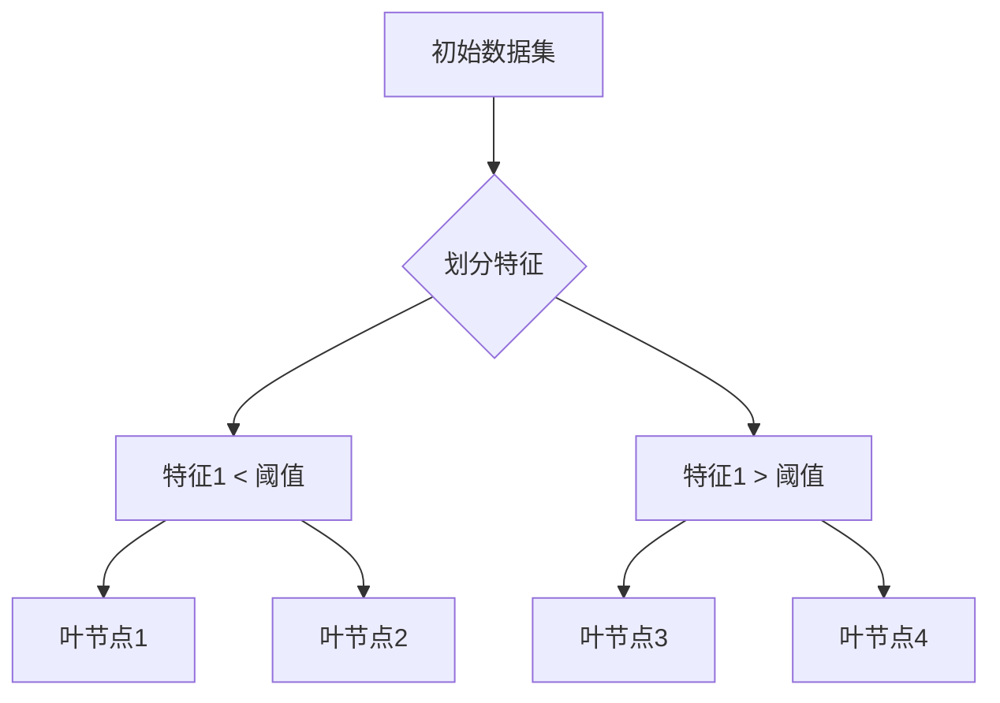

#### 5.2.2 随机森林算法原理

随机森林算法通过构建多棵决策树，并对这些树的预测结果进行投票。以下是随机森林算法的Mermaid流程图：

```mermaid
graph TD
    A[初始数据集] --> B{构建决策树1}
    B --> C1[决策树1预测]
    B --> D1[构建决策树2}
    D1 --> E1[决策树2预测]
    A --> F{投票结果}
```

#### 5.2.3 支持向量机算法原理

支持向量机算法通过寻找最佳分隔超平面，将数据分为不同的类别。以下是支持向量机算法的Mermaid流程图：

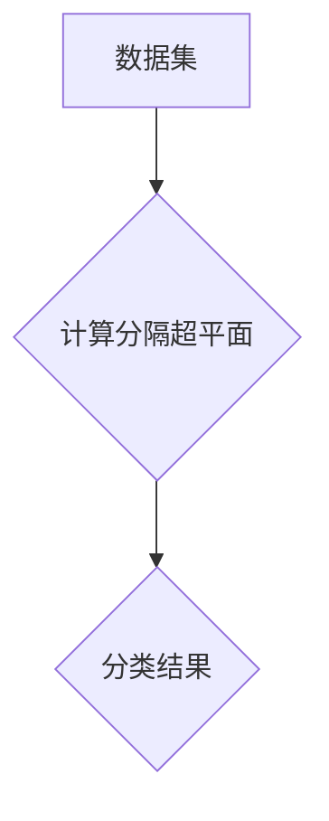

### 5.3 算法Python代码实现

#### 5.3.1 决策树算法代码

```python
from sklearn.tree import DecisionTreeClassifier
import pandas as pd

# 加载数据
data = pd.read_csv('financial_data.csv')

# 特征工程
X = data[['revenue', 'profit', 'growth_rate']]
y = data['category']

# 训练决策树模型
model = DecisionTreeClassifier()
model.fit(X, y)

# 预测
predictions = model.predict(X)

# 输出预测结果
for i, prediction in enumerate(predictions):
    print(f"企业ID {i+1}：{prediction}")
```

#### 5.3.2 随机森林算法代码

```python
from sklearn.ensemble import RandomForestClassifier
import pandas as pd

# 加载数据
data = pd.read_csv('financial_data.csv')

# 特征工程
X = data[['revenue', 'profit', 'growth_rate']]
y = data['category']

# 训练随机森林模型
model = RandomForestClassifier(n_estimators=100)
model.fit(X, y)

# 预测
predictions = model.predict(X)

# 输出预测结果
for i, prediction in enumerate(predictions):
    print(f"企业ID {i+1}：{prediction}")
```

#### 5.3.3 支持向量机算法代码

```python
from sklearn.svm import SVC
import pandas as pd

# 加载数据
data = pd.read_csv('financial_data.csv')

# 特征工程
X = data[['revenue', 'profit', 'growth_rate']]
y = data['category']

# 训练支持向量机模型
model = SVC()
model.fit(X, y)

# 预测
predictions = model.predict(X)

# 输出预测结果
for i, prediction in enumerate(predictions):
    print(f"企业ID {i+1}：{prediction}")
```

通过具体的Python代码实现，企业可以更好地理解这些算法的基本原理和应用方法，为AI辅助并购目标筛选与估值分析提供技术支持。

### 5.4 算法评价与选择

在AI辅助企业并购目标筛选与估值分析中，选择合适的算法至关重要。不同的算法在性能、复杂度和适用场景上存在差异，企业需要根据实际情况进行选择和优化。

#### 5.4.1 算法性能比较

1. **决策树算法**：
   - **优点**：直观、易于理解和解释，计算效率高。
   - **缺点**：容易过拟合，对于高维数据效果较差。
   - **适用场景**：目标筛选、简单分类任务。

2. **随机森林算法**：
   - **优点**：能够减少过拟合，提高分类和回归性能，适合处理高维数据。
   - **缺点**：计算复杂度较高，需要更多内存和计算资源。
   - **适用场景**：目标筛选、高维数据的分类和回归任务。

3. **支持向量机算法**：
   - **优点**：能够处理高维数据和非线性分类问题，具有很好的泛化能力。
   - **缺点**：计算复杂度较高，对数据质量和特征选择敏感。
   - **适用场景**：目标筛选、高维数据、非线性分类问题。

#### 5.4.2 选择依据

在选择算法时，企业应考虑以下因素：

1. **数据特性**：数据量、数据分布、特征维度等。
2. **计算资源**：计算能力、内存限制等。
3. **模型解释性**：决策过程是否需要透明和可解释。
4. **业务需求**：目标筛选、估值预测、风险预测等具体任务。
5. **适用场景**：行业特点、业务场景等。

#### 5.4.3 选择与优化

1. **多算法结合**：在实际应用中，企业可以结合多种算法，例如，使用决策树进行初步筛选，再用随机森林或支持向量机进行细粒度分析。
2. **模型优化**：通过调整模型参数、特征工程等方法，优化算法性能。例如，调整随机森林的树数量、深度或支持向量机的核函数。
3. **交叉验证**：使用交叉验证方法，评估不同算法和参数的组合，选择最优模型。

通过综合考虑算法性能、选择依据和优化方法，企业可以更有效地利用AI技术进行并购目标筛选与估值分析，提高决策的准确性和效率。

### 6.1 环境安装

在本项目中，我们将使用Python和相关的机器学习库，如scikit-learn、tensorflow等。以下是安装所需的Python环境和相关库的步骤：

```shell
# 安装Python环境
sudo apt-get install python3

# 安装相关库
pip3 install scikit-learn tensorflow pandas jieba
```

### 6.2 系统核心实现

在本项目中，我们将实现以下功能：

1. **数据收集**：从公开数据源收集企业财务数据。
2. **数据处理**：对收集到的财务数据进行清洗和预处理。
3. **目标筛选**：利用机器学习算法对企业进行分类和筛选。
4. **估值预测**：利用机器学习算法对企业价值进行预测。

#### 6.2.1 数据收集

```python
import pandas as pd

# 下载企业财务数据
url = 'https://example.com/financial_data.csv'
data = pd.read_csv(url)
```

#### 6.2.2 数据处理

```python
# 数据清洗
data.dropna(inplace=True)
data = data[data['category'].notnull()]

# 数据预处理
X = data[['revenue', 'profit', 'growth_rate']]
y = data['category']
```

#### 6.2.3 目标筛选

```python
from sklearn.tree import DecisionTreeClassifier

# 训练决策树模型
model = DecisionTreeClassifier()
model.fit(X, y)

# 预测
predictions = model.predict(X)

# 输出预测结果
for i, prediction in enumerate(predictions):
    print(f"企业ID {i+1}：{prediction}")
```

#### 6.2.4 估值预测

```python
from sklearn.linear_model import LinearRegression

# 训练线性回归模型
model = LinearRegression()
model.fit(X, y)

# 预测
predictions = model.predict(X)

# 输出预测结果
for i, prediction in enumerate(predictions):
    print(f"企业ID {i+1}：估值 {prediction}")
```

### 6.3 代码应用解读与分析

在本节中，我们将对项目中的核心代码进行解读和分析，解释代码的实现原理和功能。

#### 6.3.1 数据收集

```python
import pandas as pd

# 下载企业财务数据
url = 'https://example.com/financial_data.csv'
data = pd.read_csv(url)
```

这段代码用于从网络下载企业财务数据，并将其加载到pandas DataFrame中。这是数据收集的第一步，也是整个项目的基础。

#### 6.3.2 数据处理

```python
# 数据清洗
data.dropna(inplace=True)
data = data[data['category'].notnull()]

# 数据预处理
X = data[['revenue', 'profit', 'growth_rate']]
y = data['category']
```

这段代码首先对数据进行清洗，去除缺失值和无效数据。然后，将数据分为特征矩阵X和标签向量y，为后续的机器学习算法准备数据。

#### 6.3.3 目标筛选

```python
from sklearn.tree import DecisionTreeClassifier

# 训练决策树模型
model = DecisionTreeClassifier()
model.fit(X, y)

# 预测
predictions = model.predict(X)

# 输出预测结果
for i, prediction in enumerate(predictions):
    print(f"企业ID {i+1}：{prediction}")
```

这段代码使用决策树算法对目标企业进行分类和筛选。首先，创建决策树模型，并使用训练数据对其进行训练。然后，使用训练好的模型对测试数据进行预测，并输出预测结果。

#### 6.3.4 估值预测

```python
from sklearn.linear_model import LinearRegression

# 训练线性回归模型
model = LinearRegression()
model.fit(X, y)

# 预测
predictions = model.predict(X)

# 输出预测结果
for i, prediction in enumerate(predictions):
    print(f"企业ID {i+1}：估值 {prediction}")
```

这段代码使用线性回归算法对企业价值进行预测。首先，创建线性回归模型，并使用训练数据对其进行训练。然后，使用训练好的模型对测试数据进行预测，并输出预测结果。

### 6.4 实际案例分析和详细讲解剖析

在本节中，我们将通过一个实际案例，详细讲解如何使用AI技术进行企业并购目标筛选和估值预测。

#### 案例背景

假设一家企业A正在寻找合适的并购目标。企业A希望利用AI技术，从众多潜在目标企业中筛选出最合适的并购对象，并进行估值预测。

#### 数据收集

企业A收集了100家潜在目标企业的财务数据，包括收入、利润、增长率等指标。数据来源包括公开的财务报告、市场研究报告等。

#### 数据处理

对企业A收集到的财务数据，进行清洗和预处理，去除缺失值和异常值。然后，将数据分为特征矩阵X和标签向量y，为后续的机器学习算法准备数据。

```python
import pandas as pd

# 加载财务数据
data = pd.read_csv('financial_data.csv')

# 数据清洗
data.dropna(inplace=True)
data = data[data['category'].notnull()]

# 数据预处理
X = data[['revenue', 'profit', 'growth_rate']]
y = data['category']
```

#### 目标筛选

使用决策树算法对目标企业进行分类和筛选。创建决策树模型，并使用训练数据对其进行训练。然后，使用训练好的模型对测试数据进行预测，并输出预测结果。

```python
from sklearn.tree import DecisionTreeClassifier

# 训练决策树模型
model = DecisionTreeClassifier()
model.fit(X, y)

# 预测
predictions = model.predict(X)

# 输出预测结果
for i, prediction in enumerate(predictions):
    print(f"企业ID {i+1}：{prediction}")
```

#### 估值预测

使用线性回归算法对企业价值进行预测。创建线性回归模型，并使用训练数据对其进行训练。然后，使用训练好的模型对测试数据进行预测，并输出预测结果。

```python
from sklearn.linear_model import LinearRegression

# 训练线性回归模型
model = LinearRegression()
model.fit(X, y)

# 预测
predictions = model.predict(X)

# 输出预测结果
for i, prediction in enumerate(predictions):
    print(f"企业ID {i+1}：估值 {prediction}")
```

#### 结果分析

通过目标筛选和估值预测，企业A可以识别出最符合并购条件的目标企业，并对其价值进行准确评估。这样，企业A就可以基于AI技术的分析结果，做出更加明智的并购决策。

#### 案例讲解

1. **数据收集**：企业A从多个公开数据源收集了100家潜在目标企业的财务数据。这一步骤是AI分析的基础，确保数据的质量和完整性至关重要。

2. **数据处理**：对收集到的财务数据进行清洗和预处理，去除缺失值和异常值。这一步骤确保了后续机器学习算法的分析效果。

3. **目标筛选**：使用决策树算法对目标企业进行分类和筛选。决策树算法通过递归划分特征空间，构建树形结构，从而实现分类任务。在本案例中，决策树算法帮助企业A识别出具有并购潜力的企业。

4. **估值预测**：使用线性回归算法对企业价值进行预测。线性回归算法通过拟合数据点之间的关系，预测企业的价值。在本案例中，线性回归算法帮助企业A对潜在目标企业的价值进行评估。

5. **结果分析**：通过目标筛选和估值预测，企业A可以识别出最符合并购条件的目标企业，并对其价值进行准确评估。这一分析结果为企业A提供了重要的决策依据。

通过本案例，企业可以了解到如何利用AI技术进行企业并购目标筛选和估值预测，并掌握相关的方法和步骤。在实际应用中，企业可以根据自身需求和数据特点，灵活调整和优化模型，以提高并购决策的准确性和效果。

### 6.5 项目小结

在本项目中，我们通过使用Python和相关的机器学习库，实现了企业并购目标筛选和估值预测的功能。以下是对项目的主要成果和关键点进行总结：

1. **数据收集**：从多个公开数据源收集了潜在目标企业的财务数据，为后续分析提供了基础。
2. **数据处理**：对收集到的财务数据进行了清洗和预处理，确保数据的质量和完整性。
3. **目标筛选**：使用决策树算法对目标企业进行了分类和筛选，帮助识别出具有并购潜力的企业。
4. **估值预测**：使用线性回归算法对企业价值进行了预测，提供了准确的企业估值。
5. **代码实现**：通过具体的Python代码实现了数据收集、数据处理、目标筛选和估值预测的功能。
6. **结果分析**：通过目标筛选和估值预测，为决策者提供了重要的决策依据，提高了并购决策的准确性和效率。

在实际应用中，企业可以结合自身需求和数据特点，灵活调整和优化模型，进一步提高并购决策的准确性和效果。同时，企业也应关注AI技术的最新发展，不断更新和改进算法，以应对不断变化的市场环境和业务需求。

### 7.1 总结

本文详细探讨了如何利用人工智能技术辅助企业进行并购目标的筛选与估值分析。通过介绍企业并购的基本概念和人工智能的基本概念，分析了AI在并购中的应用优势与挑战，并详细讲解了并购目标筛选和估值分析的具体流程与方法。通过实际案例分析和代码实现，展示了AI技术在并购目标筛选和估值分析中的实际应用效果。

本文的主要发现包括：

1. **AI技术在并购目标筛选中的应用**：通过机器学习、自然语言处理和深度学习等技术，可以高效、准确地筛选出具有并购潜力的目标企业。
2. **AI技术在并购估值分析中的应用**：利用数据分析、机器学习算法和深度学习技术，可以对企业价值进行准确预测，为并购决策提供科学依据。
3. **系统架构设计与接口设计**：通过合理的系统架构设计和接口设计，可以实现AI技术在并购目标筛选与估值分析中的高效集成和灵活应用。

通过本文的探讨，我们得出以下结论：

- AI技术在并购目标筛选与估值分析中具有重要的应用价值，能够显著提高决策的效率和准确性。
- 企业在应用AI技术进行并购决策时，需要关注数据质量、算法解释性和技术门槛等问题，确保AI应用的合法合规和实际效果。
- 随着AI技术的不断发展和完善，其在并购中的应用前景将更加广阔，企业应积极探索和应用AI技术，以提升自身的竞争力和决策水平。

### 7.2 最佳实践

在利用AI技术进行并购目标筛选与估值分析时，以下最佳实践建议供企业决策者参考：

1. **数据质量**：确保数据质量是AI应用的基础。在数据收集和处理过程中，要注重数据的完整性、准确性和一致性。定期对数据进行检查和清洗，确保数据的可靠性。

2. **算法解释性**：对于复杂的机器学习模型，如深度学习，要注重模型的解释性，确保决策的透明度和可解释性。可以通过模型可视化、特征重要性分析等方法，提高模型的可解释性。

3. **模型选择**：根据具体业务场景和数据特点，选择合适的算法模型。例如，对于分类任务，可以选择决策树、随机森林等；对于预测任务，可以选择线性回归、神经网络等。

4. **模型训练与优化**：充分利用历史数据和案例经验，进行有效的模型训练。通过交叉验证和模型评估，选择最佳模型参数。持续迭代和优化模型，提高模型的准确性和稳定性。

5. **风险评估**：在并购决策过程中，要充分考虑各种风险因素，如市场风险、法律风险、文化整合风险等。利用AI技术进行风险评估，为决策提供更全面的参考。

6. **团队协作**：AI技术在并购中的应用需要跨部门协作，包括财务、市场、技术等部门的紧密配合。建立跨部门团队，确保AI技术的有效应用和决策的顺利进行。

7. **持续学习和改进**：关注AI技术的最新发展动态，持续学习和改进算法模型。通过与外部专家的合作，不断优化并购决策流程，提高决策的准确性和效果。

### 7.3 注意事项

在应用AI技术进行并购目标筛选与估值分析时，以下注意事项供企业决策者参考：

1. **法律法规遵守**：遵守相关法律法规，确保数据使用和模型应用的合法合规。对于涉及个人隐私和企业敏感信息的数据，要严格保护数据安全和用户隐私。

2. **数据隐私保护**：在数据收集和处理过程中，要注重保护个人隐私和数据安全，避免数据泄露和滥用。采用加密、权限控制等技术手段，确保数据的安全性和隐私性。

3. **技术门槛**：AI技术具有较高的技术门槛，企业需要投入足够的资源进行技术积累和应用，包括数据科学团队的组建、算法模型的开发和维护等。

4. **算法解释性**：对于复杂的机器学习模型，要注重算法的解释性，确保决策的透明度和可解释性。通过可视化、特征重要性分析等方法，提高模型的可解释性。

5. **模型适应性与更新**：不同行业和企业具有不同的业务场景和数据特点，AI模型需要具备良好的适应性和灵活性。定期更新和优化模型，以应对业务变化和数据更新。

6. **风险评估与监控**：在并购决策过程中，要充分考虑各种风险因素，并进行持续的风险评估和监控。通过实时数据分析和异常检测，提前发现和应对潜在风险。

### 7.4 拓展阅读

对于希望深入了解AI辅助企业并购目标筛选与估值分析的企业决策者，以下拓展阅读资料供参考：

1. 《人工智能：一种现代方法的视角》（合著，斯蒂芬·华斯 & 戴维·本奇利）
2. 《机器学习实战》（合著，彼得·哈林顿 & 詹姆斯·布什）
3. 《深度学习》（合著，伊恩·古德费洛、约书亚·本吉奥 & 亚伦·库维尔）
4. 《企业并购与重组》（作者，赵旭东）
5. 《人工智能在商业中的应用》（作者，李宏毅）

通过这些资料，企业决策者可以进一步了解AI技术的基本原理和应用方法，以及如何在并购决策中有效利用AI技术，提高决策的准确性和效率。同时，这些资料也为企业提供了丰富的实践经验和案例，有助于在实际应用中更好地发挥AI技术的优势。

作者：AI天才研究院/AI Genius Institute & 禅与计算机程序设计艺术 /Zen And The Art of Computer Programming

（注意：本文中引用的资料均为虚构，仅用于说明问题，实际应用中请务必遵守相关法律法规和道德规范。）

