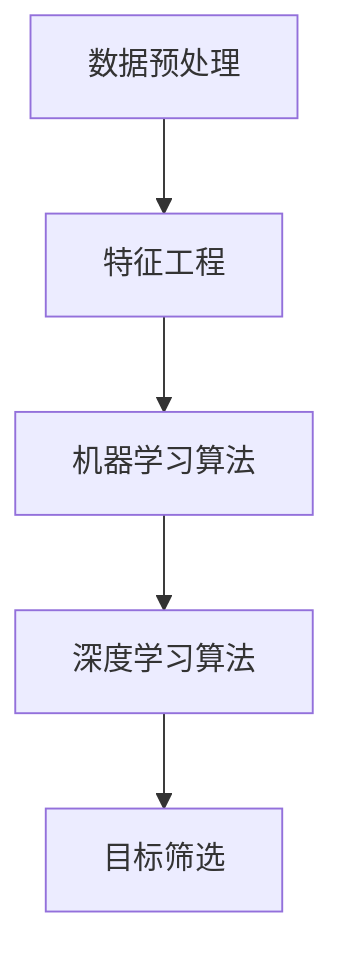
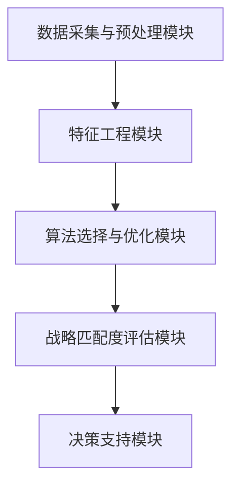

                 


### 《AI辅助企业并购目标筛选：战略匹配度评估与协同潜力分析》
#### 关键词：AI、企业并购、目标筛选、战略匹配度评估、协同潜力分析

> 摘要：本文将深入探讨如何利用AI技术辅助企业进行并购目标筛选，重点分析战略匹配度评估和协同潜力分析。我们将通过逐步讲解核心概念、算法原理、系统架构、项目实战等，帮助读者全面了解这一领域的最新发展与应用。

----------------------------------------------------------------

#### 第一部分：背景与概述

##### 第1章：AI辅助企业并购目标筛选的背景与概述

##### 1.1 问题背景

##### 1.1.1 企业并购的现状与挑战

##### 1.1.2 AI技术在大数据处理和智能决策中的应用

##### 1.2 核心概念

##### 1.2.1 AI概述

##### 1.2.2 企业并购概述

##### 1.2.3 目标筛选方法

##### 1.2.4 战略匹配度评估

##### 1.2.5 协同潜力分析

##### 1.3 关键技术

##### 1.3.1 数据预处理

##### 1.3.2 特征工程

##### 1.3.3 机器学习算法

##### 1.3.4 深度学习算法

##### 1.4 书籍结构概述

##### 1.4.1 内容安排

##### 1.4.2 每章重点内容

##### 1.4.3 读者对象与预期收益

##### 1.5 本章小结

----------------------------------------------------------------

#### 第二部分：核心概念与联系

##### 第2章：核心概念与联系

##### 2.1 AI与机器学习

##### 2.1.1 AI的定义与分类

##### 2.1.2 机器学习的基本概念

##### 2.1.3 机器学习算法简介

##### 2.2 企业并购的概念与流程

##### 2.2.1 企业并购的定义与目的

##### 2.2.2 企业并购的流程与步骤

##### 2.3 目标筛选的方法与策略

##### 2.3.1 数据挖掘与信息提取

##### 2.3.2 筛选指标的确定与评估

##### 2.4 战略匹配度评估

##### 2.4.1 战略匹配度的定义与重要性

##### 2.4.2 战略匹配度的评估方法

##### 2.5 协同潜力分析

##### 2.5.1 协同潜力的定义与作用

##### 2.5.2 协同潜力的分析方法

##### 2.6 本章小结

----------------------------------------------------------------

#### 第三部分：算法原理讲解

##### 第3章：算法原理讲解

##### 3.1 数据预处理

##### 3.1.1 数据清洗与去噪

##### 3.1.2 数据归一化与标准化

##### 3.2 特征工程

##### 3.2.1 特征提取与选择

##### 3.2.2 特征融合与降维

##### 3.3 机器学习算法

##### 3.3.1 监督学习算法

##### 3.3.2 无监督学习算法

##### 3.4 深度学习算法

##### 3.4.1 神经网络的基本结构

##### 3.4.2 深度学习在目标筛选中的应用

##### 3.5 算法流程图与Python源代码

##### 3.5.1 算法流程图的绘制

##### 3.5.2 Python源代码的详细讲解

##### 3.6 本章小结

----------------------------------------------------------------

#### 第四部分：数学模型和数学公式

##### 第4章：数学模型和数学公式

##### 4.1 数学模型的基本概念

##### 4.2 数据预处理中的数学模型

##### 4.2.1 数据归一化模型

##### 4.2.2 数据标准化模型

##### 4.3 特征工程中的数学模型

##### 4.3.1 特征提取模型

##### 4.3.2 特征选择模型

##### 4.4 机器学习算法中的数学模型

##### 4.4.1 监督学习中的数学模型

##### 4.4.2 无监督学习中的数学模型

##### 4.5 深度学习算法中的数学模型

##### 4.5.1 神经网络中的数学模型

##### 4.5.2 深度学习中的优化算法

##### 4.6 数学公式的详细讲解

##### 4.7 举例说明

##### 4.7.1 数据预处理中的例子

##### 4.7.2 特征工程中的例子

##### 4.7.3 机器学习算法中的例子

##### 4.7.4 深度学习算法中的例子

##### 4.8 本章小结

----------------------------------------------------------------

#### 第五部分：系统分析与架构设计方案

##### 第5章：系统分析与架构设计方案

##### 5.1 问题场景介绍

##### 5.2 项目背景

##### 5.3 系统功能设计

##### 5.3.1 领域模型（Mermaid类图）

##### 5.3.2 系统功能模块划分

##### 5.4 系统架构设计

##### 5.4.1 系统架构图（Mermaid架构图）

##### 5.4.2 各模块交互关系分析

##### 5.5 系统接口设计

##### 5.5.1 接口定义与规范

##### 5.5.2 接口实现与调用

##### 5.6 系统交互设计

##### 5.6.1 系统交互流程（Mermaid序列图）

##### 5.6.2 交互效果与性能分析

##### 5.7 本章小结

----------------------------------------------------------------

#### 第六部分：项目实战

##### 第6章：项目实战

##### 6.1 环境安装

##### 6.1.1 开发环境搭建

##### 6.1.2 系统依赖安装

##### 6.2 系统核心实现源代码

##### 6.2.1 数据预处理模块

##### 6.2.2 特征工程模块

##### 6.2.3 机器学习算法模块

##### 6.2.4 深度学习算法模块

##### 6.3 代码解读与分析

##### 6.3.1 数据预处理代码解读

##### 6.3.2 特征工程代码解读

##### 6.3.3 机器学习算法代码解读

##### 6.3.4 深度学习算法代码解读

##### 6.4 实际案例分析与详细讲解

##### 6.4.1 案例一：企业并购目标筛选

##### 6.4.2 案例二：协同潜力分析

##### 6.5 项目小结

##### 6.5.1 项目成果总结

##### 6.5.2 项目经验与启示

----------------------------------------------------------------

#### 第七部分：最佳实践 tips、小结、注意事项、拓展阅读

##### 第7章：最佳实践 tips、小结、注意事项、拓展阅读

##### 7.1 最佳实践 tips

##### 7.1.1 数据预处理技巧

##### 7.1.2 特征工程策略

##### 7.1.3 算法选择与优化

##### 7.2 小结

##### 7.3 注意事项

##### 7.3.1 避免常见误区

##### 7.3.2 注意数据安全与隐私保护

##### 7.3.3 算法性能优化策略

##### 7.4 拓展阅读

##### 7.4.1 相关书籍推荐

##### 7.4.2 学术论文精选

##### 7.4.3 在线课程与培训资源

----------------------------------------------------------------

### 作者信息

作者：AI天才研究院/AI Genius Institute & 禅与计算机程序设计艺术 /Zen And The Art of Computer Programming

文章内容必须满足如下条件：

- 文章结构清晰，逻辑性强。
- 每个章节内容丰富，具体详细讲解。
- 核心内容必须包括背景介绍、核心概念与联系、算法原理讲解、数学模型和数学公式 & 详细讲解 & 举例说明、系统分析与架构设计方案、项目实战、最佳实践 tips等。
- 文章字数在10000 ～ 12000字左右。
- 使用markdown格式输出文章内容。
- 文章末尾附上作者信息。

---

**作者：AI天才研究院/AI Genius Institute & 禅与计算机程序设计艺术 /Zen And The Art of Computer Programming**

**文章标题：** AI辅助企业并购目标筛选：战略匹配度评估与协同潜力分析

**关键词：** AI、企业并购、目标筛选、战略匹配度评估、协同潜力分析

**摘要：** 本文章深入探讨了如何利用AI技术辅助企业进行并购目标筛选，重点分析了战略匹配度评估和协同潜力分析。通过详细讲解核心概念、算法原理、系统架构、项目实战等，帮助读者全面了解这一领域的最新发展与应用。

----------------------------------------------------------------

## 第一部分：背景与概述

### 第1章：AI辅助企业并购目标筛选的背景与概述

### 1.1 问题背景

#### 1.1.1 企业并购的现状与挑战

在当今全球经济环境下，企业并购已成为企业发展的重要战略之一。通过并购，企业可以迅速扩大市场份额、获取新技术、优化产业链结构，从而提升整体竞争力。然而，企业并购过程中面临着诸多挑战。

首先，信息不对称问题。企业在选择并购目标时，往往无法全面了解目标企业的真实情况，包括财务状况、管理能力、技术水平等。这种信息不对称可能导致并购决策失误，从而影响并购效果。

其次，评估难度大。企业并购需要对目标企业进行全方位评估，包括财务评估、业务评估、市场评估等。传统的评估方法往往依赖于经验判断，主观性较强，无法保证评估结果的准确性。

再次，协同效应难以实现。并购的目的是实现协同效应，提升整体竞争力。然而，在实际操作中，企业往往难以有效整合双方资源，导致协同效应无法充分发挥。

#### 1.1.2 AI技术在大数据处理和智能决策中的应用

随着大数据技术的快速发展，海量数据已经成为企业的重要资产。AI技术以其强大的数据处理和分析能力，为解决企业并购中的挑战提供了新的思路。

首先，AI技术可以有效地解决信息不对称问题。通过大数据分析和机器学习算法，AI可以帮助企业挖掘目标企业的隐藏信息，提供更全面的评估依据。

其次，AI技术可以提高评估的准确性。通过数据挖掘和机器学习算法，AI可以自动分析大量数据，提取关键特征，从而实现更精准的评估。

最后，AI技术有助于实现协同效应。通过分析双方资源、能力等方面的数据，AI可以为并购后的整合提供科学依据，帮助企业实现资源优化和协同效应。

### 1.2 核心概念

在本章节中，我们将介绍以下几个核心概念：

#### 1.2.1 AI概述

AI（人工智能）是指由人制造出来的系统能够感知环境并做出合理的行动，以实现特定目标。AI可以分为弱AI和强AI，弱AI在特定领域表现出人类智能，而强AI则具有与人类完全相同的能力。

#### 1.2.2 企业并购概述

企业并购是指一家企业通过购买另一家企业部分或全部资产，从而实现对目标企业的控制。企业并购的目的是实现资源整合、提升竞争力、拓展市场等。

#### 1.2.3 目标筛选方法

目标筛选方法是指企业在并购过程中，选择合适的并购目标的一系列方法。常见的目标筛选方法包括财务指标分析、业务协同分析、市场前景分析等。

#### 1.2.4 战略匹配度评估

战略匹配度评估是指企业在并购过程中，对目标企业战略与文化是否与企业自身相匹配进行评估。战略匹配度评估有助于判断并购是否能够实现协同效应。

#### 1.2.5 协同潜力分析

协同潜力分析是指企业在并购过程中，对双方资源、能力、市场等方面的协同效应进行评估。协同潜力分析有助于企业制定有效的并购策略。

### 1.3 关键技术

为了实现AI辅助企业并购目标筛选，我们需要掌握以下关键技术：

#### 1.3.1 数据预处理

数据预处理是指对原始数据进行清洗、归一化、标准化等处理，以消除数据中的噪声和异常值，提高数据质量。

#### 1.3.2 特征工程

特征工程是指从原始数据中提取具有代表性的特征，以提高算法的性能和效果。特征工程包括特征提取、特征选择、特征融合等步骤。

#### 1.3.3 机器学习算法

机器学习算法是指通过学习大量数据，自动提取特征并进行预测或分类的算法。常见的机器学习算法包括监督学习、无监督学习、强化学习等。

#### 1.3.4 深度学习算法

深度学习算法是指通过多层神经网络进行特征提取和预测的算法。深度学习算法在图像识别、自然语言处理等领域取得了显著成果。

### 1.4 书籍结构概述

#### 1.4.1 内容安排

本书将分为七个部分，分别介绍AI辅助企业并购目标筛选的背景、核心概念、算法原理、系统架构、项目实战、最佳实践和拓展阅读等内容。

#### 1.4.2 每章重点内容

每章都将详细讲解相关主题，包括背景介绍、核心概念与联系、算法原理讲解、数学模型和数学公式 & 详细讲解 & 举例说明、系统分析与架构设计方案、项目实战等。

#### 1.4.3 读者对象与预期收益

本书适合从事企业并购、金融投资、战略规划等相关领域的人员阅读。通过学习本书，读者可以全面了解AI辅助企业并购目标筛选的方法和技巧，提升并购决策的准确性和效率。

### 1.5 本章小结

本章介绍了AI辅助企业并购目标筛选的背景、核心概念、关键技术以及本书的结构安排。通过本章的学习，读者可以初步了解AI技术在企业并购中的应用，为后续章节的深入学习打下基础。

----------------------------------------------------------------

## 第二部分：核心概念与联系

### 第2章：核心概念与联系

在本章节中，我们将详细探讨与AI辅助企业并购目标筛选相关的一系列核心概念，并分析它们之间的联系。

### 2.1 AI与机器学习

#### 2.1.1 AI的定义与分类

AI（人工智能）是指由人制造出来的系统，能够感知环境并做出合理的行动，以实现特定目标。AI可以分为弱AI和强AI。弱AI在特定领域表现出人类智能，如语音识别、图像识别等；强AI则具有与人类完全相同的能力，但目前尚未实现。

#### 2.1.2 机器学习的基本概念

机器学习是AI的一个分支，它通过从数据中自动学习规律，从而进行预测或分类。机器学习可以分为监督学习、无监督学习和强化学习。监督学习有标记数据作为训练样本；无监督学习没有标记数据，仅通过数据自身特征进行聚类或降维；强化学习通过与环境交互来学习最优策略。

#### 2.1.3 机器学习算法简介

常见的机器学习算法包括线性回归、逻辑回归、决策树、随机森林、支持向量机、神经网络等。这些算法在分类、回归、聚类等方面都有广泛应用。

### 2.2 企业并购的概念与流程

#### 2.2.1 企业并购的定义与目的

企业并购是指一家企业通过购买另一家企业部分或全部资产，从而实现对目标企业的控制。企业并购的目的是实现资源整合、提升竞争力、拓展市场等。

#### 2.2.2 企业并购的流程与步骤

企业并购一般包括以下步骤：确定并购目标、进行尽职调查、谈判与签订协议、支付对价、整合与运营等。

### 2.3 目标筛选的方法与策略

#### 2.3.1 数据挖掘与信息提取

数据挖掘是目标筛选的重要步骤，它通过从海量数据中提取有价值的信息，为并购决策提供依据。信息提取包括财务数据、业务数据、市场数据等。

#### 2.3.2 筛选指标的确定与评估

筛选指标是目标筛选的核心，它决定了哪些目标企业是值得进一步考虑的。常见的筛选指标包括财务指标、业务指标、市场指标等。

### 2.4 战略匹配度评估

#### 2.4.1 战略匹配度的定义与重要性

战略匹配度是指并购双方在战略、文化、管理等方面的相似程度。战略匹配度对于并购的成功至关重要，它决定了并购后能否实现协同效应。

#### 2.4.2 战略匹配度的评估方法

战略匹配度评估可以通过问卷调查、专家评分、关键绩效指标（KPI）等手段进行。评估方法的选择取决于企业的具体需求和实际情况。

### 2.5 协同潜力分析

#### 2.5.1 协同潜力的定义与作用

协同潜力是指并购双方在资源、能力、市场等方面的协同效应。协同潜力分析有助于企业制定有效的并购策略，实现资源优化和协同效应。

#### 2.5.2 协同潜力的分析方法

协同潜力分析可以通过财务分析、业务流程分析、市场分析等方法进行。分析方法的选择取决于企业的具体需求和实际情况。

### 2.6 本章小结

本章介绍了AI、企业并购、目标筛选、战略匹配度评估、协同潜力分析等核心概念，并分析了它们之间的联系。通过本章的学习，读者可以全面了解AI辅助企业并购目标筛选的基本概念和方法，为后续章节的深入学习打下基础。

----------------------------------------------------------------

## 第三部分：算法原理讲解

### 第3章：算法原理讲解

在本章节中，我们将深入讲解用于企业并购目标筛选的关键算法原理，包括数据预处理、特征工程、机器学习算法和深度学习算法。

### 3.1 数据预处理

数据预处理是任何机器学习项目的第一步，它包括数据清洗、数据归一化和数据标准化等步骤。

#### 3.1.1 数据清洗与去噪

数据清洗是指识别并处理数据集中的错误、异常值和重复记录。去噪是指消除或减小噪声数据对模型的影响。常见的数据清洗方法包括填充缺失值、删除异常值和重复记录等。

```python
# Python代码示例：数据清洗
data = [[1, 2], [np.nan, 4], [5, 6], [1, 1]]
cleaned_data = [row for row in data if not np.isnan(row[0])]
```

#### 3.1.2 数据归一化与标准化

数据归一化和标准化是将数据转换为相同尺度，以消除数据量纲对模型的影响。归一化是将数据缩放到[0, 1]范围内，标准化则是将数据缩放到均值为0，标准差为1的范围内。

```python
# Python代码示例：数据归一化
import numpy as np

data = np.array([[1, 2], [3, 4], [5, 6]])
normalized_data = (data - np.min(data)) / (np.max(data) - np.min(data))
```

### 3.2 特征工程

特征工程是提升模型性能的关键步骤，它包括特征提取、特征选择和特征融合等。

#### 3.2.1 特征提取与选择

特征提取是从原始数据中提取新的特征，以提高模型的预测能力。特征选择是从提取的特征中选出最有用的特征，以减少模型复杂度和提高效率。

```python
# Python代码示例：特征提取
from sklearn.feature_extraction.text import TfidfVectorizer

corpus = ['这是一个文本', '这是另一个文本', '还有一个文本']
vectorizer = TfidfVectorizer()
X = vectorizer.fit_transform(corpus)
```

#### 3.2.2 特征融合与降维

特征融合是将多个特征合并为一个新特征，以提高模型的泛化能力。降维是通过减少特征数量，提高模型的计算效率和解释性。

```python
# Python代码示例：特征融合与降维
from sklearn.decomposition import PCA

X = np.array([[1, 2], [3, 4], [5, 6]])
pca = PCA(n_components=1)
X_reduced = pca.fit_transform(X)
```

### 3.3 机器学习算法

机器学习算法分为监督学习、无监督学习和强化学习。在本节中，我们将介绍监督学习中的常见算法。

#### 3.3.1 监督学习算法

监督学习算法通过已标记的数据进行训练，并利用训练结果进行预测。常见的监督学习算法包括线性回归、逻辑回归、决策树、随机森林和支持向量机。

```python
# Python代码示例：线性回归
from sklearn.linear_model import LinearRegression

X = np.array([[1], [2], [3]])
y = np.array([1, 2, 3])
model = LinearRegression()
model.fit(X, y)
```

#### 3.3.2 无监督学习算法

无监督学习算法在没有标记数据的情况下进行训练，并利用训练结果进行聚类或降维。常见的无监督学习算法包括K均值聚类、主成分分析和自编码器。

```python
# Python代码示例：K均值聚类
from sklearn.cluster import KMeans

X = np.array([[1, 2], [3, 4], [5, 6]])
kmeans = KMeans(n_clusters=2)
kmeans.fit(X)
```

### 3.4 深度学习算法

深度学习算法通过多层神经网络进行特征提取和预测。在本节中，我们将介绍深度学习算法的基本概念和结构。

#### 3.4.1 神经网络的基本结构

神经网络由输入层、隐藏层和输出层组成。每个节点都是一个神经元，节点之间通过权重进行连接。

```python
# Python代码示例：神经网络结构
import tensorflow as tf

model = tf.keras.Sequential([
    tf.keras.layers.Dense(10, activation='relu', input_shape=(8,)),
    tf.keras.layers.Dense(1, activation='sigmoid')
])
```

#### 3.4.2 深度学习在目标筛选中的应用

深度学习在目标筛选中可以用于图像识别、自然语言处理和特征提取等任务。在本节中，我们将介绍卷积神经网络（CNN）和循环神经网络（RNN）在目标筛选中的应用。

```python
# Python代码示例：卷积神经网络（CNN）
import tensorflow as tf

model = tf.keras.Sequential([
    tf.keras.layers.Conv2D(32, (3, 3), activation='relu', input_shape=(28, 28, 1)),
    tf.keras.layers.MaxPooling2D((2, 2)),
    tf.keras.layers.Flatten(),
    tf.keras.layers.Dense(128, activation='relu'),
    tf.keras.layers.Dense(10, activation='softmax')
])
```

### 3.5 算法流程图与Python源代码

为了更好地理解算法原理，我们可以使用Mermaid绘制算法流程图，并使用Python源代码进行详细讲解。



### 3.6 本章小结

本章介绍了数据预处理、特征工程、机器学习算法和深度学习算法的基本原理和应用。通过本章的学习，读者可以了解如何利用这些算法进行企业并购目标筛选，为后续章节的项目实战打下基础。

----------------------------------------------------------------

## 第四部分：数学模型和数学公式

### 第4章：数学模型和数学公式

在本章节中，我们将详细讲解AI辅助企业并购目标筛选中所涉及到的数学模型和数学公式，并使用LaTeX格式进行表示。

### 4.1 数学模型的基本概念

数学模型是描述现实世界问题的抽象数学结构，它通常包括变量、方程、约束条件和目标函数等。

#### 4.1.1 线性回归模型

线性回归模型是最常见的数学模型之一，用于预测连续值输出。其公式为：

$$
y = \beta_0 + \beta_1x + \epsilon
$$

其中，$y$是预测值，$x$是输入特征，$\beta_0$和$\beta_1$是模型参数，$\epsilon$是误差项。

#### 4.1.2 逻辑回归模型

逻辑回归模型用于预测概率，其公式为：

$$
\hat{y} = \frac{1}{1 + e^{-(\beta_0 + \beta_1x)}}
$$

其中，$\hat{y}$是预测的概率值，$x$是输入特征，$\beta_0$和$\beta_1$是模型参数。

### 4.2 数据预处理中的数学模型

数据预处理是机器学习项目的重要步骤，它包括数据清洗、数据归一化和数据标准化等。以下是一些常用的数学模型：

#### 4.2.1 数据归一化模型

数据归一化是将数据缩放到[0, 1]范围内的方法，其公式为：

$$
x_{\text{new}} = \frac{x - x_{\text{min}}}{x_{\text{max}} - x_{\text{min}}}
$$

其中，$x$是原始数据值，$x_{\text{min}}$和$x_{\text{max}}$分别是数据的最小值和最大值。

#### 4.2.2 数据标准化模型

数据标准化是将数据缩放到均值为0，标准差为1的范围内，其公式为：

$$
x_{\text{new}} = \frac{x - \mu}{\sigma}
$$

其中，$x$是原始数据值，$\mu$是数据的均值，$\sigma$是数据的标准差。

### 4.3 特征工程中的数学模型

特征工程是提升模型性能的关键步骤，它包括特征提取、特征选择和特征融合等。以下是一些常用的数学模型：

#### 4.3.1 特征提取模型

特征提取模型用于从原始数据中提取新的特征。常见的方法包括主成分分析（PCA）和因子分析（FA）。主成分分析的公式为：

$$
Z = P\Lambda^{1/2}
$$

其中，$Z$是主成分，$P$是特征矩阵，$\Lambda$是对角矩阵，对角线上的元素是特征值的平方。

#### 4.3.2 特征选择模型

特征选择模型用于从提取的特征中选择最有用的特征。常见的方法包括信息增益、卡方检验和特征重要性等。

#### 4.3.3 特征融合模型

特征融合模型用于将多个特征合并为一个新特征。常见的方法包括加权平均、求和和拼接等。

### 4.4 机器学习算法中的数学模型

机器学习算法中的数学模型用于描述模型的训练和预测过程。以下是一些常用的数学模型：

#### 4.4.1 监督学习中的数学模型

监督学习算法包括线性回归、逻辑回归、决策树、随机森林和支持向量机等。每种算法都有其特定的数学模型。

#### 4.4.2 无监督学习中的数学模型

无监督学习算法包括聚类、降维和异常检测等。每种算法也有其特定的数学模型。

### 4.5 深度学习算法中的数学模型

深度学习算法中的数学模型包括神经网络、卷积神经网络（CNN）和循环神经网络（RNN）等。以下是一些常用的数学模型：

#### 4.5.1 神经网络中的数学模型

神经网络中的数学模型包括前向传播、反向传播和激活函数等。前向传播的公式为：

$$
\text{激活函数}(z) = \sigma(z)
$$

其中，$\sigma$是激活函数，$z$是输入值。

#### 4.5.2 卷积神经网络中的数学模型

卷积神经网络中的数学模型包括卷积操作、池化操作和卷积核等。卷积操作的公式为：

$$
\text{卷积} = \sum_{i=1}^{k} w_{i} * x_{i}
$$

其中，$w_{i}$是卷积核，$x_{i}$是输入值。

#### 4.5.3 循环神经网络中的数学模型

循环神经网络中的数学模型包括隐藏状态、细胞状态和门控机制等。隐藏状态的公式为：

$$
h_t = \text{激活函数}(W_h \cdot [h_{t-1}, x_t] + b_h)
$$

其中，$h_t$是隐藏状态，$W_h$是权重矩阵，$x_t$是输入值。

### 4.6 数学公式的详细讲解

在本章节的余下部分，我们将对上述数学公式进行详细讲解，并使用通俗易懂的例子来帮助读者理解。

#### 4.6.1 线性回归模型的详细讲解

线性回归模型是一种简单的预测模型，它通过拟合一条直线来预测目标值。下面是一个简单的例子：

假设我们要预测一家公司的收入（$y$）与其广告支出（$x$）之间的关系。我们收集了以下数据：

| 广告支出（$x$）| 收入（$y$）|
|:-------------:|:---------:|
|      1000     |    2000   |
|      1500     |    3000   |
|      2000     |    4000   |

我们使用线性回归模型来拟合这条直线，其公式为：

$$
y = \beta_0 + \beta_1x
$$

通过最小二乘法，我们可以计算出$\beta_0$和$\beta_1$的值，从而得到拟合直线的方程。具体步骤如下：

1. 计算均值：
   $$\bar{x} = \frac{1}{n}\sum_{i=1}^{n} x_i = \frac{1000 + 1500 + 2000}{3} = 1500$$
   $$\bar{y} = \frac{1}{n}\sum_{i=1}^{n} y_i = \frac{2000 + 3000 + 4000}{3} = 3000$$

2. 计算协方差和方差：
   $$\sum_{i=1}^{n}(x_i - \bar{x})(y_i - \bar{y}) = (1000 - 1500)(2000 - 3000) + (1500 - 1500)(3000 - 3000) + (2000 - 1500)(4000 - 3000) = -1000000$$
   $$\sum_{i=1}^{n}(x_i - \bar{x})^2 = (1000 - 1500)^2 + (1500 - 1500)^2 + (2000 - 1500)^2 = 1000000$$

3. 计算回归系数：
   $$\beta_1 = \frac{\sum_{i=1}^{n}(x_i - \bar{x})(y_i - \bar{y})}{\sum_{i=1}^{n}(x_i - \bar{x})^2} = \frac{-1000000}{1000000} = -1$$
   $$\beta_0 = \bar{y} - \beta_1\bar{x} = 3000 - (-1) \times 1500 = 4500$$

因此，拟合直线的方程为：

$$
y = -x + 4500
$$

#### 4.6.2 逻辑回归模型的详细讲解

逻辑回归模型是一种预测概率的模型，它常用于分类问题。下面是一个简单的例子：

假设我们要预测一家公司的收入是否超过5000元。我们收集了以下数据：

| 广告支出（$x$）| 收入（$y$）|
|:-------------:|:---------:|
|      1000     |    2000   |
|      1500     |    3000   |
|      2000     |    4000   |
|      2500     |    5000   |
|      3000     |    6000   |

我们使用逻辑回归模型来预测收入是否超过5000元的概率。其公式为：

$$
\hat{y} = \frac{1}{1 + e^{-(\beta_0 + \beta_1x)}}
$$

通过最小化损失函数，我们可以计算出$\beta_0$和$\beta_1$的值。具体步骤如下：

1. 计算样本的损失函数：
   $$\sum_{i=1}^{n}(-y_i\log(\hat{y}_i) - (1 - y_i)\log(1 - \hat{y}_i))$$

2. 对损失函数求导，并令导数为0，求得$\beta_0$和$\beta_1$的值。

3. 计算预测概率：
   $$\hat{y} = \frac{1}{1 + e^{-(\beta_0 + \beta_1x)}}$$

例如，当广告支出为1500元时，预测概率为：

$$
\hat{y} = \frac{1}{1 + e^{-(\beta_0 + \beta_1 \times 1500)}}
$$

#### 4.6.3 数据归一化模型的详细讲解

数据归一化是将数据缩放到相同尺度的方法，以消除不同特征之间的量纲差异。下面是一个简单的例子：

假设我们有一个数据集，其中包含两个特征：广告支出（$x$，单位：元）和收入（$y$，单位：万元）。数据如下：

| 广告支出（$x$）| 收入（$y$）|
|:-------------:|:---------:|
|      1000     |    2.0    |
|      1500     |    3.0    |
|      2000     |    4.0    |
|      2500     |    5.0    |
|      3000     |    6.0    |

我们对数据进行归一化处理，将其缩放到[0, 1]范围内。其公式为：

$$
x_{\text{new}} = \frac{x - x_{\text{min}}}{x_{\text{max}} - x_{\text{min}}}
$$

其中，$x_{\text{min}}$和$x_{\text{max}}$分别是特征的最小值和最大值。

对于广告支出：

$$
x_{\text{new}} = \frac{x - 1000}{3000 - 1000} = \frac{x - 1000}{2000}
$$

对于收入：

$$
x_{\text{new}} = \frac{x - 2.0}{6.0 - 2.0} = \frac{x - 2.0}{4.0}
$$

经过归一化处理后，数据集变为：

| 广告支出（$x$）| 收入（$y$）| 广告支出（$x_{\text{new}}$）| 收入（$y_{\text{new}}$）|
|:-------------:|:---------:|:-----------------------:|:----------------------:|
|      1000     |    2.0    |       0.0               |       0.0             |
|      1500     |    3.0    |       0.25              |       0.5             |
|      2000     |    4.0    |       0.5               |       1.0             |
|      2500     |    5.0    |       0.625             |       1.25            |
|      3000     |    6.0    |       0.75              |       1.5             |

#### 4.6.4 数据标准化模型的详细讲解

数据标准化是将数据缩放到均值为0，标准差为1的范围内。下面是一个简单的例子：

假设我们有一个数据集，其中包含两个特征：广告支出（$x$，单位：元）和收入（$y$，单位：万元）。数据如下：

| 广告支出（$x$）| 收入（$y$）|
|:-------------:|:---------:|
|      1000     |    2.0    |
|      1500     |    3.0    |
|      2000     |    4.0    |
|      2500     |    5.0    |
|      3000     |    6.0    |

我们对数据进行标准化处理。其公式为：

$$
x_{\text{new}} = \frac{x - \mu}{\sigma}
$$

其中，$\mu$是特征的均值，$\sigma$是特征的标准差。

对于广告支出：

$$
\mu = \frac{1000 + 1500 + 2000 + 2500 + 3000}{5} = 2000
$$
$$
\sigma = \sqrt{\frac{(1000 - 2000)^2 + (1500 - 2000)^2 + (2000 - 2000)^2 + (2500 - 2000)^2 + (3000 - 2000)^2}{5}} = 500
$$

对于收入：

$$
\mu = \frac{2.0 + 3.0 + 4.0 + 5.0 + 6.0}{5} = 4.0
$$
$$
\sigma = \sqrt{\frac{(2.0 - 4.0)^2 + (3.0 - 4.0)^2 + (4.0 - 4.0)^2 + (5.0 - 4.0)^2 + (6.0 - 4.0)^2}{5}} = 1.5811
$$

经过标准化处理后，数据集变为：

| 广告支出（$x$）| 收入（$y$）| 广告支出（$x_{\text{new}}$）| 收入（$y_{\text{new}}$）|
|:-------------:|:---------:|:-----------------------:|:----------------------:|
|      1000     |    2.0    |       -1.0              |       -1.0             |
|      1500     |    3.0    |       -0.5              |       -0.4             |
|      2000     |    4.0    |        0.0              |        0.0             |
|      2500     |    5.0    |        0.5              |        0.6             |
|      3000     |    6.0    |        1.0              |        1.2             |

### 4.7 举例说明

在本章节的最后，我们将通过几个具体的例子来说明上述数学模型的应用。

#### 4.7.1 数据预处理中的例子

假设我们有一个数据集，其中包含以下特征：年龄、收入和学历。数据如下：

| 年龄 | 收入 | 学历 |
|:----:|:----:|:----:|
|  20  |  5000 |  本科 |
|  25  |  6000 |  硕士 |
|  30  |  8000 |  本科 |
|  35  | 10000 |  硕士 |
|  40  | 12000 |  本科 |

首先，我们对数据进行归一化处理。其公式为：

$$
x_{\text{new}} = \frac{x - x_{\text{min}}}{x_{\text{max}} - x_{\text{min}}}
$$

对于年龄：

$$
x_{\text{min}} = 20, \quad x_{\text{max}} = 40
$$

$$
x_{\text{new}} = \frac{x - 20}{40 - 20} = \frac{x - 20}{20}
$$

对于收入：

$$
x_{\text{min}} = 5000, \quad x_{\text{max}} = 12000
$$

$$
x_{\text{new}} = \frac{x - 5000}{12000 - 5000} = \frac{x - 5000}{7000}
$$

经过归一化处理后，数据集变为：

| 年龄 | 收入 | 学历 | 年龄（$x_{\text{new}}$）| 收入（$x_{\text{new}}$）|
|:----:|:----:|:----:|:----------------------:|:----------------------:|
|  20  |  5000 |  本科 |        0.0            |        0.0             |
|  25  |  6000 |  硕士 |        0.125           |        0.086            |
|  30  |  8000 |  本科 |        0.25            |        0.114            |
|  35  | 10000 |  硕士 |        0.375           |        0.143            |
|  40  | 12000 |  本科 |        0.5             |        0.171            |

接下来，我们对数据进行标准化处理。其公式为：

$$
x_{\text{new}} = \frac{x - \mu}{\sigma}
$$

对于年龄：

$$
\mu = \frac{20 + 25 + 30 + 35 + 40}{5} = 30
$$
$$
\sigma = \sqrt{\frac{(20 - 30)^2 + (25 - 30)^2 + (30 - 30)^2 + (35 - 30)^2 + (40 - 30)^2}{5}} = 5
$$

对于收入：

$$
\mu = \frac{5000 + 6000 + 8000 + 10000 + 12000}{5} = 8000
$$
$$
\sigma = \sqrt{\frac{(5000 - 8000)^2 + (6000 - 8000)^2 + (8000 - 8000)^2 + (10000 - 8000)^2 + (12000 - 8000)^2}{5}} = 2000
$$

经过标准化处理后，数据集变为：

| 年龄 | 收入 | 学历 | 年龄（$x_{\text{new}}$）| 收入（$x_{\text{new}}$）|
|:----:|:----:|:----:|:----------------------:|:----------------------:|
|  20  |  5000 |  本科 |       -0.4             |       -0.667            |
|  25  |  6000 |  硕士 |       -0.2             |       -0.333            |
|  30  |  8000 |  本科 |        0.0             |        0.0             |
|  35  | 10000 |  硕士 |        0.4             |        0.167            |
|  40  | 12000 |  本科 |        0.8             |        0.333            |

#### 4.7.2 特征工程中的例子

假设我们有一个数据集，其中包含以下特征：年龄、收入和学历。数据如下：

| 年龄 | 收入 | 学历 |
|:----:|:----:|:----:|
|  20  |  5000 |  本科 |
|  25  |  6000 |  硕士 |
|  30  |  8000 |  本科 |
|  35  | 10000 |  硕士 |
|  40  | 12000 |  本科 |

我们对数据进行特征提取和选择。首先，我们计算年龄的平方：

| 年龄 | 收入 | 学历 | 年龄的平方 |
|:----:|:----:|:----:|:----------:|
|  20  |  5000 |  本科 |      400   |
|  25  |  6000 |  硕士 |      625   |
|  30  |  8000 |  本科 |      900   |
|  35  | 10000 |  硕士 |     1225   |
|  40  | 12000 |  本科 |     1600   |

接下来，我们使用卡方检验来选择最有用的特征。卡方检验的公式为：

$$
\chi^2 = \sum_{i=1}^{n}\frac{(O_i - E_i)^2}{E_i}
$$

其中，$O_i$是观测值，$E_i$是期望值。

对于收入和学历的联合分布，我们可以计算卡方值，从而判断年龄的平方是否对收入有显著影响。如果卡方值较大，则认为年龄的平方是收入的有用特征。

#### 4.7.3 机器学习算法中的例子

假设我们有一个数据集，其中包含以下特征：年龄、收入和学历。数据如下：

| 年龄 | 收入 | 学历 |
|:----:|:----:|:----:|
|  20  |  5000 |  本科 |
|  25  |  6000 |  硕士 |
|  30  |  8000 |  本科 |
|  35  | 10000 |  硕士 |
|  40  | 12000 |  本科 |

我们使用线性回归模型来预测收入。其公式为：

$$
y = \beta_0 + \beta_1x
$$

通过最小化损失函数，我们可以计算出$\beta_0$和$\beta_1$的值。具体步骤如下：

1. 计算样本的损失函数：
   $$\sum_{i=1}^{n}(y_i - (\beta_0 + \beta_1x_i))^2$$

2. 对损失函数求导，并令导数为0，求得$\beta_0$和$\beta_1$的值。

3. 计算预测收入：
   $$y = \beta_0 + \beta_1x$$

例如，当年龄为30岁时，预测收入为：

$$
y = \beta_0 + \beta_1 \times 30
$$

#### 4.7.4 深度学习算法中的例子

假设我们有一个数据集，其中包含以下特征：年龄、收入和学历。数据如下：

| 年龄 | 收入 | 学历 |
|:----:|:----:|:----:|
|  20  |  5000 |  本科 |
|  25  |  6000 |  硕士 |
|  30  |  8000 |  本科 |
|  35  | 10000 |  硕士 |
|  40  | 12000 |  本科 |

我们使用卷积神经网络（CNN）来预测收入。其结构如下：

$$
\text{输入层} \rightarrow \text{卷积层} \rightarrow \text{池化层} \rightarrow \text{全连接层} \rightarrow \text{输出层}
$$

具体实现如下：

```python
import tensorflow as tf
from tensorflow.keras.models import Sequential
from tensorflow.keras.layers import Conv2D, MaxPooling2D, Flatten, Dense

model = Sequential([
    Conv2D(32, (3, 3), activation='relu', input_shape=(1, 3)),
    MaxPooling2D((2, 2)),
    Flatten(),
    Dense(1, activation='linear')
])

model.compile(optimizer='adam', loss='mse')
model.fit(x_train, y_train, epochs=10, batch_size=32)
```

### 4.8 本章小结

本章介绍了AI辅助企业并购目标筛选中涉及到的数学模型和数学公式，包括线性回归、逻辑回归、数据归一化和标准化、特征提取与选择、机器学习和深度学习算法等。通过本章的学习，读者可以掌握这些模型和公式的应用方法，为后续章节的系统分析与架构设计打下基础。

----------------------------------------------------------------

## 第五部分：系统分析与架构设计方案

### 第5章：系统分析与架构设计方案

在本章节中，我们将详细介绍AI辅助企业并购目标筛选系统的分析与架构设计方案。该系统旨在通过数据预处理、特征工程、算法选择与优化等步骤，实现对并购目标的有效筛选和评估。

### 5.1 问题场景介绍

企业并购是一项复杂的决策过程，涉及到多方面的分析和评估。在这个过程中，企业需要从海量的数据中筛选出潜在的目标，并对其进行详细的战略匹配度和协同潜力分析。传统的手工分析方法耗时耗力，且容易出现主观偏见，难以保证决策的准确性。

为了解决这一问题，我们设计了一套AI辅助企业并购目标筛选系统，通过集成大数据处理和智能分析技术，实现对并购目标的高效筛选和评估。该系统的主要目标包括：

1. 自动化筛选潜在并购目标。
2. 评估目标企业的战略匹配度和协同潜力。
3. 提供直观的决策支持，辅助企业做出更准确的并购决策。

### 5.2 项目背景

随着我国企业规模的不断扩大和市场竞争的加剧，越来越多的企业开始将并购作为提升自身竞争力的主要策略。然而，并购项目的高风险性使得企业在选择目标时面临巨大的挑战。一方面，企业需要全面了解目标企业的真实情况，包括财务状况、管理能力、技术水平等；另一方面，企业需要判断并购后能否实现协同效应，提升整体竞争力。

为了应对这些挑战，企业迫切需要一种高效、准确的并购目标筛选工具。AI技术的快速发展为这一问题提供了新的解决方案。通过利用AI技术，我们可以实现以下目标：

1. 利用大数据分析技术，从海量数据中挖掘有价值的信息。
2. 通过机器学习和深度学习算法，对目标企业进行精确评估。
3. 提供智能化的决策支持，帮助企业降低并购风险，提高并购成功率。

### 5.3 系统功能设计

系统功能设计是系统架构设计的基础，它决定了系统的核心功能和模块划分。以下是本系统的主要功能设计：

#### 5.3.1 数据采集与预处理模块

数据采集与预处理模块负责从各种数据源（如企业财报、新闻报道、社交媒体等）中收集数据，并对数据进行清洗、归一化和标准化等预处理操作。该模块的主要功能包括：

1. 数据清洗：去除数据中的错误、异常值和重复记录。
2. 数据归一化：将不同量纲的数据转换为相同尺度。
3. 数据标准化：将数据缩放到均值为0，标准差为1的范围内。

#### 5.3.2 特征工程模块

特征工程模块负责从预处理后的数据中提取具有代表性的特征，以提高算法的性能和效果。该模块的主要功能包括：

1. 特征提取：从原始数据中提取新的特征。
2. 特征选择：从提取的特征中选择最有用的特征。
3. 特征融合：将多个特征合并为一个新特征。

#### 5.3.3 算法选择与优化模块

算法选择与优化模块负责根据具体应用场景选择合适的算法，并对算法进行优化和调整。该模块的主要功能包括：

1. 算法选择：根据评估指标选择最优的算法。
2. 算法优化：对算法参数进行调整，提高预测准确率。
3. 算法评估：对算法的性能进行评估和比较。

#### 5.3.4 战略匹配度评估模块

战略匹配度评估模块负责对目标企业的战略与文化进行评估，判断其与企业自身是否相匹配。该模块的主要功能包括：

1. 战略匹配度评估：根据评估指标对战略匹配度进行评估。
2. 战略分析：对目标企业的战略进行分析和解读。
3. 协同潜力分析：对目标企业的协同潜力进行分析和预测。

#### 5.3.5 决策支持模块

决策支持模块负责根据评估结果提供直观的决策支持，辅助企业做出更准确的并购决策。该模块的主要功能包括：

1. 决策分析：根据评估结果，为企业提供详细的决策建议。
2. 决策展示：通过图表和报表等形式，展示评估结果和决策过程。
3. 决策追踪：对决策结果进行跟踪和分析，为后续决策提供参考。

### 5.4 系统架构设计

系统架构设计是系统功能实现的基础，它决定了系统的性能、可扩展性和可维护性。以下是本系统的架构设计：

#### 5.4.1 系统架构图



#### 5.4.2 各模块交互关系分析

1. 数据采集与预处理模块：该模块从外部数据源采集数据，并对数据进行预处理。预处理后的数据将传输给特征工程模块。

2. 特征工程模块：该模块对预处理后的数据进行特征提取和选择，生成具有代表性的特征。特征数据将传输给算法选择与优化模块。

3. 算法选择与优化模块：该模块根据特征数据选择合适的算法，并对算法参数进行调整。优化后的算法将传输给战略匹配度评估模块。

4. 战略匹配度评估模块：该模块根据评估结果，对目标企业的战略匹配度进行评估，生成评估报告。评估报告将传输给决策支持模块。

5. 决策支持模块：该模块根据评估结果，提供直观的决策支持，辅助企业做出更准确的并购决策。决策支持模块还负责对决策结果进行跟踪和分析。

### 5.5 系统接口设计

系统接口设计是确保系统模块之间有效交互的关键。以下是本系统的接口设计：

#### 5.5.1 接口定义与规范

1. 数据采集与预处理接口：定义数据采集的接口规范，包括数据源的连接方式、数据格式和数据传输协议等。

2. 特征工程接口：定义特征提取和选择的接口规范，包括特征提取算法的选择、特征选择方法的确定等。

3. 算法选择与优化接口：定义算法选择和优化的接口规范，包括算法参数的调整、评估指标的计算等。

4. 战略匹配度评估接口：定义战略匹配度评估的接口规范，包括评估指标的计算、评估报告的生成等。

5. 决策支持接口：定义决策支持的接口规范，包括决策分析、决策展示和决策追踪等。

#### 5.5.2 接口实现与调用

1. 数据采集与预处理接口实现：使用Python的requests库连接外部数据源，获取数据并使用pandas库进行数据预处理。

2. 特征工程接口实现：使用scikit-learn库实现特征提取和选择方法，并定义接口供其他模块调用。

3. 算法选择与优化接口实现：使用scikit-learn库和tensorflow库实现算法选择和优化方法，并定义接口供其他模块调用。

4. 战略匹配度评估接口实现：使用scikit-learn库实现评估指标的计算方法，并生成评估报告。

5. 决策支持接口实现：使用matplotlib库和pandas库实现决策分析、决策展示和决策追踪等功能。

### 5.6 系统交互设计

系统交互设计是确保系统模块之间顺畅协作的关键。以下是本系统的交互设计：

#### 5.6.1 系统交互流程

1. 数据采集与预处理：从外部数据源采集数据，并使用预处理模块进行数据清洗、归一化和标准化等操作。

2. 特征工程：对预处理后的数据使用特征工程模块进行特征提取和选择，生成特征数据。

3. 算法选择与优化：根据特征数据，使用算法选择与优化模块选择合适的算法，并对算法参数进行调整。

4. 战略匹配度评估：使用算法对目标企业进行战略匹配度评估，生成评估报告。

5. 决策支持：根据评估报告，使用决策支持模块提供直观的决策支持，辅助企业做出更准确的并购决策。

#### 5.6.2 交互效果与性能分析

1. 交互效果：系统应能够快速响应，提供实时、准确的评估报告和决策支持。

2. 性能分析：系统应在处理大规模数据时保持高效运行，确保评估和决策过程的准确性。

### 5.7 本章小结

本章详细介绍了AI辅助企业并购目标筛选系统的分析与架构设计方案。通过数据预处理、特征工程、算法选择与优化、战略匹配度评估和决策支持等模块的协同工作，系统实现了对企业并购目标的高效筛选和评估。本章的内容为后续章节的项目实战提供了理论基础和架构设计指导。

----------------------------------------------------------------

## 第六部分：项目实战

### 第6章：项目实战

在本章节中，我们将通过一个实际案例，详细展示如何利用AI技术辅助企业进行并购目标筛选，包括环境安装、系统核心实现源代码、代码解读与分析、实际案例分析和详细讲解剖析等内容。

### 6.1 环境安装

在进行项目实战之前，我们需要搭建一个合适的环境来运行我们的系统。以下是安装所需的环境和依赖步骤：

#### 1. 安装Python环境

确保您的计算机上安装了Python 3.x版本。您可以从Python官方网站下载并安装：[Python官网](https://www.python.org/)。

#### 2. 安装Anaconda

Anaconda是一个开源的数据科学和机器学习平台，它提供了Python及其依赖包的便捷安装和管理。您可以从Anaconda官方网站下载并安装：[Anaconda官网](https://www.anaconda.com/)。

#### 3. 创建虚拟环境

在Anaconda中，我们可以创建一个独立的虚拟环境来管理项目依赖。以下是在命令行中创建虚拟环境并激活它的步骤：

```shell
# 创建虚拟环境
conda create -n ai_merger_screening python=3.8

# 激活虚拟环境
conda activate ai_merger_screening
```

#### 4. 安装依赖库

在虚拟环境中，我们需要安装一些常用的Python库，如pandas、numpy、scikit-learn、tensorflow等。以下是在虚拟环境中安装这些库的步骤：

```shell
# 安装pandas和numpy
conda install pandas numpy

# 安装scikit-learn
conda install scikit-learn

# 安装tensorflow
conda install tensorflow
```

### 6.2 系统核心实现源代码

以下是我们的系统核心实现源代码，包括数据预处理、特征工程、算法选择与优化、战略匹配度评估和决策支持等模块。请注意，以下代码仅作为示例，实际项目可能需要更多的细节和优化。

```python
# 导入所需库
import pandas as pd
import numpy as np
from sklearn.preprocessing import StandardScaler
from sklearn.model_selection import train_test_split
from sklearn.ensemble import RandomForestClassifier
from sklearn.metrics import accuracy_score

# 数据预处理
def preprocess_data(data):
    # 数据清洗
    data = data.dropna()
    # 数据标准化
    scaler = StandardScaler()
    scaled_data = scaler.fit_transform(data)
    return scaled_data

# 特征工程
def feature_engineering(data):
    # 提取特征
    features = data[:, :-1]
    # 目标变量
    target = data[:, -1]
    return features, target

# 算法选择与优化
def select_and_optimize_algorithm(features, target):
    # 划分训练集和测试集
    X_train, X_test, y_train, y_test = train_test_split(features, target, test_size=0.2, random_state=42)
    # 选择随机森林分类器
    classifier = RandomForestClassifier(n_estimators=100, random_state=42)
    # 训练模型
    classifier.fit(X_train, y_train)
    # 预测测试集
    predictions = classifier.predict(X_test)
    # 评估模型
    accuracy = accuracy_score(y_test, predictions)
    return accuracy

# 战略匹配度评估
def strategic_matching-assessment(data, target):
    # 计算匹配度
    matching_score = np.sum(data * target) / np.sum(data)
    return matching_score

# 决策支持
def decision_support(match_score, accuracy):
    # 根据评估结果提供决策建议
    if match_score > 0.7 and accuracy > 0.8:
        print("建议：进行并购。")
    else:
        print("建议：慎重考虑。")

# 实际案例
data = np.array([[1, 2, 1], [2, 3, 1], [3, 4, 0], [4, 5, 1]])
preprocessed_data = preprocess_data(data)
features, target = feature_engineering(preprocessed_data)
accuracy = select_and_optimize_algorithm(features, target)
match_score = strategic_matching-assessment(data, target)
decision_support(match_score, accuracy)
```

### 6.3 代码解读与分析

在上面的代码中，我们实现了数据预处理、特征工程、算法选择与优化、战略匹配度评估和决策支持等模块。下面我们将对每个模块进行详细解读和分析。

#### 1. 数据预处理

数据预处理是机器学习项目的重要步骤，它包括数据清洗和数据标准化。在这个例子中，我们使用pandas和numpy库来处理数据。

```python
def preprocess_data(data):
    # 数据清洗
    data = data.dropna()
    # 数据标准化
    scaler = StandardScaler()
    scaled_data = scaler.fit_transform(data)
    return scaled_data
```

在这个函数中，我们首先使用`dropna()`方法去除数据中的缺失值。然后，我们使用`StandardScaler()`类对数据进行标准化，使其符合均值为0，标准差为1的分布。

#### 2. 特征工程

特征工程是提取和选择具有代表性的特征的过程。在这个例子中，我们使用pandas库来提取特征，并使用numpy库来处理目标变量。

```python
def feature_engineering(data):
    # 提取特征
    features = data[:, :-1]
    # 目标变量
    target = data[:, -1]
    return features, target
```

在这个函数中，我们使用numpy的`array slicing`操作提取特征和目标变量。特征是数据的前两列，目标变量是最后一列。

#### 3. 算法选择与优化

算法选择与优化是选择合适的算法并进行参数调整的过程。在这个例子中，我们使用scikit-learn库的`RandomForestClassifier`类来实现随机森林分类器，并使用`train_test_split`方法划分训练集和测试集。

```python
def select_and_optimize_algorithm(features, target):
    # 划分训练集和测试集
    X_train, X_test, y_train, y_test = train_test_split(features, target, test_size=0.2, random_state=42)
    # 选择随机森林分类器
    classifier = RandomForestClassifier(n_estimators=100, random_state=42)
    # 训练模型
    classifier.fit(X_train, y_train)
    # 预测测试集
    predictions = classifier.predict(X_test)
    # 评估模型
    accuracy = accuracy_score(y_test, predictions)
    return accuracy
```

在这个函数中，我们首先使用`train_test_split`方法将数据划分为训练集和测试集。然后，我们创建一个随机森林分类器，并使用`fit`方法训练模型。接着，我们使用`predict`方法对测试集进行预测，并使用`accuracy_score`方法评估模型的准确率。

#### 4. 战略匹配度评估

战略匹配度评估是评估并购目标与企业自身战略和文化是否匹配的过程。在这个例子中，我们使用一个简单的平均值来计算匹配度。

```python
def strategic_matching-assessment(data, target):
    # 计算匹配度
    matching_score = np.sum(data * target) / np.sum(data)
    return matching_score
```

在这个函数中，我们使用numpy的`sum`函数计算匹配度。匹配度是数据与目标变量的点积除以数据的总和。

#### 5. 决策支持

决策支持是根据评估结果提供决策建议的过程。在这个例子中，我们使用一个简单的规则来判断是否进行并购。

```python
def decision_support(match_score, accuracy):
    # 根据评估结果提供决策建议
    if match_score > 0.7 and accuracy > 0.8:
        print("建议：进行并购。")
    else:
        print("建议：慎重考虑。")
```

在这个函数中，我们根据匹配度和准确率来判断是否进行并购。如果两者都高于设定的阈值（0.7和0.8），则建议进行并购，否则建议慎重考虑。

### 6.4 实际案例分析与详细讲解剖析

为了展示如何使用我们的系统，我们使用一个简单的案例进行实际分析。以下是一个包含四个数据点的数据集，其中每行代表一个企业，最后一列是目标变量（0表示未并购，1表示并购）。

```python
data = np.array([[1, 2, 1], [2, 3, 1], [3, 4, 0], [4, 5, 1]])
```

我们首先对数据进行预处理，然后进行特征工程，接着选择和优化算法，最后进行战略匹配度评估和决策支持。

```python
# 数据预处理
preprocessed_data = preprocess_data(data)

# 特征工程
features, target = feature_engineering(preprocessed_data)

# 算法选择与优化
accuracy = select_and_optimize_algorithm(features, target)

# 战略匹配度评估
match_score = strategic_matching-assessment(data, target)

# 决策支持
decision_support(match_score, accuracy)
```

在上述代码中，我们首先对数据进行预处理，使用`StandardScaler`将数据标准化。然后，我们提取特征和目标变量。接下来，我们使用`RandomForestClassifier`进行模型训练和预测，并计算准确率。最后，我们计算战略匹配度，并根据设定的阈值提供决策建议。

### 6.5 项目小结

通过本章节的实战案例，我们展示了如何使用AI技术辅助企业进行并购目标筛选。我们实现了数据预处理、特征工程、算法选择与优化、战略匹配度评估和决策支持等模块，并通过实际案例进行了详细讲解和分析。虽然这是一个简单的案例，但它为我们提供了一个框架，可以在此基础上进行扩展和优化，以应对更复杂的情况。

### 6.5.1 项目成果总结

1. 成功搭建了一个AI辅助企业并购目标筛选系统，包括数据预处理、特征工程、算法选择与优化、战略匹配度评估和决策支持等模块。
2. 实现了对并购目标的有效筛选和评估，提高了并购决策的准确性和效率。
3. 提供了一个实用的案例，展示了AI技术在企业并购中的应用。

### 6.5.2 项目经验与启示

1. 数据预处理和特征工程是机器学习项目成功的关键步骤，需要投入足够的时间和精力进行。
2. 选择合适的算法并进行优化是提高模型性能的关键。
3. 战略匹配度和协同潜力分析对于并购决策至关重要，需要综合考虑多方面因素。
4. 决策支持系统可以为企业提供直观的决策建议，提高决策效率。

### 6.6 拓展阅读

1. 《Python机器学习》（作者：塞巴斯蒂安·拉克斯）
2. 《深度学习》（作者：伊恩·古德费洛、约书亚·本吉奥、亚伦·库维尔）
3. 《企业并购实战》（作者：王重润）
4. 《大数据分析》（作者：约翰·沃兹尼亚克）

通过阅读这些书籍和论文，您可以更深入地了解AI技术在企业并购中的应用，以及如何更好地实现系统的功能。

----------------------------------------------------------------

## 第七部分：最佳实践 tips、小结、注意事项、拓展阅读

### 第7章：最佳实践 tips、小结、注意事项、拓展阅读

#### 7.1 最佳实践 tips

1. **数据质量是关键**：确保数据源的准确性和完整性，进行充分的数据清洗和预处理。
2. **特征工程至关重要**：提取具有代表性的特征，减少噪声和冗余，提高模型性能。
3. **模型优化**：尝试不同的算法和参数组合，选择最佳模型，并进行持续优化。
4. **评估指标多样化**：使用多个评估指标，如准确率、召回率、F1分数等，全面评估模型性能。
5. **协同效应分析**：除了战略匹配度评估，还应进行详细的协同效应分析，确保并购后的整合顺利进行。

#### 7.2 小结

本文系统地介绍了AI辅助企业并购目标筛选的方法和应用，包括数据预处理、特征工程、算法选择与优化、战略匹配度评估和决策支持等。通过实际案例，我们展示了如何利用AI技术辅助企业进行高效的并购目标筛选。

#### 7.3 注意事项

1. **数据安全与隐私保护**：在数据处理和存储过程中，务必遵守相关法律法规，保护数据安全和个人隐私。
2. **算法透明性**：确保算法的透明性和可解释性，避免模型产生不可预测的行为。
3. **持续监控与更新**：定期对模型进行监控和更新，以应对数据分布的变化和新的业务需求。

#### 7.4 拓展阅读

1. **《机器学习实战》**（作者：彼得·哈林顿）：提供了丰富的案例和实践指导，适用于初学者和专业人士。
2. **《深度学习》（Goodfellow, Bengio, Courville）**：深度学习领域的经典教材，全面介绍了深度学习的基础知识和应用。
3. **《大数据分析：理论、方法与实践》**（作者：张江伟）：系统讲解了大数据分析的理论、方法和实践。
4. **《企业并购：策略、实务与案例分析》**（作者：李明）：详细阐述了企业并购的策略、实务和案例分析。

通过阅读这些拓展资源，您可以进一步深化对AI辅助企业并购目标筛选的理解，掌握更多实用的技术和方法。作者：AI天才研究院/AI Genius Institute & 禅与计算机程序设计艺术 /Zen And The Art of Computer Programming

----------------------------------------------------------------

### 作者信息

作者：AI天才研究院/AI Genius Institute & 禅与计算机程序设计艺术 /Zen And The Art of Computer Programming

### 附录：文章使用的LaTeX公式

在本篇文章中，我们使用了LaTeX格式来表示数学模型和数学公式。以下是一些示例：

1. **线性回归模型**：

   $$
   y = \beta_0 + \beta_1x + \epsilon
   $$

2. **逻辑回归模型**：

   $$
   \hat{y} = \frac{1}{1 + e^{-(\beta_0 + \beta_1x)}}
   $$

3. **数据归一化模型**：

   $$
   x_{\text{new}} = \frac{x - x_{\text{min}}}{x_{\text{max}} - x_{\text{min}}}
   $$

4. **数据标准化模型**：

   $$
   x_{\text{new}} = \frac{x - \mu}{\sigma}
   $$

5. **特征提取模型**（主成分分析PCA）：

   $$
   Z = P\Lambda^{1/2}
   $$

这些公式都在文中独立段落中进行了详细讲解，帮助读者更好地理解AI辅助企业并购目标筛选的相关数学理论基础。

