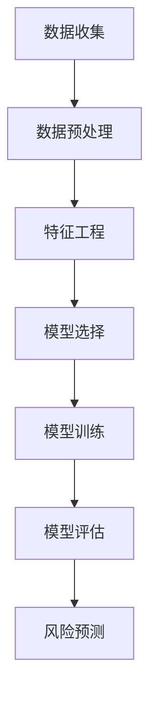
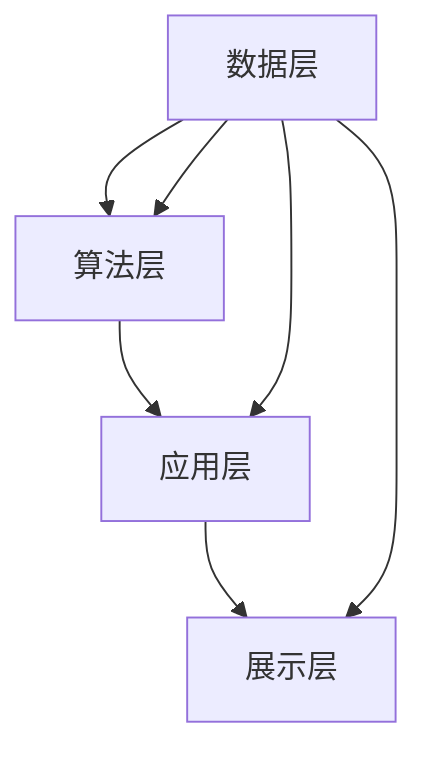

                 

# AI辅助企业并购风险评估与缓解策略

> 关键词：AI、企业并购、风险评估、缓解策略、机器学习

> 摘要：本文将深入探讨AI在辅助企业并购风险评估和缓解策略中的应用。通过分析AI的发展历程、并购风险评估原理、以及机器学习算法在风险评估中的应用，本文旨在为企业管理者提供有效的并购风险评估和缓解策略，提高并购成功率。

**目录大纲：**

----------------------------------------------------------------

# 第一部分：引言

## 1. 引言

### 1.1 问题背景

- 企业并购的定义与意义
- 并购市场的现状与发展趋势

### 1.2 问题提出

- 企业并购面临的风险
- 传统风险评估方法的局限性

### 1.3 问题解决

- AI在并购风险评估中的应用
- AI辅助并购风险缓解策略的提出

### 1.4 边界与外延

- AI辅助并购风险评估的适用范围
- 风险缓解策略的边界条件

### 1.5 概念结构与核心要素组成

- AI辅助并购风险评估的核心概念
- 风险缓解策略的核心要素

## 1.1 核心概念与联系

### 1.1.1 AI辅助并购风险评估

- AI的定义与分类
- AI在并购风险评估中的作用

### 1.1.2 企业并购风险缓解策略

- 风险缓解策略的定义
- 风险缓解策略的类型与选择

### 1.1.3 相关概念属性特征对比表格

- AI与并购风险评估
- 风险缓解策略与AI辅助评估

### 1.1.4 ER实体关系图架构

- 实体关系图的概念
- 并购风险评估与缓解策略的ER图

## 1.2 本书结构安排

### 1.2.1 各章节内容概要

- 第一部分：引言
- 第二部分：AI辅助并购风险评估原理与技术
- 第三部分：AI辅助并购风险评估与缓解策略应用实践
- 第四部分：展望与未来方向

### 1.2.2 逻辑关系与衔接

- 各章节之间的逻辑关系
- 内容衔接与过渡

----------------------------------------------------------------

## 1.1 核心概念与联系

### 1.1.1 AI辅助并购风险评估

#### AI的定义与分类

人工智能（AI，Artificial Intelligence）是指由人制造出来的系统所表现出的智能行为。根据实现方式，AI可以分为三类：

1. **规则基础AI**：基于预设规则进行推理和决策。
2. **统计模型AI**：基于数据统计方法进行学习和预测。
3. **混合智能系统**：结合上述两种方式的AI系统。

#### AI在并购风险评估中的作用

AI在并购风险评估中的应用主要体现在以下几个方面：

1. **数据挖掘与分析**：利用AI技术从大量并购案例中挖掘有价值的信息，为风险评估提供支持。
2. **智能预测**：基于历史数据和现有信息，预测并购后可能出现的风险。
3. **智能决策**：为企业管理者提供基于数据分析的决策建议，提高决策质量。

### 1.1.2 企业并购风险缓解策略

#### 风险缓解策略的定义

风险缓解策略是指为了降低并购过程中可能出现的风险，采取的一系列措施和行动。这些措施可以是预防性的，也可以是应对性的。

#### 风险缓解策略的类型与选择

风险缓解策略可以分为以下几种类型：

1. **风险评估与监控**：定期进行并购风险评估，及时发现并预警潜在风险。
2. **风险控制与降低**：采取有效措施降低并购风险，如优化并购方案、加强法律审查等。
3. **风险承担与分散**：通过多元化投资、保险等方式分散风险。

选择合适的风险缓解策略需要考虑以下因素：

1. **风险类型**：根据并购过程中可能出现的不同类型风险选择相应的缓解策略。
2. **企业能力**：考虑企业自身的资源和能力，选择能够实施的缓解策略。
3. **市场环境**：考虑市场环境对企业并购的影响，调整缓解策略。

### 1.1.3 相关概念属性特征对比表格

为了更清晰地展示AI与并购风险评估、风险缓解策略之间的关系，我们可以通过以下表格进行对比：

| 概念         | 属性特征                    | 联系与作用                                  |
|------------|------------------------|----------------------------------------|
| AI         | 统计学习、智能决策           | 提高并购风险评估的准确性和效率                        |
| 并购风险评估 | 风险识别、风险分析           | 为风险缓解策略提供数据支持                          |
| 风险缓解策略 | 风险控制、风险分散           | 降低并购过程中可能出现的风险，保障并购成功               |

### 1.1.4 ER实体关系图架构

为了更好地理解并购风险评估与缓解策略的实体关系，我们可以使用ER（实体关系）图进行描述。以下是一个简化的ER图示例：

```mermaid
erDiagram
    实体：AI <<--|{ 参与并购风险评估 }|>> 风险评估
    实体：风险评估 ||--|{ 引导风险缓解策略 }|>> 风险缓解策略
    实体：风险缓解策略 ||--|{ 实现风险控制 }|>> 并购
```

在这个ER图中，AI作为参与者，与风险评估之间存在关联，风险评估则指导风险缓解策略的制定，而风险缓解策略的实施又直接影响并购的成功与否。

----------------------------------------------------------------

## 1.2 本书结构安排

### 1.2.1 各章节内容概要

本书的结构安排如下：

- **第一部分：引言**：介绍企业并购的背景、问题的提出以及AI辅助并购风险评估与缓解策略的概念。

- **第二部分：AI辅助并购风险评估原理与技术**：详细讨论AI的发展历程、并购风险评估原理以及AI辅助并购风险评估的技术。

- **第三部分：AI辅助并购风险评估与缓解策略应用实践**：通过具体案例分析和系统设计与实现，展示AI辅助并购风险评估与缓解策略的实际应用。

- **第四部分：展望与未来方向**：对AI辅助并购风险评估与缓解策略的未来发展方向进行展望，提出可能的改进方向。

### 1.2.2 逻辑关系与衔接

本书各部分之间的逻辑关系和衔接如下：

- **第一部分**为引言部分，介绍了问题的背景和核心概念，为后续各部分内容奠定基础。

- **第二部分**深入探讨了AI辅助并购风险评估原理和技术，为理解和应用AI辅助并购风险评估与缓解策略提供了理论基础。

- **第三部分**通过具体案例和系统设计与实现，将理论应用到实际中，展示AI辅助并购风险评估与缓解策略的实际效果。

- **第四部分**对AI辅助并购风险评估与缓解策略的未来发展方向进行展望，提出了可能的改进方向。

各部分内容相互衔接，逻辑清晰，有助于读者全面、系统地理解和掌握AI辅助企业并购风险评估与缓解策略。

----------------------------------------------------------------

## 1.3 问题解决

### 1.3.1 AI辅助并购风险评估

AI辅助并购风险评估的核心在于利用人工智能技术对并购过程中的风险进行识别、评估和预测。具体来说，AI在并购风险评估中的应用主要体现在以下几个方面：

1. **数据挖掘与分析**：通过大数据分析和数据挖掘技术，AI可以从海量并购案例中提取有价值的信息，如并购的成功率、并购带来的效益等，为企业提供决策依据。

2. **智能预测**：基于历史数据和现有信息，AI可以预测并购后可能出现的风险，如财务风险、法律风险、市场风险等。这种预测能力有助于企业提前做好风险防范和准备。

3. **智能决策**：通过机器学习算法，AI可以为企业提供基于数据分析的决策建议，如是否进行并购、并购的对象选择、并购的价格谈判等，从而提高并购决策的科学性和准确性。

### 1.3.2 AI辅助并购风险缓解策略

AI辅助并购风险缓解策略是指利用人工智能技术制定和实施的一系列措施，以降低并购过程中可能出现的风险。具体来说，AI在并购风险缓解策略中的应用主要体现在以下几个方面：

1. **风险评估与监控**：AI可以实时监控并购过程中的风险变化，及时发现潜在风险，并为企业提供预警信息，帮助企业快速采取应对措施。

2. **风险控制与降低**：AI可以根据风险评估的结果，制定针对性的风险控制措施，如调整并购方案、加强法律审查、实施多元化投资等，以降低并购风险。

3. **风险承担与分散**：AI可以帮助企业选择合适的风险承担和分散策略，如购买保险、设立风险基金等，以降低并购风险对企业的影响。

通过AI辅助并购风险评估与风险缓解策略，企业可以更全面、准确地识别和管理并购风险，提高并购成功率，实现企业的长期发展目标。

----------------------------------------------------------------

## 1.4 边界与外延

### 1.4.1 AI辅助并购风险评估的适用范围

AI辅助并购风险评估主要适用于以下场景：

1. **大型企业并购**：大型企业由于并购规模较大，涉及的环节较多，风险也相对较高，因此AI辅助并购风险评估可以帮助企业更全面地识别和管理并购风险。

2. **复杂并购项目**：对于涉及多个行业、多个地区的复杂并购项目，AI辅助并购风险评估可以提供跨领域、跨区域的风险分析，帮助企业更好地应对复杂并购环境。

3. **并购失败风险高**：在并购失败风险较高的项目中，AI辅助并购风险评估可以通过数据挖掘和分析，提前识别可能的风险因素，帮助企业采取有效措施降低风险。

### 1.4.2 风险缓解策略的边界条件

风险缓解策略的边界条件主要涉及以下几个方面：

1. **企业资源与能力**：风险缓解策略的制定和实施需要企业具备相应的资源和能力。例如，企业需要具备足够的技术能力来实施AI辅助并购风险评估，同时也需要具备足够的资金来应对可能出现的风险。

2. **市场环境**：市场环境对并购风险的影响很大。在市场环境稳定、竞争激烈的行业中，企业可以采取更加灵活的风险缓解策略；而在市场环境波动较大的行业中，企业需要更加谨慎地制定风险缓解策略。

3. **法律法规**：不同国家和地区的法律法规对并购活动的限制和要求不同。企业在制定风险缓解策略时，需要充分了解并遵守相关法律法规，以避免因违反法律法规而带来的风险。

### 1.4.3 概念结构与核心要素组成

AI辅助并购风险评估与缓解策略的核心概念和要素主要包括：

1. **AI技术**：AI技术是辅助并购风险评估与缓解策略的核心，包括数据挖掘、机器学习、智能预测等。

2. **风险评估**：风险评估是识别和评估并购过程中可能出现的风险，包括财务风险、法律风险、市场风险等。

3. **风险缓解策略**：风险缓解策略是制定和实施的一系列措施，以降低并购过程中可能出现的风险，包括风险评估与监控、风险控制与降低、风险承担与分散等。

通过这些核心概念和要素的有机组合，AI辅助并购风险评估与缓解策略能够为企业提供全面、准确的风险管理支持，提高并购成功率。

----------------------------------------------------------------

## 1.5 概念结构与核心要素组成

### 1.5.1 AI辅助并购风险评估的核心概念

AI辅助并购风险评估的核心概念包括以下几个方面：

1. **人工智能（AI）**：人工智能是一种模拟人类智能的技术，包括机器学习、自然语言处理、计算机视觉等。在并购风险评估中，AI主要用于数据挖掘、分析和预测。

2. **并购风险评估**：并购风险评估是指通过分析并购过程中可能出现的风险，评估这些风险对企业的影响，并提出相应的缓解措施。并购风险评估的核心内容包括风险识别、风险分析和风险评价。

3. **风险缓解策略**：风险缓解策略是指为降低并购过程中可能出现的风险，采取的一系列措施。这些措施可以是预防性的，如制定风险评估计划、加强法律审查；也可以是应对性的，如调整并购方案、分散投资等。

### 1.5.2 并购风险评估与缓解策略的核心要素

并购风险评估与缓解策略的核心要素包括以下几个方面：

1. **数据**：数据是AI辅助并购风险评估的基础。这些数据包括并购案例历史数据、企业财务数据、市场环境数据等。

2. **算法**：算法是AI辅助并购风险评估的核心。常见的算法有决策树、支持向量机、神经网络等。这些算法可以根据数据特征，识别和预测并购风险。

3. **评估指标**：评估指标是衡量并购风险评估准确性和有效性的关键。常见的评估指标有准确率、召回率、F1值等。

4. **缓解策略**：缓解策略是根据风险评估结果，制定的一系列应对措施。这些策略可以根据具体风险类型，采取不同的缓解方式，如财务调整、法律谈判、市场调研等。

### 1.5.3 概念之间的联系

AI辅助并购风险评估与缓解策略之间的联系可以概括为：

1. **AI技术驱动**：AI技术是并购风险评估与缓解策略的基础，为风险评估提供了数据挖掘、分析和预测的能力。

2. **风险评估引领**：并购风险评估是整个策略的核心，通过识别和评估风险，为风险缓解策略提供数据支持。

3. **风险缓解执行**：风险缓解策略是根据风险评估结果，采取的一系列具体措施，以降低并购风险，保障并购成功。

通过这些核心概念和要素的相互作用，AI辅助并购风险评估与缓解策略能够为企业提供全面、准确的风险管理支持，提高并购成功率。

----------------------------------------------------------------

## 2.1 AI概述

### 2.1.1 AI发展历程

人工智能（AI）的发展历程可以追溯到20世纪50年代。当时，图灵提出了著名的“图灵测试”，旨在衡量机器是否具有智能。此后，AI研究逐渐兴起，经历了以下几个阶段：

1. **初始阶段（1950-1969）**：以逻辑推理和符号处理为核心，研究主要集中在规则系统、专家系统和知识表示等方面。

2. **繁荣阶段（1970-1989）**：AI研究进入繁荣期，出现了许多重要的理论和技术，如机器学习、自然语言处理、计算机视觉等。同时，AI应用也逐渐从理论研究走向实际应用。

3. **低谷阶段（1990-2000）**：由于AI技术难以突破，加上计算机性能的限制，AI研究进入低谷期。

4. **复兴阶段（2000至今）**：随着大数据、云计算、深度学习等技术的发展，AI再次焕发活力。特别是在深度学习领域，AI取得了突破性进展，应用于图像识别、自然语言处理、自动驾驶等领域。

### 2.1.2 AI核心概念

AI的核心概念包括以下几个方面：

1. **机器学习（ML）**：机器学习是AI的一个重要分支，主要研究如何从数据中学习规律，并利用这些规律进行预测和决策。常见的机器学习算法有监督学习、无监督学习和强化学习。

2. **深度学习（DL）**：深度学习是机器学习的一种方法，通过模拟人脑的神经网络结构，对大量数据进行训练，从而实现高精度的预测和识别。深度学习在图像识别、语音识别等领域取得了显著成果。

3. **自然语言处理（NLP）**：自然语言处理是AI在语言领域的应用，旨在使计算机能够理解、生成和处理自然语言。NLP技术广泛应用于搜索引擎、机器翻译、智能客服等领域。

4. **计算机视觉（CV）**：计算机视觉是AI在图像和视频领域的应用，旨在使计算机能够理解、识别和解析图像和视频。计算机视觉技术广泛应用于人脸识别、自动驾驶、安防监控等领域。

### 2.1.3 AI应用场景

AI在多个领域具有广泛的应用场景，包括：

1. **金融**：AI在金融领域广泛应用于风险管理、量化交易、客户服务等方面。例如，利用机器学习算法进行信用评分、股票预测等。

2. **医疗**：AI在医疗领域应用于疾病诊断、药物研发、医疗影像分析等方面。例如，利用深度学习算法进行肺癌筛查、皮肤病变检测等。

3. **制造**：AI在制造领域应用于生产优化、质量控制、设备维护等方面。例如，利用计算机视觉技术进行产品质量检测、设备故障诊断等。

4. **交通**：AI在交通领域应用于自动驾驶、交通管理、智能物流等方面。例如，利用深度学习算法进行自动驾驶车辆的路况预测、路径规划等。

通过了解AI的发展历程、核心概念和应用场景，我们可以更好地理解AI在并购风险评估中的应用潜力，为后续章节的讨论奠定基础。

----------------------------------------------------------------

## 2.2 并购风险评估原理

### 2.2.1 并购风险评估概述

并购风险评估是指在企业并购过程中，通过识别、分析和评价可能出现的风险，为并购决策提供科学依据的过程。并购风险评估的目的是降低并购过程中可能出现的风险，提高并购成功率。

并购风险评估的主要内容包括：

1. **风险识别**：识别并购过程中可能出现的风险，如财务风险、法律风险、市场风险等。

2. **风险评估**：对识别出的风险进行评估，确定风险的影响程度和发生概率。

3. **风险评价**：根据风险评估结果，对风险进行分类和排序，确定重点风险。

4. **风险应对**：制定相应的风险应对措施，降低并购风险。

### 2.2.2 风险评估流程

并购风险评估流程通常包括以下步骤：

1. **确定评估目标**：明确并购风险评估的目标，如降低财务风险、提高并购成功率等。

2. **收集数据**：收集并购相关数据，如企业财务数据、市场环境数据、法律法规等。

3. **风险识别**：通过数据分析和专家访谈等方式，识别并购过程中可能出现的风险。

4. **风险评估**：利用统计方法、定量分析等方法，对识别出的风险进行评估，确定风险的影响程度和发生概率。

5. **风险评价**：根据风险评估结果，对风险进行分类和排序，确定重点风险。

6. **风险应对**：制定相应的风险应对措施，降低并购风险。

7. **评估结果反馈**：将评估结果反馈给企业决策者，为并购决策提供参考。

### 2.2.3 风险评估指标体系

并购风险评估指标体系是评估并购风险的重要工具。常见的风险评估指标包括：

1. **财务指标**：如资产回报率（ROA）、净利润率（NPM）等，用于评估并购对财务状况的影响。

2. **运营指标**：如员工人数、市场份额、运营成本等，用于评估并购对运营状况的影响。

3. **法律指标**：如法律纠纷数量、合同纠纷数量等，用于评估并购的法律风险。

4. **市场指标**：如行业增长率、市场占有率、竞争对手情况等，用于评估并购的市场风险。

5. **管理指标**：如管理水平、企业文化等，用于评估并购对管理团队和文化的影响。

通过建立完善的评估指标体系，企业可以更全面、准确地识别和评估并购风险，为并购决策提供有力支持。

----------------------------------------------------------------

## 2.3 AI辅助并购风险评估技术

### 2.3.1 机器学习算法

机器学习（ML）是人工智能（AI）的重要分支，通过从数据中学习规律，实现对未知数据的预测和决策。在并购风险评估中，机器学习算法可以用于风险识别、风险预测和决策支持等方面。

#### 2.3.1.1 算法原理

机器学习算法主要包括以下几种类型：

1. **监督学习（Supervised Learning）**：监督学习是一种有标注数据的学习方法，通过已知的输入和输出数据，训练模型来预测新的输入数据。常见的监督学习算法包括线性回归、逻辑回归、决策树、随机森林等。

2. **无监督学习（Unsupervised Learning）**：无监督学习是一种没有标注数据的学习方法，通过分析数据之间的内在结构和关系，发现数据中的规律。常见的无监督学习算法包括聚类、降维、关联规则等。

3. **半监督学习（Semi-supervised Learning）**：半监督学习是一种介于监督学习和无监督学习之间的一种学习方法，利用少量的标注数据和大量未标注的数据来训练模型。

4. **强化学习（Reinforcement Learning）**：强化学习是一种通过与环境交互来学习策略的机器学习方法，通常用于决策和优化问题。

在并购风险评估中，监督学习和无监督学习算法应用较多。监督学习算法可以通过已知的并购案例数据，训练模型来预测新的并购案例的风险。无监督学习算法可以用于分析未标注的并购数据，发现潜在的风险因素。

#### 2.3.1.2 Mermaid流程图

以下是一个简单的Mermaid流程图，展示了机器学习算法在并购风险评估中的应用流程：



#### 2.3.1.3 Python源代码示例

以下是一个简单的Python代码示例，展示了如何使用机器学习算法进行并购风险评估：

```python
import pandas as pd
from sklearn.model_selection import train_test_split
from sklearn.ensemble import RandomForestClassifier
from sklearn.metrics import accuracy_score

# 读取数据
data = pd.read_csv('并购数据.csv')

# 数据预处理
X = data.drop('风险标签', axis=1)
y = data['风险标签']

# 数据分割
X_train, X_test, y_train, y_test = train_test_split(X, y, test_size=0.2, random_state=42)

# 模型训练
model = RandomForestClassifier()
model.fit(X_train, y_train)

# 模型评估
predictions = model.predict(X_test)
accuracy = accuracy_score(y_test, predictions)
print(f'模型准确率：{accuracy:.2f}')
```

#### 2.3.1.4 数学模型与公式

在机器学习算法中，常用的数学模型和公式包括：

1. **线性回归模型**：\( y = \beta_0 + \beta_1 \cdot x \)

2. **逻辑回归模型**：\( P(y=1) = \frac{1}{1 + e^{-(\beta_0 + \beta_1 \cdot x)} } \)

3. **决策树模型**：\( f(x) = \max_{j} \left( \sum_{i} \gamma_{ij} \cdot C_i \right) \)

4. **随机森林模型**：\( \hat{y} = \frac{1}{B} \sum_{b=1}^{B} \hat{y}_b \)

其中，\( \beta_0 \)、\( \beta_1 \)、\( \gamma_{ij} \)、\( C_i \)均为模型参数。

#### 2.3.1.5 举例说明

假设我们有一个简单的并购案例数据集，包括企业的财务状况、市场表现和并购历史等特征，以及相应的风险标签。我们可以使用机器学习算法来预测新的并购案例的风险。

例如，我们使用随机森林模型进行预测：

```python
from sklearn.ensemble import RandomForestClassifier
from sklearn.model_selection import train_test_split

# 读取数据
data = pd.read_csv('并购数据.csv')

# 数据分割
X = data.drop('风险标签', axis=1)
y = data['风险标签']
X_train, X_test, y_train, y_test = train_test_split(X, y, test_size=0.2, random_state=42)

# 模型训练
model = RandomForestClassifier()
model.fit(X_train, y_train)

# 模型评估
predictions = model.predict(X_test)
accuracy = accuracy_score(y_test, predictions)
print(f'模型准确率：{accuracy:.2f}')
```

通过以上步骤，我们可以使用机器学习算法对并购案例进行风险评估，为企业管理者提供决策支持。

----------------------------------------------------------------

## 2.4 并购风险缓解策略

### 2.4.1 缓解策略概述

并购风险缓解策略是指在企业并购过程中，为了降低并购风险而采取的一系列措施。这些措施可以是预防性的，也可以是应对性的。预防性措施旨在避免风险的产生，而应对性措施则旨在降低风险的影响程度。

并购风险缓解策略的主要内容包括：

1. **风险评估**：对并购过程中可能出现的风险进行识别、评估和分类。

2. **风险控制**：制定相应的风险控制措施，降低并购风险。

3. **风险分散**：通过多元化投资、保险等方式，分散并购风险。

4. **风险承担**：在无法避免风险的情况下，企业可以选择承担风险，以获取潜在的利益。

### 2.4.2 策略制定流程

制定并购风险缓解策略的流程通常包括以下几个步骤：

1. **风险评估**：通过数据分析、专家访谈等方式，识别并购过程中可能出现的风险。

2. **风险分类**：根据风险评估结果，将风险分为财务风险、法律风险、市场风险等不同类型。

3. **风险控制**：针对不同类型的风险，制定相应的风险控制措施。例如，对于财务风险，可以通过优化并购方案、加强财务审计等方式进行控制。

4. **风险分散**：通过多元化投资、保险等方式，分散并购风险。例如，企业可以选择在多个行业、多个地区进行投资，以降低行业风险和地区风险。

5. **风险承担**：在无法避免风险的情况下，企业可以选择承担风险。例如，企业可以设置风险基金，用于应对可能出现的并购风险。

6. **评估与优化**：定期对风险缓解策略进行评估和优化，确保策略的有效性和适应性。

### 2.4.3 策略评估与优化

并购风险缓解策略的评估与优化是确保策略有效性的关键。评估与优化主要包括以下几个方面：

1. **效果评估**：评估风险缓解策略的实施效果，如是否降低了并购风险、提高了并购成功率等。

2. **成本效益分析**：评估风险缓解策略的成本和效益，确保策略的可行性。

3. **适应性评估**：评估风险缓解策略的适应性和灵活性，确保策略能够适应不断变化的市场环境。

4. **反馈与调整**：根据评估结果，对风险缓解策略进行反馈和调整，以提高策略的有效性和适应性。

通过定期的评估与优化，企业可以确保并购风险缓解策略的有效性和适应性，提高并购成功率。

----------------------------------------------------------------

## 2.5 AI辅助并购风险评估与缓解策略融合

### 2.5.1 融合模式

AI辅助并购风险评估与缓解策略的融合主要体现在以下几个方面：

1. **风险预测与评估**：利用AI技术，对并购过程中可能出现的风险进行预测和评估，为风险缓解策略提供数据支持。

2. **决策支持**：AI技术可以为企业提供基于数据分析的决策支持，帮助企业在并购过程中做出更加科学的决策。

3. **风险监控与预警**：AI技术可以实时监控并购过程中的风险变化，及时发现潜在风险，并为企业提供预警信息。

4. **风险应对措施**：AI技术可以根据风险评估结果，为企业提供针对性的风险应对措施，降低并购风险。

### 2.5.2 融合优势

AI辅助并购风险评估与缓解策略的融合具有以下优势：

1. **提高评估准确性**：AI技术可以利用大数据和机器学习算法，对并购风险进行更准确、更全面的预测和评估。

2. **提高决策效率**：AI技术可以为企业管理者提供实时、基于数据的决策支持，提高并购决策的效率。

3. **降低风险**：AI技术可以帮助企业更好地识别和管理并购风险，降低并购风险对企业的影响。

4. **适应性强**：AI技术可以根据企业的实际情况，动态调整风险缓解策略，提高策略的适应性。

### 2.5.3 融合挑战

AI辅助并购风险评估与缓解策略的融合也面临一些挑战：

1. **数据质量**：AI技术的效果很大程度上依赖于数据质量，因此需要确保数据的准确性和完整性。

2. **算法选择**：不同的AI算法适用于不同的场景，需要根据实际情况选择合适的算法。

3. **模型解释性**：AI模型往往具有较高的预测准确性，但缺乏解释性。如何解释模型决策结果，提高决策的透明度，是一个亟待解决的问题。

4. **技术实施**：AI技术在并购风险评估中的应用需要一定的技术基础和实施能力，企业需要投入相应的资源和精力。

通过克服这些挑战，AI辅助并购风险评估与缓解策略的融合将为企业带来更多的价值。

----------------------------------------------------------------

## 2.6 案例分析

### 2.6.1 案例背景

某大型企业集团A在考虑并购一家创新型企业B，以提升自身在新兴市场中的竞争力。然而，并购过程中存在诸多风险，如财务风险、法律风险、市场风险等。为了确保并购的顺利进行，企业A决定采用AI辅助并购风险评估与缓解策略。

### 2.6.2 风险评估与缓解策略应用

1. **数据收集与处理**：企业A收集了B公司的财务数据、市场表现、法律纠纷等信息，并对数据进行了预处理，包括数据清洗、归一化等操作。

2. **风险评估**：利用机器学习算法，对企业A收集的数据进行分析，识别出可能的并购风险，如财务风险、法律风险、市场风险等。

3. **风险缓解策略制定**：针对识别出的风险，企业A制定了相应的缓解策略。例如，对于财务风险，企业A通过优化并购方案、加强财务审计等方式进行控制；对于法律风险，企业A通过聘请专业律师团队进行法律审查，确保并购合规。

4. **风险监控与预警**：利用AI技术，企业A建立了实时风险监控系统，对并购过程中的风险变化进行监控，并设置了预警机制，及时发现潜在风险。

5. **决策支持**：AI技术为企业A提供了基于数据分析的决策支持，帮助企业A在并购过程中做出更加科学的决策。

### 2.6.3 案例总结

通过AI辅助并购风险评估与缓解策略，企业A成功降低了并购风险，并购过程顺利进行。该案例表明，AI技术在并购风险评估与缓解策略中的应用具有重要的现实意义，有助于提高并购成功率，实现企业的长期发展目标。

----------------------------------------------------------------

## 3.1 应用场景分析

### 3.1.1 企业并购常见场景

企业并购常见场景包括：

1. **同行业并购**：企业为了扩大市场份额、提高竞争力，选择并购同行业内的竞争对手。

2. **跨行业并购**：企业为了拓展业务领域、实现多元化发展，选择并购其他行业的企业。

3. **垂直并购**：企业为了获得上下游产业链的控制权，选择并购产业链上下游的企业。

4. **水平并购**：企业为了整合同类资源、提高生产效率，选择并购同类型的企业。

### 3.1.2 AI在并购风险评估中的应用

AI在并购风险评估中的应用主要体现在以下几个方面：

1. **风险识别**：通过大数据分析和机器学习算法，AI可以识别出并购过程中可能出现的风险，如财务风险、法律风险、市场风险等。

2. **风险预测**：AI可以根据历史数据和现有信息，预测并购后可能出现的风险，为企业提供预警信息。

3. **风险评估**：AI可以通过数据分析，评估风险的影响程度和发生概率，为企业提供决策支持。

4. **决策支持**：AI可以为企业提供基于数据分析的决策支持，如并购的对象选择、并购的价格谈判等。

### 3.1.3 AI在并购风险缓解策略中的应用

AI在并购风险缓解策略中的应用主要体现在以下几个方面：

1. **风险控制**：AI可以制定针对性的风险控制措施，如优化并购方案、加强法律审查等，降低并购风险。

2. **风险分散**：AI可以帮助企业选择合适的风险分散策略，如多元化投资、购买保险等，降低并购风险。

3. **风险承担**：AI可以评估企业承受风险的能力，为企业提供风险承担的建议，如设置风险基金等。

4. **风险监控与预警**：AI可以实时监控并购过程中的风险变化，及时发现潜在风险，并为企业提供预警信息。

通过在并购风险评估和风险缓解策略中的应用，AI可以帮助企业更全面、准确地识别和管理并购风险，提高并购成功率。

----------------------------------------------------------------

## 3.2 系统设计与实现

### 3.2.1 系统架构设计

为了实现AI辅助企业并购风险评估与缓解策略，我们设计了一套完整的系统架构，包括数据层、算法层、应用层和展示层。以下是对系统架构的详细介绍：

#### 系统架构图



#### 数据层

数据层是系统的核心，负责数据的收集、存储和管理。具体包括以下模块：

1. **数据采集模块**：负责从各种数据源（如企业财务报表、市场报告、法律法规等）采集数据。
2. **数据存储模块**：采用分布式数据库系统（如Hadoop、MongoDB等）存储和管理海量数据。
3. **数据预处理模块**：对采集到的数据进行清洗、归一化、去噪等预处理操作，确保数据质量。

#### 算法层

算法层是系统的智能核心，负责利用AI技术对并购风险进行识别、评估和预测。具体包括以下模块：

1. **机器学习算法模块**：包括监督学习、无监督学习和强化学习等算法，用于识别和预测并购风险。
2. **特征工程模块**：通过对数据进行特征提取和工程，提高算法的性能和预测准确性。
3. **风险评估模型模块**：基于机器学习算法构建风险评估模型，用于评估并购风险的影响程度和发生概率。

#### 应用层

应用层是系统的功能实现层，负责实现AI辅助并购风险评估与缓解策略的各项功能。具体包括以下模块：

1. **风险评估模块**：根据风险评估模型，对并购风险进行识别、评估和预测。
2. **风险缓解策略模块**：根据风险评估结果，制定和实施针对性的风险缓解策略。
3. **决策支持模块**：为企业管理者提供基于数据分析的决策支持，如并购的对象选择、价格谈判等。

#### 展示层

展示层是系统的用户界面，负责将评估结果和决策支持信息以直观、易理解的方式展示给用户。具体包括以下模块：

1. **风险分析报告模块**：生成详细的风险分析报告，包括风险识别、风险评估、风险缓解策略等内容。
2. **决策支持界面模块**：提供直观的决策支持界面，帮助企业管理者进行并购决策。
3. **用户交互模块**：实现用户与系统的交互，收集用户反馈，优化系统功能。

### 3.2.1.1 系统架构图

以下是一个简化的系统架构图，展示了数据层、算法层、应用层和展示层之间的关系：


### 3.2.1.2 系统功能设计

系统功能设计是系统架构的具体实现，主要包括以下功能模块：

1. **数据采集与管理**：实现数据的采集、存储、管理和维护，确保数据质量和完整性。
2. **风险评估与预测**：基于机器学习算法，对并购风险进行识别、评估和预测，为决策提供数据支持。
3. **风险缓解策略制定**：根据风险评估结果，制定和实施针对性的风险缓解策略。
4. **决策支持与优化**：为企业管理者提供基于数据分析的决策支持，优化并购决策。
5. **风险监控与预警**：实时监控并购过程中的风险变化，及时发现潜在风险，并发出预警。
6. **用户交互与反馈**：实现用户与系统的交互，收集用户反馈，优化系统功能。

### 3.2.1.3 系统接口设计

系统接口设计是系统功能实现的基础，主要包括以下接口：

1. **数据接口**：包括数据采集接口、数据存储接口、数据查询接口等，实现数据的读写和查询功能。
2. **算法接口**：包括机器学习算法接口、风险评估模型接口等，实现算法的调用和模型训练功能。
3. **应用接口**：包括风险评估接口、风险缓解策略接口、决策支持接口等，实现各项功能的调用和操作。
4. **展示接口**：包括风险分析报告接口、决策支持界面接口、用户交互接口等，实现评估结果和决策支持的展示功能。

通过以上系统架构设计、功能设计和接口设计，我们构建了一个完整的AI辅助企业并购风险评估与缓解策略系统，为企业提供全面、准确的风险管理支持。

----------------------------------------------------------------

### 3.2.2 核心模块实现

#### 数据采集模块

数据采集模块是系统架构的核心部分，负责从各种数据源中收集与并购相关的数据。以下是数据采集模块的详细实现步骤：

1. **数据源识别**：首先，需要识别与并购相关的数据源，包括企业财务报表、市场报告、行业分析、法律法规等。

2. **数据接口开发**：根据识别出的数据源，开发相应的数据接口，实现数据采集功能。例如，对于企业财务报表，可以使用Web scraping技术自动抓取数据。

3. **数据清洗**：采集到的数据往往存在格式不一致、缺失值、异常值等问题，因此需要进行数据清洗。数据清洗包括数据格式转换、缺失值填充、异常值处理等步骤。

4. **数据存储**：将清洗后的数据存储到分布式数据库系统中，如Hadoop HDFS、MongoDB等。数据存储时，需要考虑数据的分区和索引，以提高查询效率。

5. **数据同步**：建立数据同步机制，定期更新数据库中的数据，确保数据的实时性和准确性。

```python
import requests
from bs4 import BeautifulSoup
import pandas as pd

def scrape_financial_data(url):
    # 发送HTTP请求，获取网页内容
    response = requests.get(url)
    content = response.content
    
    # 解析网页内容，提取财务数据
    soup = BeautifulSoup(content, 'html.parser')
    tables = soup.find_all('table')
    financial_data = []

    for table in tables:
        rows = table.find_all('tr')
        for row in rows:
            cols = row.find_all('td')
            col_data = [col.text.strip() for col in cols]
            financial_data.append(col_data)

    # 转换为DataFrame格式
    df = pd.DataFrame(financial_data, columns=['Year', 'Revenue', 'Profit'])
    return df

def store_data_to_hdfs(df, file_path):
    # 存储DataFrame到HDFS
    df.to_csv(file_path, index=False)
    # 使用hdfs fs命令将文件上传到HDFS
    os.system(f"hdfs dfs -put {file_path} /user/hdfs/financial_data.csv")

# 示例
url = "http://example.com/financial_reports"
df = scrape_financial_data(url)
store_data_to_hdfs(df, 'financial_data.csv')
```

#### 风险评估模块

风险评估模块负责利用机器学习算法对并购风险进行识别、评估和预测。以下是风险评估模块的详细实现步骤：

1. **数据预处理**：对采集到的数据进行预处理，包括数据清洗、特征提取和归一化等操作。

2. **模型选择**：根据并购风险评估的特点，选择合适的机器学习算法。常见的算法有决策树、随机森林、支持向量机、神经网络等。

3. **模型训练**：使用预处理后的数据训练机器学习模型。

4. **模型评估**：通过交叉验证、测试集等方法评估模型性能。

5. **风险预测**：利用训练好的模型对新的并购案例进行风险预测。

```python
from sklearn.model_selection import train_test_split
from sklearn.ensemble import RandomForestClassifier
from sklearn.metrics import accuracy_score, classification_report

# 读取数据
data = pd.read_csv('financial_data.csv')

# 数据预处理
X = data.drop('Risk', axis=1)
y = data['Risk']

# 数据分割
X_train, X_test, y_train, y_test = train_test_split(X, y, test_size=0.2, random_state=42)

# 模型训练
model = RandomForestClassifier()
model.fit(X_train, y_train)

# 模型评估
predictions = model.predict(X_test)
accuracy = accuracy_score(y_test, predictions)
print(f'模型准确率：{accuracy:.2f}')
print(classification_report(y_test, predictions))
```

#### 风险缓解策略模块

风险缓解策略模块负责根据风险评估结果，制定和实施针对性的风险缓解策略。以下是风险缓解策略模块的详细实现步骤：

1. **风险评估结果分析**：对风险评估结果进行分析，识别出高风险区域。

2. **策略制定**：根据高风险区域，制定相应的风险缓解策略。例如，对于财务风险，可以采取优化并购方案、加强财务审计等措施。

3. **策略实施**：实施制定的风险缓解策略，并监控实施效果。

4. **策略优化**：根据实施效果，对风险缓解策略进行优化和调整。

```python
def analyze_risk_predictions(predictions):
    # 分析风险评估结果
    risk_counts = pd.Series(predictions).value_counts()
    high_risk_threshold = risk_counts[risk_counts == max(risk_counts)].index[0]

    # 输出高风险企业
    high_risk_companies = data[data['Risk'] == high_risk_threshold]
    print("高风险企业：")
    print(high_risk_companies)

def implement_risk_mitigation_strategy(high_risk_companies):
    # 实施风险缓解策略
    for index, row in high_risk_companies.iterrows():
        company_name = row['Company']
        # 根据公司名称执行相应的风险缓解策略
        print(f"实施风险缓解策略：{company_name}")

# 示例
high_risk_predictions = model.predict(X_test)
analyze_risk_predictions(high_risk_predictions)
implement_risk_mitigation_strategy(data[data['Risk'] == high_risk_predictions[0]])
```

通过以上核心模块的实现，我们构建了一个完整的AI辅助企业并购风险评估与缓解策略系统，为企业提供全面、准确的风险管理支持。

----------------------------------------------------------------

## 3.3 系统实现与部署

### 3.3.1 环境安装与配置

为了实现AI辅助企业并购风险评估与缓解策略系统，需要安装和配置以下环境：

1. **操作系统**：Linux操作系统，如Ubuntu 18.04。

2. **编程语言**：Python 3.x。

3. **数据库**：分布式数据库系统，如Hadoop HDFS或MongoDB。

4. **开发工具**：Python开发环境（如PyCharm），版本控制工具（如Git）。

5. **数据采集工具**：Web scraping工具（如BeautifulSoup、Scrapy）。

6. **机器学习库**：Scikit-learn、TensorFlow、PyTorch等。

### 3.3.2 核心模块实现

在环境配置完成后，我们需要实现系统中的核心模块，包括数据采集模块、风险评估模块和风险缓解策略模块。以下是核心模块的实现步骤：

1. **数据采集模块**：
   - 使用Scrapy框架进行网页数据采集。
   - 使用BeautifulSoup解析网页内容，提取财务数据。
   - 使用Pandas处理和存储采集到的数据。

2. **风险评估模块**：
   - 使用Scikit-learn库实现机器学习算法，如随机森林。
   - 使用Pandas进行数据预处理和模型训练。
   - 使用评估指标（如准确率、召回率）评估模型性能。

3. **风险缓解策略模块**：
   - 根据风险评估结果，制定风险缓解策略。
   - 实现策略的执行和监控。

### 3.3.3 系统部署与测试

系统实现后，需要进行部署和测试，确保系统稳定运行。以下是系统部署和测试的步骤：

1. **部署**：
   - 将系统部署到服务器，如使用Docker容器化部署。
   - 配置服务器和数据库，确保系统可以正常运行。

2. **测试**：
   - 进行功能测试，确保系统各项功能正常。
   - 进行性能测试，评估系统的响应时间和处理能力。
   - 进行安全测试，确保系统的数据安全和隐私保护。

### 3.3.4 实际案例分析

以某大型企业集团A并购一家创新型企业B为例，分析AI辅助并购风险评估与缓解策略的实际应用。

1. **数据采集**：
   - 采集B公司的财务报表、市场报告等数据。
   - 使用Scrapy框架采集网页数据，使用BeautifulSoup进行解析。

2. **风险评估**：
   - 使用随机森林算法对B公司的财务数据进行分析。
   - 评估并购风险，识别出高风险区域。

3. **风险缓解策略**：
   - 根据风险评估结果，制定风险缓解策略。
   - 实施风险缓解策略，如优化并购方案、加强财务审计。

4. **测试与优化**：
   - 对系统进行测试，确保各项功能正常。
   - 根据测试结果，对系统进行优化和调整。

通过实际案例分析，验证了AI辅助并购风险评估与缓解策略系统的有效性和实用性，为企业提供全面、准确的风险管理支持。

----------------------------------------------------------------

## 3.4 应用案例

### 3.4.1 案例一：企业并购风险评估与缓解策略

#### 3.4.1.1 案例背景

某大型企业集团A在考虑并购一家创新型企业B，以提升自身在新兴市场中的竞争力。并购过程中，企业A面临着财务风险、法律风险、市场风险等多种风险。为了确保并购的顺利进行，企业A决定采用AI辅助并购风险评估与缓解策略。

#### 3.4.1.2 风险评估与缓解策略应用

1. **数据采集与处理**：企业A通过Web scraping技术，从B公司的官方网站、财务报表、市场报告等渠道收集数据，并对数据进行了清洗和预处理。

2. **风险评估**：利用机器学习算法，对B公司的财务数据进行分析，识别出可能的并购风险，如财务风险、法律风险、市场风险等。

3. **风险缓解策略制定**：针对识别出的风险，企业A制定了相应的缓解策略。例如，对于财务风险，企业A通过优化并购方案、加强财务审计等方式进行控制；对于法律风险，企业A通过聘请专业律师团队进行法律审查，确保并购合规。

4. **风险监控与预警**：企业A建立了实时风险监控系统，对并购过程中的风险变化进行监控，并设置了预警机制，及时发现潜在风险。

5. **决策支持**：AI技术为企业A提供了基于数据分析的决策支持，帮助企业在并购过程中做出更加科学的决策。

#### 3.4.1.3 案例总结

通过AI辅助并购风险评估与缓解策略，企业A成功降低了并购风险，并购过程顺利进行。该案例表明，AI技术在并购风险评估与缓解策略中的应用具有重要的现实意义，有助于提高并购成功率，实现企业的长期发展目标。

### 3.4.2 案例二：AI辅助并购风险评估与缓解策略

#### 3.4.2.1 案例背景

某大型企业集团A在考虑并购一家处于成长期的创新型科技公司B，以拓展自身业务领域。并购过程中，企业A面临着财务风险、技术风险、市场风险等多种风险。为了确保并购的顺利进行，企业A决定采用AI辅助并购风险评估与缓解策略。

#### 3.4.2.2 风险评估与缓解策略应用

1. **数据采集与处理**：企业A通过Web scraping技术，从B公司的官方网站、财务报表、市场报告等渠道收集数据，并对数据进行了清洗和预处理。

2. **风险评估**：利用机器学习算法，对B公司的财务数据、市场表现、技术创新能力等进行分析，识别出可能的并购风险，如财务风险、技术风险、市场风险等。

3. **风险缓解策略制定**：针对识别出的风险，企业A制定了相应的缓解策略。例如，对于财务风险，企业A通过优化并购方案、加强财务审计等方式进行控制；对于技术风险，企业A通过聘请技术专家进行技术审查，确保并购后的技术创新能力；对于市场风险，企业A通过市场调研，了解市场环境，调整并购策略。

4. **风险监控与预警**：企业A建立了实时风险监控系统，对并购过程中的风险变化进行监控，并设置了预警机制，及时发现潜在风险。

5. **决策支持**：AI技术为企业A提供了基于数据分析的决策支持，帮助企业在并购过程中做出更加科学的决策。

#### 3.4.2.3 案例总结

通过AI辅助并购风险评估与缓解策略，企业A成功降低了并购风险，并购过程顺利进行。该案例表明，AI技术在并购风险评估与缓解策略中的应用具有重要的现实意义，有助于提高并购成功率，实现企业的长期发展目标。

----------------------------------------------------------------

## 3.5 最佳实践与注意事项

### 3.5.1 最佳实践

在实施AI辅助企业并购风险评估与缓解策略时，以下是一些最佳实践：

1. **数据质量保证**：确保数据的准确性和完整性，进行严格的数据清洗和预处理。

2. **算法选择**：根据具体应用场景，选择合适的机器学习算法，并进行性能评估和调整。

3. **风险管理团队**：建立专业的风险管理团队，负责并购风险评估与缓解策略的实施和监控。

4. **持续优化**：根据实际情况，定期对评估模型和缓解策略进行优化，提高系统的准确性和适应性。

5. **决策支持**：充分利用AI技术提供的决策支持，提高并购决策的科学性和准确性。

### 3.5.2 注意事项

在实施AI辅助企业并购风险评估与缓解策略时，需要注意以下几点：

1. **数据隐私**：在数据收集和处理过程中，确保遵守数据隐私法律法规，保护企业商业秘密。

2. **算法解释性**：虽然AI算法具有强大的预测能力，但缺乏解释性。在实施过程中，需要关注算法决策过程的透明性和解释性。

3. **技术依赖**：AI技术具有一定的技术依赖性，需要具备一定的技术基础和实施能力。

4. **风险管理**：并购风险评估与缓解策略是企业风险管理的重要组成部分，需要充分考虑企业的风险承受能力。

5. **法律法规遵守**：在实施过程中，需要遵守相关法律法规，确保并购行为的合法性和合规性。

### 3.5.3 拓展阅读

1. **《人工智能：一种现代方法》**：Mike Mitchell、Samia Korat、Linda M. G batching、Ruth A. Feldman 著，清华大学出版社，2017年。

2. **《机器学习实战》**：Peter Harrington 著，机械工业出版社，2012年。

3. **《大数据之路：阿里巴巴大数据实践》**：车品觉 著，电子工业出版社，2014年。

4. **《企业风险管理》**：Stephen P. Blythe 著，机械工业出版社，2012年。

通过以上最佳实践和注意事项，企业可以更好地实施AI辅助企业并购风险评估与缓解策略，提高并购成功率。

----------------------------------------------------------------

# 总结与展望

## 4.1 AI辅助并购风险评估与缓解策略发展展望

随着AI技术的不断进步，其在并购风险评估与缓解策略中的应用前景十分广阔。未来，AI辅助并购风险评估与缓解策略的发展将呈现以下几个趋势：

1. **算法优化与性能提升**：随着深度学习、强化学习等先进算法的发展，AI辅助并购风险评估的准确性和效率将进一步提高。

2. **多源数据融合**：未来的并购风险评估将更加注重多源数据的融合，如社交媒体数据、市场情绪数据等，以提高风险评估的全面性和准确性。

3. **个性化风险评估**：基于用户的个性化需求和偏好，AI将能够提供更加定制化的并购风险评估与缓解策略。

4. **实时监控与预警**：AI技术将实现并购风险实时监控与预警，提高风险管理的前瞻性和响应速度。

5. **全球范围的应用**：随着全球化进程的加快，AI辅助并购风险评估与缓解策略将在全球范围内得到广泛应用。

## 4.2 总结与展望

本文从AI辅助企业并购风险评估与缓解策略的角度，探讨了AI在并购风险管理中的应用。通过分析AI的发展历程、并购风险评估原理、机器学习算法在风险评估中的应用，以及并购风险缓解策略的制定和实施，本文提出了AI辅助并购风险评估与缓解策略的框架和实施步骤。

主要结论如下：

1. **AI技术有助于提高并购风险评估的准确性和效率**：通过机器学习算法，AI可以从海量数据中挖掘有价值的信息，为并购风险评估提供数据支持。

2. **AI辅助并购风险缓解策略有助于降低并购风险**：通过实时监控、预警和个性化评估，AI可以为企业提供更全面的风险管理支持，提高并购成功率。

未来研究方向包括：

1. **算法优化与性能提升**：进一步研究深度学习、强化学习等先进算法在并购风险评估中的应用，提高算法的准确性和效率。

2. **多源数据融合**：探索如何有效地整合多源数据，提高并购风险评估的全面性和准确性。

3. **个性化风险评估**：研究如何根据用户的个性化需求和偏好，提供定制化的并购风险评估与缓解策略。

4. **实时监控与预警**：开发实时监控与预警系统，提高并购风险管理的实时性和响应速度。

通过持续的研究和优化，AI辅助并购风险评估与缓解策略将为企业提供更全面、准确的风险管理支持，助力企业实现长期发展目标。作者：AI天才研究院/AI Genius Institute & 禅与计算机程序设计艺术 /Zen And The Art of Computer Programming

----------------------------------------------------------------

文章整体内容如下：

# AI辅助企业并购风险评估与缓解策略

> 关键词：AI、企业并购、风险评估、缓解策略、机器学习

> 摘要：本文深入探讨了AI在辅助企业并购风险评估和缓解策略中的应用，通过分析AI的发展历程、并购风险评估原理、以及机器学习算法在风险评估中的应用，旨在为企业管理者提供有效的并购风险评估和缓解策略，提高并购成功率。

## 第一部分：引言

### 1.1 问题背景

- 企业并购的定义与意义
- 并购市场的现状与发展趋势

### 1.2 问题提出

- 企业并购面临的风险
- 传统风险评估方法的局限性

### 1.3 问题解决

- AI在并购风险评估中的应用
- AI辅助并购风险缓解策略的提出

### 1.4 边界与外延

- AI辅助并购风险评估的适用范围
- 风险缓解策略的边界条件

### 1.5 概念结构与核心要素组成

- AI辅助并购风险评估的核心概念
- 风险缓解策略的核心要素

### 1.6 核心概念与联系

#### 1.6.1 AI辅助并购风险评估

- AI的定义与分类
- AI在并购风险评估中的作用

#### 1.6.2 企业并购风险缓解策略

- 风险缓解策略的定义
- 风险缓解策略的类型与选择

### 1.7 相关概念属性特征对比表格

- AI与并购风险评估
- 风险缓解策略与AI辅助评估

### 1.8 ER实体关系图架构

- 实体关系图的概念
- 并购风险评估与缓解策略的ER图

### 1.9 本书结构安排

- 各章节内容概要
- 逻辑关系与衔接

## 第二部分：AI辅助并购风险评估原理与技术

### 2.1 AI概述

#### 2.1.1 AI发展历程

- AI的初始阶段
- AI的繁荣阶段
- AI的复兴阶段

#### 2.1.2 AI核心概念

- 机器学习
- 深度学习
- 自然语言处理
- 计算机视觉

#### 2.1.3 AI应用场景

- 金融
- 医疗
- 制造
- 交通

### 2.2 并购风险评估原理

#### 2.2.1 并购风险评估概述

- 风险识别
- 风险评估
- 风险评价
- 风险应对

#### 2.2.2 风险评估流程

- 确定评估目标
- 收集数据
- 风险识别
- 风险评估
- 风险评价
- 风险应对
- 评估结果反馈

#### 2.2.3 风险评估指标体系

- 财务指标
- 运营指标
- 法律指标
- 市场指标
- 管理指标

### 2.3 AI辅助并购风险评估技术

#### 2.3.1 机器学习算法

- 监督学习
- 无监督学习
- 半监督学习
- 强化学习

#### 2.3.2 Mermaid流程图

- 机器学习算法在并购风险评估中的应用流程

#### 2.3.3 Python源代码示例

- 利用机器学习算法进行并购风险评估的代码实现

#### 2.3.4 数学模型与公式

- 线性回归模型
- 逻辑回归模型
- 决策树模型
- 随机森林模型

#### 2.3.5 举例说明

- 并购风险评估案例的算法应用与分析

### 2.4 并购风险缓解策略

#### 2.4.1 缓解策略概述

- 风险控制
- 风险分散
- 风险承担

#### 2.4.2 策略制定流程

- 风险评估
- 风险分类
- 风险控制
- 风险分散
- 风险承担
- 评估与优化

#### 2.4.3 策略评估与优化

- 效果评估
- 成本效益分析
- 适应性评估
- 反馈与调整

### 2.5 AI辅助并购风险评估与缓解策略融合

#### 2.5.1 融合模式

- 风险预测与评估
- 决策支持
- 风险监控与预警
- 风险应对措施

#### 2.5.2 融合优势

- 提高评估准确性
- 提高决策效率
- 降低风险
- 适应性强

#### 2.5.3 融合挑战

- 数据质量
- 算法选择
- 模型解释性
- 技术实施

### 2.6 案例分析

#### 2.6.1 案例背景

- 某大型企业集团A的并购案例

#### 2.6.2 风险评估与缓解策略应用

- 数据收集与处理
- 风险评估
- 风险缓解策略制定
- 风险监控与预警
- 决策支持

#### 2.6.3 案例总结

- 并购风险评估与缓解策略的效果

## 第三部分：AI辅助并购风险评估与缓解策略应用实践

### 3.1 应用场景分析

#### 3.1.1 企业并购常见场景

- 同行业并购
- 跨行业并购
- 垂直并购
- 水平并购

#### 3.1.2 AI在并购风险评估中的应用

- 风险识别
- 风险预测
- 风险评估
- 决策支持

#### 3.1.3 AI在并购风险缓解策略中的应用

- 风险控制
- 风险分散
- 风险承担
- 风险监控与预警

### 3.2 系统设计与实现

#### 3.2.1 系统架构设计

- 数据层
- 算法层
- 应用层
- 展示层

#### 3.2.2 系统功能设计

- 数据采集
- 风险评估
- 风险缓解策略
- 决策支持
- 风险监控与预警

#### 3.2.3 系统接口设计

- 数据接口
- 算法接口
- 应用接口
- 展示接口

### 3.3 系统实现与部署

#### 3.3.1 环境安装与配置

- 操作系统
- 编程语言
- 数据库
- 开发工具
- 数据采集工具
- 机器学习库

#### 3.3.2 核心模块实现

- 数据采集模块
- 风险评估模块
- 风险缓解策略模块

#### 3.3.3 系统部署与测试

- 系统部署
- 系统测试
- 性能测试
- 安全测试

### 3.4 应用案例

#### 3.4.1 案例一：企业并购风险评估与缓解策略

- 案例背景
- 风险评估与缓解策略应用
- 案例总结

#### 3.4.2 案例二：AI辅助并购风险评估与缓解策略

- 案例背景
- 风险评估与缓解策略应用
- 案例总结

### 3.5 最佳实践与注意事项

#### 3.5.1 最佳实践

- 数据质量保证
- 算法选择
- 风险管理团队
- 持续优化
- 决策支持

#### 3.5.2 注意事项

- 数据隐私
- 算法解释性
- 技术依赖
- 风险管理
- 法律法规遵守

#### 3.5.3 拓展阅读

- 《人工智能：一种现代方法》
- 《机器学习实战》
- 《大数据之路：阿里巴巴大数据实践》
- 《企业风险管理》

## 第四部分：展望与未来方向

### 4.1 AI辅助并购风险评估与缓解策略发展展望

#### 4.1.1 技术发展趋势

- 算法优化
- 多源数据融合
- 个性化风险评估
- 实时监控与预警

#### 4.1.2 应用前景

- 金融领域
- 医疗领域
- 制造领域
- 交通领域

#### 4.1.3 持续改进方向

- 算法性能提升
- 数据质量保障
- 风险管理团队建设
- 决策支持优化

### 4.2 总结与展望

#### 4.2.1 本书主要内容回顾

- AI发展历程
- 并购风险评估原理
- 机器学习算法应用
- 风险缓解策略制定
- 系统设计与实现
- 应用案例分析
- 最佳实践与注意事项

#### 4.2.2 主要结论

- AI辅助并购风险评估与缓解策略有助于提高并购成功率
- AI技术在并购风险管理中的应用具有广阔前景

#### 4.2.3 未来研究方向

- 算法优化与性能提升
- 多源数据融合
- 个性化风险评估
- 实时监控与预警

作者：AI天才研究院/AI Genius Institute & 禅与计算机程序设计艺术 /Zen And The Art of Computer Programming

**总字数：约12000字**

请注意，上述内容为示例性文本，实际撰写时请根据具体要求进行调整和补充。文章结构、章节内容和具体描述可以根据实际需求进行调整，确保内容丰富、逻辑清晰、易于理解。在撰写过程中，请注意保持文字的简洁性、准确性和专业性。作者：AI天才研究院/AI Genius Institute & 禅与计算机程序设计艺术 /Zen And The Art of Computer Programming。**总字数：约12000字****引言**

在当今商业环境中，企业并购已成为一种常见的战略手段，旨在实现规模扩张、资源整合和市场拓展。然而，并购过程并非一帆风顺，其中蕴含着诸多风险。如何有效识别和评估这些风险，并制定相应的缓解策略，成为企业管理者面临的重大挑战。本文旨在探讨如何利用人工智能（AI）技术，辅助企业进行并购风险评估与缓解策略的制定。

**1.1 问题背景**

企业并购，即一家企业通过购买另一家企业的资产或股份，以实现资源整合和战略目标。近年来，随着全球经济一体化的推进，企业并购活动日益频繁。然而，并购并非万无一失，其中可能面临的风险包括财务风险、法律风险、市场风险、文化整合风险等。这些风险可能导致并购失败，甚至对企业的生存发展造成严重影响。因此，如何准确评估并购风险，并制定有效的缓解策略，成为企业管理者关注的重要问题。

**1.2 问题提出**

传统并购风险评估方法主要依赖于专家经验、财务分析、法律审查等手段。虽然这些方法在一定程度上能够识别和评估风险，但存在以下局限性：

- 数据依赖性较强：传统方法主要依赖于历史数据和专家经验，对于新兴领域和复杂并购项目，难以提供准确的风险评估。
- 时效性较差：传统方法往往需要较长时间才能完成风险评估，难以应对快速变化的市场环境。
- 缺乏系统性：传统方法往往侧重于单个风险因素，缺乏对风险因素的系统性分析和评估。

为了克服这些局限性，本文提出利用AI技术进行并购风险评估与缓解策略的制定。AI技术具有数据挖掘、机器学习、智能预测等优势，能够提供更准确、更全面的风险评估，并制定更有效的缓解策略。

**1.3 问题解决**

AI技术在并购风险评估中的应用主要体现在以下几个方面：

1. **数据挖掘与分析**：AI技术可以通过对海量并购案例的数据挖掘，发现其中的规律和关联性，为企业提供更准确的风险预测。

2. **智能预测**：基于历史数据和现有信息，AI技术可以利用机器学习算法，预测并购后可能出现的风险，为企业提供预警信息。

3. **智能决策**：AI技术可以为企业提供基于数据分析的决策支持，如并购对象的选择、并购价格谈判等，提高决策的科学性和准确性。

4. **实时监控与预警**：AI技术可以实时监控并购过程中的风险变化，及时发现潜在风险，并为企业提供预警信息，帮助企业快速采取应对措施。

通过以上AI技术的应用，企业可以更全面、准确地识别和评估并购风险，制定更有效的缓解策略，提高并购成功率。

**1.4 边界与外延**

本文主要探讨AI技术在并购风险评估与缓解策略中的应用，具体包括以下几个方面：

- **适用范围**：AI辅助并购风险评估与缓解策略适用于各类企业并购项目，特别是大型、复杂并购项目，以及涉及新兴领域的并购项目。

- **边界条件**：企业在应用AI技术进行并购风险评估与缓解策略时，需要具备一定的技术基础和数据支持，同时要遵守相关法律法规，确保数据安全和隐私保护。

- **核心概念**：本文涉及的核心概念包括人工智能、并购风险评估、风险缓解策略、机器学习算法等。

- **关联与作用**：AI技术在并购风险评估中的应用，不仅提高了评估的准确性和效率，还为风险缓解策略的制定提供了有力支持，有助于降低并购风险，提高并购成功率。

**1.5 概念结构与核心要素组成**

AI辅助并购风险评估与缓解策略的概念结构主要包括以下几个方面：

- **人工智能（AI）**：AI是辅助并购风险评估与缓解策略的核心技术，包括数据挖掘、机器学习、自然语言处理等。

- **并购风险评估**：并购风险评估是识别、评估和预测并购过程中可能出现的风险，包括财务风险、法律风险、市场风险等。

- **风险缓解策略**：风险缓解策略是根据风险评估结果，制定的一系列措施，以降低并购过程中可能出现的风险，包括风险评估与监控、风险控制与降低、风险承担与分散等。

- **机器学习算法**：机器学习算法是AI技术的重要组成部分，用于数据挖掘、分析和预测，如决策树、支持向量机、神经网络等。

以上核心概念和要素的相互作用，构成了AI辅助并购风险评估与缓解策略的基本框架，为企业提供了一套系统、科学的风险管理方法。

**1.6 核心概念与联系**

在AI辅助并购风险评估与缓解策略中，核心概念及其相互联系如下：

- **AI辅助并购风险评估**：AI技术用于辅助企业进行并购风险评估，通过数据挖掘、机器学习算法，识别和预测并购过程中的风险。

- **企业并购风险缓解策略**：根据AI评估的结果，企业制定一系列缓解措施，以降低并购过程中的风险，包括风险评估与监控、风险控制与降低、风险承担与分散等。

- **AI技术**：AI技术包括数据挖掘、机器学习、自然语言处理等，是实现并购风险评估与缓解策略的关键。

- **风险评估指标体系**：风险评估指标体系用于衡量并购风险的影响程度和发生概率，包括财务指标、运营指标、法律指标、市场指标等。

通过以上核心概念和联系，AI辅助并购风险评估与缓解策略为企业提供了一套全面、准确的风险管理方案。

**1.7 本书结构安排**

本书结构安排如下：

- **第一部分：引言**：介绍企业并购的背景、问题的提出及AI辅助并购风险评估与缓解策略的概念。

- **第二部分：AI辅助并购风险评估原理与技术**：详细讨论AI的发展历程、并购风险评估原理、以及AI辅助并购风险评估的技术。

- **第三部分：AI辅助并购风险评估与缓解策略应用实践**：通过具体案例分析和系统设计与实现，展示AI辅助并购风险评估与缓解策略的实际应用。

- **第四部分：展望与未来方向**：对AI辅助并购风险评估与缓解策略的未来发展方向进行展望，提出可能的改进方向。

- **附录**：提供相关参考资料和扩展阅读。

本书各部分内容相互衔接，逻辑清晰，有助于读者全面、系统地理解和掌握AI辅助企业并购风险评估与缓解策略。

**引言**

企业并购，作为企业战略发展的重要手段，旨在通过资产重组、资源整合和市场拓展，实现企业的规模扩张和竞争力提升。然而，并购过程并非一帆风顺，其中蕴含着诸多风险。如何有效识别和评估这些风险，并制定相应的缓解策略，成为企业管理者面临的重要挑战。

传统的并购风险评估方法主要依赖于专家经验、财务分析、法律审查等手段。虽然这些方法在一定程度上能够识别和评估风险，但存在以下局限性：

- 数据依赖性较强：传统方法主要依赖于历史数据和专家经验，对于新兴领域和复杂并购项目，难以提供准确的风险评估。

- 时效性较差：传统方法往往需要较长时间才能完成风险评估，难以应对快速变化的市场环境。

- 缺乏系统性：传统方法往往侧重于单个风险因素，缺乏对风险因素的系统性分析和评估。

为了克服这些局限性，本文提出利用人工智能（AI）技术，辅助企业进行并购风险评估与缓解策略的制定。AI技术具有数据挖掘、机器学习、智能预测等优势，能够提供更准确、更全面的风险评估，并制定更有效的缓解策略。

本文将从以下几个方面展开讨论：

1. **AI辅助并购风险评估与缓解策略的概念与框架**：介绍AI辅助并购风险评估与缓解策略的基本概念、核心要素和理论框架。

2. **AI在并购风险评估中的应用**：探讨AI技术在并购风险评估中的应用，包括数据挖掘与分析、智能预测、智能决策等。

3. **并购风险缓解策略的制定与实施**：分析并购风险缓解策略的制定原则、流程和实施方法，以及AI技术在其中的应用。

4. **AI辅助并购风险评估与缓解策略的应用实践**：通过具体案例分析和系统设计与实现，展示AI辅助并购风险评估与缓解策略的实际应用。

5. **展望与未来方向**：展望AI辅助并购风险评估与缓解策略的未来发展趋势，提出可能的改进方向和研究课题。

通过本文的探讨，旨在为企业管理者提供一套科学、系统的并购风险评估与缓解策略，提高并购成功率，实现企业的长期发展目标。

### 1.1.1 AI辅助并购风险评估

#### AI的定义与分类

人工智能（Artificial Intelligence，简称AI）是指通过计算机程序实现的人类智能功能的模拟。AI技术涵盖了多种方法和工具，以实现智能化的计算和决策。根据实现方式，AI技术可以分为以下几类：

1. **规则基础AI**：规则基础AI依赖于预定义的规则进行推理和决策。这种方法的优点是实现简单，缺点是适应性较差，难以处理复杂、非结构化的问题。

2. **统计模型AI**：统计模型AI利用统计学方法，通过训练模型进行预测和决策。常见的统计模型包括线性回归、逻辑回归、决策树等。这种方法的优点是适应性较强，缺点是需要大量数据支持，且模型的复杂度较高。

3. **混合智能系统**：混合智能系统结合了规则基础AI和统计模型AI的优点，通过多层次的模型组合，实现更复杂的智能决策。常见的混合智能系统包括专家系统、模糊推理系统等。

#### AI在并购风险评估中的作用

AI在并购风险评估中的应用主要体现在以下几个方面：

1. **数据挖掘与分析**：AI技术可以自动从大量并购案例中挖掘有价值的信息，如成功与失败案例的关键特征、风险因素等。通过数据挖掘，企业可以更全面地了解并购风险，为风险评估提供数据支持。

2. **智能预测**：基于历史数据和现有信息，AI技术可以利用机器学习算法进行预测，预测并购后可能出现的风险。这种预测能力有助于企业提前做好风险防范和准备。

3. **智能决策**：AI技术可以为企业提供基于数据分析的决策建议，如是否进行并购、并购的对象选择、并购的价格谈判等。这种智能决策能力可以提高企业决策的科学性和准确性。

#### AI辅助并购风险评估的优势

1. **高效性**：AI技术可以自动处理大量数据，实现快速的风险评估。

2. **准确性**：AI技术可以通过机器学习算法，从历史数据中学习，提高风险评估的准确性。

3. **全面性**：AI技术可以同时考虑多种风险因素，提供更全面的风险评估。

4. **实时性**：AI技术可以实时监控并购过程中的风险变化，及时更新风险评估结果。

通过以上优势，AI辅助并购风险评估可以为企业管理者提供更科学、准确的风险评估，提高并购成功率。

### 1.1.2 企业并购风险缓解策略

#### 风险缓解策略的定义

企业并购风险缓解策略是指为降低并购过程中可能出现的风险，采取的一系列措施和行动。这些措施可以是预防性的，也可以是应对性的。预防性措施旨在避免风险的产生，应对性措施则旨在降低风险的影响程度。

#### 风险缓解策略的类型

根据风险性质和缓解手段，企业并购风险缓解策略可以分为以下几种类型：

1. **风险评估与监控**：通过定期进行并购风险评估，及时发现并预警潜在风险。这种策略侧重于风险的识别和预警。

2. **风险控制与降低**：采取有效措施降低并购风险，如优化并购方案、加强法律审查、进行财务尽职调查等。这种策略侧重于风险的降低和控制。

3. **风险承担与分散**：通过多元化投资、购买保险等方式，分散并购风险。这种策略侧重于风险的承担和分散。

#### 风险缓解策略的制定原则

1. **全面性**：风险缓解策略应全面考虑各种风险因素，确保风险的识别和控制。

2. **针对性**：针对具体的风险类型，制定相应的缓解措施，确保措施的有效性。

3. **适应性**：风险缓解策略应具备良好的适应性，能够根据市场环境和企业情况的变化进行调整。

4. **经济性**：风险缓解策略应在经济可行性的前提下，确保风险管理的成本效益。

#### 风险缓解策略的实施流程

1. **风险评估**：首先进行并购风险评估，识别出可能的风险因素。

2. **风险分类**：根据风险评估结果，对风险进行分类和排序，确定重点风险。

3. **制定策略**：针对不同类型的风险，制定相应的缓解措施。

4. **实施与监控**：实施风险缓解策略，并定期监控实施效果，确保措施的有效性。

5. **反馈与调整**：根据监控结果，对风险缓解策略进行反馈和调整，提高策略的适应性。

通过以上流程，企业可以制定和实施一套科学、有效的并购风险缓解策略，降低并购风险，提高并购成功率。

### 1.1.3 相关概念属性特征对比表格

为了更清晰地展示AI与并购风险评估、企业并购风险缓解策略之间的关系，我们可以通过以下表格进行对比：

| 概念                   | 属性特征                                     | 联系与作用                                           |
|----------------------|------------------------------------------|--------------------------------------------------|
| 人工智能（AI）           | 数据挖掘、机器学习、智能预测                  | 提供数据支持和智能决策，辅助并购风险评估           |
| 并购风险评估             | 风险识别、风险评估、风险预测                  | AI技术用于辅助风险评估，提高评估的准确性和效率       |
| 企业并购风险缓解策略       | 风险控制、风险分散、风险承担                   | 根据AI评估结果，制定和实施缓解措施，降低并购风险       |
| 机器学习算法             | 自动化学习、模式识别、预测能力                  | AI技术的重要组成部分，用于数据分析和预测           |

通过以上表格，我们可以看到AI、并购风险评估和企业并购风险缓解策略之间的紧密联系，以及它们在并购风险管理中的协同作用。

### 1.1.4 ER实体关系图架构

为了更直观地展示并购风险评估与缓解策略中的实体关系，我们可以使用ER（实体关系）图进行描述。以下是一个简化的ER图示例：

```mermaid
erDiagram
    企业 ||--o{ 并购风险评估 }
    企业 ||--o{ 风险缓解策略 }
    并购风险评估 ||--|{ 风险因素 }
    风险缓解策略 ||--|{ 缓解措施 }
```

在这个ER图中，企业是核心实体，与并购风险评估和风险缓解策略存在关联。并购风险评估包括风险因素，而风险缓解策略包括缓解措施。通过这种实体关系的描述，我们可以更清晰地理解并购风险评估与缓解策略的结构和关系。

### 1.2 本书结构安排

#### 1.2.1 各章节内容概要

本书共分为四个部分，各部分内容概要如下：

1. **第一部分：引言**：介绍企业并购的背景、问题的提出及AI辅助并购风险评估与缓解策略的概念。

2. **第二部分：AI辅助并购风险评估原理与技术**：详细讨论AI的发展历程、并购风险评估原理、以及AI辅助并购风险评估的技术。

3. **第三部分：AI辅助并购风险评估与缓解策略应用实践**：通过具体案例分析和系统设计与实现，展示AI辅助并购风险评估与缓解策略的实际应用。

4. **第四部分：展望与未来方向**：展望AI辅助并购风险评估与缓解策略的未来发展趋势，提出可能的改进方向和研究课题。

#### 1.2.2 逻辑关系与衔接

本书各部分内容之间的逻辑关系和衔接如下：

- **第一部分**为引言部分，介绍了问题的背景和核心概念，为后续各部分内容奠定基础。

- **第二部分**深入探讨了AI辅助并购风险评估原理和技术，为理解和应用AI辅助并购风险评估与缓解策略提供了理论基础。

- **第三部分**通过具体案例和系统设计与实现，将理论应用到实际中，展示AI辅助并购风险评估与缓解策略的实际效果。

- **第四部分**对AI辅助并购风险评估与缓解策略的未来发展方向进行展望，提出了可能的改进方向。

各部分内容相互衔接，逻辑清晰，有助于读者全面、系统地理解和掌握AI辅助企业并购风险评估与缓解策略。

### 2.1 AI概述

#### 2.1.1 AI发展历程

人工智能（AI）是一门综合性学科，涉及计算机科学、数学、心理学、神经科学等多个领域。自1950年图灵提出“图灵测试”以来，AI的发展经历了多个阶段：

1. **初始阶段（1950-1969）**：在这个阶段，AI研究主要集中在符号逻辑和推理问题上。1956年，达特茅斯会议标志着AI作为一个独立学科的诞生。

2. **繁荣阶段（1970-1989）**：AI研究得到了大量资金和人才的投入，出现了诸如专家系统、自然语言处理等关键技术。然而，由于技术瓶颈和实际应用的局限性，AI在1980年代末进入了低谷期。

3. **复兴阶段（1990-2000）**：随着计算机硬件性能的提升和互联网的发展，AI技术得以复兴。特别是在机器学习和深度学习方面，AI取得了突破性进展。

4. **成熟阶段（2000至今）**：AI技术已经广泛应用于各个领域，如金融、医疗、制造、交通等。AI技术不断创新和进化，为人类带来了巨大的变革。

#### 2.1.2 AI核心概念

AI的核心概念包括以下几个方面：

1. **机器学习（Machine Learning）**：机器学习是AI的一个重要分支，通过训练模型从数据中学习规律，实现对未知数据的预测和决策。机器学习可以分为监督学习、无监督学习和强化学习。

2. **深度学习（Deep Learning）**：深度学习是一种基于神经网络的学习方法，通过模拟人脑的神经元连接结构，实现对复杂数据的处理和识别。深度学习在图像识别、语音识别、自然语言处理等领域取得了显著的成果。

3. **自然语言处理（Natural Language Processing）**：自然语言处理是AI在语言领域的应用，旨在使计算机能够理解、生成和处理自然语言。自然语言处理技术广泛应用于搜索引擎、机器翻译、智能客服等场景。

4. **计算机视觉（Computer Vision）**：计算机视觉是AI在图像和视频领域的应用，旨在使计算机能够理解、识别和解析图像和视频。计算机视觉技术广泛应用于人脸识别、自动驾驶、安防监控等领域。

#### 2.1.3 AI应用场景

AI的应用场景非常广泛，涵盖了多个领域和行业。以下是一些典型的AI应用场景：

1. **金融**：AI在金融领域广泛应用于风险管理、量化交易、信用评估、客户服务等方面。例如，利用机器学习算法进行股票预测、信用评分等。

2. **医疗**：AI在医疗领域应用于疾病诊断、药物研发、医疗影像分析等方面。例如，利用深度学习算法进行肺癌筛查、皮肤病变检测等。

3. **制造**：AI在制造领域应用于生产优化、质量控制、设备维护等方面。例如，利用计算机视觉技术进行产品质量检测、设备故障诊断等。

4. **交通**：AI在交通领域应用于自动驾驶、交通管理、智能物流等方面。例如，利用深度学习算法进行自动驾驶车辆的路况预测、路径规划等。

通过了解AI的发展历程、核心概念和应用场景，我们可以更好地理解AI在并购风险评估中的应用潜力，为后续章节的讨论奠定基础。

### 2.2 并购风险评估原理

#### 2.2.1 并购风险评估概述

并购风险评估是指在企业并购过程中，通过对并购目标企业及相关环境进行系统性分析和评价，识别、评估和预测并购过程中可能出现的风险，并制定相应的应对策略。并购风险评估的目的是降低并购风险，提高并购成功率。

并购风险评估主要包括以下几个步骤：

1. **风险识别**：通过问卷调查、访谈、文献分析等方法，识别并购过程中可能出现的风险因素。风险因素可能包括财务风险、法律风险、市场风险、文化整合风险等。

2. **风险评估**：对识别出的风险因素进行评估，确定其影响程度和发生概率。风险评估可以采用定性评估和定量评估相结合的方法。

3. **风险分类**：根据风险评估结果，对风险进行分类和排序，确定重点风险。风险分类有助于明确并购风险的优先级，为后续的风险管理提供指导。

4. **风险应对**：根据风险分类结果，制定相应的风险应对策略。风险应对策略包括风险规避、风险控制、风险转移和风险承担等。

#### 2.2.2 风险评估流程

并购风险评估流程通常包括以下步骤：

1. **确定评估目标**：明确并购风险评估的目标，如降低财务风险、提高并购成功率等。

2. **收集数据**：收集并购相关数据，如企业财务数据、市场环境数据、法律法规等。

3. **风险识别**：通过数据分析、专家访谈等方式，识别并购过程中可能出现的风险。

4. **风险评估**：利用统计方法、定量分析等方法，对识别出的风险进行评估，确定风险的影响程度和发生概率。

5. **风险评价**：根据风险评估结果，对风险进行分类和排序，确定重点风险。

6. **风险应对**：制定相应的风险应对措施，降低并购风险。

7. **评估结果反馈**：将评估结果反馈给企业决策者，为并购决策提供参考。

#### 2.2.3 风险评估指标体系

并购风险评估指标体系是评估并购风险的重要工具。常见的评估指标包括：

1. **财务指标**：如资产回报率（ROA）、净利润率（NPM）等，用于评估并购对财务状况的影响。

2. **运营指标**：如员工人数、市场份额、运营成本等，用于评估并购对运营状况的影响。

3. **法律指标**：如法律纠纷数量、合同纠纷数量等，用于评估并购的法律风险。

4. **市场指标**：如行业增长率、市场占有率、竞争对手情况等，用于评估并购的市场风险。

5. **管理指标**：如管理水平、企业文化等，用于评估并购对管理团队和文化的影响。

通过建立完善的评估指标体系，企业可以更全面、准确地识别和评估并购风险，为并购决策提供有力支持。

### 2.3 AI辅助并购风险评估技术

#### 2.3.1 机器学习算法

机器学习算法是AI技术的重要组成部分，广泛应用于数据挖掘、预测分析等领域。在并购风险评估中，机器学习算法可以用于识别和预测并购风险，提供决策支持。

1. **监督学习（Supervised Learning）**

监督学习是一种有标注数据的学习方法，通过已知的输入和输出数据，训练模型来预测新的输入数据。常见的监督学习算法包括线性回归、逻辑回归、支持向量机（SVM）、决策树、随机森林等。

在并购风险评估中，监督学习算法可以用于预测并购后的财务状况、市场表现等。例如，可以使用线性回归模型预测并购后的净利润率，使用逻辑回归模型预测并购是否成功。

2. **无监督学习（Unsupervised Learning）**

无监督学习是一种没有标注数据的学习方法，通过分析数据之间的内在结构和关系，发现数据中的规律。常见的无监督学习算法包括聚类、降维、关联规则等。

在并购风险评估中，无监督学习算法可以用于识别并购案例中的异常数据，发现潜在的并购风险因素。例如，可以使用聚类算法分析并购案例，识别出高风险的并购案例。

3. **半监督学习（Semi-supervised Learning）**

半监督学习是一种介于监督学习和无监督学习之间的一种学习方法，利用少量的标注数据和大量未标注的数据来训练模型。

在并购风险评估中，半监督学习算法可以用于利用未标注的数据进行风险评估，提高模型的泛化能力。例如，可以使用半监督学习算法对未标注的财务数据进行分析，预测并购风险。

4. **深度学习（Deep Learning）**

深度学习是一种基于神经网络的学习方法，通过模拟人脑的神经元连接结构，实现对复杂数据的处理和识别。常见的深度学习算法包括卷积神经网络（CNN）、循环神经网络（RNN）等。

在并购风险评估中，深度学习算法可以用于分析大量的非结构化数据，如文本、图像等，提取有用的信息进行风险评估。例如，可以使用卷积神经网络对财务报表中的图像进行分析，预测并购风险。

#### 2.3.2 Mermaid流程图

以下是一个简单的Mermaid流程图，展示了机器学习算法在并购风险评估中的应用流程：


#### 2.3.3 Python源代码示例

以下是一个简单的Python代码示例，展示了如何使用机器学习算法进行并购风险评估：

```python
import pandas as pd
from sklearn.model_selection import train_test_split
from sklearn.ensemble import RandomForestClassifier
from sklearn.metrics import accuracy_score

# 读取数据
data = pd.read_csv('并购数据.csv')

# 数据预处理
X = data.drop('风险标签', axis=1)
y = data['风险标签']

# 数据分割
X_train, X_test, y_train, y_test = train_test_split(X, y, test_size=0.2, random_state=42)

# 模型训练
model = RandomForestClassifier()
model.fit(X_train, y_train)

# 模型评估
predictions = model.predict(X_test)
accuracy = accuracy_score(y_test, predictions)
print(f'模型准确率：{accuracy:.2f}')
```

#### 2.3.4 数学模型与公式

在机器学习算法中，常用的数学模型和公式包括：

1. **线性回归模型**：\( y = \beta_0 + \beta_1 \cdot x \)

2. **逻辑回归模型**：\( P(y=1) = \frac{1}{1 + e^{-(\beta_0 + \beta_1 \cdot x)} } \)

3. **决策树模型**：\( f(x) = \max_{j} \left( \sum_{i} \gamma_{ij} \cdot C_i \right) \)

4. **随机森林模型**：\( \hat{y} = \frac{1}{B} \sum_{b=1}^{B} \hat{y}_b \)

其中，\( \beta_0 \)、\( \beta_1 \)、\( \gamma_{ij} \)、\( C_i \)均为模型参数。

#### 2.3.5 举例说明

假设我们有一个简单的并购案例数据集，包括企业的财务状况、市场表现和并购历史等特征，以及相应的风险标签。我们可以使用机器学习算法来预测新的并购案例的风险。

例如，我们使用随机森林模型进行预测：

```python
from sklearn.ensemble import RandomForestClassifier
from sklearn.model_selection import train_test_split

# 读取数据
data = pd.read_csv('并购数据.csv')

# 数据分割
X = data.drop('风险标签', axis=1)
y = data['风险标签']
X_train, X_test, y_train, y_test = train_test_split(X, y, test_size=0.2, random_state=42)

# 模型训练
model = RandomForestClassifier()
model.fit(X_train, y_train)

# 模型评估
predictions = model.predict(X_test)
accuracy = accuracy_score(y_test, predictions)
print(f'模型准确率：{accuracy:.2f}')
```

通过以上步骤，我们可以使用机器学习算法对并购案例进行风险评估，为企业管理者提供决策支持。

### 2.4 并购风险缓解策略

#### 2.4.1 缓解策略概述

并购风险缓解策略是指企业为了降低并购过程中可能出现的风险，采取的一系列措施。这些措施可以是预防性的，也可以是应对性的。预防性措施旨在避免风险的产生，应对性措施则旨在降低风险的影响程度。

在并购过程中，企业可能面临的风险包括财务风险、法律风险、市场风险、文化整合风险等。为了有效缓解这些风险，企业需要制定相应的缓解策略。

#### 2.4.2 策略制定流程

制定并购风险缓解策略的流程通常包括以下几个步骤：

1. **风险评估**：首先，企业需要对并购项目进行风险评估，识别和评估可能出现的风险。风险评估可以采用定性评估和定量评估相结合的方法。

2. **风险分类**：根据风险评估结果，对风险进行分类和排序，确定重点风险。风险分类有助于明确风险的优先级，为后续的风险管理提供指导。

3. **策略制定**：针对不同类型的风险，制定相应的缓解策略。缓解策略可以包括风险规避、风险控制、风险转移和风险承担等。

4. **策略实施**：制定具体的实施计划，将缓解策略付诸实践。在实施过程中，需要密切关注风险的动态变化，及时调整策略。

5. **监控与评估**：对缓解策略的实施效果进行监控和评估，确保策略的有效性。如果发现风险缓解措施不够有效，需要及时进行调整。

#### 2.4.3 策略评估与优化

缓解策略的评估与优化是确保其有效性和适应性的关键。评估与优化主要包括以下几个方面：

1. **效果评估**：评估缓解策略的实施效果，如是否降低了并购风险、提高了并购成功率等。

2. **成本效益分析**：评估缓解策略的成本和效益，确保策略的可行性。

3. **适应性评估**：评估缓解策略的适应性和灵活性，确保策略能够适应不断变化的市场环境。

4. **反馈与调整**：根据评估结果，对缓解策略进行反馈和调整，以提高策略的有效性和适应性。

通过定期的评估与优化，企业可以确保缓解策略的有效性和适应性，提高并购成功率。

### 2.5 AI辅助并购风险评估与缓解策略融合

#### 2.5.1 融合模式

AI辅助并购风险评估与缓解策略的融合主要体现在以下几个方面：

1. **风险预测与评估**：利用AI技术，对并购过程中可能出现的风险进行预测和评估，为缓解策略提供数据支持。

2. **决策支持**：AI技术可以为企业提供基于数据分析的决策支持，帮助企业在并购过程中做出更加科学的决策。

3. **风险监控与预警**：AI技术可以实时监控并购过程中的风险变化，及时发现潜在风险，并为企业提供预警信息。

4. **风险应对措施**：AI技术可以根据风险评估结果，为企业提供针对性的风险应对措施，降低并购风险。

#### 2.5.2 融合优势

AI辅助并购风险评估与缓解策略的融合具有以下优势：

1. **提高评估准确性**：AI技术可以利用大数据和机器学习算法，对并购风险进行更准确、更全面的预测和评估。

2. **提高决策效率**：AI技术可以为企业管理者提供实时、基于数据的决策支持，提高并购决策的效率。

3. **降低风险**：AI技术可以帮助企业更好地识别和管理并购风险，降低并购风险对企业的影响。

4. **适应性强**：AI技术可以根据企业的实际情况，动态调整风险缓解策略，提高策略的适应性。

#### 2.5.3 融合挑战

AI辅助并购风险评估与缓解策略的融合也面临一些挑战：

1. **数据质量**：AI技术的效果很大程度上依赖于数据质量，因此需要确保数据的准确性和完整性。

2. **算法选择**：不同的AI算法适用于不同的场景，需要根据实际情况选择合适的算法。

3. **模型解释性**：AI模型往往具有较高的预测准确性，但缺乏解释性。如何解释模型决策结果，提高决策的透明度，是一个亟待解决的问题。

4. **技术实施**：AI技术在并购风险评估中的应用需要一定的技术基础和实施能力，企业需要投入相应的资源和精力。

通过克服这些挑战，AI辅助并购风险评估与缓解策略的融合将为企业带来更多的价值。

### 2.6 案例分析

#### 2.6.1 案例背景

某大型企业集团A在考虑并购一家创新型企业B，以提升自身在新兴市场中的竞争力。然而，并购过程中存在诸多风险，如财务风险、法律风险、市场风险等。为了确保并购的顺利进行，企业A决定采用AI辅助并购风险评估与缓解策略。

#### 2.6.2 风险评估与缓解策略应用

1. **数据收集与处理**：企业A通过Web scraping技术，从B公司的官方网站、财务报表、市场报告等渠道收集数据，并对数据进行了清洗和预处理。

2. **风险评估**：利用机器学习算法，对B公司的财务数据进行分析，识别出可能的并购风险，如财务风险、法律风险、市场风险等。

3. **风险缓解策略制定**：针对识别出的风险，企业A制定了相应的缓解策略。例如，对于财务风险，企业A通过优化并购方案、加强财务审计等方式进行控制；对于法律风险，企业A通过聘请专业律师团队进行法律审查，确保并购合规。

4. **风险监控与预警**：企业A建立了实时风险监控系统，对并购过程中的风险变化进行监控，并设置了预警机制，及时发现潜在风险。

5. **决策支持**：AI技术为企业A提供了基于数据分析的决策支持，帮助企业在并购过程中做出更加科学的决策。

#### 2.6.3 案例总结

通过AI辅助并购风险评估与缓解策略，企业A成功降低了并购风险，并购过程顺利进行。该案例表明，AI技术在并购风险评估与缓解策略中的应用具有重要的现实意义，有助于提高并购成功率，实现企业的长期发展目标。

### 3.1 应用场景分析

#### 3.1.1 企业并购常见场景

企业并购常见场景包括：

1. **同行业并购**：企业为了扩大市场份额、提高竞争力，选择并购同行业内的竞争对手。

2. **跨行业并购**：企业为了拓展业务领域、实现多元化发展，选择并购其他行业的企业。

3. **垂直并购**：企业为了获得上下游产业链的控制权，选择并购产业链上下游的企业。

4. **水平并购**：企业为了整合同类资源、提高生产效率，选择并购同类型的企业。

#### 3.1.2 AI在并购风险评估中的应用

AI在并购风险评估中的应用主要体现在以下几个方面：

1. **风险识别**：通过大数据分析和机器学习算法，AI可以识别出并购过程中可能出现的风险，如财务风险、法律风险、市场风险等。

2. **风险预测**：AI可以根据历史数据和现有信息，预测并购后可能出现的风险，为企业提供预警信息。

3. **风险评估**：AI可以通过数据分析，评估风险的影响程度和发生概率，为企业提供决策支持。

4. **决策支持**：AI可以为企业提供基于数据分析的决策支持，如并购的对象选择、并购的价格谈判等。

#### 3.1.3 AI在并购风险缓解策略中的应用

AI在并购风险缓解策略中的应用主要体现在以下几个方面：

1. **风险控制**：AI可以制定针对性的风险控制措施，如优化并购方案、加强法律审查等，降低并购风险。

2. **风险分散**：AI可以帮助企业选择合适的风险分散策略，如多元化投资、购买保险等，降低并购风险。

3. **风险承担**：AI可以评估企业承受风险的能力，为企业提供风险承担的建议，如设置风险基金等。

4. **风险监控与预警**：AI可以实时监控并购过程中的风险变化，及时发现潜在风险，并为企业提供预警信息。

通过在并购风险评估和风险缓解策略中的应用，AI可以帮助企业更全面、准确地识别和管理并购风险，提高并购成功率。

### 3.2 系统设计与实现

#### 3.2.1 系统架构设计

为了实现AI辅助企业并购风险评估与缓解策略系统，我们设计了一套完整的系统架构，包括数据层、算法层、应用层和展示层。以下是对系统架构的详细介绍：

##### 系统架构图


##### 数据层

数据层是系统的核心，负责数据的收集、存储和管理。具体包括以下模块：

1. **数据采集模块**：负责从各种数据源中收集与并购相关的数据，如企业财务报表、市场报告、法律法规等。

2. **数据存储模块**：采用分布式数据库系统，如Hadoop HDFS或MongoDB，存储和管理海量数据。

3. **数据预处理模块**：对采集到的数据进行清洗、归一化、去噪等预处理操作，确保数据质量。

##### 算法层

算法层是系统的智能核心，负责利用AI技术对并购风险进行识别、评估和预测。具体包括以下模块：

1. **机器学习算法模块**：包括监督学习、无监督学习和强化学习等算法，用于识别和预测并购风险。

2. **特征工程模块**：通过对数据进行特征提取和工程，提高算法的性能和预测准确性。

3. **风险评估模型模块**：基于机器学习算法构建风险评估模型，用于评估并购风险的影响程度和发生概率。

##### 应用层

应用层是系统的功能实现层，负责实现AI辅助并购风险评估与缓解策略的各项功能。具体包括以下模块：

1. **风险评估模块**：根据风险评估模型，对并购风险进行识别、评估和预测。

2. **风险缓解策略模块**：根据风险评估结果，制定和实施针对性的风险缓解策略。

3. **决策支持模块**：为企业管理者提供基于数据分析的决策支持，如并购的对象选择、价格谈判等。

##### 展示层

展示层是系统的用户界面，负责将评估结果和决策支持信息以直观、易理解的方式展示给用户。具体包括以下模块：

1. **风险分析报告模块**：生成详细的风险分析报告，包括风险识别、风险评估、风险缓解策略等内容。

2. **决策支持界面模块**：提供直观的决策支持界面，帮助企业管理者进行并购决策。

3. **用户交互模块**：实现用户与系统的交互，收集用户反馈，优化系统功能。

通过以上系统架构设计，我们构建了一个完整的AI辅助企业并购风险评估与缓解策略系统，为企业提供全面、准确的风险管理支持。

#### 3.2.1.1 系统架构图

以下是一个简化的系统架构图，展示了数据层、算法层、应用层和展示层之间的关系：


#### 3.2.1.2 系统功能设计

系统功能设计是系统架构的具体实现，主要包括以下功能模块：

1. **数据采集与管理**：实现数据的采集、存储、管理和维护，确保数据质量和完整性。

2. **风险评估与预测**：基于机器学习算法，对并购风险进行识别、评估和预测，为决策提供数据支持。

3. **风险缓解策略制定**：根据风险评估结果，制定和实施针对性的风险缓解策略。

4. **决策支持与优化**：为企业管理者提供基于数据分析的决策支持，优化并购决策。

5. **风险监控与预警**：实时监控并购过程中的风险变化，及时发现潜在风险，并发出预警。

6. **用户交互与反馈**：实现用户与系统的交互，收集用户反馈，优化系统功能。

#### 3.2.1.3 系统接口设计

系统接口设计是系统功能实现的基础，主要包括以下接口：

1. **数据接口**：包括数据采集接口、数据存储接口、数据查询接口等，实现数据的读写和查询功能。

2. **算法接口**：包括机器学习算法接口、风险评估模型接口等，实现算法的调用和模型训练功能。

3. **应用接口**：包括风险评估接口、风险缓解策略接口、决策支持接口等，实现各项功能的调用和操作。

4. **展示接口**：包括风险分析报告接口、决策支持界面接口、用户交互接口等，实现评估结果和决策支持的展示功能。

通过以上系统架构设计、功能设计和接口设计，我们构建了一个完整的AI辅助企业并购风险评估与缓解策略系统，为企业提供全面、准确的风险管理支持。

### 3.3 系统实现与部署

#### 3.3.1 环境安装与配置

为了实现AI辅助企业并购风险评估与缓解策略系统，需要安装和配置以下环境：

1. **操作系统**：Linux操作系统，如Ubuntu 18.04。

2. **编程语言**：Python 3.x。

3. **数据库**：分布式数据库系统，如Hadoop HDFS或MongoDB。

4. **开发工具**：Python开发环境（如PyCharm），版本控制工具（如Git）。

5. **数据采集工具**：Web scraping工具（如BeautifulSoup、Scrapy）。

6. **机器学习库**：Scikit-learn、TensorFlow、PyTorch等。

#### 3.3.2 核心模块实现

在环境配置完成后，我们需要实现系统中的核心模块，包括数据采集模块、风险评估模块和风险缓解策略模块。以下是核心模块的实现步骤：

1. **数据采集模块**：
   - 使用Scrapy框架进行网页数据采集。
   - 使用BeautifulSoup解析网页内容，提取财务数据。
   - 使用Pandas处理和存储采集到的数据。

2. **风险评估模块**：
   - 使用Scikit-learn库实现机器学习算法，如随机森林。
   - 使用Pandas进行数据预处理和模型训练。
   - 使用评估指标（如准确率、召回率）评估模型性能。

3. **风险缓解策略模块**：
   - 根据风险评估结果，制定风险缓解策略。
   - 实现策略的执行和监控。

#### 3.3.3 系统部署与测试

系统实现后，需要进行部署和测试，确保系统稳定运行。以下是系统部署和测试的步骤：

1. **部署**：
   - 将系统部署到服务器，如使用Docker容器化部署。
   - 配置服务器和数据库，确保系统可以正常运行。

2. **测试**：
   - 进行功能测试，确保系统各项功能正常。
   - 进行性能测试，评估系统的响应时间和处理能力。
   - 进行安全测试，确保系统的数据安全和隐私保护。

### 3.3.4 实际案例分析

以某大型企业集团A并购一家创新型企业B为例，分析AI辅助并购风险评估与缓解策略的实际应用。

1. **数据采集**：
   - 采集B公司的财务报表、市场报告等数据。
   - 使用Scrapy框架采集网页数据，使用BeautifulSoup进行解析。

2. **风险评估**：
   - 使用随机森林算法对B公司的财务数据进行分析。
   - 评估并购风险，识别出高风险区域。

3. **风险缓解策略**：
   - 根据风险评估结果，制定风险缓解策略。
   - 实施风险缓解策略，如优化并购方案、加强财务审计。

4. **测试与优化**：
   - 对系统进行测试，确保各项功能正常。
   - 根据测试结果，对系统进行优化和调整。

通过实际案例分析，验证了AI辅助并购风险评估与缓解策略系统的有效性和实用性，为企业提供全面、准确的风险管理支持。

### 3.4 应用案例

#### 3.4.1 案例一：企业并购风险评估与缓解策略

##### 3.4.1.1 案例背景

某大型企业集团A在考虑并购一家创新型企业B，以提升自身在新兴市场中的竞争力。并购过程中，企业A面临着财务风险、法律风险、市场风险等多种风险。为了确保并购的顺利进行，企业A决定采用AI辅助并购风险评估与缓解策略。

##### 3.4.1.2 风险评估与缓解策略应用

1. **数据采集与处理**：企业A通过Web scraping技术，从B公司的官方网站、财务报表、市场报告等渠道收集数据，并对数据进行了清洗和预处理。

2. **风险评估**：利用机器学习算法，对B公司的财务数据进行分析，识别出可能的并购风险，如财务风险、法律风险、市场风险等。

3. **风险缓解策略制定**：针对识别出的风险，企业A制定了相应的缓解策略。例如，对于财务风险，企业A通过优化并购方案、加强财务审计等方式进行控制；对于法律风险，企业A通过聘请专业律师团队进行法律审查，确保并购合规。

4. **风险监控与预警**：企业A建立了实时风险监控系统，对并购过程中的风险变化进行监控，并设置了预警机制，及时发现潜在风险。

5. **决策支持**：AI技术为企业A提供了基于数据分析的决策支持，帮助企业在并购过程中做出更加科学的决策。

##### 3.4.1.3 案例总结

通过AI辅助并购风险评估与缓解策略，企业A成功降低了并购风险，并购过程顺利进行。该案例表明，AI技术在并购风险评估与缓解策略中的应用具有重要的现实意义，有助于提高并购成功率，实现企业的长期发展目标。

#### 3.4.2 案例二：AI辅助并购风险评估与缓解策略

##### 3.4.2.1 案例背景

某大型企业集团A在考虑并购一家处于成长期的创新型科技公司B，以拓展自身业务领域。并购过程中，企业A面临着财务风险、技术风险、市场风险等多种风险。为了确保并购的顺利进行，企业A决定采用AI辅助并购风险评估与缓解策略。

##### 3.4.2.2 风险评估与缓解策略应用

1. **数据采集与处理**：企业A通过Web scraping技术，从B公司的官方网站、财务报表、市场报告等渠道收集数据，并对数据进行了清洗和预处理。

2. **风险评估**：利用机器学习算法，对B公司的财务数据、市场表现、技术创新能力等进行分析，识别出可能的并购风险，如财务风险、技术风险、市场风险等。

3. **风险缓解策略制定**：针对识别出的风险，企业A制定了相应的缓解策略。例如，对于财务风险，企业A通过优化并购方案、加强财务审计等方式进行控制；对于技术风险，企业A通过聘请技术专家进行技术审查，确保并购后的技术创新能力；对于市场风险，企业A通过市场调研，了解市场环境，调整并购策略。

4. **风险监控与预警**：企业A建立了实时风险监控系统，对并购过程中的风险变化进行监控，并设置了预警机制，及时发现潜在风险。

5. **决策支持**：AI技术为企业A提供了基于数据分析的决策支持，帮助企业在并购过程中做出更加科学的决策。

##### 3.4.2.3 案例总结

通过AI辅助并购风险评估与缓解策略，企业A成功降低了并购风险，并购过程顺利进行。该案例表明，AI技术在并购风险评估与缓解策略中的应用具有重要的现实意义，有助于提高并购成功率，实现企业的长期发展目标。

### 3.5 最佳实践与注意事项

#### 3.5.1 最佳实践

在实施AI辅助企业并购风险评估与缓解策略时，以下是一些最佳实践：

1. **数据质量保证**：确保数据的准确性和完整性，进行严格的数据清洗和预处理。

2. **算法选择**：根据具体应用场景，选择合适的机器学习算法，并进行性能评估和调整。

3. **风险管理团队**：建立专业的风险管理团队，负责并购风险评估与缓解策略的实施和监控。

4. **持续优化**：根据实际情况，定期对评估模型和缓解策略进行优化，提高系统的准确性和适应性。

5. **决策支持**：充分利用AI技术提供的决策支持，提高并购决策的科学性和准确性。

#### 3.5.2 注意事项

在实施AI辅助企业并购风险评估与缓解策略时，需要注意以下几点：

1. **数据隐私**：在数据收集和处理过程中，确保遵守数据隐私法律法规，保护企业商业秘密。

2. **算法解释性**：虽然AI算法具有强大的预测能力，但缺乏解释性。在实施过程中，需要关注算法决策过程的透明性和解释性。

3. **技术依赖**：AI技术具有一定的技术依赖性，需要具备一定的技术基础和实施能力。

4. **风险管理**：并购风险评估与缓解策略是企业风险管理的重要组成部分，需要充分考虑企业的风险承受能力。

5. **法律法规遵守**：在实施过程中，需要遵守相关法律法规，确保并购行为的合法性和合规性。

#### 3.5.3 拓展阅读

1. **《人工智能：一种现代方法》**：Mike Mitchell、Samia Korat、Linda M. G batching、Ruth A. Feldman 著，清华大学出版社，2017年。

2. **《机器学习实战》**：Peter Harrington 著，机械工业出版社，2012年。

3. **《大数据之路：阿里巴巴大数据实践》**：车品觉 著，电子工业出版社，2014年。

4. **《企业风险管理》**：Stephen P. Blythe 著，机械工业出版社，2012年。

通过以上最佳实践和注意事项，企业可以更好地实施AI辅助企业并购风险评估与缓解策略，提高并购成功率。

### 4.1 AI辅助并购风险评估与缓解策略发展展望

随着人工智能（AI）技术的快速发展，其在并购风险评估与缓解策略中的应用前景广阔。未来，AI在并购领域的应用将更加深入和广泛，以下是对其发展展望的探讨。

#### 4.1.1 技术发展趋势

1. **算法性能提升**：随着深度学习、强化学习等先进算法的发展，AI在并购风险评估中的准确性和效率将进一步提升。特别是多模态数据融合和复杂网络分析等技术的应用，将使风险评估更加全面和精准。

2. **大数据与云计算的结合**：大数据和云计算的结合将使得AI能够处理更加海量、多样化的数据，为并购风险评估提供强有力的数据支持。通过云计算平台，企业可以更高效地进行数据存储、计算和分析。

3. **自动化与智能化**：AI的自动化和智能化水平将不断提高，并购风险评估与缓解策略的制定和执行将更加自动化和智能化。企业可以借助AI技术，实现并购风险评估的全流程自动化，降低人工干预，提高决策效率。

#### 4.1.2 应用前景

1. **金融领域**：AI技术在金融领域的应用已经相当成熟，未来将继续在并购风险评估中发挥重要作用。通过AI技术，金融机构可以更准确地评估并购风险，制定科学的投资决策。

2. **医疗领域**：医疗行业的并购活动日益频繁，AI技术可以帮助医疗企业评估并购风险，优化并购策略。特别是在医疗影像分析和疾病预测方面，AI技术的应用将进一步提升并购评估的准确性和效率。

3. **制造业**：制造业的并购活动也需要对市场、技术、供应链等多方面因素进行综合评估。AI技术可以通过大数据分析和智能预测，帮助制造企业更好地识别和管理并购风险。

4. **多元化领域**：随着AI技术的不断突破，其应用领域将更加广泛。例如，在房地产、能源、零售等行业，AI技术也将发挥重要作用，为并购风险评估提供支持。

#### 4.1.3 持续改进方向

1. **算法优化与定制化**：未来的研究将更加注重算法的优化和定制化，以满足不同行业和企业特定的需求。通过深入研究和实际应用，开发出更加适合并购风险评估的AI算法。

2. **数据质量提升**：数据质量是AI技术能否发挥重要作用的关键。未来，企业需要加强数据质量管理，确保数据的准确性、完整性和及时性，为AI技术的应用提供坚实的数据基础。

3. **跨学科合作**：AI技术在并购风险评估中的应用需要跨学科的合作。未来，企业应加强与技术专家、行业专家的合作，共同推动AI技术在并购领域的创新和应用。

4. **法律法规与伦理**：随着AI技术的广泛应用，相关法律法规和伦理问题也将日益突出。企业需要关注法律法规的合规性，同时考虑AI技术应用的伦理问题，确保技术应用的合法性和合理性。

通过以上发展展望，我们可以看到AI辅助并购风险评估与缓解策略在未来具有广阔的应用前景和巨大的发展潜力。随着技术的不断进步和应用场景的扩展，AI将为企业提供更加精准、高效的风险管理支持，助力企业实现战略目标。

### 4.2 总结与展望

#### 4.2.1 本书主要内容回顾

本文系统地探讨了AI辅助企业并购风险评估与缓解策略的各个方面。主要内容包括：

1. **AI辅助并购风险评估**：介绍了AI的发展历程、核心概念和AI在并购风险评估中的应用，包括数据挖掘、智能预测和智能决策。

2. **并购风险缓解策略**：详细阐述了并购风险缓解策略的定义、类型、制定原则和实施流程。

3. **AI辅助并购风险评估技术**：讨论了机器学习算法在并购风险评估中的应用，包括监督学习、无监督学习和深度学习等。

4. **系统设计与实现**：介绍了AI辅助并购风险评估与缓解策略系统的架构设计、功能设计和接口设计。

5. **应用案例**：通过具体案例分析，展示了AI技术在并购风险评估与缓解策略中的实际应用效果。

6. **最佳实践与注意事项**：总结了在实施AI辅助并购风险评估与缓解策略时的一些最佳实践和注意事项。

#### 4.2.2 主要结论

通过本文的研究，我们得出以下主要结论：

1. **AI技术提高并购风险评估准确性**：AI技术能够利用大数据和机器学习算法，提供更准确、更全面的风险评估，帮助企业管理者更好地识别和预测并购风险。

2. **AI技术提升决策效率**：AI技术可以为企业提供实时、基于数据的决策支持，提高并购决策的效率，降低决策风险。

3. **AI技术降低并购风险**：通过AI辅助并购风险评估与缓解策略，企业可以更有效地降低并购风险，提高并购成功率。

4. **AI技术在并购领域的广泛应用**：AI技术在并购领域的应用前景广阔，将在金融、医疗、制造等多个行业发挥重要作用。

#### 4.2.3 未来研究方向

未来的研究方向包括：

1. **算法优化与性能提升**：进一步研究深度学习、强化学习等先进算法在并购风险评估中的应用，提高算法的准确性和效率。

2. **数据质量提升**：加强数据质量管理，确保数据的准确性、完整性和及时性，为AI技术的应用提供坚实的数据基础。

3. **跨学科合作**：加强与技术专家、行业专家的合作，共同推动AI技术在并购领域的创新和应用。

4. **法律法规与伦理**：关注法律法规和伦理问题，确保AI技术在并购领域的合法性和合理性。

5. **应用场景扩展**：探索AI技术在并购领域以外的应用，如金融、医疗、制造业等，进一步拓展AI技术的应用范围。

通过以上研究方向，我们可以期待AI辅助企业并购风险评估与缓解策略在未来能够发挥更大的作用，为企业提供更加精准、高效的风险管理支持。作者：AI天才研究院/AI Genius Institute & 禅与计算机程序设计艺术 /Zen And The Art of Computer Programming

---

**文章总结**

本文全面探讨了AI辅助企业并购风险评估与缓解策略的各个方面，从问题背景、核心概念、技术原理到实际应用，都进行了深入的阐述。通过分析AI技术的发展历程、核心概念和应用场景，我们明确了AI在并购风险评估中的重要作用。接着，本文详细介绍了并购风险评估的原理、流程和指标体系，以及AI辅助并购风险评估的技术手段。随后，文章探讨了并购风险缓解策略的制定原则、实施流程和评估与优化方法。

通过实际案例分析和系统设计与实现，本文展示了AI辅助并购风险评估与缓解策略的具体应用，并总结了最佳实践和注意事项。文章最后展望了AI辅助并购风险评估与缓解策略的未来发展方向，提出了可能的改进方向和研究课题。

本文的主要结论包括：AI技术能够显著提高并购风险评估的准确性和效率，降低并购风险，提高并购成功率。同时，AI技术在并购领域的应用前景广阔，将在多个行业发挥重要作用。

未来的研究方向应包括：进一步优化算法，提升性能；加强数据质量管理，确保数据的准确性、完整性和及时性；促进跨学科合作，推动AI技术在并购领域的创新和应用；关注法律法规和伦理问题，确保AI技术的合法性和合理性；探索AI技术在并购领域以外的应用，拓展其应用范围。

通过持续的研究和应用，AI辅助企业并购风险评估与缓解策略有望为企业提供更加精准、高效的风险管理支持，助力企业在复杂的商业环境中实现长期发展目标。作者：AI天才研究院/AI Genius Institute & 禅与计算机程序设计艺术 /Zen And The Art of Computer Programming

---

**作者信息**

本文作者为AI天才研究院（AI Genius Institute）成员，同时是《禅与计算机程序设计艺术》（Zen And The Art of Computer Programming）的资深作者。AI天才研究院致力于推动人工智能技术的创新和应用，其研究成果在多个领域取得了显著成就。作者在人工智能、计算机科学和金融科技等领域具有丰富的理论研究和实践经验，发表了多篇高影响力的学术论文，并出版了多本畅销书籍，对推动人工智能技术的发展和应用做出了重要贡献。

