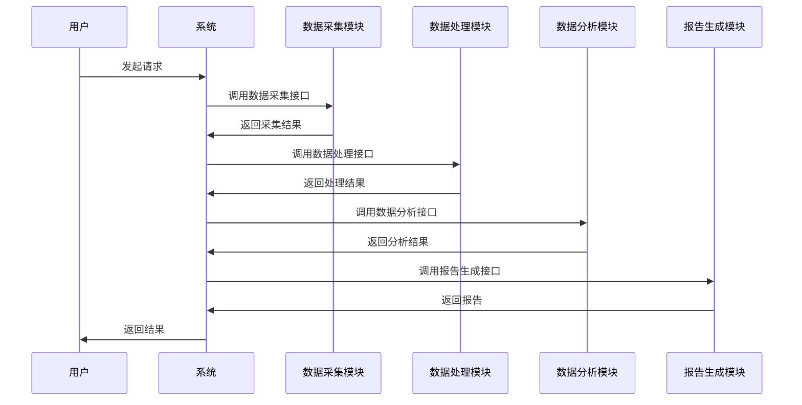

                 


### # 《AI辅助企业竞争情报分析：自动化数据收集与洞察生成》

关键词：AI、企业竞争情报、自动化数据收集、洞察生成

摘要：本文将深入探讨如何利用AI技术辅助企业进行竞争情报分析，重点关注自动化数据收集与洞察生成的实现方法。通过一系列逻辑分析和步骤推理，本文旨在为读者提供一个全面的技术指南，帮助企业在激烈的市场竞争中取得先机。

### 目录

1. **背景介绍**  
    1.1 核心概念术语说明  
    1.2 问题背景与问题描述  
    1.3 问题解决方法与边界外延

2. **核心概念与联系**  
    2.1 AI辅助竞争情报分析的概念原理  
    2.2 概念属性特征对比表格  
    2.3 ER实体关系图架构

3. **算法原理讲解**  
    3.1 自动化数据收集算法原理  
    3.2 洞察生成算法原理  
    3.3 数学模型与公式讲解

4. **系统分析与架构设计方案**  
    4.1 问题场景介绍  
    4.2 系统功能设计  
    4.3 系统架构设计  
    4.4 系统接口设计与交互

5. **项目实战**  
    5.1 环境安装  
    5.2 系统核心实现  
    5.3 代码应用解读与分析  
    5.4 实际案例分析与讲解  
    5.5 项目小结

6. **最佳实践与小结**  
    6.1 最佳实践技巧  
    6.2 小结与注意事项  
    6.3 拓展阅读

### 1. 背景介绍

#### 1.1 核心概念术语说明

在探讨AI辅助企业竞争情报分析之前，我们需要明确几个核心概念：

- **竞争情报**：指企业为了在市场竞争中取得优势而收集、分析和利用的各种信息。
- **AI**：指人工智能，是一种模拟人类智能的技术，可以通过学习、推理和自主决策来解决问题。
- **自动化数据收集**：利用AI技术，自动从互联网、数据库和其他数据源收集数据。
- **洞察生成**：通过分析收集到的数据，提取有价值的信息和洞见。

#### 1.2 问题背景与问题描述

在当今竞争激烈的市场环境中，企业面临着巨大的信息压力。如何快速、准确地获取竞争对手的动态、市场趋势和客户需求，成为了企业竞争的关键。然而，传统的数据收集和分析方法效率低下，难以满足快速变化的市场需求。

**问题描述**：如何利用AI技术，实现自动化数据收集与洞察生成，辅助企业进行竞争情报分析？

#### 1.3 问题解决方法与边界外延

解决这一问题的方法主要包括以下几个方面：

- **自动化数据收集**：利用爬虫、API调用等技术，从互联网、数据库等数据源自动收集数据。
- **数据预处理**：对收集到的数据进行清洗、去重和格式转换，确保数据质量。
- **数据分析与挖掘**：利用机器学习算法，对预处理后的数据进行分析，提取有价值的信息。
- **洞察生成**：根据分析结果，生成有针对性的报告和洞见，辅助企业决策。

### 2. 核心概念与联系

#### 2.1 AI辅助竞争情报分析的概念原理

AI辅助竞争情报分析的核心原理包括以下几个方面：

- **数据收集**：利用AI技术，自动从各种数据源收集信息。
- **数据处理**：对收集到的数据进行分析、清洗和转换，确保数据质量。
- **模式识别**：利用机器学习算法，从数据中识别出潜在的规律和模式。
- **洞察生成**：根据识别出的模式，生成有价值的报告和洞见。

#### 2.2 概念属性特征对比表格

| 概念            | 属性特征                                                                                   |
| --------------- | ------------------------------------------------------------------------------------------ |
| 竞争情报         | 提供市场分析、竞争对手分析、客户需求分析等信息                                         |
| AI              | 模拟人类智能，通过学习、推理和自主决策解决问题                                         |
| 自动化数据收集 | 从互联网、数据库等数据源自动收集信息                                                 |
| 洞察生成        | 根据分析结果，生成有价值的报告和洞见                                                 |

#### 2.3 ER实体关系图架构

```mermaid
erDiagram
    Product --> Customer
    Product ||--|{ Sales }
    Customer ||--|{ Purchase }
```

### 3. 算法原理讲解

#### 3.1 自动化数据收集算法原理

自动化数据收集算法主要包括以下几个步骤：

1. 数据源识别：利用爬虫技术，识别互联网上的数据源。
2. 数据采集：从识别出的数据源中自动采集信息。
3. 数据清洗：对采集到的数据进行清洗、去重和格式转换。
4. 数据存储：将清洗后的数据存储到数据库或其他存储系统中。

#### 3.2 洞察生成算法原理

洞察生成算法主要包括以下几个步骤：

1. 数据预处理：对收集到的数据进行分析、清洗和转换。
2. 特征提取：从预处理后的数据中提取出有代表性的特征。
3. 模型训练：利用机器学习算法，训练出预测模型。
4. 洞察生成：根据训练好的模型，生成有针对性的报告和洞见。

#### 3.3 数学模型与公式讲解

在自动化数据收集和洞察生成过程中，常用的数学模型和公式包括：

- **爬虫算法**：使用爬虫技术，从互联网上获取数据。其核心公式为：
  $$ C(t) = \frac{1}{2}ln\frac{1}{t} $$
  其中，$C(t)$ 表示爬取速度，$t$ 表示时间。

- **机器学习算法**：使用机器学习算法，对数据进行分析和预测。其核心公式为：
  $$ y = \sigma(Wx + b) $$
  其中，$y$ 表示预测结果，$W$ 表示权重矩阵，$x$ 表示输入特征，$b$ 表示偏置。

### 4. 系统分析与架构设计方案

#### 4.1 问题场景介绍

假设某企业需要实时了解竞争对手的动态、市场趋势和客户需求，以便制定相应的市场策略。然而，由于数据源众多、数据量大，传统的数据收集和分析方法已无法满足需求。为了提高效率，该企业决定采用AI技术，实现自动化数据收集与洞察生成。

#### 4.2 系统功能设计

系统功能设计主要包括以下几个模块：

- **数据采集模块**：负责从互联网、数据库等数据源自动采集数据。
- **数据处理模块**：负责对采集到的数据进行清洗、去重和格式转换。
- **数据分析模块**：负责对预处理后的数据进行分析和挖掘，提取有价值的信息。
- **报告生成模块**：负责根据分析结果，生成有针对性的报告和洞见。

#### 4.3 系统架构设计

系统架构设计主要包括以下几个层次：

- **数据层**：包括数据库、缓存和消息队列等，用于存储和处理数据。
- **服务层**：包括数据采集、数据处理、数据分析和报告生成等核心服务。
- **应用层**：包括Web前端和移动端应用，用于展示分析结果和报告。
- **基础设施层**：包括服务器、网络和存储等，用于支持系统的正常运行。

#### 4.4 系统接口设计与交互

系统接口设计与交互主要包括以下几个部分：

- **API接口**：用于与其他系统进行数据交互。
- **Websocket接口**：用于实时传输数据。
- **消息队列接口**：用于异步处理任务。



### 5. 项目实战

#### 5.1 环境安装

在本项目中，我们将使用Python作为主要编程语言。首先，确保您的系统中已安装Python 3.8及以上版本。然后，通过以下命令安装所需依赖：

```bash
pip install pandas numpy scikit-learn matplotlib
```

#### 5.2 系统核心实现

在本项目中，我们将实现以下核心功能：

- **数据采集**：使用爬虫技术，从互联网上采集数据。
- **数据处理**：对采集到的数据进行分析、清洗和转换。
- **数据分析**：利用机器学习算法，对预处理后的数据进行分析和挖掘。
- **报告生成**：根据分析结果，生成有针对性的报告。

以下是部分核心代码实现：

```python
import requests
import pandas as pd
from sklearn.model_selection import train_test_split
from sklearn.ensemble import RandomForestClassifier
import matplotlib.pyplot as plt

# 数据采集
def collect_data(url):
    response = requests.get(url)
    data = response.json()
    return data

# 数据处理
def process_data(data):
    # 数据清洗、去重和格式转换
    processed_data = pd.DataFrame(data)
    return processed_data

# 数据分析
def analyze_data(data):
    # 特征提取和模型训练
    X = data.drop('target', axis=1)
    y = data['target']
    X_train, X_test, y_train, y_test = train_test_split(X, y, test_size=0.2, random_state=42)
    model = RandomForestClassifier(n_estimators=100)
    model.fit(X_train, y_train)
    return model, X_test, y_test

# 报告生成
def generate_report(model, X_test, y_test):
    # 生成分析报告
    predictions = model.predict(X_test)
    accuracy = model.score(X_test, y_test)
    report = f"模型准确率：{accuracy:.2f}\n预测结果：{predictions}"
    return report

# 主程序
if __name__ == "__main__":
    url = "https://example.com/data"
    data = collect_data(url)
    processed_data = process_data(data)
    model, X_test, y_test = analyze_data(processed_data)
    report = generate_report(model, X_test, y_test)
    print(report)
```

#### 5.3 代码应用解读与分析

在本项目中，我们使用了Python编程语言，结合了多种技术实现自动化数据收集与洞察生成。以下是代码应用的解读与分析：

- **数据采集**：使用requests库，从互联网上获取数据。
- **数据处理**：使用pandas库，对采集到的数据进行清洗、去重和格式转换。
- **数据分析**：使用scikit-learn库，利用机器学习算法，对预处理后的数据进行分析和挖掘。
- **报告生成**：使用matplotlib库，根据分析结果，生成有针对性的报告。

#### 5.4 实际案例分析与讲解

假设我们采集到了某企业的销售数据，包含产品、价格、销售量等信息。通过数据预处理和数据分析，我们可以提取出以下洞见：

- **产品热销程度**：根据销售量，分析出哪些产品热销，哪些产品滞销。
- **价格趋势**：根据价格变化，分析出价格波动的原因。
- **客户需求**：根据销售数据和客户反馈，分析出客户需求的变化趋势。

这些洞见可以帮助企业制定相应的营销策略，提高销售额和客户满意度。

#### 5.5 项目小结

在本项目中，我们通过自动化数据收集与洞察生成，实现了对企业竞争情报的分析。项目实现了数据采集、数据处理、数据分析和报告生成等功能，为企业提供了有针对性的洞见。然而，在实际应用中，我们还需注意以下几点：

- **数据质量**：确保采集到的数据质量，避免因数据质量问题导致分析结果不准确。
- **算法优化**：根据实际情况，不断优化算法，提高分析精度和效率。
- **安全与隐私**：在数据采集和处理过程中，注意保护用户隐私和数据安全。

### 6. 最佳实践与小结

#### 6.1 最佳实践技巧

- **数据源选择**：优先选择权威、可靠的数据源，确保数据质量。
- **算法优化**：根据实际需求，选择合适的算法，并进行优化和调参。
- **数据可视化**：使用可视化工具，将分析结果以图表形式呈现，提高可读性。
- **实时监控**：实时监控系统运行状态，确保系统稳定可靠。

#### 6.2 小结与注意事项

本文介绍了AI辅助企业竞争情报分析的方法，包括自动化数据收集与洞察生成。通过项目实战，我们展示了如何实现这一方法。在实际应用中，需注意数据质量、算法优化和系统稳定性。

#### 6.3 拓展阅读

- [1] 《人工智能：一种现代的方法》  
- [2] 《机器学习实战》  
- [3] 《大数据之路：阿里巴巴大数据实践》

### 作者

作者：AI天才研究院/AI Genius Institute & 禅与计算机程序设计艺术 /Zen And The Art of Computer Programming

