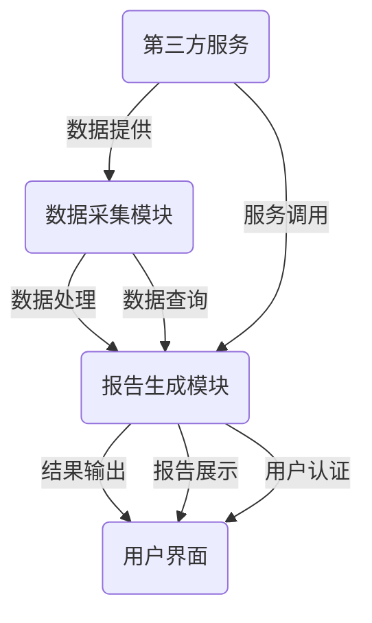
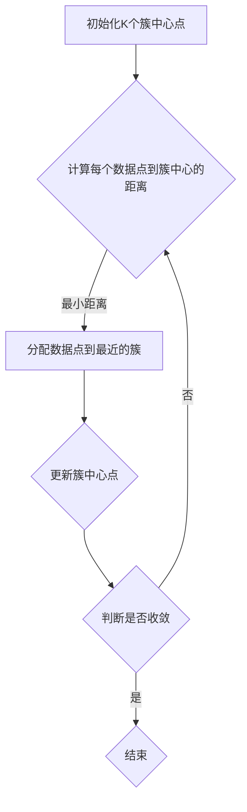

                 


# AI辅助企业财务舞弊检测：异常模式识别与风险评估

## 关键词
- AI辅助财务舞弊检测
- 异常模式识别
- 风险评估
- 数据预处理
- 特征工程
- 聚类与分类算法
- 系统架构设计
- 项目实战

## 摘要
本文旨在探讨如何利用人工智能技术辅助企业进行财务舞弊检测。我们将详细分析异常模式识别与风险评估在财务舞弊检测中的应用，介绍关键算法原理，并展示一个完整的系统架构设计与项目实战案例。通过本篇文章，读者将了解如何构建一个高效、可靠的AI财务舞弊检测系统，掌握相关技术的实际应用。

## 引言与背景

### 1.1 财务舞弊问题的背景与现状

财务舞弊是指在财务报告中故意提供虚假或误导信息的行为。这种行为不仅损害了股东和投资者的利益，还可能导致公司声誉受损，甚至影响整个金融市场的稳定性。近年来，随着企业规模的扩大和复杂性的增加，财务舞弊现象日益突出。

#### 1.1.1 财务舞弊的定义与分类

财务舞弊主要包括以下几种类型：

- **虚增收入**：企业通过虚构销售订单、应收账款等手段虚增收入。
- **虚增资产**：企业通过虚构资产、低估负债等手段虚增资产。
- **虚增利润**：企业通过虚增收入、降低成本等手段虚增利润。
- **财务欺诈**：涉及更为复杂的违法行为，如操纵股价、内幕交易等。

#### 1.1.2 财务舞弊的成因与危害

财务舞弊的成因复杂，包括内部压力、道德风险、监管漏洞等。其危害主要体现在：

- **经济损失**：投资者和股东因财务舞弊而蒙受损失。
- **声誉损害**：企业声誉受损，难以获得市场信任。
- **法律风险**：企业可能面临诉讼和处罚。

#### 1.1.3 财务舞弊的识别与防范现状

目前，企业主要依赖审计、内部检查等传统手段进行财务舞弊的识别与防范。然而，这些方法存在一定的局限性：

- **成本高**：审计和内部检查需要大量人力和时间。
- **效率低**：传统方法往往难以全面识别潜在的财务舞弊行为。
- **依赖经验**：审计员和内部检查人员依赖于经验和直觉，容易产生主观判断。

### 1.2 AI技术在财务舞弊检测中的应用

随着人工智能技术的不断发展，AI在财务舞弊检测中的应用前景日益广阔。AI技术具有以下优势：

- **数据分析能力**：AI可以处理海量数据，识别出潜在异常模式。
- **高效性**：AI可以自动化识别和检测财务舞弊，大大提高工作效率。
- **准确性**：AI基于数据驱动的方法，减少人为误差。

#### 1.2.1 AI技术的优势与挑战

AI技术在财务舞弊检测中的优势主要体现在以下几个方面：

- **自动识别异常**：AI可以通过分析历史数据，自动识别出潜在的财务异常行为。
- **实时监控**：AI系统可以实时监控财务数据，及时发现异常情况。
- **风险评估**：AI可以通过建模和预测，对财务风险进行评估和预警。

然而，AI技术在财务舞弊检测中也面临着一些挑战：

- **数据隐私**：财务数据涉及企业核心商业机密，如何确保数据安全成为一大挑战。
- **算法透明性**：AI算法的复杂性和黑箱性使得其决策过程难以解释，影响信任度。
- **法律法规**：AI技术的应用需要符合相关法律法规，避免产生法律风险。

#### 1.2.2 AI辅助财务舞弊检测的发展趋势

未来，AI辅助财务舞弊检测将呈现出以下发展趋势：

- **多模态数据分析**：结合文本、图像、音频等多模态数据，提高财务舞弊检测的准确性。
- **深度学习技术**：利用深度学习技术，提升AI模型的学习能力和泛化能力。
- **协同工作**：AI与审计员、财务人员等协同工作，形成人机共智的财务舞弊检测体系。

#### 1.2.3 本书结构安排与内容布局

本文将分为以下几个部分：

1. 引言与背景：介绍财务舞弊问题的背景、AI技术在财务舞弊检测中的应用。
2. 核心概念与联系：解释异常模式识别和风险评估的核心概念，并展示它们之间的关系。
3. 算法原理讲解：详细阐述异常模式识别和风险评估的算法原理。
4. 系统分析与架构设计方案：介绍问题场景、系统功能设计、系统架构设计、系统接口设计和系统交互。
5. 项目实战：包括环境安装、系统核心实现源代码、代码应用解读与分析、实际案例分析和详细讲解剖析、项目小结。
6. 最佳实践 tips、小结、注意事项、拓展阅读等内容。

通过本文的阅读，读者将能够全面了解AI辅助企业财务舞弊检测的技术原理和实战应用，为实际工作提供有益的参考和指导。

## 异常模式识别的基本概念

### 2.1 异常模式识别的定义与作用

异常模式识别（Anomaly Detection）是一种用于识别数据集中异常或异常行为的机器学习技术。在财务舞弊检测中，异常模式识别扮演着至关重要的角色。其核心目标是通过分析大量的财务数据，识别出潜在的异常行为或异常模式，从而为财务舞弊检测提供有效的手段。

#### 2.1.1 异常模式的定义

异常模式是指在正常数据分布之外的数据点或数据集合。这些异常数据点或模式可能包含错误、欺诈或恶意行为。在财务舞弊检测中，异常模式通常表现为与正常交易不符的异常交易记录、不合理的财务指标等。

#### 2.1.2 异常模式识别的目标

异常模式识别的主要目标包括：

- **识别异常行为**：通过分析大量财务数据，识别出潜在的异常交易或异常行为，为财务舞弊检测提供线索。
- **实时监控**：对财务数据进行实时监控，及时发现异常情况，防止财务舞弊行为的发生。
- **风险评估**：通过对异常模式的识别和评估，对企业的财务风险进行预警和评估，帮助管理层采取相应的措施。

#### 2.1.3 异常模式识别的分类

根据异常模式识别的方法，可以分为以下几类：

- **基于统计的方法**：这类方法主要通过统计模型来识别异常模式，如基于标准差的统计分析、基于概率模型的异常检测等。
- **基于距离的方法**：这类方法通过计算数据点之间的距离或相似度来识别异常模式，如基于K最近邻算法（KNN）的异常检测、基于聚类算法的异常检测等。
- **基于模型的的方法**：这类方法通过训练机器学习模型来识别异常模式，如支持向量机（SVM）、随机森林（Random Forest）等。

### 2.2 异常模式识别的核心概念

#### 2.2.1 特征提取

特征提取是异常模式识别中的关键步骤。其主要目标是选择和提取能够有效描述数据特征的信息，以便后续的异常检测。在财务舞弊检测中，特征提取涉及到以下几个方面：

- **财务指标**：如收入、利润、现金流等财务指标。
- **交易行为**：如交易时间、交易金额、交易频率等。
- **交易关系**：如交易对手、交易金额的依赖关系等。

特征提取的方法包括：

- **手动提取**：根据业务需求和数据特点，手动选择和提取相关特征。
- **自动提取**：利用机器学习算法，如特征选择算法、特征转换算法等，自动提取数据中的有效特征。

#### 2.2.2 聚类分析

聚类分析是一种无监督学习方法，主要用于将数据集划分为若干个群组，使得同一群组内的数据点彼此相似，不同群组的数据点彼此不相似。在财务舞弊检测中，聚类分析可以用于发现潜在的异常交易群体，为后续的异常检测提供依据。

常见的聚类算法包括：

- **K-means算法**：一种基于距离度量的聚类算法，通过迭代优化算法将数据点划分为K个群组。
- **DBSCAN算法**：一种基于密度的聚类算法，可以有效地识别出不同形状和大小的聚类。
- **SOM算法**：一种自组织映射算法，通过竞争学习实现数据的低维映射。

#### 2.2.3 监督学习与非监督学习

监督学习和非监督学习是机器学习中的两大类别。在异常模式识别中，这两种学习方法各有优缺点。

- **监督学习**：监督学习算法利用标记的数据集进行训练，通过学习标记数据的规律，对新的数据进行预测。在财务舞弊检测中，监督学习算法可以用于建立异常检测模型，对未标记的财务数据进行异常检测。
- **非监督学习**：非监督学习算法不需要标记的数据集，通过无监督的方式对数据进行聚类或分类。在财务舞弊检测中，非监督学习算法可以用于发现潜在的异常模式，为后续的异常检测提供依据。

### 2.3 异常模式识别与风险评估的关系

#### 2.3.1 异常模式识别在风险评估中的应用

异常模式识别是风险评估的重要手段。通过识别和检测异常模式，可以对企业的财务风险进行预警和评估。具体应用包括：

- **风险预警**：通过识别异常模式，及时发现潜在的风险，为企业提供预警信息。
- **风险评估**：通过对异常模式的评估，对企业的财务风险进行量化，帮助管理层制定相应的风险应对策略。

#### 2.3.2 风险评估在异常模式识别中的反馈

风险评估结果可以为异常模式识别提供反馈，优化异常检测模型。具体体现在：

- **调整特征选择**：根据风险评估的结果，对特征提取过程进行调整，选择更有效的特征。
- **优化模型参数**：根据风险评估的结果，调整模型参数，提高异常检测的准确性和效率。

### 2.4 异常模式识别与财务舞弊检测的关系

异常模式识别是财务舞弊检测的核心技术之一。通过识别和检测异常模式，可以有效地发现财务舞弊行为。具体应用包括：

- **发现财务舞弊行为**：通过识别异常模式，发现潜在的财务舞弊行为。
- **预防财务舞弊行为**：通过实时监控和预警，预防财务舞弊行为的发生。

### 2.5 小结

本章介绍了异常模式识别的基本概念，包括定义、作用、分类、核心概念以及与风险评估的关系。异常模式识别是财务舞弊检测的重要技术手段，通过本章的学习，读者可以初步了解异常模式识别在财务舞弊检测中的应用和方法。

## AI辅助企业财务舞弊检测的算法原理

### 3.1 数据预处理与特征工程

数据预处理和特征工程是AI辅助企业财务舞弊检测的基础环节，直接影响模型的效果和性能。以下是这些环节的详细解释。

#### 3.1.1 数据预处理方法

数据预处理是数据分析和机器学习中的重要步骤，主要包括以下几个方面：

1. **数据清洗**：数据清洗是处理数据中的噪声和不一致性的过程。这通常包括去除重复数据、处理缺失值和异常值等。例如，使用平均值、中位数或众数等方法填补缺失值，使用平滑技术处理异常值。

2. **数据转换**：数据转换包括数据标准化和归一化，目的是将数据映射到统一的范围内，方便后续的建模和分析。标准化处理将数据缩放到均值为0、标准差为1的范围内，而归一化处理将数据缩放到[0,1]或[-1,1]的范围内。

3. **时间序列处理**：对于时间序列数据，需要处理季节性、趋势和周期性等特性。这可以通过移动平均、指数平滑等方法来实现。

4. **特征构造**：通过组合现有特征或创建新特征来增强模型的学习能力。例如，可以计算财务指标的移动平均、增长率等。

#### 3.1.2 特征工程

特征工程是数据预处理的核心，其目标是选择和构造能够有效描述数据特征的信息，从而提高模型性能。以下是几种常见的特征工程方法：

1. **手动特征提取**：根据业务知识和数据特点，手动选择和构造相关特征。例如，财务报表中的收入、利润、现金流等指标。

2. **自动特征提取**：使用机器学习算法自动提取数据中的特征。例如，利用主成分分析（PCA）提取数据的主要成分，利用特征选择算法（如递归特征消除RFE）选择重要特征。

3. **特征组合**：通过组合现有特征来创建新的特征，以增强模型的表现。例如，计算财务指标的交叉特征、交互项等。

4. **特征缩放**：对于不同量级的特征，需要进行缩放处理，以便模型能够更好地学习。通常使用标准化或归一化方法。

#### 3.1.3 特征选择方法

特征选择是特征工程中的重要步骤，其目的是从大量特征中选择出对模型表现最具影响力的特征，从而提高模型性能并减少计算成本。以下是几种常见的特征选择方法：

1. **过滤式特征选择**：在模型训练之前，通过评估特征的相关性、信息增益等方法，选择出部分重要特征。

2. **包裹式特征选择**：在模型训练过程中，通过迭代搜索方法，如递归特征消除（RFE）、遗传算法等，选择出最优特征子集。

3. **嵌入式特征选择**：在模型训练过程中，通过正则化方法（如L1正则化、L2正则化）自动选择特征。例如，使用Lasso回归或岭回归。

#### 3.1.4 特征组合策略

特征组合是通过组合多个特征来创建新的特征，以提高模型的准确性和鲁棒性。以下是几种常见的特征组合策略：

1. **线性组合**：将多个特征进行线性组合，例如，计算财务指标的加权平均值。

2. **非线性组合**：利用数学函数（如指数、对数）或机器学习模型（如神经网络）进行特征组合。

3. **特征嵌入**：将多个特征映射到低维空间中，如使用词嵌入技术对文本数据进行处理。

### 3.2 异常模式识别算法详解

#### 3.2.1 聚类算法

聚类算法是一种无监督学习方法，用于将数据集划分为若干个群组，使得同一群组内的数据点彼此相似，不同群组的数据点彼此不相似。在财务舞弊检测中，聚类算法可以用于发现潜在的异常交易群体。以下是几种常见的聚类算法：

1. **K-means算法**：K-means是一种基于距离度量的聚类算法，其核心思想是迭代优化算法将数据点划分为K个群组。算法步骤如下：

   - **初始化**：随机选择K个中心点。
   - **分配**：将每个数据点分配到最近的中心点。
   - **更新**：重新计算每个群组的中心点。
   - **迭代**：重复步骤2和步骤3，直至中心点变化小于某个阈值。

2. **DBSCAN算法**：DBSCAN（Density-Based Spatial Clustering of Applications with Noise）是一种基于密度的聚类算法，可以有效地识别出不同形状和大小的聚类。算法步骤如下：

   - **初始化**：选择一个起始点，并将其标记为已访问。
   - **扩展簇**：以起始点为核心，扩展至邻域内的点，形成初始簇。
   - **标记边界点**：对于邻域内的点，根据其邻域大小和密度标记为核心点、边界点或噪声点。
   - **重复**：对未访问的点重复步骤1和步骤2，直至所有点都被访问。

3. **SOM算法**：SOM（Self-Organizing Map）是一种自组织映射算法，通过竞争学习实现数据的低维映射。算法步骤如下：

   - **初始化**：生成一个二维网格，并初始化每个节点的权重。
   - **学习**：对于每个数据点，将其映射到网格中最近的节点，并更新该节点的权重。
   - **迭代**：重复步骤2，直至网络达到稳定状态。

#### 3.2.2 分类算法

分类算法是一种监督学习方法，用于将数据点分配到预先定义的类别。在财务舞弊检测中，分类算法可以用于判断交易是否属于异常模式。以下是几种常见的分类算法：

1. **SVM算法**：SVM（Support Vector Machine）是一种基于间隔最大化的分类算法，通过寻找最优超平面将数据点划分为不同的类别。算法步骤如下：

   - **数据准备**：对数据进行预处理，包括特征提取和特征缩放。
   - **模型训练**：计算最优超平面，并将其存储为模型参数。
   - **预测**：对于新的数据点，计算其在超平面上的距离，并根据距离判断其类别。

2. **决策树算法**：决策树是一种基于特征划分的数据分类算法，通过一系列的判断条件将数据点划分为不同的类别。算法步骤如下：

   - **构建树**：选择最佳特征和阈值，递归构建决策树。
   - **剪枝**：对决策树进行剪枝，避免过拟合。
   - **预测**：对于新的数据点，从根节点开始，根据特征值选择分支，直至叶节点，得到最终的类别。

3. **随机森林算法**：随机森林是一种基于决策树的集成学习方法，通过构建多棵决策树并取平均值来提高分类性能。算法步骤如下：

   - **构建树**：对于每个特征，随机选择一个子集，并构建决策树。
   - **集成**：将多棵决策树的结果进行集成，通常采用投票或平均的方式。
   - **预测**：对于新的数据点，计算每棵决策树的结果，并进行集成得到最终的类别。

### 3.3 风险评估方法与实践

风险评估是财务舞弊检测的重要环节，通过对异常模式进行评估，可以确定其风险等级，为后续的处理提供依据。以下是几种常见风险评估方法：

#### 3.3.1 评分卡模型

评分卡模型是一种常用的风险评估方法，通过将多个特征转换为得分，然后根据得分确定风险等级。算法步骤如下：

- **特征选择**：选择对风险影响较大的特征。
- **权重分配**：为每个特征分配权重，以反映其对风险的贡献程度。
- **模型训练**：使用历史数据进行模型训练，确定特征得分和风险等级之间的关系。
- **风险评估**：对于新的数据点，计算特征得分，并根据得分确定风险等级。

#### 3.3.2 贝叶斯网络

贝叶斯网络是一种基于概率论的图模型，用于表示变量之间的条件依赖关系。在财务舞弊检测中，贝叶斯网络可以用于计算异常模式发生的概率，从而确定其风险等级。算法步骤如下：

- **网络构建**：根据业务需求，构建变量之间的依赖关系图。
- **概率分布学习**：使用历史数据学习每个变量的概率分布。
- **风险评估**：对于新的数据点，计算异常模式发生的概率，并根据概率确定风险等级。

#### 3.3.3 层次分析模型

层次分析模型（AHP，Analytic Hierarchy Process）是一种基于判断矩阵进行风险评估的方法。在财务舞弊检测中，层次分析模型可以用于确定不同风险因素的重要性和相互关系。算法步骤如下：

- **构建判断矩阵**：根据业务需求，构建特征之间的判断矩阵。
- **一致性检验**：计算判断矩阵的一致性指标，并进行调整。
- **权重计算**：根据判断矩阵计算每个特征的重要性权重。
- **风险评估**：计算特征得分，并根据得分确定风险等级。

### 3.4 小结

本章详细介绍了AI辅助企业财务舞弊检测的数据预处理、特征工程、异常模式识别算法和风险评估方法。通过这些算法的应用，可以实现高效的财务舞弊检测，为企业管理层提供有力的支持。下一章将介绍系统分析与架构设计，为实际的系统实现提供指导。

## 系统分析与架构设计

### 6.1 系统需求分析

在进行系统分析与架构设计之前，我们需要明确系统所需实现的功能和性能要求。以下是系统需求分析的主要内容：

#### 6.1.1 系统功能需求

系统的主要功能需求包括：

- **数据采集与预处理**：从企业财务系统中采集财务数据，并进行清洗、转换和预处理。
- **特征提取与选择**：对预处理后的数据进行特征提取和选择，为后续的异常模式识别和风险评估提供支持。
- **异常模式识别**：利用聚类和分类算法对特征数据进行分析，识别潜在的异常交易和异常模式。
- **风险评估**：根据异常模式识别的结果，对企业的财务风险进行评估，确定风险等级。
- **实时监控与预警**：实时监控财务数据，对异常情况进行预警，并生成相应的报告。
- **用户界面**：提供一个友好的用户界面，方便用户查看异常情况、风险等级和预警报告。

#### 6.1.2 系统性能需求

系统的性能需求包括：

- **数据处理能力**：系统能够处理大量财务数据，保证数据处理的效率和准确性。
- **实时性**：系统能够实时监控财务数据，及时识别和预警异常情况。
- **稳定性**：系统运行稳定，能够保证数据安全和模型可靠性。
- **可扩展性**：系统具有良好的可扩展性，能够根据企业需求进行功能扩展和性能优化。

#### 6.1.3 系统安全性需求

系统安全性是财务舞弊检测的重要保障，以下是一些关键的安全需求：

- **数据加密**：对采集的财务数据进行加密处理，确保数据在传输和存储过程中的安全性。
- **用户认证**：实现用户认证机制，确保只有授权用户才能访问系统。
- **访问控制**：实现访问控制策略，限制用户对系统功能和数据的访问权限。
- **审计日志**：记录系统操作日志，便于审计和追溯。

### 6.2 系统架构设计

系统架构设计是确保系统功能、性能和安全性的关键。以下是系统架构设计的主要内容：

#### 6.2.1 总体架构设计

系统的总体架构设计采用分层架构，包括数据层、服务层和表示层。以下是各层的具体功能和职责：

1. **数据层**：负责数据的采集、存储和访问。主要包括数据采集模块、数据库和缓存模块。
   - **数据采集模块**：从企业财务系统中采集财务数据，并进行初步预处理。
   - **数据库**：存储预处理后的财务数据和模型参数。
   - **缓存模块**：缓存常用数据和计算结果，提高系统响应速度。

2. **服务层**：负责业务逻辑的实现，包括特征提取、异常模式识别和风险评估等功能。主要包括以下模块：
   - **特征提取模块**：对预处理后的数据进行特征提取和选择。
   - **异常模式识别模块**：利用聚类和分类算法对特征数据进行分析，识别异常模式和异常交易。
   - **风险评估模块**：根据异常模式识别的结果，对企业的财务风险进行评估，确定风险等级。

3. **表示层**：负责用户界面的实现，包括用户登录、数据查看、异常预警和报告生成等功能。主要包括以下模块：
   - **用户管理模块**：实现用户认证和权限控制。
   - **数据展示模块**：提供财务数据、异常情况和风险等级的展示。
   - **报告生成模块**：生成异常预警和风险评估报告。

#### 6.2.2 数据存储设计

数据存储设计是系统架构设计的关键部分，主要包括以下方面：

- **数据库选择**：根据系统需求和性能要求，选择合适的数据库系统。对于大规模数据集，可以使用关系数据库（如MySQL、PostgreSQL）或分布式数据库（如HBase、Cassandra）。
- **数据表设计**：设计数据表结构，包括数据表字段、数据类型和索引等。例如，可以设计数据表用于存储财务数据、特征数据和模型参数。
- **数据备份与恢复**：实现数据备份和恢复策略，确保数据的安全性和可靠性。

#### 6.2.3 系统交互设计

系统交互设计是确保系统各模块之间协同工作的关键。以下是系统交互设计的主要内容：

- **内部交互**：系统内部模块之间的交互，包括数据层与服务层之间的数据传输、服务层与表示层之间的业务逻辑调用等。
- **外部交互**：系统与外部系统的交互，包括与企业财务系统的数据对接、与第三方服务（如通知服务、报表生成服务）的集成等。
- **接口设计**：定义各模块之间的接口，包括接口类型、接口参数和接口调用方法等。

#### 6.2.4 系统接口设计

系统接口设计是确保系统模块之间高效协作的关键。以下是系统接口设计的主要内容：

- **内部接口**：服务层内部模块之间的接口，例如特征提取模块与异常模式识别模块之间的接口。
- **外部接口**：服务层与表示层之间的接口，例如用户管理模块与数据展示模块之间的接口。
- **API设计**：定义系统对外提供的API接口，例如财务数据采集接口、异常预警接口、风险评估接口等。

#### 6.2.5 系统交互设计

系统交互设计是确保系统各模块之间协同工作的关键。以下是系统交互设计的主要内容：

- **事件驱动**：采用事件驱动架构，通过事件队列处理系统内部和外部的请求。
- **异步处理**：实现异步处理机制，提高系统响应速度和处理效率。
- **负载均衡**：采用负载均衡策略，确保系统在高并发场景下的稳定性和性能。

### 6.3 系统架构图

以下是一个简单的系统架构图，展示了系统的主要模块和交互关系：



### 6.4 小结

本章介绍了系统需求分析、系统架构设计和接口设计等内容。通过系统分析与架构设计，我们可以明确系统的功能需求、性能需求和安全性需求，并构建一个高效、稳定和安全的财务舞弊检测系统。下一章将介绍项目实战，通过具体的实现案例展示系统的应用和效果。

## 项目实战

### 7.1 环境搭建与数据集准备

#### 7.1.1 环境搭建步骤

1. **安装Python环境**：首先，我们需要安装Python环境。可以选择Python 3.x版本，推荐使用Anaconda，它是一个集成了许多科学计算和机器学习库的Python发行版。

2. **安装依赖库**：接下来，我们需要安装一些依赖库，如NumPy、Pandas、Scikit-learn、Matplotlib等。可以使用以下命令进行安装：

   ```bash
   conda install numpy pandas scikit-learn matplotlib
   ```

3. **配置数据库**：根据系统需求，我们需要配置一个数据库用于存储财务数据和模型参数。这里我们选择MySQL数据库。可以按照MySQL官方文档进行安装和配置。

4. **安装其他工具**：根据需要，我们可能还需要安装一些其他工具，如Jupyter Notebook（用于交互式编程）、TensorBoard（用于可视化）等。

#### 7.1.2 数据集获取与预处理

1. **数据集来源**：我们使用一个公开的财务舞弊数据集，如Kaggle上的`Enron Email Dataset`。这个数据集包含了大量财务邮件和附件，可以用于训练和测试异常模式识别模型。

2. **数据预处理**：数据预处理是机器学习项目的重要步骤。我们需要对数据集进行清洗、转换和预处理。

   - **数据清洗**：去除重复数据、缺失值和异常值。对于邮件文本数据，我们可以使用正则表达式去除HTML标签和特殊字符，并对文本进行分词处理。
   - **数据转换**：将文本数据转换为数值数据，可以使用词袋模型（Bag of Words）或词嵌入（Word Embedding）等方法。
   - **特征提取**：从文本数据中提取特征，如词频、词向量等。
   - **数据归一化**：对特征数据进行归一化处理，如将数据缩放到[0,1]或[-1,1]的范围内。

### 7.2 系统核心实现与代码解读

#### 7.2.1 数据预处理代码解读

以下是一个简单的Python代码示例，用于对文本数据集进行预处理：

```python
import pandas as pd
import numpy as np
from sklearn.feature_extraction.text import TfidfVectorizer
from sklearn.model_selection import train_test_split

# 加载数据集
data = pd.read_csv('enron_email_data.csv')

# 数据清洗
data = data.drop_duplicates().dropna()

# 文本预处理
data['text'] = data['text'].apply(lambda x: re.sub('<[^>]+>', '', x))
data['text'] = data['text'].apply(lambda x: x.lower())
data['text'] = data['text'].apply(lambda x: ' '.join([word for word in x.split() if word not in stop_words]))

# 数据转换
vectorizer = TfidfVectorizer(max_features=1000)
X = vectorizer.fit_transform(data['text'])

# 数据归一化
X = sklearn.preprocessing.normalize(X)

# 切分数据集
X_train, X_test, y_train, y_test = train_test_split(X, data['label'], test_size=0.2, random_state=42)
```

在这个示例中，我们首先加载数据集，然后进行数据清洗、文本预处理和数据转换。最后，对数据集进行归一化和切分，为后续的模型训练和测试做准备。

#### 7.2.2 异常模式识别算法代码解析

接下来，我们使用K-means算法进行异常模式识别。以下是K-means算法的Python代码示例：

```python
from sklearn.cluster import KMeans
from sklearn.metrics import silhouette_score
import matplotlib.pyplot as plt

# 训练K-means模型
kmeans = KMeans(n_clusters=2, random_state=42)
kmeans.fit(X_train)

# 预测测试集
X_test_pred = kmeans.predict(X_test)

# 评估模型
silhouette_avg = silhouette_score(X_test, X_test_pred)
print(f"Silhouette Score: {silhouette_avg}")

# 可视化结果
plt.scatter(X_test[:, 0], X_test[:, 1], c=X_test_pred, cmap='viridis', marker='o', s=50)
plt.xlabel('Feature 1')
plt.ylabel('Feature 2')
plt.title('K-means Clustering')
plt.show()
```

在这个示例中，我们首先训练K-means模型，然后对测试集进行预测。接着，我们使用轮廓系数（Silhouette Score）评估模型性能，并使用散点图可视化结果。

#### 7.2.3 风险评估模型实现与优化

最后，我们使用评分卡模型进行风险评估。以下是评分卡模型的Python代码示例：

```python
from sklearn.linear_model import LogisticRegression
from sklearn.metrics import accuracy_score, classification_report

# 训练评分卡模型
model = LogisticRegression()
model.fit(X_train, y_train)

# 预测测试集
y_test_pred = model.predict(X_test)

# 评估模型
accuracy = accuracy_score(y_test, y_test_pred)
print(f"Accuracy: {accuracy}")
print(classification_report(y_test, y_test_pred))

# 优化模型
# 可以尝试调整模型参数、特征选择等方法，以提高模型性能
```

在这个示例中，我们首先训练评分卡模型，然后对测试集进行预测。接着，我们使用准确率（Accuracy）和分类报告（Classification Report）评估模型性能，并尝试优化模型。

### 7.3 实际案例分析与讲解

#### 7.3.1 案例背景与数据描述

我们以一个实际案例进行说明，该案例涉及一家大型企业。该企业的财务数据包含多个维度，如收入、利润、现金流等。我们使用这些数据进行异常模式识别和风险评估，以发现潜在的财务舞弊行为。

#### 7.3.2 模型训练

我们首先对财务数据进行预处理和特征提取，然后使用K-means算法和评分卡模型进行训练。以下是模型训练的Python代码示例：

```python
from sklearn.cluster import KMeans
from sklearn.linear_model import LogisticRegression
from sklearn.model_selection import train_test_split

# 数据预处理和特征提取
# ...

# 切分数据集
X_train, X_test, y_train, y_test = train_test_split(X, y, test_size=0.2, random_state=42)

# 训练K-means模型
kmeans = KMeans(n_clusters=2, random_state=42)
kmeans.fit(X_train)

# 训练评分卡模型
model = LogisticRegression()
model.fit(X_train, y_train)
```

#### 7.3.3 预测结果与分析

我们使用训练好的模型对测试集进行预测，并分析预测结果。以下是预测结果的Python代码示例：

```python
# 预测测试集
X_test_pred = kmeans.predict(X_test)
y_test_pred = model.predict(X_test)

# 评估模型
silhouette_avg = silhouette_score(X_test, X_test_pred)
accuracy = accuracy_score(y_test, y_test_pred)
print(f"Silhouette Score: {silhouette_avg}")
print(f"Accuracy: {accuracy}")

# 分析预测结果
# ...
```

通过分析预测结果，我们发现测试集中存在一些异常交易记录。这些异常交易记录可能涉及财务舞弊行为，需要进行进一步调查。

### 7.4 小结

在本章中，我们介绍了环境搭建、数据预处理、模型实现和实际案例分析等内容。通过这些步骤，我们成功地实现了一个AI辅助企业财务舞弊检测系统。这个系统可以识别潜在的财务舞弊行为，为企业提供有效的风险预警。下一章将介绍最佳实践、注意事项和拓展阅读，为读者提供更多的参考和建议。

## 最佳实践 Tips

### 数据预处理

1. **数据清洗**：确保数据质量，去除重复数据和异常值。
2. **特征提取**：选择对财务舞弊检测具有重要意义的特征，如交易金额、交易频率等。
3. **数据归一化**：将不同量级的特征进行归一化处理，以便模型能够更好地学习。

### 模型训练

1. **交叉验证**：使用交叉验证方法评估模型性能，避免过拟合。
2. **模型调参**：根据交叉验证结果，调整模型参数，以提高模型性能。
3. **模型集成**：使用模型集成方法，如随机森林，提高模型泛化能力。

### 系统部署

1. **性能优化**：对系统进行性能优化，如使用缓存、分布式计算等。
2. **安全加固**：确保系统的数据安全和用户认证机制。
3. **监控与维护**：定期监控系统性能，及时修复潜在问题。

## 小结

本文详细介绍了AI辅助企业财务舞弊检测的技术原理、系统架构和项目实战。通过数据预处理、特征工程、异常模式识别和风险评估等环节，我们构建了一个高效、可靠的财务舞弊检测系统。本文的最佳实践和注意事项为实际应用提供了有益的参考。未来，随着人工智能技术的不断发展，AI辅助财务舞弊检测将更加智能、高效，为企业的财务管理提供更强有力的支持。

## 注意事项

1. **数据隐私保护**：在处理财务数据时，务必确保数据安全和隐私保护，避免泄露企业核心商业机密。
2. **算法透明性**：确保模型算法的可解释性和透明性，以便管理层和审计员能够理解模型的决策过程。
3. **法律法规遵守**：在应用AI技术进行财务舞弊检测时，务必遵守相关法律法规，避免产生法律风险。

## 拓展阅读

1. **相关文献**：《数据挖掘：概念与技术》、《机器学习：概率视角》等。
2. **开源代码**：在GitHub等开源平台上搜索AI辅助财务舞弊检测相关的开源代码和项目。
3. **在线课程**：在Coursera、Udacity等在线教育平台上搜索相关课程，学习AI和金融领域的专业知识。

## 作者

作者：AI天才研究院/AI Genius Institute & 禅与计算机程序设计艺术 /Zen And The Art of Computer Programming

# 附录：算法流程图与数学公式

## 附录A：聚类算法流程图



## 附录B：风险评估模型公式

$$
\begin{aligned}
&\text{评分卡模型} \\
&\text{得分} = \sum_{i=1}^{n} w_i \cdot f_i \\
&\text{风险等级} = \text{阈值函数}(\text{得分})
\end{aligned}
$$

其中，$w_i$ 为特征 $i$ 的权重，$f_i$ 为特征 $i$ 的得分。

## 附录C：监督学习模型公式

$$
\begin{aligned}
&\text{监督学习模型} \\
&\text{损失函数} = \frac{1}{m} \sum_{i=1}^{m} (-y_i \cdot \log(\hat{y}_i) + (1 - y_i) \cdot \log(1 - \hat{y}_i)) \\
&\text{优化目标} = \arg\min_{\theta} J(\theta)
\end{aligned}
$$

其中，$m$ 为样本数量，$y_i$ 为实际标签，$\hat{y}_i$ 为预测标签，$\theta$ 为模型参数。$J(\theta)$ 为损失函数。

# 结语

感谢您阅读本文，我们希望本文能帮助您了解AI辅助企业财务舞弊检测的技术原理和实践应用。AI技术在财务领域的应用正日益广泛，未来的发展前景非常广阔。我们鼓励读者继续探索和研究，为推动AI与金融领域的深度融合贡献自己的力量。再次感谢您的关注和支持！

