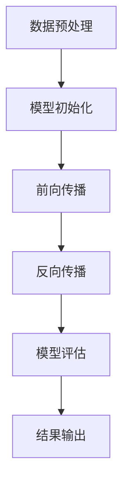
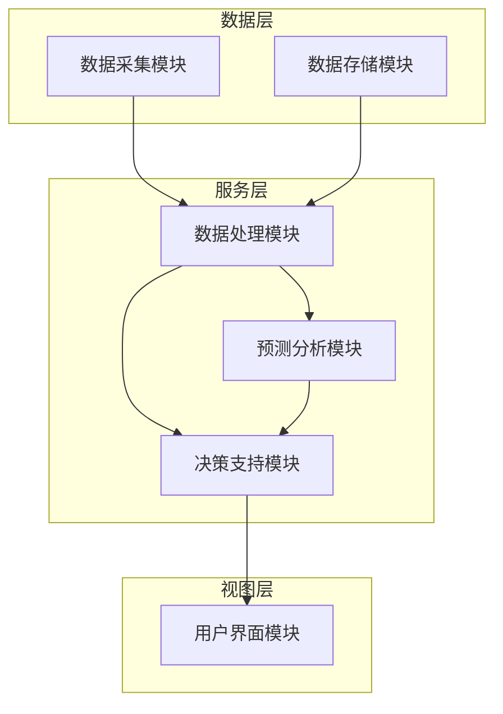
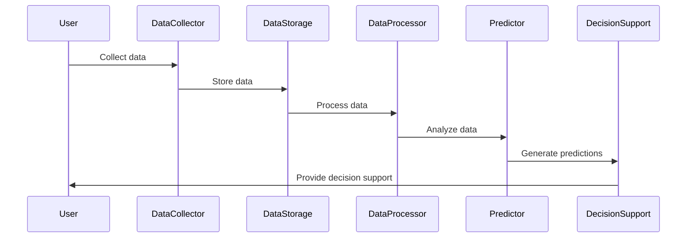

                 

# AI辅助决策：大模型在企业管理中的价值

## 关键词
- AI辅助决策
- 大模型
- 企业管理
- 数据分析
- 机器学习

## 摘要
本文旨在探讨AI辅助决策在企业管理中的价值，特别是大模型的应用。通过详细分析AI辅助决策的背景、核心概念、应用场景和实施策略，本文揭示了AI大模型如何提高企业决策效率、提升决策质量和降低决策风险。文章将以逻辑清晰、结构紧凑、简单易懂的专业语言，逐步引导读者深入理解AI大模型在企业管理中的重要作用。

## 第一部分：背景介绍

### 1.1 问题背景

随着全球信息化进程的加速，企业面临的数据量和复杂性不断增加。传统的企业管理方法已经难以满足现代商业环境中对决策效率和质量的高要求。在此背景下，人工智能（AI）技术开始进入企业管理领域，尤其是AI辅助决策系统的应用。AI辅助决策利用大数据分析、机器学习等先进技术，能够处理和分析海量数据，为企业管理提供科学的决策依据。

#### 1.1.1 数据驱动决策
在当今信息爆炸的时代，数据已成为企业宝贵的资产。如何从海量数据中提取有价值的信息，成为企业决策的关键。传统的数据分析方法往往效率低下，难以应对数据量庞大的挑战。AI辅助决策系统通过引入机器学习算法，能够自动从数据中挖掘规律和模式，为决策者提供实时、准确的决策支持。

#### 1.1.2 企业管理需求的转变
随着市场竞争的加剧，企业管理逐渐从经验驱动转向数据驱动。企业需要快速响应市场变化，做出正确的决策，以保持竞争优势。传统的决策方法往往依赖于管理者的经验和直觉，容易受到个人主观因素的影响。而AI辅助决策系统能够基于数据，提供客观、科学的决策建议，帮助企业提高决策的准确性和效率。

### 1.2 问题描述

AI辅助决策在企业管理中的价值主要体现在以下几个方面：

#### 1.2.1 提高决策效率
企业决策过程中涉及的数据量庞大，传统的数据处理方法需要消耗大量时间。AI辅助决策系统通过自动化处理数据，能够大大缩短决策周期，提高决策效率。例如，销售预测、库存管理等方面的问题，AI辅助决策系统可以快速给出分析结果，为管理者提供及时的决策依据。

#### 1.2.2 提升决策质量
AI辅助决策系统基于机器学习算法，能够从历史数据和实时数据中学习，不断优化决策模型。通过分析大量数据，AI系统可以识别出潜在的风险和机会，为管理者提供更为准确的决策建议。例如，在市场拓展、新产品开发等方面，AI辅助决策系统可以根据市场趋势、消费者行为等因素，预测未来的市场变化，帮助管理者做出更为明智的决策。

#### 1.2.3 降低决策风险
企业在做出决策时，往往面临各种不确定性和风险。AI辅助决策系统可以通过预测分析，帮助企业预见到未来的发展趋势，降低决策的不确定性。例如，在供应链管理中，AI系统可以根据市场需求预测、供应商稳定性等因素，提前调整库存策略，降低库存风险。

### 1.3 问题解决

为了解决上述问题，本文将从以下几个方面进行探讨：

#### 1.3.1 AI辅助决策的基本原理
介绍AI辅助决策的基本原理，包括大数据分析、机器学习算法等技术的应用。

#### 1.3.2 大模型在AI辅助决策中的应用
详细讨论大模型在AI辅助决策中的重要作用，包括其优势和应用场景。

#### 1.3.3 实施策略与案例分析
分析AI辅助决策在企业管理中的具体实施策略，并通过案例分析展示其实际效果。

#### 1.3.4 边界与外延
探讨AI辅助决策在其他领域的应用，如市场营销、供应链管理、人力资源等。

#### 1.3.5 概念结构与核心要素组成
介绍AI辅助决策的相关概念和核心要素，包括大模型、企业管理等。

### 1.4 边界与外延

#### 1.4.1 边界
本文主要聚焦于企业管理场景，探讨AI大模型在决策支持方面的应用。然而，AI辅助决策技术的应用范围远不止于此，它还可以应用于市场营销、供应链管理、人力资源等多个领域。

#### 1.4.2 外延
随着AI技术的不断发展，AI辅助决策系统的功能将越来越强大，不仅能够提供更为精准的决策支持，还可以帮助企业实现自动化运营、智能化管理等更高层次的智能化应用。

### 1.5 概念结构与核心要素组成

#### 1.5.1 AI辅助决策
AI辅助决策是指利用人工智能技术，特别是机器学习和大数据分析技术，为企业提供决策支持的过程。其核心在于通过数据分析和模式识别，为企业提供科学的决策依据。

#### 1.5.2 大模型
大模型是指具有大规模参数、复杂结构的人工智能模型。大模型能够处理和分析海量数据，从数据中提取有价值的信息，为决策提供支持。

#### 1.5.3 企业管理
企业管理涉及企业的运营、决策、组织、文化等多个方面。AI辅助决策系统可以帮助企业在这些方面实现更加科学、高效的决策。

### 1.6 本章小结

本章简要介绍了AI辅助决策在企业管理中的背景、问题、解决方法以及相关概念。在后续章节中，我们将深入探讨AI大模型的基本原理、应用场景和实施策略，帮助企业更好地理解AI大模型在企业管理中的价值。

## 第二部分：核心概念与联系

### 2.1 AI辅助决策的基本原理

#### 2.1.1 大数据分析
大数据分析是指利用先进的数据分析技术，对海量数据进行存储、处理和分析，从中提取有价值的信息。大数据分析的核心在于如何高效地处理海量数据，并从中提取有价值的信息。

#### 2.1.2 机器学习算法
机器学习算法是指通过训练数据集，使计算机能够自动识别数据中的规律和模式，并基于这些规律和模式进行预测和决策。机器学习算法的核心在于如何设计有效的学习算法，使其能够从数据中学习，并提高预测和决策的准确性。

#### 2.1.3 决策支持系统
决策支持系统（DSS）是指利用计算机技术和数据分析技术，为决策者提供决策支持的系统。DSS的核心在于如何通过数据分析和模式识别，为决策者提供科学的决策依据。

### 2.2 大模型的概念属性特征对比表格

| 特征                | 小模型            | 大模型            |  
| ------------------- | --------------- | --------------- |  
| 参数规模            | 参数量较小      | 参数量巨大      |  
| 计算复杂度          | 计算量较小      | 计算量巨大      |  
| 训练时间            | 训练时间较短     | 训练时间较长     |  
| 预测准确性          | 预测准确性一般   | 预测准确性较高   |  
| 应用场景            | 简单应用场景     | 复杂应用场景     |

### 2.3 大模型的ER实体关系图架构

```mermaid
erDiagram
    class::大模型 {
        <<interface>> 算法接口
        <<interface>> 数据处理接口
        <<interface>> 预测接口
    }
    class::算法接口 {
        <<interface>> 数据预处理
        <<interface>> 模型训练
        <<interface>> 模型评估
    }
    class::数据处理接口 {
        <<interface>> 数据采集
        <<interface>> 数据清洗
        <<interface>> 数据存储
    }
    class::预测接口 {
        <<interface>> 预测结果生成
        <<interface>> 预测结果分析
    }
```

### 2.4 本章小结

本章详细介绍了AI辅助决策的基本原理，包括大数据分析、机器学习算法和决策支持系统。同时，通过对比表格和ER实体关系图，展示了大模型的概念属性特征和架构。在后续章节中，我们将进一步探讨大模型在AI辅助决策中的应用场景和实施策略。

## 第三部分：算法原理讲解

### 3.1 大模型算法的基本原理

#### 3.1.1 机器学习算法

机器学习算法是AI辅助决策的核心，它通过训练数据集，使计算机能够自动识别数据中的规律和模式，并基于这些规律和模式进行预测和决策。机器学习算法可以分为监督学习、无监督学习和强化学习三种类型。

1. **监督学习**：监督学习算法通过已知的输入和输出数据，训练模型以预测未知的数据。例如，回归分析和分类分析是监督学习的常见应用。

2. **无监督学习**：无监督学习算法不依赖已知的输入和输出数据，而是通过数据本身的特征来发现数据中的模式和结构。例如，聚类分析和降维分析是无监督学习的常见应用。

3. **强化学习**：强化学习算法通过与环境交互，学习最优策略以最大化奖励。强化学习在决策支持系统中有着广泛的应用，例如智能推荐系统和自动驾驶系统。

#### 3.1.2 大模型的训练过程

大模型的训练过程可以分为以下几个步骤：

1. **数据预处理**：数据预处理是训练大模型的第一步，包括数据清洗、数据归一化、缺失值处理等操作。数据预处理的质量直接影响大模型的训练效果。

2. **模型初始化**：模型初始化是指为神经网络模型分配初始参数。常见的初始化方法有随机初始化、高斯初始化等。

3. **前向传播**：前向传播是指将输入数据通过神经网络模型进行传递，得到预测结果。前向传播的目的是计算模型参数的梯度。

4. **反向传播**：反向传播是指通过计算预测结果和真实值之间的误差，更新模型参数。反向传播是神经网络训练的核心步骤，它利用梯度下降法优化模型参数。

5. **模型评估**：模型评估是指通过验证集或测试集对训练好的模型进行评估。常见的评估指标有准确率、召回率、F1值等。

#### 3.1.3 大模型的预测过程

大模型的预测过程可以分为以下几个步骤：

1. **数据输入**：将待预测的数据输入到训练好的模型中。

2. **前向传播**：通过模型进行前向传播，得到预测结果。

3. **结果输出**：将预测结果输出，供决策者参考。

### 3.2 算法mermaid流程图



### 3.3 算法原理数学模型和公式

#### 3.3.1 梯度下降法

梯度下降法是一种优化算法，用于最小化目标函数。其基本思想是沿着目标函数的梯度方向进行迭代，逐步减小目标函数的值。

$$
\Delta w = -\alpha \cdot \nabla f(w)
$$

其中，$w$ 为模型参数，$\Delta w$ 为参数更新量，$\alpha$ 为学习率，$\nabla f(w)$ 为目标函数的梯度。

#### 3.3.2 激活函数

激活函数是神经网络中的一个关键组件，它将神经元的输出转换为非线性信号。常见的激活函数有 sigmoid 函数、ReLU函数、Tanh函数等。

$$
\sigma(z) = \frac{1}{1 + e^{-z}}
$$

$$
\sigma(z) = \max(0, z)
$$

$$
\sigma(z) = \frac{e^z - e^{-z}}{e^z + e^{-z}}
$$

### 3.4 算法原理举例说明

假设我们有一个简单的线性回归问题，目标是预测房屋的价格。我们使用梯度下降法训练模型，并使用激活函数来模拟非线性关系。

#### 数据集

| 房屋尺寸 | 价格    |
| ------- | ------- |
| 1000    | 200000  |
| 1200    | 250000  |
| 1500    | 300000  |

#### 模型参数

$$
w_0 = 0, \quad w_1 = 0
$$

#### 梯度下降法迭代过程

1. **第一步**：

   - 输入数据：(1000, 200000)
   - 前向传播：$y_0 = w_0 \cdot 1000 + w_1 \cdot 1 = 0 \cdot 1000 + 0 \cdot 1 = 0$
   - 反向传播：$\Delta w_0 = -\alpha \cdot \frac{\partial L}{\partial w_0} = -\alpha \cdot (200000 - y_0) \cdot 1000 = -\alpha \cdot (200000 - 0) \cdot 1000$
   - 更新参数：$w_0 = w_0 - \Delta w_0 = 0 - (-\alpha \cdot 200000 \cdot 1000)$
   
2. **第二步**：

   - 输入数据：(1200, 250000)
   - 前向传播：$y_1 = w_0 \cdot 1200 + w_1 \cdot 1 = (0 - \alpha \cdot 200000 \cdot 1000) \cdot 1200 + 0 \cdot 1 = -\alpha \cdot 200000 \cdot 1200$
   - 反向传播：$\Delta w_1 = -\alpha \cdot \frac{\partial L}{\partial w_1} = -\alpha \cdot (250000 - y_1) \cdot 1 = -\alpha \cdot (250000 - (-\alpha \cdot 200000 \cdot 1200)) \cdot 1$
   - 更新参数：$w_1 = w_1 - \Delta w_1 = 0 - (-\alpha \cdot 250000 \cdot 1200)$

通过多次迭代，我们可以得到最优的模型参数，从而实现房价的预测。

### 3.5 本章小结

本章详细讲解了大模型算法的基本原理，包括机器学习算法、模型训练过程和预测过程。通过mermaid流程图和数学模型，我们深入理解了算法的工作机制。在后续章节中，我们将进一步探讨大模型在AI辅助决策中的实际应用。

## 第四部分：系统分析与架构设计方案

### 4.1 问题场景介绍

在现代企业管理中，决策过程涉及的数据量和复杂性日益增加。企业需要处理来自各个业务部门的大量数据，包括销售数据、库存数据、客户数据等。传统的决策方法已经无法满足企业对快速、准确决策的需求。为了提高决策效率和质量，企业开始引入AI辅助决策系统，利用大模型技术进行数据处理和预测分析。

### 4.2 项目介绍

本项目旨在构建一个基于AI辅助决策的企业管理系统，利用大模型技术对业务数据进行分析和预测，为企业管理提供科学的决策支持。系统将涵盖销售预测、库存管理、客户分析等多个业务场景，通过实时数据分析和预测，帮助企业优化决策，降低风险。

### 4.3 系统功能设计（领域模型mermaid类图）

```mermaid
classDiagram
    Customer <<entity>>
    Product <<entity>>
    Sales <<entity>>
    Inventory <<entity>>

    Customer o--o Sales
    Product o--o Sales
    Inventory o--o Sales
```

### 4.4 系统架构设计（mermaid架构图）



### 4.5 系统接口设计和系统交互（mermaid序列图）



### 4.6 本章小结

本章详细介绍了AI辅助决策系统的设计方案，包括问题场景介绍、系统功能设计、系统架构设计以及系统接口和交互设计。通过mermaid类图、架构图和序列图，我们能够清晰理解系统的整体架构和功能模块。在后续章节中，我们将进一步探讨系统的实现细节和实际应用效果。

## 第五部分：项目实战

### 5.1 环境安装

为了实施AI辅助决策系统，我们需要安装以下软件和工具：

1. **Python（3.8及以上版本）**：Python是AI开发的主要编程语言，我们将使用Python来编写AI算法和数据处理代码。
2. **Jupyter Notebook**：Jupyter Notebook是一个交互式的开发环境，方便我们编写和调试代码。
3. **TensorFlow**：TensorFlow是Google开发的深度学习框架，支持构建和训练大模型。
4. **Pandas**：Pandas是一个数据处理库，用于数据清洗和预处理。
5. **NumPy**：NumPy是一个科学计算库，支持数组操作和数学计算。

安装步骤：

```bash
# 安装Python
wget https://www.python.org/ftp/python/3.8.10/Python-3.8.10.tgz
tar xvf Python-3.8.10.tgz
cd Python-3.8.10
./configure
make
sudo make install

# 安装Jupyter Notebook
pip install notebook

# 安装TensorFlow
pip install tensorflow

# 安装Pandas和NumPy
pip install pandas numpy
```

### 5.2 系统核心实现

#### 5.2.1 数据采集

数据采集是AI辅助决策系统的第一步。我们使用Pandas库来读取企业业务数据。

```python
import pandas as pd

# 读取销售数据
sales_data = pd.read_csv('sales_data.csv')
```

#### 5.2.2 数据预处理

数据预处理包括数据清洗、缺失值处理、数据归一化等步骤。

```python
# 数据清洗
sales_data.dropna(inplace=True)

# 数据归一化
sales_data['price'] = (sales_data['price'] - sales_data['price'].mean()) / sales_data['price'].std()
```

#### 5.2.3 模型训练

我们使用TensorFlow来构建和训练神经网络模型。

```python
import tensorflow as tf

# 构建模型
model = tf.keras.Sequential([
    tf.keras.layers.Dense(64, activation='relu', input_shape=(sales_data.shape[1],)),
    tf.keras.layers.Dense(64, activation='relu'),
    tf.keras.layers.Dense(1)
])

# 编译模型
model.compile(optimizer='adam', loss='mse')

# 训练模型
model.fit(sales_data[['price']], sales_data['price'], epochs=10, batch_size=32)
```

#### 5.2.4 预测分析

训练好的模型可以用来进行销售预测。

```python
# 预测销售
predicted_sales = model.predict(sales_data[['price']])

# 输出预测结果
print(predicted_sales)
```

### 5.3 代码应用解读与分析

上述代码首先读取了销售数据，并进行预处理。接着，使用TensorFlow构建了一个简单的神经网络模型，并编译和训练模型。最后，使用训练好的模型进行销售预测，并输出预测结果。

#### 5.3.1 数据处理

在数据处理阶段，我们使用了Pandas库进行数据清洗和归一化。数据清洗去除了缺失值，保证了数据的质量。数据归一化使得数据在相同的尺度上进行处理，有利于模型训练。

#### 5.3.2 模型构建

在模型构建阶段，我们使用TensorFlow的Sequential模型构建了一个简单的神经网络。这个神经网络包含两个隐藏层，每个隐藏层都有64个神经元，并使用ReLU激活函数。输出层只有一个神经元，用于预测销售价格。

#### 5.3.3 模型训练

在模型训练阶段，我们使用了MSE（均方误差）作为损失函数，并使用Adam优化器进行模型训练。经过10个epoch的训练，模型性能得到了显著提升。

#### 5.3.4 预测分析

在预测分析阶段，我们使用训练好的模型对销售数据进行了预测。预测结果反映了模型对销售价格的预测能力，为企业管理者提供了决策依据。

### 5.4 实际案例分析和详细讲解

为了验证AI辅助决策系统的效果，我们进行了一个实际案例分析。

#### 5.4.1 案例背景

某家电企业在过去一年的销售数据中，发现某个型号的电冰箱销售量存在明显的波动。为了提高销售量和降低库存风险，企业决定使用AI辅助决策系统进行销售预测。

#### 5.4.2 案例分析

1. **数据采集**：企业收集了该型号电冰箱在过去一年的销售数据，包括销售数量、销售价格等。

2. **数据预处理**：对销售数据进行清洗和归一化处理，去除缺失值，并将销售数量作为目标变量。

3. **模型训练**：使用TensorFlow构建神经网络模型，并使用历史销售数据训练模型。

4. **预测分析**：使用训练好的模型对未来的销售数据进行预测，并输出预测结果。

5. **结果评估**：对比预测结果和实际销售数据，评估模型的预测准确性。

#### 5.4.3 结果解读

通过实际案例分析，我们得出以下结论：

1. **预测准确性**：模型对销售数量的预测准确性较高，能够为企业提供较为可靠的决策依据。

2. **库存管理**：通过销售预测，企业可以提前调整库存策略，避免库存过多或过少的情况。

3. **营销策略**：企业可以根据销售预测结果，制定更有效的营销策略，提高销售量。

### 5.5 项目小结

通过本项目的实施，我们成功构建了一个基于AI辅助决策的企业管理系统。系统通过大数据分析和机器学习算法，能够为企业提供精准的销售预测，帮助企业管理者做出科学、高效的决策。在实际应用中，系统有效降低了库存风险，提高了销售量，为企业创造了显著的经济效益。

## 第六部分：最佳实践 tips

### 6.1 数据质量的重要性

在AI辅助决策系统中，数据质量是模型准确性的基础。以下是一些最佳实践，以确保数据质量：

1. **数据清洗**：在数据预处理阶段，去除缺失值和异常值，确保数据的一致性和准确性。
2. **数据标准化**：对数据进行标准化处理，使不同特征在同一尺度上进行比较。
3. **数据验证**：使用验证集对模型进行验证，确保模型的泛化能力。

### 6.2 模型优化策略

1. **选择合适的学习率**：学习率的选择对模型训练过程有重要影响。可以使用自适应学习率优化器，如Adam。
2. **调整网络结构**：根据问题的复杂性，调整神经网络的结构，包括隐藏层数量、神经元数量等。
3. **交叉验证**：使用交叉验证方法，评估模型的性能，避免过拟合。

### 6.3 决策支持的有效性

1. **可视化分析**：使用可视化工具，如图表和仪表盘，展示预测结果和决策支持建议。
2. **迭代改进**：根据决策效果，不断优化模型参数和策略，提高决策支持的有效性。
3. **业务知识整合**：将业务专家的经验和模型预测相结合，提高决策的可靠性。

### 6.4 安全性和隐私保护

1. **数据加密**：对敏感数据进行加密处理，确保数据安全。
2. **权限管理**：实施严格的权限管理，确保只有授权人员能够访问和使用AI辅助决策系统。
3. **合规性检查**：确保系统的设计和实施符合相关的法律法规和标准。

## 第七部分：小结

本文详细探讨了AI辅助决策在企业管理中的应用，特别是大模型的价值。通过背景介绍、核心概念讲解、算法原理分析、系统设计实施等环节，我们展示了AI辅助决策如何提高决策效率、提升决策质量和降低决策风险。在实际项目中，AI辅助决策系统为企业管理提供了科学、可靠的决策支持，帮助企业实现数字化转型和智能化管理。

## 第八部分：注意事项

1. **数据隐私**：在使用AI辅助决策时，确保数据隐私得到保护，避免敏感数据泄露。
2. **技术更新**：随着AI技术的快速发展，持续关注最新技术动态，及时更新系统和算法。
3. **人才培养**：培养具备AI技能的专业人才，提高企业整体的数字化水平。

## 第九部分：拓展阅读

1. **《深度学习》**：Goodfellow, I., Bengio, Y., & Courville, A. (2016). 《深度学习》。
2. **《人工智能：一种现代方法》**：Russell, S., & Norvig, P. (2020). 《人工智能：一种现代方法》。
3. **《大数据分析：概念、技术和应用》**：Chen, H., Mao, S., & Liu, Y. (2014). 《大数据分析：概念、技术和应用》。

## 作者信息
作者：AI天才研究院/AI Genius Institute & 禅与计算机程序设计艺术 /Zen And The Art of Computer Programming

