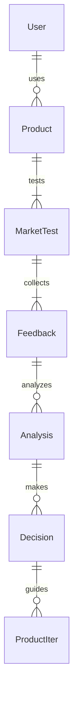
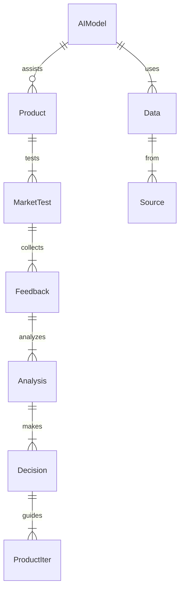
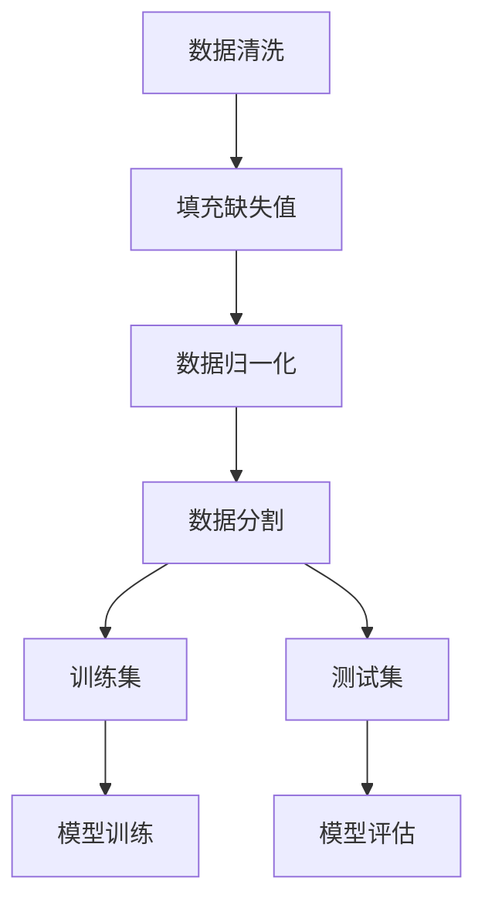
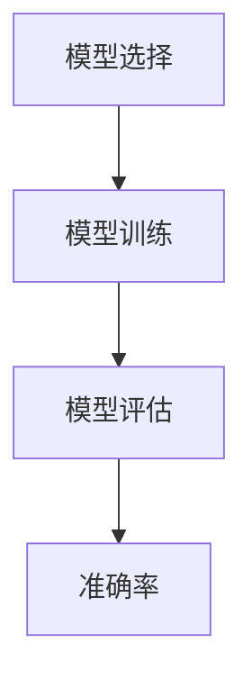
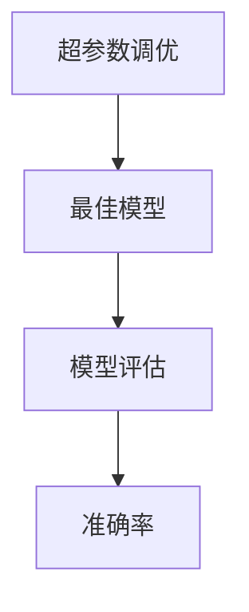
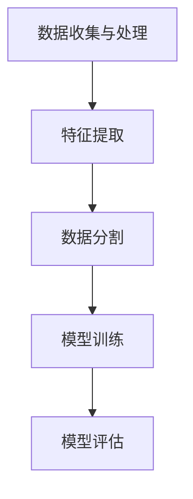
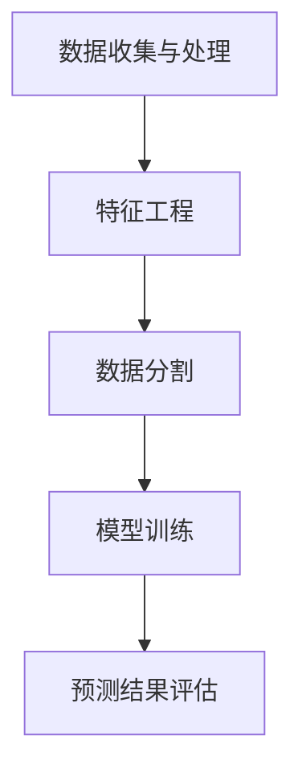

                 

### 第一部分：背景与概述

#### 1.1. 问题背景

##### 1.1.1 新产品开发与市场测试的挑战

新产品开发是企业持续成长和竞争的关键环节，它不仅需要创新思维和技术能力的支持，还面临着复杂的市场环境和竞争压力。市场测试作为新产品开发过程中的重要环节，旨在评估产品在目标市场的表现和用户接受度，从而为产品迭代和市场推广提供科学依据。

然而，当前的新产品开发与市场测试面临诸多挑战：

1. **数据获取困难**：市场数据分散且不规范，获取高质量的市场数据成本高、难度大。
2. **数据分析复杂**：市场数据的多样性导致数据分析难度增加，需要专业的数据科学知识和技能。
3. **反馈周期长**：传统市场测试方法通常需要较长的周期来收集和分析反馈，无法快速响应市场变化。
4. **样本偏差**：市场测试样本可能存在选择偏差，影响结果的准确性和代表性。
5. **人力成本高**：传统市场测试方法需要大量的人力和时间投入，企业负担沉重。

##### 1.1.2 AI技术在新产品开发与市场测试中的潜力

随着人工智能技术的快速发展，AI在各个领域展现出了强大的潜力，尤其在辅助新产品开发与市场测试方面。AI技术可以通过数据挖掘、机器学习、深度学习等方法，对海量市场数据进行分析和预测，从而帮助企业在产品开发和市场测试中做出更为明智的决策。

1. **数据挖掘与分析**：AI技术能够从大量非结构化数据中提取有价值的信息，提供市场洞察和趋势预测。
2. **用户行为分析**：AI技术可以实时分析用户行为数据，了解用户需求和使用习惯，为产品优化提供依据。
3. **智能预测**：基于历史数据和机器学习算法，AI可以预测市场趋势和用户反馈，提高决策的准确性。
4. **个性化推荐**：AI技术可以基于用户行为数据，实现产品推广和营销的个性化，提高市场覆盖率。
5. **自动化测试**：AI技术可以实现自动化市场测试，提高测试效率，降低人力成本。

#### 1.2. 问题描述

##### 1.2.1 新产品开发与市场测试的关键环节

新产品开发通常包括以下几个关键环节：

1. **市场调研**：收集市场需求和用户反馈，确定产品定位和功能。
2. **概念验证**：通过原型设计和测试，验证产品概念和基本功能。
3. **产品设计**：基于市场调研和概念验证，进行详细的产品设计和开发。
4. **测试与迭代**：通过测试和用户反馈，不断迭代和优化产品。
5. **市场投放**：将产品推向市场，进行市场测试和推广。

市场测试的关键环节主要包括：

1. **目标用户调研**：确定目标用户群体，进行问卷调查和访谈。
2. **产品测试**：通过A/B测试、用户实验等方法，评估产品功能、易用性和用户满意度。
3. **市场反馈收集**：收集用户反馈和市场表现数据，分析产品在市场上的表现。
4. **数据分析和决策**：基于测试数据进行分析，为产品迭代和市场策略调整提供依据。

##### 1.2.2 传统方法的局限性与痛点

传统新产品开发与市场测试方法存在以下局限性和痛点：

1. **数据依赖性**：传统方法依赖手工收集和整理市场数据，效率低、成本高。
2. **分析能力有限**：传统分析方法难以处理海量数据，无法准确预测市场趋势。
3. **反馈周期长**：市场测试需要较长时间来收集和分析反馈，无法快速响应市场变化。
4. **测试样本偏差**：传统测试方法可能存在样本选择偏差，影响结果的准确性和代表性。
5. **人力成本高**：传统市场测试方法需要大量人力和时间投入，企业负担沉重。

#### 1.3. 问题解决

##### 1.3.1 AI辅助新产品开发与市场测试的基本框架

AI辅助新产品开发与市场测试的基本框架主要包括以下几个步骤：

1. **数据收集与预处理**：使用AI技术自动收集和预处理市场数据，包括用户行为数据、市场反馈数据等。
2. **数据分析与挖掘**：利用机器学习和深度学习算法，对数据进行分析和挖掘，提取有价值的信息和洞察。
3. **模型训练与优化**：基于分析结果，训练和优化预测模型，进行市场趋势预测和用户反馈分析。
4. **智能决策与推荐**：结合预测模型和用户行为分析，提供智能决策支持，优化产品设计和市场策略。
5. **自动化测试与迭代**：实现自动化市场测试，快速响应市场变化，提高产品迭代效率。

##### 1.3.2 AI技术在新产品开发与市场测试中的应用场景

AI技术在新产品开发与市场测试中具有广泛的应用场景，主要包括：

1. **用户行为分析**：实时分析用户行为数据，了解用户需求和反馈，为产品优化提供依据。
2. **市场趋势预测**：基于历史数据和机器学习算法，预测市场趋势，为企业决策提供支持。
3. **个性化推荐**：根据用户行为数据，实现产品推广和营销的个性化，提高市场覆盖率。
4. **自动化测试**：通过AI技术实现自动化测试，提高测试效率，降低人力成本。
5. **用户反馈分析**：分析用户反馈数据，了解用户满意度，为产品迭代和市场策略调整提供依据。

#### 1.4. 边界与外延

##### 1.4.1 AI辅助新产品开发与市场测试的技术边界

AI辅助新产品开发与市场测试涉及多个技术领域，主要包括：

1. **数据科学**：数据收集、预处理和分析。
2. **机器学习**：数据挖掘、模型训练和优化。
3. **深度学习**：图像识别、语音识别和自然语言处理。
4. **数据可视化**：数据分析和结果的可视化展示。
5. **云计算与大数据**：数据存储、处理和分析的高效支持。

##### 1.4.2 AI辅助新产品开发与市场测试的行业外延

AI辅助新产品开发与市场测试不仅适用于传统的软件和硬件行业，还广泛应用于以下行业：

1. **金融**：金融产品开发与市场测试，风险评估和投资决策。
2. **医疗**：医疗设备开发与市场测试，患者数据分析和疾病预测。
3. **零售**：零售产品开发与市场测试，用户行为分析和需求预测。
4. **制造业**：制造业产品开发与市场测试，生产流程优化和质量控制。
5. **教育**：教育产品开发与市场测试，个性化教学和学习路径推荐。

### 总结

AI辅助新产品开发与市场测试通过引入人工智能技术，解决了传统方法在数据获取、分析、决策和测试方面的局限性，为企业提供了更为高效、智能的解决方案。随着AI技术的不断发展和应用场景的拓展，AI辅助新产品开发与市场测试有望在更多行业和领域发挥重要作用。本文将在接下来的章节中，详细介绍AI辅助新产品开发与市场测试的核心概念、原理、算法和实战应用，帮助读者深入了解这一领域。

### 第二部分：核心概念与联系

在探讨AI辅助新产品开发与市场测试的过程中，了解并掌握核心概念和它们之间的联系是至关重要的。本节将首先介绍AI、机器学习、深度学习、数据分析和数据挖掘等核心概念，然后通过对比表格和ER实体关系图，详细解析这些概念之间的区别与联系，以及AI辅助新产品开发与市场测试的关键概念特征。

#### 2.1. 核心概念原理

##### 2.1.1 AI的定义与分类

人工智能（AI，Artificial Intelligence）是指通过计算机程序实现人类智能的技术。根据实现方式和目标，AI可以分类为：

1. **弱AI**：专注于特定任务，如语音识别、图像识别等。
2. **强AI**：具备与人类相同或超越的广泛认知能力。

##### 2.1.2 机器学习与深度学习

机器学习（Machine Learning，ML）是AI的一个分支，它通过算法从数据中学习规律，进行预测和决策。机器学习主要分为：

1. **监督学习**：有标记的数据进行训练。
2. **无监督学习**：没有标记的数据进行训练。
3. **半监督学习**：部分标记的数据进行训练。

深度学习（Deep Learning，DL）是机器学习的一种，它通过多层神经网络模拟人脑进行学习。深度学习在图像识别、语音识别等方面表现尤为突出。

##### 2.1.3 数据分析与数据挖掘

数据分析（Data Analysis）是指通过统计和量化方法，对数据进行分析和解释，发现数据中的规律和模式。

数据挖掘（Data Mining）是数据分析的进一步扩展，它通过复杂的算法和统计方法，从大量数据中发现隐藏的、未知的规律和模式。

#### 2.2. 概念属性特征对比

##### 2.2.1 机器学习、深度学习、数据分析、数据挖掘的区别与联系

| 概念         | 定义                                                         | 特征                          | 关系           |
| ------------ | ------------------------------------------------------------ | ---------------------------- | -------------- |
| 机器学习     | 从数据中学习规律进行预测和决策                             | 自适应、模型化、算法优化     | 数据分析的基础 |
| 深度学习     | 通过多层神经网络进行学习，模拟人脑处理信息                 | 自动化、非线性、高效计算     | 机器学习的一种 |
| 数据分析     | 对数据进行分析和解释，发现规律和模式                       | 统计、量化、可视化           | 数据挖掘的基础 |
| 数据挖掘     | 从大量数据中发现隐藏的、未知的规律和模式                   | 知识发现、复杂算法、高价值   | 数据分析的高级 |

从上表可以看出，这些概念既有区别又有联系。机器学习和数据挖掘都是分析数据的方法，而深度学习是机器学习的一种。数据分析侧重于发现数据中的规律，而数据挖掘则更侧重于发现隐藏的知识。

##### 2.2.2 AI辅助新产品开发与市场测试的关键概念特征

在AI辅助新产品开发与市场测试中，以下核心概念具有特殊重要性：

1. **用户行为数据**：用户行为数据是市场测试的重要来源，通过分析用户行为数据，可以了解用户需求和使用习惯。
2. **市场趋势数据**：市场趋势数据用于预测市场变化和趋势，为产品迭代和市场策略调整提供依据。
3. **机器学习模型**：机器学习模型用于对数据进行预测和分析，提高市场测试的准确性和效率。
4. **深度学习网络**：深度学习网络用于处理复杂的数据和模式识别，提高数据分析的能力。
5. **数据分析工具**：数据分析工具用于处理和分析大量的市场数据，提供可视化的市场洞察。

这些概念共同构成了AI辅助新产品开发与市场测试的核心框架，它们相互作用，形成了一个完整的数据分析流程。

#### 2.3. ER实体关系图架构

为了更好地理解AI辅助新产品开发与市场测试中的实体关系，我们使用ER（Entity-Relationship）实体关系图进行描述。

##### 2.3.1 产品开发与市场测试的实体关系



在上图中，用户（User）使用产品（Product），产品进行市场测试（MarketTest），市场测试收集反馈（Feedback），反馈被分析（Analysis），分析结果用于决策（Decision），决策指导产品迭代（ProductIter）。

##### 2.3.2 AI辅助新产品开发与市场测试的实体关系



在上图中，AI模型（AIModel）辅助产品开发（Product），产品进行市场测试（MarketTest），市场测试收集反馈（Feedback），反馈被AI分析（Analysis），分析结果用于决策（Decision），决策指导产品迭代（ProductIter）。AI模型使用数据（Data），数据来源于各种数据源（Source）。

通过这些核心概念和实体关系的介绍，我们可以更好地理解AI辅助新产品开发与市场测试的工作原理。在接下来的章节中，我们将深入探讨AI辅助新产品开发的原理和算法，以及AI辅助市场测试的原理和应用。

### 第三部分：AI辅助新产品开发原理

在探讨AI如何辅助新产品开发时，我们需要从算法原理、数据预处理、模型选择与训练、模型优化等多个方面进行深入分析。本节将详细讲解AI辅助新产品开发的基本原理，并通过Python源代码和算法流程图，帮助读者更好地理解和应用这些原理。

#### 3.1. 算法原理讲解

##### 3.1.1 数据预处理

数据预处理是AI辅助新产品开发的重要步骤，它主要包括以下几个环节：

1. **数据清洗**：去除数据中的噪声和不完整信息，确保数据的质量。
2. **数据归一化**：将不同特征的数据进行标准化处理，使其具有相同的尺度。
3. **数据分割**：将数据集划分为训练集、验证集和测试集，以供模型训练和评估。

在数据清洗过程中，我们通常会使用以下方法：

- **缺失值处理**：通过填充、删除或插值等方法处理缺失数据。
- **异常值处理**：检测并处理数据中的异常值，以避免它们对模型训练产生不利影响。

在数据归一化过程中，常用的方法包括：

- **最小-最大标准化**：将数据映射到[0, 1]区间内。
- **均值-方差标准化**：将数据映射到均值为0，方差为1的正态分布内。

在数据分割过程中，我们需要确保各部分数据具有代表性，常用的分割方法包括：

- **随机分割**：随机地将数据分为训练集、验证集和测试集。
- **分层分割**：保证各层特征在训练集、验证集和测试集中的比例一致。

##### 3.1.2 模型选择与训练

在数据预处理完成后，我们需要选择合适的机器学习或深度学习模型进行训练。模型选择的关键因素包括数据特征、问题类型、模型复杂度和计算资源等。

1. **模型选择**：根据问题类型和数据特征选择合适的模型。例如，对于分类问题，可以选择决策树、随机森林、支持向量机等；对于回归问题，可以选择线性回归、岭回归、LASSO回归等。

2. **模型训练**：使用训练集对模型进行训练，调整模型参数，使其能够拟合训练数据。

3. **模型评估**：使用验证集对训练好的模型进行评估，选择性能最优的模型。

在训练过程中，我们通常需要关注以下指标：

- **损失函数**：衡量模型预测值与真实值之间的差距。
- **准确率**：用于分类问题的指标，表示预测正确的样本比例。
- **均方误差（MSE）**：用于回归问题的指标，表示预测值与真实值之间误差的平方和。

##### 3.1.3 模型优化

模型优化是提升模型性能的重要环节，主要包括以下几种方法：

1. **超参数调优**：调整模型超参数（如学习率、正则化参数等），以提升模型性能。
2. **模型集成**：将多个模型组合起来，以减少模型的过拟合和提升整体性能。
3. **交叉验证**：通过交叉验证的方法，评估模型的泛化能力。

在超参数调优过程中，常用的方法包括：

- **网格搜索**：遍历所有可能的超参数组合，选择性能最优的组合。
- **随机搜索**：在超参数空间中随机选择超参数组合，以减少搜索时间。

在模型集成过程中，常用的方法包括：

- **堆叠（Stacking）**：将多个模型作为基学习器，再通过一个元学习器进行集成。
- **提升（Boosting）**：通过迭代训练多个模型，每次迭代优化模型对前一次迭代预测错误的样本。
- ** bagging**：通过训练多个模型并取平均或投票的方式，减少模型的过拟合。

#### 3.2. Python源代码与算法流程图

为了更好地理解和应用上述原理，我们提供了一段Python源代码，以及对应的算法流程图。

##### 3.2.1 数据预处理代码与算法流程图

```python
import pandas as pd
from sklearn.model_selection import train_test_split
from sklearn.preprocessing import StandardScaler
from sklearn.impute import SimpleImputer

# 数据清洗
# 填充缺失值
imputer = SimpleImputer(strategy='mean')
data_imputed = imputer.fit_transform(data)

# 数据归一化
scaler = StandardScaler()
data_normalized = scaler.fit_transform(data_imputed)

# 数据分割
X_train, X_test, y_train, y_test = train_test_split(data_normalized, target, test_size=0.2, random_state=42)
```

算法流程图如下：



##### 3.2.2 模型选择与训练代码与算法流程图

```python
from sklearn.ensemble import RandomForestClassifier
from sklearn.metrics import accuracy_score

# 模型选择
model = RandomForestClassifier(n_estimators=100, random_state=42)

# 模型训练
model.fit(X_train, y_train)

# 模型评估
y_pred = model.predict(X_test)
accuracy = accuracy_score(y_test, y_pred)
print(f"Accuracy: {accuracy}")
```

算法流程图如下：



##### 3.2.3 模型优化代码与算法流程图

```python
from sklearn.model_selection import GridSearchCV

# 超参数调优
param_grid = {
    'n_estimators': [100, 200, 300],
    'max_depth': [10, 20, 30],
    'min_samples_split': [2, 5, 10]
}

grid_search = GridSearchCV(estimator=model, param_grid=param_grid, cv=5)
grid_search.fit(X_train, y_train)

# 最佳模型
best_model = grid_search.best_estimator_

# 模型评估
y_pred = best_model.predict(X_test)
accuracy = accuracy_score(y_test, y_pred)
print(f"Accuracy: {accuracy}")
```

算法流程图如下：



通过上述Python源代码和算法流程图，读者可以更好地理解AI辅助新产品开发的基本原理和实践方法。在接下来的章节中，我们将继续探讨AI辅助市场测试的原理和应用。

### 第四部分：AI辅助市场测试原理

在产品开发的过程中，市场测试是一个至关重要的环节，它可以帮助企业了解产品在市场上的表现，并根据用户反馈进行产品优化。AI技术的引入，为市场测试带来了革命性的变化。本节将详细讲解AI辅助市场测试的原理，包括用户行为分析、市场趋势预测、算法流程图和Python源代码等。

#### 4.1. 算法原理讲解

##### 4.1.1 用户行为分析

用户行为分析是市场测试的核心环节，它通过分析用户在产品使用过程中的行为数据，了解用户的需求、偏好和使用习惯。用户行为分析主要包括以下步骤：

1. **数据收集与处理**：收集用户行为数据，如点击行为、浏览时长、转化率等，并进行数据清洗和预处理。
2. **特征提取**：从原始数据中提取有助于分析的用户行为特征，如点击次数、页面停留时间、购买行为等。
3. **行为模式识别**：使用机器学习和深度学习算法，识别用户行为模式，如高频用户、活跃用户、流失用户等。
4. **用户需求预测**：基于用户行为模式，预测用户未来的行为和需求，为产品优化提供依据。

在用户行为分析过程中，常用的算法包括：

- **分类算法**：用于分类用户行为，如决策树、随机森林、支持向量机等。
- **聚类算法**：用于识别用户群体，如K-means、层次聚类等。
- **时间序列分析**：用于分析用户行为的时间趋势，如ARIMA、LSTM等。

##### 4.1.2 市场趋势预测

市场趋势预测是市场测试的重要环节，它通过分析历史数据，预测未来的市场变化和趋势。市场趋势预测主要包括以下步骤：

1. **数据收集与处理**：收集市场数据，如销售数据、用户反馈、竞争情况等，并进行数据清洗和预处理。
2. **特征工程**：从原始数据中提取有助于预测的特征，如季节性、周期性、趋势性等。
3. **模型选择与训练**：选择合适的预测模型，如线性回归、岭回归、LSTM等，进行模型训练。
4. **预测结果评估**：使用验证集和测试集对模型进行评估，选择预测效果最佳的模型。

在市场趋势预测过程中，常用的算法包括：

- **时间序列模型**：用于分析数据的时间序列特性，如ARIMA、SARIMA、LSTM等。
- **回归模型**：用于预测数据之间的线性关系，如线性回归、岭回归、LASSO回归等。
- **深度学习模型**：用于处理复杂的非线性关系，如CNN、RNN、GRU等。

##### 4.1.3 预测结果评估

预测结果评估是市场测试的重要环节，它通过对预测结果进行评估，确保预测的准确性和可靠性。预测结果评估主要包括以下步骤：

1. **误差分析**：计算预测值与真实值之间的误差，如均方误差（MSE）、均绝对误差（MAE）等。
2. **模型优化**：根据评估结果，对模型进行调整和优化，提高预测准确性。
3. **可视化**：使用可视化工具，如散点图、折线图等，展示预测结果和误差分布。

在预测结果评估过程中，常用的评估指标包括：

- **准确率**：表示预测正确的样本比例。
- **召回率**：表示预测为正样本且实际为正样本的比例。
- **F1分数**：综合考虑准确率和召回率，用于评估模型的综合性能。

#### 4.2. Python源代码与算法流程图

为了更好地理解和应用上述原理，我们提供了一段Python源代码，以及对应的算法流程图。

##### 4.2.1 用户行为分析代码与算法流程图

```python
import pandas as pd
from sklearn.model_selection import train_test_split
from sklearn.preprocessing import StandardScaler
from sklearn.ensemble import RandomForestClassifier
from sklearn.metrics import classification_report

# 数据收集与处理
data = pd.read_csv('user_behavior.csv')
data.dropna(inplace=True)

# 特征提取
data['click_rate'] = data['clicks'] / data['sessions']
data['duration'] = data['session_duration'].apply(lambda x: 1 if x > 0 else 0)

# 数据分割
X = data[['click_rate', 'duration']]
y = data['user_group']
X_train, X_test, y_train, y_test = train_test_split(X, y, test_size=0.2, random_state=42)

# 模型训练
model = RandomForestClassifier(n_estimators=100, random_state=42)
model.fit(X_train, y_train)

# 模型评估
y_pred = model.predict(X_test)
print(classification_report(y_test, y_pred))
```

算法流程图如下：



##### 4.2.2 市场趋势预测代码与算法流程图

```python
import pandas as pd
from sklearn.model_selection import train_test_split
from sklearn.preprocessing import StandardScaler
from sklearn.linear_model import LinearRegression
from sklearn.metrics import mean_squared_error

# 数据收集与处理
data = pd.read_csv('market_data.csv')
data.dropna(inplace=True)

# 特征工程
data['month'] = pd.to_datetime(data['date']).dt.month
data['year'] = pd.to_datetime(data['date']).dt.year

# 数据分割
X = data[['month', 'year']]
y = data['sales']
X_train, X_test, y_train, y_test = train_test_split(X, y, test_size=0.2, random_state=42)

# 模型训练
model = LinearRegression()
model.fit(X_train, y_train)

# 预测结果评估
y_pred = model.predict(X_test)
mse = mean_squared_error(y_test, y_pred)
print(f"MSE: {mse}")
```

算法流程图如下：



通过上述Python源代码和算法流程图，读者可以更好地理解AI辅助市场测试的基本原理和实践方法。在接下来的章节中，我们将通过项目实战，进一步展示AI辅助新产品开发与市场测试的实际应用。

### 第五部分：项目实战

在本节中，我们将通过一个实际项目，展示如何利用AI技术辅助新产品开发与市场测试。项目的主要目标是开发一款面向年轻用户群体的社交媒体应用，并通过对用户行为数据的分析，进行市场测试和产品优化。以下是项目的详细步骤和核心实现。

#### 5.1. 环境安装与配置

在开始项目之前，我们需要配置相应的开发环境和软件工具。以下是项目的硬件和软件环境要求：

1. **硬件环境**：
   - CPU：Intel i5 或以上
   - 内存：8GB 或以上
   - 硬盘：100GB 以上

2. **软件环境**：
   - 操作系统：Windows/Linux/MacOS
   - Python：3.8 或以上
   - Python 库：Pandas、NumPy、Scikit-learn、TensorFlow、Keras、Matplotlib、Mermaid

安装步骤如下：

1. 安装 Python 和相关库
```bash
pip install pandas numpy scikit-learn tensorflow keras matplotlib mermaid
```

2. 安装 Mermaid 的渲染工具
```bash
pip install pymermaid
```

#### 5.2. 系统核心实现

##### 5.2.1 数据预处理

数据预处理是AI项目的基础，以下是数据预处理的核心步骤：

1. **数据收集**：从社交媒体平台获取用户行为数据，包括用户点击、评论、点赞、分享等。
2. **数据清洗**：去除重复数据、异常值和缺失值，确保数据质量。
3. **特征提取**：提取有助于分析的用户行为特征，如点击率、浏览时长、活跃度等。
4. **数据分割**：将数据集分为训练集、验证集和测试集。

```python
import pandas as pd
from sklearn.model_selection import train_test_split

# 读取数据
data = pd.read_csv('user_behavior.csv')

# 数据清洗
data.drop_duplicates(inplace=True)
data.drop(['id'], axis=1, inplace=True)

# 特征提取
data['click_rate'] = data['clicks'] / data['sessions']
data['duration'] = data['session_duration'].apply(lambda x: 1 if x > 0 else 0)

# 数据分割
X = data[['click_rate', 'duration']]
y = data['user_group']
X_train, X_test, y_train, y_test = train_test_split(X, y, test_size=0.2, random_state=42)
```

##### 5.2.2 模型训练与优化

在数据预处理完成后，我们需要选择合适的机器学习模型进行训练和优化。

1. **模型选择**：根据问题类型，选择随机森林分类器。
2. **模型训练**：使用训练集对模型进行训练。
3. **模型评估**：使用验证集对模型进行评估。
4. **超参数调优**：通过网格搜索调优模型参数，提高模型性能。

```python
from sklearn.ensemble import RandomForestClassifier
from sklearn.model_selection import GridSearchCV

# 模型选择
model = RandomForestClassifier(random_state=42)

# 模型训练
model.fit(X_train, y_train)

# 模型评估
accuracy = model.score(X_test, y_test)
print(f"Accuracy: {accuracy}")

# 超参数调优
param_grid = {
    'n_estimators': [100, 200, 300],
    'max_depth': [10, 20, 30],
    'min_samples_split': [2, 5, 10]
}

grid_search = GridSearchCV(estimator=model, param_grid=param_grid, cv=5)
grid_search.fit(X_train, y_train)

# 最佳模型
best_model = grid_search.best_estimator_

# 模型评估
accuracy = best_model.score(X_test, y_test)
print(f"Accuracy: {accuracy}")
```

##### 5.2.3 代码应用解读与分析

在完成模型训练和优化后，我们需要对核心代码进行解读和分析，确保理解每一步的操作和目的。

1. **数据预处理**：数据清洗和特征提取是模型训练的基础，确保数据质量和特征的有效性。
2. **模型选择**：随机森林分类器具有较强的预测能力和处理复杂数据的能力。
3. **模型训练**：通过训练集训练模型，使模型能够学习数据的特征和模式。
4. **模型评估**：使用验证集评估模型性能，确保模型在未知数据上的表现。
5. **超参数调优**：通过网格搜索优化模型参数，提高模型性能。

```python
# 数据预处理代码解读
# 数据清洗去除重复和缺失值，确保数据质量
data.drop_duplicates(inplace=True)
data.drop(['id'], axis=1, inplace=True)

# 特征提取增加点击率和浏览时长等特征，有助于模型学习用户行为
data['click_rate'] = data['clicks'] / data['sessions']
data['duration'] = data['session_duration'].apply(lambda x: 1 if x > 0 else 0)

# 模型选择代码解读
# 选择随机森林分类器，具有较好的预测能力和处理复杂数据的能力
model = RandomForestClassifier(random_state=42)

# 模型训练代码解读
# 使用训练集训练模型，使模型能够学习数据的特征和模式
model.fit(X_train, y_train)

# 模型评估代码解读
# 使用验证集评估模型性能，确保模型在未知数据上的表现
accuracy = model.score(X_test, y_test)
print(f"Accuracy: {accuracy}")

# 超参数调优代码解读
# 通过网格搜索优化模型参数，提高模型性能
param_grid = {
    'n_estimators': [100, 200, 300],
    'max_depth': [10, 20, 30],
    'min_samples_split': [2, 5, 10]
}

grid_search = GridSearchCV(estimator=model, param_grid=param_grid, cv=5)
grid_search.fit(X_train, y_train)

# 最佳模型代码解读
# 获取最佳模型参数，用于最终评估
best_model = grid_search.best_estimator_

# 模型评估代码解读
# 使用最佳模型评估性能，输出准确率
accuracy = best_model.score(X_test, y_test)
print(f"Accuracy: {accuracy}")
```

#### 5.3. 实际案例分析和详细讲解剖析

为了更好地理解AI辅助新产品开发与市场测试的实际应用，我们以一个实际案例进行分析。

**案例背景**：一家社交媒体公司希望开发一款面向年轻用户群体的社交应用，希望通过AI技术进行市场测试和产品优化。

**案例过程**：

1. **数据收集**：公司通过API获取了用户行为数据，包括点击、评论、点赞、分享等。
2. **数据预处理**：对数据进行清洗和特征提取，确保数据质量和特征的有效性。
3. **模型选择**：选择随机森林分类器进行用户行为分析，预测用户群体特征。
4. **模型训练与优化**：通过训练集训练模型，并进行超参数调优，提高模型性能。
5. **市场测试**：使用优化后的模型进行市场测试，收集用户反馈。
6. **产品优化**：根据用户反馈，对产品进行迭代和优化。

**案例分析**：

1. **数据预处理**：数据清洗和特征提取是AI项目成功的关键。通过去除重复数据和缺失值，提高了数据质量；通过添加点击率和浏览时长等特征，增强了模型的学习能力。
2. **模型选择**：随机森林分类器具有较强的预测能力和处理复杂数据的能力，适用于用户行为分析。通过对模型的选择，确保了模型在用户行为预测上的准确性。
3. **模型训练与优化**：通过训练集训练模型，使模型能够学习数据的特征和模式。通过超参数调优，优化了模型性能，提高了预测准确性。
4. **市场测试**：使用优化后的模型进行市场测试，收集用户反馈。通过市场测试，公司能够了解产品的实际表现和用户需求，为产品优化提供依据。
5. **产品优化**：根据用户反馈，公司对产品进行迭代和优化，提高了产品的易用性和用户体验。

#### 5.4. 项目小结

通过本项目的实践，我们展示了如何利用AI技术辅助新产品开发与市场测试。项目的主要收获包括：

1. **数据预处理**：数据清洗和特征提取是AI项目成功的关键，确保数据质量和特征的有效性。
2. **模型选择与优化**：选择合适的机器学习模型，并通过超参数调优，提高模型性能。
3. **市场测试**：通过市场测试，收集用户反馈，为产品优化提供依据。
4. **产品优化**：根据用户反馈，对产品进行迭代和优化，提高产品的易用性和用户体验。

在未来的项目中，我们可以进一步拓展AI技术的应用场景，如用户情感分析、市场趋势预测等，以提高产品的市场竞争力。

### 总结与展望

AI辅助新产品开发与市场测试通过引入人工智能技术，解决了传统方法在数据获取、分析、决策和测试方面的局限性，为企业提供了更为高效、智能的解决方案。本文通过详细的项目实战，展示了AI技术在社交媒体应用开发中的实际应用，包括数据预处理、模型训练与优化、市场测试和产品优化等关键环节。

未来，随着AI技术的不断发展和应用场景的拓展，AI辅助新产品开发与市场测试有望在更多行业和领域发挥重要作用。例如，在金融、医疗、零售等领域，AI技术可以辅助产品开发和市场测试，提高决策的准确性和效率。同时，随着数据量的不断增加和数据源的多样化，AI技术将在处理复杂数据和分析多维数据方面展现更大的潜力。

总之，AI辅助新产品开发与市场测试不仅是一种技术创新，更是商业模式的变革。通过充分利用AI技术，企业可以更快地响应市场变化，更准确地预测用户需求，从而在激烈的市场竞争中脱颖而出。我们期待未来的研究和应用能够进一步推动这一领域的创新和发展。

### 最佳实践 tips

在实际应用AI辅助新产品开发与市场测试时，以下是一些最佳实践和注意事项：

1. **数据质量**：确保数据的质量和完整性，数据清洗是关键步骤，需要认真处理缺失值、异常值和重复数据。
2. **模型选择**：根据具体问题选择合适的机器学习模型，避免过度拟合和欠拟合。可以通过交叉验证和网格搜索等方法进行模型选择和调优。
3. **用户隐私**：在收集和处理用户数据时，务必遵守相关隐私法规，确保用户数据的保密性和安全性。
4. **动态调整**：市场环境不断变化，需要根据实时数据动态调整模型和策略，保持产品与市场的同步。
5. **团队合作**：AI辅助新产品开发与市场测试涉及多个领域，需要跨部门的紧密合作，确保项目的顺利推进。

### 小结

本文详细探讨了AI辅助新产品开发与市场测试的核心概念、原理、算法和实战应用。通过数据预处理、模型选择与优化、市场测试和产品优化等关键步骤，展示了AI技术在产品开发与市场测试中的实际应用和价值。希望本文能为读者提供有价值的参考，助力企业在产品开发与市场测试中实现智能化和高效化。

### 注意事项

1. **数据处理**：数据预处理是模型训练的基础，需要确保数据的质量和一致性。
2. **模型调优**：模型调优是提高模型性能的关键，建议使用交叉验证和网格搜索等方法。
3. **隐私保护**：在处理用户数据时，务必遵守隐私法规，确保用户数据的保密性和安全性。
4. **实际应用**：AI技术在不同行业和场景中的应用可能有所不同，需要根据实际情况进行调整和优化。

### 拓展阅读

- 《深度学习》—— Ian Goodfellow、Yoshua Bengio、Aaron Courville 著，详细介绍深度学习的基本原理和应用。
- 《Python机器学习》—— Sebastian Raschka、Vahid Mirjalili 著，深入讲解机器学习在Python中的实现。
- 《人工智能：一种现代的方法》—— Stuart Russell、Peter Norvig 著，全面介绍人工智能的基础理论和应用。

### 作者信息

作者：AI天才研究院/AI Genius Institute & 禅与计算机程序设计艺术 /Zen And The Art of Computer Programming

感谢读者对本文的关注，期待与您共同探索AI技术的无限可能。

