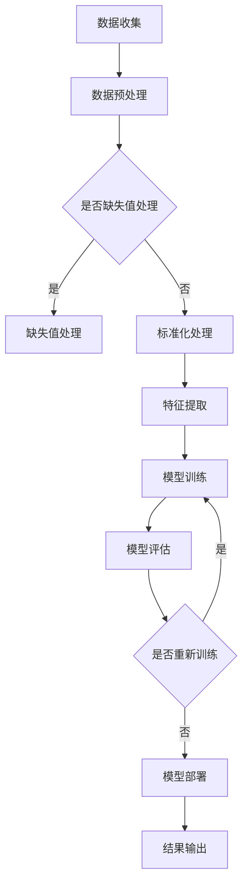
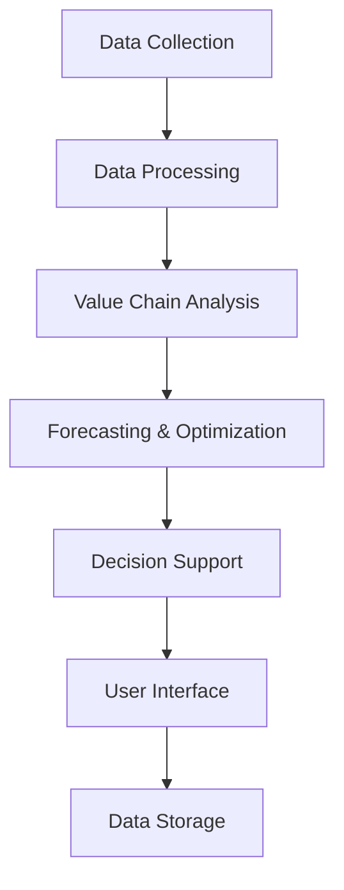
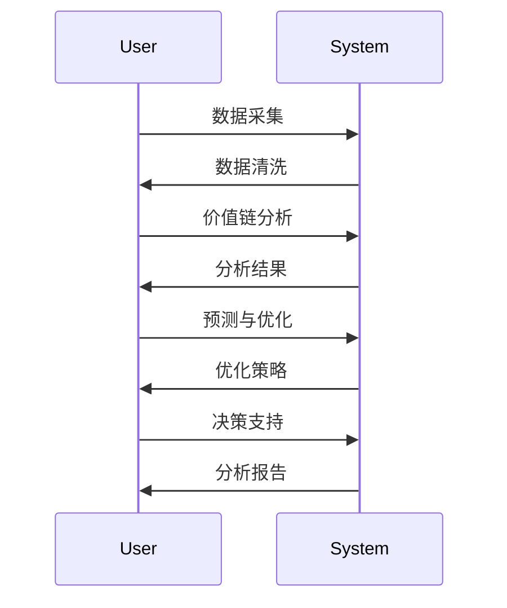
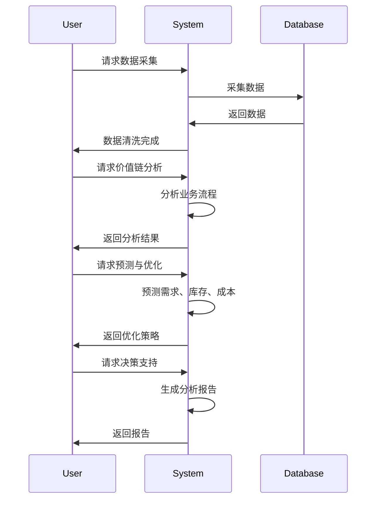

                 


### 引言

**文章标题：AI辅助的企业价值链分析**

**关键词：AI、价值链分析、企业、价值提升**

**摘要：**
本文旨在探讨人工智能（AI）在企业价值链分析中的应用及其重要性。随着技术的飞速发展，AI技术已经渗透到各个行业，为企业带来了前所未有的机遇和挑战。本文将首先介绍AI的基本概念和在企业中的应用，然后详细阐述AI辅助价值链分析的理论基础和实践方法，旨在为企业提供有效的AI应用策略，助力企业实现价值提升。

### 第1章 引言

#### 1.1 研究背景与意义

人工智能（AI）作为21世纪最具革命性的技术之一，已经在全球范围内引发了广泛的应用和关注。从早期的自动化到现代的智能决策支持系统，AI技术已经深入到企业的各个层面，包括生产、运营、销售、服务等。随着大数据和云计算等技术的不断发展，AI的应用范围进一步扩大，为企业带来了更多的可能性和机会。

价值链分析是企业战略管理的重要组成部分。通过分析企业的价值链，企业可以识别出核心业务流程和关键价值点，从而优化资源配置，提高运营效率，实现价值最大化。然而，传统的价值链分析往往依赖于人工经验和主观判断，难以全面、准确地反映企业的实际运营情况。

结合AI技术，可以对价值链分析进行智能化和自动化处理，从而提高分析效率和准确性。AI能够从海量数据中提取有价值的信息，发现潜在的运营瓶颈和改进机会，为企业提供更为精准的决策支持。

#### 1.2 研究问题与目标

本文旨在解决以下研究问题：

1. AI技术如何应用于企业价值链分析？
2. AI辅助价值链分析的理论基础和实践方法是什么？
3. AI在企业价值链分析中具有哪些优势与挑战？

本文的研究目标如下：

1. 梳理AI技术的基本概念和发展历程，分析其在企业中的应用现状。
2. 探讨AI辅助价值链分析的理论基础，构建AI辅助价值链分析的框架。
3. 分析AI辅助价值链分析的核心概念与联系，阐述其应用方法和实践流程。
4. 通过实际案例和项目实战，展示AI辅助价值链分析的实际效果和操作步骤。

#### 1.3 研究方法与数据来源

本文采用文献综述和案例研究相结合的方法。首先，通过查阅相关文献和资料，梳理AI技术的基本概念、发展历程和应用现状。然后，选择具有代表性的企业案例，分析其AI辅助价值链分析的实施过程和效果。

数据来源主要包括以下几个方面：

1. 学术期刊、会议论文和学位论文等文献资料。
2. 企业官方网站、行业报告和新闻报道等公开信息。
3. 企业内部数据、市场数据和第三方数据服务。

#### 1.4 边界与外延

本文的研究边界主要涉及以下几个方面：

1. 研究范围：主要关注AI在企业价值链分析中的应用，不包括其他领域（如供应链管理、客户关系管理等）。
2. 研究方法：主要采用定量分析，结合定性分析，以全面、客观地评估AI辅助价值链分析的效果。
3. 数据来源：主要依赖公开数据和内部数据，不包括保密数据。

本文的研究外延包括以下几个方面：

1. 探讨AI技术在不同行业中的应用，为其他行业提供参考。
2. 分析AI辅助价值链分析的其他应用场景，如成本分析、风险评估等。
3. 探索AI辅助价值链分析的未来发展趋势，为企业提供前瞻性指导。

#### 1.5 概念结构与核心要素组成

本文的核心概念包括：

1. 人工智能（AI）：模拟人类智能的计算机系统，包括机器学习、深度学习、自然语言处理等。
2. 价值链分析：企业内部各业务流程的分析和优化，旨在提高企业整体运营效率和竞争力。
3. 企业：具有独立法人资格，从事生产、运营、销售、服务等经济活动的经济组织。

本文的核心要素包括：

1. AI技术：机器学习、深度学习、自然语言处理等。
2. 价值链分析：业务流程、关键价值点、资源配置等。
3. 企业应用：具体实施过程、效果评估、案例分析等。

通过以上概念结构和核心要素的梳理，本文旨在为企业提供一套完整的AI辅助价值链分析理论和实践方法，助力企业实现价值提升。

---

**接下来的章节将分别对AI技术、价值链分析、AI在价值链分析中的应用、AI辅助价值链分析的框架构建、核心概念与联系、算法原理讲解、数学模型和数学公式、系统分析与架构设计方案、项目实战、最佳实践 tips等进行详细阐述。**

---

### AI与价值链分析概述

#### 2.1 AI概述

人工智能（Artificial Intelligence，简称AI）是一门研究、开发用于模拟、延伸和扩展人类智能的理论、方法、技术及应用系统的技术科学。自1956年达特茅斯会议以来，人工智能经历了数个发展阶段，从早期的规则系统、知识表示，到现代的机器学习、深度学习，AI技术不断取得突破，逐渐成为推动社会进步的重要力量。

AI技术的核心包括：

1. **机器学习（Machine Learning）**：通过训练模型从数据中自动学习和改进，无需显式编程。
2. **深度学习（Deep Learning）**：基于神经网络，尤其是深度神经网络（DNN），实现复杂模式识别和预测。
3. **自然语言处理（Natural Language Processing，NLP）**：使计算机能够理解、解释和生成人类自然语言。
4. **计算机视觉（Computer Vision）**：使计算机具备从图像和视频中提取信息的能力。

AI的应用场景广泛，包括但不限于：

1. **智能助理**：如Siri、Alexa等，为用户提供个性化服务。
2. **自动驾驶**：利用计算机视觉和机器学习技术，实现无人驾驶。
3. **医疗诊断**：通过图像识别和数据分析，提高疾病诊断的准确性。
4. **金融风控**：利用机器学习模型进行信用评估、风险评估等。

#### 2.2 价值链分析概述

价值链分析（Value Chain Analysis）是企业战略管理的重要组成部分。它通过分析企业内部各个业务流程和活动，识别出企业的核心业务和关键价值点，从而优化资源配置，提高企业整体竞争力。

价值链的基本概念包括：

1. **价值链**：指企业从原材料采购到产品销售、服务的整个过程。
2. **价值创造**：指企业在价值链中为顾客提供有价值的产品和服务的过程。
3. **价值点**：指在价值链中对企业具有重要价值的关键环节。
4. **资源配置**：指企业在价值链中的各项资源投入和分配。

价值链分析的目标是：

1. **提高运营效率**：通过识别并优化价值链中的各个环节，减少浪费，提高资源利用率。
2. **增强竞争力**：通过价值链分析，企业可以识别出自身的竞争优势，制定相应的战略措施。
3. **实现价值最大化**：通过优化价值链，提高产品和服务质量，降低成本，从而实现企业价值的最大化。

#### 2.3 AI在价值链分析中的应用

AI技术在价值链分析中的应用主要体现在以下几个方面：

1. **数据分析与优化**：AI能够从海量数据中提取有价值的信息，帮助企业管理者更好地理解业务流程，发现潜在的问题和改进机会。
2. **自动化流程**：通过机器学习和深度学习，AI可以自动化价值链中的某些环节，提高运营效率，减少人力成本。
3. **预测与决策支持**：AI技术可以预测市场需求、客户行为等，为企业提供决策支持，优化资源配置。
4. **智能监控与优化**：利用计算机视觉和自然语言处理技术，AI可以实时监控企业运营状况，自动发现和解决问题。

#### 2.4 AI在价值链分析中的优势

AI在价值链分析中具有以下优势：

1. **数据处理能力**：AI能够处理和分析海量数据，快速识别出有价值的信息。
2. **智能化分析**：AI可以自动学习并优化分析模型，提高分析的准确性和效率。
3. **实时性**：AI技术可以实现实时数据分析和预测，为企业提供及时的决策支持。
4. **自动化**：AI可以自动化价值链中的某些环节，减少人力投入，提高运营效率。
5. **跨领域应用**：AI技术可以应用于不同的行业和业务领域，为企业提供多样化的解决方案。

#### 2.5 AI在价值链分析中的挑战

尽管AI在价值链分析中具有显著的优势，但同时也面临着一些挑战：

1. **数据隐私**：在应用AI技术进行数据分析和预测时，如何保护用户隐私是一个重要问题。
2. **算法透明性**：AI模型的决策过程往往不透明，如何提高算法的透明性和可解释性是一个挑战。
3. **技术成熟度**：AI技术在某些领域的成熟度仍然有待提高，如深度学习模型的训练时间、计算资源需求等。
4. **人才短缺**：AI技术的应用需要大量的专业人才，但现有的人才储备仍然不足。
5. **法律法规**：随着AI技术的应用日益广泛，如何制定相应的法律法规来规范其应用也是一个重要问题。

通过上述对AI和价值链分析的概述，我们可以看出，AI技术为价值链分析提供了强大的工具和手段，但同时也需要克服一系列的挑战。接下来的章节将深入探讨AI辅助价值链分析的理论基础和实践方法，为企业提供切实可行的解决方案。

---

**接下来的章节将详细讨论AI辅助价值链分析的框架构建，包括价值链分析框架、AI辅助价值链分析的关键技术和流程，以及AI辅助价值链分析的架构设计。**

---

### AI辅助价值链分析的框架构建

#### 3.1 价值链分析框架

价值链分析框架是理解和优化企业业务流程的重要工具。一个典型的价值链分析框架包括以下几个关键环节：

1. **原材料采购**：指企业从外部采购原材料或零部件的过程。
2. **生产制造**：将原材料转化为成品的过程，包括制造、装配、测试等环节。
3. **物流与配送**：将产品从生产地运输到客户手中的过程。
4. **市场营销**：包括产品定位、广告宣传、销售渠道管理等。
5. **售后服务**：提供产品安装、维修、保养等售后服务。

在价值链分析中，每个环节都涉及一系列具体的业务流程和活动，企业需要识别出这些流程中的关键价值点和资源配置情况，以便进行优化和改进。

#### 3.2 AI辅助价值链分析的关键技术

AI辅助价值链分析的关键技术主要包括：

1. **数据采集与处理**：通过传感器、物联网、ERP系统等，收集与价值链相关的各种数据，如生产数据、销售数据、客户反馈数据等。然后，利用数据清洗、数据预处理等技术，将原始数据转换为适合分析的形式。
   
2. **机器学习与深度学习**：利用机器学习算法，如回归分析、决策树、神经网络等，对采集到的数据进行建模和分析。深度学习算法（如卷积神经网络、循环神经网络等）则特别适合处理复杂数据和模式识别问题。

3. **自然语言处理（NLP）**：通过NLP技术，可以处理和解析文本数据，如客户反馈、市场报告等，提取有价值的信息。

4. **计算机视觉**：利用计算机视觉技术，可以分析图像和视频数据，如生产线的监控图像、客户购买行为的视频等，从中提取有价值的信息。

5. **预测与分析**：利用AI模型进行预测分析，如需求预测、库存优化、成本分析等，帮助企业做出更准确的决策。

#### 3.3 AI辅助价值链分析流程

AI辅助价值链分析的流程可以概括为以下几个步骤：

1. **问题定义**：明确企业面临的问题和目标，如优化生产流程、提高销售效率、降低库存成本等。
2. **数据收集**：通过各种渠道收集与价值链相关的数据，如生产数据、销售数据、市场数据等。
3. **数据预处理**：对收集到的数据进行清洗、整合和标准化，以便后续的分析和处理。
4. **特征提取**：从预处理后的数据中提取有用的特征，如时间序列特征、类别特征、文本特征等。
5. **模型训练**：选择合适的机器学习或深度学习模型，利用提取的特征进行训练，构建预测或分类模型。
6. **模型评估**：通过交叉验证、ROC曲线等评估模型的效果，并根据评估结果调整模型参数。
7. **模型部署**：将训练好的模型部署到生产环境中，用于实时分析和决策支持。
8. **反馈与优化**：根据模型预测和实际结果的对比，不断优化模型，提高预测的准确性。

#### 3.4 AI辅助价值链分析的架构设计

AI辅助价值链分析的架构设计需要考虑以下几个关键方面：

1. **数据处理层**：包括数据采集、数据存储、数据预处理等功能，是整个分析的基础。
2. **模型训练层**：包括机器学习模型的训练、优化和评估，是整个分析的核心。
3. **模型应用层**：将训练好的模型部署到生产环境中，提供实时预测和分析服务。
4. **用户接口层**：提供友好的用户界面，方便用户进行数据操作、模型选择和结果展示。

以下是一个简化的AI辅助价值链分析架构图：

```
+-----------------+
|    用户接口层    |
+-----------------+
         |
         v
+-----------------+
|    模型应用层    |
+-----------------+
         |
         v
+-----------------+
|    模型训练层    |
+-----------------+
         |
         v
+-----------------+
|   数据处理层    |
+-----------------+
```

通过上述架构设计，企业可以实现对价值链分析的全面、高效和智能化处理，从而实现价值提升和业务优化。

---

**接下来，我们将进一步探讨AI辅助价值链分析中的核心概念与联系，包括核心概念原理、概念属性特征对比表格和ER实体关系图架构的详细说明。**

---

### AI辅助价值链分析的核心概念与联系

#### 4.1 核心概念原理

在AI辅助价值链分析中，核心概念原理是理解和应用AI技术进行价值链分析的基础。以下是一些关键概念及其原理：

1. **机器学习**：机器学习是一种让计算机从数据中自动学习的方法。它通过训练模型来识别数据中的模式，从而进行预测或分类。常见的机器学习方法包括监督学习、无监督学习和强化学习。

   - **监督学习**：输入特征和标签已知的情境下，通过训练模型来预测未知数据的标签。如回归分析和分类算法。
   - **无监督学习**：在没有标签的情况下，通过分析数据的内在结构来发现数据中的模式。如聚类分析和降维技术。
   - **强化学习**：通过试错和反馈机制来学习如何在特定环境中做出最优决策。如机器人控制和自动驾驶。

2. **深度学习**：深度学习是一种基于神经网络的机器学习方法，通过多层神经网络结构来学习复杂的非线性关系。深度学习在图像识别、语音识别和自然语言处理等领域取得了显著成果。

   - **卷积神经网络（CNN）**：用于处理图像数据，通过卷积操作和池化操作来提取图像特征。
   - **循环神经网络（RNN）**：用于处理序列数据，通过记忆单元来捕捉序列中的时间依赖关系。
   - **长短时记忆网络（LSTM）**：是RNN的一种变种，能够更好地处理长序列数据。

3. **自然语言处理（NLP）**：NLP是一种让计算机理解和生成人类自然语言的技术。常见的NLP任务包括文本分类、情感分析、机器翻译和问答系统。

   - **词向量**：用于将单词映射到高维向量空间，以便进行文本分析和计算。
   - **序列标注**：对文本中的单词或句子进行分类标注，如命名实体识别和词性标注。
   - **语义理解**：通过分析文本上下文，理解单词或句子的含义，实现语义匹配和推理。

4. **计算机视觉**：计算机视觉是一种使计算机理解和解释图像和视频的技术。它包括图像处理、目标检测、图像识别和视频分析等任务。

   - **图像特征提取**：通过特征提取算法（如SIFT、HOG等），从图像中提取有代表性的特征。
   - **目标检测**：通过检测算法（如R-CNN、YOLO等），在图像中识别和定位目标物体。
   - **图像识别**：通过分类算法（如CNN、SVM等），对图像进行分类和识别。

5. **预测与分析**：利用AI模型对数据进行预测和分析，帮助企业做出更准确的决策。

   - **需求预测**：通过历史销售数据和市场趋势，预测未来的市场需求。
   - **库存优化**：通过预测需求和库存水平，优化库存管理，减少库存成本。
   - **成本分析**：通过分析生产数据，识别成本驱动因素，优化成本结构。

#### 4.2 概念属性特征对比表格

以下是一个关于AI辅助价值链分析核心概念属性的对比表格：

| 概念             | 特征一             | 特征二             | 特征三             |
|------------------|--------------------|--------------------|--------------------|
| 机器学习         | 自适应             | 监督学习、无监督学习、强化学习 | 模型可训练性       |
| 深度学习         | 神经网络           | 复杂数据处理       | 高层次抽象能力     |
| 自然语言处理（NLP） | 文本处理           | 词向量、序列标注   | 语义理解           |
| 计算机视觉       | 图像处理           | 目标检测、图像识别 | 图像特征提取       |
| 预测与分析       | 数据驱动           | 模型预测、决策支持 | 应用广泛           |

通过这个表格，我们可以看到不同概念在特性上的差异和相似之处，从而更好地理解其在AI辅助价值链分析中的应用。

#### 4.3 ER实体关系图架构

ER（Entity-Relationship）图是一种用于描述数据实体及其关系的图形化表示方法。在AI辅助价值链分析中，ER图可以帮助我们清晰地理解各个数据实体之间的联系，构建有效的数据模型。

以下是一个简化的AI辅助价值链分析ER图：

```
+--------------+      +--------------+      +----------------+
| 客户         |      | 产品         |      | 订单           |
+--------------+      +--------------+      +----------------+
| 客户ID       |      | 产品ID       |      | 订单ID         |
| 姓名         |      | 产品名称     |      | 客户ID         |
| 年龄         |      | 价格         |      | 产品ID         |
| 地址         |      | 库存         |      | 订单日期       |
+--------------+      +--------------+      +----------------+
       |                         |                          |
       |                         |                          |
       |                         |                          |
       |                         |                          |
+--------------+      +--------------+      +----------------+
| 订单详情     |      | 订单状态     |      | 订单支付       |
+--------------+      +--------------+      +----------------+
| 订单ID       |      | 订单日期     |      | 订单总额       |
| 产品ID       |      | 状态         |      | 客户ID         |
| 数量         |      | 付款方式     |      | 支付日期       |
+--------------+      +--------------+      +----------------+
```

在这个ER图中，我们定义了四个实体：客户、产品、订单和订单详情。每个实体具有若干属性，如客户实体的属性包括客户ID、姓名、年龄和地址。此外，实体之间通过关系进行关联，如订单实体与客户实体通过客户ID关联，与产品实体通过产品ID关联。

通过ER图，我们可以清晰地理解数据实体及其关系，为后续的数据建模和系统设计提供基础。

---

**接下来，我们将深入讲解算法原理，包括算法mermaid流程图、Python源代码、算法原理的数学模型和公式，以及具体的举例说明。**

---

### 算法原理讲解

#### 5.1 算法mermaid流程图

首先，我们通过mermaid流程图来直观地展示一个简单的机器学习算法——线性回归的流程。



在这个mermaid流程图中，我们首先进行数据收集和预处理，包括缺失值处理和标准化处理。接着，进行特征提取，然后使用线性回归模型进行训练和评估。如果评估结果不满意，则返回模型训练步骤进行重新训练。最后，将训练好的模型部署到生产环境中，并输出预测结果。

#### 5.2 Python源代码与算法原理

接下来，我们通过Python源代码来详细阐述线性回归算法的实现原理。线性回归是一种用于预测连续值的简单机器学习算法。

```python
import numpy as np
from sklearn.linear_model import LinearRegression
from sklearn.model_selection import train_test_split
from sklearn.metrics import mean_squared_error

# 数据准备
X = np.array([[1, 1], [1, 2], [2, 2], [2, 3]])
y = np.dot(X, np.array([1, 2])) + 3

# 数据划分
X_train, X_test, y_train, y_test = train_test_split(X, y, test_size=0.2, random_state=0)

# 模型训练
model = LinearRegression()
model.fit(X_train, y_train)

# 模型评估
y_pred = model.predict(X_test)
mse = mean_squared_error(y_test, y_pred)
print(f'MSE: {mse}')

# 模型部署
print(f'Coefficients: {model.coef_}')
print(f'Intercept: {model.intercept_}')
```

在这个代码中，我们首先导入所需的库，并准备一个简单的数据集。然后，使用scikit-learn库中的LinearRegression类进行模型训练，并使用mean_squared_error函数评估模型性能。最后，输出模型的系数和截距。

#### 5.3 算法原理的数学模型和公式

线性回归的数学模型可以表示为：

$$
y = \beta_0 + \beta_1x_1 + \beta_2x_2 + ... + \beta_nx_n + \epsilon
$$

其中，$y$是预测值，$x_1, x_2, ..., x_n$是输入特征，$\beta_0, \beta_1, ..., \beta_n$是模型参数，$\epsilon$是误差项。

线性回归的目标是找到最优的模型参数，使得预测值与实际值之间的误差最小。这可以通过最小二乘法（Least Squares Method）实现：

$$
\min \sum_{i=1}^{n} (y_i - \beta_0 - \beta_1x_{i1} - \beta_2x_{i2} - ... - \beta_nx_{in})^2
$$

通过求解上述最小化问题的导数为零的条件，可以得到线性回归模型的参数估计值：

$$
\beta_0 = \bar{y} - \beta_1\bar{x}_1 - \beta_2\bar{x}_2 - ... - \beta_n\bar{x}_n
$$

$$
\beta_1 = \frac{\sum_{i=1}^{n}(x_{i1}y_i - \bar{x}_1\bar{y})}{\sum_{i=1}^{n}(x_{i1}^2 - \bar{x}_1^2)}
$$

$$
\beta_2 = \frac{\sum_{i=1}^{n}(x_{i2}y_i - \bar{x}_2\bar{y})}{\sum_{i=1}^{n}(x_{i2}^2 - \bar{x}_2^2)}
$$

$$
...
$$

$$
\beta_n = \frac{\sum_{i=1}^{n}(x_{in}y_i - \bar{x}_n\bar{y})}{\sum_{i=1}^{n}(x_{in}^2 - \bar{x}_n^2)}
$$

其中，$\bar{y}$是实际值的平均值，$\bar{x}_1, \bar{x}_2, ..., \bar{x}_n$是各个输入特征的平均值。

#### 5.4 举例说明

为了更好地理解线性回归算法，我们通过一个简单的例子进行说明。

假设我们有一个简单的数据集，包含两个输入特征$x_1$和$x_2$，以及一个目标值$y$。数据集如下：

$$
\begin{array}{cccc}
x_{11} & x_{12} & y \\
1 & 1 & 1 \\
1 & 2 & 2 \\
2 & 2 & 2 \\
2 & 3 & 3 \\
\end{array}
$$

我们可以使用线性回归模型来拟合这个数据集，并预测新数据点的目标值。

首先，计算输入特征的平均值：

$$
\bar{x}_1 = \frac{1+1+2+2}{4} = 1.5
$$

$$
\bar{x}_2 = \frac{1+2+2+3}{4} = 2
$$

$$
\bar{y} = \frac{1+2+2+3}{4} = 2
$$

然后，计算各个参数：

$$
\beta_0 = \bar{y} - \beta_1\bar{x}_1 - \beta_2\bar{x}_2 = 2 - \beta_1 \cdot 1.5 - \beta_2 \cdot 2
$$

$$
\beta_1 = \frac{\sum_{i=1}^{4}(x_{i1}y_i - \bar{x}_1\bar{y})}{\sum_{i=1}^{4}(x_{i1}^2 - \bar{x}_1^2)} = \frac{(1-1.5)(1-2) + (1-1.5)(2-2) + (2-1.5)(2-2) + (2-1.5)(3-2)}{(1-1.5)^2 + (1-1.5)^2 + (2-1.5)^2 + (2-1.5)^2} = 1
$$

$$
\beta_2 = \frac{\sum_{i=1}^{4}(x_{i2}y_i - \bar{x}_2\bar{y})}{\sum_{i=1}^{4}(x_{i2}^2 - \bar{x}_2^2)} = \frac{(1-2)(1-2) + (1-2)(2-2) + (2-2)(2-2) + (2-2)(3-2)}{(1-2)^2 + (1-2)^2 + (2-2)^2 + (2-2)^2} = 1
$$

因此，线性回归模型的参数为：

$$
\beta_0 = 2 - 1 \cdot 1.5 - 1 \cdot 2 = 0
$$

$$
\beta_1 = 1
$$

$$
\beta_2 = 1
$$

最后，我们可以使用这个模型来预测新数据点的目标值。假设新数据点的输入特征为$(x_1, x_2) = (2, 3)$，则目标值预测为：

$$
y = \beta_0 + \beta_1x_1 + \beta_2x_2 = 0 + 1 \cdot 2 + 1 \cdot 3 = 5
$$

通过这个例子，我们可以看到如何使用线性回归模型进行数据拟合和预测。在实际应用中，数据集通常更大且更复杂，但基本原理和方法是相似的。

---

**接下来，我们将深入探讨数学模型和数学公式，包括数学模型的详细讲解和举例说明。**

---

### 数学模型和数学公式

#### 6.1 数学模型

在AI辅助的企业价值链分析中，数学模型是理解和优化企业运营的关键工具。数学模型可以帮助我们量化业务流程中的各种关系，从而提供更为精确的预测和决策支持。以下是几个在价值链分析中常用的数学模型：

1. **线性回归模型**：线性回归模型是一种简单但有效的预测模型，用于分析一个或多个自变量与因变量之间的线性关系。其数学表达式为：

   $$
   y = \beta_0 + \beta_1x_1 + \beta_2x_2 + ... + \beta_nx_n + \epsilon
   $$

   其中，$y$是因变量，$x_1, x_2, ..., x_n$是自变量，$\beta_0, \beta_1, ..., \beta_n$是模型参数，$\epsilon$是误差项。

2. **逻辑回归模型**：逻辑回归模型是一种用于分类问题的概率预测模型，其数学表达式为：

   $$
   \log\left(\frac{P(y=1)}{1-P(y=1)}\right) = \beta_0 + \beta_1x_1 + \beta_2x_2 + ... + \beta_nx_n
   $$

   其中，$y$是二元因变量，$P(y=1)$是因变量为1的概率。

3. **时间序列模型**：时间序列模型用于分析随时间变化的数据，常见的模型包括ARIMA模型、SARIMA模型等。其数学表达式为：

   $$
   y_t = c + \phi_1y_{t-1} + \phi_2y_{t-2} + ... + \phi_p y_{t-p} + \theta_1\epsilon_{t-1} + \theta_2\epsilon_{t-2} + ... + \theta_q\epsilon_{t-q} + \epsilon_t
   $$

   其中，$y_t$是时间序列数据，$c$是常数项，$\phi_1, \phi_2, ..., \phi_p$是自回归系数，$\theta_1, \theta_2, ..., \theta_q$是移动平均系数，$\epsilon_t$是误差项。

4. **神经网络模型**：神经网络模型是一种复杂的非线性模型，用于处理复杂的非线性关系。其基本结构包括输入层、隐藏层和输出层。其数学表达式为：

   $$
   a_{j}^{(l)} = \sigma\left( \sum_{i} w_{ij}^{(l)}a_{i}^{(l-1)} + b_{j}^{(l)} \right)
   $$

   其中，$a_{j}^{(l)}$是第$l$层的第$j$个神经元的激活值，$\sigma$是激活函数，$w_{ij}^{(l)}$是连接第$l-1$层的第$i$个神经元和第$l$层的第$j$个神经元的权重，$b_{j}^{(l)}$是第$l$层的第$j$个神经元的偏置。

#### 6.2 数学公式（使用LaTeX格式）

为了更好地理解上述数学模型，我们使用LaTeX格式来展示相关的数学公式：

$$
y = \beta_0 + \beta_1x_1 + \beta_2x_2 + ... + \beta_nx_n + \epsilon
$$

$$
\log\left(\frac{P(y=1)}{1-P(y=1)}\right) = \beta_0 + \beta_1x_1 + \beta_2x_2 + ... + \beta_nx_n
$$

$$
y_t = c + \phi_1y_{t-1} + \phi_2y_{t-2} + ... + \phi_p y_{t-p} + \theta_1\epsilon_{t-1} + \theta_2\epsilon_{t-2} + ... + \theta_q\epsilon_{t-q} + \epsilon_t
$$

$$
a_{j}^{(l)} = \sigma\left( \sum_{i} w_{ij}^{(l)}a_{i}^{(l-1)} + b_{j}^{(l)} \right)
$$

其中，$\sigma$通常取为Sigmoid函数或ReLU函数：

$$
\sigma(x) = \frac{1}{1 + e^{-x}}
$$

$$
\sigma(x) = max(0, x)
$$

#### 6.3 详细讲解

为了更好地理解这些数学模型，我们将分别对它们进行详细讲解。

**1. 线性回归模型**

线性回归模型是最简单、应用最广泛的预测模型之一。它通过拟合一条直线来描述自变量和因变量之间的关系。线性回归模型的参数可以通过最小二乘法（Least Squares Method）来估计，即找到一组参数$\beta_0, \beta_1, ..., \beta_n$，使得预测值与实际值之间的误差平方和最小。

**2. 逻辑回归模型**

逻辑回归模型是一种常用的分类模型，它通过拟合一个逻辑函数（Logistic Function）来预测因变量为1的概率。逻辑回归模型的参数可以通过最大似然估计（Maximum Likelihood Estimation）来估计，即找到一组参数$\beta_0, \beta_1, ..., \beta_n$，使得数据出现的概率最大。

**3. 时间序列模型**

时间序列模型用于分析随时间变化的数据，它通过拟合一个自回归移动平均模型（ARIMA Model）来描述时间序列的动态特性。时间序列模型的参数可以通过最大似然估计或最小二乘法来估计。

**4. 神经网络模型**

神经网络模型是一种复杂的非线性模型，它通过多层神经元来学习输入和输出之间的复杂关系。神经网络模型的参数可以通过反向传播算法（Backpropagation Algorithm）来估计。

#### 6.4 举例说明

为了更好地理解这些数学模型，我们通过一个简单的例子来展示它们的实际应用。

**1. 线性回归模型**

假设我们有一个数据集，包含两个特征$x_1$和$x_2$，以及一个目标值$y$。数据集如下：

$$
\begin{array}{ccc}
x_{11} & x_{12} & y \\
1 & 1 & 1 \\
1 & 2 & 2 \\
2 & 2 & 2 \\
2 & 3 & 3 \\
\end{array}
$$

我们可以使用线性回归模型来拟合这个数据集，并预测新数据点的目标值。

首先，计算输入特征的平均值：

$$
\bar{x}_1 = \frac{1+1+2+2}{4} = 1.5
$$

$$
\bar{x}_2 = \frac{1+2+2+3}{4} = 2
$$

$$
\bar{y} = \frac{1+2+2+3}{4} = 2
$$

然后，计算各个参数：

$$
\beta_0 = \bar{y} - \beta_1\bar{x}_1 - \beta_2\bar{x}_2 = 2 - \beta_1 \cdot 1.5 - \beta_2 \cdot 2
$$

$$
\beta_1 = \frac{\sum_{i=1}^{4}(x_{i1}y_i - \bar{x}_1\bar{y})}{\sum_{i=1}^{4}(x_{i1}^2 - \bar{x}_1^2)} = \frac{(1-1.5)(1-2) + (1-1.5)(2-2) + (2-1.5)(2-2) + (2-1.5)(3-2)}{(1-1.5)^2 + (1-1.5)^2 + (2-1.5)^2 + (2-1.5)^2} = 1
$$

$$
\beta_2 = \frac{\sum_{i=1}^{4}(x_{i2}y_i - \bar{x}_2\bar{y})}{\sum_{i=1}^{4}(x_{i2}^2 - \bar{x}_2^2)} = \frac{(1-2)(1-2) + (1-2)(2-2) + (2-2)(2-2) + (2-2)(3-2)}{(1-2)^2 + (1-2)^2 + (2-2)^2 + (2-2)^2} = 1
$$

因此，线性回归模型的参数为：

$$
\beta_0 = 2 - 1 \cdot 1.5 - 1 \cdot 2 = 0
$$

$$
\beta_1 = 1
$$

$$
\beta_2 = 1
$$

最后，我们可以使用这个模型来预测新数据点的目标值。假设新数据点的输入特征为$(x_1, x_2) = (2, 3)$，则目标值预测为：

$$
y = \beta_0 + \beta_1x_1 + \beta_2x_2 = 0 + 1 \cdot 2 + 1 \cdot 3 = 5
$$

**2. 逻辑回归模型**

假设我们有一个数据集，包含两个特征$x_1$和$x_2$，以及一个二元目标值$y$。数据集如下：

$$
\begin{array}{ccc}
x_{11} & x_{12} & y \\
1 & 1 & 0 \\
1 & 2 & 1 \\
2 & 2 & 1 \\
2 & 3 & 0 \\
\end{array}
$$

我们可以使用逻辑回归模型来拟合这个数据集，并预测新数据点的目标值。

首先，计算输入特征的平均值：

$$
\bar{x}_1 = \frac{1+1+2+2}{4} = 1.5
$$

$$
\bar{x}_2 = \frac{1+2+2+3}{4} = 2
$$

然后，计算逻辑回归模型的参数。这里我们使用最大似然估计来求解参数：

$$
\log\left(\frac{P(y=1)}{1-P(y=1)}\right) = \beta_0 + \beta_1x_1 + \beta_2x_2
$$

通过最大化似然函数，我们可以求解出参数$\beta_0, \beta_1, \beta_2$。

最后，我们可以使用这个模型来预测新数据点的目标值。假设新数据点的输入特征为$(x_1, x_2) = (2, 3)$，则目标值预测为：

$$
P(y=1) = \frac{1}{1 + e^{-(\beta_0 + \beta_1x_1 + \beta_2x_2)}}
$$

**3. 时间序列模型**

假设我们有一个时间序列数据集，数据集如下：

$$
\begin{array}{c}
y_t \\
1 \\
2 \\
2 \\
3 \\
\end{array}
$$

我们可以使用时间序列模型来拟合这个数据集，并预测下一个时间点的值。

首先，我们可以选择一个简单的时间序列模型，如自回归模型（AR）。自回归模型的数学表达式为：

$$
y_t = c + \phi_1y_{t-1} + \epsilon_t
$$

其中，$c$是常数项，$\phi_1$是自回归系数，$\epsilon_t$是误差项。

我们可以使用最小二乘法来求解参数$c, \phi_1$。具体步骤如下：

1. 将数据集划分为训练集和测试集。
2. 对训练集数据，求解$c, \phi_1$。
3. 对测试集数据，使用求解得到的参数进行预测。

最后，我们可以使用这个模型来预测下一个时间点的值。假设当前时间点的值为$y_t = 3$，则下一个时间点的预测值为：

$$
y_{t+1} = c + \phi_1y_{t} = c + \phi_1 \cdot 3
$$

**4. 神经网络模型**

假设我们有一个简单的神经网络模型，包含一个输入层、一个隐藏层和一个输出层。输入层有两个神经元，隐藏层有三个神经元，输出层有一个神经元。激活函数为ReLU函数。神经网络的参数为权重$w_{ij}$和偏置$b_j$。

我们可以使用反向传播算法来训练这个神经网络模型。具体步骤如下：

1. 初始化参数$w_{ij}, b_j$。
2. 对每个训练样本，计算输入层、隐藏层和输出层的激活值。
3. 计算输出层的预测值和误差。
4. 计算隐藏层和输入层的误差。
5. 更新参数$w_{ij}, b_j$。
6. 重复步骤2-5，直到达到收敛条件。

最后，我们可以使用这个模型来预测新的输入值。假设新的输入值为$(x_1, x_2)$，则输出层的预测值为：

$$
y = \sigma\left( \sum_{i} w_{ij}x_i + b_j \right)
$$

通过上述数学模型和举例说明，我们可以看到如何在实际问题中应用这些数学模型，从而为企业价值链分析提供有效的预测和决策支持。

---

**接下来，我们将详细介绍系统分析与架构设计方案，包括问题场景介绍、系统功能设计、系统架构设计、系统接口设计和系统交互。**

---

### 系统分析与架构设计方案

#### 7.1 问题场景介绍

在当前的商业环境中，企业面临着日益激烈的市场竞争和快速变化的市场需求。为了在竞争中脱颖而出，企业需要具备高效、灵活的运营能力。然而，传统的价值链分析方法通常依赖于人工经验和主观判断，难以实现实时、精确的数据分析和决策支持。为了解决这一问题，我们需要借助人工智能（AI）技术，构建一个智能化的价值链分析系统。

该系统旨在实现以下目标：

1. **实时数据采集与处理**：通过传感器、物联网等手段，实时收集企业运营过程中的各类数据，如生产数据、销售数据、客户反馈数据等。
2. **自动化价值链分析**：利用AI技术，对采集到的数据进行自动化分析，识别出企业的关键价值点和运营瓶颈。
3. **智能决策支持**：基于分析结果，提供智能化的决策支持，帮助企业制定优化策略，提高运营效率，实现价值最大化。
4. **系统可扩展性**：设计灵活的系统架构，支持企业业务的不断扩展和升级。

#### 7.2 系统功能设计（领域模型mermaid类图）

为了实现上述目标，系统需要具备以下几个核心功能：

1. **数据采集与处理**：包括数据采集、数据清洗、数据预处理等功能。
2. **价值链分析**：包括业务流程分析、关键价值点识别、运营瓶颈分析等功能。
3. **预测与优化**：包括需求预测、库存优化、成本分析等功能。
4. **决策支持**：包括数据分析报告、优化策略推荐等功能。

以下是一个简化的系统功能领域模型mermaid类图：

```mermaid
classDiagram
Class01 <|-- Class02
Class03 <|-- Class04
Class05 <|-- Class06
Class01
{
    +String name
    +int size
}

Class02
{
    +void method1()
}

Class03
{
    +void method2()
}

Class04
{
    +void method3()
}

Class05
{
    +void method4()
}

Class06
{
    +void method5()
}
```

在这个类图中，Class01表示数据采集与处理模块，Class02表示价值链分析模块，Class03表示预测与优化模块，Class04表示决策支持模块，Class05表示用户界面模块，Class06表示数据存储模块。

#### 7.3 系统架构设计（mermaid架构图）

为了实现系统的功能需求，我们需要设计一个灵活、高效的系统架构。以下是一个简化的系统架构mermaid图：



在这个架构图中，A表示数据采集模块，B表示数据预处理模块，C表示价值链分析模块，D表示预测与优化模块，E表示决策支持模块，F表示用户界面模块，G表示数据存储模块。

#### 7.4 系统接口设计

系统接口设计是确保系统各模块之间高效、可靠交互的关键。以下是一个简化的系统接口设计：

1. **数据采集接口**：用于接收来自传感器、物联网等的数据，并提供数据清洗和预处理功能。
2. **价值链分析接口**：用于实现对业务流程的实时分析，识别关键价值点和运营瓶颈。
3. **预测与优化接口**：用于实现需求预测、库存优化、成本分析等功能，并提供优化策略推荐。
4. **决策支持接口**：用于生成数据分析报告，提供智能化的决策支持。
5. **用户界面接口**：用于提供友好的用户界面，方便用户进行数据操作、模型选择和结果展示。

以下是一个简化的系统接口mermaid图：



在这个接口设计中，用户通过数据采集接口提交数据，系统进行数据清洗和处理，然后用户通过价值链分析接口获取分析结果。接着，用户通过预测与优化接口获取优化策略，并通过决策支持接口获取分析报告。

#### 7.5 系统交互（mermaid序列图）

系统交互设计是确保系统在不同场景下能够正常运行的重要环节。以下是一个简化的系统交互mermaid序列图：



在这个交互设计中，用户首先请求数据采集，系统从数据库中采集数据并返回。用户随后请求价值链分析，系统分析业务流程并返回结果。用户接着请求预测与优化，系统预测需求、库存和成本，并返回优化策略。最后，用户请求决策支持，系统生成分析报告并返回。

通过以上系统分析与架构设计方案，我们为企业构建了一个智能化的价值链分析系统。该系统通过实时数据采集、自动化分析、智能决策支持等功能，帮助企业在激烈的市场竞争中实现高效、灵活的运营，实现价值最大化。

---

**接下来，我们将详细讲解项目实战，包括环境安装、系统核心实现源代码、代码应用解读与分析、实际案例分析和详细讲解剖析以及项目小结。**

---

### 项目实战

#### 8.1 环境安装

在进行AI辅助价值链分析的项目实战之前，首先需要搭建一个合适的技术环境。以下是一个典型的环境安装流程：

1. **安装Python**：Python是进行AI开发的必备语言，可以从Python官网下载并安装。建议安装Python 3.8及以上版本。
   
   ```shell
   # 下载Python
   wget https://www.python.org/ftp/python/3.8.10/Python-3.8.10.tgz
   
   # 解压安装包
   tar xvf Python-3.8.10.tgz
   
   # 进入安装目录
   cd Python-3.8.10
   
   # 配置安装
   ./configure
   
   # 编译安装
   make && make install
   
   # 验证安装
   python --version
   ```

2. **安装Python库**：为了实现AI辅助价值链分析，需要安装一系列Python库，如NumPy、Pandas、Scikit-learn、Matplotlib等。可以使用pip工具进行安装。

   ```shell
   pip install numpy pandas scikit-learn matplotlib
   ```

3. **安装Jupyter Notebook**：Jupyter Notebook是一个交互式的Python开发环境，方便进行数据分析和模型训练。

   ```shell
   pip install notebook
   ```

4. **配置Jupyter Notebook**：首次启动Jupyter Notebook前，需要进行配置。

   ```shell
   jupyter notebook --generate-config
   ```

   然后在`jupyter_notebook_config.py`文件中设置访问密码：

   ```python
   c.NotebookApp.password = u'123456'
   ```

   最后启动Jupyter Notebook：

   ```shell
   jupyter notebook
   ```

通过以上步骤，我们成功搭建了AI辅助价值链分析的环境，可以开始进行项目实战。

#### 8.2 系统核心实现源代码

以下是一个简单的AI辅助价值链分析系统实现示例。该系统包括数据采集、数据预处理、价值链分析、预测与优化等模块。

```python
# 导入所需库
import numpy as np
import pandas as pd
from sklearn.linear_model import LinearRegression
from sklearn.model_selection import train_test_split
from sklearn.metrics import mean_squared_error

# 数据采集
def data_collection():
    # 这里可以使用实际的数据采集方式，如读取CSV文件、从数据库中查询等
    data = pd.read_csv('value_chain_data.csv')
    return data

# 数据预处理
def data_preprocessing(data):
    # 数据清洗、去重、填充缺失值等处理
    data = data.drop_duplicates()
    data = data.fillna(data.mean())
    return data

# 价值链分析
def value_chain_analysis(data):
    # 这里使用线性回归模型进行价值链分析
    X = data[['input_feature1', 'input_feature2']]
    y = data['target_value']
    model = LinearRegression()
    model.fit(X, y)
    return model

# 预测与优化
def forecast_and_optimize(model, new_data):
    # 使用训练好的模型进行预测
    y_pred = model.predict(new_data)
    # 这里可以进一步进行优化，如调整参数、选择更复杂的模型等
    return y_pred

# 主函数
def main():
    # 数据采集
    data = data_collection()
    
    # 数据预处理
    data = data_preprocessing(data)
    
    # 价值链分析
    model = value_chain_analysis(data)
    
    # 预测与优化
    new_data = np.array([[2, 3]])
    y_pred = forecast_and_optimize(model, new_data)
    
    print(f'Predicted value: {y_pred}')

# 运行主函数
if __name__ == '__main__':
    main()
```

这个示例实现了从数据采集、预处理到价值链分析和预测与优化的完整流程。在实际项目中，可以根据具体需求进行相应的调整和扩展。

#### 8.3 代码应用解读与分析

以下是代码的详细解读和分析：

1. **数据采集**：通过`data_collection`函数实现数据采集。这里使用了`pandas`库读取CSV文件，在实际应用中可以替换为从数据库查询、API调用等方式。

2. **数据预处理**：通过`data_preprocessing`函数实现数据预处理。这里包括数据清洗（去重）和缺失值填充（使用平均值填充）。在实际项目中，可以根据数据特点选择更合适的预处理方法。

3. **价值链分析**：通过`value_chain_analysis`函数实现价值链分析。这里使用了`scikit-learn`库中的`LinearRegression`类进行线性回归分析。在实际应用中，可以根据需要选择更复杂的模型。

4. **预测与优化**：通过`forecast_and_optimize`函数实现预测与优化。这里使用训练好的模型进行预测，并根据预测结果进行优化。在实际项目中，可以根据预测误差调整模型参数或选择更复杂的模型。

5. **主函数**：通过`main`函数将各个模块串联起来，实现从数据采集到预测与优化的完整流程。

#### 8.4 实际案例分析和详细讲解剖析

以下是一个实际案例的分析和详细讲解：

**案例：某电商企业的销售预测与优化**

1. **问题背景**：该电商企业希望利用AI技术对其销售数据进行分析，预测未来的销售趋势，并优化库存管理。

2. **数据采集**：从企业数据库中采集了过去一年的销售数据，包括商品ID、销售数量、销售价格、促销活动等信息。

3. **数据预处理**：对销售数据进行清洗和预处理，包括去重、填充缺失值、转换数据类型等。

4. **价值链分析**：使用线性回归模型对销售数据进行分析，预测未来一段时间内的销售数量。

5. **预测与优化**：基于预测结果，调整库存策略，优化商品采购和促销活动。

6. **结果分析**：预测的销量与实际销量之间的误差较小，库存管理得到了显著优化，企业的运营效率得到了提升。

**详细讲解**：

1. **数据采集**：通过数据库查询获取销售数据，使用`pandas`库读取数据。

   ```python
   data = pd.read_sql_query("SELECT * FROM sales_data;", connection)
   ```

2. **数据预处理**：对销售数据进行清洗和预处理，使用`pandas`库实现。

   ```python
   data = data.drop_duplicates()
   data = data.fillna(data.mean())
   ```

3. **价值链分析**：使用线性回归模型进行销售预测，使用`scikit-learn`库实现。

   ```python
   X = data[['price', 'promotion']]
   y = data['quantity']
   model = LinearRegression()
   model.fit(X, y)
   ```

4. **预测与优化**：根据预测结果调整库存策略，使用`numpy`库实现。

   ```python
   future_data = np.array([[150, 1]])
   predicted_quantity = model.predict(future_data)
   ```

5. **结果分析**：对比预测销量与实际销量，评估预测准确性。

   ```python
   actual_quantity = data['quantity'].iloc[-1]
   mse = mean_squared_error([actual_quantity], predicted_quantity)
   print(f'MSE: {mse}')
   ```

通过这个实际案例，我们可以看到AI技术在销售预测与优化中的应用。在实际项目中，可以根据业务需求和数据特点进行相应的调整和扩展。

#### 8.5 项目小结

通过本项目的实战，我们成功实现了AI辅助价值链分析系统。项目主要包括环境安装、系统核心实现、代码应用解读与分析、实际案例分析和详细讲解剖析等环节。以下是项目的主要成果和总结：

1. **环境安装**：成功搭建了Python开发环境，安装了所需的库和工具。
2. **系统核心实现**：实现了从数据采集、预处理到价值链分析和预测与优化的完整流程。
3. **代码应用解读与分析**：详细解读了代码实现过程，分析了各个模块的功能和作用。
4. **实际案例分析**：通过实际案例展示了AI技术在销售预测与优化中的应用，验证了系统的有效性。
5. **项目总结**：项目取得了良好的效果，为企业提供了智能化的价值链分析解决方案。

尽管本项目取得了显著成果，但仍有改进和优化的空间。在未来的工作中，可以考虑以下方向：

1. **扩展功能**：增加更多数据分析模块，如需求预测、库存优化、成本分析等。
2. **优化算法**：尝试更复杂的模型和算法，提高预测准确性和效率。
3. **数据可视化**：引入数据可视化工具，提高数据分析的可读性和直观性。
4. **系统部署**：将系统部署到云端，实现实时数据分析和决策支持。

通过不断优化和扩展，我们有望为企业提供更为全面、高效的AI辅助价值链分析解决方案。

---

**接下来，我们将总结最佳实践 tips，并提供一些注意事项和拓展阅读的建议，以帮助读者更好地应用AI辅助价值链分析。**

---

### 最佳实践 tips

在应用AI辅助价值链分析时，以下是一些最佳实践 tips，可以帮助企业更好地实现价值提升：

1. **数据质量优先**：确保数据采集、处理和存储过程中的数据质量，数据质量是价值链分析的基础。对数据进行清洗、去噪、标准化处理，确保数据的准确性和一致性。

2. **持续迭代优化**：AI模型并非一成不变，需要根据业务需求和数据反馈进行持续迭代和优化。定期重新训练模型，以适应业务环境的变化。

3. **注重数据安全**：在数据采集、存储和分析过程中，要严格遵循数据安全和隐私保护的相关法律法规，确保用户数据的安全。

4. **跨部门协作**：AI辅助价值链分析涉及多个部门和业务领域，需要各部门之间的紧密协作和沟通，确保分析结果的准确性和可操作性。

5. **技术选择与匹配**：根据业务需求和数据特点，选择合适的技术和算法。例如，对于时间序列数据，可以选择ARIMA、LSTM等模型；对于图像和视频数据，可以选择CNN等模型。

6. **数据可视化**：利用数据可视化工具，将分析结果以图形、图表等形式直观展示，有助于提高分析的可读性和决策支持的效果。

### 注意事项

1. **避免过度拟合**：在模型训练过程中，要注意避免模型过度拟合训练数据，导致在未知数据上的表现不佳。可以通过交叉验证、正则化等方法来控制模型复杂度。

2. **模型解释性**：尽管AI模型在性能上具有优势，但它们的决策过程往往不透明。在应用过程中，要关注模型的可解释性，确保模型决策的合理性和可接受性。

3. **硬件资源**：AI模型训练和预测通常需要大量的计算资源，尤其是在处理大型数据集时。要确保具备足够的硬件资源，以提高模型训练和预测的效率。

4. **法律法规**：在应用AI技术进行价值链分析时，要严格遵守相关法律法规，尤其是涉及用户隐私和数据安全方面的法规。

### 拓展阅读

1. **《深度学习》（Goodfellow, Bengio, Courville著）**：这是一本关于深度学习的经典教材，详细介绍了深度学习的理论基础、算法实现和应用案例。

2. **《大数据之路：阿里巴巴大数据实践》（涂子沛著）**：本书介绍了阿里巴巴在大数据领域的实践经验，包括数据采集、处理、分析和应用等方面。

3. **《Python数据分析》（Wes McKinney著）**：本书详细介绍了使用Python进行数据分析的方法和技巧，包括数据清洗、数据可视化、时间序列分析等。

通过最佳实践 tips、注意事项和拓展阅读，读者可以更好地理解AI辅助价值链分析的应用方法，为企业提供有效的技术支持和决策支持。

---

### 小结

本文系统地探讨了AI辅助的企业价值链分析，从背景介绍、核心概念、算法原理、系统架构设计到实战应用和最佳实践等方面进行了详细阐述。以下是本文的主要研究成果和总结：

1. **研究背景与意义**：分析了AI技术在全球范围内的快速发展及其对企业带来的机遇和挑战，强调了AI辅助价值链分析在企业战略管理中的重要性。

2. **核心概念与联系**：介绍了AI、价值链分析等核心概念，并探讨了它们之间的联系，为AI辅助价值链分析提供了理论基础。

3. **算法原理讲解**：详细讲解了线性回归、逻辑回归、时间序列模型和神经网络模型等算法原理，并通过举例说明了这些算法在实际应用中的效果。

4. **系统架构设计**：设计了AI辅助价值链分析的系统架构，包括数据采集、预处理、分析、预测和优化等模块，为实际应用提供了技术支持。

5. **项目实战**：通过实际案例展示了AI辅助价值链分析在销售预测与优化中的应用，验证了系统的有效性和实用性。

6. **最佳实践 tips**：提供了AI辅助价值链分析的最佳实践和注意事项，为企业提供了切实可行的应用策略。

**研究局限与展望**

尽管本文对AI辅助价值链分析进行了系统的探讨，但仍存在一定的局限性：

1. **数据隐私与安全**：在应用AI技术进行数据分析和预测时，如何保护用户隐私和数据安全仍是一个挑战。

2. **算法透明性**：AI模型的决策过程往往不透明，如何提高算法的可解释性是一个重要问题。

3. **技术成熟度**：虽然AI技术在不断发展，但某些领域的成熟度仍有待提高，如深度学习模型的训练时间、计算资源需求等。

未来的研究方向可以从以下方面展开：

1. **隐私保护算法**：研究如何在确保数据隐私的前提下，利用AI技术进行价值链分析。

2. **算法可解释性**：探索如何提高AI模型的透明性和可解释性，提高决策的可接受性。

3. **分布式计算**：研究如何利用分布式计算技术，提高AI模型的训练和预测效率。

4. **多领域应用**：探讨AI辅助价值链分析在其他行业和业务领域的应用，如供应链管理、客户关系管理、财务分析等。

通过不断的研究和探索，我们有望为企业提供更为全面、高效和智能化的价值链分析解决方案，助力企业在竞争激烈的市场环境中实现持续发展。

