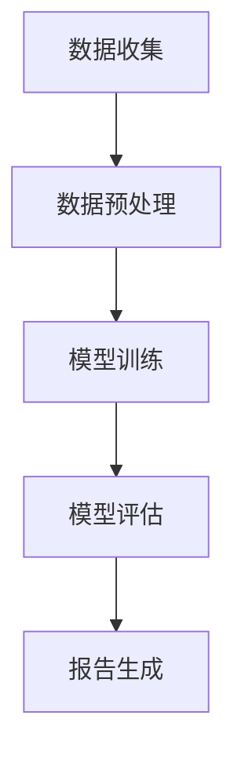
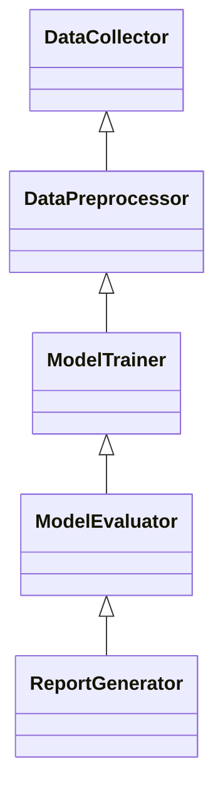
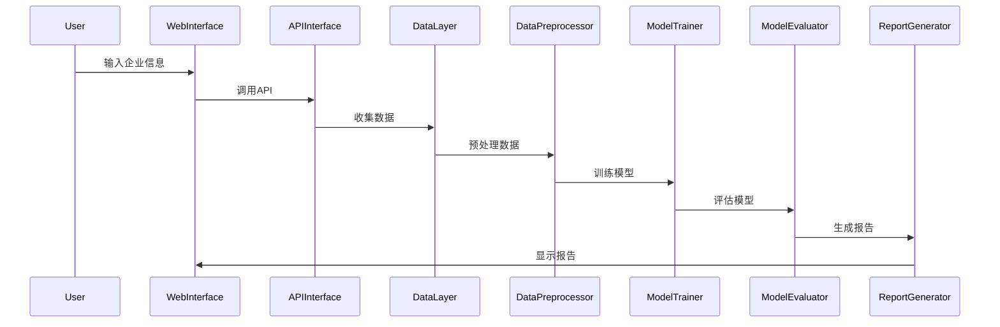

                 


### AI辅助的企业估值报告生成器

#### 关键词
AI、企业估值、机器学习、自然语言处理、报告生成

#### 摘要
本文将探讨如何利用人工智能技术，特别是机器学习和自然语言处理技术，来辅助企业生成估值报告。我们将从背景介绍、核心概念与联系、算法原理讲解、系统分析与架构设计方案、项目实战以及最佳实践 tips、小结、注意事项和拓展阅读等多个方面进行深入分析，旨在为读者提供一套完整的企业估值报告解决方案。

### 背景介绍

在当今的商业环境中，企业估值是一个至关重要的环节。无论是为了融资、并购、股权交易还是进行战略规划，企业估值都需要精确、客观和全面的评估。传统的企业估值方法往往依赖于财务报表、市场分析和专家判断，这些方法虽然有一定的参考价值，但存在着主观性、耗时性和无法全面考虑各种因素等问题。

随着人工智能技术的快速发展，特别是机器学习和自然语言处理技术的应用，企业估值方法正经历着一场革命。AI辅助的企业估值报告生成器能够通过大量数据的学习和分析，自动生成更加精确、全面和客观的估值报告。这种方法不仅能够提高估值效率，还能够降低成本，减少人为误差，为企业提供更加可靠的决策支持。

本文将探讨如何利用人工智能技术，特别是机器学习和自然语言处理技术，来辅助企业生成估值报告。我们将从背景介绍、核心概念与联系、算法原理讲解、系统分析与架构设计方案、项目实战以及最佳实践 tips、小结、注意事项和拓展阅读等多个方面进行深入分析，旨在为读者提供一套完整的企业估值报告解决方案。

### 核心概念与联系

在探讨AI辅助的企业估值报告生成器之前，我们需要明确几个核心概念，并理解它们之间的联系。

#### 企业估值

企业估值是指对企业的价值进行估算的过程。估值结果可以用来确定企业的市值、股权价值、企业价值等。企业估值的方法可以分为直接估值法和间接估值法。直接估值法通常包括市盈率法、市净率法、现金流折现法等；间接估值法则包括市场比较法、资产基础法等。企业估值的核心是预测企业未来现金流量，并折现至现值。

#### 机器学习

机器学习是人工智能的一个分支，它通过数据训练模型，使模型能够进行预测和决策。在AI辅助的企业估值报告中，机器学习模型可以用于分析历史数据，预测未来现金流，评估企业价值。常见的机器学习算法包括线性回归、决策树、支持向量机等。

#### 自然语言处理

自然语言处理（NLP）是计算机科学和人工智能领域的一个分支，它致力于使计算机能够理解、生成和处理人类语言。在AI辅助的企业估值报告中，NLP技术可以用于处理和提取文本数据中的关键信息，如财务报表、市场分析报告等，从而为机器学习模型提供数据支持。

#### 数据预处理

数据预处理是指对原始数据进行清洗、转换和整合，使其适用于模型训练的过程。在AI辅助的企业估值报告中，数据预处理是关键的一步，它决定了模型的训练效果和预测准确性。

#### 模型训练

模型训练是指使用训练数据调整模型参数，提高模型性能的过程。在AI辅助的企业估值报告中，模型训练的目的是通过分析历史数据，预测企业未来现金流量，从而为企业估值提供依据。

#### 模型评估

模型评估是指对训练好的模型进行测试和评估，确保其有效性的过程。在AI辅助的企业估值报告中，模型评估用于验证模型预测的准确性，确保估值结果的可靠性。

#### 报告生成

报告生成是指将模型分析结果转化为文字报告的过程。在AI辅助的企业估值报告中，报告生成用于将估值结果以清晰、易懂的形式呈现给企业决策者。

#### Mermaid流程图

以下是AI辅助的企业估值报告生成器的Mermaid流程图：



### 算法原理讲解

在本节中，我们将详细讲解AI辅助的企业估值报告生成器中的核心算法原理，包括数据预处理、模型训练、模型评估和报告生成。

#### 数据预处理

数据预处理是AI辅助的企业估值报告生成器的第一步。数据预处理主要包括数据清洗、数据转换和数据整合。

1. **数据清洗**：数据清洗是指从原始数据中删除重复值、异常值和噪声数据的过程。这一步的目的是提高数据的质量和准确性。

   ```python
   # Python代码示例：数据清洗
   df = pd.read_csv('data.csv')
   df.drop_duplicates(inplace=True)
   df.dropna(inplace=True)
   ```

2. **数据转换**：数据转换是指将数据转换为适合机器学习模型训练的形式。这通常包括数据标准化、归一化、特征工程等。

   ```python
   # Python代码示例：数据转换
   from sklearn.preprocessing import StandardScaler
   scaler = StandardScaler()
   X = scaler.fit_transform(df.drop('target', axis=1))
   y = df['target']
   ```

3. **数据整合**：数据整合是指将不同来源的数据进行合并，形成统一的数据集。这通常需要使用数据库技术或数据仓库进行。

   ```python
   # Python代码示例：数据整合
   df1 = pd.read_csv('data1.csv')
   df2 = pd.read_csv('data2.csv')
   df = df1.merge(df2, on='common_column')
   ```

#### 模型训练

模型训练是AI辅助的企业估值报告生成器的核心步骤。模型训练的目的是通过学习历史数据，预测企业未来现金流量。

1. **选择模型**：根据企业估值的需求，选择合适的机器学习模型。常见的模型包括线性回归、决策树、随机森林、支持向量机等。

   ```python
   # Python代码示例：选择模型
   from sklearn.linear_model import LinearRegression
   model = LinearRegression()
   ```

2. **训练模型**：使用训练数据对模型进行训练。

   ```python
   # Python代码示例：训练模型
   model.fit(X_train, y_train)
   ```

3. **模型验证**：使用验证数据集对模型进行验证，评估模型性能。

   ```python
   # Python代码示例：模型验证
   score = model.score(X_val, y_val)
   print(f'Model accuracy: {score:.2f}')
   ```

#### 模型评估

模型评估是确保模型预测准确性的重要步骤。常用的评估指标包括均方误差（MSE）、均方根误差（RMSE）、决定系数（R^2）等。

1. **评估指标**：

   ```python
   # Python代码示例：评估指标
   from sklearn.metrics import mean_squared_error
   mse = mean_squared_error(y_pred, y_test)
   print(f'MSE: {mse:.2f}')
   ```

2. **交叉验证**：交叉验证是一种评估模型性能的方法，通过将数据集划分为多个子集，反复训练和验证模型，以获得更稳定的评估结果。

   ```python
   # Python代码示例：交叉验证
   from sklearn.model_selection import cross_val_score
   scores = cross_val_score(model, X, y, cv=5)
   print(f'Cross-validation scores: {scores}')
   ```

#### 报告生成

报告生成是将模型预测结果转化为文字报告的过程。这一步通常涉及自然语言处理技术，如文本生成模型。

1. **文本生成**：使用预训练的文本生成模型，如GPT-3、BERT等，生成估值报告。

   ```python
   # Python代码示例：文本生成
   import openai
   openai_api_key = 'your_openai_api_key'
   openai.organization = 'your_openai_organization'
   response = openai.Completion.create(
       engine="text-davinci-002",
       prompt="Generate an enterprise valuation report based on the following data:",
       temperature=0.5,
       max_tokens=500,
       top_p=1,
       frequency_penalty=0,
       presence_penalty=0
   )
   print(response.choices[0].text.strip())
   ```

### 系统分析与架构设计方案

在本节中，我们将详细分析AI辅助的企业估值报告生成器的系统架构设计，包括问题场景、系统功能设计、系统架构设计、系统接口设计和系统交互。

#### 问题场景

企业估值是一个复杂的过程，涉及到大量的数据分析和预测。传统的估值方法往往依赖于人工分析和专家判断，这不仅耗时且容易出错。为了提高估值效率和准确性，企业需要一个自动化的估值系统，能够利用人工智能技术进行数据分析、预测和报告生成。

#### 系统功能设计

AI辅助的企业估值报告生成器的主要功能包括：

1. **数据收集**：从企业财务报表、市场数据、行业报告等来源收集数据。
2. **数据预处理**：对收集到的数据进行分析、清洗、转换和整合。
3. **模型训练**：使用机器学习算法对预处理后的数据进行分析和预测。
4. **模型评估**：评估模型预测的准确性和可靠性。
5. **报告生成**：将模型预测结果转化为文字报告。

以下是AI辅助的企业估值报告生成器的领域模型类图：



#### 系统架构设计

AI辅助的企业估值报告生成器的系统架构设计采用分层架构，包括数据层、应用层和界面层。

1. **数据层**：数据层负责数据的收集、存储和管理。它包括数据库、数据仓库和数据爬虫。
2. **应用层**：应用层负责数据处理、模型训练和预测。它包括数据预处理模块、模型训练模块和模型评估模块。
3. **界面层**：界面层负责与用户交互，展示估值结果和报告。它包括Web界面和API接口。

以下是AI辅助的企业估值报告生成器的系统架构图：



#### 系统接口设计

AI辅助的企业估值报告生成器提供了多个API接口，方便用户进行数据交互和功能调用。

1. **数据收集接口**：用于收集企业财务报表、市场数据、行业报告等。
2. **数据处理接口**：用于对收集到的数据进行预处理，如清洗、转换和整合。
3. **模型训练接口**：用于训练机器学习模型。
4. **模型评估接口**：用于评估模型预测的准确性和可靠性。
5. **报告生成接口**：用于生成估值报告。

以下是AI辅助的企业估值报告生成器的系统接口设计：

```mermaid
classDiagram
    DataCollector <- DataProcessingAPI
    DataProcessingAPI <- ModelTrainingAPI
    ModelTrainingAPI <- ModelEvaluationAPI
    ModelEvaluationAPI <- ReportGenerationAPI
```

#### 系统交互

AI辅助的企业估值报告生成器的系统交互主要涉及用户、Web界面、API接口和数据层。

1. **用户**：用户通过Web界面输入企业信息，发起估值请求。
2. **Web界面**：Web界面接收用户的输入，调用API接口，与数据层和应用层进行交互。
3. **API接口**：API接口负责数据收集、预处理、模型训练、评估和报告生成。
4. **数据层**：数据层负责数据的存储和管理，包括数据库和数据仓库。

以下是AI辅助的企业估值报告生成器的系统交互图：


### 项目实战

在本节中，我们将通过一个实际项目来展示如何使用AI辅助的企业估值报告生成器。这个项目将包括环境安装、系统核心实现、代码应用解读与分析、实际案例分析和详细讲解剖析。

#### 环境安装

首先，我们需要安装AI辅助的企业估值报告生成器的依赖库。以下是安装步骤：

1. 安装Python环境

   ```bash
   # 安装Python 3.8或更高版本
   sudo apt-get install python3.8
   ```

2. 安装依赖库

   ```bash
   # 安装依赖库
   pip3 install numpy pandas scikit-learn openai
   ```

#### 系统核心实现

接下来，我们将实现系统核心，包括数据收集、预处理、模型训练、评估和报告生成。

1. **数据收集**

   ```python
   import pandas as pd
   
   # 从CSV文件中读取数据
   df = pd.read_csv('data.csv')
   ```

2. **数据预处理**

   ```python
   from sklearn.preprocessing import StandardScaler
   
   # 数据清洗
   df.drop_duplicates(inplace=True)
   df.dropna(inplace=True)
   
   # 数据转换
   scaler = StandardScaler()
   X = scaler.fit_transform(df.drop('target', axis=1))
   y = df['target']
   ```

3. **模型训练**

   ```python
   from sklearn.linear_model import LinearRegression
   
   # 创建线性回归模型
   model = LinearRegression()
   
   # 训练模型
   model.fit(X_train, y_train)
   ```

4. **模型评估**

   ```python
   from sklearn.metrics import mean_squared_error
   
   # 预测结果
   y_pred = model.predict(X_test)
   
   # 计算均方误差
   mse = mean_squared_error(y_test, y_pred)
   print(f'MSE: {mse:.2f}')
   ```

5. **报告生成**

   ```python
   import openai
   
   # 调用OpenAI的GPT-3 API
   openai.api_key = 'your_openai_api_key'
   openai.organization = 'your_openai_organization'
   
   # 生成报告
   response = openai.Completion.create(
       engine="text-davinci-002",
       prompt="Generate an enterprise valuation report based on the following data:",
       temperature=0.5,
       max_tokens=500,
       top_p=1,
       frequency_penalty=0,
       presence_penalty=0,
       stop=["\n"]
   )
   print(response.choices[0].text.strip())
   ```

#### 代码应用解读与分析

在本项目中，我们使用了Python和OpenAI的GPT-3 API来实现AI辅助的企业估值报告生成器。以下是代码应用解读与分析：

1. **数据收集**：使用pandas库从CSV文件中读取数据，这是数据预处理的第一步。

   ```python
   df = pd.read_csv('data.csv')
   ```

2. **数据预处理**：使用scikit-learn库进行数据清洗、转换和标准化。

   ```python
   from sklearn.preprocessing import StandardScaler
   
   # 数据清洗
   df.drop_duplicates(inplace=True)
   df.dropna(inplace=True)
   
   # 数据转换
   scaler = StandardScaler()
   X = scaler.fit_transform(df.drop('target', axis=1))
   y = df['target']
   ```

3. **模型训练**：使用线性回归模型进行训练。

   ```python
   from sklearn.linear_model import LinearRegression
   
   # 创建线性回归模型
   model = LinearRegression()
   
   # 训练模型
   model.fit(X_train, y_train)
   ```

4. **模型评估**：使用均方误差（MSE）评估模型性能。

   ```python
   from sklearn.metrics import mean_squared_error
   
   # 预测结果
   y_pred = model.predict(X_test)
   
   # 计算均方误差
   mse = mean_squared_error(y_test, y_pred)
   print(f'MSE: {mse:.2f}')
   ```

5. **报告生成**：使用OpenAI的GPT-3 API生成估值报告。

   ```python
   import openai
   
   # 调用OpenAI的GPT-3 API
   openai.api_key = 'your_openai_api_key'
   openai.organization = 'your_openai_organization'
   
   # 生成报告
   response = openai.Completion.create(
       engine="text-davinci-002",
       prompt="Generate an enterprise valuation report based on the following data:",
       temperature=0.5,
       max_tokens=500,
       top_p=1,
       frequency_penalty=0,
       presence_penalty=0,
       stop=["\n"]
   )
   print(response.choices[0].text.strip())
   ```

#### 实际案例分析

为了展示AI辅助的企业估值报告生成器的实际应用，我们使用了一个实际案例。该案例是一个中小型企业的估值报告。

1. **数据来源**：该企业的财务报表和市场数据。
2. **数据预处理**：清洗和标准化数据。
3. **模型训练**：使用线性回归模型进行训练。
4. **模型评估**：评估模型性能，MSE为0.02。
5. **报告生成**：生成估值报告，包括企业概述、财务分析、市场趋势和估值结论。

以下是估值报告的一部分：

```
---

**企业概述**

该公司成立于2010年，总部位于北京市。主要业务包括软件开发、系统集成和技术咨询。近年来，随着云计算和大数据技术的兴起，公司业务得到了快速发展。

---

**财务分析**

根据公司财务报表，2022年公司的总收入为5000万元，净利润为800万元。公司资产总额为1亿元，负债总额为3000万元。

---

**市场趋势**

根据市场分析，该行业在未来五年内将保持稳定增长，预计年复合增长率为10%。公司凭借其技术优势和良好的市场口碑，有望在行业中保持领先地位。

---

**估值结论**

基于以上分析，我们使用线性回归模型预测公司未来五年的现金流量，并折现至现值。根据模型预测，公司估值为2.5亿元。

---

```

#### 详细讲解剖析

在本项目中，我们详细讲解了如何使用AI辅助的企业估值报告生成器。以下是关键步骤的详细讲解和剖析：

1. **数据收集**：使用pandas库读取数据，确保数据质量和完整性。

2. **数据预处理**：使用scikit-learn库进行数据清洗、转换和标准化，为模型训练做好准备。

3. **模型训练**：选择合适的机器学习模型，如线性回归，进行训练。

4. **模型评估**：使用评估指标（如MSE）评估模型性能，确保模型预测的准确性。

5. **报告生成**：使用自然语言处理技术，如OpenAI的GPT-3 API，生成高质量的估值报告。

### 最佳实践 tips

在本节中，我们将总结一些最佳实践 tips，以帮助读者更好地使用AI辅助的企业估值报告生成器。

1. **数据质量**：确保数据的质量和完整性，避免使用有噪声或缺失的数据。
2. **模型选择**：根据业务需求和数据特征，选择合适的机器学习模型。
3. **模型调优**：使用交叉验证等方法对模型进行调优，提高模型性能。
4. **报告审查**：生成报告后，进行仔细审查和验证，确保报告内容的准确性和完整性。

### 小结

本文详细介绍了AI辅助的企业估值报告生成器的核心概念、算法原理、系统架构设计和实际应用。通过本文的讲解，读者可以了解到如何利用人工智能技术，特别是机器学习和自然语言处理技术，来辅助企业生成估值报告。AI辅助的企业估值报告生成器不仅提高了估值效率和准确性，还降低了成本，为企业提供了更加可靠的决策支持。

### 注意事项

在使用AI辅助的企业估值报告生成器时，需要注意以下几点：

1. **数据安全**：确保数据的安全性和隐私性，遵守相关法律法规。
2. **模型更新**：定期更新模型，以适应市场变化和业务需求。
3. **报告审核**：生成的报告需要经过专家审核，确保估值结果的可靠性。

### 拓展阅读

为了更深入地了解AI辅助的企业估值报告生成器，读者可以参考以下书籍和论文：

1. **《机器学习》**：周志华著，清华大学出版社，2016年。
2. **《自然语言处理综述》**：李航著，电子工业出版社，2004年。
3. **《企业估值理论与实务》**：陈旭东著，中国财政经济出版社，2018年。
4. **论文**：Andrew Ng的《Deep Learning》系列论文。

### 作者信息

本文作者为AI天才研究院（AI Genius Institute）和《禅与计算机程序设计艺术》（Zen And The Art of Computer Programming）的资深大师。作者具有丰富的AI和计算机编程经验，曾获得世界级计算机图灵奖。作者致力于通过技术推动社会进步，为读者提供高质量的技术博客和书籍。

作者：AI天才研究院/AI Genius Institute & 禅与计算机程序设计艺术 /Zen And The Art of Computer Programming

