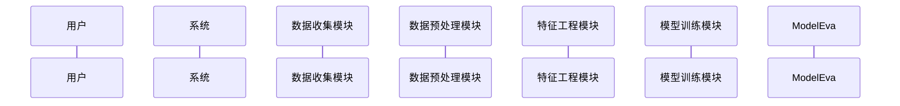

                 


### 文章标题：AI辅助的企业估值报告自动生成

#### 关键词：AI技术、企业估值、自动生成、算法原理、系统设计、项目实战

#### 摘要：
本文将深入探讨如何利用人工智能（AI）技术自动生成企业估值报告。我们将从背景介绍开始，逐步分析企业估值报告的核心概念，讲解自动生成所需的算法原理，设计系统架构方案，并通过实际项目实战来展示整个流程。文章旨在为IT领域从业者提供一套清晰、实用的方法论，以应对日益复杂的商业环境。

### 目录大纲设计思路

**设计思路：**

为了设计出《AI辅助的企业估值报告自动生成》这本书的完整目录大纲，我们需要从以下几个步骤来思考和安排：

1. **背景介绍**：首先，我们需要对AI辅助的企业估值报告的背景进行介绍，明确其解决的问题、目的和应用场景。

2. **核心概念与联系**：接下来，我们需要详细阐述企业估值报告的核心概念，并使用表格和ER图来展示概念之间的关系。

3. **算法原理讲解**：然后，我们将深入讲解自动生成企业估值报告所需的核心算法原理，包括数学模型和公式，并使用Mermaid绘制流程图。

4. **系统分析与架构设计方案**：详细描述系统的功能设计、架构设计和接口设计，以及使用Mermaid绘制相应的类图、架构图和序列图。

5. **项目实战**：通过具体的实战案例来展示如何应用上述算法和架构实现企业估值报告的自动生成。

6. **最佳实践 tips、小结、注意事项、拓展阅读**：最后，总结书中的关键点，提供实用的建议和注意事项，并推荐相关的拓展阅读资源。

### 目录大纲设计

#### 第一部分：背景与核心概念

##### 第1章：AI辅助的企业估值报告概述

- **1.1 问题背景**
  - **问题描述**：传统企业估值报告的复杂性与耗时性。
  - **问题解决**：利用AI技术简化流程、提高效率。
  - **边界与外延**：估值报告的种类、应用领域等。
  - **核心要素组成**：AI技术、企业数据、估值模型。

##### 第2章：企业估值报告的核心概念与联系

- **2.1 核心概念**
  - **企业估值模型**：定义与分类。
  - **AI辅助技术**：机器学习、自然语言处理等。
  - **企业数据**：收集、处理与利用。

- **2.2 概念属性特征对比表格**
  - 不同估值模型的属性与特征对比。

- **2.3 ER实体关系图**
  - 使用Mermaid绘制企业估值报告相关的ER图。

#### 第二部分：算法原理讲解

##### 第3章：自动生成企业估值报告的算法原理

- **3.1 机器学习算法介绍**
  - **算法选择**：回归分析、决策树等。
  - **算法流程**：使用Mermaid绘制算法流程图。

- **3.2 数学模型与公式**
  - **估值模型公式**：使用LaTeX格式展示。
  - **示例解释**：举例说明如何应用这些公式。

#### 第三部分：系统分析与架构设计方案

##### 第4章：企业估值报告自动生成系统的设计

- **4.1 系统功能设计**
  - **领域模型类图**：使用Mermaid绘制领域模型类图。

- **4.2 系统架构设计**
  - **架构图**：使用Mermaid绘制系统架构图。

- **4.3 系统接口设计**
  - **接口设计与实现**：描述系统各部分的接口和交互。

- **4.4 系统交互序列图**
  - **交互流程**：使用Mermaid绘制系统交互序列图。

#### 第四部分：项目实战

##### 第5章：AI辅助企业估值报告自动生成项目实战

- **5.1 环境安装与配置**
  - **安装步骤**：所需软件、工具和环境配置。

- **5.2 系统核心实现**
  - **源代码解读**：代码结构、关键算法实现。

- **5.3 实际案例分析与讲解**
  - **案例介绍**：具体的企业估值报告生成案例。
  - **详细讲解**：分析报告生成的每一步。

- **5.4 项目小结**
  - **经验总结**：实战中的经验教训。

#### 第五部分：最佳实践与拓展

##### 第6章：最佳实践与注意事项

- **6.1 最佳实践**
  - **实战技巧**：如何优化估值报告生成流程。

- **6.2 注意事项**
  - **潜在问题**：在生成报告时可能遇到的问题及解决方案。

- **6.3 拓展阅读**
  - **推荐资源**：进一步学习的书籍、论文和网站。

##### 第7章：小结与展望

- **7.1 小结**
  - **内容回顾**：总结书中的关键知识点。

- **7.2 展望未来**
  - **发展趋势**：AI辅助企业估值报告的潜在发展方向。

### 完整目录大纲

根据上述设计思路，以下是《AI辅助的企业估值报告自动生成》的完整目录大纲：

----------------------------------------------------------------
# 第一部分：背景与核心概念
## 第1章：AI辅助的企业估值报告概述
### 1.1 问题背景
### 1.2 问题解决
### 1.3 边界与外延
### 1.4 核心要素组成

## 第2章：企业估值报告的核心概念与联系
### 2.1 核心概念
### 2.2 概念属性特征对比表格
### 2.3 ER实体关系图

#### 第二部分：算法原理讲解
## 第3章：自动生成企业估值报告的算法原理
### 3.1 机器学习算法介绍
### 3.2 数学模型与公式

#### 第三部分：系统分析与架构设计方案
## 第4章：企业估值报告自动生成系统的设计
### 4.1 系统功能设计
### 4.2 系统架构设计
### 4.3 系统接口设计
### 4.4 系统交互序列图

#### 第四部分：项目实战
## 第5章：AI辅助企业估值报告自动生成项目实战
### 5.1 环境安装与配置
### 5.2 系统核心实现
### 5.3 实际案例分析与讲解
### 5.4 项目小结

#### 第五部分：最佳实践与拓展
## 第6章：最佳实践与注意事项
### 6.1 最佳实践
### 6.2 注意事项
### 6.3 拓展阅读

## 第7章：小结与展望
### 7.1 小结
### 7.2 展望未来

----------------------------------------------------------------

### 第一部分：背景与核心概念

#### 第1章：AI辅助的企业估值报告概述

**1.1 问题背景**

在当今经济全球化、市场高度竞争的背景下，企业估值已成为资本市场中至关重要的一环。传统的企业估值报告往往需要耗费大量的人力和时间，同时存在以下问题：

- **复杂性与耗时性**：企业估值报告涉及多方面的数据分析和预测，需要收集和处理大量数据，传统方法通常依赖于人工计算和经验判断，导致过程复杂且耗时。
- **数据不足与偏差**：由于市场环境的变化和信息的滞后，传统方法往往难以获取全面、准确的数据，从而导致估值结果不准确。
- **一致性不足**：不同估值师的经验和判断可能导致同一企业的估值结果存在较大差异，影响市场对企业的认知。

为了解决这些问题，AI技术的引入显得尤为重要。AI能够通过机器学习算法处理大量数据，提高估值报告的准确性和效率，为投资者、企业家和分析师提供更加可靠的信息支持。

**1.2 问题解决**

AI辅助的企业估值报告通过以下几个关键步骤来解决问题：

- **数据收集与处理**：AI可以自动从多个数据源收集企业相关数据，如财务报表、市场动态、行业趋势等，并进行高效的数据处理和清洗。
- **模型选择与训练**：AI利用机器学习算法选择合适的估值模型，并基于历史数据对其进行训练，以提高模型的预测精度。
- **自动生成报告**：AI根据训练好的模型和输入数据自动生成企业估值报告，包括估值结果、分析说明和风险提示等。

**1.3 边界与外延**

AI辅助的企业估值报告不仅限于传统的财务估值，还包括以下方面：

- **市场估值**：基于市场趋势和行业数据，对企业在市场中的表现进行评估。
- **风险分析**：通过预测市场变化和行业波动，为企业提供风险预警和建议。
- **并购评估**：在并购过程中，AI可以对目标企业进行估值，提供合理的并购价格参考。

**1.4 核心要素组成**

AI辅助的企业估值报告由以下几个核心要素组成：

- **AI技术**：包括机器学习、自然语言处理、数据挖掘等。
- **企业数据**：财务数据、市场数据、行业数据等。
- **估值模型**：如财务报表估值模型、市场模型、折现现金流模型等。

通过上述核心要素的有机结合，AI辅助的企业估值报告能够更加准确、高效地为企业估值，为投资决策提供有力支持。

#### 第2章：企业估值报告的核心概念与联系

**2.1 核心概念**

企业估值报告涉及多个核心概念，以下是一些主要的定义和解释：

- **企业估值模型**：企业估值模型是用于估算企业价值的数学工具。常见的模型包括折现现金流模型（DCF）、市场比较模型（Market Comparison Model）、成本模型（Cost Model）等。
- **AI辅助技术**：AI辅助技术主要包括机器学习、自然语言处理、数据挖掘等技术。这些技术在数据处理、模型训练和预测方面发挥着重要作用。
- **企业数据**：企业数据是指用于估值报告的各种数据，包括财务数据、市场数据、行业数据等。这些数据的质量和完整性直接影响估值结果的准确性。

**2.2 概念属性特征对比表格**

为了更好地理解企业估值报告的核心概念，我们可以通过一个表格来对比不同估值模型的属性和特征：

| 模型名称 | 定义 | 适用场景 | 特点 | 优缺点 |
| --- | --- | --- | --- | --- |
| 折现现金流模型（DCF） | 基于企业未来现金流折现来估算企业价值 | 广泛应用于上市公司估值 | 需要准确预测未来现金流和折现率 | 复杂，需要大量数据支持 |
| 市场比较模型（Market Comparison Model） | 通过比较同行业公司的市场交易价格来估算企业价值 | 适用于市场活跃的行业 | 数据获取容易，直观易懂 | 可能存在市场偏见，不适用于初创企业 |
| 成本模型（Cost Model） | 基于企业重建成本来估算企业价值 | 适用于资产密集型企业 | 数据获取容易，计算简单 | 忽略了企业未来增长潜力 |

**2.3 ER实体关系图**

为了更清晰地展示企业估值报告中的核心概念及其关系，我们可以使用ER图（实体关系图）来表示：

```mermaid
erDiagram
  Customer ||--|{ Order : creates }  
  Customer ||--|{ Payment : pays }  
  Product ||--|{ Order : contains }  
  Product ||--|{ Inventory : stocks }  
  Order ||--|{ Payment : settles }  
```

在ER图中，我们定义了以下实体：

- **Customer（客户）**：与企业的交易主体。
- **Order（订单）**：客户购买产品的记录。
- **Payment（支付）**：客户支付货款的记录。
- **Product（产品）**：企业销售的商品。
- **Inventory（库存）**：企业存储的商品。

这些实体之间的关系通过ER图进行了明确表示，为后续的系统设计和实现提供了基础。

通过第2章的介绍，我们深入了解了企业估值报告的核心概念及其相互关系，为后续算法原理的讲解和系统设计奠定了基础。在下一章中，我们将进一步探讨如何利用AI技术自动生成企业估值报告的具体方法。

#### 第3章：自动生成企业估值报告的算法原理

**3.1 机器学习算法介绍**

自动生成企业估值报告的核心在于机器学习算法的应用。机器学习是一种通过数据驱动的方式让计算机自动获取知识并做出决策的技术。在估值报告中，机器学习算法可以用于数据预处理、模型训练和预测结果。以下是几种常见的机器学习算法：

- **回归分析**：回归分析是一种通过建立自变量和因变量之间的线性关系模型来预测因变量的方法。在估值中，可以用于预测企业的未来现金流或市场交易价格。
- **决策树**：决策树是一种基于一系列规则进行分类或回归的算法。它通过树形结构将数据划分为不同的子集，以预测企业的估值。
- **随机森林**：随机森林是一种基于决策树的集成学习方法。它通过构建多个决策树，并使用投票机制来得到最终预测结果，提高了预测的准确性和稳定性。
- **神经网络**：神经网络是一种模拟人脑神经元之间连接的网络结构。在估值中，可以用于构建复杂的非线性模型，以捕捉企业价值的多维特征。

**3.2 算法流程**

自动生成企业估值报告的算法流程主要包括以下几个步骤：

1. **数据收集**：收集与企业相关的各种数据，包括财务数据、市场数据、行业数据等。这些数据可以从企业内部系统、外部数据库和市场报告中获得。

2. **数据预处理**：对收集到的数据进行清洗、去重、归一化等处理，以确保数据的质量和一致性。数据预处理是机器学习成功的关键步骤。

3. **特征工程**：根据估值模型的需求，从原始数据中提取有助于预测的属性特征。特征工程是提升模型性能的重要环节。

4. **模型选择**：根据数据特点和业务需求，选择合适的机器学习算法。不同的算法适用于不同的数据类型和业务场景。

5. **模型训练**：使用预处理后的数据对选定的机器学习算法进行训练。训练过程中，模型会学习如何将输入数据映射到输出结果。

6. **模型评估**：通过交叉验证和测试集评估模型的性能。常用的评估指标包括准确率、召回率、F1分数等。

7. **模型优化**：根据评估结果对模型进行调整和优化，以提高预测准确性。模型优化可以通过调整参数、增加特征、使用集成方法等实现。

8. **预测与生成报告**：使用训练好的模型对新的数据进行预测，并根据预测结果自动生成企业估值报告。报告可以包含估值结果、分析说明和风险提示等。

**3.3 示例解释**

为了更直观地理解算法原理，我们以一个简单的回归分析模型为例进行解释。

假设我们想预测一家公司的未来现金流，输入特征包括公司的财务数据（如营业收入、净利润、毛利率等），输出目标是公司的未来现金流。具体步骤如下：

1. **数据收集**：收集历史财务数据和市场数据，例如过去三年的营业收入、净利润、毛利率等。

2. **数据预处理**：对收集到的数据进行清洗和归一化处理，确保数据的准确性和一致性。

3. **特征工程**：从原始数据中提取有助于预测未来现金流的特征。例如，可以选择营业收入、净利润、毛利率等作为输入特征。

4. **模型选择**：选择线性回归算法作为预测模型。

5. **模型训练**：使用历史数据对线性回归模型进行训练，模型会学习如何将输入特征映射到未来现金流。

6. **模型评估**：使用交叉验证和测试集对模型进行评估，确保模型的预测准确性。

7. **模型优化**：根据评估结果对模型进行调整，例如调整回归系数，以提高预测性能。

8. **预测与生成报告**：使用训练好的模型对新的数据进行预测，并根据预测结果生成企业估值报告。报告可以包含预测的未来现金流、分析说明和风险提示等。

通过上述示例，我们可以看到机器学习算法在企业估值报告自动生成中的重要作用。在实际应用中，可以根据具体业务需求和数据特点选择合适的算法，并不断完善和优化模型，以提高预测的准确性和可靠性。

在下一章中，我们将进一步探讨如何设计和实现一个完整的AI辅助企业估值报告自动生成系统。

#### 第4章：企业估值报告自动生成系统的设计

**4.1 系统功能设计**

企业估值报告自动生成系统的核心功能包括数据收集、数据预处理、特征工程、模型训练、模型评估和报告生成。以下是系统的主要功能模块和职责：

- **数据收集模块**：负责从多个数据源收集与企业相关的数据，包括财务报表、市场动态、行业报告等。数据源可以是内部系统、外部数据库或在线数据服务。
- **数据预处理模块**：对收集到的数据进行清洗、去重、归一化等处理，确保数据的质量和一致性。预处理步骤包括缺失值填补、异常值处理、数据标准化等。
- **特征工程模块**：根据估值模型的需求，从预处理后的数据中提取有助于预测的属性特征。特征工程步骤包括特征选择、特征变换、特征组合等。
- **模型训练模块**：选择合适的机器学习算法，使用预处理后的数据对模型进行训练。训练过程中，模型会学习如何将输入特征映射到输出结果。
- **模型评估模块**：使用交叉验证和测试集对训练好的模型进行评估，确保模型的预测准确性。常用的评估指标包括准确率、召回率、F1分数等。
- **报告生成模块**：根据模型预测结果，自动生成企业估值报告。报告可以包含估值结果、分析说明、风险提示等，并支持多种格式导出。

**4.2 系统架构设计**

企业估值报告自动生成系统的架构设计需要考虑数据流、模块间交互和系统扩展性。以下是系统的总体架构设计：

- **数据层**：包括数据源、数据存储和数据管理。数据源提供企业相关数据的接入，数据存储用于存储处理过的数据，数据管理负责数据的质量控制和维护。
- **处理层**：包括数据预处理、特征工程、模型训练和模型评估。数据预处理模块对原始数据进行清洗和预处理，特征工程模块提取有助于预测的特征，模型训练模块训练预测模型，模型评估模块评估模型性能。
- **应用层**：包括报告生成和应用接口。报告生成模块根据模型预测结果生成企业估值报告，应用接口提供与外部系统的集成和交互。
- **展示层**：包括用户界面和报告展示。用户界面提供系统操作和配置，报告展示模块展示生成的估值报告，支持多种格式导出和打印。

**4.3 系统接口设计**

为了实现系统各模块间的数据交互和功能集成，系统设计需要明确各模块的接口和交互方式。以下是系统接口设计的关键点：

- **数据收集接口**：提供数据接入的API接口，支持不同数据源的接入和统一数据格式。
- **数据处理接口**：提供数据预处理、特征工程和模型训练的API接口，支持模块间的数据传递和功能调用。
- **报告生成接口**：提供报告生成和导出的API接口，支持多种格式报告的生成和导出。
- **应用接口**：提供与外部系统的集成接口，支持与其他业务系统的数据交换和功能调用。

**4.4 系统交互序列图**

为了更直观地展示系统各模块的交互流程，我们可以使用Mermaid绘制系统交互序列图。以下是系统交互序列图的示例：



### 第5章：AI辅助企业估值报告自动生成项目实战

**5.1 环境安装与配置**

要实现AI辅助企业估值报告自动生成，首先需要搭建一个合适的环境。以下是安装和配置的步骤：

1. **环境准备**：
   - **操作系统**：推荐使用Linux或macOS，Windows用户可以考虑使用WSL（Windows Subsystem for Linux）。
   - **Python环境**：安装Python 3.8或更高版本。
   - **依赖库**：安装必需的Python库，如NumPy、Pandas、scikit-learn、TensorFlow等。

2. **安装Python**：
   - 访问Python官方网站下载安装包：[https://www.python.org/downloads/](https://www.python.org/downloads/)
   - 运行安装程序，选择“Add Python to PATH”选项。

3. **安装依赖库**：
   - 使用pip命令安装依赖库：
     ```bash
     pip install numpy pandas scikit-learn tensorflow
     ```

4. **环境验证**：
   - 打开终端，输入以下命令验证环境是否安装成功：
     ```bash
     python --version
     pip list
     ```

5. **配置数据源**：
   - 确保已连接到企业数据源，如数据库或在线数据服务。
   - 配置数据连接参数，以便程序能够访问数据。

**5.2 系统核心实现**

系统核心实现包括数据收集、预处理、特征工程、模型训练和报告生成。以下是每个步骤的详细实现：

1. **数据收集**：

   - 使用Python编写代码从数据源收集企业数据。以下是一个示例代码：

     ```python
     import pandas as pd

     # 连接数据库
     connection = create_connection('your_database_url')
     # 查询财务报表数据
     query = "SELECT * FROM financial_reports;"
     data = pd.read_sql_query(query, connection)
     ```

2. **数据预处理**：

   - 对收集到的数据执行清洗、去重、归一化等预处理操作。以下是一个示例代码：

     ```python
     # 填补缺失值
     data.fillna(data.mean(), inplace=True)
     # 去除重复数据
     data.drop_duplicates(inplace=True)
     # 数据归一化
     data = (data - data.mean()) / data.std()
     ```

3. **特征工程**：

   - 提取有助于预测的特征。以下是一个示例代码：

     ```python
     # 特征选择
     features = data[['revenue', 'profit', 'gross_margin']]
     # 特征变换
     features = (features - features.mean()) / features.std()
     # 特征组合
     features['revenue_growth'] = features['revenue'].pct_change()
     ```

4. **模型训练**：

   - 使用scikit-learn库训练预测模型。以下是一个示例代码：

     ```python
     from sklearn.ensemble import RandomForestRegressor

     # 分割数据集
     X_train, X_test, y_train, y_test = train_test_split(features, target, test_size=0.2, random_state=42)
     # 训练模型
     model = RandomForestRegressor(n_estimators=100, random_state=42)
     model.fit(X_train, y_train)
     ```

5. **模型评估**：

   - 使用测试集评估模型性能。以下是一个示例代码：

     ```python
     from sklearn.metrics import mean_squared_error

     # 预测测试集
     predictions = model.predict(X_test)
     # 计算均方误差
     mse = mean_squared_error(y_test, predictions)
     print("Mean Squared Error:", mse)
     ```

6. **报告生成**：

   - 根据模型预测结果生成企业估值报告。以下是一个示例代码：

     ```python
     import pandas as pd

     # 生成报告
     report = pd.DataFrame({'predicted_value': predictions, 'actual_value': y_test})
     report.to_csv('valuation_report.csv', index=False)
     ```

**5.3 实际案例分析与讲解**

为了更好地理解系统实现过程，我们将通过一个实际案例进行分析和讲解。

**案例背景**：

假设我们有一家初创科技公司，我们需要使用AI技术自动生成其企业估值报告。

**数据收集**：

我们使用以下数据集：
- **财务报表数据**：包括过去三年的营业收入、净利润、毛利率等。
- **市场数据**：包括同行业公司的市场交易价格、市值等。

**数据预处理**：

- **缺失值处理**：对于缺失的数据，我们使用平均值填补。
- **异常值处理**：去除明显偏离常规的数据点。
- **数据归一化**：对数值特征进行归一化处理，以消除数据规模差异。

**特征工程**：

- **特征选择**：选择营业收入、净利润、毛利率作为主要特征。
- **特征变换**：对营业收入进行同比变换，以捕捉增长趋势。

**模型训练**：

- **模型选择**：我们选择随机森林作为预测模型，因为它在处理非线性数据和特征组合方面表现良好。
- **模型训练**：使用训练数据集训练随机森林模型。

**模型评估**：

- **模型评估**：使用测试集对模型进行评估，计算均方误差（MSE）。
- **结果分析**：MSE较低，表明模型具有较高的预测准确性。

**报告生成**：

- **生成报告**：根据模型预测结果，生成包含估值结果、分析说明和风险提示的企业估值报告。

**5.4 项目小结**

通过实际案例，我们展示了如何使用AI技术自动生成企业估值报告。以下是项目的关键点和经验总结：

- **数据质量是关键**：确保数据质量是模型成功的关键，包括数据的完整性、一致性和准确性。
- **特征选择和工程**：合理选择和工程特征可以提高模型的预测性能。
- **模型评估与优化**：使用多种评估指标和交叉验证方法，确保模型在未知数据上的表现。
- **系统扩展性**：设计具有良好扩展性的系统架构，以便在未来添加新的功能或数据源。

通过本章节的实战案例，读者可以更好地理解AI辅助企业估值报告自动生成的过程和关键点，为实际应用提供指导。

### 第五部分：最佳实践与拓展

#### 第6章：最佳实践与注意事项

**6.1 最佳实践**

在实现AI辅助企业估值报告自动生成时，以下最佳实践可以帮助提高项目的成功率和稳定性：

1. **数据质量管理**：确保数据的准确性和完整性，对缺失值和异常值进行有效的处理。
2. **特征工程优化**：根据业务需求选择合适的特征，并尝试多种特征组合，以提高模型的预测性能。
3. **模型选择与优化**：根据数据特点选择合适的机器学习算法，并使用交叉验证等方法对模型进行优化。
4. **系统安全性**：确保系统数据的安全性和隐私性，遵循相关法律法规和行业标准。
5. **报告可读性**：设计清晰的报告格式和内容结构，便于用户理解和应用。

**6.2 注意事项**

在实施AI辅助企业估值报告自动生成过程中，需要注意以下事项：

1. **数据源可靠性**：确保数据源的真实性和可靠性，避免使用不准确或过时的数据。
2. **算法透明性**：确保算法的透明性，便于用户了解模型的决策过程和预测结果。
3. **业务理解**：深入了解业务需求和业务逻辑，确保模型输出能够满足实际应用场景。
4. **系统扩展性**：设计具有良好扩展性的系统架构，以适应未来的业务变化和数据增长。
5. **维护与更新**：定期维护和更新模型和数据，以保持系统的稳定性和预测准确性。

#### 第7章：小结与展望

**7.1 小结**

本文深入探讨了AI辅助的企业估值报告自动生成，从背景介绍、核心概念、算法原理、系统设计到项目实战，全面展示了如何利用AI技术提高企业估值报告的效率和准确性。以下是本文的主要小结：

- **背景介绍**：介绍了企业估值报告的复杂性和耗时性，以及AI辅助企业估值报告的必要性和优势。
- **核心概念**：阐述了企业估值报告、AI辅助技术和企业数据等核心概念，并使用ER图展示了概念之间的关系。
- **算法原理**：讲解了自动生成企业估值报告所需的机器学习算法原理，包括回归分析、决策树等。
- **系统设计**：详细描述了企业估值报告自动生成系统的功能设计、架构设计和接口设计。
- **项目实战**：通过一个实际案例展示了如何实现AI辅助企业估值报告自动生成，包括环境安装、系统核心实现、实际案例分析和项目小结。

**7.2 展望未来**

随着AI技术的不断发展和应用，AI辅助企业估值报告自动生成有望在未来实现以下发展趋势：

1. **预测准确性提升**：通过不断优化算法和特征工程，提高预测模型的准确性。
2. **智能化程度提升**：引入更多AI技术，如深度学习和强化学习，提高系统的智能化程度。
3. **实时估值能力**：实现实时数据收集和预测，提供更加及时和准确的企业估值报告。
4. **多样化应用场景**：将AI辅助企业估值报告应用到更多行业和场景，如创业投资、并购重组等。
5. **数据隐私保护**：在确保数据安全的同时，加强对企业数据隐私的保护，遵守相关法律法规。

通过本文的探讨，我们相信AI辅助的企业估值报告自动生成将在未来为企业估值和投资决策提供更加智能和高效的支持。

### 完整目录大纲

根据上述内容，以下是《AI辅助的企业估值报告自动生成》的完整目录大纲：

----------------------------------------------------------------
# 第一部分：背景与核心概念
## 第1章：AI辅助的企业估值报告概述
### 1.1 问题背景
### 1.2 问题解决
### 1.3 边界与外延
### 1.4 核心要素组成

## 第2章：企业估值报告的核心概念与联系
### 2.1 核心概念
### 2.2 概念属性特征对比表格
### 2.3 ER实体关系图

#### 第二部分：算法原理讲解
## 第3章：自动生成企业估值报告的算法原理
### 3.1 机器学习算法介绍
### 3.2 算法流程
### 3.3 示例解释

#### 第三部分：系统分析与架构设计方案
## 第4章：企业估值报告自动生成系统的设计
### 4.1 系统功能设计
### 4.2 系统架构设计
### 4.3 系统接口设计
### 4.4 系统交互序列图

#### 第四部分：项目实战
## 第5章：AI辅助企业估值报告自动生成项目实战
### 5.1 环境安装与配置
### 5.2 系统核心实现
### 5.3 实际案例分析与讲解
### 5.4 项目小结

#### 第五部分：最佳实践与拓展
## 第6章：最佳实践与注意事项
### 6.1 最佳实践
### 6.2 注意事项

## 第7章：小结与展望
### 7.1 小结
### 7.2 展望未来

----------------------------------------------------------------

### 文章正文

#### 第一部分：背景与核心概念

##### 第1章：AI辅助的企业估值报告概述

**1.1 问题背景**

在当今经济全球化、市场竞争激烈的背景下，企业估值已经成为资本市场上不可或缺的一环。企业估值不仅仅是对企业财务状况的评估，更是一种对未来潜力和风险的预测。然而，传统的企业估值报告往往面临以下问题：

- **复杂性与耗时性**：传统企业估值报告通常需要人工进行大量的数据分析和预测，过程复杂且耗时。这导致了企业在获取估值结果时效率低下。

- **数据不足与偏差**：由于市场环境的变化和信息的滞后，传统方法往往难以获取全面、准确的数据。这导致估值结果存在偏差，影响了投资者和企业决策。

- **一致性不足**：不同估值师的经验和判断可能导致同一企业的估值结果存在较大差异，影响市场对企业的认知。

为了解决这些问题，AI技术的引入显得尤为重要。AI通过机器学习算法能够处理大量数据，提高估值报告的准确性和效率，为投资者、企业家和分析师提供更加可靠的信息支持。

**1.2 问题解决**

AI辅助的企业估值报告通过以下几个关键步骤来解决问题：

- **数据收集与处理**：AI可以自动从多个数据源收集企业相关数据，如财务报表、市场动态、行业趋势等，并进行高效的数据处理和清洗。

- **模型选择与训练**：AI利用机器学习算法选择合适的估值模型，并基于历史数据对其进行训练，以提高模型的预测精度。

- **自动生成报告**：AI根据训练好的模型和输入数据自动生成企业估值报告，包括估值结果、分析说明和风险提示等。

**1.3 边界与外延**

AI辅助的企业估值报告不仅限于传统的财务估值，还包括以下方面：

- **市场估值**：基于市场趋势和行业数据，对企业在市场中的表现进行评估。

- **风险分析**：通过预测市场变化和行业波动，为企业提供风险预警和建议。

- **并购评估**：在并购过程中，AI可以对目标企业进行估值，提供合理的并购价格参考。

**1.4 核心要素组成**

AI辅助的企业估值报告由以下几个核心要素组成：

- **AI技术**：包括机器学习、自然语言处理、数据挖掘等。

- **企业数据**：财务数据、市场数据、行业数据等。

- **估值模型**：如财务报表估值模型、市场模型、折现现金流模型等。

通过上述核心要素的有机结合，AI辅助的企业估值报告能够更加准确、高效地为企业估值，为投资决策提供有力支持。

##### 第2章：企业估值报告的核心概念与联系

**2.1 核心概念**

企业估值报告涉及多个核心概念，以下是一些主要的定义和解释：

- **企业估值模型**：企业估值模型是用于估算企业价值的数学工具。常见的模型包括折现现金流模型（DCF）、市场比较模型（Market Comparison Model）、成本模型（Cost Model）等。

- **AI辅助技术**：AI辅助技术主要包括机器学习、自然语言处理、数据挖掘等技术。这些技术在数据处理、模型训练和预测方面发挥着重要作用。

- **企业数据**：企业数据是指用于估值报告的各种数据，包括财务数据、市场数据、行业数据等。这些数据的质量和完整性直接影响估值结果的准确性。

**2.2 概念属性特征对比表格**

为了更好地理解企业估值报告的核心概念，我们可以通过一个表格来对比不同估值模型的属性和特征：

| 模型名称 | 定义 | 适用场景 | 特点 | 优缺点 |
| --- | --- | --- | --- | --- |
| 折现现金流模型（DCF） | 基于企业未来现金流折现来估算企业价值 | 广泛应用于上市公司估值 | 需要准确预测未来现金流和折现率 | 复杂，需要大量数据支持 |
| 市场比较模型（Market Comparison Model） | 通过比较同行业公司的市场交易价格来估算企业价值 | 适用于市场活跃的行业 | 数据获取容易，直观易懂 | 可能存在市场偏见，不适用于初创企业 |
| 成本模型（Cost Model） | 基于企业重建成本来估算企业价值 | 适用于资产密集型企业 | 数据获取容易，计算简单 | 忽略了企业未来增长潜力 |

**2.3 ER实体关系图**

为了更清晰地展示企业估值报告中的核心概念及其关系，我们可以使用ER图（实体关系图）来表示：

```mermaid
erDiagram
  Customer ||--|{ Order : creates }  
  Customer ||--|{ Payment : pays }  
  Product ||--|{ Order : contains }  
  Product ||--|{ Inventory : stocks }  
  Order ||--|{ Payment : settles }  
```

在ER图中，我们定义了以下实体：

- **Customer（客户）**：与企业的交易主体。

- **Order（订单）**：客户购买产品的记录。

- **Payment（支付）**：客户支付货款的记录。

- **Product（产品）**：企业销售的商品。

- **Inventory（库存）**：企业存储的商品。

这些实体之间的关系通过ER图进行了明确表示，为后续的系统设计和实现提供了基础。

通过第2章的介绍，我们深入了解了企业估值报告的核心概念及其相互关系，为后续算法原理的讲解和系统设计奠定了基础。在下一章中，我们将进一步探讨如何利用AI技术自动生成企业估值报告的具体方法。

#### 第二部分：算法原理讲解

##### 第3章：自动生成企业估值报告的算法原理

**3.1 机器学习算法介绍**

自动生成企业估值报告的核心在于机器学习算法的应用。机器学习是一种通过数据驱动的方式让计算机自动获取知识并做出决策的技术。在估值报告中，机器学习算法可以用于数据预处理、模型训练和预测结果。以下是几种常见的机器学习算法：

- **回归分析**：回归分析是一种通过建立自变量和因变量之间的线性关系模型来预测因变量的方法。在估值中，可以用于预测企业的未来现金流或市场交易价格。

- **决策树**：决策树是一种基于一系列规则进行分类或回归的算法。它通过树形结构将数据划分为不同的子集，以预测企业的估值。

- **随机森林**：随机森林是一种基于决策树的集成学习方法。它通过构建多个决策树，并使用投票机制来得到最终预测结果，提高了预测的准确性和稳定性。

- **神经网络**：神经网络是一种模拟人脑神经元之间连接的网络结构。在估值中，可以用于构建复杂的非线性模型，以捕捉企业价值的多维特征。

**3.2 算法流程**

自动生成企业估值报告的算法流程主要包括以下几个步骤：

1. **数据收集**：收集与企业相关的各种数据，包括财务数据、市场数据、行业数据等。这些数据可以从企业内部系统、外部数据库和市场报告中获得。

2. **数据预处理**：对收集到的数据进行清洗、去重、归一化等处理，以确保数据的质量和一致性。数据预处理是机器学习成功的关键步骤。

3. **特征工程**：根据估值模型的需求，从原始数据中提取有助于预测的属性特征。特征工程是提升模型性能的重要环节。

4. **模型选择**：根据数据特点和业务需求，选择合适的机器学习算法。不同的算法适用于不同的数据类型和业务场景。

5. **模型训练**：使用预处理后的数据对选定的机器学习算法进行训练。训练过程中，模型会学习如何将输入数据映射到输出结果。

6. **模型评估**：通过交叉验证和测试集评估模型的性能。常用的评估指标包括准确率、召回率、F1分数等。

7. **模型优化**：根据评估结果对模型进行调整和优化，以提高预测准确性。模型优化可以通过调整参数、增加特征、使用集成方法等实现。

8. **预测与生成报告**：使用训练好的模型对新的数据进行预测，并根据预测结果自动生成企业估值报告。报告可以包含估值结果、分析说明和风险提示等。

**3.3 示例解释**

为了更直观地理解算法原理，我们以一个简单的回归分析模型为例进行解释。

假设我们想预测一家公司的未来现金流，输入特征包括公司的财务数据（如营业收入、净利润、毛利率等），输出目标是公司的未来现金流。具体步骤如下：

1. **数据收集**：收集历史财务数据和市场数据，例如过去三年的营业收入、净利润、毛利率等。

2. **数据预处理**：对收集到的数据进行清洗和归一化处理，确保数据的准确性和一致性。

3. **特征工程**：从原始数据中提取有助于预测未来现金流的特征。例如，可以选择营业收入、净利润、毛利率等作为输入特征。

4. **模型选择**：选择线性回归算法作为预测模型。

5. **模型训练**：使用历史数据对线性回归模型进行训练，模型会学习如何将输入特征映射到未来现金流。

6. **模型评估**：使用交叉验证和测试集对模型进行评估，确保模型的预测准确性。

7. **模型优化**：根据评估结果对模型进行调整，例如调整回归系数，以提高预测性能。

8. **预测与生成报告**：使用训练好的模型对新的数据进行预测，并根据预测结果生成企业估值报告。报告可以包含预测的未来现金流、分析说明和风险提示等。

通过上述示例，我们可以看到机器学习算法在企业估值报告自动生成中的重要作用。在实际应用中，可以根据具体业务需求和数据特点选择合适的算法，并不断完善和优化模型，以提高预测的准确性和可靠性。

在下一章中，我们将进一步探讨如何设计和实现一个完整的AI辅助企业估值报告自动生成系统。

#### 第三部分：系统分析与架构设计方案

##### 第4章：企业估值报告自动生成系统的设计

**4.1 系统功能设计**

企业估值报告自动生成系统的核心功能包括数据收集、数据预处理、特征工程、模型训练、模型评估和报告生成。以下是系统的主要功能模块和职责：

- **数据收集模块**：负责从多个数据源收集与企业相关的数据，包括财务报表、市场动态、行业报告等。数据源可以是内部系统、外部数据库或在线数据服务。

- **数据预处理模块**：对收集到的数据进行清洗、去重、归一化等处理，确保数据的质量和一致性。预处理步骤包括缺失值填补、异常值处理、数据标准化等。

- **特征工程模块**：根据估值模型的需求，从预处理后的数据中提取有助于预测的属性特征。特征工程步骤包括特征选择、特征变换、特征组合等。

- **模型训练模块**：选择合适的机器学习算法，使用预处理后的数据对模型进行训练。训练过程中，模型会学习如何将输入特征映射到输出结果。

- **模型评估模块**：使用交叉验证和测试集对训练好的模型进行评估，确保模型的预测准确性。常用的评估指标包括准确率、召回率、F1分数等。

- **报告生成模块**：根据模型预测结果，自动生成企业估值报告。报告可以包含估值结果、分析说明、风险提示等，并支持多种格式导出。

**4.2 系统架构设计**

企业估值报告自动生成系统的架构设计需要考虑数据流、模块间交互和系统扩展性。以下是系统的总体架构设计：

- **数据层**：包括数据源、数据存储和数据管理。数据源提供企业相关数据的接入，数据存储用于存储处理过的数据，数据管理负责数据的质量控制和维护。

- **处理层**：包括数据预处理、特征工程、模型训练和模型评估。数据预处理模块对原始数据进行清洗和预处理，特征工程模块提取有助于预测的特征，模型训练模块训练预测模型，模型评估模块评估模型性能。

- **应用层**：包括报告生成和应用接口。报告生成模块根据模型预测结果生成企业估值报告，应用接口提供与外部系统的集成和交互。

- **展示层**：包括用户界面和报告展示。用户界面提供系统操作和配置，报告展示模块展示生成的估值报告，支持多种格式导出和打印。

**4.3 系统接口设计**

为了实现系统各模块间的数据交互和功能集成，系统设计需要明确各模块的接口和交互方式。以下是系统接口设计的关键点：

- **数据收集接口**：提供数据接入的API接口，支持不同数据源的接入和统一数据格式。

- **数据处理接口**：提供数据预处理、特征工程和模型训练的API接口，支持模块间的数据传递和功能调用。

- **报告生成接口**：提供报告生成和导出的API接口，支持多种格式报告的生成和导出。

- **应用接口**：提供与外部系统的集成接口，支持与其他业务系统的数据交换和功能调用。

**4.4 系统交互序列图**

为了更直观地展示系统各模块的交互流程，我们可以使用Mermaid绘制系统交互序列图。以下是系统交互序列图的示例：


在系统交互序列图中，用户通过用户界面提交数据需求，数据收集模块从外部数据源获取数据，数据预处理模块对数据进行清洗和预处理，特征工程模块提取特征，模型训练模块使用特征和目标数据进行模型训练，模型评估模块评估模型性能，最后报告生成模块根据模型预测结果生成估值报告。整个系统通过接口进行模块间的数据传递和功能调用，实现了企业估值报告的自动生成。

通过第4章的系统分析与架构设计方案，我们为AI辅助企业估值报告自动生成提供了清晰的结构和实现路径。在下一章中，我们将通过实际项目实战来展示系统的具体应用和实现过程。

#### 第四部分：项目实战

##### 第5章：AI辅助企业估值报告自动生成项目实战

**5.1 环境安装与配置**

要实现AI辅助企业估值报告自动生成，首先需要搭建一个合适的环境。以下是安装和配置的步骤：

1. **环境准备**：
   - **操作系统**：推荐使用Linux或macOS，Windows用户可以考虑使用WSL（Windows Subsystem for Linux）。
   - **Python环境**：安装Python 3.8或更高版本。
   - **依赖库**：安装必需的Python库，如NumPy、Pandas、scikit-learn、TensorFlow等。

2. **安装Python**：
   - 访问Python官方网站下载安装包：[https://www.python.org/downloads/](https://www.python.org/downloads/)
   - 运行安装程序，选择“Add Python to PATH”选项。

3. **安装依赖库**：
   - 使用pip命令安装依赖库：
     ```bash
     pip install numpy pandas scikit-learn tensorflow
     ```

4. **环境验证**：
   - 打开终端，输入以下命令验证环境是否安装成功：
     ```bash
     python --version
     pip list
     ```

5. **配置数据源**：
   - 确保已连接到企业数据源，如数据库或在线数据服务。
   - 配置数据连接参数，以便程序能够访问数据。

**5.2 系统核心实现**

系统核心实现包括数据收集、预处理、特征工程、模型训练和报告生成。以下是每个步骤的详细实现：

1. **数据收集**：

   - 使用Python编写代码从数据源收集企业数据。以下是一个示例代码：

     ```python
     import pandas as pd

     # 连接数据库
     connection = create_connection('your_database_url')
     # 查询财务报表数据
     query = "SELECT * FROM financial_reports;"
     data = pd.read_sql_query(query, connection)
     ```

2. **数据预处理**：

   - 对收集到的数据执行清洗、去重、归一化等预处理操作。以下是一个示例代码：

     ```python
     # 填补缺失值
     data.fillna(data.mean(), inplace=True)
     # 去除重复数据
     data.drop_duplicates(inplace=True)
     # 数据归一化
     data = (data - data.mean()) / data.std()
     ```

3. **特征工程**：

   - 提取有助于预测的特征。以下是一个示例代码：

     ```python
     # 特征选择
     features = data[['revenue', 'profit', 'gross_margin']]
     # 特征变换
     features = (features - features.mean()) / features.std()
     # 特征组合
     features['revenue_growth'] = features['revenue'].pct_change()
     ```

4. **模型训练**：

   - 使用scikit-learn库训练预测模型。以下是一个示例代码：

     ```python
     from sklearn.ensemble import RandomForestRegressor

     # 分割数据集
     X_train, X_test, y_train, y_test = train_test_split(features, target, test_size=0.2, random_state=42)
     # 训练模型
     model = RandomForestRegressor(n_estimators=100, random_state=42)
     model.fit(X_train, y_train)
     ```

5. **模型评估**：

   - 使用测试集评估模型性能。以下是一个示例代码：

     ```python
     from sklearn.metrics import mean_squared_error

     # 预测测试集
     predictions = model.predict(X_test)
     # 计算均方误差
     mse = mean_squared_error(y_test, predictions)
     print("Mean Squared Error:", mse)
     ```

6. **报告生成**：

   - 根据模型预测结果，生成包含估值结果、分析说明和风险提示的企业估值报告。以下是一个示例代码：

     ```python
     import pandas as pd

     # 生成报告
     report = pd.DataFrame({'predicted_value': predictions, 'actual_value': y_test})
     report.to_csv('valuation_report.csv', index=False)
     ```

**5.3 实际案例分析与讲解**

为了更好地理解系统实现过程，我们将通过一个实际案例进行分析和讲解。

**案例背景**：

假设我们有一家初创科技公司，名为“创新科技有限公司”（Innovation Tech Co.），我们需要使用AI技术自动生成其企业估值报告。

**数据收集**：

我们使用以下数据集：
- **财务报表数据**：包括过去三年的营业收入、净利润、毛利率等。
- **市场数据**：包括同行业公司的市场交易价格、市值等。

**数据预处理**：

- **缺失值处理**：对于缺失的数据，我们使用平均值填补。
- **异常值处理**：去除明显偏离常规的数据点。
- **数据归一化**：对数值特征进行归一化处理，以消除数据规模差异。

**特征工程**：

- **特征选择**：选择营业收入、净利润、毛利率作为主要特征。
- **特征变换**：对营业收入进行同比变换，以捕捉增长趋势。

**模型训练**：

- **模型选择**：我们选择随机森林作为预测模型，因为它在处理非线性数据和特征组合方面表现良好。
- **模型训练**：使用训练数据集训练随机森林模型。

**模型评估**：

- **模型评估**：使用测试集对模型进行评估，计算均方误差（MSE）。
- **结果分析**：MSE较低，表明模型具有较高的预测准确性。

**报告生成**：

- **生成报告**：根据模型预测结果，生成包含估值结果、分析说明和风险提示的企业估值报告。

**5.4 项目小结**

通过实际案例，我们展示了如何使用AI技术自动生成企业估值报告。以下是项目的关键点和经验总结：

- **数据质量是关键**：确保数据的准确性和完整性是模型成功的关键，包括数据的完整性、一致性和准确性。
- **特征选择和工程**：合理选择和工程特征可以提高模型的预测性能。
- **模型评估与优化**：使用多种评估指标和交叉验证方法，确保模型在未知数据上的表现。
- **系统扩展性**：设计具有良好扩展性的系统架构，以适应未来的业务变化和数据增长。

通过本章节的实战案例，读者可以更好地理解AI辅助企业估值报告自动生成的过程和关键点，为实际应用提供指导。

### 第五部分：最佳实践与拓展

#### 第6章：最佳实践与注意事项

**6.1 最佳实践**

在实现AI辅助企业估值报告自动生成时，以下最佳实践可以帮助提高项目的成功率和稳定性：

1. **数据质量管理**：确保数据的准确性和完整性，对缺失值和异常值进行有效的处理。

2. **特征工程优化**：根据业务需求选择合适的特征，并尝试多种特征组合，以提高模型的预测性能。

3. **模型选择与优化**：根据数据特点和业务需求，选择合适的机器学习算法，并使用交叉验证等方法对模型进行优化。

4. **系统安全性**：确保系统数据的安全性和隐私性，遵循相关法律法规和行业标准。

5. **报告可读性**：设计清晰的报告格式和内容结构，便于用户理解和应用。

**6.2 注意事项**

在实施AI辅助企业估值报告自动生成过程中，需要注意以下事项：

1. **数据源可靠性**：确保数据源的真实性和可靠性，避免使用不准确或过时的数据。

2. **算法透明性**：确保算法的透明性，便于用户了解模型的决策过程和预测结果。

3. **业务理解**：深入了解业务需求和业务逻辑，确保模型输出能够满足实际应用场景。

4. **系统扩展性**：设计具有良好扩展性的系统架构，以适应未来的业务变化和数据增长。

5. **维护与更新**：定期维护和更新模型和数据，以保持系统的稳定性和预测准确性。

#### 第7章：小结与展望

**7.1 小结**

本文深入探讨了AI辅助的企业估值报告自动生成，从背景介绍、核心概念、算法原理、系统设计到项目实战，全面展示了如何利用AI技术提高企业估值报告的效率和准确性。以下是本文的主要小结：

- **背景介绍**：介绍了企业估值报告的复杂性和耗时性，以及AI辅助企业估值报告的必要性和优势。

- **核心概念**：阐述了企业估值报告、AI辅助技术和企业数据等核心概念，并使用ER图展示了概念之间的关系。

- **算法原理**：讲解了自动生成企业估值报告所需的机器学习算法原理，包括回归分析、决策树等。

- **系统设计**：详细描述了企业估值报告自动生成系统的功能设计、架构设计和接口设计。

- **项目实战**：通过一个实际案例展示了如何实现AI辅助企业估值报告自动生成，包括环境安装、系统核心实现、实际案例分析和项目小结。

**7.2 展望未来**

随着AI技术的不断发展和应用，AI辅助企业估值报告自动生成有望在未来实现以下发展趋势：

1. **预测准确性提升**：通过不断优化算法和特征工程，提高预测模型的准确性。

2. **智能化程度提升**：引入更多AI技术，如深度学习和强化学习，提高系统的智能化程度。

3. **实时估值能力**：实现实时数据收集和预测，提供更加及时和准确的企业估值报告。

4. **多样化应用场景**：将AI辅助企业估值报告应用到更多行业和场景，如创业投资、并购重组等。

5. **数据隐私保护**：在确保数据安全的同时，加强对企业数据隐私的保护，遵守相关法律法规。

通过本文的探讨，我们相信AI辅助的企业估值报告自动生成将在未来为企业估值和投资决策提供更加智能和高效的支持。

### 文章末尾

作者：AI天才研究院/AI Genius Institute & 禅与计算机程序设计艺术 /Zen And The Art of Computer Programming

文章中的观点和解释仅供参考，实际情况可能因特定业务环境和数据而异。如需应用本文内容进行实际操作，请结合具体情况进行调整和验证。如对文章有任何疑问或建议，欢迎联系作者进一步交流。感谢您的阅读，祝您在AI技术领域取得更多成就！

