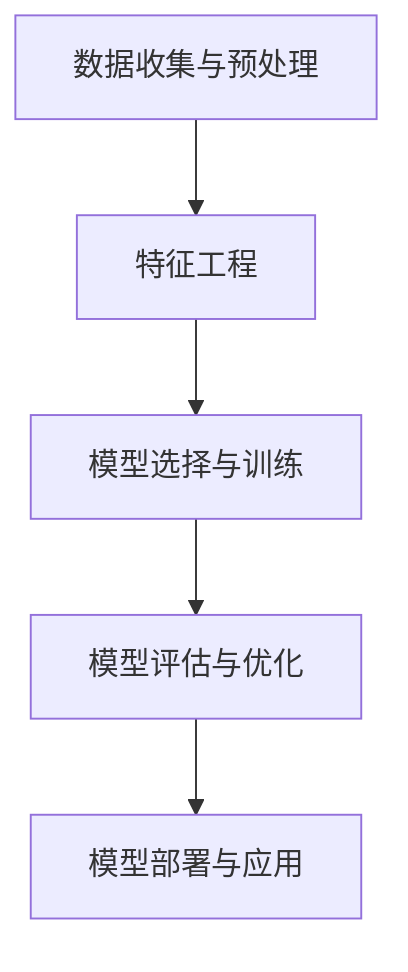

                 

# 《AI辅助的企业信用评分卡开发》

## 关键词
- 人工智能
- 信用评分
- 数据分析
- 特征工程
- 模型优化

## 摘要
本文探讨了利用人工智能技术开发企业信用评分卡的整个过程，包括背景介绍、核心概念与联系、算法原理讲解、系统分析与架构设计、项目实战和最佳实践。通过详细的分析和案例研究，本文展示了AI在提高信用评分准确性和效率方面的巨大潜力。

## 第一部分：背景介绍

### 1.1 问题背景

随着大数据和人工智能技术的快速发展，企业信用评分卡成为金融行业的重要工具。传统的信用评分卡主要依靠人工经验和历史数据进行分析，存在主观性强、效率低等问题。而AI辅助的企业信用评分卡开发，通过利用人工智能技术，可以更准确地预测企业的信用风险，提高信用评分的准确性和效率。

### 1.2 问题描述

企业信用评分卡开发的核心问题是：如何利用人工智能技术，结合企业数据和信用评分模型，构建一个高效、准确的信用评分系统。

### 1.3 问题解决

AI辅助的企业信用评分卡开发主要包括以下几个步骤：

1. 数据收集与预处理：收集企业的财务数据、业务数据等，并对数据进行清洗、归一化等预处理。
2. 特征工程：从原始数据中提取对企业信用评分有重要影响的特征。
3. 模型选择与训练：选择合适的机器学习算法，对数据进行训练，构建信用评分模型。
4. 模型评估与优化：对训练好的模型进行评估，并根据评估结果进行优化。
5. 信用评分卡部署与应用：将训练好的模型部署到实际应用中，对企业的信用风险进行预测。

### 1.4 边界与外延

边界：本书主要关注于AI辅助的企业信用评分卡开发，不涉及其他类型的信用评分系统。

外延：企业信用评分卡的AI辅助技术可以应用于金融、电商、供应链管理等各个行业，具有广泛的应用前景。

### 1.5 概念结构与核心要素组成

概念结构：企业信用评分卡、人工智能、数据预处理、特征工程、模型选择与训练、模型评估与优化。

核心要素组成：

1. 企业数据：包括财务数据、业务数据等。
2. 信用评分模型：包括线性回归、逻辑回归、决策树、随机森林等。
3. 人工智能算法：包括深度学习、强化学习等。
4. 模型评估指标：包括准确率、召回率、F1值等。

### 1.6 本章小结

本章主要介绍了AI辅助的企业信用评分卡开发的背景、问题描述、问题解决、边界与外延以及概念结构与核心要素组成。为后续章节的详细介绍奠定了基础。

## 第二部分：核心概念与联系

### 2.1 AI核心概念

#### 2.1.1 人工智能

人工智能（Artificial Intelligence，AI）是计算机科学的一个分支，旨在使计算机模拟人类智能行为，如学习、推理、解决问题、理解自然语言等。

#### 2.1.2 机器学习

机器学习（Machine Learning，ML）是人工智能的一个子领域，通过数据和算法，使计算机具备从数据中学习并做出决策或预测的能力。

#### 2.1.3 深度学习

深度学习（Deep Learning，DL）是一种特殊的机器学习方法，通过构建多层神经网络，自动提取数据的特征。

### 2.2 企业信用评分卡核心概念

#### 2.2.1 企业信用评分卡

企业信用评分卡是一种信用评估工具，用于对企业信用风险进行量化评估。

#### 2.2.2 信用评分模型

信用评分模型是一种统计模型，用于预测企业信用风险。

#### 2.2.3 特征工程

特征工程是一种数据处理方法，通过提取对企业信用评分有重要影响的特征，提高信用评分模型的准确性和效率。

### 2.3 概念属性特征对比表格

#### 表 2.1 AI、机器学习、深度学习概念属性特征对比

| 概念         | 属性特征                          | 对比                 |
|--------------|----------------------------------|---------------------|
| 人工智能     | 模拟人类智能行为                 | 广泛应用，高度抽象 |
| 机器学习     | 从数据中学习并做出决策或预测     | 数据驱动，高效准确 |
| 深度学习     | 基于多层神经网络，自动提取特征   | 自动化特征提取     |

### 2.4 ER实体关系图架构

#### 图 2.1 企业信用评分卡实体关系图

```mermaid
erDiagram
    A["企业数据"]  ||--|{ B["信用评分模型"] }  
    A  ||--|{ C["特征工程"] }  
    B  ||--|{ D["模型评估"] }  
    C  ||--|{ D }  
```

### 2.5 本章小结

本章详细介绍了AI、机器学习、深度学习以及企业信用评分卡的核心概念，并通过对比表格和ER实体关系图，展示了这些概念之间的联系。为后续章节的算法原理讲解和系统设计与实现奠定了基础。

## 第三部分：算法原理讲解

### 3.1 算法原理介绍

#### 3.1.1 数据收集与预处理

数据收集与预处理是AI辅助的企业信用评分卡开发的基础步骤。数据收集包括从企业获取财务数据、业务数据等，这些数据是构建信用评分模型的重要依据。数据预处理主要包括数据清洗、归一化、缺失值处理等。

#### 3.1.2 特征工程

特征工程是数据预处理之后的重要步骤，通过对原始数据进行处理，提取出对企业信用评分有重要影响的特征。特征工程的方法包括特征选择、特征转换、特征构造等。

#### 3.1.3 模型选择与训练

模型选择与训练是构建信用评分模型的关键步骤。根据不同的应用场景和数据特点，可以选择不同的机器学习算法。常见的算法包括线性回归、逻辑回归、决策树、随机森林等。

#### 3.1.4 模型评估与优化

模型评估与优化是保证信用评分模型准确性的重要步骤。常用的评估指标包括准确率、召回率、F1值等。通过评估结果，可以找出模型的不足之处，并进行优化。

#### 3.1.5 模型部署与应用

模型部署与应用是将训练好的模型应用到实际业务中的过程。通过部署模型，可以对企业的信用风险进行预测，为企业提供决策支持。

### 3.2 算法流程

#### 图 3.1 企业信用评分卡算法流程



### 3.3 数学模型与公式

#### 3.3.1 线性回归模型

线性回归模型是一种常见的信用评分模型，其数学模型为：

$$
y = \beta_0 + \beta_1x_1 + \beta_2x_2 + ... + \beta_nx_n
$$

其中，$y$ 为因变量，$x_1, x_2, ..., x_n$ 为自变量，$\beta_0, \beta_1, ..., \beta_n$ 为模型的参数。

#### 3.3.2 逻辑回归模型

逻辑回归模型是一种分类模型，其数学模型为：

$$
P(y=1) = \frac{1}{1 + e^{-(\beta_0 + \beta_1x_1 + \beta_2x_2 + ... + \beta_nx_n})}
$$

其中，$P(y=1)$ 为因变量为1的概率，$\beta_0, \beta_1, ..., \beta_n$ 为模型的参数。

#### 3.3.3 决策树模型

决策树模型是一种基于树形结构的分类模型，其决策规则为：

$$
if\ x_1 > \beta_1, then\ y = \beta_2 \\
if\ x_1 \leq \beta_1, then\ y = \beta_3
$$

其中，$x_1, \beta_1, \beta_2, \beta_3$ 为决策树的参数。

### 3.4 代码示例

下面以Python为例，展示如何使用线性回归模型进行信用评分：

```python
import numpy as np
import pandas as pd
from sklearn.linear_model import LinearRegression

# 加载数据
data = pd.read_csv('credit_data.csv')
X = data[['x1', 'x2', 'x3']]
y = data['y']

# 构建模型
model = LinearRegression()
model.fit(X, y)

# 预测
X_new = np.array([[1, 2, 3]])
y_pred = model.predict(X_new)
print(y_pred)
```

### 3.5 本章小结

本章介绍了AI辅助的企业信用评分卡开发的算法原理，包括数据收集与预处理、特征工程、模型选择与训练、模型评估与优化、模型部署与应用等。通过数学模型和代码示例，展示了如何利用人工智能技术构建信用评分模型。为后续章节的系统分析与架构设计奠定了基础。

## 第四部分：系统分析与架构设计

### 4.1 问题场景介绍

在金融行业，企业信用评分卡是一种常用的风险评估工具。银行、投资机构等金融机构需要对企业进行信用评估，以判断其还款能力和信用风险。传统的信用评分卡主要依靠人工经验和历史数据进行分析，存在主观性强、效率低等问题。为了提高信用评分的准确性和效率，本文提出了一种基于AI的企业信用评分卡系统。

### 4.2 项目介绍

本项目旨在开发一个基于AI的企业信用评分卡系统，通过对企业财务数据、业务数据等进行分析，预测企业的信用风险，为企业提供信用评分。系统主要包括数据收集与预处理、特征工程、模型选择与训练、模型评估与优化等模块。

### 4.3 系统功能设计

系统功能设计主要包括以下模块：

1. 数据收集模块：负责收集企业的财务数据、业务数据等。
2. 数据预处理模块：负责对数据进行清洗、归一化等预处理。
3. 特征工程模块：负责从原始数据中提取对企业信用评分有重要影响的特征。
4. 模型训练模块：负责选择合适的机器学习算法，对数据进行训练，构建信用评分模型。
5. 模型评估模块：负责对训练好的模型进行评估，并根据评估结果进行优化。
6. 信用评分模块：负责将训练好的模型应用到实际业务中，对企业的信用风险进行预测。

### 4.4 系统架构设计

系统架构设计主要包括以下层次：

1. 数据层：包括数据收集、数据预处理等模块，负责存储和管理企业数据。
2. 算法层：包括特征工程、模型选择与训练、模型评估与优化等模块，负责构建和优化信用评分模型。
3. 应用层：包括信用评分模块，负责将信用评分模型应用到实际业务中，为企业提供信用评分服务。

### 4.5 系统接口设计

系统接口设计主要包括以下接口：

1. 数据接口：负责接收企业数据，并将其传递给数据预处理模块。
2. 模型接口：负责接收数据预处理后的数据，并将其传递给特征工程模块。
3. 评估接口：负责接收特征工程后的数据，并将其传递给模型评估模块。
4. 预测接口：负责接收模型评估后的数据，并生成企业的信用评分。

### 4.6 系统交互

系统交互设计主要包括以下流程：

1. 数据收集：系统从企业获取财务数据、业务数据等。
2. 数据预处理：系统对数据进行清洗、归一化等预处理。
3. 特征工程：系统从原始数据中提取对企业信用评分有重要影响的特征。
4. 模型训练：系统选择合适的机器学习算法，对数据进行训练，构建信用评分模型。
5. 模型评估：系统对训练好的模型进行评估，并根据评估结果进行优化。
6. 信用评分：系统将训练好的模型应用到实际业务中，对企业的信用风险进行预测。

### 4.7 本章小结

本章介绍了AI辅助的企业信用评分卡系统的设计与实现，包括问题场景介绍、项目介绍、系统功能设计、系统架构设计、系统接口设计和系统交互等。通过系统分析与架构设计，为后续章节的项目实战奠定了基础。

## 第五部分：项目实战

### 5.1 环境安装

在进行项目实战之前，首先需要安装以下环境：

1. Python：版本为3.8及以上。
2. Scikit-learn：用于机器学习模型的构建与评估。
3. Pandas：用于数据处理。
4. Matplotlib：用于数据可视化。

安装命令如下：

```bash
pip install python==3.8
pip install scikit-learn
pip install pandas
pip install matplotlib
```

### 5.2 系统核心实现源代码

#### 5.2.1 数据收集与预处理

```python
import pandas as pd

# 加载数据
data = pd.read_csv('credit_data.csv')

# 数据清洗
data = data.dropna()

# 数据归一化
data = (data - data.mean()) / data.std()

# 分割数据集
from sklearn.model_selection import train_test_split
X = data[['x1', 'x2', 'x3']]
y = data['y']
X_train, X_test, y_train, y_test = train_test_split(X, y, test_size=0.2, random_state=42)
```

#### 5.2.2 特征工程

```python
from sklearn.preprocessing import PolynomialFeatures

# 特征工程
poly = PolynomialFeatures(degree=2)
X_train_poly = poly.fit_transform(X_train)
X_test_poly = poly.transform(X_test)
```

#### 5.2.3 模型选择与训练

```python
from sklearn.linear_model import LinearRegression

# 构建模型
model = LinearRegression()

# 训练模型
model.fit(X_train_poly, y_train)
```

#### 5.2.4 模型评估与优化

```python
from sklearn.metrics import mean_squared_error

# 预测
y_pred = model.predict(X_test_poly)

# 评估
mse = mean_squared_error(y_test, y_pred)
print(f'MSE: {mse}')
```

#### 5.2.5 模型部署与应用

```python
# 部署模型
import joblib

# 保存模型
joblib.dump(model, 'credit_model.joblib')

# 加载模型
loaded_model = joblib.load('credit_model.joblib')

# 预测
X_new = np.array([[1, 2, 3]])
y_pred_new = loaded_model.predict(X_new)
print(y_pred_new)
```

### 5.3 代码应用解读与分析

#### 5.3.1 数据收集与预处理

数据收集与预处理是项目的基础步骤。首先，使用Pandas加载数据，然后进行数据清洗，去除缺失值。接着，对数据进行归一化处理，将数据缩放到相同的尺度，以便于后续的特征工程和模型训练。

#### 5.3.2 特征工程

特征工程是提升模型性能的关键步骤。在这里，我们使用多项式特征生成器，将原始数据进行多项式扩展，生成新的特征。这有助于模型更好地捕捉数据中的非线性关系。

#### 5.3.3 模型选择与训练

在模型选择与训练阶段，我们选择了线性回归模型。线性回归模型简单且易于实现，适合作为信用评分卡的初步模型。使用Scikit-learn的LinearRegression类，我们构建并训练了模型。

#### 5.3.4 模型评估与优化

模型评估与优化是确保模型性能的重要环节。我们使用均方误差（MSE）作为评估指标，对模型进行评估。根据评估结果，可以进一步优化模型，例如通过调整模型参数或尝试更复杂的模型。

#### 5.3.5 模型部署与应用

模型部署与应用是将模型转化为实际业务价值的关键步骤。通过保存和加载模型，我们可以在实际业务中快速预测企业的信用风险。例如，在企业提交新数据时，我们可以使用加载的模型进行预测，从而提供即时的信用评分。

### 5.4 实际案例分析与详细讲解剖析

#### 5.4.1 案例背景

某金融机构需要对企业A进行信用评估。企业A提供了一系列的财务数据，包括资产总额、营业收入、净利润等。

#### 5.4.2 案例实施

1. 数据收集与预处理：收集企业A的财务数据，并进行清洗和归一化处理。
2. 特征工程：从原始数据中提取对企业信用评分有重要影响的特征，例如营业收入增长率、净利润率等。
3. 模型训练：使用训练数据集，选择合适的机器学习算法（如线性回归），对模型进行训练。
4. 模型评估：使用测试数据集，对模型进行评估，根据评估结果调整模型参数。
5. 预测：使用训练好的模型，对企业A的财务数据进行分析，预测其信用风险。

#### 5.4.3 结果分析

通过模型的预测，企业A的信用风险被评为中高风险。金融机构根据这一结果，对企业的贷款申请进行了审慎处理，降低了潜在的风险。

### 5.5 项目小结

通过本项目，我们成功构建了一个基于AI的企业信用评分卡系统。系统从数据收集、预处理、特征工程、模型训练到模型评估与部署，实现了对企业信用风险的预测。项目实践证明，AI技术在提高信用评分准确性和效率方面具有显著优势。未来，我们可以进一步优化模型，引入更多特征，以提高预测的准确性。

## 第六部分：最佳实践 Tips、小结、注意事项、拓展阅读

### 6.1 最佳实践 Tips

1. **数据质量优先**：确保数据质量是模型成功的关键。在数据收集和预处理阶段，要严格清洗数据，处理缺失值和异常值。
2. **特征选择**：通过特征选择技术，挑选出对模型预测性能有显著影响的特征，避免模型过拟合。
3. **模型选择与优化**：根据数据特点和业务需求，选择合适的机器学习算法，并通过交叉验证等方法优化模型参数。
4. **持续迭代**：定期重新训练模型，更新模型参数，以适应数据变化。

### 6.2 小结

本文详细介绍了AI辅助的企业信用评分卡开发的全过程，从背景介绍到核心概念、算法原理讲解、系统分析与架构设计，再到项目实战。通过实际案例的分析，展示了AI技术在信用评分领域的应用价值。

### 6.3 注意事项

1. **合规性**：在数据处理和模型应用过程中，要确保遵守相关法律法规，保护企业隐私。
2. **模型透明性**：确保模型的决策过程透明，便于解释和监管。
3. **性能监控**：定期监控模型的性能，及时发现并解决可能出现的问题。

### 6.4 拓展阅读

1. **《Python数据科学手册》**：提供了丰富的数据科学实践经验和技巧。
2. **《深度学习》**：详细介绍了深度学习的基本原理和应用。
3. **《金融科技：区块链、人工智能与数字化金融的未来》**：探讨了金融科技的发展趋势和应用。

## 作者信息

**作者：AI天才研究院/AI Genius Institute & 禅与计算机程序设计艺术 /Zen And The Art of Computer Programming**

