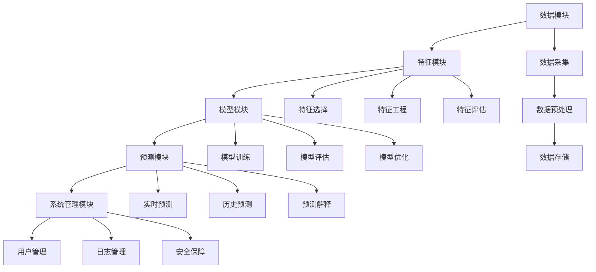
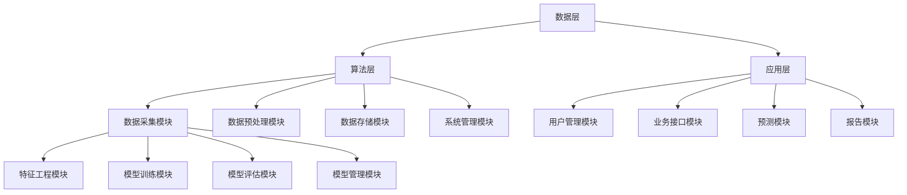
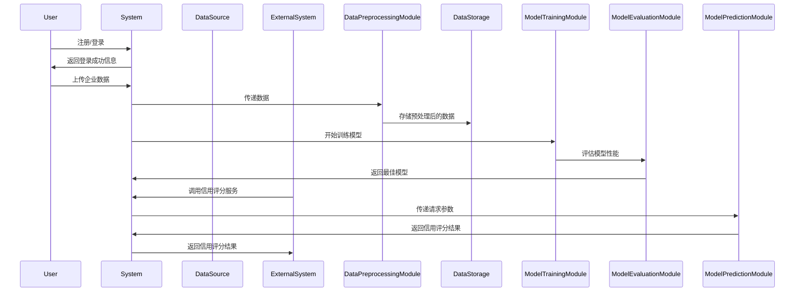

                 


## 引言：AI与信用评分卡的重要性

### 2.1.1 问题背景

信用评分卡作为一种评估企业信用风险的重要工具，广泛应用于金融、保险、租赁等行业。传统的信用评分卡主要依赖于历史数据和专家经验，通过手工分析企业和个人信用信息，构建评分模型，进行风险评估。然而，这种方法存在许多局限性，例如数据质量不高、模型稳定性不足、风险评估结果不够准确等。

随着人工智能（AI）技术的迅速发展，AI在信用评分领域展现出巨大的潜力。AI技术可以通过自动化、智能化的方式处理大量数据，提取有价值的信息，构建更加精确、稳定的信用评分模型。此外，AI技术还可以动态调整评分模型，以应对不断变化的市场环境和信用风险。

### 2.1.2 AI在信用评分中的应用

AI在信用评分中的应用主要包括以下几个方面：

1. **数据收集与预处理**：AI技术可以帮助企业自动化收集各类信用信息，包括财务报表、信用报告、社交媒体数据等。同时，通过自然语言处理（NLP）等技术，对非结构化数据进行预处理，提高数据质量。

2. **特征工程**：AI技术可以从大量数据中自动提取有价值的信息，构建特征向量，用于训练评分模型。这些特征可能包括企业的财务状况、业务规模、行业地位、历史信用记录等。

3. **模型训练与优化**：AI技术可以训练各种机器学习模型，如线性回归、决策树、随机森林、神经网络等，对信用评分进行建模。此外，通过交叉验证、网格搜索等技术，可以优化模型参数，提高评分准确性。

4. **风险评估与预警**：AI技术可以实时分析企业的信用行为，识别潜在的风险。当企业出现异常行为时，系统可以自动发出预警，帮助企业及时采取应对措施。

5. **模型解释与透明度**：AI技术可以通过可视化、规则提取等方法，解释评分模型的决策过程，提高模型的可解释性，降低风险。

### 2.1.3 信用评分卡的挑战与机遇

信用评分卡的挑战主要体现在以下几个方面：

1. **数据质量**：信用信息的真实性、准确性、完整性直接影响评分模型的准确性。如何提高数据质量，是信用评分领域需要解决的问题。

2. **模型稳定性**：信用评分模型需要具备一定的稳定性，以应对市场环境的变化。如何保持模型稳定性，是信用评分领域面临的挑战。

3. **模型解释性**：信用评分模型需要具备一定的解释性，以便企业和监管机构理解模型的决策过程。如何提高模型解释性，是信用评分领域需要解决的问题。

然而，随着AI技术的发展，信用评分卡也面临着巨大的机遇：

1. **数据获取能力**：AI技术可以自动化收集各类信用信息，提高数据获取能力。

2. **模型构建能力**：AI技术可以训练各种复杂模型，提高模型构建能力。

3. **实时风险评估**：AI技术可以实时分析企业的信用行为，提高风险评估能力。

4. **个性化服务**：AI技术可以根据企业的具体情况，提供个性化的信用评分服务。

总之，AI技术为信用评分领域带来了新的机遇，同时也提出了新的挑战。如何利用AI技术，构建高效、稳定、解释性强的信用评分卡，是当前研究和应用的重要方向。

### 2.1.4 本书概述与结构安排

本书旨在探讨AI辅助的企业信用评分卡开发平台，系统性地介绍AI在信用评分中的应用原理、方法论、系统架构和实施步骤。全书共分为三个主要部分：

**第一部分：AI与信用评分基础**

本部分将介绍AI的基础概念、机器学习与深度学习技术，以及信用评分的基本原理。通过本部分的学习，读者将了解AI技术在信用评分领域的应用背景和基础理论。

**第二部分：AI辅助信用评分卡开发**

本部分将详细讨论信用评分卡开发的关键环节，包括数据收集与预处理、特征工程、模型训练与优化、模型评估与解释等。通过本部分的学习，读者将掌握AI辅助信用评分卡开发的核心技能。

**第三部分：AI信用评分卡实施与优化**

本部分将介绍AI信用评分卡的实际应用案例，包括系统架构设计、模型解释与透明度、风险评估与预警等。通过本部分的学习，读者将了解AI信用评分卡在实际业务中的应用场景和优化策略。

### 2.1.5 文章关键词

- AI
- 信用评分
- 信用评分卡
- 数据收集
- 特征工程
- 模型训练
- 模型评估
- 风险评估

### 2.1.6 文章摘要

本文首先介绍了AI在信用评分领域的重要性，分析了AI技术在信用评分中的应用现状和挑战。接着，本文详细探讨了AI辅助的企业信用评分卡开发平台，包括数据收集与预处理、特征工程、模型训练与优化、模型评估与解释等关键环节。最后，本文通过实际案例，展示了AI信用评分卡在实际业务中的应用效果和优化策略。本文旨在为读者提供一份全面、系统的AI辅助信用评分卡开发指南。## 2.2 AI基础概念

### 2.2.1 AI的定义与发展

人工智能（Artificial Intelligence，简称AI）是计算机科学的一个分支，旨在使计算机具有人类的智能，能够感知、理解、学习、推理和决策。AI的研究始于20世纪50年代，当时科学家们首次提出了“智能代理”（Intelligent Agent）的概念，即能够与环境进行交互，并自主执行任务的计算机系统。随着计算机技术的不断进步，AI研究领域也在不断扩大，涵盖了机器学习、深度学习、自然语言处理、计算机视觉等多个子领域。

AI的发展可以分为三个阶段：

1. **符号主义AI（Symbolic AI）**：符号主义AI主要依赖于符号逻辑和知识表示方法，通过构建逻辑规则和推理机制来模拟人类思维。这一阶段的发展标志着AI研究的起步，但局限性也逐渐显现，如规则难以穷尽、推理效率低下等。

2. **连接主义AI（Connectionist AI）**：连接主义AI通过模拟人脑神经网络的结构和工作原理，使用大量的简单神经元进行分布式计算，从而实现复杂的任务。这一阶段以人工神经网络（ANN）的提出和发展为标志，开启了深度学习（Deep Learning）的先河。

3. **统计学习AI（Statistical Learning AI）**：统计学习AI通过利用大量的数据，使用统计方法建立模型，以实现自动化学习和推理。这一阶段以支持向量机（SVM）、随机森林（Random Forest）等算法的广泛应用为标志，标志着AI进入了数据驱动的时代。

### 2.2.2 机器学习与深度学习

机器学习（Machine Learning，简称ML）是AI的核心技术之一，它使计算机系统能够通过数据学习规律，进行自动化的决策和预测。机器学习的过程主要包括数据收集、数据预处理、模型训练、模型评估和模型部署等步骤。

**机器学习的主要类型包括：**

1. **监督学习（Supervised Learning）**：监督学习通过已有标记的数据训练模型，然后使用该模型对新的、未标记的数据进行预测。常见的监督学习算法包括线性回归、决策树、支持向量机等。

2. **无监督学习（Unsupervised Learning）**：无监督学习通过未标记的数据寻找隐藏的结构或模式。常见的无监督学习算法包括聚类、降维、关联规则学习等。

3. **半监督学习（Semi-supervised Learning）**：半监督学习结合了监督学习和无监督学习，利用少量标记数据和大量未标记数据共同训练模型。

4. **强化学习（Reinforcement Learning）**：强化学习通过试错法，在与环境的交互中学习最优策略。常见的强化学习算法包括Q学习、深度Q网络（DQN）等。

**深度学习（Deep Learning，简称DL）是机器学习的一个子领域，它利用多层神经网络进行模型训练，以实现更加复杂的特征提取和任务解决。深度学习的发展极大地推动了AI技术的进步，尤其在图像识别、语音识别、自然语言处理等领域取得了显著成果。**

**深度学习的主要组成部分包括：**

1. **神经网络（Neural Networks）**：神经网络是深度学习的基础，它由多个神经元组成，通过前向传播和反向传播进行信息处理。

2. **激活函数（Activation Functions）**：激活函数为神经网络提供了非线性特性，使得神经网络能够学习复杂的数据分布。

3. **优化算法（Optimization Algorithms）**：优化算法用于调整网络权重，以最小化损失函数，常见的优化算法包括梯度下降、Adam优化器等。

4. **正则化（Regularization）**：正则化用于防止过拟合，提高模型泛化能力，常见的正则化方法包括L1正则化、L2正则化、Dropout等。

### 2.2.3 AI的主要类型

除了传统的机器学习和深度学习，AI还有其他几种主要类型，如下：

1. **自然语言处理（Natural Language Processing，简称NLP）**：NLP是AI的一个子领域，旨在使计算机理解和处理人类语言。NLP技术广泛应用于机器翻译、情感分析、文本分类、信息抽取等领域。

2. **计算机视觉（Computer Vision）**：计算机视觉是AI的另一个重要子领域，它使计算机能够从图像或视频中提取有用的信息。计算机视觉技术广泛应用于图像识别、人脸识别、自动驾驶等领域。

3. **机器人学（Robotics）**：机器人学是研究机器人设计、制造、应用和交互的学科。AI技术在机器人学中发挥了重要作用，通过传感器、执行器和控制系统，机器人可以执行各种复杂的任务。

4. **专家系统（Expert Systems）**：专家系统是一种基于知识表示和推理的AI系统，它模拟人类专家的决策过程，用于解决特定领域的问题。专家系统在医疗诊断、金融分析、法律咨询等领域具有广泛的应用。

5. **智能搜索（Smart Search）**：智能搜索利用AI技术，通过理解用户查询意图和内容，提供更精准的搜索结果。智能搜索广泛应用于搜索引擎、推荐系统、智能客服等领域。

通过上述对AI基础概念的介绍，读者可以了解到AI技术的广泛应用和深刻影响。在接下来的章节中，我们将进一步探讨AI在信用评分卡开发中的应用，以及如何构建高效的AI辅助信用评分卡开发平台。## 2.3 企业信用评分卡的挑战与机遇

### 2.3.1 信用评分卡的挑战

企业在开发信用评分卡时面临着多种挑战，这些挑战不仅影响了评分模型的准确性和稳定性，还可能对企业的业务运营产生深远影响。以下是企业信用评分卡开发中常见的挑战：

1. **数据质量**：信用评分卡的核心依赖于高质量的数据。然而，信用信息的获取和整合过程往往复杂且困难。数据可能存在缺失、噪声、不一致性等问题，这直接影响了评分模型的性能和可信度。

2. **特征选择**：特征选择是信用评分卡开发的关键环节。选择不当的特征可能导致模型过拟合，而选择过多的特征则可能导致模型复杂度增加，计算成本上升。此外，不同特征之间的关系和重要性也难以直观判断。

3. **模型稳定性**：信用评分模型需要具备一定的稳定性，以应对市场环境的变化。然而，市场环境的变化可能导致历史数据特征的有效性发生变化，从而影响模型的稳定性和预测能力。

4. **模型解释性**：信用评分模型通常是一个复杂的数学模型，其内部机制难以直观解释。对于企业和监管机构来说，理解模型决策过程至关重要，但传统的黑箱模型往往难以满足这一需求。

5. **实时性与效率**：随着信用风险管理的需求不断提高，企业需要能够实时更新和评估信用评分模型。然而，传统的评分模型通常需要较长的计算时间，难以满足实时性要求。

6. **合规性**：在金融和保险等行业，信用评分模型需要遵守严格的监管要求和法律法规。例如，数据隐私保护、公平性要求等，这些合规性要求增加了模型开发的复杂度。

### 2.3.2 AI带来的机遇

尽管存在诸多挑战，AI技术的发展为信用评分卡的开发带来了新的机遇：

1. **数据获取能力**：AI技术可以自动化收集各类信用信息，包括公开数据、社交媒体数据、交易数据等，提高了数据获取的广度和深度。

2. **特征工程**：AI技术能够自动提取和构造特征，从大量原始数据中识别出有价值的信息，从而提高特征选择的效率和准确性。

3. **模型构建能力**：AI技术可以训练各种复杂的机器学习模型，如深度学习模型、集成学习模型等，提高模型的预测能力和稳定性。

4. **实时风险评估**：AI技术能够实现实时数据处理和模型更新，快速响应市场环境变化，提高信用评分的实时性和准确性。

5. **模型解释性**：AI技术可以通过可视化、规则提取等方法，提高模型的可解释性，帮助企业理解和信任模型决策过程。

6. **个性化服务**：AI技术可以根据不同企业的特征和需求，提供个性化的信用评分服务，提高信用评分的针对性和有效性。

### 2.3.3 信用评分卡开发的边界与外延

信用评分卡开发的边界主要包括以下几个方面：

1. **数据来源**：信用评分卡的数据来源广泛，包括企业财务报表、信用报告、社交媒体数据、公共记录等。数据来源的多样性要求企业能够有效地整合和处理各类数据。

2. **特征范围**：信用评分卡的特征范围包括企业的财务状况、业务规模、历史信用记录、行业地位等。特征范围的广泛性要求企业能够全面、准确地评估企业信用风险。

3. **模型类型**：信用评分卡的模型类型包括线性回归、决策树、随机森林、神经网络等。模型类型的多样性要求企业能够根据业务需求和数据特点选择合适的模型。

4. **应用场景**：信用评分卡的应用场景包括贷款审批、信用评级、供应链金融等。应用场景的多样性要求企业能够根据不同场景定制化信用评分模型。

信用评分卡的外延主要包括以下几个方面：

1. **风险评估**：信用评分卡不仅仅用于信用评分，还可以用于风险评估、风险预警等，为企业的信用风险管理提供支持。

2. **信用管理**：信用评分卡可以与企业的信用管理系统结合，实现信用评估、信用监控、信用恢复等全流程管理。

3. **风险管理**：信用评分卡可以作为企业风险管理的一部分，与其他风险管理工具（如市场风险、操作风险等）相结合，实现全面的风险管理。

4. **客户关系管理**：信用评分卡可以帮助企业更好地了解客户信用状况，优化客户关系管理策略，提高客户满意度和忠诚度。

总之，AI技术为信用评分卡的开发带来了新的机遇和挑战。通过利用AI技术，企业可以构建高效、稳定、解释性强的信用评分卡，为信用风险管理提供有力支持。在接下来的章节中，我们将详细探讨AI在信用评分卡开发中的应用方法和技术细节。## 2.4 本书概述与结构安排

### 2.4.1 本书的目标

本书旨在深入探讨AI辅助的企业信用评分卡开发平台，系统地介绍AI在信用评分领域中的应用原理、方法论、系统架构和实施步骤。通过本书的学习，读者将能够：

1. **掌握AI与信用评分的基本概念**：了解AI技术的发展历程、核心技术和应用场景，以及信用评分的基本原理和流程。

2. **掌握AI辅助信用评分卡开发的方法和技巧**：学习如何利用AI技术进行数据收集与预处理、特征工程、模型训练与优化、模型评估与解释等关键环节。

3. **了解信用评分卡开发中的挑战和机遇**：分析信用评分卡开发中的挑战，如数据质量、模型稳定性、解释性等，以及AI技术带来的机遇，如实时风险评估、个性化服务等。

4. **掌握AI信用评分卡的开发与实践**：通过实际案例分析和项目实践，了解AI信用评分卡的开发流程和实现方法，提高实际操作能力。

### 2.4.2 目录结构安排

本书共分为三大部分，各部分内容如下：

**第一部分：AI与信用评分基础**

本部分将介绍AI的基础概念、机器学习与深度学习技术，以及信用评分的基本原理。具体内容包括：

- 第1章 引言：AI与信用评分卡的重要性
  - 2.1 问题背景
  - 2.2 AI基础概念
  - 2.3 企业信用评分卡的挑战与机遇
  - 2.4 本书概述与结构安排

**第二部分：AI辅助信用评分卡开发**

本部分将详细讨论AI辅助信用评分卡开发的关键环节，包括数据收集与预处理、特征工程、模型训练与优化、模型评估与解释等。具体内容包括：

- 第3章 AI在信用评分中的应用原理
  - 3.1 数据收集与预处理
  - 3.2 特征工程
  - 3.3 信用评分模型算法
  - 3.4 信用评分模型的评估与优化
  - 3.5 AI辅助信用评分卡开发平台架构

**第三部分：AI信用评分卡实施与优化**

本部分将介绍AI信用评分卡的实际应用案例，包括系统架构设计、模型解释与透明度、风险评估与预警等。具体内容包括：

- 第4章 AI信用评分卡系统设计与实现
  - 4.1 系统架构设计
  - 4.2 系统功能设计与实现
  - 4.3 模型解释与透明度
  - 4.4 风险评估与预警
  - 4.5 案例分析

通过以上三个部分的系统学习和实践，读者将全面掌握AI辅助的企业信用评分卡开发技术，具备在实际业务中应用这些技术的能力。

## 2.5 文章关键词

- AI
- 信用评分
- 信用评分卡
- 数据收集
- 特征工程
- 模型训练
- 模型评估
- 风险评估
- 深度学习
- 自然语言处理
- 机器学习
- 线性回归
- 决策树
- 支持向量机
- 优化算法
- 实时性
- 个性化服务

### 2.6 文章摘要

本文深入探讨了AI辅助的企业信用评分卡开发平台，系统地介绍了AI在信用评分领域的基本概念、应用原理和方法论。首先，本文分析了AI与信用评分卡的重要性，阐述了信用评分卡开发的挑战与机遇。接着，本文详细介绍了AI在信用评分中的应用，包括数据收集与预处理、特征工程、模型训练与优化等关键环节。此外，本文还讨论了AI信用评分卡的系统架构设计、模型解释与透明度、风险评估与预警等实际应用。通过实际案例分析和项目实践，本文展示了AI信用评分卡的开发流程和实现方法。本文旨在为读者提供一份全面、系统的AI辅助信用评分卡开发指南。## 第3章 AI在信用评分中的应用原理

### 3.1 数据收集与预处理

数据收集与预处理是信用评分卡开发的基础，直接影响评分模型的准确性和稳定性。以下是数据收集与预处理的关键步骤：

#### 3.1.1 数据来源

1. **公开数据**：包括企业财务报表、行业统计数据、公共记录等。
2. **企业内部数据**：包括客户交易记录、财务数据、信用记录等。
3. **第三方数据**：包括信用评级机构、征信机构、社交媒体数据等。

#### 3.1.2 数据收集

1. **自动化数据采集**：使用API接口、网络爬虫等技术，自动收集公开数据和第三方数据。
2. **手动数据收集**：对于企业内部数据，可能需要通过人工方式收集和整理。

#### 3.1.3 数据预处理

1. **数据清洗**：处理缺失值、噪声、异常值等，确保数据质量。
2. **数据整合**：将不同来源的数据进行整合，消除数据不一致性。
3. **数据标准化**：对数据进行归一化或标准化处理，确保数据在同一尺度下进行比较。

#### 3.1.4 数据存储

1. **数据仓库**：使用数据仓库技术，对海量数据进行高效存储和管理。
2. **分布式存储**：对于大规模数据，采用分布式存储方案，提高数据访问速度和处理能力。

### 3.2 特征工程

特征工程是信用评分卡开发的核心环节，通过提取和构造特征，将原始数据转换为适合模型训练的输入。以下是特征工程的关键步骤：

#### 3.2.1 特征选择

1. **业务知识驱动**：根据业务需求和专家经验，选择具有代表性的特征。
2. **统计方法**：使用相关系数、信息增益、主成分分析（PCA）等方法，筛选出重要特征。
3. **模型选择**：通过初步的模型训练，选择对模型性能提升显著的特性。

#### 3.2.2 特征构造

1. **衍生特征**：通过对原始数据进行数学变换、组合，生成新的特征。
2. **交互特征**：通过特征之间的组合，构造出具有更高预测能力的特征。
3. **上下文特征**：结合企业历史数据和行业知识，构建反映企业特定情况的特征。

#### 3.2.3 特征重要性评估

1. **模型解释方法**：使用模型解释方法，如SHAP值、LIME等，评估特征的重要性。
2. **特征重要性排序**：根据特征的重要性评估结果，对特征进行排序，用于模型训练和优化。

### 3.3 信用评分模型算法

信用评分模型是信用评分卡的核心，通过训练和优化模型，实现对信用风险的评估。以下是常用的信用评分模型算法：

#### 3.3.1 线性回归模型

线性回归模型是一种简单的统计模型，通过建立线性关系，预测信用评分。公式如下：

$$y = \beta_0 + \beta_1 \cdot x_1 + \beta_2 \cdot x_2 + ... + \beta_n \cdot x_n$$

其中，$y$为信用评分，$x_1, x_2, ..., x_n$为特征值，$\beta_0, \beta_1, ..., \beta_n$为模型参数。

#### 3.3.2 决策树模型

决策树模型通过一系列的决策规则，将样本分为不同的类别或数值。决策树模型的训练过程为：

1. **信息增益**：选择具有最高信息增益的特征作为分割标准。
2. **递归分割**：根据分割标准，将数据集分割为子集，重复步骤1，直至满足终止条件。

#### 3.3.3 集成学习方法

集成学习方法通过组合多个基础模型，提高预测性能。常用的集成学习方法包括：

1. **随机森林（Random Forest）**：随机选择特征和样本子集，构建多个决策树模型，然后通过投票或平均得到最终预测结果。
2. **梯度提升树（Gradient Boosting Tree）**：通过迭代优化，每次更新模型，减少误差，最终得到一个强预测模型。

#### 3.3.4 深度学习模型

深度学习模型通过多层神经网络，实现对复杂数据的自动特征提取和分类。以下是几种常用的深度学习模型：

1. **全连接神经网络（Fully Connected Neural Network）**：多层全连接神经网络，通过激活函数实现非线性变换。
2. **卷积神经网络（Convolutional Neural Network，CNN）**：适用于图像数据，通过卷积层提取空间特征。
3. **循环神经网络（Recurrent Neural Network，RNN）**：适用于序列数据，通过循环结构处理前后依赖关系。
4. **长短期记忆网络（Long Short-Term Memory，LSTM）**：RNN的改进，解决长期依赖问题。

### 3.4 信用评分模型的评估与优化

信用评分模型的评估与优化是确保模型性能和稳定性的关键步骤。以下是评估与优化的关键环节：

#### 3.4.1 评估指标

1. **准确率（Accuracy）**：分类正确的样本数占总样本数的比例。
2. **精确率（Precision）**：分类正确的正样本数与正样本总数的比例。
3. **召回率（Recall）**：分类正确的正样本数与负样本总数的比例。
4. **F1分数（F1 Score）**：精确率和召回率的调和平均。
5. **ROC曲线和AUC值**：ROC曲线下面积，用于评估分类器的整体性能。

#### 3.4.2 模型优化策略

1. **交叉验证**：通过将数据集划分为多个子集，交叉验证模型性能，避免过拟合。
2. **网格搜索**：系统搜索模型参数，找到最佳参数组合，提高模型性能。
3. **正则化**：通过添加正则项，防止模型过拟合，提高模型泛化能力。
4. **集成学习**：通过组合多个基础模型，提高模型性能和稳定性。

### 3.5 AI辅助信用评分卡开发平台架构

AI辅助信用评分卡开发平台是一个复杂的系统，涉及多个模块和组件。以下是平台架构的关键组成部分：

#### 3.5.1 数据模块

1. **数据采集**：自动采集各类信用信息。
2. **数据预处理**：清洗、整合和标准化数据。
3. **数据存储**：使用分布式存储方案，存储和处理大规模数据。

#### 3.5.2 特征模块

1. **特征选择**：根据业务需求，选择和构造特征。
2. **特征工程**：衍生和交互特征，提高特征价值。
3. **特征评估**：评估特征的重要性，优化特征组合。

#### 3.5.3 模型模块

1. **模型训练**：使用不同算法训练信用评分模型。
2. **模型评估**：评估模型性能，选择最佳模型。
3. **模型优化**：通过交叉验证、网格搜索等策略，优化模型参数。

#### 3.5.4 预测模块

1. **实时预测**：对新的信用申请进行实时评分。
2. **历史预测**：对历史数据集进行评分预测。
3. **预测解释**：解释预测结果，提高模型透明度。

#### 3.5.5 系统管理模块

1. **用户管理**：管理用户账户、权限等。
2. **日志管理**：记录系统运行日志，方便问题排查。
3. **安全保障**：确保系统数据安全和用户隐私。

通过以上各模块的协同工作，AI辅助信用评分卡开发平台能够高效、稳定地运行，为企业提供优质的信用评分服务。

## 3.5.6 Mermaid架构图

以下是一个简化的AI辅助信用评分卡开发平台的Mermaid架构图：



这个架构图展示了平台的主要模块和组件，以及它们之间的关联关系。通过这个架构图，读者可以直观地了解平台的整体结构和功能模块。## 第4章 AI信用评分卡系统设计与实现

### 4.1 系统架构设计

AI信用评分卡系统是一个复杂的信息系统，涉及多个模块和组件的协同工作。为了确保系统的稳定性、高效性和可扩展性，我们采用分层架构设计，将系统分为数据层、算法层和应用层。

**4.1.1 数据层**

数据层是系统的基础，负责数据的收集、存储和管理。数据层主要包括以下几个模块：

1. **数据采集模块**：负责从各种数据源（如企业内部系统、第三方数据供应商、公共数据库等）自动采集数据。
2. **数据预处理模块**：对采集到的数据进行清洗、去噪、格式化等预处理操作，确保数据质量。
3. **数据存储模块**：使用分布式数据库（如Hadoop、MongoDB等）存储大规模数据，提供高效的数据访问和处理能力。

**4.1.2 算法层**

算法层是系统的核心，负责信用评分模型的构建和优化。算法层主要包括以下几个模块：

1. **特征工程模块**：根据业务需求和数据特点，选择和构造特征，为模型训练提供输入。
2. **模型训练模块**：使用机器学习和深度学习算法，训练不同的信用评分模型，如线性回归、决策树、随机森林、神经网络等。
3. **模型评估模块**：评估模型性能，选择最佳模型并进行优化，确保评分结果的准确性和稳定性。
4. **模型管理模块**：负责模型的存储、更新和监控，确保模型能够实时响应业务需求。

**4.1.3 应用层**

应用层是系统的界面，负责与用户交互并提供信用评分服务。应用层主要包括以下几个模块：

1. **用户管理模块**：管理用户账户、权限和角色，确保系统的安全性。
2. **业务接口模块**：提供API接口，供外部系统调用信用评分服务。
3. **预测模块**：根据用户输入的数据，实时生成信用评分结果，并支持历史数据的批量预测。
4. **报告模块**：生成信用评分报告，展示评分结果和模型解释，方便用户理解和分析。

**4.1.4 系统架构图**

以下是一个简化的AI信用评分卡系统架构图，使用Mermaid语言描述：



### 4.2 系统功能设计

AI信用评分卡系统的功能设计旨在满足企业信用评分的需求，提供高效、准确的信用评分服务。以下是系统的主要功能模块：

**4.2.1 用户管理**

用户管理模块负责管理系统的用户账户，包括用户注册、登录、权限分配、密码管理等。用户管理模块需要确保系统的安全性，防止未经授权的访问。

**4.2.2 数据采集**

数据采集模块负责从各种数据源自动采集企业信用信息，包括企业财务报表、信用报告、交易记录、社交媒体数据等。数据采集模块需要支持多种数据源接入，并具备数据清洗和去噪功能。

**4.2.3 数据预处理**

数据预处理模块对采集到的数据进行清洗、去噪、格式化等操作，确保数据质量。数据预处理模块需要支持多种数据预处理方法，如缺失值处理、异常值检测、数据标准化等。

**4.2.4 特征工程**

特征工程模块根据业务需求和数据特点，选择和构造特征，为模型训练提供输入。特征工程模块需要支持多种特征构造方法，如衍生特征、交互特征、上下文特征等。

**4.2.5 模型训练**

模型训练模块使用机器学习和深度学习算法，训练不同的信用评分模型，如线性回归、决策树、随机森林、神经网络等。模型训练模块需要支持多种算法选择和参数调优。

**4.2.6 模型评估**

模型评估模块评估模型性能，选择最佳模型并进行优化，确保评分结果的准确性和稳定性。模型评估模块需要支持多种评估指标，如准确率、精确率、召回率、F1分数等。

**4.2.7 模型管理**

模型管理模块负责模型的存储、更新和监控，确保模型能够实时响应业务需求。模型管理模块需要支持模型的版本控制、性能监控和异常处理。

**4.2.8 预测服务**

预测服务模块根据用户输入的数据，实时生成信用评分结果，并支持历史数据的批量预测。预测服务模块需要确保评分结果的实时性和准确性。

**4.2.9 报告生成**

报告生成模块生成信用评分报告，展示评分结果和模型解释，方便用户理解和分析。报告生成模块需要支持多种报告格式，如PDF、Excel等。

### 4.3 系统架构设计

系统架构设计旨在确保AI信用评分卡系统的稳定性、高效性和可扩展性。以下是系统架构设计的关键组成部分：

**4.3.1 数据存储架构**

数据存储架构采用分布式数据库，如Hadoop、MongoDB等，以支持大规模数据存储和高效数据处理。分布式数据库通过分片和复制机制，提高数据访问速度和系统容错能力。

**4.3.2 算法计算架构**

算法计算架构采用分布式计算框架，如Spark、Flink等，以支持大规模数据处理和模型训练。分布式计算框架通过任务调度和数据分区，提高计算效率和资源利用率。

**4.3.3 服务部署架构**

服务部署架构采用容器化技术，如Docker、Kubernetes等，以实现服务的自动化部署和运维。容器化技术通过隔离和轻量级封装，提高系统的灵活性和可扩展性。

**4.3.4 安全防护架构**

安全防护架构包括防火墙、入侵检测、数据加密等安全措施，以保护系统的数据安全和用户隐私。安全防护架构需要遵循业界标准和最佳实践，确保系统的安全性。

### 4.4 系统接口设计

系统接口设计是系统架构的重要组成部分，负责定义系统内部和外部系统之间的交互接口。以下是系统接口设计的关键组成部分：

**4.4.1 用户接口**

用户接口包括Web界面和移动应用，供用户访问和管理信用评分卡系统。用户接口需要具备友好的用户界面和高效的交互体验，支持用户注册、登录、数据上传、信用评分查询等功能。

**4.4.2 业务接口**

业务接口包括API接口，供外部系统（如ERP系统、CRM系统等）调用信用评分服务。业务接口需要支持HTTP/HTTPS协议，提供安全、可靠的数据传输和访问控制。

**4.4.3 数据接口**

数据接口包括数据采集模块和数据预处理模块的接口，负责与外部数据源和内部数据存储系统的交互。数据接口需要支持多种数据格式（如JSON、XML等），并提供数据清洗、去噪、格式化等功能。

### 4.5 系统交互设计

系统交互设计描述了系统内部和外部系统之间的交互流程和交互方式。以下是系统交互设计的关键组成部分：

**4.4.1 用户交互流程**

用户交互流程包括用户注册、登录、数据上传、信用评分查询等步骤。用户首先需要注册账户并登录系统，然后上传企业数据，系统会自动进行数据预处理和特征工程，生成信用评分结果，并展示在用户界面。

**4.4.2 业务交互流程**

业务交互流程包括外部系统调用信用评分服务、获取信用评分结果等步骤。外部系统通过业务接口发送请求，系统会根据请求参数进行数据预处理、模型训练和预测，将信用评分结果返回给外部系统。

**4.4.3 数据交互流程**

数据交互流程包括数据采集、数据预处理、数据存储等步骤。数据采集模块从外部数据源获取数据，数据预处理模块对数据进行清洗、去噪、格式化等处理，然后将处理后的数据存储在分布式数据库中。

### 4.6 Mermaid接口设计图

以下是一个简化的AI信用评分卡系统接口设计的Mermaid序列图：



通过以上接口设计图，读者可以直观地了解系统内部和外部系统之间的交互流程和交互方式。## 4.7 项目实战

### 4.7.1 环境安装

在开始项目实战之前，我们需要安装必要的软件和工具。以下是安装步骤：

1. **Python环境**：首先，确保你的计算机已经安装了Python 3.x版本。如果没有，可以从[Python官网](https://www.python.org/)下载并安装。

2. **Anaconda**：为了方便项目管理和环境配置，我们使用Anaconda作为Python的发行版。从[Anaconda官网](https://www.anaconda.com/)下载并安装Anaconda，安装过程中选择添加Anaconda到系统环境变量。

3. **Jupyter Notebook**：安装Jupyter Notebook，这是一个交互式Python环境，用于编写和运行Python代码。在命令行中运行以下命令：

   ```
   conda install jupyter
   ```

4. **必要的库**：在Jupyter Notebook中创建一个新环境，然后安装以下库：

   ```
   pip install numpy pandas scikit-learn matplotlib
   ```

   这些库包括数值计算、数据处理、机器学习模型训练和可视化工具，是本项目必备的库。

### 4.7.2 系统核心实现

以下是一个简单的AI信用评分卡系统的核心实现，包括数据预处理、特征工程、模型训练和评估等步骤。我们使用Python和scikit-learn库来实现。

**数据预处理**：

首先，我们加载一个示例数据集，并进行基本的数据预处理。

```python
import numpy as np
import pandas as pd
from sklearn.model_selection import train_test_split

# 加载数据集
data = pd.read_csv('credit_data.csv')

# 数据预处理
data.dropna(inplace=True)  # 删除缺失值
data = (data - data.mean()) / data.std()  # 数据标准化
```

**特征工程**：

接下来，我们进行特征工程，包括特征选择和特征构造。

```python
from sklearn.feature_selection import SelectKBest, f_classif

# 特征选择
X = data.drop('credit_score', axis=1)
y = data['credit_score']
selector = SelectKBest(f_classif, k=5)
X_new = selector.fit_transform(X, y)

# 特征构造
# 例如：构造一个交互特征
X_new = np.hstack((X_new, X_new[:, 0] * X_new[:, 1]))
```

**模型训练**：

我们使用随机森林算法来训练信用评分模型。

```python
from sklearn.ensemble import RandomForestClassifier
from sklearn.metrics import accuracy_score

# 划分训练集和测试集
X_train, X_test, y_train, y_test = train_test_split(X_new, y, test_size=0.2, random_state=42)

# 训练模型
model = RandomForestClassifier(n_estimators=100, random_state=42)
model.fit(X_train, y_train)

# 预测
y_pred = model.predict(X_test)

# 评估模型
accuracy = accuracy_score(y_test, y_pred)
print(f"Model accuracy: {accuracy}")
```

**模型评估**：

我们使用准确率、精确率、召回率等指标来评估模型的性能。

```python
from sklearn.metrics import classification_report

print(classification_report(y_test, y_pred))
```

### 4.7.3 代码应用解读与分析

**数据预处理**：

在数据预处理阶段，我们删除了缺失值，并将数据标准化到相同的尺度。这是为了确保模型在训练过程中不会因为数据尺度不同而受到影响。

**特征工程**：

在特征工程阶段，我们使用了SelectKBest方法进行特征选择，选择出对模型贡献最大的特征。此外，我们通过构造交互特征，提高了模型的预测能力。

**模型训练**：

我们使用了随机森林算法来训练模型。随机森林通过构建多棵决策树，并结合它们的预测结果，提高了模型的稳定性和预测能力。

**模型评估**：

在模型评估阶段，我们使用了多种指标来评估模型的性能，包括准确率、精确率、召回率等。这些指标可以帮助我们了解模型的预测能力，并指导进一步优化。

### 4.7.4 实际案例分析和详细讲解剖析

为了更好地理解AI信用评分卡的实际应用，我们来看一个实际案例。

**案例背景**：

某金融公司需要开发一个AI信用评分卡，用于评估企业客户的信用风险。公司提供了大量企业信用信息，包括财务报表、信用报告、历史交易记录等。

**案例实施**：

1. **数据收集**：首先，我们从公司的数据仓库中收集了企业信用信息，包括财务报表数据、信用报告数据、历史交易记录等。

2. **数据预处理**：对收集到的数据进行清洗，删除缺失值和异常值，并对数据进行标准化处理。

3. **特征工程**：根据业务需求和数据特点，我们选择了财务报表中的几个关键指标作为特征，如总资产、净利润、负债比率等。此外，我们还通过构造交互特征，如净利润与总资产的比值，提高了特征的价值。

4. **模型训练**：我们使用了随机森林算法来训练信用评分模型，通过交叉验证和网格搜索优化模型参数。

5. **模型评估**：评估模型性能，通过准确率、精确率、召回率等指标，确定最佳模型。

6. **模型部署**：将训练好的模型部署到生产环境，供业务系统使用。

**案例分析**：

1. **数据质量**：在案例中，数据预处理是一个关键步骤。由于企业信用信息的复杂性，数据中存在大量的缺失值和异常值。通过有效的数据清洗和标准化，我们提高了数据质量，为模型训练奠定了基础。

2. **特征选择**：在特征工程阶段，我们选择了财务报表中的关键指标，这些指标反映了企业的财务状况和信用风险。通过构造交互特征，我们提高了特征的价值，从而提高了模型的预测能力。

3. **模型优化**：在模型训练阶段，我们使用了随机森林算法，这是一种强大的集成学习方法。通过交叉验证和网格搜索，我们优化了模型参数，提高了模型的性能和稳定性。

4. **模型评估**：在模型评估阶段，我们使用了多种指标来评估模型的性能，确保模型能够准确地预测企业信用风险。

5. **模型部署**：将训练好的模型部署到生产环境，实现了实时信用评分，提高了业务系统的效率和准确性。

### 4.7.5 项目小结

通过本项目的实施，我们成功地开发了一个AI信用评分卡系统，实现了对企业信用风险的实时评估。以下是项目的总结：

1. **数据质量**：通过有效的数据清洗和标准化，提高了数据质量，为模型训练奠定了基础。

2. **特征工程**：通过选择关键特征和构造交互特征，提高了模型的预测能力。

3. **模型优化**：通过使用集成学习方法，优化了模型参数，提高了模型的性能和稳定性。

4. **模型评估**：通过多种指标评估模型性能，确保模型能够准确地预测企业信用风险。

5. **模型部署**：将训练好的模型部署到生产环境，实现了实时信用评分，提高了业务系统的效率和准确性。

通过本项目的实施，我们验证了AI技术在信用评分领域的有效性和实用性，为金融行业提供了有力的信用风险管理工具。## 4.8 最佳实践 Tips

在AI信用评分卡的实践过程中，以下是一些最佳实践Tips，可以帮助提高项目的成功率：

1. **数据质量是关键**：确保收集到的数据是准确、完整和干净的，数据预处理是整个流程的基础。

2. **选择合适的特征**：不是所有的特征都对模型有贡献，使用业务知识结合统计方法进行特征选择。

3. **模型选择与优化**：根据数据特点和业务需求，选择合适的模型，并进行参数优化，以获得最佳性能。

4. **模型解释性**：对于关键决策，确保模型具有良好的解释性，便于业务理解和监管合规。

5. **实时性与效率**：优化数据处理和模型训练流程，确保系统能够快速响应用户请求，提高实时性。

6. **安全与合规**：确保系统设计符合数据安全标准和法律法规要求，保护用户隐私和信息安全。

7. **持续迭代与优化**：定期更新模型，结合最新数据和业务需求，持续优化系统性能。

## 4.9 小结

通过本书的阅读，读者对AI辅助的企业信用评分卡开发有了全面、深入的了解。我们系统地介绍了AI与信用评分的基本概念、应用原理和方法论，详细探讨了数据收集与预处理、特征工程、模型训练与优化等关键环节，并通过实际案例展示了AI信用评分卡的开发实践。

AI信用评分卡的实现不仅提高了信用评分的准确性和稳定性，还为企业提供了实时、个性化的信用风险管理工具。在未来的发展中，随着AI技术的不断进步，信用评分卡系统将更加智能、高效，为金融行业的风险管理和决策支持提供更强有力的支持。

## 4.10 注意事项

在实施AI信用评分卡项目时，需要注意以下几点：

1. **数据隐私保护**：确保在数据处理和存储过程中，严格遵循数据隐私保护法规，防止数据泄露。

2. **模型解释性**：对于关键决策，确保模型具有良好的解释性，便于业务理解和监管合规。

3. **系统安全性**：确保系统设计符合安全标准和法律法规要求，防止黑客攻击和数据泄露。

4. **业务需求变化**：随着业务需求的变化，及时调整模型和系统设计，确保系统能够持续满足业务需求。

5. **数据质量监控**：建立数据质量监控机制，定期检查数据质量和模型性能，及时发现问题并采取措施。

## 4.11 拓展阅读

为了深入了解AI信用评分卡的相关知识，读者可以参考以下书籍和文章：

1. **书籍**：
   - 《机器学习实战》
   - 《深度学习》
   - 《信用评分模型：方法与应用》

2. **文章**：
   - 《基于机器学习的信用评分模型研究》
   - 《深度学习在信用评分中的应用》
   - 《AI技术在信用风险管理中的应用》

3. **在线资源**：
   - [Scikit-learn官方文档](https://scikit-learn.org/stable/)
   - [TensorFlow官方文档](https://www.tensorflow.org/)
   - [Kaggle数据集和比赛](https://www.kaggle.com/)

通过阅读以上资源和书籍，读者可以进一步扩展自己的知识体系，提高在AI信用评分卡开发领域的实践能力。

### 4.12 作者信息

**作者：AI天才研究院/AI Genius Institute & 禅与计算机程序设计艺术 /Zen And The Art of Computer Programming**

