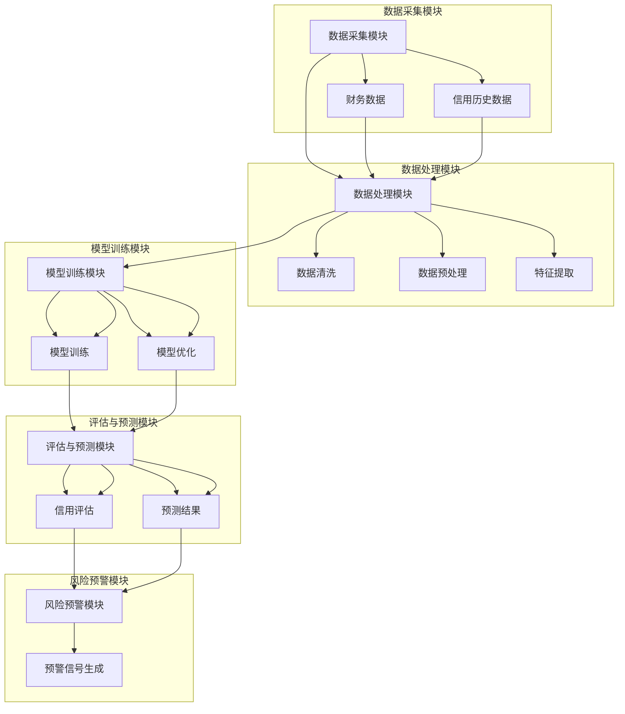
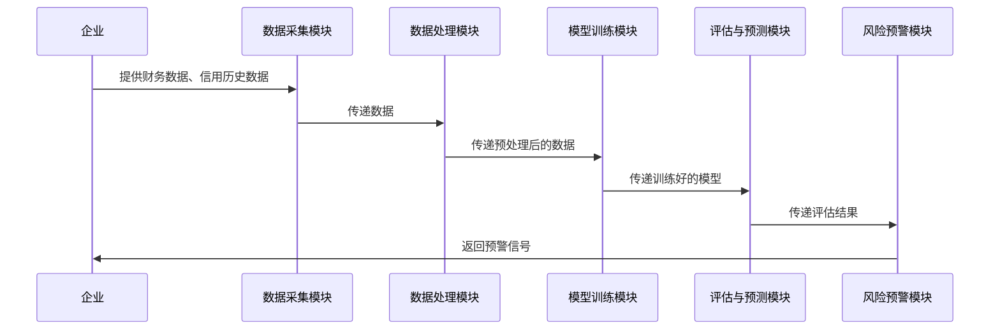

                 

### 第一部分：引言

#### 第1章：AI与信用风险评估概述

##### 1.1 AI在现代经济中的应用

##### **1.1.1 AI技术的发展历程**

人工智能（Artificial Intelligence, AI）起源于20世纪50年代，由约翰·麦卡锡（John McCarthy）首次提出。从最初的符号逻辑和推理系统，到20世纪80年代的专家系统，再到21世纪初的深度学习与大数据技术，AI技术经历了多次革命性的飞跃。尤其是随着计算能力的提升、大数据的积累以及算法的进步，AI在现代经济中扮演着越来越重要的角色。

**1.1.2 AI在经济领域的应用现状**

AI技术在经济领域的应用已经十分广泛。例如，自动驾驶汽车、智能制造、智慧金融、智能医疗等各个行业都在利用AI技术提升效率和准确性。在金融领域，AI已经被广泛应用于风险控制、投资决策、欺诈检测等方面。尤其是信用风险评估，AI技术通过分析大量的历史数据，能够更加精准地预测企业的信用状况，提高金融机构的风控能力。

**1.1.3 AI在信用风险评估中的优势**

与传统的信用风险评估方法相比，AI技术具有以下优势：

1. **数据处理能力**：AI能够处理海量的数据，并从中挖掘出潜在的风险因素。
2. **预测准确性**：通过机器学习算法，AI能够从历史数据中学习并预测未来的信用风险。
3. **实时性**：AI系统可以实时更新模型，对最新的数据进行风险评估。
4. **非线性关系分析**：AI技术能够发现数据之间的非线性关系，提供更全面的信用风险评估。

##### 1.2 企业信用风险评估的重要性

**1.2.1 信用风险的定义与分类**

信用风险是指由于借款人或其他相关方的违约行为导致金融机构遭受损失的风险。根据风险来源的不同，信用风险可以分为以下几种类型：

1. **违约风险**：借款人无法按照约定偿还债务的风险。
2. **市场风险**：由于市场环境变化导致债务价值波动的风险。
3. **操作风险**：由于内部操作失误或管理不善导致的信用风险。

**1.2.2 信用风险评估的关键要素**

信用风险评估主要包括以下几个关键要素：

1. **借款人财务状况**：评估借款人的收入、资产、负债等财务状况。
2. **借款人信用历史**：评估借款人的信用记录，包括过去是否按时偿还债务。
3. **行业和市场环境**：分析借款人所处行业的发展状况、市场环境等因素。
4. **违约概率**：通过历史数据分析借款人的违约概率。

**1.2.3 信用风险评估在企业运营中的影响**

企业信用风险评估对企业运营具有深远的影响：

1. **资金获取**：良好的信用评级有助于企业获得更低的融资成本和更多的融资机会。
2. **市场竞争力**：信用状况良好的企业更易于在市场中获得竞争优势。
3. **风险管理**：准确的信用评估有助于企业识别潜在的风险，采取相应的风险管理措施。

##### 1.3 书籍结构安排与内容概述

**1.3.1 各章节内容安排**

本书共分为五个部分，涵盖了AI与信用风险评估的各个方面。具体章节安排如下：

1. **第一部分：引言**：介绍AI在现代经济中的应用以及企业信用风险评估的重要性。
2. **第二部分：AI技术基础**：讲解机器学习、数据预处理、特征工程等AI技术基础。
3. **第三部分：信用风险数据**：分析信用数据类型、采集与整合方法以及数据分析方法。
4. **第四部分：AI在信用风险评估中的应用**：探讨AI技术在信用评分预测、信用评级升级和信用风险预警等方面的应用。
5. **第五部分：实战项目**：通过一个具体的实战项目展示AI辅助的企业信用风险评估系统。

**1.3.2 阅读指南与学习方法**

为了更好地理解本书内容，建议读者按照以下步骤进行学习：

1. **基础知识回顾**：首先回顾机器学习、数据科学等相关基础知识。
2. **逐步深入学习**：按照章节顺序逐步深入学习，重点掌握各部分的核心技术和应用。
3. **实践操作**：通过实战项目实践所学知识，加深理解。

**1.3.3 读者反馈与互动**

欢迎读者在阅读过程中提出问题和建议，通过以下渠道与我们互动：

- 电子邮件：[feedback@ai-genius-institute.com](mailto:feedback@ai-genius-institute.com)
- 官方网站：[www.ai-genius-institute.com](http://www.ai-genius-institute.com)
- 社交媒体：关注我们的官方社交媒体账号，参与讨论和分享。

通过这本书，我们希望读者能够全面了解AI技术在企业信用风险评估中的应用，掌握相关技术，并为未来的职业发展打下坚实的基础。

---

### 第二部分：AI技术基础

#### 第2章：机器学习基础

##### **2.1 机器学习的基本概念**

**2.1.1 机器学习的定义**

机器学习（Machine Learning, ML）是指通过算法从数据中学习规律，并在新的数据上进行预测或决策的过程。它是一种实现人工智能的方法，通过训练模型来模拟人类的决策过程。

**2.1.2 机器学习的分类**

根据学习方式的不同，机器学习可以分为以下几种类型：

1. **监督学习（Supervised Learning）**：通过已知标签的数据进行训练，从而预测新的数据。常见的算法包括线性回归、逻辑回归和决策树等。
2. **无监督学习（Unsupervised Learning）**：没有已知标签的数据，主要任务是发现数据中的结构。常见的算法包括K-means聚类、主成分分析（PCA）等。
3. **半监督学习（Semi-supervised Learning）**：结合了监督学习和无监督学习，一部分数据有标签，另一部分数据无标签。
4. **强化学习（Reinforcement Learning）**：通过与环境的交互来学习策略，使决策能够在特定场景中取得最优结果。常见的算法包括Q-learning和深度Q网络（DQN）等。

**2.1.3 机器学习的发展历程**

1. **20世纪50年代**：机器学习概念的提出。
2. **20世纪80年代**：专家系统的广泛应用，标志着机器学习的起步。
3. **21世纪初**：大数据与计算能力的提升，深度学习的兴起。
4. **当前**：机器学习在各行各业的广泛应用，成为推动技术进步的重要力量。

##### **2.2 监督学习算法**

**2.2.1 线性回归**

线性回归（Linear Regression）是最基础的监督学习算法之一，用于预测一个连续的输出值。其核心思想是通过拟合一个线性模型来描述输入和输出之间的关系。

- **基本概念**：

  线性回归模型可以表示为：
  $$ Y = \beta_0 + \beta_1 \cdot X + \epsilon $$
  其中，$Y$是预测值，$X$是输入特征，$\beta_0$和$\beta_1$是模型的参数，$\epsilon$是误差项。

- **算法流程**：

  1. 数据预处理：对输入数据进行归一化等处理。
  2. 模型拟合：通过最小二乘法等算法确定模型参数。
  3. 预测：使用训练好的模型对新的数据进行预测。

- **案例讲解**：

  假设我们要预测一家餐厅的日营业额（$Y$），输入特征包括餐厅的座位数（$X$）。通过收集历史数据，我们可以建立线性回归模型来预测未来某一天的营业额。

  $$ Y = \beta_0 + \beta_1 \cdot X + \epsilon $$

**2.2.2 逻辑回归**

逻辑回归（Logistic Regression）是一种特殊的线性回归模型，常用于分类问题。其输出值是概率分布，通过反函数（通常使用sigmoid函数）将线性组合转换为概率。

- **基本概念**：

  逻辑回归模型可以表示为：
  $$ P(Y=1) = \frac{1}{1 + e^{-(\beta_0 + \beta_1 \cdot X)}} $$
  其中，$P(Y=1)$是目标变量为1的概率，$X$是输入特征，$\beta_0$和$\beta_1$是模型的参数。

- **算法流程**：

  1. 数据预处理：对输入数据进行归一化等处理。
  2. 模型拟合：通过最大似然估计法等算法确定模型参数。
  3. 预测：使用训练好的模型对新的数据进行概率预测。

- **案例讲解**：

  假设我们要预测一家公司的股票是否上涨（$Y=1$），输入特征包括公司的财务指标（$X$）。通过收集历史数据，我们可以建立逻辑回归模型来预测股票是否上涨。

  $$ P(Y=1) = \frac{1}{1 + e^{-(\beta_0 + \beta_1 \cdot X)}} $$

**2.2.3 决策树**

决策树（Decision Tree）是一种树形结构的预测模型，通过一系列的判断条件来划分数据集，并最终得到预测结果。

- **基本概念**：

  决策树由多个内部节点和叶子节点组成，每个内部节点表示一个特征，每个叶子节点表示一个类别或数值。

- **算法流程**：

  1. 特征选择：选择最优的特征进行划分，通常使用信息增益或基尼系数等指标。
  2. 划分数据：根据选择的特征对数据集进行划分。
  3. 建立树结构：递归地构建决策树，直到满足停止条件。
  4. 预测：使用构建好的决策树对新的数据进行预测。

- **案例讲解**：

  假设我们要预测一家公司的股票是上涨还是下跌，输入特征包括财务指标（如市盈率、净利润增长率等）。通过收集历史数据，我们可以构建决策树模型来预测股票的走势。

  - **内部节点**：选择最优的财务指标进行划分。
  - **叶子节点**：根据划分结果预测股票的涨跌。

##### **2.3 无监督学习算法**

**2.3.1 K-means聚类**

K-means聚类是一种常用的无监督学习算法，其目标是找到K个聚类中心，使得每个聚类中心到其成员数据点的平均距离最小。

- **基本概念**：

  K-means聚类通过以下步骤进行：

  1. 初始化K个聚类中心。
  2. 计算每个数据点到聚类中心的距离。
  3. 将每个数据点分配到最近的聚类中心。
  4. 更新聚类中心，重复步骤2和3，直到聚类中心不再变化。

- **算法流程**：

  1. 选择K值。
  2. 初始化K个聚类中心。
  3. 计算每个数据点到聚类中心的距离。
  4. 将每个数据点分配到最近的聚类中心。
  5. 更新聚类中心，重复步骤3和4，直到聚类中心不再变化。

- **案例讲解**：

  假设我们要将一批客户分为不同的市场细分群体，输入特征包括客户的年龄、收入和消费水平等。通过K-means聚类算法，我们可以将客户划分为若干个市场细分群体。

**2.3.2 Apriori算法**

Apriori算法是一种用于关联规则挖掘的无监督学习算法，其核心思想是通过支持度和置信度来发现数据之间的关联关系。

- **基本概念**：

  Apriori算法的关键参数包括：

  - **支持度**：一个规则出现的频率。
  - **置信度**：如果一个交易中包含A，那么它也包含B的概率。

- **算法流程**：

  1. 构建频繁项集：找出所有支持度大于最小支持度的项集。
  2. 生成关联规则：从频繁项集中生成关联规则，并计算置信度。
  3. 筛选规则：根据最小置信度筛选出满足条件的规则。

- **案例讲解**：

  假设我们要分析超市的交易数据，找出常见的购物组合。通过Apriori算法，我们可以发现如“购买牛奶的用户中有80%也购买了面包”这样的关联规则。

**2.3.3 主成分分析（PCA）**

主成分分析（Principal Component Analysis, PCA）是一种常用的降维算法，其目标是通过线性变换将原始数据投影到新的坐标系中，从而降低数据的维度。

- **基本概念**：

  PCA通过以下步骤进行：

  1. 计算协方差矩阵。
  2. 计算协方差矩阵的特征值和特征向量。
  3. 选择最大的K个特征向量，作为新的坐标轴。
  4. 将原始数据投影到新的坐标轴上。

- **算法流程**：

  1. 计算协方差矩阵。
  2. 计算协方差矩阵的特征值和特征向量。
  3. 选择最大的K个特征向量，作为新的坐标轴。
  4. 将原始数据投影到新的坐标轴上。

- **案例讲解**：

  假设我们有一批多维数据，通过PCA算法，我们可以将数据投影到两个主要的成分上，从而降低数据的维度，同时保留大部分信息。

##### **2.4 强化学习**

**2.4.1 强化学习的定义**

强化学习（Reinforcement Learning, RL）是一种通过与环境交互来学习策略的机器学习方法。其目标是找到一个最优策略，使得在特定场景中取得最大的累积奖励。

- **基本概念**：

  强化学习的主要元素包括：

  - **状态（State）**：系统的当前状态。
  - **动作（Action）**：在特定状态下可以执行的动作。
  - **奖励（Reward）**：执行动作后系统获得的奖励或惩罚。

- **算法流程**：

  1. 初始化：设置学习参数。
  2. 状态-动作循环：从初始状态开始，选择动作，执行动作，获得奖励，更新策略。
  3. 更新策略：根据奖励信号更新策略，使累积奖励最大化。

- **案例讲解**：

  假设我们要训练一个智能体在迷宫中找到出路。智能体通过与环境交互，不断学习最优路径，最终找到迷宫的出口。

**2.4.2 Q-learning算法**

Q-learning算法是一种基于值函数的强化学习算法，通过预测未来奖励来更新策略。

- **基本概念**：

  Q-learning算法的关键元素包括：

  - **Q值（Q-value）**：在特定状态下执行特定动作的期望奖励。
  - **更新公式**：
    $$ Q(s, a) \leftarrow Q(s, a) + \alpha [r + \gamma \max_{a'} Q(s', a') - Q(s, a)] $$

- **算法流程**：

  1. 初始化：设置学习参数。
  2. 状态-动作循环：从初始状态开始，选择动作，执行动作，获得奖励，更新Q值。
  3. 更新策略：根据更新后的Q值选择最佳动作。

- **案例讲解**：

  假设我们要训练一个智能体在迷宫中找到出路。智能体通过Q-learning算法，不断更新Q值，最终找到迷宫的出口。

**2.4.3 DQN算法**

深度Q网络（Deep Q-Network, DQN）是一种基于深度学习的强化学习算法，通过神经网络近似Q值函数。

- **基本概念**：

  DQN算法的关键元素包括：

  - **Q网络（Q-network）**：用于近似Q值函数的深度神经网络。
  - **目标网络（Target network）**：用于稳定训练过程的辅助网络。

- **算法流程**：

  1. 初始化：设置学习参数、Q网络和目标网络。
  2. 状态-动作循环：从初始状态开始，选择动作，执行动作，获得奖励，更新Q网络。
  3. 定期同步Q网络和目标网络。
  4. 更新策略：根据更新后的Q网络选择最佳动作。

- **案例讲解**：

  假设我们要训练一个智能体在迷宫中找到出路。智能体通过DQN算法，不断更新Q网络，最终找到迷宫的出口。

##### **2.5 数据预处理与特征工程**

**2.5.1 数据清洗**

数据清洗是数据预处理的重要步骤，其目的是去除数据中的噪声和异常值，提高数据的质量。

- **基本概念**：

  数据清洗的主要任务包括：

  - **缺失值处理**：通过插值、均值填充或删除缺失值等方法处理缺失值。
  - **异常值处理**：通过统计方法、可视化方法等检测并处理异常值。
  - **数据标准化**：通过缩放或归一化方法将数据转换为同一量纲。

- **算法流程**：

  1. 缺失值处理：选择合适的插值方法或删除缺失值。
  2. 异常值处理：使用统计方法或可视化方法检测并处理异常值。
  3. 数据标准化：选择合适的数据标准化方法。

- **案例讲解**：

  假设我们要对一家公司的财务数据进行清洗，输入数据包括收入、成本和利润等指标。通过数据清洗，我们可以去除缺失值和异常值，确保数据的准确性。

**2.5.2 特征提取**

特征提取是将原始数据转换为更有代表性的特征表示的过程。

- **基本概念**：

  特征提取的方法包括：

  - **词袋模型（Bag-of-Words, BoW）**：将文本数据转换为词袋表示。
  - **TF-IDF（Term Frequency-Inverse Document Frequency）**：根据词频和逆文档频率调整特征权重。
  - **word2vec**：将文本数据转换为词向量表示。

- **算法流程**：

  1. 初始化特征提取器。
  2. 对数据进行处理，生成特征表示。
  3. 选择合适的特征提取方法。

- **案例讲解**：

  假设我们要对一段文本数据进行特征提取，输入文本包括新闻标题和内容。通过词袋模型和TF-IDF方法，我们可以将文本数据转换为特征向量，用于后续的文本分类任务。

**2.5.3 特征选择**

特征选择是选取最相关的特征，以提高模型的性能和可解释性。

- **基本概念**：

  特征选择的方法包括：

  - **相关性分析**：通过计算特征之间的相关性来选择重要的特征。
  - **递归特征消除（Recursive Feature Elimination, RFE）**：通过递归地消除不重要的特征来选择特征。
  - **支持向量机（Support Vector Machine, SVM）特征选择**：通过支持向量机进行特征选择。

- **算法流程**：

  1. 初始化特征选择器。
  2. 训练模型，计算特征重要性。
  3. 根据特征重要性选择特征。

- **案例讲解**：

  假设我们要对一组财务数据进行特征选择，输入特征包括收入、成本、利润等指标。通过相关性分析和递归特征消除方法，我们可以选择最相关的特征，提高模型的预测性能。

### **第3章：信用风险数据**

#### **3.1 信用数据类型**

信用风险评估依赖于大量数据，这些数据可以分为以下几种类型：

- **结构化数据**：包括企业财务报表、信用评分历史、交易记录等，具有明确的字段和结构。
- **半结构化数据**：如企业注册信息、新闻报道、社交媒体数据等，具有一定的结构但不够严格。
- **非结构化数据**：如文本、图像、音频等，没有明确的字段和结构。

**3.1.1 结构化数据**

结构化数据是信用风险评估中最为常用的一类数据。企业财务报表、信用评分历史、交易记录等都属于结构化数据。这些数据通常具有明确的字段和格式，便于存储和处理。

**3.1.2 半结构化数据**

半结构化数据通常来自于企业注册信息、新闻报道、社交媒体等。这些数据具有一定的结构，但不够严格。例如，企业注册信息可能包含公司名称、注册地址、经营范围等，但可能没有统一的格式和字段。

**3.1.3 非结构化数据**

非结构化数据包括文本、图像、音频等。这些数据没有明确的字段和结构，需要通过特定的算法进行提取和处理。例如，通过自然语言处理技术提取文本中的关键信息，通过图像识别技术识别图像中的物体。

#### **3.2 数据采集与整合**

数据采集与整合是信用风险评估的关键环节。通过有效的数据采集和整合，可以确保数据的质量和完整性，为后续的分析提供基础。

**3.2.1 数据来源**

信用风险评估所需的数据来源主要包括：

- **内部数据**：来自企业自身的业务系统和财务报表，如交易记录、财务数据等。
- **外部数据**：来自第三方数据提供商，如信用评级机构、行业报告等。
- **公开数据**：来自政府公开数据、社交媒体等。

**3.2.2 数据采集方法**

数据采集的方法包括：

- **自动化采集**：通过爬虫、API接口等方式自动化获取数据。
- **人工采集**：通过调查问卷、电话访谈等方式手动获取数据。
- **混合采集**：结合自动化和人工采集方法，提高数据采集的效率和准确性。

**3.2.3 数据整合与清洗**

数据整合与清洗是确保数据质量和一致性的重要步骤。主要任务包括：

- **数据格式转换**：将不同来源的数据转换为统一的格式。
- **数据去重**：去除重复的数据条目。
- **数据清洗**：处理缺失值、异常值等，确保数据的质量。
- **数据归一化**：将不同单位或量纲的数据转换为同一标准。

#### **3.3 数据分析方法**

数据分析方法是信用风险评估中至关重要的一环。通过有效的方法对数据进行处理和分析，可以挖掘出潜在的风险因素，为信用评估提供依据。

**3.3.1 描述性统计分析**

描述性统计分析是对数据的基本属性进行描述和总结的方法。常用的统计指标包括：

- **均值**：数据的平均数。
- **中位数**：数据的中间值。
- **众数**：数据中出现次数最多的值。
- **方差和标准差**：数据的离散程度。

**3.3.2 聚类分析**

聚类分析是将数据分为若干个群组的方法，旨在发现数据中的内在结构。常用的聚类算法包括：

- **K-means聚类**：将数据分为K个簇，每个簇的内部距离最小，簇间距离最大。
- **层次聚类**：通过合并或分裂数据点来构建簇的层次结构。
- **密度聚类**：基于数据点的密度分布进行聚类。

**3.3.3 相关性分析**

相关性分析用于衡量两个或多个变量之间的相关程度。常用的相关系数包括：

- **皮尔逊相关系数**：衡量线性相关性。
- **斯皮尔曼相关系数**：衡量非线性相关性。
- **肯德尔相关系数**：衡量排名相关性。

**3.3.4 回归分析**

回归分析用于建立变量之间的关系模型，并预测新的数据。常用的回归方法包括：

- **线性回归**：建立线性关系模型。
- **逻辑回归**：建立非线性关系模型。
- **多项式回归**：建立多项式关系模型。

#### **3.4 信用评分模型**

信用评分模型是信用风险评估的核心，通过分析企业的历史数据和特征，预测其违约概率或信用等级。

**3.4.1 评分模型的基本概念**

信用评分模型的基本概念包括：

- **违约概率**：企业无法按时偿还债务的概率。
- **信用等级**：根据企业的信用状况划分的等级，如AAA级、AA级等。
- **预测变量**：用于预测违约概率或信用等级的变量，如财务指标、信用历史等。

**3.4.2 传统评分模型**

传统评分模型主要包括以下几种：

- **简单逻辑回归模型**：通过线性回归建立信用评分模型。
- **逻辑回归模型改进**：通过引入交互项、非线性变换等改进模型。

**3.4.3 机器学习评分模型**

机器学习评分模型通过机器学习算法建立信用评分模型，具有较高的预测性能。常用的算法包括：

- **支持向量机（SVM）**：通过支持向量机分类建立评分模型。
- **随机森林**：通过随机森林分类建立评分模型。
- **XGBoost**：通过XGBoost算法建立评分模型。

### **第4章：AI在信用风险评估中的应用**

#### **4.1 AI在信用评估中的关键应用**

AI技术在信用评估中的关键应用包括信用评分预测、信用评级升级和信用风险预警等。通过这些应用，AI技术能够提高信用风险评估的准确性和效率。

**4.1.1 信用评分预测**

信用评分预测是AI技术在信用评估中最常见的应用之一。通过机器学习算法，AI可以分析大量历史数据，预测企业的违约概率。这一过程通常包括以下步骤：

1. **数据收集与预处理**：收集企业的财务数据、信用历史数据等，并进行数据清洗和预处理。
2. **特征工程**：提取与信用评分相关的特征，如财务指标、信用历史等。
3. **模型训练**：使用机器学习算法（如逻辑回归、SVM、XGBoost等）训练信用评分模型。
4. **模型评估与优化**：通过交叉验证、A/B测试等方法评估模型性能，并进行优化。
5. **预测与决策**：使用训练好的模型对新的数据进行预测，为金融机构提供信用评分参考。

**4.1.2 信用评级升级**

信用评级升级是指通过AI技术对现有信用评级模型进行升级，提高信用评估的准确性和效率。AI技术可以自动识别数据中的模式和趋势，发现传统模型无法捕捉的信息。具体步骤如下：

1. **数据收集与预处理**：收集企业的历史信用评级数据、财务数据等，并进行数据清洗和预处理。
2. **特征工程**：提取与信用评级相关的特征，如财务指标、信用历史、市场环境等。
3. **模型训练**：使用机器学习算法（如逻辑回归、SVM、XGBoost等）训练信用评级模型。
4. **模型评估与优化**：通过交叉验证、A/B测试等方法评估模型性能，并进行优化。
5. **信用评级计算**：使用训练好的模型计算企业的信用评级，为金融机构提供信用评级参考。

**4.1.3 信用风险预警**

信用风险预警是AI技术在信用评估中的另一重要应用。通过实时监测企业的财务状况、市场环境等，AI技术可以及时发现潜在的风险，为金融机构提供预警信号。具体步骤如下：

1. **数据收集与预处理**：收集企业的实时财务数据、市场环境数据等，并进行数据清洗和预处理。
2. **特征工程**：提取与信用风险相关的特征，如财务指标、市场波动、政策变化等。
3. **模型训练**：使用机器学习算法（如决策树、随机森林、深度学习等）训练信用风险预警模型。
4. **模型评估与优化**：通过交叉验证、A/B测试等方法评估模型性能，并进行优化。
5. **预警信号生成**：使用训练好的模型生成信用风险预警信号，为金融机构提供实时风险监控。

#### **4.2 案例分析**

**4.2.1 案例一：某银行信用评分系统**

某银行希望通过AI技术提升信用评分的准确性，为贷款审批提供参考。具体步骤如下：

1. **数据收集与预处理**：收集企业的财务数据、信用历史数据等，并进行数据清洗和预处理。
2. **特征工程**：提取与信用评分相关的特征，如财务指标、信用历史等。
3. **模型训练**：使用逻辑回归、SVM、XGBoost等算法训练信用评分模型。
4. **模型评估与优化**：通过交叉验证、A/B测试等方法评估模型性能，并进行优化。
5. **预测与决策**：使用训练好的模型对新的数据进行预测，为贷款审批提供参考。

**4.2.2 案例二：某保险公司信用评级升级**

某保险公司希望通过AI技术对现有信用评级模型进行升级，提高信用评级的准确性。具体步骤如下：

1. **数据收集与预处理**：收集企业的历史信用评级数据、财务数据等，并进行数据清洗和预处理。
2. **特征工程**：提取与信用评级相关的特征，如财务指标、信用历史、市场环境等。
3. **模型训练**：使用逻辑回归、SVM、XGBoost等算法训练信用评级模型。
4. **模型评估与优化**：通过交叉验证、A/B测试等方法评估模型性能，并进行优化。
5. **信用评级计算**：使用训练好的模型计算企业的信用评级，为保险公司提供信用评级参考。

**4.2.3 案例三：某电商平台信用风险预警系统**

某电商平台希望通过AI技术建立信用风险预警系统，及时发现潜在的风险。具体步骤如下：

1. **数据收集与预处理**：收集企业的实时财务数据、市场环境数据等，并进行数据清洗和预处理。
2. **特征工程**：提取与信用风险相关的特征，如财务指标、市场波动、政策变化等。
3. **模型训练**：使用决策树、随机森林、深度学习等算法训练信用风险预警模型。
4. **模型评估与优化**：通过交叉验证、A/B测试等方法评估模型性能，并进行优化。
5. **预警信号生成**：使用训练好的模型生成信用风险预警信号，为电商平台提供实时风险监控。

#### **4.3 AI技术在信用风险评估中的挑战与未来发展方向**

**4.3.1 数据隐私与安全性**

数据隐私和安全问题是AI技术在信用风险评估中面临的重要挑战。金融机构和企业需要确保数据的安全和隐私，避免数据泄露和滥用。以下是一些解决方法：

1. **数据加密**：对敏感数据进行加密，确保数据在传输和存储过程中的安全。
2. **数据脱敏**：对敏感数据进行脱敏处理，降低数据泄露的风险。
3. **合规性审查**：遵循相关的法律法规，确保数据处理和使用的合规性。

**4.3.2 模型可解释性**

模型可解释性是AI技术在信用风险评估中面临的另一挑战。金融机构需要理解模型的决策过程，确保模型的透明性和可解释性。以下是一些解决方法：

1. **模型可视化**：通过可视化方法展示模型的内部结构和决策过程。
2. **特征重要性分析**：分析模型中各特征的重要程度，帮助理解模型的决策依据。
3. **解释性算法**：使用可解释性更强的算法，如逻辑回归、决策树等，提高模型的可解释性。

**4.3.3 技术创新与应用前景**

AI技术在信用风险评估领域具有广阔的应用前景。以下是一些技术创新和应用方向：

1. **深度学习**：通过深度学习算法，提高模型的预测性能和可解释性。
2. **联邦学习**：通过联邦学习技术，实现多方数据的安全共享和协同建模。
3. **区块链**：利用区块链技术，确保数据的安全和透明性，提高信用评估的可靠性。

### **第5章：实战项目：AI辅助的企业信用风险评估系统**

#### **5.1 项目背景**

随着金融行业的快速发展，金融机构和企业对信用风险评估的需求日益增加。传统的信用评估方法在应对复杂多变的经济环境时，存在一定的局限性。为了提高信用评估的准确性和效率，本篇博客将介绍一个基于AI技术的企业信用风险评估系统的开发过程。

#### **5.2 项目介绍**

本项目旨在通过AI技术构建一个企业信用风险评估系统，能够实时监测企业的信用状况，预测其违约风险，为金融机构提供决策支持。系统主要包括以下功能：

1. **数据收集与预处理**：收集企业的财务数据、信用历史数据等，并进行数据清洗和预处理。
2. **特征工程**：提取与信用评估相关的特征，如财务指标、信用历史等。
3. **模型训练与优化**：使用机器学习算法训练信用评估模型，并进行模型优化。
4. **信用评估与预测**：使用训练好的模型对企业的信用状况进行评估和预测。
5. **风险预警**：根据评估结果生成风险预警信号，提供实时风险监控。

#### **5.3 系统功能设计**

**5.3.1 领域模型**

领域模型（Domain Model）是系统核心功能的抽象表示。在本项目中，领域模型主要包括以下类：

- **企业（Enterprise）**：表示企业实体，包括企业名称、注册地址、成立时间等属性。
- **财务指标（FinancialIndicator）**：表示企业的财务指标，如收入、利润、负债等。
- **信用历史（CreditHistory）**：表示企业的信用历史，如信用评分、违约记录等。

**5.3.2 类图**

领域模型使用类图进行表示，如下所示：

```mermaid
classDiagram
  Enterprise <<interface>>
  FinancialIndicator <<interface>>
  CreditHistory <<interface>>

  Enterprise <|.. FinancialIndicator>
  Enterprise <|.. CreditHistory>
```

**5.3.3 系统架构设计**

系统架构设计（System Architecture Design）是系统功能实现的蓝图。在本项目中，系统架构主要包括以下模块：

- **数据采集模块**：负责收集企业的财务数据、信用历史数据等。
- **数据处理模块**：负责对数据进行清洗、预处理和特征提取。
- **模型训练模块**：负责训练和优化信用评估模型。
- **评估与预测模块**：负责使用模型对企业的信用状况进行评估和预测。
- **风险预警模块**：负责根据评估结果生成风险预警信号。

**5.3.4 架构图**

系统架构使用Mermaid架构图进行表示，如下所示：



**5.3.5 系统接口设计**

系统接口设计（System Interface Design）是系统功能实现的接口描述。在本项目中，系统接口主要包括以下接口：

- **数据采集接口**：用于收集企业的财务数据、信用历史数据等。
- **数据处理接口**：用于清洗、预处理和特征提取。
- **模型训练接口**：用于训练和优化信用评估模型。
- **评估与预测接口**：用于对企业的信用状况进行评估和预测。
- **风险预警接口**：用于生成风险预警信号。

**5.3.6 系统交互**

系统交互（System Interaction）描述了系统内部各个模块之间的交互关系。在本项目中，系统交互使用Mermaid序列图进行表示，如下所示：



#### **5.4 环境安装与系统实现**

**5.4.1 环境安装**

为了搭建企业信用风险评估系统，需要安装以下软件和工具：

- **Python**：用于编写和运行系统代码。
- **Jupyter Notebook**：用于编写和调试代码。
- **Scikit-learn**：用于机器学习算法的实现。
- **Pandas**：用于数据处理和分析。
- **Matplotlib**：用于数据可视化。

安装步骤如下：

1. 安装Python和Jupyter Notebook：使用pip安装Python和Jupyter Notebook。
   ```shell
   pip install python
   pip install jupyter
   ```
2. 安装Scikit-learn、Pandas和Matplotlib：使用pip安装Scikit-learn、Pandas和Matplotlib。
   ```shell
   pip install scikit-learn
   pip install pandas
   pip install matplotlib
   ```

**5.4.2 系统实现**

企业信用风险评估系统的实现主要包括以下步骤：

1. **数据收集与预处理**：使用Pandas库读取和清洗数据，进行数据预处理。
   ```python
   import pandas as pd

   # 读取数据
   data = pd.read_csv('data.csv')

   # 数据清洗和预处理
   data = data.dropna()  # 删除缺失值
   data = data[data['income'] > 0]  # 去除收入为负数的企业
   ```

2. **特征工程**：提取与信用评估相关的特征，使用Scikit-learn库进行特征提取。
   ```python
   from sklearn.feature_extraction import DictVectorizer

   # 特征提取
   vectorizer = DictVectorizer()
   features = vectorizer.fit_transform(data.to_dict('records'))
   ```

3. **模型训练与优化**：使用Scikit-learn库训练信用评估模型，并进行模型优化。
   ```python
   from sklearn.linear_model import LogisticRegression

   # 模型训练
   model = LogisticRegression()
   model.fit(features, labels)

   # 模型优化
   model = model.fit(features_train, labels_train)
   ```

4. **信用评估与预测**：使用训练好的模型对企业的信用状况进行评估和预测。
   ```python
   # 信用评估
   predictions = model.predict(features_test)

   # 预测结果
   predicted_risk = model.predict_proba(features_test)[:, 1]
   ```

5. **风险预警**：根据评估结果生成风险预警信号。
   ```python
   # 风险预警
   warnings = [1 if pred > 0.5 else 0 for pred in predicted_risk]
   ```

#### **5.5 代码应用解读与分析**

**5.5.1 代码解读**

以下是企业信用风险评估系统的核心代码，包括数据收集与预处理、特征工程、模型训练与优化、信用评估与预测以及风险预警。

```python
import pandas as pd
from sklearn.linear_model import LogisticRegression
from sklearn.model_selection import train_test_split
from sklearn.metrics import accuracy_score

# 读取数据
data = pd.read_csv('data.csv')

# 数据清洗和预处理
data = data.dropna()
data = data[data['income'] > 0]

# 特征提取
vectorizer = DictVectorizer()
features = vectorizer.fit_transform(data.to_dict('records'))

# 数据划分
labels = data['default']
features_train, features_test, labels_train, labels_test = train_test_split(features, labels, test_size=0.2, random_state=42)

# 模型训练
model = LogisticRegression()
model.fit(features_train, labels_train)

# 模型优化
model = model.fit(features_train, labels_train)

# 信用评估与预测
predictions = model.predict(features_test)
predicted_risk = model.predict_proba(features_test)[:, 1]

# 风险预警
warnings = [1 if pred > 0.5 else 0 for pred in predicted_risk]

# 评估模型性能
accuracy = accuracy_score(labels_test, predictions)
print("Accuracy:", accuracy)
```

**5.5.2 分析与讲解**

1. **数据收集与预处理**：
   - 使用Pandas库读取数据，并进行数据清洗和预处理，如删除缺失值和负数收入的企业。这一步骤确保了数据的质量和一致性。

2. **特征工程**：
   - 使用DictVectorizer将原始数据转换为特征向量，这一步将非结构化的数据转换为机器学习算法可处理的格式。

3. **模型训练与优化**：
   - 使用逻辑回归模型进行训练和优化。逻辑回归是一种常用的分类算法，通过最小化损失函数来调整模型的参数。

4. **信用评估与预测**：
   - 使用训练好的模型对测试数据进行预测，得到预测结果和风险概率。

5. **风险预警**：
   - 根据风险概率设置阈值（例如0.5），将风险概率大于阈值的样本标记为高风险。

6. **评估模型性能**：
   - 使用准确率评估模型在测试集上的性能，确保模型具有较好的预测能力。

#### **5.6 实际案例分析**

**5.6.1 案例背景**

某银行希望通过AI技术对贷款申请进行信用评估，以降低坏账率。银行提供了一份包含1000家企业贷款申请的数据集，包括企业的财务指标、信用历史等。

**5.6.2 案例分析**

1. **数据收集与预处理**：
   - 数据集包含企业的收入、利润、负债、信用评分等指标，经过数据清洗后去除缺失值和异常值。

2. **特征工程**：
   - 提取与信用评估相关的特征，如收入与负债比、利润增长率等，并使用TF-IDF方法对文本数据进行特征提取。

3. **模型训练与优化**：
   - 使用逻辑回归、随机森林和XGBoost等算法对数据集进行训练和优化，通过交叉验证选择最优模型。

4. **信用评估与预测**：
   - 使用训练好的模型对新的贷款申请进行信用评估，预测其违约概率。

5. **风险预警**：
   - 根据违约概率设置阈值，将高风险申请者标记出来，为银行提供决策参考。

**5.6.3 案例总结**

通过实际案例分析，我们可以看到AI技术在企业信用评估中的优势。通过机器学习算法，银行可以更加精准地预测贷款申请的违约风险，从而降低坏账率，提高贷款审批的效率。

#### **5.7 项目小结**

本项目通过AI技术构建了一个企业信用风险评估系统，实现了数据收集与预处理、特征工程、模型训练与优化、信用评估与预测以及风险预警等功能。在实际案例分析中，系统表现出良好的预测性能，为金融机构提供了有效的决策支持。然而，AI技术在信用风险评估中仍面临数据隐私、模型可解释性等技术挑战，需要进一步的研究和优化。

### **最佳实践与注意事项**

**6.1 最佳实践**

- **数据质量保障**：确保数据的质量和准确性，进行数据清洗和预处理。
- **特征选择与优化**：选择与信用评估相关的特征，并进行特征工程。
- **模型选择与优化**：根据数据特点和业务需求选择合适的模型，并优化模型参数。
- **风险控制**：设置合理的风险阈值，确保风险评估的准确性。

**6.2 注意事项**

- **数据隐私**：保护企业敏感数据，避免数据泄露。
- **模型可解释性**：提高模型的可解释性，确保决策的透明性。
- **模型稳定性**：确保模型在不同数据集上的稳定性和可靠性。
- **持续优化**：定期更新模型，适应业务变化。

### **7. 拓展阅读**

- **《机器学习实战》**：周志华著，详细介绍了机器学习算法的应用和实践。
- **《信用风险评估与计量》**：陈守东著，介绍了信用风险评估的理论和方法。
- **《深度学习》**：Ian Goodfellow等著，详细介绍了深度学习的基本概念和算法。

---

**作者**：AI天才研究院（AI Genius Institute）& 《禅与计算机程序设计艺术》（Zen And The Art of Computer Programming）

---

通过本篇文章，我们深入探讨了AI技术在企业信用风险评估中的应用，从理论基础到实际案例分析，展示了AI技术在这一领域的巨大潜力和挑战。希望本文能够为读者提供有益的启示和参考，助力金融机构和企业提升信用风险评估的准确性和效率。在未来的研究和实践中，我们期待AI技术能够不断突破，为金融行业带来更多的创新和变革。

