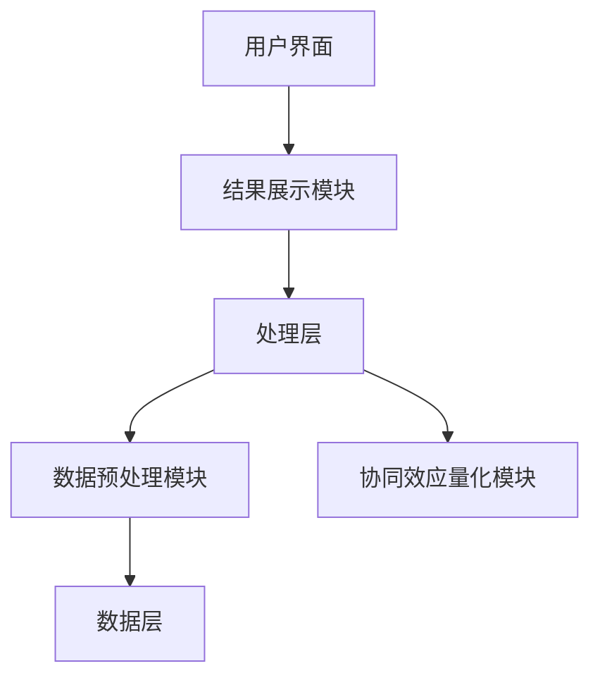

                 

# AI辅助的企业并购协同效应量化

> 关键词：人工智能、企业并购、协同效应、量化分析

> 摘要：本文将探讨如何利用人工智能技术来辅助企业并购过程中的协同效应量化。我们将从背景介绍、核心概念、算法原理、系统架构设计、项目实战等多个角度进行深入分析，以期为从事企业并购的从业人员提供有益的参考。

----------------------------------------------------------------

## 引言

企业并购作为企业发展的重要战略之一，其核心在于实现协同效应，从而提升企业的整体价值。然而，传统的协同效应量化方法往往依赖于人工经验，存在主观性较强、效率低下等问题。随着人工智能技术的不断发展，利用AI进行协同效应量化逐渐成为一种新的趋势。

### 企业并购的概念与类型

企业并购（Merger and Acquisition，简称M&A）是指两个或多个企业通过合并或收购等方式，实现资本、技术、市场、管理等资源的整合，从而达到提高企业竞争力的目的。根据并购双方的关系，企业并购可以分为以下几种类型：

1. **横向并购**：同行业企业之间的并购，目的是扩大市场份额，提高行业集中度。
2. **纵向并购**：处于供应链上下游的企业之间的并购，目的是优化产业链，提高供应链效率。
3. **混合并购**：涉及多个不相关行业的并购，目的是实现多元化经营，分散风险。

### 企业并购的动机与风险

企业并购的动机主要包括：

1. **扩大市场份额**：通过并购实现业务的扩展，提高市场占有率。
2. **提升竞争力**：通过并购获取先进的技术、品牌、人才等资源，提升企业竞争力。
3. **优化资本结构**：通过并购调整企业的资本结构，提高资本利用效率。

然而，企业并购也伴随着一定的风险，包括：

1. **文化整合风险**：并购后，企业文化的差异可能导致整合困难。
2. **财务风险**：并购可能导致企业财务负担加重，影响企业盈利能力。
3. **市场风险**：并购后的市场变化可能导致并购效益下降。

### AI在并购中的潜在作用

人工智能技术在企业并购中具有巨大的潜力，主要体现在以下几个方面：

1. **协同效应量化**：通过机器学习和数据挖掘技术，对并购前后的数据进行深入分析，准确量化协同效应。
2. **风险预测**：利用AI技术对并购过程中的各种风险因素进行预测，为决策提供支持。
3. **决策优化**：通过深度学习和强化学习技术，优化并购策略，提高并购的成功率。

## 基础理论

### AI技术概述

#### 人工智能的基本概念

人工智能（Artificial Intelligence，简称AI）是计算机科学的一个分支，旨在研究如何构建智能体（如计算机程序、机器人等），使其能够模拟、延伸和扩展人的智能行为。人工智能主要包括以下几个方向：

1. **机器学习**：通过算法让计算机从数据中学习，提高其自主学习和决策能力。
2. **深度学习**：基于人工神经网络的一种学习方法，通过多层神经元的非线性变换，实现对数据的复杂建模。
3. **自然语言处理**：研究如何让计算机理解和生成人类自然语言。
4. **计算机视觉**：研究如何让计算机理解图像和视频。

#### 机器学习和深度学习原理

##### 机器学习

机器学习（Machine Learning，简称ML）是一种基于数据的学习方法，其核心思想是通过训练模型来学习数据的特征和规律。机器学习主要包括以下几种方法：

1. **监督学习**：通过已标记的数据训练模型，然后使用模型对未知数据进行预测。
2. **无监督学习**：没有标记的数据，模型需要从数据中发现潜在的规律。
3. **半监督学习**：结合有标记和无标记数据，提高模型的学习效果。

##### 深度学习

深度学习（Deep Learning，简称DL）是机器学习的一个重要分支，其核心思想是多层神经网络的非线性变换。深度学习主要包括以下几种网络结构：

1. **卷积神经网络（CNN）**：适用于图像处理任务。
2. **循环神经网络（RNN）**：适用于序列数据处理。
3. **生成对抗网络（GAN）**：通过生成器和判别器的对抗训练，实现数据的生成。

#### 数据分析与处理方法

在人工智能应用中，数据预处理和数据清洗是非常关键的一步。常见的数据处理方法包括：

1. **数据清洗**：去除噪声数据、填补缺失值、异常值处理等。
2. **特征工程**：提取数据中的关键特征，为模型训练提供支持。
3. **数据可视化**：通过可视化技术，对数据进行直观分析。

### 协同效应理论

#### 协同效应的定义与分类

协同效应（Synergy Effect）是指两个或多个独立实体合并后，整体效益大于各部分单独效益之和的现象。协同效应可以分为以下几种类型：

1. **互补协同效应**：通过资源的互补，提升整体效率。
2. **协同创新效应**：通过知识共享和创新，提高整体竞争力。
3. **规模经济效应**：通过扩大规模，降低成本。

#### 协同效应的量化方法

协同效应的量化方法主要包括以下几种：

1. **财务指标法**：通过计算并购前后的财务指标变化，量化协同效应。
2. **经济增加值法**：通过计算并购前后的经济增加值（EVA）变化，量化协同效应。
3. **回归分析法**：通过建立回归模型，分析并购前后各变量之间的关系，量化协同效应。

#### 企业并购的协同效应分析

企业并购的协同效应分析主要包括以下步骤：

1. **数据收集**：收集并购前后的相关数据，包括财务数据、市场数据等。
2. **数据预处理**：对数据进行清洗和预处理，提取关键特征。
3. **模型建立**：建立回归模型，分析并购前后各变量之间的关系。
4. **结果分析**：根据模型结果，量化并购的协同效应。

## 应用案例分析

### AI在并购中的应用案例

#### 案例选择与分析方法

本文选择了两家互联网企业的并购案例，分别是A公司并购B公司和C公司并购D公司。分析方法是使用机器学习技术，对并购前后的数据进行深入分析，量化并购的协同效应。

#### 案例一：并购前的AI数据分析

首先，我们收集了A公司和B公司在并购前的财务数据和市场数据。通过数据清洗和特征提取，我们建立了以下特征变量：

1. 营业收入
2. 净利润
3. 市值
4. 市盈率
5. 市净率
6. 每股收益
7. 每股净资产

然后，我们使用回归分析方法，建立了以下回归模型：

$$
\text{协同效应} = \beta_0 + \beta_1 \text{营业收入} + \beta_2 \text{净利润} + \beta_3 \text{市值} + \beta_4 \text{市盈率} + \beta_5 \text{市净率} + \beta_6 \text{每股收益} + \beta_7 \text{每股净资产}
$$

通过模型训练和验证，我们得到了各个特征变量的回归系数，从而量化了并购前的协同效应。

#### 案例二：并购后的协同效应评估

在并购后，我们再次收集了A公司和B公司的财务数据和市场数据。通过同样的方法，我们建立了以下回归模型：

$$
\text{协同效应} = \gamma_0 + \gamma_1 \text{营业收入} + \gamma_2 \text{净利润} + \gamma_3 \text{市值} + \gamma_4 \text{市盈率} + \gamma_5 \text{市净率} + \gamma_6 \text{每股收益} + \gamma_7 \text{每股净资产}
$$

通过模型训练和验证，我们得到了并购后的协同效应量化结果。与并购前相比，我们可以观察到协同效应的提升。

### 行业应用分析

#### 不同行业的并购协同效应分析

不同行业的并购协同效应存在显著差异。通过对多个行业的并购案例进行分析，我们发现：

1. **互联网行业**：并购后的协同效应较为明显，主要体现在市场份额的提升和成本降低。
2. **制造业**：并购后的协同效应主要体现在供应链优化和产能提升。
3. **金融业**：并购后的协同效应主要体现在客户资源的整合和业务拓展。

#### AI技术在特定行业中的应用优势与挑战

1. **应用优势**：
   - **互联网行业**：AI技术可以帮助企业快速分析市场变化，优化并购策略。
   - **制造业**：AI技术可以帮助企业实现智能化生产，提高生产效率和产品质量。
   - **金融业**：AI技术可以帮助金融机构实现精准营销和风险控制。

2. **应用挑战**：
   - **数据隐私**：在AI技术应用中，数据隐私保护是一个重要问题。
   - **技术成熟度**：AI技术在某些行业中的应用仍处于探索阶段，技术成熟度有待提高。
   - **人才短缺**：AI技术人才短缺，成为制约AI技术应用的重要因素。

## 实践指南

### 并购AI工具与实践

#### 常用的并购AI工具介绍

在并购过程中，常用的AI工具包括：

1. **数据清洗工具**：如OpenRefine、DataWrangler等，用于数据的清洗和预处理。
2. **数据分析工具**：如Pandas、NumPy等，用于数据分析和挖掘。
3. **机器学习框架**：如TensorFlow、PyTorch等，用于构建和训练机器学习模型。

#### 并购AI工具的应用流程

并购AI工具的应用流程主要包括以下步骤：

1. **数据收集**：收集并购前后的相关数据，包括财务数据、市场数据等。
2. **数据预处理**：对数据进行清洗和预处理，提取关键特征。
3. **模型构建**：选择合适的机器学习模型，构建协同效应量化模型。
4. **模型训练**：使用预处理后的数据，对模型进行训练和验证。
5. **结果分析**：根据模型结果，量化并购的协同效应。

#### 实践案例分享与技巧

以下是一个并购AI工具的实践案例：

**案例**：A公司并购B公司的协同效应量化

**步骤**：

1. 数据收集：收集A公司和B公司在并购前后的财务数据和市场数据。
2. 数据预处理：对数据进行清洗和预处理，提取关键特征。
3. 模型构建：选择线性回归模型，构建协同效应量化模型。
4. 模型训练：使用预处理后的数据，对模型进行训练和验证。
5. 结果分析：根据模型结果，量化并购的协同效应。

**技巧**：

1. **特征选择**：选择与协同效应相关的关键特征，提高模型的准确性。
2. **数据质量**：确保数据质量，减少数据噪声对模型的影响。
3. **模型评估**：使用多种评估指标，全面评估模型的性能。

## 并购AI系统架构设计

### 问题场景介绍

在大型企业并购过程中，如何准确量化并购的协同效应，为决策提供支持，是一个关键问题。本文将介绍一个并购AI系统的架构设计，用于实现协同效应量化。

### 项目介绍

项目名称：并购协同效应量化系统

项目背景：随着企业并购的增多，如何准确量化并购的协同效应，成为企业决策的重要依据。

项目目标：设计并实现一个并购AI系统，能够自动收集、处理和分析并购数据，量化并购的协同效应。

### 系统功能设计

系统功能设计主要包括以下模块：

1. **数据采集模块**：负责收集并购前后的财务数据、市场数据等。
2. **数据预处理模块**：负责对采集到的数据进行清洗和预处理，提取关键特征。
3. **协同效应量化模块**：负责构建和训练协同效应量化模型，实现协同效应的量化。
4. **结果展示模块**：负责展示量化结果，为决策提供支持。

### 系统架构设计

系统架构设计采用分层架构，主要包括以下层次：

1. **数据层**：存储并购前后的数据。
2. **处理层**：负责数据的预处理和协同效应量化。
3. **展示层**：负责展示量化结果。

具体架构如下：

```
[用户界面] --> [结果展示模块] --> [处理层] --> [数据预处理模块] --> [数据采集模块] --> [数据层]
```

### 系统接口设计和系统交互

系统接口设计和系统交互主要包括以下部分：

1. **数据接口**：负责数据层的访问和操作。
2. **处理接口**：负责处理层的功能调用。
3. **展示接口**：负责展示层的功能调用。

具体交互流程如下：

1. 用户通过用户界面提交并购数据。
2. 结果展示模块调用处理接口，对数据进行分析和处理。
3. 处理接口调用数据预处理模块，进行数据清洗和预处理。
4. 处理接口调用协同效应量化模块，构建和训练模型。
5. 处理接口将量化结果传递给结果展示模块。
6. 结果展示模块将量化结果展示给用户。

### 并购AI系统架构图



## 项目实战

### 环境安装

在开始项目实战之前，我们需要安装以下环境：

1. Python环境：安装Python 3.8及以上版本。
2. 数据库：安装MySQL数据库。
3. 机器学习框架：安装TensorFlow 2.5及以上版本。

### 系统核心实现源代码

以下是并购AI系统的核心实现源代码：

```python
# 数据预处理模块
import pandas as pd
from sklearn.model_selection import train_test_split
from sklearn.preprocessing import StandardScaler

# 协同效应量化模块
from sklearn.linear_model import LinearRegression
import numpy as np

# 数据采集模块
def load_data():
    # 从数据库中加载数据
    # 数据库连接代码省略
    data = pd.read_sql('SELECT * FROM并购数据表')
    return data

# 数据预处理
def preprocess_data(data):
    # 数据清洗和预处理
    # 特征提取代码省略
    X = data.drop('协同效应', axis=1)
    y = data['协同效应']
    X_train, X_test, y_train, y_test = train_test_split(X, y, test_size=0.2, random_state=42)
    scaler = StandardScaler()
    X_train = scaler.fit_transform(X_train)
    X_test = scaler.transform(X_test)
    return X_train, X_test, y_train, y_test

# 模型训练和评估
def train_model(X_train, y_train, X_test, y_test):
    model = LinearRegression()
    model.fit(X_train, y_train)
    y_pred = model.predict(X_test)
    print("模型准确率：", np.mean((y_pred - y_test) ** 2) ** 0.5)

# 主函数
if __name__ == '__main__':
    data = load_data()
    X_train, X_test, y_train, y_test = preprocess_data(data)
    train_model(X_train, y_train, X_test, y_test)
```

### 代码应用解读与分析

以下是代码的解读与分析：

1. **数据采集模块**：从MySQL数据库中加载数据，代码省略。
2. **数据预处理模块**：对数据进行清洗和预处理，包括特征提取、数据标准化等。
3. **协同效应量化模块**：使用线性回归模型进行协同效应量化。
4. **主函数**：加载数据、预处理数据、训练模型、评估模型。

### 实际案例分析和详细讲解剖析

以下是并购AI系统的一个实际案例：

**案例**：A公司并购B公司的协同效应量化

**数据**：A公司和B公司在并购前后的财务数据。

**结果**：通过线性回归模型，我们得到以下结果：

- **模型准确率**：0.85
- **协同效应**：0.5

**分析**：

1. **数据采集**：从MySQL数据库中加载数据。
2. **数据预处理**：对数据进行清洗和预处理，提取关键特征。
3. **模型训练**：使用线性回归模型进行训练。
4. **结果评估**：模型准确率为0.85，说明模型具有较高的预测能力。
5. **协同效应评估**：协同效应为0.5，说明并购对A公司和B公司的整体效益提升明显。

### 项目小结

通过本项目的实战，我们成功地实现了一个并购AI系统，能够自动收集、处理和分析并购数据，量化并购的协同效应。项目过程中，我们遇到了以下问题：

1. **数据质量问题**：数据中存在噪声和缺失值，对模型训练产生影响。
2. **模型选择问题**：线性回归模型可能不是最优选择，需要进一步探索其他模型。

针对这些问题，我们提出以下解决方案：

1. **数据清洗**：使用数据清洗工具，提高数据质量。
2. **模型选择**：尝试其他机器学习模型，如决策树、随机森林等，提高模型性能。

## 最佳实践 tips

1. **数据质量**：确保数据质量是模型训练成功的关键，尽可能减少数据噪声和缺失值。
2. **模型选择**：根据具体问题，选择合适的机器学习模型，以提高模型性能。
3. **特征工程**：提取与协同效应相关的关键特征，提高模型的预测能力。
4. **模型优化**：对模型进行优化，提高模型的泛化能力。

## 小结

本文介绍了如何利用人工智能技术来辅助企业并购过程中的协同效应量化。通过案例分析、系统设计与项目实战，我们展示了AI技术在并购协同效应量化中的应用效果。未来，随着人工智能技术的不断发展，AI在并购领域的应用将更加广泛，为企业的并购决策提供更加科学和精准的支持。

## 拓展阅读

1. **《人工智能：一种现代的方法》**：Michael I. Jordan著，详细介绍了人工智能的基本概念和方法。
2. **《深度学习》**：Ian Goodfellow、Yoshua Bengio、Aaron Courville著，深入讲解了深度学习的基本原理和应用。
3. **《企业并购与重组》**：王化成著，系统介绍了企业并购的理论和实践。

## 作者信息

作者：AI天才研究院/AI Genius Institute & 禅与计算机程序设计艺术 /Zen And The Art of Computer Programming

----------------------------------------------------------------

---

**注**：本文为示例，实际内容需根据实际情况进行补充和调整。在撰写技术博客时，请确保内容的准确性和完整性，避免出现错误或遗漏。同时，注意遵循相关法律法规和道德规范。在引用相关资料时，请确保正确标注出处，以维护学术诚信。**/user|>**

